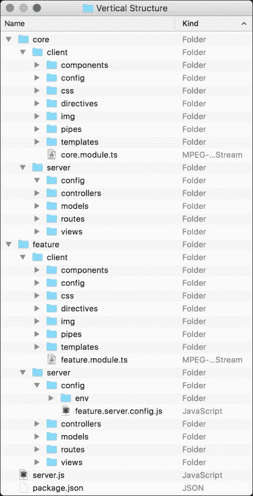
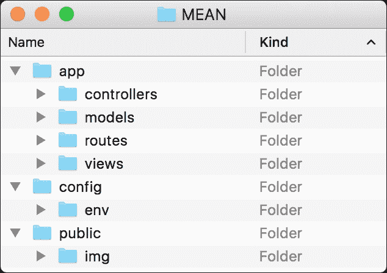

# 三、构建一个 Express Web 应用

本章将介绍构建第一个 Express 应用的正确方法。 首先，您将安装和配置 Express 模块，然后学习 Express 的主要 api。 我们将讨论 Express 请求、响应和应用对象，并学习如何使用它们。 然后，我们将介绍 Express 路由机制并学习如何正确地使用它。 我们还将讨论应用文件夹的结构，以及如何为不同的项目类型使用不同的结构。 在本章结束时，您将学习如何构建一个完整的 Express 应用。 在本章中，我们将涵盖以下主题:

*   安装 Express 并创建一个新的 Express 应用
*   组织项目结构
*   配置 Express 应用
*   使用快速路由机制
*   呈现 EJS 视图
*   提供静态文件
*   配置 Express 会话

# 介绍 Express

对说 TJ Holowaychuk 是一个多产的开发者是一种保守的说法。 TJ 在 Node.js 社区的参与度几乎是其他开发人员无法匹敌的，他拥有超过 500 个开源项目，负责 JavaScript 生态系统中一些最流行的框架。

他最伟大的项目之一是Express web 框架。 为了保持 Node.js 风格，Express 框架是一组很小的常见 web 应用特性。 它构建在 Connect 之上，并利用了它的中间件体系结构。 它的特性扩展了 Connect 以允许各种常见的 web 应用用例，例如包含模块化 HTML 模板引擎、扩展响应对象以支持各种数据格式输出、路由系统等等。

到目前为止，我们使用单个`server.js`文件来创建我们的应用。 然而，在使用 Express 时，您将了解更多关于更好的项目结构、正确配置应用以及将应用逻辑划分为不同模块的信息。 您还将了解如何使用 EJS 模板引擎、管理会话和添加路由方案。 在本节结束时，您将拥有一个可工作的应用框架，您将在本书的其余部分中使用它。 让我们开始创建第一个 Express 应用的旅程。

# 快速安装

在之前，我们使用 npm 直接为我们的 Node应用安装外部模块。 当然，你可以使用这种方法并通过输入以下命令来安装 Express:

```js
$ npm install express

```

然而，直接安装模块并不是真正可伸缩的。 考虑一下:您将在应用中使用许多 Node 模块，在工作环境之间传输它，并可能与其他开发人员共享它。 因此，以这种方式安装项目模块将很快成为一项可怕的任务。 相反，您应该开始使用`package.json`文件，该文件组织项目元数据并帮助您管理应用依赖项。 首先创建一个新的工作文件夹和其中的一个新的`package.json`文件，其中包含以下代码片段:

```js
{
  "name" : "MEAN",
  "version" : "0.0.3",
  "dependencies" : {
    "express" : "4.14.0"
  }
}
```

在`package.json`文件中，请注意您包含了三个属性:应用的名称和版本，以及 dependencies 属性，它定义了在应用运行之前应该安装哪些模块。 要安装应用依赖项，请使用命令行工具并导航到应用文件夹，然后发出以下命令:

```js
$ npm install

```

npm 会安装 Express 模块，因为目前它是你的`package.json`文件中定义的唯一依赖项。

# 创建您的第一个 Express 应用

在创建`package.json`文件并安装依赖项之后，您可以通过添加您已经熟悉的`server.js`文件和以下代码行来创建您的第一个 Express 应用:

```js
const express = require('express');
const app = express();

app.use('/', (req, res) => {
  res.status(200).send('Hello World');
});

app.listen(3000);
console.log('Server running at http://localhost:3000/');

module.exports = app;
```

你应该已经识别了大部分代码。 前两行需要 Express 模块并创建一个新的 Express 应用对象。 然后，我们使用`app.use()`方法挂载一个带有特定路径的中间件函数，使用`app.listen()`方法告诉 Express 应用监听端口`3000`。 请注意如何使用`module.exports`对象返回`app`对象。 这将在稍后帮助您加载和测试 Express 应用。

您也应该熟悉这个新代码，因为它类似于您在前面的 Connect 示例中使用的代码。 这是因为 Express 以几种方式包装了 Connect 模块。 `app.use()`方法用于挂载一个中间件函数，该函数将响应对根路径发出的任何 HTTP 请求。 在中间件函数内部，然后使用`res.status()`方法设置 HTTP 响应代码，然后使用`res.send()`方法将响应发送回。 `res.send()`方法基本上是一个 Express 包装器，它根据响应对象类型设置 Content-Type 报头，然后使用 Connect`res.end()`方法发送响应。

### 注意事项

当传递一个缓冲区给`res.send()`方法时，Content-Type 头文件将被设置为`application/octet-stream`; 当传递一个字符串时，它将被设置为`text/html`; 当传递对象或数组时，它将被设置为`application/json`。

要运行你的应用，只需在你的命令行工具中执行以下命令:

```js
$ node server

```

恭喜你! 您已经创建了第一个 Express 应用。 您可以在浏览器中访问`http://localhost:3000`来测试它。

# 应用、请求和响应对象

Express 表示三个你会经常使用的主要对象。 应用对象是您在第一个示例中创建的 Express 应用的实例，通常用于配置应用。 请求对象是 Node 的 HTTP 请求对象的包装器，用于提取关于当前处理的 HTTP 请求的信息。 响应对象是 Node 的 HTTP 响应对象的包装器，用于设置响应数据和报头。

## 应用对象

应用对象包含以下方法来帮助您配置应用:

*   `app.set(name, value)`:这是一个用于设置环境变量的方法，Express 将在其配置中使用这些环境变量。
*   `app.get(name)`:这是一个方法，用于获取 Express 在其配置中使用的环境变量。
*   `app.engine(ext, callback)`:这是一个用来定义给定模板引擎来渲染特定文件类型的方法; 例如，您可以告诉 EJS 模板引擎像这样使用 HTML 文件作为模板:`app.engine('html', require('ejs').renderFile)`。
*   `app.locals`:这是一个属性，用于向所有呈现的模板发送应用级变量。
*   `app.use([path], callback)`:这是一种用于创建 Express 中间件以处理发送到服务器的 HTTP 请求的方法。 您可以选择挂载中间件来响应特定的路径。
*   `app.VERB(path, [callback...], callback)`:这用于定义一个或多个中间件函数，以响应与声明的 HTTP 谓词一起对特定路径发出的 HTTP 请求。 例如，当您想要响应使用 GET 谓词的请求时，您可以使用`app.get()`方法分配中间件。 对于 POST 请求，您将使用`app.post()`，等等。
*   `app.route(path).VERB([callback...], callback)`:这是一种方法，用于定义一个或多个中间件功能，与多个 HTTP 动词一起响应对某个统一路径发出的 HTTP 请求。 例如，当您想要响应使用 GET 和 POST 谓词的请求时，您只需使用`app.route(path).get(callback).post(callback)`分配适当的中间件功能。
*   `app.param([name], callback)`:这是一种方法，用于将特定功能附加到对包含特定路由参数的路径发出的任何请求上。 例如，您可以使用`app.param('userId', callback)`将逻辑映射到任何包含`userId`参数的请求。

您可以使用更多的应用方法和属性，但是使用这些通用的基本方法使开发人员能够以他们认为合理的任何方式扩展 Express。

## 请求对象

请求对象还提供了一些帮助方法，其中包含您需要的关于当前 HTTP 请求的信息。 请求对象的关键属性和方法如下:

*   `req.query`:这是一个属性，包含已解析的查询字符串参数。
*   `req.params`:这是一个包含解析路由参数的属性。
*   `req.body`:这是一个用于检索已解析请求体的属性。 它包含在`bodyParser()`中间件中。
*   `req.path`/`req.hostname`/`req.ip`:这些用于检索当前请求路径、主机名和远程 IP。
*   `req.cookies`:这个是一个与`cookieParser()`中间件一起使用的属性，用来检索用户代理发送的 cookie。

request 对象包含了更多的方法和属性，我们将在本书的后面讨论，但这些方法是你通常在一个普通的 web 应用中使用的。

## 响应对象

在开发 Express 应用时，经常使用响应对象，因为发送到服务器的任何请求都将使用响应对象方法进行处理和响应。 它有几个关键的方法，如:

*   `res.status(code)`:这个是用来设置响应 HTTP 状态码的方法。
*   `res.set(field, [value])`:用于设置响应 HTTP 报头的方法。
*   `res.cookie(name, value, [options])`:设置响应 cookie 的方法。 options 参数用于传递一个对象，该对象定义了常见的 cookie 配置，比如`maxAge`属性。
*   `res.redirect([status], url)`:这是一个将请求重定向到给定 URL 的方法。 注意，您可以在响应中添加 HTTP 状态码。 当没有传递状态码时，它将被默认为`302 Found`。
*   `res.status([status]).send( [body])`:这是一种用于非流式响应的方法。 它做了很多后台工作，比如设置 Content-Type 和 Content-Length 头信息，并使用适当的缓存头信息进行响应。
*   `res.status([status]).json( [body])`:与发送对象或数组时的`res.send()`方法相同。 大多数时候，它被用作语法糖，但有时您可能需要使用它强制对非对象(如`null`或`undefined`)进行 JSON 响应。
*   `res.render(view, [locals], callback)`:这是一种用于呈现视图并发送HTML 响应的方法。

响应对象还包含更多的方法和属性，以处理不同的响应场景，您将在本书后面了解这些内容。

# 外部中间件

Express 核心是最小的，但其背后的团队提供了各种预定义的中间件来处理常见的 web 开发特性。 这些类型的中间件在大小和功能上各不相同，并对 Express 进行了扩展以提供更好的框架支持。 目前流行的 Express 中间件如下:

*   `morgan`:这个是一个HTTP 请求记录器中间件。
*   `body-parser`:这是一个体解析中间件，用于解析请求体，它支持各种请求类型。
*   `method-override`:这是一个中间件，它在客户端不支持的地方提供HTTP 谓词支持，例如 PUT 或 DELETE。
*   `compression`:这是一个压缩中间件，使用 GZIP/deflate 压缩响应数据。
*   `express.static`:这是一个中间件，用于服务静态文件。
*   `cookie-parser`:这是一个填充`req.cookies`对象的cookie 解析中间件。
*   `Session`:这是一个会话中间件，用于支持持久会话。

有很多类型的 Express 中间件可以帮助您缩短开发时间，同时使用大量的第三方中间件。

### 注意事项

要了解更多关于Connect 和 Express 中间件的信息，请访问 Connect 模块的官方存储库页面[https://github.com/senchalabs/connect#middleware](https://github.com/senchalabs/connect#middleware)。 如果您想浏览第三方中间件集合，请访问 Connect 的 wiki 页面[https://github.com/senchalabs/connect/wiki](https://github.com/senchalabs/connect/wiki)。

# 实现 MVC 模式

Express框架是模式无关的，这意味着它不像其他一些 web 框架那样支持任何预定义的语法或结构。 将 MVC 模式应用于 Express 应用意味着您可以创建特定的文件夹，将 JavaScript 文件以特定的逻辑顺序放置在其中。 所有这些文件基本上都是作为逻辑单元的 CommonJS 模块。 例如,模型将 CommonJS 模块包含一个定义的Mongoose模型放置在`models`文件夹,视图将 HTML 或其他模板文件放置在`views`文件夹,和控制器将 CommonJS 模块与功能方法放在`controllers`文件夹。 为了更好地说明这一点，现在应该讨论不同类型的应用结构。

## 应用文件夹结构

我们在前面讨论了开发实际应用时的更好实践，其中我们建议使用`package.json`文件，而不是直接安装模块。 然而，这仅仅是个开始; 一旦继续开发应用，您很快就会发现自己想知道如何安排项目文件并将它们分解为代码的逻辑单元。 一般来说，JavaScript 和 Express 框架并不知道应用的结构，因为您可以轻松地将整个应用放在一个 JavaScript 文件中。 这是因为没有人期望 JavaScript 成为一种全栈编程语言，但这并不意味着您不应该特别关注项目的组织。 由于 MEAN 堆栈可用于构建各种大小和复杂性不同的应用，因此也可以以各种方式处理项目结构。 决策通常与应用的估计复杂性直接相关。 例如,简单的项目可能需要一个更精简文件夹结构,它的优点是清晰和易于管理,而复杂的项目将通常需要一个更复杂的逻辑,因为它的结构和更好的分解将包括许多特性和一个更大的团队合作项目。 为了简化这个讨论，将其分为两种主要方法是合理的:对于较小的项目是水平结构，对于功能丰富的应用是垂直结构。 让我们从一个简单的水平结构开始。

### 水平文件夹结构

水平项目结构基于文件夹和文件的功能角色划分，而不是根据它们实现的特性划分，这意味着所有应用文件都放在包含 MVC 文件夹结构的主应用文件夹中。 这还意味着有一个包含所有应用控制器的单一`controllers`文件夹，一个包含所有应用模型的单一`models`文件夹，以此类推。 水平应用结构的示例如下:


让我们回顾一下文件夹结构:

*   `app`文件夹是存放 Express 应用逻辑的地方，为了符合 MVC 模式，它被分为以下几个文件夹，代表了功能的分离:
    *   `controllers`文件夹是您保存 Express 应用控制器的地方
    *   `models`文件夹是您保存 Express 应用模型的地方
    *   `routes`文件夹是您保存 Express 应用路由中间件的地方
    *   `views`文件夹是您保存 Express 应用视图的地方
*   `config`文件夹是存放 Express 应用配置文件的地方。 最后，您将向应用添加更多模块，每个模块都将在专用的 JavaScript 文件中进行配置，该文件位于此文件夹中。 目前，它包含几个文件和文件夹，它们如下:
    *   您可以将 Express 应用环境的配置文件放在`env`文件夹中
    *   `config.js`文件是您配置 Express 应用的位置
    *   `express.js`文件是您初始化 Express 应用的位置
*   `public`文件夹是存放静态客户端文件的地方，为了符合 MVC 模式，它被划分为以下文件夹，代表了功能的分离:
    *   `config`文件夹是你存放 Angular 应用配置文件的地方
    *   `components`文件夹是你存放 Angular 应用组件的地方
    *   `css`文件夹是您保存 CSS 文件的地方
    *   `directives`文件夹是你存放 Angular 应用指令的地方
    *   `pipes`文件夹是你存放 Angular 应用管道的地方
    *   `img`文件夹是您保存映像文件的地方
    *   `templates`文件夹是你存放 Angular 应用模板的地方
    *   `bootstrap.ts`文件是你初始化 Angular 应用的地方
*   `package.json`文件是帮助您组织应用依赖关系的元数据文件。
*   `server.js`文件是 Node.js 应用的主文件，它将以模块的形式加载`express.js`文件，以引导您的 Express 应用。

如您所见，水平文件夹结构对于特性数量有限的小型项目非常有用，这样可以方便地将文件放在代表其一般角色的文件夹中。 然而，为了处理大型项目，您将有许多文件处理某些特性，这可能过于简单了。 在这种情况下，每个文件夹可能被过多的文件所重载，而您将在混乱中迷失。 更好的方法是使用垂直文件夹结构。

### 垂直文件夹结构

垂直的项目结构是基于文件夹和文件按其实现的特性进行划分的，这意味着每个特性都有自己的包含 MVC 文件夹结构的自主文件夹。 垂直应用结构的一个示例如下:



如您所见，每个特性都有自己的类似应用的文件夹结构。 在本例中，我们有包含主应用文件的`core feature`文件夹，以及包含特性文件的`feature`文件夹。 一个示例特性是包含身份验证和授权逻辑的用户管理特性。 为了更好地理解这一点，让我们回顾一个特性的文件夹结构:

*   `server`文件夹是存放特性服务器逻辑的地方，为了符合 MVC 模式，它被分为以下几个文件夹，代表功能的分离:
    *   `controllers`文件夹用于存放特性的 Express 控制器
    *   `models`文件夹是您保存特性的 Express 模型的地方
    *   `routes`文件夹是您保存特性的 Express 路由中间件的地方
    *   `views`文件夹是您保存特性的 Express 视图的地方
    *   `config`文件夹是您保存特性服务器配置文件的地方
    *   `env`文件夹用于保存特性的环境服务器配置文件
    *   `feature.server.config.js`文件是配置特性的地方
*   `client`文件夹是你存放特性客户端文件的地方，为了符合 MVC 模式，它被划分为以下文件夹，代表功能的分离:
    *   `config`文件夹是你保存特性的 Angular 配置文件的地方
    *   `components`文件夹是你存放特性 Angular`components`的地方。
    *   `css`文件夹是您保存特性 CSS 文件的地方
    *   `directives`文件夹是你存放特性 Angular 指令的地方
    *   `pipes`文件夹是你存放特性 Angular 管道的地方
    *   `img`文件夹是您保存特性图像文件的地方
    *   `templates`文件夹是你保存特性的 Angular 模板的地方
    *   `feature.module.ts`文件是你初始化特性的 Angular 模块的地方

如您所见，垂直文件夹结构对于大型项目非常有用，因为这些项目的特性数量是无限的，每个特性都包含大量的文件。 它将允许大型团队一起工作，并分别维护每个功能，它也可以在不同应用之间共享功能。

尽管这是大多数应用结构的和两种不同类型，但实际上 MEAN 堆栈可以以许多不同的方式组装。 团队甚至可能结合这两种方法来构建他们的项目; 因此，从本质上讲，由项目负责人决定使用哪种结构。 在本书中，为了简单起见，我们将使用水平方法，但我们将以垂直方式将应用中的 Angular 部分合并，以演示 MEAN 堆栈结构的灵活性。 请记住，本书中的所有内容都可以很容易地进行重组，以适应您的项目规范。

### 文件命名约定

在开发您的应用时，您很快就会注意到最终会得到许多同名的文件。 原因是 MEAN 应用通常为 Express 和 Angular 组件都有一个并行的 MVC 结构。 要理解这个问题，看看一个常见的垂直特性的文件夹结构:


如您所见，强制使用文件夹结构可以帮助您理解每个文件的功能，但也会导致多个文件具有相同的名称。 这是因为应用的特性通常是使用几个 JavaScript 文件实现的，每个文件都有不同的角色。 这个问题可能会给开发团队带来一些困惑，因此要解决这个问题，您需要使用某种命名约定。

最简单的解决方案是将每个文件的功能角色添加到文件名中。 因此，特征控制器文件将被命名为`feature.controller.js`，特征模型文件将被命名为`feature.model.js`，以此类推。 然而，当你考虑到 MEAN 应用在 Express 和 Angular 应用中都使用 JavaScript MVC 文件时，事情就变得更加复杂了。 这意味着您经常会有两个具有相同名称的文件。 要解决这个问题，还建议您扩展文件名及其执行目的地。 乍一看，这可能有点过分，但您很快就会发现，快速识别应用文件的角色和执行目的地非常有帮助。

### 注意事项

重要的是要记住这是一个最佳实践惯例。 您可以轻松地用您自己的关键词替换`controller`、`model`、`client`和`server`关键词。

### 实现水平文件夹结构

要开始你的第一个 MEAN 项目的结构，创建一个新的项目文件夹，其中包含以下文件夹:



一旦你创建了前面所有的文件夹，回到应用的根文件夹并创建一个包含以下代码片段的`package.json`文件:

```js
{
  "name" : "MEAN",
  "version" : "0.0.3",
  "dependencies" : {
    "express" : "4.14.0"
  }
}
```

现在，在`app/controllers`文件夹中，用以下代码行创建一个名为`index.server.controller.js`的文件:

```js
exports.render = function(req, res) {
  res.status(200).send('Hello World');
};
```

恭喜你! 您刚刚创建了您的第一个 Express 控制器。 这段代码看起来可能非常熟悉; 这是因为它是您在前面的示例中创建的中间件的副本。 这里要做的是使用 CommonJS 模块模式定义一个名为`render()`的函数。 稍后，您将能够获得这个模块并使用这个函数。 一旦创建了控制器，就需要使用 express 路由功能来利用控制器。

#### 处理请求路由

Express 支持使用`app.route(path).VERB(callback)`方法或`app.VERB(path, callback)`方法的路由请求，其中`VERB`应该用小写的 HTTP 动词替换。 看看下面的例子:

```js
app.get('/', (req, res) => {
  res.status(200).send('This is a GET request');
});
```

这告诉 Express 使用`GET`动词对任何 HTTP 请求执行中间件函数并指向根路径。 如果你想处理`POST`请求，你的代码应该如下:

```js
app.post('/', (req, res) => {
  res.status(200).send('This is a POST request');
});
```

但是，Express 还允许您定义单个路由，然后链接多个中间件来处理不同的 HTTP 请求。 这意味着前面的代码示例也可以写成如下形式:

```js
app.route('/').get((req, res) => {
  res.status(200).send('This is a GET request');
}).post((req, res) => {
  res.status(200).send('This is a POST request');
});
```

Express 的另一个很酷的特性是它能够将多个中间件链接到单个路由定义中。 这意味着将按顺序调用中间件函数，并将它们传递给下一个中间件，以便您可以确定如何继续执行中间件。 这通常用于在执行响应逻辑之前验证请求。 为了更好地理解这一点，看看下面的代码:

```js
const express = require('express');

function hasName(req, res, next) {
 if (req.param('name')) {
 next();
 } else {
 res.status(200).send('What is your name?');
 }
};

function sayHello(req, res, next) {
 res.status(200).send('Hello ' + req.param('name'));
}

const app = express();
app.get('/', hasName, sayHello);

app.listen(3000);
console.log('Server running at http://localhost:3000/');
```

在上述代码中，有两个中间件函数，分别为`hasName()`和`sayHello()`。 `hasName()`中间件正在寻找`name`参数; 如果它找到一个定义的`name`参数，它将使用下一个参数调用下一个中间件函数。 否则，`hasName()`中间件将自己处理响应。 在这种情况下，下一个中间件功能将是`sayHello()`中间件功能。 这是可能的，因为我们使用`app.get()`方法在一行中添加了中间件功能。 中间件函数的顺序也值得注意，因为它决定了哪个中间件函数首先执行。

这个示例很好地演示了如何使用路由中间件在确定响应应该是什么时执行不同的验证。 当然，您可以利用此功能执行其他任务，例如验证用户身份验证和资源授权。 但是现在，让我们继续我们的示例。

#### 添加路由文件

您将要创建的下一个文件是您的第一个路由文件。 在`app/routes`文件夹中，创建一个名为`index.server.routes.js`的文件，其中包含以下代码片段:

```js
module.exports = function(app) {
    const index = require('../controllers/index.server.controller');
 app.get('/', index.render);
};
```

在这里，你做了一些事情。 首先，您再次使用了 CommonJS 模块模式。 您可能还记得，CommonJS 模块模式既支持导出多个函数，比如您对控制器所做的，又支持使用单个模块函数，比如您在这里所做的。 接下来，您需要您的`index`控制器，并使用它的`render()`方法作为中间件来获取向根路径发出的请求。

### 注意事项

路由模块函数接受一个名为`app`的参数，因此在调用该函数时，需要将 Express 应用的实例传递给它。

剩下的要做的就是创建 Express 应用对象，并使用刚才创建的控制器和路由模块引导它。 要做到这一点，进入`config`文件夹，用以下代码片段创建一个名为`express.js`的文件:

```js
const express = require('express');

module.exports = function() {
  const app = express();
 require('../app/routes/index.server.routes.js')(app);
  return app;
};
```

在前面的代码片段中，您需要 Express 模块，然后使用 CommonJS 模块模式定义一个用于初始化 Express 应用的`module`函数。 首先，它创建一个 Express 应用的新实例，然后它需要您的路由文件并将其作为函数调用，并将应用实例作为参数传递给它。 路由文件将使用应用实例创建一个新的路由配置，然后调用控制器的`render()`方法。 函数以返回应用实例结束。

### 注意事项

`express.js`文件是我们配置 Express 应用的地方。 这里是添加与 Express 配置相关的所有内容的地方。

要完成您的应用，您需要在根文件夹中创建一个名为`server.js`的文件，并复制以下代码:

```js
const configureExpress = require('./config/express');

const app = configureExpress();
app.listen(3000);
module.exports = app;

console.log('Server running at http://localhost:3000/');
```

这就是它! 在主应用文件中，通过需要 Express 配置模块，然后使用它检索应用对象实例并侦听端口`3000`，您连接了所有未完成的工作。

要启动应用，请使用命令行工具导航到应用的根文件夹，并使用`npm`安装应用的依赖项，如下所示:

```js
$ npm install

```

一旦安装进程结束，你所要做的就是使用 Node 的命令行工具启动你的应用:

```js
$ node server 

```

您的 Express 应用现在应该运行了! 要测试它，请导航到`http://localhost:3000`。

在本例中，您了解了如何正确地构建 Express 应用。 注意使用 CommonJS 模块模式创建文件并在整个应用中要求它们的不同方式是很重要的。 这种模式在本书中经常重复出现。

# 配置 Express 应用

Express提供了一个非常简单的配置系统，允许您向 Express 应用添加某些功能。 虽然有一些预定义的配置选项，您可以更改这些选项来操纵它的工作方式，但您也可以添加自己的键/值配置选项以用于任何其他用途。 Express 的另一个健壮特性是它能够根据应用运行的环境配置应用。 例如，您可能希望在开发环境中而不是在生产环境中使用 Express 日志程序，而在生产环境中运行时压缩响应体似乎是个好主意。

要实现这一点，您需要使用`process.env`属性。 `process.env`是一个全局变量，允许您访问预定义的环境变量，最常见的是`NODE_ENV`环境变量。 环境变量通常用于特定于环境的配置。 为了更好地理解这一点，让我们回到前面的示例并添加一些外部中间件。 要使用此中间件，首先需要下载并将其作为项目依赖项进行安装。

为此，编辑您的`package.json`文件，使其看起来像以下代码片段:

```js
{
  "name": "MEAN",
  "version": "0.0.3",
  "dependencies": {
 "body-parser": "1.15.2",
 "compression": "1.6.0",
    "express": "4.14.0",
 "method-override": "2.3.6",
 "morgan": "1.7.0"
  }
}
```

正如我们前面所述,`morgan`模块提供了一个简单的日志记录器中间件,`compression`模块提供响应压缩,`body-parser`模块提供了一些中间件处理请求数据,和`method-override`模块提供`DELETE`和`PUT`支持 HTTP 动词的遗产。 要使用这些模块，您将需要修改您的`config/express.js`文件，使其看起来像以下代码片段:

```js
const express = require('express');
const morgan = require('morgan');
const compress = require('compression');
const bodyParser = require('body-parser');
const methodOverride = require('method-override');

module.exports = function() {
  const app = express();

 if (process.env.NODE_ENV === 'development') {
 app.use(morgan('dev'));
 } else if (process.env.NODE_ENV === 'production') {
 app.use(compress());
 }

 app.use(bodyParser.urlencoded({
 extended: true
 }));
 app.use(bodyParser.json());
 app.use(methodOverride());

  require('../app/routes/index.server.routes.js')(app);

  return app;
};
```

如您所见，我们只是使用了`process.env.NODE_ENV`变量来确定环境并相应地配置 Express 应用。 我们只是使用`app.use()`方法在开发环境中加载`morgan()`中间件，在生产环境中加载`compress()`中间件。 无论环境如何，`bodyParser.urlencoded()`、`bodyParser.json()`和`methodOverride()`中间件都将始终加载。

要完成您的配置，您需要将您的`server.js`文件更改为如下代码片段:

```js
process.env.NODE_ENV = process.env.NODE_ENV || 'development';

const configureExpress = require('./config/express');

const app = configureExpress();
app.listen(3000);
module.exports = app;

console.log('Server running at http://localhost:3000/');
```

注意，如果`process.env.NODE_ENV`变量不存在，变量是如何被设置为默认的`development`值的。 这是因为`NODE_ENV`环境变量的设置通常不正确。

### 提示

建议在运行应用之前在操作系统中设置 NODE_ENV 环境变量。

在 Windows 环境中，这可以通过在命令提示符中执行以下命令来完成:

```js
> set NODE_ENV=development
```

在基于 unix 的环境中，您应该简单地使用以下导出命令:

```js
$ export NODE_ENV=development
```

要测试你的更改，使用命令行工具导航到你的应用的根文件夹，并使用`npm`安装你的应用依赖项，如下所示:

```js
$ npm install

```

一旦安装过程结束，你所要做的就是使用 Node 的命令行工具启动你的应用:

```js
$ node server

```

您的 Express 应用现在应该运行了! 要测试它，导航到`http://localhost:3000`，您将能够在命令行输出中看到记录器正在运行。 然而，在处理更复杂的配置选项时，可以以更复杂的方式使用`process.env.NODE_ENV`环境变量。

## 环境配置文件

在您的应用开发过程中，您常常需要配置第三方模块，使其在不同的环境中以不同的方式运行。 例如，当您连接到 MongoDB 服务器时，您可能会在开发和生产环境中使用不同的连接字符串。 在当前设置中这样做可能会导致您的代码充满无数的`if`语句，这通常会更难维护。 要解决此问题，您可以管理一组包含这些属性的环境配置文件。 然后，您将能够使用`process.env.NODE_ENV`环境变量来确定要加载哪个配置文件，从而使您的代码更短，更容易维护。 让我们首先为默认开发环境创建一个配置文件。 为此，在`config/env`文件夹中创建一个新文件，并将其命名为`development.js`。 在你的新文件中，粘贴以下代码行:

```js
module.exports = {
  // Development configuration options
};
```

正如你所看到的，你的配置文件目前只是一个空的 CommonJS 模块初始化。 别担心; 我们很快就会添加第一个配置选项，但是首先，我们需要管理配置文件的加载。 为此，转到应用的`config`文件夹并创建一个名为`config.js`的新文件。 在你的新文件中，粘贴以下代码行:

```js
module.exports = require('./env/' + process.env.NODE_ENV + '.js');
```

如您所见，该文件只是根据`process.env.NODE_ENV`环境变量加载正确的配置文件。 在接下来的章节中，我们将使用这个文件，它将为我们加载正确的环境配置文件。 要管理其他环境配置，您只需要添加一个专用的环境配置文件并正确设置`NODE_ENV`环境变量。

# 渲染视图

web 框架的一个非常常见的特性是能够呈现视图。 基本概念是将您的数据传递给模板引擎，该引擎将呈现最终的视图(通常是 HTML)。 在 MVC 模式中，控制器使用模型检索数据部分，使用视图模板呈现 HTML 输出，如下图所示。 Express 可扩展方法允许使用许多 Node.js 模板引擎来实现此功能。 在本节中，我们将使用 EJS 模板引擎，但是稍后您可以用其他模板引擎替换它。 下图显示了渲染应用视图时的 MVC 模式:


Express 有两个方法来呈现视图:`app.render()`，它用于呈现视图，然后将 HTML 传递给回调函数;还有一个更常见的方法`res.render()`，它在本地呈现视图并将 HTML 作为响应发送。 您将更频繁地使用`res.render()`，因为您通常希望输出 HTML 作为响应。 但是，例如，如果您希望应用发送 HTML 电子邮件，您可能会使用`app.render()`。 在开始研究`res.render()`方法之前，让我们先配置视图系统。

## 配置视图系统

为了配置Express 视图系统，您将需要使用 EJS 模板引擎。 让我们回到我们的示例并安装 EJS 模块。 你应该开始改变你的`package.json`文件，看起来像以下代码片段:

```js
{
  "name": "MEAN",
  "version": "0.0.3",
  "dependencies": {
    "body-parser": "1.15.2",
    "compression": "1.6.0",
 "ejs": "2.5.2",
    "express": "4.14.0",
    "method-override": "2.3.6",
    "morgan": "1.7.0"  }
}
```

现在，通过在命令行中导航到项目的根文件夹，并发出以下命令来安装 EJS 模块:

```js
$ npm update

```

在 npm 完成 EJS 模块的安装后，你就可以将 Express 配置为使用它作为默认模板引擎。 要配置您的 Express 应用，请回到`config/express.js`文件，并将其更改为如下代码行:

```js
const express = require('express');
const morgan = require('morgan');
const compress = require('compression');
const bodyParser = require('body-parser');
const methodOverride = require('method-override');

module.exports = function() {
  const app = express();
  if (process.env.NODE_ENV === 'development') {
    app.use(morgan('dev'));
  } else if (process.env.NODE_ENV === 'production') {
    app.use(compress());
  }

  app.use(bodyParser.urlencoded({
    extended: true
  }));
  app.use(bodyParser.json());
  app.use(methodOverride());

  app.set('views', './app/views');
  app.set('view engine', 'ejs');

  require('../app/routes/index.server.routes.js')(app);

  return app;
};
```

注意我们如何使用`app.set()`方法来配置 Express 应用`view`文件夹和模板引擎。 让我们创建第一个视图。

## 呈现 EJS 视图

EJS 视图基本上由和`EJS`标签混合的 HTML 代码组成。 EJS 模板将驻留在`app/views`文件夹中，并且具有`.ejs`扩展名。 当您使用`res.render()`方法时，EJS 引擎将在`views`文件夹中查找模板，如果找到符合要求的模板，它将呈现 HTML 输出。 要创建第一个 EJS 视图，请转到`app/views`文件夹并创建一个名为`index.ejs`的新文件，该文件包含以下 HTML 代码片段:

```js
<!DOCTYPE html>
<html>
  <head>
    <title><%= title %></title>
  </head>
  <body>
    <h1><%= title %></h1>
  </body>
</html>
```

除了`<%= %>`标记之外，您应该对这段代码非常熟悉。 这些标记用于告诉 EJS 模板引擎将模板变量呈现在何处——在本例中是`title`变量。 剩下要做的就是配置控制器来呈现此模板，并自动将其作为 HTML 响应输出。 要做到这一点，回到您的`app/controllers/index.server.controller.js`文件，并将其更改为如下代码片段:

```js
exports.render = function(req, res) {
  res.render('index', {
    title: 'Hello World'
  });
};
```

注意`res.render()`方法的使用方式。 第一个参数是不带`.ejs`扩展名的 EJS 模板的名称，第二个参数是一个包含模板变量的对象。 `res.render()`方法将使用 EJS 模板引擎在`config/express.js`文件中设置的`views`文件夹中查找文件，然后使用模板变量呈现视图。 要测试您的更改，使用命令行工具并发出以下命令:

```js
$ node server

```

做得好; 您已经创建了第一个 EJS 视图! 通过访问`http://localhost:3000`来测试应用，在那里可以查看呈现的 HTML。

js 视图易于维护，并且提供了一种创建应用视图的简单方法。 在本书的后面，我们会详细介绍一些关于 EJS 模板的内容，但不会像你期望的那么多，因为在 MEAN 应用中，大多数 HTML 渲染都是在客户端使用 Angular 完成的。

# 服务静态文件

在任何 web应用中，总是需要提供静态文件。 幸运的是，Express 唯一内置的中间件是`express.static()`中间件，它提供了这个特性。 要在前面的示例中添加静态文件支持，只需在您的`config/express.js`文件中进行以下更改:

```js
const express = require('express');
const morgan = require('morgan');
const compress = require('compression');
const bodyParser = require('body-parser');
const methodOverride = require('method-override');

module.exports = function() {
  const app = express();
  if (process.env.NODE_ENV === 'development') {
    app.use(morgan('dev'));
  } else if (process.env.NODE_ENV === 'production') {
    app.use(compress());
  }

  app.use(bodyParser.urlencoded({
    extended: true
  }));
  app.use(bodyParser.json());
  app.use(methodOverride());

  app.set('views', './app/views');
  app.set('view engine', 'ejs'); 

  require('../app/routes/index.server.routes.js')(app); 

  app.use(express.static('./public'));

  return app;
};
```

`express.static()`中间件接受一个参数来确定`static`文件夹的位置。 请注意，`express.static()`中间件是如何放置在路由文件的调用下面的。 这个顺序很重要，因为如果它在它上面，Express 将首先尝试在`static files`文件夹中寻找 HTTP 请求路径。 这将使响应变慢很多，因为它将不得不等待文件系统 I/O 操作。

要测试你的静态中间件，在`public/img`文件夹中添加一个名为`logo.png`的映像，然后在`app/views/index.ejs`文件中做以下更改:

```js
<!DOCTYPE html>
<html>
  <head>
    <title><%= title %></title>
  </head>
  <body>
    
    <h1><%= title %></h1>
  </body>
</html>
```

现在，使用 Node 的命令行工具运行你的应用:

```js
$ node server

```

要测试结果，请在浏览器中访问`http://localhost:3000`，并观察 Express 如何将图像作为静态文件提供服务。

# 配置会话

会话是一种常见的 web 应用模式，它允许您在用户访问您的应用时跟踪用户的行为。 要添加此功能，您需要安装并配置`express-session`中间件。 要做到这一点，首先修改你的`package.json`文件，如下所示:

```js
{
  "name": "MEAN",
  "version": "0.0.3",
  "dependencies": {
    "body-parser": "1.15.2",
    "compression": "1.6.0",
    "ejs": "2.5.2",
    "express": "4.14.0",
 "express-session": "1.14.1",
    "method-override": "2.3.6",
    "morgan": "1.7.0"
  }
}
```

然后，安装`express-session`模块，导航到你的项目根目录下的命令行，并发出以下命令:

```js
$ npm update

```

安装过程完成后，您就可以配置 Express 应用以使用`express-session`模块。 `express-session`模块将使用 cookie 存储的签名标识符来标识当前用户。 为了签名会话标识符，它将使用一个秘密字符串，这将有助于防止恶意的会话篡改。 出于安全原因，建议对每个环境使用不同的 cookie 秘密，这意味着这将是使用我们的环境配置文件的合适位置。 为此，将`config/env/development.js`文件更改为如下代码片段:

```js
module.exports = {
  sessionSecret: 'developmentSessionSecret'
};
```

因为这只是一个示例，所以可以随意更改秘密字符串。 对于其他环境，只需在其环境配置文件中添加`sessionSecret`属性。 要使用配置文件并配置您的 Express 应用，请回到您的`config/express.js`文件并将其更改为如下代码片段:

```js
const config = require('./config');
const express = require('express');
const morgan = require('morgan');
const compress = require('compression');
const bodyParser = require('body-parser');
const methodOverride = require('method-override');
const session = require('express-session');

module.exports = function() {
  const app = express();

  if (process.env.NODE_ENV === 'development') {
    app.use(morgan('dev'));
  } else if (process.env.NODE_ENV === 'production') {
    app.use(compress());
  }

  app.use(bodyParser.urlencoded({
    extended: true
  }));
  app.use(bodyParser.json());
  app.use(methodOverride());

  app.use(session({
    saveUninitialized: true,
    resave: true,
    secret: config.sessionSecret
  }));

  app.set('views', './app/views');
  app.set('view engine', 'ejs');

  app.use(express.static('./public'));

  require('../app/routes/index.server.routes.js')(app); 

  return app;
};
```

请注意，配置对象是如何传递到`express.session()`中间件的。 在这个配置对象中，`secret`属性是使用您之前修改的配置文件定义的。 会话中间件向应用中的所有请求对象添加一个会话对象。 使用此会话对象，您可以设置或获取希望在当前会话中使用的任何属性。 要测试会话，请按如下方式更改`app/controller/index.server.controller.js`文件:

```js
exports.render = function(req, res) {
  if (req.session.lastVisit) {
    console.log(req.session.lastVisit);
  }

  req.session.lastVisit = new Date();

  res.render('index', {
    title: 'Hello World'
  });
};
```

这里所做的基本上是记录最后一个用户请求的时间。 控制器检查`session`对象中是否设置了`lastVisit`属性，如果设置了，则将最后一次访问日期输出到控制台。 然后将`lastVisit`属性设置为当前时间。 要测试您的更改，请使用 Node 的命令行工具运行您的应用，如下所示:

```js
$ node server

```

现在，通过在浏览器中访问`http://localhost:3000`并观察命令行输出来测试您的应用。

# 小结

在本章中，您创建了您的第一个 Express 应用，并学习了如何正确地配置它。 您将文件和文件夹安排在一个有组织的结构中，并发现了替代的文件夹结构。 您还创建了第一个 Express 控制器，并学习了如何使用 Express 的路由机制调用它的方法。 您呈现了第一个 EJS 视图，并学习了如何为静态文件提供服务。 您还学习了如何使用`express-session`来跟踪用户的行为。 在下一章中，您将学习如何使用 MongoDB 保存应用的持久数据。