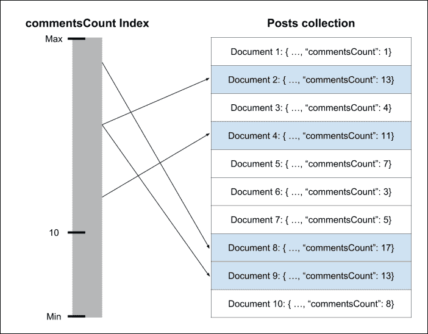
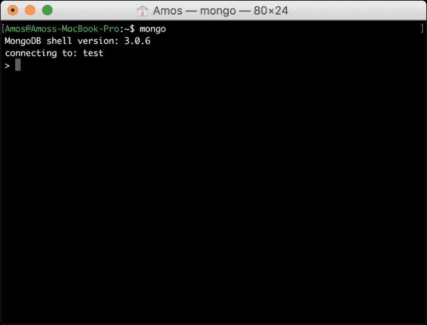
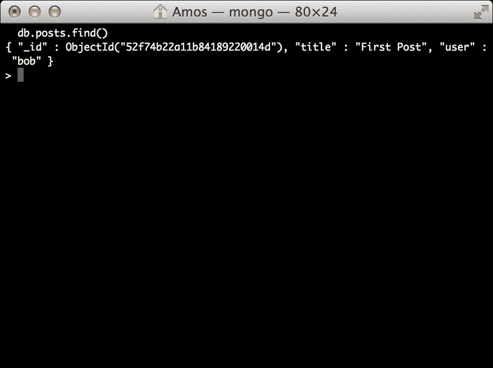

Chapter 4. Introduction to MongoDB <link href="epub.css" rel="stylesheet" type="text/css">  

# 第四章。 MongoDB 概论

MongoDB 是一种令人兴奋的新型数据库。 NoSQL 运动的领导者正在成为世界上最有用的数据库解决方案之一。 Mongo 的高吞吐量、独特的 BSON 数据模型和易于扩展的架构为 web 开发人员提供了更好的工具来存储他们的持久数据。 从关系数据库转移到 NoSQL 解决方案可能是一项艰巨的任务，通过理解 MongoDB 的设计目标可以轻松地简化这一任务。 在本章中，我们将涵盖以下主题:

*   理解 NoSQL 运动和 MongoDB 的设计目标
*   MongoDB BSON 数据结构
*   MongoDB 集合和文档
*   MongoDB 查询语言
*   使用 MongoDB shell

# NoSQL 简介

在过去的几年里，web 应用程序开发通常需要使用关系数据库来存储持久数据。 大多数开发人员已经能够自如地使用众多 SQL 解决方案之一。 因此，使用成熟的关系数据库存储规范化数据模型的方法成为了标准。 对象-关系映射器开始出现，为开发人员提供了合适的解决方案来整理来自应用程序不同部分的数据。 但是随着 Web 变得越来越大，越来越多的扩展问题出现在越来越多的开发人员面前。 为了解决这个问题，社区创建了各种键-值存储解决方案，旨在提高可用性、简单查询和水平伸缩。 这种新类型的数据存储变得越来越健壮，提供了关系数据库的许多特性。 在这一发展过程中，出现了不同的存储设计模式，包括键值存储、列存储、对象存储，以及最流行的文档存储。

在公共关系数据库中，数据存储在不同的表中，通常使用主到外键关系进行连接。 稍后，程序将使用各种 SQL 语句重新构建模型，以某种层次对象表示形式排列数据。 面向文档的数据库处理数据的方式不同。 它们不使用表，而是以标准格式(如 JSON 和 XML)存储分层文档。

为了更好地理解这一点，让我们看一个典型的博客文章的例子。 要使用 SQL 解决方案构建这个博客文章模型，您可能必须使用至少两个表。 第一个将包含帖子信息，而第二个将包含帖子评论。 下面的图表中可以看到一个示例表结构:


在您的应用程序中，您将使用对象关系映射库或直接 SQL 语句来选择博客帖子记录和帖子评论记录，以创建博客帖子对象。 但是，在基于文档的数据库中，博客文章将完全存储为一个文档，以后可以查询。 例如，在一个以 JSON 格式存储文档的数据库中，你的博客发布文档可能看起来像以下代码片段:

```js
{
  "title": "First Blog Post",
  "comments": [{
    "title": "First Comment"
  }, {
    "title": "Second Comment"
  }]
}
```

这个演示了基于文档的数据库和关系数据库之间的主要区别。 因此，在使用关系数据库时，数据存储在不同的表中，应用程序使用表记录组装对象。 将数据存储为整体文档将允许更快的读取操作，因为您的应用程序不必每次读取都重新构建对象。 此外，面向文档的数据库还有其他优点。

在开发应用程序时，您经常会遇到另一个问题:模型更改。 让我们假设您想为每个博客文章添加一个新属性。 因此，您可以更改 posts 表，然后转到应用程序数据层，将该属性添加到 blog post 对象。 由于您的应用程序已经包含了几个博客文章，所有现有的博客文章对象也必须更改，这意味着您必须使用额外的验证过程来覆盖您的代码。 然而，基于文档的数据库通常是无模式的，这意味着您可以将不同的对象存储在一个对象集合中，而无需更改数据库中的任何内容。 虽然对一些有经验的开发人员来说，这听起来像是在找麻烦，但无模式存储的自由有几个优点。

例如，考虑一个销售二手家具的电子商务应用程序。 在你的`products`桌子中，一把椅子和一个衣柜可能有一些共同的特征，比如木材的类型，但客户也可能对衣柜有多少门感兴趣。 将 closet 和 chair 对象存储在同一个表中意味着它们可以存储在具有大量空列的表中，也可以使用更实用的 entity-attribute-value 模式，其中另一个表用于存储键-值属性。 但是，使用无模式存储将允许您为同一集合中的不同对象定义不同的属性，同时仍然允许您使用常见属性(如 wood 类型)查询该集合。 这意味着您的应用程序，而不是数据库，将负责执行数据结构，这可以帮助您加快开发过程。

虽然有许多 NoSQL 解决方案可以解决各种开发问题(通常围绕缓存和扩展)，但面向文档的数据库正迅速成为这一运动的领导者。 面向文档的数据库的易用性，以及它提供的独立持久存储，甚至可能在某些用例中取代传统的 SQL 解决方案。 虽然有一些面向文档的数据库，但没有一个像 MongoDB 那样流行。

# MongoDB 简介

早在 2007 年，德怀特·梅里曼(Dwight Merriman)和艾略特·霍洛维茨(Eliot Horowitz)成立了一家名为 10gen 的公司，旨在创建一个更好的网络应用托管平台。 其想法是创建一个托管服务，让开发人员可以专注于构建他们的应用程序，而不是处理硬件管理和基础设施扩展。 很快，他们发现社区并不愿意放弃对应用程序基础结构的太多控制。 因此，他们将平台的不同部分作为开源项目发布。

一个这样的项目是一个名为 MongoDB 的基于文档的数据库解决方案。 MongoDB 源于单词 humongous，能够支持复杂的数据存储，同时保持其他 NoSQL 存储的高性能方法。 社区欣然接受了这种新模式，使 MongoDB 成为世界上增长最快的数据库之一。 由于有超过 150 个贡献者和超过 10,000 个提交，它也成为最受欢迎的开放源码项目之一。

MongoDB 的主要目标是创建一种新型数据库，将关系数据库的健壮性与分布式键值数据存储的快速吞吐量结合起来。 考虑到可伸缩平台，它必须支持简单的水平伸缩，同时保持传统数据库的持久性。 另一个关键的设计目标是以标准 JSON 输出的形式支持 web 应用程序开发。 这两个设计目标被证明是 MongoDB 相对于其他解决方案的最大优势，因为它们与 web 开发的其他趋势完全一致，比如云虚拟化主机的几乎无处不在的使用，或者向水平方向(而不是垂直方向)的转变。

首先，MongoDB 作为另一种 NoSQL 存储层被摒弃在更可行的关系数据库之上，它的发展远远超出了它诞生的平台。 它的生态系统发展到支持大多数流行的编程平台，并有各种社区支持的驱动程序。 与此同时，还形成了许多其他工具，包括不同的 MongoDB 客户机、分析和优化工具、管理和维护实用程序，以及一对由 vc 支持的托管服务。 甚至像 eBay 和纽约时报这样的大公司也开始在他们的生产环境中使用 MongoDB 数据存储。 为了理解为什么开发人员更喜欢 MongoDB，现在是时候深入了解它的一些关键特性了。

# MongoDB 的关键特性

MongoDB 有一些关键特性帮助它变得如此流行。 正如我们之前提到的，我们的目标是在传统数据库特性和高性能 NoSQL 存储之间创建一种新的类型。 因此，它的大多数关键特性都是为了超越其他 NoSQL 解决方案的限制而创建的，同时集成了关系数据库的一些功能。 在本节中，您将了解为什么 MongoDB 在接近现代 web 应用程序开发时可以成为您首选的数据库。

## BSON 格式

MongoDB 的最伟大的特性之一是它的类似于 json 的存储格式 BSON。 BSON 表示**二进制 JSON**，BSON 格式是一种类似于 JSON 的二进制编码的序列化文档，它的设计在大小和速度上更高效，允许 MongoDB 的高读写吞吐量。

与 JSON 一样，BSON 文档是一种以键值格式表示的对象和数组的简单数据结构。 文档由一列元素组成，每个元素都有一个字符串类型的字段名和一个类型的字段值。 这些文档支持所有 JSON 特定的数据类型以及其他数据类型，比如`Date`类型。

BSON 格式的另一个大优点是使用了`_id`字段作为主键。 `_id`字段值通常是唯一的标识符类型，名为`ObjectId`，由应用程序驱动程序或 mongod 服务生成。 如果驱动程序不能提供具有唯一`ObjectId`的`_id`字段，mongod 服务会自动添加:

*   一个 4 字节的值，表示从 Unix 时代开始的秒数
*   3 字节的机器标识符
*   一个 2 字节的进程 ID
*   一种 3 字节计数器，从一个随机值开始

因此，前面例子中博客帖子对象的 BSON 表示看起来像下面的代码片段:

```js
{
  "_id": ObjectId("52d02240e4b01d67d71ad577"),
  "title": "First Blog Post",
  "comments": [
  ...
  ]
}
```

BSON 格式使 MongoDB 能够在内部索引和映射文档属性，甚至是嵌套文档，从而允许它高效地扫描集合，更重要的是，将对象匹配到复杂的查询表达式。

## MongoDB ad hoc queries

MongoDB 的另一个设计目标是扩展普通键值存储的能力。 通用键值存储的主要问题是它们有限的查询能力，这通常意味着您的数据只能使用键字段进行查询，更复杂的查询大多是预定义的。 为了解决这一问题，MongoDB 从关系数据库动态查询语言中汲取灵感。

支持临时查询意味着数据库将立即响应动态结构的查询，而不需要预定义每个查询。 它可以通过索引 BSON 文档和使用一种独特的查询语言来实现这一点。 让我们看看下面的 SQL 语句示例:

```js
SELECT * FROM Posts WHERE Title LIKE '%mongo%';

```

这个简单的语句正在向数据库查询标题包含`mongo`的所有帖子记录。 在 MongoDB 中复制这个查询会如下所示:

```js
db.posts.find({ title:/mongo/ });

```

在 MongoDB shell 中运行此命令将返回其`title`字段包含单词`mongo`的所有帖子。 在本章后面，您将了解更多关于 MongoDB 查询语言的内容，但现在重要的是要记住，它几乎与传统关系数据库一样可以查询。 MongoDB 查询语言很棒，但它提出了一个问题:当数据库变得更大时，这些查询的运行效率如何? 与关系数据库一样，MongoDB 使用索引机制解决了这个问题。

## MongoDB 索引

索引是惟一的数据结构，使数据库引擎能够有效地解析查询。 当查询被发送到数据库时，它将不得不扫描整个文档集合，以找到那些与查询语句匹配的文档。 这样，数据库引擎会处理大量不必要的数据，导致性能低下。

为了加快扫描速度，数据库引擎可以使用预定义的索引，该索引映射文档字段，并告诉引擎哪些文档与该查询语句兼容。 为了理解索引是如何工作的，假设我们想要检索所有评论超过 10 条的文章。 在本例中，我们的文档定义如下:

```js
{
  "_id": ObjectId("52d02240e4b01d67d71ad577"),
  "title": "First Blog Post",
  "comments": [
  …
  ],
  "commentsCount": 12
}
```

因此，一个 MongoDB 查询请求的文档注释超过 10 条，如下所示:

```js
db.posts.find({ commentsCount: { $gt: 10 } });

```

要执行这个查询，MongoDB 必须遍历所有的 post，并检查 post 是否具有大于`10`的`commentCount`属性。 但是，如果定义了`commentCount`索引，那么 MongoDB 在检索这些文档之前，只需要检查哪些文档的`commentCount`属性大于`10`。 下面的图表说明了`commentCount`索引是如何工作的:



使用`commentsCount`索引检索具有`10`以上注释的文档

## MongoDB 复制集

为了提供数据冗余和提高的可用性，MongoDB 使用了一种名为的**副本集**的架构。 数据库的复制有助于保护数据以从硬件故障中恢复，并增加读取容量。 副本集是托管相同数据集的 MongoDB 服务的集合。 其中一个服务用作主服务，而使用的其他服务称为辅助服务。 所有的 set 实例都支持读操作，但是只有主实例负责写操作。 当写操作发生时，主服务器将通知辅助服务器关于更改的信息，并确保它们已将更改应用到它们的数据集复制中。 下图展示了一个常用的副本集:


具有一个主副本和两个辅助副本的工作流

MongoDB 副本集的另一个健壮特性是它的自动故障转移。 当一个集合成员无法到达主实例超过 10 秒时，复制集将自动选择并提升一个辅助实例作为新的主实例。 当旧的主程序重新联机时，它将作为辅助实例重新加入副本集。

副本集的另一个特性是添加仲裁节点的能力。 仲裁者不维护任何数据; 它们的主要目的是在复制集中维护 quorum。 也就是说，他们虽然参与了选举新候选人的过程，但不能作为第二候选人或被选为候选人。 简而言之，仲裁器帮助以比常规数据节点更低的资源成本提供副本集内的一致性。 下图展示了一个常见的带有仲裁器的副本集:


包含一个主副本、一个辅助副本和一个仲裁副本的工作流程

复制是 MongoDB 的一个非常健壮的特性，它直接从其平台起源派生而来，是使 MongoDB 可以用于生产的主要特性之一。 然而，这并不是唯一的问题。

### 注意事项

要了解更多关于 MongoDB 副本集的，请访问[http://docs.mongodb.org/manual/replication/](http://docs.mongodb.org/manual/replication/)。

## MongoDB 分片

伸缩是不断发展的 web 应用程序的一个常见问题。 解决这个问题的各种方法可以分为两组:垂直缩放和水平缩放。 两者之间的区别如下图所示:


单个机器的垂直缩放 vs 多机器的水平缩放

垂直扩展更容易，包括增加单机资源，如 RAM 和 CPU。 然而，它有两个主要的缺点:首先，在某种程度上，增加一台机器的资源比在几个较小的机器之间分配负载要昂贵得多。 其次，流行的云托管提供商限制您可以使用的计算机实例的大小。 因此，垂直扩展应用程序只能达到一定的级别。

水平缩放更复杂，需要使用多台机器来完成。 每台机器将处理一部分负载，提供更好的整体性能。 水平数据库扩展的问题是如何在不同的机器之间正确地划分数据，以及如何管理它们之间的读/写操作。

幸运的是，MongoDB 支持水平扩展，它称之为分片。 *分片是将数据在不同的机器或分片之间进行分割的过程*。 每个 shard 保存一部分数据，并作为一个单独的数据库运行。 几个碎片的集合构成了一个逻辑数据库。 操作通过称为查询路由器的服务执行，查询路由器询问配置服务器如何将每个操作委托给正确的分片。

### 注意事项

要了解更多关于MongoDB 分片的信息，请访问[http://docs.mongodb.org/manual/sharding/](http://docs.mongodb.org/manual/sharding/)。

## MongoDB 3.0

2015 年初，MongoDB 团队推出了 MongoDB 数据库的第三大版本。 最重要的是，这个版本标志着 MongoDB 正在向成为更大、更复杂的生产环境的领先数据库解决方案的方向转变。 或者，正如该团队所描述的那样，让 MongoDB 成为每个组织的“默认数据库”。 为了做到这一点，团队提出了几个新的特性:

*   **存储 API**:在这个版本中，存储引擎层与高层操作分离。 这意味着组织现在可以根据其应用程序的需要选择使用哪种存储引擎，从而获得 10 倍的性能提升。
*   :允许 DBA 更好地分析关键查询，确保性能得到优化。
*   **更好的认证和审计**:这允许更大的组织更安全地管理他们的 MongoDB 实例。
*   **更好的日志**:更精细的日志功能允许开发人员更好地跟踪 MongoDB 的操作。

这些特性和许多其他特性是 MongoDB 如此受欢迎的原因。 虽然有许多好的替代方案，但 MongoDB 在开发人员中越来越普遍，并正在成为世界领先的数据库解决方案之一。 让我们更深入地了解如何轻松开始使用 MongoDB。

# MongoDB shell

如果你遵循[第一章](01.html "Chapter 1. Introduction to MEAN")，*MEAN 简介*，你应该在你的本地环境中有一个 MongoDB 的工作实例。 要与 MongoDB 交互，您将使用 MongoDB shell，您在[第 1 章](01.html "Chapter 1. Introduction to MEAN")，*介绍 MEAN*中遇到过。 MongoDB shell 是一个命令行工具，它支持使用 JavaScript 语法查询语言执行不同的操作。

为了探索 MongoDB 的不同部分，让我们通过运行`mongo`可执行文件启动 MongoDB shell，如下所示:

```js
$ mongo

```

如果 MongoDB 已经正确安装，你应该会看到类似如下截图所示的输出:



请注意，shell 是如何告诉您当前的 shell 版本，以及它已连接到默认测试数据库的。

# MongoDB 数据库

每个 MongoDB 服务器实例可以存储多个数据库。 除非特别定义，否则 MongoDB shell 将自动连接到默认的测试数据库。 让我们通过执行以下命令切换到另一个名为`mean`的数据库:

```js
> use mean

```

您将看到一个命令行输出，告诉您 shell 切换到了`mean`数据库。 注意，在使用数据库之前不需要创建数据库，因为在 MongoDB 中，插入第一个文档时数据库和集合是惰性创建的。 这种行为与 MongoDB 的动态数据处理方法是一致的。 另一种使用特定数据库的方法是使用数据库名作为参数运行 shell 可执行文件，如下所示:

```js
$ mongo mean

```

然后 shell 将自动连接到`mean`数据库。 如果你想列出当前 MongoDB 服务器上的所有其他数据库，只需执行以下命令:

```js
> show dbs

```

这将显示至少存储了一个文档的当前可用数据库的列表。

# MongoDB 集合

MongoDB 集合是一个 MongoDB 文档的列表，相当于关系数据库表。 集合是在插入其第一个文档时创建的。 与表不同，集合不强制任何类型的模式，并且可以托管不同的结构化文档。

要对 MongoDB 集合执行操作，需要使用集合方法。 让我们创建一个 posts 集合并插入第一个 post。 为了做到这一点，在 MongoDB shell 中执行以下命令:

```js
> db.posts.insert({"title":"First Post", "user": "bob"})

```

在执行上述命令之后，它将自动创建`posts`集合并插入第一个文档。 要检索集合文档，请在 MongoDB shell 中执行以下命令:

```js
> db.posts.find()

```

你应该看到一个命令行输出，类似如下截图所示:



这意味着您已经成功地创建了`posts`集合并插入了第一个文档。

为了显示所有可用的集合，在 MongoDB shell 中发出以下命令:

```js
> show collections

```

MongoDB shell 将输出可用集合的列表，在您的示例中是`posts`集合和另一个名为`system.indexes`的集合，其中包含数据库索引的列表。

如果要删除`posts`集合，需要执行`drop()`命令，如下所示:

```js
> db.posts.drop()

```

shell 将通过一个真实的输出来响应，通知您该集合已被删除。

# MongoDB CRUD 操作

**创建-读取-更新-删除**(**CRUD**)操作，是您与数据库执行的基本交互。 为了在数据库实体上执行 CRUD 操作，MongoDB 提供了各种收集方法。

## 创建新文档

您已经熟悉了使用`insert()`方法创建新文档的基本方法，就像在前面的示例中所做的那样。 除了`insert()`方法之外，还有另外两个方法`update()`和`save()`用于创建新对象。

### 使用 insert()创建文档

创建新文档最常见的方法是使用`insert()`方法。 方法接受一个表示新文档的参数。 要插入一个新的帖子，只需在 MongoDB shell 中发出以下命令:

```js
> db.posts.insert({"title":"Second Post", "user": "alice"})

```

### 使用 update()创建文档

`update()`方法是，通常用于更新现有文档。 如果没有符合查询条件的文档，也可以使用`upsert`标志创建一个新文档:

```js
> db.posts.update({
 "user": "alice"
}, {
 "title": "Second Post",
 "user": "alice"
}, {
 upsert: true
})

```

在前面的示例中，MongoDB 将查找由`alice`创建的帖子并尝试更新它。 考虑到`posts`集合没有由`alice`创建的帖子，而且您已经使用了`upsert`标志，MongoDB 将无法找到合适的文档来更新，而将创建一个新文档。

### 使用 save()创建文档

创建新文档的另一种方法是调用`save()`方法，传递给它一个文档，该文档要么没有`_id`字段，要么有一个集合中不存在的`_id`字段:

```js
> db.posts.save({"title":"Second Post", "user": "alice"})

```

这将与`update()`方法具有相同的效果，并且将创建一个新文档，而不是更新现有文档。

## 阅读文档

`find()`方法用于从 MongoDB 集合中检索文档列表。 使用`find()`方法，您可以请求集合中的所有文档，也可以使用查询来检索特定的文档。

### 找到所有的收集文件

要检索`posts`集合中的所有文档，您应该向`find()`方法传递一个空查询，或者根本不传递任何参数。 下面的查询将检索`posts`集合中的所有文档:

```js
> db.posts.find()

```

此外，还可以使用下面的查询来执行相同的操作:

```js
> db.posts.find({})

```

这两个查询基本上是相同的，并且将返回`posts`集合中的所有文档。

### 使用相等语句

要检索特定文档，可以使用相等条件查询，该查询将获取符合该条件的所有文档。 例如，要检索由`alice`创建的所有帖子，你需要在 shell 中发出以下命令:

```js
> db.posts.find({ "user": "alice" })

```

这将检索所有具有`user`属性等于`alice`的文档。

### 使用查询操作符

使用相等声明可能还不够。 为了构建更复杂的查询，MongoDB 支持各种查询操作符。 使用查询操作符，您可以查找不同种类的条件。 例如，要检索由`alice`或`bob`创建的所有帖子，您可以使用以下`$in`操作符:

```js
> db.posts.find({ "user": { $in: ["alice", "bob"] } })

```

### 注意事项

您可以通过访问[http://docs.mongodb.org/manual/reference/operator/query/#query-selectors](http://docs.mongodb.org/manual/reference/operator/query/#query-selectors)了解许多其他的查询操作符。

### 构建 AND/OR 查询

当您构建一个查询时，您可能需要使用多个条件。 与 SQL 一样，您可以使用`AND`/`OR`操作符来构建多个条件查询语句。 要执行`AND`查询，只需将要检查的属性添加到查询对象。 例如，看看下面的查询:

```js
> db.posts.find({ "user": "alice", "commentsCount": { $gt: 10 }  })

```

它类似于您以前使用的`find()`查询，但是添加了另一个条件来验证文档的`commentCount`属性，并且只抓取由`alice`创建且拥有更多`10`注释的文档。 `OR`查询稍微复杂一些，因为它涉及到`$or`操作符。 为了更好地理解它，看一下前面例子的另一个版本:

```js
> db.posts.find( { $or: [{ "user": "alice" }, { "user": "bob" }] })

```

与查询操作符示例一样，该查询也将获取由`bob`或`alice`创建的所有帖子。

## 更新现有文档

使用 MongoDB，您可以选择使用`update()`或`save()`方法更新文档。

### 使用 update()更新文档

`update()`方法带有三个参数来更新现有文档。 第一个参数是表示要更新哪些文档的选择标准，第二个参数是`update`语句，最后一个参数是`options`对象。 例如,在下面的示例中,第一个参数是告诉 MongoDB 寻找所有的文件由`alice`,第二个参数告诉它更新`title`字段,第三个是迫使它执行`update`操作它找到的所有文件:

```js
> db.posts.update({
 "user": "alice"
}, {
 $set: {
 "title": "Second Post"
 }
}, {
 multi: true
})

```

注意`multi`属性是如何添加到`options`对象的。 `update()`方法的默认行为是更新单个文档，因此通过设置`multi`属性，您可以告诉`update()`方法更新符合选择标准的所有文档。

### 使用 save()更新文档

更新现有文档的另一种方法是调用`save()`方法，向它传递一个包含`_id`字段的文档。 例如，以下命令将用一个等于`ObjectId("50691737d386d8fadbd6b01d")`的`_id`字段更新现有文档:

```js
> db.posts.save({
 "_id": ObjectId("50691737d386d8fadbd6b01d"),
 "title": "Second Post",
 "user": "alice"
})

```

重要的是要记住，如果`save()`方法无法找到合适的对象，它将创建一个新的对象。

## 删除文档

要删除文档，需要使用`remove()`方法。 方法最多可以接受两个参数。 第一个是删除标准，第二个是一个布尔参数，指示是否删除多个文档。

### 删除所有文档

要从集合中删除所有文档，您需要调用`remove()`方法，而不需要任何删除标准。 例如，要删除所有的`posts`文档，您需要执行以下命令:

```js
> db.posts.remove({})

```

请注意，`remove()`方法与`drop()`方法不同，因为它不会删除集合或其索引。 要用不同的索引重新构建集合，最好使用`drop()`方法。

#### 删除多个文档

要从集合中删除匹配标准的多个文档，您需要调用带有删除标准的`remove()`方法。 例如，要删除所有由`alice`创建的帖子，您需要执行以下命令:

```js
> db.posts.remove({ "user": "alice" })

```

注意，这将删除由`alice`创建的所有文档，所以在使用`remove()`方法时要小心。

#### 删除单个文档

要从集合中删除匹配标准的单个文档，您需要调用`remove()`方法，其中包含一个删除标准和一个布尔值，该值表示您只想删除单个文档。 例如，要删除`alice`发布的第一篇文章，你需要执行以下命令:

```js
> db.posts.remove({ "user": "alice" }, true)

```

这将删除由`alice`创建的第一个文档，并保留其他文档，即使它们符合删除标准。

# 小结

在本章中，您学习了 NoSQL 数据库以及它们如何在现代 web 开发中发挥作用。 您还了解了 NoSQL 运动的新兴领导者 MongoDB。 您深入了解了使 MongoDB 成为如此强大的解决方案的各种特性，并了解了它的基本术语。 最后，您了解了 MongoDB 强大的查询语言以及如何执行所有四个 CRUD 操作。 在下一章中，我们将讨论如何使用流行的 Mongoose 模块连接 Node.js 和 MongoDB。