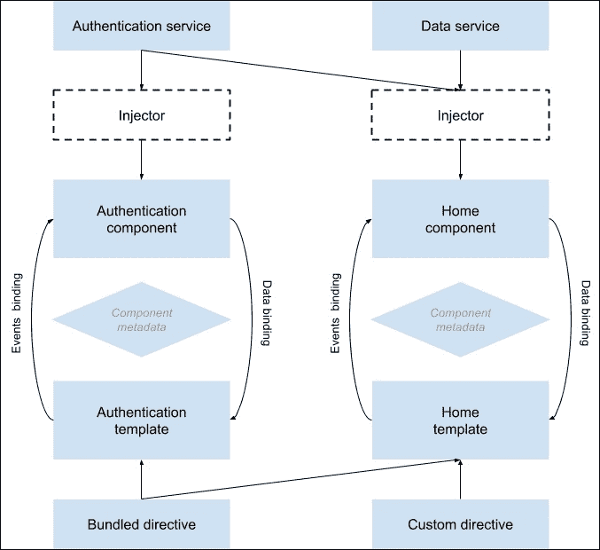
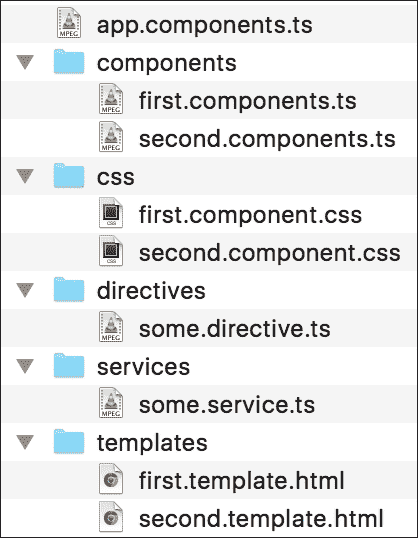
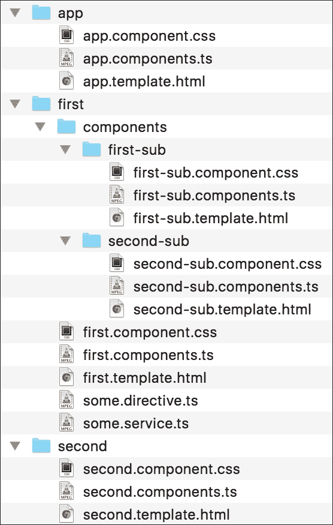

Chapter 7. Introduction to Angular <link href="epub.css" rel="stylesheet" type="text/css">  

# 第七章。 介绍了角

当然，MEAN 谜题的最后一块是 Angular。 早在 2009 年，当开发人员 Miško Hevery 和 Adam Abrons 构建他们的 JSON 作为平台服务时，他们注意到普通的 JavaScript 库是不够的。 他们的富 web 应用程序的特性提出了一个更结构化的框架的需求，以减少冗余工作并保持项目代码的组织性。 他们放弃了最初的想法，决定专注于框架的开发，将其命名为 AngularJS，并在开源许可下发布。 其想法是在 JavaScript 和 HTML 之间架起桥梁，帮助普及单页面应用程序开发。 在接下来的几年里，angularjs——现在被称为 angular——成为了 JavaScript 生态系统中最流行的框架之一，它彻底改变了前端开发世界。 然而，在过去的几年里，出现了一些主要的范式转变。 所以，当谷歌赞助的团队决定开发 Angular 的下一个版本时，他们引入了一整套新想法。 在本章中，我们将涵盖以下主题:

*   引入打印稿
*   引入角 2
*   理解 Angular 2 的构建块
*   安装和配置 TypeScript 和 Angular 2
*   创建和组织 Angular 2 应用
*   利用 Angular 的组件架构
*   实现`Authentication`组件

# 介绍 Angular 2

AngularJS是一个前端JavaScript 框架，旨在使用类似 mvc 的架构构建单页面应用。 Angular 的方法是使用特殊的属性来扩展 HTML 的功能，这些属性将 JavaScript 逻辑与 HTML 元素绑定在一起。 AngularJS 扩展 HTML 的能力允许通过客户端模板和模型和视图之间无缝同步的双向数据绑定更清晰地对 DOM 进行操作。 AngularJS 还使用 MVC 和依赖注入改进了应用程序的代码结构和可测试性。 AngularJS 1 无论过去还是现在都是一个很棒的框架，但它是基于 ES5 的概念构建的，随着 ES2015 新规范带来的巨大改进，团队不得不重新思考整个方法。

## 来自 Angular 1。 x 转换到 Angular 2.x

如果你已经熟悉 Angular 1，那么转到 Angular 2 似乎是一大步。 然而，Angular 团队确保保留了 Angular 1 中好的部分，同时利用了 ES2015 的新功能，并保持了一条通向改进框架的清晰路径。 以下是对 Angular 1 中所做更改的快速总结:

*   **语法**:Angular 2依赖于新的 ECMAScript 规范，以前叫做 ES6，现在改名为 ES2015。 然而，该规范仍在开发中，并且还缺乏浏览器支持。 为了克服这个问题，Angular 2 团队决定使用 TypeScript。
*   **TypeScript**:TypeScript是 ES2015 的超集，这意味着它允许你编写强类型的 ES2015 代码，根据你的需要和平台支持，这些代码会被编译到 ES5 或 ES2015 源代码中。 Angular 2 在他们的文档和代码示例中努力使用 TypeScript，我们也会这么做。 别担心,虽然; 尽管 TypeScript 看起来非常庞大和可怕，但在本章结束时，你就可以使用它了。
*   **模块**:Angular 1引入了一个模块化架构，需要使用`angular#module()`自定义方法。 然而，ES2015 引入了一个内置模块系统，非常类似于 Node.js 中使用的那个。 因此，Angular 2 的模块更容易创建和使用。
*   **Controllers**:Angular 1都是关于控制器的。 在这本书的第一版中，本章主要关注的是 Angular 1 的 MVC 方法，但在 Angular 2 中，基本的构建块是组件。 这种转变也代表了 JavaScript 生态系统的一个更大的转变，尤其是在 web 组件方面。
*   **Scopes**:著名的对象现在已经过时了。 在 Angular 2 中，组件模型更清晰、更易读。 一般来说，ES2015 中类的引入及其在 TypeScript 中的支持允许更好的设计模式。
*   Decorators:Decorators是一个在 TypeScript 中实现的设计特性，可能会在 ES2016(ES7)中实现。 装饰器允许开发人员注释类和成员，以便在不扩展实体的情况下添加特性或数据。 Angular 2 依赖装饰器来实现某些特性，你将在本章的后面讨论它们。
*   **依赖注入**:Angular 1 非常频繁地使用了依赖注入范式。 Angular 2 简化了依赖注入，现在支持多个注入器，而不是一个。

总的来说，所有这些特性都标志着 Angular 和 JavaScript 进入了一个新时代，而且都是从 TypeScript 开始的。

# TypeScript 简介

TypeScript是微软创建的一种类型化编程语言，它使用了 c#、Java 和 ES2015 的面向对象基础。 TypeScript 代码会在 ES3、ES5 或 ES2015 中转化成 JavaScript 代码，可以在任何现代浏览器上运行。 它也是 ES2015 的超集，所以基本上，任何 JavaScript 代码都是有效的 TypeScript 代码。 其背后的想法是为大型项目创建一种强类型的编程语言，这将允许大型团队更好地在他们的软件组件之间进行接口通信。 从它的名字衍生而来，TypeScript 有一个可选的类型系统，它允许开发人员在他们的代码上施加限制，以获得更好的清晰度。 由于 TypeScript 中的很多特性已经在 ES2015 中实现了，所以我们将讨论一些我们需要但在当前规范中没有得到的基本特性。

## 类型

类型是每个编程语言的主要部分，包括 JavaScript。 不幸的是，ES2015 没有引入静态类型; 然而，TypeScript 支持基本的 JavaScript 类型，也允许开发者创建和使用他们自己的类型。

### 基本类型

类型可以是 JavaScript基元类型，如下代码所示:

```js
let firstName: string = "John";
let lastName = 'Smith';
let height: number = 6;
let isDone: boolean = false;
```

此外，TypeScript 还允许你使用数组:

```js
var numbers:number[] = [1, 2, 3];
var names:Array<string> = ['Alice', 'Helen', 'Claire'];
```

然后将编译成熟悉的 JavaScript 数组声明。

### 任何类型

`any`类型代表任何自由格式的 JavaScript 值。 `any`的值将通过编译器进行最小限度的静态类型检查，并将作为 JavaScript 值支持所有操作。 `any`值上的所有属性都可以访问，`any`值也可以作为带有参数列表的函数调用。 实际上，`any`是所有类型的超类型，当 TypeScript 不能推断出一个类型时，就会使用`any`类型。 你可以使用`any`类型或显式或不显式:

```js
var x: any;
var y;
```

## 接口

因为 TypeScript 要保持项目的结构，所以接口是该语言中非常重要的部分。 一个界面允许你塑造你的对象，并保持你的代码坚实和清晰。 类可以实现接口，这意味着它们必须符合接口中声明的属性或方法。 接口还可以继承其他接口，这意味着它们的实现类将能够实现扩展的接口。 一个 TypeScript 接口示例如下所示:

```js
interface IVehicle {
  wheels: number;
  engine: string;
  drive();
}
```

这里，我们有一个带有两个属性和一个方法的`IVehicle`接口。 一个实现类看起来像这样:

```js
class Car implements IVehicle  {
  wheels: number;
  engine: string;

  constructor(wheels: number, engine: string) {
    this.wheels = wheels;
    this.engine = engine;
  }

  drive() {
    console.log('Driving...');
  }
}
```

如您所见，`Car`类实现了`IVehicle`接口，并遵循其设置的结构。

### 注意事项

接口是 TypeScript 的一个强大特性，也是 OOP 的重要组成部分。 建议你继续阅读:[https://www.typescriptlang.org/docs/handbook/interfaces.html](https://www.typescriptlang.org/docs/handbook/interfaces.html)。

## 装潢师

虽然新的 ES7 规范还处于提案阶段，但 Angular 2 严重依赖装饰器。 装饰器是一种特殊类型的声明，可以附加到各种实体，如类、方法或属性。 装饰器为开发人员提供了一种可重用的方式来注释和修改类和成员。 修饰器使用`@decoratorName`形式，其中`decoratorName`参数必须是在运行时使用修饰实体调用的函数。 一个简单的 decorator 应该如下所示:

```js
function Decorator(target: any) {

}
@Decorator
class MyClass {

}
```

在运行时，装饰器将与用`MyClass`构造函数填充的目标参数一起执行。 此外，装饰器还可以有如下参数:

```js
function DecoratorWithArgs(options: Object) {
  return (target: Object) => {

  }
}

@DecoratorWithArgs({ type: 'SomeType' })
class MyClass {

}
```

这种模式也被称为装饰工厂。 装饰器可能看起来有点奇怪，但一旦我们深入到 Angular 2 中，你就会开始理解它们的健壮性。

### 小结

TypeScript 已经存在了很多年，并且由一个非常强大的团队开发。 这意味着我们仅仅触及了其无尽功能和能力的表面。 然而，这篇介绍将为我们提供深入了解 Angular 2 这个伟大框架所需的技能和知识。

# Angular 2 架构

Angular 2的目标很简单:将 HTML 和 JavaScript 以一种可管理和可扩展的方式结合在一起，以构建一个客户端应用程序。 为了做到这一点，Angular 2 使用基于组件的方法来支持实体，比如在运行时将服务和指令注入到组件中。 这种方法一开始可能看起来有点奇怪，但它允许我们保持关注点的清晰分离，并通常保持一个更清晰的项目结构。 为了理解 Angular 2 的基础知识，看一下下面的图:



上图展示了 Angular 2 应用的一个简单架构，它由两个组件组成。 中心实体是组件。 每个组件对其模板执行数据绑定和事件处理，以便为用户提供一个交互式 UI。 服务是为任何其他任务创建的，比如加载数据、执行计算等等。 然后，服务由委托这些任务的组件使用。 指令是用来呈现组件模板的指令。 为了更好地理解这一点，让我们深入一点。

## Angular 2 模块

Angular 2 的应用通常是模块化应用。 这意味着一个 Angular 2 应用由多个模块组成，每个模块都是一段代码，通常只负责一个任务。 事实上，整个框架是以模块化的方式构建的，允许开发人员只导入他们需要的特性。 幸运的是，Angular 2 使用了我们前面提到的 ES2015 模块语法。 我们的应用程序也将由自定义模块构建，一个示例应用程序模块如下所示:

```js
import { NgModule }       from '@angular/core';
import { CommonModule }   from '@angular/common';
import { RouterModule }   from '@angular/router';

import { AppComponent }       from './app.component';
import { AppRoutes }       from './app.routes';

@NgModule({
  imports: [
    CommonModule,
    RouterModule.forRoot(AppRoutes),
  ],
  declarations: [
    AppComponent
  ],
  bootstrap: [AppComponent]
})
export class AppModule { }
```

如您所见，我们使用`@NgModule`装饰器来创建应用程序模块，该模块使用应用程序组件和路由来引导应用程序。 为了更好地理解这一点，让我们看一下 Angular 2 应用的第一个也是最重要的构建块:组件。

## Angular 2 的组件

组件是 Angular 2 应用中必不可少的构建块。 它的任务是控制用户界面的一个专用部分，通常称为视图。 大多数应用程序都至少包含一个根应用程序组件，通常还有多个控制不同视图的组件。 组件通常被定义为带有`@Component`装饰器的普通 ES2015 类，该装饰器将其定义为组件，并包含组件元数据。 然后，组件类被导出为一个模块，可以导入并在应用程序的其他部分中使用。 一个简单的应用程序组件如下:

```js
import { Component } from '@angular/core';

@Component({
  selector: 'mean-app',
  template: '<h1>I AM AN APPLICATION COMPONENT</h1>'
})
export class AppComponent { 	}
```

注意，我们如何从`@angular/core`模块库中导入`@Component`装饰器，然后使用它来定义组件的 DOM 选择器和我们想要使用的模板。 最后，导出一个名为`AppComponent`的类。 组件是视图管理的一边，在另一边是模板。

## Angular 2 模板

组件使用模板来呈现组件视图。 它们是由基本 HTML 和 angular 专用注释组合而成的，这些注释告诉组件如何渲染最终的视图。 在前面的示例中，您可以看到一个简单的模板被直接传递给了`AppComponent`类。 然而，你也可以把你的模板保存在一个外部模板文件中，然后像下面这样修改你的组件:

```js
import { Component } from '@angular/core';

@Component({
  selector: 'mean-app',
  templateUrl: 'app.template.html'
})
export class AppComponent { 	}
```

正如您在这里看到的，我们当前的模板是静态的，因此为了创建更有用的模板，现在是讨论数据绑定的时候了。

## Angular 2 的数据绑定

Angular 的最伟大的特性之一是它复杂的数据绑定能力。 如果您习惯于在框架之外工作，那么您就会知道管理视图和数据模型之间的数据更新是一个噩梦。 幸运的是，Angular 的数据绑定为你提供了一种简单的方式来管理组件类和渲染视图之间的绑定。

### 插值绑定

将组件类的数据绑定到模板的最简单的方法是插值。 插值表达式使用双花括号语法将 class 属性的值与模板绑定。 这个机制的一个简单例子如下:

```js
import { Component } from '@angular/core';

@Component({
  selector: 'mean-app',
  template: '<h1>{{title}}</h1>'
})
export class AppComponent {
  title = 'MEAN Application';
}
```

注意我们是如何在模板 HTML 中绑定`AppComponent`类的`title`属性的。

### 属性绑定

单向数据绑定的另一个例子是属性绑定，它允许您将 HTML 元素属性值与组件属性值或任何其他模板表达式绑定。 使用方括号完成，如下所示:

```js
import { Component } from '@angular/core';

@Component({
  selector: 'mean-app',
  template: '<button [disabled]="isButtonDisabled">My Button</button>'
})
export class AppComponent {
  isButtonDisabled = true;
}
```

在这个例子中，由于我们将`isButtonDisabled`属性设置为`true`，Angular 会将这个按钮渲染为禁用状态。

### 事件绑定

为了让你的组件响应视图生成的 DOM 事件，Angular 2 提供了事件绑定机制。 要将 DOM 事件绑定到组件方法，你只需要在圆括号中设置事件名称，如下面的例子所示:

```js
import { Component } from '@angular/core';

@Component({
  selector: 'mean-app',
  template: '<button (click)="showMessage()">Show Message</button>'
})
export class AppComponent {
  showMessage() {
    alert('This is a message!')
  }
}
```

在本例中，单击视图按钮的事件将调用`AppComponent`类中的`showMessage()`方法。

### 双向绑定

到目前为止，我们只讨论了单向数据绑定，其中视图调用组件函数或组件更改视图。 然而，在处理用户输入时，我们需要能够无缝地进行双向数据绑定。 这可以通过将`ngModel`属性添加到输入 HTML 元素并将其绑定到组件属性来实现。 要做到这一点，我们需要使用圆括号和方括号的组合语法，如下例所示:

```js
import { Component } from '@angular/core';

@Component({
  selector: 'mean-app',
  template: '<h1>Hello {{name}}</h1><br><input [(ngModel)]="name">'
})
export class AppComponent {
  name = ''
}
```

在本例中，用户将看到一个 title 元素，该元素将根据输入实时更新。 输入从两方面绑定了 name 属性，因此对输入值的每次更改都将在`AppComponent`类中更新并呈现到视图中。 我们在这里使用的`ngModel`属性被称为指令，所以很自然，现在是讨论指令的时候了。

## Angular 2 中的指令

Angular 的基本操作是使用一组指令(通常是指令)将我们的动态模板转换为视图。 有几种类型的指令，但最基本和最令人惊讶的是组件。 `@Component`装饰器实际上通过向`@Directive`装饰器添加一个模板来扩展它。 还记得前面例子中的 selector 属性吗? 如果您在另一个组件中使用这个选择器作为标记，它将在内部呈现我们的组件。 但这只是指令的一种类型; 另一个是前面例子中的`ngModel`指令。 总之，我们有三种类型的指令。

### 属性指令

属性指令改变 DOM 元素的行为或外观。 我们使用这些指令作为我们想要改变的给定 DOM 元素的 HTML 属性。 Angular 2 自带了几个预构建的属性指令，如下所示:

*   `ngClass`:提供方式将单个或多个类绑定到一个元素
*   `ngStyle`:提供一种方式将单个或多个内联样式绑定到元素
*   `ngModel`:在表单元素上创建双向数据绑定

这些只是几个例子，但您应该记住，您可以也应该编写自己的自定义指令。

### 结构性指令

结构型指令通过删除和添加 DOM 元素来改变应用程序的 DOM 布局。 Angular 2 包含了三个你应该知道的主要结构指令:

*   `ngIf`:提供根据条件添加或删除元素的方式
*   `ngFor`:提供一种基于对象列表创建元素副本的方法
*   `ngSwitch`:提供一种方式，根据属性值显示元素列表中的单个元素

所有结构性指令都使用一种名为 HTML5 模板的机制，它允许 DOM 保存 HTML 模板，而不用使用模板标记呈现。 我们将在使用这些指令时讨论这一结果。

### 组件指令

如前所述，每个组件基本上都是一个指令。 对于实例，假设我们有一个名为`SampleComponent`的组件:

```js
import { Component } from '@angular/core';

@Component({
  selector: 'sample-component',
  template: '<h1>I'm a component</h1>'
})
export class SampleComponent {

}
```

我们可以在`AppComponent`类中使用它作为指令，如下所示:

```js
import { Component } from '@angular/core';
import { SampleComponent } from 'sample.component';

@Component({
  selector: 'mean-app',
  template: '<sample-component></sample-component>',
  directives: [SampleComponent]
})
export class AppComponent {

}
```

注意我们如何使用 sample-component 标签，并将我们的`SampleComponent`模块包含在`AppComponent`指令列表中。

总之，对于许多 Angular 1 的开发者来说，指令(T0)曾经是一个可怕的概念，但现在它们变得简单、容易理解，而且使用起来很有趣。 在本书的后面部分，您将学习如何使用本节中介绍的大多数概念。

## Angular 2 的服务

服务是 Angular 2 的中必不可少的一部分。 它们基本上只是应用程序中单个目的或特性需要的类。 因为我们想要保持组件的整洁并专注于用户体验，所以服务几乎包含了所有其他内容。 例如，任何数据管理、日志记录、应用程序配置或其他不属于组件的功能都将作为服务实现。 同样值得注意的是，Angular 2 的服务绝对没有什么特别之处; 它们只是定义了功能的普通类。 它们的特别之处在于，我们可以使用一种称为依赖注入的机制，使这些服务对组件可用。

## Angular 2 依赖注入

依赖注入是一种由软件工程师 Martin Fowler 推广的软件设计模式。 依赖注入背后的主要原则是软件开发体系结构中的控制反转。 为了更好地理解这一点，让我们看一下下面的`notifier`例子:

```js
const Notifier = function() {
  this.userService = new UserService();
};

Notifier.prototype.notify = function() {
  const user = this.userService.getUser();

  if (user.role === 'admin') {
    alert('You are an admin!');
  } else {
    alert('Hello user!');
  }
};
```

我们的`Notifier`类创建了`userService`的实例，当`notify()`方法被调用时，它会根据用户角色发出不同的消息。 现在，这可以很好地工作，但当你想测试你的`Notifier`类时，会发生什么? 您将在测试中创建一个`Notifier`实例，但是您不能通过一个模拟`userService`对象来测试`notify`方法的不同结果。 依赖注入通过将创建`userService`对象的责任转移给`Notifier`实例的创建者来解决这个问题，无论该实例是另一个对象还是一个测试。 这个创建器通常被称为注入器。 这个例子的一个修订后的依赖于注入的版本如下:

```js
const Notifier = function(userService) {
  this.userService = userService;
};

Notifier.prototype.notify = function() {
  const user = this.userService.getUser();

  if (user.role === 'admin') {
    alert('You are an admin!');
  } else {
    alert('Hello user!');
  }
};
```

现在当你创建`Notifier`类的一个实例,注射器将负责注入一个`userService`对象构造函数,从而能够控制的行为`Notifier`实例的构造函数外,设计通常被称为控制反转。

### 在 Angular 2 中使用依赖注入

在 Angular 2 中，依赖注入被用来将服务注入到组件中。 服务被注入到组件的构造函数中，如下:

```js
import { Component } from '@angular/core';
import { SomeService } from '../users/services/some.service';

@Component({
  selector: 'some-component',
  template: 'Hello Services',
 providers: [SomeService]
})
export class SomeComponent {
  user = null;
  constructor (private _someService: SomeService) {
    this.user = _someService.user;
  }
}
```

当 Angular 2 创建一个组件类的实例时，它首先会请求一个注入器来解析所需的服务，从而调用构造函数。 如果一个注入器包含该服务的前一个实例，它就会提供它; 否则，注入器将创建一个新实例。 要做到这一点，你需要向组件注入器提供服务提供商。 这就是为什么我们要将`providers`属性添加到`@Component`装饰器中。 此外,我们可以注册供应商在任何级别的组件树,和一个共同的模式是在根级别注册供应商当应用程序被引导,所以相同实例的服务将在整个应用程序中可用的组件树。

## Angular 2 路由

在开始实现应用程序之前，我们的最后一个主题是导航和路由。 使用web 应用程序，用户期望某种类型的 URL 路由。 为此，Angular 团队创建了一个名为 component router 的模块。 组件路由器解释浏览器的 URL，然后在它的定义中查找并加载组件视图。 支持现代浏览器的历史 API，路由器将响应任何 URL 更改，无论是来自浏览器 URL 栏还是来自用户交互。 让我们看看它是如何工作的。

### 设置

既然 Angular 2 团队专注于模块化方法，你就需要单独加载路由器文件——要么从本地文件加载，要么使用 CDN 加载。 此外，您还必须在主 HTML 文件的 head 部分中设置`<base href="/">`标记。 但现在先别担心。 我们将在下一节中处理这些更改。

### 航线

每个应用都有一个路由器，所以当 URL 导航发生时，路由器会查找应用内部的路由配置，以确定加载哪个组件。 为了配置应用的路由，Angular 提供了一个叫做`Routes`的特殊数组类，它包含了一个 url 和组件之间的列表映射。 这个机制的一个例子如下:

```js
import { Routes } from '@angular/router';
import { HomeComponent } from './home.component';

export const HomeRoutes: Routes = [{
  path: '',
  component: HomeComponent,
}];
```

### 路由器出口

组件路由器使用分层的组件结构，这意味着每个由组件路由器装饰和加载的组件都可以配置子路径。 根组件被加载，它在主应用程序标签中呈现它的视图; 然而，当子组件被加载时，它们将如何以及在哪里被渲染? 为了解决这个问题，路由器模块包含了一个叫`RouterOutlet`的指令。 要渲染你的子组件，你所要做的就是在父组件的模板中包含`RouterOutlet`指令。 示例组件如下:

```js
import { Component } from '@angular/core';

@Component({
  selector: 'mean-app',
  template: '<h1>Application Title</h1>
    <br>
 <router-outlet></router-outlet>'
})
export class AppComponent { ... }
```

注意，`router-outlet`标记将被子组件的视图替换。

### 路由链路

我们应用程序配置路线后,我们将能够浏览应用程序通过改变浏览器的 URL 或使用`RouterLink`指令生成锚标记指向的链接在我们应用。`RouterLink`指令使用链接参数数组, 路由器稍后将解析为一个匹配组件映射的 URL。 带有`RouterLink`指令的锚点示例如下:

```js
<a [routerLink]="['/about']">Some</a>
```

### 小结

在本章中，我们学习了 TypeScript 和 Angular 2。 现在，我们已经介绍了在 MEAN 应用程序中创建 Angular 应用程序所需的所有内容。 让我们从设置我们的项目开始。

# 项目设置

为了在我们的项目中使用Angular，我们需要同时安装 TypeScript 和 Angular。 我们需要使用 TypeScript 编译器将 TypeScript 文件转换为有效的 ES5 或 ES6 JavaScript 文件。 此外，由于 Angular 是一个前端框架，安装它需要在应用程序的主页面包含 JavaScript 文件。 这可以通过多种方式实现，最简单的方法是下载所需的文件，并将其存储在`public`文件夹中。 另一种方法是使用 Angular 的 CDN，直接从 CDN 服务器加载文件。 虽然这两种方法简单易懂，但它们都有一个很大的缺陷。 加载单个第三方 JavaScript 文件是可读且直接的，但当您开始向项目中添加更多供应商库时，会发生什么呢? 更重要的是，如何管理依赖项的版本?

所有这些问题的答案就是 NPM! NPM 将允许我们安装所有依赖项，并在开发应用时运行 TypeScript 编译器。 为了做到这一点，你需要修改你的`package.json`文件，如下所示:

```js
{
  "name": "MEAN",
  "version": "0.0.7",
 "scripts": {
 "tsc": "tsc",
 "tsc:w": "tsc -w",
 "app": "node server",
 "start": "concurrently \"npm run tsc:w\" \"npm run app\" ",
 "postinstall": "typings install"
 },
  "dependencies": {
 "@angular/common": "2.1.1",
 "@angular/compiler": "2.1.1",
 "@angular/core": "2.1.1",
 "@angular/forms": "2.1.1",
 "@angular/http": "2.1.1",
 "@angular/platform-browser": "2.1.1",
 "@angular/platform-browser-dynamic": "2.1.1",
 "@angular/router": "3.1.1",
    "body-parser": "1.15.2",
 "core-js": "2.4.1",
    "compression": "1.6.0",
    "connect-flash": "0.1.1",
    "ejs": "2.5.2",
    "express": "4.14.0",
    "express-session": "1.14.1",
    "method-override": "2.3.6",
    "mongoose": "4.6.5",
    "morgan": "1.7.0",
    "passport": "0.3.2",
    "passport-facebook": "2.1.1",
    "passport-google-oauth": "1.0.0",
    "passport-local": "1.0.0",
    "passport-twitter": "1.0.4",
 "reflect-metadata": "0.1.8",
 "rxjs": "5.0.0-beta.12",
 "systemjs": "0.19.39",
 "zone.js": "0.6.26"
  },
  "devDependencies": {
 "concurrently": "3.1.0",
 "traceur": "0.0.111",
    "typescript": "2.0.3",
    "typings": "1.4.0"
  }
}
```

在新的`package.json`文件中，我们做了一些事情; 首先，我们添加了项目的 Angular 依赖，包括几个支持类库:

*   **CoreJS**:这将提供给我们一些 ES6 腻子
*   **ReflectMetadata**:这将提供给我们一些元数据反射填充
*   **Rx.JS**:这是一个反应式框架，我们将在后面使用
*   **SystemJS**:这将帮助加载我们的应用模块
*   **Zone.js**:它允许创建不同的执行上下文区域，并被 Angular 库使用
*   **并发**:这将允许我们同时运行 TypeScript 编译器和我们的服务器
*   **Typings**:这将帮助我们下载外部库的预定义 TypeScript 定义

在顶部，我们添加了一个scripts 属性，在这里我们定义了希望 npm 为我们运行的不同脚本。 例如,我们有一个脚本,该脚本安装第三方库的输入,另一个是打印稿编译器叫做`tsc`,一个脚本叫做`app`我们用来运行节点服务器,和一个叫`start`一起运行这些脚本使用并发工具。

接下来，我们要配置 TypeScript 编译器的运行方式。

## 配置 TypeScript

为了配置TypeScript 的工作方式，我们需要在应用的根文件夹中添加一个名为`tsconfig.json`的新文件。 在你的新文件中，粘贴以下 JSON:

```js
{
  "compilerOptions": {
    "target": "es5",
    "module": "system",
    "moduleResolution": "node",
    "sourceMap": true,
    "emitDecoratorMetadata": true,
    "experimentalDecorators": true,
    "removeComments": false,
    "noImplicitAny": false
  },
  "exclude": [
    "node_modules",
    "typings/main",
    "typings/main.d.ts"
  ]
}
```

在我们的`tsconfig.json`文件中，我们将 TypeScript 编译器配置为:

*   将 TypeScript 代码编译成 ES5 代码
*   将模块编译为系统模块模式
*   使用 Node 进行模块解析
*   生成源地图
*   包括装饰器并发出它们的元数据
*   保持评论
*   取消任何隐式声明的错误
*   不包括`node_modules`文件夹和类型化文件

当我们运行应用程序时，TypeScript 会默认使用`tsconfig.json`配置文件。 接下来，需要将一个名为`typings.json`的新文件添加到应用程序的根文件夹中。 在你的新文件中，粘贴以下 JSON:

```js
{
  "globalDependencies": {
  "core-js": "registry:dt/core-js#0.0.0+20160914114559",
    "jasmine": "registry:dt/jasmine#2.5.0+20161025102649",
    "socket.io-client": "registry:dt/socket.io-client#1.4.4+20160317120654",
    "node": "registry:dt/node#6.0.0+20161102143327"
  }
}
```

如你所见，为了让 TypeScript 编译器正确地编译我们的代码，我们已经添加了所需的所有第三方库。 一旦你完成了，继续安装你的新依赖项:

```js
$ npm install

```

为了支持 TypeScript 编译，我们需要安装的所有包都将连同外部类型定义一起安装。 现在我们已经安装了新的包并配置了 TypeScript 实现，是时候设置 Angular 了。

### 注意事项

建议您继续阅读官方文档[https://github.com/typings/typings](https://github.com/typings/typings)中的typing。

## 配置 Express

要开始使用 Angular，你需要在我们的主 EJS 视图中包含新的 JavaScript 库文件。 因此，我们将使用`app/views/index.ejs`文件作为主应用程序页面。 然而，NPM 将我们所有的依赖项都安装在`node_module`文件夹中，我们的客户端无法访问该文件夹。 为了解决这个问题，我们将修改`config/express.js`文件如下:

```js
const path = require('path'),
const config = require('./config'),
const express = require('express'),
const morgan = require('morgan'),
const compress = require('compression'),
const bodyParser = require('body-parser'),
const methodOverride = require('method-override'),
const session = require('express-session'),
const flash = require('connect-flash'),
const passport = require('passport');

module.exports = function() {
  const app = express();

  if (process.env.NODE_ENV === 'development') {
    app.use(morgan('dev'));
  } else if (process.env.NODE_ENV === 'production') {
    app.use(compress());
  }

  app.use(bodyParser.urlencoded({
    extended: true
  }));
  app.use(bodyParser.json());
  app.use(methodOverride());

  app.use(session({
    saveUninitialized: true,
    resave: true,
    secret: config.sessionSecret
  }));

  app.set('views', './app/views');
  app.set('view engine', 'ejs');

  app.use(flash());
  app.use(passport.initialize());
  app.use(passport.session());

  app.use('/', express.static(path.resolve('./public')));
 app.use('/lib', express.static(path.resolve('./node_modules')));

  require('../app/routes/users.server.routes.js')(app);
  require('../app/routes/index.server.routes.js')(app);

  return app;
};
```

这里的一个主要变化涉及到创建一个指向我们的`node_modules`文件夹的`/lib`静态路由。 在这里，我们还交换了路由用户和索引路由的顺序。 当我们开始处理 Angular 的路由机制时，这将派上用场。 在这方面，我们还需要做一件事，那就是确保 Express 应用程序在接收未定义的路由时总是返回主应用程序视图。 这是针对这样一种情况:浏览器的初始请求是使用 Angular Router 生成的 URL 发出的，而 Express配置不支持这个 URL。 要做到这一点，回到`app/routes/index.server.routes.js`文件，并更改它如下:

```js
module.exports = function(app) {
  const index = require('../controllers/index.server.controller');

  app.get('/*', index.render);
};
```

现在，我们已经配置了 TypeScript 和 Express，是时候设置 Angular 了，但在此之前，让我们先来谈谈我们的应用结构。

## 重组应用程序

正如你可能记得[第三章](03.html "Chapter 3. Building an Express Web Application")，*构建一个快速 Web 应用程序*中的，你的应用程序的结构取决于你的应用程序的复杂性。 我们之前决定对整个 MEAN 应用程序使用水平方法; 然而，正如我们前面所说的，MEAN 应用程序可以用不同的方式构造，而 Angular 应用程序的结构则是另一个主题，社区和 Angular 开发团队经常讨论这个问题。 针对不同的目的，有许多理论，其中一些稍微复杂一些，而另一些则提供了更简单的方法。 在本节中，我们将介绍一个推荐的结构。 随着从 Angular 1 转移到 Angular 2，这个讨论现在变得更加复杂了。 对我们来说，最简单的方法是首先使用 Express 应用的`public`文件夹作为 Angular 应用的根文件夹，这样每个文件都是静态可用的。

根据应用程序的复杂性，有几种方法可以构建应用程序。 一个简单的应用程序可以有一个水平结构，其中实体根据它们的类型排列在文件夹中，一个主应用程序文件放在应用程序的根文件夹中。 下面的截图中可以看到这种结构的示例应用:



正如您所看到的，对于具有少数实体的小型应用程序，这是一种非常舒适的解决方案。 但是，您的应用程序可能会更复杂，有几个不同的特性和更多的实体。 这种结构不能处理这种类型的应用程序，因为它混淆了每个应用程序文件的行为，会有一个包含太多文件的臃肿文件夹，而且通常很难维护。 出于这个目的，有一种不同的方法以垂直方式组织文件。 垂直结构根据其功能上下文定位每个文件，因此不同类型的实体可以根据它们在特性或部分中的角色进行排序。 这类似于我们在第 3 章、*构建一个快速 Web 应用*中介绍的垂直方法。 然而，不同之处在于，只有 Angular 的逻辑单元才会有独立的模块文件夹结构，通常带有一个组件和一个模板文件。 下面是一个 Angular 应用垂直结构的例子:



如您所见，每个模块都有自己的文件夹结构，这允许您封装每个组件。 我们还使用了在第 3 章、*构建快速 Web 应用程序*中介绍的文件命名约定。

现在，您已经了解了命名和构造应用程序的基本最佳实践，让我们继续创建应用程序模块。

## 创建应用模块

首先，清除`public`文件夹中的内容，并在其中创建名为`app`的文件夹。 在新文件夹中，创建一个名为`app.module.ts`的文件。 在你的文件中，添加以下代码:

```js
import { NgModule }       from '@angular/core';
import { BrowserModule }  from '@angular/platform-browser';

import { AppComponent }       from './app.component';

@NgModule({
  imports: [
    BrowserModule
  ],
  declarations: [
    AppComponent
  ],
  bootstrap: [AppComponent]
})
export class AppModule { }
```

如您所见，我们基本上只是创建了一个简单的模块，用于声明应用程序组件并将其用于引导。 接下来，我们需要创建应用程序组件。

## 创建应用组件

在您的`public/app`文件夹中，创建一个名为`app.component.ts`的新文件。 在你的文件中，添加以下代码:

```js
import { Component } from '@angular/core';

@Component({
  selector: 'mean-app',
  template: '<h1>Hello World</h1>',
})
export class AppComponent {}
```

如您所见，我们基本上只是创建了最简单的组件。 接下来我们将学习如何引导我们的`AppModule`类。

## 引导应用模块

要启动应用程序模块，请转到`app`文件夹并创建一个名为`bootstrap.ts`的新文件。 在你的文件中，添加以下代码:

```js
import { platformBrowserDynamic } from '@angular/platform-browser-dynamic';
import { AppModule } from './app.module';

platformBrowserDynamic().bootstrapModule(AppModule);
```

基本上，这段代码使用浏览器平台模块来引导浏览器的应用程序模块。 一旦我们配置好这些，就该学习如何使用 SystemJS 模块加载器加载引导代码了。

## 开始你的 Angular 应用

为了使用 SystemJS 作为模块加载器，我们将在`public`文件夹中创建一个名为`systemjs.config.js`的新文件。 在新文件中，粘贴以下代码:

```js
(function(global) {
  var packages = {
    app: {
      main: './bootstrap.js',
      defaultExtension: 'js'
    }
  };

  var map = {
    '@angular': 'lib/@angular',
    'rxjs': 'lib/rxjs'
  };

  var ngPackageNames = [
    'common',
    'compiler',
    'core',
    'forms',
    'http',
    'router',
    'platform-browser',
    'platform-browser-dynamic',
  ];

  ngPackageNames.forEach(function(pkgName) {	
    packages['@angular/' + pkgName] = { main: '/bundles/' + pkgName + '.umd.js', defaultExtension: 'js' };
  });

  System.config({
    defaultJSExtensions: true,
    transpiler: null,
    packages: packages,
    map: map
  });
})(this);
```

在这个文件中，我们正在告诉 SystemJS 我们的应用程序包，以及从哪里加载 Angular 和 Rx 模块。 然后我们描述每个 Angular 包的主文件; 在本例中，我们要求它加载每个包的 UMD 文件。 然后使用 `System.config`方法配置 SystemJS。 最后，我们重新访问`app/views/index.ejs`文件并对其进行修改，如下所示:

```js
<!DOCTYPE html>
<html>
<head>
  <title><%= title %></title>
 <base href="/">
</head>
<body>
  <mean-app>
    <h1>Loading...</h1>
  </mean-app>

 <script src="lib/core-js/client/shim.min.js"></script>
 <script src="lib/zone.js/dist/zone.js"></script>
 <script src="lib/reflect-metadata/Reflect.js"></script>
 <script src="lib/systemjs/dist/system.js"></script>

 <script src="systemjs.config.js"></script>
 <script>
 System.import('app').catch(function(err){ console.error(err); });
 </script>
</body>
</html>
```

如你所见，我们直接从`node_modules`包文件夹加载模块文件，并包含 SystemJS 配置文件。 最后一个脚本告诉 SystemJS 加载我们在配置文件中定义的应用程序包。

### 注意事项

要了解更多关于SystemJS 的信息，建议您访问官方文档[https://github.com/systemjs/systemjs](https://github.com/systemjs/systemjs)。

现在，您剩下的就是通过在命令行中调用以下命令来运行您的应用程序:

```js
$ npm start

```

当应用程序正在运行时，使用浏览器并在`http://localhost:3000`打开应用程序的 URL。 您应该看到正在呈现一个标题标记`Hello World`。 恭喜你! 你已经创建了第一个 Angular 2 模块和组件，并成功引导了应用程序。 接下来，我们将重构应用程序的身份验证部分，并创建一个新的身份验证模块。

# 管理认证

管理 Angular应用的认证是一个复杂的问题。 问题在于，虽然服务器保存着通过身份验证的用户的信息，但 Angular 应用并不知道这些信息。 一种解决方案是使用服务向服务器询问身份验证状态; 然而，这个解决方案是有缺陷的，因为所有 Angular 组件都必须等待响应返回，这会导致不一致和开发开销。 这可以通过使用高级 Angular 路由器对象来解决; 然而，一个更简单的解决方案是让 Express 应用直接在 EJS 视图中呈现`user`对象，然后使用 Angular 服务来服务该对象。

## 渲染用户对象

要呈现经过验证的对象`user`，您必须进行一些更改。 让我们从修改`app/controllers/index.server.controller.js`文件开始，如下所示:

```js
exports.render = function(req, res) {
  const user = (!req.user) ? null : {
    _id: req.user.id,
    firstName: req.user.firstName,
    lastName: req.user.lastName
  };

  res.render('index', {
    title: 'Hello World',
    user: JSON.stringify(user)
  });
};
```

接下来，进入你的`app/views/index.ejs`文件，做以下更改:

```js
<!DOCTYPE html>
<html>
<head>
  <title><%= title %></title>
  <base href="/">
</head>
<body>
  <mean-app>
    <h1>Loading...</h1>
  </mean-app>

 <script type="text/javascript">
 window.user = <%- user || 'null' %>;
 </script>

  <script src="lib/core-js/client/shim.min.js"></script>
  <script src="lib/zone.js/dist/zone.js"></script>
  <script src="lib/reflect-metadata/Reflect.js"></script>
  <script src="lib/systemjs/dist/system.js"></script>

  <script src="systemjs.config.js"></script>

  <script>
    System.import('app').catch(function(err){ console.error(err); });
  </script>
</body>
</html>
```

这将在您的主视图应用程序中将用户对象呈现为 JSON 表示。 当 Angular 应用启动时，认证状态就已经可用了。 如果用户通过身份验证，`user`对象将变为可用; 否则，`user`对象将为空。

## 修改用户的服务器控制器

为了支持我们的身份验证重构，我们需要确保用户的服务器控制器能够处理 Angular 的服务请求。 要做到这一点，你需要修改你的`app/controllers/users.server.controller.js`文件中的代码，使其看起来像这样:

```js
const User = require('mongoose').model('User'),
  passport = require('passport');

const getErrorMessage = function(err) {
  const message = '';

  if (err.code) {
    switch (err.code) {
      case 11000:
      case 11001:
      message = 'Username already exists';
      break;
      default:
      message = 'Something went wrong';
    }
  } else {
    for (let errName in err.errors) {
      if (err.errors[errName].message) message = err.errors[errName].message;
    }
  }

  return message;
};

exports.signin = function(req, res, next) {
  passport.authenticate('local', function(err, user, info) {
    if (err || !user) {
      res.status(400).send(info);
    } else {
      // Remove sensitive data before login
      user.password = undefined;
      user.salt = undefined;

      req.login(user, function(err) {
        if (err) {
          res.status(400).send(err);
        } else {
          res.json(user);
        }
      });
    }
  })(req, res, next);
};

exports.signup = function(req, res) {
  const user = new User(req.body);
  user.provider = 'local';

  user.save((err) => {
    if (err) {
      return res.status(400).send({
        message: getErrorMessage(err)
      });
    } else {
      // Remove sensitive data before login
      user.password = undefined;
      user.salt = undefined;

      req.login(user, function(err) {
        if (err) {
          res.status(400).send(err);
        } else {
          res.json(user);
        }
      });
    }
  });
};

exports.signout = function(req, res) {
  req.logout();
  res.redirect('/');
};

exports.saveOAuthUserProfile = function(req, profile, done) {
  User.findOne({
    provider: profile.provider,
    providerId: profile.providerId
  }, function(err, user) {
    if (err) {
      return done(err);
    } else {
      if (!user) {
        const possibleUsername = profile.username ||
        ((profile.email) ? profile.email.split('@')[0] : '');

        User.findUniqueUsername(possibleUsername, null,
        function(availableUsername) {
          profile.username = availableUsername;

          user = new User(profile);

          user.save((err) => {
            if (err) {
              const message = _this.getErrorMessage(err);

              req.flash('error', message);
              return res.redirect('/signup');
            }

            return done(err, user);
          });
        });
      } else {
        return done(err, user);
      }
    }
  });
};
```

我们基本上只是将身份验证逻辑封装在两个可以接受 JSON 对象并使用 JSON 对象进行响应的方法中。 现在让我们继续，将`app/routes/users.server.routes.js`目录更改如下:

```js
const users = require('../../app/controllers/users.server.controller'),
  passport = require('passport');

module.exports = function(app) {
  app.route('/api/auth/signup').post(users.signup);
  app.route('/api/auth/signin').post(users.signin);
  app.route('/api/auth/signout').get(users.signout);

  app.get('/api/oauth/facebook', passport.authenticate('facebook', {
    failureRedirect: '/signin'
  }));
  app.get('/api/oauth/facebook/callback', passport.authenticate('facebook', {
    failureRedirect: '/signin',
    successRedirect: '/'
  }));

  app.get('/api/oauth/twitter', passport.authenticate('twitter', {
     failureRedirect: '/signin'
  }));
  app.get('/api/oauth/twitter/callback', passport.authenticate('twitter', {
    failureRedirect: '/signin',
    successRedirect: '/'
  }));

  app.get('/api/oauth/google', passport.authenticate('google', {
    failureRedirect: '/signin',
    scope: [
      'https://www.googleapis.com/auth/userinfo.profile',
      'https://www.googleapis.com/auth/userinfo.email'
    ],
  }));
  app.get('/api/oauth/google/callback', passport.authenticate('google', {
    failureRedirect: '/signin',
    successRedirect: '/'
  }));

};
```

注意，我们删除了用来呈现身份验证视图的路由。 更重要的是，看看我们为所有路由添加`/api`前缀的方式。 把你所有的路由都放在一个前缀下是一个很好的做法，因为我们希望 Angular 路由器的路由不会干扰我们的服务器路由。 现在我们的服务器端已经准备好了，是时候创建 Angular 的认证模块了。

## 创建认证模块

既然我们已经完成了为 Angular应用奠定基础的工作，我们可以继续前进，将我们的认证逻辑重构为一个内聚的认证模块。 为此，我们首先在`public/app`文件夹中创建一个名为`authentication`的新文件夹。 在我们的新文件夹中，用下面的代码创建一个名为`authentication.module.ts`的文件:

```js
import { NgModule }       from '@angular/core';
import { FormsModule }    from '@angular/forms';
import { RouterModule } from '@angular/router';

import { AuthenticationRoutes } from './authentication.routes';
import { AuthenticationComponent } from './authentication.component';
import { SigninComponent } from './signin/signin.component';
import { SignupComponent } from './signup/signup.component';

@NgModule({
  imports: [
    FormsModule,
    RouterModule.forChild(AuthenticationRoutes),
  ],
  declarations: [
    AuthenticationComponent,
    SigninComponent,
    SignupComponent,
  ]
})
export class AuthenticationModule {}
```

我们的模块由三个组件组成:

*   身份验证组件
*   注册组件
*   signin 组件

我们还包含了一个身份验证路由配置和 Angular 的 Forms 模块来支持我们的签入表单和注册表单。 让我们从实现基本身份验证组件开始。

### 创建认证组件

我们首先创建我们的身份验证组件层次结构。 然后，我们将把我们的服务器登录视图和注册视图转换成 Angular 模板，把认证功能添加到`AuthenticationService`中，并重构我们的服务器逻辑。 让我们首先在`public/app/authentication`文件夹中创建一个名为`authentication.component.ts`的文件。 在新文件中，粘贴以下代码:

```js
import { Component } from '@angular/core';
import { SigninComponent } from './signin/signin.component';
import { SignupComponent } from './signup/signup.component';

@Component({
  selector: 'authentication',
  templateUrl: 'app/authentication/authentication.template.html',
})
export class AuthenticationComponent { }
```

在这段代码中，我们实现了新的身份验证组件。 我们首先导入身份验证服务以及一个注册和登录组件，所有这些都还没有创建。 另一件要注意的事情是，这一次我们为组件使用了一个外部模板文件。 我们将继续为身份验证模块创建路由配置。

### 配置认证路由

为此，在`public/app/authentication`文件夹中创建一个名为`authentication.routes.ts`的新文件。 在新文件中，粘贴以下代码:

```js
import { Routes } from '@angular/router';

import { AuthenticationComponent } from './authentication.component';
import { SigninComponent } from './signin/signin.component';
import { SignupComponent } from './signup/signup.component';

export const AuthenticationRoutes: Routes = [{
  path: 'authentication',
  component: AuthenticationComponent,
  children: [
    { path: 'signin', component: SigninComponent },
    { path: 'signup', component: SignupComponent },
  ],
}];
```

如您所见，我们创建了一个新的`Routes`实例，该实例具有`authentication`的父路由和`signin`和`signup`组件的两个子路由。 我们将继续在组件的文件夹中创建名为`authentication.template.html`的模板文件。 在新文件中，粘贴以下代码:

```js
<div>
  <a href="/api/oauth/google">Sign in with Google</a>
  <a href="/api/oauth/facebook">Sign in with Facebook</a>
  <a href="/api/oauth/twitter">Sign in with Twitter</a>
  <router-outlet></router-outlet>
</div>
```

注意我们是如何在代码中使用`RouterOutlet`指令的。 这是我们的子组件将呈现的地方。 我们将继续创建这些子组件。

### 创建签名组件

要实现`signin`组件，请在`public/app/authentication`文件夹中创建一个名为`signin`的新文件夹。 在你的新文件夹中，用以下代码创建一个名为`signin.component.ts`的新文件:

```js
import { Component } from '@angular/core';
import { Router } from '@angular/router';

import { AuthenticationService } from '../authentication.service';

@Component({
  selector: 'signin',
  templateUrl: 'app/authentication/signin/signin.template.html'
})
export class SigninComponent {
  errorMessage: string;
  credentials: any = {};

  constructor (private _authenticationService: AuthenticationService, private _router: Router) {	}

  signin() {
    this._authenticationService.signin(this.credentials).subscribe(result  => this._router.navigate(['/']),
      error =>  this.errorMessage = error );
  }
}
```

请注意我们的`signin`组件如何使用身份验证服务来执行`signin`操作。 别担心; 我们将在下一节中实现它。 接下来，您需要在与组件相同的文件夹中创建一个名为`signin.template.html`的文件。 在你的新文件中，添加以下代码:

```js
<form (ngSubmit)="signin()">
  <div>
    <label>Username:</label>
    <input type="text" [(ngModel)]="credentials.username" name="username">
  </div>
  <div>
    <label>Password:</label>
    <input type="password" [(ngModel)]="credentials.password" name="password">
  </div>
  <div>
    <input type="submit" value="Sign In">
  </div>
  <span>{{errorMessage}}</span>
</form>
```

我们刚刚创建了一个新的组件来处理身份验证签名操作! 注册组件看起来非常相似。

### 创建注册组件

要实现注册组件，请在`public/app/authentication`文件夹中创建一个名为`signup`的新文件夹。 在新文件夹中，使用以下代码创建一个名为`signup.component.ts`的新文件:

```js
import { Component } from '@angular/core';
import { Router } from '@angular/router';

import { AuthenticationService } from '../authentication.service';

@Component({
  selector: 'signup',
  templateUrl: 'app/authentication/signup/signup.template.html'
})
export class SignupComponent {
  errorMessage: string;
  user: any = {};

  constructor (private _authenticationService: 
    AuthenticationService,
    private _router: Router) {}

  signup() {
    this._authenticationService.signup(this.user)
    .subscribe(result  => this._router.navigate(['/']),
    error =>  this.errorMessage = error);
  }
}
```

请注意我们的注册组件如何使用身份验证服务来执行`signup`操作。 接下来，您需要在与组件相同的文件夹中创建一个名为`signup.template.html`的文件。 在你的新文件中，添加以下代码:

```js
<form (ngSubmit)="signup()">
  <div>
  <label>First Name:</label>
    <input type="text" [(ngModel)]="user.firstName" name="firstName">
  </div>
  <div>
    <label>Last Name:</label>
    <input type="text" [(ngModel)]="user.lastName" name="lastName">
  </div>
  <div>
    <label>Email:</label>
    <input type="text" [(ngModel)]="user.email" name="email">
  </div>
  <div>
    <label>Username:</label>
    <input type="text" [(ngModel)]="user.username" name="username">
  </div>
  <div>
    <label>Password:</label>
    <input type="password" [(ngModel)]="user.password" name="password">
  </div>
  <div>
    <input type="submit" value="Sign up" />
  </div>
  <span>{{errorMessage}}</span>
</form>
```

现在我们已经准备好了身份验证组件，让我们返回并处理身份验证服务。

### 创建鉴权服务

为了支持新的组件，我们需要创建一个身份验证服务，为它们提供所需的功能。 为此，在`public/app/authentication`文件夹中创建一个名为`authentication.service.ts`的新文件。 在新文件中，粘贴以下代码:

```js
import 'rxjs/Rx';
import { Injectable } from '@angular/core';
import { Http, Response, Headers, RequestOptions } from '@angular/http';
import { Observable } from 'rxjs/Observable';

@Injectable()
export class AuthenticationService {
  public user = window['user'];

  private _signinURL = 'api/auth/signin';
  private _signupURL = 'api/auth/signup';

  constructor (private http: Http) {

  }
  isLoggedIn(): boolean {
    return (!!this.user);
  }

  signin(credentials: any): Observable<any> {
    let body = JSON.stringify(credentials);
    let headers = new Headers({ 'Content-Type': 'application/json' });
    let options = new RequestOptions({ headers: headers });

    return this.http.post(this._signinURL, body, options)
    .map(res => this.user = res.json())
    .catch(this.handleError)
  }

  signup(user: any): Observable<any> {
    let body = JSON.stringify(user);
    let headers = new Headers({ 'Content-Type': 'application/json' });
    let options = new RequestOptions({ headers: headers });

    return this.http.post(this._signupURL, body, options)
    .map(res => this.user = res.json())
    .catch(this.handleError)
  }

  private handleError(error: Response) {
    console.error(error);
    return Observable.throw(error.json().message || 'Server error');
  }
}
```

请注意我们如何用`@Injectable`装饰器装饰`AuthenticationService`类。 虽然在本例中不需要这样做，但以这种方式装饰您的服务是一个很好的实践。 原因是，如果你想用另一个服务注入一个服务，你将需要使用这个装饰器，所以为了一致性，最好保持安全并装饰所有的服务。 另一件要注意的事情是我们从窗口对象获取用户对象的方式。

我们还向服务添加了三个方法:一个处理登录，另一个处理注册，最后一个用于错误处理。 在方法内部，我们使用 Angular 提供的 HTTP 模块来调用我们的服务器端点。 在下一章中，我们将进一步阐述这个模块，但与此同时，您需要知道的是，我们只是使用它向服务器发送 POST 请求。 为了完成 Angular 的部分，我们的应用需要修改我们的应用模块，并添加一个简单的主组件。

## 创建 home 模块

为了扩展简单的示例，我们需要有一个主组件，该组件将为基本根提供视图，并为登录和注销用户提供不同的信息。 为此，在您的`public/app`文件夹中创建一个名为`home`的文件夹。 然后，在这个文件夹中创建一个名为`home.module.ts`的文件，其中包含以下代码:

```js
import { NgModule }       from '@angular/core';
import { CommonModule }   from '@angular/common';
import { RouterModule } from '@angular/router';

import { HomeRoutes } from './home.routes';
import { HomeComponent } from './home.component';

@NgModule({
  imports: [
    CommonModule,
    RouterModule.forChild(HomeRoutes),
  ],
  declarations: [
    HomeComponent,
  ]
})
export class HomeModule {}
```

您可能已经注意到，我们的模块只是导入了一个新的主组件和路由配置。 让我们继续创建我们的家庭组件。

### 创建 home 组件

接下来，我们将创建我们的主组件。 为此，转到您的`public/app/home`文件夹并创建一个名为`home.component.ts`的新文件，其中包含以下代码:

```js
import { Component } from '@angular/core';
import { AuthenticationService } from '../authentication/authentication.service';

@Component({
  selector: 'home',
  templateUrl: './app/home/home.template.html'
})
export class HomeComponent {
  user: any;

  constructor (private _authenticationService: AuthenticationService) {
    this.user = _authenticationService.user;
  }
}
```

如您所见，这个只是一个简单的组件，它注入了身份验证服务，并用于向组件提供用户对象。 接下来，我们需要创建我们的主组件模板。 为此，转到您的`public/app/home`文件夹并创建一个名为`home.template.html`的文件，其中包含以下代码:

```js
<div *ngIf="user">
  <h1>Hello {{user.firstName}}</h1>
  <a href="/api/auth/signout">Signout</a>
</div>

<div *ngIf="!user">
  <a [routerLink]="['/authentication/signup']">Signup</a>
  <a [routerLink]="['/authentication/signin']">Signin</a>
</div>
```

该模板的代码很好地演示了前面讨论的一些主题。 注意我们在本章前面讨论过的`ngIf`和`routerLink`指令的使用。

### 配置 home 路由

要完成我们的模块，我们将需要为我们的主组件创建路由配置。 为此，在`public/app/home`文件夹中创建一个名为`home.routes.ts`的新文件。 在新文件中，粘贴以下代码:

```js
import { Routes } from '@angular/router';
import { HomeComponent } from './home.component';

export const HomeRoutes: Routes = [{
  path: '',
  component: HomeComponent,
}];
```

如您所见，这只是一个简单的组件路由。 为了完成我们的实现，我们需要稍微修改一下我们的应用程序模块。

## 重构应用模块

为了包含我们的认证和 home组件模块，我们需要更改我们的`app.module.ts`文件如下:

```js
import { NgModule }       from '@angular/core';
import { BrowserModule }  from '@angular/platform-browser';
import { RouterModule }   from '@angular/router';
import { HttpModule } from '@angular/http';

import { AppComponent }       from './app.component';
import { AppRoutes }       from './app.routes';

import { HomeModule } from './home/home.module';
import { AuthenticationService } from './authentication/authentication.service';
import { AuthenticationModule } from './authentication/authentication.module';

@NgModule({
  imports: [
    BrowserModule,
    HttpModule,
 AuthenticationModule,
 HomeModule,
 RouterModule.forRoot(AppRoutes),
  ],
  declarations: [
    AppComponent
  ],
  providers: [
    AuthenticationService
  ],
  bootstrap: [AppComponent]
})
export class AppModule { }

```

如您所见，这对我们的应用程序模块是一个相当大的更改。 首先，我们导入了 HTTP 模块、新的主模块和身份验证模块以及新的 Application 路由配置。 我们将身份验证服务注入到`providers`属性中，以便所有子模块都可以使用它。 我们必须做的最后一件事是实现应用程序路由配置。

### 配置应用路由

要配置我们的应用程序路由，我们需要在`public/app`文件夹中创建一个名为`app.routes.ts`的新文件。 在新文件中，粘贴以下代码:

```js
import { Routes } from '@angular/router';

export const AppRoutes: Routes = [{
  path: '**',
  redirectTo: '/',
}];
```

如您所见，我们的应用程序由一个非常简单的单一配置组成，它将任何未知的路由请求重定向到我们的主组件。

就是这样。 您的应用程序已经可以使用了! 你需要做的就是在命令行中调用下面的命令来运行它:

```js
$ npm start

```

当应用程序正在运行时，使用浏览器并在`http://localhost:3000`打开应用程序的 URL。 您应该看到两个链接，用于注册和登录。 使用它们，看看会发生什么。 尝试刷新您的应用程序，并查看它如何保持其状态和路由。

# 小结

在本章中，你学习了 TypeScript 的基本原理。 你学习了 Angular 的构建块，并了解了它们如何适应 Angular 2 应用的架构。 你还学习了如何使用 NPM 安装前端库，以及如何构建和引导你的应用程序。 你发现了 Angular 的实体以及它们如何一起工作。 你还使用了 Angular 的 Router 来配置你的应用路由方案。 在本章的末尾，我们使用了所有这些来重构我们的身份验证模块。 在下一章中，您将连接到目前为止学习的所有内容来创建您的第一个 MEAN CRUD 模块。