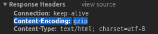
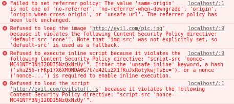

# 二、使用 ExpressJS 构建 Web 服务器

在本章中，我们将介绍以下配方：

*   ExpressJS 中的路由
*   模块化路由处理器
*   编写中间件函数
*   编写可配置中间件函数
*   编写路由级中间件函数
*   编写错误处理程序中间件函数
*   使用 ExpressJS 的内置中间件功能为静态资产提供服务
*   解析 HTTP 请求主体
*   压缩 HTTP 响应
*   使用 HTTP 请求记录器
*   管理和创建虚拟域
*   使用头盔保护 ExpressJS web 应用
*   使用模板引擎
*   调试 ExpressJS web 应用

# 技术要求

您需要具有 IDE、Visual Studio 代码、Node.js 和 MongoDB。您还需要安装 Git，以便使用本书的 Git 存储库

本章代码文件可在 GitHub 上找到：
[https://github.com/PacktPublishing/MERN-Quick-Start-Guide/tree/master/Chapter02](https://github.com/PacktPublishing/MERN-Quick-Start-Guide/tree/master/Chapter02)

查看以下视频以查看代码的运行：
[https://goo.gl/xXhqWK](https://goo.gl/xXhqWK)

# 介绍

ExpressJS 是构建健壮的 web 应用和 API 的首选事实上的 Node.js web 应用框架。

在本章中，菜谱将着重于构建一个功能齐全的 web 服务器，并理解核心基础知识。

# ExpressJS 中的路由

路由是指当通过 HTTP 谓词或 HTTP 方法请求资源时，应用如何响应或操作。

**HTTP**代表**超文本传输协议**，是**万维网**（**WWW**的数据通信基础。WWW 中的所有文档和数据都由**统一资源定位器**（**URL**标识）。

HTTP 谓词或 HTTP 方法是*客户机-服务器*模型。通常，web 浏览器充当*客户端*，在我们的例子中，ExpressJS 是一个框架，允许我们创建一个能够理解这些请求的*服务器*。每个请求都希望向客户端发送响应，以识别其请求的资源的状态。

请求方法可以是：

*   **安全**：在服务器上执行只读操作的 HTTP 谓词。换句话说，它不会改变服务器状态。例如：`GET`。
*   **幂等元**：当发出相同请求时，在服务器上具有相同效果的 HTTP 谓词。例如，如果在发送多个相同的请求时正确执行，则发送修改用户名字的`PUT`请求在服务器上应具有相同的效果。所有的*安全*方法也是幂等的。例如，`GET`、`PUT`和`DELETE`方法是幂等的。
*   **可缓存**：可以缓存的 HTTP 响应。并非所有方法或 HTTP 谓词都可以缓存。只有当响应的*状态代码*和用于发出请求的方法都可缓存时，响应才可缓存。例如，GET 方法是可缓存的，状态代码如下：`200`（请求成功）、`204`（无内容）、`206`（部分内容）、`301`（永久移动）、`404`（未找到）、`405`（不允许使用方法）、`410`（已从服务器中永久删除内容）和`414`（URI 太长）。

# 准备

理解路由是构建健壮的 RESTful API 最重要的核心方面之一。

在这个配方中，我们将看到 ExpressJS 如何处理或解释 HTTP 请求。开始之前，创建一个新的`package.json`文件，包含以下内容：

```js
{ 
    "dependencies": { 
        "express": "4.16.3" 
    } 
} 
```

然后，通过打开终端并运行以下命令来安装依赖项：

```js
    npm install

```

ExpressJS 完成了理解客户请求的全部工作。例如，请求可能来自浏览器。解释请求后，ExpressJS 将所有信息保存在两个对象中：

*   **请求**：包含客户请求的所有数据和信息。例如，ExpressJS 解析 URI 并使其参数在 request.query 上可用。
*   **响应**：包含将发送给客户端的数据和信息。在将信息发送到客户端之前，也可以修改响应的标题。`response`对象有几种方法可用于向客户端发送状态代码和数据。例如：`response.status(200).send('Some Data!')`。

# 怎么做。。。

`Request`和`Response`对象作为参数传递给`route`方法中定义的*路由处理程序*。

# 路由方法

这些派生自 HTTP 谓词或 HTTP 方法。路由方法用于定义应用对特定 HTTP 谓词的响应。

ExpressJS 路由方法的名称与 HTTP 谓词相同。例如：`app.get()`表示`GET`HTTP 动词，或者`app.delete()`表示`DELETE`HTTP 动词。

一条非常基本的路线可以写成如下：

1.  创建一个名为`1-basic-route.js`的新文件
2.  首先包括 ExpressJS 库并初始化新的 ExpressJS 应用：

```js
      const express = require('express') 
      const app = express() 
```

3.  添加一个新的路由方法来处理路径`"/"`的请求。第一个参数指定路径或 URL，下一个参数是路由处理程序。在路由处理程序中，让我们使用`response`对象向客户端发送状态代码`200 (OK)`和文本：

```js
      app.get('/', (request, response, nextHandler) => { 
          response.status(200).send('Hello from ExpressJS') 
      }) 
```

4.  最后，使用`listen`方法接受端口`1337`上的新连接：

```js
      app.listen( 
         1337, 
          () => console.log('Web Server running on port 1337'), 
      ) 
```

5.  保存文件
6.  打开终端并运行以下命令：

```js
 node 1-basic-route.js 
```

7.  在浏览器上打开一个新选项卡，并访问 web 浏览器中端口`1337`上的`localhost`以查看结果：

```js
      http://localhost:1337/
```

For more information about which HTTP methods are supported by ExpressJS, visit the official ExpressJS website at [https://expressjs.com/en/guide/routing.html#route-methods](https://expressjs.com/en/guide/routing.html#route-methods).

# 路由处理程序

路由处理程序是接受三个参数的回调函数。第一个是`request`对象，第二个是`response`对象，最后一个是`callback,`，它将处理程序传递给链中的下一个请求处理程序。在路由方法中也可以使用多个`callback`功能。

让我们看一个如何在路由方法中编写路由处理程序的工作示例：

1.  创建一个名为`2-route-handlers.js`的新文件
2.  包括 ExpressJS 库，然后初始化新的 ExpressJS 应用：

```js
      const express = require('express') 
      const app = express() 
```

3.  添加两种路由方法处理同一路径`"/one"`中的请求。使用`response`对象的`type`方法将发送给客户端的响应内容类型设置为`text/plain`。使用`write`方法向客户端发送部分数据。要完成发送数据，请使用响应对象的`end`方法。调用`nextHandler`会将处理程序传递给链中的第二个处理程序：

```js
      app.get('/one', (request, response, nextHandler) => { 
          response.type('text/plain') 
          response.write('Hello ') 
          nextHandler() 
      }) 
      app.get('/one', (request, response, nextHandler) => { 
         response.status(200).end('World!') 
      }) 
```

4.  添加一个`route`方法来处理路径`"/two"`中的请求。`route`方法中定义了两个路由处理程序来处理相同的请求：

```js
      app.get('/two', 
          (request, response, nextHandler) => { 
             response.type('text/plain') 
             response.write('Hello ') 
             nextHandler() 
         }, 
          (request, response, nextHandler) => { 
             response.status(200).end('Moon!') 
         } 
      ) 
```

5.  使用`listen`方法接受端口`1337`上的新连接：

```js
      app.listen( 
         1337, 
         () => console.log('Web Server running on port 1337'), 
     ) 
```

6.  保存文件
7.  打开终端并运行：

```js
    node 2-route-handlers.js  
```

8.  要查看结果，请在 web 浏览器中打开新选项卡，然后访问：

```js
 http://localhost:1337/one http://localhost:1337/two  
```

# 可链接路由方法

使用`app.route(path)`可以链接路由方法，因为`path`是为单个位置指定的。在处理多个路由方法时，这可能是最好的方法，因为除了使代码更可读、更不容易出错和冗余外，它还允许同时处理多个路由方法。

1.  创建一个名为`3-chainable-routes.js`的新文件
2.  初始化新的 ExpressJS 应用：

```js
      const express = require('express') 
      const app = express() 
```

3.  使用`route`方法连锁三种路径方法：

```js
      app 
      .route('/home') 
      .get((request, response, nextHandler) => { 
          response.type('text/html') 
          response.write('<!DOCTYPE html>') 
          nextHandler() 
      }) 
      .get((request, response, nextHandler) => { 
          response.end(` 
          <html lang="en"> 
              <head> 
              <meta charset="utf-8"> 
              <title>WebApp powered by ExpressJS</title> 
              </head> 
              <body role="application"> 
                  <form method="post" action="/home"> 
                      <input type="text" /> 
                      <button type="submit">Send</button> 
                  </form> 
              </body> 
          </html> 
          `) 
      }) 
      .post((request, response, nextHandler) => { 
          response.send('Got it!') 
      }) 
```

4.  使用`listen`方法接受端口`1337`上的新连接：

```js
      app.listen( 
          1337, 
          () => console.log('Web Server running on port 1337'), 
      ) 
```

5.  保存文件
6.  打开终端并运行：

```js
 node 3-chainable-routes.js
```

7.  要查看结果，请在 web 浏览器中打开新选项卡，然后访问：

```js
      http://localhost:1337/home
```

# 还有更多。。。

路由路径可以是字符串或正则表达式。路由路径使用`path-to-regexp`NPM 包[在内部转换为正则表达式 https://www.npmjs.com/package/path-to-regexp](https://www.npmjs.com/package/path-to-regexp) 。

`path-to-regexp`在某种程度上，可以帮助您以更易读的方式编写路径正则表达式。例如，考虑下面的代码：

```js
app.get(/([a-z]+)-([0-9]+)$/, (request, response, nextHandler) => { 
    response.send(request.params) 
}) 
// Output: {"0":"abc","1":"12345"} for path /abc-12345 
```

可以这样写：

```js
app.get('/:0-:1', (request, response, nextHandler) => { 
    response.send(request.params) 
}) 
// Outputs: {"0":"abc","1":"12345"} for /abc-12345 
```

或者更好：

```js
app.get('/:id-:tag', (request, response, nextHandler) => { 
    response.send(request.params) 
}) 
// Outputs: {"id":"abc","tag":"12345"} for /abc-12345 
```

看看这个表达：`/([a-z]+)-([0-9]+)$/`。正则表达式中的括号称为**捕获括号**；当他们找到匹配的时候，他们会记得。在上例中，对于`abc-12345`，记住了两个字符串`{"0":"abc","1":"12345"}`。这是 ExpressJS 查找匹配项、记住其值并将其与键关联的方式：

```js
app.get('/:userId/:action-:where', (request, response, nextHandler) => { 
    response.send(request.params) 
}) 
// Route path: /123/edit-profile 
// Outputs: {"userId":"123","action":"edit","where":"profile"} 
```

# 模块化路由处理器

ExpressJS 有一个名为**路由**的内置类。路由只是一个允许开发人员编写可装载和模块化路由处理程序的类。

**路由**是 ExpressJS 核心路由系统的一个实例。这意味着 ExpressJS 应用中的所有路由方法都可用：

```js
const router = express.Router() 
router.get('/', (request, response, next) => { 
  response.send('Hello there!') 
}) 
router.post('/', (request, response, next) => { 
  response.send('I got your data!') 
}) 
```

# 准备

在这个配方中，我们将看到如何使用路由来制作模块化应用。开始之前，创建一个新的`package.json`文件，包含以下内容：

```js
{ 
    "dependencies": { 
        "express": "4.16.3" 
    } 
} 
```

然后，通过打开终端并运行以下命令来安装依赖项：

```js
    npm install

```

# 怎么做。。。

假设您希望在 ExpressJS 主应用中编写一个模块化的迷你应用，该应用可以装载到任何 URI。您希望能够选择装载它的路径，或者只希望将相同的路由方法和处理程序装载到多个其他路径或一个 URI。

1.  创建一个名为`modular-router.js`的新文件
2.  初始化新的 ExpressJS 应用：

```js
      const express = require('express') 
      const app = express() 
```

3.  为您的迷你应用定义路由，并添加请求方法来处理路径`"/home"`的请求：

```js
      const miniapp = express.Router() 
      miniapp.get('/home', (request, response, next) => { 
          const url = request.originalUrl 
          response 
              .status(200) 
              .send(`You are visiting /home from ${url}`) 
      }) 
```

4.  将模块化迷你应用装载到`"/first"`路径和`"/second"`路径：

```js
      app.use('/first', miniapp) 
      app.use('/second', miniapp) 
```

5.  侦听端口`1337`上的新连接：

```js
      app.listen( 
          1337, 
          () => console.log('Web Server running on port 1337'), 
      ) 
```

6.  保存文件
7.  打开终端并运行以下命令：

```js
 node modular-router.js
```

8.  要查看结果，请在 web 浏览器中导航到：

```js
      http://localhost:1337/first/home
      http://localhost:1337/second/home
```

您将看到两种不同的输出：

```js
You are visting /home from /first/home 
You are visting /home from /second/home 
```

可以看出，*路由*安装在两个不同的安装点上。路由通常被称为迷你应用，因为它们可以装载到 ExpressJS 应用的特定路由，并且不仅可以装载一次，还可以装载多次到不同的装载点、路径或 URI。

# 编写中间件函数

中间件功能主要用于修改`request`和`response`对象。它们一个接一个地按顺序执行，但如果中间件功能没有将控制权传递给下一个，则请求将挂起。

# 准备

中间件功能具有以下签名：

```js
app.use((request, response, next) => { 
    next() 
}) 
```

签名与编写路由处理程序非常相似。事实上，可以为特定的 HTTP 方法和特定的路径路由编写中间件函数，如下所示，例如：

```js
app.get('/', (request, response, next) => { 
    next() 
}) 
```

因此，如果您想知道路由处理程序和中间件功能之间的区别，答案很简单：它们的用途。

如果您正在编写路由处理程序，并且修改了`request`对象和/或`response`对象，那么您正在编写中间件函数。

在本配方中，您将看到如何使用中间件功能限制对特定路径或路由的访问，这些路径或路由取决于特定条件。开始之前，创建一个新的`package.json`文件，包含以下内容：

```js
{ 
    "dependencies": { 
        "express": "4.16.3" 
    } 
} 
```

然后，通过打开终端并运行以下命令来安装依赖项：

```js
    npm install 
```

# 怎么做。。。

我们将编写一个中间件函数，仅当查询参数`allowme`存在时才允许访问根路径`"/"`：

1.  创建一个名为`middleware-functions.js`的新文件
2.  初始化新的 ExpressJS 应用：

```js
      const express = require('express') 
      const app = express() 
```

3.  编写一个中间件函数，将属性`allowed`添加到`request`对象：

```js
      app.use((request, response, next) => { 
          request.allowed = Reflect.has(request.query, 'allowme') 
          next() 
      }) 
```

4.  添加一个请求方法来处理路径`"/"`的请求：

```js
      app.get('/', (request, response, next) => { 
          if (request.allowed) { 
              response.send('Hello secret world!') 
          } else { 
              response.send('You are not allowed to enter') 
          } 
      }) 
```

5.  在端口`1337`上侦听新连接：

```js
      app.listen( 
          1337, 
          () => console.log('Web Server running on port 1337'), 
      ) 
```

6.  保存文件
7.  打开终端并运行：

```js
 node middleware-functions.js

```

8.  要查看结果，请在 web 浏览器中导航到：

```js
http://localhost:1337/
      http://localhost:1337/?allowme
```

# 它是如何工作的。。。

与路由处理程序一样，中间件功能需要将控制权传递给下一个处理程序；否则，我们的应用将被挂起，因为没有向客户端发送数据，并且连接也没有关闭。

如果向中间件函数内的`request`或`response`对象添加了新属性，则下一个处理程序将有权访问这些新属性。在我们之前编写的代码中，`request`对象中的`allowed property`可供下一个处理程序使用。

# 编写可配置中间件函数

编写中间件函数的一种常见模式是将中间件函数包装到另一个函数中。这样做的结果是一个可配置的中间件功能。它们也是*高阶函数*，即返回另一个函数的函数。

```js
const fn = (options) => (response, request, next) => {  
    next()  
} 
```

通常使用对象作为`options`参数。然而，没有什么能阻止你以自己的方式去做。

# 准备

在此配方中，您将编写一个可配置的记录器中间件函数。开始之前，创建一个新的`package.json`文件，包含以下内容：

```js
{ 
    "dependencies": { 
        "express": "4.16.3" 
    } 
} 
```

然后，通过打开终端并运行以下命令来安装依赖项：

```js
    npm install

```

# 怎么做。。。

您的可配置中间件功能将做的很简单：当发出请求时，它将打印状态代码和 URL。

1.  创建一个名为`middleware-logger.js`的新文件

2.  导出接受对象作为第一个参数的函数。函数期望对象有一个属性`enable`，可以是`true`或`false`：

```js
      const logger = (options) => (request, response, next) => { 
          if (typeof options === 'object' 
              && options !== null 
              && options.enable) { 
              console.log( 
                  'Status Code:', response.statusCode, 
                  'URL:', request.originalUrl, 
              ) 
          } 
          next() 
      } 
      module.exports = logger 
```

3.  保存文件

# 让我们测试一下。。。

我们的可配置中间件功能本身并不有用。创建一个简单的 ExpressJS 应用，以查看我们的中间件是否实际工作：

1.  创建一个名为`configurable-middleware-test.js`的新文件
2.  包括我们的`middleware-logger.js`模块并初始化新的 ExpressJS 应用：

```js
       const express = require('express') 
       const loggerMiddleware = require('./middleware-logger') 
       const app = express() 
```

3.  使用`use`方法包含我们的可配置中间件功能。当您的 URL`enable`和 logger 的状态为`true`时，您的属性将被设置为【工作】：

```js
      app.use(loggerMiddleware({ 
         enable: true, 
      })) 
```

4.  在端口`1337`上侦听新连接：

```js
      app.listen( 
           1337, 
           () => console.log('Web Server running on port 1337'), 
         ) 
```

5.  保存文件
6.  打开终端并运行：

```js
 node middleware-logger-test.js
```

7.  在浏览器中，导航到：

```js
      http://localhost:1337/hello?world
```

8.  终端应显示：

```js
 Status Code: 200 URL: /hello?world
```

# 还有更多。。。

如果要进行实验，请启动可配置中间件测试应用，并将`enable`属性设置为`false`。不应显示任何日志。

通常，您希望禁用生产日志记录，因为此操作可能会影响性能。

禁用所有日志记录的替代方法是使用其他库来完成此任务，而不是使用`console`。还有一些库允许您设置不同级别的日志记录，例如：

*   **调试模块**：[https://www.npmjs.com/package/debug](https://www.npmjs.com/package/debug)
*   **温斯顿**：[https://www.npmjs.com/package/winston](https://www.npmjs.com/package/winston)

日志记录之所以有用，有几个原因。主要原因是:

*   它检查您的服务是否正常运行，例如，检查您的应用是否连接到 MongoDB。
*   它会发现错误和 bug。
*   它帮助您更好地了解应用的工作方式。例如，如果您有一个模块化应用，您可以看到它在包含在其他应用中时是如何集成的。

# 编写路由级中间件函数

路由级中间件功能仅在路由内部执行。它们通常用于将中间件仅应用于装载点或特定路径。

# 准备

在此配方中，您将创建一个小型记录器路由级中间件功能，该功能将只记录对已安装路径或位于路由已安装路径中的路径的请求。开始之前，创建一个新的`package.json`文件，包含以下内容：

```js
{ 
    "dependencies": { 
        "express": "4.16.3" 
    } 
} 
```

然后，通过打开终端并运行以下命令来安装依赖项：

```js
npm install
```

# 怎么做。。。

1.  创建一个名为`router-level.js`的新文件
2.  初始化新的 ExpressJS 应用并定义路由：

```js
      const express = require('express') 
      const app = express() 
      const router = express.Router() 
```

3.  定义我们的记录器中间件功能：

```js
      router.use((request, response, next) => { 
          console.log('URL:', request.originalUrl) 
          next() 
      }) 
```

4.  将路由挂载到路径`"/router"`

```js
      app.use('/router', router) 
```

5.  在端口`1337`上侦听新连接：

```js
     app.listen( 
         1337, 
       () => console.log('Web Server running on port 1337'), 
    ) 
```

6.  保存文件
7.  打开终端并运行：

```js
 node router-level.js
```

8.  在 web 浏览器中，导航到：

```js
 http://localhost:1337/router/example 
```

9.  终端应显示：

```js
 URL: /router/example
```

10.  之后，在 web 浏览器中导航到：

```js
      http://localhost:1337/example
```

11.  终端中不应显示任何日志

# 还有更多。。。

可以通过调用`next('router')`将控制权传递回路由外部的下一个中间件功能或路由方法。

```js
router.use((request, response, next) => { 
  next('route') 
}) 
```

例如，通过创建期望接收用户 ID 作为查询参数的路由。当没有提供用户 ID 时，`next('router')`功能可用于退出路由或将控制权传递给路由外的下一个中间件功能。路由的下一个中间件功能可用于在路由将控制权传递给它时显示其他信息。例如：

1.  创建一个名为`router-level-control.js`的新文件
2.  初始化新的 ExpressJS 应用：

```js
      const express = require('express') 
      const app = express() 
```

3.  定义新路由：

```js
      const router = express.Router() 
```

4.  在路由内定义记录器中间件功能：

```js
      router.use((request, response, next) => { 
         if (!request.query.id) { 
             next('router') // Next, out of Router 
          } else { 
            next() // Next, in Router 
          } 
      }) 
```

5.  添加一个路由方法来处理路径`"/"`的`GET`请求，只有在中间件功能将控制权传递给路径`"/"`时才会执行：

```js
       router.get('/', (request, response, next) => { 
         const id = request.query.id 
         response.send(`You specified a user ID => ${id}`) 
      }) 
```

6.  添加路由方法来处理路由外部路径`"/"`的`GET`请求。但是，将路由作为路由处理程序作为第二个参数，并将另一个路由处理程序作为第二个参数，仅当路由将控制权传递给它时，才处理相同的请求：

```js
      app.get('/', router, (request, response, next) => { 
          response 
            .status(400) 
            .send('A user ID needs to be specified') 
    }) 
```

7.  在端口`1337`上侦听新连接：

```js
      app.listen( 
          1337, 
          () => console.log('Web Server running on port 1337'), 
      ) 
```

8.  保存文件
9.  打开终端并运行：

```js
 node router-level-control.js
```

10.  要查看结果，请在浏览器中导航到：

```js
 http://localhost:1337/
      http://localhost:1337/?id=7331
```

# 它是如何工作的。。。

导航到第一个 URL（`http://localhost:1337/`时，显示以下消息：

```js
 A user ID needs to be specified 
```

这是因为路由中的中间件功能会检查查询中是否提供了`id`，并且因为没有，它会使用`next('router')`将控制传递给路由外部的下一个处理程序。

另一方面，当导航到第二个 URL（[时 http://localhost:1337/?id=7331](http://localhost:1337/?id=7331) ），显示以下消息：

```js
You specified a user ID => 7331 
```

这是因为，由于查询中提供了一个`id`，路由中的中间件功能将通过`next()`将控制权传递给路由中的下一个处理程序。

# 编写错误处理程序中间件函数

默认情况下，ExpressJS 已经包含一个内置的错误处理程序，它在所有中间件和路由处理程序的末尾执行。

有几种方法可以触发内置错误处理程序。当路由处理程序中发生错误时，一个是隐式的。例如：

```js
app.get('/', (request, response, next) => { 
    throw new Error('Oh no!, something went wrong!') 
}) 
```

另一种触发内置错误处理程序的方法是在将`error`作为参数传递给`next(error)`时显式的。例如：

```js
app.get('/', (request, response, next) => { 
    try { 
        throw new Error('Oh no!, something went wrong!') 
    } catch (error) { 
        next(error) 
    } 
}) 
```

The stack trace is displayed on the client side. If `NODE_ENV` is set to production, then the stack trace is not included.

也可以编写自定义错误处理程序中间件函数，它看起来与路由处理程序几乎相同，只是错误处理程序函数中间件希望接收四个参数：

```js
app.use((error, request, response, next) => { 
    next(error) 
}) 
```

考虑到`next(error)`是可选的。这意味着，如果指定，`next(error)`将把控制权移交给下一个错误处理程序。如果未定义其他错误处理程序，则控件将传递给内置的错误处理程序。

# 准备

在这个配方中，我们将看到如何创建自定义错误处理程序。开始之前，创建一个新的`package.json`文件，包含以下内容：

```js
{ 
    "dependencies": { 
        "express": "4.16.3" 
    } 
} 
```

然后，通过打开终端并运行以下命令来安装依赖项：

```js
    npm install
```

# 怎么做。。。

您将构建一个自定义错误处理程序，向客户端发送错误消息。

1.  创建一个名为`custom-error-handler.js`的新文件
2.  包括 ExpressJS 库，然后初始化新的 ExpressJS 应用：

```js
     const express = require('express') 
     const app = express() 
```

3.  定义一个新的路由方法来处理路径`"/"`的`GET`请求，每次抛出一个错误：

```js
      app.get('/', (request, response, next) => { 
          try { 
             throw new Error('Oh no!, something went wrong!') 
          } catch (err) { 
             next(err) 
           } 
      }) 
```

4.  定义自定义错误处理程序中间件函数以将错误消息发送回客户端浏览器：

```js
      app.use((error, request, response, next) => { 
          response.end(error.message) 
      }) 
```

5.  在端口`1337`上侦听新连接：

```js
      app.listen( 
          1337, 
          () => console.log('Web Server running on port 1337'), 
      ) 
```

6.  保存文件
7.  打开终端并运行：

```js
 node custom-error-handler.js
```

8.  在 web 浏览器中导航，以查看结果：

```js
      http://localhost:1337/
```

# 使用 ExpressJS 的内置中间件功能为静态资产提供服务

在 ExpressJS 的 4.x 版本之前，它依赖于 ConnectJS，这是一个 HTTP 服务器框架[https://github.com/senchalabs/connect](https://github.com/senchalabs/connect) 。事实上，大多数为 ConnectJS 编写的中间件在 ExpressJS 中也受支持。

从 ExpressJS 的 4.x 版本开始，它不再依赖于 ConnectJS，所有以前内置的中间件功能都被移动到单独的模块[https://expressjs.com/en/resources/middleware.html](https://expressjs.com/en/resources/middleware.html) 。

ExpressJS 4.x 及更新版本仅包含两个内置中间件功能。已经看到了第一个：内置的错误处理程序中间件函数。第二个是负责服务静态资产的`express.static`中间件功能。

`express.static`中间件功能基于`serve-static`模块[https://expressjs.com/en/resources/middleware/serve-static.html](https://expressjs.com/en/resources/middleware/serve-static.html) 。

`express.static`和`serve-static`的主要区别在于，第二个选项可以在 ExpressJS 之外使用。

# 准备

在这个菜谱中，您将看到如何构建一个 web 应用，以特定的路径为静态资产提供服务。开始之前，创建一个新的`package.json`文件，包含以下内容：

```js
{ 
    "dependencies": { 
        "express": "4.16.3" 
    } 
} 
```

然后，通过打开终端并运行以下命令来安装依赖项：

```js
npm install
```

# 怎么做。。。

1.  创建一个名为`public`的新目录
2.  进入新的`public`目录
3.  创建一个名为`index.html`的新文件
4.  添加以下代码：

```js
      <!DOCTYPE html> 
      <html lang="en"> 
      <head> 
          <meta charset="utf-8"> 
          <title>Simple Web Application</title> 
      </head> 
      <body> 
          <section role="application"> 
        <h1>Welcome Home!</h1> 
          </section> 
      </body> 
      </html> 
```

5.  保存文件
6.  导航回`public`目录
7.  创建一个名为`serve-static-assets.js`的新文件

8.  添加以下代码。初始化新的 ExpressJS 应用：

```js
      const express = require('express') 
      const path = require('path') 
      const app = express() 
```

9.  包含`express.static`可配置中间件功能，传递`index.html`文件所在的`/public`目录路径：

```js
      const publicDir = path.join(__dirname, './public') 
      app.use('/', express.static(publicDir)) 
```

10.  在端口`1337`上侦听新连接：

```js
      app.listen( 
          1337, 
          () => console.log('Web Server running on port 1337'), 
      ) 
```

11.  保存文件
12.  打开终端并运行：

```js
 node serve-static-assets.js
```

13.  要查看结果，请在浏览器中导航到：

```js
      http://localhost:1337/index.html
```

# 它是如何工作的。。。

将显示我们的`index.html`文件，因为我们指定`"/"`作为查找资产的根目录。

尝试将路径从`"/"`更改为`"/public"`。然后，您将能够看到`index.html`文件以及您想要包含在`/public`目录中的其他文件将可以在`http://localhost:1337/public/[fileName]`下访问。

# 还有更多。。。

让我们假设您有一个大项目，它提供几十个静态文件，包括图像、字体文件和 PDF 文档（关于隐私和法律的内容）等。您决定将它们保存在单独的文件中，但不想更改装载路径或 URI。例如，它们可以在`/public`下提供，但它们将存在于项目目录中的单独目录中：

首先，让我们创建第一个`public`目录，其中包含一个名为`index.html`的文件：

1.  如果在上一个配方中没有创建目录，请创建一个名为`public`的新目录
2.  进入新的`public`目录
3.  创建一个名为`index.html`的新文件
4.  添加以下代码：

```js
      <!DOCTYPE html> 
      <html lang="en"> 
      <head> 
          <meta charset="utf-8"> 
          <title>Simple Web Application</title> 
      </head> 
      <body> 
           <section role="application"> 
           <h1>Welcome Home!</h1> 
           </section> 
      </body> 
      </html> 
```

5.  保存文件

现在，让我们创建第二个公共目录，其中将包含另一个名为`second.html`的文件：

6.  移出`public`目录
7.  创建一个名为`another-public`的新目录
8.  进入新的`another-public`目录
9.  创建一个名为`second.html`的新空文件

10.  添加以下代码：

```js
      <!DOCTYPE html> 
      <html lang="en"> 
      <head> 
          <meta charset="utf-8"> 
          <title>Simple Web Application</title> 
      </head> 
     <body> 
          <section role="application"> 
           Welcome to Second Page! 
          </section> 
     </body> 
      </html> 
```

11.  保存文件

正如您所看到的，这两个文件都存在于不同的目录中。要在一个装载点下提供这些文件，请执行以下操作：

1.  移出`another-public`目录
2.  创建一个名为`router-serve-static.js`的新文件
3.  包括 ExpressJS 和 path 库。然后，初始化一个新的 ExpressJS 应用：

```js
      const express = require('express') 
      const path = require('path') 
      const app = express() 
```

4.  定义路由：

```js
      const staticRouter = express.Router() 
```

5.  使用`express.static`可配置中间件功能包括`public`和`another-public`两个目录：

```js
      const assets = { 
           first: path.join(__dirname, './public'), 
          second: path.join(__dirname, './another-public') 
      } 
       staticRouter 
          .use(express.static(assets.first)) 
          .use(express.static(assets.second)) 
```

6.  将路由安装到`"/"`路径：

```js
       app.use('/', staticRouter) 
```

7.  在端口`1337`上侦听新连接：

```js
      app.listen( 
          1337, 
           () => console.log('Web Server running on port 1337'), 
       ) 
```

8.  保存文件
9.  打开终端并运行：

```js
 node router-serve-static.js
```

10.  要查看结果，请在浏览器中导航到：

```js
 http://localhost:1337/index.html
      http://localhost:1337/second.html
```

11.  在一条路径下提供了位于不同位置的两个不同文件

If two or more files with the same name exist under different directories, only the first one found will be displayed on the client-side.

# 解析 HTTP 请求主体

`body-parser`是一个中间件功能，解析传入请求主体，并将其作为`request.body`[在`request`对象中可用 https://expressjs.com/en/resources/middleware/body-parser.html](https://expressjs.com/en/resources/middleware/body-parser.html) 。

此模块允许应用将传入请求解析为：

*   JSON
*   文本
*   原始（缓冲区原始传入数据）
*   URL 编码形式

该模块支持 gzip 的自动解压缩，并在压缩传入请求时对编码进行压缩。

# 准备

在这个配方中，您将看到如何使用`body-parser`NPM 模块解析从两种不同形式发送的内容体，这两种形式以两种不同的方式编码。开始之前，创建一个新的`package.json`文件，包含以下内容：

```js
{ 
    "dependencies": { 
        "body-parser": "1.18.2", 
        "express": "4.16.3" 
    } 
} 
```

然后，通过打开终端并运行以下命令来安装依赖项：

```js
npm install
```

# 怎么做。。。

将向用户显示两个表单，它们都将以两种不同的方式向我们的 web 服务器应用发送数据。第一个是 URL 编码的表单，而另一个将其正文编码为纯文本。

1.  创建一个名为`parse-form.js`的文件
2.  包括`body-parser`NPM 模块。然后，初始化一个新的 ExpressJS 应用：

```js
      const express = require('express') 
      const bodyParser = require('body-parser') 
      const app = express() 
```

3.  包括处理 URL 编码请求和纯文本请求的`body-parser`中间件功能：

```js
       app.use(bodyParser.urlencoded({ extended: true })) 
       app.use(bodyParser.text()) 
```

4.  增加一个新的路由方法来处理路径`"/"`的`GET`请求。使用两种表单提供 HTML 内容，这两种表单使用不同的编码提交数据：

```js
      app.get('/', (request, response, next) => { 
            response.send(` 
            <!DOCTYPE html> 
            <html lang="en"> 
            <head> 
              <meta charset="utf-8"> 
              <title>WebApp powered by ExpressJS</title> 
           </head> 
         <body> 
            <div role="application"> 
                <form method="post" action="/setdata"> 
                    <input name="urlencoded" type="text" /> 
                    <button type="submit">Send</button> 
                </form> 
               <form method="post" action="/setdata" 
                 enctype="text/plain"> 
                  <input name="txtencoded" type="text" /> 
                  <button type="submit">Send</button> 
               </form> 
           </div> 
        </body> 
        </html> 
       `) 
     }) 
```

5.  增加一个新的路由方法来处理路径`"/setdata"`的`POST`请求。在终端上显示`request.body`的内容：

```js
      app.post('/setdata', (request, response, next) => { 
          console.log(request.body) 
          response.end() 
      }) 
```

6.  在端口`1337`上侦听新连接：

```js
      app.listen( 
          1337, 
          () => console.log('Web Server running on port 1337'), 
      ) 
```

7.  保存文件
8.  打开终端并运行：

```js
 node parse-form.js
```

9.  在 web 浏览器中，导航到：

```js
      http://localhost:1337/
```

10.  在第一个输入框中填入任何数据并提交表格：
11.  在 web 浏览器中，导航回：

```js
      http://localhost:1337/
```

12.  在第二个输入框中填入任何数据并提交表格：
13.  检查端子中的输出

# 它是如何工作的。。。

终端输出类似于：

```js
{ 'urlencoded': 'Example' } 
txtencoded=Example 
```

上面使用了两个解析器：

1.  第一个`bodyParser.urlencoded()`解析`multipart/form-data`编码类型的传入请求。结果可作为`request.body`中的**对象**使用
2.  第二个`bodyParser.text()`解析`text/plain`编码类型的传入请求。结果可作为`request.body`中的**字符串**使用

# 压缩 HTTP 响应

**压缩**是一个中间件功能，它压缩将发送给客户端的响应体。本模块使用`zlib`模块[https://nodejs.org/api/zlib.html](https://nodejs.org/api/zlib.html) 支持以下内容编码机制：

*   gzip
*   瘪下来

`Accept-Encoding`HTTP 头用于确定客户端（例如 web 浏览器）支持哪种内容编码机制，`Content-Encoding`HTTP 头用于告知客户端响应主体应用了哪种内容编码机制。

`compression`是一个可配置的中间件功能。它接受一个`options`对象作为第一个参数来定义中间件的特定行为，并传递`zlib`选项。

# 准备

在这个配方中，我们将看到如何配置和使用`compression`NPM 模块来压缩发送给客户端的请求正文。开始之前，创建一个新的`package.json`文件，包含以下内容：

```js
{ 
    "dependencies": { 
        "compression": "1.7.2", 
        "express": "4.16.3" 
    } 
} 
```

然后，通过打开终端并运行以下命令来安装依赖项：

```js
    npm install
```

# 怎么做。。。

1.  创建一个名为`compress-site.js`的新文件
2.  包括`compression`NPM 模块。然后，初始化一个新的 ExpressJS 应用：

```js
      const express = require('express') 
      const compression = require('compression') 
      const app = express() 
```

3.  包括`compression`中间件功能。指定压缩到 AutoT2（最佳压缩）和 AUT T3 的压缩的 T1 T1，或者响应应该考虑压缩响应体的字节的最小大小，以字节 T4 字节：

```js
      app.use(compression({ level: 9, threshold: 0 })) 
```

4.  定义一个路由方法来处理路径`"/"`的`GET`请求，路径`"/"`将提供我们希望压缩的样本 HTML 内容，并将打印客户端接受的编码：

```js
      app.get('/', (request, response, next) => { 
          response.send(` 
          <!DOCTYPE html> 
          <html lang="en"> 
          <head> 
              <meta charset="utf-8"> 
              <title>WebApp powered by ExpressJS</title> 
          </head> 
          <body> 
              <section role="application"> 
                  <h1>Hello! this page is compressed!</h1> 
              </section> 
          </body> 
         </html> 
          `) 
          console.log(request.acceptsEncodings()) 
     }) 
```

5.  在端口`1337`上侦听新连接：

```js
      app.listen( 
          1337, 
          () => console.log('Web Server running on port 1337'), 
      ) 
```

6.  保存文件
7.  打开终端并运行：

```js
 node compress-site.js 
```

8.  在浏览器中，导航到：

```js
      http://localhost:1337/
```

# 它是如何工作的。。。

终端的输出将显示客户端（例如 web 浏览器）支持的内容编码机制。它可能看起来像这样：

```js
 [ 'gzip', 'deflate', 'sdch', 'br', 'identity' ]

```

`compression`内部使用客户端发送的内容编码机制，了解是否支持压缩。如果不支持压缩，则响应主体不被压缩。

如果打开 Chrome Dev Tools 或类似工具并分析请求，则服务器发送的`Content-Encoding`头指示`compression`使用的内容编码机制类型。



Chrome Dev Tools | Network Tab displaying Response Headers

`compression`库将`Content-Encoding`头设置为用于压缩响应体的编码机制。

The `threshold` option is set by default to 1 KB which means that if the response size is below the number of bytes specified, then it is not compressed. Set it to 0 or `false` to compress the response even when the size is below 1 KB

# 使用 HTTP 请求记录器

如前所述，编写请求记录器很简单。然而，写我们自己的可能需要宝贵的时间。幸运的是，还有其他几种选择。例如，广泛使用的一个非常流行的 HTTP 请求记录器是 morgan[https://expressjs.com/en/resources/middleware/morgan.html](https://expressjs.com/en/resources/middleware/morgan.html) 。

**morgan**是一个可配置的中间件函数，采用两个参数`format`和`options`，用于指定日志的显示格式以及需要显示的信息类型。

有几种预定义格式：

*   `tiny`：最小输出
*   `short`：同 tiny，含远程 IP 地址
*   `common`：标准 Apache 日志输出
*   `combined`：标准 Apache 组合日志输出
*   `dev`：显示与微格式相同的信息。但是，响应状态是彩色的。

# 准备

创建具有以下内容的新`package.json`文件：

```js
{ 
    "dependencies": { 
        "express": "4.16.3", 
        "morgan": "1.9.0" 
    } 
} 
```

然后，通过打开终端并运行以下命令来安装依赖项：

```js
npm install
```

# 怎么做。。。

让我们构建一个工作示例。我们将包括具有`dev`格式的**morgan**可配置中间件功能，以显示每个请求的信息。

1.  创建一个名为`morgan-logger.js`的新文件
2.  初始化新的 ExpressJS 应用：

```js
      const express = require('express') 
      const morgan = require('morgan') 
      const app = express() 
```

3.  包括`morgan`可配置中间件。传递`'dev'`作为我们将用作中间件函数第一个参数的格式：

```js
      app.use(morgan('dev')) 
```

4.  定义一个路由方法来处理所有`GET`请求：

```js
      app.get('*', (request, response, next) => { 
          response.send('Hello Morgan!') 
      }) 
```

5.  在端口`1337`上侦听新连接：

```js
      app.listen( 
          1337, 
          () => console.log('Web Server running on port 1337'), 
     ) 
```

6.  保存文件
7.  打开终端并运行：

```js
 node morgan-logger.js
```

8.  要在终端中查看结果，请在 web 浏览器中导航到：

```js
        http://localhost:1337/
        http://localhost:1337/example
```

# 管理和创建虚拟域

使用 ExpressJS 管理虚拟域非常简单。假设您有两个或更多的子域，并且希望为两个不同的 web 应用提供服务。但是，您不希望为每个子域创建不同的 web 服务器应用。在这种情况下，ExpressJS 允许开发人员使用**vhost**[在单个 web 服务器应用中管理虚拟域 https://expressjs.com/en/resources/middleware/vhost.html](https://expressjs.com/en/resources/middleware/vhost.html) 。

**vhost**是一个可配置的中间件函数，它接受两个参数。第一个是`hostname`。第二个参数是`hostname`匹配时将调用的请求处理程序。

`hostname`遵循与路由路径相同的规则。它们可以是字符串或正则表达式。

# 准备

创建具有以下内容的新`package.json`文件：

```js
{ 
    "dependencies": { 
        "express": "4.16.3", 
        "vhost": "3.0.2" 
    } 
} 
```

然后，通过打开终端并运行以下命令来安装依赖项：

```js
npm install
```

# 怎么做。。。

使用**路由**构建两个小型应用，将在两个不同的子域中提供服务：

1.  创建一个名为`virtual-domains.js`的新文件
2.  包括`vhost`NPM 模块。然后，初始化一个新的 ExpressJS 应用：

```js
      const express = require('express') 
      const vhost = require('vhost') 
      const app = express() 
```

3.  定义用于构建两个小型应用的两个路由：

```js
      const app1 = express.Router() 
      const app2 = express.Router() 
```

4.  添加一个路由方法来处理第一个路由中路径`"/"`的`GET`请求：

```js
      app1.get('/', (request, response, next) => { 
        response.send('This is the main application.') 
      }) 
```

5.  添加一个路由方法来处理第二个路由中路径`"/"`的`GET`请求：

```js
      app2.get('/', (request, response, next) => { 
         response.send('This is a second application.') 
     }) 
```

6.  将路由安装到 ExpressJS 应用。在`localhost`项下送达第一份申请，在`second.localhost`项下送达第二份申请：

```js
      app.use(vhost('localhost', app1)) 
      app.use(vhost('second.localhost', app2)) 
```

7.  在端口`1337`上侦听新连接：

```js
      app.listen( 
         1337, 
         () => console.log('Web Server running on port 1337'), 
     ) 
```

8.  保存文件
9.  打开终端并运行：

```js
      node virtual-domains.js 
```

10.  要查看结果，请在 web 浏览器中导航到：

```js
        http://localhost:1337/
        http://second.localhost:1337/
```

# 还有更多。。。

`vhost`在`request`对象中添加一个`vhost object`，该对象包含完整的主机名（显示主机名和端口）、主机名（不带端口）和匹配字符串。这使您能够更好地控制如何处理虚拟域。

例如，我们可以编写一个应用，允许用户使用自己的名称拥有自己的子域：

1.  创建一个名为`user-subdomains.js`的新文件
2.  包括`vhost`NPM 模块。然后，初始化一个新的 ExpressJS 应用：

```js
      const express = require('express') 
      const vhost = require('vhost') 
      const app = express() 
```

3.  定义一个新路由。然后，添加一个路由方法来处理路径`"/"`上的`GET`请求。使用`vhost`对象访问子域数组：

```js
       const users = express.Router() 
       users.get('/', (request, response, next) => { 
        const username = request 
            .vhost[0] 
            .split('-') 
            .map(name => ( 
                name[0].toUpperCase() + 
                name.slice(1) 
             )) 
            .join(' ') 
        response.send(`Hello, ${username}`) 
     }) 
```

4.  安装路由：

```js
       app.use(vhost('*.localhost', users)) 
```

5.  在端口`1337`上侦听新连接：

```js
      app.listen( 
           1337, 
          () => console.log('Web Server running on port 1337'), 
      ) 
```

6.  保存文件
7.  打开终端并运行：

```js
      node user-subdomains.js 
```

8.  在 web 浏览器中导航，以查看结果：

```js
        http://john-smith.localhost:1337/
        http://jx-huang.localhost:1337/
        http://batman.localhost:1337/
```

# 使用头盔保护 ExpressJS web 应用

**头盔**允许保护 web 服务器应用免受常见攻击，例如**跨站点脚本（XSS）**、不安全请求和点击劫持。

头盔是 12 个中间件函数的集合，允许您设置特定的 HTTP 头：

1.  `Content Security Policy (CSP)`：这是将您的 web 应用中允许的外部资源（例如 JavaScript、CSS 和图像）列入白名单的有效方法。
2.  `Certificate Transparency`：这是一种为特定域或特定域颁发的证书提供更高透明度的方式[https://sites.google.com/a/chromium.org/dev/Home/chromium-security/certificate-transparency](https://sites.google.com/a/chromium.org/dev/Home/chromium-security/certificate-transparency) 。
3.  `DNS Prefetch Control`：这告诉浏览器是否应该对尚未加载的资源（如链接）执行域名解析（DNS）。
4.  `Frameguard`：这有助于防止**点击劫持**，告诉浏览器不要将您的 web 应用放在`iframe.`中
5.  `Hide Powered-By`：这只是隐藏了`X-Powered-By`标题，表示不显示为服务器提供动力的技术。ExpressJS 默认情况下将此标题设置为`"Express"`。
6.  `HTTP Public Key Pinning`：通过将 web 应用的公钥固定到`Public-Key-Pins`头，这有助于防止**中间人攻击**。
7.  `HTTP Strict Transport Security`：这告诉浏览器严格遵守 web 应用的 HTTPs 版本。
8.  `IE No Open`：这可以防止 Internet Explorer 在您的站点上下文中执行不受信任的下载或 HTML 文件，从而防止恶意脚本的注入。
9.  `No Cache`：告知浏览器禁用浏览器缓存。
10.  `Don't Sniff Mimetype`：这将强制浏览器禁用 mime 嗅探或猜测服务文件的内容类型。

11.  `Referrer Policy`：referer 头向服务器提供请求发起地的相关数据。它允许开发者禁用它，或者为设置`referrer`头设置更严格的策略。
12.  `XSS Filter`：通过设置`X-XSS-Protection`头防止反射式跨站点脚本（XSS）攻击。

# 准备

在本配方中，我们将使用头盔提供的大多数中间件功能来保护我们的 ExpressJS web 应用免受常见攻击。开始之前，创建一个新的`package.json`文件，包含以下内容：

```js
{ 
    "dependencies": { 
        "body-parser": "1.18.2", 
        "express": "4.16.3", 
        "helmet": "3.12.0", 
        "uuid": "3.2.1" 
    } 
} 
```

然后，通过打开终端并运行以下命令来安装依赖项：

```js
npm install
```

# 怎么做。。。

1.  创建一个名为`secure-helmet.js`的新文件
2.  包括 ExpressJS、头盔和身体 NPM 模块：

```js
      const express = require('express') 
      const helmet = require('helmet') 
      const bodyParser = require('body-parser') 
      const uuid = require('uuid/v1') 
      const app = express() 
```

3.  生成一个随机 ID，该 ID 将用于`nonce`，这是一个用于白名单的 HTML 属性，允许在 HTML 代码中内联执行哪些脚本或样式：

```js
      const suid = uuid() 
```

4.  使用 body 解析器解析`json`和`application/csp-report`内容类型的 JSON 请求正文。`application/csp-report`是一种内容类型，包含一个类型为`json`的 JSON 请求主体，当违反一个或多个 CSP 规则时，浏览器会发送该请求主体：

```js
      app.use(bodyParser.json({ 
          type: ['json', 'application/csp-report'], 
      })) 
```

5.  使用`Content Security Policy`中间件功能定义指令。`defaultSrc`指定可以从何处加载资源。`self`选项指定仅从您自己的域加载资源。我们将使用`none`，这意味着不会加载任何资源。但是，由于我们将`scriptSrc`列为白名单，因此我们可以加载 Javascript 脚本，但只能加载那些具有我们将指定的`nonce`的脚本。`reportUri`用于告知浏览器在哪里发送我们`Content Security Policy`的违规报告：

```js
      app.use(helmet.contentSecurityPolicy({ 
          directives: { 
              // By default do not allow unless whitelisted 
              defaultSrc: [`'none'`], 
               // Only allow scripts with this nonce 
              scriptSrc: [`'nonce-${suid}'`], 
              reportUri: '/csp-violation', 
          } 
      })) 
```

6.  添加一个路由方法来处理`POST`路径`"/csp-violation"`的请求，以接收客户端的违规报告：

```js
      app.post('/csp-violation', (request, response, next) => { 
          const { body } = request 
          if (body) { 
             console.log('CSP Report Violation:') 
             console.dir(body, { colors: true, depth: 5 }) 
         } 
         response.status(204).send() 
      }) 
```

7.  使用`DNS Prefetch Control`中间件禁用资源预取：

```js
      app.use(helmet.dnsPrefetchControl({ allow: false })) 
```

8.  使用`Frameguard`中间件功能禁止您的应用加载到`iframe`中：

```js
      app.use(helmet.frameguard({ action: 'deny' })) 
```

9.  使用`hidePoweredBy`中间件功能替换`X-Powered-By`头并设置假头：

```js
      app.use(helmet.hidePoweredBy({ 
          setTo: 'Django/1.2.1 SVN-13336', 
      })) 
```

10.  使用`ieNoOpen`中间件功能禁用 IE 不可信执行：

```js
       app.use(helmet.ieNoOpen()) 
```

11.  使用`noSniff`中间件功能禁用 mime 类型猜测：

```js
      app.use(helmet.noSniff()) 
```

12.  使用`referrerPolicy`中间件功能使标头仅对我们的域可用：

```js
       app.use(helmet.referrerPolicy({ policy: 'same-origin' })) 
```

13.  使用`xssFilter`中间件功能防止反射的 XSS 攻击：

```js
      app.use(helmet.xssFilter()) 
```

14.  添加一个路由方法来处理路径`"/"`上的`GET`请求，并提供一个示例 HTML 内容，该内容将尝试从外部源加载图像，尝试执行内联脚本，并尝试加载未指定`nonce`的外部脚本。我们还将添加一个允许执行的有效脚本，因为将指定一个`nonce`属性：

```js
      app.get('/', (request, response, next) => { 
         response.send(` 
         <!DOCTYPE html> 
         <html lang="en"> 
         <head> 
             <meta charset="utf-8"> 
             <title>Web App</title> 
         </head> 
          <body> 
             <span id="txtlog"></span> 
               
             <script> 
                  alert('This does not get executed!') 
              </script> 
              <script src="http://evil.com/evilstuff.js"></script> 
              <script nonce="${suid}"> 
                  document.getElementById('txtlog') 
                    .innerText = 'Hello World!' 
              </script> 
           </body> 
         </html> 
       `) 
     }) 
```

15.  在端口`1337`上侦听新连接：

```js
     app.listen( 
          1337, 
         () => console.log('Web Server running on port 1337'), 
      ) 
```

16.  保存文件
17.  打开终端并运行：

```js
      node secure-helmet.js 
```

18.  要查看结果，请在 web 浏览器中导航到：

```js
        http://localhost:1337/
```

# 它是如何工作的。。。

关于`Helmet`的所有工作原理都非常简单。您可以通过选择并应用特定的`Helmet`中间件功能来指定要实施的安全措施，`Helmet`将完成设置将发送到客户端的正确头的工作。

在客户端（web 浏览器），任何东西都可以自己工作。web 浏览器负责解释服务器发送的头并应用安全策略。这也意味着旧浏览器不能支持或理解所有这些标题。尽管如此，如果您考虑到应用的安全性，那么没有很多好的理由支持旧的 web 浏览器。

例如，如果您使用的是 Chrome，您应该能够在控制台中看到类似的内容：



Chrome Dev Tools | Console displaying CSP violation

1.  在终端中，您应该能够看到浏览器发送的与以下内容类似的输出：

```js
      CSP Report Violation: { 
          "csp-report": { 
               "document-uri": "http://localhost:1337/", 
              "referrer": "", 
              "violated-directive": "img-src", 
              "effective-directive": "img-src", 
              "original-policy": "default-src 'none'; script-src              
         '[nonce]'; report-uri /csp-violation", 
              "disposition": "enforce", 
              "blocked-uri": "http://evil.com/pic.jpg", 
              "line-number": 9, 
              "source-file": "http://localhost:1337/", 
              "status-code": 200 
          } 
      }  
      CSP Report Violation: { 
          "csp-report": { 
              "document-uri": "http://localhost:1337/", 
              "referrer": "", 
              "violated-directive": "script-src", 
              "effective-directive": "script-src", 
              "original-policy": "default-src 'none'; script-src        
       '[nonce]'; report-uri /csp-violation", 
              "disposition": "enforce", 
              "blocked-uri": "inline", 
              "line-number": 9, 
              "status-code": 200 
          } 
      }  
      CSP Report Violation: { 
          "csp-report": { 
              "document-uri": "http://localhost:1337/", 
              "referrer": "", 
              "violated-directive": "script-src", 
              "effective-directive": "script-src", 
              "original-policy": "default-src 'none'; script-src 
      '[nonce]'; report-uri /csp-violation", 
              "disposition": "enforce", 
              "blocked-uri": "http://evil.com/evilstuff.js", 
              "status-code": 200 
          } 
      } 
```

# 使用模板引擎

模板引擎允许您以更方便的方式生成 HTML 代码。模板或视图可以以任何格式编写，由模板引擎解释，该引擎将用其他值替换变量，最后转换为 HTML。

在官方网站[上提供了一个使用 ExpressJS 开箱即用的模板引擎的大列表 https://github.com/expressjs/express/wiki#template-发动机](https://github.com/expressjs/express/wiki#template-engines)。

# 准备

在此配方中，您将构建自己的模板引擎。要开发和使用自己的模板引擎，首先需要注册它，然后定义视图所在的路径，最后告诉 ExpressJS 要使用哪个模板引擎。

```js
      app.engine('...', (path, options, callback) => { ... }); 
      app.set('views', './'); 
      app.set('view engine', '...'); 
```

开始之前，创建一个新的`package.json`文件，包含以下内容：

```js
      { 
          "dependencies": { 
              "express": "4.16.3" 
          } 
      } 
```

然后，通过打开终端并运行以下命令来安装依赖项：

```js
       npm install
```

# 怎么做。。。

首先创建一个包含简单模板的`views`目录：

1.  创建一个名为`views`的新目录
2.  在我们的`views`目录中创建一个名为`home.tpl`的新文件
3.  添加以下代码：

```js
      <!DOCTYPE html> 
       <html lang="en"> 
      <head> 
          <meta charset="utf-8"> 
          <title>Using Template Engines</title> 
      </head> 
      <body> 
          <section role="application"> 
              <h1>%title%</h1> 
              <p>%description%</p> 
          </section> 
      </body> 
      </html> 
```

4.  保存文件

现在，创建一个新的模板引擎，将以前的模板转换为 HTML，并用提供的选项替换`%[var]%`：

1.  移出`views`目录
2.  创建一个名为`my-template-engine.js`的新文件

3.  包括 ExpressJS 和 fs（文件系统）库。然后，初始化一个新的 ExpressJS 应用：

```js
      const express = require('express') 
      const fs = require('fs') 
      const app = express() 
```

4.  使用`engine`方法注册名为`tpl`的新模板引擎。我们将读取该文件的内容，并将`%[var]%`替换为`options`对象中指定的内容：

```js
       app.engine('tpl', (filepath, options, callback) => { 
           fs.readFile(filepath, (err, data) => { 
              if (err) { 
                 return callback(err) 
             } 
             const content = data 
                 .toString() 
                 .replace(/%[a-z]+%/gi, (match) => { 
                     const variable = match.replace(/%/g, '') 
                    if (Reflect.has(options, variable)) { 
                        return options[variable] 
                     } 
                    return match 
                }) 
              return callback(null, content) 
          }) 
     }) 
```

5.  定义视图所在的路径。我们的模板位于`views`目录中：

```js
       app.set('views', './views') 
```

6.  告诉 ExpressJS 使用我们的模板引擎：

```js
      app.set('view engine', 'tpl') 
```

7.  添加一个路由方法来处理路径`"/"`的`GET`请求，并呈现我们的主模板。提供将取代我们模板中的`%title%`和`%description%`的`title`和`description`选项：

```js
     app.get('/', (request, response, next) => { 
          response.render('home', { 
              title: 'Hello', 
               description: 'World!', 
         }) 
      }) 
```

8.  在端口`1337`上侦听新连接：

```js
      app.listen( 
          1337, 
          () => console.log('Web Server running on port 1337'), 
      ) 
```

9.  保存文件
10.  打开终端并运行：

```js
    node my-template-engine.js
```

11.  在浏览器中，导航到：

```js
      http://localhost:1337/
```

The template engine we just have wrote doesn't escape HTML characters. That means, you should be careful if replacing those properties with data gotten from the client because it may be vulnerable to XSS attacks. You may want to use a template engine from the official ExpressJS website that is safer.

# 调试 ExpressJS web 应用

在 ExpressJS 上调试有关 web 应用整个周期的信息很简单。ExpressJS 在内部使用**调试**NPM 模块记录信息。与`console.log`不同，**调试**日志可以在生产模式下轻松禁用。

# 准备

在此配方中，您将看到如何调试 ExpressJS web 应用。开始之前，创建一个新的`package.json`文件，包含以下内容：

```js
{ 
    "dependencies": { 
        "debug": "3.1.0", 
        "express": "4.16.3" 
    } 
} 
```

然后，通过打开终端并运行以下命令来安装依赖项：

```js
npm install
```

# 怎么做。。。

1.  创建一个名为`debugging.js`的新文件
2.  初始化新的 ExpressJS 应用：

```js
      const express = require('express') 
      const app = express() 
```

3.  添加路由方法来处理任何路径的`GET`请求：

```js
      app.get('*', (request, response, next) => { 
          response.send('Hello there!') 
      }) 
```

4.  在端口`1337`上侦听新连接：

```js
      app.listen( 
          1337, 
          () => console.log('Web Server running on port 1337'), 
      ) 
```

5.  保存文件
6.  打开终端并运行：
7.  在 Windows 上：

```js
 set DEBUG=express:* node debugging.js
```

8.  在 Linux 或 MacOS 上：

```js
 DEBUG=express:* node debugging.js 

```

9.  在 web 浏览器中，导航到：

```js
      http://localhost:1337/
```

10.  观察终端输出的日志

# 它是如何工作的。。。

`DEBUG`环境变量用于告知**调试**模块要调试 ExpressJS 应用的哪些部分。在我们之前编写的代码中，`express:*`告诉调试模块记录与 express 应用相关的所有内容。

我们可以使用`DEBUG=express:router`显示与 ExpressJS 的路由或路由相关的日志。

# 还有更多。。。

您可以在自己的项目中使用调试 NPM 模块。例如：

1.  创建一个名为`myapp.js`的新文件
2.  添加以下代码：

```js
      const express = require('express') 
      const app = express() 
      const debug = require('debug')('myapp') 
      app.get('*', (request, response, next) => { 
          debug('Request:', request.originalUrl) 
          response.send('Hello there!') 
      }) 
      app.listen( 
          1337, 
          () => console.log('Web Server running on port 1337'), 
      ) 
```

3.  保存文件
4.  打开终端并运行：
5.  在 Windows 上：

```js
    set DEBUG=myapp node myapp.js
```

6.  在 Linux 和 MacOS 上：

```js
 DEBUG=myapp node myapp.js
```

7.  在 web 浏览器中，导航到：
8.  观察终端的输出。它将显示如下内容：

```js
      Web Server running on port 1337 
        myapp Request: / +0ms 
```

您可以使用`DEBUG`环境变量告诉`debug`模块不仅要显示`myapp`的日志，还要显示 ExpressJS 的日志，如下所示：

在 Windows 上：

```js
set DEBUG=myapp,express:* node myapp.js 
```

在 Linux 和 MacOS 上：

```js
DEBUG=myapp,express:* node myapp.js
```