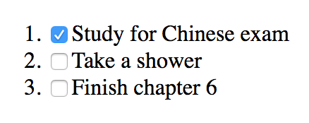

# 使用 React 构建 Web 应用程序

在本章中，我们将介绍以下配方：

*   了解 React 元素和 React 组件
*   组成成分
*   有状态组件和生命周期方法
*   使用 React.PureComponent
*   反应事件处理程序
*   组件的条件呈现
*   使用 React 呈现列表
*   在 React 中使用表单和输入
*   了解引用以及如何使用它们
*   理解门户
*   使用错误边界组件捕捉错误
*   使用 PropTypes 检查属性

# 技术要求

您需要了解 Go 编程语言，以及 web 应用程序框架的基础知识。您还需要安装 Git，以便使用本书的 Git 存储库。最后，在命令行上使用 IDE 进行开发的能力。

本章代码文件可在 GitHub 上找到：
[https://github.com/PacktPublishing/MERN-Quick-Start-Guide/tree/master/Chapter06](https://github.com/PacktPublishing/MERN-Quick-Start-Guide/tree/master/Chapter06)

查看以下视频以查看代码的运行：
[https://goo.gl/J7d7Ag](https://goo.gl/J7d7Ag)

# 介绍

React 是一个用于构建**用户界面**（**用户界面**的 JavaScript 库。React 是基于组件的，这意味着每个组件都可以独立于其他组件并管理自己的状态。通过组合组件可以创建复杂的 UI。

组件通常使用 JSX 语法（类似 XML 的语法）或使用`React.createElement`方法创建。然而，JSX 使 React 特别适合于以声明方式构建 web 应用程序。

In the MVC pattern, React is usually associated with the View.

# 了解 React 元素和 React 组件

可以使用 JSX 语法创建**React 元素**：

```js
const element = <h1>Example</h1> 
```

这转化为：

```js
const element = React.createElement('h1', null, 'Example') 
```

JSX 是 JavaScript 之上的语言扩展，允许您轻松创建复杂的 UI。例如，考虑以下内容：

```js
const element = ( 
    <details> 
        <summary>React Elements</summary> 
        <p>JSX is cool</p> 
    </details> 
) 
```

前面的示例可以在不使用 JSX 语法的情况下编写，如下所示：

```js
const element = React.createElement( 
    'details', 
    null, 
    React.createElement('summary', null, 'React Elements'), 
    React.createElement('p', null, 'JSX is cool'), 
  ) 
```

React 元素可以是任何 HTML5 标记，任何 JSX 标记都可以是自关闭的。例如，以下内容将创建一个段落 React 元素，其中包含空内容：

```js
const element = <p /> 
```

与使用 HTML5 的方式相同，您可以为 React 元素提供属性，称为 React 中的属性或道具：

```js
const element = ( 
    <input type="text" value="Example" readOnly /> 
) 
```

**React components**允许您将 web 应用程序的某些部分隔离为可重用的代码或组件。它们可以用几种方式定义。例如：

*   **功能组件**：这些是纯 JavaScript 函数，接受属性作为第一个参数并返回 React 元素：

```js
      const InputText = ({ name, children }) => ( 
          <input 
              type="text" 
              name={name} 
              value={children} 
              readOnly 
          />­ 
      ) 
```

*   **类组件**：使用 ES6 类可以定义生命周期方法并创建有状态组件。它们根据`render`方法呈现 React 元素：

```js
class InputText extends React.Component { 
    render() { 
              const { name, children } = this.props 
              return ( 
                  <input 
                      type="text" 
                      name={name} 
                      value={children} 
                      readOnly 
                  /> 
              ) 
          } 
      } 
```

*   **表达式**：这些表达式保留对 React 元素或组件实例的引用：

```js
const InstanceInputText = ( 
          <InputText name="username"> 
              Huang Jx 
          </InputText> 
      ) 
```

有一些特性是独特的，只是 React 的一部分。例如，`children`属性引用标记中包含的元素：

```js
<MyComponent> 
    <span>Example</span> 
</MyComponent> 
```

在上例中，`MyComponent`中接收的`children`属性将是`span`React 元素的实例。如果多个 React 元素或组件作为子元素传递，`children`属性将是一个数组。但是，如果没有子女通过，`children`属性将为`null`。`children`属性不一定是反应元素或成分；它也可以是 JavaScript 函数或 JavaScript 原语：

```js
<MyComponent> 
    {() => { 
        console.log('Example!') 
        return null
    }} 
</MyComponent> 
```

React 还考虑返回或呈现字符串（有效 React 组件）的功能组件和类组件。例如：

```js
const SayHi = ({ to }) => ( 
    `Hello ${to}` 
) 
const element = ( 
    <h1> 
        <SayHi to="John" />, how are you? 
    </h1> 
) 
```

React components' names must start with an uppercase letter. Otherwise, React will treat lowercased JSX tags as React elements

**在 React 中将组件**呈现给 DOM 并不是一项复杂的任务。React 提供了几种使用`ReactDOM`库向 DOM 呈现 React 组件的方法。React 使用 JSX 或`React.createElement`创建树或 DOM 树的表示。它是通过使用虚拟 DOM 来实现的，虚拟 DOM 允许 React 将 React 元素转换为 DOM 节点，并仅更新已更改的节点。

这是您通常使用`ReactDOM`库中的`render`方法呈现应用程序的方式：

```js
import * as ReactDOM from 'react-dom' 
import App from './App' 
ReactDOM.render( 
   <App />, 
   document.querySelector('[role="main"]'), 
) 
```

提供给`render`方法的第一个参数是 React 组件或 React 元素。第二个参数告诉您在 DOM 中呈现应用程序的位置。在前面的示例中，我们使用 document 对象中的`querySelector`方法查找属性`role`设置为`"main"`的 DOM 节点。

React 还允许您将 React 组件呈现为 HTML 字符串，这对于在服务器端生成内容并将内容作为 HTML 文件直接发送到浏览器非常有用：

```js
import * as React from 'react' 
import * as ReactDOMServer from 'react-dom/server' 
const OrderedList = ({ children }) => ( 
   <ol> 
      {children.map((item, indx) => ( 
         <li key={indx}>{item}</li> 
      ))} 
   </ol> 
) 
console.log( 
   ReactDOMServer.renderToStaticMarkup( 
      <OrderedList> 
         {['One', 'Two', 'Three']} 
      </OrderedList> 
   ) 
) 
```

它将在控制台中输出以下内容：

```js
<ol> 
   <li>One</li> 
   <li>Two</li> 
   <li>Three</li> 
</ol> 
```

# 准备

在本配方中，您将使用所学的有关 React 组件和 React 元素的概念创建一个简单的 React 应用程序。开始之前，创建一个新的`package.json`文件，包含以下内容：

```js
{ 
  "scripts": { 
    "start": "parcel serve -p 1337 index.html" 
  }, 
  "devDependencies": { 
    "babel-plugin-transform-class-properties": "6.24.1", 
    "babel-preset-env": "1.6.1", 
    "babel-preset-react": "6.24.1", 
    "babel-core": "6.26.3", 
    "parcel-bundler": "1.8.1", 
    "react": "16.3.2", 
    "react-dom": "16.3.2" 
  } 
} 
```

接下来，创建一个 babel 配置文件`.babelrc`，添加以下内容：

```js
{ 
    "presets": ["env","react"], 
    "plugins": ["transform-class-properties"] 
} 
```

然后，通过打开终端并运行以下命令来安装依赖项：

```js
npm install 
```

# 怎么做。。。

创建一个 React 应用程序，该应用程序将显示欢迎消息，并编写函数、类和表达式组件：

1.  创建一个名为`basics.js.`的新文件
2.  导入 React 和 ReactDOM 库：

```js
      import * as React from 'react' 
      import * as ReactDOM from 'react-dom' 
```

3.  定义一个新的功能组件，该组件将在其样式属性中将`span`React 元素的`color`设置为红色：

```js
      const RedText = ({ text }) => ( 
          <span style={{ color: 'red' }}> 
              {text} 
          </span> 
      ) 
```

4.  定义将呈现`h1`反应元素的另一个功能组件和`RedText`功能组件作为其`children`的一部分：

```js
      const Welcome = ({ to }) => ( 
          <h1>Hello, <RedText text={to}/></h1> 
      ) 
```

5.  定义将包含对 React 元素的引用的表达式：

```js
      const TodoList = ( 
          <ul> 
              <li>Lunch at 14:00 with Jenny</li> 
              <li>Shower</li> 
          </ul> 
      ) 
```

6.  定义一个名为`Footer`的类组件，它将显示当前日期：

```js
      class Footer extends React.Component { 
          render() { 
              return ( 
                  <footer> 
                      {new Date().toDateString()} 
                  </footer> 
              ) 
          } 
      } 
```

7.  将应用程序呈现到 DOM：

```js
      ReactDOM.render( 
          <div> 
              <Welcome to="John" /> 
              {TodoList} 
              <Footer /> 
          </div>, 
          document.querySelector('[role="main"]'), 
      ) 
```

8.  保存文件。

然后，创建一个`index.html`文件，在其中呈现 React 应用程序：

1.  创建一个名为`index.html`的新文件
2.  添加以下代码：

```js
      <!DOCTYPE html> 
      <html lang="en"> 
      <head> 
          <meta charset="UTF-8"> 
          <title>MyApp</title> 
      </head> 
      <body> 
          <div role="main"></div> 
          <script src="./basics.js"></script> 
      </body> 
      </html> 
```

3.  保存文件

# 让我们测试一下。。。

要查看以前的工作，请执行以下操作：

1.  在项目目录的根目录下打开终端并运行：

```js
 npm start
```

2.  然后，在 web 浏览器中打开一个新选项卡并转到：

```js
      http://localhost:1337/
```

3.  您应该能够看到呈现给 DOM 的 React 应用程序

# 组成成分

在 React 中，可以隔离所有组件，并通过组合组件来构建复杂的 UI，从而实现组件的可重用性。

# 准备

在此配方中，您将使用可重用组件生成一个包含三个部分的主页：页眉、带有说明的段落和页脚。这三个部分将作为三个单独的组件编写，稍后将组合这些组件以构建主页。开始之前，创建一个新的`package.json`文件，包含以下内容：

```js
{ 
  "scripts": { 
    "start": "parcel serve -p 1337 index.html" 
  }, 
  "devDependencies": { 
    "babel-plugin-transform-class-properties": "6.24.1", 
    "babel-preset-env": "1.6.1", 
    "babel-preset-react": "6.24.1", 
    "babel-core": "6.26.3", 
    "parcel-bundler": "1.8.1", 
    "react": "16.3.2", 
    "react-dom": "16.3.2" 
  } 
} 
```

接下来，创建一个 babel 配置文件`.babelrc,`，添加以下内容：

```js
{ 
    "presets": ["env","react"], 
    "plugins": ["transform-class-properties"] 
} 
```

然后，通过打开终端并运行以下命令来安装依赖项：

```js
npm install
```

# 怎么做。。。

在项目的根目录中创建一个名为`component`的新文件夹。然后，按顺序创建以下三个文件：

1.  `Header.js`
2.  `Footer.js`
3.  `Description.js`

`Header`组件将生成表示页面标题的`h1`React 元素。预计将获得`title`房产：

1.  在`component`目录中创建一个名为`Header.js`的新文件
2.  添加以下代码：

```js
      import * as React from 'react' 
import * as ReactDOM from 'react-dom' 
      export default ({ title }) => ( 
          <h1>{title}</h1> 
      ) 
```

3.  保存文件

`Footer`组件将生成一个`footer`React 元素，该元素将放置在页面的末尾。预计将获得`date`房产：

1.  在`component`目录中创建一个名为`Footer.js`的新文件
2.  添加以下代码：

```js
      import * as React from 'react' 
      import * as ReactDOM from 'react-dom' 
      export default ({ date }) => ( 
          <footer>{date}</footer> 
      ) 
```

3.  保存文件

`Description`组件将生成一个段落，显示页面描述：

1.  在`component`目录中创建一个名为`Description.js`的新文件
2.  添加以下代码：

```js
      import * as React from 'react' 
      import * as ReactDOM from 'react-dom' 
      export default () => ( 
          <p>This is a cool website designed with ReactJS</p> 
      ) 
```

3.  保存文件

接下来，从`component`目录移回`package.json`所在项目的根目录，并创建以下文件：

1.  创建一个名为`composing-react.js`的新文件
2.  导入 React 和`ReactDOM`库：

```js
      import * as React from 'react' 
      import * as ReactDOM from 'react-dom' 
```

3.  导入以前定义的组件：

```js
      import Header from './component/Header' 
      import Footer from './component/Footer' 
      import Description from './component/Description' 
```

4.  定义一个`App`组件，该组件将呈现您先前定义的组件：

```js
      const App = () => ( 
          <React.Fragment> 
              <Header title="Simple React App" /> 
              <Description /> 
              <Footer date={new Date().toDateString()} /> 
          </React.Fragment> 
      ) 
```

5.  呈现应用程序：

```js
      ReactDOM.render( 
          <App />, 
          document.querySelector('[role="main"]'), 
      ) 
```

6.  保存文件

然后，创建一个`index.html`文件，在其中呈现 React 应用程序：

1.  创建一个名为`index.html`的新文件
2.  添加以下代码：

```js
      <!DOCTYPE html> 
      <html lang="en"> 
      <head> 
          <meta charset="UTF-8"> 
          <title>Composing Components</title> 
      </head> 
      <body> 
          <div role="main"></div> 
          <script src="./composing-react.js"></script> 
      </body> 
      </html> 
```

3.  保存文件

# 让我们测试一下。。。

要查看之前的工作，请执行以下步骤：

1.  在项目目录的根目录下打开终端并运行：

```js
 npm start
```

2.  然后，在 web 浏览器中打开一个新选项卡并转到：

```js
      http://localhost:1337/ 
```

3.  如果在浏览器的开发人员工具中检查 DOM 树，则应该能够看到以下 DOM 结构：

```js
      <div role="app"> 
      <h1>React App</h1> 
      <p>This is a cool website designed with ReactJS</p> 
      <footer>Tue May 22 2018</footer> 
      </div> 
```

# 它是如何工作的。。。

每个 React 组件都写在一个单独的文件中。然后，我们导入主应用程序文件`composing-react.js`中的组件，并使用 composition 生成虚拟 DOM 树。每个组件都是可重用的，因为只需导入文件，就可以在应用程序的其他部分或其他组件中再次使用它。然后，使用`ReactDOM`库中的`render`方法生成虚拟 DOM 树的 DOM 表示。

# 还有更多。。。

你注意到我们用了`React.Fragment`吗？这是 React v16 中引入的新功能。它允许您返回多个元素，而无需创建额外的 DOM 节点。组件不能以以下方式返回多个 React 组件或元素：

```js
const Example = () => ( 
   <span>One</span> 
   <span>Two</span> 
) // < will trow an error 
```

但是，使用`React.Fragment`可以执行以下操作：

```js
const Example = () => ( 
   <React.Fragment> 
      <span>One</span> 
      <span>Two</span> 
   </React.Fragment> 
) 
```

# 有状态组件和生命周期方法

React 组件可以管理自己的状态，并且仅在状态发生更改时更新。有状态 React 组件使用 ES6 类编写：

```js
class Example extends React.Component { 
   render() { 
      <span>This is an example</span> 
   } 
} 
```

React 类组件具有用于访问其内部状态的`state`实例属性和用于访问传递给组件的属性的`props`属性：

```js
class Example extends React.Component {  
    state = { title: null } 
    render() { 
        return ( 
            <React.Fragment>  
                <span>{this.props.title}</span>  
                <span>{this.state.title}</span>  
            </React.Fragment>  
        ) 
    } 
} 
```

并且它们的状态可以通过`setState`实例方法进行变异：

```js
class Example extends React.Component { 
    state = { 
        title: "Example", 
        date: null, 
    } 
    componentDidMount() { 
        this.setState((prevState) => ({ 
            date: new Date().toDateString(), 
        })) 
    } 
    render() { 
        return ( 
            <React.Fragment>  
                <span>{this.state.title}</span>  
                <span>{this.state.date}</span>  
            </React.Fragment>  
        ) 
    } 
} 
```

状态初始化一次。然后，当安装组件时，只能使用`setState`方法改变状态。通过这种方式，React 能够检测状态的变化并更新组件。

`setState`方法接受一个回调函数作为第一个参数，该参数将通过将当前状态（`prevState`用于约定）作为第一个参数传递给回调函数，并将当前`props`作为第二个参数来执行。这是因为`setState`是异步工作的，当您在组件的不同部分执行其他操作时，状态可能会发生变化。

如果更新状态时不需要访问当前状态，可以直接将对象作为第一个参数传递。例如，前面的示例可以写成：

```js
componentDidMount() { 
   this.setState({ 
      date: new Date().toDateString(), 
   }) 
} 
```

`setState`还接受一个可选回调函数作为第二个参数，该参数在状态更新后被调用。因为`setState`是异步的，所以您可能希望仅在状态更新后使用第二个回调执行操作：

```js
componentDidMount() { 
   this.setState({ 
      date: new Date().toDateString(), 
   }, () => { 
      console.log('date has been updated!') 
   }) 
   console.log(this.state.date) // null 
} 
```

组件安装完成后，控制台会先输出`null`，即使之前使用了`setState`；这是因为状态是异步设置的。但是，一旦状态更新，控制台将显示“日期已更新”。

When using the `setState` method, React merges the previous state with the current given state. Internally, it's similar to doing:

```js
currentState = Object.assign({}, currentState, nextState) 
```

每个类组件都有*生命周期方法*，这些方法使您可以控制组件自创建到销毁的整个生命周期，还可以控制其他属性，例如知道组件何时收到新属性以及组件是否应该更新。以下是所有类组件中存在的生命周期方法：

*   `constructor(props)`：在安装组件之前初始化组件的新实例时调用。必须使用`super(props)`将`props`传递给超级类，以便 React 正确设置`props`。`constructor`方法也可用于初始化组件的初始状态。
*   `static getDerivedStateFromProps(nextProps, nextState)`：当组件已实例化且组件将收到新的`props`时调用。当状态或部分状态取决于从传递给组件的`props`接收到的值时，此方法非常有用。它必须返回一个对象，该对象将与当前状态合并，如果接收到新的`props`后状态不需要更新，则返回`null`。
*   `componentDidMount()`：这是在安装组件后和第一次`render`调用后调用的。它对于与第三方库集成、访问 DOM 或向端点发出 HTTP 请求非常有用。
*   `shouldComponentUpdate(nextProps, nextState)`：组件更新状态或收到新道具时调用。此方法允许 React 知道是否应该更新组件。如果您没有在组件中实现此方法，则默认返回`true`，这意味着每次状态更改或收到新道具时，组件都应该更新。如果执行此方法并返回`false`，则会告诉 React 不要更新组件。
*   `componentDidUpdate(prevProps, prevState, snapshot)`：在 render 方法之后或发生更新时调用，第一次渲染除外。
*   `getSnapshotBeforeUpdate(prevProps, prevState)`：在 render 方法之后调用，或者在`componentDidUpdate`生命周期方法之前发生更新时调用。此方法的返回值作为`componentDidUpdate`的第三个参数传递。
*   `componentWillUnmount()`：在卸载组件并销毁其实例之前调用。如果使用第三方库，此方法有助于清理。例如，清除计时器或取消网络请求。
*   `componentDidCatch(error, info)`：这是 React v16 的一个新特性，用于错误处理。我们将在下面的食谱中更详细地了解这一点。

# 准备

在这个配方中，您将使用我们所了解的所有生命周期方法构建一个组件。首先，创建一个包含以下内容的新`package.json`文件：

```js
{ 
  "scripts": { 
    "start": "parcel serve -p 1337 index.html" 
  }, 
  "devDependencies": { 
    "babel-plugin-transform-class-properties": "6.24.1", 
    "babel-preset-env": "1.6.1", 
    "babel-preset-react": "6.24.1", 
    "babel-core": "6.26.3", 
    "parcel-bundler": "1.8.1", 
    "react": "16.3.2", 
    "react-dom": "16.3.2" 
  } 
} 
```

接下来，创建一个 babel 配置文件`.babelrc`，添加以下内容：

```js
{ 
    "presets": ["env","react"], 
    "plugins": ["transform-class-properties"] 
} 
```

然后，通过打开终端并运行以下命令来安装依赖项：

```js
npm install  
```

# 怎么做。。。

构建一个`LifeCycleTime`组件，其唯一目的是显示当前时间。组件将每 100 毫秒更新一次，以使组件与时间更改保持同步。我们将在本组件中使用生命周期方法，用于以下目的：

*   `constructor(props)`：初始化组件的初始状态。
*   `static getDerivedStateFromProps(nextProps, nextState)`：将`props`与状态合并。
*   `componentDidMount()`：使用`setInterval`设置每 100 毫秒执行一次的功能，该功能将使用当前时间更新状态。
*   `shouldComponentUpdate(nextProps, nextState)`：决定是否渲染组件。检查`props`是否将属性`dontUpdate`设置为`true`，这意味着该组件不应在`state`或`props`更改时更新。
*   `componentDidUpdate(prevProps, prevState, snapshot)`：只需登录控制台，组件已经更新，显示`snapshot`的值。
*   `getSnapshotBeforeUpdate(prevProps, prevState)`：为了说明此方法的功能，只需返回一个字符串，该字符串将作为第三个参数传递给`componentDidUpdate`。
*   `componentWillUnmount()`：组件销毁或卸载时，清除`componentDidMount`中定义的间隔。否则，卸载组件后，您将看到显示错误。

首先，创建一个`index.html`文件，在其中呈现 React 应用程序：

1.  创建一个名为`index.html`的新文件
2.  添加以下代码：

```js
      <!DOCTYPE html> 
      <html lang="en"> 
      <head> 
          <meta charset="UTF-8"> 
          <title>Life cycle methods</title> 
      </head> 
      <body> 
          <div role="main"></div> 
          <script src="./stateful-react.js"></script> 
      </body> 
      </html> 
```

3.  保存文件

接下来，执行以下步骤来构建`LifeCycleTime`组件：

1.  创建一个名为`stateful-react.js`的新文件
2.  导入 React 和`ReactDOM`库：

```js
      import * as React from 'react' 
      import * as ReactDOM from 'react-dom' 
```

3.  定义一个`LifeCycleTime`类组件，并使用前面描述的生命周期方法：

```js
      class LifeCycleTime extends React.Component { 
          constructor(props) { 
              super(props) 
              this.state = { 
                  time: new Date().toTimeString(), 
                  color: null, 
                  dontUpdate: false, 
              } 
          } 
          static getDerivedStateFromProps(nextProps, prevState) { 
              return nextProps 
          } 
          componentDidMount() { 
              this.intervalId = setInterval(() => { 
                  this.setState({ 
                      time: new Date().toTimeString(), 
                  }) 
              }, 100) 
          } 
          componentWillUnmount() { 
              clearInterval(this.intervalId) 
          } 
          shouldComponentUpdate(nextProps, nextState) { 
              if (nextState.dontUpdate) { 
                  return false 
              } 
              return true 
          } 
          getSnapshotBeforeUpdate(prevProps, prevState) { 
              return 'snapshot before update' 
          } 
          componentDidUpdate(prevProps, prevState, snapshot) { 
              console.log( 
                  'Component did update and received snapshot:', 
                  snapshot, 
              ) 
          } 
          render() { 
              return ( 
                  <span style={{ color: this.state.color }}> 
                      {this.state.time} 
                  </span> 
              ) 
          } 
      } 
```

4.  然后，定义一个`App`类组件，用于测试先前创建的组件。添加三个按钮：一个按钮将在红色和蓝色之间切换颜色属性，并将其作为道具传递给`LifeCycleTime`组件；另一个按钮将`dontUpdate`属性的状态切换为 true 和 false，然后将其作为道具传递给`LifeCycleTime`，最后，一个按钮单击后将装载或卸载该组件`LifeCycleTime`组成部分：

```js
      class App extends React.Component { 
          constructor(props) { 
              super(props) 
              this.state = { 
                  color: 'red', 
                  dontUpdate: false, 
                  unmount: false, 
              } 
              this.toggleColor = this.toggleColor.bind(this) 
              this.toggleUpdate = this.toggleUpdate.bind(this) 
              this.toggleUnmount = this.toggleUnmount.bind(this) 
          } 
          toggleColor() { 
              this.setState((prevState) => ({ 
                  color: prevState.color === 'red' 
                      ? 'blue' 
                      : 'red', 
              })) 
          } 
          toggleUpdate() { 
              this.setState((prevState) => ({ 
                  dontUpdate: !prevState.dontUpdate, 
              })) 
          } 
          toggleUnmount() { 
              this.setState((prevState) => ({ 
                  unmount: !prevState.unmount, 
              })) 
          } 
          render() { 
              const { 
                  color, 
                  dontUpdate, 
                  unmount, 
              } = this.state 
              return ( 
                  <React.Fragment> 
                      {unmount === false && <LifeCycleTime 
                          color={color} 
                          dontUpdate={dontUpdate} 
                      />} 
                      <button onClick={this.toggleColor}> 
                          Toggle color 
                          {JSON.stringify({ color })} 
                      </button> 
                      <button onClick={this.toggleUpdate}> 
                          Should update? 
                          {JSON.stringify({ dontUpdate })} 
                      </button> 
                      <button onClick={this.toggleUnmount}> 
                          Should unmount? 
                          {JSON.stringify({ unmount })} 
                      </button> 
                  </React.Fragment> 
              ) 
          } 
      } 
```

5.  呈现应用程序：

```js
      ReactDOM.render( 
          <App />, 
          document.querySelector('[role="main"]'), 
      ) 
```

6.  保存文件。

# 让我们测试一下。。。

要查看之前的工作，请执行以下步骤：

1.  在项目目录的根目录下打开终端并运行：

```js
 npm start
```

2.  然后，在 web 浏览器中打开一个新选项卡并转到：

```js
 http://localhost:1337/
```

3.  使用这些按钮切换组件的状态，并了解生命周期方法如何影响组件的功能。

# 使用 React.PureComponent

`React.PureComponent`与`React.Component`相似。不同之处在于`React.Component`在内部实现了`shouldComponentUpdate`生命周期方法，对`state`和`props`做了一个粗略的比较，以决定组件是否需要更新。

# 准备

在此配方中，您将编写两个组件，一个扩展`React.PureComponent`，另一个扩展`React.Component,`，以查看当相同属性传递给它们时它们的行为。开始之前，请创建一个新的`package.json`文件，其中包含以下内容：

```js
{ 
  "scripts": { 
    "start": "parcel serve -p 1337 index.html" 
  }, 
  "devDependencies": { 
    "babel-plugin-transform-class-properties": "6.24.1", 
    "babel-preset-env": "1.6.1", 
    "babel-preset-react": "6.24.1", 
    "babel-core": "6.26.3", 
    "parcel-bundler": "1.8.1", 
    "react": "16.3.2", 
    "react-dom": "16.3.2" 
  } 
} 
```

接下来，创建一个 babel 配置文件`.babelrc`，添加以下内容：

```js
{ 
    "presets": ["env","react"], 
    "plugins": ["transform-class-properties"] 
} 
```

然后，通过打开终端并运行以下命令来安装依赖项：

```js
npm install  
```

# 怎么做。。。

构建 React 应用程序以更好地说明和理解`React.PureComponent`的工作原理。创建两个组件：一个扩展`React.Component`，另一个扩展`React.PureComponent`。这两个组件将放置在另一个名为`App`的 React 组件中，该组件将每秒更新其状态。使用生命周期方法，`componentDidUpdate,`在两个组件中，当父组件`App`更新时，我们将登录控制台更新其中一个组件。

首先，创建一个`index.html`文件，在其中呈现 react 应用程序：

1.  创建一个名为`index.html`的新文件
2.  添加以下 HTML 代码：

```js
      <!DOCTYPE html> 
      <html lang="en"> 
      <head> 
          <meta charset="UTF-8"> 
          <title>React.PureComponent</title> 
      </head> 
      <body> 
          <div role="main"></div> 
          <script src="./pure-component.js"></script> 
      </body> 
      </html> 
```

3.  保存文件

然后，按照以下步骤构建 React 应用程序：

1.  创建一个名为`pure-component.js.`的新文件
2.  导入 React 和 ReactDOM 库：

```js
      import * as React from 'react' 
      import * as ReactDOM from 'react-dom' 
```

3.  定义扩展`React.PureComponent`类的`Button`类组件：

```js
      class Button extends React.PureComponent { 
          componentDidUpdate() { 
              console.log('Button Component did update!') 
          } 
          render() { 
              return ( 
                  <button>{this.props.children}</button> 
              ) 
          } 
      } 
```

4.  定义扩展`React.Component`类的`Text`类组件：

```js
      class Text extends React.Component { 
          componentDidUpdate() { 
              console.log('Text Component did update!') 
          } 
          render() { 
              return this.props.children 
          } 
      } 
```

5.  定义一个简单的`App`组件来呈现这两个组件。`App`组件安装后将设置计时器，并大约每秒更新一次状态：

```js
      class App extends React.Component { 
          state = { 
              counter: 0, 
          } 
          componentDidMount() { 
              this.intervalId = setInterval(() => { 
                  this.setState(({ counter }) => ({ 
                      counter: counter + 1, 
                  })) 
              }, 1000) 
          } 
          componentWillUnmount() { 
              clearInterval(this.intervalId) 
          } 
          render() { 
              const { counter } = this.state 
              return ( 
                  <React.Fragment> 
                      <h1>Counter: {counter}</h1> 
                      <Text>I'm just a text</Text> 
                      <Button>I'm a button</Button> 
                  </React.Fragment> 
              ) 
          } 
      } 
```

6.  呈现应用程序：

```js
      ReactDOM.render( 
          <App />, 
          document.querySelector('[role="main"]'), 
      ) 
```

7.  保存文件。

# 让我们测试一下。。。

要查看之前的工作，请执行以下步骤：

1.  在项目目录的根目录下打开终端并运行：

```js
 npm start
```

2.  然后，在 web 浏览器中打开一个新选项卡并转到：

```js
 http://localhost:1337/  
```

3.  计数器大约每秒钟增加一个。在浏览器中打开开发人员工具并检查控制台输出。您应该看到以下内容：

```js
      [N] Text Component did update! 
```

# 它是如何工作的。。。

因为`React.PureComponent`在内部实现了`shouldComponentUpdate`**生命周期方法**，所以不会更新`Button`组件，因为其`state`或`props`没有改变。然而，它确实更新了`Text`组件，因为`shouldComponentUpdate`默认返回`true`，告诉 React 更新组件，即使其道具或状态没有改变。

# 反应事件处理程序

React 的事件系统在内部使用一个名为`SyntheticEvent`的包装器，围绕本机 HTML DOM 事件提供跨浏览器支持。React 事件遵循 W3C 规范，可在[中找到 https://www.w3.org/TR/DOM-Level-3-Events/](https://www.w3.org/TR/DOM-Level-3-Events/) 。

React 事件名称采用驼峰式大小写，而 HTML DOM 事件则采用小写形式。例如，HTML DOM 事件`onclick`将在 React 中调用`onClick`。有关受支持事件的完整列表，请访问 React 关于事件的官方文档：[https://reactjs.org/docs/events.html](https://reactjs.org/docs/events.html)

# 准备

在这个配方中，您将编写一个组件来查看它是如何定义的以及它是如何工作的。开始之前，创建一个新的`package.json`文件，包含以下内容：

```js
{ 
  "scripts": { 
    "start": "parcel serve -p 1337 index.html" 
  }, 
  "devDependencies": { 
    "babel-plugin-transform-class-properties": "6.24.1", 
    "babel-preset-env": "1.6.1", 
    "babel-preset-react": "6.24.1", 
    "babel-core": "6.26.3", 
    "parcel-bundler": "1.8.1", 
    "react": "16.3.2", 
    "react-dom": "16.3.2" 
  } 
} 
```

接下来，创建一个 babel 配置文件`.babelrc`，添加以下内容：

```js
{ 
    "presets": ["env","react"], 
    "plugins": ["transform-class-properties"] 
} 
```

然后，通过打开终端并运行以下命令来安装依赖项：

```js
npm install 
```

# 怎么做。。。

首先，创建一个`index.html`文件，在其中呈现 React 应用程序：

1.  创建一个名为`index.html`的新文件
2.  添加以下 HTML 代码：

```js
      <!DOCTYPE html> 
      <html lang="en"> 
      <head> 
          <meta charset="UTF-8"> 
          <title>React Events Handlers</title> 
      </head> 
      <body> 
          <div role="main"></div> 
          <script src="./events.js"></script> 
      </body> 
      </html> 
```

3.  保存文件

接下来，编写一个组件，定义`onClick`事件的事件处理程序：

1.  创建一个名为`events.js.`的新文件
2.  导入 React 和 ReactDOM 库：

```js
      import * as React from 'react' 
      import * as ReactDOM from 'react-dom' 
```

3.  定义一个类组件，该类组件将呈现一个`h1`React 元素和一个`button`React 元素，该元素将在单击时触发`onBtnClick`方法：

```js
      class App extends React.Component { 
          constructor(props) { 
              super(props) 
              this.state = { 
                  title: 'Untitled', 
              } 
              this.onBtnClick = this.onBtnClick.bind(this) 
          } 
          onBtnClick() { 
              this.setState({ 
                  title: 'Hello there!', 
              }) 
          } 
          render() { 
              return ( 
                  <section> 
                      <h1>{this.state.title}</h1> 
                      <button onClick={this.onBtnClick}> 
                          Click me to change the title 
                      </button> 
                  </section> 
              ) 
          } 
      } 
```

4.  呈现应用程序：

```js
      ReactDOM.render( 
          <App />, 
          document.querySelector('[role="main"]'), 
      ) 
```

5.  保存文件。

# 让我们测试一下。。。

要查看应用程序是否正常工作，请执行以下步骤：

1.  在项目目录的根目录下打开终端并运行：

```js
       npm start
```

2.  然后，在 web 浏览器中打开一个新选项卡并转到：

```js
      http://localhost:1337/
```

3.  单击按钮以更改标题。

# 它是如何工作的。。。

React 事件作为`props`传递给 React 元素。例如，我们将`onClick`属性传递给`button`React 元素，并将引用传递给一个回调函数，当用户单击按钮时，我们希望调用该回调函数。

# 还有更多。。。

您注意到我们经常使用`bind`吗？当一个方法作为道具传递给子组件时，它会丢失`this`的上下文，因此需要绑定到上下文。以以下为例：

```js
class Example { 
    fn() { return this } 
} 
const examp = new Example() 
const props = examp.fn 
const bound = examp.fn.bind(examp) 
console.log('1:', typeof examp.fn()) 
console.log('2:', typeof props()) 
console.log('3:', typeof bound()) 
```

显示的输出将是：

```js
1: object 
2: undefined 
3: object 
```

尽管常量`props`引用了`Example`类的`examp`实例的`fn`方法，但它丢失了`this`的上下文。这就是为什么绑定允许您保留原始上下文。在 React 中，我们将一个方法绑定到`this`的原始上下文，以便能够使用我们自己的实例方法，例如在将函数传递给子组件时使用`setState,`。否则，`this`的上下文将是`undefined`，函数将失败。

# 组件的条件呈现

通常，在构建复杂 UI 时，需要根据收到的状态或道具呈现组件或 React 元素。

React 组件允许 JavaScript 在花括号内执行，它可以和条件三元运算符一起使用，以决定渲染哪个组件或 React 元素。例如：

```js
const Meal = ({ timeOfDay }) => (  
    <span>{timeOfDay === 'noon' 
        ? 'Pizza' 
        : 'Sandwich' 
    }</span>  
) 
```

这也可以写成：

```js
const Meal = ({ timeOfDay }) => (  
    <span children={timeOfDay === 'noon' 
        ? 'Pizza' 
        : 'Sandwich' 
    } />  
) 
```

如果将`"noon"`作为`timeOfDay`属性值传递，则生成如下 HTML 内容：

```js
<span>Pizza</span> 
```

或者当`timeOfDay`属性未设置为`"noon"`时：

```js
<span>Sandwich</span> 
```

# 准备

在此配方中，您将构建一个组件，该组件根据给定条件呈现其子级之一。首先，创建一个新的`package.json`文件，内容如下：

```js
{ 
  "scripts": { 
    "start": "parcel serve -p 1337 index.html" 
  }, 
  "devDependencies": { 
    "babel-plugin-transform-class-properties": "6.24.1", 
    "babel-preset-env": "1.6.1", 
    "babel-preset-react": "6.24.1", 
    "babel-core": "6.26.3", 
    "parcel-bundler": "1.8.1", 
    "react": "16.3.2", 
    "react-dom": "16.3.2" 
  } 
} 
```

接下来，创建一个 babel 配置文件`.babelrc,`，添加以下内容：

```js
{ 
    "presets": ["env","react"], 
    "plugins": ["transform-class-properties"] 
} 
```

然后，通过打开终端并运行以下命令来安装依赖项：

```js
npm install
```

# 怎么做。。。

编写一个 React 组件，该组件将决定两个不同的 React 元素中的哪一个元素将根据作为属性传递的`condition`显示，这两个元素对您的组件来说是`children`。如果条件为真，则显示第一个子项。否则，应显示第二个子项。

首先，创建一个`index.html`文件，在其中呈现 React 应用程序：

1.  创建一个名为`index.html`的新文件
2.  添加以下 HTML 代码：

```js
      <!DOCTYPE html> 
      <html lang="en"> 
      <head> 
          <meta charset="UTF-8"> 
          <title>Conditional Rendering</title> 
      </head> 
      <body> 
          <div role="main"></div> 
          <script src="./conditions.js"></script> 
      </body> 
      </html> 
```

3.  保存文件

然后，创建一个包含 React 应用程序和组件逻辑的新文件：

1.  创建一个名为`conditions.js`的新文件
2.  导入 React 和 ReactDOM 库：

```js
      import * as React from 'react' 
      import * as ReactDOM from 'react-dom' 
```

3.  定义一个名为`Toggle`的功能组件，该组件将接收一个`condition`属性，该属性将被评估以定义要呈现的 React 元素。它希望接收两个 React 元素作为子元素：

```js
      const Toggle = ({ condition, children }) => ( 
          condition 
              ? children[0] 
              : children[1] 
      ) 
```

4.  定义一个名为`App`的类组件，它将根据定义的条件呈现 React 元素。点击按钮后，切换`color`状态：

```js
      class App extends React.Component { 
          constructor(props) { 
              super(props) 
              this.state = { 
                  color: 'blue', 
              } 
              this.onClick = this.onClick.bind(this) 
          } 
          onClick() { 
              this.setState(({ color }) => ({ 
                  color: (color === 'blue') ? 'lime' : 'blue' 
              })) 
          } 
          render() { 
              const { color } = this.state 
              return ( 
                  <React.Fragment> 
                      <Toggle condition={color === 'blue'}> 
                          <p style={{ color }}>Blue!</p> 
                          <p style={{ color }}>Lime!</p> 
                      </Toggle> 
                      <button onClick={this.onClick}> 
                          Toggle Colors 
                      </button> 
                  </React.Fragment> 
              ) 
          } 
      } 
```

5.  呈现应用程序：

```js
      ReactDOM.render( 
          <App />, 
          document.querySelector('[role="main"]'), 
      ) 
```

6.  保存文件。

# 让我们测试一下。。。

要运行和测试应用程序，请执行以下步骤：

1.  在项目目录的根目录下打开终端并运行：

```js
 npm start
```

2.  然后，在 web 浏览器中打开一个新选项卡并转到：

```js
      http://localhost:1337/
```

3.  单击按钮以切换显示的反应元素

# 它是如何工作的。。。

因为`children`属性可以是 React 元素的数组，所以我们可以访问每个 React 元素并决定渲染哪个元素。我们使用`condition`属性来评估给定条件是否真实，以呈现第一个 React 元素。否则，如果该值为 falsy，则渲染第二个 React 元素。

# 使用 React 呈现列表

React 允许您将 React 元素或组件的集合作为`children`以数组的形式传递。例如：

```js
   <ul> 
      {[ 
         <li key={0}>One</li>, 
         <li key={1}>Two</li>, 
      ]} 
   </ul> 
```

React 元素或组件的集合必须具有名为`key`的特殊 props 属性。此属性使 React 知道在更新发生时集合中的哪些元素已在数组中更改、移动或从数组中删除。

# 准备

在此配方中，您将构建一个实用程序组件，该组件将数组的每个项映射到组件的道具，并将它们呈现为列表。开始之前，创建一个新的`package.json`文件，包含以下内容：

```js
{ 
  "scripts": { 
    "start": "parcel serve -p 1337 index.html" 
  }, 
  "devDependencies": { 
    "babel-plugin-transform-class-properties": "6.24.1", 
    "babel-preset-env": "1.6.1", 
    "babel-preset-react": "6.24.1", 
    "babel-core": "6.26.3", 
    "parcel-bundler": "1.8.1", 
    "react": "16.3.2", 
    "react-dom": "16.3.2" 
  } 
} 
```

接下来，创建一个 babel 配置文件`.babelrc`，添加以下内容：

```js
{ 
    "presets": ["env","react"], 
    "plugins": ["transform-class-properties"] 
} 
```

然后，通过打开终端并运行以下命令来安装依赖项：

```js
 npm install
```

# 怎么做。。。

创建一个名为`MapArray,`的 React 组件，它将把数组中的项映射到 React 组件。

首先，创建一个`index.html`文件，在其中呈现 React 应用程序：

1.  创建一个名为`index.html`的新文件
2.  添加以下 HTML 代码：

```js
      <!DOCTYPE html> 
      <html lang="en"> 
      <head> 
          <meta charset="UTF-8"> 
          <title>Rendering Lists</title> 
      </head> 
      <body> 
         <div role="main"></div> 
          <script src="./lists.js"></script> 
      </body> 
      </html> 
```

3.  保存文件

然后，执行以下步骤以构建 React 应用程序：

1.  创建一个名为`lists.js`的新文件。
2.  导入 React 和 ReactDOM 库：

```js
      import * as React from 'react' 
      import * as ReactDOM from 'react-dom' 
```

3.  定义一个名为`MapArray`的功能组件，该组件将预期接收三个属性：`from,`预期是一个值数组，`mapToProps,`预期是一个回调函数，用于将值映射到属性，最后，`children,`它将接收一个 React 组件，其中数组的值将映射到：

```js
      const MapArray = ({ 
          from, 
          mapToProps, 
          children: Child, 
      }) => ( 
          <React.Fragment> 
              {from.map((item) => ( 
                  <Child {...mapToProps(item)} /> 
              ))} 
          </React.Fragment> 
      ) 
```

4.  定义一个预期接收两个属性`done`和`label`的`TodoItem`组件：

```js
      const TodoItem = ({ done, label }) => ( 
          <li> 
              <input type="checkbox" checked={done} readOnly /> 
              <label>{label}</label> 
          </li> 
      ) 
```

5.  定义包含对象值待办事项列表的数组：

```js
      const list = [ 
          { id: 1, done: true, title: 'Study for Chinese exam' }, 
          { id: 2, done: false, title: 'Take a shower' }, 
          { id: 3, done: false, title: 'Finish chapter 6' }, 
      ] 
```

6.  定义一个回调函数，将数组的对象值映射到`TodoItem`组件的预期属性。将`id`属性重命名为`key`，将`title`属性重命名为`label`：

```js
      const mapToProps = ({ id: key, done, title: label }) => ({ 
          key, 
          done, 
          label, 
      }) 
```

7.  定义一个`TodoListApp`组件，该组件将利用`MapArray`组件为待办事项列表数组中的每个项目创建一个`TodoItem`实例：

```js
      const TodoListApp = ({ items }) => ( 
          <ol> 
              <MapArray from={list} mapToProps={mapToProps}> 
                  {TodoItem} 
              </MapArray> 
          </ol> 
      ) 
```

8.  呈现应用程序：

```js
      ReactDOM.render( 
          <TodoListApp items={list} />, 
          document.querySelector('[role="main"]'), 
      ) 
```

9.  保存文件。

# 让我们测试一下。。。

要运行和测试应用程序，请执行以下步骤：

1.  在项目目录的根目录下打开终端并运行：

```js
 npm start
```

2.  然后，在 web 浏览器中打开一个新选项卡并转到：

```js
      http://localhost:1337/
```

3.  应显示待办事项列表：



List of to-do items

# 它是如何工作的。。。

请看以下代码：

```js
<ol> 
   <MapArray from={list} mapToProps={mapToProps}> 
      {TodoItem} 
   </MapArray> 
</ol> 
```

这与写作基本相同：

```js
<ol> 
   <React.Fragment> 
      {from.map((item) => ( 
         <TodoItem {...mapToProps(item) } /> 
      ))} 
   </React.Fragment> 
</ol> 
```

然而，`MapArray`充当助手组件，在保持代码可读性的同时完成相同的工作。

您是否注意到`TodoItem`组件只需要两个属性？但是，我们也将项目的`id`传递为`key`。如果未传递`key`属性，则在呈现组件时，将显示警告。

# 在 React 中使用表单和输入

**表单关联元素**如`<input>`和`<textarea>`通常维护自己的内部状态，并根据用户输入进行更新。在 React 中，当使用 React 状态管理**表单关联元素**的输入时，它被称为**受控组件**。

默认情况下，在 React 中，如果未设置输入的`value`属性，则用户输入可以改变输入的内部状态。但是，如果设置了`value`属性，则输入是只读的，它希望 React 通过使用`onChange`React 事件来管理用户输入，并在必要时使用 React 状态来更新输入的状态。例如，此`input`React 元素将呈现为只读：

```js
<input type="text" value="Ms.Huang Jx" /> 
```

但是，因为 React 期望找到一个`onChange`事件处理程序，所以前面的代码将在控制台上输出一条警告消息。为了解决这个问题，我们可以为`onChange`属性提供一个回调函数来处理用户输入：

```js
<input type="text" value="Ms.Huang Jx" onChange={event => null} /> 
```

因为用户输入由 React 处理，并且在前面的示例中，我们不更新输入的值，因此输入将显示为只读。前面的代码类似于只设置一个`readOnly`属性，而不是提供一个无用的`onChange`属性。

React 还允许您定义**非受控组件**，这些组件基本上不受 React 的控制，即输入内容或输入更新方式。例如，当使用第三方库对输入进行操作时，**非受控组件**有一个名为`defaultValue,`的属性，该属性类似于`value`属性。但是，它允许输入通过用户输入而不是通过响应来控制其内部状态。这意味着具有`defaultValue`属性的**表单关联元素**允许用户输入对其状态进行变异：

```js
<input type="text" defaultValue="Ms.Huang Jx" /> 
```

与使用`value`属性不同，您现在可以在输入框中键入以更改其值，因为输入的内部状态是可变的。

# 准备

在此配方中，您将构建一个简单的登录表单组件。开始之前，创建一个新的`package.json`文件，包含以下内容：

```js
{ 
  "scripts": { 
    "start": "parcel serve -p 1337 index.html" 
  }, 
  "devDependencies": { 
    "babel-plugin-transform-class-properties": "6.24.1", 
    "babel-preset-env": "1.6.1", 
    "babel-preset-react": "6.24.1", 
    "babel-core": "6.26.3", 
    "parcel-bundler": "1.8.1", 
    "react": "16.3.2", 
    "react-dom": "16.3.2" 
  } 
} 
```

接下来，创建一个 babel 配置文件`.babelrc`，添加以下内容：

```js
{ 
    "presets": ["env","react"], 
    "plugins": ["transform-class-properties"] 
} 
```

然后，通过打开终端并运行以下命令来安装依赖项：

```js
 npm install
```

# 怎么做。。。

定义一个名为`LoginForm`的类组件，它将处理`username`输入和`password`输入。

首先，创建一个`index.html`文件，在其中呈现 React 应用程序：

1.  创建一个名为`index.html`的新文件
2.  添加以下 HTML 代码：

```js
      <!DOCTYPE html> 
      <html lang="en"> 
      <head> 
          <meta charset="UTF-8"> 
          <title>Forms and Inputs</title> 
      </head> 
      <body> 
          <div role="main"></div> 
          <script src="./forms.js"></script> 
      </body> 
      </html> 
```

3.  保存文件

接下来，构建`LoginForm`组件，并使用*控制组件*在输入状态上的反应赋予您的力量，也禁止`username`输入上的数字：

1.  创建一个名为`forms.js`的新文件。
2.  导入 React 和 ReactDOM 库：

```js
      import * as React from 'react' 
      import * as ReactDOM from 'react-dom' 
```

3.  定义一个名为`LoginForm`的类组件。在类中，为输入更改定义一个事件处理程序，并检查`username`输入的值以禁止引入数字：

```js
      class LoginForm extends React.Component { 
          constructor(props) { 
              super(props) 
              this.state = { 
                  username: '', 
                  password: '', 
              } 
              this.onChange = this.onChange.bind(this) 
          } 
          onChange(event) { 
              const { name, value } = event.target 
              this.setState({ 
                  [name]: name === 'username' 
                      ? value.replace(/d/gi, '') 
                      : value 
              }) 
          } 
          render() { 
              return ( 
                  <form> 
                      <input 
                          type="text" 
                          name="username" 
                          placeholder="Username" 
                          value={this.state.username} 
                          onChange={this.onChange} 
                      /> 
                      <input 
                          type="password" 
                          name="password" 
                          placeholder="Password" 
                          value={this.state.password} 
                          onChange={this.onChange} 
                      /> 
                      <pre> 
                          {JSON.stringify(this.state, null, 2)} 
                      </pre> 
                  </form> 
              ) 
          } 
      } 
```

4.  呈现应用程序：

```js
      ReactDOM.render( 
          <LoginForm />, 
          document.querySelector('[role="main"]'), 
      ) 
```

5.  保存文件。

# 让我们测试一下。。。

要运行和测试应用程序，请执行以下步骤：

1.  在项目目录的根目录下打开终端并运行：

```js
 npm start
```

2.  然后，在 web 浏览器中打开一个新选项卡并转到：

```js
http://localhost:1337/
```

3.  试着在`username`输入中引入一个数字，看看数字验证是如何工作的

# 它是如何工作的。。。

我们在两个输入元素中都定义了一个`onChange`事件处理程序。但是，我们检查输入的名称是否为`username`，以决定是否应应用验证。`RegExp`用于测试输入中的数字，并将其替换为空字符串。这就是为什么在输入`username`时不显示数字的原因。

# 了解引用以及如何使用它们

在通常的工作流中，React 组件通过传递`props`与其子组件进行通信。但是，在一些情况下，需要访问子对象的实例来进行通信或修改其行为。React 使用`refs`允许我们访问一个子实例。

理解 React 组件的实例使您能够访问其实例方法和属性非常重要。但是，React 元素的实例是 HTMLDOM 元素的实例。REF 通过为 React 组件或 React 元素提供一个`ref`属性来访问。它希望该值是一个回调函数，创建实例后将调用该回调函数，在传递给回调函数的第一个参数中提供对实例的引用。

React 提供了一个名为`createRef`的帮助函数来定义函数回调以正确设置引用。例如，以以下代码为例，该代码获取 React 组件和 React 元素的引用：

```js
class Span extends React.Component { 
    render() { 
        return <span>{this.props.children}</span> 
    } 
} 
class App extends React.Component { 
    rf1 = React.createRef() 
    rf2 = React.createRef() 
    componentDidMount() { 
        const { rf1, rf2 } = this 
        console.log(rf1.current instanceof HTMLSpanElement) 
        console.log(rf2.current instanceof Span) 
    } 
    render() { 
        return ( 
            <React.Fragment> 
                <span ref={this.rf1} /> 
                <Span ref={this.rf2} /> 
            </React.Fragment> 
        ) 
    } 
} 
```

在本例中，控制台将输出`true`两次：

```js
true // rf1.current instanceof HTMLSpanElement 
true // rf2.current instanceof Span 
```

这证明了我们刚刚学到的东西。

Functional components do not have `refs`. Thus, giving a `ref` property to a functional component will display a warning in the console and fail.

**参考文献**特别适用于在以下情况下使用*非受控部件*：

*   与第三方图书馆的集成
*   访问 HTML DOM 元素的本机方法，这些方法在其他情况下无法从 React 访问，例如`HTMLElement.focus()`方法
*   使用某些 web API，例如选择 web API、web 动画 API 和媒体播放方法

# 准备

在此配方中，您将使用非受控组件，并使用 REF 将自定义事件发送到表单 HTML 元素。开始之前，创建一个新的`package.json`文件，包含以下内容：

```js
{ 
  "scripts": { 
    "start": "parcel serve -p 1337 index.html" 
  }, 
  "devDependencies": { 
    "babel-plugin-transform-class-properties": "6.24.1", 
    "babel-preset-env": "1.6.1", 
    "babel-preset-react": "6.24.1", 
    "babel-core": "6.26.3", 
    "parcel-bundler": "1.8.1", 
    "react": "16.3.2", 
    "react-dom": "16.3.2" 
  } 
} 
```

接下来，创建一个 babel 配置文件`.babelrc,`，添加以下内容：

```js
{ 
    "presets": ["env","react"], 
    "plugins": ["transform-class-properties"] 
} 
```

然后，通过打开终端并运行以下命令来安装依赖项：

```js
 npm install
```

# 怎么做。。。

定义一个`LoginForm`类组件，该组件将呈现具有两个输入的表单：一个输入用户名，另一个输入密码。在 form React 元素外部包含一个按钮，用于触发 form React 元素上的`onSubmit`事件。

首先，创建一个`index.html`文件，在其中呈现 React 应用程序：

1.  创建一个名为`index.html`的新文件
2.  添加以下 HTML 代码：

```js
      <!DOCTYPE html> 
      <html lang="en"> 
      <head> 
          <meta charset="UTF-8"> 
          <title>Refs</title> 
      </head> 
      <body> 
          <div role="main"></div> 
          <script src="./refs.js"></script> 
      </body> 
      </html> 
```

3.  保存文件

现在，开始构建 React 应用程序：

1.  创建一个名为`refs.js`的新文件。
2.  导入 React 和 ReactDOM 库：

```js
      import * as React from 'react' 
import * as ReactDOM from 'react-dom' 
```

3.  定义一个名为`LoginForm`的类组件，该组件将呈现表单，以及一个按钮，该按钮将在单击时使用`refs`触发`onSubmit`表单事件：

```js
      class LoginForm extends React.Component { 
          refForm = React.createRef() 
          constructor(props) { 
              super(props) 
              this.state = {} 
              this.onSubmit = this.onSubmit.bind(this) 
              this.onClick = this.onClick.bind(this) 
          } 
          onSubmit(event) { 
              const form = this.refForm.current 
              const data = new FormData(form) 
              this.setState({ 
                  user: data.get('user'), 
                  pass: data.get('pass'), 
              }) 
              event.preventDefault() 
          } 
          onClick(event) { 
              const form = this.refForm.current 
              form.dispatchEvent(new Event('submit')) 
          } 
          render() { 
              const { onSubmit, onClick, refForm, state } = this 
              return ( 
                  <React.Fragment> 
                      <form onSubmit={onSubmit} ref={refForm}> 
                          <input type="text" name="user" /> 
                          <input type="text" name="pass" /> 
                      </form> 
                      <button onClick={onClick}>LogIn</button> 
                      <pre>{JSON.stringify(state, null, 2)}</pre> 
                  </React.Fragment> 
              ) 
          } 
      } 
```

4.  呈现应用程序：

```js
      ReactDOM.render( 
          <LoginForm />, 
          document.querySelector('[role="main"]'), 
      ) 
```

5.  保存文件。

# 让我们测试一下。。。

要运行和测试应用程序，请执行以下步骤：

1.  在项目目录的根目录下打开终端并运行：

```js
 npm start
```

2.  然后，在 web 浏览器中打开一个新选项卡并转到：

```js
http://localhost:1337/
```

# 它是如何工作的。。。

1.  点击`LogIn`按钮测试表单`onSubmit`事件是否被触发。
2.  首先，对表单 DOM 元素实例的引用保存在名为`reform`的实例属性中。
3.  然后，一旦按钮被提交，我们就使用`EventTarget`web API`dispatchEvent`方法在表单 DOM 元素上发送一个自定义事件`submit`。
4.  然后，调度的`submit`方法被 React`SyntheticEvent`捕获。
5.  最后，React 触发传递给表单的`onSubmit`属性的回调方法。

# 理解门户

React 门户允许我们在父组件生成的 DOM 树之外的不同 DOM 元素中呈现子组件，同时保持 React 树，就好像该组件位于父组件生成的 DOM 树中一样。例如，即使子组件位于不同的 DOM 节点中，子组件中生成的事件也会冒泡到父组件。

React 门户是使用 ReactDOM 库的`createPortal`方法创建的，其签名与`render`方法相同：

```js
ReactDOM.createPortal(  
    ReactComponent, 
    DOMNode,  
) 
```

但是，`render`和`createPortal`之间的区别在于后者返回一个特殊的标记，该标记在 React 树中用于将此元素标识为 React 门户，并将其当作 React 元素使用。例如：

```js
<article> 
   {ReactDOM.createPortal( 
      <h1>Example</h1>, 
      document.querySelector('[id="heading"]'), 
   )} 
</article> 
```

# 准备

开始之前，创建一个新的`package.json`文件，包含以下内容：

```js
{ 
  "scripts": { 
    "start": "parcel serve -p 1337 index.html" 
  }, 
  "devDependencies": { 
    "babel-plugin-transform-class-properties": "6.24.1", 
    "babel-preset-env": "1.6.1", 
    "babel-preset-react": "6.24.1", 
    "babel-core": "6.26.3", 
    "parcel-bundler": "1.8.1", 
    "react": "16.3.2", 
    "react-dom": "16.3.2" 
  } 
} 
```

接下来，创建一个 babel 配置文件`.babelrc`，添加以下内容：

```js
{ 
    "presets": ["env","react"], 
    "plugins": ["transform-class-properties"] 
} 
```

然后，通过打开终端并运行以下命令来安装依赖项：

```js
 npm install
```

# 怎么做。。。

首先，创建一个`index.html`文件，其中将呈现 React 应用程序，并包含一个 HTML`header`标记，其中将呈现 React 门户元素：

1.  创建一个名为`index.html`的新文件
2.  添加以下 HTML 代码：

```js
      <!DOCTYPE html> 
      <html lang="en"> 
      <head> 
          <meta charset="UTF-8"> 
          <title>Portals</title> 
      </head> 
      <body> 
          <header id="heading"></header> 
          <div role="main"></div> 
          <script src="./portals.js"></script> 
      </body> 
      </html> 
```

3.  保存文件

接下来，构建一个 React 应用程序，将树外的段落和`h1`HTML 元素呈现为`header`HTML 元素：

1.  创建一个名为`portals.js`的新文件。
2.  导入 React 和 ReactDOM 库：

```js
      import * as React from 'react' 
      import * as ReactDOM from 'react-dom' 
```

3.  定义一个名为`Header`的功能组件，并创建一个门户，将`children`呈现给不同的 DOM 元素：

```js
      const Header = () => ReactDOM.createPortal( 
          <h1>React Portals</h1>, 
          document.querySelector('[id="heading"]'), 
      ) 
```

4.  定义一个名为`App`的功能组件，该组件将呈现 React 元素和`Header`React 组件：

```js
      const App = () => ( 
          <React.Fragment> 
              <p>Hello World!</p> 
              <Header /> 
          </React.Fragment> 
      ) 
```

5.  呈现应用程序：

```js
      ReactDOM.render( 
          <App />, 
          document.querySelector('[role="main"]'), 
      ) 
```

6.  保存文件。

# 让我们测试一下。。。

要运行和测试应用程序，请执行以下步骤：

1.  在项目目录的根目录下打开终端并运行：

```js
 npm start
```

2.  然后，在 web 浏览器中打开一个新选项卡并转到：

```js
http://localhost:1337/
```

3.  生成的 HTML DOM 树类似于以下内容：

```js
      <header id="heading"> 
         <h1>React Portals</h1> 
      </header> 
      <section role="main"> 
         <p>Hello World!</p> 
      </section> 
```

# 它是如何工作的。。。

即使在 React 树中，`Header`组件似乎呈现在段落`p`HTML 标记之后，呈现的`Header`组件呈现在它之前。这是因为`Header`组件实际上是在`header`HTML 标记上呈现的，该标记出现在呈现主应用程序的`section`HTML 标记之前。

# 使用错误边界组件捕捉错误

**错误边界组件**只是实现`componentDidCatch`**生命周期方法**的反应组件，用于捕捉其子代中的错误。当类组件初始化但失败时，在生命周期方法中以及呈现时，它们捕捉`constructor`方法中的错误。无法捕获的错误来自异步代码、事件处理程序和错误组件边界本身中的错误。

`componentDidCatch`生命周期方法接收两个参数：第一个参数是`error`对象，而第二个参数是包含`componentStack`属性的对象，该属性具有友好的堆栈跟踪，该堆栈跟踪描述组件在反应树中发生故障的位置。

# 准备

在此配方中，您将构建一个错误边界组件，并在呈现时出现错误时提供一个回退 UI。开始之前，创建一个新的`package.json`文件，包含以下内容：

```js
{ 
  "scripts": { 
    "start": "parcel serve -p 1337 index.html" 
  }, 
  "devDependencies": { 
    "babel-plugin-transform-class-properties": "6.24.1", 
    "babel-preset-env": "1.6.1", 
    "babel-preset-react": "6.24.1", 
    "babel-core": "6.26.3", 
    "parcel-bundler": "1.8.1", 
    "react": "16.3.2", 
    "react-dom": "16.3.2" 
  } 
} 
```

接下来，创建一个 babel 配置文件`.babelrc`，添加以下内容：

```js
{ 
    "presets": ["env","react"], 
    "plugins": ["transform-class-properties"] 
} 
```

然后，通过打开终端并运行以下命令来安装依赖项：

```js
 npm install 
```

# 怎么做。。。

首先，创建一个`index.html`文件，在其中呈现 React 应用程序：

1.  创建一个名为`index.html`的新文件
2.  添加以下 HTML 代码：

```js
      <!DOCTYPE html> 
      <html lang="en"> 
      <head> 
          <meta charset="UTF-8"> 
          <title>Catching Errors</title> 
      </head> 
      <body> 
          <div role="main"></div> 
          <script src="./error-boundary.js"></script> 
      </body> 
      </html> 
```

3.  保存文件

接下来，定义一个错误边界组件，该组件将捕获错误并呈现一个回退 UI，其中显示错误发生的位置和错误消息。还定义一个`App`组件，并创建一个`button`React 元素，单击该元素将导致应用程序在设置状态时失败：

1.  创建一个名为`error-boundary.js`的新文件。
2.  导入 React 和 ReactDOM 库：

```js
      import * as React from 'react' 
      import * as ReactDOM from 'react-dom' 
```

3.  定义一个`ErrorBoundary`组件，当应用程序无法呈现时，该组件将显示回退消息：

```js
      class ErrorBoundary extends React.Component { 
          constructor(props) { 
              super(props) 
              this.state = { 
                  hasError: false, 
                  message: null, 
                  where: null, 
              } 
          } 
          componentDidCatch(error, info) { 
              this.setState({ 
                  hasError: true, 
                  message: error.message, 
                  where: info.componentStack, 
              }) 
          } 
          render() { 
              const { hasError, message, where } = this.state 
              return (hasError 
                  ? <details style={{ whiteSpace: 'pre-wrap' }}> 
                      <summary>{message}</summary> 
                      <p>{where}</p> 
                  </details> 
                  : this.props.children 
              ) 
          } 
      } 
```

4.  定义一个名为`App`的类组件，它将呈现一个`button`React 元素。单击按钮后，它将故意抛出错误：

```js
      class App extends React.Component { 
          constructor(props) { 
              super(props) 
              this.onClick = this.onClick.bind(this) 
          } 
          onClick() { 
              this.setState(() => { 
                  throw new Error('Error while setting state.') 
              }) 
          } 
          render() { 
              return ( 
                  <button onClick={this.onClick}> 
                      Buggy button! 
                  </button> 
              ) 
          } 
      } 
```

5.  在`ErrorBoundary`组件中呈现包裹`App`的应用程序：

```js
      ReactDOM.render( 
          <ErrorBoundary> 
              <App /> 
          </ErrorBoundary>, 
          document.querySelector('[role="main"]'), 
      ) 
```

6.  保存文件。

# 让我们测试一下。。。

要运行和测试应用程序，请执行以下步骤：

1.  在项目目录的根目录下打开终端并运行：

```js
 npm start
```

2.  然后，在 web 浏览器中打开一个新选项卡并转到：

```js
      http://localhost:1337/
```

3.  点击`button`导致应用程序失败
4.  将显示一个回退 UI，显示以下错误：

```js
      Error while setting state.  
          in App 
          in ErrorBoundary 
```

# 使用 PropTypes 检查属性

React 允许您实现组件属性的运行时类型检查。捕获 bug 并确保组件正确接收`props`是非常有用的。只需在组件上设置静态`propType`属性，就可以轻松实现这一点。例如：

```js
class MyComponent extends React.Component { 
   static propTypes = { 
      children: propTypes.string.isRequired, 
   } 
   render() { 
      return<span>{this.props.children}</span> 
   } 
} 
```

前面的代码将要求`MyComponent`的`children`属性为`string`。否则，如果给定不同的属性类型，React 将在控制台中显示警告。

`propTypes'`方法是在创建组件实例时触发的函数，用于检查给定的`props`是否与`propTypes`模式匹配。

`propTypes`拥有可用于验证特性的广泛方法列表。您可以在 React 官方文档中找到完整的列表：[https://reactjs.org/docs/typechecking-with-proptypes.html](https://reactjs.org/docs/typechecking-with-proptypes.html) 。

# 准备

在此配方中，您将看到并编写用于检查属性类型的自定义验证规则。开始之前，创建一个新的`package.json`文件，包含以下内容：

```js
{ 
  "scripts": { 
    "start": "parcel serve -p 1337 index.html" 
  }, 
  "devDependencies": { 
    "babel-core": "6.26.3", 
    "babel-plugin-transform-class-properties": "6.24.1", 
    "babel-preset-env": "1.6.1", 
    "babel-preset-react": "6.24.1", 
    "parcel-bundler": "1.8.1", 
    "prop-types": "15.6.1", 
    "react": "16.3.2", 
    "react-dom": "16.3.2" 
  } 
} 
```

接下来，创建一个 babel 配置文件`.babelrc`，添加以下内容：

```js
{ 
    "presets": ["env","react"], 
    "plugins": ["transform-class-properties"] 
} 
```

然后，通过打开终端并运行以下命令来安装依赖项：

```js
npm install 
```

# 怎么做。。。

首先，创建一个`index.html`文件，在其中呈现 React 应用程序：

1.  创建一个名为`index.html`的新文件
2.  添加以下 HTML 代码：

```js
      <!DOCTYPE html> 
      <html lang="en"> 
      <head> 
          <meta charset="UTF-8"> 
          <title>Type Checking</title> 
      </head> 
      <body> 
          <div role="main"></div> 
          <script src="./type-checking.js"></script> 
      </body> 
      </html> 
```

3.  保存文件

接下来，定义一个期望接收两个 React 元素的`Toggle`类组件`children`。使用`PropTypes`创建自定义验证规则，以检查`children`属性是否为 React 元素数组，并且组件是否正好接收两个 React 元素：

1.  创建一个名为`type-checking.js`的新文件。
2.  导入 React、ReactDOM 和`PropTypes`库：

```js
      import * as React from 'react' 
      import * as ReactDOM from 'react-dom' 
      import * as propTypes from 'prop-types' 
```

3.  定义一个名为`Toggle`的类组件。使用`propTypes`对`condition`和`children`属性进行类型检查。使用自定义的`propType`检查`children`是否是一个 React 元素数组，并且它正好包含两个 React 元素：

```js
      class Toggle extends React.Component { 
          static propTypes = { 
              condition: propTypes.any.isRequired, 
              children: (props, propName, componentName) => { 
                  const customPropTypes = { 
                      children: propTypes 
                          .arrayOf(propTypes.element) 
                          .isRequired 
                  } 
                  const isArrayOfElements = propTypes 
                      .checkPropTypes( 
                          customPropTypes, 
                          props, 
                          propName, 
                          componentName, 
                  ) 
                  const children = props[propName] 
                  const count = React.Children.count(children) 
                  if (isArrayOfElements instanceof Error) { 
                      return isArrayOfElements 
                  } else if (count !== 2) { 
                      return new Error( 
                          `"${componentName}"` + 
                          ` expected ${propName}` + 
                          ` to contain exactly 2 React elements` 
                      ) 
                  } 
              } 
          } 
          render() { 
              const { condition, children } = this.props 
              return condition ? children[0] : children[1] 
          } 
      } 
```

4.  定义一个名为`App`的类组件，它将呈现`Toggle`组件。提供三个反应元素作为其`children`和一个`button`，当点击时，会将状态的`value`属性从`true`切换到`false`，反之亦然：

```js
      class App extends React.Component { 
          constructor(props) { 
              super(props) 
              this.state = { value: false } 
              this.onClick = this.onClick.bind(this) 
          } 
          onClick() { 
              this.setState(({ value }) => ({ 
                  value: !value, 
              })) 
          } 
          render() { 
              const { value } = this.state 
              return ( 
                  <React.Fragment> 
                      <Toggle condition={value}> 
                          <p style={{ color: 'blue' }}>Blue!</p> 
                          <p style={{ color: 'lime' }}>Lime!</p> 
                          <p style={{ color: 'pink' }}>Pink!</p> 
                      </Toggle> 
                      <button onClick={this.onClick}> 
                          Toggle Colors 
                      </button> 
                  </React.Fragment> 
              ) 
          } 
      } 
```

5.  呈现应用程序：

```js
      ReactDOM.render( 
          <App />, 
          document.querySelector('[role="main"]'), 
      ) 
```

6.  保存文件。

# 让我们测试一下。。。

要运行和测试应用程序，请执行以下步骤：

1.  在项目目录的根目录下打开终端并运行：

```js
 npm start
```

2.  然后，在 web 浏览器中打开一个新选项卡并转到：

```js
      http://localhost:1337/
```

3.  浏览器中的控制台将显示以下警告：

```js
      Warning: Failed prop type: "Toggle" expected children to contain exactly 2 React       elements 
          in Toggle (created by App) 
          in App 
```

4.  点击`button`将在前两个 React 元素之间切换，而忽略第三个 React 元素

# 它是如何工作的。。。

我们为`children`属性定义了一个自定义函数验证器。在函数内部，我们首先使用内置的`propTypes`函数来检查`children`是否是一个 React 元素数组。如果验证的结果不是`Error`的实例，那么我们使用 React`Children`的`count`实用方法来了解给出了多少 React 元素，如果子元素中 React 元素的数量不是`2`，我们将返回一个错误。

# 还有更多。。。

你注意到我们使用了`propTypes.checkPropTypes`方法了吗？这是一个实用功能，允许我们检查`propTypes`甚至外部反应。例如：

```js
const pTypes = { 
   name: propTypes.string.isRequired, 
   age: propTypes.number.isRequired, 
} 
const props = { 
   name: 'Huang Jx', 
   age: 20, 
} 
propTypes.checkPropTypes(pTypes, props, 'property', 'props') 
```

`pTypes`对象作为模式工作，提供`propTypes`的验证功能。`props`常量只是一个包含`pTypes`中定义的属性的普通对象。

运行前面的示例不会在控制台中输出任何警告，因为`props`中的所有属性都是有效的。但是，将`props`对象更改为：

```js
const props = { 
   name: 20, 
   age: 'Huang Jx', 
} 
```

然后，我们将在控制台输出中看到以下警告：

```js
Warning: Failed property type: Invalid property `name` of type `number` supplied to `props`, expected `string`. 
Warning: Failed property type: Invalid property `age` of type `string` supplied to `props`, expected `number`. 
```

`checkPropTypes`实用方法具有以下签名：

```js
checkPropTypes(typeSpecs, values, location, componentName, getStack) 
```

这里，`typeSpecs`是指包含`propTypes`函数验证器的对象。`values`参数希望接收一个对象，该对象的值需要根据`typeSpecs`进行验证。`componentName`指来源名称，通常是警告消息中用于显示`Error`来源的组件名称。最后一个参数`getStack,`是可选的，它应该是一个回调函数，返回一个`Stack Trace`，该函数添加在警告消息的末尾，以更好地描述错误的确切来源。

`propTypes`仅用于开发和使用 React 的生产构建，您必须设置捆绑机以`"production"`替换`process.env.NODE_ENV`。这样，`propTypes`将在应用程序的生产构建中删除。