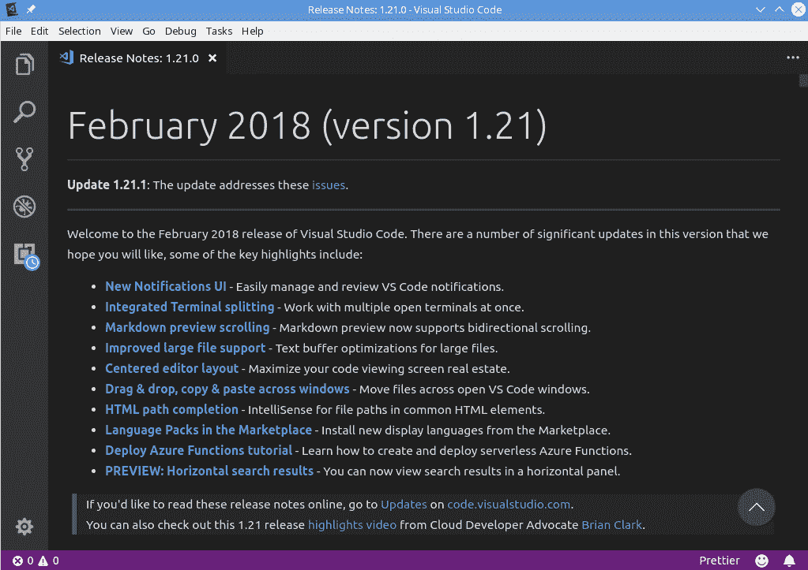
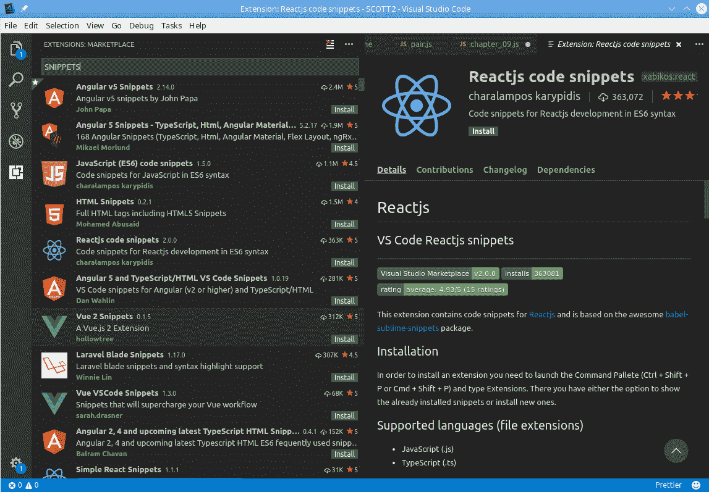
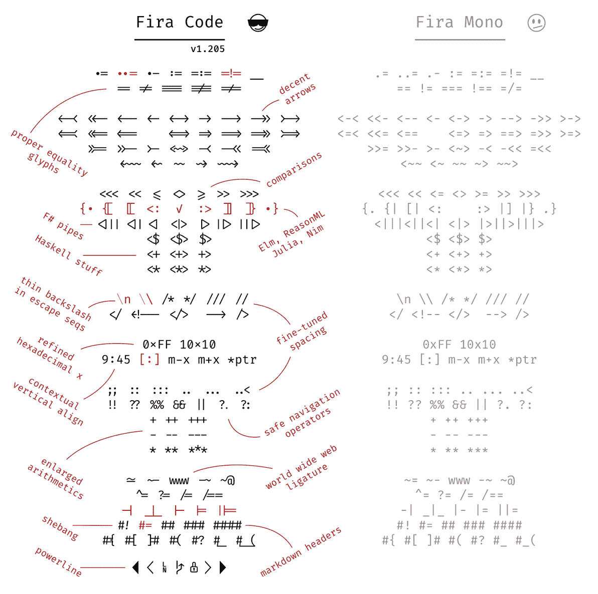
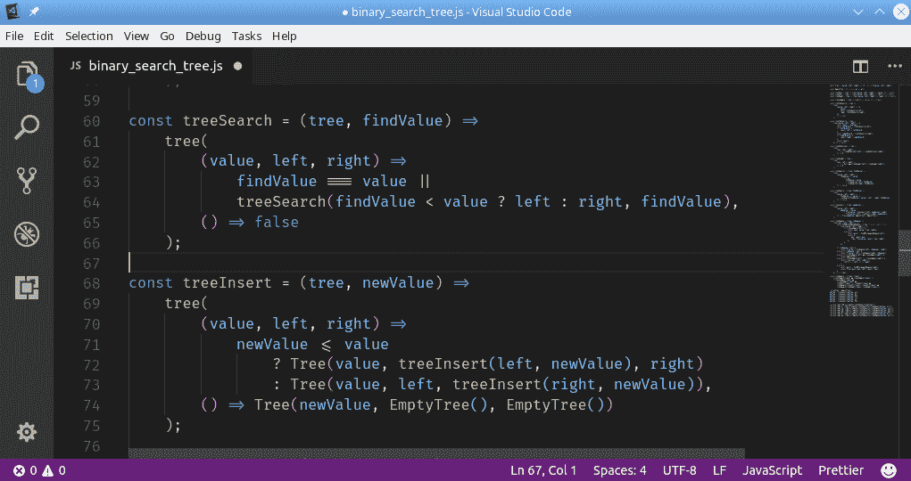
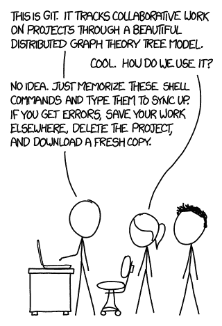
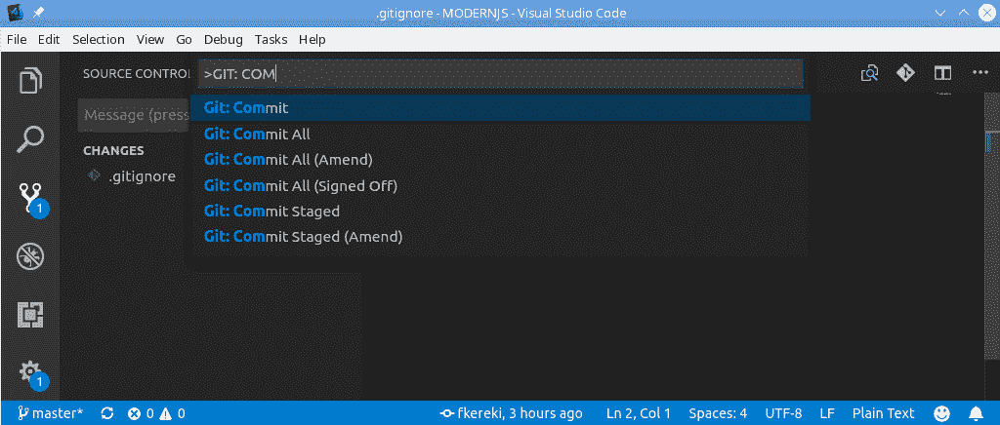
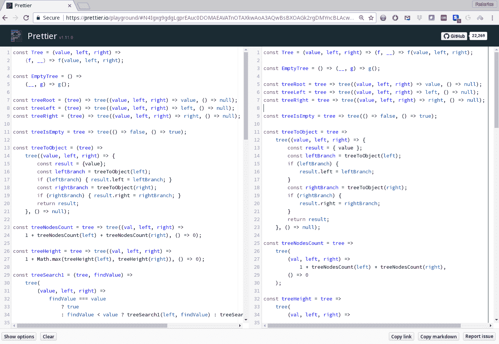
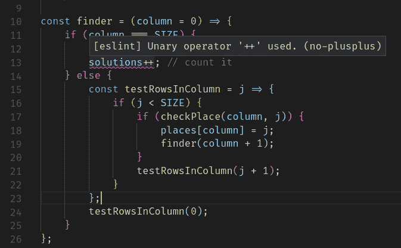

Working with JavaScript Development Tools  

# 使用 JavaScript 开发工具

我们将在这里看到的食谱如下：

*   安装 VisualStudio 开发代码
*   扩展 VisualStudio 代码
*   添加 Fira 代码字体以更好地编辑
*   为包管理添加 npm
*   使用 Git 进行版本控制
*   用 Prettier 格式化源代码
*   用 JSDoc 记录代码
*   使用 ESLint 添加代码质量检查
*   为数据类型检查添加流

# 介绍

JavaScript 已经超越了向网页添加小效果或行为的简单工具，现在已经成为世界上使用最多的语言之一，应用于各种开发。考虑到当今软件包、库和框架的复杂性和多样性，如果没有全套工具，您将无法开始工作，在本章中，我们将致力于建立一个良好的开发环境，以便您能够以最高效的方式工作。

让我们从设置一些工具开始，这些工具将在我们所有的 JS 开发中派上用场。有人说一个拙劣的工匠会责怪他的工具，所以让我们通过做出一些好的选择来避免这一点！

# 安装 VisualStudio 开发代码

我们需要的第一个工具是**集成开发环境**（**IDE**），或者至少是一个功能强大的代码编辑器。有些人靠一个简单的编辑器勉强度日，可能是`vi`或`Notepad`之类的东西，但从长远来看，所有手工操作浪费的时间都是不值得的。有许多选项，如（按字母顺序）Atom、Eclipse、IntelliJ IDEA、Microsoft Visual Studio、NetBeans、Sublime Text、WebStorm 和 Visual Studio 代码。就我个人而言，我选择了后者，当然你也可以和其他人一起工作。

The term IDE isn't really very well-defined. An IDE usually integrates many tools, providing a more seamless experience for the developer. Editors meant for development work provide some similar functionality by means of plugins or extensions. While this can certainly approximate the ease of use of an IDE, there may be some problems, such as a harder installation or configuration, or an interface that might be harder to figure out, but in the end, you may get practically the same feature set.

**Visual Studio 代码**（**VSC**基本上是一个源代码编辑器，由微软于 2015 年开发。尽管名称相似，但它与微软更强大的 IDE Visual Studio 无关。该编辑器是免费的、开源的，最新版本是（目前）1.29.1，日期为 2018 年 11 月，不过每月都会发布新版本。它可以用于 JS 开发，也可以用于其他语言，因此如果您想（比如）用 PHP 进行服务器端编码，也可以使用 VSC。然而，从我们的观点来看，VSC 附带 IntelliSense，基本上适用于所有前端语言（JS、TypeScript、JSON、HTML、CSS、LESS、SASS），这是一个很好的卖点。参见[https://code.visualstudio.com/docs/editor/intellisense](https://code.visualstudio.com/docs/editor/intellisense) 了解更多信息

VSC 是用 JS 编写的，基于节点，并使用`Electron`框架为桌面打包。（我们将在[第 13 章](13.html)中看到这些主题，*使用 Electron*创建桌面应用程序。）这自动允许您在 Linux、macOS 和 Windows 中使用 VSC，如果您在团队中工作，并且不是每个人都有相同的开发环境首选项，这是一个很好的优势

A commonly held misconception is that VSC is based on the Atom editor. Though VSC shares the same editor component (Monaco), VSC itself is distinct from Atom. A source of this misunderstanding may be the fact that `Electron`, when created in 2013, was originally called *Atom Shell*; the name change to `Electron` happened in 2015.

在过去，我曾广泛使用 Eclipse、Microsoft Visual Studio 和 NetBeans。然而，现在我只与 VSC 合作。为什么我更喜欢它？我的理由（您的里程数可能会有所不同！）包括以下几点：

*   *多操作系统可用性*：我个人一直在 Mac 和 Linux 上使用它，有时在 Windows 上使用
*   *积极开发和维护*：定期提供更新（包括 bug 修复）
*   *性能非常好*：VSC 感觉速度比较快
*   *智能感知支持*：可满足所有 JS 需求
*   *插件*提供的扩展：这些插件集成到您的工作流程中，添加新功能
*   *集成调试*：*我们将在[第 5 章](05.html)中看到，*测试并调试您的服务器**
**   *集成源代码管理*：通过 Git（见*用 Git*做版本控制部分，后面）*   *集成终端*：无需离开 VSC 即可运行命令或启动流程*

 *另一方面，也存在一些缺点；主要的两项建议如下：

*   插件的接口、配置和设计通常各不相同，因此您必须处理频繁的不一致。
*   VSC 不了解创建（例如）与`Node`后端服务器通信的`React`前端应用程序所需的项目或工具之间的链接。VSC 最多只能识别文件夹，但如何组织它们以及将代码放在何处完全取决于您

# 怎么做…

如何安装 VSC？每个操作系统的说明都不同，并且可能会随着时间的推移而变化，因此我们将在[为您的系统下载相应的软件包 https://code.visualstudio.com/download](https://code.visualstudio.com/download) ，并遵循[中正确的平台特定说明 https://code.visualstudio.com/docs/setup/setup-overview](https://code.visualstudio.com/docs/setup/setup-overview) 。对于 Linux 发行版，可能会有另一种解决方法，而不是自己下载和安装某些软件包。例如，使用 OpenSUSE，存在一个存储库，允许您通过 OpenSUSE 本身安装和更新 VSC；请查看[https://en.opensuse.org/Visual_Studio_Code](https://en.opensuse.org/Visual_Studio_Code) 有关这方面的说明，或[https://code.visualstudio.com/docs/setup/linux](https://code.visualstudio.com/docs/setup/linux) 获取更多特定于分发的说明。

If you want to live on the edge, and get to see new features as early as possible, there's also an *Insiders build*. You may install both the normal VSC stable build and the Insiders build, and work with whichever you prefer. Be warned, though, that you may find unexpected bugs, but you can help the VSC development team get rid of those by letting them know!

# 它是如何工作的…

安装完成后，打开 VSC 并尝试其设置，以您喜欢的方式开始配置，请参见下面的屏幕截图。左下角的 gear（齿轮）菜单提供对几个相关项目的访问，例如键盘快捷键、颜色方案和图标集。如果您以前使用过 VSC，您将可以访问最近的文件和文件夹：


The Welcome screen in VSC, and the settings gear at the bottom left

配置 VSC 有点不寻常，但可能是意料之中的，因为它源于 JS。基本上，如下面的屏幕截图所示，您将得到一个拆分屏幕，在左侧以 JSON 格式显示所有可用的配置项（超过 400！），您可以通过在右侧写入新的配置项来更改它们的值。如果将鼠标悬停在任何设置上，您将看到可能的值，只需单击即可选择新值：


Configuring VSC is done by editing a JSON file with your personal choices Do you want to pick a different editor for your work, or at least check out what's available out there? You may check out [www.slant.co/topics/1686/~javascript-ides-or-editors](https://www.slant.co/topics/1686/~javascript-ides-or-editors) for a long list of candidates, with pros and cons for each. At the current time (October 2018) the page shows 41 options, with Visual Studio Code at the top of the list.

VSC 的一个额外优势与更新有关。它会定期检查是否有新的可用版本，并允许您下载和安装。（另一方面，如果您使用 Linux 并通过存储库安装 VSC，它可能会自动更新，甚至无需您确认。）之后，您将看到一个信息屏幕，显示上个月的更改；如以下屏幕截图所示：



After each monthly update, you'll be informed of VSC's new features

VSC 的配置超出了我们刚才提到的范围；请参阅以下部分，以了解扩展其功能并使其更好地供您使用的更多方法。

# 扩展 VisualStudio 代码

VSC 包括许多开箱即用的特性，使用这些特性，您实际上可以毫无问题地开始工作。通过扩展，您可以添加对语言、调试、代码质量和更多功能的支持。还提供了配置视觉特性，您可以更改 VSC 的主题、快捷方式和常规首选项。然而，您需要向 VSC 添加更多的功能，这就是扩展（插件）的用武之地。

You can even develop your own extensions for VSC, though we won't be getting into that subject in this book. If you are interested, check out [https://code.visualstudio.com/docs/extensions/overview](https://code.visualstudio.com/docs/extensions/overview). Extensions can be written in either JS or TypeScript (see the *Adding Flow for data types checks* section), and of course you can develop them by using VSC itself!

# 怎么做…

扩展是 VSC 的可选可安装附件，提供特定的新功能。安装新的扩展是轻而易举的事。您可以打开所有可用扩展的菜单，方法是在主菜单中查看|扩展（您也可以在其中找到它的键盘快捷键），或单击 VSC 左侧活动栏底部的扩展图标。

您将首先获得当前安装的扩展的列表，如以下屏幕截图所示：


The list of already-installed extensions

如果需要，可以禁用任何特定扩展：单击屏幕左侧的扩展，然后单击右侧的禁用。您还可以完全卸载任何扩展，而且您肯定会大量卸载；要想知道一个扩展是否适合你，唯一的办法就是通过实验！请看以下屏幕截图：


The VSC Marketplace is a good place to search for new extensions

寻找新的扩展也是轻而易举的事。您可以通过[进入 VSC 市场 https://marketplace.visualstudio.com/](https://marketplace.visualstudio.com/) 如前一屏幕截图所示，或直接从 VSC 内搜索，在搜索框中键入，如以下屏幕截图所示。我建议注意安装的总数（越高越好）和 1 到 5 颗星的评级（也越高越好）。我们将使用几个扩展；例如，请参见本章中的*使用更漂亮的*格式化源代码和*使用 JSDoc*部分记录代码；在后面的章节中将有更多内容：



You can also search for new extensions from within VSC by just typing some keywords

扩展是自动更新的，您不需要做很多事情。我建议定期查看扩展列表，并可能再次搜索新的扩展；有一些新版本不推荐旧版本，但使用了新名称，因此更新不起作用。最后，准备好进行试验，并为自己找到哪些扩展使您成功！

# 添加 Fira 代码字体以更好地编辑

如果你想尝试一个能迅速引起（热烈的？热烈的？）讨论的话题，大声说编程的最佳字体是某某，等等！我不想开始任何争论，但我可以推荐一种字体，它可以让你的 JS 代码看起来更好，更可读。

An article in Slant, at [https://www.slant.co/topics/67/~best-programming-fonts](https://www.slant.co/topics/67/~best-programming-fonts), lists over 100 programming fonts; did you even think so many were available?

更好字体的关键在于连字的概念。在印刷术中，当两个或多个字母连接成一个字符时，就会出现连字。好的，正确的技术词汇应该是 glyph，但我们不要让它变得比需要的更复杂！

Some ligatures you may not be aware of are these: the ampersand character (*&)* was originally a ligature of the letters *E* and *t*, spelling out *et* in Latin, meaning *and*. Similarly, the German *ß* character was a ligature of two *s* letters, next to each other, and the Spanish *Ñ* originally was a pair of *N* characters, one written on top of the other.

在 JS 中，有许多符号被写成两个或多个字符，只是因为没有其他方法可用。例如，大于或等于符号被键入为`>=`，这看起来不像数学符号`≥`那么好，是吗？其他组合有`<=`（小于或等于）、`=>`（对于箭头函数，我们将在[第 2 章](02.html)中遇到）、使用现代 JavaScript 功能的*、二进制移位运算符`<<`和`>>`、相等运算符`==`和`===`（加上相应的`!=`和`!==`等。*

*Do not confuse *ligatures* with *kerning*. Both have to do with showing adjacent characters, but the former refers to joining characters and replacing them with a new one, while the latter deals with reducing the distance between characters. If you place an *f *next to an *i*, kerning would make them closer without overlapping (in the same way that you can reduce spacing between *A* and *V* because of the letters' shapes), while a ligature would replace both characters with *fi,* actually joining both letters.

# 怎么做…

虽然有许多单间距字体（意味着所有字符都具有相同的宽度，这有助于屏幕对齐和缩进），但也没有太多的字体提供连字。在我的案例中，在尝试了许多之后，我可以推荐使用 Fira 代码，可在[在线获取 https://github.com/tonsky/FiraCode](https://github.com/tonsky/FiraCode) 。这种字体提供了很多连字，不仅适用于 JS，也适用于其他编程语言。请看下图，了解所有可能性：



All the available ligatures, as seen in the figure taken from
https://raw.githubusercontent.com/tonsky/FiraCode/master/showcases/all_ligatures.png

下载最新版本（1.206，截至 2018 年 12 月）并根据操作系统的标准程序进行安装。之后，您必须更改一对 VSC 设置，如本章前面所述；只需添加以下行并保存配置：

```js
"editor.fontFamily": "'Fira Code', 'Droid Sans Mono', 'Courier New'",
"editor.fontLigatures": true,
.
.
.
```

第一行定义了您要使用的字体（在 CSS 样式中，我还提供了其他字体，以防我将设置带到另一台机器上，`Fira Code`不可用），第二行告诉 VSC 启用屏幕连字。

# 它是如何工作的…

完成上一节中的更改后，当您打开 VSC 时，您将能够看到以下屏幕截图中的代码：



A sample listing, showing several ligatures; see lines 60 (=>), 63 (=== and ||), or 71 (<=)

请注意，当您键入代码时，您根本不需要执行任何操作。如果你想要一个箭头连字，你必须像往常一样输入两个字符`=`和`>`；它们在屏幕上的外观只是字体渲染的结果。类似地，如果要搜索箭头，请搜索`=>`，因为这是将保存到磁盘的内容。

现在，我们已经根据自己的喜好配置了 VSC，让我们启动更多的包来帮助实现源代码管理和其他功能。

# 为包管理添加 npm

在前端或后端工作时，您肯定希望使用已经可用的库和框架，这就产生了一个有趣的问题：如何处理这些包自己的需要、更多的包，而这些包本身需要更多的包，等等。在[第 3 章](03.html)*与节点*一起开发中，我们将与`Node`一起工作，但我们需要超越自己，现在安装`npm`（`Node`的包管理器），以便能够设置其他几个工具。

`npm`也是一个巨大的软件库的名称，位于[https://www.npmjs.com/](https://www.npmjs.com/) 约有 600000 包，您可以在下面的屏幕截图中看到，根据[等统计，它的日增长率超过 500 包 http://www.modulecounts.com/](http://www.modulecounts.com/) ，跟踪多个著名代码存储库的位置：


The growth of the npm repository seems exponential, according to data from www.modulecounts.com/

可以有把握地说，现代 JS 应用程序可能不需要`npm`中的至少一个（更有可能是多个）包，因此必须添加包管理器；让我们看两个。

# 怎么做…

要获得`npm`，您必须首先安装`Node`，这对于[第三章](03.html)、*与节点*一起开发以及后续工作都很有用。我们不会从网上复制详细信息（参见[https://docs.npmjs.com/getting-started/installing-node](https://docs.npmjs.com/getting-started/installing-node) 但我们可以恢复如下：

1.  安装`Node`，可以下载它，然后进行手动安装（Windows 最常见的方式），也可以添加适当的存储库，然后使用 Linux 软件包管理器安装`Node`（这是我在 OpenSuse 机器中执行此操作的方式）。小心，选择**长期支持**（**LTS**）版本，通过其偶数大号（例如 8.x.x）可以识别，除非您觉得有足够的冒险精神来使用最新的开发版本，并且您不介意诸如停止工作之类的风险！
2.  确认`Node`安装正确。在命令行输入`node -v`获取当前版本；在我的机器中，它是 v9.7.1，但当您尝试这个时，它肯定会改变，是的，我感觉很冒险，不使用 LTS 版本！
3.  使用`npm -v`命令检查`npm`是否为最新版本。如果不是（请参阅以下代码段），则必须对其进行更新：

```js
> npm -v 
5.5.1 

 ────────────────────── 
   │                                    │
   │  Update available 5.5.1 → 5.7.1    │
   │     Run npm i -g npm to update     │
   │                                    │
    ──────────────────────
```

如果您在没有软件包管理器的情况下工作（这意味着您可以自动获取软件更新，而无需逐个查找），您也可能对安装`nvm`感兴趣，尽管它是可选的；更多信息，请参见[https://github.com/creationix/nvm](https://github.com/creationix/nvm)

# 它是如何工作的…

我们将在本文的几个地方使用`npm`。您必须使用它来安装几个软件包（其中一些软件包出现在本章中，如`JSDoc`或`Prettier`），稍后我们将了解如何配置应用程序，以便所有必需的软件包都可用且最新。

You can find complete documentation for all `npm` features at [https://docs.npmjs.com/](https://docs.npmjs.com/).

# 使用 npm 创建项目

如果您选择任何空目录并仅安装一个包，您将收到一些与丢失文件相关的警告，并且您还将发现一些新元素：

```js
~ > md sample
~ > cd sample
~/sample > npm install lodash 
npm WARN saveError ENOENT: no such file or directory, open '/home/fkereki/sample/package.json' 
npm notice created a lockfile as package-lock.json. You should commit this file. 
npm WARN enoent ENOENT: no such file or directory, open '/home/fkereki/sample/package.json' 
npm WARN sample No description 
npm WARN sample No repository field. 
npm WARN sample No README data 
npm WARN sample No license field. 

+ lodash@4.17.11
added 1 package from 2 contributors and audited 1 package in 1.945s 
found 0 vulnerabilities

~/sample> dir 
total 4 
drwxr-xr-x 3 fkereki users  20 Mar 15 11:39 node_modules 
-rw-r--r-- 1 fkereki users 313 Mar 15 11:39 package-lock.json
```

这里发生了什么事？让我们一步一步地解释结果，然后添加缺少的内容。当您安装模块时，它们（加上它们的所有依赖项，以及它们的依赖项的依赖项，等等）默认放置在`node_modules`目录中。这是一个很好的衡量标准，因为该目录中的所有代码都是您尚未实际编写的代码，最终将由`npm`在没有您直接控制的情况下进行更新。我们可以通过转到新创建的目录并检查其内容来快速验证：

```js
~/sample> cd node_modules
~/sample/node_modules> dir 
total 36 
drwxr-xr-x 3 fkereki users 20480 Mar 15 11:39 lodash
```

但是，您如何控制要安装的软件包（及其版本）？这就是丢失的`package.json`文件的要点，在本书后面我们将讨论的其他内容中，该文件允许您指定所需的包。（我们还将使用它为其他工具指定参数，如 Babel 或 ESLint，我们将在本章后面看到。）您可以手动创建此文件，但使用`npm init`更容易，只需回答几个问题。这将创建所需的文件，该文件最终将描述项目的所有依赖项，以及我们稍后将看到的其他功能（如构建或部署过程）：

```js
~/sample> npm init
This utility will walk you through creating a package.json file.
It only covers the most common items, and tries to guess sensible defaults.
See `npm help json` for definitive documentation on these fields
and exactly what they do.
Use `npm install <pkg>` afterwards to install a package and
save it as a dependency in the package.json file.

Press ^C at any time to quit.
package name: (sample) simpleproject
version: (1.0.0) 
description: A simple project to show package.json creation
entry point: (index.js) 
test command: 
git repository: 
keywords: 
author: Federico Kereki
license: (ISC) 
About to write to /home/fkereki/sample/package.json:

{
 "name": "simpleproject",
 "version": "1.0.0",
 "description": "A simple project to show package.json creation",
 "main": "index.js",
 "scripts": {
 "test": "echo \"Error: no test specified\" && exit 1"
 },
 "author": "Federico Kereki",
 "license": "ISC"
}
Is this ok? (yes)
```

让我们快速浏览每个领域，但记住这些只是基本的领域；您可以在[找到更完整的官方描述 https://docs.npmjs.com/files/package.json](https://docs.npmjs.com/files/package.json) 。由于我们跳过了一些答案，生成的项目文件中并不是所有字段都存在，但您可以稍后添加所有内容：

*   `name`：您希望为项目指定的任何名称；默认情况下，目录的名称为。
*   `version`：项目的语义版本号。每当创建新版本时，您都会更新此编号。参见[https://semver.org/](https://semver.org/) 了解有关语义版本控制的更多信息。
*   `description`：您的项目的简单描述，由`npm`搜索命令使用。
*   `main`：您的程序的主要入口点的名称。在这方面使用`index.js`是很常见的。
*   `test command`：为执行代码的单元测试而运行的命令（脚本）。我们将在本书的后面部分看到这一点。
*   `git repository`：如果您打算使用源代码管理，请在这里详细说明。我们将在本章后面的*使用 Git*进行版本控制一节中讨论这一点。
*   `scripts`：这个对象包含可以使用`npm run`运行的脚本命令；例如，您可以编写脚本来构建项目、部署项目、检查项目的代码质量规则，等等。
*   `author`：谁创建了这个项目。
*   `license`：您希望分配给项目的任何许可证；这是为了让其他人知道，如果您允许，他们可以如何使用您的软件包（权限、限制）。您可以在[找到可能的许可证列表（相当长！）https://spdx.org/licenses/](https://spdx.org/licenses/) ，选择时要小心；涉及法律方面！

但是，包裹在哪里？让我们在下一节中了解这一点。

# 为不同目的安装软件包

安装`npm`包有两种方式：全局安装或本地安装：

*   如果您计划从命令行使用该软件包，请全局安装它；例如，`npm install prettier -g`将安装`prettier`命令，以便您可以在任何地方使用它。（我们将在*用更漂亮的*格式化源代码一节中看到更多的`prettier`内容。）您可能需要以管理员身份或使用`sudo`运行该命令。
*   否则，如果您的项目只需要该软件包，请在本地安装它

也可以通过多种方式在本地安装软件包：

*   如果您自己的项目需要该软件包，那么您可以使用`npm install lodash --save`将其作为生产软件包安装
*   相反，如果您需要该软件包来构建项目，但不是作为最终生成代码的一部分，请将其安装为带有`npm install eslint --save-dev`的开发软件包

There are many shorthand versions for commands and options, such as just `i` for `install`, or `-D` for `--save-dev`, but I am more comfortable spelling everything out. If you want to learn more about this, just try `npm --help`.

在运行后两个命令后，如果您检查`package.json`，您会注意到添加了一些行：

```js
~/sample> cat package.json  
{ 
  "name": "simpleproject", 
  "version": "1.0.0", 
  "description": "A simple project to show package.json creation", 
  "main": "index.js", 
  "scripts": { 
    "test": "echo \"Error: no test specified\" && exit 1" 
  }, 
  "author": "Federico Kereki", 
  "license": "ISC", 
  "dependencies": { 
 "lodash": "^4.17.5" 
 }, 
 "devDependencies": { 
 "prettier": "^1.11.1" 
 } 
}
```

`dependencies`和`devDependencies`条目指您需要的生产和开发包。如果您正在编写软件，并且决定需要一个新的软件包，有两种方法：

*   在适当的位置向`package.json`添加一个条目，然后执行`npm install`以获取该条目
*   或者，将`npm install`与`--save`或`--save-dev`一起使用，并且`package.json`将由`npm`更新

To remove a dependency, use `npm uninstall` instead. You must include `--save` or `--save-dev` in order to also remove the reference from `package.json`.

如果您需要特定的版本，则必须了解语义版本控制。版本规则可能变得复杂，我们将只看到主要的规则；检查[https://docs.npmjs.com/files/package.json#dependencies](https://docs.npmjs.com/files/package.json#dependencies) 和[https://github.com/npm/node-semver#versions](https://github.com/npm/node-semver#versions) 完整描述如下：

| 4.5.6 | 版本 4.5.6，而不是其他版本 |
| ^4.0.0 | 最新兼容版本 4.x.x |
| ^4.2.0 | 最新兼容版本 4.2.x |
| >5.6.7 | 大于 5.6.7 的版本 |
| ~8.7.6 | 近似等于 8.7.6 的版本；应该是 8.7.x |

# 还有更多…

维护和更新软件包是一项重要的任务，如果您是开发团队的一部分，甚至可能有来自不同地区或国家的人员，那么每个人都必须始终使用相同的配置。如果项目非常动态（意味着包将被频繁添加、删除或更新），`npm`可能会变得有点慢，并且还会产生一致性或安全问题；为了解决这个问题，2016 年 Facebook 发布了一个新的包管理器`yarn`。（见[https://yarnpkg.com/en/](https://yarnpkg.com/en/)

If you want to see the rationale for the changes, see the original blog post about yarn at [https://code.facebook.com/posts/1840075619545360](https://code.facebook.com/posts/1840075619545360).

一个关键特性是，您可以无缝地将`npm`替换为`yarn`，然后开始使用后者，因为它共享相同的功能集（除了一些细微的差异），同时以更快、更可靠、更安全的方式工作。例如，`yarn`可以并行管理下载，甚至可以使用缓存包，因此甚至可以在不连接互联网的情况下进行一些更新！ 

安装非常简单，而且有点讽刺意味。将`npm`与`npm install -g yarn`一起使用，从那一刻起，您将能够直接使用`yarn`并忘记`npm`。参见[https://yarnpkg.com/en/docs/install](https://yarnpkg.com/en/docs/install) 获取有关安装过程的更完整文档。

For more details on comparing `npm` and `yarn` commands, check out [https://yarnpkg.com/lang/en/docs/migrating-from-npm/](https://yarnpkg.com/lang/en/docs/migrating-from-npm/) or [https://shift.infinite.red/npm-vs-yarn-cheat-sheet-8755b092e5cc](https://shift.infinite.red/npm-vs-yarn-cheat-sheet-8755b092e5cc).

# 使用 Git 进行版本控制

在现代软件开发中，不用说，您将需要一些 SCM（软件配置管理）软件来跟踪代码中的所有更改。今天，最常用的工具是`Git`，我们也将使用它。`Git`由 Linus Torvalds（他也创建了 Linux！）于 2005 年创建，用于开发 Linux 内核；考虑到它的源代码超过 2500 万行，这不是一个小任务！

Linux is not the only major operating system controlled with `Git`; in February 2017, Microsoft itself decide to migrate the development of Microsoft Windows to `Git`, and developed customizations to enhance remote work.

我们不会深入研究`Git`是如何工作的，使用什么命令，等等，因为这对于一本书来说已经足够了！我们将重点介绍如何将`Git`与 VSC 结合使用。这相当简单，因为 VSC 不仅在编写时考虑了`Git`访问，而且还有一些扩展可以使工作更加轻松，因此您不必记住大量命令和选项；请看下图：



Git has lot of commands, but you can cope very well with a few selected ones.
This XKCD comic is available online at https://xkcd.com/1597/.

# 怎么做…

就个人而言，我有一个 GitHub 帐户，我决定将其用于本书的代码。这不仅是一种能够与读者快速共享所有代码的方法，而且（而且非常重要！）是一种确保我不会意外丢失我的工作的方法，我很有能力做到这一点！参见[https://github.com/fkereki/modernjs](https://github.com/fkereki/modernjs) 用于所有代码。我将假设您有一个合适的`Git`服务器，并且您能够初始化一个项目，将其连接到服务器，等等。另外，VSC 需要`Git`预先安装在您的机器中；如果尚未安装，请签出[https://git-scm.com/book/en/v2/Getting-Started-Installing-Git](https://git-scm.com/book/en/v2/Getting-Started-Installing-Git) 开始吧。

VSC 通过其命令调色板提供对命令的完全访问。。。。如下面的屏幕截图所示。您可以在此处搜索命令，单击该命令后，VSC 将一次一个地请求所有可能的参数，因此您不必通过内存执行这些操作：



You can enter Git commands through VSC's command palette, and you'll get asked for the required parameters, if any

提交代码非常频繁，因此您可以直接通过单击源代码管理图标（左上方第三个）并输入所需的提交消息来完成。在该屏幕中，您还可以还原本地更改等；将鼠标移到上面以获取所有可能的功能。

# 还有更多…

我建议 VSC 使用一个`Git`扩展：寻找`GitLens`（也称为**Git 增压**）并安装它。此扩展提供了对几乎所有`Git`信息的访问。

请看以下屏幕截图：


GitLens in use

除其他功能外，`GitLens`还提供以下功能：

*   镜头，显示最近提交和作者信息
*   浏览器，用于浏览存储库和文件历史记录
*   责备注释，用于显示谁对一行进行了最后一次更改，如 git 责备
*   能够以不同的方式搜索提交，等等

更多详细信息，请参见[http://gitlens.amod.io/](http://gitlens.amod.io/) 。特别注意[处的定制 https://github.com/eamodio/vscode-gitlens/#configuration](https://github.com/eamodio/vscode-gitlens/#configuration) ，因为大多数功能都可以被旋转以更好地适应您的工作风格。您可以通过标准设置页面（查找名称以*GitLens*开头的所有配置项），或打开命令调色板并查找 GitLens:Open Settings，这将打开一个特殊的设置屏幕，如以下屏幕截图所示：


Gitlens also provides a special onscreen settings feature, which allows you to configure practically every aspect of the tool

现在我们已经建立了一个开发环境，并且已经选择并安装了最少的一组工具，让我们进一步添加一些可选的、但强烈推荐的附加包，这些包将有助于生成更好的代码。

# 用 Prettier 格式化源代码

如果您与其他几个开发人员一起在一个项目中工作，那么迟早会出现关于如何格式化代码的参数，并且这些参数会持续很长时间！确定源代码的单一标准是非常必要的，但如果格式取决于每个人，那么可以肯定的是，最终您将获得比团队成员更多的“标准”！看看下面的例子。你不想在团队中有额外的摩擦或恶化，风格争论可能会持续很久：


You cannot afford to have more than one standard.
This XKCD comic is available online at https://xkcd.com/927/.

现代 JS 项目不仅包括 JS 源代码，还可能包括`TypeScript`或`Flow`（参见后面的*添加数据类型检查流程*部分）、JSX（参见[第 6 章](06.html)、*使用 React*开发）、JSON、HTML、CSS 或 SCS，甚至更多。

在试用了许多源代码格式化程序之后，我最终决定将`Prettier`用于所有用途。`Prettier`是一个*自以为是的*代码格式化程序，它支持我前面列出的所有语言，根据一组规则重新格式化源代码，从而确保所有代码都符合预期的样式

If you want to read the original description for `Prettier`, see the blog post at [https://jlongster.com/A-Prettier-Formatter](https://jlongster.com/A-Prettier-Formatter), where the author describes the rationale for the project and gives some details on implementation and options.

它是什么意思，它是*固执己见的*？许多（或大多数）代码格式化程序提供了一组非常大的配置选项，您可以对这些选项进行微调，以使代码看起来像您所希望的那样。另一方面，`Prettier`有自己的一套规则，配置的余地很小，因此缩短了所有参数。此外，您可以让它与 VSC 无缝地工作，这意味着每当您保存代码时，它都将被重新格式化

让我们来看看这个*观点*的一些例子。使用箭头函数（我们将在[第 2 章](02.html)*使用现代 JavaScript 功能*的[中的*定义函数*一节中详细介绍），如果函数只有一个参数，将其括在括号中是可选的：](02.html)

```js
const plus1= (x)=> 1+x
```

然而，`Prettier`决定在这种情况下不应包括括号。另外，请注意，为了清晰起见，它添加了几个空格，以及（可选）缺少的分号：

```js
const plus1 = x => 1 + x;
```

类似地，如果您使用承诺（我们将在[第 2 章](02.html)的*紧凑地执行异步调用*部分中看到它们，*使用 JavaScript 现代功能*，您可以编写如下内容：

```js
fetch('http://some.url').then((response) => {
    return response.json();
  }).then((myJson) => {
    console.log(myJson);
  }).catch(e => { /* something wrong */ });
```

但是，它将被重新格式化为更常见的以下代码：

```js
fetch("http://some.url")
    .then(response => {
        return response.json();
    })
    .then(myJson => {
        console.log(myJson);
    })
    .catch(e => {
        /* something wrong */
    });
```

请注意，根据 JS 最常见的样式，每个`.then(...)`是如何被推到一个单独的行中的。`Prettier`应用的格式规则是从通常的实践中派生出来的，不可能在这里全部列出。但是，真正重要的是，通过使用此工具，您可以确定您的整个团队将以相同的方式工作。

If your team grumbles about some rule or other, remind them of the saying *there's a right way, a wrong way, and the Army way!* After adopting `Prettier`, there will be no place for style discussions any more, and peace will eventually reign.

# 怎么做…

安装`Prettier`非常简单：只需添加 VSC 扩展，搜索`Prettier Code Formatter`即可找到；作为检查，最新版本（截至 2018 年 12 月）为 1.16.0，作者为 Esben Petersen。该插件本身可以在 VSC 市场上找到，网址为[https://marketplace.visualstudio.com/items?itemName=esbenp.prettier-vscode](https://marketplace.visualstudio.com/items?itemName=esbenp.prettier-vscode)。您还可以全局安装它（正如我们在本章前面的*安装不同用途的软件包*部分中所看到的），以便能够在脚本中或通过`npm`或`yarn`命令行使用它。参见[https://prettier.io/docs/en/install.html](https://prettier.io/docs/en/install.html) ，我建议这样做。

您需要在 VSC 首选项中进行一项更改。转到文件|首选项|设置，并将以下行添加到用户配置中，以便在保存每个文件时自动对其进行格式化：

```js
"editor.formatOnSave": true,
.
.
.
```

如果您希望只将`Prettier`应用于 JS，那么您应该使用以下内容：

```js
"[javascript]": {
    "editor.formatOnSave": true
},
.
.
.
```

正如我们所说，`Prettier`对于代码的外观非常固执己见，并且只有几个选项可以更改。可用选项可通过`"prettier"`键在`package.json`中设置（便于所有团队共享）。一些可能性（即您可能要修改的可能性）如下所示：

| **选项** | **默认值** | **意思是** |
| `arrowParens` | `false` | 对于具有单个参数的箭头函数，是否将其括在括号中。 |
| `bracketSpacing` | `true` | 在对象的左大括号之后和右大括号之前包含空间。 |
| `jsxBracketSameLine` | `false` | 如果为`true`，则多行 JSX 元素的结尾`>`将添加到最后一行的末尾；如果`false`，则它将位于单独的行上。 |
| `printWidth` | `80` | 最大行大小。 |
| `semi` | `true` | 在每行末尾添加分号，即使不需要。 |
| `singleQuote` | `false` | 对字符串使用单引号。 |
| `tabWidth` | `2` | 压痕尺寸。 |
| `trailingComma` | `none` | 尽可能指定是否添加尾随逗号。选项有`none`（从不添加此类逗号）、`es5`（在 ES5 允许的地方添加它们，如在数组或对象中），或`all`（甚至将它们添加到函数参数中）。 |
| `useTabs` | `false` | 使用制表符进行缩进。 |

就我个人而言，我唯一使用的是`tabWidth:4`和`printWidth:75,`，但后者只是为了这本书，而不是为了其他工作。因此，我的`package.json`包括以下内容：；我把它放在`dependencies`钥匙前面，但你可以把它放在别处：

```js
"prettier": {
    "tabWidth": 4,
    "printWidth": 75
},
.
.
.
```

You can also use `Prettier` independently of VSC, and in that case the configuration options should go in a `.prettierrc` file. See [https://prettier.io/docs/en/cli.html](https://prettier.io/docs/en/cli.html) and [https://prettier.io/docs/en/configuration.html](https://prettier.io/docs/en/configuration.html) for more on this.

最后，如果出于某种原因希望避免`Prettier`代码格式化，可以执行以下操作：

*   通过将给定文件的路径和名称添加到项目根目录下的`.prettierignore`文本文件中，避免对其进行所有格式设置
*   避免在单个句子前面加一个`// prettier-ignore comment`来重新格式化

对于后一个选项，请记住根据源代码语言使用适当的注释样式。例如，在 HTML 文件中，您将使用`<!-- prettier-ignore -->`，而在 CSS 中，它应该是`/* prettier-ignore */`，而对于 JSX，它应该是`{/* prettier-ignore */}`。

# 它是如何工作的…

使用`Prettier`有两种方式。第一种是配置 VSC，以便在保存代码时自动格式化代码；按照前面安装 VSC 时看到的说明，将“保存时编辑器格式”选项更改为 true，您将被设置。当然，您也可以随时通过右键单击并选择“格式化文档”选项来格式化代码。

您也可以在线使用`Prettier`。转到[https://prettier.io/playground/](https://prettier.io/playground/) 将您的代码粘贴到左侧面板中，您将立即在右侧面板中获得格式化版本。查看以下屏幕截图，了解代码重新格式化的示例：



Prettier online can be used to experiment with configuration parameters, or for a quick code reformatting session

如果您想尝试使用少数可用选项，请单击左下角的“显示选项”，您将能够配置 Prettier，根据我们在上一节中看到的内容，请参见以下屏幕截图：


If you want to dynamically experiment with (the few available) Prettier settings, you can do so in the online playground

在为本书编写代码时，我将右边距设置为 75，因为这将适合打印页面。我还将缩进设置为 4 个字符，因为我发现它更清晰。除此之外，我将所有内容都保留为默认设置；用这种方式处理的样式参数更少！

# 用 JSDoc 记录代码

一个很好的可维护性规则是代码应该被文档化。`JSDoc`（或`JSDoc3`；名称反映当前版本 3.6.0）是一个 API 文档生成器，它可以生成一个 HTML 网站，其中包含代码的完整文档。您只需在源代码中添加注释（以特定格式），并且`JSDoc`将扫描代码以提取注释并生成文档。让我们先看看应该如何编写这些注释，然后再使用一个工具来简化 VSC 的工作

The official web page for `JSDoc` is at [http://usejsdoc.org/](http://usejsdoc.org/), and the source code can be found at [https://github.com/jsdoc3/jsdoc](https://github.com/jsdoc3/jsdoc). 

# 怎么做…

`JSDoc`的主要思想是记录您的 API，包括函数、类、方法等等。`JSDoc`注释应位于正在记录的代码之前。注释以`/**`开头，以`*/`结尾；双星将其与普通评论区分开来。

Don't go overboard with stars, because if you write three or more, then the comment will also be ignored; `JSDoc` expects two stars, no more, no less.

下面的代码块显示了最简单的示例，即如何通过提供函数目标和参数的描述来记录函数：

```js
/**
 * Solves the Hanoi Towers puzzle, for any number of disks.
 *
 * @param {number} disks - How many disks to move
 * @param {string} from - The starting pole's name
 * @param {string} to - The destination pole's name
 * @param {string} extra - The other pole's name
 */
const hanoi = (disks, from, to, extra) => {
    if (disks === 1) {
        console.log(`Move disk 1 from post ${from} to post ${to}`);
    } else {
        hanoi(disks - 1, from, extra, to);
        console.log(`Move disk ${disks} from post ${from} to post ${to}`);
        hanoi(disks - 1, extra, to, from);
    }
};
```

`@param`符号是一个块标记，它引入了一个代码项，在本例中是函数的一个参数。常见标签的（部分）列表如下：

| `@author` | 开发商的名字。 |
| `@class` | 定义一个类。 |
| `@constructor` | 将函数标记为构造函数。 |
| `@copyright`、`@license` | 法律细节。 |
| `@deprecated` | 将函数或方法标记为已弃用。 |
| `@exports` | 导出的模块成员。 |
| `@function`、`@callback` | 定义一个函数，更具体地说，定义一个用作回调的函数。 |
| `@param` | 需要哪些参数。可以在大括号中添加数据类型。 |
| `@property`或`@prop` | 物体的属性。 |
| `@return`或`@returns` | 函数或方法返回的内容。 |
| `@throws`或`@exception` | 方法引发的异常。 |
| `@version` | 图书馆的版本。 |

有更多的标签，比如`@private`，用于将成员标识为私有成员，但由于 JS 并没有真正提供该功能，所以我跳过了它。其他标记更具体，您可能不使用它们，例如`@generator`或`@mixin`。如果您想查看可能的块（以及两个内联）标记的完整列表，请签出[http://usejsdoc.org/index.html](http://usejsdoc.org/index.html) 。

A confession: we won't be using `JsDoc` very much in this book, but only because all the needed explanations will be given in the text itself. For normal work, I'd always use it, but in this book it would mainly be redundant.

# 它是如何工作的…

写这种评论很快就会变得单调乏味，但您可以使用*文档和*VSC 扩展自动生成所需的模板，然后完成。您可以在[找到分机 https://marketplace.visualstudio.com/items?itemName=joelday.docthis](https://marketplace.visualstudio.com/items?itemName=joelday.docthis) ，但通过 VSC 本身安装更简单：搜索`Document This`，它会很快出现。

包含此扩展后，如果右键单击代码，将出现一个新命令，该命令将自动生成（大部分为空）注释供您完成

对于生成自动文档，请签出[http://usejsdoc.org/about-commandline.html](http://usejsdoc.org/about-commandline.html) ；我们不讨论这个问题，因为它相当简单。您可以配置`JSDoc`，也可以更改生成页面使用的模板；见[http://usejsdoc.org/about-configuring-jsdoc.html](http://usejsdoc.org/about-configuring-jsdoc.html) 和[http://usejsdoc.org/about-configuring-default-template.html](http://usejsdoc.org/about-configuring-default-template.html) 针对这些主题。请参见以下屏幕截图：


A simple example of the JSDoc output

当然，记录单个函数不会成为您的用例！但就我们的目的而言，这就足够了；对于正常使用，您将获得一个索引，其中包含指向每个类、函数等的链接，完整地记录您的代码。

您已经设置了您的工作环境，并且能够在最新版本的 JS 中编写有文档的、缩进良好的代码，但这还不能证明您可以避免可能发生的错误，因此现在让我们来研究如何更深入地增强代码。

# 使用 ESLint 添加代码质量检查

JS 是一种非常强大的语言，但也有很大的滥用潜力。例如，大多数人都会同意，如果`a==b`为真，并且`b==c`也为真，那么`a==c`也应该为真，但由于 JS 对`==`运算符应用的数据类型转换规则，您有以下几点：

```js
""==0   // true
0=="0"  // true
""=="0" // false!?
```

另一个例子如下；这个非常简单的函数返回什么？

```js
function mystery() {
    return
    { 
        something: true 
    }
}
```

如果你回答了*一个对象*，你会被一个缺失的分号咬伤。JS 对这段代码的解释如下：

```js
function mystery() {
    return ;
    {
        something: true;
    }
}
```

注意`return`后面的分号。此函数返回`undefined`，并且`something`被解释为恰好是`true`的表达式的标签；令人不快的这类情况很常见，即使你知道自己在做什么，至少得到一个关于代码可能出现问题的警告可能有助于根除 bug，而这正是`ESLint`所产生的警告

The *gotcha* shown previously is only one of many that JS has for unaware developers. Google for *JavaScript gotchas* and you'll get several lists of possible errors.

# 怎么做…

**Linters**是一类编程工具，它可以分析源代码，并提出关于低质量使用或构造的警告和错误，甚至可能暗示 bug。我们将使用 Nicholas Zakas 在 2013 年创建的 ESLint；截至 2018 年 12 月，该工具的当前版本为 5.10.0。

The first `lint` program was written in 1978 by Stephen Johnson, at Bell Labs, where he also worked on Unix, **yet another compiler compiler** (**yacc**), and the portable C compiler, which made it easier to output code for different computer architectures.

<sup class="calibre26">`ESLint`基于可插拔规则，可随意启用或禁用，也可根据您的具体偏好进行配置。（您甚至可以开发自己的规则，但这超出了本书的范围。）还有一些规则包，可以让您避免单独配置几十个不同的规则。</sup>

安装 ESLint 非常简单，只需执行以下操作：

```js
 npm install eslint eslint-config-recommended --save-dev
```

然后，您必须将 ESLint 选项添加到`package.json`配置文件中；让我们开始吧。首先，我们将添加一个脚本，使用`npm run eslint`将 ESLint 应用于完整的源目录（目前只有一个文件！）：

```js
"scripts": {
    "build": "babel src -d out",
 "eslint": "eslint src",
    "test": "echo \"Error: no test specified\" && exit 1"
}

```

我们还必须为 ESLint 本身指定一些配置。我们将为此添加一个全新的部分：

```js
"eslintConfig": {
    "parserOptions": {
        "ecmaVersion": 2017,
        "sourceType": "module"
    },
    "env": {
        "browser": true,
        "node": true
    },
    "extends": "eslint:recommended",
    "rules": {}
} 
```

让我们逐项讨论：

*   `parserOptions`允许您指定要处理的 JS 版本（我将使用 2017 版，用于 ES8），以及您是否要使用模块（我在[第 2 章](02.html)的*模块组织代码*部分中提前指出这一点，*使用现代 JavaScript 功能*s）。
*   `env`允许您指定要使用的环境，这实际上意味着假设存在一些全局变量。在这种情况下，我要说的是，我将同时使用浏览器和`Node`的代码，但还有更多可能的环境；在[检查*指定环境*部分 https://eslint.org/docs/user-guide/configuring](https://eslint.org/docs/user-guide/configuring) 。稍后，我们将添加更多的环境，例如，用于单元测试。
*   `extends`允许您选择一组预定义的规则，稍后您可以根据自己的喜好修改这些规则。我选择推荐的那一套；您可以在[上了解更多信息 https://github.com/kunalgolani/eslint-config](https://github.com/kunalgolani/eslint-config) 。可用的规则集只有在`ESlint`主要版本更改时才会更改，因此它们相当稳定。此外，`recommended`集合表示一个通常一致同意的规则列表，因此在您开始修补特定更改之前，请尝试一下。完整的规则集可在[上获得 https://eslint.org/docs/rules/](https://eslint.org/docs/rules/) ，推荐规则见[https://github.com/eslint/eslint/blob/master/conf/eslint-recommended.js](https://github.com/eslint/eslint/blob/master/conf/eslint-recommended.js) 。
*   `rules`允许您更改一些规则，以更好地适应您的风格。我们很快就会看到这样做的理由。

If (and only if) you are planning to use some `Babel` feature that is not yet supported by `ESLint`, you should install and use the `babel-eslint` package from [https://www.npmjs.com/package/babel-eslint](https://www.npmjs.com/package/babel-eslint). This will also require adding a line to the `.eslintrc.json` file to change the parser that `ESLint` uses. However, keep in mind that it's highly unlikely you will require this change!

# 它是如何工作的…

如果我们按原样使用`npm run eslint`，我们将得到以下结果：

```js
> npm run eslint
> simpleproject@1.0.0 eslint /home/fkereki/sample
> eslint src

/home/fkereki/sample/src/eight_queens.js
 32:1 error Unexpected console statement no-console
> X 1 problem (1 error, 0 warnings)
```

标准规则不允许使用`console.log(...)`，因为您可能不想将其包含在已发布的应用程序中；这是[的`no-console`规则 https://eslint.org/docs/rules/no-console](https://eslint.org/docs/rules/no-console) 。我们可以在全局或本地基础上启用或禁用规则。如果我们批准此`console.log(...)`，则必须在本地禁用`no-console`规则。我们将通过在问题行之前的源代码中添加注释来完成此操作：

```js
// eslint-disable-next-line no-console console.log(`Solutions found: ${solutions}`);
```

如果您使用了`// eslint-disable no-console`，您将禁用整个源文件的`no-console`规则；没有进一步规范的`// eslint-disable`将禁用该文件的*所有*规则。在此之后，如果使用`npm run eslint`，则不会出现错误。

现在，让我们设定一个全局规则。有些人不喜欢`solutions++`线路，因为不是每个人都喜欢`++`操作员；在[有一条`no-plusplus`规则 https://eslint.org/docs/rules/no-plusplus](https://eslint.org/docs/rules/no-plusplus) ，但默认情况下，在推荐的集合中没有启用，因此我们将通过在`package.json`中的`rules`部分添加以下内容来全局启用：

```js
"rules": {
 "no-plusplus": "error"
}
```

在此之后，如果您运行`ESLint`，您将得到一个新的错误，应该执行该错误的开发人员应该修复代码：

```js
/home/fkereki/sample/src/eight_queens.js 
  13:9  error  Unary operator '++' used  no-plusplus

```

规则的可能配置有`"off"`（如果您想禁用它）、`"warn"`（如果您想得到警告，但接受它）和`"error"`（拒绝文件）。有些规则接受额外的配置，但这些是特定的；您必须阅读规则文档才能了解可能的更改。参见[https://eslint.org/docs/rules/no-empty](https://eslint.org/docs/rules/no-empty) 用于使用`no-empty`规则的特定示例，该规则不允许空代码块，但有一个额外选项允许它们出现在`catch`语句中。

决定启用或禁用哪些规则通常发生在项目开始时，随着时间的推移，可能会发生一些新的规则更改。在任何情况下，无论您选择什么，理想情况下，您应该只使用`"off"`和`"error"`；如果开发人员习惯了警告，他们最终会不注意它们，这可能是不好的！习惯于[的所有规则列表 https://eslint.org/docs/rules/.](https://eslint.org/docs/rules/)

最后，所有项目都将为输出文件使用一个`out/`目录，然后分发该目录。如果您想查看其中的一些文件，您不需要`ESLint`抗议生成代码中可能出现的错误。为了避免这种情况，您可以在`package.json`文件中添加一个小部分：

```js
 "eslintIgnore": ["**/out/*.js"],
```

# 还有更多…

当然，所有这些检查都很好，但是如果每次都要停止工作、保存所有内容并运行单独的工具来检查代码中的问题，那么很快就会变得难以忍受。但是，使用 VSC，您可以添加一个插件来实时与 ESLint 交互。转到 extensions 视图并搜索 ESLint；您应该找到并安装一个由 Dirk Baeumer 编写的扩展，目前版本为 1.7.2（2018 年 3 月）。

安装此扩展后，错误将在屏幕上以红色波浪下划线显示，如果将鼠标悬停在这些错误上，您将得到有关失败规则的解释。例如，请看以下示例：



The ESLint plugin in action, showing problems with the code in real time

`ESLint`的配置项很少；我唯一使用的是`"eslint.alwaysShowStatus": true`，所以状态栏会显示`ESLint`是否启用。

An interesting package that you could consider is the web `DeepScan` tool at [https://deepscan.io/home/](https://deepscan.io/home/). `DeepScan` is advertised as *beyond Lint*, insofar as it can also detect runtime problems having to do with implicit type conversions, null checks, unreachable code, and more. For the time being, `DeepScan` is considered to be in beta stage and there are no paid plans yet. You can use it free for open source projects; for example, you can use it automatically with a GitHub project.

# 为数据类型检查添加流

让我们通过考虑一个工具来完成这一章，这个工具将 JS 转换成一种（某种）新语言，一种*类型的*语言。JS 的一个特点是非类型化；例如，一个变量可以保存任何类型的值，或者一个函数可以返回任何类型的值，但无法声明应该存储在变量中或从函数返回什么类型的值。在本节中，我们将添加`Flow`，这是一个由 Facebook 开发的工具，可以进行数据类型控制。

Angular developers do not go for `Flow`, and opt for `TypeScript` instead. (OK, not Angular developers only; you can use `TypeScript` practically everywhere!) This version of JS was developed by Microsoft, and also includes data typing in a style very similar to `Flow`. `TypeScript` has its own transpiler, and you won't need `Babel` or `Flow`, so configuration will be a tad simpler. Instead of `ESLint`, you'll use `TSLint`, but you need not forego ESLint's rules: install `tslint-eslint-rules`; (see [https://github.com/buzinas/tslint-eslint-rules](https://github.com/buzinas/tslint-eslint-rules)) and you'll get the best of both worlds.

我们将在[第二章](02.html)的*添加类型*一节中介绍如何充分利用`Flow`，*使用 JavaScript 现代功能*，但让我来给大家一个我们期望的预览；然后，我们将安装所有需要的软件包，然后我们将深入了解更多细节。假设您编写了一个非常复杂的函数来添加两个数字：

```js
function addTwoNumbers(x, y) {
    return x + y;
}

console.log(addTwoNumbers(22, 9)); // 31, fine
```

但是，由于 JS 不会检查类型，并且有一些转换规则，因此以下两行也可以使用：

```js
console.log(addTwoNumbers("F", "K")); // FK - oops..*.*
console.log(addTwoNumbers([], {}));   // [object Object]! more oops...
```

原则上，您可以向函数中添加大量数据类型检查代码来验证`typeof(x)==="number"`，但这可能会成为一件麻烦事。（当然，在某些情况下，这是唯一的解决方案。）然而，许多错误甚至可以在运行代码之前检测到，就像这里发生的那样。

如果您修改函数以包含数据类型声明，`Flow`将能够检测到两个错误的使用，并且您将能够在运行代码之前解决这种情况：

```js
function addTwoNumbers(x: number, y: number) {
    return x + y;
}
```

基本上，这就是全部！当然，关于可用的数据类型、定义新数据类型、使用接口等有很多细节，但我们将在下一章中讨论。目前，让我们安装它，并承诺我们将很快了解更多关于其使用的信息。

# 怎么做…

安装`Flow`取决于您是否正在使用`Babel`（客户端浏览器代码就是这样）或不使用`Babel`（服务器端代码就是这样）。我们将在[第 3 章](03.html)中看到如何处理`Node`，*与节点*一起开发；在这里，我们将考虑巴别塔。

首先，执行以下命令以获取所需的流包，包括 Babel 和 ESLint 包：

```js
npm install flow-bin babel-preset-flow eslint-plugin-flowtype --save-dev
```

然后，在`package.json`中添加巴别塔的`"flow"`预置：

```js
"babel": {
    "presets": ["env", "flow"] 
},
```

在`ESLint`配置中添加一些行，也在`package.json`中：

```js
"eslintConfig": {
    "parserOptions": {
        "ecmaVersion": 2017,
        "sourceType": "module"
    },
    "env": {
        "browser": true,
        "node": true
    },
 "parser": "babel-eslint",
 "extends": ["eslint:recommended", "plugin:flowtype/recommended"],
 "plugins": ["flowtype"],
    "rules": {
        .
        .
        .
    }
},
```

在`package.json`中添加`"flow"`脚本：

```js
"scripts": {
    "build": "babel src -d out",
    "flow": "flow",
    .
    .
    .
},
```

最后，执行`npm run flow init`初始化`Flow`一次，创建一个包含`Flow`流程将使用的信息的`.flowconfig`文件。（见[https://flow.org/en/docs/config/](https://flow.org/en/docs/config/) 了解有关此文件的更多信息。）

The `.flowconfig` file doesn't really match the style of other configuration files, and should really be a JSON file instead, possibly part of `package.json`. However, this is a still pending item; you can check [https://github.com/facebook/flow/issues/153](https://github.com/facebook/flow/issues/153) to monitor advances, but for the time being, you'll have to deal with `.flowconfig` as is.

# 它是如何工作的…

使用您刚刚编写的配置，您就可以完成设置了！只要在开始工作时执行`npm run flow`即可，运行后台进程，以增量方式检查代码，并让您知道可能的数据类型问题。但是，如果使用 VSC，您甚至可以跳过此步骤；见下一节。

# 配置流的 linting

尽管`ESLint`为避免 JS 糟糕的编码实践做了很好的介绍，但它在数据类型方面做得并不多，但`Flow`可以在这方面帮助我们。

您可以应用一组规则，您将通过前面提到的`.flowconfig`文件进行配置：

```js
[lints]
all=warn
unsafe-getters-setters=off
```

第一行`all=warn`为*通吃*，定义了所有规则的标准设置；可能的值为`off`、`warn`和`error`。之后，您可以指定单个规则的设置；例如，在前面的代码中，我决定忽略关于不安全 getter 或 setter 的警告。一些规则如下：

*   `sketchy-null`，当您在类似`if (x) { ... }`的上下文中测试可能为 false（例如，零）但也可能为 null 或未定义的变量值时，此选项适用。此警告旨在提醒您，该变量可能具有您未考虑的值。
*   `sketchy-null-bool`、`sketchy-null-number`、`sketchy-null-string`和`sketchy-null-mixed`是`sketchy-null`更精细的版本，仅适用于指定的数据类型
*   `unclear-type`警告不要使用`any`、`Object`或`Function`作为数据类型注释。
*   `untyped-import`和`untyped-type-import`警告您不要从非类型文件导入。
*   `unsafe-getters-setters`建议不要使用 getter 或 setter，因为它们有副作用。

Read the complete current set of `Flow` linting rules at [https://flow.org/en/docs/linting/rule-reference/](https://flow.org/en/docs/linting/rule-reference/), where you will also find examples of each rule.

您还应将`include_warnings`设置为`true`，以便能够在 VSC 中获取警告：

```js
[options]
include_warnings=true
```

您在`.fontconfig`中包含的任何设置都将全局应用于整个项目，但您也可以逐个文件更改它们，甚至更改一行代码，更改方式与 ESLint 相同。您可以通过使用`flowlint-next-line`注释并列出要更改的规则来禁用行警告：

```js
// flowlint-next-line sketchy-null-bool:off
if (x) {
    // ...
} 
```

还有一条注释`flowlint`，适用于完整的文件。结帐[https://flow.org/en/docs/linting/flowlint-comments/](https://flow.org/en/docs/linting/flowlint-comments/) 了解更多可能性。

# 在 VSC 中使用流

正如我们之前所做的，我们希望在 VSC 中看到`Flow`问题。有一个简单的解决方案：只需转到扩展，搜索`Flow Language Support`，然后安装软件包；就这样！

您还必须更改 VSC 的两个设置：

*   添加`"flow.useNPMPackagedFlow": true`，这样就不需要在开始时做`npm run flow`；扩展将自行完成这项工作
*   添加`"javascript.validate.enable": false`以避免 Flow 的语法与 JS 冲突

之后，您将能够在屏幕上看到`Flow`错误；有关示例，请参见以下屏幕截图：


The VSC Flow extension lets you catch data type errors in real time; however, error messages are not always very clear**