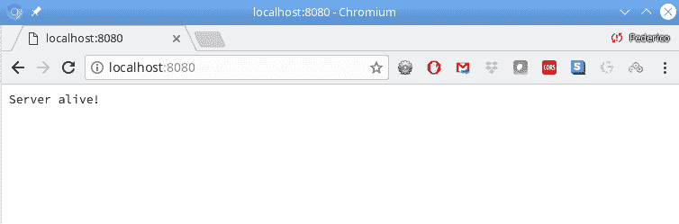
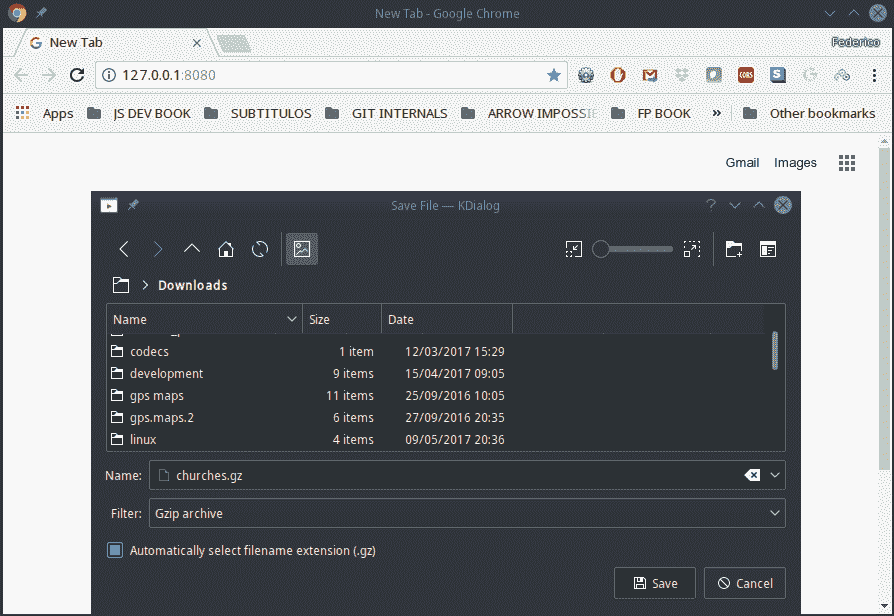

# 三、将 Node 用于开发

我们将在本章中看到的配方如下：

*   正在检查Node的设置
*   使用模块
*   直接将流与Node一起使用
*   通过预处理使用带Node的流
*   使用 Nodemon 运行Node代码
*   使用承诺而不是错误优先回调
*   使用流处理请求
*   用流压缩文件
*   使用数据库
*   使用 exec（）执行外部进程
*   使用 spawn（）运行命令并与之通信
*   使用 fork（）运行Node命令

# 介绍

我们在[第一章](01.html)的*安装Node和 npm*部分安装了`Node`，使用 JavaScript 开发工具，但这只是为了设置`npm`而已。`Node`不仅可以用作 web 服务器，这是最常见的用法，也可以编写 shell 行命令，甚至是桌面应用，我们将在[第 13 章](13.html)中看到，*使用 Electron*创建桌面应用。但是，一些配置和开发实践对于所有这些环境都是通用的，这将是本章的目标。在本章中，我们将开始`Node`开发。

# 正在检查Node的设置

首先，让我们通过创建一个非常基本的服务器来验证`Node`是否正常工作；我们将在下一篇[第 4 章](04.html)*中深入了解更多细节，*通过Node*实现 RESTful 服务，但现在我们只想确保一切正常。在其他章节中，我们将更认真地使用`Node`，但这里的目的是验证它是否正常工作。*

# 怎么做…

让我们先建立一个非常基本的服务器，它将通过返回一个`'Server alive!'`字符串来响应所有请求。为此，我们需要遵循三个步骤：

1.  使用`require()`导入`Node`的`http`模块——我们将在下一节看到更多关于模块的内容；暂时假设`require()`等同于`import`。
2.  然后，使用`createServer()`方法设置我们的服务器。
3.  之后，提供一个函数，通过返回一个`text/plain`固定答案来回答所有请求。

下面的代码代表了最基本的服务器，它将告诉我们是否一切都正常工作。我已将文件命名为`miniserver.js`。粗体的一行完成了所有工作，我们将在下一节中介绍：

```js
// Source file: src/miniserver.js

/* @flow */
"use strict";

const http = require("http");

http
 .createServer((req, res) => {
 res.writeHead(200, { "Content-Type": "text/plain" });
 res.end("Server alive!");
 })
 .listen(8080, "localhost");

console.log("Mini server ready at http://localhost:8080/");
```

# 它是如何工作的…

我们写了一个服务器；现在，让我们来看一下它的运行情况。通过这个非常简单的项目，我们可以直接运行服务器代码。在本章后面的章节中，我们将看到使用流类型将需要一些额外的预处理；不过，我们现在可以跳过这一部分。我们可以使用以下命令行启动服务器：

```js
> node src/miniserver.js
Mini server ready at http://localhost:8080/
```

要验证是否一切正常，只需打开浏览器并转到`http://localhost:8080`。下面的屏幕截图显示了结果（当然不是很令人印象深刻）：



Our minimalistic server is running, showing that we have Node working properly

现在我们知道一切都好了，让我们开始学习一些我们将在本书其他几个地方使用的基本技术。

Why are we running the server at port `8080` instead of `80`? To access ports below `1024`, you need administrative (root) rights. However, that would make your server highly unsafe; a hacker that somehow managed to get into it would have maximum rights at your machine! Thus, the standard practice is to run `Node` with normal rights, at ports over `1024` (such as `8080`, for example) and set up a reverse proxy to send traffic on ports `80` (HTTP) or `443` (HTTPS).

# 使用模块

在[第二章](02.html)的*模块组织代码*部分*使用 JavaScript 现代功能*，我们看到了现代 JS 如何与模块协同工作。然而，对于`Node`，我们有一个小小的挫折：除非您愿意使用实验性的特性，否则它不能以现代的 JS 方式完成模块！ 

为什么`Node`不能与现代 JS 模块一起工作？原因可以追溯到几年前，新模块使用了`import`和`export`语句，并且`Node`实现了 CommonJS 模块格式。（我们将在下一节中看到更多关于这些模块的内容。）显然，与`Node`一起使用的库也是使用这种格式开发的，现在有无数的模块遵循这些准则。

然而，自从新的模块标准出现后，使用新语法的压力开始出现，但这带来了一些问题，不仅仅是调整语言；你能让*两个*完全不同的模块风格共存吗？（因为，没有人能够神奇地将所有使用 CommonJS 的现有代码转换为新格式，对吗？）。ES 模块旨在以异步方式使用，而 CommonJS 模块是同步的；在大多数情况下，这不会造成差异，但有些情况必须加以考虑。

达成的解决方案尚未被认为是确定的。目前（从 8.5 版开始），您可以使用`--experimental-modules`命令行标志启用 ES 模块。如果您使用它调用 node，它将识别 ES 模块，如果它们的扩展名是`.mjs`而不是普通的`.js`。希望到版本 10 时，它将不再需要，但这无法确保，而且到那时某些细节可能会发生更改，这也存在一定的风险！ 

This solution, using the new `.mjs` file extension to identify new-style modules, is whimsically known as the **Michael Jackson Solution** because of the initials of the three words.

因此，如果我在一两年后写这本书，我可能会告诉你继续，开始使用`.mjs`文件扩展名，并使用新的样式模块。

See [https://nodejs.org/api/esm.html](https://nodejs.org/api/esm.html) for current information about this feature.

但是，此时，不应将其视为完全安全的步骤。此时，该功能已明确标记为*实验性*，因此，让我们继续使用当前（旧）标准，并学习如何使用老式模块。让我们创建一个数学模块，您可能希望用于财务编码，因此我们可以看到一个从头开始构建的`Node`样式的模块。

# 怎么做…

通过`Node`模块，我们导出和导入元素的方式有两个重要的变化。任何文件都可以是模块，就像 ES 模块一样。简而言之，为了从模块导入某些内容，您必须使用`require()`函数，模块本身将使用`exports`对象来指定它将导出的内容。

JS 数学运算符（加法、减法等）不进行舍入，因此让我们编写一个`roundmath.js`模块来执行算术，但舍入到美分，用于一个想象中的业务相关应用。首先，我们从启用`Flow`的常用两行开始，并设置严格模式：

```js
// Source file: src/roundmath.js

/* @flow */
"use strict";

// *continues...*
```

Don't forget to add the `"use strict"` line in all your modules, before the rest of your code, as we mentioned in the *Working in strict mode* section in the previous chapter. JS modules are strict by definition, but that doesn't apply to `Node` modules, which are *not* strict.

然后，让我们定义我们的函数。为了多样性，我们将有几个内部（未导出）函数，以及几个将导出的函数：

```js
// ...*continued*

// These won't be exported:

const roundToCents = (x: number): number => Math.round(x * 100) / 100;
const changeSign = (x: number): number => -x;

// The following will be exported:

const addR = (x: number, y: number): number => roundToCents(x + y);

const subR = (x: number, y: number): number => addR(x, changeSign(y));

const multR = (x: number, y: number): number => roundToCents(x * y);

const divR = (x: number, y: number): number => {
    if (y === 0) {
        throw new Error("Divisor must be nonzero");
    } else {
        return roundToCents(x / y);
    }
};

// *continues*...
```

最后，按照通常的惯例，所有导出都将放在一起，位于底部，因此很容易看到模块导出的所有内容。与现代的`export`语句不同，您将要导出的内容分配给一个`exports`对象。如果你想保持变量或函数的私有性，你所需要做的就是跳过赋值；在我们的例子中，我们只输出我们编码的六个函数中的四个：

```js
// ...*continued* exports.addR = addR;
exports.subR = subR;
exports.multR = multR;
exports.divR = divR;
```

# 它是如何工作的…

我们将如何使用这个模块，它是如何工作的？如果我们想从其他模块导入它的一些函数，我们可以编写如下内容：；了解我们如何使用我们设计的一些操作：

```js
// Source file: src/doroundmath.js

/* @flow */
"use strict";

const RM = require("./roundmath.js");

console.log(RM.addR(12.348, 4.221)); // 16.57
console.log(RM.changeSign(0.07)); // error; RM.changeSign is not a function
```

前两行是通常的。然后，我们`require()`需要什么模块；在这一种情况下,。此外，按照惯例，所有这些需求在一开始就被分组在一起，以便更容易理解模块的需求，而无需通读所有代码。在我们的例子中，`RM`被分配了`exports`对象，因此您可以引用`RM.addR()`、`RM.subR()`等等，这向读者表明您正在使用`RM`模块中的某些内容。

如果您想写得少一点，可以利用*解构语句*（我们在上一章*解构数组和对象*一节中见过），直接将所需的方法分配给各个变量：

```js
/* @flow */
"use strict";

const { multR, divR } = require("./roundmath.js");

console.log(multR(22.9, 12.4)); // 283.96
console.log(divR(22, 7)); // 3.14
```

如果您习惯于只导入您需要的模块，那就更好了。在其他情况下（我们将在后面的章节中看到），我们可以使用工具删除任何您实际上不使用的模块，如果您`require()`什么都使用，那就不可能了。

# 直接将流与Node一起使用

由于我们使用的是`Flow`，而`Node`实际上并不知道数据类型，如果我们只是尝试执行数据类型的代码，显然会出现问题。有两种解决方案：一种不是很优雅，但可以加快开发；另一种更强大，但需要额外工作。让我们考虑第一个，更简单的解决方案，把第二个问题留给下一个章节。

# 怎么做…

碰巧，`Flow`提供了两种指定类型的方法：到目前为止我们一直使用的方法，带有额外的类型标记，以及另一种更详细的方法，通过注释。当然，JS 并不*知道*类型定义，所以第一种样式不会工作，除非我们做额外的工作（我们将看到），但是使用注释是完全安全的。

要定义带有注释的类型，所有`Flow`特定定义必须包含在注释中，以`/*:`（注意额外的冒号）开头，以通常的`*/`（对于简单的基本类型）结尾，或以`/*::`和`*/`结尾（对于其他所有类型）。我们可以回顾前面在[第 2 章](02.html)中看到的一些例子，*使用 JavaScript 现代功能*。简单情况如下：

```js
// Source file: src/flowcomments.js

let someFlag /*: boolean */;
let greatTotal /*: number */;
let firstName /*: string */;

function toString(x /*: number */) /*: string */ {
    return String(x);
}

let traffic /*: "red" | "amber" | "green" */;

// *continues...*
```

更复杂的定义（包括可选参数、类型和不透明类型、类属性等）需要更长的注释：

```js
// ...*continued* /*::
type pair<T> = [T, T];
type pairOfNumbers = pair<number>;
type pairOfStrings = pair<string>;

type simpleFlag = number | boolean;

type complexObject = {
    id: string,
    name: string,
    indicator: simpleFlag,
    listOfValues: Array<number>
};
*/

class Person {
 /*::
 first: string;
 last: string;
 */

    constructor(first /*: string */, last /*: string */) {
        this.first = first;
        this.last = last;
    }

    // ...several methods, snipped out
}

// *continues...*
```

您还可以导出和导入数据类型：

```js
// *...continued* /*::
import type { dniType, nameType } from "./opaque_types";
*/

/*::
export type { pairOfNumbers, pairOfStrings };
*/
```

# 它是如何工作的…

这是为什么以及如何工作的？`Flow`能够识别`/*::  ...  */`和`*/**:  ...  */`注释，因此能够完美地完成其工作。由于`Flow`代码都隐藏在注释中，从 JS 引擎的角度来看，`Flow`部分甚至不存在，因此这种工作方式的一个明显优势是，您可以直接执行代码。

你为什么不这样做？明显的批评是，温和地说，该准则看起来很丑陋。如果您习惯于，比如说，`TypeScript`，那么必须在注释中包装所有与类型相关的内容可能会成为一件麻烦事，代码也会更难阅读。此外，您可能会错误地键入注释（可能会忘记其中一个冒号），然后 Flow 将忽略您的定义，这可能会造成让 bug 通过的风险。

还有别的选择吗？是的，有，但它需要一些额外的处理，同时给我们带来了使用标准`Flow`符号的好处；现在让我们来谈谈这个问题

# 通过预处理使用带Node的流

处理评论有点过于冗长。如果您希望使用简单的类型注释和额外的语句，那么在尝试运行`Node`代码之前，您必须先进行一些预处理，以摆脱`Flow`工具。这样做的好处是，所需的处理非常有效，并且在开发时几乎不被注意到；让我们进入其中，看看如何在不破坏我们的`Node`代码的情况下保留`Flow`定义。

# 怎么做…

我们希望使用更短、更简洁的`Flow`样式，但`Node`无法使用此类添加剂执行代码。解决我们难题的方法很简单：在尝试运行之前，只需删除与`Flow`相关的所有内容！有一个软件包，`flow-remove-types`，就是这样做的。如往常一样，开始时，您必须安装所需的软件包：

```js
npm install flow-remove-types --save-dev
```

要继续，您必须通过添加新脚本来启用它。我们正在`src/`目录中编写代码，所以让我们将`Flow`清理后的输出发送到`out/`目录。在该目录中，我们将获得我们将在服务器中使用的代码版本：

```js
"scripts": {
 "build": "flow-remove-types src/ -d out/",
    "addTypes": "flow-typed install",
    "update": "npm install && flow-typed install",
    "flow": "flow",
    .
    .
    .
},
```

最后，我们还应该告诉`Git`忽略`out/`目录。我们已经忽略了`node_modules`和`flow-typed`目录，所以我们再添加一个：

```js
**/node_modules 
**/flow-typed 
**/out
```

We are specifying `**/out` instead of just `out/`, because we are sharing a single `Git` repository between many projects, for the sake of the book. If, as is more common, you had a separate repository for each project, then you would simply specify `out`.

# 它是如何工作的。。。

从您开始使用`flow-remove-types`的那一刻起，会发生什么变化？首先，很明显，你不能仅仅用一个简单的`node src/somefilename.js`来运行你的项目；首先，你必须在`npm run build`之前脱掉`Flow`。此命令的作用是在`out/`中创建`src/`中所有内容的副本，但不包含类型声明。然后，您将能够通过执行`node out/somefilename.js`来运行项目—文件名不会更改。

当`flow-remove-types`包清理您的文件时，它会用空格替换所有类型声明，因此转换后的输出文件具有完全相同的行数，并且每个函数都从与以前完全相同的行开始，从而消除了对 sourcemaps 的需要并保持输出的清晰。以下代码显示了*模块*部分的模块如何处理该过程：

```js
/* @flow */
"use strict";

// These won't be exported:

const roundToCents = (x: number): number => Math.round(x * 100) / 100;

const changeSign = (x: number): number => -x;

// The following will be exported:

const addR = (x: number, y: number): number => roundToCents(x + y);

const subR = (x: number, y: number): number => addR(x, changeSign(y));

const multR = (x: number, y: number): number => roundToCents(x * y);

const divR = (x: number, y: number): number => {
    if (y === 0) {
        throw new Error("Divisor must be nonzero");
    } else {
        return roundToCents(x / y);
    }
};
```

如果您希望有一个较小的输出（毕竟，阅读带有所有这些空格的代码可能有点烦人），您可以生成一个源映射并删除所有空格，方法是向构建脚本添加两个参数，或者添加一个不同的脚本，如以下代码段所示：

```js
"scripts": {
    "build": "flow-remove-types src/ -d out/",
    "buildWithMaps": "flow-remove-types src/ -d out/ --pretty --sourcemaps",
    .
    .
    .
},
```

The `Node` debugger included in VSC fully supports source maps, so producing briefer code won't be a problem. We'll get to see more about this in [Chapter 5](05.html), *Testing and Debugging Your Server*.

现在我们有了一种方法来继续与`Node`和`Flow`一起工作，但是运行我们的代码变得更复杂了一点；让我们看看能不能解决这个问题！

# 使用 Nodemon 运行Node代码

根据我们迄今为止所做的工作，在每次更改之后，运行更新的`Node`代码需要我们执行以下操作：

1.  如果代码仍在运行，请停止代码的当前版本。
2.  重新运行构建过程以更新`out`目录。
3.  运行新版本的代码。

做所有这些，每一个小小的改变，都会很快变得枯燥乏味。但是，有一个解决方案：我们可以安装一个监视程序，它将监视我们的文件的更改，并自行完成这里提到的所有操作，从而将我们从重复的琐事中解放出来。然后，让我们看看如何设置一个工具来监视更改，并自行执行所示的所有步骤。

# 怎么做。。。

我们希望安装并配置`nodemon`，它将为我们处理所有事情，并根据需要运行更新的代码。首先，显然，我们必须安装上面提到的包。您可以通过`npm install nodemon -g`在全球范围内完成，但我更愿意在本地完成：

```js
npm install nodemon --save-dev
```

然后，我们需要添加两个脚本：

*   `npm start`将构建应用并运行我们的主文件
*   `npm run nodemon`将启动监控

```js
"scripts": {
    "build": "flow-remove-types src/ -d out/",
    "buildWithMaps": "flow-remove-types src/ -d out/ --pretty --
     sourcemaps",
 "start": "npm run build && node out/doroundmath.js",
 "nodemon": "nodemon --watch src --delay 1 --exec npm start",
    .
    .
    .  
},
```

现在，我们已经准备好监视应用的更改，并根据需要重新启动它！

# 它是如何工作的。。。

我们最感兴趣的命令是第二个命令。当您运行它时，`nodemon`将开始监视，这意味着它将监视您选择的任何目录（本例中为`out`），并且每当它检测到某些文件更改时，它将等待一秒钟（例如，确保所有文件都已保存），然后它将重新运行应用。我是怎么做到的？

最初，我开始`nodemon`。当您执行`npm run nodemon`时，项目被构建然后运行，`nodemon`一直在等待任何更改；请参见以下屏幕截图：


When you start nodemon, it builds the project, runs it, and keeps watching out for any changes that need a restart

之后，我只是添加了一个简单的`console.log()`行，所以文件会被更改；结果显示了以下屏幕截图，显示了重建和重新启动的代码，以及额外的输出行：


After any change in a watched file, nodemon will restart the project. In this case, I had just added a line logging ADDED TEXT JUST FOR THE CHANGE.

就这些。应用将自动重建并重新启动，无需每次手动重新运行`npm start`；帮了大忙！

Read more about `nodemon` at [http://nodemon.io/](http://nodemon.io/) and [https://github.com/remy/nodemon.](https://github.com/remy/nodemon)

# 使用承诺而不是错误优先回调

现在，让我们开始考虑在编写服务时使用的几种技术。

`Node`作为单个线程运行，因此，如果每次它必须调用服务、读取文件、访问数据库或执行任何其他与 I/O 相关的操作时，都必须等待它完成，那么处理请求将花费很长时间，阻止其他请求被处理，服务器将显示非常糟糕的性能。相反，所有操作（例如这些操作）都是异步完成的，并且您必须提供一个回调，该回调将在操作完成时调用；同时，`Node`将可用于处理其他客户的请求。

There are synchronous versions of many functions, but they can only be applied for desktop work, and never for web servers.

`Node`建立了一个标准，所有回调都应该接收两个参数：错误和结果。如果操作以某种方式失败，错误参数将描述原因。否则，如果操作成功，错误将为 null 或未定义（但在任何情况下，都是一个*falsy*值），并且结果将具有结果值。

这意味着通常的`Node`代码充满了回调，如果回调本身需要另一个操作，这意味着还有更多的回调，而这些回调本身可能有更多的回调，从而产生所谓的*回调地狱*。我们希望能够选择现代承诺，而不是以这种方式工作，幸运的是，有一种简单的方法可以做到这一点。让我们看看如何通过避免回调来简化代码。

# 怎么做…

让我们先看看常见的错误第一次回调是如何工作的。`fs`（文件系统）模块提供了一种`readFile()`方法，可以读取文件，并生成其文本或错误。我的`showFileLength1()`函数尝试读取一个文件，并列出其长度。与回调一样，我们必须提供一个函数，该函数将接收两个值：一个可能的错误和一个可能的结果。

此函数必须检查第一个参数是否为 null。如果它不为 null，则表示存在问题，并且操作不成功。另一方面，如果第一个参数为 null，则第二个参数具有文件读取操作结果。下面的代码强调了与`Node`回调一起使用的常用编程模式；粗体的行是关键行：

```js
// Source file: src/promisify.js

/* @flow */
"use strict";

const fs = require("fs");

const FILE_TO_READ = "/home/fkereki/MODERNJS/chapter03/src/promisify.js"; // its own source!

function showFileLength1(fileName: string): void {
    fs.readFile(fileName, "utf8", (err, text) => {
 if (err) {
 throw err;
 } else {
 console.log(`1\. Reading, old style: ${text.length} bytes`);
 }
    });
}
showFileLength1(FILE_TO_READ);

// *continues...*
```

这种编码风格是众所周知的，但并不真正适合现代发展，基于承诺，甚至更好的是，`async`/`await`。因此，自`Node`的第 8 版开始，就有一种方法可以自动将错误优先回调函数转换为承诺：`util.promisify()`。如果您将该方法应用于任何旧式函数，它将变成一个承诺，然后您可以以更简单的方式工作。

# 它是如何工作的…

`util`模块是`Node`的标准配置，您只需执行以下操作：

```js
const util = require("util");
```

The `util.promisify()` method is actually another example of a Higher Order Function, as we saw in the *Producing functions from functions* section of [Chapter 2](02.html), *Using JavaScript Modern Features*.

使用`util.promisify()`可以使`fs.readFile()`返回承诺，我们将使用`.then()`和`.catch()`两种方式进行处理：

```js
// ...*continued*

function showFileLength2(fileName: string): void {
    fs.readFile = util.promisify(fs.readFile); 
    fs
        .readFile(fileName, "utf8")
        .then((text: string) => {
            console.log(`2\. Reading with promises: ${text.length} bytes`);
        })
        .catch((err: mixed) => {
            throw err;
        });
}
showFileLength2(FILE_TO_READ);

// *continues...*
```

You could have also written `const { promisify } = require("util")`, and then it would have been `fs.readFile = promisify(fs.readFile)`. 

这也允许我们使用`async`和`await`；我将使用 arrow`async`函数，只是为了多样性：

```js
// ...*continued*

const showFileLength3 = async (fileName: string) => {
    fs.readFile = util.promisify(fs.readFile);

    try {
        const text: string = await fs.readFile(fileName, "utf8");
        console.log(`3\. Reading with async/await: ${text.length} bytes`);
    } catch (err) {
        throw err;
    }
};
showFileLength3(FILE_TO_READ);
```

# 还有更多…

记住，你并不总是需要`util.promisify()`。原因有两个：

*   一些库（例如我们已经使用过的`axios`）已经返回了承诺，所以您不必做任何事情
*   其他一些方法（如`Node`的`http.request()`方法；见[https://nodejs.org/dist/latest-v9.x/docs/api/http.html#http_http_request_options_callback](https://nodejs.org/dist/latest-v9.x/docs/api/http.html#http_http_request_options_callback) ）具有完全不同的签名，甚至没有错误参数

无论如何，以标准用法为目标会有所帮助，因此我们将在本书的其余部分采用基于承诺的风格。

# 使用流处理请求

如果您必须处理足够大的数据集，很明显，这会导致问题。您的服务器可能无法提供所有所需的内存，或者即使这不是问题，所需的处理时间也会超过标准等待时间，导致超时，再加上您的服务器将关闭其他请求，因为它将用于处理您的长时间处理请求。

`Node`提供了一种将数据集合作为流进行处理的方法，能够在数据流动时对其进行处理，并通过管道将其以较小的步骤组合成功能，这与 Linux 和 Unix 的管道非常相似。让我们来看一个基本示例，如果您有兴趣进行低级`Node`请求处理，可以使用它。（目前，我们将使用更高级别的库来完成这项工作，我们将在下一章中看到。）当请求传入时，其主体可以作为流访问，从而允许您的服务器处理任何大小的请求。

The response that will be sent to the client is also a stream; we'll see an example of this in the next section, *Compressing files with streams*.

流可以有四种类型：

*   *可读*：可以（显然！）阅读。您可以使用它来处理文件，或者，如下面的示例所示，获取 web 请求的数据。
*   *可写*：可以写入数据的。
*   *双工*：可读写，如 web 套接字。
*   *转换*：可以在读写数据时转换数据的双工流；我们将看到一个压缩文件的例子。

# 怎么做…

让我们编写一些简单的代码来处理一个请求，并展示请求的内容。请求过程的主要代码如下：

```js
// Source file: src/process_request.js

const http = require("http");

http
    .createServer((req, res) => {
        // *For PUT/POST methods, wait until the*
        // *complete request body has been read.*

        if (req.method === "POST" || req.method === "PUT") {
            let body = "";

 req.on("data", data => {
 body += data;
 });

 req.on("end", () => processRequest(req, res, body));

        } else {
            return processRequest(req, res, "");
        }
    })
    .listen(8080, "localhost");

// *continues...*
```

`processRequest()`函数将非常简单，仅限于显示其参数。如果您需要更好地了解如何处理请求，这类代码将非常有用，我们将在下一章中看到。我们将从 URL 和请求正文中获取参数：

```js
// ...*continued*

const url = require("url");
const querystring = require("querystring");

function processRequest(req, res, body) {
 /*
 *Get parameters, both from the URL and the request body*
 */
 const urlObj = url.parse(req.url, true);
 const urlParams = urlObj.query;
 const bodyParams = querystring.parse(body);

 console.log("URL OBJECT", urlObj);
 console.log("URL PARAMETERS", urlParams);
 console.log("BODY PARAMETERS", bodyParams);

 /*
 * Here you would analyze the URL to decide what is required*
 *Then you would do whatever is needed to fulfill the request*
 *Finally, when everything was ready, results would be sent*
 *In our case, we just send a FINISHED message*
 */

 res.writeHead(200, "OK");
 res.end(`FINISHED WITH THE ${req.method} REQUEST`);
}
```

这段代码的输出，我们将在下面看到，将是请求`url`对象（`req.url`），其参数，以及主体中的参数。

# 它是如何工作的…

让我们运行我们刚刚编写的简单服务器，看看它是如何工作的。我们可以使用以下两行代码构建和运行它：

```js
> npm run build
> node out/process_request.js
```

服务器运行后，我们可以使用`curl`对其进行测试—我们将在[第 5 章](05.html)的*测试简单服务*一节*测试和调试您的服务器*中回到这一点，我们将看到`FINISHED...`消息：

```js
> curl "http://127.0.0.1:8080/some/path/in/the/server?alpha=22&beta=9" 
FINISHED WITH THE GET REQUEST

```

The quote characters around the URL are needed, because the `&` character has a special meaning by itself for shell line commands.

服务器控制台将显示以下输出，但我们现在关心的是 URL 参数，这些参数与`curl`调用中提供的匹配：

```js
URL OBJECT Url {
 protocol: null,
 slashes: null,
 auth: null,
 host: null,
 port: null,
 hostname: null,
 hash: null,
 search: '?alpha=22&beta=9',
 query: { alpha: '22', beta: '9' },
 pathname: '/some/path/in/the/server',
 path: '/some/path/in/the/server?alpha=22&beta=9',
 href: '/some/path/in/the/server?alpha=22&beta=9' }
URL PARAMETERS { alpha: '22', beta: '9' }
BODY PARAMETERS {}
```

这很容易，但是如果服务请求是一个`POST`，我们就会监听事件来建立请求的`body`。请参阅以下内容：

*   当有更多数据需要处理时，触发`'data'`。在我们的例子中，在每个事件中，我们都添加到`body`字符串中，以构建请求主体
*   没有更多数据时触发`'end'`。在这里，我们使用它来识别何时获得了请求的完整主体，然后准备继续并处理它。
*   `'close'`（流关闭时）和`'error'`事件在此不适用，但也可用于流处理。

如果我们执行`curl -X "POST" --data "gamma=60" --data "delta=FK" "http://127.0.0.1:8080/other/path/"`来执行`POST`，传递两个身体参数，控制台输出将改变：

```js
URL OBJECT Url {
 protocol: null,
 slashes: null,
 auth: null,
 host: null,
 port: null,
 hostname: null,
 hash: null,
 search: null,
 query: {},
 pathname: '/other/path/',
 path: '/other/path/',
 href: '/other/path/' }
URL PARAMETERS {}
BODY PARAMETERS { gamma: '60', delta: 'FK' }
```

Read more about streams (a lot of information!) at [https://nodejs.org/api/stream.html](https://nodejs.org/api/stream.html).

# 用流压缩文件

我们可以看到更多使用流的例子，有几种类型，例如在我们想要压缩文件的情况下。在这个配方中，我们将使用一个可读的流来读取源代码，并使用一个可写的流来放入压缩后的结果。

# 怎么做…

代码非常简单，也很短。我们只需要`require`所需的模块，为我们要读取的文件创建一个输入流，为我们要创建的文件创建一个输出流，并将第一个流传输到第二个流；没有比这更简单的了：

```js
// Source file: src/zip_files.js

const zlib = require("zlib");

const fs = require("fs");

const inputStream = fs.createReadStream(
 "/home/fkereki/Documents/CHURCHES - Digital Taxonomy.pdf"
);

const gzipStream = zlib.createGzip();

const outputStream = fs.createWriteStream(
 "/home/fkereki/Documents/CHURCHES.gz"
);

inputStream.pipe(gzipStream).pipe(outputStream);
```

# 它是如何工作的…

我们使用`fs`模块生成两个流：一个是可读的流，我们将用它读取给定的文件（这里是固定的，但读取任何其他文件都很简单），另一个是可写的流，Gzip 输出将放在其中。我们将通过`gzip`模块对输入流进行管道传输，该模块将压缩输入，然后将其传递到输出。

我们也可以很容易地创建一个服务器，将压缩文件发送到客户端进行下载。以下是所需的代码；关键的区别是压缩后的流现在转到`response`流。我们还必须提供一些标题，以便客户端知道正在发送压缩文件：

```js
// Source file: src/zip_send.js

const zlib = require("zlib");
const fs = require("fs");

const http = require("http");

http
    .createServer(function(request, response) {
        // Tell the client, this is a zip file.
 response.writeHead(200, {
 "Content-Type": "application/zip",
 "Content-disposition": "attachment; filename=churches.gz"
 });

        const inputStream = fs.createReadStream(
            "/home/fkereki/Documents/CHURCHES - Digital Taxonomy.pdf"
        );

```

```js
        const gzipStream = zlib.createGzip();

        inputStream.pipe(gzipStream).pipe(response);
    })
    .listen(8080, "localhost");
```

如果先`npm run build`再`node out/zip_send.js`，打开`127.0.0.1:8080`会得到如下截图所示的内容；您可以下载压缩文件：



Streams are also used to zip and send a file to the browser Read more about `fs` at [https://nodejs.org/api/fs.html](https://nodejs.org/api/fs.html), and about `zlib` at [https://nodejs.org/api/zlib.html](https://nodejs.org/api/zlib.html).

# 使用数据库

现在让我们看看如何访问数据库，例如`MySQL`、`PostgreSQL`、`MSSQL`、`Oracle`或更多。当我们在 T4 中使用地理位置设置的服务时，我们会在 T4 中选择什么样的国家和地区【T67】，我们会在 T4 中使用它们的地理位置设置服务【T67】来访问这些国家和地区的数据，我们将在后面添加其他内容，以处理更复杂的示例。

# 准备

获得一份国家名单很容易：我使用了来自[的数据 https://github.com/datasets/country-codes](https://github.com/datasets/country-codes) ，我将其删减为两个字符的国家代码（如 ISO 3166-1 标准）和名称。对于地区和城市，我使用了来自[的 GeoNames 数据 http://download.geonames.org/export/dump/](http://download.geonames.org/export/dump/) ；特别是，我使用了`admin1CodesASCII.txt`，我将其改写成`regions.csv`，并将`cities15000.zip`编辑成`cities.csv`。

If you want to be able to view CSV files in a clearer format, check out the EXCEL VIEWER extension for VSC.

关于这三个表，您需要了解的内容如下：

*   *国家*由两个字母的代码标识（例如乌拉圭的*UY*，印度的中的*，并有一个名称*
*   *地区*属于国家，由国家代码加字符串标识；此外，他们还有一个名字
*   *城市*由数字代码标识，有名称、纬度和经度、人口，并且位于一个国家的某个地区

这就足够开始了；稍后，我们将添加更多的表，以进行更多的实验。我用了`MariaDB`（`MySQL`的开口叉；参见[https://mariadb.com/](https://mariadb.com/) 和`MySQL WorkBench`（见[https://www.mysql.com/products/workbench/](https://www.mysql.com/products/workbench/) ）创建表格并导入数据，只是因为这比手工操作更简单！我还创建了一个`fkereki`用户，使用`modernJS!!`作为密码来访问这些表。

If you want to use a different database, such as PostgreSQL or Oracle, the following code will be quite similar, so don't worry much about dealing with a specific DB. If you use an ORM, you'll then see some DB-independent ways of accessing data, which could help should you really have to deal with different DB products.

# 怎么做…

为了访问`MariaDB`数据库，我们将从[安装`mariasql`包 https://github.com/mscdex/node-mariasql](https://github.com/mscdex/node-mariasql) 然后提出其`.query()`方法，以更轻松的方式工作。安装是通过`npm install mariasql --save`完成的，过一会儿（您将看到一些目标代码正在生成），软件包将被安装。按照下面提到的步骤操作。

Another possibility would be to use `mariasql-promise` from [https://github.com/steelbrain/mariasql-promise](https://github.com/steelbrain/mariasql-promise), all of whose methods already return promises. However, getting the connection object and storing it for later use is harder with this library, and that's why I opted for the original one; after all, we only need to modify `.query()` to return a promise.

# 接通

首先，让我们有一些常数，我们将在以后使用；除了`Flow`和严格的使用行之外，我们只需要`MariaDB`库、`promisify()`函数，我们定义了四个常量来访问数据库：

```js
// Source file: src/dbaccess.js

/* @flow */
"use strict";

const mariaSQL = require("mariasql");
const { promisify } = require("util");

const DB_HOST = "127.0.0.1";
const DB_USER = "fkereki";
const DB_PASS = "modernJS!!";
const DB_SCHEMA = "world";

// *continues...*
```

现在，让我们建立一个数据库连接。我们只需要创建一个新对象，并使用它的`.query()`方法。`dbConn`变量将作为参数传递给需要访问数据库的每个函数：

```js
// ...*continued*

function getDbConnection(host, user, password, db) {
    const dbConn = new mariaSQL({ host, user, password, db });
    dbConn.query = promisify(dbConn.query);
    return dbConn;
}

const dbConn = getDbConnection(DB_HOST, DB_USER, DB_PASS, DB_SCHEMA); // *continues*...
```

# 执行一些查询

测试连接是否工作的一种简单方法是执行一个返回常量值的普通查询；这里真正重要的是函数应该在不抛出任何异常的情况下工作。我们使用`await`得到`.query()`方法的结果，即一个包含所有找到行的数组；在这种情况下，数组显然只有一行：

```js
// ...*continued*

async function tryDbAccess(dbConn) {
    try {
        const rows = await dbConn.query("SELECT 1960 AS someYear");
        console.log(`Year was ${rows[0].someYear}`);
    } catch (e) {
        console.log("Unexpected error", e);
    }
}

// *continues*...
```

让我们试试别的办法：找到城市更多的十个国家怎么样？我们可以使用`.forEach()`以一种不太吸引人的格式列出结果：

```js
// ...*continued*

async function get10CountriesWithMoreCities(dbConn) {
    try {
        const myQuery = `SELECT 
            CI.countryCode, 
            CO.countryName, 
            COUNT(*) as countCities
        FROM cities CI JOIN countries CO 
        ON CI.countryCode=CO.countryCode
        GROUP BY 1 
        ORDER BY 3 DESC 
        LIMIT 10`;

 const rows = await dbConn.query(myQuery);
 rows.forEach(r =>
 console.log(r.countryCode, r.countryName, r.countCities)
 );
    } catch (e) {
        console.log("Unexpected error", e);
    }
}

// *continues...*
```

# 更新数据库

最后，让我们做一些更新。我们将首先添加一个新的（发明的！）国家；然后我们会检查它是否存在；我们将更新它并检查更改，然后继续删除它，最后验证它是否已消失：

```js
// ...*continued*

async function addSeekAndDeleteCountry(dbConn) {
    try {
        const code = "42";
        const name = "DOUGLASADAMSLAND";

        /*
            1\. Add the new country via a prepared insert statement
        */
 const prepInsert = dbConn.prepare(
 "INSERT INTO countries (countryCode, countryName) VALUES (:code, :name)"
 );
 const preppedInsert = prepInsert({ code, name });
        await dbConn.query(preppedInsert);

        /*
            2\. Seek the recently added country, return an array of objects
        */
 const getAdams = `SELECT * FROM countries WHERE countryCode="${code}"`;
        const adams = await dbConn.query(getAdams);
        console.log(
            adams.length,
            adams[0].countryCode,
            adams[0].countryName
        );

        /*
            3\. Update the country, but using placeholders
        */
        await dbConn.query(
            `UPDATE countries SET countryName=? WHERE countryCode=?`,
            ["NEW NAME", code]
        );

        /*
           4\. Check the new data, but returning an array of arrays instead
        */
        const adams2 = await dbConn.query(
            `SELECT * FROM countries WHERE countryCode=?`,
            [code],
            { useArray: true }
        );
        console.log(adams2.length, adams2[0][0], adams2[0][1]);

        /*
            5\. Drop the new country
        */
 await dbConn.query(`DELETE FROM countries WHERE countryCode="42"`);

        /*
            6\. Verify that the country is no more
        */
        const adams3 = await dbConn.query(getAdams);
        console.log(adams3.length);
    } catch (e) {
        console.log("Unexpected error", e);
    }
}

// *continues...*
```

# 把所有的东西都放在一起

为了得到一个完整的工作示例，我们现在只需调用以下三个函数：

```js
// ...*continued*

tryDbAccess(dbConn);
get10CountriesWithMoreCities(dbConn);
addSeekAndDeleteCountry(dbConn);
```

最后，我添加了一个脚本，通过执行`npm run start-db`自动运行所有测试：

```js
"scripts": {
    "build": "flow-remove-types src/ -d out/",
    "buildWithMaps": "flow-remove-types src/ -d out/ --pretty --sourcemaps",
    "start": "npm run build && node out/doroundmath.js",
    "start-db": "npm run build && node out/dbaccess.js",
    .
    .
    .
},
```

让我们分析一下代码是如何工作的，并谈谈一些有趣的问题。

# 它是如何工作的…

运行`tryDbAccess()`并不难理解：常量查询进入服务器，返回一个只有一行的数组。我们的代码输出如下：

```js
Year was 1960
```

第二个查询变得更有趣。除了实际编写 SQL 查询的细节（这超出了本书的目标）之外，有趣的一点是返回的数组，每个数组都有一个包含选定字段的对象：

```js
IN India 1301
BR Brazil 1203
RU Russian Federation 1090
DE Germany 1061
CN China 810
FR France 633
ES Spain 616
JP Japan 605
IT Italy 575
MX Mexico 556
```

现在，让我们来看最后一个例子。我们看到了几种创建将要执行的语句的方法。

`INSERT`使用事先准备好的语句。准备安全查询的一个好方法（也就是说，它们不能参与 SQL 注入黑客）是使用准备好的字符串。`.prepare()`方法很有趣：给定一个字符串，它返回一个函数，当使用实际参数调用该函数时，它本身将返回查询中使用的字符串。当然，您也可以手动构建函数，就像我在其他示例中所做的那样，但是接下来要由您来确保生成的查询是安全的！ 

The `.escape()` method can help building a safe query string, if you don't want to use `.prepare()`. See more at [https://github.com/mscdex/node-mariasql](https://github.com/mscdex/node-mariasql).

随后的`SELECT`使用手工创建的字符串（这里没有太原始的内容），但`UPDATE`显示了另一种样式：使用`?`符号作为*占位符*。在这种情况下，还必须提供一个值数组来替换占位符；数组中值的顺序与预期参数匹配是非常重要的

接下来，第二个`SELECT`也使用占位符，但添加了一个调整：通过`useArray:true`选项传递一个对象，该函数的执行速度要快一点，因为它不为每一行创建对象，只返回数组。但是，这有一个问题，因为现在必须记住数组的每个位置的含义

代码的结果与预期的一样：首先是一行，显示一个国家实际上是创建的，带有我们传递的值；然后是相同的记录，但名称已更改，最后是零，表示该国已不复存在：

```js
1 '42' 'DOUGLASADAMSLAND'
1 '42' 'NEW NAME'
0
```

# 还有更多。。。

在本节中，我们介绍了几个访问数据库的示例，通过直接连接、使用表和游标对其执行各种操作。你也可以考虑使用一个 Ty4T4 对象关系映射 AUT T5T（OrthT6:Orm PosiT7）库来处理对象：最有名的可能性可能是 http://docs.sequelizejs.com/ ）但还有一些套餐（如`TinyORM`、`Objection.js`或`CaminteJS`，仅提及一些仍在开发中，而不是废弃的）。

# 使用 exec（）执行外部进程

如果您使用`Node`实现某些服务，可能会在某些情况下需要进行一些繁重的处理，正如我们前面提到的，这是一个*否*，因为您将阻止所有用户。如果你需要做这类工作，`Node`允许你将工作转移到外部进程，释放自己，可以继续工作。外部进程将以异步方式独立工作，完成后，您将能够处理其结果。有几种方法可以做到这一点；让我们去看看。

运行单独命令的第一个选项是`child_process.exec()`方法。这将生成一个 shell，并在其中执行给定的命令。生成的任何输出都将被缓冲，当命令完成执行时，将使用生成的输出或错误调用回调函数

让我们看一个通过访问文件系统调用外部进程的示例

# 怎么做…

例如，要获取给定路径上所有 JS 文件的目录列表，可以如下所示。（是的，当然您可以也应该使用`fs.readDir()`来完成此操作，但我们想展示如何使用子进程来完成此操作。）

如本章前面的*使用承诺而不是错误优先回调*部分所示，我们将`promisify()`调用，以简化编码：

```js
// Source file: src/process_exec.js

const child_process = require("child_process");
const { promisify } = require("util");
child_process.exec = promisify(child_process.exec);

async function getDirectoryJs(path: ?string) {
    try {
 const cmd = "ls -ld -1 *.js";
        const stdout = await child_process.exec(cmd, { cwd: path });
        console.log("OUT", path || "");
        console.log(stdout);
    } catch (e) {
        console.log("ERR", e.stderr);
    }
}
```

# 它是如何工作的…

当我们调用`.exec()`方法时，会创建一个单独的 shell，并在其中运行命令。如果调用成功，则返回输出；否则，具有`.stderr`属性的对象将作为异常抛出。可能的几次运行如下所示：

```js
getDirectoryJs("/home/fkereki/MODERNJS/chapter03/flow-typed/npm");
*OUT /home/fkereki/MODERNJS/chapter03/flow-typed/npm*
*-rw-r--r-- 1 fkereki users 4791 Apr 9 12:52 axios_v0.18.x.js*
*-rw-r--r-- 1 fkereki users 3006 Mar 28 14:51 babel-cli_vx.x.x.js*
*-rw-r--r-- 1 fkereki users 3904 Apr 9 12:52 babel-eslint_vx.x.x.js*
*-rw-r--r-- 1 fkereki users 2760 Apr 9 12:52 babel-preset-env_vx.x.x.js*
*-rw-r--r-- 1 fkereki users 888 Apr 9 12:52 babel-preset-flow_vx.x.x.js*
*-rw-r--r-- 1 fkereki users 518 Apr 9 12:52 eslint-config-recommended_vx.x.x.js*
*-rw-r--r-- 1 fkereki users 14995 Apr 9 12:52 eslint-plugin-flowtype_vx.x.x.js*
*-rw-r--r-- 1 fkereki users 73344 Apr 9 12:52 eslint_vx.x.x.js*
*-rw-r--r-- 1 fkereki users 1889 Mar 28 14:51 fetch_vx.x.x.js*
*-rw-r--r-- 1 fkereki users 188 Apr 9 12:52 flow-bin_v0.x.x.js*
*-rw-r--r-- 1 fkereki users 13290 Apr 9 12:52 flow-coverage-report_vx.x.x.js*
*-rw-r--r-- 1 fkereki users 1091 Apr 9 12:52 flow-remove-types_vx.x.x.js*
*-rw-r--r-- 1 fkereki users 5763 Apr 9 12:52 flow-typed_vx.x.x.js*
*-rw-r--r-- 1 fkereki users 1009 Apr 9 12:52 mariasql_vx.x.x.js*
*-rw-r--r-- 1 fkereki users 0 Mar 28 14:51 moment_v2.3.x.js*
*-rw-r--r-- 1 fkereki users 5880 Apr 9 12:52 nodemon_vx.x.x.js*
*-rw-r--r-- 1 fkereki users 4786 Apr 9 12:52 prettier_v1.x.x.js*

getDirectoryJs("/boot");
*ERR ls: cannot access '*.js': No such file or directory*
```

`.exec()`的第二个参数为对象提供了可能的选项。在本例中，我们为命令指定当前工作目录（`cwd`。另一个有趣的选项可以让你使用产生大量输出的命令；如果需要更多，则必须添加一个对象，并将`maxBuffer`选项设置为更大的值；检查[https://nodejs.org/api/child_process.html#child_process_child_process_exec_command_options_callback](https://nodejs.org/api/child_process.html#child_process_child_process_exec_command_options_callback) 了解有关这些选项和其他选项的更多信息。

您可以执行的命令的复杂性没有限制，但也存在风险。请记住被黑客攻击的可能性：如果您正在根据用户提供的某些输入构建命令，您可能处于命令注入攻击的末尾。假设您想要构建像``ls ${path}``这样的东西，而用户提供了`"/; rm -rf *"`作为`path`；会发生什么？

# 还有更多。。。

使用`.exec()`非常适合短命令，输出很少。如果您实际上不需要 shell，您可以使用`.execFile()`做得更好，它直接运行所需的命令，而无需先创建 shell，然后在其中运行命令。参见[https://nodejs.org/api/child_process.html#child_process_child_process_execfile_file_args_options_callback](https://nodejs.org/api/child_process.html#child_process_child_process_execfile_file_args_options_callback) 了解更多信息。

# 使用 spawn（）运行命令并与之通信

使用`.exec()`很简单，但您仅限于小规模的输出，并且您也无法得到部分答案：让我们来了解更多。假设您正在准备一个大文件发送给客户机。如果使用`.exec()`读取该文件，则在读取所有文件之前，无法开始向客户端发送文件内容。但是，如果文件太大，这不仅意味着延迟，还可能导致崩溃。使用`.spawn()`为您提供了一个有趣的补充：可以使用流以双向方式与衍生流程进行通信。

# 怎么做…

一般而言，使用`.spawn()`与`.exec()`类似。现在让我们使用一个单独的进程来读取目录并将其结果发送回。我们将使用流传递我们想要处理的路径，并且我们还将通过流获得找到的文件列表。

首先，让我们看一下主代码，它将生成一个进程：

```js
// Source file: src/process_spawn.js

const path = require("path");
const { spawn } = require("child_process");

const child = spawn("node", [path.resolve("out/process_spawn_dir.js")]);

child.stdin.write("/home/fkereki");

child.stdout.on("data", data => {
    console.log(String(data));
});

child.stdout.on("end", () => {
    child.kill();
});
```

要完成，我们需要子进程，它将如下所示：

```js
// Source file: src/process_spawn.js

const fs = require("fs");

process.stdin.resume();

process.stdin.on("data", path => {
    // Received a path to process
    fs
        .readdirSync(path)
        .sort((a, b) => a.localeCompare(b, [], { sensitivity: "base" }))
        .filter(file => !file.startsWith("."))
        .forEach(file => process.stdout.write(file + "\n"));

 process.stdout.end();
});
```

# 它是如何工作的…

派生的进程显示了事件的另一种情况。进程停留在那里等待，`"data"`事件在进程通过`stdin`输入接收任何数据时触发，就像通过`child.stdin.write("/home/fkereki")`行所做的那样。然后，进程通过`fs.readdirSync()`读取目录，这是一个在正常`Node`代码中不应该使用的同步调用，但在子进程中这是安全的，因为它不会阻止任何内容。对调用结果进行排序、过滤以避免隐藏文件，然后将行写入`stdout`。

与子进程类似，父进程侦听来自子进程`stdout`的事件。每当数据到达（`"data"`事件被触发）时，只需使用`console.log()`记录。当子Node发出不再有数据到来的信号时，通过执行`process.stdout.end()`，触发`"end"`事件，并且父Node识别它，并且可以做它想做的任何事情。

因此，这种生成进程的方式允许父进程和子进程之间的双向通信，这种通信可以以多种不同的形式使用

# 使用 fork（）运行Node命令

`Child_process.fork()`方法是`.spawn()`的一个特例，它专门产生新的`Node`过程。派生的子进程内置了一个通信通道，使得在父进程和自身之间传递消息变得更加简单：您只需使用`.send()`方法发送消息，并在另一端侦听`"message"`事件。让我们看看如何分叉第二个进程，并与第一个进程通信。

# 怎么做…

由于上一节的代码使用了`.spawn()`来启动一个新的`Node`实例并运行一些代码，很明显我们可以快速简单地将其调整为使用`.fork()`。此外，我们不必使用`stdin`和`stdout`进行通信，而是选择使用消息传递。

首先，让我们从父代码开始。它将成为以下内容：；关键区别在于使用了`.fork()`而不是`.spawn()`，以及文件路径发送到子进程的方式：

```js
// Source file: src/process_fork.js

const path = require("path");
const { fork } = require("child_process");

const child = fork(path.resolve("out/process_fork_dir.js"));

child.send({ path: "/home/fkereki" });

child.on("message", data => {
    console.log(String(data));
});
```

然后，子代码在接收消息和将数据发送到父代码的方式上也会显示小的变化：

```js
// Source file: src/process_fork_dir.js

const fs = require("fs");

process.on("message", obj => {
    // Received a path to process
    fs
        .readdirSync(obj.path)
        .sort((a, b) => a.localeCompare(b, [], { sensitivity: "base" }))
        .filter(file => !file.startsWith("."))
        .forEach(file => process.send && process.send(file));
});
```

# 它是如何工作的…

使用`.fork()`意味着子进程是一个`Node`进程，所以我们不需要像前面章节那样明确提到它，只需要传递要执行的 JS 文件的名称。

第二个区别，正如我们所提到的，是我们不使用`stdin`和`stdout`进行交流，而是可以`.send()`一条消息（在任何方向上，从父母到孩子，反之亦然），我们听`"message"`事件而不是`"data"`事件。

如果您分析代码中突出显示的差异，您会意识到这些差异实际上很小，对于需要运行单独的`Node`流程的特殊（但并非罕见）情况，`.fork()`更合适，并且可能使用起来更简单。