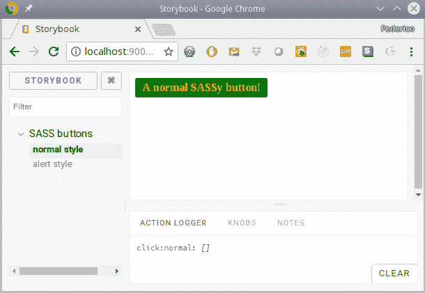
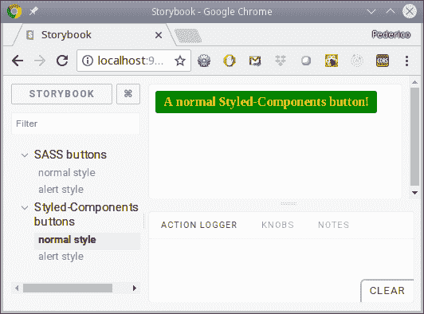
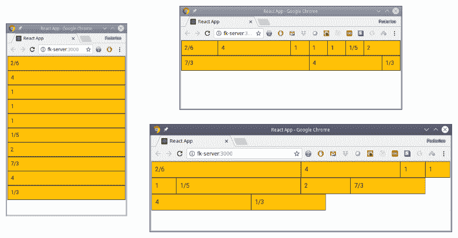
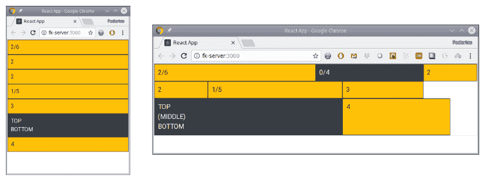
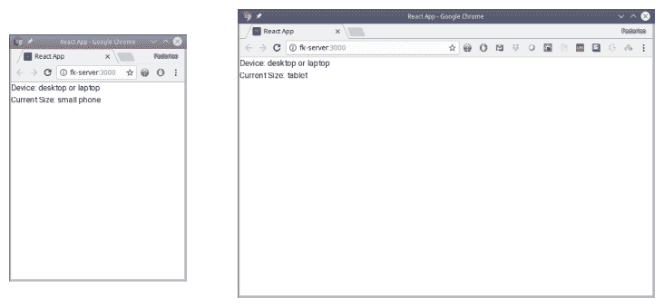
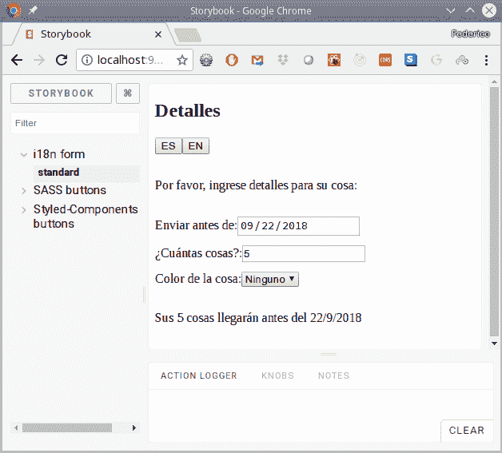
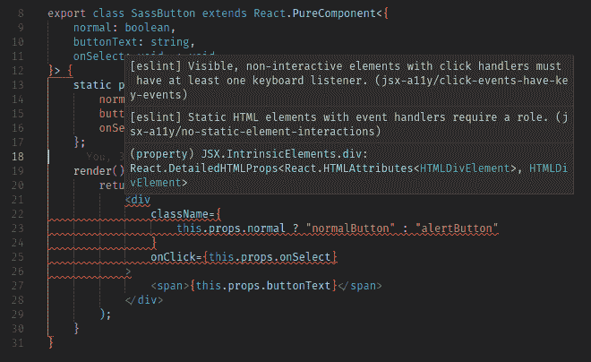

# 七、增强您的应用

在本章中，我们将向前推进，并考虑一些工具，以便更好地应用。我们将看到的食谱包括：

*   为单独的样式添加 SASS
*   为内联样式创建 StyledComponents
*   使应用响应屏幕大小
*   使应用自适应以增强可用性
*   打造国际化和本地化的全球应用
*   设置可访问性

# 介绍

在上一章中，我们开始使用`React`开发应用，并了解了如何使用它、如何创建应用以及如何开发组件的基础知识

我们还将利用`Storybook`，这是我们在上一章中使用的，因此我们可以单独演示每个工具，因此我们不必浪费时间关注其他任何东西。

# 为单独的样式添加 SASS

我们应该添加的第一件事是处理应用样式的一些方法。如果你愿意，你不需要学习任何新的东西，也不需要安装任何额外的东西，因为你可以像我们已经做的那样使用简单的老式 CSS！我们在上一章中使用了一些 CSS（查找`src/components/general.css`文件），但我们甚至不需要去那里。当时我们创建项目时，创建了一个带有以下代码的`App.js`文件：

```js
import React, { Component } from "react";
import logo from "./logo.svg";
import "./App.css";

class App extends Component {
    render() {
        return (
            <div className="App">
                <header className="App-header">
                    
                    <h1 className="App-title">Welcome to 
                       React</h1>
                </header>
                <p className="App-intro">
                    To get started, edit <code>src/App.js</code>
                    and save to reload.
                </p>
            </div>
        );
    }
}

export default App;
```

通过包含`import "./App.css"`行，您将获得`App.css`文件中定义的样式，然后您可以在任何地方使用它们，如代码所示。

This usage of `import` to deal with styling is not a JS thing, but rather is due to `Webpack`, which is used by `create-react-app` to generate the output code for your application.

所以，如果你只想使用 CSS，你只需要做很少的事情，你已经准备好了！然而，有很多工具可以帮助您进行样式化，添加真正有用的特性，在这一节中，我们将考虑如何使用最为著名的 CSS 扩展语言之一的 OutT0}。

If you want to fully learn `SASS`, I'd recommend browsing to [http://sass-lang.com/](http://sass-lang.com/) and particularly check out the LEARNING SASS and DOCUMENTATION areas, at  [http://sass-lang.com/guide](http://sass-lang.com/guide) and [http://sass-lang.com/documentation/file.SASS_REFERENCE.html](http://sass-lang.com/documentation/file.SASS_REFERENCE.html), respectively.

# 怎么做…

`SASS`是一个预处理器，用于处理`.scss`（*Sassy CSS*）文件，并生成浏览器可以使用的标准 CSS 文件。预处理步骤是使用 CSS 中不可用的特性的关键，例如变量、嵌套结构、继承、混合以及其他许多特性。你可以将`SASS`作为一个单独的工具安装和使用，但这并不是很吸引人；我们的目标是将其包含在项目中，因此所有需要的预处理都将自动完成。让我们看看怎么做。

`SASS` has two possible syntaxes: an older, indented one, plainly known as *the indented syntax*, and the newer SCSS. While the former is more concise, the latter has the advantage of being an extension of CSS, which means that any valid CSS file you might already have is automatically a valid SCSS file with the very same meaning. This is a very good help if you are migrating from CSS to `SASS`, so we'll only use SCSS in the text.

首先，我们需要安装一个工具。`create-react-app`的开发人员不希望包含固定的 CSS 预处理器，因此您可以真正添加任何您想要的内容。有几种`SASS`工具，但建议使用以下工具：

```js
 npm install node-sass-chokidar --save-dev
```

其次，我们还必须在`.flowconfig`文件中添加一行额外内容，以便正确识别`.scss`文件。更改后的部分如下：

```js

[options]
include_warnings=true
module.file_ext=.scss .
.
.
```

最后，我们必须修改一些脚本。`SASS`预处理将与 npm start 并行运行，为此，我们需要一个软件包，允许您并行运行多个命令：

```js
npm install npm-run-all --save-dev
```

现在更改的脚本如下所示：

```js
"build-scss": "node-sass-chokidar src/ -o src/",
"watch-scss": "npm run build-scss && node-sass-chokidar src/ -o src/ --watch --recursive",
"start-js": "react-app-rewired start",
"build-js": "react-app-rewired build",
"storybook-js": "start-storybook -p 9001 -c .storybook",
"start": "npm-run-all -p watch-scss start-js",
"build": "npm-run-all build-scss build-js",
"storybook": "npm-run-all -p watch-scss storybook-js",
.
.
.
```

让我们看看我们的新流程和更新流程的功能：

*   `build-scss`将`src/`中的`.scss`文件转换为`.css`文件；我们将使用后者
*   `watch-scss`对 SASS 文件进行初始转换，然后在*监视*模式下运行转换，每当有新的或更改的文件要处理时运行转换
*   `start-js`、`build-js`和`storybook-js`是我们的旧`start`、`build`和`storybook`流程，我们不会直接使用这些流程
*   `start`现在并行运行`watch-scss`和`start-js`（因为`-p`选项）
*   `build`现在运行`build-scss`和`build-js`，因此在构建应用之前，所有 SCS 都已转换
*   `storybook`同时运行`watch-scss`和`storybook-js`，也并行运行

你准备好了！从现在起，`.scss`文件将被正确处理，并转换为`.css`文件；让我们看看如何让这项工作为我们现在。

# 它是如何工作的…

让我们创建一个基本组件，一个彩色按钮，并设计它的样式，尽可能多地利用`SASS`特性。这将是一个极端的例子，因为创建简单代码的方式不太可能如此复杂，但我们想在这里强调一下`SASS`。

首先，按钮本身的代码，我们称之为`SassButton`。有三个道具：`normal`（如果为真，则显示*正常*颜色；如果为假，则显示*警报*颜色）；`buttonText`，按钮显示；还有`onSelect`，一个点击回调。我在下面的代码片段中突出显示了 CSS 相关的行：

```js
// Source file: /src/components/sassButton/sassButton.js

/* @flow */

import React from "react";
import PropTypes from "prop-types";
import "./styles.css";

export class SassButton extends React.PureComponent<{
    normal: boolean,
    buttonText: string,
    onSelect: void => void
}> {
    static propTypes = {
        normal: PropTypes.bool.isRequired,
        buttonText: PropTypes.string.isRequired,
        onSelect: PropTypes.func.isRequired
    };

    render() {
        return (
            <div
                className={
                    this.props.normal ? "normalButton" : "alertButton"
                }
                onClick={this.props.onSelect}
            >
                <span>{this.props.buttonText}</span>
            </div>
        );
    }
}
```

Even if working with `SASS` and `.scss` files, you'll be importing the preprocessed `.css` output files, not the `.scss` original ones. Be careful not to import a `.scss` file by mistake.

我们假设 CSS 类`.normalButton`和`.alertButton`确实存在；现在让我们开始创建它们。首先，让我们定义一个*部分*SCSS 文件`_constants.scss`，它将定义一些带有颜色的变量。部分文件的文件名总是以下划线开头，并且不会转换为 CSS；相反，它们被假定为来自其他 SCSS 文件的`@import`：

```js
$normalColor: green;
$normalText: yellow;

$alertColor: red;
$alertText: white;
```

变量的名称以美元符号开头，这是设置标准定义（例如字体或颜色）的一种非常好的方法。如果我决定把我的正常颜色改成蓝色，我只需要在一个地方改一下，然后到处换。请注意，我可以在许多地方使用`$normalColor`，用于背景、文本等，所有内容都将通过一次编辑进行更新。

现在让我们定义一些可以用来包含 CSS 代码的*mixin*，甚至可以使用参数。我们的`darkenBackground()`mixin 将生成代码，将`background-color`设置为一个值，并将使用它的任何元素的`:hover`属性更改为 25%的深色版本。注意`&:hover`中的符号和，它代表父元素，还有`darken()`函数，它只是 SASS 提供的许多函数之一，用于处理颜色、大小等。

参见[http://sass-lang.com/documentation/file.SASS_REFERENCE.html#operations](http://sass-lang.com/documentation/file.SASS_REFERENCE.html#operations) 欲了解更多信息：

```js
@mixin darkenBackground($color) {
    background-color: $color;
    &:hover {
        background-color: darken($color, 25%);
        transition: all 0.5s ease;
    }
}

@mixin coloredBoldText($color) {
    color: $color;
    font-weight: bold;
}
```

最后，我们可以在`styles.scss`文件中构建我们的样式。首先，我们导入 partials：

```js
@import "_constants.scss";
@import "_mixins.scss";
```

然后，为了展示其他`SASS`特性，让我们定义一个基本的占位符类`%baseButton`，它将被扩展。初始`%`字符（类似于类或 ID 初始字符）表示此代码不打算直接使用：

```js
%baseButton {
    display: inline-block;
    text-decoration: none;
    padding: 5px 10px;
    border-radius: 3px;
}
```

现在，让我们扩展这个基类来创建我们的按钮：我们将使用`@extend`来实现这一点，并使用`@include`将 mixin 的输出添加到结果代码中。我们还包括了一些`/* ... */`注释，但您也可以使用`//`进行单行注释：

```js
/*
    A simple button for normal situations
*/
.normalButton {
    @extend %baseButton;
    @include darkenBackground($normalColor);

    span {
        @include coloredBoldText($normalText);
    }
}

/*
    An alert button for warnings or errors
*/
.alertButton {
 @extend %baseButton;
    @include darkenBackground($alertColor);

    span {
        @include coloredBoldText($alertText);
    }
}
```

如果您想知道最终会产生什么结果，那么生成的`styles.css`文件如下：仔细检查，您将看到翻译的 mixin 和常量，以及如何定义扩展样式、如何使用`:hover`等等：

```js
.normalButton, .alertButton {
  display: inline-block;
  text-decoration: none;
  padding: 5px 10px;
  border-radius: 3px; }

.normalButton {
  background-color: green; }
  .normalButton:hover {
    background-color: #000100;
    transition: all 0.5s ease; }
  .normalButton span {
    color: yellow;
    font-weight: bold; }

.alertButton {
  background-color: red; }
  .alertButton:hover {
    background-color: maroon;
    transition: all 0.5s ease; }
  .alertButton span {
    color: white;
    font-weight: bold; }
```

我们现在只需要写一个故事并查看`Storybook`中的按钮：

```js
// Source file: /src/components/sassButton/sassButton.story.js

import React from "react";
import { storiesOf } from "@storybook/react";
import { action } from "@storybook/addon-actions";

import { SassButton } from "./";

storiesOf("SASS buttons", module)
    .add("normal style", () => (
 <SassButton
 normal
 buttonText={"A normal SASSy button!"}
 onSelect={action("click:normal")}
 />
    ))
    .add("alert style", () => (
 <SassButton
 normal={false}
 buttonText={"An alert SASSy button!"}
 onSelect={action("click:alert")}
 />
    ));
```

When a prop is meant to be `true` or `false`, just including its name makes it true. See how in the first story we can just write `normal` instead of `normal={true}`; both are equivalent.

我们可以在以下屏幕截图中看到正常按钮：



Our normal button, shown in Storybook

在以下屏幕截图中可以看到光标悬停的警报按钮：


Our alert button, with hovering colors

因此，这里我们看到了一个常见的解决方案：使用`SASS`创建 CSS。在下一节中，让我们进入一种更原始的工作方式，将 CSS 代码放在 JS 代码中，而不是与之分离！

# 为内联样式创建 StyledComponents

JS 中的 CSS 有时是一个有争议的话题。在`React`之前，几乎必须要有三套 JS、HTML 和 CSS 独立文件。当`React`引入 JSX 时，这是对三人的攻击，因为我们开始在 JS 代码中放置 HTML。JS 中的 CSS 是这个想法的自然扩展，因为现在我们还想在相同的 JS 文件中包含样式

对此的第一React是：*这不就是回到内联样式吗？*这是一个有效的问题，但内联样式还不够强大。虽然可以通过内联样式来管理许多样式，但事实上，有几个功能无法通过这种方式访问：关键帧动画、媒体查询、伪选择器等等。

在 JS 中使用 CSS 的想法是使用 JS 编写样式，然后将这些样式注入 DOM 中的`<style>`标记中，这样您就可以对代码使用 CSS 的全部功能。此外，这也与基于组件的方法（如 React）保持了良好的一致性，因为您可以以适当的封装方式将所需的所有内容打包在一起，而不必依赖全局样式文件和处理 CSS 的单个名称空间。

有很多软件包都在推广这种样式，我们将从中挑选`styled-components`，这是 JS 样式中最受推崇的 CSS 软件包之一。它的原理很有趣：不向组件添加样式，而是创建包含这些样式的组件，并在任何地方使用它们。让我们先看看如何将这个包添加到代码中，然后继续使用它。

For the original talk on CSS-in-JS, by Christopher *vjeux* Chedeau, in which he gives the reasons for working with styling done in JS, see [https://speakerdeck.com/vjeux/react-css-in-js](https://speakerdeck.com/vjeux/react-css-in-js).

# 怎么做…

安装`styled-components`非常简单，请注意，这不是开发依赖关系，因为您将在生产代码中实际使用该包，而不是作为单独的预处理步骤或诸如此类的步骤：

```js
npm install styled-components --save
```

我们将使用带标签的模板文本（我们之前在[第 2 章](02.html)的*字符串*部分中看到，*使用现代 JavaScript 功能*，因此您可能希望刷新本书的这一部分

使用`Flow`不会有问题，因为`styled-components`得到了它的良好支持，所以我们不需要做任何特别的事情。最后，对于 VSC，您可能需要使用`vscode-styled-components`扩展来添加语法突出显示。

Read the full documentation for `styled-components` at [https://www.styled-components.com/docs](https://www.styled-components.com/docs).

# 它是如何工作的…

让我们尝试使用`SASS`重新创建我们构建的按钮，但要使用我们的新工具。我们不会试图模仿`SASS`代码，但我们会尝试应用一些相同的概念，比如在单独的文件中定义常量，让函数作为 mixin 工作，以及像前面一样扩展类。我们有一个问题，因为`styled-components`不像`SASS`那样提供颜色函数，所以我们将添加一个新的库来解决这个问题，`color`：

This package provides you with lots of methods to create and manipulate colors, so you'll do well by taking a look at its documentation, at [https://github.com/qix-/color](https://github.com/qix-/color).

```js
npm install color --save
```

现在，我们准备好了。首先，我们在文件`constants.js`中有一些基本颜色常数，可以在任何地方使用：

```js
export const NORMAL_COLOR = "green";
export const NORMAL_TEXT = "yellow";

export const ALERT_COLOR = "red";
export const ALERT_TEXT = "white";
```

There's an alternative way of sharing global style data, by means of theming; if you are interested, check it out at [https://www.sty](https://www.styled-components.com/docs/advanced#theming)[led-components.com/docs/advanced#theming](https://www.styled-components.com/docs/advanced#theming).

现在我们将直接开始定义我们的组件，因为所有的样式也将在那里。首先，我们需要一些进口产品：

```js
// Source file: /src/components/styledButton/styledButton.js

/* @flow */

import React from "react";
import PropTypes from "prop-types";
import styled from "styled-components";
import Color from "color";

import {
    NORMAL_TEXT,
    NORMAL_COLOR,
    ALERT_TEXT,
    ALERT_COLOR
} from "./constants";

// *continues...*
```

鉴于此，我们可以进入主代码。我们将有一个`makeSpan()`函数，它将作为一个 mixin 来工作；我们将很快开始使用它，我们将了解`props`的含义：

```js
// ...*continued*

const makeSpan = props => `
    span {
        color: ${props.normal ? NORMAL_TEXT : ALERT_TEXT};
        font-weight: bold;
    }
`;

// *continues...*
```

然后，我们将定义一个具有一些基本样式的`BasicStyledDiv`组件，作为按钮的基类。（请记住，我们正在以一种不必要的复杂方式工作，只是为了强调一些您可能想要在真正需要它的问题中使用的功能！）此组件大致相当于我们在`SASS`中的`%baseButton`声明，来自上一节：

```js
// ...*continued*

const BasicStyledDiv = styled.div`
    display: inline-block;
    text-decoration: none;
    padding: 5px 10px;
    border-radius: 3px;
`;

// *continues...*
```

之后，我们可以通过扩展前一个组件来创建一个`StyledDiv`组件。由于`styled-component`允许我们使用函数和表达式，因此我们不必创建两种不同的样式，就像我们在构建`.normalButton`和`.alertButton`时对`SASS`所做的那样。另外，请注意，我们可以在这里使用`&`，这意味着对类的引用，就像在`SASS`中一样：

```js
// ...*continued*

const StyledDiv = BasicStyledDiv.extend`
    background-color: ${props =>
        props.normal ? NORMAL_COLOR : ALERT_COLOR};
    &:hover {
        background-color: ${props =>
            Color(props.normal ? NORMAL_COLOR : ALERT_COLOR)
                .darken(0.25)
                .string()};
        transition: all 0.5s ease;
    }
    ${props => makeSpan(props)};
`;

// *continues...*
```

我们看到的这个`props`参数是什么？创建样式时，组件的道具将传递给我们的代码，因此我们可以调整样式。在这种情况下，如果组件的`this.props.normal`值为`true`，则使用`NORMAL_COLOR`；否则，`ALERT_COLOR`将适用。这大大简化了我们的代码，因为我们不必以固定的方式创建样式；我们可以让他们适应我们想要的一切

所有这些之后，按钮本身的代码非常简单：

```js
// ...*continued*

export class StyledButton extends React.PureComponent<{
    normal: boolean,
    buttonText: string,
    onSelect: void => void
}> {
    static propTypes = {
        normal: PropTypes.bool.isRequired,
        buttonText: PropTypes.string.isRequired,
        onSelect: PropTypes.func.isRequired
    };

    render() {
        return (
 <StyledDiv
 normal={this.props.normal}
 onClick={this.props.onSelect}
 >
                <span>{this.props.buttonText}</span>
 </StyledDiv>
        );
    }
}

// *continues...*
```

写一篇故事来验证这一点其实很简单，因为我们只需要复制我们为`SASS`样式按钮编写的上一篇故事，并用`StyledButton`替换`SassButton`；不需要其他任何东西。（好的，为了清晰起见，我还更改了一些字符串，但这些编辑是微不足道的。）如果我们启动`Storybook`，我们可以快速验证我们的新按钮是否与上一个按钮的工作方式相同；有关这方面的证据，请参见以下屏幕截图：



Using `styled-components` is as successful as SASS, and more "JavaScripty" If you want to get some specific tips, and learn some new tricks, check out [https://github.com/styled-components/styled-components/blob/master/docs/tips-and-tricks.md](https://github.com/styled-components/styled-components/blob/master/docs/tips-and-tricks.md).

# 使应用响应屏幕大小

创建 web 应用意味着您不能假定任何给定的显示大小。事实上，用户可能会更改浏览器的窗口大小，而您的应用应该以某种方式对此做出响应，重新排列屏幕上显示的内容，以便更好地处理当前的屏幕尺寸。如果您的 web 应用能够进行这种重组，那么据说它具有*响应性*。今天，考虑到使用浏览器的设备种类繁多（从小型手机到非常大的平板屏幕），必须进行响应性设计，因此在本节中，我们将了解如何使用浏览器。我假设您已经了解 CSS 概念，例如网格和柱状设计；如果没有，请仔细阅读。

为了消除一个常见的、相当明显的问题，如果您了解 CSS 的当前趋势，您可能会问我们为什么不使用 Flexbox 或 CSS 网格，这两种网格都可以轻松实现响应性设计。答案在于可用性：如果您查看[等位置 https://www.caniuse.com/](https://www.caniuse.com/) ，您会发现这两个功能都是最近才可用的，因此用户可能还没有访问它们的权限。总而言之，请注意以下几点：

*   Internet Explorer 部分支持这两种功能，但存在许多错误
*   Edge 仅从 2018 年 4 月发布的第 17 版开始支持它们
*   FireFox 从 2018 年 5 月的版本 60 开始支持它们
*   Safari 自 2018 年 3 月 11.1 版起就支持它们
*   Chrome 从 2016 年 3 月开始支持 FlexBox 版本 49，但仅从 2018 年 4 月版本 66 开始支持 CSS 网格

如您所见，如果您想使用这些功能，从今天（2018 年 12 月）起，只有少数用户可以访问这些功能，而对于绝大多数用户来说，会导致屏幕混乱。因此，即使这意味着使用比需要更大的库，我们也将使用当前的标准，我们将在下一节中看到。

# 怎么做…

网站和 web 应用设计最流行的前端库之一是`Bootstrap`，自 2011 年 8 月开始提供；大约有七年了。从第 2 版开始，它就包含了响应性设计处理。*Mobile First Design*（因此您应该先让您的设计在较小的设备上运行，然后再担心为较大的屏幕添加处理功能）包含在版本 3 中，而`SASS`支持出现在版本 4 中。除了响应性设计支持，`Bootstrap`还提供其他功能，如组件、排版和更多实用程序，因此您可能不会错过在[查看整个文档的机会 https://getbootstrap.com/docs/4.1/getting-started/introduction/](https://getbootstrap.com/docs/4.1/getting-started/introduction/) 。

`Bootstrap` is currently GitHub's second most starred project, following FreeCodeCamp's first place. And if you wonder, `React` is practically tied at third place with another framework, `Vue`, and with EBook's Foundation set of free programming books. You can check the results by yourself at [https://github.com/search?o=desc&q=stars%3A%3E1&s=stars&type=Repositories](https://github.com/search?o=desc&q=stars%3A%3E1&s=stars&type=Repositories).

要安装`Bootstrap`，我们只需要通常的`npm`命令：

```js
npm install bootstrap --save
```

You can save your work by downloading pre-build images, both for CSS and JS; see [https://getbootstrap.com/docs/4.1/getting-started/download/](https://getbootstrap.com/docs/4.1/getting-started/download/) for those options. Alternatively, there exists a `React` package at [https://react-bootstrap.github.io/](https://react-bootstrap.github.io/), `react-bootstrap`, which today only supports `Bootstrap` version 3, but promises forthcoming full support for `Bootstrap` version 4\. Yet another possible option you may want to look into is `reactstrap`, at [https://reactstrap.github.io/](https://reactstrap.github.io/).

`Bootstrap`提供了很多功能，包括：

*   *组件*，如警报、按钮、下拉菜单、导航栏等；参见[https://getbootstrap.com/docs/4.1/components](https://getbootstrap.com/docs/4.1/components) 查看完整列表
*   *表*，通用第三方组件，具有多种配置可能性；参见[https://getbootstrap.com/docs/4.1/content/tables](https://getbootstrap.com/docs/4.1/content/tables) 更多信息
*   *排版相关元素*，处理设计中将使用的多种字体；退房[https://getbootstrap.com/docs/4.1/content/typography/S](https://getbootstrap.com/docs/4.1/content/typography/)
*   *造型细节*，如边框、颜色、阴影、大小等；阅读[https://getbootstrap.com/docs/4.1/utilities/](https://getbootstrap.com/docs/4.1/utilities/)

在任何情况下，我们都不会特别处理前面的列表，因为它基本上只是一个样式问题，我们已经做过了。相反，我们将把重点放在定位元素上，改变它们的大小，甚至根据当前屏幕大小隐藏或显示它们；现在让我们继续讨论这个问题。

# 它是如何工作的…

`Bootstrap`基于媒体查询，使用基于 12 列的网格系统，具有多个设备大小的断点：

*   `xs`：非常小，比如人像手机，宽度小于 576 像素
*   `sm`：小型，如景观手机，高达 768 像素
*   `md`：中等，像平板电脑一样，高达 992 像素
*   `lg`：像台式机一样大，高达 1200 像素
*   `xl`：超大，超过 1200 像素

These limits aren't hardcoded, and may be changed. Other common values are 1024 and 1440, instead of 992 and 1200\. Yet another possibility is considering HD devices (1920x1080) and 4K devices, with a resolution of 2560x1600.

无论何时放置图元，都可以按列指定其宽度，位置将根据可用的行空间进行排列，并根据需要移动到新行。您还可以根据屏幕尺寸允许元素的不同大小和顺序，甚至根据可用空间隐藏或显示组件（全部或部分）

# 调整元素大小

通过使用`col-xx-yy`类（例如`col-sm-3`或`col-md-5`，您可以根据当前屏幕宽度决定元素的大小。下面的代码示例显示了我避免使用单独的样式表，只是为了简化：

```js
// Source file: /src/App.1.js

/* @flow */

import React, { Component } from "react";

class App extends Component<{}> {
    render() {
        const cl = "border border-dark p-2 bg-warning ";

        return (
            <div className="container mw-100">
                <div className="row border">
 <div className={cl + "col-sm-2 col-md-6"}>2/6</div>
                    <div className={cl + "col-sm-4"}>4</div>
                    <div className={cl + "col-sm-1"}>1</div>
                    <div className={cl + "col-sm-1"}>1</div>
                    <div className={cl + "col-sm-1"}>1</div>
 <div className={cl + "col-sm-1 col-md-5"}>1/5</div>
                    <div className={cl + "col-sm-2 "}>2</div>
 <div className={cl + "col-sm-7 col-md-3"}>7/3</div>
                    <div className={cl + "col-sm-4 "}>4</div>
 <div className={cl + "col-sm-1 col-md-3"}>1/3</div>
                </div>
            </div>
        );
    }
}

export default App;
```

我们可以看到渲染如何随屏幕大小而变化；见下图：



The same elements, rendered at different screen widths

在最小的屏幕大小下，所有元素都以相同的垂直大小渲染；从逻辑上讲，这将适合一个非常小的设备。当我们放大窗口大小时，7/3 元素现在占据了 7 列，而 2/6、1/5 和 1/3 元素则比较窄。当我们进一步增加窗口宽度时，请注意 7/3 元素只占用三列，其他三个元素变宽。

当然，你不太可能想出这种奇怪的设计，有这么多不同的宽度和如此奇特的大小调整规则，但这里的要点是，通过使用`Bootstrap`网格，元素可以在大小上有所不同，并优雅地流向不同的行，而无需做任何特殊的事情。

# 重新排序元素

在前面的示例中，我们看到了组件如何调整自身大小，以及如何跨行流动。但是，还有其他要求：例如，对于给定的屏幕大小，您可能希望组件显示在不同的位置。幸运的是，`Bootstrap`也考虑到了这一点。让我们使用一个元素来改变它在其余元素中的位置：

```js
// Source file: /src/App.2.js

/* @flow */

import React, { Component } from "react";

class App extends Component<{}> {
    render() {
        const cl = "border border-dark p-2 bg-warning ";
        const ch = "border border-dark p-2 bg-dark text-white ";

        return (
            <div className="container mw-100">
                <div className="row border">
                    <div className={cl + "col-sm-2 col-md-6"}>2/6</div>
                    <div className={cl + "col-sm-4"}>4</div>
                    <div className={cl + "col-sm-1"}>1</div>
 <div
 className={
 ch + "col-sm-1 order-sm-first order-md-
                            last"
 }
 >
 1
 </div>
                    <div className={cl + "col-sm-1 col-md-5"}>1/5</div>
                    <div className={cl + "col-sm-3 "}>3</div>
                </div>
            </div>
        );
    }
}

export default App;
```

对于小型设备，我们的特殊组件应该是第一个，而对于中型设备，它应该移动到最后。对于非常小的设备（我们没有提供任何特殊规则），它应该出现在其正常位置。请参见以下图像：


Components can also change their relative positions.

这将处理第二组常见的需求，允许您随意改变组件在屏幕上显示的顺序。我们只有一个案例，我们将在下一节中看到。

# 隐藏或显示元素

我们的最后一种设计规则是，某些组件（或部分组件）可能不应以给定的屏幕大小显示。例如，如果你提供一部电影的信息，在大屏幕上，除了电影标题和完整描述外，你还可以包括一个场景的静物，加上主要演员的照片，但在小屏幕上，你可以只使用电影标题和基本信息。让我们用两个组件来展示这种需求：一个组件将完全隐藏，而另一个组件仅隐藏其部分内容：

```js
// Source file: /src/App.3.js

/* @flow */

import React, { Component } from "react";

class App extends Component<{}> {
    render() {
        const cl = "border border-dark p-2 bg-warning ";
        const ch = "border border-dark p-2 bg-dark text-white ";

        return (
            <div className="container mw-100">
                <div className="row border">
                    <div className={cl + "col-sm-2 col-md-6"}>2/6</div>
 <div className={ch + "d-none d-sm-block col-sm-4"}>
 0/4
 </div>
                    <div className={cl + "col-sm-2"}>2</div>
                    <div className={cl + "col-sm-2"}>2</div>
                    <div className={cl + "col-sm-1 col-md-5"}>1/5</div>
                    <div className={cl + "col-sm-3 "}>3</div>
 <div className={ch + "col-sm-7 "}>
 <div>TOP</div>
 <div className="d-none d-sm-block">(MIDDLE)
                        </div>
 <div>BOTTOM</div>
 </div>
                    <div className={cl + "col-sm-4 "}>4</div>
                </div>
            </div>
        );
    }
}

export default App;
```

要查看此操作，请查看下图：



A component fully disappears in small screens, while others show different contents

0/4 组件被设置为仅在小屏幕和更多屏幕上显示，因此在左侧屏幕截图中它只是消失。另一个组件在较小的屏幕上显示两行，但在较大的屏幕上显示更完整的内容（好的，三行而不是两行）。

# 使应用自适应以增强可用性

通过使用网格和我们在上一节中看到的所有样式，在许多情况下，您不需要任何额外的东西来构建响应性强的网站。但是，在某些情况下，仅移动组件、调整组件大小，甚至隐藏部分或全部组件是不够的。例如，您可能真的希望在小屏幕和大屏幕上显示完全不同的组件，例如，一个屏幕上有三个选项卡，一次只显示一个选项卡，但在桌面上有三列显示，同时显示所有内容。变化可能更为剧烈：您可能会决定某些功能在移动设备上不可用，而只包括在大屏幕上。因此，我们不再进行响应式设计，而是深入研究自适应设计，这意味着屏幕的实际设计和功能将发生变化，然后我们需要能够处理代码中的内部变化。

# 怎么做…

如果您想自己进行自适应设计，您当然可以设置一些东西来监听屏幕大小或方向的变化，然后生成一些组件或其他组件。虽然这种方法没有错，但通过安装`react-responsive`可以使它变得简单得多，这是一个包，它可以处理所有的事情，您只需指定渲染某些组件的条件，只要满足这些条件，就会渲染这些组件。在任何大小或方向更改时，软件包都会处理任何需要重新渲染的内容。

安装需要通常的`npm`命令：

```js
npm install react-responsive --save
```

这个包中的关键组件称为`<MediaQuery>`，它让您可以使用媒体查询，或者使用道具，以一种更像`React`的方式；我更喜欢后者，但如果您对更多 CSS-y 选项感兴趣，请查看文档。现在让我们看看它是如何使用的。

Read more about `react-responsive` at [https://github.com/contra/react-responsive](https://github.com/contra/react-responsive). There are many more features than I'll be showing in this text.

# 它是如何工作的…

基本上，为了检测任何大小变化，您所要做的就是在渲染时生成一个或多个`<MediaQuery>`组件，并且那些满足要求的组件将被实际渲染，其余的不会显示在页面上。

让我们编写一个包含大量媒体查询的非常基本的示例，以了解您将使用的编码样式。以下是 react-responsive GitHub 页面中给出的示例；我们将尝试检测当前设备和窗口的某些方面：

```js
// Source file: /src/App.4.js

/* @flow */

import React, { Component } from "react";
import MediaQuery from "react-responsive";

const XS = 576; // phone
const SM = 768; // tablet
const MD = 992; // desktop
const LG = 1200; // large desktop

class App extends Component<{}> {
    render() {
        return (
            <div>
                <MediaQuery minDeviceWidth={MD + 1}>
                    <div>Device: desktop or laptop</div>

                    <MediaQuery maxWidth={XS}>
                        <div>Current Size: small phone </div>
                    </MediaQuery>

                    <MediaQuery minWidth={XS + 1} maxWidth={SM}>
                        <div>Current Size: normal phone</div>
                    </MediaQuery>

                    <MediaQuery minWidth={SM + 1} maxWidth={MD}>
                        <div>Current Size: tablet</div>
                    </MediaQuery>

                    <MediaQuery minWidth={MD + 1} maxWidth={LG}>
                        <div>Current Size: normal desktop</div>
                    </MediaQuery>

                    <MediaQuery minWidth={LG + 1}>
                        <div>Current Size: large desktop</div>
                    </MediaQuery>
                </MediaQuery>

                <MediaQuery maxDeviceWidth={MD}>
                    <div>Device: tablet or phone</div>
                    <MediaQuery orientation="portrait">
                        <div>Orientation: portrait</div>
                    </MediaQuery>
                    <MediaQuery orientation="landscape">
                        <div>Orientation: landscape</div>
                    </MediaQuery>
                </MediaQuery>
            </div>
        );
    }
}

export default App;
```

我定义了四个大小常量（`XS`、`SM`、`MD`和`LG`，以匹配`Bootstrap`使用的值，但您当然可以使用其他大小。

You can also modify the values in `Bootstrap`, so it will work with different breakpoints: see [https://getbootstrap.com/docs/4.1/layout/grid/#grid-tiers](https://getbootstrap.com/docs/4.1/layout/grid/#grid-tiers) for more on this.

无论何时呈现我们的`App`组件，都会执行媒体查询，并且根据其结果，组件将呈现或不呈现。在我们的例子中，我们只是用文本生成一些`<div>`实例，但很明显，您实际上可以生成任何其他类型的组件

我们可以在 Chrome 中运行此应用，并在调整窗口大小时查看它如何生成不同的内容：请参见下图：



Our component automatically reacts to any screen size changes, and produces different components, even if our example lacks variety!

或者，您可以使用工具栏中的设备切换，然后您还可以看到您的应用，就像它在手机或平板电脑中一样；请查看以下屏幕截图以获取此示例：


Chrome's Developer Tools include a device toggle that lets you simulate multiple kinds of devices, including phones and tablets as well

使用`Bootstrap`进行简单调整，使用`react-responsive`进行更复杂的工作，您可以确保应用适合运行在任何设备上。现在让我们转到另一种情况：在不同的国家或地区跑步！

# 打造国际化和本地化的全球应用

随着全球化程度的不断提高，您编写的任何网站都可能需要使用两种或两种以上的语言。在加拿大，英语和法语是强制性的；在瑞士，可以要求四种语言；即使在美国这样一个（据说是单一语言的）国家，该网站的西班牙语版本也可以添加到英语版本中。当然，翻译是不够的：日期和货币金额也需要根据国家的不同而采用不同的格式，所以我们也必须注意这一点。

现在有一些定义：能够使您的软件适应不同的语言被称为*国际化*，通常缩写为*i18n*——18 代表首字母*i*和末字母*n*之间的 18 个字母。然后，为特定区域配置系统的具体过程称为*本地化*，简称为*l10n*，原因与 i18n 类似。最后，如果你真的喜欢这些*数字*，国际化和本地化的结合也被称为*全球化*，简称为*g11n*。

This pair of definitions is based upon a document by the W3C, at [https://www.w3.org/International/questions/qa-i18n](https://www.w3.org/International/questions/qa-i18n). There, they define that "Internationalization is the design and development [...] that enables easy localization for target audiences that vary in culture, region, or language" and "Localization refers to the adaptation [...] to meet the language, cultural and other requirements of a specific target market (a locale)."

幸运的是，在`React`中处理这些方面很简单，只需要提前做一些计划，我们将在本食谱中看到这一点。

# 怎么做…

处理所有 i18n 问题的好包是`i18next`。我们可以使用以下命令将其与用于检测浏览器语言的软件包一起安装：

```js
npm install i18next i18next-browser-languagedetector --save
```

您还必须决定一种后备语言（英语可能是`"en"`），并为应用中使用的所有字符串提供翻译。要了解这一点，对于一个虚构的数据输入表单（在一个非常小的应用中；通常，您会有数百个翻译！），您可以使用以下`translations.en.json`英文文件：

```js
{
    "details": "Details",
    "number": "How many things?",
    "color": "Thing Color",
    "send it before": "Send the thing before",
    "please enter details": "Please, enter details for your thing:",
    "summary": "Your only thing will be there before {{date, 
     AS_DATE}}",
    "summary_plural":
        "Your {{count}} things will be there before {{date, AS_DATE}}",
    "colors": {
        "none": "None",
        "steel": "Steel",
        "sand": "Sand"
    }
}
```

如果您决定还提供西班牙语（`"es"`）翻译，您需要添加另一个文件`translations.es.json`。（注意：您可以按照任何方式命名您的文件，并且不必遵循我的示例。）此新 JSON 文件具有非常相同的键，但已翻译为西班牙语：

```js
{
    "details": "Detalles",
    "number": "¿Cuántas cosas?",
    "color": "Color de la cosa",
    "send it before": "Enviar antes de",
    "please enter details": "Por favor, ingrese detalles para su 
     cosa:",
    "summary": "Su única cosa llegará antes de la fecha {{date, 
     AS_DATE}}",
    "summary_plural":
        "Sus {{count}} cosas llegarán antes del {{date, AS_DATE}}",
    "colors": {
        "none": "Ninguno",
        "steel": "Acero",
        "sand": "Arena"
    }
}
```

这个想法是，每当你想显示某个文本时，你都会通过它的键（如`"details"`或`"number"`）引用它，最终提供额外的参数（如`"summary"`），翻译包会选择正确的字符串来显示；让我们通过完成一个示例来了解它是如何工作的

`i18next`包还可以处理复数和特定的格式规则。您首先必须初始化它，如下所示；我们正在创建一个`i18n`文件：

```js
// Source file: /src/components/i18nform/i18n.js

import i18n from "i18next";
import LanguageDetector from "i18next-browser-languagedetector";

import EN_TEXTS from "./translations.en.json";
import ES_TEXTS from "./translations.es.json";

i18n.use(LanguageDetector).init({
    resources: {
        en: { translations: EN_TEXTS },
        es: { translations: ES_TEXTS }
    },
    fallbackLng: "en",
    ns: ["translations"],
    defaultNS: "translations",
    debug: true,
    interpolation: {
        escapeValue: false,
        format: function(value, format, lang = i18n.language) {
            if (format === "AS_DATE") {
                try {
                    const dd = new Date(value);
                    return new Intl.DateTimeFormat(lang).format(
                        new Date(
                            dd.getTime() + dd.getTimezoneOffset() * 
                            60000
                        )
                    );
                } catch (e) {
                    return "???";
                }
            } else {
                return value;
            }
        }
    }
});

const t = i18n.t.bind(i18n); // to allow using t(...) instead of i18n.t(...)

export { i18n, t };
```

应注意有关代码的一些详细信息：

*   `use(...)`方法告诉`i18next`使用浏览器语言检测器包。
*   在`resources`属性中，您必须为我们从 JSON 文件导入的每种语言提供翻译集。
*   `fallbackLng`指定默认语言为英语（`"en"`）。
*   `ns`和`defaultNS`定义翻译的名称空间，通常只是*翻译*，正如我们在`resources`属性中使用的那样。
*   `debug`是一个很好的工具，因为它会将您想要翻译但在参考资料中未定义的任何键登录到控制台。
*   `interpolation.escapeValue`为您提供了转义所有值的选项：您可以使用它来显示未经检查的用户输入的值，但这里不需要它。
*   `interpolation.format`允许您定义一个特殊的格式化函数，该函数应以特定格式为给定语言生成给定值所需的任何输出。在我们的例子中，我们将其与`summary`和`summary_plural`键一起使用，以正确的样式格式化日期：英语为月/日/年，西班牙语为日/月/年。例如，您还可以使用此函数将数字格式化为货币。

You can check the full documentation for `i18next` at [https://www.i18next.com/](https://www.i18next.com/). 

# 它是如何工作的…

想象一下，我们正在定义一个输入表单，它允许您订购一些东西，选择它们的颜色，并决定最早的交货日期。我们的`<I18nForm>`组件可以按如下方式编码，请注意，我们只关注输入表单，而不关注实际*对用户数据做*任何事情！另外，不要注意糟糕的用户界面设计；再一次，我们关心这里的翻译，所以我希望尽可能少的额外 JSX 代码：

```js
// Source file: /src/components/i18nform/i18nform.js

/* @flow */

import React from "react";

import "./styles.css";

import { i18n, t } from "./i18n";

export class I18nForm extends React.PureComponent<
    {},
    {
        delivery: String,
        howMany: Number,
        thingColor: String
    }
> {
    state = {
        delivery: "2018-09-22",
        howMany: 1,
        thingColor: "NC"
    };

    constructor(props) {
        super(props);
        this.rerender = () => this.forceUpdate();
    }

    componentDidMount() {
        i18n.on("languageChanged", this.rerender);
    }

    componentWillUnmount() {
        i18n.off("languageChanged", this.rerender);
    }

    render() {
        return (
            <div>
                <div>
                    <h2>{t("details")}</h2>
                    <button onClick={() => i18n.changeLanguage("es")}>
                        ES
                    </button>
                    <button onClick={() => i18n.changeLanguage("en")}>
                        EN
                    </button>
                </div>
                <br />
                <div>{t("please enter details")}</div>
                <br />
                <div>
                    {t("send it before")}:
                    <input
                        type="date"
                        value={this.state.delivery}
                        onChange={e =>
                            this.setState({ delivery: e.target.value })
                        }
                    />
                </div>
                <div>
                    {t("number")}:
                    <input
                        type="number"
                        min="1"
                        value={this.state.howMany}
                        onChange={e =>
                            this.setState({
                                howMany: Number(e.target.value)
                            })
                        }
                    />
                </div>
                <div>
                    {t("color")}:
                    <select
                        onChange={e =>
                            this.setState({ thingColor: e.target.value })
                        }
                    >
                        <option value="NC">{t("colors.none")}</option>
                        <option value="ST">{t("colors.steel")}</option>
                        <option value="SD">{t("colors.sand")}</option>
                    </select>
                </div>
                <br />
                <div>
                    {t("summary", {
 count: this.state.howMany,
 date: this.state.delivery
 })}
                </div>
            </div>
        );
    }
}
```

应注意有关代码的一些详细信息：

*   通过对象传递插值的额外参数（如使用`"summary"`键）以及所需参数
*   如果您想为单数和复数版本定义不同的行，您必须像我们在这里所做的那样定义两个键：`summary`为单数，而`summary_plural`为复数，然后`i18next`将根据`count`参数的值决定使用哪个键

我们如何处理语言的动态变化？我们提供了两个按钮来调用`i18n.changeLanguage(...)`，但是我们如何重新渲染组件呢？有（至少）三种方法：

*   你可以收听`"languageChanged"`事件并强制更新，这就是我们在这里所做的。（我们使用`.on(...)`将组件设置为侦听，然后在卸载时使用`.off(...)`将其停止。）
*   另一个解决方案是在应用状态中包含当前选择的语言（我们将在下一章中对此进行研究），您可以通过道具将其提供给组件，因此`React`将在语言更改时重新呈现所有内容。
*   最后，您可以使用位于[的`react-i18next`框架包 https://github.com/i18next/react-i18next](https://github.com/i18next/react-i18next) 提供更无缝的集成。

我们可以用一个非常简单的故事来测试我们的翻译：

```js
// Source file: /src/components/i18nform/i18nform.story.js

/* @flow */

import React from "react";
import { storiesOf } from "@storybook/react";

import { I18nForm } from "./";

storiesOf("i18n form", module).add("standard", () => <I18nForm />);
```

加载故事后，它看起来如以下屏幕截图所示：


Our input form, with initial values, displayed in English

如果更改数量，底部的文本将相应更新；请参见以下屏幕截图：


If we order more than one thing, the plural translation is used

而且，如果您将语言更改为西班牙语，所有文本将自动翻译；请看以下屏幕截图：



By listening to the language change event, we can force the component to re-render itself and show translations for the newly chosen language A small detail: whenever you use a date `<input>` element, dates are formatted according to your computer's locale, so the displayed value doesn't change for Spanish. However, the element's value is always the same, in ISO format: in our case, `2018-09-22`. You can solve this by using a special handcrafted component, but we won't be doing that, since what we cared about was showing how translations work.

正如我们所看到的，准备一个国际应用并不是一个很难的问题。即使你一开始不打算这样做，以这种方式工作也是值得的；必须在现有代码中改进翻译可能会更加困难。

# 可访问性设置（a11y）

在设计网页时，术语“可访问性”指的是提供支持，使包括残疾人在内的所有人都可以使用您的网页。因此，必须考虑许多需求，例如，包括以下需求：

*   *视力限制*，从视力差到色觉问题，一直到完全失明
*   *听力限制*，对听力受损用户需要一些回退方法
*   *移动限制*，这可能意味着难以或无法使用手或控制鼠标
*   *认知限制*，这可能会使理解屏幕上显示的信息变得复杂

有许多工具可以帮助残疾用户，如屏幕缩放、语音识别、屏幕阅读器、盲文终端、闭路字幕等，但即使是这些工具也需要一些额外的信息才能正常工作。**网络内容可访问性指南**（**WCAG**）是一套指南，由**万维网联盟**（**W3C**的**网络可访问性倡议**（**WAI**发布。当前版本为 2.1，可在线访问[https://www.w3.org/TR/WCAG21/](https://www.w3.org/TR/WCAG21/) 基于四个原则，被称为“浇注”的首字母缩略词：

*   *可感知***：**信息和用户界面组件必须以用户可以感知的方式呈现给用户
*   *可操作*：用户界面组件和导航必须可操作
*   *可理解*：信息和用户界面的操作必须是可理解的
*   *健壮*：内容必须足够健壮，能够被多种用户代理解释，包括辅助技术

这些原则引用自引用页面，包括*指南*关于颜色的使用、使用键盘、为屏幕阅读器提供信息、具有足够的对比度、显示错误等；*充分的咨询技巧*，有助于遵循指南；和*成功标准*，表示用于一致性测试的可测试条件。后一个标准也用于定义三个合规级别：*A*，最低级别；*AA*中等，包括所有*A*和*AA*成功标准，以及*AAA*最难达到的标准，满足所有现有标准，但承认某些站点可能无法达到。

尝试确保您的 web 应用遵循所有准则并应用所有技术并不容易，因此我们将看看如何向`React`添加一些工具，以使您的任务更容易一些。

# 怎么做…

为了检查我们的工作是否具有可访问性，我们将安装几个软件包，因此让我们按照上面提到的过程进行操作：一个用于编写代码时的静态检查，使用`ESLint`，另一个用于运行应用时的动态检查。而且，如果你问自己*为什么只有两个工具而不是一个？*，答案是静态工具无法检查所有内容：例如，如果将变量的值分配给标题，那么该值在运行时是否不为空？另一方面，由于您的所有代码都是 lint，因此您有机会检测到一些在正常测试中可能会遗漏的内容，因此使用两个工具，您并不是在做冗余工作，而是增加了发现可访问性问题的几率。

安装`ESLint`模块非常简单。首先，我们将使用`npm`添加包：

```js
npm install eslint-plugin-jsx-a11y --save-dev
```

然后，我们必须稍微修改我们的`.eslintrc`文件，添加新插件，并指定我们想要强制执行的规则：

```js
{
    .
    .
    .
    "extends": [
        "eslint:recommended",
        "plugin:flowtype/recommended",
        "plugin:react/recommended",
 "plugin:jsx-a11y/recommended"
    ],
    "plugins": ["babel", "flowtype", "react", "jsx-a11y"],
    .
    .
    .
}
```

If you don't want to use all rules (as we did here) you can specify the rules you care for in the `"rules"` part of the file: see [https://github.com/evcohen/eslint-plugin-jsx-a11y](https://github.com/evcohen/eslint-plugin-jsx-a11y) for details on this, and inspect the complete set of available rules at [https://github.com/evcohen/eslint-plugin-jsx-a11y/tree/master/docs/rules](https://github.com/evcohen/eslint-plugin-jsx-a11y/tree/master/docs/rules).

我们想要添加的第二个组件是`react-a11y`，它是一个在内部修改 React 渲染函数的包，因此可以在运行时检测到可访问性问题。安装很简单：

```js
npm install react-a11y --save
```

那么，您要在`ESLint`开始时使用与您想要的`a11y`相同的规则。检查[https://github.com/reactjs/react-a11y/tree/master/docs/rules](https://github.com/reactjs/react-a11y/tree/master/docs/rules) 用于完整列表，因为可能会添加新规则。（您还必须查看该列表，以了解哪些规则（如果有）具有特殊选项。）默认情况下，所有规则都是`"off"`，因此您必须明确将其打开到`"warn"`或`"error"`。从 2018 年 12 月起，完整配置如下：

```js
import React from "react";
import ReactDOM from "react-dom";
import a11y from "react-a11y";

a11y(React, ReactDOM, {
    rules: {
        "avoid-positive-tabindex": "warn",
        "button-role-space": "warn",
        "hidden-uses-tabindex": "warn",
        "img-uses-alt": "warn",
        "label-uses-for": "warn",
        "mouse-events-map-to-key-events": "warn",
        "no-access-key": "warn",
        "no-hash-ref": "warn",
        "no-unsupported-elements-use-aria": "warn",
        "onclick-uses-role": "warn",
        "onclick-uses-tabindex": "warn",
        "redundant-alt": ["warn", ["picture", "image", "photo", "foto", 
        "bild"]],
        "tabindex-uses-button": "warn",
        "use-onblur-not-onchange": "warn",
        "valid-aria-role": "warn"
    }
});

// a11y.restoreAll() *would undo all changes*
```

You might want to not enable `a11y` in production, to avoid a needless slowdown.

我们把一切都安排好了；现在让我们看看所有这些是如何结合在一起的。

# 它是如何工作的…

首先，让我们看看通过`ESLint`检测到的错误会发生什么，然后我们将转到运行时问题。

# 解决静态问题

我们的第一个*错误`a11y`编码的受害者*是我们的 SASS 按钮；请参见以下屏幕截图：



Our SASS button has (at least) two accessibility-related problems

一条`a11y`规则是，您应该能够仅使用键盘来使用应用，因此我们需要能够通过 tab 键找到按钮（这需要使用`tabIndex`并提供键盘侦听器（`onKeyPress`或`onKeyDown`。此外，必须指定元素（用作按钮）的角色。更正后的 JSX 代码如下：

```js
<div
    className={
        this.props.normal ? "normalButton" : "alertButton"
    }
    onClick={this.props.onSelect}
 onKeyPress={this.keyDownAsClick}
 tabIndex="0"
 role="button"
>
    <span>{this.props.buttonText}</span>
</div>
```

新方法`.keyDownAsClick()`将检查用户是否按下空格键（ASCII 代码 32）或*输入*键（ASCII 代码 13），如果是，则调用与`onClick`处理程序相同的逻辑：

```js
keyDownAsClick = (e: { keyCode: number }) => {
    if (e.keyCode === 32 || e.keyCode === 13) {
        this.props.onSelect();
    }
}
```

我们的输入表单也有一个问题，尽管比较简单。请参见以下屏幕截图：


Our things ordering form only has a small a11y problem

问题及其解决方案很清楚：建议用`onBlur`代替`onChange`，这样对用户没有影响。考虑到所需的更改有多小，我们不会显示已编辑的代码，只会编辑文件以替换该方法。

我们可以尝试在表单中添加一个图像，只是为了得到另一个不同的警告。尝试在表单中添加 Packt 徽标，如下所示：

```js

```

在这种情况下，我们会得到一个关于需要一个`alt`属性（在`img`标记中添加`alt="Packt logo"`即可）来描述图像的警告；请看以下屏幕截图：


Another a11y rule requires images to have an alt attribute to describe them

最后，让我们看看我们的工具失败的案例！我们用`styled-components`创建的按钮与我们的`SASS`按钮存在基本相同的问题，但没有任何报告；为什么？原因很简单：如果您检查代码（请参阅本章前面的*为单独样式*添加 SASS 部分），我们不会使用`<div>`或`<button>`实例或任何其他可识别的 HTML 标记，而是使用`<StyledDiv>`和`<StyledButton>`，这是我们的`a11y eslint`插件不理解的。到目前为止，唯一的解决办法是手动将我们的样式化组件更改回它们的原始标记，解决可能出现的任何问题，然后返回样式化版本——诚然，这不是一个很好的解决方案！

# 解决运行时问题

如果我们现在在`Storybook`中尝试我们的固定组件，`react-a11y`不会说任何关于它们的内容，但它会报告`styled-components`的一些问题，这是我们事先无法解决的；请参见以下屏幕截图：


The react-a11y runtime tests show some problems in our component

当然，考虑到我们构建的组件与之前的`SASS`组件相匹配，因此访问性问题的解决方案是相同的也就不足为奇了：添加`onKeyDown`、`tabIndex`、`role`和密钥处理方法。更正代码的相关部分如下：

```js
keyDownAsClick = (e: { keyCode: number }) => {
 if (e.keyCode === 32 || e.keyCode === 13) {
 this.props.onSelect();
 }
};

render() {
    return (
        <StyledDiv
            normal={this.props.normal}
            onClick={this.props.onSelect}
 onKeyDown={this.keyDownAsClick}
 tabIndex="0"
 role="button"
        >
            <span>{this.props.buttonText}</span>
        </StyledDiv>
    );
}
```

当然，我们刚刚看到了所有可能出现的问题及其解决方案的冰山一角，但真正重要的是，如我们所示，您有一些工具来帮助您开发支持`a11y`的应用。

# 还有更多

我们如何确保完全符合`a11y`应用？不幸的是，您无法仅使用一些工具来管理它。例如，我们选择的工具中没有一个指出我们应该向输入字段添加名称，正如 ARIA 规则所指出的（请参见[https://w3c.github.io/using-aria/#fifth](https://w3c.github.io/using-aria/#fifth) 了解更多信息）。此外，还有一些无法在代码中测试的条件。例如，指南规定错误或必填字段不应仅用颜色突出显示（因为色盲），而应具有一些外部文本或标记；您将如何以自动化的方式对此进行测试？以[为例，看下面的截图 https://govuk-elements.herokuapp.com/errors/example-form-validation-multiple-questions](https://govuk-elements.herokuapp.com/errors/example-form-validation-multiple-questions) ，增强了错误的可视性：


A sample input form from a UK government site that shows good a11y practices for errors

如果不进行审核，就不可能获得 A、AA 或 AAA 级别，但您可以添加更多工具来帮助实现这一点：

*   W3C Web 易访问性计划在[上提供了一个广泛的工具列表（截至今天为 113 个！）https://www.w3.org/WAI/ER/tools/](https://www.w3.org/WAI/ER/tools/)
*   A11Y 项目在[提供了一个简化 web 可访问性的社区努力，展示了几种有用的技术 https://a11yproject.com/](https://a11yproject.com/)
*   MDN 全面概述了 ARIA，这是一个来自 W3C 的规范，旨在通过使用 HTML 属性为屏幕阅读器提供额外信息，见[https://developer.mozilla.org/en-US/docs/Web/Accessibility/ARIA/ARIA_Techniques](https://developer.mozilla.org/en-US/docs/Web/Accessibility/ARIA/ARIA_Techniques)
*   W3C 还提供了许多关于使用 ARIA 的建议，包括在[处的代码示例 https://w3c.github.io/using-aria/](https://w3c.github.io/using-aria/)
*   对于所有主浏览器，都有几个可访问性检查器，它们可以在运行中诊断页面*，所以只需搜索它们；有些用作浏览器扩展，而另一些则是添加到网站的代码，用于检测和报告可能出现的问题*

 *即使没有一个工具或一套工具可以确保`a11y`合规性，您也可以为自己构建一个良好的开始工具；试一下！*