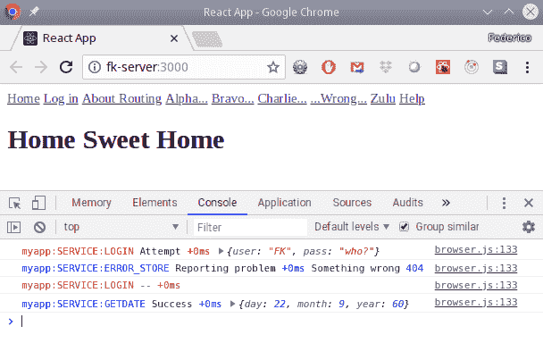
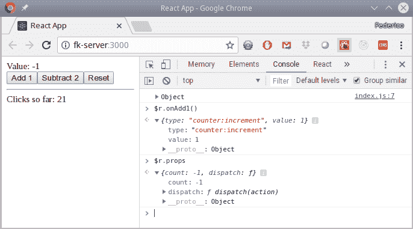
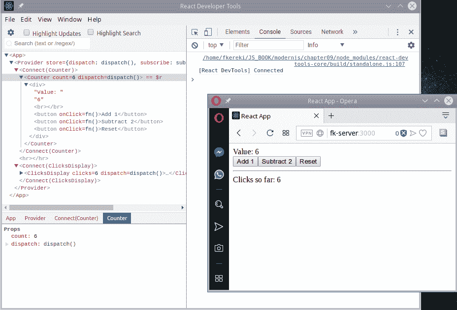
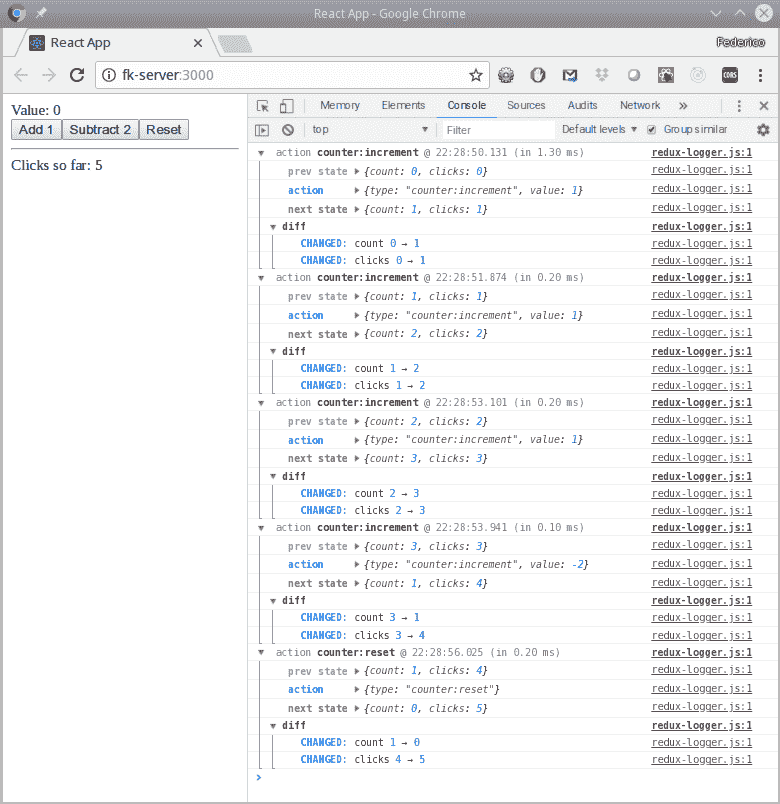
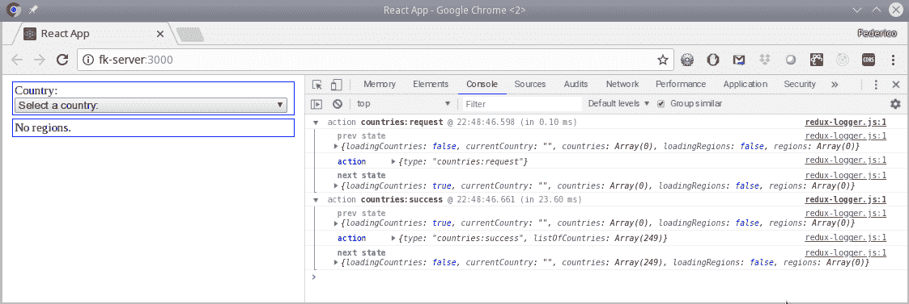
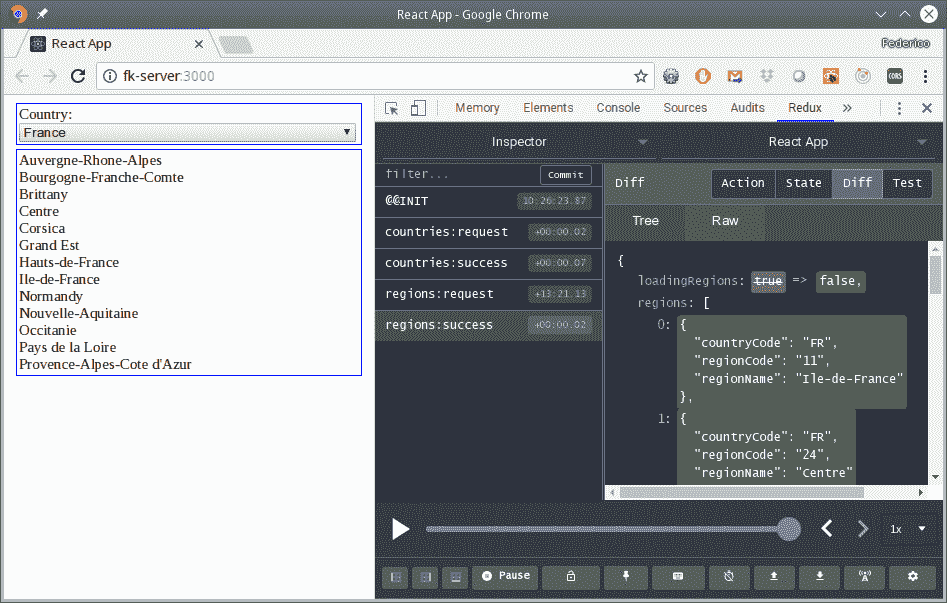
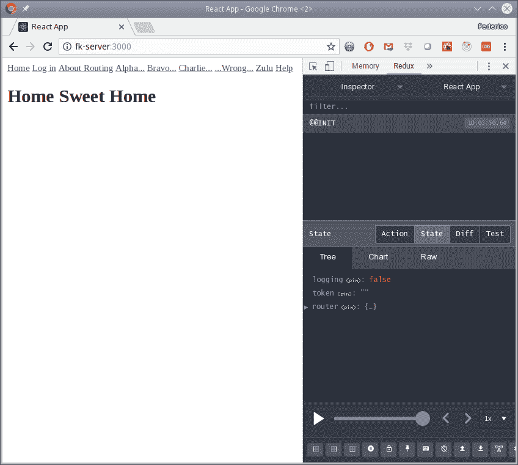
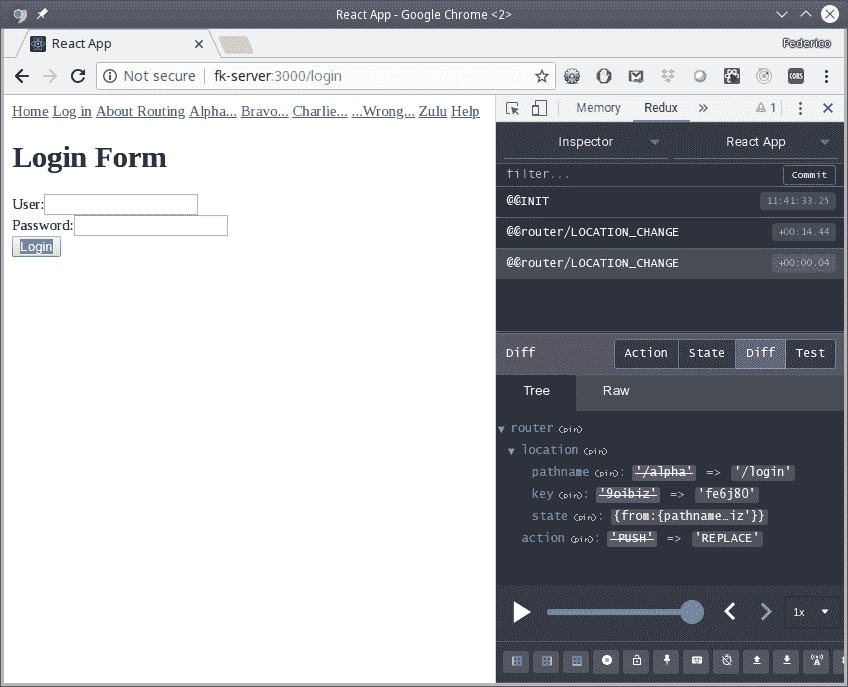

Debugging Your Application  

# 应用程序调试

我们将在这里看到的食谱有：

*   有风格的日志记录
*   使用 React 开发人员工具进行调试
*   使用独立工具进行调试
*   使用 Redux 记录器记录 Redux
*   使用 Redux 开发工具调试 Redux
*   用于调试的连接路由

# 介绍

在前面的章节中，我们看到了如何开发一个基本的`React`应用程序，如何增强它以获得更好的用户体验，以及如何扩展它，使它在复杂和大型的应用程序范围内更具可扩展性。然而，所有这些开发肯定都需要测试和调试，因此在本章中，我们将讨论调试方法，在下一章中，我们将介绍测试。

# 有风格的日志记录

日志记录仍然是一个很好的工具，但您不能仅仅依靠使用诸如`console.log()`或`console.error()`之类的工具。即使他们只是为了一个短期的调试运行而做这些工作，但如果你打算更认真地包括日志记录，并想在生产中禁用它，那么你将需要做大量的工作来追踪每一个日志记录调用或*猴子修补*控制台对象，这样`.log()`或`.error()`就无法完成他们的工作，这更糟糕！

回到[第 5 章](05.html)*测试和调试您的服务器*的*添加 Winston*日志部分，我们使用`Winston`进行日志记录（也使用`Morgan`，但这是针对 HTTP 日志记录的，所以不算数）该库的一些特性使我们能够轻松地启动或停止日志记录。没有针对浏览器的`Winston`版本，但我们可以回到`debug`，这是一个古老的标准（我们在*中提到了，在我们刚刚提到的章节末尾还有更多的……*部分），它碰巧也适用于 web。

You can find the complete documentation for debug at [https://github.com/visionmedia/debug](https://github.com/visionmedia/debug). Note that if you wish, you could also use it with `Node`, though we think our earlier choice is better.

# 准备

您安装`debug`的方式与您希望将其与`Node`一起使用的方式相同。

```js
npm install debug --save
```

您还必须决定如何为您的日志命名为*名称空间*，因为通过调试，您可以轻松地选择显示哪些消息（如果有）和不显示哪些消息。一些可能的想法是为应用程序中的每个服务命名为`MYAPP:SERVICE:LOGIN`、`MYAPP:SERVICE:COUNTRIES`、`MYAPP_SERVICE:PDF_INVOICE`等，或为每个表单命名为`MYAPP_FORM:NEW_USER`、`MYAPP:FORM:DISPLAY_CART`、`MYAPP:FORM:PAY_WITH_CARD`等，或为特定组件命名为`MYAPP:COMPONENT:PERSONAL_DATA`、`MYAPP:COMPONENT_CART`等；如您所愿，可以继续列出操作、减缩器等。

有一种方法可以选择以后将显示哪些日志，方法是在`LocalStorage`中存储一个值（我们将进行讨论），以便您可以设置：

*   `MYAPP:*`显示我的应用程序中的所有日志
*   `MYAPP:SERVICE:*`显示所有服务相关日志
*   `MYAPP:FORM:`和`MYAPP:COMPONENT:*`显示与某些表单或组件相关的日志，但忽略其他表单或组件
*   `MYAPP:SERVICE:COUNTRIES`、`MYAPP:FORM:NEW_USER`和`MYAPP:FORM:PAY_WITH_CARD`显示与这三项相关的日志

您也可以在字符串前面加上`"-"`以将其排除。`MYAPP:ACTIONS:*,-MYAPP:ACTIONS:LOADING`将启用所有操作，但不启用`LOADING`操作。

You may wonder: why include a fixed text such as `MYAPP:` everywhere? The key is that many of the libraries you may use actually also use debug for logging. If you were to say to display everything (`*`) instead of `MYAPP:*`, you would get in the console every single message from all those libraries, and that's not what you expected!

您可以自由决定日志的命名，但设置一个结构良好的列表将使您能够在以后选择要显示的日志，这意味着您不必在启用或禁用任何给定的消息集时开始混乱代码。

# 怎么做…

让我们的目标是复制`Winston`中的内容，至少是部分内容，这样，如果您完成完整的堆栈工作，无论是客户端还是服务器端，对您来说都会更容易。我们希望有一个 logger 对象，其方法如`.warn()`和`.info()`将以适当的颜色显示给定的消息。此外，我们不希望在生产中显示日志。这使我们得出以下代码：

```js
// Source file: src/logging/index.js

/* @flow */

import debug from "debug";

constWHAT_TO_LOG = "myapp:SERVICE:*"; // change this to suit your needs
const MIN_LEVEL_TO_LOG = "info"; // error, warn, info, verbose, or debug

const log = {
 error() {},
    warn() {},
    info() {},
    verbose() {},
    debug() {}
};

const logMessage = (
    color: string,
    topic: string,
    message: any = "--",
    ...rest: any
) => {
    const logger = debug(topic);
    logger.color = color;
    logger(message, ...rest);
};

if (process.env.NODE_ENV === "development") {
    localStorage.setItem("debug", WHAT_TO_LOG);

 /* *eslint-disable no-fallthrough* */
    switch (MIN_LEVEL_TO_LOG) {
        case "debug":
            log.debug = (topic: string, ...args: any) =>
                logMessage("gray", topic, ...args);

        case "verbose":
            log.verbose = (topic: string, ...args: any) =>
                logMessage("green", topic, ...args);

        case "info":
            log.info = (topic: string, ...args: any) =>
                logMessage("blue", topic, ...args);

        case "warn":
            log.warn = (topic: string, ...args: any) =>
                logMessage("brown", topic, ...args);

        case "error":
        default:
            log.error = (topic: string, ...args: any) =>
                logMessage("red", topic, ...args);
    }
}

export { log };
```

一些重要细节：

*   `WHAT_TO_LOG`常量允许您选择应显示哪些消息。
*   `MIN_LEVEL_TO_LOG`常数定义将记录的最低级别。
*   日志对象对于每个严重性级别都有一个方法，如 Winston。
*   最后，如果我们没有处于开发模式，则返回一个不可操作的`log`对象；所有对日志方法的调用都不会产生任何结果。

Note that we used fallthrough in the `switch` statement (no `break` statements in it!) to correctly build up the `log` object. It's not often that you can do this in a good way, and we had to shut up ESLint about it! 

我们有我们需要的代码；让我们看看它的用法示例。

# 它是如何工作的…

考虑到日志记录不是一个复杂的概念，并且我们已经在服务器上看到了它，让我们用一个非常简短的例子。我们可以更改应用程序的`index.js`文件，以包含一些示例日志：

```js
// Source file: src/index.js

.
.
.

import { log } from "./logging";

log.error("myapp:SERVICE:LOGIN", `Attempt`, { user: "FK", pass: "who?" });

log.error("myapp:FORM:INITIAL", "Doing render");

log.info(
    "myapp:SERVICE:ERROR_STORE",
    "Reporting problem",
    "Something wrong",
    404
);

log.warn("myapp:SERVICE:LOGIN");

log.debug("myapp:SERVICE:INFO", "This won't be logged... low level");

log.info("myapp:SERVICE:GETDATE", "Success", {
    day: 22,
    month: 9,
    year: 60
});

log.verbose("myapp:SERVICE:LOGIN", "Successful login");
```

运行我们的应用程序将在控制台中产生以下输出：；请参见下一个屏幕截图。您应该验证是否只记录了正确的消息：`info`级别及以上，并且仅当它们与`myapp:SERVICE:*`匹配时：



Using debug produces clear, understandable output in the console 

请注意，根据我们的规范，仅显示与`myapp:SERVICE`相关的消息。

# 使用 React 开发人员工具进行调试

当我们使用`Node`（在[第 5 章](05.html)中，*测试和调试您的服务器*时，我们了解了如何进行基本调试，但现在我们将重点关注一个`React`特定的工具，**React Developer Tools**（**RDT**），它与组件和道具相协调。在这个配方中，让我们看看如何安装和使用该软件包。

# 准备

RDT 是 Chrome 或 Firefox 的扩展，允许您检查标准 web 开发人员工具中的组件。我们将在这里使用 Chrome 版本，但 Firefox 的用法类似。您可以前往[的**Chrome 网络商店**安装扩展 https://chrome.google.com/webstore/category/extensions](https://chrome.google.com/webstore/category/extensions) 并搜索 RDT；你想要的扩展是由 Facebook 编写的。单击“添加到 Chrome”按钮，当你打开 Chrome 开发者工具时，你会发现一个新选项卡“React”

If you don't use Chrome or Firefox, or if you have to test a `React` application that will be shown in an iframe, you'll want to look at the standalone version of the tools; we'll get to them in the *Debugging with the standalone tool* section, just after this one.

# 怎么做…

让我们看看如何将 RDT 与我们在上一章的*管理状态与 Redux*部分中开发的计数器应用程序一起使用。该应用程序很简单，因此我们可以很容易地看到如何使用该工具，但当然，您也可以将其应用于非常复杂、充满组件的页面。启动应用程序，打开 web developer 工具，选择 React 选项卡，如果展开每个组件，您将看到如下屏幕截图：


The React tab in the web developer tools let you access the whole component hierarchy for your application 

顺便说一下，您可以将该工具用于任何`React`开发的应用程序。当小工具可以使用时，它的图标会改变颜色，如果你点击它，你会得到关于你是在运行开发（红色图标）还是生产（绿色图标）的信息；此屏幕截图显示了我们的具体情况：


Our new tool will detect and work with any React-developed application

# 它是如何工作的…

我们已经安装了调试工具，并将其应用到我们的应用程序中；现在让我们看看它是如何工作的，以及我们可以用它做些什么

如果您通过单击任何特定组件来选择它，您可以看到它生成了哪些组件和 HTML 元素。您还可以通过直接在屏幕上选择组件（单击“内存”选项卡左侧最左侧的图标），然后单击“反应”选项卡，以更传统的方式选择组件；将选择您单击的元素。您还可以使用搜索功能查找特定组件；这对于大型应用程序非常有用，可以避免手动滚动浏览大量 HTML。

The triangle next to each component may have two different colors, depending on whether it's an actual `React` component (such as `<Counter>` or `<ClicksDisplay>` , in our case) or a `Redux` connection to the store. HTML elements don't have any triangles.

在第三个面板中，您可以看到当前的道具。如果您编辑一个（例如，尝试将`count`道具设置为不同的值），您将立即看到左侧的更改。此外，如果你点击一个按钮，你会看到道具值是如何变化的；尝试一下应用程序上的三个按钮。

如果您想与任何组件交互，您可能会注意到当前选择的组件旁边有`== $r`。这意味着有一个特殊的 JS 变量，它指向我们案例中所选的组件`<Counter>`。如果打开 Console 选项卡，您可以通过键入`$r.props`来检查其道具，或尝试调用各种可用方法，如`$r.onAdd1()`，如下一个屏幕截图所示：



The `$r` variable lets you work (and experiment) with the currently selected component

有趣的是，在我们的应用程序中，当我们编码它时，`.onAdd1()`方法实际上发送了一个动作，我们可以在屏幕截图中看到它：一个带有`type:"counter:increment"`和`value:1`的对象，就像我们编码它一样；请参见上一章中的*定义动作*部分进行检查。

如果选择`<Provider>`组件，则可以检查应用程序的当前状态。首先您必须选择它（因此`$r`指向它），然后在控制台选项卡中，您需要输入`$r.store.getState()`以获得结果，如下一个屏幕截图所示：


By selecting the <Provider> component, you can inspect the application's state

事实上，如果你愿意，你甚至可以发动行动；通过输入类似于`$r.store.dispatch({type:"counter:increment", value:11})`的内容，您可以完全控制应用程序状态。

# 使用独立工具进行调试

如果您正在使用 Safari 或 Internet Explorer 等其他浏览器，或者由于某种原因无法使用 Chrome 或 Firefox，则该工具有一个独立版本，您可以在[找到该版本 https://github.com/facebook/react-devtools/tree/master/packages/react-devtools](https://github.com/facebook/react-devtools/tree/master/packages/react-devtools) 。不过，请注意，对于 web 开发，您将无法获得完整的功能，因此您最好使用受支持的浏览器！

# 准备

我们想使用独立的工具；让我们看看如何设置它。首先，显然，我们需要安装该软件包。您可以在全球范围内完成，但我更喜欢在项目本身的本地工作：

```js
npm install react-devtools --save-dev
```

为了能够运行新命令，您可以使用`npx`（正如我们在书中多次看到的那样），但在`package.json`中定义新脚本更容易。添加如下内容，您就可以使用`npm run devtools`打开独立应用程序：

```js
"scripts": {
    .
    .
    .
    "devtools": "react-devtools"
}
```

现在你已经准备好了；让我们看看如何使用这个工具。

In case you are curious, this standalone application is itself written in JS and converted to a desktop application with `Electron`, as we'll be seeing later in the book in [Chapter 13](13.html), *Creating a Desktop Application with Electron*.

# 怎么做…

我们得到了独立的工具；让我们看看如何使用它。为了以独立的方式使用 RDT，您必须在 HTML 代码的顶部添加一行。

```js
<!DOCTYPE html>
<html lang="en">

<head>
 <script src="http://192.168.1.200:8097"></script>
  .
  .
  .
```

然后正常启动应用程序，在它启动并运行后，启动独立应用程序。你会看到下一个截图。一个是 RDT，另一个是 RDT；以同样的方式，我可以使用 Safari 或 IE 或任何其他浏览器：


The standalone RDT let you inspect React applications even if they are running in browsers other than Chrome or Firefox

现在你真的要走了；让我们看看我们能做什么（不能做什么）来完成这一部分。

For more details on how to configure the standalone application, in particular, if you need to use a different port, check out the official documentation at [https://github.com/facebook/react-devtools/tree/master/packages/react-devtools](https://github.com/facebook/react-devtools/tree/master/packages/react-devtools). For complicated cases, you may end up using a different package, `react-devtools-core`, over at [https://github.com/facebook/react-devtools/tree/master/packages/react-devtools-core](https://github.com/facebook/react-devtools/tree/master/packages/react-devtools-core).

# 它是如何工作的…

此版本的开发人员工具允许您与应用程序交互并查看组件和道具，但您将受到限制，无法通过控制台与它们交互，我们将看到。

首先，首先检查如果单击 Opera 窗口中的按钮，您将自动看到 RDT 中的更改，如前所述，单击一些 Add 1 后，查看下一个结果屏幕截图：



Whatever you do in the React application will be shown in the Developer Tools. In this example, I clicked six times on Add 1, and the updated component tree shows the new values

大多数功能的工作方式与 Chrome 相同。您可以按名称搜索组件，如果右键单击组件，将获得多个选项，包括显示组件名称的所有引用（与搜索一样）或复制其道具；请参见以下屏幕截图：


The RDT let you get full information about any component

但是，请注意，您不会获得*完整的*值。例如，在前面的示例中，复制的道具如下面的代码片段所示；我得到的不是函数，而是字符串描述：

```js
{
  "count": 6,
  "dispatch": "[function dispatch]"
}
```

另一个限制是您不能使用`$r`直接访问对象；这超出了工具的能力范围。然而，如果你没有调试的解决方案，至少你可以看到你的应用程序的内部工作，没有什么可以立即排除！

# 使用 Redux 记录器记录 Redux

调试的一个基本工具是使用记录器。虽然 JS 已经有足够的日志功能可用（我们已经在[第 5 章](05.html)中*添加 Winston*日志部分提到了`window.console`功能，*测试和调试您的服务器，*您需要一些帮助才能登录`Redux`操作，一个关键的需求。当然，您可以在发送任何动作之前添加代码，但是这会变得太冗长。相反，我们会考虑添加一些可以记录所有操作的中间件；即使在下一个 ToT T9 调试工具中，我们会看到更好的工具。第节，这种日志将被证明非常有用。在这个配方中，让我们看看如何添加`redux-logger`。

We have used middleware for thunks, but if you want to write your own middleware, you can find several examples (including a logging function) at [https://redux.js.org/advanced/middleware](https://redux.js.org/advanced/middleware).

# 准备

我们的第一步，一如既往，是获得新的工具。安装简单明了，与我们在大多数文本中看到的相同：

```js
npm install redux-logger --save
```

这将安装新软件包，但您必须手动将其添加到商店创建代码中；就其本身而言，该方案不会产生任何效果。

If you want to read more about the `redux-logger` features and capabilities, check out [https://github.com/evgenyrodionov/redux-logger](https://github.com/evgenyrodionov/redux-logger).

# 怎么做…

设置`redux-logger`首先需要创建一个具有`createLogger()`功能的记录器，您可以选择许多选项来定制记录的输出，然后将生成的记录器作为`Redux`的中间件

在众多可用选项中，以下是最有趣的：

*   `colors`：如果您希望更改输出的外观。

*   `diff:`：一个布尔标志，用于决定是否显示旧状态和新状态之间的差异；还有一个`diffPredicate(getState, action)`函数，可以用来决定是否显示差异。

*   `duration`：一个布尔标志，用于打印处理操作所需的时间；这主要在异步操作中是有趣的

*   `predicate(getState, action)`：可以检查动作和当前状态，返回 true 或 false 定义动作是否需要记录；这对于将日志记录限制为（比如）几种操作类型非常有用。

*   `titleFormatter()`、`stateTransformer()`、`actionTransformer()`和其他几个格式化程序函数。

For the complete set of options, check out [https://github.com/evgenyrodionov/redux-logger](https://github.com/evgenyrodionov/redux-logger).

# 设置我们的计数器应用程序

我们将看到如何将此记录器与计数器应用程序一起使用，以获得最简单的情况，然后使用区域浏览器，这将为混合添加 thunks。您必须使用`applyMiddleware()`功能（我们已经在[第 8 章](08.html)中的*执行异步操作：redux thunk*部分中看到了该功能，*扩展您的应用程序*，当我们开始使用`redux-thunk`时，将记录器添加到流程中：

```js
// Source file: src/counterApp/store.js

/* @flow */

import { createStore, applyMiddleware } from "redux";
import { createLogger } from "redux-logger";

import { reducer } from "./counter.reducer.js";

const logger = createLogger({ diff: true, duration: true });
export const store = createStore(reducer, applyMiddleware(logger));
.
.
.
```

当然，您可能希望仅为开发启用此功能，因此前面代码段中的最后一行应该类似于以下内容：

```js
export const store =
    process.env.NODE_ENV === "development"
        ? createStore(reducer, applyMiddleware(logger))
        : createStore(reducer);
.
.
.
```

这将设置记录器以访问调度的每个操作，并记录它，包括状态和处理时间之间的差异。我们将尽快了解它是如何工作的，但首先让我们看看我们的第二个应用程序，它已经有了一些中间件。

# 设置我们的区域应用程序

当您想要应用两个或多个中间件时，必须指定应用它们的顺序。在我们的例子中，记住 thunk 可以是一个对象（可以列出）或一个函数（将被调用以最终生成一个对象），我们必须将记录器放在所有可能的中间件的末尾：

```js
// Source file: src/regionsApp/store.js

/* @flow */

import { createStore, applyMiddleware } from "redux";
import thunk from "redux-thunk";
import { createLogger } from "redux-logger";

import { reducer } from "./worlds.reducer.js";

const logger = createLogger({ duration: true });

export const store = createStore(reducer, applyMiddleware(thunk, logger));
.
.
.
```

我决定跳过列出差异，因为我们得到的列表有点长（例如超过 200 个国家），所以输出会变得太大。现在让我们来看看这种日志记录在实践中是如何工作的。

# 它是如何工作的…

我们将两个应用程序都设置为记录所有操作，不进行过滤；我们所要做的就是`npm start`，记录器的输出将出现在 web 开发者工具控制台中。

# 记录计数器应用程序

计数器应用程序非常简单：整个状态只有两条数据（当前计数器值和到目前为止的点击次数），因此很容易跟踪测试运行期间发生的情况；请参见下一个屏幕截图：



A sample run of the counter application, but logging all actions with redux-logger

您可以很容易地跟踪测试运行，并且当我们单击每个按钮时，您将能够看到哪个操作被调度，以及存储的连续值。如果减速机的逻辑有任何问题，您可能会发现，根据屏幕上显示的所有信息，很容易检测到这些问题。

# 记录区域应用程序

我们的第二个应用程序更有趣，因为我们正在执行实际的异步请求，要处理的数据量更大，并且屏幕显示虽然仍然有点简单，但至少比计数器显示更复杂。当我们启动应用程序时，下拉列表使用一个操作来请求整个国家列表，如您在本屏幕截图中所示：



The drop-down component dispatched an action to get the countries (countries:request), and it proved successful (countries:success) returning a list with 249 countries

在国家队上榜后，我决定选择法国队（这是对 2018 年世界足球冠军的一次小小的致敬！），并启动了一些新动作，如下一个屏幕截图所示：


The results of picking a country: several actions were dispatched and the API was called

为了缩小显示，我压缩了前两个操作，然后可以展开最后一个，显示从我们自己的服务器接收到的答案。您可以检查所有区域是否正确显示，尽管是按字母顺序显示的，因为我们已经按名称对列表进行了排序。

有了这个记录器，您已经有了一个很好的工具来查看`React`+`Redux`应用程序中发生了什么，但我们将添加另一个工具，以获得更好的工作方式。

# 使用 Redux 开发工具调试 Redux

如果你正在使用`React`+`Redux`的话，最好的工具之一就是`Redux`开发工具（或 DevTools），它提供了一个控制台，让你可以查看动作和状态，甚至提供一个“时间机器”模式，让你可以在时间上来回移动，这样你就可以仔细检查一切是否如它应该的那样。在这个配方中，让我们看看如何使用这个非常强大的工具来帮助调试我们的代码。

If you want to see Dan Abramov's demonstration of this tool, check out his talk at React Europe in 2015 at [https://www.youtube.com/watch?v=xsSnOQynTHs](https://www.youtube.com/watch?v=xsSnOQynTHs).

# 准备

安装所需的`redux-devtools-extension`很容易，但要小心！不要混淆[处的`redux-devtools-extension`包 https://github.com/zalmoxisus/redux-devtools-extension](https://github.com/zalmoxisus/redux-devtools-extension) ，与`redux-devtools`，在[处有一个类似但不同的包 https://github.com/reduxjs/redux-devtools](https://github.com/reduxjs/redux-devtools) 。后者更像是一个“DIY”软件包，需要大量配置，但如果您愿意，它可以让您为`Redux`创建一个完全定制的监视器。对我们自己来说，这就是我们需要的：

```js
npm install redux-devtools-extension --save-dev
```

您还需要安装一个 Chrome 扩展插件`Redux Devtools`，它与我们刚刚安装的软件包一起工作。正如我们将看到的，此扩展将向 web 开发人员工具添加一个新选项。

# 怎么做…

为了启用该工具，我们必须再次更改存储的创建。让我们为 region 应用程序这样做，它已经有了一些中间件功能。另一方面，我们不必担心开发或生产环境：Redux 开发工具只在前者中工作。修改后的存储代码可以在下面的代码段中看到；`composeWithDevTools()`添加的功能将负责必要的连接，以使一切正常工作：

```js
// Source file: src/regionsApp/store.js

/* @flow */

import { createStore, applyMiddleware } from "redux";
import thunk from "redux-thunk";
import { createLogger } from "redux-logger";
import { composeWithDevTools } from "redux-devtools-extension";

import { reducer } from "./worlds.reducer.js";

const logger = createLogger({ duration: true });

export const store = createStore(
    reducer,
    composeWithDevTools(applyMiddleware(thunk, logger))
);
```

如果您运行该代码，它将与以前完全一样工作，但是让我们看看添加的调试函数是如何工作的。

# 它是如何工作的…

让我们启动 region 应用程序，然后打开 WebDeveloper 工具并选择 Redux 选项卡。您将在以下屏幕截图中看到类似的内容：


Loading the application shows the initial state plus a couple of actions: the request for countries and the success of that request

这里有很多特点。下面的滑块（您必须单击底部栏上的时钟图标才能看到）可能是最有趣的一个，因为它允许您来回移动；尝试滑动它，您将看到应用程序是如何变化的。

例如，您可以很容易地看到在发送国家/地区请求操作时，但在数据返回之前屏幕的外观；请参见下一个屏幕截图。你会记得，为了验证这一点，我们必须在之前添加一个人工延时；现在，您可以随意检查情况，无需添加任何特殊代码：


By using the slider, you can see how the application looked at any previous moment

如果在顶部的下拉列表中选择 Inspector 选项，则可以检查操作和状态。例如，在下一个屏幕截图中，您可以检查从服务器检索国家列表及其所有数据时发送的操作。您会注意到，此类信息与`Redux`记录器软件包产生的信息非常相似，但您可以以更动态的方式使用它：


The Inspector feature lets you view actions (as here) and states, so you can inspect everything that happened

让我们前进一点；再次选择法国，我们将看到这些地区进入后国家的变化。Diff 选项卡只显示状态的差异：在我们的例子中，`loadingRegions`值被重置为 false（在发出区域操作请求时，它被设置为 true），并且区域列表得到了它的值（法国的所有区域）。请参见以下屏幕截图：



The Diff tab lets you quickly see just the state changed attributes for a faster, simpler analysis We haven't gone through all functions, so go ahead and click everywhere to find what else is available. For example, the buttons on the left in the bottom bar let you open a separate window for debugging, so your screen won't get so cramped; another button lets you create and dispatch any action, so go ahead, try everything out!

你真的应该尝试一下这个工具，从一个清晰的角度来看你能用它实现什么，特别是，尝试一下`time machine`功能。你会意识到这样一个事实：这种结果之所以可能，仅仅是因为`React`创建视图的方式是状态的函数，但是你最终会注意到缺少了一些东西；让我们看看它是什么，以及如何修复它？

# 用于调试的连接路由

我们错过了什么？我们在本章前面几节中尝试的简单应用程序不包括路由，但如果它们包括路由，会发生什么？现在的问题是显而易见的：每当用户导航到一条新路线时，该状态中的任何东西都不会跟踪该变化，因此时间机器的功能不会真正起作用。为了解决这个问题，我们需要保持路由信息与存储同步，这将恢复调试的全部功能；让我们看看怎么做。

# 准备

在以前版本的`react-router`中，一个`react-router-redux`包负责连接路由和状态，但该包最近被弃用，取而代之的是`connected-react-router`，我们将安装它。我之所以提到这一点，是因为网上有很多文章仍然展示了前一个软件包的使用情况；小心：

```js
npm install --save connected-react-router
```

这是解决方案的一半；让软件包正常工作（再一次！）需要对应用程序的存储和结构进行更改；让我们看看。

# 怎么做…

我们想修改我们的代码，以便 Redux time machine 功能能够正常工作。让我们再次使用我们在[第 8 章](08.html)*扩展您的应用程序*中*使用 react router*添加路由一节中看到的基本路由应用程序；我们有路由，还有一个发送一些操作的登录表单，所以我们可以看到（在非常小的范围内，同意！）在普通应用程序中找到的所有类型的东西。

将在两个地方进行更改：首先，我们必须将我们的商店与与路由相关的`history`对象连接，其次，我们必须向主代码添加一个组件。存储更改如下所示。注意，我们还在此处添加了其他调试工具，以与本章其余部分中的工具相匹配：

```js
// Source file: src/routingApp/store.js

/* @flow */

import { createStore, applyMiddleware } from "redux";
import thunk from "redux-thunk";
import { createLogger } from "redux-logger";
import { composeWithDevTools } from "redux-devtools-extension";
import { connectRouter, routerMiddleware } from "connected-react-router";
import { createBrowserHistory } from "history";

import { reducer } from "./login.reducer";

const logger = createLogger({ duration: true });

export const history = createBrowserHistory();

export const store = createStore(
 connectRouter(history)(reducer),
    composeWithDevTools(
        applyMiddleware(routerMiddleware(history), thunk, logger)
    )
);
```

代码看起来有点模糊，但基本上：

*   我们创建一个`history`对象，我们必须导出它，因为我们以后需要它
*   我们用`connectRouter()`包装我们的原始`reducer`，以产生一个新的减速器，该减速器将感知路由状态
*   我们添加了`routerMiddleware(history)`以允许像`push()`这样的路由方法

然后，我们必须在主 JSX 中添加一个`<ConnectedRouter>`组件；这将需要我们以前创建的历史对象：

```js
// Source file: src/App.routing.auth.js

import React, { Component } from "react";
import { Provider } from "react-redux";
import { BrowserRouter, Switch, Route, Link } from "react-router-dom";
import { ConnectedRouter } from "connected-react-router";

import {
    ConnectedLogin,
    AuthRoute
} from "./routingApp";
import { history, store } from "./routingApp/store";

const Home = () => <h1>Home Sweet Home</h1>;
const Help = () => <h1>Help! SOS!</h1>;
.
.
.

class App extends Component<{}> {
    render() {
        return (
            <Provider store={store}>
                <BrowserRouter>
 <ConnectedRouter history={history}>
                        <div>
                            <header>
                                <nav>
                                    <Link to="/">Home</Link>&nbsp;
                                    <Link to="/login">Log 
                                     in</Link>&nbsp;
                                    .
                                    .
                                    .
                                </nav>
                            </header>

                            <Switch>
                              <Route exact path="/" component={Home} />
                              <Route path="/help" component={Help} />
                                .
                                .
                                .
                            </Switch>
                        </div>
 </ConnectedRouter>
                </BrowserRouter>
            </Provider>
        );
    }
}

export default App;
```

一切都安排好了；让我们看看这是怎么回事。

For a fuller description of `connected-react-router`, check out its GitHub page at [https://github.com/supasate/connected-react-router](https://github.com/supasate/connected-react-router); in particular, you may be interested in the many articles listed near the bottom of the page with diverse tips and suggestions.

# 它是如何工作的…

让我们现在启动我们的应用程序，不要忘记从[第 4 章](04.html)开始运行我们的服务器，*通过节点*实现 RESTful 服务，就像我们之前做的那样。打开`Redux`DevTools，我们看到一个新动作`@@INIT`，状态现在包括一个新的路由属性；请参见以下屏幕截图：



After connecting routing to the store, some new actions and state attributes appear

如果我们点击 Alpha…，我们将看到两个动作被调度：第一个试图访问`/alpha`，第二个是重定向到`/login`页面，如此屏幕截图所示：



Attempting to access a protected route redirects us to the login page

在输入用户和密码后，我们会看到我们的登录：请求和登录：成功操作，正如我们在启用`Redux`开发者工具后看到的那样，随后会出现另一个操作，对应于重定向到`/alpha`页面，如下屏幕截图所示：


Our own actions are intermixed with the router actions

但是，现在时间机器功能也可以用于路由；例如，如果您将滑块移回开头，您将再次看到主页，您可以来回移动，视图将适当地反映您先前看到的所有内容；查看下一个屏幕截图：


Having connected the router to the state, now we can use the slider to go back and see the correct pages every time

我们现在有一套很好的调试工具；让我们继续进行自动测试，就像我们之前对`Node`所做的那样。