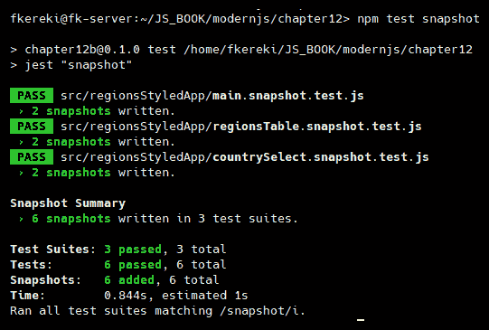
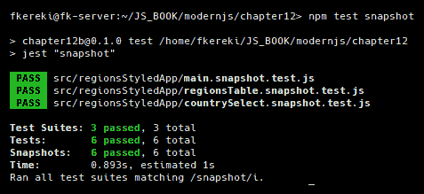
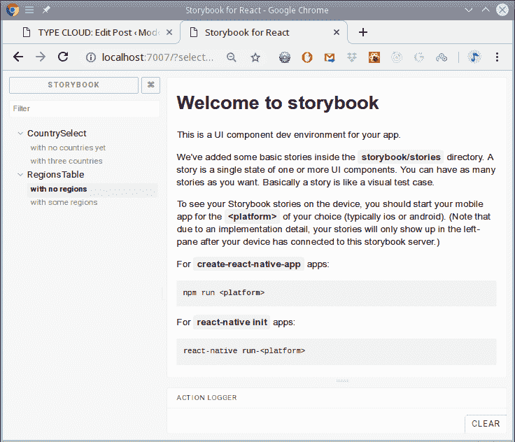
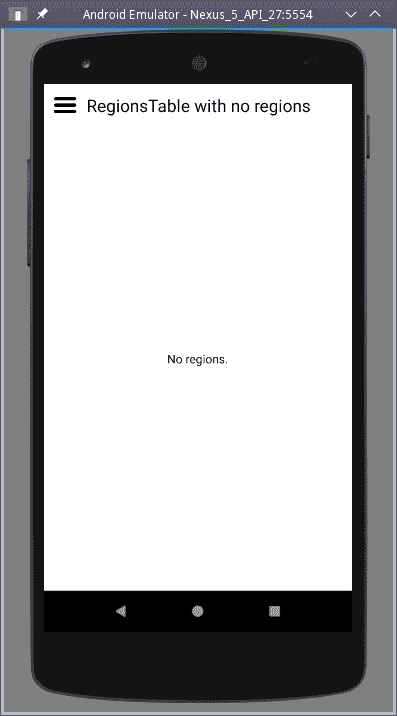
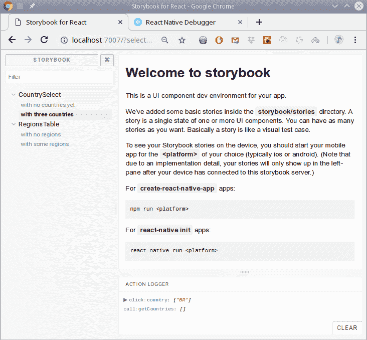
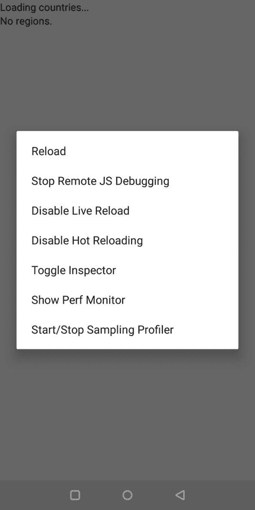
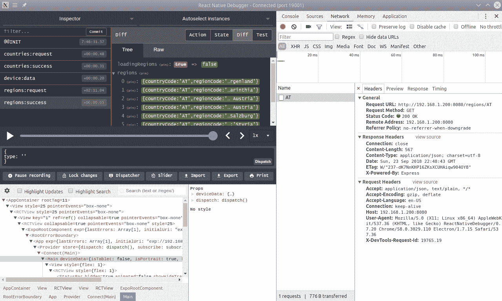
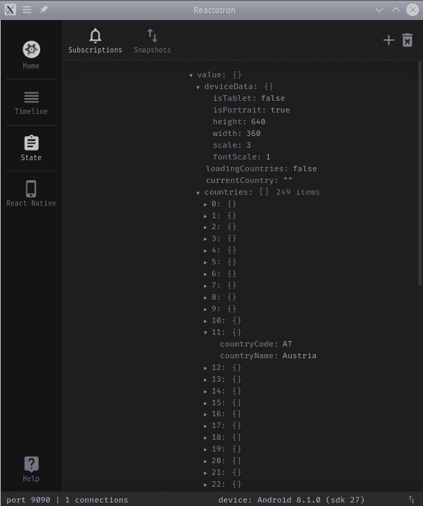
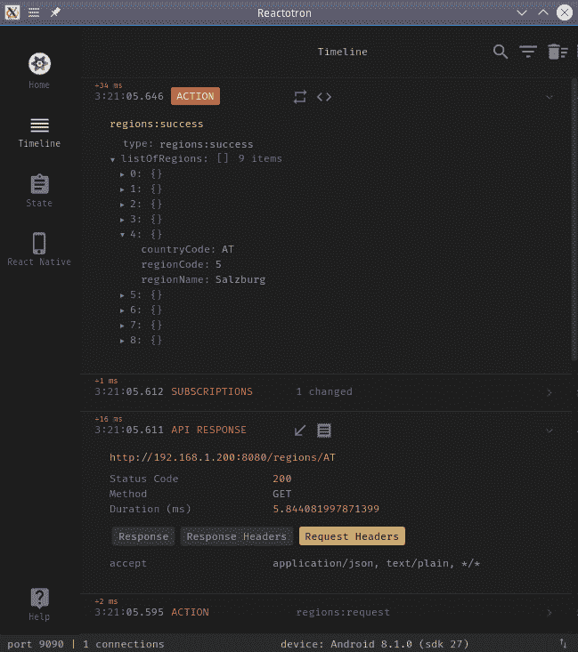

Testing and Debugging Your Mobile App  

# 测试和调试您的移动应用程序

在本章中，我们将研究以下配方：

*   用笑话编写单元测试
*   添加快照测试
*   测量测试覆盖率
*   使用故事书预览组件
*   使用 react 本机调试器调试应用程序
*   使用 Reactotron 以另一种方式进行调试

# 介绍

在上一章中，我们了解了如何开发`React Native`（RN）移动应用程序，按照我们对`Node`和`React`所做的相同路线，下面让我们通过测试和调试我们的应用程序来完成移动应用程序的开发过程。

# 用笑话编写单元测试

为 RN 进行单元测试不会太令人惊讶，因为我们能够重用我们以前学到的大部分内容（例如，将`Jest`与快照一起使用，或者如何测试`Redux`），除了一些必须注意的小细节，我们将看到。

在这个配方中，我们将按照我们已经为`Node`和`React`所做的步骤，看看如何为 RN 设置单元测试。

# 准备

无论您是使用 CRAN（正如我们所做的）还是`react-native init`创建移动应用程序，对`Jest`的支持都已初露端倪；否则，您必须自己安装它，正如我们在[第 5 章](05.html)的*单元测试您的代码*部分所看到的，*测试和调试您的服务器*。根据您创建项目的方式，`package.json`中的`Jest`配置有所不同；我们不需要做任何事情，但请参见[https://jestjs.io/docs/en/tutorial-react-native.html#setup](https://jestjs.io/docs/en/tutorial-react-native.html#setup) 作为替代方案。我们将不得不添加一些以前使用过的软件包，但仅此而已：

```js
npm install enzyme enzyme-adapter-react-16 react-test-renderer redux-mock-store --save
```

完成此操作后，我们可以像以前一样编写测试。让我们看一个例子。

# 怎么做。。。

在本书的前面，我们为国家和地区应用程序编写了一些测试，既然我们已经在 RN 中重写了这些测试，为什么不也重写这些测试呢？这将允许我们验证为 RN 编写单元测试与为普通`React`编写单元测试没有多大区别。我们已经为`<RegionsTable>`组件编写了测试；让我们在这里检查一下：

```js
// Source file: src/regionsStyledApp/regionsTable.test.js

/* @flow */

import React from "react";
import Enzyme from "enzyme";
import Adapter from "enzyme-adapter-react-16";

import { RegionsTable } from "./regionsTable.component";

Enzyme.configure({ adapter: new Adapter() });

const fakeDeviceData = {
 isTablet: false,
 isPortrait: true,
 height: 1000,
 width: 720,
 scale: 1,
 fontScale: 1
};

describe("RegionsTable", () => {
    it("renders correctly an empty list", () => {
 const wrapper = Enzyme.shallow(
 <RegionsTable deviceData={fakeDeviceData} list={[]} />
 );
 expect(wrapper.contains("No regions."));
    });

    it("renders correctly a list", () => {
 const wrapper = Enzyme.shallow(
            <RegionsTable
 deviceData={fakeDeviceData}
                list={[
                    {
                        countryCode: "UY",
                        regionCode: "10",
                        regionName: "Montevideo"
                    },
                    {
                        countryCode: "UY",
                        regionCode: "9",
                        regionName: "Maldonado"
                    },
                    {
                        countryCode: "UY",
                        regionCode: "5",
                        regionName: "Cerro Largo"
                    }
                ]}
            />
        );

 expect(wrapper.contains("Montevideo"));
 expect(wrapper.contains("Maldonado"));
 expect(wrapper.contains("Cerro Largo"));
    });
});
```

差别其实很小，而且大部分代码是相同的：

*   我们必须添加`fakeDeviceData`，但这只是因为我们的 RN 组件需要它
*   我们将`Enzyme.render()`改为`Enzyme.shallow()`
*   我们改变了使用`wrapper`对象直接检查包含文本的方式，使用``wrapper.contains()``

For a complete (and long!) list of all the available wrapper methods, check out [https://github.com/airbnb/enzyme/blob/master/docs/api/shallow.md](https://github.com/airbnb/enzyme/blob/master/docs/api/shallow.md).

我们还可以看看`<CountrySelect>`测试，它涉及模拟事件。我们可以跳过与`React`版本几乎相同的测试；让我们关注我们最初测试的最后一项：

```js
// Source file: src/regionsStyledApp/countrySelect.test.js

/* @flow */
import React from "react";
import Enzyme from "enzyme";
import Adapter from "enzyme-adapter-react-16";

import { CountrySelect } from "./countrySelect.component";

Enzyme.configure({ adapter: new Adapter() });

const threeCountries = [
    {
        countryCode: "UY",
        countryName: "Uruguay"
    },
    {
        countryCode: "AR",
        countryName: "Argentina"
    },
    {
        countryCode: "BR",
        countryName: "Brazil"
    }
];

const fakeDeviceData = {
    isTablet: false,
    isPortrait: true,
    height: 1000,
    width: 720,
    scale: 1,
    fontScale: 1
}

describe("CountrySelect", () => {
    // 
    // *some tests omitted*
    //

    it("correctly calls onSelect", () => {
        const mockGetCountries = jest.fn();
        const mockOnSelect = jest.fn();

        const wrapper = Enzyme.shallow(
            <CountrySelect
                deviceData={fakeDeviceData}
                loading={false}
                currentCountry={""}
                onSelect={mockOnSelect}
                getCountries={mockGetCountries}
                list={threeCountries}
            />
        );

 wrapper.find("Picker").simulate("ValueChange", "UY");

 expect(mockGetCountries).not.toHaveBeenCalled();
 expect(mockOnSelect).toHaveBeenCalledTimes(1);
 expect(mockOnSelect).toHaveBeenCalledWith("UY");
    });
});
```

我们编写`React`和【RN】测试的关键区别在于我们`.find()`单击元素的方式（RN 使用`Picker`组件，而不是一组`option`元素），以及我们模拟的事件（`"ValueChange"`而不是`"change"`）。不过，除此之外，代码与前面的代码相同。

For native modules, you may have to use mocks in order to simulate the expected behaviors. We haven't used such modules in our code, but should you require any of them, use the same mocking styles we saw in [Chapter 5](05.html), *Testing and Debugging Your Server*, and for `React` itself in [Chapter 10](10.html), *Testing Your Application*.

在讨论了 RN 组件测试中的一些差异之后，我们就完成了，因为在测试操作或简化程序时，代码中没有差异。它们使用相同风格的功能单元测试，不涉及任何特定的 RN 特性，因此我们没有更多的话要说。在下一节中，我们将查看我们的测试运行

# 它是如何工作的。。。

如前所述，只需一个命令即可运行测试：

```js
npm test
```

输出如以下屏幕截图所示。注意，我们还运行了从`React`章节复制的一些测试，没有任何更改，它们也表现得非常完美：


All our components' tests run OK

因此，除了需要使用浅层渲染，以及我们访问元素或模拟事件的方式可能会发生一些变化之外，RN 的编码单元测试与`React`的编码单元测试几乎相同，这是一个好消息。然而，我们忘记了一些事情——快照测试呢？让我们继续讨论这个问题。

# 添加快照测试

使用 RN 进行快照测试是一个惊喜，因为您不必改变以前的工作方式。让我们看几个例子，你会被说服的。

# 怎么做。。。

我们已经在[第 10 章](10.html)*测试您的应用程序*的*测试与快照*部分中看到了快照测试。碰巧，相同的代码将完全适用于 RN 应用程序，而不要求任何特定的更改，除了那些取决于代码中的变化。我们之前开发的`<RegionsTable>`组件在 RN 中有一个额外的道具：`deviceData`。因此，我们可以复制原始快照测试代码，只需添加新的道具，如下所示：

```js
// Source file: src/regionsStyledApp/regionsTable.snapshot.test.js

/* @flow */

import React from "react";
import TestRenderer from "react-test-renderer";

import { RegionsTable } from "./regionsTable.component";

const fakeDeviceData = {
 isTablet: false,
 isPortrait: true,
 height: 1000,
 width: 720,
 scale: 1,
 fontScale: 1
};

describe("RegionsTable", () => {
    it("renders correctly an empty list", () => {
        const tree = TestRenderer.create(
            <RegionsTable deviceData={fakeDeviceData} list={[]} />
        ).toJSON();
        expect(tree).toMatchSnapshot();
    });

    it("renders correctly a list", () => {
        const tree = TestRenderer.create(
            <RegionsTable
                deviceData={fakeDeviceData}
                list={[
                    {
                        countryCode: "UY",
                        regionCode: "10",
                        regionName: "Montevideo"
                    },
                    {
                        countryCode: "UY",
                        regionCode: "9",
                        regionName: "Maldonado"
                    },
                    {
                        countryCode: "UY",
                        regionCode: "5",
                        regionName: "Cerro Largo"
                    }
                ]}
            />
        ).toJSON();
        expect(tree).toMatchSnapshot();
    });
});
```

如果您费心比较版本，您将看到唯一更改的部分是我用粗体文本突出显示的部分，它们与不同的组件有关，而不是与任何特定于 RN 的内容有关。如果您为`<CountrySelect>`组件编写快照测试，您会发现完全相同的结果：唯一必要的更改与它的新道具（`deviceData`、`currentCountry`）有关，但不会带来其他困难。

为了增加多样性，让我们在`<Main>`组件中添加快照测试。这里有两个有趣的细节：

*   由于我们的组件在纵向或横向模式下呈现出不同的效果，我们应该进行两个测试；和
*   由于组件包括连接的组件，我们不能忘记添加一个`<Provider>`组件，以免无法进行连接。

守则如下：；特别要注意变化的设备数据和`<Provider>`包含：

```js
// Source file: src/regionsStyledApp/main.snapshot.test.js

/* @flow */

import React from "react";
import { Provider } from "react-redux";
import TestRenderer from "react-test-renderer";

import { Main } from "./main.component";
import { store } from "./store";

const fakeDeviceData = {
    isTablet: false,
    isPortrait: true,
    height: 1000,
    width: 720,
    scale: 1,
    fontScale: 1
};

describe("Main component", () => {
    it("renders in portrait mode", () => {
        const tree = TestRenderer.create(
 <Provider store={store}>
                <Main
                    deviceData={{ ...fakeDeviceData, isPortrait: true }}
                />
 </Provider>
        ).toJSON();
        expect(tree).toMatchSnapshot();
    });

    it("renders in landscape mode", () => {
        const tree = TestRenderer.create(
 <Provider store={store}>
                <Main
                    deviceData={{ ...fakeDeviceData, isPortrait: false }}
                />
 </Provider>
        ).toJSON();
        expect(tree).toMatchSnapshot();
    });
});
```

# 它是如何工作的。。。

由于我们所有快照测试的文件名都以`.snapshot.js`结尾，因此我们可以用一个命令运行所有快照测试：

```js
npm test snapshot
```

第一次运行测试时（如前所述），将创建快照：



As with React, the first run will create snapshots for components

如果我们检查`__snapshots__`目录，我们会在其中找到三个生成的`.snap`文件。它们的格式与我们之前开发的`React`示例相同。我们来看看前面展示的`<RegionsTable>`一款：

```js
// Jest Snapshot v1, https://goo.gl/fbAQLP

exports[`RegionsTable renders correctly a list 1`] = `
<RCTScrollView
  style={
    Array [
      undefined,
      Object {
        "backgroundColor": "lightgray",
      },
    ]
  }
>
  <View>
    <View>
      <Text
        accessible={true}
        allowFontScaling={true}
        ellipsizeMode="tail"
      >
        Cerro Largo
      </Text>
    </View>
    <View>
      <Text
        accessible={true}
        allowFontScaling={true}
        ellipsizeMode="tail"
      >
        Maldonado
      </Text>
    </View>
    <View>
      <Text
        accessible={true}
        allowFontScaling={true}
        ellipsizeMode="tail"
      >
        Montevideo
      </Text>
    </View>
  </View>
</RCTScrollView>
`;

exports[`RegionsTable renders correctly an empty list 1`] = `
<View
  style={undefined}
>
  <Text
    accessible={true}
    allowFontScaling={true}
    ellipsizeMode="tail"
  >
    No regions.
  </Text>
</View>
`;
```

如果以后再次运行测试，但未更改任何内容，则结果将显示三条通过绿色消息：



Our snapshot tests were all successful

一切正常，因此我们可以断言，编写快照测试不会给 RN 测试增加任何复杂因素，并且可以毫无困难地执行。

# 测量测试覆盖率

正如我们在`Node`和`React`中所做的一样，回到[第 5 章](05.html)、*测试和调试您的服务器*、以及[第 10 章](10.html)、*测试您的应用程序*中，我们希望对我们的测试覆盖率进行衡量，看看我们有多彻底，并且能够检测需要更多工作的代码片段。幸运的是，我们将能够使用与以前相同的工具进行管理，因此这个方法将很容易实现。

# 怎么做。。。

正如我们所看到的，CRAN 为应用程序所做的设置包括`Jest`，并且`Jest`为我们提供了所需的覆盖选项。首先，我们必须添加一个简单的脚本，用几个额外的参数运行我们的测试套件：

```js
"scripts": {
    .
    .
    .
    "test": "jest",
 "coverage": "jest --coverage --no-cache",
},
```

就这样，我们没有别的事可做；让我们看看它的工作！

# 它是如何工作的。。。

运行测试很简单；我们只需要使用新脚本：

```js
npm run coverage
```

所有套件的运行方式与本章前几节相同，但最后将生成一个文本摘要。如前所述，将使用颜色：绿色表示覆盖良好（就测试而言）的源文件，黄色表示中等覆盖率，红色表示覆盖率低或无覆盖率：


Running Jest with the coverage option enabled produces the same type of result we saw for Node and React

我们还可以检查 HTML 生成的文件，可以在`/coverage/lcov-report`中找到。在那里打开`index.html`文件，您将获得报告的交互式版本，如以下屏幕截图所示：


The produced HTML report is interactive, and lets you see what you missed in your tests

例如，如果您想知道为什么`deviceHandler.component.js`文件的值如此低（更不用说您没有为它编写测试；如果可能，应该涵盖所有代码），您可以单击它并查看原因。在我们的例子中，`onLayoutHandler`代码（逻辑上）从未被调用，因此降低了文件的覆盖率：


Clicking on a file shows what lines were executed and which ones (red background) were missed To see some ways to disable reporting lines that aren't covered, or for cases you don't want to consider, look at [https://github.com/gotwarlost/istanbul/blob/master/ignoring-code-for-coverage.md](https://github.com/gotwarlost/istanbul/blob/master/ignoring-code-for-coverage.md).

# 使用故事书预览组件

`Storybook`，[第 6 章](06.html)的*用故事书*节中的`React`工具*用 React*开发组件，也可以用来帮助开发组件，所以在这个配方中，让我们看看如何使用它来简化我们的工作。

# 准备

安装`Storybook`很简单，和我们以前做的类似；`react-native-storybook-loader`软件包将允许我们将`*.story.js`文件放在任何我们想要的地方，并找到它们。第二个命令需要一段时间，安装许多软件包；小心！此外，将在目录的根目录处创建一个`storybook`目录。使用以下命令安装`Storybook`：

```js
npm install @storybook/cli react-native-storybook-loader --save-dev
npx storybook init
```

The `storybook/Stories` directory can be safely deleted, as we'll place our stories elsewhere, along with the components being demonstrated, as we did earlier in this book.

在使用 CRNA 创建的 RN 应用程序中运行`Storybook`需要额外的步骤：提供适当的`App.js`文件。实现这一点的最简单方法是使用一行文件：

```js
export default from './storybook';
```

然而，这是一个问题，你将如何运行你的应用程序？当然，您可以拥有两个不同的`App.storybook.js`和`App.standard.js`文件，并将其中一个文件复制到`App.js`，但如果手动执行，这将很快变得枯燥乏味。当然，你可以使用一些`npm`脚本。通过使用`cp`命令复制文件，以下操作适用于 Linux 或 macOS 机器，但需要对 Windows 设备进行一些小的更改：

```js
"scripts": {
 "start": "cp App.standard.js App.js && react-native-scripts start",
    .
    .
    .
 "storybook": "cp App.storybook.js App.js && rnstl && storybook start -p 7007"
},
```

我们还需要为`package.json`中的加载程序添加一些配置。下面让加载程序在`./src`目录中查找`*.story.js`文件，并用找到的故事生成一个`storyLoader.js`文件：

```js
"config": {
    "react-native-storybook-loader": {
        "searchDir": [
            "./src"
        ],
        "pattern": "**/*.story.js",
        "outputFile": "./storybook/storyLoader.js"
    }
},
```

最后，我们必须修改`storybook/index.js`，如下所示：

```js
import { getStorybookUI, configure } from "@storybook/react-native";

import { loadStories } from "./storyLoader";

configure(loadStories, module);
const StorybookUI = getStorybookUI({ port: 7007, onDeviceUI: true });

export default StorybookUI;
```

我们现在准备好了；让我们写些故事吧！

Check [https://github.com/storybooks/storybook/tree/master/app/react-native](https://github.com/storybooks/storybook/tree/master/app/react-native) for more documentation on `Storybook` for RN, and [https://github.com/elderfo/react-native-storybook-loader](https://github.com/elderfo/react-native-storybook-loader) for details on the loader we are using.

# 怎么做。。。

让我们写一些故事。我们可以从`<RegionsTable>`组件开始，它非常简单：它不包含任何动作，只显示数据。我们可以编写两种情况：当提供一个空的区域列表时，以及当提供一个非空的区域列表时。我们不必过多考虑所需的虚假数据，因为我们可以重用为单元测试编写的内容！考虑下面的代码：

```js
// Source file: src/regionsStyledApp/regionsTable.story.js

/* @flow */

import React from "react";
import { storiesOf } from "@storybook/react-native";

import { Centered } from "../../storybook/centered";
import { RegionsTable } from "./regionsTable.component";

const fakeDeviceData = {
    isTablet: false,
    isPortrait: true,
    height: 1000,
    width: 720,
    scale: 1,
    fontScale: 1
};

storiesOf("RegionsTable", module)
    .addDecorator(getStory => <Centered>{getStory()}</Centered>)
    .add("with no regions", () => (
        <RegionsTable deviceData={fakeDeviceData} list={[]} />
    ))
    .add("with some regions", () => (
        <RegionsTable
            deviceData={fakeDeviceData}
            list={[
                {
                    countryCode: "UY",
                    regionCode: "10",
                    regionName: "Montevideo"
                },
                {
                    countryCode: "UY",
                    regionCode: "9",
                    regionName: "Maldonado"
                },
                {
                    countryCode: "UY",
                    regionCode: "5",
                    regionName: "Cerro Largo"
                }
            ]}
        />
    ));
```

添加一个装饰器以使显示的组件居中只是为了清晰：必要的`<Centered>`代码很简单，需要一些我们在上一章中看到的样式：

```js
// Source file: storybook/centered.js

/* @flow */

import React from "react";
import { View, StyleSheet } from "react-native";
import PropTypes from "prop-types";

const centerColor = "white";
const styles = StyleSheet.create({
 centered: {
 flex: 1,
 backgroundColor: centerColor,
 alignItems: "center",
 justifyContent: "center"
 }
});

export class Centered extends React.Component<{ children: node }> {
    static propTypes = {
        children: PropTypes.node.isRequired
    };

    render() {
        return <View style={styles.centered}>{this.props.children}</View>;
    }
}
```

现在，为`<CountrySelect>`建立故事更有趣，因为我们有行动。我们将为组件提供两个选项：一个是当用户点击它来选择一个国家时，另一个是用于组件用来获取国家列表的`getCountries()`回调：

```js
// Source file: src/regionsStyledApp/countrySelect.story.js

/* @flow */

import React from "react";
import { storiesOf } from "@storybook/react-native";
import { action } from "@storybook/addon-actions";

import { Centered } from "../../storybook/centered";
import { CountrySelect } from "./countrySelect.component";

const fakeDeviceData = {
    isTablet: false,
    isPortrait: true,
    height: 1000,
    width: 720,
    scale: 1,
    fontScale: 1
};

storiesOf("CountrySelect", module)
    .addDecorator(getStory => <Centered>{getStory()}</Centered>)
    .add("with no countries yet", () => (
        <CountrySelect
            deviceData={fakeDeviceData}
            loading={true}
            currentCountry={""}
            onSelect={action("click:country")}
            getCountries={action("call:getCountries")}
            list={[]}
        />
    ))
    .add("with three countries", () => (
        <CountrySelect
            deviceData={fakeDeviceData}
            currentCountry={""}
            loading={false}
            onSelect={action("click:country")}
            getCountries={action("call:getCountries")}
            list={[
                {
                    countryCode: "UY",
                    countryName: "Uruguay"
                },
                {
                    countryCode: "AR",
                    countryName: "Argentina"
                },
                {
                    countryCode: "BR",
                    countryName: "Brazil"
                }
            ]}
        />
    ));
```

我们都准备好了；让我们看看这是怎么回事。

# 它是如何工作的。。。

要查看`Storybook`应用程序，我们需要使用上一节编辑的脚本。首先运行`storybook`脚本（最好在单独的控制台中运行），然后运行应用程序本身，如下所示：

```js
// *at one terminal*
npm run storybook

// *and at another terminal*
npm start
```

第一个命令生成一点输出，允许我们确认脚本是否正常工作，以及是否找到了所有的故事。为清晰起见，对以下代码进行了轻微编辑：

```js
> npm run storybook

> chapter12b@0.1.0 storybook /home/fkereki/JS_BOOK/modernjs/chapter12
> cp App.storybook.js App.js && rnstl && storybook start -p 7007

Generating Dynamic Storybook File List

Output file: /home/fkereki/JS_BOOK/modernjs/chapter12/storybook/storyLoader.js
Patterns: ["/home/fkereki/JS_BOOK/modernjs/chapter12/src/**/*.story.js"]
Located 2 files matching pattern '/home/fkereki/JS_BOOK/modernjs/chapter12/src/**/*.story.js' 
Compiled story loader for 2 files:
 /home/fkereki/JS_BOOK/modernjs/chapter12/src/regionsStyledApp/countrySelect.story.js
 /home/fkereki/JS_BOOK/modernjs/chapter12/src/regionsStyledApp/regionsTable.story.js
=> Loading custom .babelrc from project directory.
=> Loading custom addons config.
=> Using default webpack setup based on "Create React App".
Scanning 1424 folders for symlinks in /home/fkereki/JS_BOOK/modernjs/chapter12/node_modules (18ms)

RN Storybook started on => http://localhost:7007/

Scanning folders for symlinks in /home/fkereki/JS_BOOK/modernjs/chapter12/node_modules (27ms)

+----------------------------------------------------------------------+
|                                                                      |
| Running Metro Bundler on port 8081\.                                  |
|                                                                      |
| Keep Metro running while developing on any JS projects. Feel free to |
| close this tab and run your own Metro instance if you prefer.        |
|                                                                      |
| https://github.com/facebook/react-native                             |
|                                                                      |
+----------------------------------------------------------------------+

Looking for JS files in
 /home/fkereki/JS_BOOK/modernjs/chapter12/storybook
 /home/fkereki/JS_BOOK/modernjs/chapter12
 /home/fkereki/JS_BOOK/modernjs/chapter12 

Metro Bundler ready.

webpack built bab22529b80fbd1ce576 in 2918ms
Loading dependency graph, done.
```

我们可以打开浏览器，获得与 web 应用程序和`React`非常相似的视图：



You can select stories in the sidebar, and the app will show them

如果您在菜单中选择一个故事，应用程序将显示它，如下所示：



The app shows the story you picked in the browser

您还可以通过按下前一屏幕截图左上角的汉堡包菜单来选择要在应用程序中显示的故事。生成的选择菜单如下所示：


The app also lets you select what story to show

最后，您可以在浏览器中查看操作。让我们想象一下，您打开了三个国家的国家列表：


The country selector lets you interact with actions

如果单击巴西，浏览器将显示已触发的操作。首先，我们可以在调用`getCountries()`回调时看到 call:getCountries，然后单击选项时单击：country：



As with web apps, you can interact with stories and see what actions were called with which parameters

因此，我们已经看到，添加故事实际上与 web 相同，您可以获得一个额外的工具来帮助开发，您应该考虑到这一点

# 使用 react 本机调试器调试应用程序

调试 RN 应用程序比使用 web 应用程序更难，因为你想做的一切都是远程完成的；您不能仅在移动设备中运行功能完全的调试器。有几个工具可以帮助您解决这个问题，在这一节中，我们将考虑一个“catch all”工具，包括一个功能强大的三重工具，其中大多数（如果不是全部）的需求都应该被满足。

彻底调试所需的基本工具（我们之前已经见过）如下：

*   Chrome 开发者工具，位于[https://developers.google.com/web/tools/chrome-devtools/](https://developers.google.com/web/tools/chrome-devtools/) ，用于访问控制台等
*   `React devtools`（独立版本）位于[https://github.com/facebook/react-devtools](https://github.com/facebook/react-devtools) ，用于处理部件
*   `Redux DevTools`分机，位于[https://github.com/zalmoxisus/redux-devtools-extension](https://github.com/zalmoxisus/redux-devtools-extension) ，用于检查动作和状态

当然，您可以分别安装它们中的每一个，并与 trio 一起工作，但将它们全部安装在一起无疑更简单，因此我们将遵循这一思路。那么，让我们继续调试这个配方中的代码吧！

You can read about the basics of RN debugging at [http://facebook.github.io/react-native/docs/debugging](http://facebook.github.io/react-native/docs/debugging), and study `react-native-debugger` at [https://github.com/jhen0409/react-native-debugger](https://github.com/jhen0409/react-native-debugger).

# 开始

为了让一切正常工作，我们必须安装几个软件包。首先，从[的发布页面获取`react-native-debugger`可执行文件 https://github.com/jhen0409/react-native-debugger/releases](https://github.com/jhen0409/react-native-debugger/releases) 。安装只需解压缩下载的文件；执行只需要在解压缩目录中运行可执行文件。

我们需要几个软件包才能将我们的应用程序与`react-native-debugger`连接起来。我们的应用程序可以在模拟器上运行，也可以在实际设备上运行。让我们使用以下命令安装这些组件：

```js
npm install react-devtools remote-redux-devtools --save-dev
```

我们现在拥有我们需要的一切。让我们看一下将这些工具（主要是 Redux 调试器）与我们的应用程序集成的一些细节，然后我们就可以开始调试了。

# 怎么做。。。

让我们看看如何设置我们的应用程序，以便使用调试工具。首先，我们需要对商店创建代码进行简单更改，添加几行代码，如下所示：

```js
// Source file: src/regionsStyledApp/store.js

/* @flow */

import { createStore, applyMiddleware } from "redux";
import thunk from "redux-thunk";
import { composeWithDevTools } from "redux-devtools-extension";

import { reducer } from "./world.reducer";

export const store = createStore(
    reducer,
 composeWithDevTools(applyMiddleware(thunk))
);
```

只是为了让我们能够真正得到一些调试消息，我在整个代码中添加了各种各样的`console.log()`和`console.error()`调用。为了一致性，我想使用`debug`（来自[）https://www.npmjs.com/package/debug](https://www.npmjs.com/package/debug) ），正如我们在本书前面所做的，但它不起作用，因为它需要`LocalStorage`，而在 RN 中，您可以使用不同的 API 获得`AsyncStorage`。作为一个示例，我们将查看来自`world.actions.js`的一些日志输出。我没有费心记录成功 API 调用的输出，因为我们将通过`react-native-debugger`实现这一点，我们将看到：

```js
// Source file: src/regionsStyledApp/world.actions.js

.
.
.

export const getCountries = () => async dispatch => {
 console.log("getCountries: called");
    try {
        dispatch(countriesRequest());
        const result = await getCountriesAPI();
        dispatch(countriesSuccess(result.data));
    } catch (e) {
 console.error("getCountries: failure!");
        dispatch(countriesFailure());
    }
};

export const getRegions = (country: string) => async dispatch => {
 console.log("getRegions: called with ", country);
    if (country) {
        try {
            dispatch(regionsRequest(country));
            const result = await getRegionsAPI(country);
            dispatch(regionsSuccess(result.data));
        } catch (e) {
 console.error("getRegions: failure with API!");
            dispatch(regionsFailure());
        }
    } else {
 console.error("getRegions: failure, no country!");
        dispatch(regionsFailure());
    }
};
```

我们一切就绪；让我们试试看。

# 它是如何工作的。。。

首先，使用以下命令运行应用程序：

```js
npm start
```

在您的设备上（无论是真实的还是仿真的），通过摇动（在实际设备上）或在 macOS 上使用+*m*命令或在 Windows 或 Linux 上使用*Ctrl*+*m*命令来访问开发者菜单。至少，您希望启用远程 JS 调试：



Using the device's developer menu to enable remote JS debugging

现在，点击下载的可执行文件打开`react-native-debugger`应用程序。如果什么也没有发生，即使在重新加载应用程序之后，那么问题肯定是由于设置了不同的端口：在菜单中，选择 Debugger，然后选择 New Window，然后选择 port 19001，一切都应该正常。当你启动应用程序时，它应该看起来像下面的屏幕截图。请注意屏幕右侧的所有日志、左上角的第一个`Redux`操作和左下角的 React 工具（如果您不喜欢其中一些工具，请右键单击屏幕以隐藏这三个工具中的任何一个）：


Upon successful connection, you'll see the three tools in react-native-debugger running at once

如果您选中网络选项卡，您将看到来自应用程序的 API 调用在默认情况下不会出现。有一个简单的解决方法：右键单击`react-native-debugger`，选择启用网络检查，然后右键单击 Chrome 开发者工具并选择 Log XMLHttpRequests，所有调用都将出现：



API calls are not displayed by default, but can be enabled by right-clicking on the react-native-debugger screen

您也可以查看`AsyncStorage`——请参见下面的屏幕截图。我选择了隐藏`React`和`Redux DevTools`，正如我前面提到的，只是为了清楚起见。由于我们的应用程序实际上没有使用`AsyncStorage`，所以我做了一点修改：注意，你可以在任何模块上使用`require()`功能，然后直接使用它：


Examining AsyncStorage with the RN debugger

我们还能说什么？实际上不多，因为这些工具基本上与我们在 web 上使用`React`时看到的相同。这里有趣的细节是，您可以将所有窗口都放在一起，而不必处理许多单独的窗口。让我们考虑一个您可能更喜欢的替代工具来完成本章。

# 使用 Reactotron 以另一种方式进行调试

虽然`react-native-debugger`有可能满足您的大多数需求，但还有另一个软件包，在与许多功能同时出现的同时，还添加了一些新功能，或者至少对旧功能进行了修改：Reactotron。这个工具也可以与普通的`React`一起使用，但我选择在这里用 RN 来显示它，因为您更可能需要它。毕竟，`React`web 工具使用起来很简单，没有任何不必要的复杂性，而正如我们所看到的，RN 调试更具挑战性。据说 Reactotron 比`react-native-debugger`更高效，但我不会证明这一点：请查看，并注意**您的里程可能会有所不同**（**YMMV**。让我们用一个配方来完成这一章，以演示这种调试的替代方法。

# 准备

我们需要一对软件包：基本的 Reactotron one，以及帮助 Redux 的`reactotron-redux`。使用以下命令安装它们：

```js
npm install reactotron-react-native reactotron-redux --save-dev
```

Reactotron can work with `redux-sagas` instead of `redux-thunk`, and even with MobX, instead of Redux. Read more about this at [https://github.com/infinitered/reactotron](https://github.com/infinitered/reactotron).

您还需要连接到应用程序的本机可执行工具。请转到[的发布页面 https://github.com/infinitered/reactotron/releases](https://github.com/infinitered/reactotron/releases) 并获得与您的环境相匹配的软件包：在我的特殊情况下，我刚刚下载并解压缩了`Reactotron-linux-x64.zip`文件。对于 macOS 用户，还有另一种可能性：查看[https://github.com/infinitered/reactotron/blob/master/docs/installing.md](https://github.com/infinitered/reactotron/blob/master/docs/installing.md) 。

安装完所有这些之后，我们准备好准备我们的应用程序；现在就开始吧！

# 怎么做。。。

事实上，您可以同时使用 Reactotron 和`react-native-debugger`，但为了避免混淆，让我们有一个单独的`App.reactotron.js`文件和一些其他更改。我们必须遵循几个简单的步骤。首先，让我们先在`package.json`中添加一个新脚本，以便能够使用 Reactotron 运行我们的应用程序：

```js
    "scripts": {
        "start": "cp App.standard.js App.js && react-native-scripts start",
 "start-reactotron": "cp App.reactotron.js App.js && react-native-scripts start",
        .
        .
        .
```

其次，让我们配置连接和插件。我们将创建一个`reactotronConfig.js`文件来建立与`Reactotron`的连接：

```js
// Source file: reactotronConfig.js

/* @flow */

import Reactotron from "reactotron-react-native";
import { reactotronRedux } from "reactotron-redux";

const reactotron = Reactotron.configure({
    port: 9090,
    host: "192.168.1.200"
})
    .useReactNative({
        networking: {
            ignoreUrls: /\/logs$/
        }
    })
    .use(
        reactotronRedux({
            isActionImportant: action => action.type.includes("success")
        })
    )
    .connect();

Reactotron.log("A knick-knack is a thing that sits on top of a whatnot");
Reactotron.warn("If you must make a noise, make it quietly");
Reactotron.error("Another nice mess you've gotten me into.");

export default reactotron;
```

以下是有关上一个代码段中的一些值和选项的一些详细信息：

*   `192.168.1.200`是我机器的 IP，`9090`是建议使用的端口。
*   网络的`ignoreUrls`选项摆脱了世博会的一些呼叫，但不是我们自己的代码，使会话更加清晰
*   `isActionImportant`功能可以让您突出显示一些动作，以便它们更引人注目。在我们的例子中，我选择了`countries:success`和`regions:success`动作，这两种动作的类型中都包含`"success"`，但当然，您也可以选择任何其他动作。

`Reactotron`还包括日志函数，所以我添加了三个（无用的！）调用，只是为了看看它们在调试中的表现。我不想显示我们添加的所有日志记录，但您可能希望使用以下命令，以便所有日志记录都转到`Reactotron`：

```js
console.log = Reactotron.log;
console.warn = Reactotron.warn;
console.error = Reactotron.error;
```

现在，我们必须调整我们的商店，以便它能与`reactotron-redux`插件一起工作。我选择复制一份名为`store.reactotron.js`的`store.js`，并做了以下必要的修改：

```js
// Source file: src/regionsStyledApp/store.reactotron.js

/* @flow */

import { AsyncStorage } from "react-native";
import { applyMiddleware } from "redux";
import thunk from "redux-thunk";
import reactotron from "../../reactotronConfig";

import { reducer } from "./world.reducer";

export const store = reactotron.createStore(
    reducer,
    applyMiddleware(thunk)
);

// *continues*...
```

为了增加多样性，并且能够看到`Reactotron`如何处理`AsyncStorage`，我添加了一些（完全无用！）行来设置一些项目：

```js
// ...*continued*

(async () => {
    try {
        await AsyncStorage.setItem("First", "Federico");
        await AsyncStorage.setItem("Last", "Kereki");
        await AsyncStorage.setItem("Date", "Sept.22nd");
        await AsyncStorage.getItem("Last");
    } catch (e) {
    }
})();
```

接下来，让我们对`App.js`文件进行一些更改。这些更改很小：只需包括配置文件，并使用我刚刚调整的存储：

```js
// Source file: App.reactotron.js

/* @flow */

import React from "react";
import { Provider } from "react-redux";

import "./reactotronConfig";
 import { store } from "./src/regionsStyledApp/store.reactotron";
import { ConnectedMain } from "./src/regionsStyledApp/main.connected";

export default class App extends React.PureComponent<> {
    render() {
        return (
            <Provider store={store}>
                <ConnectedMain />
            </Provider>
        );
    }
}
```

现在，我们准备好了；让我们看看它的工作！

For full documentation on `Reactotron`, check out the developers' web page at [https://github.com/infinitered/reactotron](https://github.com/infinitered/reactotron). `Reactotron` includes more plugins that can help you when working with `Redux` or `Storybook` to do benchmarking of slow functions, or to log messages, so you may find many things of interest there.

# 它是如何工作的。。。

要使用`Reactotron`，只需启动它（双击即可），您将获得如下屏幕截图所示的初始屏幕。该工具将只等待你的应用程序连接；有时，可能需要多次尝试才能启动初始连接，但在这之后，事情应该进展顺利：


The initial screen for Reactotron shows it waiting for connections

启动应用程序后，您会看到它建立了连接。`Reactotron`显示了一些细节：例如，该设备在 Android 上，运行 8.1.0 版，我们还可以看到该设备的大小和规模。请参见以下屏幕截图：


After a connection is made, you can see the details about the device

当应用程序启动时，我们会看到如下屏幕截图。（注意，电影中的三行内容是谁加的？）【注意，电影中的三行内容是关于动作的】


When our app starts to run, we get all these debugging texts in the Reactotron window

我们还可以看到`Redux`商店的状态，请参见下面的屏幕截图。我考察了`deviceData`和其中一个国家：



You can examine the Redux store to see what was put in it

最后，我在应用程序中选择了奥地利。我们可以检查发出的 API 调用，以及随后发送的操作；请参见以下屏幕截图：



The results of selecting Austria in our app: we can examine the API call and the Redux actions as well. Here, we see the
nine regions of Austria, and the details for the fifth one, Salzburg, of Mozart fame

正如我们所说的，`Reactotron`具有一些不同的功能，并且出于某些目的，它可能比`react-native-debugger`更适合您，因此它值得包含在您的调试器工具库中。