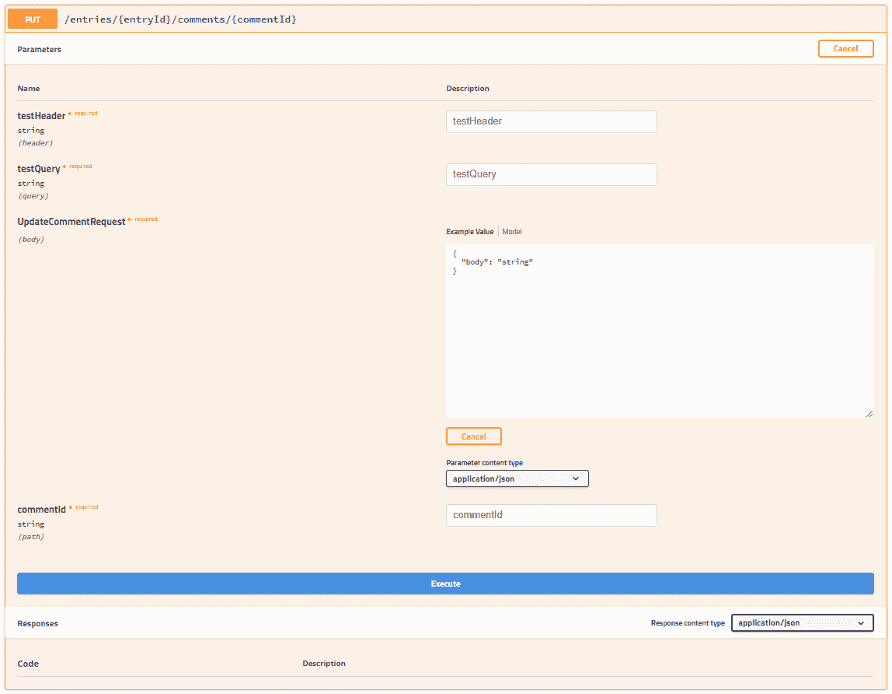
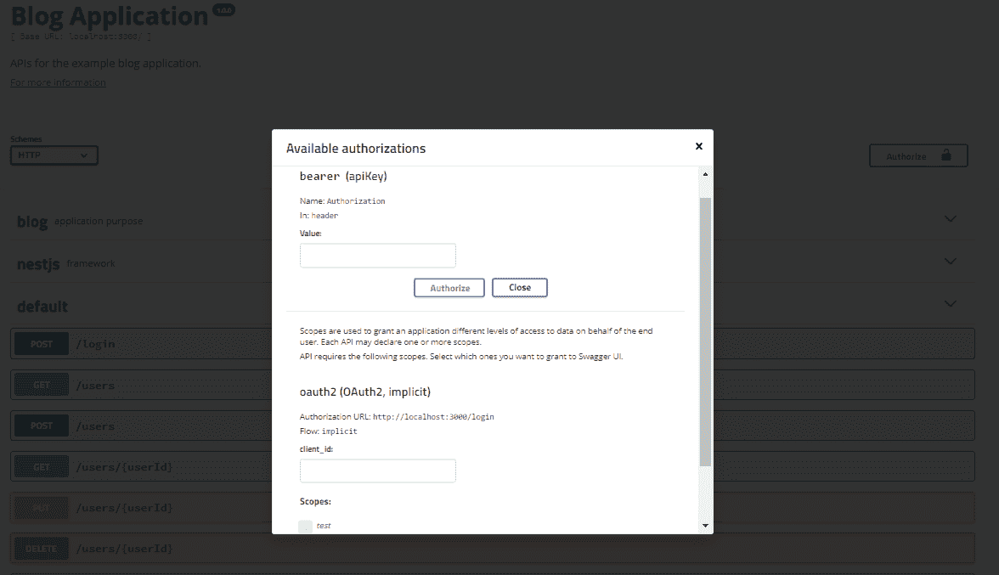
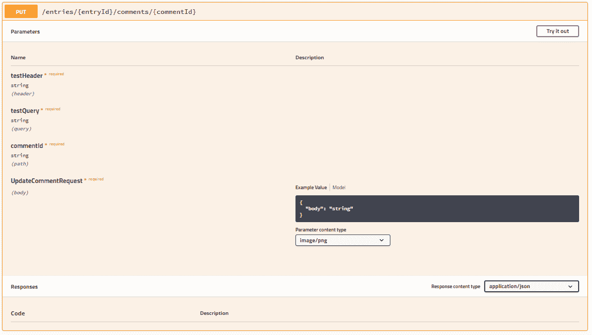
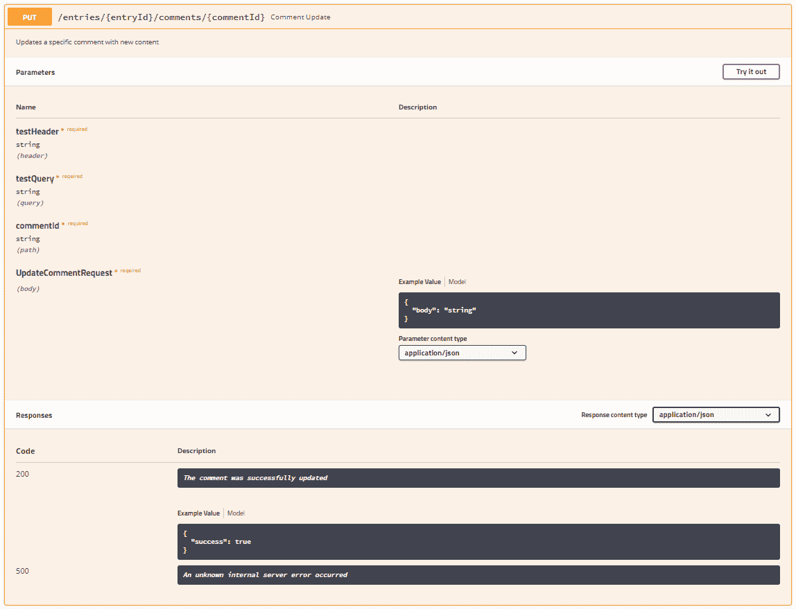

OpenAPI (Swagger) Specification <link rel="stylesheet" type="text/css" href="../Styles/epub.css">

# 第十一章。 OpenAPI(吹牛)规范

OpenAPI 规范最著名的名字是它的前名 Swagger，它是一个 JSON 模式，可用于构造一组 restful api 的 JSON 或 YAML 定义。 OpenAPI 本身是语言无关的，这意味着底层 api 可以用开发人员喜欢的任何工具或框架以任何语言构建。 OpenAPI 文档的唯一关注点是描述 API 端点的输入和输出。 在这方面，OpenAPI 文档充当文档工具，允许开发人员以广泛了解、理解和支持的格式轻松描述其公共 api。

然而，OpenAPI 文档不仅限于文档。 已经开发了许多工具，它们能够使用 OpenAPI 文档自动生成客户端项目、服务器存根、用于可视化检查 OpenAPI 文档的 API 浏览器 UI，甚至服务器生成器。 开发人员可以在[https://swagger.io](https://swagger.io)上找到 Swagger Editor、Codegen 和 UI 等工具。

虽然存在一些生成 OpenAPI 文档的工具，但许多开发人员将这些文档作为单独的 JSON 或 YAML 文件进行维护。 他们可以使用 OpenAPI 参考机制将文档分成更小的部分。 在 Nest.js 中，开发人员可以使用一个单独的模块来为他们的应用程序生成 OpenAPI 文档。 与手工编写 OpenAPI 文档不同，Nest.js 会使用你在控制器中提供的装饰器来生成尽可能多的关于项目中 api 的信息。 当然，它不会把盒子里的所有东西都拿出来。 为此，Nest.js swagger 模块提供了额外的装饰器，你可以用它们来填补空白。

在本章中，我们将探索使用 Nest.js Swagger 模块来生成一个 Swagger 版本 2 文档。 我们将从配置 Nest.js Swagger 模块开始。 我们将设置我们的博客示例应用程序，使用 swagger UI 公开 swagger 文档，并开始探索您习惯使用的 Nest.js 装饰器如何影响 swagger 文档。 我们还将探索 swagger 模块提供的新装饰器。 在本章结束时，你将完全理解 Nest.js 如何生成一个 swagger 文档。 在开始之前，确保您在项目中运行了`npm install @nestjs/swagger`。 要想看到一个可行的例子，记住你可以克隆这本书附带的 Git 仓库:

`git clone https://github.com/backstopmedia/nest-book-example.git`

# 文档设置

每个 swagger 文档可以包含一组基本属性，比如应用程序的标题。 可以使用在`DocumentBuilder`类上找到的各种公共方法配置此信息。 这些方法都返回文档实例，允许您根据需要链接尽可能多的方法。 请确保在调用`build`方法之前完成配置。 一旦调用了`build`方法，文档设置就不再可以修改了。

```js
const swaggerOptions = new DocumentBuilder()
    .setTitle('Blog Application')
    .setDescription('APIs for the example blog application.')
    .setVersion('1.0.0')
    .setTermsOfService('http://swagger.io/terms/')
    .setContactEmail('admin@example.com')
    .setLicense('Apache 2.0', 'http://www.apache.org/licenses/LICENSE-2.0.html')
    .build();

```

这些方法用于配置 swagger 文档的`info`部分。 swagger 规范要求提供`title`和`version`字段，但是 Nest.js 将分别将这些值默认为空字符串和`"1.0.0"`。 如果您的项目有服务条款和许可证，您可以使用`setTermsOfService`和`setLicense`在您的应用程序中为这些资源提供 URL。

Swagger 文档还可以包含服务器信息。 用户、开发人员和 UI 可以使用这些信息来理解如何访问文档中描述的 api。

```js
const swaggerOptions = new DocumentBuilder()
    .setHost('localhost:3000')
    .setBasePath('/')
    .setSchemes('http')
    .build();

```

`setHost`应该只包含服务器和访问 api 的端口。 如果在应用程序中使用`setGlobalPrefix`来配置 Nest.js 应用程序的基本路径，那么在 swagger 文档中使用`setBasePath`设置相同的值。 swagger 规范使用了一个`schemes`数组来描述 api 使用的传输协议。 虽然 swagger 规范支持`ws`和`wss`协议以及多个值，但 Nest.js 将值限制为`http`或`https`。 还可以添加元数据和外部文档，为 swagger 文档的用户提供关于 api 如何工作的额外细节。

```js
const swaggerOptions = new DocumentBuilder()
    .setExternalDoc('For more information', 'http://swagger.io')
    .addTag('blog', 'application purpose')
    .addTag('nestjs', 'framework')
    .build();

```

使用`setExternalDoc`的第一个参数描述外部文档，并将指向文档的 URL 作为第二个参数。 可以使用`addTag`向文档添加无数个标记。 惟一的要求是`addTag`的第一个参数是惟一的。 第二个参数应该描述标记。 最后一个文档设置是用户如何使用 api 进行身份验证。

## 记录验证

swagger 规范支持三种身份验证类型:基本身份验证、API 密钥身份验证和 Oauth2 身份验证。 js 提供了两种不同的方法，可以用来自动配置 swagger 文档身份验证信息，可能会覆盖一些设置。 请记住，这描述的是用户如何使用应用程序进行身份验证。

```js
const swaggerOptions = new DocumentBuilder()
    .addBearerAuth('Authorization', 'header', 'apiKey')
    .build();

```

如果您的应用程序正在使用`basic`身份验证、用户名和密码作为 base64 编码的字符串或 JSON web 令牌(JWT)，那么您将使用`addBearerAuth`配置方法。 上面的例子使用了 Nest.js 在没有传递参数时使用的默认值，并建立了 API 在授权头中使用类似 JWT 的 API 键。 第一个参数应该包含应该提供身份验证密钥的密钥/头。 如果用户将使用应用程序键来访问 api，则应该使用相同的配置。 应用程序密钥通常由公共 API 提供(如谷歌 Maps)使用，以限制对 API 的访问，并将 API 调用关联到特定的计费帐户。

```js
const swaggerOptions = new DocumentBuilder()
    .addBearerAuth('token', 'query', 'apiKey')
    .addBearerAuth('appId', 'query', 'apiKey')
    .build();

```

这个示例描述了调用需要身份验证的 api 时必须包含的两个查询参数。 第二个参数描述应该在何处提供身份验证密钥，作为头、查询或主体参数。 第三个参数是身份验证的类型。 使用`addBearerAuth`时，请使用`apiKey`或`basic`。 除了基本和 API 密钥身份验证外，swagger 还支持记录 Oauth2 身份验证流。

```js
const swaggerOptions = new DocumentBuilder()
    .addOAuth2('password', 'https://example.com/oauth/authorize', 'https://example.com/oauth/token', {
      read: 'Grants read access',
      write: 'Grants write access',
      admin: 'Grants delete access'
    })
    .build();

```

`addOAuth2`方法的第一个参数是 api 用于身份验证的 OAuth2 流。 在本例中，我们使用`password`流来指示用户应该向 API 发送用户名和密码。 您还可以使用`implicit`、`application`和`accessCode`流。 第二个和第三个参数是 url，用户将在其中分别授权访问 api 并请求一个刷新令牌。 最后一个参数是包含应用程序中可用的描述的所有范围的对象。

对于 blog 应用程序，我们将保持配置简单，并将配置存储在`shared/config`目录中的一个新文件中。 拥有一个中心位置可以让我们一次编写配置并多次实现。

```js
export const swaggerOptions = new DocumentBuilder()
    .setTitle('Blog Application')
    .setDescription('APIs for the example blog application.')
    .setVersion('1.0.0')
    .setHost('localhost:3000')
    .setBasePath('/')
    .setSchemes('http')
    .setExternalDoc('For more information', 'http://swagger.io')
    .addTag('blog', 'application purpose')
    .addTag('nestjs', 'framework')
    .addBearerAuth('Authorization', 'header', 'apiKey')
    .build();

```

我们的第一个实现将使用配置和 Nest.js swagger 模块在我们的应用程序中生成两个新端点:一个用于 swagger UI 应用程序，另一个用于将 swagger 文档作为原始 JSON 提供服务。

# Swagger UI

swagger 模块不同于大多数其他的 Nest.js 模块。 swagger 模块不是被导入到应用程序的主模块中，而是在应用程序的主引导程序中配置。

```js
async function bootstrap() {
    const app = await NestFactory.create(AppModule);

    const document = SwaggerModule.createDocument(app, swaggerOptions);
    SwaggerModule.setup('/swagger', app, document);

    await app.listen(process.env.PORT || 3000);
}

```

在声明 Nest 应用程序之后，在调用`listen`方法之前，我们使用在上一节中配置的 swagger 文档选项和`SwaggerModule.createDocument`来创建 swagger 文档。 swagger 模块将检查应用程序中的所有控制器，并使用装饰器在内存中构建 swagger 文档。

一旦我们创建了 swagger 文档，我们设置并指示 swagger 模块在指定的路径`SwaggerModule.setup('/swagger', app, document)`为 swagger UI 提供服务。 在底层，swagger 模块利用`swagger-ui-express`NodeJS 模块将 swagger 文档转换为一个完整的 web UI 应用程序。


上图显示了使用我们的示例博客应用程序的基本 Swagger UI 应用程序。 通过将`-json`附加到我们为 UI 配置的路径，还可以使用用于生成 UI 的 JSON。 在我们的例子中，访问`/swagger-json`将返回 swagger 文档。 这可以与 Swagger Codegen 等代码生成器一起使用。 有关 Swagger UI 和 Swagger Codegen 的更多信息，请参考[https://swagger.io](https://swagger.io)。

如果您阅读了这本书并创建了博客应用程序，那么您可能会发现生成的 Swagger UI 并不包含大量关于应用程序中 api 的信息。 因为 swagger 文档是使用 Typescript 装饰器元数据构建的，所以你可能需要改变自己的类型，或者使用在 Nest.js swagger 模块中找到的额外装饰器。

# API 输入修饰符

Nest.js 的 swagger 模块可以使用`@Body`、`@Param`、`@Query`和`@Headers`装饰器来生成 swagger 文档。 然而，取决于您如何编写 API 控制器，swagger 文档可能包含很少的信息。 swagger 模块将使用与装饰参数相关联的类型来描述 API 在 swagger 文档中所期望的参数。 为了描述这一点，我们将修改注释 PUT API 以使用所有四个装饰器，并通过查看 swagger UI 应用程序来展示它如何影响 swagger 文档。

```js
@Controller('entries/:entryId')
export class CommentController {
    @Put('comments/:commentId')
    public async update(
        @Body() body: UpdateCommentRequest,
        @Param('commentId') comment: string,
        @Query('testQuery') testQuery: string,
        @Headers('testHeader') testHeader: string
    ) {
    }
}

```


从这个例子中，我们可以看到这个 API 卡的头使用了`@Controller`和`@Put`装饰器的组合来构造 API 的路径。 参数部分是使用`@Body`、`@Param`、`@Query`和`@Headers`查询参数构建的。 我们提供给装饰参数的类型在 Swagger UI 中用于提示用户参数中期望的内容。



点击 API 卡头部的**尝试**按钮，将该卡转换为一组输入。 这允许用户填写 API 的必需参数和可选参数，并执行 API 调用。 我们将在后面介绍 API 卡的其余部分。 现在，让我们更详细地回顾基本参数修饰符。

## @Body

您可能已经注意到，在我们的示例中，我们使用`@Body`装饰的参数的类型为`UpdateCommentRequest`。 您的应用程序可能已经有也可能没有这个类。 如果没有，我们现在就写出来。

```js
export class UpdateCommentRequest {
    @ApiModelPropertyOptional()
    public body: string;
}

```

请求类非常基本，并且使用了我们将在 Nest.js swagger 模块中介绍的第一个装饰器`@ApiModelPropertyOptional`。 这个装饰器通知 swagger 模块，请求类的`body`属性是一个可选属性，可以在调用 API 时包含在请求体中。 这个装饰器实际上是`@ApiModelProperty`装饰器的快捷方式。 我们可以将请求类写成:

```js
export class UpdateCommentRequest {
    @ApiModelProperty({ required: false })
    public body: string;
}

```

但是，如果属性是可选的，那么使用`@ApiModelPropertyOptional`装饰器来节省一些输入。 这两个装饰器都可以在传递给装饰器的对象中接受几个附加属性，这些属性将进一步定义请求体的数据模型。

*   **description**:一个字符串，用来描述模型属性应该包含什么或者它的用途。
*   **required**:一个布尔值，表示模型属性是否需要。 这只适用于`@ApiModelProperty`装饰器。
*   **type**:Nest.js swagger 模块将使用与模型属性相关联的类型，或者您可以将**type**作为任何字符串或类值传递。 如果您使用**isArray**属性，还应该使用**type**属性。 此属性还可用于传递在 swagger 规范中定义的任何数据类型。
*   **isArray**:一个布尔值，指示模型属性是否应该接受一个值数组。 如果模型确实接受一个值数组，请确保在装饰器中包含该值，否则 Nest.js swagger 模块将不知道将模型属性表示为一个数组。
*   **collectionFormat**:映射到 swagger 规格**collectionFormat**设置。 这用于描述模型属性数组值应该如何格式化。 对于请求体，可能不应该使用此属性。 可能的值是:
    *   **csv**:逗号分隔值`foo,bar`
    *   **ssv**:空格分隔值`foo bar`
    *   **tsv**:tab 分隔值`foo\tbar`
    *   **管道**:管道分离值`foo|bar`
    *   **multi**:对应多个参数实例，而不是单个实例的多个值 foo=bar&foo=baz 这只对“query”或“formData”中的参数有效。
*   **default**:swagger 文档中模型属性的默认值。 这个值也将在 Swagger UI 中提供的示例中使用。 该值的类型取决于模型属性的类型，但可以是字符串、数字，甚至是对象。
*   **enum:如果你的模型属性类型是 enum，使用这个属性将相同的 enum 传递给装饰器，以便 Nest.js 的 swagger 模块可以将这些枚举值注入 swagger 文档。**
*   **format**:如果将**type**属性与 swagger 规范中描述的数据类型一起使用，则可能还需要传递该数据类型的格式。 例如，一个字段带有多个精度点，小数点后的值，**类型**是`integer`，而**格式**可以是`float`或`double`。
*   **multiof**:一个数字，表示通过模数运算符传递给模型属性的值的余数应为零。 只有当模型属性类型为`number`或提供给装饰器的**类型**为`integer`时，在装饰器中设置此属性才有效。
*   最大值**maximum**:一个数字，表示传递到模型属性中的值应该小于或等于给定值才能有效。 只有当模型属性类型为`number`或提供给装饰器的**类型**为`integer`时，在装饰器中设置此属性才有效。 此属性不应与**exclusivmaximum**一起使用。
*   **exclusivemmaximum**:一个数字，表示传递到模型属性中的值应该小于给定值才能有效。 只有当模型属性类型为`number`或提供给装饰器的**类型**为`integer`时，在装饰器中设置此属性才有效。 此属性不应与**maximum**一起使用。
*   最小**minimum**:一个数字，表明传递到模型属性中的值应该大于或等于给定值才能有效。 只有当模型属性类型为`number`或提供给装饰器的**类型**为`integer`时，在装饰器中设置此属性才有效。 此属性不应与**exclusiveMinimum**一起使用。
*   **exclusiveMinimum**:一个数字，表示传递到模型属性中的值应该小于给定值才能有效。 只有当模型属性类型为`number`或提供给装饰器的**类型**为`integer`时，在装饰器中设置此属性才有效。 此属性不应与**最小**一起使用。
*   maxLength**maxLength**:一个数字，表示传递给模型属性的值的字符长度应该小于或等于给定值才有效。 只有当模型属性类型为`string`或提供给装饰器的**类型**为`string`时，在装饰器中设置此属性才有效。
*   minLength**minLength**:一个数字，表示传递给模型属性的值的字符长度应该大于或等于给定值才有效。 只有当模型属性类型为`string`或提供给装饰器的**类型**为`string`时，在装饰器中设置此属性才有效。
*   **pattern**:包含 JavaScript 兼容正则表达式的字符串。 在模型属性中传递的值应该匹配正则表达式才能有效。 只有当模型属性类型为`string`或提供给装饰器的**类型**为`string`时，在装饰器中设置此属性才有效。
*   **maxItems**:一个数字，表示传递到模型属性中的值应该是一个小于或等于给定值的数组，这样才有效。 只有当**isArray**的值也为`true`时，在装饰器中设置此属性才有效。
*   **minItems**:一个数字，表示传递到模型属性中的值应该是一个数组长度大于或等于给定值才有效。 只有当**isArray**的值也为`true`时，在装饰器中设置此属性才有效。
*   **uniqueItems**:一个数字，表示传递到模型属性中的值应该包含一组唯一的数组值。 只有当**isArray**的值也为`true`时，在装饰器中设置此属性才有效。
*   maxProperties:一个数字，表示传递到模型属性中的值应该包含许多小于或等于给定值的属性才能有效。 只有当模型属性类型是类或对象时，在装饰器中设置此属性才有效。
*   minProperties**minProperties**:一个数字，表示传递到模型属性中的值应该包含多个属性，这些属性大于或等于给定的值才能有效。 只有当模型属性类型是类或对象时，在装饰器中设置此属性才有效。
*   **readOnly**:一个布尔值，表示模型属性**可以在 API 响应体中发送**，但不应该在请求体中提供。 如果您将使用相同的数据模型类来表示 API 的请求和响应体，则使用此方法。
*   **xml**:包含表示模型属性格式的 xml 的字符串。 仅当模型属性包含 XML 时使用。
*   **example**:要放在 swagger 文档中的示例值。 这个值也将在 Swagger UI 中提供的示例中使用，并且优先于**默认**装饰器属性值。

用`@Body`装饰器装饰的属性应该始终具有类类型。 Typescript 接口不能被装饰，也不能提供与带有装饰器的类相同的元数据。 如果在你的应用程序中，你的任何 api 都有一个带有`@Body`装饰器的属性和一个接口类型，那么 Nest.js swagger 模块将不能正确地创建 swagger 文档。 事实上，Swagger UI 很可能会显示 body 参数。

## @Param

我们示例中的`@Param`装饰器包含一个字符串值，指示控制器方法的`comment`参数使用哪个 URL 参数。 当 Nest.js 的 swagger 模块遇到这个带有提供的字符串的装饰器时，它能够确定 URL 参数的名称，并将其与为方法参数提供的类型一起包含在 swagger 文档中。 然而，我们也可以编写控制器方法，而不向`@Param`装饰器传递字符串来获取包含所有 URL 参数的对象。 如果我们这样做，那么如果我们使用类作为`comment`参数的类型，或者使用由 Nest.js swagger 模块在控制器方法上提供的`@ApiImplicitParam`装饰器，那么 Nest.js 将只能确定 URL 参数的名称和类型。 让我们创建一个新类来描述我们的 URL 参数，并看看它如何影响 swagger UI。

```js
export class UpdateCommentParams {
    @ApiModelProperty()
    public entryId: string;

    @ApiModelProperty()
    public commentId: string;
}

```

在`UpdateCommentParams`类中，我们创建了一个属性，并使用了`@ApiModelProperty`装饰器，以便 Nest.js 的 swagger 模块知道在 swagger 文档中包含属性和它们的类型。 不要试图将`entryId`拆分到它自己的类中并对其进行扩展，因为 Nest.js swagger 模块将无法获取扩展类的属性。 同样重要的是，类中使用的属性名称要与`@Controller`和`@Put`装饰器中使用的名称相匹配。 我们可以更改注释以使用新类。

```js
@Put('comments/:commentId')
public async update(
    @Body() body: UpdateCommentRequest,
    @Param() params: UpdateCommentParams,
    @Query('testQuery') testQuery: string,
    @Headers('testHeader') testHeader: string
) {
}

```

我们已经更改了控制器，以便将所有路径参数作为对象提供给控制器方法的`params`参数。


swagger UI 已经更新，显示 comment put API 需要两个 URL 参数:`entryId`和`commentId`。 如果你要编写的 api 在你的方法控制器中使用单个参数来保存所有的 URL 参数，你首选的通知 Nest.js swagger 模块的方法就是你应该期望的 URL 参数。 使用一个类作为 URL 参数的类型，不仅可以通知 Nest.js swagger 模块 URL 参数，还可以通过提供类型检查和代码自动完成来帮助编写应用程序。

但是，如果你不想创建一个新类来作为 URL 参数的类型，那就使用一个接口，或者一个或多个 URL 参数在 Nest.js 保护程序、中间件或自定义装饰器中，而不是在控制器方法中。 你仍然可以使用`@ApiImplicitParam`装饰器通知 Nest.js swagger 模块关于 URL 参数的信息。

```js
@Put('comments/:commentId')
@ApiImplicitParam({ name: 'entryId' })
public async update(
    @Body() body: UpdateCommentRequest,
    @Param('commentId') comment: string,
    @Query('testQuery') testQuery: string,
    @Headers('testHeader') testHeader: string
) {
}

```

如果路径参数需要到达控制器方法，但控制器方法没有特别使用该参数，那么 Nest.js swagger 模块将不会在 swagger 文档中包含它，除非控制器方法用`@ApiImplicitParam`装饰器装饰。 对于到达控制器方法所必需的每个路径参数，使用一次装饰器，但它不在控制器本身中使用。

```js
@Put('comments/:commentId')
@ApiImplicitParam({ name: 'entryId' })
@ApiImplicitParam({ name: 'commentId' })
public async update(
    @Body() body: UpdateCommentRequest,
    @Query('testQuery') testQuery: string,
    @Headers('testHeader') testHeader: string
) {
}

```

例如，上面的控制器是注释控制器的一部分，需要两个路径参数:`entryId`和`commentId`。 由于控制器在方法参数中不包含任何`@Param`装饰器，所以`@ApiImplicitParam`被用来描述两个路径参数。

`@ApiImplicitParam`装饰器可以在传递给装饰器的对象中接受几个附加属性，这些属性将进一步定义 swagger 文档中的 URL 参数。

*   **name**:URL 参数名称的字符串。 此 decorator 属性是惟一需要的。
*   **description**:一个字符串，用来描述 URL 参数应该包含什么或者它的用途。
*   **required**:一个布尔值，表示 URL 参数是否需要。
*   **type**:包含 swagger 规范中定义的类型之一的字符串。 不应该使用类和对象。

## @Query

我们示例中的`@Query`装饰器包含一个字符串值，它指示控制器方法的`testQuery`参数要使用哪个查询参数。 当 Nest.js swagger 模块遇到带有所提供字符串的装饰器时，它能够确定查询参数的名称，并将其与方法参数的类型一起包含在 swagger 文档中。 然而，我们也可以编写控制器方法，而不向`@Query`装饰器传递字符串，以获得包含所有查询参数的对象。 如果这样做，那么只有在使用类作为`testQuery`参数的类型，或者在控制器方法上使用 Nest.js swagger 模块提供的`@ApiImplicitQuery`装饰器时，Nest.js 才能确定查询参数的名称和类型。 让我们创建一个新类来描述查询参数，并看看它如何影响 Swagger UI。

```js
export class UpdateCommentQuery {
    @ApiModelPropertyOptional()
    public testQueryA: string;

    @ApiModelPropertyOptional()
    public testQueryB: string;
}

```

在`UpdateCommentQuery`类中，我们创建了两个属性并使用了`@ApiModelPropertyOptional`装饰器，这样 Nest.js swagger 模块就知道在 swagger 文档中包含这些属性和它们的类型。 我们可以更改我们的注释，让控制器方法使用新类。

```js
@Put('comments/:commentId')
public async update(
    @Body() body: UpdateCommentRequest,
    @Param('commentId') comment: string,
    @Query() queryParameters: UpdateCommentQuery,
    @Headers('testHeader') testHeader: string
) {
}

```

我们已经修改了控制器，所有的查询参数都作为一个对象提供给控制器方法的`queryParameters`参数。


swagger UI 已经更新以显示注释，`put`API 接受两个可选查询参数:`testQueryA`和`testQueryB`。 如果您要编写的 api 将在方法控制器中使用单个参数来保存所有查询参数，那么这应该是您希望将查询参数告知 Nest.js swagger 模块的首选方法。 使用一个类作为查询参数的类型，不仅可以通知 Nest.js swagger 模块查询参数，还可以通过提供类型检查和代码自动完成来帮助编写应用程序。

但是，如果你不希望创建一个新类作为查询参数的类型，你可以使用一个接口，或者在自定义装饰器的 Nest.js 守卫或中间件中使用查询参数，但不在控制器方法中使用。 您仍然可以使用`@ApiImplicitQuery`装饰器将查询参数通知 Nest.js 的 swagger 模块。

```js
@Put('comments/:commentId')
@ApiImplicitQuery({ name: 'testQueryA' })
@ApiImplicitQuery({ name: 'testQueryB' })
public async update(
    @Param('commentId') comment: string,
    @Body() body: UpdateCommentRequest,
    @Query() testQuery: any,
    @Headers('testHeader') testHeader: string
) {
}

```

如果需要一个查询参数来到达控制器方法，但控制器方法没有特别使用该查询参数，那么 Nest.js swagger 模块将不会在 swagger 文档中包含它，除非控制器方法用`@ApiImplicitQuery`装饰器装饰。 对于到达控制器方法所必需的、但在控制器本身中不使用的每个查询参数，只使用一次装饰器。

```js
@Put('comments/:commentId')
@ApiImplicitQuery({ name: 'testQueryA' })
@ApiImplicitQuery({ name: 'testQueryB' })
public async update(
    @Param('commentId') comment: string,
    @Body() body: UpdateCommentRequest,
    @Headers('testHeader') testHeader: string
) {
}

```

例如，上面的控制器需要两个查询参数:`testQueryA`和`testQueryB`。 由于控制器在方法参数中不包含任何`@Query`装饰器，所以`@ApiImplicitQuery`被用来描述这两个查询参数。

`@ApiImplicitQuery`装饰器可以在传递给装饰器的对象中接受几个附加属性，这些属性将进一步定义 swagger 文档中的查询参数。

*   **name**:查询参数名称的字符串。 此 decorator 属性是惟一需要的。
*   **description**:用来描述查询参数应该包含什么或者它的用途的字符串。
*   **required**:布尔值，表示是否需要查询参数。
*   **type**:包含 swagger 规范中定义的类型之一的字符串。 不应该使用类和对象。
*   **isArray**:一个布尔值，指示模型属性是否应该接受一个值数组。 如果模型确实接受一个值数组，请确保在装饰器中包含该值，否则 Nest.js swagger 模块将不知道将模型属性表示为一个数组。
*   **collectionFormat**:映射到 swagger 规格**collectionFormat**设置。 这用于描述模型属性数组值应该如何格式化。 可能的值是:
    *   **csv**:逗号分隔值`foo,bar`
    *   **ssv**:空格分隔值`foo bar`
    *   **tsv**:tab 分隔值`foo\tbar`
    *   **管道**:管道分离值`foo|bar`
    *   **multi**:对应多个参数实例，而不是单个实例的多个值 foo=bar&foo=baz 这只对“query”或“formData”中的参数有效。

## @Headers

在我们的例子中，`@Headers`装饰器包含一个字符串值，该值指示控制器方法的`testHeader`参数使用哪个请求头值。 当 Nest.js 的 swagger 模块遇到这个带有提供的字符串的装饰器时，它能够确定请求头的名称，并将其与为方法参数提供的类型一起包含在 swagger 文档中。 然而，我们也可以编写控制器方法，而不向`@Headers`装饰器传递字符串来获取包含所有请求头信息的对象。 如果我们这样做，那么如果我们使用类作为`testHeader`参数的类型，或者使用由 Nest.js swagger 模块在控制器方法上提供的`@ApiImplicitHeader`装饰器，那么 Nest.js 将只能确定请求头文件的名称和类型。 让我们创建一个新的类来描述我们的查询参数，并看看它如何影响 swagger UI。

```js
export class UpdateCommentHeaders {
    @ApiModelPropertyOptional()
    public testHeaderA: string;

    @ApiModelPropertyOptional()
    public testHeaderB: string;
}

```

在`UpdateCommentHeaders`类中，我们创建了两个属性并使用了`@ApiModelPropertyOptional`装饰器，这样 Nest.js swagger 模块就知道在 swagger 文档中包含这些属性和它们的类型。 我们可以更改我们的注释`put`控制器方法来使用这个新类。

```js
@Put('comments/:commentId')
public async update(
    @Body() body: UpdateCommentRequest,
    @Param('commentId') comment: string,
    @Query('testQuery') testQuery: string,
    @Headers() headers: UpdateCommentHeaders
) {
}

```

我们已经更改了控制器，以便将控制器期望的所有请求参数作为对象提供给控制器方法的`queryParameters`参数。


`put`API 需要两个头文件:`testHeaderA`和`testHeaderB`。 如果你要编写的 api 将在你的方法控制器中使用单个参数来保存所有预期的头文件，这应该是你首选的方法来通知 Nest.js swagger 模块，你希望它作为查询参数。 使用一个类作为预期头文件的类型，不仅可以通知 Nest.js swagger 模块该头文件的类型，还可以通过提供类型检查和代码自动完成来帮助编写应用程序。

但是，如果你不希望创建一个新类来作为预期头文件的类型，你可以使用接口，或者头文件在 Nest.js 守卫、中间件或自定义装饰器中使用，但不在控制器方法中。 你仍然可以使用`@ApiImplicitHeader`或`@ApiImplicitHeaders`装饰器来通知 Nest.js 的 swagger 模块查询参数。

```js
@Put('comments/:commentId')
@ApiImplicitHeader({ name: 'testHeader' })
public async update(
    @Body() body: UpdateCommentRequest,
    @Param('commentId') comment: string,
    @Query('testQuery') testQuery: string,
    @Headers() headers: any
) {
}

```

如果一个头需要到达控制器方法，但控制器方法没有特别使用头。 除非控制器方法用`@ApiImplicitHeader`或`@ApiImplicitHeaders`装饰器装饰，否则 Nest.js 的 swagger 模块不会在 swagger 文档中包含它。 对每个头文件使用一次`@ApiImplicitHeader`装饰器，或者使用一次`@ApiImplicitHeaders`装饰器来描述所有头文件。 这对于到达控制器方法是必要的，但它在控制器本身中没有使用。

```js
@Put('comments/:commentId')
@ApiImplicitHeader({ name: 'testHeaderA' })
@ApiImplicitHeader({ name: 'testHeaderB' })
public async update(
    @Body() body: UpdateCommentRequest,
    @Param('commentId') comment: string,
    @Query('testQuery') testQuery: string,
) {
}

@Put('comments/:commentId')
@ApiImplicitHeader([
    { name: 'testHeaderA' },
    { name: 'testHeaderB' }
])
public async update(
    @Body() body: UpdateCommentRequest,
    @Param('commentId') comment: string,
    @Query('testQuery') testQuery: string,
) {
}

```

例如，上述控制器需要两个报头:`testHeaderA`和`testHeaderB`。 因为控制器在方法参数中不包含`@Headers`和`@ApiImplicitHeader`装饰器，而`@ApiImplicitHeaders`装饰器用于描述这两个头文件。

`@ApiImplicitHeader`和`@ApiImplicitHeaders`装饰器可以分别在一个对象或对象数组中接受几个额外的属性，这些属性将被传递给装饰器，以便在 swagger 文档中进一步定义查询参数。

*   **name**:包含头部名称的字符串。 此 decorator 属性是惟一需要的。
*   **description**:一个字符串，用来描述标题应该包含什么或者它的用途。
*   **required**:一个布尔值，表示头部是否需要。

**注:**`@ApiImplicitHeaders`修饰符只是多次使用`@ApiImplicitHeader`修饰符的快捷方式。 如果需要描述多个头文件，请使用`@ApiImplicitHeaders`。 另外，不应该使用这些头来描述身份验证机制。 还有其他的装饰师。

## 身份验证

在某些时候，您很可能需要在应用程序中使用某种形式的身份验证。 这个博客示例应用程序使用`username`和`password`组合来验证用户，并提供一个 JSON web 令牌来允许用户访问 api。 无论您决定设置身份验证，有一件事是肯定的:您将需要查询参数或头来维护身份验证状态，并且很可能使用 Nest.js 中间件或守卫来检查用户的身份验证状态。 这样做是因为在每个控制器方法中编写代码会创建大量代码复制，并会使每个控制器方法复杂化。

如果应用程序确实需要身份验证，首先，确保使用`addOAuth2`或`addBearerAuth`方法正确配置了文档设置。 如果不确定这些方法的作用，请参阅**Document Settings**部分。

除了为 swagger 文档设置身份验证方案外，还应该在控制器类或控制器方法上使用`ApiBearerAuth`和/或`ApiOAuth2Auth`装饰器。 当在整个控制器类上使用时，这些装饰器通知 Nest.js swagger 模块，所有控制器方法都需要身份验证。 如果不是所有的控制器方法都需要身份验证，那么您需要装饰各个需要身份验证的控制器方法。

```js
@Put('comments/:commentId')
@ApiBearerAuth()
public async update(
    @Body() body: UpdateCommentRequest,
    @Param('commentId') comment: string,
    @Query('testQuery') testQuery: string,
    @Headers('testHeader') testHeader: string
) {
}

```

这个例子描述了一个单一的控制器方法，API，它需要一个承载令牌才能使用 API。

```js
@Put('comments/:commentId')
@ApiOAuth2Auth(['test'])
public async update(
    @Body() body: UpdateCommentRequest,
    @Param('commentId') comment: string,
    @Query('testQuery') testQuery: string,
    @Headers('testHeader') testHeader: string
) {
}

```

这个例子描述了一个控制器方法 API，它需要一组特定的 OAuth2 角色才能使用 API。 `@ApiOAuth2Auth`装饰器接受一个数组，该数组包含用户访问 API 所需的所有角色。

这些装饰器与`ApiBearerAuth`和`ApiOAuth2Auth`文档设置一起使用，以构建一个表单，用户可以输入他们的凭证，无论是一个 API 键或一个 Oauth 键，并选择他们的角色，如果 OAuth2 正在被使用，在 swagger UI 内。 然后，当用户执行特定 API 时，将这些值作为查询参数或头值传递到适当的位置。



点击招摇 UI 页面顶部的**授权**按钮将打开授权表单。 对于不记名令牌，登录到应用程序并将返回到 swagger UI 授权中提供的空间中的身份验证令牌复制。 令牌的形式为`Bearer <TOKEN VALUE>`。 对于 OAuth2 身份验证，请输入凭据并选择您所请求的角色。 点击**Authorize**按钮将保存凭证，以便在 swagger UI 中执行 api 时使用。

# API 请求和响应装饰器

到目前为止，我们主要关注的是装饰控制器，所以 Nest.js swagger 模块可以构建一个 swagger 文档，其中包含 api 期望或可能使用的所有输入。 js 的 swagger 模块还包含装饰器，可以用来描述 api 响应的内容以及它希望接收和发送的内容的格式。 当查看 swagger 文档或使用 swagger UI 时，这些装饰器有助于形成特定 API 如何工作的完整图像。

我们在示例博客应用程序中介绍的所有 api 都遵循接受 JSON 形式输入的典型模式。 然而，应用程序可能需要采用不同的输入类型，通常称为 MIME 类型。 例如，我们可以允许示例博客应用程序的用户上传头像图像。 图像不能很容易地表示为 JSON，因此我们需要构建一个 API，接受输入 MIME 类型`img/png`。 通过使用`@ApiConsumes`装饰器，我们可以确保这些信息出现在应用程序的 swagger 文档中。

```js
@Put('comments/:commentId')
@ApiConsumes('img/png')
public async update(
    @Body() body: UpdateCommentRequest,
    @Param('commentId') comment: string,
    @Query('testQuery') testQuery: string,
    @Headers('testHeader') testHeader: string
) {
}

```

在这个例子中，我们使用了`@ApiConsumes`装饰器来通知 Nest.js swagger 模块，注释`put`API 希望接收一个 png 图像。



Swagger UI 现在显示**参数内容类型**下拉列表为`img/png`。 `@ApiConsumes`装饰器可以接受任意数量的 MIME 类型作为参数。 装饰器中的多个值将导致**参数内容类型**下拉菜单中包含多个值，其中第一个值总是默认值。 如果控制器专门处理特定的 MIME 类型，比如`application/json`，那么`@ApiConsumes`装饰器可以放在控制器类上，而不是放在每个控制器方法上。 然而，如果你的 api 将使用 JSON，可以不使用装饰器，而 Nest.js swagger 模块将默认使用`application/json`。

除了使用各种 MIME 数据类型外，api 还可以使用各种 MIME 数据类型进行响应。 例如，我们的虚拟头像上传 API 可以将图像存储在数据库或云存储提供商中。 这样的存储位置可能不能被用户直接访问，所以可以创建一个 API 来查找和返回任何用户的头像图像。 我们可以使用`@ApiProduces`装饰器让 Nest.js swagger 模块知道 API 使用`img/png`MIME 类型返回数据。

```js
@Put('comments/:commentId')
@ApiProduces('img/png')
public async update(
    @Body() body: UpdateCommentRequest,
    @Param('commentId') comment: string,
    @Query('testQuery') testQuery: string,
    @Headers('testHeader') testHeader: string
) {
}

```

在这个例子中，我们使用了`@ApiProduces`装饰器来通知 Nest.js swagger 模块，注释`put`API 希望返回一个 png 图像。


Swagger UI 现在显示**响应内容类型**下拉菜单为`img/png`。 `@ApiProduces`装饰器可以接受任意数量的 MIME 类型作为参数。 decorator 中的多个值将导致**Response 内容类型**下拉框包含多个值，其中第一个值总是默认值。 如果控制器专门处理特定的 MIME 类型，比如`application/json`，那么`@ApiConsumes`装饰器可以放在控制器类上，而不是放在每个控制器方法上。 然而，如果你的 api 将使用 JSON，可以不使用装饰器，而 Nest.js swagger 模块将默认使用`application/json`。

请求和响应 MIME 类型信息在通知最终使用 swagger 文档以及如何使用 API 和 API 如何工作方面起了很大作用。 然而，我们还没有完全记录 API 可以响应的所有内容。 例如，api 响应体中包含哪些数据值，它可能返回的 HTTP 状态码是什么? 这些信息可以使用`@ApiResponse`装饰器提供。

装饰器可以放在单独的控制器方法上，也可以放在控制器类上。 Nest.js swagger 模块将收集控制器类级别的装饰器数据，并将其与控制器方法装饰器数据配对，以生成每个 API 可能产生的响应列表。

```js
@Controller('entries/:entryId')
@ApiResponse({
    status: 500,
    description: 'An unknown internal server error occurred'
})
export class CommentController {
    @Put('comments/:commentId')
    @ApiResponse({
        status: 200,
        description: 'The comment was successfully updated',
        type: UpdateCommentResponse
    })
    public async update(
        @Body() body: UpdateCommentRequest,
        @Param('commentId') comment: string,
        @Query('testQuery') testQuery: string,
        @Headers('testHeader') testHeader: string
    ) {
    }
}

```

在本例中，我们装饰了注释控制器，以便所有 api 都包含一个针对内部服务器错误的通用响应。 更新控制器方法已被修饰，因此具有`200`状态码的响应表明注释已成功更新。 类型是另一个数据模型，用于向 Nest.js 的 swagger 模块提供关于响应体中各个属性的信息。

```js
export class UpdateCommentResponse {
  @ApiModelPropertyOptional()
  public success?: boolean;
}

```

`UpdateCommentResponse`数据模型包含一个可选属性`success`，可用于进一步向 UI 传递注释已成功更新的信息。


华丽的 UI 现在在 API 卡的**responses**部分列出了两种可能的响应。 使用`@ApiResponse`装饰器通知用户在使用 api 时可能需要处理的不同成功和错误场景。 装饰器可以在传递给它的对象中接受额外的属性。

*   **status**:包含 API 响应的 HTTP 状态码的数字。 此 decorator 属性是惟一需要的。
*   **description**:一个字符串，用来描述响应指示的内容，或者当遇到响应时用户应该如何响应。
*   类型**:使用数据模型类(swagger 规范中定义的任何数据类型)来通知 API 的用户他们可以在响应体中期待什么。 如果您使用**isArray**属性，它指示响应将是具有所提供类型的值的数组。**
***   **isArray**:一个布尔值，指示响应体是否包含值数组。 如果响应体将包含一个数组值，请确保在装饰器中包含这个值，否则 Nest.js swagger 模块将不知道将响应体表示为一个数组。**

 **# 元数据 API 修饰符

如果你在任何一个 Nest.js 项目中，用我们前面提到的装饰器正确地装饰了所有的控制器和控制器方法，那么 Nest.js swagger 模块生成的 swagger 文档将包含 api 用户需要理解和使用 api 的所有技术细节。 本章最后介绍的两个装饰器为 swagger 文档提供了更多的元数据。 华丽的 UI 将使用这些元数据生成更整洁的 UI，但功能不会改变。

我们将介绍的第一个 decorator 是`@ApiOperation`。 不要将此装饰器与 HTTP 方法装饰器(如`@Put`)混淆。 该装饰器用于为单个控制器方法提供**title**、**description**和称为**operationId**的唯一标识符。

```js
@Put('comments/:commentId')
@ApiOperation({
    title: 'Comment Update',
    description: 'Updates a specific comment with new content',
    operationId: 'commentUpdate'
})
public async update(
    @Body() body: UpdateCommentRequest,
    @Param('commentId') comment: string,
    @Query('testQuery') testQuery: string,
    @Headers('testHeader') testHeader: string
) {
}

```

在本例中，我们为注释 put API 提供了一个简短的**标题**和一个长得多的**描述**。 标题**应该保持简短，少于 240 个字符，并用于填充招摇器规范的`summary`部分。 虽然示例中的**描述**很短，但是在您自己的项目中使用详细的描述。 这应该传达用户为什么要使用 API，或者他们通过使用 API 实现了什么。 对于 swagger 文档，**operationId**必须保持惟一。 该值可以在各种 swagger codegen 项目中用于引用特定的 API。**

 **

在华丽的 UI 中，我们可以看到传递给`@ApiOperation`装饰器的值，以及如何使用它们来填充 API 卡的额外细节。 **标题**放在头文件中 API 路径的旁边。 说明**描述**是 API 卡在头之后的第一个信息位。 我们可以看到，使用冗长的**标题**和**描述**会对 API 卡头产生负面影响，但在 API 卡体中工作得很好。


观察整个 swagger UI 应用程序，我们可以看到示例 blog 应用程序的所有 api 都被分组在一起。 虽然这样可以工作，但最好是根据它们执行的操作或它们所操作的资源、注释、条目或关键字对 api 进行分组。 这就是`@ApiUseTags`装饰器的用途。

`@ApiUseTags`装饰器可以放置在控制器类或单个控制器方法上，可以接受任意数量的字符串参数。 这些值将被放在每个 API 的 swagger 文档中。

```js
@Controller('entries/:entryId')
@ApiUseTags('comments')
export class CommentController {

}

```

在本例中，我们装饰了注释控制器类，因此所有控制器方法都将被赋予`comments`标记。


swagger UI 现在使用标记对 api 进行分组。 这确保了类似 api 是分组的，并在每个组之间提供了一点间隔，以产生更好的 UI。 这些组也是可扩展和可折叠的，用户可以选择隐藏他们可能不感兴趣的 api。

# 保存招摇文件

我们已经介绍了在 Nest.js swagger 模块中所有可用的装饰器，以及在 Nest.js 中已经可用的装饰器来生成 swagger 文档并公开 swagger UI。 当您的 api 主要由开发人员在他们自己的项目中使用，或者在本地开发服务器或登台环境中测试 api 时，这种方法非常有效。 对于主要用于特定前端应用程序的 api，您可能不希望公开普通大众能够使用的花哨 UI。 在这种情况下，您仍然可以生成一个粗略的文档用于存储，并将其用于您自己或团队的其他项目。

为了实现这一点，我们将编写一个新的 Typescript 文件，它可以作为构建链的一部分执行。 我们将使用`fs-extras`NodeJS 模块来简化将文件写到磁盘的过程。

```js
import * as fs from 'fs-extra';

async function writeDoc() {
    const app = await NestFactory.create(AppModule);
    const document = SwaggerModule.createDocument(app, swaggerOptions);

    fs.ensureDirSync(path.join(process.cwd(), 'dist'));
    fs.writeJsonSync(path.join(process.cwd(), 'dist', 'api-doc.json'), document, { spaces: 2 });
}

writeDoc();

```

你可以把这个文件放在你的项目的根目录或者源目录下，然后使用一个 NPM 脚本条目来执行它或者使用 NodeJS 运行它。 示例代码将使用 Nest.js swagger 模块构建一个 swagger 文档，并使用`fs-extras`将该文档作为 JSON 文件写入`dist`目录。

# 总结

在本章中，我们介绍了 Nest.js swagger 模块如何利用你在应用程序中使用的现有装饰器来创建 swagger v2 规范文档。 我们还介绍了 Nest.js swagger 模块为增强 swagger 文档中的信息而提供的所有附加装饰器。 我们还设置了示例博客应用程序来公开 swagger UI。

使用 Nest.js swagger 模块不仅可以记录应用程序的控制器，还可以为测试应用程序提供 UI。 如果您对应用程序进行完整的文档记录，那么 swagger UI 可以成为一个很好的替代 UI，或者提供一个简单的测试区域，您或您的用户可以使用它，而不必监视应用程序实际 UI 中的网络调用。 华丽的 UI 也可以成为像 Postman 这样的工具的一个很好的替代品。

如果您不希望在生产环境中使用 Swagger UI 或将 Swagger 文档与应用程序一起公开，那么请记住，您总是可以将该文件作为应用程序的单独构建作业写入磁盘。 这允许您以多种方式存储和使用文档，特别是使用 Swagger Codegen。

下一章将带您快速了解命令查询职责分离(CQRS)。****