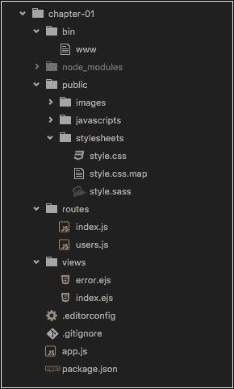
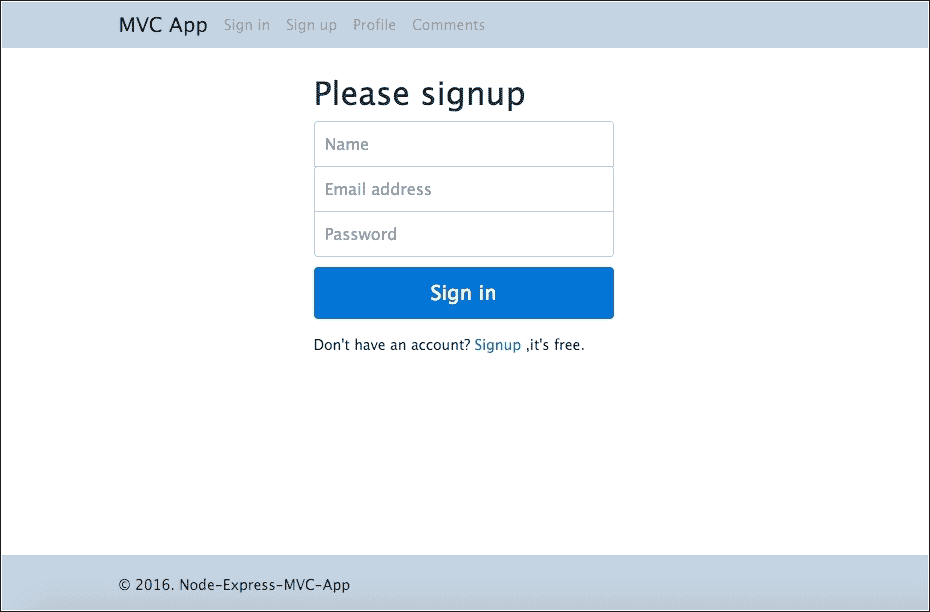
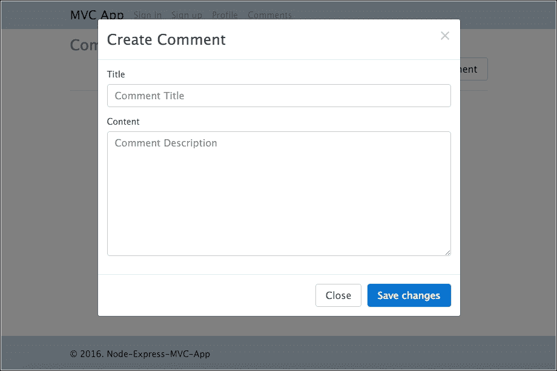
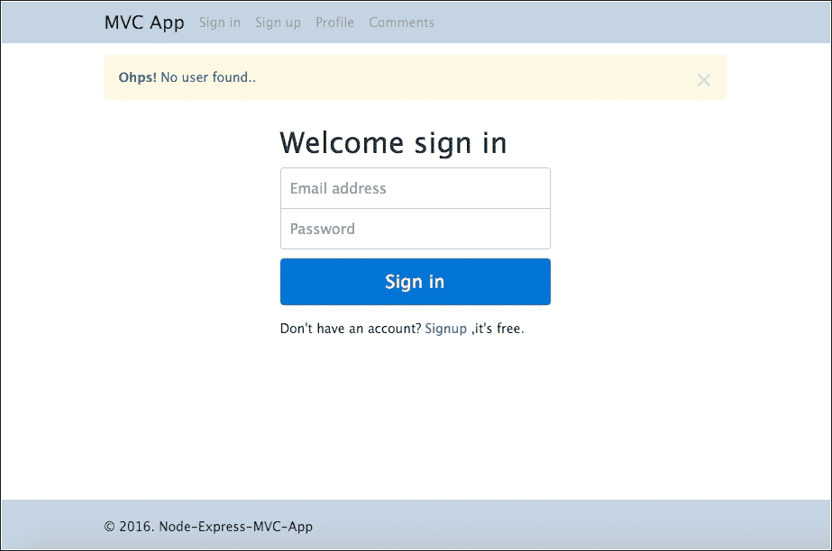

# 第一章。使用 MVC 设计模式构建类似推特的应用程序

**模型** **视图** **控制器** ( **MVC** )设计模式在八十年代的软件行业非常流行。这种模式帮助了这么多工程师和公司构建了一段时间更好的软件，如今随着 Node.js 和一些 Node 框架如 **Express.js** 的兴起，这种模式仍然有用(更多关于 Express.js 及其 API 的信息可以在[http://expressjs.com/](http://expressjs.com/)找到)。

### 注

正如 Express.js 网站所说，它是“Node.js. ”的快速、未绑定、极简的网络框架。”

Express.js 是最流行的 Node 框架，全球许多公司都采用了它。因此，在我们的第一个应用程序中，让我们看看如何应用 MVC 模式来创建一个仅在后端使用 JavaScript 的应用程序。

在本章中，我们将涵盖以下主题:

*   安装节点和快速框架
*   MVC 设计模式
*   处理约曼发电机
*   如何使用快递生成器
*   如何应对快递模板引擎
*   用户认证
*   蒙古数据库与蒙古模式的连接

# 安装 Node.js

首先，我们需要安装最新的 Node.js 版本。在写这本书的时候，Node.js 的最新更新是 *v6.3.0* 。你可以去[https://nodejs.org/en/](https://nodejs.org/en/)的 Node.js 网站选择你的平台。对于这本书，我们使用的是 Mac OS X，但例子可以在任何平台上遵循。

要检查节点和**节点包管理器** ( **NPM** )版本，请打开您的终端/外壳并键入以下内容:

*   ```js
    node -v

    ```

*   ```js
    npm -v

    ```

本书使用节点版 *6.3.0* 和 NPM 版 *3.10.3*

## 安装约曼

在本书中，我们将使用一些工具来加速我们的开发过程。其中一个叫做**约曼**(更多信息可以在[http://yeoman.io/](http://yeoman.io/)找到)，一个强大的网络应用生成器。

现在让我们安装发电机。打开您的终端/外壳并键入以下代码:

```js
npm install -g yo

```

# 安装快速发电机

对于我们的第一个应用程序，让我们使用官方的 Express 生成器。生成器帮助我们创建应用程序的初始代码，我们可以修改它以适合我们的应用程序。

只需在终端或外壳中键入以下命令:

```js
npm install -g express

```

请注意，`-g`标志意味着在您的机器上全局安装，以便您可以在任何项目中使用它。

Express 是 Node.js 强大的微框架；有了它，就有可能轻松地构建 web 应用程序。

# 建立基线

现在开始的项目将是一个完全服务器端的应用程序。我们不会使用任何接口框架，比如 AngularJS、Ember.js 等；让我们专注于 express 框架。

这个应用程序的目的是使用所有的 express 资源和中间件来创建一个遵循 MVC 设计模式的应用程序。

**中间件**基本上是快递的路由层激活的功能。该名称指的是路线被激活直到其返回的时间(从开始到结束)。顾名思义，中间件位于中间。重要的是要记住，函数是按照它们被添加的顺序执行的。

在代码示例中，我们将使用中间件，包括`cookie-parser`、`body-parser`和许多其他中间件。

### 注

您可以直接从 Packt 出版网站的图书页面下载本书中使用的代码，也可以直接从 GitHub 下载本章和所有其他内容，网址为:

[https://github . com/neweon web/nodejs-6-blue prints](https://github.com/newaeonweb/nodejs-6-blueprints)。

每个应用程序都被赋予了相关章节的名称，所以现在让我们深入研究我们的代码。

首先，在你的机器上创建一个名为`chapter-01`的新文件夹。从现在开始，我们将这个文件夹称为根项目文件夹。在我们继续并执行命令开始我们的项目之前，我们将看到几行关于我们与`express`命令一起使用的标志。

我们使用的命令是`express --ejs --css sass -git`，其中:

*   `express`是用于创建应用程序的默认命令
*   `--ejs`表示使用嵌入式 JavaScript 模板引擎，而不是 **Jade** (默认)
*   `--css sass`表示使用 **SASS** 代替普通 **CSS** (默认)
*   `--git`:表示在项目中增加一个`.gitignore`文件

因为我使用 git 进行版本控制，所以使用 express 选项向我的应用程序添加一个`.gitignore`文件会很有用。但是我将跳过书中的所有 git 命令。

要检查`express`框架中的所有可用选项，您可以在终端/外壳中键入以下内容:

```js
express -h

```

该框架为我们提供了启动项目所需的所有命令:

```js
Usage: express [options] [dir]
 Options:
 -h, --help          output usage information
 -V, --version       output the version number
 -e, --ejs           add ejs engine support (defaults to jade)
 --hbs           add handlebars engine support
 -H, --hogan         add hogan.js engine support
 -c, --css <engine>  add stylesheet <engine> support
                   (less|stylus|compass|sass) (defaults to plain css)
 --git           add .gitignore
 -f, --force         force on non-empty directory

```

现在，打开您的终端/外壳并键入以下命令:

```js
express --ejs --css sass -git

```

终端/外壳中的输出如下:

```js
 create :
 create : ./package.json
 create : ./app.js
 create : ./.gitignore
 create : ./public
 create : ./public/javascripts
 create : ./public/images
 create : ./public/stylesheets
 create : ./public/stylesheets/style.sass
 create : ./routes
 create : ./routes/index.js
 create : ./routes/users.js
 create : ./views
 create : ./views/index.ejs
 create : ./views/error.ejs
 create : ./bin
 create : ./bin/www
 install dependencies:
 $ cd . && npm install
 run the app:
 $ DEBUG=chapter-01:* npm start

```

正如您在下面的截图中看到的，生成器非常灵活，并且只创建启动项目所需的最小结构:



但是，我们将在继续之前进行一些更改。

## 向 package.json 文件添加更改

在根项目文件夹中打开`package.json`，并添加以下高亮显示的代码行:

```js
{ 
    "name": "chapter-01", 
    "description": "Build a Twitter Like app using the MVC design pattern", 
    "license": "MIT", 
    "author": { 
        "name": "Fernando Monteiro", 
        "url": "https://github.com/newaeonweb/node-6-blueprints" 
    }, 
    "repository": { 
        "type": "git", 
        "url": "https://github.com/newaeonweb/node-6-blueprints.git" 
    }, 
    "keywords": [ 
        "MVC", 
        "Express Application", 
        "Expressjs" 
    ], 
    "version": "0.0.1", 
    "private": true, 
    "scripts": { 
        "start": "node ./bin/www" 
    }, 
    "dependencies": { 
        "body-parser": "~1.13.2", 
        "cookie-parser": "~1.3.5", 
        "debug": "~2.2.0", 
        "ejs": "~2.3.3", 
        "express": "~4.13.1", 
        "morgan": "~1.6.1", 
        "node-sass-middleware": "0.8.0", 
        "serve-favicon": "~2.3.0" 
    } 
} 

```

即使这不是高优先级的变更，将这些信息添加到您的项目中也被认为是一种好的做法。

现在我们准备运行项目；让我们安装已经在`package.json`文件中列出的必要依赖项。

在终端/外壳上，键入以下命令:

```js
npm install

```

最后，我们准备出发了！

## 运行应用程序

要运行项目并在浏览器中查看应用程序，请在终端/shell 中键入以下命令:

```js
DEBUG=chapter-01:* npm start

```

终端/外壳中的输出如下:

```js
chapter-01:server Listening on port 3000 +0ms

```

可以只运行`npm start`，但不会看到前面有端口名的输出；在本章的后面，我们将修复它。

现在，只需查看`http://localhost:3000`。你会看到快递的欢迎信息。

# 更改应用程序的结构

让我们对应用程序中的目录结构进行一些更改，并准备好遵循模型-视图-控制器设计模式。

我将列出这次重构的必要步骤:

1.  在`root`项目文件夹内:
    *   创建一个名为`server`的新文件夹
2.  在`server`文件夹内:
    *   创建一个名为`config`的新文件夹
    *   创建一个名为`routes`的新文件夹
    *   创建一个名为`views`的新文件夹。
3.  此时不用担心`config`文件夹；我们稍后将插入它的内容。
4.  现在我们需要将`error.js`和`index.js`文件从`chapter-01/views`文件夹移到`chapter-01/server/views` 文件夹。
5.  将`index.js`和`user.js`文件从`chapter-01/routes`文件夹移到`chapter-01/server/routes`文件夹。
6.  这是一个非常简单的更改，但是在开发过程中，更好地组织我们应用程序的所有文件将非常有用。

我们仍然需要在主应用程序文件`app.js`中更改该文件夹的路径。从项目根文件夹打开`app.js`文件，更改以下高亮显示的行:

```js
... 
var routes = require('./server/routes/index'); 
var users = require('./server/routes/users'); 

var app = express(); 

// view engine setup 
app.set('views', path.join(__dirname, 'server/views')); 
app.set('view engine', 'ejs'); 
... 

```

在我们继续之前，让我们将欢迎消息从`routes/index.js`文件更改为以下突出显示的代码:

```js
/* GET home page. */ 
router.get('/', function(req, res, next) { 
    res.render('index', { title: 'Express from server folder' }); 
}); 

```

要运行项目并在浏览器中查看应用程序，请执行以下步骤:

1.  在您的终端/外壳中键入以下命令:

    ```js
    DEBUG=chapter-01:* npm start

    ```

2.  在`http://localhost:3000`打开浏览器。
3.  The output in your browser will be as follows:

    

    应用程序主屏幕

现在我们可以从以下位置删除文件夹和文件:

*   `chapter-01/routes`:
    *   `index.js`
    *   `user.js`
*   `chapter-01/views`:
    *   ` error.js`
    *   `index.js`

## 更改默认行为以启动应用程序

如前所述，我们将更改应用程序的默认初始化过程。为此，我们将编辑`app.js`文件并添加几行代码:

1.  Open `app.js` and add the following code after the `app.use('/users', users);` function:

    ```js
          // catch 404 and forward to error handler 
          app.use(function(req, res, next) { 
             var err = new Error('Not Found'); 
              err.status = 404; 
              next(err); 
          }); 

    ```

    拦截 *404* 错误很简单`middleware`。

2.  现在在`module.exports = app;`功能后添加以下代码:

    ```js
          app.set('port', process.env.PORT || 3000); 
          var server = app.listen(app.get('port'), function() { 
              console.log('Express server listening on port ' + 
              serer.address().port); 
          }); 

    ```

3.  Open the `package.js` file at the root project folder and change the following code:

    ```js
          ... 
          "scripts": { 
             "start": "node app.js" 
          }, 
          ... 

    ```

    ### 注

    如有必要，调试命令仍然可用:`DEBUG=chapter-01:* npm start`。

4.  `package.json`文件是 Node.js 应用中极其重要的文件。可以存储项目的各种信息，例如依赖项、项目描述、作者、版本等等。
5.  此外，还可以设置脚本来简化、连接、测试、构建和部署应用程序。我们将在[第 9 章](09.html "Chapter 9.  Building a Frontend Process with Node.js and NPM")、*中看到更多关于如何使用 Node.js 和 NPM* 构建前端流程的内容。
6.  我们来测试一下结果；打开你的终端/外壳，输入以下命令:

    ```js
     npm start 

    ```

7.  我们将在控制台上看到相同的输出:

    ```js
     > node app.js 
    Express server listening on port 3000!

    ```

# 使用分音重构视图文件夹

现在我们将对`views`文件夹中的目录结构进行重大更改:我们将添加一个重要的**嵌入式 JavaScript** ( **EJS** )资源，用于在我们的模板中创建可重用文件。

它们被称为部分文件，将使用`<% = include %>`标签包含在我们的应用程序中。

### 类型

你可以在官方项目页面找到更多关于 **EJS** 的信息，网址为:[http://ejs.co/](http://ejs.co/)

在`views`文件夹中，我们将再创建两个文件夹，分别叫做`partials`和`pages`:

1.  此时`pages`文件夹如下:
2.  现在让我们将`views`文件夹中的文件移到`pages`文件夹中。
3.  在`views`文件夹内创建`pages`文件夹。
4.  在`views`文件夹内创建`partials`文件夹。
    *   `server/`
    *   `pages/`
    *   `index.ejs`
    *   `error.ejs`
    *   `partials/`
5.  现在我们需要创建将包含在所有模板中的文件。注意，我们只有两个模板:`index.js`和`error.js`。
6.  Create a file called `stylesheet.ejs` and add the following code:

    ```js
          <!-- CSS Files --> 
          <link rel='stylesheet' href='https://cdnjs.cloudflare.com/
           ajax/libs/twitter-bootstrap/4.0.0-alpha/css/bootstrap.min.css'>
          <link rel='stylesheet' href='/stylesheets/style.css' />
    ```

    ### 类型

    我们将使用最新版本的 **Twitter Bootstrap** UI 框架，在撰写本书时，该框架的版本为 *4.0.0-alpha* 。

7.  我们正在使用**内容** **交付** **网络** ( **CDN** )进行 *CSS* 和 *JS* 文件。
8.  创建一个名为`javascript.ejs`的文件，并添加以下代码:

    ```js
          <!-- JS Scripts -->
          <script src='https://cdnjs.cloudflare.com/ajax/libs
            /jquery/2.2.1/jquery.min.js'></script>
          <script src='https://cdnjs.cloudflare.com/ajax/libs/
           twitter-bootstrap/4.0.0-alpha/js/bootstrap.min.js'></script>
          </body>
          </html>
    ```

9.  然后创建一个名为`header.ejs`的文件，并添加以下代码:

    ```js
          <!-- Fixed navbar --> 
          <div class="pos-f-t"> 
              <div class="collapse" id="navbar-header"> 
                  <div class="container bg-inverse p-a-1"> 
                     <h3>Collapsed content</h3> 
                      <p>Toggle able via the navbar brand.</p> 
                  </div> 
              </div> 
              <nav class="navbar navbar-light navbar-static-top"> 
                   <div class="container"> 
                      <button class="navbar-toggler hidden-sm-up" type=
                        "button"data-toggle="collapse" data-target=
                          "#exCollapsingNavbar2"> 
                          Menu 
                      </button> 
                     <div class="collapse navbar-toggleable-xs"
                       id="exCollapsingNavbar2"> 
                          <a class="navbar-brand" href="/">MVC App</a> 
                          <ul class="nav navbar-nav navbar-right"> 
                              <li class="nav-item"> 
                                  <a class="nav-link" href="/login">
                                    Sign in
                                  </a>
                              </li> 
                              <li class="nav-item"> 
                                  <a class="nav-link" href="/signup">
                                    Sign up
                                  </a> 
                               </li> 
                               <li class="nav-item"> 
                                  <a class="nav-link" href="/profile">
                                     Profile</a> 
                               </li> 

                              <li class="nav-item"> 
                                  <a class="nav-link" href="/comments">
                                    Comments</a> 
                              </li> 
                          </ul> 
                      </div> 
                  </div> 
              </nav> 
          </div> 
          <!-- Fixed navbar --> 

    ```

10.  创建一个名为`footer.ejs`的文件，并添加以下代码:

    ```js
          <footer class="footer"> 
              <div class="container"> 
                  <span>&copy 2016\. Node-Express-MVC-App</span> 
              </div> 
          </footer> 

    ```

11.  Let's adjust the path for the view templates in our `app.js` file; add the following lines of code:

    ```js
          // view engine setup 
          app.set('views', path.join(__dirname, 'server/views/pages')); 
          app.set('view engine', 'ejs'); 

    ```

    ### 类型

    注意，我们只添加了已经存在的`pages`文件夹路径。

12.  现在我们用以下代码替换`pages/index.ejs`中的代码:

    ```js
          <!DOCTYPE html>
          <html>
          <head>
            <title><%= title %></title>
             <% include ../partials/stylesheet %>
          </head> 
          <body>
              <% include ../partials/header %>
              <div class="container">
                <div class="page-header m-t-1">
                  <h1><%= title %></h1>
                </div> 
                <p class="lead">Welcome to <%= title %></p>
              </div>
              <% include ../partials/footer %>
              <% include ../partials/javascript %>
           </body>
           </html>
    ```

13.  让我们对`pages/error.ejs`处的错误视图文件执行相同的操作:

    ```js
          <!DOCTYPE html> 
          <html> 
          <head> 
               <title>Wohp's Error</title> 
               <% include ../partials/stylesheet %> 
          </head> 
          <body> 
               <% include ../partials/header %> 

              <div class="container"> 
                  <div class="page-header m-t-1"> 
                      <h1>Sorry: <%= message %></h1> 
                      <h2><%= error.status %></h2> 
                      <pre><%= error.stack %></pre> 
                  </div> 

              </div> 
               <% include ../partials/footer %> 
               <% include ../partials/javascript %> 
          </body> 
          </html> 

    ```

我们目前在`server`文件夹中有以下结构:

*   `server/`
*   `pages/`
*   `index.ejs`
*   `error.ejs`
*   `partials/`
*   `footer.ejs`
*   `header.ejs`
*   `javascript.ejs`
*   `stylesheet.ejs2`

# 添加登录、注册和配置文件模板

现在我们有了推进项目的坚实基础。此时，我们将为登录、注册和配置文件屏幕添加一些模板文件。

这些页面的预期结果如下图所示:


登录屏幕



注册屏幕


轮廓屏幕

1.  现在让我们创建登录模板。在`views`文件夹中创建一个名为`login.ejs`的新文件，并放置以下代码:

    ```js
          <!DOCTYPE html> 
          <html> 
          <head> 
              <title><%= title %></title> 
              <% include ../partials/stylesheet %> 
          </head> 
          <body> 
            <% include ../partials/header %> 

            <div class="container"> 
                <% if (message.length > 0) { %> 
                    <div class="alert alert-warning alert-dismissible
                       fade in" role="alert"> 
                      <button type="button" class="close" data-dismiss=
                         "alert" aria-label="Close"> 
                        <span aria-hidden="true">&times;</span> 
                      </button> 
                      <strong>Ohps!</strong> <%= message %>. 
                    </div> 
                 <% } %> 
                <form class="form-signin" action="/login" method="post"> 
                <h2 class="form-signin-heading">Welcome sign in</h2> 
                <label for="inputEmail" class="sr-only">Email address</label> 
                <input type="email" id="email" name="email" class="form-
                  control" placeholder="Email address" required=""> 
                <label for="inputPassword" class="sr-only">Password</label> 
                <input type="password" id="password" name="password"
                 class="form-control" placeholder="Password" required=""> 
                <button class="btn btn-lg btn-primary btn-block" 
                   type="submit">Sign in</button> 
                <br> 
                <p>Don't have an account? <a href="/signup">Signup</a> 
                   ,it's free.</p> 
              </form> 
            </div> 

            <% include ../partials/footer %> 
            <% include ../partials/javascript %> 
          </body> 
          </html> 

    ```

2.  Add the login route to `routes/index.js` after the index route:

    ```js
          /* GET login page. */ 
          router.get('/login', function(req, res, next) { 
              res.render('login', { title: 'Login Page', message:
               req.flash('loginMessage') }); 
           }); 

    ```

    ### 注

    在模板中，我们使用`connect-flash`中间件来显示错误消息。稍后，我们将展示如何安装该组件；现在不用担心。

3.  让我们将`signup`模板添加到`views/pages`文件夹中。
4.  在`views/pages`新建一个文件，另存为`signup.ejs`；然后添加以下代码:

    ```js
          <!DOCTYPE html>
          <html>
          <head>
            <title><%= title %></title>
            <% include ../partials/stylesheet %>
          </head>
          <body>
            <% include ../partials/header %>
            <div class="container">
              <% if (message.length > 0) { %>
                 <div class="alert alert-warning" role="alert">
                   <strong>Warning!</strong> <%= message %>.
                 </div>
               <% } %>
               <form class="form-signin" action="/signup" method="post">
                 <h2 class="form-signin-heading">Please signup</h2>
                 <label for="inputName" class="sr-only">Name address</label>
                 <input type="text" id="name" name="name" class="form-control"
                  placeholder="Name" required="">
                 <label for="inputEmail" class="sr-only">Email address</label>
                 <input type="email" id="email" name="email" class=
                   "form-control" placeholder="Email address" required="">
                 <label for="inputPassword" class="sr-only">Password</label>
                 <input type="password" id="password" name="password" 
                   class="form-control" placeholder="Password" required="">
                 <button class="btn btn-lg btn-primary btn-block" 
                   type="submit">Sign in</button> 
                  <br> 
                  <p>Don't have an account? <a href="/signup">Signup</a>
                      ,it's free.</p>
                </form>
              </div>
              <% include ../partials/footer %>
              <% include ../partials/javascript %>
            </body>
            </html>
    ```

5.  现在我们需要为注册视图添加路线。打开`routes/index.js`，在`login route`后添加以下代码:

    ```js
          /* GET Signup */ 
          router.get('/signup', function(req, res) { 
              res.render('signup', { title: 'Signup Page', 
                 message:req.flash('signupMessage') }); 
          }); 

    ```

6.  接下来，我们将把模板添加到`profile`页面，并把路线添加到该页面。在`view/pages`文件夹中创建一个名为`profile.ejs`的文件，并添加以下代码:

    ```js
          <!DOCTYPE html> 
          <html> 
          <head> 
              <title><%= title %></title> 
              <% include ../partials/stylesheet %> 
          </head> 
          <body> 
              <% include ../partials/header %> 
              <div class="container"> 
                <h1><%= title %></h1> 
                <div class="datails"> 
                  <div class="card text-xs-center"> 
                      <br> 
                    " 
                      alt="Card image cap"> 
                      <div class="card-block"> 
                        <h4 class="card-title">User Details</h4> 
                        <p class="card-text"> 
                            <strong>Name</strong>: <%= user.local.name %><br> 
                            <strong>Email</strong>: <%= user.local.email %> 
                        </p> 
                        <a href="/logout" class="btn btn-default">Logout</a> 
                      </div> 
                  </div> 
                </div> 
             </div> 
            <% include ../partials/footer %> 
            <% include ../partials/javascript %> 
          </body> 
          </html> 

    ```

7.  Now we need to add the route for the profile view; open `routes/index.js` and add the following code right after the `signup` route:

    ```js
          /* GET Profile page. */ 
          router.get('/profile',  function(req, res, next) {
              res.render('profile', { title: 'Profile Page', user : req.user,
              avatar: gravatar.url(req.user.email ,  {s: '100', r: 'x', d:
               'retro'}, true) });
          }); 

    ```

    ### 类型

    我们正在使用另一个名为`gravatar`的中间件；稍后，我们将展示如何安装它。

# 安装附加中间件

正如您在前面几节中看到的，我们使用了一些中间件来显示消息和使用 gravatar 的用户图标。在本节中，我们将看到如何为我们的应用程序安装一些非常重要的模块。

由于我们为`signin`、`signup`和`profile`页面创建了模板，我们将需要存储用户的登录和密码。

这些是我们将用于此任务的中间件，每个中间件的定义如下:

<colgroup><col> <col> <col></colgroup> 
| 成分 | 描述 | 更多细节 |
| `connect-flash` | 用户友好的消息 | [https://www.npmjs.com/package/connect-flash](https://www.npmjs.com/package/connect-flash) |
| `connect-mongo` | 驱动与 MongoDB 连接 | [https://www.npmjs.com/package/connect-mongo](https://www.npmjs.com/package/connect-mongo) |
| `express-session` | 将用户会话存储在数据库中 | [https://www.npmjs.com/package/express-session](https://www.npmjs.com/package/express-session) |
| `Gravatar` | 显示随机用户图片 | [https://www . npmj . com/package/recorder](https://www.npmjs.com/package/gravatar) |
| `Passport` | 认证中间件 | [https://www.npmjs.com/package/passport](https://www.npmjs.com/package/passport) |
| `passport-local` | 本地用户/密码验证 | [https://www.npmjs.com/package/passport-local](https://www.npmjs.com/package/passport-local) |

打开您的终端/外壳并键入:

```js
npm install connect-flash connect-mongo express-session gravatar
      passport passport-local -save

```

### 注

可以看到，我们将使用 MongoDB 来存储用户数据；在[https://www.mongodb.org/](https://www.mongodb.org/)可以找到更多关于 MongoDB 的信息，在[https://docs.mongodb.org/manual/installation/](https://docs.mongodb.org/manual/installation/)可以找到安装过程。我们假设您的机器上已经安装了 MongoDB，并且它正在运行。

# 用新中间件重构 app.js 文件

此时，我们必须对`app.js`文件进行重大重组，以包含我们将使用的新中间件。

我们将逐步向您展示如何包含每个中间件，最后，我们将看到完整的文件:

1.  Open `app.js` and add the following lines before `var app = express()`:

    ```js
          // ODM With Mongoose 
          var mongoose = require('mongoose'); 
          // Modules to store session 
          var session    = require('express-session'); 
          var MongoStore = require('connect-mongo')(session); 
          // Import Passport and Warning flash modules 
          var passport = require('passport'); 
          var flash = require('connect-flash'); 

    ```

    这是一个简单的导入过程。

2.  在`app.set('view engine', 'ejs')`后增加以下几行:

    ```js
          // Database configuration 
          var config = require('./server/config/config.js'); 
          // connect to our database 
          mongoose.connect(config.url); 
          // Check if MongoDB is running 
          mongoose.connection.on('error', function() {
            console.error('MongoDB Connection Error. Make sure MongoDB is
             running.'); 
          }); 

          // Passport configuration 
          require('./server/config/passport')(passport); 

    ```

3.  注意，我们在第一行使用的是一个`config.js`文件；稍后我们将创建这个文件。
4.  在`app.use(express.static(path.join(__dirname, 'public')))`后增加以下几行:

    ```js
          // required for passport 
          // secret for session 
          app.use(session({ 
              secret: 'sometextgohere', 
              saveUninitialized: true, 
              resave: true, 
              //store session on MongoDB using express-session +
              connect mongo 
              store: new MongoStore({ 
                  url: config.url, 
                  collection : 'sessions' 
              }) 
          })); 

          // Init passport authentication 
          app.use(passport.initialize()); 
          // persistent login sessions 
          app.use(passport.session()); 
          // flash messages 
          app.use(flash()); 

    ```

# 添加配置和护照文件

如前所述，让我们创建一个`config`文件:

1.  在`server/config`中，创建一个名为`config.js`的文件，并在其中放置以下代码:

    ```js
          // Database URL 
          module.exports = { 
              // Connect with MongoDB on local machine 
              'url' : 'mongodb://localhost/mvc-app' 
          }; 

    ```

2.  Create a new file on `server/config` and name it `passport.js`. Add the following content:

    ```js
          // load passport module 
          var LocalStrategy    = require('passport-local').Strategy; 
          // load up the user model 
          var User = require('../models/users'); 

          module.exports = function(passport) { 
              // passport init setup 
              // serialize the user for the session 
              passport.serializeUser(function(user, done) { 
                  done(null, user.id); 
              }); 
              //       deserialize the user 
              passport.deserializeUser(function(id, done) { 
                  User.findById(id, function(err, user) { 
                      done(err, user); 
                  }); 
              }); 
              // using local strategy 
              passport.use('local-login', new LocalStrategy({ 
                  // change default username and password, to email 
                  //and password 
                  usernameField : 'email', 
                  passwordField : 'password', 
                  passReqToCallback : true 
              }, 
              function(req, email, password, done) { 
                  if (email) 
                  // format to lower-case 
                  email = email.toLowerCase(); 
                  // process asynchronous 
                  process.nextTick(function() { 
                      User.findOne({ 'local.email' :  email }, 
                       function(err, user)
                    { 
                      // if errors 
                     if (err) 
                       return done(err); 
                     // check errors and bring the messages 
                     if (!user) 
                       return done(null, false, req.flash('loginMessage',
                       'No user found.')); 
                    if (!user.validPassword(password)) 
                      return done(null, false, req.flash('loginMessage',
                      'Wohh! Wrong password.')); 
                    // everything ok, get user 
                    else 
                      return done(null, user); 
                    }); 
                  }); 
               })); 
              // Signup local strategy 
              passport.use('local-signup', new LocalStrategy({ 
                  // change default username and password, to email and 
                 //  password 
                  usernameField : 'email', 
                  passwordField : 'password', 
                  passReqToCallback : true 
              }, 
              function(req, email, password, done) { 
                  if (email) 
                  // format to lower-case 
                  email = email.toLowerCase(); 
                  // asynchronous 
                  process.nextTick(function() { 
                      // if the user is not already logged in: 
                      if (!req.user) { 
                          User.findOne({ 'local.email' :  email },
                           function(err,user) { 
                      // if errors 
                      if (err) 
                        return done(err); 
                      // check email 
                      if (user) { 
                        return done(null, false, req.flash('signupMessage',
                         'Wohh! the email is already taken.')); 
                      }
                      else { 
                        // create the user 
                          var newUser = new User(); 
                          // Get user name from req.body 
                          newUser.local.name = req.body.name; 
                          newUser.local.email = email; 
                          newUser.local.password =
                           newUser.generateHash(password); 
                          // save data 
                         newUser.save(function(err) { 
                       if (err) 
                         throw err; 
                         return done(null, newUser); 
                        }); 
                       } 
                    }); 
                   } else { 
                     return done(null, req.user); 
                   }         }); 
              })); 
          }; 

    ```

    注意，在第四行，我们正在导入一个名为`models`的文件；我们将使用 Mongoose 创建这个文件。

# 创建模型文件夹并添加用户模式

在`server/`内创建一个模型文件夹，并添加以下代码:

```js
// Import Mongoose and password Encrypt 
var mongoose = require('mongoose'); 
var bcrypt   = require('bcrypt-nodejs'); 

// define the schema for User model 
var userSchema = mongoose.Schema({ 
    // Using local for Local Strategy Passport 
    local: { 
        name: String, 
        email: String, 
        password: String, 
    } 

}); 

// Encrypt Password 
userSchema.methods.generateHash = function(password) { 
    return bcrypt.hashSync(password, bcrypt.genSaltSync(8), null); 
}; 

// Verify if password is valid 
userSchema.methods.validPassword = function(password) { 
    return bcrypt.compareSync(password, this.local.password); 
}; 

// create the model for users and expose it to our app 
module.exports = mongoose.model('User', userSchema); 

```

# 保护路线

此时，我们有足够的代码来配置对应用程序的安全访问。但是，我们仍然需要在登录和注册表单中添加一些行，以使它们正常工作:

1.  打开`server/routes/index.js`，在`login GET`路线后添加以下线路:

    ```js
          /* POST login */ 
          router.post('/login', passport.authenticate('local-login', { 
              //Success go to Profile Page / Fail go to login page 
              successRedirect : '/profile', 
              failureRedirect : '/login', 
              failureFlash : true 
          })); 

    ```

2.  在`signup GET`路线后添加这些线:

    ```js
          /* POST Signup */ 
          router.post('/signup', passport.authenticate('local-signup', { 
              //Success go to Profile Page / Fail go to Signup page 
              successRedirect : '/profile',       
              failureRedirect : '/signup', 
              failureFlash : true 
          })); 

    ```

3.  现在让我们添加一个简单的功能来检查用户是否登录；在`server/routes/index.js`的末尾，添加以下代码:

    ```js
          /* check if user is logged in */ 
          function isLoggedIn(req, res, next) { 
              if (req.isAuthenticated()) 
                  return next(); 
              res.redirect('/login'); 
          } 

    ```

4.  让我们为注销功能添加一个简单的路线，并在`isLoggedIn()`功能后添加以下代码:

    ```js
          /* GET Logout Page */ 
          router.get('/logout', function(req, res) { 
              req.logout(); 
              res.redirect('/'); 
          }); 

    ```

5.  最后一个变化是将`isloggedin()`作为第二个参数添加到纵断面路线中。添加以下突出显示的代码:

    ```js
          /* GET Profile page. */ 
          router.get('/profile', isLoggedIn, function(req, res, next) { 
              res.render('profile', { title: 'Profile Page', user : req.user,
               avatar: gravatar.url(req.user.email ,  {s: '100', r: 'x',
                 d:'retro'}, true) }); 
          }); 

    ```

最终的`index.js`文件会是这样的:

```js
var express = require('express'); 
var router = express.Router(); 
var passport = require('passport'); 
// get gravatar icon from email 
var gravatar = require('gravatar'); 

/* GET home page. */ 
router.get('/', function(req, res, next) { 
    res.render('index', { title: 'Express from server folder' }); 
}); 

/* GET login page. */ 
router.get('/login', function(req, res, next) { 
    res.render('login', { title: 'Login Page', message: req.flash('loginMessage') }); 
}); 
/* POST login */ 
router.post('/login', passport.authenticate('local-login', { 
    //Success go to Profile Page / Fail go to login page 
    successRedirect : '/profile', 
    failureRedirect : '/login', 
    failureFlash : true 
})); 

/* GET Signup */ 
router.get('/signup', function(req, res) { 
    res.render('signup', { title: 'Signup Page', message: req.flash('signupMessage') }); 
}); 
/* POST Signup */ 
router.post('/signup', passport.authenticate('local-signup', { 
    //Success go to Profile Page / Fail go to Signup page 
    successRedirect : '/profile', 
    failureRedirect : '/signup', 
    failureFlash : true 
})); 

/* GET Profile page. */ 
router.get('/profile', isLoggedIn, function(req, res, next) { 
    res.render('profile', { title: 'Profile Page', user : req.user, avatar: gravatar.url(req.user.email ,  {s: '100', r: 'x', d: 'retro'}, true) }); 
}); 

/* check if user is logged in */ 
function isLoggedIn(req, res, next) { 
    if (req.isAuthenticated()) 
        return next(); 
    res.redirect('/login'); 
} 
/* GET Logout Page */ 
router.get('/logout', function(req, res) { 
    req.logout(); 
    res.redirect('/'); 
}); 

module.exports = router; 

```

我们几乎已经准备好了所有的东西来完成申请，但是我们仍然需要创建一个评论页面。

# 创建控制器文件夹

我们将使用另一种格式创建`controllers`文件夹，而不是使用`routes`文件夹来创建注释文件的路线和功能，在这里我们可以将路线和控制器功能分开，从而具有更好的模块化:

1.  创建一个名为`controllers`的文件夹。
2.  创建一个名为`comments.js`的文件，并添加以下代码:

    ```js
          // get gravatar icon from email 
          var gravatar = require('gravatar'); 
          // get Comments model 
          var Comments = require('../models/comments'); 

          // List Comments 
          exports.list = function(req, res) { 
             // List all comments and sort by Date 
              Comments.find().sort('-created').populate('user',
                'local.email').exec(function(error, comments) { 
                  if (error) { 
                      return res.send(400, { 
                          message: error       
                      }); 
                  } 
                  // Render result 
                  res.render('comments', { 
                      title: 'Comments Page', 
                      comments: comments, 
                      gravatar: gravatar.url(comments.email,
                         {s: '80', r: 'x', d: 'retro'}, true) 
                  }); 
              }); 
          }; 
          // Create Comments 
          exports.create = function(req, res) { 
             // create a new instance of the Comments model with request body 
              var comments = new Comments(req.body); 
              // Set current user (id) 
              comments.user = req.user; 
              // save the data received 
              comments.save(function(error) { 
                  if (error) { 
                      return res.send(400, { 
                          message: error 
                      }); 
                  } 
                  // Redirect to comments 
                  res.redirect('/comments'); 
              }); 
          }; 
          // Comments authorization middleware 
          exports.hasAuthorization = function(req, res, next) { 
              if (req.isAuthenticated()) 
                  return next(); 
              res.redirect('/login'); 
          }; 

    ```

3.  让我们导入`app.js`文件上的控制器；在`var users = require('./server/routes/users')`后增加以下几行:

    ```js
          // Import comments controller
          var comments = require('./server/controllers/comments'); 
    ```

4.  现在在`app.use('/users', users)`后添加评论路线:

    ```js
          // Setup routes for comments 
          app.get('/comments', comments.hasAuthorization, comments.list); 
          app.post('/comments', comments.hasAuthorization, comments.create); 

    ```

5.  在`server/pages`处创建一个名为`comments.ejs`的文件，并添加以下行:

    ```js
          <!DOCTYPE html> 
          <html> 
          <head> 
              <title><%= title %></title> 
              <% include ../partials/stylesheet %> 
          </head> 
          <body> 
            <% include ../partials/header %> 
            <div class="container"> 
              <div class="row"> 
                <div class="col-lg-6"> 
                  <h4 class="text-muted">Comments</h4> 
                </div> 
                <div class="col-lg-6"> 
                  <button type="button" class="btn btn-secondary pull-right"
                   data-toggle="modal" data-target="#createPost">
                        Create Comment 
                    </button> 
                </div> 
                </div> 
                <!-- Modal --> 
                <div class="modal fade" id="createPost" tabindex="-1"
                 role="dialog" aria-labelledby="myModalLabel"
                  aria-hidden="true"> 
                  <div class="modal-dialog" role="document"> 
                    <div class="modal-content"> 
                      <form action="/comments" method="post"> 
                        <div class="modal-header"> 
                          <button type="button" class="close" 
                           data-dismiss="modal" aria-label="Close"> 
                             <span aria-hidden="true">&times;</span> 
                           </button> 
                           <h4 class="modal-title" id="myModalLabel">
                            Create Comment</h4> 
                        </div> 

                        <div class="modal-body"> 
                          <fieldset class="form-group"> 
                             <label  for="inputitle">Title</label> 
                             <input type="text" id="inputitle" name="title"
                               class="form-control" placeholder=
                                "Comment Title" required=""> 
                           </fieldset> 
                           <fieldset class="form-group"> 
                             <label  for="inputContent">Content</label> 
                             <textarea id="inputContent" name="content"
                              rows="8" cols="40" class="form-control"
                              placeholder="Comment Description" required="">
                             </textarea> 
                           </fieldset> 

                           </div> 
                            <div class="modal-footer"> 
                              <button type="button" class="btn btn-secondary"
                               data-dismiss="modal">Close</button> 
                              <button type="submit" class="btn btn-primary">
                               Save changes</button> 
                            </div> 
                      </form> 
                    </div> 
                  </div> 
                </div> 
                  <hr> 
                <div class="lead"> 
                  <div class="list-group"> 
                    <% comments.forEach(function(comments){ %> 
                      <a href="#" class="list-group-item"> 
                        " alt="" style="float: left;
                          margin-right: 10px"> 
                   <div class="comments"> 
                    <h4 class="list-group-item-heading">
                      <%= comments.title %></h4> 
                     <p class="list-group-item-text">
                       <%= comments.content %></p> 
                     <small class="text-muted">By: 
                        <%= comments.user.local.email %>
                     </small> 
                    </div> 
                    </a> 

                <% }); %> 
                </div> 
              </div> 
             </div> 
              <% include ../partials/footer %> 
              <% include ../partials/javascript %> 
          </body> 
          </html> 

    ```

6.  Note that we are using a simple Modal component from Twitter-bootstrap for the addition of comments, as shown in the following screenshot:

    

    创建注释屏幕的模型

7.  最后一步是为评论创建一个模型；让我们在`server/models/`处创建一个名为`comments.js`的文件，并添加以下代码:

    ```js
          // load the things we need 
          var mongoose = require('mongoose'); 
          var Schema = mongoose.Schema; 

          var commentSchema = mongoose.Schema({ 
              created: { 
                  type: Date, 
                  default: Date.now 
              }, 
              title: { 
                  type: String,       
                  default: '', 
                  trim: true, 
                  required: 'Title cannot be blank' 
              }, 
              content: { 
                  type: String, 
                  default: '', 
                  trim: true 
              }, 
              user: { 
                  type: Schema.ObjectId, 
                  ref: 'User' 
              } 
          }); 

          module.exports = mongoose.model('Comments', commentSchema); 

    ```

# 运行应用并添加评论

现在是测试一切是否正常的时候了:

1.  在根项目文件夹打开终端/外壳，并输入以下命令:

    ```js
    npm start

    ```

2.  查看您的浏览器，网址为:`http://localhost:3000`。
3.  转到`http://localhost:3000/signup`，创建一个名为`John Doe`的用户，其电子邮件标识为`john@doe.com`，密码为`123456`。
4.  转到`http://localhost:3000/comments`，点击**创建评论**按钮，添加以下内容:

    ```js
          Title: Sample Title 
          Comments: Lorem ipsum dolor sit amet, consectetur adipiscing elit,
           sed do eiusmod tempor incididunt ut labore et dolore magna aliqua.
           Ut enim ad minim veniam, quis nostrud exercitation ullamco laboris
           nisi ut aliquip ex ea commodo consequat. Duis aute irure dolor in
           reprehenderit in voluptate velit esse cillum dolore eu fugiat nulla
           pariatur. Excepteur sint occaecat cupidatat non proident, sunt in
           culpa qui officia deserunt mollit anim id est laborum. 

    ```

5.  The following screenshot illustrates the final result:

    

    评论屏幕

## 检查错误信息

现在让我们检查一下 flash-connect 消息。转到`http://localhost:3000/login`尝试以用户身份登录；我们将使用带密码的`martin@tech.com``123`。

下面的截图说明了结果:



登录屏幕上的错误消息

现在我们尝试注册一个已经注册的用户。转到`http://localhost:3000/signup`放置以下内容:

```js
name: John Doe 
email: john@doe.com
password: 123456 

```

此截图说明了结果:


注册屏幕上的错误消息

# 总结

在本章中，我们讨论了如何使用 Node.js 和 express 框架创建 MVC 应用程序，其中一个应用程序完全位于服务器端，这与使用 **Rails** 或 **Django** 框架创建的应用程序非常相似。

我们还通过会话控制、会话 cookies 存储和加密密码构建了安全的路由和非常强大的身份验证。

我们使用 MongoDB 存储用户和评论的数据。

在下一章中，我们将看到如何使用另一个带有 express 和 Node.js 的数据库系统