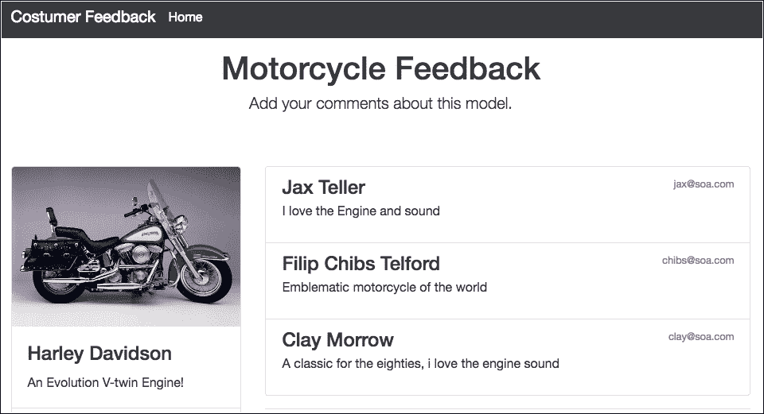
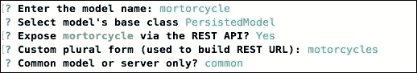
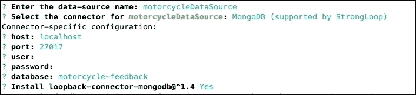
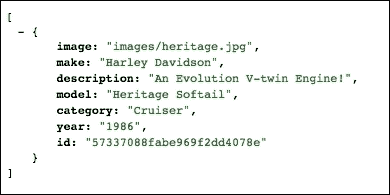
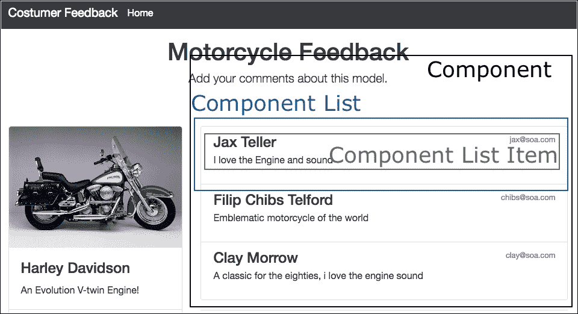
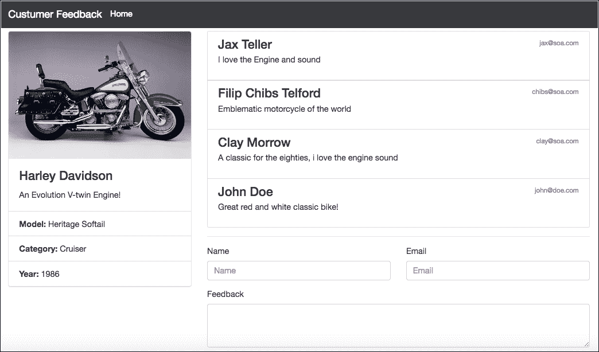

# 第六章。使用 Restful API 和 Loopback.io 构建客户反馈应用

如前所述，Node.js 生态系统有各种框架来开发强大的 web 应用。在前几章中，我们使用了最流行的 Express 框架。

在这一章中，我们将探索另一个被称为 loopback.io 的框架。这个框架在很大程度上基于 Express，然而，它为我们提供了一些更多的功能来非常快速地创建 Restful APIs。

它有一个**命令行界面** ( **命令行界面**)，可以在不使用代码的情况下创建应用接口，此外，它还公开了一个操纵 HTTP 动词的界面，一种嵌入在您的应用中的 Restful 客户端，以及一些其他优势。

我们还看到了如何使用 React.js 库在应用的前端使用这个 API。

在本章中，我们将涵盖以下主题:

*   安装环回框架
*   环回命令行界面的基础
*   使用命令行创建模型
*   处理数据源和数据库关系
*   创建一个简单的 React.js 应用来使用该 API

# 我们在建造什么

在本章中，我们将构建一个应用编程接口来存储任何类型的产品，在这种情况下是摩托车的经典模型，并存储来自该摩托车用户的评论/反馈。结果将如下图所示:



主页截图

## 创建基线结构

首先让我们安装 LoopBack 框架:

1.  打开你的终端/外壳，输入以下命令:

    ```js
    npm install strongloop -g

    ```

2.  打开你的终端/外壳，输入以下命令:

    ```js
    slc loopback

    ```

3.  输入目录选项的名称:章节-06。
4.  Choose the empty-server (An empty LoopBack API, without any

    配置的模型或数据源)选项。

    不要担心输出的结尾，我们将在下一个主题中解释这一点。

结果将是文件夹和文件的以下结构:


文件夹和文件的截图

结构相当简单；LoopBack 的几乎所有配置都在 JSON 文件里面，我们可以看到**组件-config.json** 、 **config.json** 、 **datasources.json** 以及**服务器**文件夹里面的所有其他文件。

### 类型

您可以通过在终端窗口中键入:slc -help 来了解更多关于 **slc** 命令行的信息。

# 用命令行创建模型

此时，我们有了必要的结构来开始开发我们的应用编程接口。

我们现在将使用命令行来创建应用的模型。我们将建立两个模型:一个是产品/摩托车模型，另一个是用户/消费者模型。

1.  打开章节-06 文件夹内的终端/外壳，输入以下命令:

    ```js
    slc loopback:model

    ```

2.  Fill in the following information for motorcycle model, as shown in the following screenshot:

    

    模型摩托车创建后的终端输出截图

3.  填写物业名称:

    ```js
          Property name: image
          ? Property type: string
          ? Required? Yes
          ? Default value[leave blank for none]:

          Property name: make
          ? Property type: string
          ? Required? Yes
          ? Default value[leave blank for none]:

          Property name: description
          ? Property type: string
          ? Required? Yes
          ? Default value[leave blank for none]:

          Property name: model
          ? Property type: string
          ? Required? Yes
          ? Default value[leave blank for none]:

          Property name: category
          ? Property type: string
          ? Required? Yes
          ? Default value[leave blank for none]:

          Property name: year
          ? Property type: string
          ? Required? Yes
          ? Default value[leave blank for none]:
    ```

4.  让我们创建客户模型。打开终端/外壳，输入以下命令:

    ```js
    slc loopback:model

    ```

5.  Fill in the information for review model, as shown in the following figure:

    

    创建模型审查后的终端输出截图

6.  填写物业名称:

    ```js
          Property name: name
          ? Property type: string
          ? Required? Yes
          ? Default value[leave blank for none]:

          Property name: email
          ? Property type: string
          ? Required? Yes
          ? Default value[leave blank for none]:

          Property name: review
          ? Property type: string
          ? Required? Yes
          ? Default value[leave blank for none]:

    ```

即使使用命令行，我们也可以检查和编辑您刚刚创建的模型。

### 类型

这里需要注意的一点是，common 属性创建一个目录，并与客户端和服务器文件夹共享它。如果使用的是属性服务器，则代码存储在服务器文件夹中，不与客户端文件夹共享。

# 用命令行创建后编辑模型

我们可以将模型编辑到公共/模型/文件夹中。我们为每个模型创建了两个文件。

第一个是包含所有属性的 JSON 文件，我们可以在下面的代码中看到。

```js
    { 
      "name": "review", 
      "base": "PersistedModel", 
      "idInjection": true, 
      "options": { 
        "validateUpsert": true 
      }, 
      "properties": { 
        "name": { 
        "type": "string", 
        "required": true 
      }, 
      "email": { 
        "type": "string", 
        "required": true 
      }, 
      "review": { 
          "type": "string", 
          "required": true 
      } 
    }, 
      "validations": [], 
      "relations": {}, 
      "acls": [], 
      "methods": {} 
    } 

```

第二个是一个 JavaScript 文件，我们可以在下面的代码中看到 review.js 文件:

```js
    module.exports = function(Review) { 
    }; 

```

JavaScript 文件是您可以配置应用方法的地方。您可能会注意到，在创建模型时，它的函数是空的；这是因为 LoopBack 框架通过使用我们在前一章中所做的 Express 框架，抽象了其他应用中常见的 CRUD 操作。

# 通过命令行创建数据源

我们将使用一个数据库来存储客户的反馈，因此我们将使用环回命令行界面创建数据源:

1.  在根项目中打开终端/外壳，并键入以下命令:

    ```js
    slc loopback:datasource

    ```

2.  Fill in the options with the following information:

    

    数据源终端输出的屏幕截图

请注意，最后一个选项是安装 MongoDB 连接器。因此，不要忘记创建数据库:MongoDB 实例上的摩托车反馈。

### 类型

对于本书的示例，我们没有对数据库使用用户和密码，但是强烈建议您在生产环境中使用用户和强密码。

数据源配置可以在:server/datasources.json 文件中找到，如下面的代码所示:

```js
    { 
      "motorcycleDataSource": { 
        "host": "localhost", 
        "port": 27017, 
        "database": "motorcycle-feedback", 
        "password": "", 
        "name": "motorcycleDataSource", 
        "user": "", 
        "connector": "mongodb" 
      } 
    } 

```

环回应用编程接口为我们提供了在具有不同数据库的数据源上配置更多内容的可能性。

# 将模型连接到数据源

下一步是在模型和数据源之间建立关系，为此我们将手动编辑文件。

请记住，命令行还通过 slc loopback:relation 提供了这个特性:但是，在编写时，生成器中有一个错误，我们目前无法使用这个特性。但是，这并不妨碍我们继续我们的应用，因为命令行工具不是强制性的:

打开 server/model-config.json 并添加以下突出显示的代码:

```js
      { 
        "_meta": { 
          "sources": [ 
            "loopback/common/models", 
            "loopback/server/models", 
            "../common/models", 
            "./models" 
          ], 
          "mixins": [ 
            "loopback/common/mixins", 
            "loopback/server/mixins", 
            "../common/mixins", 
            "./mixins" 
          ] 
        }, 
        "motorcycle": { 
          "dataSource": "motorcycleDataSource", 
          "public": true 
        }, 
        "review": { 
          "dataSource": "motorcycleDataSource", 
          "public": true 
        } 
      } 

```

在这个阶段，使用被称为 ARC 工具的可视化界面来构建、部署和管理我们的 Node APIs 是非常常见的，但是对于本书的示例，我们不会使用它，因此我们将所有的注意力都集中在代码上。

### 类型

你可以在这个链接找到更多关于 ARC 的信息:[https://docs.strongloop.com/display/APIS/Using+Arc](https://docs.strongloop.com/display/APIS/Using+Arc)。

# 使用应用编程接口浏览器

LoopBack API Explorer 的最佳特性之一是生成一个 localhost API 端点，它允许我们查看和测试由我们的 API 生成的所有端点。

此外，它可能值得作为文档，包含所有必要的指令，如 HTTP 动词 GET、POST、UPDATE、DELETE、必要时发送令牌访问、数据类型和 JSON 格式。

1.  打开终端/外壳，输入以下命令:

    ```js
    npm start 

    ```

2.  Go to http://localhost:3000/explorer/#/. The result will be the following screenshot:

    

    应用编程接口浏览器截图

    可以看到应用编程接口基础网址和应用编程接口版本、我们的项目名称和应用端点。

3.  When we click on the **review** model we can see all the endpoints with the HTTP verb, as we can see in the following image:

    

    审阅端点和 HTTP 谓词的屏幕截图

创建的端点如下:

*   http://localhost:3000/API/reviews
*   http://localhost:3000/API/摩托车

当然，也可以用浏览器直接访问它们。

需要注意的是，GET 和 POST 端点是相同的，区别在于:当我们想要检索内容时，我们使用 GET 方法，当我们想要插入内容时，我们使用 POST 方法，PUT 和 DELETE 也是如此，其中我们需要将 URL 末尾的 ID 作为 http://localhost:3000/API/reviews/23214 传递。

我们还可以看到，在每个端点的右侧是对其目的的简要描述。

它还有一些额外的非常有用的端点，如下图所示:


审查端点附加方法的屏幕截图

## 使用端点插入记录

现在我们将使用 API Explorer 接口在数据库中插入一条记录。我们将插入一个产品，在我们的例子中，一辆摩托车:

1.  转到 http://localhost:3000/explorer/#！/摩托车/摩托车 _ 创建。
2.  将以下内容放入数据值字段，并按下**试用**按钮:

    ```js
          { 
             "make": "Harley Davidson", 
             "image": "img/heritage.jpg", 
             "model": "Heritage Softail", 
             "description": "An Evolution V-twin Engine!", 
             "category": "Cruiser", 
             "year": "1986" 
          } 

    ```

响应主体如下图所示:


开机自检成功截图

注意，我们有一个 HTTP 状态代码 **200** 和一个新创建数据的 ID。

## 使用端点检索记录

现在我们将使用 API Explorer 接口从数据库中检索一条记录。我们将使用摩托车端点:

1.  转到 http://localhost:3000/explorer/#！/摩托车/摩托车 _ 查找。
2.  Click on the **try it out** button, and we have the same as the previous screenshot.

    请注意，我们使用的是 API explorer，但是我们通过 http://localhost:3000/api/公开了所有的 API 端点。

3.  Go to http://localhost:3000/api/motorcycles and you can see the following result on your browser:

    

    摩托车终端截图

    ### 类型

    请注意，我们正在使用一个名为 **JSON VIEW** 的 Chrome 扩展，您可以在这里获得:[。](https://chrome.google.com/webstore/detail/jsonview/chklaanhfefbnpoihckbnefhakgolnmc)

    它在处理大型 JSON 文件时非常有用。

# 添加数据库关系

既然我们已经配置了端点，我们需要创建应用模型之间的关系。

我们的反馈会被插入到特定类型的产品中，在这种情况下，我们的摩托车示例，然后每个摩托车型号都可以收到各种反馈。让我们看看通过直接编辑源代码来创建模型之间的关系有多简单:

1.  打开 common/models/motor . JSON，添加如下高亮显示的代码:

    ```js
          { 
              "name": "motorcycle", 
              "base": "PersistedModel", 
              "idInjection": true, 
              "options": { 
                  "validateUpsert": true 
              }, 
              "properties": { 
                "image": { 
                   "type": "string", 
                   "required": true 
                }, 
                "make": { 
                  "type": "string", 
                  "required": true 
                }, 
                "description": { 
                   "type": "string", 
                   "required": true 
                }, 
                "model": { 
                  "type": "string", 
                  "required": true 
                }, 
                "category": { 
                  "type": "string", 
                  "required": true 
                }, 
                "year": { 
                  "type": "string", 
                  "required": true 
                } 
              }, 
              "validations": [], 
              "relations": { 
                  "review": { 
                    "type": "hasMany", 
                    "model": "review", 
                    "foreignKey": "ObjectId"
     } 
                }, 
                "acls": [], 
                "methods": {} 
          }

    ```

2.  重新启动应用，打开终端窗口，输入以下命令:

    ```js
    npm start

    ```

3.  Go to http://localhost:3000/explorer.

    我们可以看到 LoopBack 已经为这个关系创建了新的端点，如下图所示:

    

    创建的新端点的屏幕截图

现在，我们可以通过以下方式获得与摩托车模型相关的所有反馈:

http://localhost:3000/API/motors/<id>/review。</id>

我们还可以通过简单地将评论标识添加为以下网址来获得一条评论:

http://localhost:3000/API/motors/<id>/review/<id>。</id></id>

# 处理环回启动文件

引导文件在使用 LoopBack 框架的应用中非常重要。这些文件在应用执行时启动，可以执行各种任务。

应用已经拥有了它需要的所有端点。因此，让我们看看如何创建一个引导文件，并使用 LoopBack 框架中的另一个特性将我们的模型迁移到数据库中。

在本例中，我们将看到如何在启动应用时使用 automigrate 函数在数据库中插入一些内容:

### 类型

你可以在[http://apidocs.strongloop.com/](http://apidocs.strongloop.com/)阅读更多关于环回接口的信息。

在 server/boot 内部，创建一个名为 create-sample-models.js 的新文件，并将以下内容放入其中:

```js
      module.exports = function(app) { 
          // automigrate for models, every time the app will running,
           db will be replaced with this data. 
         app.dataSources.motorcycleDataSource.automigrate('motorcycle',
          function(err) { 
          if (err) throw err; 
          // Simple function to create content 
            app.models.Motorcycle.create( 
              [ 
                { 
                  "make": "Harley Davidson", 
                  "image": "img/heritage.jpg", 
                  "model": "Heritage Softail", 
                  "description": "An Evolution V-twin Engine!", 
                  "category": "Cruiser", 
                  "year": "1986", 
                  "id": "57337088fabe969f2dd4078e" 
                } 
              ], function(err, motorcycles) { 
                  if (err) throw err; 
                 // Show a success msg on terminal 
                   console.log('Created Motorcycle Model: \n',
                    motorcycles); 
                  }); 
                }); 
                app.dataSources.motorcycleDataSource.automigrate
                 ('review', function(err) { 
                if (err) throw err; 
                // Simple function to create content 
                app.models.Review.create( 
                  [ 
                    { 
                      "name": "Jax Teller", 
                      "email": "jax@soa.com", 
                      "id": "57337b82e630a9152ed6554d", 
                      "review": "I love the Engine and sound", 
                      "ObjectId": "57337088fabe969f2dd4078e" 
                    }, 
                    { 
                      "name": "Filip Chibs Telford", 
                      "email": "chibs@soa.com", 
                      "review": "Emblematic motorcycle of the world", 
                      "id": "5733845b00f4a48b2edd54cd", 
                      "ObjectId": "57337088fabe969f2dd4078e" 
                    }, 
                    { 
                      "name": "Clay Morrow", 
                      "email": "clay@soa.com", 
                      "review": "A classic for the eighties, i love
                        the engine sound", 
                      "id": "5733845b00f4a48b2edd54ef", 
                      "ObjectId": "57337088fabe969f2dd4078e" 
                    } 
                  ], function(err, reviews) { 
                  if (err) throw err; 
                  // Show a success msg on terminal 
                   console.log('Created Review Model: \n', reviews); 
                  }); 
                }); 
              };  

```

前面的代码非常简单；我们刚刚使用模型中的对象属性创建了对象。现在，每次应用启动时，我们都会向数据库发送一条摩托车记录和三条摩托车反馈。

这一步完成了我们的应用编程接口。尽管这是一个非常琐碎的例子，但我们探索了 LoopBack 框架的几个强大特性。

此外，我们可以使用 ARC 编辑器。如上所述，只使用图形界面就可以创建模型和迁移。它对于其他目的也非常有用，例如部署和其他事情。

# 消耗原料药

现在我们将探讨如何使用这个 API。我们已经看到 api 包含在:localhost:3000/api/，而我们的根路径只有一些关于 API 的信息，通过访问 localhost:3000:

```js
{
 started: "2016-05-15T15:20:24.779Z",
 uptime: 7.017
}

```

让我们更改 root.js 和 middleware.json 文件，并使用一些客户端库与 API 进行交互。

## 向客户端添加 HTML 内容

1.  将服务器/boot 内部的 root.js 文件的名称更改为 _root.js。
2.  从服务器/文件夹打开中间件. json，添加如下高亮显示的代码:

    ```js
          { 
            "initial:before": { 
            "loopback#favicon": {} 
          }, 
            "initial": { 
              ... 
              }, 
              "helmet#xssFilter": {}, 
              "helmet#frameguard": { 
               ... 
              }, 
               "helmet#hsts": { 
                ... 
               }, 
               "helmet#hidePoweredBy": {}, 
              "helmet#ieNoOpen": {}, 
              "helmet#noSniff": {}, 
              "helmet#noCache": { 
                ... 
               } 
            }, 
            "session": {}, 
            "auth": {}, 
            "parse": {}, 
            "routes": { 
             ... 
              } 
            }, 
            "files": { 
               "loopback#static": { 
                  "params": "$!../client" 
               } 
            }, 
            "final": { 
              "loopback#urlNotFound": {} 
            }, 
             "final:after": { 
                "loopback#errorHandler": {} 
            } 
          } 

    ```

3.  创建一个名为 index.html 的新文件，并将其保存在客户端文件夹中。

现在，我们配置应用来映射客户端文件夹，并使其成为公共访问。这与我们为 Express 框架设置静态路由时非常相似。还有其他方法可以设置到应用的路由，但是对于这个例子，让我们保持这种方式。

## 添加引导框架和反应库

现在让我们将依赖项添加到我们的 HTML 文件中；我们将使用引导和反应

请注意，突出显示的文件来自**内容交付网络** ( **CDN** )，但是如果您愿意，您可以将这些文件存储在客户端文件夹或 CSS 和 JavaScript 的子目录中:

1.  Open the newly created file index.html and add the following code:

    ```js
          <!DOCTYPE html> 
          <html> 
          <head><title>Motorcycle Customer feedback</title></head> 
          <link rel='stylesheet' href='https://cdnjs.cloudflare.com/
           ajax/lib/twitter-bootstrap/4.0.0-alpha/css/bootstrap.min.css'> 
          <style> 
            body { 
              padding-top: 5rem; 
            } 
            .starter-template { 
              padding: 3rem 1.5rem; 
              text-align: center; 
            } 
          </style> 
            <body> 
              <nav class="navbar navbar-fixed-top navbar-dark bg-inverse"> 
              <div class="container"> 
                <a class="navbar-brand" href="#">Custumer Feedback</a> 
                <ul class="nav navbar-nav"> 
                  <li class="nav-item active"> 
                    <a class="nav-link" href="#">Home <span class="sr-only">
                     (current)</span></a> 
                  </li> 
                </ul> 
              </div> 
              </nav> 
              <div class="container"> 
                <!-- This element's contents will be replaced with 
                  your component. --> 
              <div id="title"> 
                <div class="starter-template"> 
                  <h1>Motorcycle Feedback</h1> 
                  <p class="lead">Add your comments about this model.</p> 
                </div> 
              </div> 
              <div class="row"> 
                <div class="col-lg-4"> 
                  <div id="motorcycle"></div> 
                </div> 
                <div class="col-lg-8"> 
                  <div id="content"></div> 
                </div> 
              </div> 
            </div> 
              <!-- Scripts at bottom --> 
              <script src='https://cdnjs.cloudflare.com/ajax/libs
                /jquery/2.2.1/jquery.min.js'></script> 
              <script src='https://cdnjs.cloudflare.com/ajax/libs
               /twitter-bootstrap/4.0.0-alpha/js/bootstrap.min.js'></script> 
              <script src="https://cdnjs.cloudflare.com/ajax/libs/
               babel-core/5.8.24/browser.js"></script> 
              <script src="https://cdnjs.cloudflare.com/ajax/libs
                /react/15.0.1/react.js"></script> 
              <script src="https://cdnjs.cloudflare.com/ajax/libs/react
                /15.0.1/react-dom.js"></script> 
              <script type="text/babel" src="js/reviews.js"> </script> 
              <script type="text/babel" src="js/motorcycles.js"> </script> 
          </body> 
          </html> 

    ```

    如您所见，在前面的代码中，我们在一个脚本文本/babel 类型中添加了两个文件。这些文件将是我们用 React.js 库构建的应用组件。

    ### 类型

    你可以在这里找到更多关于 React.js 的信息:[https://facebook.github.io/react/](https://facebook.github.io/react/)。

2.  Inside the client folder, create a new folder called images.

    您可以将摩托车样本图像复制并粘贴到此文件夹中。此外，您可以在 Packt Publishing 网站和该书的官方 GitHub 存储库中下载该书的所有示例代码。

# 创建反应组件

类似的 jQuery 小部件和 AgularJS 指令还有 React.js，它是创建接口组件非常有用的库。然而，它并不像 AngularJS 或 Ember.js 那样是一个完整的框架。

思考 React.js 的方式是通过思考接口组件:一切都是组件，组件可能由一个或多个组件组成。

见下图:



模拟 React.js 组件的截图

为了更好地理解，让我们逐个创建组件:

1.  在客户端文件夹中，创建一个名为 js 的新文件夹。
2.  Inside the js folder, create a new file called review.js and add the following content:

    ```js
          var Review = React.createClass({ 

                   render: function() { 
                         return ( 
                             <div className="list-group-item"> 
                               <small className="text-muted pull-right">
                                  {this.props.email}
                               </small> 
                               <h4 className="list-group-item-heading"> 
                                     {this.props.name} 
                               </h4> 
                               <p className="list-group-item-text">
                                 {this.props.review}
                               </p> 
                             </div> 
                         ); 
                     } 
                   });

    ```

    这是列表项组件。

3.  现在让我们添加 ReviewBox。在前一个代码之后添加以下代码:

    ```js
         var ReviewBox = React.createClass({ 
               loadReviewsFromServer: function() { 
                     $.ajax({ 
                           url: this.props.api, 
                           type: 'GET', 
                           dataType: 'json', 
                           cache: false, 
                           success: function(data) { 
                                 console.log(data); 
                                 this.setState({data: data}); 
                           }.bind(this), 
                           error: function(xhr, status, err) { 
                                 console.error(this.props.api, status,
                                   err.toString()); 
                           }.bind(this) 
                     }); 
               }, 
               handleReviewSubmit: function(review) { 
                     var reviews = this.state.data; 
                     // Don' use Date.now() on production, this is here
                        just for the example. 
                     review.id = Date.now().toString(); 
                     var newReviews = reviews.concat([review]); 
                      this.setState({data: newReviews}); 
                     console.log(review); 
                     $.ajax({ 
                           url: this.props.api, 
                           dataType: 'json', 
                           type: 'POST', 
                          data: review, 
                           success: function(data) { 
                                 console.log(data); 
                           }.bind(this), 
                           error: function(xhr, status, err) { 
                                 this.setState({data: reviews}); 
                                 console.error(this.props.api, status,
                                   err.toString()); 
                           }.bind(this) 
                     }); 
               }, 
               getInitialState: function() { 
                     return { 
                           data: [] 
                     }; 
               }, 
               componentDidMount: function() { 
                     this.loadReviewsFromServer(); 
               }, 
               render: function() { 
                     return ( 
                           <div> 
                                 <ReviewList data={this.state.data} /> 
                                 <ReviewForm onReviewSubmit=
                                  {this.handleReviewSubmit} /> 
                           </div> 
                      ); 
              } 
         });

    ```

这是 ReviewBox 组件及其两个接收到的组件；一个是 ReviewList 组件，第二个是 ReviewForm 组件。请注意，我们使用的是$。函数从 jQuery 中获取评论:3000/api/reviews，使用 get 方法。

此外，我们有一个名为 handleReviewSubmit()的函数，用于处理表单提交操作到同一个端点:localhost:3000/api/reviews，使用 POST 方法。

我们有 getInitialState()函数来设置一个数据数组，它等待 componentDidMount()函数上的承诺函数:

1.  现在让我们将 ReviewList 组件添加到 reviews.js 中
2.  现在我们添加 ReviewForm 组件。在前一个代码之后添加以下代码:

    ```js
          var ReviewForm = React.createClass({ 
              getInitialState: function() { 
                   return {name: '', email: '', review: '', model: ''}; 
              }, 
              handleAuthorChange: function(e) { 
                  this.setState({name: e.target.value}); 
              }, 
              handleEmailChange: function(e) { 
                   this.setState({email: e.target.value}); 
              }, 
              handleTextChange: function(e) { 
                   this.setState({review: e.target.value}); 
              }, 
              handleSubmit: function(e) { 
                   e.preventDefault(); 
                   var name = this.state.name.trim(); 
                   var email = this.state.email.trim(); 
                   var review = this.state.review.trim(); 
                   var model = '57337088fabe969f2dd4078e';
                    if (!review || !name) { 
                        return; 
                    }
                    this.props.onReviewSubmit({name: name, email:email,
                      model:model, review: review}); 
                    this.setState({name: '', email: '', review: '',
                      model: ''}); 
               }, 
               render: function() { 
                   return ( 
                     <div> 
                       <hr/> 
                         <form onSubmit={this.handleSubmit}> 
                           <div className="row"> 
                             <div className="col-lg-6"> 
                               <fieldset className="form-group"> 
                                 <label for="InputName">Name</label> 
                                 <input type="review" className=
                                   "form-control" id="InputName"
                                    placeholder="Name" value=
                                    {this.state.name} 
                                  onChange={this.handleAuthorChange} /> 
                                </fieldset> 
                              </div> 
                              <div className="col-lg-6"> 
                                <fieldset className="form-group"> 
                                  <label for="InputEmail">Email</label> 
                                  <input type="review" className="form-control"
                                    id="InputEmail" placeholder="Email" value=
                                    {this.state.email} 
                                  onChange={this.handleEmailChange}/> 
                                </fieldset> 
                              </div> 
                            </div> 
                            <fieldset className="form-group"> 
                            <label for="TextareaFeedback">Feedback</label> 
                            <textarea className="form-control"
                             id="TextareaFeedback" rows="3" value=
                             {this.state.review} onChange=
                             {this.handleTextChange} /> 
                            </fieldset> 

                            <button type="submit" className=
                              "btn btn-primary" value="Post">
                                 Submit
                            </button> 
                         </form> 
                     </div> 
                     ); 
                } 
          });

    ```

3.  最后，我们只需要创建一个 React 方法来呈现所有的内容。在前一个代码之后添加以下代码:

    ```js
          ReactDOM.render( 
             <ReviewBox api="/api/reviews"/>,
               document.getElementById('content') 
          ); 

    ```

前面这段代码将在里面呈现 ReviewBox 组件:

；简单类比一下 CSS 类，我们有这样一个组件结构:

*   ReviewBox
*   审阅列表
*   回顾
*   审查表格

因此，ReviewBox 组件的 render()方法呈现两个组件:

```js
      render: function() { 
         return ( 
            <div> 
              <ReviewList data={this.state.data} /> 
              <ReviewForm onCommentSubmit={this.handleReviewSubmit} /> 
            </div> 
        ); 
      } 

```

现在，我们对摩托车部件进行同样的操作:

1.  在 common/js 文件夹内创建一个名为 motorcycle.js 的新文件，并添加以下代码:

    ```js
          // create a interface component for motorcycle item 
          var Motorcycle = React.createClass({ 
            render: function() { 
                return ( 
                  <div className="card"> 
                     
                    <div className="card-block"> 
                      <h4 className="card-title">{this.props.make}</h4> 
                      <p className="card-text">{this.props.description}</p> 
                    </div> 
                    <ul className="list-group list-group-flush"> 
                      <li className="list-group-item"><strong>Model:
                        </strong> {this.props.model}</li> 
                      <li className="list-group-item"><strong>Category:
                        </strong> {this.props.category}</li> 
                      <li className="list-group-item"><strong>Year:
                        </strong> {this.props.year}</li> 
                    </ul> 
                  </div> 
                ); 
            } 
          });

    ```

2.  让我们添加 MotorcycleBox 组件。在前一个代码之后添加以下代码:

    ```js
          // create a motorcycle box component 
          var MotorcycleBox = React.createClass({ 
             loadMotorcyclesFromServer: function() { 
                 $.ajax({ 
                   url: this.props.api, 
                   type: 'GET', 
                   dataType: 'json', 
                   cache: false, 
                   success: function(data) { 
                     console.log(data); 
                     this.setState({data: data}); 
                   }
                   .bind(this), 
                   error: function(xhr, status, err) { 
                     console.error(this.props.api, status,
                     err.toString()); 
                   }
                   .bind(this) 
                 }); 
             }, 
             getInitialState: function() { 
                 return { 
                   data: [] 
                 }; 
             }, 
             componentDidMount: function() { 
                 this.loadMotorcyclesFromServer(); 
             }, 
             render: function() { 
               return ( 
                 <div> 
                  <MotorcycleList data={this.state.data} /> 
                </div> 
              ); 
            }
          });

    ```

3.  Let's create a motorcycleList component. Add the following code right after the previous one:

    ```js
          // create a motorcycle list component 
          var MotorcycleList = React.createClass({ 
            render: function() { 
              var motorcycleNodes = this.props.data.map(function(motorcycle)
              { 
                console.log(motorcycle); 
                return ( 
                  <Motorcycle image={motorcycle.image} make=
                    {motorcycle.make} model={motorcycle.model} description=
                    {motorcycle.description} category={motorcycle.category}
                    year={motorcycle.year} key={motorcycle.id}>
                  </Motorcycle> 
                ); 
              }); 
              return ( 
                <div className="motorcycles"> 
                  {motorcycleNodes} 
                </div> 
              ); 
            }
          }); 

    ```

    请注意，我们创建了一个列表来渲染数据库中的所有摩托车模型。如果要在此集合中添加或呈现更多项，建议您这样做。举个例子，我们只有一个。

    最后一个方法是 render()函数来呈现 MotorcycleBox 组件

4.  Add the following line, right after the previous one:

    ```js
          ReactDOM.render( 
             <MotorcycleBox api="/api/motorcycles"/>, 
               document.getElementById('motorcycle') 
          ); 

    ```

    这个渲染方法告诉渲染 HTML 摩托车 div 标签里面的 MotorcycleBox 组件:

    。

# 创建新的反馈

现在是时候使用我们构建的应用创建新的反馈了:

1.  打开终端/外壳，输入以下命令:

    ```js
    npm start

    ```

2.  转到 http://localhost:3000/用以下数据填写表格，按**提交**按钮:
    *   名称:**无名氏**
    *   电子邮件: **john@doe.com**
    *   反馈:**大红白经典单车！**

结果立即显示在屏幕上，正如我们在下面的截图中看到的。



新创建的反馈截图

## 简单检查终点

让我们对我们的应用编程接口做一个简单的检查。上图显示了特定型号摩托车的四种反馈；我们可以看到，对图像中出现的注释进行计数，但是我们的 API 有一个端点来显示这些数据。

转到 http://localhost:3000/API/reviews/count，我们可以看到以下结果:

```js
      { 
         count: 4 
      } 

```

## 禁用远程环回端点

默认情况下，LoopBack 创建了比传统 CRUD 操作更多的端点。我们在前面看到了这一点，包括前面的例子。但是有时候，我们不需要通过 API 浏览器公开所有的端点。

让我们看看如何使用几行代码来减少端点的数量:

1.  打开 common/models/review.js，添加以下高亮显示的代码行:

    ```js
          module.exports = function(Review) { 
             // Disable endpoint / methods 
             Review.disableRemoteMethod("count", true); 
             Review.disableRemoteMethod("exists", true); 
             Review.disableRemoteMethod("findOne", true); 
             Review.disableRemoteMethod('createChangeStream', true); 
             Review.disableRemoteMethod("updateAll", true); 
          }; 

    ```

2.  重新启动应用，打开你的终端/外壳，输入以下命令:

    ```js
    npm start

    ```

3.  转到 http://localhost:3000/explorer/点击**查看**型号。

结果如下图所示，只有 CRUD 端点:


审查端点的屏幕截图

### 类型

您可以在以下网址找到有关隐藏和显示端点的更多信息:[https://docs . strong loop . com/display/public/LB/expering+models+over+REST # experingmodelsoverrest-hidingendpoints forrelated models](https://docs.strongloop.com/display/public/LB/Exposing+models+over+REST#ExposingmodelsoverREST-Hidingendpointsforrelatedmodels)。

# 总结

在这一章中，我们讨论了使用 LoopBack 框架创建健壮的 API，并探讨了关于 web 应用作为数据库、模型之间的关系和数据源的一些非常重要的问题。

我们还看到了 Express 和 Loopback 之间的一些相似之处，并学习了如何使用 API explorer 的 web 界面。

我们使用 React.js 库构建了一个交互界面，并探讨了 React.js 的主要概念，即组件的创建。

在下一章中，我们将看到如何使用 Node.js 中一些非常有用的资源来构建一个实时应用