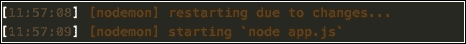
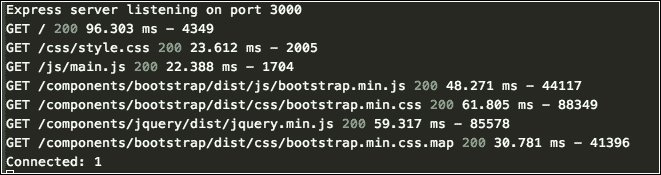
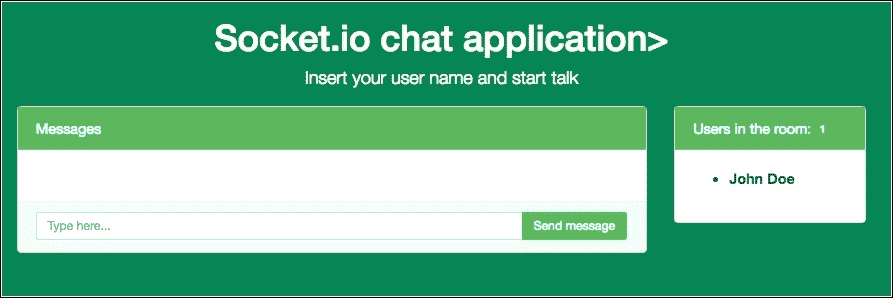
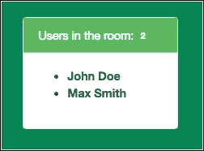
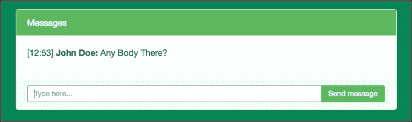

# 第七章。用 Socket.io 构建实时聊天应用程序

不久前，当 Node.js 应用程序出现时，我们有了大量新的可能性，使用 Node.js 资源和 Socket.io 之类的东西来构建实时应用程序(正如网站所说，Socket.io 支持基于事件的双向实时通信。它适用于每个平台、设备或浏览器，同样注重可靠性和速度)。

Socket.io 允许我们在客户机和服务器之间发出事件，以及其他可能性。

在本章中，我们将涵盖以下主题:

*   安装套接字
*   套接字事件的基础
*   创建快速聊天应用程序
*   在客户端处理 jQuery
*   如何在开发中使用 Glow . js 和 LiveReload 插件

# 我们在建造什么

在本章中，我们将使用 Node.js、Socket.io 和 jQuery 构建一个实时聊天应用程序:


主屏幕截图

# 从一个 package.json 文件开始

在本章中，我们采用了一种不同的方式来启动我们的应用程序；正如我们在上一章中看到的，让我们在没有命令行的情况下一步一步地构建一个 Node.js 应用程序。

让我们创建带有应用程序依赖项的 package.json 文件:

1.  创建一个名为章节 07 的文件夹。
2.  Create a file called package.json within chapter-07 and add the following code:

    ```js
          {
            "name": "chapter-07", 
            "description": "Build a real time chat application with
              Node.js and Socket.io", 
            "version": "0.0.1", 
            "private": true, 
            "scripts": { 
              "start": "node app.js" 
            }, 
            "dependencies": { 
              "body-parser": "^1.13.3", 
              "cookie-parser": "^1.3.3", 
              "ejs": "^2.3.1", 
              "express": "^4.13.3", 
              "morgan": "^1.6.1", 
              "serve-favicon": "^2.3.0", 
              "socket.io": "^1.4.6" 
            }, 
            "devDependencies": { 
              "gulp": "^3.9.0", 
              "gulp-nodemon": "^2.0.2", 
              "gulp-livereload": "^3.8.0", 
              "gulp-plumber": "^1.0.0" 
            } 
          }

    ```

    请注意，我们使用的是 Express 框架中相同的推荐模块依赖项。此外，我们还添加了名为 Gaugh . js 的任务运行器。在本章的后面，我们将解释更多关于**Gaugh**的内容。

3.  打开终端/外壳，输入以下命令:

    ```js
    npm install

    ```

4.  创建一个名为 public 的文件夹。
5.  创建一个名为 routes 的文件夹。
6.  创建一个名为"视图"的文件夹。

在此阶段，您的文件夹必须具有以下结构:

```js
chapter-01
   node_modules
   public
   routes
   views
   package.json

```

# 添加配置文件

Dot 文件在所有 web 应用程序中都很常见；这些文件负责各种任务，包括版本控制配置和文本编辑器配置，以及许多其他任务。

让我们为 **Bower 包管理器**添加第一个配置文件(更多信息:[http://bower.io/](http://bower.io/)):

1.  Create a file called .bowerrc and add the following code:

    ```js
          { 
            "directory": "public/components", 
            "json": "bower.json" 
          } 

    ```

    该文件告诉 Bower 在公共/组件上安装所有应用程序组件；否则，它们将安装在根应用程序文件夹中。

2.  Create a file called .editorconfig and add the following code:

    ```js
          # http://editorconfig.org 
          root = true 
          [*] 
          indent_style = tab 
          indent_size = 4 
          end_of_line = lf 
          charset = utf-8 
          trim_trailing_whitespace = true 
          insert_final_newline = true

    ```

    这个文件标准化了整个应用程序的代码缩进类型。有许多编辑器支持这个文件，并为每个应用程序应用它们的定义。

    下一个配置文件是 gitignore。正如它自己的名字所表明的，它用来告诉版本控制哪些应用程序文件应该被忽略。

3.  创建一个名为。gitignore 并添加以下代码:

    ```js
          node_modules/ 
          public/components 
          .sass-cache 
          npm-debug.log 

    ```

# 添加任务管理器文件

任务管理器服务于我们应用程序中的特定任务。在[第 9 章](09.html "Chapter 9.  Building a Frontend Process with Node.js and NPM")、*用 Node.js 和 NPM 构建一个前端进程中，*我们将深入探讨它们在 Node.js 应用程序中的使用，但现在我们将重点放在文件本身:

1.  Create a file called bower.json and add the following lines of code:

    ```js
          { 
            "name": "chapter-07", 
            "version": "0.0.1", 
            "ignore": [ 
              "**/.*", 
              "node_modules", 
              "components" 
            ] 
          } 

    ```

    这是非常简单的代码，但是对于服务器端来说，这个文件与 package.json 具有同样的重要性。鲍尔将担任前端任务经理。在本章的后面，我们将看到如何使用它。下一个是大口文件。

    ### 类型

    你可以在官网找到更多关于大口文件的信息:[http://gulpjs.com/](http://gulpjs.com/)

2.  Create a file called gulpfile.js and add the following code (the code is fully commented and it is self-explanatory):

    ```js
          var gulp = require('gulp'), 
            // Nodemon is Node.js module to reload the application when
              any file change. 
           nodemon = require('gulp-nodemon'), 
           plumber = require('gulp-plumber'), 
           // Live reload is browser plugin to synchronize the
             application after the server side changes 
             livereload = require('gulp-livereload'); 
               gulp.task('develop', function () { 
                 livereload.listen(); 
                 nodemon({ 
                   script: 'app.js', 
                   ext: 'js ejs', 
                   stdout: false 
                 }).on('readable', function () { 
                 this.stdout.on('data', function (chunk) { 
                   if (/^Express server listening on port/.test(chunk))
                   { 
                     livereload.changed(__dirname); 
                   } 
                 }); 
                 this.stdout.pipe(process.stdout); 
                 this.stderr.pipe(process.stderr); 
               }); 
             }); 
             // We can name it all gulp tasks, we have an alias as develop
              to call default task, on high scale applications we can have
              many tasks with or without alias. 
             gulp.task('default', [ 
               'develop' 
             ]);

    ```

    最后一个文件是 README.md 文件。通常，GitHub、Bitbucket 和 NPM 使用这个文件来存储关于项目的重要信息，例如安装过程、依赖关系和代码示例等。

3.  创建一个名为 README.md 的文件，并添加以下代码:

    ```js
          # Node.js chat application with Socket.io 

    ```

非常简单但非常有用的文件。该标记文件将呈现为一个带有 h1 标记的 HTML 文件，该标记以该字符串作为标题。

### 类型

您可以通过以下链接了解更多关于 Markdown 文件的信息:[https://daringfireball.net/projects/markdown/](https://daringfireball.net/projects/markdown/)

# 创建 app.js 文件

正如我们在前面几章中已经看到的，所有 Node.js 应用程序的基础都是我们设置所有依赖项并实例化应用程序的文件。在这种情况下，我们使用 app.js 文件，但是您可以使用任何名称。

创建一个名为 app.js 的文件，并添加以下代码:

```js
      // Node dependencies 
      var express = require('express'); 
      var path = require('path'); 
      var favicon = require('serve-favicon'); 
      var logger = require('morgan'); 
      var cookieParser = require('cookie-parser'); 
      var bodyParser = require('body-parser'); 
      // Setup application routes 
      var routes = require('./routes/index'); 
      // Create a Express application 
      var app = express(); 
      // Defining the env variable process for development 
      var env = process.env.NODE_ENV || 'development'; 
        app.locals.ENV = env; 
        app.locals.ENV_DEVELOPMENT = env == 'development'; 
      // Setup view engine to use EJS (Embedded JavaScript) 
        app.set('views', path.join(__dirname, 'views')); 
        app.set('view engine', 'ejs'); 
      // uncommented this line to use a favicon in your application 
      // app.use(favicon(__dirname + '/public/img/favicon.ico')); 
        app.use(logger('dev')); 
        app.use(bodyParser.json()); 
        app.use(bodyParser.urlencoded({ 
          extended: true 
        })); 
        app.use(cookieParser()); 
        app.use(express.static(path.join(__dirname, 'public'))); 
      // Setup all routes to listen on routes file (this came from
         routes variable) 
        app.use('/', routes); 
      // Setup a  404 error handler 
        app.use(function(req, res, next) { 
          var err = new Error('Not Found'); 
          err.status = 404; 
          next(err); 
        }); 
      // Print the error stacktrace 
        if (app.get('env') === 'development') { 
          app.use(function(err, req, res, next) { 
            res.status(err.status || 500); 
            res.render('error', { 
              message: err.message, 
              error: err, 
              title: 'error' 
            }); 
          }); 
        } 
      // No stacktraces on production 
        app.use(function(err, req, res, next) { 
          res.status(err.status || 500); 
          res.render('error', { 
            message: err.message, 
            error: {}, 
            title: 'error' 
          }); 
        }); 
        module.exports = app; 
        // Exports all the application configuration 
          app.set('port', process.env.PORT || 3000); 
       // Setup the server port and give a user message 
       var server = app.listen(app.get('port'), function() { 
         console.log('Express server listening on port ' +
           server.address().port); 
       }); 

```

前面的代码已被完全注释。理解前面代码所发生的一切所需的所有信息都在注释行中；这里，我们有与前面示例几乎相同的配置。

# 创建路线文件

现在让我们创建路由文件。

在 routes 文件夹中，创建一个名为 index.js 的新文件，并添加以下代码:

```js
    // Import Express and Router 
      var express = require('express'); 
      var router = express.Router(); 
    // Get 
      router.get('/', function(req, res) { 
        res.render('index', { 
          title: 'Socket.io chat application', 
          lead: 'Insert your user name and start talk' 
        }); 
      }); 
      module.exports = router;

```

由于我们正在构建一个简单的聊天应用程序，我们将只有一条路线。

# 创建应用程序视图

我们的下一步是构建应用程序视图文件，因此我们将使用。EJB 扩展。

1.  创建一个名为 error.ejs 的新文件，并添加以下代码:

    ```js
          <% include header %> 
             <div class="container"> 
               <h1><%- error.status %></h1> 
               <h4><%- message %></h4> 
              <p><%- error.stack %></p> 
            </div> 
          <% include footer %> 

    ```

2.  Create a file called footer.ejs and add the following lines of code:

    ```js
          <script src="https://cdn.socket.io/socket.io-1.4.5.js"></script> 
          <script src="js/main.js"></script> 
          </body> 
          </html> 

    ```

    请注意，我们已经包含了来自**内容交付网络** ( **CDN** )的 Socket.io 客户端文件。不用担心 footer.ejs 末尾的 main.js 文件；我们将在接下来的几行中创建这个文件。

3.  创建一个名为 header.ejs 的文件，并添加以下代码行:

    ```js
          <!doctype html> 
          <html lang="en"> 
          <head> 
            <meta charset="UTF-8"> 
            <title><%- title %></title> 
            <meta name="viewport" content="width=device-width,
              initial-scale=1"> 
             <link rel="stylesheet" href="/css/style.css"> 
           </head> 
           <body> 
             <div class="site-wrapper"> 
               <div class="site-wrapper-inner"> 
                 <div class="cover-container"> 
                   <div class="masthead clearfix"> 
                     <div class="inner"> 
                       <h3 class="masthead-brand">
                         Node.js 6 Blueprints Book</h3>
                       <nav class="nav nav-masthead"> 
                         <a  class="active"  href="/">Home</a> 
                       </nav> 
                     </div> 
                   </div>

    ```

4.  Create a file called index.ejs and add the following lines of code:

    ```js
          <% include header %> 
            <div class="inner cover" id="app"> 
              <h1 class="cover-heading"><%- title %>></h1> 
              <p class="lead"><%- lead %></p> 
              <div class="chat-wrapper"> 
                <div id="user-form" class="row"> 
                  <div class="col-md-12"> 
                    <form> 
                      <div class="input-group input-group-lg"> 
                        <input id="username" class="form-control"
                          type="text" placeholder="Your name or
                          nickname..."> 
                        <span class="input-group-btn"> 
                          <input type="submit" class="btn btn-success
                          btn-lg" value="Enter"> 
                        </span> 
                      </div> 
                    </form> 
                  </div> 
                </div> 
                <div id="message-area" class="row" style="display:none"> 
                  <div class="col-xs-9"> 
                    <div class="card card-inverse"> 
                      <div class="card-header card-success"> 
                          Messages 
                      </div> 
                      <div class="card-block" id="chat-block"> 
                        <ul id="chat" class="list-unstyled"> 
                        </ul> 
                      </div> 
                      <div class="card-footer"> 
                        <form id="message-form" autocomplete="off"> 
                          <div class="input-group input-group-sm"> 
                            <input id="message" class="form-control
                             input-sm" type="text" placeholder="Type here...|">
                            <span class="input-group-btn"> 
                            <input type="submit" class="btn btn-success
                             btn-sm" value="Send message"> 
                          </span> 
                          </div> 
                        </form> 
                      </div> 
                    </div> 
                  </div> 
                  <div class="col-xs-3"> 
                    <div class="card card-inverse"> 
                      <div class="card-header card-success"
                        id="online-users-header"> 
                        <span class="card-title">Users in the rooom:</span> 
                      </div> 
                      <div class="card-block" id="online-users-block"> 
                        <ul id="users"></ul> 
                      </div> 
                    </div> 
                  </div> 
                </div> 
              </div>
            </div> 
            <div class="mastfoot"> 
              <div class="inner"> 
                <p>&copy; 2016 <a href="$">Node.js 6 Blueprints Book</a>,
                 by <a href="https://twitter.com/newaeonweb">@newaeonweb
                 </a>
                </p> 
              </div> 
            </div> 
          </div>
          </div> 
          </div> 
          <% include footer %> 

    ```

    注意，我们使用的是关于 **Bootstrap 4** 的示例之一的 HTML 标记。这里可以看到更多的例子:[http://v4-alpha.getbootstrap.com/examples/](http://v4-alpha.getbootstrap.com/examples/)。

# 用凉亭安装前端组件

正如我们在前面的例子中看到的，我们使用一个 CDN 来为示例应用程序提供 CSS 文件和一些 JavaScript 文件。在这一步中，我们将介绍一个广泛使用的依赖关系管理工具，称为 **Bower，**，用于处理前端框架，如 Twitter 自举:

1.  Open your terminal/shell and type the following command:

    ```js
    npm install bower -g

    ```

    前面的命令在您的计算机上全局安装 Bower。

2.  在根项目文件夹中，键入以下命令:

    ```js
    bower install bootstrap#v4.0.0-alpha

    ```

前面的命令将引导安装在公共/组件文件夹中，如下图所示:


组件文件夹的屏幕截图

请注意，前面的命令也添加了 jQuery，因为引导依赖于 jQuery 库。让我们添加到 header.ejs 和 footer.ejs 的链接:

1.  打开 view/header . ejs，添加如下代码:

    ```js
          <link rel="stylesheet" href="components/bootstrap/dist/css
            /bootstrap.min.css">

    ```

2.  打开 footer.ejs，添加如下代码:

    ```js
          <script src="components/jquery/dist/jquery.min.js"></script> 
          <script src="components/bootstrap/dist/js/bootstrap.min.js">
          </script> 

    ```

## 添加一些 CSS

现在让我们插入几行 CSS 来风格化我们的示例页面:

1.  在 public/css 中创建一个名为 style.css 的新文件。
2.  Add the following code to style.css:

    ```js
          a, 
          a:focus, 
          a:hover { 
            color: #fff; 
          } 
          html, 
          body { 
            height: 100%; 
            background-color: #068555; 
          } 
          body { 
            color: #fff; 
          } 
          /* Extra markup and styles for table-esque vertical and
           horizontal centering */ 
          .site-wrapper { 
            display: table; 
            width: 100%; 
            height: 100%; /* For at least Firefox */ 
            min-height: 100%; 
            -webkit-box-shadow: inset 0 0 5rem rgba(0,0,0,.5); 
              box-shadow: inset 0 0 5rem rgba(0,0,0,.5);
          } 
          .site-wrapper-inner { 
            display: table-cell; 
            vertical-align: top; 
          } 
          .cover-container { 
            margin-right: auto; 
            margin-left: auto; 
          } 
          .inner { 
            padding: 2rem; 
          } 
          .card { 
            color: #414141; 
          } 
          .card-block { 
            background-color: #fff; 
          } 
          .masthead { 
            margin-bottom: 2rem; 
          } 
          .masthead-brand { 
            margin-bottom: 0; 
          } 
          .nav-masthead a { 
            padding: .25rem 0; 
            font-weight: bold; 
            color: rgba(255,255,255,.5); 
            background-color: transparent; 
            border-bottom: .25rem solid transparent; 
          } 
          .nav-masthead a:hover, 
          .nav-masthead a:focus { 
            text-decoration: none; 
            border-bottom-color: rgba(255,255,255,.25); 
          } 
          .nav-masthead a + a { 
            margin-left: 1rem; 
          } 
          .nav-masthead .active { 
            color: #fff; 
            border-bottom-color: #fff; 
          } 
          #users { 
            display: block; 
          } 
          @media (min-width: 48em) { 
            .masthead-brand { 
              float: left; 
            } 
            .nav-masthead { 
              float: right; 
            } 
          } 
          .cover { 
            padding: 0 1.5rem; 
          } 
          .cover-heading, .lead { 
            text-align: center; 
          } 
          .cover .btn-lg { 
            padding: .75rem 1.25rem; 
            font-weight: bold; 
          } 
          .mastfoot { 
            color: rgba(255,255,255,.5); 
          } 
          @media (min-width: 40em) { 
            /* Pull out the header and footer */ 
            .masthead { 
              position: fixed; 
              top: 0; 
            } 
            .mastfoot { 
              position: fixed; 
              bottom: 0; 
            } 
            /* Start the vertical centering */ 
            .site-wrapper-inner { 
              vertical-align: middle; 
            } 
            /* Handle the widths */ 
            .masthead, 
            .mastfoot, 
            .cover-container { 
              width: 100%;
            /* Must be percentage or pixels for horizontal alignment */ 
            } 
          } 
          @media (min-width: 62em) { 
            .masthead, 
            .mastfoot, 
            .cover-container { 
              width: 62rem; 
            } 
          }

    ```

    我们对样式表进行了一些修改，以获得我们想要的图书示例的结果。

    在这个阶段，我们有主屏幕。

3.  打开你的终端/外壳，输入以下命令:

    ```js
    gulp 

    ```

4.  Go to http://localhost:3000/, and you will see the following result:

    

    主屏幕截图

## 添加实时重装插件

如前所述，我们将使用插件 livereload。这个插件负责在我们每次更改应用程序文件时更新浏览器。现在让我们看看如何在我们的示例中实现它:

1.  Remember that we created the gulpfile.js file at the beginning of the chapter, so we already have livereload task configured according to the following lines:

    ```js
          gulp.task('develop', function () { 
            livereload.listen(); 
            nodemon({ 
              script: 'app.js', 
              // map every file with .js, .ejs, extension and relaunch
                the application 
              ext: 'js ejs', 
              stdout: false 
            })
            .on('readable', function () { 
              this.stdout.on('data', function (chunk) { 
                if (/^Express server listening on port/.test(chunk)) { 
                  livereload.changed(__dirname); 
                } 
              }); 
              this.stdout.pipe(process.stdout); 
              this.stderr.pipe(process.stderr); 
            }); 
          });

    ```

    ### 类型

    你可以在这里阅读更多关于大口-利弗勒德插件的信息:[https://github.com/vohof/gulp-livereload](https://github.com/vohof/gulp-livereload)。

2.  Open views/header.ejs and add the following code right after the stylesheet link:

    ```js
          <% if (ENV_DEVELOPMENT) { %> 
            <script src="http://localhost:35729/livereload.js"></script> 
          <% } %>

    ```

    这些代码行告诉应用程序在我们使用开发环境时注入 livereload 插件。

3.  Now every time we change a file, we can see the following message on the terminal:

    

    来自终端的截图，带有 livereload 消息

4.  但是请记住，我们将 livereload 任务配置为仅映射。js 和。ejs 文件，正如我们在下面突出显示的代码行中看到的:

    ```js
          livereload.listen(); 
          nodemon({ 
            script: 'app.js', 
            ext: 'js ejs', 
            stdout: false 
          })

    ```

要映射其他文件格式，必须将文件扩展名添加到该行。

## 检查应用程序文件夹结构

一切就绪后，我们现在需要检查应用程序的目录结构。这一次，您的应用程序应该如下图所示:


应用程序结构的截图

### 类型

请记住，您可以在 Packt Publishing 网站([www.packtpub.com](http://www.packtpub.com))以及 GitHub 上的官方图书存储库中下载该书的示例代码。

# 创建套接字 io 事件

现在是在我们的服务器中创建 socket.io 事件问题的时候了。socket.io 允许您发送和接收任何类型数据的事件:

从根文件夹打开 app.js，并在文件末尾添加以下代码行:

```js
    // Starting with socket.io 
    var io = require('socket.io').listen(server); 
    // Create an Array to hold users 
    var userList = []; 
    // Create an Array to hold connections 
    var connections = []; 
    // Start connection listener 
    io.sockets.on('connection', function (socket) { 
      connections.push(socket); 
      console.log("Connected:", connections.length ); 
      // Setup Disconnect user 
      socket.on('disconnect', function (data) { 
        if (socket.username) { 
          userList.splice(userList.indexOf(socket.username), 1); 
          updateUsernames(); 
        } 
        connections.splice(connections.indexOf(socket), 1); 
        console.log("Disconnected:" , connections.length ); 
      }); 
      // Setup new messages 
      socket.on('send message', function (data) { 
        io.sockets.emit('new message', { msg: data, user:
         socket.username }); 
      }); 
      // New User 
      socket.on('new user', function (data, callback) { 
        callback(!!data); 
        socket.username = data; 
        userList.push(socket.username); 
        updateUsernames(); 
      }); 
      function updateUsernames() { 
        io.sockets.emit('get userList', userList); 
      } 
    });

```

## 在客户端添加 socket.io 行为

如前所述，socket.io 处理前面代码中的事件，我们在代码中配置了服务器来发送和接收事件。现在，我们将客户端设置为接收和发送事件。在这一步中，我们将使用 jQuery 库来帮助完成这项任务，因为我们已经在项目中使用了这个库:

1.  在 public/js 文件夹中，创建一个名为 main.js 的新文件。
2.  Place the following code in the main.js file:

    ```js
          (function() { 
             // Grab all HTML elements into variables 
             var socket = io.connect(); 
             var $messageForm = $('#message-form'); 
             var $message = $('#message'); 
             var $chat = $('#chat'); 
             var $messageArea = $('#message-area'); 
             var $userForm = $('#user-form'); 
             var $users = $('#users'); 
             var $onlineUsersHeader = $('#online-users-header'); 
             var $username = $('#username'); 
             // Form submit to send messages 
             $messageForm.submit(function(e) { 
               e.preventDefault(); 
               socket.emit('send message', $message.val()); 
               $message.val(''); 
             }); 
            // When a new message is sent, print username and time to
              interface 
           socket.on('new message', function(data) { 
             var currentHours = new Date().getHours() > 9 ? new
              Date().getHours() : ('0' + new Date().getHours()) 
             var currentMinutes = new Date().getMinutes() > 9 ? new
              Date().getMinutes() : ('0' + new Date().getMinutes()) 
               data.msg ? ( 
                 $chat.append(`<li>[${currentHours}:${currentMinutes}]
                   <strong> ${data.user}: </strong>${data.msg}</li>`) )
                 : alert('Blank message not allow!'); 
               }); 
              // Form submit to username 
              $userForm.submit(function(e) { 
                e.preventDefault(); 
                socket.emit('new user', $username.val(), function(data) { 
                  data ? ( 
                    $userForm.hide(), 
                    $messageArea.show() 
                  ) : alert('Ohps. What's your name!') 
                }); 
                $username.val(''); 
              }); 
              // get all users connected on localhost:3000 and print a list 
              socket.on('get userList', function(data) { 
                var html = ''; 
                for (i = 0; i < data.length; i++) { 
                  html += `<li class="list-item"><strong>${data[i]}
                  </strong></li>`; 
                } 
                $onlineUsersHeader.html(`<span class="card-title">
                  Users in the room: </span><span class="label label-
                  success">${data.length}</span>`); 
                $users.html(html); 
              }); 
            })(); 

    ```

    让我们运行应用程序来检查终端上发生了什么。

3.  打开根项目上的终端/外壳，键入以下命令:

    ```js
    gulp

    ```

您终端上的输出如下:



运行应用程序的输出终端截图

在这里，我们可以看到我们只有一个连接。但是如果我们在一个新的浏览器窗口中，甚至在另一个浏览器中打开 http://localhost:3000/我们可以看到两个连接，以此类推。

# 启动聊天应用程序

现在，我们在两个窗口中同时使用我们的应用程序:

1.  打开你的终端/外壳，输入以下命令:

    ```js
    gulp

    ```

2.  Go to http://localhost:3000/, insert the name **John Doe**, and you will see the following result:

    

    无名氏用户的截图

    我们可以看到这只是一个用户，所以现在让我们用同一个套接字打开另一个连接。使用新窗口或其他浏览器。

3.  Go to http://localhost:3000/ and insert the name, **Max Smith**. You should see the following result on the right-hand panel:

    

    用户面板截图

    现在我们有两个用户。让我们开始谈吧...

4.  On the **John Doe** screen, type this message: **Any Body there?**

    检查 **Max Smith** 屏幕，您将看到来自 **John** 的消息出现，如下图所示:

    

    马克斯·史密斯屏幕聊天截图

5.  Go back to the John Doe screen and check the message and answer it, as we did in the following image:

    

    无名氏屏幕聊天截图

# 总结

在这一章中，我们讨论了 Node.js 实时应用程序的一些非常重要的概念

我们已经看到了如何使用几行 jQuery 在用户之间实时交换消息。此外，我们还讨论了现代网络应用程序开发中的一些非常重要的主题，如与 Bower 的前端依赖关系和使用 livereload 插件的 Glow 任务管理器。

请记住，所有这些工具都可以通过节点包管理器(NPM)在 Node.js 生态系统中获得。

在下一章中，我们将看到如何使用完全用 Node.js 构建的内容管理系统来构建博客应用程序。