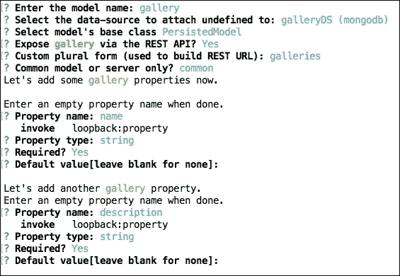
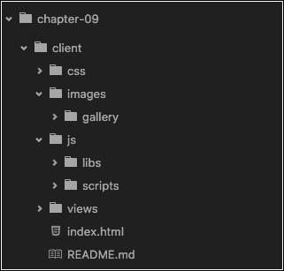

# 第九章。用 Node.js 和 NPM 构建前端流程

正如我们在前面几章中提到的，我们可以使用节点包管理器(NPM)中的工具来替换大口和**咕噜**任务管理器，这是处理前端依赖关系最流行的工具。我们可以将这两种工具结合起来，但是在本章中，我们将只探索 NPM 和一些可以帮助我们创建应用的命令。

我们将创建构建任务来 lint、连接和缩小 Javascript 文件、优化图像、编译 SASS 样式表，并将应用部署到云中的服务器，只需使用命令行即可。此外，对于这个例子，我们将使用 Loopback.io 框架来创建以 MongoDB 为数据库的应用示例。

在本章中，我们将介绍:

*   如何仅使用环回命令行界面创建应用
*   如何安装 eslint、imagemin 和 browserify
*   如何创建任务来消除错误、连接 JS 文件和优化图像
*   如何处理 SASS 导入和编译
*   如何使用 Heroku 工具带将应用部署到 Heroku

# 我们在建造什么

对于这一章，我们将构建一个简单的图库应用，非常类似于[第 04 章](04.html "Chapter 4. Dont Take a Photograph, Make It – An App for Photographers")、*不要拍照，让它成为摄影师的应用，*但这次我们将使用带有 Loopback.io 框架的 Restful API。我们将看到如何使用 NPM 命令行创建构建任务，最终结果将非常类似于下面的截图:


主屏幕

# 创建基线应用

虽然我们已经使用了 Loopback 框架，但我们强烈建议您再次安装它，以确保您的计算机上有最新版本:

```js
 npm install -g loopback

```

在本例中，我们不会对生成的代码进行很多更改，因为我们的重点是创建构建任务，但是我们将使用命令行使用 Loopback 框架的一些有趣特性:

1.  打开终端/外壳，输入以下命令:

    ```js
     slc loopback

    ```

2.  命名应用章节-09。
3.  选择空服务器(空环回应用编程接口，没有任何配置的模型或数据源)，然后按回车键。

现在我们已经创建了应用支架。不要担心终端输出建议的下一个命令，因为我们将在本书的后面讨论这些命令。

### 类型

您可以通过以下链接了解更多关于**环回命令行界面**的信息:[https://docs . strong loop . com/display/public/LB/命令行+参考](https://docs.strongloop.com/display/public/LB/Command-line+reference)。

## 向项目添加数据源

在我们像在[第 06 章](06.html "Chapter 6.  Building a Customer Feedback App with a Restful API and Loopback.io")*那样创建我们的模型之前，我们将首先添加数据源。这是因为我们使用命令行来创建整个项目。这意味着我们不会手动编辑任何文件。*

当我们使用命令行时，一个好的做法是首先创建数据源，而不是应用模型。此过程避免了手动编辑文件以连接模型和数据源应用的需要:

1.  在终端/外壳中，转到章节-09 文件夹并键入以下命令:

    ```js
     slc loopback:datasource

    ```

2.  Fill in the following questions as shown in the following screenshot:

    

    数据源设置

    默认情况下，如果我们在本地主机上使用 MongoDB，我们不需要设置用户和密码。现在不要担心这个，但是稍后我们将看到如何更改这个配置来部署应用。如果需要，您也可以在本地环境中添加用户和密码。

## 创建应用模型

现在让我们创建应用模型；对于这个例子，我们使用两个模型:

1.  Open the terminal/shell inside the chapter-09 folder, and type the following command:

    ```js
     slc loopback:model

    ```

    使用模型名称库。

2.  Fill in the questions as shown in the following screenshot:

    

    图库模型设置

    第二个属性后，**按**进入**** 完成模型创建。

3.  Open the terminal/shell inside the chapter-09 folder, and type the following command:

    ```js
     slc loopback:model

    ```

    使用车型名称自行车。

4.  Fill in the questions as shown in the following screenshot:

    

    自行车模型设置

    第三个属性后，**按**进入**** 完成模型创建。

    ### 类型

    您可以在此链接阅读更多关于模型创建的信息:[https://docs . strong loop . com/display/public/LB/Model+generator](https://docs.strongloop.com/display/public/LB/Model+generator)。

    此时不要担心模型之间的关系，我们将在下一步中看到这一点，只使用命令行。

## 添加应用模型之间的关系

让我们定义模型之间的关系；我们将使用两种类型的关系，它们是:

*   **有很多**:一个画廊可以有很多自行车
*   **下图**:一辆自行车可以有一个画廊

请记住，我们只是想做一些有用的东西，但并不复杂，为了说明 NPM 的建筑过程，请遵循以下步骤:

1.  打开章节-09 文件夹内的终端/外壳，输入以下命令:

    ```js
    slc loopback:relation

    ```

2.  Choose the bike model and fill in the questions as shown:

    

    自行车模型关系

3.  Choose the gallery model and fill in the questions with the following information:

    

    图库模型关系

    所以让我们检查一下是否一切都写得很好。

4.  打开 common/models/gallery.json 文件，会看到如下高亮显示的代码:

    ```js
        { 
          "name": "gallery", 
          "plural": "galleries", 
          "base": "PersistedModel", 
          "idInjection": true, 
          "options": { 
            "validateUpsert": true 
          }, 
          "properties": { 
              ... 
          }, 
          "validations": [], 
          "relations": { 
            "bikes": { 
              "type": "hasMany", 
              "model": "bike", 
              "foreignKey": ""
    } 
          }, 
          "acls": [], 
          "methods": {} 
        } 

    ```

5.  打开 common/models/bike.json 文件，会看到如下高亮显示的代码:

    ```js
        { 
          "name": "bike", 
          "base": "PersistedModel", 
          "idInjection": true, 
          "options": { 
            "validateUpsert": true 
          }, 
          "properties": { 
            ... 
          }, 
          "validations": [], 
          "relations": { 
            "gallery": { 
              "type": "belongsTo", 
              "model": "gallery", 
              "foreignKey": "" 
            } 
          }, 
          "acls": [], 
          "methods": {} 
        } 

    ```

### 类型

你可以在这个链接找到更多关于**关系生成器**的信息:[https://docs . strong loop . com/display/public/LB/Relation+生成器](https://docs.strongloop.com/display/public/LB/Relation+generator)。

仅使用三个命令，我们就成功地为示例应用创建了基础。下一步是在客户端的文件夹中创建一个静态网站。

## 设置静态站点

正如我们在[第 06 章](06.html "Chapter 6.  Building a Customer Feedback App with a Restful API and Loopback.io")、*中所做的那样，使用 Restful API 和 Loopback 构建一个客户反馈应用。io* 让我们将客户端文件夹设置为一个静态站点:

1.  将 server/boot/root.js 文件重命名为 server/boot/_root.js。
2.  在 server/中间件. json 中添加以下高亮显示的行:

    ```js
          { 
            "initial:before": { 
              "loopback#favicon": {} 
          }, 
            "initial": { 
              "compression": {}, 
              "cors": { 
                "params": { 
                  "origin": true, 
                  "credentials": true, 
                  "maxAge": 86400 
                } 
              }, 
              "helmet#xssFilter": {}, 
              "helmet#frameguard": { 
                "params": [ 
                  "deny" 
                ] 
              }, 
              "helmet#hsts": { 
                "params": { 
                  "maxAge": 0, 
                  "includeSubdomains": true 
                } 
              }, 
              "helmet#hidePoweredBy": {}, 
              "helmet#ieNoOpen": {}, 
              "helmet#noSniff": {}, 
              "helmet#noCache": { 
                "enabled": false 
              } 
            }, 
            "session": {}, 
            "auth": {}, 
            "parse": {}, 
            "routes": { 
              "loopback#rest": { 
                "paths": [ 
                  "${restApiRoot}" 
                ] 
              } 
            }, 
            "files": { 
              "loopback#static": { 
                "params": "$!../client" 
              } 
            }, 
            "final": { 
              "loopback#urlNotFound": {} 
            }, 
            "final:after": { 
              "loopback#errorHandler": {} 
            } 
          }

    ```

3.  Inside the ./client folder, create a new file called index.html and add the following content:

    ```js
          <!DOCTYPE html> 
          <html> 
            <head><title>Bikes Gallery</title></head> 
            <body> 
              <h1>Hello Node 6 Blueprints!</h1> 
            </body> 
          </html> 

    ```

    现在是时候检查之前的更改，并在浏览器中查看最终结果了。

4.  打开终端/外壳，输入以下命令:

    ```js
     npm start

    ```

5.  Open your favorite browser and go to http://localhost:3000/.

    你应该看到**你好节点 6 蓝图！**消息。

我们在 http://localhost:3000/API/bicks 和 http://localhost:3000/API/gallery 也有 Restful API。

现在，我们将看到如何使用 NPM 构建任务来重组一些目录，以准备在云中部署应用。

# 重构应用文件夹

我们的重构过程包括两个步骤。

首先，让我们为应用源文件创建一个目录，例如 JavaScript、SCSS 和图像文件。

在第二步中，我们将在客户端文件夹中创建一些目录来接收我们的脚本。

让我们为图像、libs、脚本和 scss 文件创建源文件夹。

## 创建图像文件夹

在这个文件夹中，我们将在使用 imagemin-cli 处理优化技术之前存储图像。

1.  在根项目中，创建一个名为 src 的文件夹。
2.  在 src 文件夹中，创建一个名为 images 的文件夹。
3.  在 images 文件夹中，创建一个名为 gallery 的文件夹。
4.  从 Packt 网站([www.packtpub.com](http://www.packtpub.com))或 GitHub 上的官方书籍库中下载[第 09 章](09.html "Chapter 9.  Building a Frontend Process with Node.js and NPM")、*用 Node.js 和 NPM* 构建前端流程的示例图片文件，并将图片粘贴到图库文件夹中。

### 类型

您可以通过以下链接了解更多关于 imagemin cli 的信息:[https://github.com/imagemin/imagemin-cli](https://github.com/imagemin/imagemin-cli)。

## 创建库文件夹

库文件夹将存储一些 jQuery 插件。在 src 文件夹中，创建一个名为 libs 的文件夹。

## 创建脚本文件夹

当我们使用 jQuery 和一些插件时，我们需要编写一些代码来使用 jQuery libs 我们将使用这个文件夹:

1.  在 src 文件夹中，创建一个名为 scripts 的文件夹。
2.  在 src/scripts 文件夹中，创建一个名为 gallery.js 的文件，并添加以下代码:

    ```js
          (function (){ 
              'use-strict' 
             //jQuery fancybox activation 
             $('.fancybox').fancybox({ 
                  padding : 0, 
                 openEffect  : 'elastic' 
             }); 
          })(); 

    ```

在这个例子中，我们只使用一个插件，但是在大型应用中，使用几个插件是非常常见的；在这种情况下，每个特性都有一个文件。

然后，为了提高应用的性能，我们建议将所有脚本连接到一个文件中。

## 创建 SASS 文件夹

SASS 文件夹将存储 scss 文件。我们正在使用 Bootstrap 框架，对于这个例子，我们将使用 SASS 分离版本来设置 Bootstrap 框架；现在不要担心这个，因为在本章的后面我们将看到如何获取这些文件:

1.  在 src 文件夹中，创建一个名为 SCS 的文件夹。
2.  在 scss 文件夹中，创建一个名为 vendor 的文件夹。

## 安装凉亭

正如我们在前面几章中看到的，我们将使用 Bower 来管理前端依赖关系:

1.  打开终端/外壳，输入以下命令:

    ```js
    npm install bower -g

    ```

2.  创建一个名为。并将其保存在根文件夹中。
3.  将以下内容添加到。bowerrc 文件:

    ```js
          { 
            "directory": "src/components", 
            "json": "bower.json" 
          }

    ```

4.  打开终端/外壳，输入以下命令:

    ```js
     bower init

    ```

5.  Fill in the questions as shown in the following screenshot:

    

    Bower.json 设置

## 安装应用依赖项

在这个例子中，我们只使用了一个 jQuery 插件加上引导框架，所以让我们首先使用 Bower CLI 安装引导:

1.  Open the terminal/shell and type the following command:

    ```js
    bower install bootstrap#v4.0.0-alpha --save

    ```

    只需打开 src/components 文件夹来检查 Bootstrap 和 jQuery 文件夹。

2.  Now we will install the jQuery fancybox plugin in the images gallery. Open the terminal/shell and type the following command:

    ```js
     bower install fancybox --save

    ```

    因此，src 文件夹此时将具有以下结构:

    *   components/
        *   bootstrap/
        *   fancybox/
        *   jquery/

## 创建 scss 文件夹结构

现在让我们设置 scss 文件夹来编译 bootstrap.scss 文件:

1.  打开 src/组件/引导文件夹，从 SCSS 文件夹复制所有内容。
2.  将内容粘贴到 src/scss/供应商文件夹中。
3.  在 src/文件夹内创建一个名为 main.scss 的文件，并添加以下内容:

    ```js
          // Project Style 

          // Import Botstrap 
          @import "vendor/bootstrap"; 

          // 
          body { 
            padding-top: 5rem; 
          } 
          .starter-template { 
            padding: 3rem 1.5rem; 
            text-align: center; 
            @include clearfix 
          } 

    ```

许多开发人员不这样使用 Bootstrap 框架，有些人只是在他们的项目中使用 bootstrap.css 或 bootstrap.min.css 文件。这是可以的，但是当我们以这里所示的方式使用框架时，我们可以在自己的样式表中使用框架的所有资源，因此我们可以在样式表中使用所有的 mixins 和变量。

例如，突出显示的代码来自 Bootstrap mixins，我们可以将其应用到自己的样式表中:

```js
      .starter-template { 
        padding: 3rem 1.5rem; 
        text-align: center; 
        @include clearfix 
      } 

```

### 类型

您可以在此链接阅读更多关于 SASS 的信息:[http://sass-lang.com/](http://sass-lang.com/)。

# 重构客户端文件夹

对于任何带有文件夹来存储 CSS、JavaScript 和图像文件的 web 应用来说，客户端文件夹都有一个非常基本的结构。

对于这个例子，我们将使用最新稳定版本的 AngularJS 来创建我们应用的页面:

1.  在客户端文件夹中，创建以下文件夹:
    *   css/
    *   图像/图库/
    *   js/
    *   联署材料/libs/
    *   js/脚本/
    *   观点/

创建所有这些文件夹后，客户端目录将如下图所示:



客户端文件夹结构

## 添加应用视图

现在是创建应用视图文件夹来存储所有应用模板的时候了:

1.  在客户端/src 文件夹中，创建一个名为 home.html 的新文件，并添加以下代码:

    ```js
          <div class="col-md-6" ng-repeat="item in vm.listProducts"> 
            <div class="card" > 
               
              <div class="card-block"> 
                <h4 class="card-title">{{ item.name }}</h4> 
                <p class="card-text">{{ item.description }}</p> 
                <a ui-sref="galleries({itemId:item.id})" class="btn 
                 btn-secondary">View Gallery</a> 
              </div> 
            </div> 
          </div> 
          </div> 

    ```

2.  在客户端/src 文件夹中，创建一个名为 galleries.html 的新文件，并添加以下代码:

    ```js
          <div class="row"> 
            <div class="col-md-4" ng-repeat="item in vm.listProducts"> 
              <div class="card" > 
                <a href="{{ item.image }}" class="fancybox" rel="gallery"
                 > 
                 
                </a> 
                <div class="card-block"> 
                  <h4 class="card-title">{{ item.name }}</h4> 
                  <p class="card-text">{{ item.model }} - {{ item.category }}
                  </p> 
                </div> 
              </div> 
            </div> 
          </div> 

    ```

3.  打开客户端/index.html 文件，用以下内容替换代码:

    ```js
          <!DOCTYPE html> 
          <html ng-app="bikesGallery"> 
            <head><title>Bikes Gallery</title></head> 
              <link rel="stylesheet" href="css/main.css"> 
              <link rel="stylesheet" href="components/fancybox/source
               /jquery.fancybox.css"> 
            <body> 
              <nav class="navbar navbar-fixed-top navbar-dark bg-inverse"> 
                <div class="container"> 
                  <a class="navbar-brand" href="#">Chapter 09</a> 
                    <ul class="nav navbar-nav"> 
                      <li class="nav-item active"><a class="nav-link" href="/">
                       Home <span class="sr-only">(current)</span></a>
                      </li> 
                    </ul> 
                </div> 
              </nav> 

            <div class="container"> 
              <div id="title"> 
                <div class="starter-template"> 
                  <h1>Image Gallery</h1> 
                    <p class="lead">Select a Gallery.</p> 
                 </div> 
              </div> 
            <div class="" ui-view> 

          </div> 
          </div> 
          </div> 

          <!-- Scripts at bottom --> 
          <script src='js/libs/jquery.min.js'></script> 
          <script src="js/libs/angular.js"></script> 
          <script src="js/libs/angular-resource.js"></script> 
          <script src="js/libs/angular-ui-router.js"></script> 
          <script src="js/app.js"></script> 
          <script src="js/app.config.js"></script> 
          <script src="js/app.routes.js"></script> 
          <script src="js/services.js"></script> 
          <script src="js/controllers.js"></script> 
          <script src="js/libs/libs.js"></script> 
          <script src="js/scripts/scripts.js"></script> 

          </body> 
          </html>

    ```

## 安装 AngularJS 文件

现在是时候安装 AngularJS 文件并创建应用了。在这个例子中，我们将在这一节的后面探讨 Loopback 框架中的 AngularJS SDK 为此，我们选择使用 AngularJS 来构建前端应用:

1.  打开终端/外壳，输入以下命令:

    ```js
    bower install angularjs#1.5.0 --save

    ```

2.  打开终端/外壳，输入以下命令:

    ```js
    bower install angular-resource#1.5.0 --save

    ```

3.  打开终端/外壳，输入以下命令:

    ```js
    bower install angular-ui-router --save

    ```

### 类型

你可以在这个链接上阅读更多关于安古拉杰的信息:[https://docs.angularjs.org/api](https://docs.angularjs.org/api)。

# 创建 AngularJS 应用

最后，我们将创建 AngularJS 应用，因此请遵循以下步骤:

1.  Inside the client/js folder, create a new file called app.js and add the following code:

    ```js
         (function(){ 
              'use strict'; 

              angular 
              .module('bikesGallery', ['ui.router','lbServices']); 

          })();

    ```

    此时不要担心 lbServices 依赖关系；在本章的后面，我们将看到如何使用用 Loopback 框架构建的 AngularJS SDK 工具来创建这个文件。

2.  在客户端/js 文件夹中，创建一个名为 app.config.js 的新文件，并添加以下代码:

    ```js
          (function(){ 
              'use strict'; 

              angular 
               .module('bikesGallery') 
               .config(configure) 
                .run(runBlock); 

              configure.$inject = ['$urlRouterProvider', '$httpProvider', 
                                  '$locationProvider']; 

              function configure($urlRouterProvider, $httpProvider, 
                                $locationProvider) { 

                $locationProvider.hashPrefix('!'); 
                // This is required for Browser Sync to work poperly 
                $httpProvider.defaults.withCredentials = true; 
                $httpProvider.defaults.headers.common['X-Requested-With']
                  = 'XMLHttpRequest'; 
                $urlRouterProvider 
                .otherwise('/'); 
              } 
              runBlock.$inject = ['$rootScope', '$state', '$stateParams']; 
              function runBlock($rootScope, $state, $stateParams ) { 
                $rootScope.$state = $state; 
                $rootScope.$stateParams = $stateParams; 
              } 
          })();

    ```

3.  在客户端/js 文件夹中，创建一个名为 app.routes.js 的新文件，并添加以下代码:

    ```js
          (function(){ 
            'use strict'; 

              angular 
               .module('bikesGallery') 
               .config(routes); 

              routes.$inject = ['$stateProvider']; 
              function routes($stateProvider) { 
                $stateProvider 
                .state('home', { 
                    url:'/', 
                    templateUrl: 'views/home.html', 
                    controller: 'HomeController', 
                    controllerAs: 'vm' 
                }) 
                .state('galleries', { 
                    url:'/galleries/{itemId}/bikes', 
                    templateUrl: 'views/galleries.html', 
                    controller: 'GalleryController', 
                    controllerAs: 'vm' 
                }); 
              } 
          })();

    ```

4.  在 client/js 文件夹中，创建一个名为 controllers.js 的新文件，并添加以下代码:

    ```js
          (function(){ 
            'use strict'; 

              angular 
                .module('bikesGallery') 
                .controller('GalleryController', GalleryController) 
                .controller('HomeController', HomeController); 

              HomeController.$inject = ['Gallery']; 
              function HomeController(Gallery) { 
                var vm = this; 
                vm.listProducts = Gallery.find(); 
                //console.log(vm.listProducts); 
              } 

              GalleryController.$inject = ['Gallery', '$stateParams']; 
              function GalleryController(Gallery, $stateParams) { 
                var vm = this; 
                var itemId = $stateParams.itemId; 
                //console.log(itemId); 
                vm.listProducts = Gallery.bikes({ 
                  id: itemId 
              }); 
              //console.log(vm.listProducts); 
              } 
          })();

    ```

## 使用 Loopback 的 AngularJS SDK

我们将使用 Loopback 框架中内置的 AngularJS SDK 来自动生成所有应用服务:

1.  Open the terminal/shell and type the following command:

    ```js
    lb-ng ./server/server.js ./client/js/services.js

    ```

    前面的命令将在客户机/js 文件夹中创建一个名为 services.js 的文件，其中包含所有方法(创建、读取、更新和删除)以及由 Loopback 框架创建的 Restful API 中的更多可用方法。

    ### 类型

    您可以通过在根项目文件夹的终端/shell 中运行 npm start 命令来检查本地 API。该 API 将在 http://0.0.0.0:3000/explorer 上提供。

2.  lbServices 部分有以下 CRUD 方法和许多其他方法:

    ```js
          "create": { 
            url: urlBase + "/galleries", 
            method: "POST" 
          }, 
          "upsert": { 
            url: urlBase + "/galleries", 
            method: "PUT" 
          }, 
          "find": { 
            isArray: true, 
            url: urlBase + "/galleries", 
            method: "GET" 
          }, 
          "deleteById": { 
            url: urlBase + "/galleries/:id", 
            method: "DELETE" 
          },

    ```

3.  To use one of these methods, we just need to inject the factory into the Angular controller as the following highlighted code:

    ```js
          GalleryController.$inject = ['Gallery', '$stateParams']; 
          function GalleryController(Gallery, $stateParams) { 
            ... 
          } 

    ```

    然后我们可以使用控制器内部的方法，如下例所示:

    ```js
          Gallery.create(); 
          Gallery.find(); 
          Gallery.upsert({ id: itemId }); 
          Gallery.delete({ id: itemId }); 

    ```

这是一个简单且非常有用的服务，用于处理在我们的应用中为我们拥有的所有模型创建的所有端点。

应用的第一部分已经几乎完成，但是我们仍然需要添加一些内容来使它更加令人愉快。

让我们创建一些内容。如前所述，您可以从 Packt 网站([www.packtpub.com](http://www.packtpub.com))或直接从该书的 GitHub 存储库中下载该书的整个示例代码。

# 向应用添加内容

您可以通过两种方式添加内容，第一种是使用应用创建的端点，第二种是使用迁移文件。

在下面几行中，我们将展示如何使用第二个选项；创建迁移文件可能是一个简单而有趣的过程:

1.  在服务器/引导/文件夹内，创建一个名为 create-sample-models.js 的文件，并添加以下内容来创建**图库模型**的迁移文件:

    ```js
          module.exports = function(app) { 
            // automigrate for models, everytime the app will running,
             db will be replaced with this data. 

            app.dataSources.galleryDS.automigrate('gallery', function(err)
            { 
              if (err) throw err; 
               // Simple function to create content 
              app.models.Gallery.create( 
                [ 
                  { 
                    "name":"Bikes", 
                    "image": "img/gallery/sample-moto-gallery.jpg", 
                    "link": "bikes.html", 
                    "description":"Old and Classic Motorcycles", 
                    "id":"5755d253b4aa192e41a6be0f" 
                  },{ 
                      "name":"Cars", 
                      "image": "img/gallery/sample-car-gallery.jpg", 
                      "link": "cars.html", 
                      "description":"Old and Classic Cars", 
                      "id":"5755d261b4aa192e41a6be10" 
                    } 
                ],
                function(err, galleries) { 
                  if (err) throw err; 
                  // Show a success msg on terminal 
                  console.log('Created Motorcycle Gallery Model: \n',
                   galleries); 
                }); 
              }); 

    ```

2.  Inside the server/boot/ folder, add the following content to create a migration file for **Bike Model**:

    ```js
          app.dataSources.galleryDS.automigrate('bike', function(err) { 
            if (err) throw err; 
             // Simple function to create content 
            app.models.Bike.create( 
                [ 
                    { 
                      "name":"Harley Davidson", 
                      "image": "img/gallery/sample-moto1.jpg", 
                      "model":"Knucklehead", 
                      "category":"Custom Classic Vintage", 
                      "id":"5755d3afb4aa192e41a6be11", 
                      "galleryId":"5755d253b4aa192e41a6be0f" 
                    },{ 
                        "name":"Harley Davidson", 
                        "image": "img/gallery/sample-moto2.jpg", 
                        "model":"Rare Classic", 
                        "category":"Custom Classic Vintage", 
                        "id":"5755d3e8b4aa192e41a6be12", 
                        "galleryId":"5755d253b4aa192e41a6be0f" 
                    },{ 
                        "name":"Old Unknown Custom Bike", 
                        "image": "img/gallery/sample-moto3.jpg", 
                        "model":"Custom", 
                        "category":"Chopper", 
                        "id":"5755d431b4aa192e41a6be13", 
                        "galleryId":"5755d253b4aa192e41a6be0f" 
                    },{ 
                        "name":"Shadow Macchit", 
                        "image": "img/gallery/sample-car1.jpg", 
                        "model":"Classic", 
                        "category":"Old Vintage", 
                        "id":"5755d43eb4aa192e41a6be14", 
                        "galleryId":"5755d261b4aa192e41a6be10" 
                    },{ 
                        "name":"Buicks", 
                        "image": "img/gallery/sample-car2.jpg", 
                        "model":"Classic", 
                        "category":"Classic", 
                        "id":"5755d476b4aa192e41a6be15", 
                        "galleryId":"5755d261b4aa192e41a6be10" 
                    },{ 
                        "name":"Ford", 
                        "image": "img/gallery/sample-car3.jpg", 
                        "model":"Corsa", 
                        "category":"Hatch", 
                        "id":"5755d485b4aa192e41a6be16", 
                        "galleryId":"5755d261b4aa192e41a6be10" 
                    } 

                   ], function(err, bikes) { 
                        if (err) throw err; 
                         // Show a success msg on terminal 
                        console.log('Created Bike Model: \n', bikes); 
                     }); 
                   }); 
          };

    ```

    ### 类型

    第一次部署到 **Heroku** 后别忘了删除这个文件。

# 创建建筑任务

现在是时候只使用 NPM 来创建我们的任务了。

在我们开始之前，重要的是要记住，NPM 有两个直接调用的特殊命令，start 和 test。因此，我们将使用 run 命令来运行我们创建的所有其他任务。

本部分的目标是:

*   将一些文件从源目录复制到客户端目录
*   验证 JavaScript 文件中的错误
*   从 src/SCS 编译 SASS 文件，并将它们保存在客户端/css 文件夹中
*   优化从 src/图像/图库到客户端/图像/图库的图像
*   将 JavaScript 文件从 src/脚本连接到客户端/js/脚本

## 安装依赖项

为了完成这些任务，我们需要安装一些命令行界面(CLI)工具:

1.  Open the terminal/shell and type the following commands:

    ```js
     npm install copy-cli --save-dev
     npm install -g eslint
     npm install eslint --save-dev
     npm install -g node-sass
     npm install browserify --save-dev
     npm intall -g imagemin-cli
     npm install -g imagemin

    ```

    在这个例子中，我们的目的是展示如何使用构建工具，所以我们不会对每一个工具进行深入研究。

    但是在我们继续之前，让我们设置 JavaScript 验证器 eslint。

    ### 类型

    您可以在此链接阅读更多关于 eslint 的信息:[http://eslint.org/](http://eslint.org/)。

2.  Inside the root project, create a file called .eslintrc.json and add the following code:

    ```js
          { 
            "env": { 
              "browser": true 
            }, 
            "globals": { 
              "angular": 1, 
              "module": 1, 
              "exports": 1 
            }, 
            "extends": "eslint:recommended", 
            "rules": { 
              "linebreak-style": [ 
                "error", 
                "unix" 
              ], 
              "no-mixed-spaces-and-tabs": 0, 
              "quotes": 0, 
              "semi": 0, 
              "comma-dangle": 1, 
              "no-console": 0 
            } 
          } 

    ```

    ### 类型

    你可以在 http://eslint.org/docs/rules/阅读更多关于 Eslint 规则的信息。

## 创建复制任务

我们将在将每个任务插入我们的 package.json 文件之前创建它；这样更容易理解每一个的程序。

复制任务如下:

*   复制 jQuery 文件
*   复制 AngularJS 主库
*   复制 AngularJS 资源库
*   复制 AngularJS ui-路由器库

因此，我们需要将这些文件(jQuery 和 AngularJS)从源文件夹复制到客户端文件夹:

```js
"copy-jquery": "copy ./src/components/jquery/dist/jquery.js > 
  ./client/js/libs/jquery.js", 
"copy-angular": "copy ./src/components/angular/angular.js > 
  ./client/js/libs/angular.js", 
"copy-angular-resource": "copy ./src/components/angular-resource/angular-resource.js > 
  ./client/js/libs/angular-resource.js", 
"copy-angular-ui-router": "copy ./src/components/angular-ui-router/release/angular-ui-router.js > 
  ./client/js/libs/angular-ui-router.js", 

```

最后一个复制任务将执行所有其他复制任务:

```js
"copy-angular-files": "npm run copy-angular && npm run copy-angular-resource && npm run copy-angular-ui-router", 

```

暂时不用担心运行复制任务；在本章的后面，我们将在部署之前逐一执行它们。

## 创建 SASS 任务

SASS 任务将非常简单，我们只需编译 scss 文件并将它们插入客户机/css 文件夹:

```js
"build-css": "node-sass --include-path scss src/scss/main.scss   client/css/main.css", 

```

## 创建林挺任务

我们将使用. eslintrc.json 配置来应用于客户机/js 文件夹中的所有 JavaScript 文件:

```js
"lint-js": "eslint client/js/*.js --no-ignore", 

```

## 创建图像优化任务

出于性能原因，任何 web 应用的另一个重要任务是优化所有图像文件:

```js
"imagemin": "imagemin src/img/gallery/* --o client/img/gallery", 

```

## 创建连接任务

concat 任务将连接 libs 和脚本中的所有脚本文件:

```js
"concat-js-plugins": "browserify src/libs/*.js -o client/js/libs/libs.js", 
"concat-js-scripts": "browserify src/scripts/*.js -o client/js/scripts/scripts.js", 

```

最后一个 concat 任务执行所有其他的 concat 任务:

```js
"prepare-js": "npm run concat-js-plugins && npm run concat-js-scripts" 

```

## 创建构建任务

构建任务只是单个任务中前面每个步骤的执行:

```js
"build": "npm run lint-js && npm run copy-angular-files && npm run build-css && npm run prepare-js && npm run imagemin" 

```

现在让我们将所有任务添加到 package.json 文件中。打开 package.json 文件并添加以下突出显示的代码:

```js
  { 
    "name": "chapter-09", 
    "version": "1.0.0", 
    "main": "server/server.js", 
    "scripts": { 
      "start": "node .", 
      "pretest": "eslint .", 
      "posttest": "nsp check", 
      "copy-jquery": "copy ./src/components/jquery/dist/jquery.js > 
        ./client/js/libs/jquery.js", 
      "copy-angular": "copy ./src/components/angular/angular.js >
        ./client/js/libs/angular.js", 
      "copy-angular-resource": "copy ./src/components/angular-resource
      /angular-resource.js >
        ./client/js/libs/angular-resource.js", 
      "copy-angular-ui-router": "copy ./src/components/angular-ui-router
      /release/angular-ui-router.js >
        ./client/js/libs/angular-ui-router.js", 
      "copy-angular-files": "npm run copy-angular && npm run copy-angular-
      resource && npm run copy-angular-ui-router", 
      "build-css": "node-sass --include-path scss src/scss/main.scss 
      client/css/main.css", "lint-js": "eslint client/js/*.js --no-ignore",
      "imagemin": "imagemin src/img/gallery/* --o client/img/gallery", 
      "concat-angular-js": "browserify ./src/libs/angular.js ./src/libs/
      angular-resource.js ./src/libs/angular-ui-router.js > client/js
      /libs/libs.js", "concat-js-plugins": "browserify src/libs/*.js -o 
      client/js/libs/libs.js", "concat-js-scripts": "browserify 
      src/scripts/*.js -o client/js/scripts/scripts.js", "prepare-js": 
      "npm run concat-js-plugins && npm run concat-js-scripts", "build":
      "npm run lint-js && npm run copy-angular-files && npm run build-css && 
      npm run prepare-js && npm run imagemin" 
    }, 
    "dependencies": { 
         ... 
    }, 
    "devDependencies": { 
         ... 
    }, 
    "repository": { 
         ... 
    }, 
    "license": "MIT", 
    "description": "chapter-09", 
    "engines": { 
      "node": "5.0.x" 
    } 
  } 

```

# 使用带有单独命令的任务

正如我们之前提到的，我们可以执行我们单独创建的每个任务。

例如，为了优化图像文件，我们只能运行 imagemin 任务。只需打开终端/外壳并键入以下命令:

```js
 npm run imagemin

```

终端上的输出如下:

```js
 8 images minified

```

我们可以为每个任务做同样的事情。

# 部署到英雄云

部署我们应用的第一步是在 **Heroku 云服务**上创建一个免费账号:

1.  前往[https://signup.heroku.com/](https://signup.heroku.com/)创建一个免费账户。
2.  在[https://toolbelt.heroku.com/](https://toolbelt.heroku.com/)为你的平台下载**英雄腰带**。
3.  Follow the installation process for your platform.

    现在你必须在你的机器上安装 Heroku 工具带来测试它。

4.  打开终端/外壳，输入以下命令:

    ```js
     heroku --help

    ```

终端输出列出了所有可能与 **Heroku CLI** 相关的事情。

### 类型

这本书假设你已经在你的机器上安装了 git 源代码管理；如果你还没有，看看这个页面:[https://git-scm.com/downloads](https://git-scm.com/downloads)。

## 创建 Heroku 应用

现在，我们将创建一个应用，并将其发送到您新创建的 Heroku 帐户:

1.  创建一个名为。Procfile 并将其保存在根项目文件夹中。
2.  将以下代码粘贴到。Procfile 文件:

    ```js
          web: slc run 

    ```

3.  Open the terminal/shell and type the following command:

    ```js
     git init

    ```

    前面的命令初始化了一个 git 存储库。

4.  git add 命令将所有文件添加到版本跟踪中:

    ```js
     git add

    ```

5.  The git commit command send all files to version control on your local machine.

    ```js
     git commit -m "initial commit"

    ```

    现在是时候登录到你的 Heroku 帐户，并将所有项目文件发送到 Heroku git 源代码管理。

6.  Open the terminal/shell and type the following command:

    ```js
     heroku login

    ```

    输入您的用户名和密码。

7.  打开终端/外壳，输入以下命令:

    ```js
    heroku apps:create --buildpack https://github.com/strongloop
         /strongloop-buildpacks.git

    ```

前面的命令将使用 strongloop-buildpacks 来配置和部署 Loopback 应用。

## 创建 deploy.sh 文件

最后，我们将使用. sh 文件创建部署任务:

1.  在根文件夹中创建一个名为 bin 的文件夹。
2.  在 bin 文件夹中，创建一个名为 deploy.sh 的文件。
3.  将以下代码添加到 bin/deploy.sh 文件中:

    ```js
          #!/bin/bash 

          set -o errexit # Exit on error 

          npm run build # Generate the bundled Javascript and CSS 

          git push heroku master # Deploy to Heroku 

    ```

4.  Add the following lines of code at the end of all tasks in the package.json file:

    ```js
          "scripts": {
            ... 
            "deploy": "./bin/deploy.sh" 
          }
    ```

    现在，每次您提交一些更改并键入 npm run deploy 命令时，引擎都会启动 deploy.sh 文件，并将所有提交的更改上传到 Heroku 云服务。

5.  打开终端/外壳，输入以下命令:

    ```js
     npm run deploy

    ```

6.  如果您面临权限错误，请执行以下操作。打开 bin 文件夹内的终端/外壳，输入以下命令:

    ```js
     chmod 755 deploy.sh

    ```

默认情况下，Heroku 云服务将为您的应用创建一个 URL，如下所示:

https://some-name-1234.herokuapp.com/.

在终端输出的最后，你会看到一些非常类似于下面的行:

```js
remote: -----> Discovering process types
remote:        Procfile declares types -> web
remote:
remote: -----> Compressing...
remote:        Done: 79.7M
remote: -----> Launching...
remote:        Released v13
remote:        https://yourURL-some-23873.herokuapp.com/
                   deployed to Heroku
remote:
remote: Verifying deploy... done.
To https://git.heroku.com/yourURL-some-23873.git

```

最终结果将是我们部署到 Heroku 云服务的示例应用。

刚到 https://yourURL-some-23873.herokuapp.com/，你会看到以下结果:


Heroku 云服务的应用

当您单击自行车视图图库按钮时，您将看到自行车图库，如下所示:


自行车馆

另外，当你点击每辆自行车时，你会看到 fancybox 插件在运行。

# 总结

在本章中，我们将进一步探讨 Loopback 框架及其命令行界面。

此外，我们已经看到了如何使用 Loopback AngularJS SDK 配置 AngularJS 应用，为应用的每个端点创建所有服务。

然后，我们探索了使用 NPM 作为单一构建工具的设施。

我们还讨论了如何在 Heroku 上创建和设置一个帐户，以及如何通过集成三种不同的工具(Loopback、Git 和 Heroku 工具带)来自动部署我们的应用。

在下一章中，我们将看到如何使用容器的概念来运行 Node.js 应用。