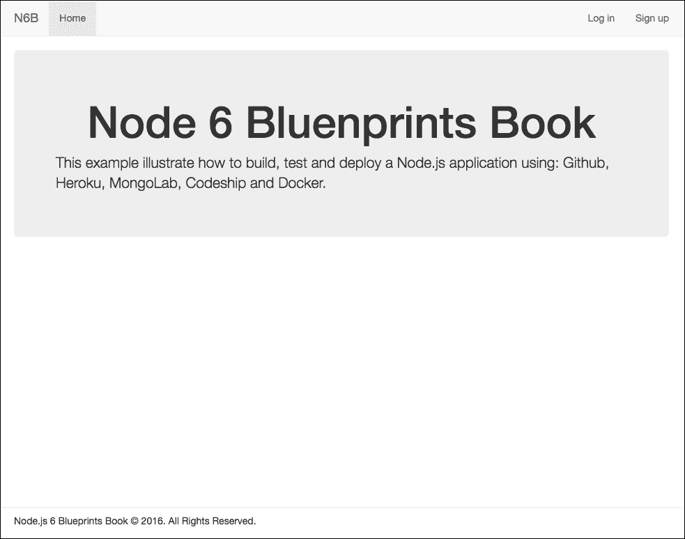
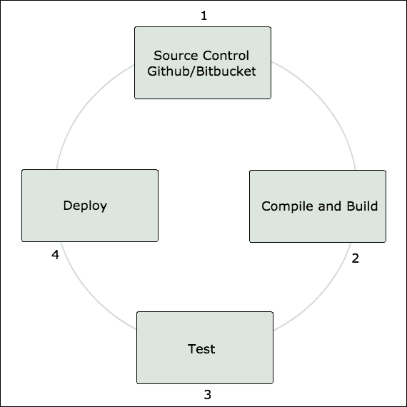
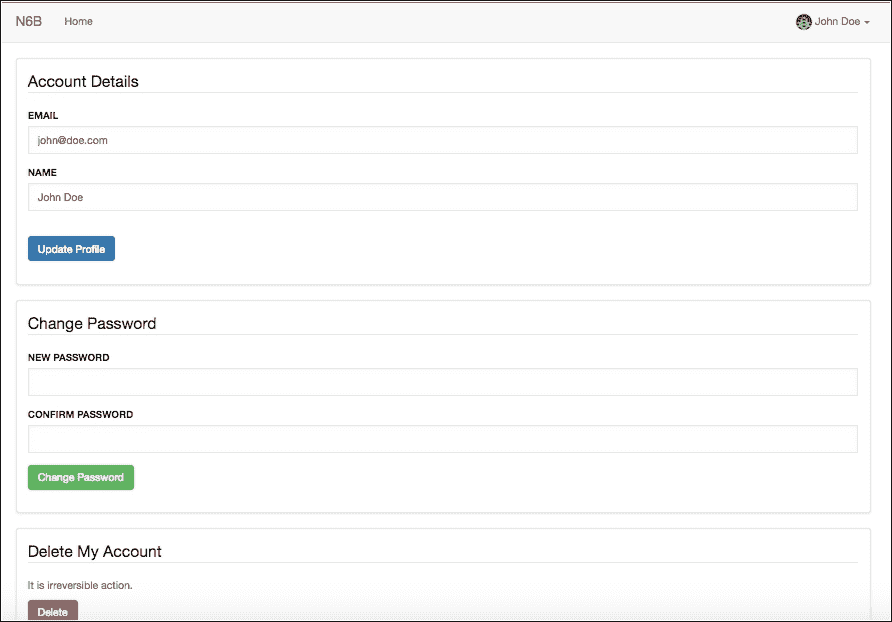
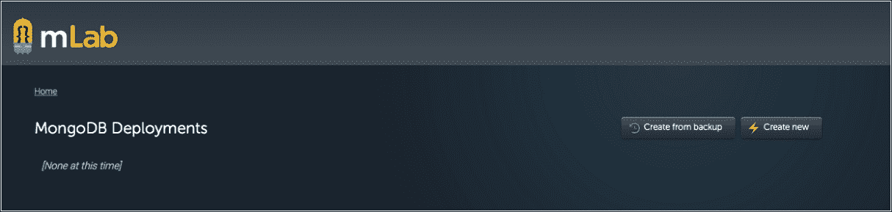
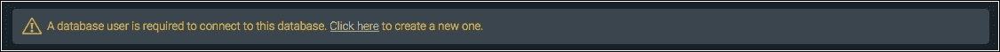
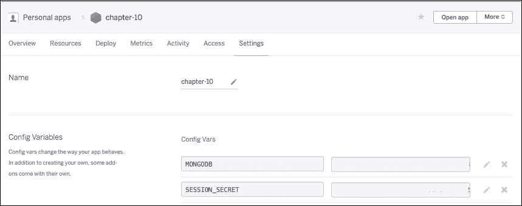
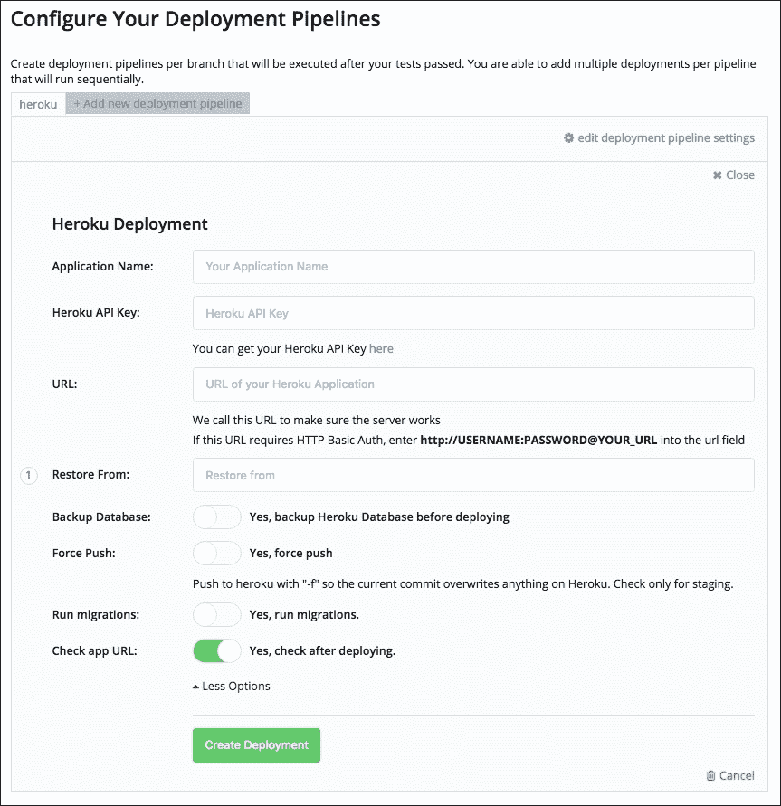

# 第十章。使用持续集成和 Docker 创建和部署

在本章中，我们将探讨 Node.js 应用的持续交付开发过程。

在前面的章节中，我们看到了许多使用 Node.js 和框架(如 Express 和 Loopback)开发应用的方法，包括使用不同的数据库，如 MongoDB 和 MySql，以及一些用于用户身份验证、会话、cookies 等的中间件。

在[第 09 章](09.html "Chapter 9.  Building a Frontend Process with Node.js and NPM")、*用 Node.js 和 NPM 构建前端流程、*中，我们看到了如何使用命令行部署应用，以及如何使用几个命令将项目直接上传到云中。

在本章中，我们将看到如何在我们的开发环境中集成更多的工具来处理单元测试和自动化部署，如何设置环境变量来保护我们的数据库凭据，以及如何使用 Docker 容器的概念创建一个完整的应用。

在本章中，我们将涵盖以下主题:

*   如何应对 CI 解决方案
*   如何测试 Node.js 应用
*   如何配置 MongoDB 云实例和环境变量
*   如何在构建和测试过程中集成 GitHub、Heroku 和 Codeship
*   如何创建 Docker 映像以及如何使用 Docker 容器

# 我们在建造什么

在本章中，我们将使用前面章节中已经使用过的一些技术来构建一个带有 Express 框架的应用，例如使用 Passport 中间件的用户会话和带有电子邮件和密码的用户身份验证。我们还将使用 MongoDB、Mongoose 和 Swig 模板。

结果将是下面的截图:



主屏幕截图

# 持续集成意味着什么

**持续集成** ( **CI** )的工作流程一般由四个步骤组成。我们将用图表和对所有四个阶段的简单描述来说明。

下图显示了配置项解决方案的工作原理:



持续集成过程

1.  将代码提交到存储库中。
2.  配置项接口构建应用。
3.  执行测试。
4.  如果所有测试都成功，代码将进入部署。

# 创建基线应用

让我们开始构建应用。首先，我们将创建一个应用文件夹并添加一些根文件，例如。gitignore，package.json，。env，还有更多。

## 添加根文件

1.  创建一个名为第十章的文件夹。
2.  Inside the chapter-10 folder, create a new file called package.json and add the following code:

    ```js
          { 
            "name": "chapter-10", 
            "version": "1.0.0", 
            "main": "server.js", 
            "description": "Create an app for the cloud with Docker", 
            "scripts": { 
              "build": "npm-run-all build-*", 
              "build-css": "node-sass public/css/main.scss >
               public/css/main.css", 
              "postinstall": "npm run build", 
              "start": "node server.js", 
              "test": "mocha", 
              "watch": "npm-run-all --parallel watch:*", 
              "watch:css": "nodemon -e scss -w public/css -x npm run
               build:css" 
            }, 
            "dependencies": { 
              "async": "^1.5.2", 
              "bcrypt-nodejs": "^0.0.3", 
              "body-parser": "^1.15.1", 
              "compression": "^1.6.2", 
              "dotenv": "^2.0.0", 
              "express": "^4.13.4", 
              "express-flash": "0.0.2", 
              "express-handlebars": "^3.0.0", 
              "express-session": "^1.2.1", 
              "express-validator": "^2.20.4", 
              "method-override": "^2.3.5", 
              "mongoose": "^4.4.8", 
              "morgan": "^1.7.0", 
              "node-sass": "^3.6.0", 
              "nodemon": "^1.9.1", 
              "npm-run-all": "^1.8.0", 
              "passport": "^0.3.2", 
              "passport-local": "^1.0.0", 
              "swig": "^1.4.2" 
            }, 
            "devDependencies": 
              "mocha": "^2.4.5", 
              "supertest": "^1.2.0" 
            }, 
            "engines": { 
              "node": "6.1.0" 
            } 
          }

    ```

    ### 类型

    请注意，在 devDependencies 中，我们将使用一些模块为我们的应用编写测试。我们将在本书后面看到如何做到这一点。

3.  Create a file called .env and add the following code:

    ```js
          SESSION_SECRET='<SESSION_SECRET>' 
          #MONGODB='<>' 
          MONGODB='<MONGODB>' 

    ```

    不用担心前面的代码；我们将在本章后面的 **Heroku** 和 **Codeship** 上使用环境变量替换这段代码，我们还将配置这个文件使用 Docker 容器。

    ### 类型

    出于安全原因，如果你正在从事商业项目，千万不要将你的证书上传到开源软件库；即使您有一个私有存储库，也总是建议您在生产中使用环境变量。

4.  Create a file called Profile and add the following code:

    ```js
          web: node server.js 

    ```

    正如我们在前面几章中已经看到的，这个文件负责让我们的应用在 Heroku 上工作。尽管它不是强制性的，但包含它是一个很好的实践。

    另外，当我们使用 git 源代码控制时，最好包含一个. gitignore 文件。

5.  Create a file called .gitignore and add the following code:

    ```js
          lib-cov 
          *.seed 
          *.log 
          *.csv 
          *.dat 
          *.out 
          *.pid 
          *.gz 
          *.swp 

          pids 
          logs 
          results 
          tmp 
          coverage 

          # API keys 
          .env 

          # Dependency directory 
          node_modules 
          bower_components 
          npm-debug.log 

          # Editors 
          .idea 
          *.iml 

          # OS metadata 
          .DS_Store 
          Thumbs.db 

    ```

    请注意，此时我们保留。gitignore 文件中的 env 文件；在本书的后面，我们将取消跟踪这个文件。

## 创建配置文件夹和文件

通常，所有的 Node.js 应用都使用一个名为 Config 的文件夹来存储所有的应用配置文件。让我们创建一个。

1.  在根项目文件夹中，创建一个名为 config 的新文件夹。
2.  创建一个名为 passport.js 的文件，并添加以下代码:

    ```js
          // load passport module 
          var passport = require('passport'); 
          var LocalStrategy = require('passport-local').Strategy; 
          // load up the user model 
          var User = require('../models/User'); 

          passport.serializeUser(function(user, done) { 
            // serialize the user for the session 
            done(null, user.id); 
          }); 

          passport.deserializeUser(function(id, done) { 
            // deserialize the user 
            User.findById(id, function(err, user) { 
              done(err, user); 
            }); 
          }); 

          // using local strategy 
          passport.use(new LocalStrategy({ usernameField: 'email' }, 
           function(email, password, done) { 

            User.findOne({ email: email }, function(err, user) { 
              if (!user) { 
                // check errors and bring the messages 
                return done(null, false, { msg: 'The email: ' + email +
                 ' is already taken. '}); 
              } 
              user.comparePassword(password, function(err, isMatch) { 
                if (!isMatch) { 
                  // check errors and bring the messages 
                  return done(null, false, { msg:'Invalid email or
                  password'});   
                } 
                return done(null, user); 
              }); 
            }); 
          }));

    ```

前面的代码将使用 **Flask** 中间件处理错误消息，正如我们在[第 01 章](01.html "Chapter 1.  Building a Twitter-Like Application Using the MVC Design Pattern")、*中看到的，使用 MVC 设计模式*构建类似 Twitter 的应用。

## 创建控制器文件夹和文件

当我们构建一个简单的应用时，我们将只有两个控制器，一个用于用户，另一个用于主页:

1.  在根项目文件夹中，创建一个名为"控制器"的新文件夹。
2.  创建一个名为 home.js 的文件，并添加以下代码:

    ```js
          // Render Home Page 
          exports.index = function(req, res) { 
            res.render('home', { 
              title: 'Home' 
            }); 
          };

    ```

现在让我们添加与用户相关的所有功能，如登录、注册、授权、帐户和注销。我们将在前一个函数之后添加每个函数。

### 添加模块和认证中间件

在 controllers 文件夹中，创建一个名为 user.js 的新文件，并添加以下代码:

```js
  // import modules 
  var async = require('async'); 
  var crypto = require('crypto'); 
  var passport = require('passport'); 
  var User = require('../models/User'); 

  // authorization middleware 
  exports.ensureAuthenticated = function(req, res, next) { 
    if (req.isAuthenticated()) { 
      next(); 
    } else { 
      res.redirect('/login'); 
    } 
  }; 

  // logout 
  exports.logout = function(req, res) { 
    req.logout(); 
    res.redirect('/'); 
  };

```

### 添加登录 GET 和 POST 方法

在前一个代码之后，将以下代码添加到 controller/user . js 文件中:

```js
    // login GET 
    exports.loginGet = function(req, res) { 
      if (req.user) { 
        return res.redirect('/'); 
      } 
      res.render('login', { 
        title: 'Log in' 
      }); 
    }; 

    // login POST 
    exports.loginPost = function(req, res, next) { 
      // validate login form fields 
      req.assert('email', 'Email is not valid').isEmail(); 
      req.assert('email', 'Empty email not allowed').notEmpty(); 
      req.assert('password', 'Empty password not allowed').notEmpty(); 
      req.sanitize('email').normalizeEmail({ remove_dots: false }); 

      var errors = req.validationErrors(); 
      if (errors) { 
        // Show errors messages for form validation 
        req.flash('error', errors); 
        return res.redirect('/login'); 
      } 

      passport.authenticate('local', function(err, user, info) { 
        if (!user) { 
          req.flash('error', info); 
          return res.redirect('/login') 
        } 
        req.logIn(user, function(err) { 
          res.redirect('/'); 
        }); 
      })(req, res, next); 
    }; 

```

### 添加注册 GET 和 POST 方法

在前一个代码之后，将以下代码添加到 controller/user . js 文件中:

```js
    // signup GET 
    exports.signupGet = function(req, res) { 
      if (req.user) { 
        return res.redirect('/'); 
      } 
      res.render('signup', { 
        title: 'Sign up' 
      }); 
    }; 

    // signup POST 
    exports.signupPost = function(req, res, next) { 
      // validate sign up form fields 
      req.assert('name', 'Empty name not allowed').notEmpty(); 
      req.assert('email', 'Email is not valid').isEmail(); 
      req.assert('email', 'Empty email is not allowed').notEmpty(); 
      req.assert('password', 'Password must be at least 4 characters 
        long').len(4); 
      req.sanitize('email').normalizeEmail({ remove_dots: false }); 

      var errors = req.validationErrors(); 

      if (errors) { 
        // Show errors messages for form validation 
        req.flash('error', errors); 
        return res.redirect('/signup'); 
      } 

      // Verify user email 
      User.findOne({ email: req.body.email }, function(err, user) { 
        if (user) { 
          // if used, show message and redirect 
          req.flash('error', { msg: 'The email is already taken.' }); 
          return res.redirect('/signup'); 
        } 
        // create an instance of user model with form data 
        user = new User({ 
          name: req.body.name, 
          email: req.body.email, 
          password: req.body.password 
        }); 
        // save user 
        user.save(function(err) { 
          req.logIn(user, function(err) { 
            res.redirect('/'); 
          }); 
        }); 
      }); 
    }; 

```

### 增加账户获取和更新方式

在前一个代码之后，将以下代码添加到 controller/user . js 文件中:

```js
    // profile account page 
    exports.accountGet = function(req, res) { 
      res.render('profile', { 
        title: 'My Account' 
      }); 
    }; 

    // update profile and change password 
    exports.accountPut = function(req, res, next) { 
      // validate sign up form fields 
      if ('password' in req.body) { 
        req.assert('password', 'Password must be at least 4 characters
        long').len(4); 
        req.assert('confirm', 'Passwords must match') 
         .equals(req.body.password); 
      }
      else { 
        req.assert('email', 'Email is not valid').isEmail(); 
        req.assert('email', 'Empty email is not allowed').notEmpty(); 
        req.sanitize('email').normalizeEmail({ remove_dots: false }); 
      } 
      var errors = req.validationErrors(); 

      if (errors) { 
        // Show errors messages for form validation 
        req.flash('error', errors); 
        return res.redirect('/pages'); 
      } 

      User.findById(req.user.id, function(err, user) { 
        // if form field password change 
        if ('password' in req.body) { 
          user.password = req.body.password; 
        }
        else { 
          user.email = req.body.email; 
          user.name = req.body.name; 
        } 
        // save user data 
        user.save(function(err) { 
          // if password field change 
          if ('password' in req.body) { 
            req.flash('success', { msg: 'Password changed.' }); 
          } else if (err && err.code === 11000) { 
            req.flash('error', { msg: 'The email is already taken.' }); 
          } else { 
            req.flash('success', { msg: 'Profile updated.' }); 
          } 
          res.redirect('/account'); 
        }); 
      }); 
    };

```

### 添加账户删除方式

在前一个代码之后，将以下代码添加到 controller/user . js 文件中:

```js
    // profile DELETE 
    exports.accountDelete = function(req, res, next) { 
      User.remove({ _id: req.user.id }, function(err) { 
        req.logout(); 
        req.flash('info', { msg: 'Account deleted.' }); 
        res.redirect('/'); 
       }); 
    };

```

现在我们已经完成了应用控制器。

## 创建模型文件夹和文件

1.  在根项目文件夹中，创建一个名为 models 的文件夹。
2.  创建一个名为 User.js 的新文件，并添加以下代码:

    ```js
          // import modules 
          var crypto = require('crypto'); 
          var bcrypt = require('bcrypt-nodejs'); 
          var mongoose = require('mongoose'); 

          // using virtual attributes 
          var schemaOptions = { 
            timestamps: true, 
            toJSON: { 
              virtuals: true 
            } 
          }; 

          // create User schema 
          var userSchema = new mongoose.Schema({ 
            name: String, 
            email: { type: String, unique: true}, 
            password: String, 
            picture: String 
          }, schemaOptions); 

          // encrypt password 
          userSchema.pre('save', function(next) { 
            var user = this; 
            if (!user.isModified('password')) { return next(); } 
            bcrypt.genSalt(10, function(err, salt) { 
              bcrypt.hash(user.password, salt, null, function(err, hash) { 
                user.password = hash; 
                next(); 
              }); 
            }); 
          }); 
          // Checking equal password 
          userSchema.methods.comparePassword = function(password, cb) { 
            bcrypt.compare(password, this.password, function(err, isMatch) { 
              cb(err, isMatch); 
            }); 
          }; 
          // using virtual attributes 
          userSchema.virtual('gravatar').get(function() { 
            if (!this.get('email')) { 
              return 'https://gravatar.com/avatar/?s=200&d=retro'; 
            } 
            var md5 =
            crypto.createHash('md5').update(this.get('email')).digest('hex'); 
            return 'https://gravatar.com/avatar/' + md5 + '?s=200&d=retro'; 
          }); 

          var User = mongoose.model('User', userSchema); 

          module.exports = User;

    ```

## 创建公共文件夹和文件

在这个例子中，我们使用的是引导框架的 SASS 版本，正如我们在上一章中所做的那样。但是这次，我们将把源文件存储在一个不同的位置，在 public/css 文件夹中。让我们创建文件夹和文件:

1.  在根项目中，创建一个名为 public 的文件夹。
2.  在公共文件夹中我们将创建一个名为:css 的文件夹，在 css 中创建一个名为:vendor 的文件夹，在 vendor 中创建一个名为:bootstrap 的文件夹。
3.  转到[https://github . com/twbs/bootstrap-sass/tree/master/assets/style sheets/bootstrap](https://github.com/twbs/bootstrap-sass/tree/master/assets/stylesheets/bootstrap)，复制所有内容，粘贴到 public/CSS/厂商/bootstrap 文件夹。
4.  在 public/css/vendor 文件夹中，创建一个名为 _bootstrap.scss 的新文件，并添加以下代码:

    ```js
          /*! 
          * Bootstrap v3.3.6 (http://getbootstrap.com) 
          * Copyright 2011-2015 Twitter, Inc. 
          * Licensed under MIT (https://github.com/twbs/bootstrap/blob/
            master/LICENSE) 
          */ 

          // Core variables and mixins 
          @import "bootstrap/variables"; 
          @import "bootstrap/mixins"; 

          // Reset and dependencies 
          @import "bootstrap/normalize"; 
          @import "bootstrap/print"; 
          @import "bootstrap/glyphicons"; 

          // Core CSS 
          @import "bootstrap/scaffolding"; 
          @import "bootstrap/type"; 
          @import "bootstrap/code"; 
          @import "bootstrap/grid"; 
          @import "bootstrap/tables"; 
          @import "bootstrap/forms"; 
          @import "bootstrap/buttons"; 

          // Components 
          @import "bootstrap/component-animations";
          @import "bootstrap/dropdowns"; 
          @import "bootstrap/button-groups"; 
          @import "bootstrap/input-groups"; 
          @import "bootstrap/navs"; 
          @import "bootstrap/navbar"; 
          @import "bootstrap/breadcrumbs"; 
          @import "bootstrap/pagination"; 
          @import "bootstrap/pager"; 
          @import "bootstrap/labels"; 
          @import "bootstrap/badges"; 
          @import "bootstrap/jumbotron"; 
          @import "bootstrap/thumbnails"; 
          @import "bootstrap/alerts"; 
          @import "bootstrap/progress-bars"; 
          @import "bootstrap/media"; 
          @import "bootstrap/list-group"; 
          @import "bootstrap/panels"; 
          @import "bootstrap/responsive-embed"; 
          @import "bootstrap/wells"; 
          @import "bootstrap/close"; 

          // Components w/ JavaScript 
          @import "bootstrap/modals"; 
          @import "bootstrap/tooltip"; 
          @import "bootstrap/popovers"; 
          @import "bootstrap/carousel"; 

          // Utility classes 
          @import "bootstrap/utilities"; 
          @import "bootstrap/responsive-utilities";

    ```

### 创建自定义样式表

在 public/css/文件夹中，创建一个名为 main.scss 的新文件，并添加以下代码:

```js
    // import bootstrap 
    @import "vendor/bootstrap"; 

    // Structure 
    html { 
      position: relative; 
      min-height: 100%; 
    } 

    body { 
      margin-bottom: 44px; 
    } 

    footer { 
      position: absolute; 
      width: 100%; 
      height: 44px; 
      padding: 10px 30px; 
      bottom: 0; 
      background-color: #fff; 
      border-top: 1px solid #e0e0e0; 
    } 

    .login-container { 
      max-width: 555px; 
    } 

    // Warning 
    .alert { 
      border-width: 0 0 0 3px; 
    } 

    // Panels 
    .panel { 
      border: solid 1px rgba(160, 160, 160, 0.3); 
      box-shadow: 0 1px 4px 0 rgba(0, 0, 0, 0.1); 
    } 

    .panel-heading + .panel-body { 
      padding-top: 0; 
    } 

    .panel-body { 
      h1, h2, h3, h4, h5, h6 { 
        margin-top: 0; 
      } 
    } 

    .panel-title { 
      font-size: 18px; 
      color: #424242; 
    } 

    // Form 
    textarea { 
      resize: none; 
    } 

    .form-control { 
      height: auto; 
      padding: 8px 12px; 
      border: 2px solid #ebebeb; 
      border-radius: 0; 
      box-shadow: inset 0 1px 2px rgba(150, 160, 175, 0.1), inset 0 1px
      15px rgba(150, 160, 175, 0.05); 
    } 

    .form-group > label { 
      text-transform: uppercase; 
      font-size: 13px; 
    } 

```

现在不用担心 node-sass 的构建过程；我们已经在本章开头的 package.json 文件中设置了一个 NPM 任务。

### 创建字体文件夹并添加字体文件

当我们使用 Bootstrap 框架时，我们需要一个文件夹来保存所有 Bootstrap 字体文件，让我们创建:

1.  在公共文件夹中，创建一个名为 fonts 的新文件夹。
2.  转到[https://github . com/twbs/bootstrap-sass/tree/master/assets/font/bootstrap](https://github.com/twbs/bootstrap-sass/tree/master/assets/fonts/bootstrap)，复制所有内容，粘贴到 public/font 文件夹。

### 创建 JavaScript 文件夹和文件

当我们使用 Bootstrap 框架时，我们需要一个文件夹来保存所有 Bootstrap 字体文件，让我们创建:

1.  在公共文件夹中，创建一个名为 js 的新文件夹。
2.  在 js 文件夹中，创建一个名为 lib 的新文件夹。
3.  在 js/lib 中创建一个名为 bootstrap.js 的新文件。
4.  转到[https://github . com/twbs/bootstrap-sass/blob/master/assets/JavaScript/bootstrap . js](https://github.com/twbs/bootstrap-sass/blob/master/assets/javascripts/bootstrap.js)，复制所有内容，粘贴到 public/js/lib/bootstrap.js 文件中。
5.  在 js/lib 内部，创建一个名为 jquery.js 的新文件。
6.  转到[https://cdnjs . cloud flare . com/Ajax/libs/jquery/2 . 1 . 4/jquery . js](https://cdnjs.cloudflare.com/ajax/libs/jquery/2.1.4/jquery.js)，复制所有内容，粘贴到 public/js/lib/jquery.js 文件中。

## 创建视图文件夹和文件

现在我们将创建一个与[第 01 章](01.html "Chapter 1.  Building a Twitter-Like Application Using the MVC Design Pattern")*中非常相似的文件夹结构，使用 MVC 设计模式*构建一个类似推特的应用；“视图”文件夹将包含以下目录:

```js
/ layouts
/ pages
/ partials

```

### 添加布局文件夹和文件

在“视图/布局”文件夹中，创建一个名为 main.html 的新文件，并添加以下代码:

```js
    <!DOCTYPE html> 
    <html> 
      <head> 
        <meta charset="utf-8" /> 
        <meta http-equiv="x-ua-compatible" content="ie=edge"> 
        <meta name="viewport" content="width=device-width, initial-
         scale=1">
        <title>Chapter-10</title> 
          <title>{{title}}</title> 
            <link rel="stylesheet" href="/css/main.css"> 
      </head> 
      <body> 
         
           
           
         
          <script src="/js/lib/jquery.js"></script> 
          <script src="/js/lib/bootstrap.js"></script> 
          <script src="/js/main.js"></script> 
      </body> 
    </html>

```

### 添加页面文件夹和文件

是时候创建应用模板文件了:

1.  在视图/页面文件夹中，创建一个名为 home.html 的文件，并添加以下代码:

    ```js
           

           
            <div class="container"> 
               
                <div role="alert" class="alert alert-success"> 
                   
                    <div>{{ item.msg }}</div> 
                   
                </div> 
               
               
                <div role="alert" class="alert alert-danger"> 
                   
                    <div>{{ item.msg }}</div> 
                   
                </div> 
               
               
                <div role="alert" class="alert alert-info"> 
                   
                    <div>{{ item.msg }}</div> 
                   
                </div> 
               
              <div class="app"> 
                <div class="jumbotron"> 
                  <h1 class="text-center">Node 6 Bluenprints Book</h1> 
                    <p>This example illustrate how to build, test and deploy
                       a Node.js application using: Github, Heroku, MOngolab,
                       Codeship and Docker.
                    </p> 
                </div> 
              </div> 
            </div> 
          

    ```

2.  在视图/页面文件夹中，创建一个名为 login.html 的文件，并添加以下代码:

    ```js
           

           
            <div class="login-container container"> 
              <div class="panel"> 
                <div class="panel-body"> 
                   
                    <div role="alert" class="alert alert-danger"> 
                       
                        <div>{{ item.msg }}</div> 
                       
                    </div> 
                   
                  <form method="POST"> 
                    <legend>Welcome to login</legend> 
                    <div class="form-group"> 
                      <label for="email">Email</label> 
                      <input type="email" name="email" id="email" 
                        placeholder="Email" class="form-control" autofocus> 
                    </div> 
                    <div class="form-group"> 
                      <label for="password">Password</label> 
                      <input type="password" name="password" id="password"
                       placeholder="Password" class="form-control"> 
                    </div> 
                    <button type="submit" class="btn btn-primary btn-block">
                      Sign in</button> 
                  </form> 
                </div> 
              </div> 
              <p class="text-center">Don't have an account? <a href="/signup">
                <strong>Sign up</strong></a>, it's free.</p> 
            </div> 
          

    ```

3.  在视图/页面文件夹中，创建一个名为 profile.html 的文件，并添加以下代码:

    ```js
           

           
            <div class="container"> 
              <div class="panel"> 
                <div class="panel-body"> 
                   
                    <div role="alert" class="alert alert-success"> 
                       
                        <div>{{ item.msg }}</div> 
                       
                    </div> 
                   
                   
                    <div role="alert" class="alert alert-danger"> 
                       
                        <div>{{ item.msg }}</div> 
                       
                    </div> 
                   
                  <form method="POST" action="/account?_method=PUT"> 
                    <legend>Account Details</legend> 
                    <div class="form-group"> 
                        <label for="email">Email</label> 
                        <input type="email" name="email" id="email"
                          class="form-control" value="{{user.email}}"> 
                    </div> 
                    <div class="form-group"> 
                        <label for="name">Name</label> 
                        <input type="text" name="name" id="name" class="form-
                          control" value="{{user.name}}"> 
                    </div> 
                      <br> 
                    <div class="form-group"> 
                        <button type="submit" class="btn btn-primary">
                          Update Profile</button> 
                    </div> 
                  </form> 
                </div> 
              </div> 
              <div class="panel"> 
                <div class="panel-body"> 
                  <form method="POST" action="/account?_method=PUT"> 
                    <legend>Change Password</legend> 
                    <div class="form-group"> 
                      <label for="password">New Password</label> 
                        <input type="password" name="password" id="password"
                          class="form-control"> 
                    </div> 
                    <div class="form-group"> 
                      <label for="confirm">Confirm Password</label> 
                        <input type="password" name="confirm" id="confirm"
                          class="form-control"> 
                    </div> 
                    <div class="form-group"> 
                        <button type="submit" class="btn btn-success">
                          Change Password</button> 
                    </div> 
                  </form> 
                </div> 
              </div> 
              <div class="panel"> 
                <div class="panel-body"> 
                  <form method="POST" action="/account?_method=DELETE"> 
                    <legend>Delete My Account</legend> 
                    <div class="form-group"> 
                      <p class="text-muted">It is irreversible action.</p> 
                        <button type="submit" class="btn btn-danger">
                          Delete</button> 
                      </div> 
                  </form> 
                </div> 
              </div> 
            </div> 
          
    ```

4.  在视图/页面文件夹中，创建一个名为 signup.html 的文件，并添加以下代码:

    ```js
           

           
          <div class="login-container container"> 
            <div class="panel"> 
              <div class="panel-body"> 
                 
                  <div role="alert" class="alert alert-danger"> 
                     
                      <div>{{ item.msg }}</div> 
                     
                  </div> 
                 
                <form method="POST"> 
                  <legend>Create an account</legend> 
                  <div class="form-group"> 
                    <label for="name">Name</label> 
                    <input type="text" name="name" id="name" 
                      placeholder="Name"
                      class="form-control" autofocus> 
                  </div> 
                  <div class="form-group"> 
                    <label for="email">Email</label> 
                    <input type="email" name="email" id="email"
                      placeholder="Email" class="form-control"> 
                  </div> 
                  <div class="form-group"> 
                    <label for="password">Password</label> 
                    <input type="password" name="password" id="password" 
                      placeholder="Password" class="form-control"> 
                  </div> 
                  <button type="submit" class="btn btn-primary btn-block">
                    Sign up</button> 
                </form> 
              </div> 
            </div> 
            <p class="text-center"> Already have an account? <a href="/login">
              <strong>Sign in</strong></a></p> 
          </div> 
          

    ```

### 添加部分文件夹和文件

正如我们在上一章中所做的，我们使用了局部视图的概念，所以让我们创建视图文件:

1.  在视图/部分文件夹中，创建一个名为 footer.html 的新文件，并添加以下代码:

    ```js
          <footer> 
            <div class="container"> 
              <p>Node.js 6 Blueprints Book © 2016\. All Rights Reserved.</p> 
            </div> 
          </footer>

    ```

2.  在视图/部分文件夹中，创建一个名为 header.html 的新文件，并添加以下代码:

    ```js
          <nav class="navbar navbar-default navbar-static-top"> 
            <div class="container"> 
              <div class="navbar-header"> 
                <button type="button" data-toggle="collapse"
                  data-target="#navbar" class="navbar-toggle collapsed"> 
                  <span class="sr-only">Toggle navigation</span> 
                  <span class="icon-bar"></span> 
                  <span class="icon-bar"></span> 
                  <span class="icon-bar"></span> 
                </button> 
                <a href="/" class="navbar-brand">N6B</a> 
              </div> 
              <div id="navbar" class="navbar-collapse collapse"> 
                <ul class="nav navbar-nav"> 
                  <li class="active">
                  <a href="/">Home</a></li> 
                </ul> 
              <ul class="nav navbar-nav navbar-right"> 
               
                <li class="dropdown"> 
                  <a href="#" data-toggle="dropdown"
                    class="navbar-avatar dropdown-toggle"> 
                     
                       
                     
                       
                     
                     
                      {{user.name}} 
                     
                      {{user.email}} 
                     
                    <i class="caret"></i> 
                  </a> 
                  <ul class="dropdown-menu"> 
                    <li><a href="/account">My Account</a></li> 
                    <li class="divider"></li> 
                    <li><a href="/logout">Logout</a></li> 
                  </ul> 
                </li> 
               
                <li class="active">
                  <a href="/login">Log in</a></li> 
                <li class="active">
                  <a href="/signup">Sign up</a></li> 
               
              </ul> 
              </div> 
            </div> 
          </nav>

    ```

此时，我们已经准备好部署应用，但是在我们继续之前，我们需要创建测试文件夹和文件。

### 创建测试文件夹和测试文件

为了在 Node.js 应用上运行测试，我们需要包含一些依赖项/模块来帮助我们编写这些测试。幸运的是，在节点生态系统中，我们有许多可供模块使用的选项。

接下来，我们将描述如何使用 **Supertest** 模块和**摩卡**测试运行器为 HTTP 服务器编写测试。我们需要的模块被插入到我们的 package.json 文件中:

```js
"devDependencies": { 
    "mocha": "^2.4.5", 
    "supertest": "^1.2.0" 
  } 

```

<colgroup><col> <col> <col></colgroup> 
| **模块** | **描述** | **更多信息** |
| **摩卡** | 测试框架 | [https://mochajs.org](https://mochajs.org) |
| 超集 | 用于测试 HTTP 服务器 | [https://www.npmjs.com/package/supertest](https://www.npmjs.com/package/supertest) |

web 应用的测试是一个非常复杂的主题，值得更深入的研究，但是我们将看到如何编写单元测试以及如何在 Node.js 应用中使用 Mocha 运行测试:

1.  在根项目文件夹中，创建一个名为 test 的新文件夹。
2.  Inside the test/ folder, create a new file called app-test.js and add the following code:

    ```js
          // import modules 
          var request = require('supertest'); 
          var server = require('../server'); 

          // Test 01 
          describe('GET /', function() { 
            it('should render ok', function(done) { 
              request(server) 
              .get('/') 
              // expected result 
              .expect(200, done); 
            }); 
          }); 

          // Test 02 
          describe('GET /bikes', function() { 
            it('should not found', function(done) { 
              request(server) 
              .get('/bikes') 
              // expected result 
             .expect(404, done); 
           }); 
         }); 

    ```

    测试用例非常简单，其中:

    *   *Test 01:*

        检查根网址，预期 HTTP 状态代码为 200。

    *   *Test 02:*

        要求 HTTP 状态代码为 404。

    现在让我们看看如何执行这些测试。

    ### 类型

    请注意，您必须在计算机上启动并运行 MongoDB。

3.  Replace the .env file at the root project folder with the following information:

    ```js
          SESSION_SECRET="3454321234" 
          MONGODB="localhost" 

    ```

    请注意，在本书的后面，我们将把这个文件恢复到它的原始状态。

4.  打开根项目内部的终端/外壳，输入以下命令:

    ```js
    npm install

    ```

5.  现在输入以下命令:

    ```js
    npm test

    ```

您应该会在终端输出上看到以下结果:


测试后的终端输出

请注意，通过的两个测试在测试描述的左侧都有一个绿色的复选图标。

# 运行应用

现在是时候检查应用了:

1.  打开终端，输入以下命令:

    ```js
     npm start

    ```

2.  Go to http://localhost:3000/signup and create a new account with the following information:

    **姓名**:无名氏

    **电子邮件** : john@doe.com

    **密码** : 123456

    

    注册页面

    注册过程结束后，转到 http://localhost:3000/account，看到下面的截图，里面有用户信息:

    

    账户信息

# 创建 GitHub 或 Bitbucket 免费账户

你可以选择使用什么服务，就像 GitHub 和 Bitbucket 做的一样:托管公共和私有的代码库，用于协作软件开发。

两者的功能相似，都使用 git 作为源代码控制。我们将看到如何使用 GitHub，但是 Bitbucket 的过程非常相似。

### 类型

你可以在这个链接找到更多关于比特桶的信息:[https://bitbucket.org/](https://bitbucket.org/)。

## 创建 GitHub 免费账户

让我们创建一个 GitHub 帐户:

1.  前往[https://github.com/join](https://github.com/join)，填写表格，点击**创建账户**按钮。
2.  选择**免费无限公共存储库**复选框，点击**继续**按钮。
3.  On the third step, you must answer three questions or choose to skip this step; click the **Submit** button. From here, you can read the guide or start a project.

    ### 类型

    请注意，在开始项目之前，您需要验证您的电子邮件。

4.  Click the **Start a project** button and fill in the repository's name, remembering you can use this name on GitHub, but you need to choose another name for the Heroku and Codeship process. After that, you will see the following screenshot:

    

    GitHub 项目

    在本章的后面，我们将看到如何初始化本地 GIT 存储库，以及如何将源代码推送到 GitHub 存储库。

# 创建 Heroku 免费账户

在前一章中，我们使用 Heroku toolbelt 命令将应用直接部署到 Heroku。这次，您可以使用我们在[第 09 章](09.html "Chapter 9.  Building a Frontend Process with Node.js and NPM")、*中创建的相同帐户，使用 Node.js 和 NPM* 构建前端流程，或者在[https://www.heroku.com/](https://www.heroku.com/)创建一个新帐户。

# 创建 MongoLab 免费沙盒账号

MongoLab 是使用 MongoDB 即服务所需的云服务。它提供了一个免费的有限帐户作为沙盒，因此我们可以使用它来部署我们的项目:

1.  Proceed to the **Sign Up** page; after that, you will receive two emails from MongoLab, one with a welcome message and another with a link to verify your account, if you don't have one yet.

    验证您的帐户后，您将在登录仪表板时看到以下屏幕截图:

    

    蒙古欢迎屏幕

2.  点击**新建**按钮。
3.  选择单节点选项卡。
4.  从标准线面板中，选择**沙盒**的第一个复选框。
5.  向下滚动到页面的末尾，插入一个数据库名称， **nb6** ，然后点击 C **创建新的 mongodb 部署**按钮。

在这五个步骤结束时，您应该会看到以下屏幕:


蒙古建立的数据库

## 为数据库创建用户和密码

是时候创建一个用户和密码来保护我们的云数据库了:

1.  Click on the database name.

    您将看到以下警告，建议您创建用户和密码:

    

    数据库警告:没有用户和密码

2.  点击警告信息内的**点击此处**链接。
3.  插入以下信息:

    ```js
          database username: nb6 
          database password: node6 

    ```

4.  点击**创建用户**按钮。

## 获取字符串连接

现在我们有了一个运行在 MongoLab 云服务上的 MongoDB 实例。这是我们将在本章后面使用的连接字符串:

```js
    mongodb://<user>:<password>@ds023074.mlab.com:23074/nb6 

```

### 类型

您必须用自己的用户和密码替换以前的代码。

# 初始化 git 存储库并推送到 GitHub

此时，我们将创建本地 git 存储库，然后将其上传到我们刚刚在 GitHub 上创建的帐户:

1.  打开根应用文件夹内的终端/外壳，输入以下命令:

    ```js
     git init

    ```

2.  Add a remote repository to project by typing the following command in the terminal/shell:

    ```js
     git remote add origin https://github.com/<your github account 
           name>/n6b.git

    ```

    在前面的代码中，您必须使用自己的 github 用户名。

3.  通过在终端/shell 中键入以下命令将所有项目文件添加到源代码管理中:

    ```js
     git add .

    ```

4.  Commit the project changes by typing the following command in the terminal/shell:

    ```js
     git commit -m "initial commit"

    ```

    最后一个命令是将所有文件上传到我们之前创建的 GitHub 存储库中。

5.  在终端/外壳中键入以下命令:

    ```js
     git push -u origin master

    ```

# 使用 Heroku 仪表板创建 Heroku 应用

这一次，我们将看到使用 Heroku 云服务创建项目的另一种方式:

1.  前往[https://dashboard.heroku.com/apps](https://dashboard.heroku.com/apps)。
2.  在 Heroku 仪表盘上，点击**新建**按钮，然后点击创建**新 app** 链接。
3.  在应用输入名称字段中输入以下名称:章节-10-您的姓名
4.  点击**创建应用**按钮。

## 将 Heroku 应用链接到您的 git 存储库

现在我们需要在 Heroku 上设置我们的帐户，以链接到我们的 github 帐户。让我们做下一步:

1.  在 Heroku 仪表板上，单击第 10 章-您的姓名项目名称。
2.  Click on the **Settings** tab, scroll down the page to **Domains**, and copy the Heroku domain URL:

    chapter-10-yourname.herokuapp.com

### 类型

请注意，我们不能对所有应用使用相同的名称，因此您需要在第 10 章之后提供您的名称。

稍后我们将使用应用名称来配置 Codeship 部署管道，所以不要忘记。

## 向 Heroku 添加环境变量

现在，我们需要创建一些环境变量来保证我们的数据库字符串在公共 github 存储库中的安全:

1.  在 Heroku 仪表板上，单击第 10 章-您的姓名项目名称。
2.  点击**设置**选项卡。
3.  在**设置**选项卡上，点击**显示配置变量**按钮。
4.  Add your own variables, as shown in the following screenshot. On the left, add the variable name, and on the right, and add the value:

    

    Heroku 环境变量

    ### 类型

    请注意，您必须在代码传送配置项目中重复这个过程。

# 创建免费代码传送账户

代码传送是一种面向持续集成(CI)工具的云服务。创建帐户非常简单:

1.  前往[https://codeship.com/sessions/new](https://codeship.com/sessions/new)并使用右上角的**注册**按钮。您可以使用您的 GitHub 或 Bitbucket 帐户；只需点击您喜欢的按钮。由于我们正在使用 GitHub，我们将选择 GitHub。
2.  Click on the **AUTHORIZE APPLICATION** button.

    您应该会看到以下屏幕:

    

    编码仪表板

    下一步是点击托管代码的位置。在这种情况下，我们会点击 ****GitHub**** 图标，那么我们会看到如下画面:

    

    代码传送配置的第二步

3.  复制粘贴在 GitHub 设置过程中创建的 GitHub 存储库 URL(https://github.com/<yourusername>/n6b . git)，粘贴到**存储库克隆 URL** 输入中，如上图所示。</yourusername>
4.  点击**连接**按钮。

现在我们已经用三个工具建立了我们的开发环境:GitHub、Codeship 和 Heroku。下一步是创建设置和测试命令，并将管道部署添加到代码船仪表板。

## 向代码传递添加环境变量

现在，让我们像使用 Heroku 仪表板一样，向 Codeship 添加相同的变量:

1.  前往[https://codeship.com/projects/](https://codeship.com/projects/)选择章节-10-你的名字项目。
2.  Click on the P**roject Settings** link in the top-right corner, as shown here:

    

    编码仪表板中的项目设置菜单

3.  点击**环境变量**链接。
4.  添加 Session 和 MongoDB 变量和值，就像我们之前对 Heroku 环境变量的配置一样，然后点击**保存配置**按钮。

## 在代码传送项目配置中创建设置和测试命令

现在，我们回到代码传输控制面板，为我们的应用配置 test 和 dploy 命令:

1.  将以下代码粘贴到设置命令文本区域:

    ```js
          # By default we use the Node.js version set in your package.json
            or the latest 
          # version from the 0.10 release 
          # 
          # You can use nvm to install any Node.js (or io.js) version you require. 
          # nvm install 4.0 
          # nvm install 0.10 
          npm install 
          npm run build 

    ```

2.  将以下代码粘贴到测试命令文本区域:

    ```js
     npm test

    ```

3.  点击**保存，进入仪表盘**按钮。

## 创建在 Heroku 上部署的管道

嗯，我们快到了；现在，我们需要创建一个管道，将构建与我们在 Heroku 上的部署环境相集成:

1.  Click on the **Project Settings** link in the top-right corner and then click on the **Deployment** link, as shown here:

    

2.  在**输入分支名称**输入处，输入以下名称:主。
3.  点击**保存** **管道设置**按钮。
4.  On the **Add new deployment pipeline** tab, choose the **Heroku** banner.

    现在我们将填写如下所示的输入字段:

    

    Codeship Heroku 部署配置面板

## 将 Heroku API 密钥添加到代码传送中

要提供上一张截图中所需的信息，我们需要遵循以下步骤:

1.  打开新的浏览器窗口，进入[https://id.heroku.com/login](https://id.heroku.com/login)的 Heroku 仪表盘。
2.  点击右上角的**图片**，然后点击**账户设置**。
3.  Scroll down the page for API Key and click on **Show API Key**, as shown here:

    

    显示应用编程接口密钥 Heroku 仪表板

4.  插入您的密码并复制应用编程接口密钥。
5.  回到 Codeship 浏览器窗口，将键粘贴到 **Heroku API 键**输入栏。
6.  为你的申请命名:n6b-你自己的名字。
7.  添加申请网址:http://chapter-10-your-own-name.herokuapp.com/.
8.  点击**保存部署**按钮。

这一步完成了我们的持续集成。每次我们修改代码并将更改发送到 GitHub 或 Bitbucket 时，Codeship 都会运行我们在本章前面创建 Node.js 应用时设置的代码和测试。

在测试结束时，如果一切正常，我们的代码将被发送到 Heroku，并将在 http://chapter-10-yourname.herokuapp.com/.提供

### 检查代码船仪表盘上的测试和部署步骤

此时，我们已经有了设置测试和部署所需的命令，但是我们需要检查所有的配置是否正确:

1.  前往[https://codeship.com/sessions/new](https://codeship.com/sessions/new)。
2.  登录您的帐户。
3.  在左上角，点击**选择项目**链接。
4.  点击 n6b-你自己名字的项目名称，你会看到你所有的提交都带有**成功**、R **运行**或 F **失败**的标志。

当我们点击其中一个按钮时，我们可以看到下面的截图，其中有一个逐步的过程:


代码生成步骤

这里我们有一个成功的构建，因为我们可以在每个步骤的右侧看到绿色的检查图标。

请注意，如果测试过程在任何时候失败，代码都不会进入生产服务器，在这种情况下是 Heroku。

# 安装 Docker 并设置应用

在我们更进一步之前，我们需要了解什么是 Docker 以及容器的概念。

### 类型

您可以在此链接阅读更多关于容器的信息:[https://www.docker.com/what-docker#/VM](https://www.docker.com/what-docker#/VM)。

以一种非常简单的方式思考，Docker 在一个隔离的盒子里创建微型机器(即操作系统)来运行您的应用，无论您的平台是什么(Windows、Linux 或 OSX)。让我们看看官方 Docker 网站怎么说:

> *“Docker 容器将一个软件包装在一个完整的文件系统中，该文件系统包含运行所需的一切:代码、运行时、系统工具、系统库——任何可以安装在服务器上的东西。”*

所以让我们在你的机器上安装 Docker。一台 Windows 机值得特别关注，但你可以在以下链接找到相关信息:[https://docs.docker.com/engine/installation/windows/](https://docs.docker.com/engine/installation/windows/)。前往[https://docs.docker.com/](https://docs.docker.com/)并按照您所在平台的说明进行操作。

## 检查 Docker 版本

现在是时候检查您机器上安装的 Docker 版本了:

打开终端/外壳，键入以下命令检查每个部件的版本:

```js
 docker --version
 docker-compose --version
 docker-machine --version

```

## 创建 Docker 文件

为了在容器中记录我们的应用，我们需要创建两个文件，一个 Dockerfile 和一个 docker-compose.yml 文件，将我们的应用容器与 MongoDb 数据库链接起来:

1.  Inside the root folder, create a new file called Dockerfile and add the following code:

    ```js
          FROM node:argon 

          # Create app directory 
          RUN mkdir -p /usr/src/app 
          WORKDIR /usr/src/app 

          # Install app dependencies 
          COPY package.json /usr/src/app/ 
          RUN npm install 

          ENV PORT 3000 
          ENV DB_PORT_27017_TCP_ADDR db 

          # Bundle app source 
          COPY . /usr/src/app 

          EXPOSE 3000 
          CMD [ "npm", "start" ] 

    ```

    请注意，行 ENV DB_PORT_27017_TCP_ADDR 表示 MongoDB 的 Docker 容器端口；这是一个环境变量。

2.  在根文件夹中，创建一个名为 docker-compose.yml 的新文件，并添加以下代码:

    ```js
          app: 
            build: . 
            ports: 
              - "3000:3000" 
            links: 
              - db 

          db: 
            image: mongo 
            ports: 
              - "27017:27017" 

    ```

数据库行是用环境数据库端口 27017 传输控制协议 ADDR 数据库名设置的。

在我们继续之前，让我们来看看一些有用的 Docker 命令:

<colgroup><col> <col></colgroup> 
| **命令** | **描述** |
| 码头工人 ps -a | 列出所有容器 |
| docker 图像 | 列出所有图像 |
| rm 容器停靠器 name | 移除特定容器 |
| 码头工人 rm $(码头工人 ps -a -q) | 移除所有容器 |
| rmi 图像停靠器 name | 移除特定图像 |
| rmi 坞站$(图像坞站-q) | 移除所有图像 |
| 停靠器运行容器 name | 运行容器 |
| 停靠站停止容器 name | 停止集装箱 |
| 码头工人停止$(码头工人 ps -a -q) | 停止所有容器 |

我们有更多的命令，但在这一章的过程中，我们会看到其他的命令。

## 创建 Docker 映像

此时，我们已经有了设置测试和部署所需的命令，但是我们需要检查所有的配置是否正确:

1.  Create the Docker image for your project:

    ```js
     docker build -t <your docker user name>/<projectname> .

    ```

    在终端上输出的最后，我们可以看到类似这样的消息:**成功构建 c3bbc61f92a6** 。现在让我们检查已经创建的图像。

2.  打开终端/外壳，输入以下命令，检查图像:

    ```js
     docker images

    ```

## 准备和运行 Docker 映像

现在让我们测试一下我们的 Docker 映像。在继续之前，我们需要对我们的应用进行一个小的更改:

1.  在根文件夹打开 server.js 文件，替换如下代码:

    ```js
          mongoose.connect('mongodb://' + (process.env.DB_PORT_27017_TCP_ADDR
          || process.env.MONGODB) + '/<database name>'); 

    ```

2.  Now open the .env file and replace the code with the following lines:

    ```js
          SESSION_SECRET=
           'ae37a4318f1218302e16e1516e4144df8a273798b151ca06062c142bbfcc23bc' 

          MONGODB='localhost:27017' 

    ```

    ### 类型

    第 1 步和第 2 步使用本地凭据，这与我们在部署时所做的不同。因此，在 Heroku 和 Codeship 上配置环境变量后，删除。来自 GitHub 跟踪的 env 文件，但是用本地凭证保存在本地机器上。

    现在是时候从 Docker 中心获取一个 MongoDB 映像了。

3.  Open the terminal/shell and type the following command:

    ```js
     docker pull mongo

    ```

    前面的命令将为 MongoDB 获得一个新的图像。您可以使用相同的命令从 Docker 集线器获取任何图像。

    ### 类型

    你可以在这个链接找到更多的图片:[https://hub.docker.com/explore/](https://hub.docker.com/explore/)。

4.  使用以下命令启动名为 DB 的新 MongoDB 容器:

    ```js
     docker run -d --name db mongo

    ```

5.  现在我们需要将一个容器链接到另一个容器；键入以下命令:

    ```js
    docker run -p 3000:3000 --link db:db <your docker user name>
            /<projectname>

    ```

6.  转到 http://localhost:3000，您将看到您的应用正在运行。它看起来会和你机器上的一样。

## 将项目图像上传到您的 Docker 中心帐户

现在，是时候将您的图像上传到 Docker hub，并让其他用户可以使用它了。

### 类型

您可以在此链接阅读更多关于**码头工人中心**的信息:[https://docs.docker.com/docker-hub/](https://docs.docker.com/docker-hub/)。

1.  前往[https://cloud.docker.com/](https://cloud.docker.com/)创建一个免费账户。
2.  After confirming your e-mail address, go to the [https://cloud.docker.com](https://cloud.docker.com) sign in menu. You will see the following dashboard:

    

    坞站集线器控制面板

    当你点击**存储库**按钮时，你会看到它是空的。现在让我们将 Docker 映像推送到 Docker 中心。

3.  Open the terminal/shell and type the following command:

    ```js
     docker login

    ```

    输入您在注册过程中创建的凭据。

4.  要将项目上传到 Docker hub，请在终端/外壳上运行以下命令:

    ```js
     docker push <your docker user name>/<projectname>

    ```

5.  回到[https://cloud.docker.com/_/repository/list](https://cloud.docker.com/_/repository/list)，刷新页面，你会看到你的存储库发布在 Docker hub 上。

Docker 是一个强大的工具，必须进一步探索，但是从这一章中，我们有足够的知识使用 Docker 容器用 MongoDB 构建 Node.js 应用，这意味着您可以在任何机器上使用我们创建的容器。用什么平台不重要，只需要安装 Docker，把镜像拉到你的机器上就可以了。

您可以获得任何图像，并开始在命令行上使用它。

# 总结

到本章结束时，您应该能够使用我们目前可用的所有最现代的技术和工具来构建和部署应用，以创建令人惊叹的网络应用。

我们已经探索了使用持续交付和持续集成构建应用所需的所有资源，结合了 Git 源代码控制、GitHub、Codeship、Heroku 和 Docker。我们还看到了如何在 Heroku 云服务上使用环境变量进行生产，以及如何使用 Codeship 进行测试和持续集成。