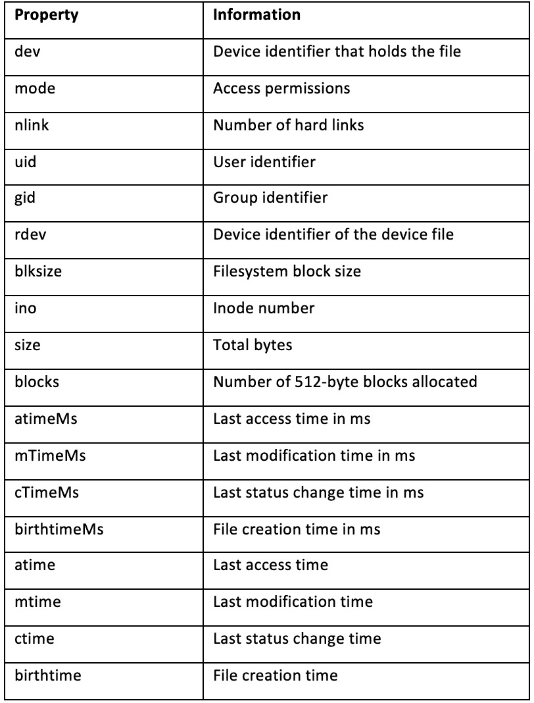
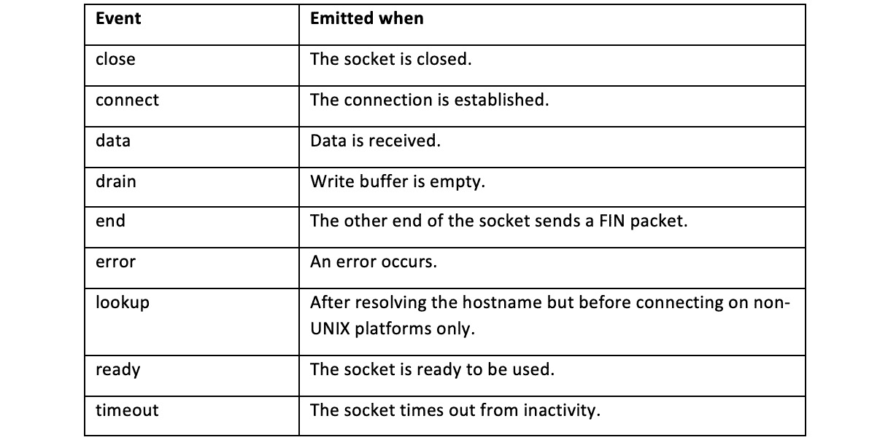

B13828_02_Final_NM

# *第 2 章*：处理 I/O

在 Node.js 之前，浏览器中主要使用 JavaScript。Node.js 将 JavaScript 引入服务器，并使我们能够使用 JavaScript 与操作系统进行交互。如今，Node.js 是构建服务器端应用程序最流行的技术之一。

Node.js 在一个基本级别与操作系统交互：输入和输出。本章将探讨 Node.js 提供的核心 API，这些 API 允许我们与标准 I/O、文件系统和网络堆栈进行交互。

本章将向您展示如何同步和异步读取和写入文件。构建 Node.js 是为了处理异步代码并启用非阻塞模型。理解如何读写异步代码是学习的关键，它将展示如何利用 Node.js 的功能。

我们还将了解 Node.js 提供的核心模块。我们将重点关注**文件系统**模块，它使您能够与文件系统和文件交互。

本章将介绍以下配方：

*   Handling standard I/O
*   Managing files with fs module
*   Inspecting file metadata
*   Watching for file updates
*   Creating TCP server and client communication

# 技术要求

本章假设您安装了 Node.js 14 的最新版本、终端或 shell 以及您选择的编辑器。本章的代码将在 GitHub 的[上提供 https://github.com/PacktPublishing/Node.js-14-Cookbook `Chapter02`目录中的](https://github.com/PacktPublishing/Node.js-14-Cookbook)。

# 处理标准 I/O

**STDIN**（中的**标准）是指程序可以用来从命令外壳或终端读取输入的输入流。类似地，**标准输出**（**标准输出**）是指用于写入输出的流。**STDERR**（**标准错误**是一个到标准输出的独立流，通常用于输出错误和诊断数据。**

在本教程中，我们将学习如何使用 STDIN 处理输入，将输出写入 STDOUT，并将错误记录到 STDERR。

## 准备好了吗

对于这个配方，我们首先创建一个名为`greeting.js`的文件。程序将通过 STDIN 请求用户输入，通过 STDOUT 返回问候语，并在提供无效输入时将错误记录到 STDERR。让我们也创建一个工作目录：

```js
$ mkdir interfacing-with-io
$ cd interfacing-with-io
$ touch greeting.js
```

现在，我们已经设置好了目录和文件，我们准备继续进行配方步骤。

## 怎么做

在这个配方中，我们将创建一个程序，它可以从 STDIN 读取数据并写入 STDIN 和 STDERR：

1.  First, we need to tell the program to listen for user input. This can be done by adding the following lines to `greeting.js`:

    ```js
    process.stdin.on("data", (data) => {
      // processing on each data event
    });
    ```

2.  We can run the file using the following command. Observe that the application does not exit because it is continuing to listen for `process.stdin` data events:

    ```js
    $ node greeting.js
    ```

3.  Exit the program using *CTRL* + *C*.
4.  We can now tell the program what it should do each time it detects a data event. Add the following lines below the `// processing on each data event` comment:

    ```js
      const name = data.toString().trim().toUpperCase();
      process.stdout.write(`Hello ${name}!`);
    ```

5.  You can now type some input in to your program, and it will return the greeting and your name in uppercase:

    ```js
    $ node greeting.js $ Beth   Hello BETH
    ```

6.  We can now add a check for whether the input string is empty, and log to STDERR if it is. Change your file to the following:

    ```js
    process.stdin.on("data", (data) => {
      const name = data.toString().trim().toUpperCase();
      if (name !== "") {
        process.stdout.write(`Hello ${name}!`);
      } else {
        process.stderr.write("Input was empty.");
      }
    });
    ```

现在，我们已经创建了一个程序，它可以从 STDIN 读取数据并写入 STDIN 和 STDERR。

## 它是如何工作的

`process.stdin`、`process.stdout`和`process.stderr`都是流程对象上的属性。全局流程对象提供 Node.js 流程的信息和控制。对于每个 I/O 通道，它们为接收到的每个数据块发出数据事件。在这个配方中，我们以交互模式运行程序，当您在 shell 中点击*回车*时，每个数据块由换行符确定。`process.stdin.on("data", (data) => {...});`监听这些数据事件。每个数据事件都返回一个缓冲区对象。缓冲区对象（通常称为`data`）返回输入的二进制表示形式。

`const name = data.toString()`将缓冲区对象转换为字符串。`trim()`函数删除表示每个输入结束的换行符。

我们使用进程对象（`process.stdout.write`、`process.stderr.write`上各自的属性写入 STDOUT 和 STDERR。

在制作过程中，我们还使用了*CTRL*`+`*C*退出 shell 中的程序。*CTRL*`+`*C*向 Node.js 进程发送`SIGINT`或信号中断。有关信号事件的更多信息，请参阅[中的 Node.js 流程 API 文档 https://nodejs.org/api/process.html#process_signal_events](https://nodejs.org/api/process.html#process_signal_events) 。

重要提示

**控制台 API:**发动机罩下，`console.log`和`console.err`正在使用`process.stdout`和`process.stderr`。

## 另见

*   [*Chapter 3*](03.html#_idTextAnchor064), *Streams, streams, streams*

# 使用 fs 模块管理文件

Node.js 提供了几个核心的模块，包括`fs`模块。`fs`代表文件系统，本模块提供与文件系统交互的 API。

在本教程中，我们将学习如何使用`fs`模块中提供的同步函数读取、写入和编辑文件。

## 准备好了吗

1.  Create another directory for this recipe:

    ```js
    $ mkdir working-with-files
    $ cd working-with-files
    ```

2.  And now let's create a file to read. Run the following in your shell to create a file containing some simple text:

    ```js
    $ echo Hello World! > hello.txt
    ```

3.  We'll also need a file for our program—create a file named `readWriteSync.js`:

    ```js
    $ touch readWriteSync.js
    ```

    重要提示

    `touch`是一个包含在基于 Unix 的操作系统中的命令行实用程序，用于将文件或目录的访问和修改日期更新为当前时间。但是，当`touch`在不存在的文件上没有附加参数的情况下运行时，它将创建一个具有该名称的空文件。`touch`是创建空文件的典型方式。

## 怎么做

在此配方中，我们将同步读取名为`hello.txt`的文件，操作文件内容，然后使用`fs`模块提供的同步功能更新文件：

1.  We'll start by requiring the built-in modules `fs` and `path`. Add the following lines to `readWriteSync.js`:

    ```js
    const fs = require("fs");
    const path = require("path");
    ```

2.  Now let's create a variable to store the file path of the `hello.txt` file that we created earlier:

    ```js
    const filepath = path.join(process.cwd(), "hello.txt");
    ```

3.  We can now synchronously read the file contents using the `readFileSync()` function provided by the `fs` module. We'll also print the file contents to STDOUT using `console.log()`:

    ```js
    const contents = fs.readFileSync(filepath, "utf8");
    console.log("File Contents:", contents);
    ```

4.  Now, we can edit the content of the file—we will convert the lowercase text into uppercase:

    ```js
    const upperContents = contents.toUpperCase();
    ```

5.  To update the file, we can use the `writeFileSync()` function. We'll also add a log statement afterward indicating that the file has been updated:

    ```js
    fs.writeFileSync(filepath, upperContents);
    console.log("File updated.");
    ```

6.  Run your program with the following:

    ```js
    $ node readWriteSync.js
    File Contents: Hello World!
    File updated.
    ```

您现在有了一个程序，当运行时，它将读取`hello.txt`的内容，将文本内容转换为大写，并更新文件。

## 它是如何工作的

前两行需要程序所需的核心模块。

`const fs = require("fs");`将导入核心 Node.js 文件系统模块。Node.js 文件系统模块的 API 文档可在[上获得 https://nodejs.org/api/fs.html](https://nodejs.org/api/fs.html) 。`fs`模块提供 API，使用 Node.js 与文件系统交互。类似地，核心`path`模块提供用于处理文件和目录路径的 API。`path`模块 API 文档可在[获取 https://nodejs.org/api/path.html](https://nodejs.org/api/path.html) 。

接下来，我们使用`path.join()`函数和`process.cwd()`定义了一个变量来存储`hello.txt`的文件路径。`path.join()`函数将作为参数提供的路径部分与特定平台的分隔符连接起来（例如，Unix 上的`/`和 Windows 环境下的`\`。

`process.cwd()`是全局进程对象上的函数，返回 Node.js 进程的当前目录。在此程序中，它希望`hello.txt`文件与程序位于同一目录中。

Next, we read the file using the `fs.readFileSync()` function. We pass this function the file path to read and the encoding, `"utf8"`. The encoding parameter is optional—when the parameter is omitted, the function will default to returning a Buffer object.

To perform manipulation of the file contents, we used the `toUpperCase()` function available on string objects.

Finally, we updated the file using the `fs.writeFileSync()` function. We passed the `fs.writeFileSync()` function two parameters. The first was the path to the file we wished to update, and the second parameter was the updated file contents.

Important note

Both the `readFileSync()` and `writeFileSync()` APIs are synchronous, which means that they will block/delay concurrent operations until the file read or write is completed. To avoid blocking, you'll want to use the asynchronous versions of these functions covered in the *There's more* section.

## There's more

Throughout this recipe, we were operating on our files synchronously. However, Node.js was developed with a focus on enabling the non-blocking I/O model, therefore, in many (if not most) cases, you'll want your operations to be asynchronous.

Today, there are three notable ways to handle asynchronous code in Node.js—callbacks, Promises, and `async/await` syntax. The earliest versions of Node.js only supported the callback pattern. Promises were added to the JavaScript specification with ECMAScript 2015, known as ES6, and subsequently, support for Promises was added to Node.js. Following the addition of Promise support, `async/await` syntax support was also added to Node.js.

All currently supported versions of Node.js now support callbacks, Promises, and `async/await` syntax. Let's explore how we can work with files asynchronously using these techniques.

### Working with files asynchronously

Asynchronous programming can enable some tasks or processing to continue while other operations are happening.

The program from the *Managing files with fs module* recipe was written using the synchronous functions available on the `fs` module:

```js
const fs = require("fs");
const path = require("path");
const filepath = path.join(process.cwd(), "hello.txt");
const contents = fs.readFileSync(filepath, "utf8");
console.log("File Contents:", contents);
const upperContents = contents.toUpperCase();
fs.writeFileSync(filepath, upperContents);
console.log("File updated.");
```

This means that the program was blocked waiting for the `readFileSync()` and `writeFileSync()` operations to complete. This program can be rewritten to make use of the asynchronous APIs.

The asynchronous version of `readFileSync()` is `readFile()`. The general convention is that synchronous APIs will have the term "sync" appended to their name. The asynchronous function requires a callback function to be passed to it. The callback function contains the code that we want to be executed when the asynchronous function completes.

1.  The `readFileSync()` function in this recipe could be changed to use the asynchronous function with the following:

    ```js
    const fs = require("fs");
    const path = require("path");
    const filepath = path.join(process.cwd(), "hello.txt");
    fs.readFile(filepath, "utf8", (err, contents) => {
      if (err) {
        return console.log(err);
      }
      console.log("File Contents:", contents);
      const upperContents = contents.toUpperCase();
      fs.writeFileSync(filepath, upperContents);
      console.log("File updated.");
    });
    ```

    Observe that all of the processing that is reliant on the file read needs to take place inside the callback function.

2.  The `writeFileSync()` function can also be replaced with the asynchronous function, `writeFile()`:

    ```js
    const fs = require("fs");
    const path = require("path");
    const filepath = path.join(process.cwd(), "hello.txt");
    fs.readFile(filepath, "utf8", (err, contents) => {
      if (err) {
        return console.log(err);
      }
      console.log("File Contents:", contents);
      const upperContents = contents.toUpperCase();
      fs.writeFile(filepath, upperContents, function (err) {
        if (err) throw err;
        console.log("File updated.");
      });
    });
    ```

3.  Note that we now have an asynchronous function that calls another asynchronous function. It's not recommended to have too many nested callbacks as it can negatively impact the readability of the code. Consider the following:

    ```js
    first(args, () => {
        second(args, () => {
            third(args, () => {});
        });
    });
    ```

4.  There are approaches that can be taken to avoid callback hell. One approach would be to split the callbacks into named functions. For example, our file could be rewritten so that the `writeFile()` call is contained within its own named function, `updateFile()`:

    ```js
    const fs = require("fs");
    const path = require("path");
    const filepath = path.join(process.cwd(), "hello.txt");
    fs.readFile(filepath, "utf8", (err, contents) => {
      if (err) {
        return console.log(err);
      }
      console.log("File Contents:", contents);
      const upperContents = contents.toUpperCase();
      updateFile(filepath, upperContents);
    });
    function updateFile(filepath, contents) {
      fs.writeFile(filepath, contents, (err) => {
        if (err) throw err;
        console.log("File updated.");
      });
    }
    ```

    Another approach would be to use Promises, which we'll cover in the *Using the fs Promise API* section of this chapter. But as the earliest versions of Node.js did not support Promises, the use of callbacks is still prevalent in many `npm` modules and existing applications.

5.  To demonstrate that this code is asynchronous, we can use the `setInterval()` function to print a string to the screen while the program is running. The `setInterval()` function enables you to schedule a function to happen at a specified delay in milliseconds. Add the following line to the end of your program:

    ```js
    setInterval(() => process.stdout.write("**** \n"), 1).unref();
    ```

    Observe that the string continues to be printed every millisecond, even in between when the file is being read and rewritten. This shows that the file reading and writing have been implemented in a non-blocking manner because operations are still completing while the file is being handled.

6.  To demonstrate this further, you could add a delay between the reading and writing of the file. To do this, wrap the `updateFile()` function in a `setTimeout()` function. The `setTimeout()` function allows you to pass it a function and a delay in milliseconds:

    ```js
    setTimeout(() => updateFile(filepath, upperContents), 10);
    ```

7.  Now the output from our program should have more asterisks printed between the file read and write, as this is where we added the 10ms delay:

    ```js
    $ node file-async.js
    **** 
    **** 
    File Contents: HELLO WORLD!
    **** 
    **** 
    **** 
    **** 
    **** 
    **** 
    **** 
    **** 
    **** 
    File updated
    ```

We can now see that we have converted the program from the *Managing files with fs module* recipe to handle the file operations asynchronously using the callback syntax.

### Using the fs Promises API

The `fs` Promises API was released in Node.js v10.0.0\. The API provides File System functions that return Promise objects rather than callbacks. Not all of the original `fs` module APIs have equivalent Promise-based APIs, as only a subset of the original APIs were converted to use Promise APIs. Refer to the Node.js API documentation for the full list of `fs` functions provided via the `fs` Promises API: [https://nodejs.org/dist/latest/docs/api/fs.html#fs_fs_promises_api](https://nodejs.org/dist/latest/docs/api/fs.html#fs_fs_promises_api).

A Promise is an object that is used to represent the completion of an asynchronous function. The naming is based on the general definition of the term Promise—an agreement to do something or that something will happen. A Promise object is always in one of the three following states:

*   Pending
*   Fulfilled
*   Rejected

A Promise will initially be in the pending state and will remain in the pending state until it becomes either fulfilled—when the task has completed successfully—or rejected—when the task has failed:

1.  To use the API, you'll first need to import it:

    ```js
    const fs = require("fs").promises;
    ```

2.  It is then possible to read the file using the `readFile`() function:

    ```js
    fs.readFile(filepath, "utf8").then((contents) => {
        console.log("File Contents:", contents);
    });
    ```

3.  You can also combine the `fs` Promises API with the use of the `async/await` syntax:

    ```js
    const fs = require("fs").promises;
    const path = require("path");
    const filepath = path.join(process.cwd(), "hello.txt");
    async function run() {
      try {
        const contents = await fs.readFile(filepath, "utf8");
        console.log("File Contents:", contents);
      } catch (error) {
        console.error(error);
      }
    }
    run();
    ```

Now we've learned how we can interact with files using the `fs` Promises API.

Important note

It was necessary to wrap the `async/await` example in a function as `await` must only be called from within an `async` function. There is an active proposal at ECMA TC39, the standardization body for ECMAScript (JavaScript), to support **Top-Level Await**, which would enable you to use the `await` syntax outside of an `async` function.

## See also

*   The *Inspecting file metadata* recipe in this chapter
*   The *Watching for file updates* recipe in this chapter

# Inspecting file metadata

The `fs` module generally provides APIs that are modeled around **Portable Operating System Interface** (**POSIX**) functions. The `fs` module includes APIs that facilitate the reading of directories and file metadata.

In this recipe, we will create a small program that returns information about a file, using functions provided by the `fs` module.

## Getting ready

Get started by creating a directory to work in:

```js
$ mkdir fetching-metadata $ cd fetching-metadata
```

We'll also need to create a file to read and a file for our program:

```js
$ touch metadata.js $ touch file.txt
```

## How to do it

Using the files created, we will create a program that gives information about the file we pass to it as a parameter:

1.  As in the previous handling I/O recipes, we first need to import the necessary core modules. For this recipe, we just need to import the `fs` module:

    ```js
    const fs = require("fs");
    ```

2.  Next, we need the program to be able to read the filename as a command-line argument. To read the file argument, we can use `process.argv[2]`. Add the following line to your program:

    ```js
    const file = process.argv[2];
    ```

3.  Now, we will create our `printMetadata()` function:

    ```js
    function printMetadata(file) {
      const fileStats = fs.statSync(file);
      console.log(fileStats);
    }
    ```

4.  添加对`printMetadata()`函数的调用：

    ```js
    printMetadata(file);
    ```

5.  您现在可以运行该程序，并将`./file.txt`参数传递给它。使用以下命令运行程序：

    ```js
    $ node metadata.js ./file.txt
    ```

6.  预期输出类似于以下内容：

    ```js
    Stats {
      dev: 16777224,
      mode: 33188,
      nlink: 1,
      uid: 501,
      gid: 20,
      rdev: 0,
      blksize: 4096,
      ino: 3684101,
      size: 0,
      blocks: 0,
      atimeMs: 1585337526680.254,
      mtimeMs: 1585337526680.254,
      ctimeMs: 1585337722432.1917,
      birthtimeMs: 1585337526680.254,
      atime: 2020-03-27T19:32:06.680Z,
      mtime: 2020-03-27T19:32:06.680Z,
      ctime: 2020-03-27T19:35:22.432Z,
      birthtime: 2020-03-27T19:32:06.680Z
    }
    ```

7.  您可以尝试向`file.txt`添加一些随机文本，然后重新运行您的程序；观察`size`和`mtime`值是否已更新。
8.  Now let's see what happens when we pass a non-existent file to the program:

    ```js
    $ node metadata.js ./not-a-file.txt
    internal/fs/utils.js:230
        throw err;
        ^
    Error: ENOENT: no such file or directory, stat 'nofile'
    ```

    The program throws an exception.

9.  我们应该捕获这个异常，并向用户输出一条消息，说明提供的文件路径不存在。为此，将`printMetadata()`功能更改为：

    ```js
    function printMetadata(file) {
      try {
        const fileStats = fs.statSync(file);
        console.log(fileStats);
      } catch (err) {
        console.error("Error reading file path:", file);
      }
    }
    ```

10.  使用不存在的文件再次运行程序；这次您应该看到程序处理了错误，而不是抛出异常：

    ```js
    $ node metadata.js ./not-a-file.txt
    Error reading file: undefined
    ```

## How it works

`process.argv` is a property on the global process object that returns an array containing the arguments that were passed to the Node.js process. The first element of the `process.argv` array, `process.argv[0]` is the path of the `node` binary that is running. The second element is the path of the file we're executing, in this case, `meta.js`. In the recipe, we passed the filename as the third command-line argument and therefore referenced it with `process.argv[2]`.

Next, we created a `printMetadata()` function that called `statSync(file)`. `statSync()` is a synchronous function that returns information about the file path that is passed to it. The file path passed can be either a file or a directory. The information returned is in the form of a `stats` object. The following table lists the information returned on the `stats` object:



Figure 2.1 – Table listing properties returned on the Stats object

Important note

In this recipe, we used only the synchronous File System APIs. For most of the `fs` APIs, there are both synchronous and asynchronous versions of each function. Refer to the *Working with files asynchronously* section of the previous recipe for more information about using asynchronous File System APIs.

In the final steps of this recipe, we edited our `printMetadata()` function to account for invalid file paths. We did this by wrapping the `statSync()` function in a `try/catch` statement.

## There's more

Next, we'll look at how we can check file access and modify file permissions and how to examine a symbolic link (symlink).

### Checking file access

It is recommended that if you're attempting to read, write, or edit a file, you follow the approach of handling the error if the file is not found, as we did in the recipe.

However, if you simply wanted to check the existence of a file, you could use the `fs.access()` or `fs.accessSync()` APIs. Specifically, the `fs.access()` function tests the user's permissions for accessing the file or directory passed to it. The function also allows an optional argument of mode to be passed to it, where you can request the function to do a specific access check using the Node.js File Access Constants. This list of Node.js File Access Constants is available in the Node.js `fs` module API documentation: [https://nodejs.org/api/fs.html#fs_file_access_constants](https://nodejs.org/api/fs.html#fs_file_access_constants). These enable you to check whether the Node.js process can read, write, or execute the file path provided.

Important note

There is a legacy API that is now deprecated called `fs.exists()`. It is not recommended you use this function—the `fs.access()` APIs should be used instead. 

### Modifying file permissions

The Node.js `fs` module provides APIs that can be used to alter the permissions on a given file. As with many of the other `fs` functions, there is both an asynchronous API, `chmod()`, and an equivalent synchronous API, `chmodSync()`. Both functions take a file path and `mode` as the first and second arguments, respectively. The asynchronous function accepts a third parameter, which is the callback function to be executed upon completion.

Important note

`chmod` is a command that is used to change access permissions of file system objects on Unix and similar operating systems. If you're unfamiliar with Unix file permissions, it is recommended you refer to the Unix manual pages ([https://linux.die.net/man/1/chmod](https://linux.die.net/man/1/chmod)).

The mode argument can be either in the form of a numeric bitmask using a series of constants provided by the `fs` module or a sequence of three octal digits. The constants that can be used to create the bitmask to define user permissions are defined in the Node.js API documentation: [https://nodejs.org/api/fs.html#fs_file_modes](https://nodejs.org/api/fs.html#fs_file_modes).

Imagine that you have a file that currently has the following permissions:

*   所有者可读写
*   组可读
*   仅由所有其他用户可读（有时称为世界可读）

If we wanted to additionally grant write access to those in the same group in our shell, we could use the following Node.js code:

```js
const fs = require("fs");
const file = "./file.txt";
fs.chmodSync(
  file,
  fs.constants.S_IRUSR |
    fs.constants.S_IWUSR |
    fs.constants.S_IRGRP |
    fs.constants.S_IWGRP |
    fs.constants.S_IROTH
);
```

As you can see, this code is quite verbose. Adding a complex series of permissions would require passing a numerous amount of constants to create the numeric bitmask. Alternatively, we can pass the `chmodSync()` function the octal representation of file permissions, similar to how you can when using the Unix `chmod` command. We're going to change the permissions using the equivalent of `chmod 664` from the command line, but via Node.js:

```js
const fs = require("fs");
const file = "./file.txt";
fs.chmodSync(file, 0o664);
```

Important Note

Refer to [https://mason.gmu.edu/~montecin/UNIXpermiss.htm](https://mason.gmu.edu/~montecin/UNIXpermiss.htm) for more detailed information on how Unix permissions work.**Windows File Permissions**: The Windows operating system does not have as refined file permissions as on Unix—it is only possible to denote a file as writeable or non-writeable.

### Inspecting symbolic links

A **symbolic link**, or **symlink**, is a special file that stores a reference to another file or directory. When the `stat` or `statSync()` function from the *Inspecting file metadata* recipe is run on a symbolic link, it will return information about the file the symbolic link references, rather than the symbolic link itself.

The Node.js `fs` module does, however, provide the functions named `lstat()` and `lstatSync()` that inspect the symbolic link itself:

1.  要创建符号链接，可以使用以下命令：

    ```js
    $ ln -s file.txt link-to-file
    ```

2.  现在，您可以使用 Node.js REPL（Read Eval Print Loop）来测试`lstatSync()`函数。js REPL 是一个交互式 shell，我们可以将语句传递给它，它将对语句进行求值并将结果返回给用户。
3.  要进入 Node.jsREPL，请在 shell 中键入`node`：

    ```js
    $ node
    Welcome to Node.js v14.0.0.
    Type ".help" for more information.
    >
    ```

4.  然后可以键入如下命令：

    ```js
    > console.log("Hello World!");
    Hello World!
    Undefined
    ```

5.  现在您可以尝试使用`lstatSync`命令：

    ```js
    > fs.lstatSync("link-to-file"); 
    Stats {
      dev: 16777224,
      mode: 41453,
      nlink: 1,
      ...
    }
    ```

Note that we did not need to explicitly import the Node.js `fs` module. The REPL automatically loads the core (built-in) Node.js modules so that they are available to be used. The REPL is a useful tool for testing out commands without having to create new files.

## See also

*   本章中的*处理标准 I/O*配方

# Watching for file updates

Node.js's `fs` module provides functionality that enables you to watch files and track when files or directories are created, updated, or deleted.

In this recipe, we'll create a small program named `watch.js` that watches for changes in a file using the `watchFile()` API and then prints a message when a change has occurred.

## Getting ready

1.  对于这个配方，我们需要在一个新的目录中工作。创建并更改为名为`file-watching`：

    ```js
    $ mkdir file-watching
    $ cd file-watching
    ```

    的目录
2.  我们还需要创建一个可以观看的文件：

    ```js
    $ echo "Hello World!" > file.txt 
    ```

3.  创建`watch.js`文件：

    ```js
    $ touch watch.js
    ```

Now that we have created our directory and file, we can move on to the recipe.

## How to do it

We're going to create a program that watches for changes in a file. We will be using the `fs` module and, specifically, the `watchFile()` method to achieve this:

1.  要开始，请导入所需的 core Node.js 模块：

    ```js
    const fs = require("fs");
    ```

2.  我们还需要程序来访问我们创建的文件：

    ```js
    const file = "./file.txt";
    ```

3.  接下来我们调用`fs.watchFile()`函数：

    ```js
    fs.watchFile(file, (current, previous) => {  
        return console.log(`${file} updated ${(current.mtime)}`);
    });
    ```

4.  现在，我们可以在终端中使用以下命令运行程序：

    ```js
    $ node watch.js 
    ```

5.  在编辑器中，打开`file.txt`并进行一些编辑，在每个编辑之间进行保存。您会注意到，每次保存时，您运行的终端`watch.js`：

    ```js
    ./file.txt updated Wed Mar 25 2020 00:38:31 GMT+0000 (Greenwich Mean Time)
    ```

    中都会出现一个日志条目
6.  在这里，我们可以使时间戳更具可读性。为此，我们将使用`moment.js`模块。它是一个外部模块，允许您在 JavaScript 中操作日期和时间。
7.  首先，我们需要初始化一个新项目。通过键入`$ npm init --yes`完成此操作。[*第五章*](05.html#_idTextAnchor134)*，开发 Node.js 模块*将详细介绍此命令。现在，我们将通过`--yes`选项来接受默认值。现在，您的项目目录中应该有一个`package.json`文件。
8.  Now we can install the `moment.js` module. Note that this step will require an internet connection, as the package will be downloaded from the public `npm` registry:

    ```js
    $ npm install moment 
    ```

    If you open `package.json`, you will notice that `moment` has been added under the `dependencies` field.

9.  我们现在需要将`moment`导入我们的`watch.js`文件。在文件常量声明下方添加以下内容：

    ```js
    const moment = require("moment");
    ```

10.  添加并更改以下行以使用`moment.js`格式化日期：

    ```js
      const time = moment().format("MMMM Do YYYY, h:mm:ss a");
      return console.log(`${filename} updated ${time}`);
    ```

11.  重新运行程序并对`file.txt`进行进一步编辑-观察时间现在以更可读的格式：

    ```js
    $ node watch.js
    ./file.txt updated March 27th 2020, 3:38:27 pm
    ```

## How it works

In the recipe, we used the `watchFile()` function to watch for changes on a given file path. The function accepts three arguments—a filename, a list of options, and a listener function. The `options` object can include the following:

*   **BigInt**：默认为`false`；当设置为`true`时，`Stats`对象返回的数值将指定为`BigInt`。`BigInt`是一个 JavaScript 对象，允许您更可靠地表示更大的数字。
*   **Persistent**：此值指示 Node.js 进程是否应在仍在监视文件时继续运行。默认为`true`。
*   **间隔**：间隔值控制轮询文件更改的频率，以毫秒为单位。没有提供间隔时，默认值为 5007 毫秒。

The listener function supplied to the `watchFile()` function will execute every time a change is detected. The listener function's arguments current and previous are both `Stats` objects, representing the current and previous state of the file.

Our listener function passed to `watchFile()` is executed each time a change has been detected in the file being watched. Every time the file is updated, our `listener` function logs the message to STDOUT.

The Node.js `fs` module provides another function watch that watches for changes in files but can also watch for directories. This function differs from `watchFile()` as it utilizes the operating system's underlying file system notification implementation, rather than polling for changes.

Although faster and more reliable than the `watchFile()` API, the Watch API is not consistent across various platforms. This is because the Watch API is dependent on the underlying operating systems method of notifying file system changes. The Node.js API documentation goes into more detail about the limitations of the Watch API across different platforms: [https://nodejs.org/docs/latest/api/fs.html#fs_availability](https://nodejs.org/docs/latest/api/fs.html#fs_availability).

The `watchFile()` function accepts three parameters—the file path, an array of options, and a listener function. The options that can be passed via the options parameter are as follows:

*   **Persistent**：Persistent 选项是一个布尔值，用于指示 Node.js 进程是否应在仍在监视文件时继续运行。默认情况下，持久选项设置为`true`。
*   **递归**：递归选项是另一个布尔值，允许用户指定是否应监视子目录中的更改–默认情况下，该值设置为`false`。递归选项仅在 macOS 和 Windows 操作系统上受支持。
*   **编码**：编码选项用于指定指定的文件名应使用哪个字符编码，默认为`utf8`。

The listener function that is passed to the `watch()` API is slightly different to the listener function passed to the `watchFile()` API. The arguments to the listener function are `eventType` and `trigger`, where `eventType` is either `change` or `rename` and `trigger` is the file that triggered an event. The following code represents a similar task to what we implemented in our recipe but using the Watch API:

```js
const fs = require("fs");
const file = "./file.txt";
const moment = require("moment");
fs.watch(file, (eventType, filename) => {
    const time = moment().format("MMMM Do YYYY, h:mm:ss a");
    return console.log(`${filename} updated ${time}`);
});
```

The final steps of the recipe cover installing, importing, and using the `npm` module, `moment.js`. `moment.js` is a popular JavaScript library that enables users to parse, validate, and display dates and times. In the recipe, we used the module to format the last updated time in a more readable date and time format, `MMMM DD YYYY, h:mm:ss a`. It is possible to customize how you want `moment.js` to display the date format, as in this example:

```js
moment().format('dddd'); // Saturday
moment().format("MMM Do YY"); // Mar 28th 20
moment().format(); // 2020-03-28T16:59:14+00:00
```

Refer to the Moment.js documentation for the list of available formats and APIs: [https://momentjs.com/docs/](https://momentjs.com/docs/).

## See also

*   [*第五章*](05.html#_idTextAnchor134)*消费 Node.js 模块*配方*开发 Node.js 模块*

# Creating TCP server and client communication

Sockets allow machines and devices to communicate. Sockets are also used to coordinate I/O across networks. The term socket is used to refer to one endpoint of a two-way network communication link. Sockets enable us to build real-time web applications, such as instant messaging applications.

In this recipe, we will create a TCP server and a TCP client and allow them to communicate. **TCP** stands for **Transmission Control Protocol**. TCP provides a standard that allows devices to communicate over a network.

## Getting ready

First, let's create a directory to work in:

```js
$ mkdir communicating-with-sockets
$ cd communicating-with-sockets
```

We'll also need two separate files, one for the server and one for the client:

```js
$ touch server.js
$ touch client.js
```

## How to do it

First, we're going to create a TCP server using the `net` Node.js core module:

1.  我们需要导入`server.js`：

    ```js
    const net = require("net");
    ```

    中的`net`模块
2.  现在，让我们设置一些变量来存储希望服务器运行的主机名和端口：

    ```js
    const HOSTNAME = "localhost";
    const PORT = 3000;
    ```

3.  现在，我们可以创建服务器，将`HOSTNAME`和`PORT`变量传递给`listen()`函数：

    ```js
    net
      .createServer((socket) => {
        console.log("Client connected.");
      })
      .listen(PORT, HOSTNAME);
    ```

4.  现在我们应该添加一些套接字事件侦听器。在`console.log("Client connected.");`行下方添加以下两个事件侦听器：

    ```js
        socket.on("data", (name) => {
          socket.write(`Hello ${name}!`);
        });
    ```

5.  现在，让我们创建客户机。同样，我们需要从导入`client.js`：

    ```js
    const net = require("net");
    ```

    中的`net`模块开始
6.  接下来，我们可以尝试连接到我们在`server.js`中配置的服务器。我们将在这个文件中再次定义`HOSTNAME`和`PORT`变量：

    ```js
    const HOSTNAME = "localhost";
    const PORT = 3000;
    const socket = net.connect(PORT, HOSTNAME);
    ```

7.  现在我们已经连接到该套接字，我们可以向其写入：

    ```js
    socket.write("World");
    ```

8.  我们还需要添加一个函数来侦听套接字返回的数据：

    ```js
    socket.on("data", (data) => {
      console.log(data.toString());
    });
    ```

9.  使用以下命令运行服务器：

    ```js
    $ node server.js
    ```

10.  在第二个 shell 中，运行`client.js`：

    ```js
    $ node client.js
    ```

11.  在运行`server.js`的 shell 中，您应该看到输出，`Client connected`：

    ```js
    $ node server.js
    Client connected.
    ```

12.  在您运行的 shell`client.js`中，您应该看到套接字已响应`Hello World`：

    ```js
    $ node client.js
    Hello World!
    ```

We've successfully set up a TCP server and client and allowed them to communicate via sockets.

## How it works

The first half of the recipe focused on creating a TCP server.

The recipe used the `createServer()` function from the core Node.js to `http` module and the `net` function to create the server. The function passed to `createServer()` accepts a function, and this function is executed each time a new connection is made to the server. The Node.js API documentation describes this function as a `connectionListener` function.

`socket` is passed as an argument to this connection listener function. It is possible to listen for events on the socket object. In the recipe, we listened for the `data` event and registered a function to execute each time data was received.

We then called the `listen()` function on `createServer()`—this function starts the server listening for connections. In the recipe, we passed the `listen()` function the hostname and port that we wanted the server to be accessible at. Note that it is also possible to listen on a Unix socket such as the following:

```js
	const socket = net.connect("/tmp/my.socket");
```

Similarly, we also registered a `data` listener in `client.js`, which was listening for data written back from the server.

There are many other events that can be listened for on socket objects:



Figure 2.2 – Table listing socket events

## There's more

For some communications, UDP is more appropriate than TCP. Let's take a look at what UDP sockets are, what they're used for, and how to implement a UDP socket.

**UDP** stands for **User Datagram Protocol** and is an alternative to TCP. UDP is a connectionless protocol. Unlike TCP, the protocol does not establish a connection before sending data. UDP also doesn't guarantee delivery of packets—some can be lost. UDP is most often used in cases where speed is considered more important than reliability. UDP is typically used for video calling, gaming, or streaming—because in these cases, minimizing delay is important.

Node.js provides a core module named `dgram` that provides APIs to interact with UDP sockets. As with the other core modules, it can be imported with the following:

```js
const dgram = require("dgram");
```

To create a socket, the `dgram` module exposes a `createSocket()` API:

```js
const socket = dgram.createSocket("udp6");
```

We pass the `udp6` function to instruct that we'd like the socket to interface over both IPv4 and IPv6.

To instruct the socket to start listening for connections, you use the `bind` function:

```js
socket.bind(PORT);
```

Note that it is not necessary to provide a port. If none is provided (or you provide `0`); the operating system will bind to a random free port.