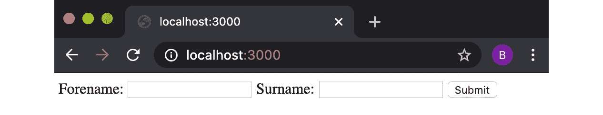

B13828_04_Final_NM

# *第四章*：使用网络协议

Node.js 是在考虑 web 服务器的情况下构建的。使用 Node.js，我们可以用几行代码快速创建一个 web 服务器，从而可以自定义服务器的行为。

本章将展示 Node.js 为与 web 协议交互而提供的底层核心**应用程序编程接口**（**API**）。我们将首先制作**超文本传输协议**（**HTTP**）请求，创建 HTTP 服务器，并学习如何处理 POST 请求和文件上传。在本章后面，我们将学习如何创建 WebSocket 服务器以及如何使用 Node.js 创建 SMTP 服务器。

了解 Node.js 如何与底层 web 协议交互非常重要，因为这些 web 协议和基本概念构成了大多数真实 web 应用程序的基础。稍后，在[*第 6 章*](06.html#_idTextAnchor165)*探索 Node.js Web 框架*中，我们将学习如何使用 Web 框架将 Web 协议抽象为更高级别的 API，但了解 Node.js 如何在较低级别与 Web 协议交互非常重要。

本章将介绍以下配方：

*   使用 http 模块发出 http 请求
*   构建 HTTP 服务器以接受 GET 请求
*   处理 HTTP POST 请求
*   使用“强大”处理文件上载
*   使用 ws 创建 WebSocket 服务器
*   Sending an automated email using your own SMTP server

    超文本传输协议

    HTTP 是一种无状态协议，最初设计用于促进 web 浏览器和服务器之间的通信。本章中的方法将重点介绍如何处理和发送 HTTP 请求。尽管这些方法不需要深入了解 HTTP 是如何运行的，但如果您对这个概念完全陌生，那么阅读一篇高级概述是值得的。*MDN web docs*在[处提供 HTTP 概述 https://developer.mozilla.org/en-US/docs/Web/HTTP/Overview](https://developer.mozilla.org/en-US/docs/Web/HTTP/Overview) 。

# 技术要求

本章要求您安装 Node.js，最好是 Node.js 14 的最新版本。此外，您还需要访问自己选择的编辑器和浏览器。本章中使用的代码示例可从[获取 https://github.com/PacktPublishing/Node.js-14-Cookbook `Chapter04`目录中的](https://github.com/PacktPublishing/Node.js-14-Cookbook)。

# 使用 http 模块进行 http 请求

程序和应用程序通常需要从其他来源或服务器获取数据。在现代 web 开发中，这通常是通过向源或服务器发送 HTTP GET 请求来实现的。类似地，应用程序或程序也可能需要向其他源或服务器发送数据。这通常通过向目标源或服务器发送包含数据的 HTTP POST 请求来实现。

Node.js 核心模块`http`和`https`模块除了用于构建 HTTP 服务器外，还公开了可用于向其他服务器发送请求的 API。

在这个方法中，我们将使用 Node.js 核心`http`和`https`模块发送 HTTP GET 请求和 HTTP POST 请求。

## 准备好了吗

首先为该配方创建一个名为`making-requests`的目录。我们还将创建一个名为`requests.js`的文件：

```js
$ mkdir making-requests
$ cd making-requests
$ touch requests.js
```

## 怎么做…

我们将使用 Node.js core`http`模块发送 HTTP GET 请求和 HTTP POST 请求。

1.  从导入您的`requests.js`文件

    ```js
    const http = require("http");
    ```

    中的`http`模块开始
2.  现在，我们可以发送一个 HTTP GET 请求。我们将向`http://example.com`发送请求。这可以通过一行代码完成：

    ```js
    http.get("http://example.com", (res) => res.pipe(process.stdout));
    ```

3.  使用以下命令执行 Node.js 脚本。您应该希望看到打印到`STDOUT`：

    ```js
    $ node requests.js
    ```

    的`http://example.com`的 HTML 表示
4.  现在，我们可以看看如何发送 HTTP POST 请求。将[T1-T0 中的注释留在后面会使`//`的输出变得困难
5.  对于 HTTP POST 请求，我们首先需要定义要随请求一起发送的数据。为了实现这一点，我们定义了一个名为`payload`的变量，其中包含数据的**JavaScript 对象表示法**（**JSON**）表示：

    ```js
    const payload = `{
        "name": "Beth",
        "job": "Software Engineer"
    }`;
    ```

6.  We also need to create a configuration object for the options we want to send with the HTTP POST request. We're going to send the HTTP POST request to [http://postman-echo.com](http://postman-echo.com). This is a test endpoint that will return our HTTP headers, parameters, and content of our HTTP POST request—mirroring our request:

    ```js
    const opts = {
      method: "POST",
      hostname: "postman-echo.com",
      path: "/post",
      headers: {
        "Content-Type": "application/json",
        "Content-Length": Buffer.byteLength(payload),
      },
    };
    ```

    重要提示

    邮递员（[http://postman.com](http://postman.com) 是API 开发平台，提供**代表性状态转移**（**REST**客户端应用，可下载使用发送 HTTP 请求。Postman 还提供了一个名为 Postman Echo 的服务，它提供了一个端点，您可以将 HTTP 请求发送到该端点进行测试。请参阅邮递员回音文档，网址为：[https://docs.postman-echo.com/?version=latest](https://docs.postman-echo.com/?version=latest) 。

7.  要发送 HTTP POST 请求，请添加以下代码。收到响应后，将 HTTP 状态码和正文的响应写入`STDOUT`：

    ```js
    const req = http.request(opts, (res) => {
      process.stdout.write("Status Code: " + res.statusCode +   "\n");
      process.stdout.write("Body: ");
      res.pipe(process.stdout);
    });
    ```

8.  我们还应该捕获请求中发生的任何错误：

    ```js
    req.on("error", (err) => console.error("Error: ", err));
    ```

9.  最后，我们需要发送带有有效负载的请求：

    ```js
    req.end(payload);
    ```

10.  现在，执行您的程序，您应该看到 Postman Echo API 响应我们的 HTTP POST 请求：

    ```js
    $ node requests.js 
    Status Code: 200
    Body: {"args":{},"data":{"name":"Beth","job":"Software Engineer"},"files":{},"form":{},"headers":{"x-forwarded-proto":"https","x-forwarded-port":"443","host":"postman-echo.com","x-amzn-trace-id":"Root=1-5ed2ed93-95ea26a7dd94a06ede2d828f","content-length":"56","content-type":"application/json"},"json":{"name":"Beth","job":"Software Engineer"},"url":"https://postman-echo.com/post"}%
    ```

我们已经学习了如何使用 Node.js core`http`模块发送 HTTP GET 和 HTTP POST 请求。

## 它是如何工作的…

在此配方中，我们利用 Node.js core`http`模块发送 HTTP GET 和 HTTP POST 请求。Node.js core`http`模块依赖于底层 Node.js core`net`模块。

对于 HTTP GET 请求，我们使用两个参数调用`http.get()`函数。第一个参数是我们希望向其发送请求的端点，第二个参数是回调函数。一旦 HTTP GET 请求完成，回调函数就会执行，在此配方中，我们的函数将从端点接收到的响应转发到`STDOUT`。

为了发出 HTTP POST 请求，我们使用了`http.request()`函数。此函数还接受两个参数。

`request()`函数的第一个参数是`options`对象。在配方中，我们使用了`options`对象来配置要使用的 HTTP 方法、主机名、请求应该发送到的路径以及要在请求上设置的头。可传递给`request()`函数的完整配置选项列表可在 Node.js HTTP API 文档中查看(https://nodejs.org/api/http.html#http_http_request_options_callback).

`request()`函数的第二个参数是在 HTTP POST 请求完成时执行的回调函数。我们的请求函数写入 HTTP 状态代码，并将请求的响应转发给 STDOUT。

向请求对象添加了一个`error`事件侦听器，以捕获任何错误并将其记录到标准输出：

```js
req.on("error", (err) => console.error("Error: ", err));
```

`req.end(payload);`语句发送带有有效负载的请求。

## 还有更多…

该配方演示了如何通过 HTTP 发送 GET 和 POST 请求，但也值得考虑如何通过 HTTPS 发送请求。**HTTPS**代表**超文本传输协议****安全**。HTTPS 是 HTTP 协议的扩展。HTTPS 上的通信是加密的。Node.js core 在`http`模块旁边提供了一个`https`模块，用于处理 HTTPS 通信。

通过导入`https`核心模块和将`http`的任何实例更改为`https`，可以将配方中的请求更改为使用 HTTPS：

```js
const https = require("https");
https.get(...);
https.request(...);
```

## 另见

*   本章中的*构建 HTTP 服务器以接受 GET 请求*方法
*   本章中的*处理 HTTP POST 请求*配方
*   [*第三章*](03.html#_idTextAnchor064)*溪流、溪流、溪流*
*   [*第 6 章*](06.html#_idTextAnchor165)*探索 Node.js Web 框架*
*   [*第 9 章*](09.html#_idTextAnchor259)*保护 Node.js 应用程序*

# 构建 HTTP 服务器以接受 GET 请求

**HTTP**代表**超文本传输协议**，是支撑**万维网**（**WWW**的应用层协议。HTTP 支持服务器和浏览器之间的通信。在此配方中，我们将使用 Node.js 核心 API 构建一个只接受 GET 请求的 HTTP 服务器。

重要提示

在构建大型复杂应用程序时，通常使用更高级别的框架来实现这些应用程序，而不是与核心 Node.js API 交互。但是，了解底层 API 很重要，在某些情况下，只有与底层 Node.js API 交互才能提供特定情况下所需的细粒度控制。

## 准备好了吗

首先为该配方创建一个目录，并创建一个名为`server.js`的文件，该文件将包含我们的 HTTP 服务器：

```js
$ mkdir http-server
$ cd http-server
$ touch server.js
```

## 怎么做…

对于这个配方，我们将使用 core Node.js`http`模块。`http`模块的 API 文档可在[获取 https://nodejs.org/api/http.html](https://nodejs.org/api/http.html) 。在配方中，我们将创建一个“待办”任务服务器。

1.  首先，我们需要导入 core Node.js`http`模块，在`server.js`中添加以下行：

    ```js
    const http = require("http");
    ```

2.  现在，我们将为服务器定义主机名和端口：

    ```js
    const HOSTNAME = process.env.HOSTNAME || "0.0.0.0";
    const PORT = process.env.PORT || 3000;
    ```

3.  现在，我们可以创建服务器并添加一些路由处理。在`createServer()`函数中，我们将引用我们将在以下步骤中创建的`error()`、`todo()`和`index()`函数：

    ```js
    const server = http.createServer((req, res) => {
      if (req.method !== "GET") return error(res, 405);
      if (req.url === "/todo") return todo(res);
      if (req.url === "/") return index(res);
      error(res, 404);
    });
    ```

4.  现在，让我们创建`error()`函数。此函数将获取响应对象的一个参数和一个状态代码，其中该代码应为 HTTP 状态代码：

    ```js
    function error(res, code) {
      res.statusCode = code;
      res.end(`{"error": "${http.STATUS_CODES[code]}"}`);
    }
    ```

5.  接下来，我们将创建`todo()`函数。现在，这个函数只返回一个静态 JSON 字符串，表示“待办事项”列表中的一项：

    ```js
    function todo(res) {
      res.end('[{"task_id": 1, "description": "walk   dog"}]}');
    }
    ```

6.  创建的最后一个函数是`index()`函数，当我们在`/`路由

    ```js
    function index(res) {
      res.end('{"name": "todo-server"}');
    }
    ```

    上执行 GET 请求时，将调用该函数
7.  最后，我们需要在服务器上调用`listen()`函数。我们还将向`listen()`函数传递一个回调函数，该函数将在服务器启动后注销服务器正在侦听的地址：

    ```js
    server.listen(PORT, HOSTNAME, () => {
      console.log(`Server listening on port ${server.  address().port}`);
    });
    ```

8.  现在可以从终端启动服务器：

    ```js
    $ node server.js              
    Server listening on port 3000
    ```

9.  在单独的终端窗口中，我们可以使用`curl`向服务器发送 GET 请求，也可以访问浏览器中的两个端点：

    ```js
    $ curl http://localhost:3000/
    {"name": "todo-server"}%
    $ curl http://localhost:3000/todo
    [{"task_id": 1, "description": "walk dog"}]}%
    ```

我们已经构建了一个基本的“待办事项”列表服务器，我们可以向其发送 HTTP GET 请求，服务器用 JSON 数据进行响应。

## 它是如何工作的…

Node.js 核心`http`模块提供 HTTP 协议功能的接口。

在配方中，我们使用`http`模块公开的`createServer()`函数创建了一个服务器。我们向`createServer()`函数传递了一个请求侦听器函数，该函数在每次请求时执行。

每次收到到指定路由的请求时，都将执行请求侦听器函数。请求侦听器函数有两个参数，`req`和`res`，其中`req`是请求对象，`res`是响应对象。`http`模块根据请求中的数据创建`req`对象。

可以将`options`对象作为第一个参数传递给`createServer()`函数。请参阅`http`模块 Node.js API 文档，查看哪些参数和选项可以传递给[中的各种`http`函数 https://nodejs.org/api/http.html](https://nodejs.org/api/http.html) 。

`createServer()`函数返回一个`http.Server`对象。我们通过调用`listen()`函数来启动服务器。我们传递`listen()`我们的`HOSTNAME`和`PORT`参数，以指示服务器应该监听哪个主机名和端口。

配方中的请求处理程序由三个`if`语句组成。第一条`if`语句检查发送传入请求的 HTTP 方法的`req.method`属性：

```js
  if (req.method !== "GET") return error(res, 405);
```

在这个配方中，我们只允许 GET 请求。当在传入请求中检测到任何其他 HTTP 方法时，我们返回并调用错误函数。

后两条`if`语句检查`req.url`值。请求上的`url`属性通知我们请求发送到哪个路由。`req.url`属性不提供完整的**统一资源定位器**（**URL**），只提供相对路径或“路由”段。中的`if`语句控制每次请求特定 URL 时调用哪个函数，这形成了一个简单的路由处理程序。

侦听器函数的最后一行调用我们的`error()`。只有当我们的条件`if`语句都不满足时，才会到达此行。在我们的配方中，当请求发送到除`/`或`/todo`以外的任何路由时，就会发生这种情况。

我们将响应对象`res`传递给我们的`error()`、`todo()`和`index()`函数。该对象是一个`Stream`。我们调用`res.end()`返回所需的内容。

对于 error 函数，我们传递了一个附加参数`code`。我们使用它来传递然后返回 HTTP 状态码。HTTP 状态代码是 HTTP 协议规范的一部分(https://tools.ietf.org/html/rfc2616#section-10). 下表显示了 HTTP 响应代码的分组方式：


图 4.1–列出 HTTP 状态代码及其使用的表格

在配方中，我们返回了以下错误代码：

*   404 找不到
*   405 方法不允许

`http`模块公开了一个常量对象，该对象存储所有 HTTP 响应代码及其对应的描述-`http.STATUS_CODES`。我们使用它返回带有`http.STATUS_CODE`的响应消息。

## 还有更多…

在某些情况下，您可能不想预定义服务器绑定到的端口。可以将 HTTP 服务器绑定到随机空闲端口。在配方中，我们使用以下行为`HOSTNAME`和`PORT`值定义了一个常数：

```js
const HOSTNAME = process.env.HOSTNAME || "0.0.0.0";
const PORT = process.env.PORT || 3000;
```

使用`process.env`允许将值设置为环境变量。如果未设置环境变量，则使用 OR 逻辑运算符（`||`将意味着主机名和端口值分别默认为`0.0.0.0`和`3000`。

允许通过环境变量设置主机名和端口值是一种很好的做法，因为这允许部署编排器（如 Kubernetes）在运行时注入这些值。

也可以指示服务器绑定到随机空闲端口。为此，我们将`HOSTNAME`值设置为`0`。可以将分配`PORT`变量的配方代码更改为以下代码，以指示服务器侦听随机空闲端口：

```js
const PORT = process.env.PORT || 0;
```

## 另见

*   本章中的*处理 HTTP POST 请求*配方
*   [*第 6 章*](06.html#_idTextAnchor165)*探索 Node.js Web 框架*
*   [*第 11 章*](11.html#_idTextAnchor337)*部署 Node.js 微服务*

# 处理 HTTP POST 请求

HTTP POST 方法用于向服务器发送数据，而 HTTP GET 方法用于获取数据。

为了能够接收 POST 数据，我们需要指示服务器如何接受和处理 POST 请求。POST 请求通常包含请求主体中的数据，这些数据被发送到服务器进行处理。web 表单的提交通常通过 HTTP POST 请求完成。

重要提示

在 PHP 中，可以通过`$_POST`数组访问 POST 数据。PHP 不遵循 Node.js 所遵循的非阻塞体系结构，这意味着 PHP 程序将等待或阻塞，直到填充`$_POST`值。然而，Node.js 在较低级别上提供了与 HTTP 数据的异步交互，这允许我们以流的形式与传入消息体进行交互。这意味着传入流的处理在开发人员的控制和关注范围内。

在这个配方中，我们将创建一个 web 服务器来接受和处理 HTTP POST 请求。

## 准备好了吗

1.  首先为这个配方创建一个目录。我们还需要一个名为`server.js`的文件，该文件将包含我们的 HTTP 服务器：

    ```js
    $ mkdir post-server
    $ cd post-server
    $ touch server.js
    ```

2.  我们还需要创建一个名为`public`的子目录，其中包含一个名为`form.html`的文件，该文件将包含一个 HTML 表单：

    ```js
    $ mkdir public
    $ touch public/form.html
    ```

## 怎么做…

我们将创建一个服务器，它使用`http`模块提供的 Node.js 核心 API 接受和处理 HTTP GET 和 HTTP POST 请求。

1.  首先，让我们设置一个 HTML 表单，其中包含输入域名和姓氏的字段。打开`form.html`和添加以下内容：

    ```js
    <form method="POST">
        <label for="forename">Forename:</label>
        <input id="forename" name="forename">
        <label for="surname">Surname:</label>
        <input id="surname" name="surname">
        <input type="submit" value="Submit">
    </form>
    ```

2.  接下来，打开`server.js`文件，导入`fs`、`http`和`path`Node.js 核心模块：

    ```js
    const http = require("http");
    const fs = require("fs");
    const path = require("path");
    ```

3.  在下一行，我们将创建对`form.html`文件的引用：

    ```js
    const form = fs.readFileSync(path.join(__dirname, "public", "form.html"));
    ```

4.  现在，将以下代码行添加到`server.js`以设置服务器。我们还将创建一个函数来返回名为`get()`的表单和一个名为`error()`：

    ```js
    http
      .createServer((req, res) => {
        if (req.method === "GET") {
          get(res);
          return;
        }
        error(405, res);
      })
      .listen(3000);
    function get(res) {
      res.writeHead(200, {
        "Content-Type": "text/html",
      });
      res.end(form);
    }
    function error(code, res) {
      res.statusCode = code;
      res.end(http.STATUS_CODES[code]);
    }
    ```

    的错误函数
5.  Start your server and confirm that you can view the form in your browser at [http://localhost:3000](http://localhost:3000):

    ```js
    $ node server.js
    ```

    希望在浏览器中看到以下 HTML 表单：

    

    图 4.2–描绘 HTML 表单的浏览器窗口

6.  在浏览器中，单击表单上的**提交**。注意，您收到错误消息**方法不允许**。这是因为我们的请求侦听器函数中还没有处理 POST 请求的条件语句。现在让我们添加一个。在检查 GET 请求的`if`语句下方添加以下代码：

    ```js
        if (req.method === "POST") {
          post(req, res);
          return;
        }
    ```

7.  现在，我们还需要定义`post()`函数。将其添加到您的`server.js`文件下方，理想情况下正好在`get()`函数定义下方：

    ```js
    function post(req, res) {
      if (req.headers["content-type"] !== "application/x-www-form-urlencoded") {
        error(415, res);
        return;
      }
      let input = "";
      req.on("data", (chunk) => {
        input += chunk.toString();
      });
      req.on("end", () => {
        console.log(input);
        res.end(http.STATUS_CODES[200]);
      });
    }
    ```

8.  重新启动服务器并返回到[http://localhost:3000](http://localhost:3000) 在浏览器中，提交表格。您应该会看到返回的`OK`消息。如果您查看正在运行服务器的终端窗口，您可以看到服务器接收到您的数据：

    ```js
    $ node server.js
    forename=Beth&surname=Griggs
    ```

我们现在已经创建了一个服务器，它使用`http`模块提供的 Node.js 核心 API 接受和处理 HTTP GET 和 HTTP POST 请求。

## 它是如何工作的…

Node.js core`http`模块构建在 Node.js core`net`模块之上，并与之交互。`net`模块与 Node.js 中内置的底层 C 库交互，称为`libuv`。`libuv`C 库处理网络套接字**输入/输出**（**I/O**），还处理 C 层和 JavaScript 层之间的数据传递。

与前面的方法一样，我们调用`createServer()`函数，它返回一个 HTTP 服务器对象。然后，在服务器对象上调用`listen()`方法指示`http`模块开始侦听指定地址和端口上的传入数据。

当服务器收到 HTTP 请求时，`http`模块将创建表示 HTTP 请求（`req`和 HTTP 响应（`res`的对象。在此之后，我们的请求处理程序将被调用，并带有`req`和`res`参数。

我们的路由处理程序有以下语句，它们检查每个请求，看看是 HTTP GET 请求还是 HTTP POST 请求：

```js
http
  .createServer((req, res) => {
    if (req.method === "GET") {
      get(res);
      return;
    }
    if (req.method === "POST") {
      post(req, res);
      return;
    }
    error(405, res);
  })
  .listen(3000);
```

我们的`get()`函数将`Content-Type`HTTP 头设置为`text/html`，因为我们希望返回 HTML 表单。我们调用`res.end()`函数来完成`WriteStream`，写入响应并结束 HTTP 连接。关于`WriteStream`的更多信息，请参考[*第三章*](03.html#_idTextAnchor064)*溪流、溪流、溪流*。

类似地，我们的`post()`函数检查`Content-Type`头，以确定我们是否能够支持提供的值。在本例中，我们只接受`Content-Type "application/x-www-form-urlencode"`，如果请求与任何其他内容类型一起发送，则会调用我们的错误函数。

在我们的请求处理函数中，我们为数据事件注册了一个监听器。每次接收到数据块时，我们都使用`toString()`方法将其转换为字符串，并将其附加到输入变量中。

一旦从客户端接收到所有数据，则触发`end`事件。我们将回调函数传递给 end event listener，只有在接收到所有数据后才会调用该函数。我们的回调记录接收到的数据并返回`HTTP OK`状态消息。

## 还有更多…

Node.js 服务器通常允许通过 JSON 进行交互。让我们来看看如何处理发送 JSON 数据的 HTTP POST 请求。

现代 API 通常支持与 JSON 数据的交互。具体来说，这意味着接受和处理具有`application/json`内容类型的内容。

让我们从这个配方转换服务器来处理 JSON 数据。

1.  首先，将现有的`server.js`文件复制到名为`json-server.js`：

    ```js
    $ cp server.js json-server.js
    ```

    的新文件中
2.  然后，我们将更改我们的`post()`功能，以检查请求的`Content-Type`是否设置为`application/json`：

    ```js
    function post(req, res) {
      if (req.headers["content-type"] !== "application/json") {
        error(415, res);
        return;
      }
    ...
    ```

3.  我们还需要更改`end`事件侦听器函数来解析并返回 JSON 数据：

    ```js
      req.on("end", () => {
        const parsed = JSON.parse(input);
        if (parsed.err) {
          error(400, "Bad Request", res);
          return;
        }
        console.log("Received data: ", parsed);
        res.end('{"data": ' + input + "}");
      });
    ```

4.  现在让我们测试一下我们的服务器是否能够处理 POST 路由。我们将使用`curl`命令行工具完成此操作。在一个终端窗口中启动您的服务器：

    ```js
    $ node json-server.js
    ```

5.  并且，在单独的终端窗口中，输入以下命令：

    ```js
    $ curl --header "Content-Type: application/json" \
      --request POST \
      --data '{"forename":"Beth","surname":"Griggs"}' \
      http://localhost:3000/
    {"data": {"forename":"Beth","surname":"Griggs"}}%
    ```

6.  现在，我们可以将以下脚本添加到我们的`form.html`文件中，它将把我们的 HTML 表单数据转换为 JSON，并通过 POST 请求将其发送到服务器。在结账单标签`(</form>`后增加以下：

    ```js
    <script>
      document.forms[0].addEventListener("submit", (event) => {
        event.preventDefault();
        let data = {
          forename: document.getElementById("forename").value,
          surname: document.getElementById("surname").value,
        };
        console.log("data", data);
        fetch("http://localhost:3000", {
          method: "post",
          headers: {
            "Content-Type": "application/json",
          },
          body: JSON.stringify(data),
        }).then(function (response) {
          console.log(response);
          return response.json();
        });
      });
    </script>
    ```

使用`$ node json-server.js`重新启动 JSON 服务器并导航到[http://localhost:3000](http://localhost:3000) 在您的浏览器中。如果我们现在在浏览器中完成输入字段并提交表单，我们应该在服务器日志中看到请求已成功发送到服务器。请注意，我们使用`event.preventDefault()`将阻止浏览器在提交表单时重定向网页。

我们的表单和服务器的行为与我们在*处理 HTTP POST 请求*配方中创建的服务器类似，区别在于前端表单通过发送表单数据 JSON 表示的 HTTP POST请求与后端交互。客户端前端通过JSON 与后端服务器交互是现代 web 架构的典型特征。

## 另见

*   [*第三章*](03.html#_idTextAnchor064)*溪流、溪流、溪流*
*   [*第 6 章*](06.html#_idTextAnchor165)*探索 Node.js Web 框架*
*   [*第 11 章*](11.html#_idTextAnchor337)*部署 Node.js 微服务*

# 使用强大处理文件上传

将文件上传到网站是一项常见的活动，无论是图像、视频还是文档。与简单的 POST 数据相比，文件需要不同的处理。浏览器将上载的文件嵌入到多部分消息中。

多部分消息允许将多个内容组合到一个有效负载中。要处理多部分消息，我们需要使用多部分解析器。

在这个方法中，我们将使用`formidable`模块作为我们的多部分解析器来处理文件上传。

## 准备好了吗

1.  首先，我们创建一个名为`file-upload`的新文件夹，并创建一个`server.js`文件：

    ```js
    $ mkdir file-upload
    $ cd file-upload
    $ touch server.js
    ```

2.  因为我们将使用一个`npm`模块来制作这个配方，所以我们需要初始化我们的项目：

    ```js
    $ npm init --yes
    ```

3.  我们还需要创建两个子目录，一个名为`public`来存储我们的 HTML 表单，另一个名为`uploads`来存储我们上传的文件：

    ```js
    $ mkdir public
    $ mkdir uploads
    ```

## 怎么做…

在这个配方中，我们将创建一个服务器，可以处理文件上传，并将文件存储在服务器上。

1.  首先，我们应该创建一个带有文件输入字段的 HTML 表单。在`public`目录中创建一个名为`form.html`的文件。在`form.html`中增加以下内容：

    ```js
    <form method="POST" enctype="multipart/form-data">
        <label for="userfile">File:</label>
        <input type="file" id="userfile" name="userfile"><br>
        <input type="submit">
    </form>
    ```

2.  现在，我们应该安装我们的多部分解析器模块，`formidable`：

    ```js
    $ npm install formidable
    ```

3.  现在，我们可以开始创建服务器了。在`server.js`中，我们将导入所需的模块，并创建一个变量来存储我们`form.html`文件的路径：

    ```js
    const fs = require("fs");
    const http = require("http");
    const path = require("path");
    const form = fs.readFileSync(path.join(__dirname, "public", "form.html"));
    const formidable = require("formidable");
    ```

4.  接下来，我们将使用 GET 和 POST 请求的处理程序创建服务器。这类似于我们在*处理 HTTP POST 请求*配方中构建的服务器：

    ```js
    http
      .createServer((req, res) => {
        if (req.method === "GET") {
          get(res);
          return;
        }
        if (req.method === "POST") {
          post(req, res);
          return;
        }
        error(405, res);
      })
      .listen(3000);
    function get(res) {
      res.writeHead(200, {
        "Content-Type": "text/html",
      });
      res.end(form);
    }
    function error(code, res) {
      res.statusCode = code;
      res.end(http.STATUS_CODES[code]);
    }
    ```

5.  现在，我们将添加 POST 函数。此功能将处理文件上传：

    ```js
    function post(req, res) {
      if (!/multipart\/form-data/.test(req.headers["content-type"])) {
        error(415, res);
        return;
      }
      const form = formidable({
        multiples: true,
        uploadDir: "./uploads",
      });
      form.parse(req, (err, fields, files) => {
        if (err) return err;
        res.writeHead(200, {
          "Content-Type": "application/json",
        });
        res.end(JSON.stringify({fields,files,}));
      });
    }
    ```

6.  启动服务器并导航到[http://localhost:3000](http://localhost:3000) 在您的浏览器中：

    ```js
    $ node server.js
    ```

7.  点击**选择文件**并在您的文件浏览器中选择任何要上传的文件。您应该会看到您的文件名出现在**选择文件**按钮旁边。点击**提交**。您的服务器应该已经成功接收并存储了该文件，并以 JSON 格式响应了有关存储文件的数据：

    ```js
    {
        "fields": {},
        "files": {
            "userfile": {
                "size": 0,
                "path": "uploads/upload_b03b62396ba5ee97bb688689590e805b",
                "name": "file.txt",
                "type": "text/plain",
                "mtime": null
            }
        }
    }
    ```

8.  如果我们列出了`uploads`目录的内容，我们应该会看到上传的文件：

    ```js
    $ ls uploads   
    upload_b03b62396ba5ee97bb688689590e805b
    ```

我们已经创建了一个可以处理文件上传的服务器，并通过浏览器上传文件进行了测试。

## 它是如何工作的…

在配方的第一步中，我们设置了一个带有文件输入的 HTML 表单。表单元素上的`enctype="multipart/form-data"`属性指示浏览器将请求的`Content-Type`头设置为`multipart/form-data`。这还指示浏览器将要上载的文件嵌入到多部分消息中。

`post()`功能检查`Content-Type`表头是否设置为`multipart/form-data`。如果未设置此标头，我们将调用错误函数并返回 415 HTTP 状态代码，其中包含消息**Unsupported Media Type**。

在`post()`函数中，我们使用配置选项初始化了一个`formidable`对象，并将其分配给一个名为`form`的常量。第一个配置选项`multiples:true`指示`formidable`处理正在上载的多个文件。第二个`uploadDir:"./uploads"`指示`formidable`上传的文件应该存储在哪里，对于我们的配方，我们将其设置为`uploads`目录。

接下来，我们调用`form.parse()`函数。此函数解析请求并收集请求中的表单数据。解析后的表单数据作为字段数组和文件数组传递给回调函数。

在我们的`form.parse()`回调函数中，我们首先检查`form.parse()`函数期间是否发生错误，如果有错误，则返回一个错误。假设表单数据被成功解析，我们将返回对请求的响应，这是一个 HTTP 状态代码 200，`OK`。我们还返回`formidable`默认情况下提供的关于上传文件的信息，以 JSON 格式的字符串表示。

这个食谱展示了社区模块，比如`formidable`如何完成繁重的任务，处理复杂但常见的问题。在本例中，它使我们不用从头开始编写多部分解析器。参考[*第五章*](05.html#_idTextAnchor134)*开发 Node.js 模块*的*消费 Node.js 模块*配方，了解您在选择应用程序中包含哪些模块时应注意的事项。

重要提示

允许上传任何大小的任何文件类型会使您的服务器容易受到**拒绝服务**（**DoS**攻击。攻击者可能故意尝试上载过大或恶意文件以降低服务器速度。建议同时添加客户端和服务器端验证，以限制服务器将接受的文件类型和大小。

## 还有更多…

在这个配方中，我们看到了如何处理只包含一个文件输入的简单表单。现在，让我们来看看如何处理一次多个文件的上传，以及我们如何处理其他类型的表单数据以及上传文件。

### 上载多个文件

在某些情况下，您可能希望同时将多个文件上载到服务器。方便的是，`formidable`默认支持。我们只需要对我们的`form.html`文件做一个修改，就是将`multiple`属性添加到输入元素中：

```js
<form method="POST" enctype="multipart/form-data">
    <label for="userfile">File:</label>
    <input type="file" id="userfile" name="userfile" multiple><br>
    <input type="submit">
</form>
```

使用$`node server.js`启动服务器并导航到[http://localhost:3000](http://localhost:3000) 。现在，当您点击**上传**时，您应该可以选择多个文件进行上传。在 macOS 上，要选择多个文件，您可以按住*Shift*键并选择多个文件。然后，在提交多个文件后，`formidable`将返回您上传的每个文件的数据。希望看到 JSON 输出返回的类似于以下内容：

```js
{
    "fields": {},
    "files": {
        "userfile": [{
            "size": 83344,
            "path": "uploads/upload_5e4d96a0ee2529cef34d527a5a0aa577",
            "name": "file1.jpg",
            "type": "img/jpeg",
            "mtime": "2020-04-26T22:10:07.299Z"
        }, {
            "size": 584845,
            "path": "uploads/upload_4716855ecfabd798ad332ad7a3b08166",
            "name": "file2.jpg",
            "type": "img/jpeg",
            "mtime": "2020-04-26T22:10:07.305Z"
        }]
    }
}
```

### 处理多种输入类型

表单包含多种输入类型的混合是很常见的。在文件输入类型的顶部，它可以包含文本、密码、日期或更多输入类型。`formidable`模块处理混合数据类型。

HTML 输入元素

有关定义的输入类型的完整列表，请参阅[中的 MDN Web 文档 https://developer.mozilla.org/en-US/docs/Web/HTML/Element/input](https://developer.mozilla.org/en-US/docs/Web/HTML/Element/input) 。

让我们扩展配方中创建的 HTML 表单，以包含一些额外的文本输入字段，以演示`formidable`如何处理多种输入类型。

首先，让我们在`form.html`文件中添加一个文本输入：

```js
<form method="POST" enctype="multipart/form-data">
    <label for="user">User:</label>
    <input type="text" id="user" name="user"><br>
    <label for="userfile">File:</label>
    <input type="file" id="userfile" name="userfile"><br>
    <input type="submit">
</form>
```

使用$`node server.js`启动服务器并导航到[http://localhost:3000](http://localhost:3000) 。在`user`字段中插入文本，并选择要上载的文件。点击**提交**。

您将收到一个包含所有表单数据的 JSON 响应，如下所示：

```js
{
    "fields": {
        "user": "Beth"
    },
    "files": {
        "userfile": {
            "size": 83344,
            "path": "uploads/upload_6a9ab605ef91392c6f8e73055b1f5ef1",
            "name": "file.jpg",
            "type": "img/jpeg",
            "mtime": "2020-04-26T22:39:59.527Z"
        }
    }
}
```

字段信息由`form.parse()`功能自动处理，使服务器可以访问字段。

## 另见

*   [*第五章*](05.html#_idTextAnchor134)*开发 Node.js 模块*
*   [*第 6 章*](06.html#_idTextAnchor165)*探索 Node.js Web 框架*
*   [*第 9 章*](09.html#_idTextAnchor259)*保护 Node.js 应用程序*

# 使用 ws 创建 WebSocket 服务器

WebSocket 协议支持浏览器和服务器之间的双向通信。WebSocket 通常用于构建实时 web 应用程序，如即时消息客户端。

在这个方法中，我们将使用第三方`ws`模块创建一个 WebSocket 服务器，我们可以通过浏览器与之交互。

## 准备好了吗

1.  首先创建一个名为`websocket-server`的目录，其中包含两个文件，一个名为`client.js`，另一个名为`server.js`：

    ```js
    $ mkdir websocket-server
    $ cd websocket-server
    $ touch client.js
    $ touch server.js
    ```

2.  另外，对于我们的客户机，让我们创建一个公共目录，其中包含一个名为`index.html`：

    ```js
    $ mkdir public
    $ touch public/index.html
    ```

    的文件
3.  由于我们将使用第三方 npm 模块，我们还需要初始化我们的项目：

    ```js
    $ npm init --yes
    ```

## 怎么做…

在这个方法中，我们将创建一个 WebSocket 服务器和一个客户端，并在两者之间发送消息。

1.  首先安装`ws`模块：

    ```js
    $ npm install ws
    ```

2.  将`ws`模块导入`server.js`：

    ```js
    const WebSocket = require("ws");
    ```

3.  现在，我们可以定义我们的`WebSocketServer`，包括应该在

    ```js
    const WebSocketServer = new WebSocket.Server({
      port: 3000,
    });
    ```

    访问哪个端口
4.  我们需要监听到我们的`WebSocketServer`：

    ```js
    WebSocketServer.on("connection", (socket) => {
      socket.on("message", (msg) => {
        console.log("Received:", msg);
        if (msg === "Hello") socket.send("World!");
      });
    });
    ```

    的连接和消息
5.  现在，让我们创建我们的客户机。在`client.js`中增加以下内容：

    ```js
    const fs = require("fs");
    const http = require("http");
    const index = fs.readFileSync("public/index.html");
    const server = http.createServer((req, res) => {
      res.setHeader("Content-Type", "text/html");
      res.end(index);
    });
    server.listen(8080);
    ```

6.  打开`index.html`并添加以下内容：

    ```js
    <h1>Communicating with WebSockets</h1>
    <input id="msg" /><button id="send">Send</button>
    <div id="output"></div>
    <script>
      const ws = new WebSocket("ws://localhost:3000");
      const output = document.getElementById("output");
      const send = document.getElementById("send");
      send.addEventListener("click", () => {
        const msg = document.getElementById("msg").value;
        ws.send(msg);
        output.innerHTML += log("Sent", msg);
      });
      function log(event, msg) {
        return "<p>" + event + ": " + msg + "</p>";
      }
      ws.onmessage = function (e) {
        output.innerHTML += log("Received", e.data);
      };
      ws.onclose = function (e) {
        output.innerHTML += log("Disconnected", e.code);
      };
      ws.onerror = function (e) {
        output.innerHTML += log("Error", e.data);
      };
    </script>
    ```

7.  现在，在一个终端窗口中启动服务器，在第二个终端窗口中启动客户端：

    ```js
    $ node server.js
    $ node client.js 
    ```

8.  Access [http://localhost:8080](http://localhost:8080) in your browser, and you should see a simple input box with a **Submit** button. Type `Hello` into the input box and click **Submit**. The WebSocket server should respond with `World!`.

    如果我们查看正在运行服务器的终端窗口，就会看到服务器收到了消息-`Received: Hello`。这意味着我们现在有了一个通过 WebSocket 进行通信的客户机和服务器。

我们已经创建了 WebSocket 服务器和客户端，并演示了它们如何交换消息。现在，让我们看看它是如何工作的。

## 它是如何工作的…

在此配方中，我们使用`ws`模块定义 WebSocket 服务器：

```js
const WebSocketServer = new WebSocket.Server({
  port: 3000,
});
```

然后，我们为连接事件注册了一个侦听器。每次有到 WebSocket 的新连接时，都会执行传递给它的函数。在连接事件回调函数中，我们为消息事件注册了一个嵌套的监听器，每次收到消息时都会执行该监听器。

对于我们的客户机，我们定义了一个常规 HTTP 服务器来服务我们的`index.html`文件。我们的`index.html`文件包含在浏览器中执行的 JavaScript。在这个 JavaScript 中，我们创建了到 WebSocket 服务器的连接，提供了`ws`对象正在侦听的端点：

```js
  const ws = new WebSocket("ws://localhost:3000");
```

要向我们的 WebSocket 服务器发送消息，我们只需使用`ws.send(msg)`调用`ws`对象上的`send`。

我们将`ws.send(msg)`封装在事件侦听器中。事件侦听器正在侦听**提交**按钮上的“单击”事件，这意味着我们将在单击**提交**按钮时将消息发送到 WebSocket。

在`index.html`中的脚本中，我们在 WebSocket 上注册了事件侦听器函数，包括`onmessage`、`onclose`和`onerror`事件侦听器。这些函数在各自的事件上执行。例如，`onmessage`事件侦听器函数将在 WebSocket 接收到消息时执行。我们使用这些事件侦听器将输出添加到我们的网页。

## 还有更多…

现在，我们已经了解了如何使用 WebSocket 在浏览器和服务器之间进行通信。但也可以在 Node.js 中创建 WebSocket 客户端，使用以下步骤使两个 Node.js 程序能够通过 WebSocket 进行通信：

1.  首先在我们的`websocket-server`目录中创建一个名为`node-client.js`：

    ```js
    $ touch node-client.js
    ```

    的新文件
2.  导入`ws`模块并创建一个新的`WebSocket`对象，该对象被配置为指向我们在*中使用 ws 创建的 WebSocket 服务器*配方：

    ```js
    const WebSocket = require("ws");
    const ws = new WebSocket("ws://localhost:3000");
    ```

3.  现在，我们将在套接字上设置一些侦听器。我们将为`open`、`close`和`message`事件添加侦听器：

    ```js
    ws.on("open", () => {
      console.log("Connected");
    });
    ws.on("close", () => {
      console.log("Disconnected");
    });
    ws.on("message", (message) => {
      console.log("Received:", message);
    });
    ```

4.  现在，让我们每 3 秒向 WebSocket服务器发送一次消息`Hello`。我们将使用`setInterval()`函数来实现：

    ```js
    setInterval(() => {
      ws.send("Hello");
    }, 3000);
    ```

5.  在单独的终端窗口中启动 WebSocket 服务器和基于 Node.js 的客户端：

    ```js
    $ node server.js $ node node-client.js
    ```

6.  您应该期望看到服务器每隔 3 秒对您的`"Hello"`消息做出响应，并显示消息**世界！**：

    ```js
    Connected
    Received: World!
    Received: World!
    Received: World!
    ```

您现在已经在两个 Node.js 程序之间创建了 WebSocket通信。

## 另见

*   [*第二章*](02.html#_idTextAnchor034)*处理 I/O*中的*处理标准 I/O*配方
*   [*第二章*](02.html#_idTextAnchor034)*处理 I/O*中的*创建 TCP 服务器和客户端通信*配方
*   [*第 6 章*](06.html#_idTextAnchor165)*探索 Node.js Web 框架*

# 使用您自己的 SMTP 服务器发送自动电子邮件

SMTP 代表简单邮件传输协议，是发送电子邮件的协议。在此配方中，我们将使用名为`smtp-server`的第三方`npm`模块设置 SMTP 服务器。

你每天可能会收到几封自动发送到收件箱的电子邮件。在*中有更多的…*部分，我们将学习如何通过 Node.js 向我们在配方中创建的 SMTP 服务器发送电子邮件。

## 准备好了吗

首先，我们创建一个名为`server-smtp`的目录和一个名为`server.js`的文件：

```js
$ mkdir server-smtp
$ cd server-smpt
$ touch server.js
```

由于我们将使用第三方 npm`smtp-server`模块，我们需要初始化我们的项目：

```js
$ npm init –yes
```

重要提示

请注意，我们无法为此配方命名目录`smtp-server`，因为 npm 拒绝允许您安装项目名称与模块相同的 npm 模块。如果我们将目录命名为`smtp-server`，那么我们的`npm-package.json`名称也将被设置为`smtp-server`，并且我们将无法使用相同的名称安装模块。

## 怎么做…

在这个配方中，我们将创建一个 SMTP服务器，可以接收电子邮件。我们将使用`smtp-server`模块来实现这一点。

1.  首先，从安装`smtp-server`模块开始：

    ```js
    $ npm install smtp-server
    ```

2.  接下来我们需要打开`server.js`并导入`server-smtp`模块：

    ```js
    const SMTPServer = require("smtp-server").SMTPServer;
    ```

3.  接下来，让我们定义 SMTP 服务器应该可以访问的端口：

    ```js
    const PORT = 4321;
    ```

4.  接下来，我们将创建 SMTP 服务器对象：

    ```js
    const server = new SMTPServer({
      disabledCommands: ["STARTTLS", "AUTH"],
      logger: true,
    });
    ```

5.  我们还应该抓住任何错误。在服务器对象

    ```js
    server.on("error", (err) => {
      console.error(err);
    });
    ```

    上注册错误事件侦听器函数
6.  最后，我们可以调用`listen()`函数来启动我们的 SMTP 服务器：

    ```js
    server.listen(PORT);
    ```

7.  启动您的 SMTP 服务器：

    ```js
    $ node server.js         
    [2020-04-27 21:57:51] INFO  SMTP Server listening on [::]:4321
    ```

8.  您可以使用`nc`或`telnet`命令行工具

    ```js
    $ telnet localhost 4321
    $ nc -c localhost 4321
    ```

    来测试与服务器的连接

我们现在已经确认我们的 SMTP 服务器可用，并且正在侦听端口`4321`。

## 它是如何工作的…

在配方中，我们利用了`smtp-server`模块。本模块负责 SMTP 协议的实现，这意味着我们可以关注程序的逻辑，而不是较低级别的实现细节。

`smtp-server`模块提供高级 API。在配方中，我们使用以下方法创建新的 SMTP 服务器对象：

```js
const server = new SMTPServer({
  disabledCommands: ["STARTTLS", "AUTH"],
  logger: true,
});
```

`SMTPServer`对象的构造函数接受许多参数。可传递给`SMTPServer`构造器的完整选项列表见`nodemailer`文档中的[https://nodemailer.com/extras/smtp-server/](https://nodemailer.com/extras/smtp-server/) 。

在这个配方中，我们添加了`disabledCommands: ['STARTTLS', 'AUTH']`选项。为了简单起见，此选项禁用了**传输层安全**（**TLS**）支持和身份验证。但是，在生产中，不建议禁用 TLS 支持和身份验证。相反，建议实施 TLS。您可以通过指定`secure:true`选项来使用`smtp-server`模块完成此操作。

如果您希望为连接强制 TLS，还需要定义私钥和证书。如果没有提供证书，则生成自签名证书；但是，许多客户端拒绝这些证书。

我们在`SMTPServer`构造函数上指定的第二个选项是`logger:true`选项，它支持从 SMTP 服务器进行日志记录。

为了启动我们的`SMTPServer`，我们调用`SMTPServer`对象上的`listen()`函数。可以向`listen()`函数传递端口、主机名和回调函数。在这种情况下，我们只提供端口；主机名将默认为`localhost`。

## 还有更多…

现在我们已经设置了一个简单的SMTP 服务器，我们应该尝试通过 Node.js 向它发送电子邮件。

要使用 Node.js 发送电子邮件，我们可以使用`nodemailer`npm 模块。此 npm 模块由同一组织提供，与使用您自己的 SMTP 服务器配方发送自动电子邮件的*中使用的`smtp-server`模块相同。*

1.  让我们首先在`server-smtp`目录

    ```js
    $ npm install nodemailer
    ```

    中安装`nodemailer`模块
2.  接下来，我们将创建一个名为`send-email.js`：

    ```js
    $ touch send-email.js
    ```

    的文件
3.  我们需要添加到`send-email.js`文件以导入`nodemailer`模块的第一行代码如下：

    ```js
    const nodemailer = require("nodemailer");
    ```

4.  接下来，我们需要设置传输对象；我们将配置传输对象以连接到我们在*创建 SMTP 服务器*配方中创建的 SMTP 服务器：\

    ```js
    const transporter = nodemailer.createTransport({
      host: "localhost",
      port: 4321,
    });
    ```

5.  Next, we can call the `sendMail()` function on the transport object:

    ```js
    transporter.sendMail(
      {
        from: "beth@example.com",
        to: "laddie@example.com",
        subject: "Hello",
        text: "Hello world!",
      },
      (err, info) => {
        if (err) {
          console.log(err);
        }
        console.log("Message Sent:", info);
      }
    );
    ```

    `sendMail()`函数的第一个参数是表示电子邮件的对象，包括发件人和收件人的电子邮件地址、主题行和电子邮件文本。第二个参数是一个回调函数，在邮件发送后执行。

6.  要测试我们的`send-email.js`程序，首先启动 SMTP 服务器：

    ```js
    $ node server.js
    ```

7.  在第二个终端窗口中，运行您的`send-email.js`程序：

    ```js
    $ node send-email.js 
    ```

8.  您应该期望看到服务器的以下输出：

    ```js
    [2020-04-27 23:05:44] INFO  [#cifjnbwdwbhcf54a] Connection from [127.0.0.1]
    [2020-04-27 23:05:44] DEBUG [#cifjnbwdwbhcf54a] S: 220 Beths-MBP.lan ESMTP
    [2020-04-27 23:05:44] DEBUG [#cifjnbwdwbhcf54a] C: EHLO Beths-MBP.lan
    [2020-04-27 23:05:44] DEBUG [#cifjnbwdwbhcf54a] S: 250-Beths-MBP.lan Nice to meet you, [127.0.0.1]
    [2020-04-27 23:05:44] DEBUG [#cifjnbwdwbhcf54a] 250-PIPELINING
    [2020-04-27 23:05:44] DEBUG [#cifjnbwdwbhcf54a] 250-8BITMIME
    [2020-04-27 23:05:44] DEBUG [#cifjnbwdwbhcf54a] 250 SMTPUTF8
    [2020-04-27 23:05:44] DEBUG [#cifjnbwdwbhcf54a] C: MAIL FROM:<beth@example.com>
    [2020-04-27 23:05:44] DEBUG [#cifjnbwdwbhcf54a] S: 250 Accepted
    [2020-04-27 23:05:44] DEBUG [#cifjnbwdwbhcf54a] C: RCPT TO:<laddie@example.com>
    [2020-04-27 23:05:44] DEBUG [#cifjnbwdwbhcf54a] S: 250 Accepted
    [2020-04-27 23:05:44] DEBUG [#cifjnbwdwbhcf54a] C: DATA
    [2020-04-27 23:05:44] DEBUG [#cifjnbwdwbhcf54a] S: 354 End data with <CR><LF>.<CR><LF>
    [2020-04-27 23:05:44] INFO  <received 261 bytes>
    [2020-04-27 23:05:44] DEBUG [#cifjnbwdwbhcf54a] C: <261 bytes of DATA>
    [2020-04-27 23:05:44] DEBUG [#cifjnbwdwbhcf54a] S: 250 OK: message queued
    [2020-04-27 23:05:44] INFO  [#cifjnbwdwbhcf54a] Connection closed to [127.0.0.1]
    ```

9.  您应该看到`send-email.js`程序的以下输出：

    ```js
    Message Sent: {
      accepted: [ 'laddie@example.com' ],
      rejected: [],
      envelopeTime: 4,
      messageTime: 3,
      messageSize: 264,
      response: '250 OK: message queued',
      envelope: { from: 'beth@example.com', to: [ 'laddie@example.com' ] },
      messageId: '<6ccbf6ef-eb63-5999-f497-3eafe6cad145@example.com>'
    }
    ```

这表明我们已经成功创建了 SMTP 服务器，并且我们能够从另一个Node.js 程序向 SMTP 服务器发送电子邮件。

## 另见

*   [*第五章*](05.html#_idTextAnchor134)*开发 Node.js 模块*
*   [*第 9 章*](09.html#_idTextAnchor259)*保护 Node.js 应用程序*