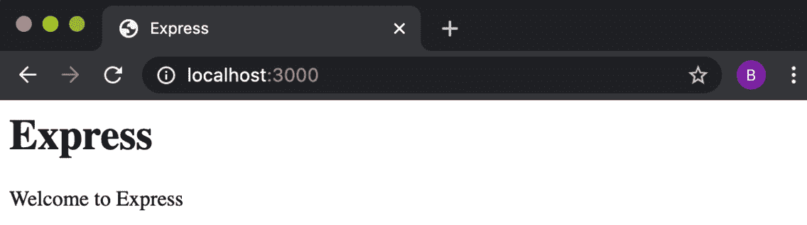
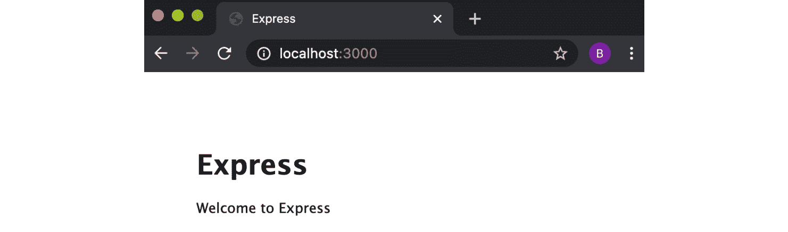
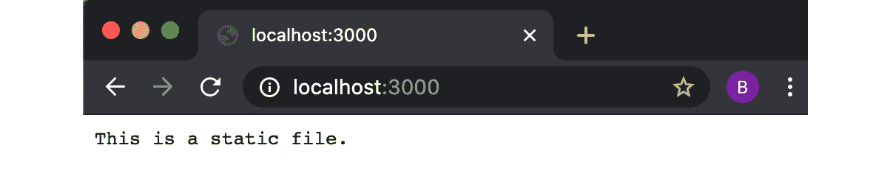

B13828_06_Final_NM

# *第 6 章*：探索 Node.js web 框架

Node.js 可以用作构建各种系统的工具，包括微服务、实时应用程序（如聊天机器人）甚至机器人技术。

Node.js 最常见的用例之一是构建 web 应用程序。如[*第 4 章*](04.html#_idTextAnchor096)*使用 Web 协议*所示，Node.js core 提供了一系列底层 API，允许我们构建 Web 应用程序。由于该用例非常常见，因此创建了许多 web 框架，以将 web 协议抽象为更高级别的 API 来构建 web 框架。

在本章中，我们将使用几种最流行的 web 框架构建 web 应用程序，以了解它们的异同，以及它们对特定任务的适用性。

本章将涵盖以下内容：

*   使用 Express.js 构建 web 应用程序
*   用 Koa.js 构建 Web 应用程序
*   使用 Fastify 构建 web 应用程序
*   使用 Hapi 构建 web 应用程序

# 技术要求

本章的技术要求是最低限度的。您应该安装 Node.js，最好是 Node.js 14 的最新版本，并可以访问您选择的编辑器和浏览器。

在整个配方中，我们将安装`npm`注册表中的模块——从注册表下载模块需要互联网连接。

配方代码将在 Packt GitHub 存储库中提供，网址为 https://github.com/PacktPublishing/Node.js-14-Cookbook 在`Chapter06`目录中。

# 使用 Express.js 构建 web 应用程序

Express.js（[https://expressjs.com/](https://expressjs.com/) ）或 Express一直以来都是在 Node.js 中构建 web 应用程序的最流行的 web 框架。Express 是首批 Node.js web框架之一，基于 Ruby on Rails 的 Sinatra 框架。Express.js 是 OpenJS 基金会的一个项目 https://openjsf.org/projects/ A. T5），以及以前的 No.JS 基金会。

在本食谱中，我们将了解如何创建 Express.js web 服务器。

## 准备好了吗

首先，我们将创建一个名为`express-app`的文件夹，并通过运行以下命令初始化我们的项目：

```js
$ mkdir express-app
$ cd express-app
$ npm init --yes
```

## 怎么做

在这个方法中，我们将创建一个 web 服务器，使用 Express.js 在`/`路由上做出响应。

1.  首先，让我们从安装`express`模块开始：

    ```js
    $ npm install express
    ```

2.  现在，我们需要为我们的 web 应用程序创建一些目录和文件。在您的`express-app`目录中，向您的终端输入以下命令：

    ```js
    $ touch app.js
    $ mkdir routes public
    $ touch routes/index.js public/styles.css
    ```

3.  我们的`app.js`文件就是我们实例化`express`的地方。打开`app.js`文件并导入以下依赖项：

    ```js
    const express = require("express");
    const path = require("path");
    const index = require("./routes/index");
    ```

4.  接下来，我们将为 Express.js 服务器定义端口：

    ```js
    const PORT = process.env.PORT || 3000;
    ```

5.  现在我们可以初始化`express`：

    ```js
    const app = express();
    ```

6.  接下来，我们将注册`static`Express.js 中间件来托管公共目录。我们也将登上我们的`index`路线：

    ```js
    app.use(express.static(path.join(__dirname, "public")));
    app.use("/", index);
    ```

7.  最后，在`app.js`中，我们需要在指定的端口

    ```js
    app.listen(PORT, () => {
     console.log(`Server listening on port ${PORT}`);
    });
    ```

    上启动 Express 服务器
8.  我们现在需要在`routes`目录下的`index.js`文件中添加路由处理。将以下内容添加到`index.js`：

    ```js
    const express = require("express");
    const router = express.Router();
    router.get("/", (req, res) => {
      const title = "Express";
    res.send(`
    <html>
    <head>
    <title> ${title} </title>
    <link rel="stylesheet" href="styles.css"></head>
    <body>
    <h1> ${title} </h1>
    <p> Welcome to ${title} </p>
    </body>
    </html>
    `);
    });
    module.exports = router;
    ```

9.  现在我们可以使用**级联样式表**（**CSS**）为我们的应用程序添加一些样式。将以下添加到`public/styles.css`：

    ```js
    body {
        padding: 50px;
        font: 14px "Lucida Grande", Helvetica, Arial, sans-serif;
    }
    ```

10.  现在我们可以通过运行以下命令来启动 Express.js 服务器：

    ```js
    $ node app.js
    Server listening on port 3000
    ```

11.  如果您导航到[http://localhost:3000](http://localhost:3000) ，您应该期望在浏览器中看到以下输出：



图 6.1–显示“欢迎使用 Express”网页的浏览器窗口

现在，我们已经创建了一个 Express.js web 服务器，它通过`/`路径上的 HTML 页面进行响应。

## 它是如何工作的…

Express.js框架抽象了`http`和`https`核心模块提供的底层 Node.js 核心 web 协议 API。js 为路由和添加中间件提供了一个接口。

重要提示

[*第四章*](04.html#_idTextAnchor096)*使用 Web 协议*对 Node.js 核心`http`和`https`模块进行了详细介绍。

行`const app = express();`是我们创建 Express.js 服务器的地方，其中`app`表示服务器。

`app.use()`功能用于注册中间件。在 Express.js 的上下文中，中间件是指在请求生命周期内执行的功能。Express.js 中间件功能可以访问请求（`req`和响应（`res`对象）。

中间件可以执行代码、更改或操作请求和响应对象、结束请求-响应周期或调用另一个中间件。最后一个中间件必须结束请求-响应周期，否则请求将挂起。

第一次在配方中调用`app.use()`时，我们将其传递给`express.static`方法。`express.static`方法返回一个中间件函数，该函数尝试定位提供的路径。中间件将从指定的文件创建一个写流，并将其流式传输到请求对象。在配方中，我们使用`express.static`函数来服务`public`目录。

在下面的`app.use()`用例中，我们传递字符串`/`作为参数，`index`其中`/`是中间件的*挂载点*，而`index`是我们在`routes/index.js`中定义的 Express.js 路由。

*装入点*用于限制与*装入点*匹配的请求，而不是应用于所有传入请求。Express.js 中间件的排序很重要，因为它们依次执行。如果我们使用`app.use()`针对同一*装载点*注册两个中间件，则第一个将优先。

`routes/index.js`是我们使用 Express.js'`Router`实用程序定义路线处理的地方。在`routes/index.js`中，我们创建了一个名为`router`的路由对象。router 对象提供与 HTTP 协议谓词对应的方法。

在配方中，我们只使用了`router.get()`方法，其他`HTTP`动词如`PUT`、`POST`、`PATCH`和`DELETE`也有方法。请参阅以下*中的*路由方法*小节*部分了解更多详细信息。

我们传递`router.get()`两个参数：第一个是注册的路由（`/`），第二个是路由处理函数。route handler 函数调用`res.send()`返回 HTML 内容。Express.js 会自动将`send()`方法添加到响应对象中。`res.send()`方法与`res.end()`方法类似，但具有内容类型检测等附加功能。

我们使用`module.exports = router;`导出`router`实例。`router`实例也被分类并作为中间件处理。可以为`router.get()`方法提供第三个参数`next`。`next`参数是一个回调函数，表示要执行的中间件或任务。然而，在我们的场景中，`next`参数是不必要的，因为当我们调用`res.send()`时，请求-响应周期被终止。

## 还有更多…

让我们探讨一下 Express 提供的更多核心功能，包括添加视图和创建自定义中间件。我们还将了解如何轻松构建一个典型的 Express.js 应用程序结构，将其用作 Express.js 应用程序的基础。

### 使用 Express.js 添加视图

Express.js 通常用于生成和提供 HTML 网页。为了实现这一点，实现*视图层*是很常见的，它负责生成内容。通常，内容是使用模板动态创建的。有各种各样的模板引擎来处理模板的注入和解析。

js 与许多模板引擎兼容；有关完整列表，请参阅 Express.js 文档，网址为[https://expressjs.com/en/resources/template-engines.html](https://expressjs.com/en/resources/template-engines.html) 。

让我们看看如何使用**嵌入式 JavaScript**（**EJS**）模板引擎和我们在此配方中创建的 Express.js web 服务器添加视图层。

1.  假设您仍在`express-app`目录中，请更改为父目录：

    ```js
    $ cd ..
    ```

2.  然后，您应该复制我们现有的 web 服务器目录，并从`npm`：

    ```js
    $ cp -r express-app express-views-app
    $ cd express-views-app
    $ npm install ejs
    ```

    安装 EJS 模块
3.  现在我们可以通过输入以下命令创建一个名为`views`的目录来保存我们的模板：

    ```js
    $ mkdir views 
    $ touch views/index.ejs
    ```

4.  And now we can instruct our Express.js server to use a view engine by adding the following lines to the `app.js` we created in the recipe. The lines should be added just after the `const app = express();` declaration:

    ```js
    app.set("views", path.join(__dirname, "views"));
    app.set("view engine", "ejs");
    ```

    `app.set()`可用于更改 Express 内部使用的设置。第一个`app.set()`命令将`views`名称空间设置为我们的`views`文件夹。Express 默认在此位置查找视图；但是，我们已经明确规定了这一点。

    第二个`app.set()`命令设置视图引擎，在本例中，我们将其设置为使用 EJS 视图引擎。请注意，我们不需要导入`ejs`模块，因为 Express 为我们处理此问题。

5.  现在，在`views/index.ejs`中添加以下内容来创建视图模板：

    ```js
    <html>
    <head>
    <title><%= title %></title>
    <link rel="stylesheet" href="styles.css">
    </head>
    <body>
    <h1><%= title %></h1>
    <p> Welcome to <%= title %></p>
    </body>
    </html>
    ```

6.  接下来，我们需要更新`routes/index.js`中的`/`路由以使用模板。注意我们将`title`值传递给模板：

    ```js
    router.get("/", (req, res) => {
      const title = "Express";
      res.render("index", {
        title: "Express with EJS",
      });
    });
    ```

7.  现在，我们可以像以前一样使用以下命令启动应用程序：

    ```js
    $ node app.js 
    ```

8.  然后导航到 http://localhost:3000 在浏览器中，观察`title`值已注入模板并呈现：


图 6.2–显示“欢迎使用 EJS 使用 Express”网页的浏览器窗口

在此配方中，我们将 Express.js 配置为使用 EJS 视图引擎，创建了一个 EJS模板，并指示 Express.js 在索引（`/`路径）上呈现模板。

### 使用 Express.js 创建自定义中间件

js 支持自定义中间件。这意味着我们可以创建中间件来实现 web 服务器所需的任何逻辑。

我们可以扩展在配方中创建的应用程序，以使用自定义中间件。让我们看看如何做到这一点：

1.  首先，将`express-app`目录复制到名为`express-custom-middleware`的目录中。我们还将创建一个目录来保存我们的中间件：

    ```js
    $ cp -r express-app express-custom-middleware
    $ cd express-custom-middleware
    $ mkdir middleware
    ```

2.  为了演示如何创建中间件，我们将创建一个中间件，记录接收到的请求的 HTTP 方法和 URL。我们在`middleware`目录

    ```js
    $ touch middleware/logger.js
    ```

    中创建一个名为`logger.js`的文件
3.  将以下内容添加到`logger.js`以创建中间件：

    ```js
    module.exports = logger;
    function logger() {
      return (req, res, next) => {
        console.log("Request received:", req.method, req.url);
        next();
      };
    }
    ```

4.  Now, back in `app.js`, we can instruct our application to use the `logger` middleware. To do this, you need to import the `logger` middleware and then pass this to `app.use()`.

    以下是`app.js`应该是什么样子：

    ```js
    const express = require("express");
    const path = require("path");
    const index = require("./routes/index");
    const logger = require("./middleware/logger");
    const PORT = process.env.PORT || 3000;
    const app = express();
    app.use(logger());
    app.use(express.static(path.join(__dirname, "public")));
    app.use("/", index);
    app.listen(PORT, () => {
     console.log(`Server listening on port ${PORT}`);
    });
    ```

5.  现在，当运行`app.js`并导航到[时 http://localhost:3000](http://localhost:3000) ，我们将看到以下日志输出，表明我们的中间件已被调用：

    ```js
    $ node app.js
    Server listening on port 3000
    Request received: GET /
    Request received: GET /styles.css
    ```

在本例中，我们创建了一个日志中间件。但中间件可以用于各种用例，包括设置客户头、解析和/或操作请求、会话处理以及在 HTTP 之上实现自定义协议。

### 生成 Express.js 应用程序

js 提供了一个生成器，为您构建一个框架应用程序。您可以使用`npx`从终端运行发电机：

```js
$ npx express-generator --view=ejs express-generated-app
```

此命令将在名为`express-generated-app`的新目录中创建 skeleton Express.js 应用程序。`--view`参数指定要在应用程序中使用的视图模板引擎。

有关视图模板引擎的更多信息，请参阅本章中的*使用 Express.js*配方添加视图。

`express-generator`可以使用以下视图引擎构建应用程序：

*   EJS（`--view=ejs`）
*   车把（`--view=hbs`）
*   Hogan.js（`--view=hjs`）
*   帕格犬（`--view=pug`
*   小枝（`--view=twig`）
*   Vash（`--view=vash`）

通过指定`--no-view`参数，也可以在没有视图引擎的情况下生成应用程序。

杰德对帕格

Jade 是帕格模板引擎的旧名称。如果省略了`--view`参数，`express-generator`当前将默认使用 Jade，但`jade`模块在重命名为 Pug 后未被维护。因此，始终建议指定`--view`或`--no-view`参数，因为`jade`模块已被弃用。

您还可以通过`--css`参数指定要使用的 CSS 引擎。以下 CSS 引擎受支持：

*   较少的
*   触笔
*   罗盘
*   无礼

`express-generator`生成一个 base Express.js 应用程序结构。生成器输出其创建的目录和文件：

```js
$ npx express-generator --view=ejs express-generated-app 
npx: installed 10 in 1.178s
create : express-generated-app/
create : express-generated-app/public/
create : express-generated-app/public/javascripts/
create : express-generated-app/publimg/
create : express-generated-app/public/stylesheets/
create : express-generated-app/public/stylesheets/style.css
create : express-generated-app/routes/
create : express-generated-app/routes/index.js
create : express-generated-app/routes/users.js
create : express-generated-app/views/
create : express-generated-app/views/error.ejs
create : express-generated-app/views/index.ejs
create : express-generated-app/app.js
create : express-generated-app/package.json
create : express-generated-app/bin/
create : express-generated-app/bin/www
   change directory:
     $ cd express-generated-app
   install dependencies:
     $ npm install
   run the app:
     $ DEBUG=express-generated-app:*npm start
```

按照生成器指定的说明安装依赖项并启动应用程序后，应该有一个 skeleton Express.js 服务器在默认端口`3000`上侦听。导航到[http://localhost:3000/](http://localhost:3000/) 在您的浏览器中查看样板文件**欢迎表达**响应：



图 6.3–显示“欢迎使用 Express”网页的浏览器窗口

我们期望您可以使用`express-generator`生成的应用程序代码和结构作为应用程序的基础，并从中进行扩展。

### 处理 POST 请求和路由参数

在配方中，我们创建了一个响应 HTTP GET 请求的路由。在构建一个web 应用程序时，您可能需要支持 HTTP POST 请求。HTTP POST 请求通常用于提交HTML 表单数据。

本例将引导您了解如何处理表单提交的 HTTP POST 请求并解析表单数据。本例将使用`body-parser`模块。`body-parser` 模块是一个中间件，它解析传入的请求主体，然后在请求对象（`req.body`上的`body`属性上公开该主体。

我们可以从配方扩展 web 服务器以处理 HTTP POST 请求：

1.  首先，将应用程序复制到新目录，并通过运行以下命令安装`body-parser`模块：

    ```js
    $ cp -r express-app express-post-app
    $ cd express-post-app
    $ npm install body-parser
    ```

2.  在`app.js`文件中，我们需要导入`body-parser`中间件，并指示我们的 Express.js 应用程序使用它。在`app.js`顶部，按如下方式导入模块：

    ```js
    const bodyParser = require("body-parser");
    ```

3.  After our application, we need to pass `bodyParser` to `app.use()` to instruct the server to use the middleware:

    ```js
    app.use(
    bodyParser.urlencoded({
        extended: false,
      })
    );
    ```

    重要提示

    `{ extended: false }`选项指示`body-parser`使用`querystring`库进行 URL 解析。忽略此设置或将其设置为`true`将指示`body-parser`使用`qs`库。主要区别在于`qs`支持嵌套对象。但是，`qs`有一些选项，如果配置不正确，可能会导致拒绝服务攻击。参见[*第 9 章*](09.html#_idTextAnchor259)*Node.js 安全*中的*防范 HTTP 参数污染攻击*配方。

4.  Now, we will change our HTTP GET route in `routes/index.js` to serve an HTML form. The route will also handle an optional `name` parameter:

    ```js
    router.get("/:name?", function (req, res) {
      const title = "Express";
      const name = req.params.name;
    res.send(`
    <html>
    <head>
    <title> ${title} </title>
    <link rel="stylesheet" href="styles.css">
    </head>
    <body>
    <h1> ${title} </h1>
    <p> Welcome to ${title}${name ? `, ${name}.` : ""} </p>
    <form method=POST action=data>
        Name: <input name=name><input type=submit>
    </form>
    </body>
    </html>
    `);
    });
    ```

    请注意，我们在`/`路线后添加了`name?`——这是利用 Express 的占位符语法。`?`表示该参数是可选的。

5.  在路由注册下方，我们现在可以为`/data`路由添加一个 HTTP POST路由处理程序。提交我们的表格时将调用此路径。路由处理程序重定向到我们的`/name?`路由：

    ```js
    router.post("/data", function (req, res) {
     res.redirect(`/${req.body.name}`);
    });
    ```

6.  现在我们可以使用以下命令运行应用程序：

    ```js
    $ node app.js
    ```

7.  Navigate to [http://localhost:3000](http://localhost:3000) and you should see the following HTML form:

    

    图 6.4–显示“欢迎使用 Express”页面和名称输入字段的浏览器窗口

8.  提供姓名并提交表格。现在，当页面重新加载时，您将看到您提供的名称已被注入页面：


图 6.5–显示“欢迎使用 Express，Beth”网页的浏览器窗口

### 路由方法

路由确定应用程序如何响应给定端点处的请求。通常，端点由 URI（即路径）和 HTTP 请求方法表示。Express 的`Router`对象公开了我们可以用来在应用程序中创建端点的方法。在主配方中，我们使用`router.get()`方法公开了通过 HTTP GET 请求访问的端点。类似地，在*处理 POST 请求和路由参数*部分中，我们使用`router.post()`方法创建响应 HTTP POST 请求的端点。

`router`方法的结构是一致的。例如，我们使用以下内容声明 HTTP GET 请求处理程序：

```js
router.get("/", (req, res) => {
  res.send("HTTP GET /");
});
```

类似地，HTTP DELETE 处理程序可以用以下语句声明：

```js
router.delete("/", (req, res) => {
  res.send("HTTP DELETE /");
});
```

请注意，该方法可以与任何其他 HTTP 方法（PUT、PATCH 等）互换。

js 还公开了一个`router.all()`方法。`router.all()`方法用于定义一个请求处理程序，该处理程序响应到指定端点的所有请求，而不考虑 HTTP 方法。

### 使用 NODE_ENV 环境变量

Express.js 预期将`NODE_ENV`作为变量名。`NODE_ENV`用于指定应用程序运行在哪个环境中。这通常设置为`dev`或`production`值，指示您是在开发应用程序还是在生产环境中运行应用程序。

当`NODE_ENV`设置为`production`时，Express.js 具有内置行为更改。在生产模式中提供的功能包括缓存视图模板和 CSS 文件，以及更少的详细错误消息。

可以使用`NODE_ENV`变量实现自定义行为。由于在检查环境变量时存在性能开销，因此应避免多次检查这些值。

如果您想要多个特定于生产或开发的行为，则值得将`NODE_ENV`作为常量存储在您的文件中。

以下是一些伪代码示例，说明这在程序中的表现：

```js
const dev = process.env.NODE_ENV !== "production";
if (dev) {
 // dev specific behaviors here 
}
```

您可以在用于启动流程的终端中设置环境变量：

```js
$ export NODE_ENV=production
```

或者，您可以将其作为环境变量直接传递给 Node.js 进程：

```js
$ NODE_ENV=production node index.js
```

## 另见

*   本章用膝关节炎治疗系统构建 Web 应用程序
*   [*第 9 章*](09.html#_idTextAnchor259)*保护 Node.js 应用程序*
*   [*第 11 章*](11.html#_idTextAnchor337)*部署 Node.js 微服务*
*   在*[*第 12 章*](12.html#_idTextAnchor379)*调试 Node.js 应用程序*中使用 Node.js 配方*登录**

 *# 用 Koa.js 构建 Web 应用程序

膝关节炎或膝关节炎（KoaJS），将其自身描述为一种新的 Web 框架——Ty1 T1。大约在 2013 年底，膝关节炎是由原来的 Exp.js 的团队创建的。在这一点上，Express .js 的使用非常普遍，为了避免有太多的突破性改变来表达，在 KOA.JS 下开发了新的思想。KOA.JS 是一个更小、更轻量级的框架，与 Exp.js 相比，并没有安装任何中间件。

最初，Koa.js 是利用 Hyt T0\. java 脚本和 AutoT1 来编写的。然而，最新版本的膝关节炎（JavaJS）（2 版）使用了自 V7.06 以来 Node.js 本地支持的 java 语言。

在这个食谱中，我们将使用 KOAJS V2 来创建一个 Web 应用程序。

重要提示

膝关节炎暴露了一个基于承诺的 API，它能够使用 HyLt0j.java 脚本语法。如果您不熟悉 JavaScript 承诺，那么阅读承诺 MDN web 文档（[是值得的 https://developer.mozilla.org/en-US/docs/Web/JavaScript/Reference/Global_Objects/Promise](https://developer.mozilla.org/en-US/docs/Web/JavaScript/Reference/Global_Objects/Promise) 和异步/等待语法的 MDN web 文档概述（ [https://developer.mozilla.org/en-US/docs/Learn/JavaScript/Asynchronous/Async_await](https://developer.mozilla.org/en-US/docs/Learn/JavaScript/Asynchronous/Async_await) ）。

## 准备好了吗

首先，让我们创建一个名为`koa-app`的目录来保存我们的项目。由于我们将使用 npm 模块，我们还需要使用`npm`初始化一个新项目：

```js
$ mkdir koa-app
$ cd koa-app
$ npm init --yes
```

现在，我们已经初始化了项目目录，我们可以继续讨论配方了。

## 怎么做

膝关节炎的应用程序将创建一个基于 Ko.JS 的 Web 应用程序，该系统将响应“欢迎使用膝关节炎”。

1.  对于该配方，我们需要安装 npm 的`koa`、`koa-router`和`koa-static`模块：

    ```js
    $ npm install koa koa-router koa-static
    ```

2.  现在，我们需要初始化几个目录和文件：

    ```js
    $ touch app.js
    $ mkdir routes public
    $ touch routes/index.js
    $ touch public/styles.css
    ```

3.  我们可以开始构建我们的应用程序。在`app.js`中，导入以下模块：

    ```js
    const path = require("path");
    const Koa = require("koa");
    const serve = require("koa-static");
    const router = require("koa-router")();
    const index = require("./routes/index");
    ```

4.  同样在 StULt0t 中，我们将声明一个 OUTT1 保留膝关节炎 Web 服务器应该监听的端口：
5.  要初始化我们的膝关节炎性应用程序，请将下列内容添加到 PosiT0：
6.  我们可以使用 Ko.T0.中间件为 Ko.js 服务公共目录：膝关节炎 T1
7.  将以下内容添加到`app.js`以注册我们的路由：

    ```js
    router.use("/", index.routes());
    app.use(router.routes());
    ```

8.  最后，在`app.js`中，我们可以调用`listen`函数来启动我们的服务器：

    ```js
    app.listen(PORT, () => {
     console.log(`Server listening on port ${PORT}`);
    });
    ```

9.  现在我们需要在`routes/index.js`中定义我们的路线。将以下内容添加到`routes/index.js`：

    ```js
    const router = require("koa-router")();
    router.get("/", async function (ctx) {
        const title = "Koa.js";
    ctx.body = `
    <html>
    <head>
    <title> ${title} </title>
    <link rel="stylesheet" href="styles.css"></head>
    <body>
    <h1> ${title} </h1>
    <p> Welcome to ${title} </p>
    </body>
    </html>
    `;
    });
    module.exports = router;
    ```

10.  现在，让我们在`public/styles.css`：

    ```js
    body {
        padding: 50px;
        font: 14px "Lucida Grande", Helvetica, Arial, sans-serif;
    }
    ```

    中添加我们的 CSS 样式
11.  现在我们可以通过运行以下命令来启动服务器：

    ```js
    $ node app.js
    ```

12.  希望看到下面的内容：欢迎来到膝关节炎杂志。


图 6.6 浏览器窗口描述“欢迎来到膝关节炎”网页

现在我们已经在 Ky.js 的 Web 服务器上运行并响应了膝关节炎。http://localhost:3000 。

## 它是如何工作的…

配方的第一步涉及从 npm 注册表安装`koa`、`@koa/router`和`koa-static`模块。`koa`模块提供了一个最小的 web 框架实现，我们使用中间件模块`@koa/router`和`koa-static`对其进行了扩展。

膝关节炎 JS 希望中间件包含上下文对象（AUT0）和一个返回承诺的 AUTYT1 函数。

AUT0T0 模块返回一个膝关节炎的中间件函数，我们传递给了 OT1 T1。`koa-static`模块尝试在提供的路径上定位文件。然后，中间件将从该文件创建一个写流，并将其流式传输到请求对象。如果没有找到中间件，则下一个控件将传递给。在配方中，我们使用了`koa-static`模块来提供`public`目录。

我们安装和使用的另一个中间件是`koa-router`中间件。这在概念上类似于 Express.js 中的`Router`功能。我们调用`router.use()`向`app.js`中定义的主路由实例注册额外的路由实例。我们可以使用`router.use()`定义*挂载点*。我们将我们的主要的 Fo.T5 实例传递给了 OT6 T6，以指导膝关节炎作为一个中间件。

在`routes/index.js`中，我们定义了我们的路线。在配方中，我们使用`router.get()`在`/`上定义了一条`HTTP GET`路线。`router`宾语暴露了其他`HTTP`动词（`HTTP POST`、`HTTP DELETE`等）的方法。

我们为`router.get()`调用提供`async`函数。函数 Ty2Tyr 函数返回一个 ORT T3，并且膝关节炎 JS 期望函数通过设计返回一个 Ty4T4。

我们的匿名`async`函数有一个参数`ctx`。`ctx`是*上下文*对象。*上下文*对象是根据请求创建的，它结合了 Node.js 提供的`request`和`response`对象。在配方中，我们的`async`函数返回一个简单的 HTML 页面。

## 还有更多…

让我们膝关节炎膝关节炎的功能，包括 Oracle T0.用 KOA.JS ORDT1T 添加视图，OLE T2A.级联中间件 ORT T3，和 AUT4 T4。

### 用 KOA.JS 添加视图

有可能使用 Ty1 扩展膝关节炎 JS 使用一个带有 Pyt T0T 中间件的视图引擎。我们可以将我们的应用程序从主配方扩展到视图：

1.  将`koa-app`目录复制到名为`koa-views-app`：

    ```js
    $ cp -r koa-app koa-views-app
    $ cd koa-views-app
    ```

    的新目录
2.  You'll need to install the `koa-views` middleware. For this example, we'll use the EJS view engine (`ejs`). Install both the `koa-views` and `ejs` modules from npm:

    ```js
    $ npm install koa-views ejs
    ```

    重要提示

    可以将其他视图引擎与`koa-views`中间件一起使用。`koa-views`中间件依赖于`consolidate`模块，该模块在 https://www.npmjs.com/package/consolidate#supported-模板引擎。

3.  现在，在名为`index.ejs`：

    ```js
    $ mkdir views
    $ touch views/index.ejs
    ```

    的文件中创建一个包含 EJS 模板的`views`目录
4.  将我们的模板内容添加到`views/index.ejs`:

    ```js
    <html>
    <head>
    <title><%= title %></title>
    <link rel="stylesheet" href="styles.css">
    </head>
    <body>
    <h1><%= title %></h1>
    <p> Welcome to <%= title %></p>
    </body>
    </html>
    ```

5.  我们需要指导我们的膝关节炎应用程序使用的是，首先，我们需要在`app.js`中导入`koa-views`中间件。将以下导入语句添加到`app.js`。这应该放在其他进口声明旁边：

    ```js
    const views = require("koa-views");
    ```

6.  Also in `app.js`, below the `app` declaration (`const app = new Koa();`), add the following `app.use()` call to instruct our Koa.js application to use the `koa-views` middleware:

    ```js
    app.use(views(path.join(__dirname, "views"), {
        extension: "ejs",
      })
    );
    ```

    我们将通过路径传递到`views`目录，以便中间件知道在哪里查找我们的模板文件。

7.  然后，我们可以在`routes/index.js`中更改 HTTP GET 路由，以返回填充的模板：

    ```js
    router.get("/", async function (ctx, next) {
      ctx.state = {
        title: "Koa.js",
      };
      await ctx.render("index");
    });
    ```

注意，我们称之为`ctx.render()`。`render()`函数由`koa-views`中间件注入`ctx`对象。我们将希望使用的模板名称传递给`render()`函数。`koa-views`中间件知道要在`views`目录中搜索模板，因为我们已经在`app.js`中配置了模板位置。

模板填充有在`ctx.state`上设置的值，在本例中为`title`值。`koa-views`自动检查`ctx.state`的模板值。

也可以将`title`值作为第二个参数传递给`ctx.render`函数，而不是使用`ctx.state`对象。

我们必须用`await`调用`ctx.render()`，因为我们需要等待模板用值呈现。

您最终可以使用`$ node app.js`启动服务器并导航到 http://localhost:3000.

你应该期待看到一个“欢迎来到膝关节炎”网页。此网页已使用 EJS 模板和`koa-views`中间件生成。

### 级联中间件

KOA.JS 中间件级联。中间件将以级联方式运行，直到到达最后一个中间件，此时流返回上游。正是 Koa .js 使用了使该流启用的函数：

1.  下面的代码片段仅用于演示交互流程：

    ```js
    const Koa = require("koa");
    const app = new Koa();
    app.use(async (ctx, next) => {
      console.log("First middleware start");
      await next();
      console.log("First middleware return");
    });
    app.use(async (ctx, next) => {
      console.log("Second middleware start");
      await next();
      console.log("Second middleware return");
    });
    app.use(async (ctx) => {
      console.log("Third middleware start");
      console.log("Third middleware return");
    });
    app.listen(3000);
    ```

2.  当运行此代码段时，您将获得以下输出：

    ```js
    $ node app.js
    First middleware start
    Second middleware start
    Third middleware start
    Third middleware return
    Second middleware return
    First middleware return
    ```

`app.use()`调用的顺序决定了中间件的向下流动。在本例中，第一个中间件调用第二个中间件，第二个中间件调用第三个中间件。输出表明中间件是按此顺序启动的。当到达最后一个中间件时，中间件开始返回上游。因此，首先，第三个中间件完成，然后是第二个中间件，最后是第一个中间件。

在创建 AutoT0}和使用中间件时，需要考虑中间件应用的顺序。

### 用 KOA.JS 创建自定义中间件

膝关节炎也支持了定制中间件。让我们创建一个简单的自定义中间件，将日志添加到 HTTP 请求中：

1.  首先将`koa-app`目录复制到名为`koa-custom-middleware`的新目录。我们还将创建一个新目录来存储中间件：

    ```js
    $ cp -r koa-app koa-custom-middleware
    $ cd koa-custom-middleware
    $ mkdir middleware
    ```

2.  为了演示如何创建中间件，我们将创建一个中间件，记录接收到的请求的 HTTP 方法和 URL。我们在`middleware`目录

    ```js
    $ touch middleware/logger.js
    ```

    中创建一个名为`logger.js`的文件
3.  Add the following to `logger.js` to create the middleware:

    ```js
    module.exports = logger;
    function logger() {
      return async (ctx, next) => {
        console.log("Request received:", ctx.req.method,     ctx.req.url);
        await next();
      };
    }
    ```

    logger 函数返回一个异步函数。我们从`ctx`对象中提取请求方法和 URL。对`await.next()`的调用将执行委托给后续中间件（有关中间件执行的更多信息，请参阅*级联中间件*部分）。

4.  现在，回到`app.js`，我们可以指导我们的应用程序使用`logger`中间件。为此，您需要导入`logger`中间件，然后将传递给`app.use()`。以下是`app.js`应该是什么样子：

    ```js
    const path = require("path");
    const Koa = require("koa");
    const serve = require("koa-static");
    const router = require("@koa/router")();
    const index = require("./routes/index");
    const logger = require("./middleware/logger");
    const PORT = process.env.PORT || 3000;
    const app = new Koa();
    app.use(logger());
    app.use(serve(path.join(__dirname, "public")));
    router.use("/", index.routes());
    app.use(router.routes());
    app.listen(PORT, () => {
    console.log(`Server listening on port ${PORT}`);
    });
    ```

5.  现在，当我们运行`app.js`并导航到[时 http://localhost:3000](http://localhost:3000) 。我们将看到下面的日志输出，指示我们调用了定制的膝关节炎性中间件：

在本例中，我们创建了一个日志中间件。但是中间件可以用于各种用例，包括设置自定义头、解析和/或操作请求、会话处理以及在 HTTP 之上实现自定义协议。

## 另见…

*   [*第 9 章*](09.html#_idTextAnchor259)*保护 Node.js 应用程序*
*   [*第 11 章*](11.html#_idTextAnchor337)*部署 Node.js 微服务*
*   [*第 12 章*](12.html#_idTextAnchor379)*调试 Node.js 应用程序*中的*记录 Node.js*配方

# 使用 Fastify 构建 web 应用程序

Fastify 是一个 web框架，其灵感来源于其他流行的 Node.js web 框架，包括 Hapi 和 Express.js。顾名思义，Fastify 专注于最小化性能开销，但该框架也考虑了开发人员的经验。

虽然 Fastify 可用于创建 web 应用程序，但在构建基于 JSON 的 API 时，它确实非常出色。在配方中，我们将创建一个基于 JSON 的 API。

## 准备好了吗

首先，让我们创建一个名为`fastify-app`的目录来保存我们的项目。由于我们将使用 npm 的模块，我们还需要初始化一个新项目，如下所示：

```js
$ mkdir fastify-app
$ cd fastify-app
$ npm init --yes
```

现在，我们已经初始化了项目目录，我们可以继续讨论配方了。

## 怎么做

在本配方中，我们将使用 Fastfy 创建一个 web 服务器，该服务器在`/`路由上响应一些 JSON 数据：

1.  首先安装`fastify`：

    ```js
    $ npm install fastify
    ```

2.  接下来，我们将创建一个名为`server.js`的文件，其中包括我们的服务器：

    ```js
    $ touch server.js
    ```

3.  我们需要首先导入`fastify`模块并实例化它。将以下行添加到`server.js`：

    ```js
    const fastify = require("fastify")();
    ```

4.  我们可以声明一个常量来存储服务器应该绑定到的端口：

    ```js
    const PORT = process.env.PORT || 3000;
    ```

5.  现在，在`server.js`中，我们可以在`/`上添加我们的 HTTP GET 路由。我们的路由将使用一个 JSON 对象进行响应：

    ```js
    fastify.get("/", async (request, reply) => {
      return { message: "Hello world!" };
    });
    ```

6.  接下来，我们需要创建一个异步`startServer()`函数来启动我们的服务器：

    ```js
    const startServer = async () => {
      try {
        await fastify.listen(PORT);
        console.log(`server listening on ${fastify.server.    address().port}`);
      } catch (err) {
        console.error(err);
        process.exit(1);
      }
    };
    ```

7.  现在我们需要调用我们的`startServer()`函数：

    ```js
    startServer();
    ```

8.  在终端中，使用以下命令启动服务器：

    ```js
    $ node server.js
    server listening on 3000
    ```

9.  在另一终端选项卡或窗口中，使用`curl`测试服务器路由：

    ```js
    curl http://localhost:3000
    {"message":"Hello world!"}%
    ```

我们可以看到我们的服务器在`/`路由上使用 JSON 数据进行响应。

## 它是如何工作的…

我们通过导入和初始化`fastify`模块并将其分配给一个常量（也称为`fastify`，来启动配方。

在`fastify`对象上，我们调用`get()`函数来添加 HTTP GET 路由。我们将`get()`函数传递两个参数。第一个参数是我们希望注册的路由，第二个参数是我们的异步处理函数。

每当服务器收到指定路由和方法上的请求时，就会执行异步处理程序函数。Fastify 为其他 HTTP 谓词在`fastify`对象上公开了等价的函数，包括`head()`、`post()`等。这是一种类似的方法，用于如何用 Exp.js 和 Ko.js 登记路由。

有一种更详细的方法可以使用`route()`功能向 Fastfy 注册路由。以下是我们使用`route()`函数语法对路线的等效定义：

```js
fastify.route({
  method: "GET",
  url: "/",
  handler: async (request, reply) => {
 reply.send({ message: "Hello world!" });
  },
});
```

我们创建了一个异步`startServer()`函数。顾名思义，这个函数处理服务器的启动。`await``fastify.listen(PORT);`行启动指定端口上的`fastify`服务器。当我们没有在对象中提供`host`值时，服务器将默认监听`localhost`。我们甚至可以省略端口，`fastify`将分配一个随机空闲端口。在加载所有插件之前，服务器不会启动。

我们将对`fastify.listen()`的调用封装在`try/catch`块中，以便捕获任何错误。如果发现任何错误，我们将这些错误记录到 STDERR，然后用`process.exit(1)`结束程序。

重要提示

在整个配方中，我们在使用 Fastify 时使用了`async/await`语法。但是，仍然可以将 Fastify 与传统回调语法一起使用。

## 还有更多…

让我们看看如何向 Fastify 注册定制插件。在较大的应用程序中，您可以将一些应用程序的逻辑分解为插件。我们还将研究 Fastify CLI，并使用它生成一个基本应用程序。

### 使用 Fastify 定制插件

Fastify 遵循插件模型，可以使用`fastify.register()`方法注册插件。Fastify 认为一切都是一个插件，包括您定义的路由。

我们可以将配方中创建的路线转换为`fastify`插件：

1.  首先，将项目目录复制到名为`fastify-plugin-app`的新目录中。我们还将创建一个名为`plugins`：

    ```js
    $ cp -r fastify-app fastify-plugin-app
    $ cd fastify-plugin-app
    $ mkdir plugins
    ```

    的新目录
2.  让我们为我们的插件创建一个文件：

    ```js
    $ touch plugins/hello-route.js
    ```

3.  Add the following to the `hello-route.js` file to create the plugin:

    ```js
    async function routes(fastify) {
    fastify.get("/", async (request, reply) => {
        return { message: "Hello world!" };
      });
    }
    module.exports = routes;
    ```

    请注意，我们注册的路线与我们在`server.js`配方中声明的路线相同。

4.  现在，回到`server.js`中，我们可以删除路由并用我们的中间件替换它：

    ```js
    fastify.register(require("./plugins/hello-route"));
    ```

5.  `server.js`现在应该包含以下代码：

    ```js
    const fastify = require("fastify")();
    const PORT = process.env.PORT || 3000;
    fastify.register(require("./plugins/hello-route"));
    const startServer = async () => {
      try {
        await fastify.listen(PORT);
        console.log(`server listening on ${fastify.server.address().port}`);
      } catch (err) {
        console.error(err);
        process.exit(1);
      }
    };
    startServer();
    ```

6.  如前所述，使用`$ node server.js`运行应用程序。导航到`http://localhost:3000`并期望看到以下输出：

    ```js
    {"message":"Hello world!"}%
    ```

7.  或者，我们可以使用**cURL**测试端点。在单独的终端窗口中，输入以下命令：

    ```js
    $ curl http://localhost:3000/                     
    {"message":"Hello world!"}%
    ```

现在，我们的行为与配方中的行为相同，路由在`/`端点上使用包含消息“Hello world！”的 JSON 对象进行响应。我们的新版本利用 Fastify 的插件模型来封装和分离注册路线的逻辑。在更大的应用程序中，您希望创建多个插件来分离特定的功能和特性。

### Fastify CLI

Fastify 提供了一个**命令行界面**（**CLI**），可用于生成和运行Fastify应用程序：

1.  To generate a Fastify application, enter the following in your Terminal:

    ```js
    $ npx fastify-cli generate fastify-generated-app
    generated .gitignore
    generated app.js
    generated plugins/README.md
    generated services/README.md
    generated test/helper.js
    generated plugins/support.js
    generated services/root.js
    generated test/services/example.test.js
    generated services/example/index.js
    generated test/plugins/support.test.js
    generated test/services/root.test.js
    --> reading package.json in fastify-generated-app
    edited package.json, saving
    saved package.json
    --> project fastify-generated-app generated successfully
    run 'npm install' to install the dependencies
    run 'npm start' to start the application
    run 'npm run dev' to start the application with pino-colada pretty logging (not suitable for production)
    run 'npm test' to execute the unit tests
    ```

    从输出中可以看到，`fastify-cli`生成了以下目录和文件：

    *   `.gitignore`：一个样本`.gitignore`文件。
    *   `app.js`：程序的入口点，可自动加载`plugins`目录中的插件。
    *   `package.json`：一个`package.json`文件，包括必要的 Fastfy 和测试依赖项。
    *   `plugins`：保存应用程序插件的目录。它还包含一个用于演示的示例插件。
    *   `services`：保存应用服务的目录。它还包含一个用于演示的示例服务。样本服务注册了一条`/example`路由。
    *   `test`: A directory to hold tests for the Fastify application. This is automatically populated with tests for the example plugins and services.

        生成应用程序后，我们需要使用`$ npm install`安装依赖项。

2.  We can then start the application with `$ npm start`, which in turn calls the `fastifystart` command:

    ```js
    $ npm start
    > fastify-generated@1.0.0 start /Users/bethgriggs/Node-Cookbook/Chapter06/fastify-generated-app
    >fastify start -l info app.js
    ```

    `-l info`表示我们希望看到信息级日志输出。

3.  我们也可以键入`$ npm test`来运行生成的测试。测试结果将输出到终端：

    ```js
    $ npm test
    > fastify-generated-app@1.0.0 test /Users/bethgriggs/Node-Cookbook/Chapter06/fastify-generated-app
    > tap test/**/*.test.js
    test/plugins/support.test.js .......................... 2/2 587ms
    test/services/example.test.js ......................... 2/2
    test/services/root.test.js ............................ 2/2
    total ................................................. 6/6
      6 passing (1s)
    ok 
    ```

您可以使用这个生成的 Fastify 应用程序作为基础，您可以扩展它来在其上构建应用程序。

可用的`fastify-cli`命令详见下表：


图 6.7–Fastify CLI 命令列表

有关`fastify-cli`的更多信息，请参阅其位于[的 GitHub 存储库 https://github.com/fastify/fastify-cli](https://github.com/fastify/fastify-cli) 。

## 另见…

*   [*第 8 章*](08.html#_idTextAnchor223)*使用 Node.js*进行测试
*   [*第 9 章*](09.html#_idTextAnchor259)*保护 Node.js 应用程序*
*   [*第 11 章*](11.html#_idTextAnchor337)*部署 Node.js 微服务*
*   [*第 12 章*](12.html#_idTextAnchor379)*调试 Node.js 应用程序*中的*记录 Node.js*配方

# 使用 Hapi 构建 web 应用程序

Hapi 是 web 应用程序的另一个框架。Hapi 的原始版本是基于 Express创建的，用于处理沃尔玛*黑色星期五销售*的缩放要求。与我们在本章中介绍的其他 web 框架相比，Hapi 的理念截然不同。

在此配方中，我们将使用最新版本的 Hapi v19 来创建 web 服务器。在*还有更多的*部分，我们将了解如何使用一些 Hapi 插件。

重要提示

Hapi 遵循详细的长期支持策略，其中针对特定 Node.js 版本维护框架的特定版本。Hapi 的 v19 是最新版本，也是第一个支持 Node.js 14 的版本。Hapi 在[中列出其支持信息 https://hapi.dev/resources/status/#hapi](https://hapi.dev/resources/status/#hapi) 。

## 准备好了吗

首先，让我们创建一个名为`hapi-app`的目录来保存我们的项目。由于我们将使用 npm 中的模块，我们还需要使用`npm`命令初始化一个新项目：

```js
$ mkdir hapi-app
$ cd hapi-app
$ npm init --yes
```

我们还将创建一个名为`server.js`的文件来保存我们的 Hapi 服务器：

```js
$ touch server.js
```

现在，我们已经初始化了项目目录，我们可以继续讨论配方了。

## 怎么做

在这个配方中，我们将创建一个 Hapi 服务器。服务器将公开一个端点，该端点返回字符串**Welcome to Hapi.js**：

1.  第一步是从`npm`：

    ```js
    $ npm install @hapi/hapi 
    ```

    安装`hapi`模块
2.  现在，我们可以在`server.js`：

    ```js
    const Hapi = require("@hapi/hapi");
    ```

    中进口 Hapi
3.  我们将初始化两个常量变量来存储服务器端口和主机名：

    ```js
    const PORT = process.env.PORT || 3000;
    const HOSTNAME = process.env.HOSTNAME || "localhost";
    ```

4.  现在，我们需要在`server.js`中创建一个名为`initialize()`的`async`函数。我们需要这样做，因为我们将在后面的步骤中在此函数中使用 wait 语法：

    ```js
    const initialize = async () => {
    }
    ```

5.  在`initialize()`函数中，我们创建服务器对象，传入`PORT`和`HOSTNAME`值：

    ```js
      const server = Hapi.server({
        port: PORT,
        host: HOSTNAME,
      });
    ```

6.  接下来，我们可以添加我们的路线。在`initialize()`函数中，我们添加了以下内容来定义`/`的路由处理程序，该处理程序使用文本`"Welcome to Hapi"`响应 HTTP GET 请求：

    ```js
    server.route({
      method: "GET",
      path: "/",
      handler: (request, h) => {
        return "Welcome to Hapi";
      },
    });
    ```

7.  我们可以通过在`initialize()`函数中添加以下代码来指示 Hapi 启动服务器。我们还将添加一条输出服务器 URI 的日志消息：

    ```js
    await server.start();
    console.log("Server listening on", server.info.uri);
    ```

8.  最后，在`server.js`的底部和`initialize()`函数的外部，我们调用我们的`initialize()`函数：

    ```js
    initialize();
    ```

9.  现在，我们需要从终端运行我们的`server.js`文件：

    ```js
    $ node server.js 
    Server listening on http://localhost:3000
    ```

10.  导航至[http://localhost:3000](http://localhost:3000) 在您的浏览器中，希望看到以下内容：


图 6.8–显示字符串“Welcome to Hapi.js”的浏览器窗口

现在我们有一个 Hapi 服务器正在运行并响应**欢迎来到`/`路线上的 Hapi.js**。

## 它是如何工作的…

`server.js`文件的前几行导入`@hapi/hapi`模块，并配置常量变量来存储服务器的端口和主机名。

我们使用`const server = Hapi.server();`来初始化我们的服务器。我们通过调用我们的`PORT`和`HOSTNAME`变量来指示服务器应该绑定到的端口和主机名上的 Hapi。

我们使用`server.route()`函数来定义我们的路线。我们向`route`函数传递一个包含方法、路径和处理程序的对象。`method`表示我们路由的 HTTP 动词（HTTP GET、HTTP POST 等）。您还可以将方法设置为`*`，这意味着路由将通过任何 HTTP 谓词响应请求。`path`是我们希望注册的路线路径；在我们的例子中，这是`/`。`handler`是路由处理函数。

`handler`函数有两个参数，`request`和`h`。`request`是表示请求的对象。`h`代表 Hapi 响应工具包。Hapi 的响应工具包公开了我们可以在请求处理函数中使用的属性和实用程序。提供的实用程序类型包括重定向请求的方法（`h.redirect()`）和身份验证实用程序（`h.authenticated()`和`h.unauthenticated()`）。*响应工具包*上的完整实用程序列表可在[的 Hapi API 文档中找到 https://hapi.dev/api/?v=19.1.1#response-工具包](https://hapi.dev/api/?v=19.1.1#response-toolkit)。

重要提示

可以向`server.route()`函数传递第三个参数`options`对象。`options`对象允许您配置路由上的其他行为，例如身份验证和验证。更多详细信息，请参见[中的 Hapi API 文档 https://hapi.dev/tutorials/routing/?lang=en_US#-选项](https://hapi.dev/tutorials/routing/?lang=en_US#-options)。

对`await server.start()`的调用启动了我们的 Hapi 服务器。我们称之为`await`，因为在某些情况下，在初始化过程中会发生异步活动。

## 还有更多…

让我们探索一些更多的 Hapi 功能，包括添加视图、创建自定义插件和服务静态文件。

### 使用 Hapi 添加视图

Hapi 提供了一个名为`vision`的渲染视图模板插件。我们可以将我们的应用程序从配方扩展到使用视图模板：

1.  作为基础，让我们将配方目录复制到名为`hapi-views`的新目录中。我们还将创建一个名为`views`的目录来保存我们的视图模板：

    ```js
    $ cp -r hapi-app hapi-views-app
    $ cd hapi-views-app
    $ mkdir views
    ```

2.  现在我们可以创建视图了。首先，在`views`目录

    ```js
    $ touch views/index.ejs
    ```

    中创建一个名为`index.ejs`的文件
3.  在`views/index.ejs`中添加以下内容，使用 EJS（`ejs`模板语法创建一个小模板：

    ```js
    <html>
    <head>
    <title><%= title %></title>
    <link rel="stylesheet" href="styles.css">
    </head>
    <body>	
    <h1><%= title %></h1>
    <p> Welcome to <%= title %></p>
    </body>
    </html>
    ```

4.  现在，我们需要安装 Hapi 模板插件`@hapi/vision`。我们还需要安装`ejs`，这是我们将使用的 EJS 模板引擎。在终端窗口中，键入以下命令：

    ```js
    $ npm install @hapi/visionejs
    ```

5.  然后在`server.js`中注册`@hapi/vision`插件。在`const server = ...`行下方添加以下内容：

    ```js
      await server.register(require("@hapi/vision"));
    ```

6.  Next, we can configure the views. Add the following code just below the line where we register the `vision` plugin:

    ```js
      server.views({
        engines: {
          ejs: require("ejs"),
        },
        relativeTo: __dirname,
        path: "views",
      });
    ```

    前面代码段中的`engines`属性指示 Hapi 我们希望对扩展名为`ejs`的文件使用 EJS 模板引擎。`relativeTo`和`path`值用于配置默认视图模板位置，Hapi 将在该位置查找模板。在本例中，我们将默认视图模板位置配置为`./views`，使用`__dirname`值确定当前目录。

7.  现在我们可以将我们的现有路由更改为使用模板：

    ```js
    server.route({
        method: "GET",
        path: "/",
        handler: function (request, h) {
          return h.view("index", {
            title: "Hapi",
          });
        },
      });
    ```

`@hapi/vision`插件已将`views()`方法注入响应工具包`h`。我们通过`h.views()`方法将模板用作第一个参数，模板的值作为第二个参数。

我们现在可以使用`$ node server.js`运行应用程序。导航到`http://localhost:3000`后，您应该会看到一个“欢迎使用 Hapi”HTML 页面。此页面已从视图模板生成。

### 提供静态文件

Hapi 提供`@hapi/inert`插件服务静态内容。我们可以使用`@hapi/inert`插件从配方扩展我们的应用程序，以提供静态 CSS 文件：

1.  作为基础，让我们将配方目录复制到名为`hapi-static`的新目录中。我们还将创建一个名为`files`的目录，其中将包含一些静态文件：

    ```js
    $ cp -r hapi-app hapi-static-app
    $ cd hapi-static-app
    $ mkdir files
    ```

2.  我们还需要安装`@hapi/inert`插件：

    ```js
    $ npm install @hapi/inert
    ```

3.  在`files`目录中，我们创建一个名为`file.tx`t:

    ```js
    $ touch files/file.txt
    ```

    的示例文件
4.  在`file.txt`：

    ```js
    This is a static file.
    ```

    中添加一些通用文本内容
5.  在`server.js`中，我们需要导入核心`path`模块。在`server.js`顶部添加以下行：

    ```js
    const path = require("path");
    ```

6.  现在我们需要注册中间件。为此，在`server.js`中`const server =...`行的正下方添加以下行：

    ```js
      await server.register(require('@hapi/inert'));
    ```

7.  Then change our `route` to the following to instruct Hapi to serve the file:

    ```js
    server.route({
        method: "GET",
        path: "/",
        handler: {
          file: path.join(__dirname, "files/file.txt"),
        },
      });
    ```

    我们向 handler 对象添加了一个 file 属性，它指示 Hapi 使用文件处理程序。文件处理程序依赖于注册的`@hapi/inert`插件，正如我们在本配方的前一步中所做的那样。

8.  We could have alternatively implemented this by writing a handler function and making use of the *Response Toolkit* (`h`):

    ```js
    server.route({
            method: "GET",
            path: "/",
            handler: function (request, h) {
                return h.file(path.join(__dirname, "files/            file.txt"));      
        });
    ```

    `file()`功能已被`@hapi/inert`插件注入*响应工具包*。

9.  You can now start the server with `$ node server.js` and navigate to [http://localhost:3000/](http://localhost:3000/) in your browser. You should expect to see the following file content returned:

    

    图 6.9–显示字符串“这是一个静态文件”的浏览器窗口

10.  Hapi 还提供了一个实用程序来服务整个目录：

    ```js
    server.route({
        method: 'GET',
        path: '/{param*}',
        handler: {
            directory: {
                path: path.join(__dirname, "files")
            }
        }
    });
    ```

在本例中，我们的`file.txt`内容将在与我们的文件同名的路径上可用（[http://localhost:3000/file.txt](http://localhost:3000/file.txt) ）。而且，如果我们在`files`目录中创建了第二个名为`newfile.txt`的文件，我们将能够在`http://localhost:3000/newfile.txt`访问该文件的内容。

## 另见…

*   [*第 9 章*](09.html#_idTextAnchor259)*保护 Node.js 应用程序*
*   [*第 11 章*](11.html#_idTextAnchor337)*部署 Node.js 微服务*
*   [*第 12 章*](12.html#_idTextAnchor379)*调试 Node.js 应用程序*中的*记录 Node.js*配方*