# 十、性能优化

性能优化是一项永无止境的活动。始终可以进行进一步的优化。本章中的配方将演示典型的性能优化工作流。

性能优化工作流从建立基线开始。通常，这涉及以某种方式对应用进行基准测试。在 web 服务器的情况下，这可以测量我们的服务器每秒可以处理多少请求。必须记录基线测量，以便我们有证据证明已经进行了任何性能改进。

一旦确定了基线，下一步就是确定瓶颈。本章中的方法将介绍如何使用火焰图和内存分析器等工具来帮助我们识别应用中的特定瓶颈。使用这些性能工具将确保我们的优化工作投入到正确的地方。

识别瓶颈是理解优化工作应该从哪里开始的第一步，性能工具可以帮助我们确定起点。例如，火焰图可以识别导致瓶颈的特定功能。在进行必要的优化之后，必须通过重新运行初始基线测试来验证更改。这使我们能够有数字证据支持优化是否提高了应用的性能。

本章将介绍以下配方：

*   对 HTTP 请求进行基准测试
*   解释火焰图
*   检测内存泄漏
*   优化同步函数
*   优化异步函数
*   使用辅助线程

# 技术要求

您应该安装了 Node.js 14 的最新版本，并且可以访问终端。您还需要访问自己选择的编辑器和浏览器。

*优化同步功能*配方需要使用 MongoDB。我们将使用 Docker 提供一个集装箱化 MongoDB 实例。有关通过 Docker 使用 MongoDB 的详细技术设置信息，请参考[*第 7 章*](07.html#_idTextAnchor191)*使用数据库*。

本章中使用的代码示例可在 Packt GitHub 存储库中找到，网址为[https://github.com/PacktPublishing/Node.js-14-Cookbook `Chapter10`目录中的](https://github.com/PacktPublishing/Node.js-14-Cookbook)。

# 【HTTP】基准测试

如本书所见，HTTP 通信是许多 No.js 应用和微服务的基础。对于这些应用，应该尽可能高效地处理 HTTP 请求。为了能够进行优化，我们必须首先记录应用性能的基线度量。一旦我们记录了基线，我们将能够确定优化的影响。

要创建基线，必须模拟应用上的负载并记录其响应方式。对于基于 HTTP 的应用，需要模拟发送到服务器的 HTTP 请求。

在此配方中，我们将使用名为`autocannon`（[的工具捕获 HTTP web 服务器的基线性能度量 https://github.com/mcollina/autocannon](https://github.com/mcollina/autocannon) 模拟 HTTP 请求。

## 准备好了吗

在这个方法中，我们将使用`autocannon`工具对 Express.js web 服务器进行基准测试。我们将使用 Express.js 生成器创建一个 web 服务器，而不是从头开始创建 web 服务器。web 服务器将在[处返回一个 HTML 页面 http://localhost:3000](http://localhost:3000) ：

1.  输入以下命令以使用 Express.js 生成器生成示例 web 服务器：

    ```js
    $ npx express-generator --no-view benchmarking-http
    $ cd benchmarking-http
    $ npm install
    ```

2.  `autocannon`工具可在`npm`注册表中找到。全局安装`autocannon`模块：

    ```js
    $ npm install --global autocannon
    ```

现在，我们已经创建了一个 web 服务器来测试并安装`autocannon`工具，我们准备继续讨论这个配方。

## 怎么做…

在本食谱中，我们将学习如何使用`autocannon`工具对 HTTP 请求进行基准测试：

1.  使用以下命令启动 Express.js web 服务器：

    ```js
    $ npm start
    ```

2.  Navigate to `http://localhost:3000` in your browser and you should see the following output:

    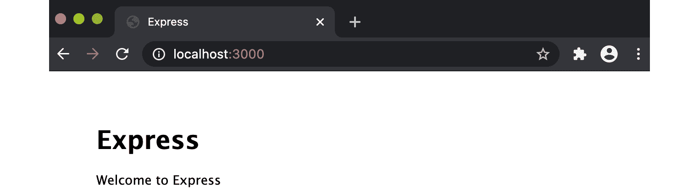

    图 10.1–显示“欢迎使用 Express”网页的浏览器窗口

3.  我们已确认我们的服务器已启动，并正在响应`http://localhost:3000`的请求。现在，我们可以使用`autocannon`工具对 HTTP 请求进行基准测试。打开一个新的终端窗口，输入以下命令以使用`autocannon`运行负载测试：

    ```js
    $ autocannon --connections 100 http://localhost:3000/
    ```

4.  While the `autocannon` load test is running, switch to the Terminal window where you started the web server. You should see a mass of incoming requests:

    

    图 10.2–处理许多 HTTP GET 请求的 Express.js 服务器

5.  Switch back to the Terminal window where you're running the `autocannon` load test. Once the load test is complete, you should see an output similar to the following, detailing the results:

    

    图 10.3–自动扫描结果摘要

6.  观察结果表。第一个表详细说明了请求延迟。延迟是请求从启动到接收响应所花费的时间。平均记录为 22.18 毫秒。第二个表详细说明了请求量，其中记录了我们的服务器平均每秒处理 4409.11 个请求，平均吞吐量为每秒 2.06 MB。

我们现在已经学习了如何使用`autocannon`工具对 HTTP 请求进行基准测试。

## 它是如何工作的…

`autocannon`是以 Node.js 编写并发布到`npm`注册表的跨平台 HTTP 基准测试工具。

在配方中，我们使用`autocannon`在`http://localhost:3000`端点处加载测试我们的 Express.js web 服务器。我们越过了`autocannon`旗。此标志指示`autocannon`向服务器分配 100 个并发连接池。如果我们省略了这个标志，`autocannon`将默认分配 10 个并发连接。应更改并发连接的数量，以最好地表示服务器上的预期负载，以便您可以模拟生产工作负载。

`autocannon`默认运行负载测试 10 秒，在前一个请求完成后，立即在每个套接字上发送新请求。可以使用`--duration`标志延长负载测试的长度。例如，您可以使用以下命令将负载测试从配方扩展到 20 秒：

```js
$ autocannon --connections 100 --duration 20 http://localhost:3000/
```

重要提示

此配方使用了`autocannon`的完整形式命令行标志以提高可读性。但是，与许多命令行标志一样，可以使用缩写形式。`--connections`标志可以缩写为`-c`，而`--duration`标志可以缩写为`-d`。

默认情况下，`autocannon`在两个表中输出负载测试的数据。第一个表详细说明了请求延迟，第二个表详细说明了请求量。以下屏幕截图是`autocannon`测试结果的示例：

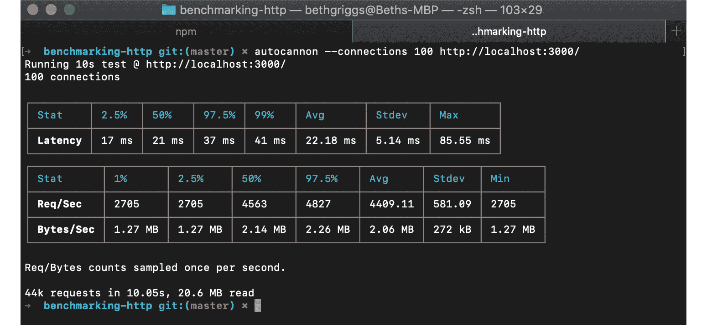

图 10.4–自动扫描结果摘要

Request latency 是从发出请求到收到响应之间经过的时间量。请求延迟表被分解为不同的百分比。2.5%的百分比记录了最快的 2.5%的请求，99%的百分比记录了最慢的 1%的请求。当基准测试请求时，记录和考虑最佳情况和最坏情况都是有用的。延迟表还详细说明了平均、标准偏差和记录的最大延迟。一般来说，延迟越低越好。

请求卷表详细说明了每秒的请求数（`Req/Sec`和吞吐量，记录为每秒处理的字节数（`Bytes/Sec`。同样，结果被分解成百分位数，以便能够解释最好和最坏的情况。对于这两个度量，数字越高越好，因为这表明服务器在给定的时间范围内处理了更多的请求。

重要提示

有关可用的`autocannon`命令行标志的更多信息，请参阅 GitHub 上的**用法**文档：[https://github.com/mcollina/autocannon#usage](https://github.com/mcollina/autocannon#usage) 。

## 还有更多…

接下来，我们将介绍如何使用`autocannon`对 HTTP POST 请求进行基准测试。我们还将考虑如何在基准期间最好复制损坏的生产环境，以及如何改变我们的等待时间和吞吐量。

### 基准测试 HTTP POST 请求

在配方中，我们对 HTTP GET 请求进行了基准测试。`autocannon`提供使用其他 HTTP 方法（如 HTTP POST）发送请求的能力。

让我们看看如何使用`autocannon`发送带有 JSON 负载的 HTTP POST 请求：

1.  在同一目录（`benchmarking-http`中创建一个名为`post-server.js`：

    ```js
    $ touch post-server.js
    ```

    的文件
2.  现在，我们需要在 Express.js 服务器上定义一个端点，该端点将使用 JSON 负载处理 HTTP POST 请求。将以下内容添加到`post-server.js`：

    ```js
    const express = require("express");
    const app = express();
    const bodyParser = require("body-parser");
    app.use(bodyParser.json());
    app.use(bodyParser.urlencoded({ extended: false }));
    app.post("/", (req, res) => {
      res.send(req.body);
    });
    app.listen(3000, () => {
      console.log("Server listening on port 3000");
    });
    ```

3.  现在，我们需要开始`post-server.js`：

    ```js
    $ node post-server.js
    ```

4.  In a separate Terminal window, enter the following command to load test the HTTP POST request. Note that we pass `autocannon` a `--method`, `--headers`, and `--body` flag:

    ```js
    $ autocannon --connections 100 --method POST --headers 'content-type=application/json' --body '{ "hello": "world"}' http://localhost:3000/
    ```

    与主配方一样，`autocannon`将运行负载测试并输出结果摘要。

这演示了如何使用`autocannon`来模拟其他 HTTP 方法请求，包括具有有效负载的请求。

### 复制生产环境

在衡量绩效时，尽可能紧密地复制生产环境是很重要的；否则，我们可能会产生误导性的结果。开发和生产中应用的行为可能不同，这可能导致性能差异。

我们可以使用 Express.js 生成的应用来演示性能结果如何因运行环境而异。

使用`express-generator`在名为`benchmarking-views`的新目录中生成 Express.js 应用。有关 Express.js 生成器的更多信息，请参阅[*第 6 章*](06.html#_idTextAnchor165)、*探索 Node.js web 框架*中的*使用 Express.js*构建 web 应用。在本例中，我们将使用`pug`视图引擎生成一个简单的 HTML 页面：

1.  在您的终端中输入以下命令以生成应用：

    ```js
    $ npx express-generator --views=pug benchmarking-views
    $ cd benchmarking-views
    $ npm install
    ```

2.  使用以下命令启动服务器：

    ```js
    $ npm start
    ```

3.  In a new Terminal window, use `autocannon` to load test `http://localhost:3000`:

    ```js
    $ autocannon --connections 100 http://localhost:3000/
    ```

    负载测试完成后，`autocannon`将输出负载测试结果汇总：

    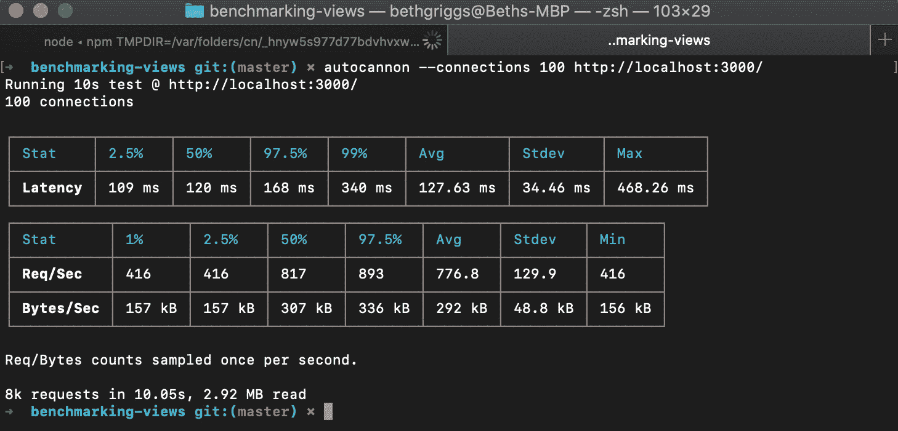

    图 10.5–开发模式运行的自动扫描结果摘要

    在这个负载测试中，平均每秒的请求数约为 776，平均吞吐量约为每秒 292 kB。这比我们在主配方中测试的 HTTP GET 请求要慢得多。

    请求速度较慢的原因是，在开发模式下，`pug`模板引擎将为每个请求重新加载模板。这在开发模式中很有用，因为对模板的更改可以反映出来，而无需重新启动服务器。当模式设置为生产模式时，Express.js 将不再为每个请求重新加载模板。这将导致性能差异。

4.  使用以下命令在生产模式下重新启动 Express.js 服务器：

    ```js
    $ NODE_ENV=production npm start
    ```

5.  现在，在另一个终端窗口中，使用`autocannon`：

    ```js
    $ autocannon --connections 100 http://localhost:3000/
    ```

    重新运行相同的基准测试
6.  比较两次运行之间的输出：


图 10.6–生产模式运行的自动扫描结果摘要

在第二个负载测试中，我们可以看到平均每秒请求数已增加到大约 4924（从 776 增加到 4924），吞吐量已增加到每秒 1.85 MB（从 292 kB 增加到 4924）。这种性能提高是由于在生产模式下缓存模板造成的。

这突出了需要在最能代表预期生产环境的环境中对我们的应用进行基准测试。

## 另见

*   [*第 6 章*](06.html#_idTextAnchor165)*探索 Node.js web 框架*中的*使用 Express.js*配方构建 web 应用
*   本章中的*解释火焰图*配方
*   本章中的*检测内存泄漏*方法
*   本章中的*优化同步功能*配方
*   本章中的*优化异步函数*配方

# 解读火焰图

flame 图是一种可视化工具，允许我们识别应用中的“热代码路径”。术语“热代码路径”用于描述程序中消耗相对大量时间的执行路径，这可能表示应用中存在瓶颈。

Flame 图提供了执行期间应用调用堆栈的可视化。通过这种可视化，可以确定应用运行时哪些函数在 CPU 上花费的时间最多。

在这个配方中，我们将使用`0x`火焰图工具（[https://github.com/davidmarkclements/0x](https://github.com/davidmarkclements/0x) 为我们的 Node.js 应用生成火焰图。

## 准备好了吗

我们需要创建一个可以分析的应用。评测是一种程序分析，它测量程序中函数或方法的使用频率和使用时间。我们将使用 Express.js 生成器创建一个基础应用。我们的应用将使用`pug`视图引擎：

```js
$ npx express-generator --views=pug flamegraph-app
$ cd flamegraph-app
$ npm install
```

现在我们已经生成了一个应用，我们准备开始生成火焰图。请注意，*还有更多……*部分的内容将要求您安装 Google Chrome。

## 怎么做…

在这个配方中，我们将使用`0x`工具分析我们的服务器并生成火焰图。我们还需要使用本章*基准测试 HTTP 请求*配方中介绍的`autocannon`工具在我们的应用上生成负载：

1.  首先，我们需要确保我们在全球安装了`autocannon`和`0x`工具：

    ```js
    $ npm install --global autocannon 0x
    ```

2.  现在，我们需要用`0x`可执行文件启动服务器，而不是用`node`二进制文件启动服务器。如果我们打开`package.json`文件，我们可以看到`npm start`脚本是`node ./bin/www`。我们需要将终端命令中的`node`二进制替换为`0x`：

    ```js
    $ 0x ./bin/www
    Profiling
    ```

3.  现在，我们需要在服务器上生成一些负载。在新的终端窗口中，使用`autocannon`基准测试工具生成负载，命令如下：

    ```js
    $ autocannon --connections 100 http://localhost:3000
    ```

4.  Expect to see the following output when the `autocannon` load test has completed:

    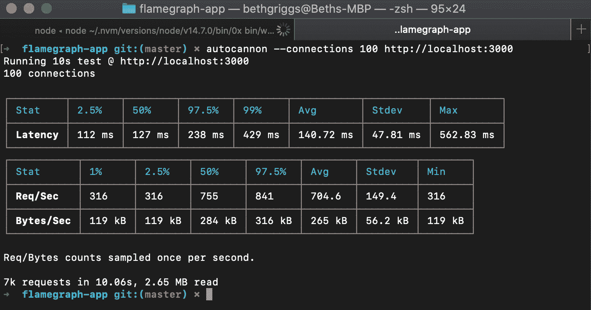

    图 10.7–自动扫描结果摘要

    注意，在前面的负载测试中，我们的服务器平均每秒处理 704.6 个请求。

5.  返回服务器启动的终端窗口并按*Ctrl*+*C*。这将停止服务器。`0x`然后将捕获的堆栈转换为火焰图。
6.  Expect to see the following output after pressing *Ctrl* + *C*. The output will detail the location where `0x` has generated the flame graph. Observe that the `0x` tool has created a directory named `96552.0x`, where `96552` is the **Process Identifier** (**PID**) of the server process:

    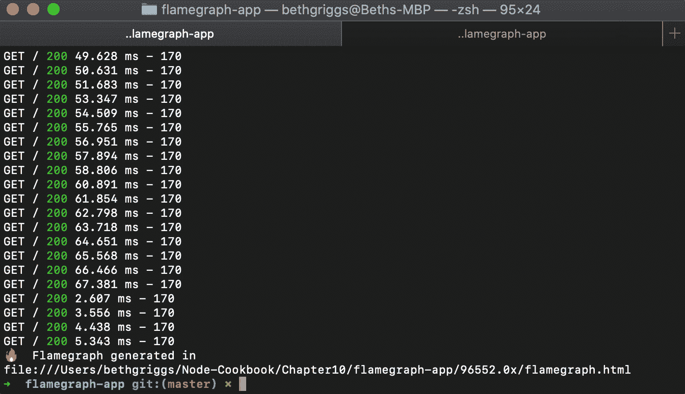

    图 10.8–生成火焰图的 0x 工具

7.  Open the `flamegraph.html` file, which has been generated in the `flamegraph-app` directory, with Google Chrome. You can do this by copying the path to the flame graph and pasting it into the Google Chrome address bar. Expect to see the generated flame graph and some controls:

    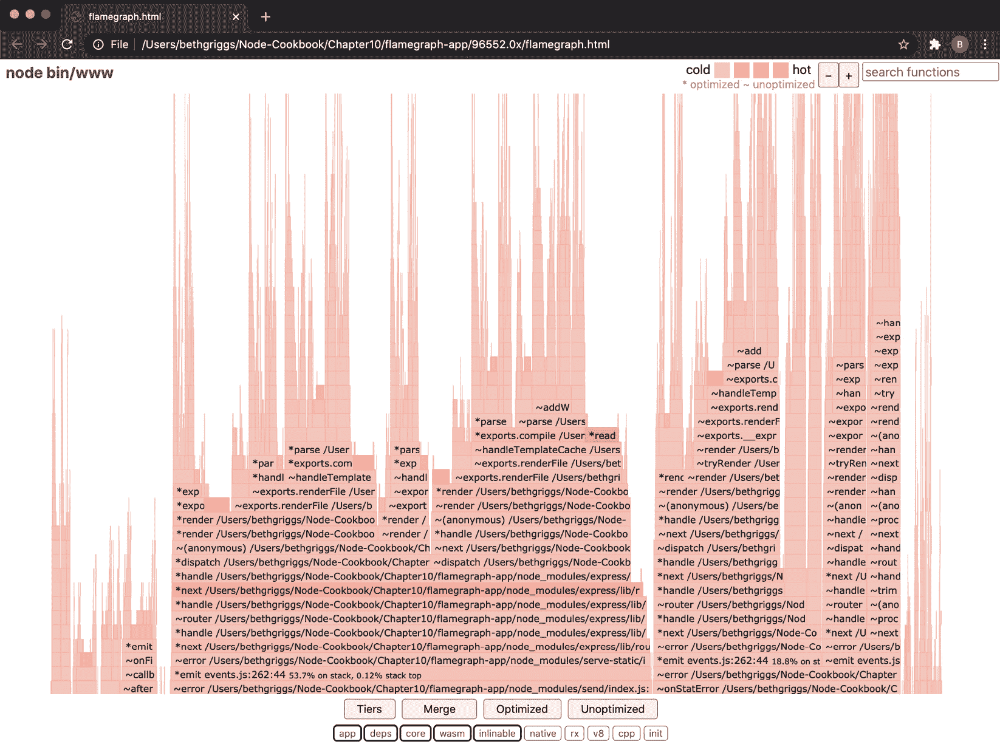

    图 10.9-0x 火焰图

8.  Observe that the bars in the flame graph are of different shades. A darker (redder) shade indicates a hot code path.

    重要提示

    即使在运行相同的负载测试时，每个生成的火焰图也可能略有不同。设备上生成的火焰图可能与本配方中显示的输出不同。这是由于分析过程的不确定性，这可能会对火焰图输出产生微妙的影响。但是，总体火焰图结果和瓶颈应一致。

9.  Identify one of the darker frames. In our example flame graph, we can see that the `readFileSync()` frame method has a darker shade – indicating that that function has spent a relatively large amount of time on the CPU:

    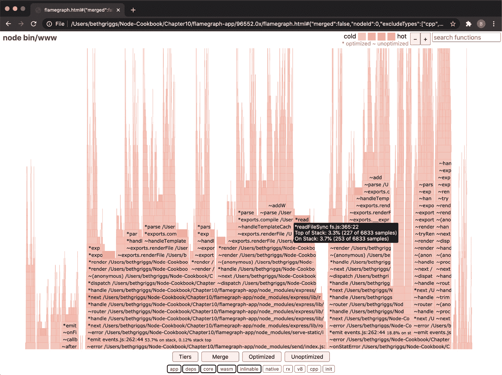

    图 10.10–将 readFileSync（）突出显示为热帧的 0x flame 图

10.  Click on the darker frame. If it is difficult to identify the frame, you can enter `readFileSync` into the search bar (top right) and the frame will be highlighted. Upon clicking on the frame, `0x` will expand the parent and child stacks of the selected frame:

    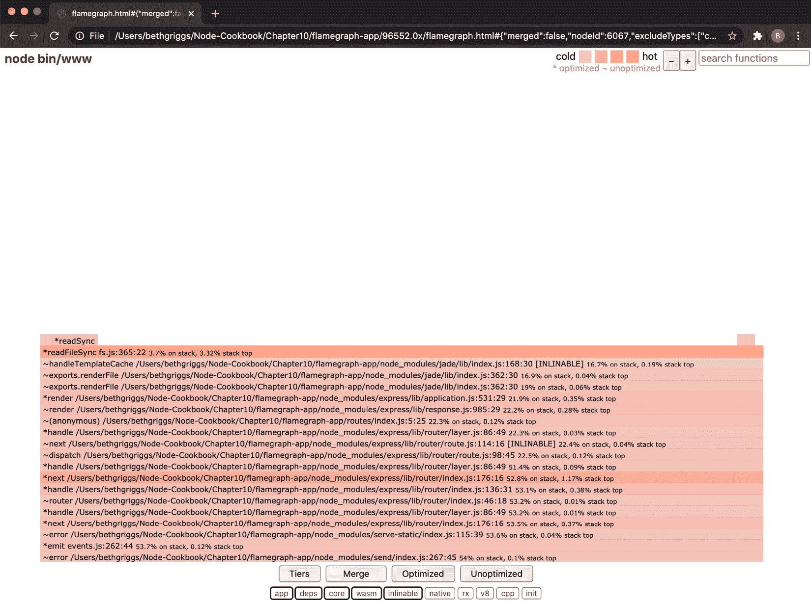

    图 10.11–显示 readFileSync（）向下钻取视图的 0x flame 图

    从向下钻取的视图中，我们可以看到热代码路径。从火焰图中，我们可以有根据地猜测哪些函数值得花时间进行优化。在这种情况下，我们可以看到对`handleTemplateCache()`的引用。在前面的*基准测试 HTTP 请求*中，我们了解了 Express.js 在开发模式下如何为每个请求重新加载模板。这就是这个瓶颈的原因。让我们将应用更改为在生产模式下运行，看看对负载测试结果和火焰图有何影响。

11.  使用以下命令在生产模式下重新启动 Express.js 服务器：

    ```js
    $ NODE_ENV=production 0x ./bin/www
    ```

12.  使用`autocannon`工具

    ```js
    $ autocannon --connections 100 http://localhost:3000
    ```

    重新运行负载测试
13.  We can see from the results of the load test that our server is handling more requests per second. In this run, our load test reported that our server handled an average of 3,752.28 requests per second, up from 704.6 before we changed the Express.js server to run in production:

    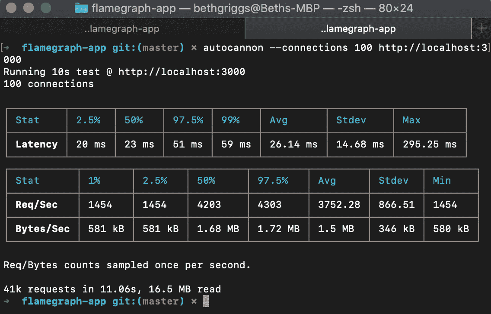

    图 10.12–生产模式运行的自动扫描结果摘要

14.  如前所述，一旦`autocannon`负载测试完成，使用*Ctrl*+*C*停止您的服务器。将生成一个新的火焰图。在浏览器中打开新火焰图，观察新火焰图与第一个火焰图的形状不同。观察第二个火焰图突出显示了一组不同的较暗帧。这是因为我们已经解决了第一个瓶颈。热代码路径是相对的。尽管已经证明提高了我们应用的性能，flame 图将识别下一组热代码路径：


图 10.13–生产模式下的 0x 火焰图

我们使用`0x`生成火焰图，这使我们能够识别应用中的瓶颈。

## 它是如何工作的…

在配方中，我们使用`0x`工具进行剖面分析，并为我们的应用生成火焰图。我们的应用是一个生成的小型 Express.js web 服务器。`autocannon`工具用于向我们的 web 服务器添加负载，使我们能够生成代表生产工作负载的火焰图。

要使用`0x`工具，我们必须用`0x`启动服务器。当我们使用`0x`启动应用时，会启动两个进程。

第一个进程使用 Node.js 二进制文件`node`来启动我们的程序。当`0x`启动`node`进程时，它将`--perf-basic-prof`命令行标志传递给该进程。这个命令行 java T4。标志允许将 C++ V8 函数调用映射到相应的 JavaScript 函数调用。

第二个进程启动本地系统的堆栈跟踪工具。在 Linux 上，将调用`perf`工具，而在 macOS 和 SmartOS 上，将调用`dtrace`工具。这些工具捕获底层的 C 级函数调用。

底层系统堆栈跟踪工具将采集样本。样本是采集样本时 CPU 正在执行的所有函数的快照，它还将记录父函数调用。

采样堆栈根据调用层次结构进行分组，将父函数调用和子函数调用分组在一起。这些组被称为**火焰**，因此命名为**火焰图**。相同的功能可能出现在多个火焰中。

火焰中的每一条线都称为框架。帧表示函数调用。帧的宽度对应于探查器在 CPU 上观察该函数的时间量。每个帧的时间表示也聚合了所有子函数所用的时间，因此图的三角形或*火焰*形状。

较暗（较红）的帧表示一个函数相对于其他函数在堆栈顶部花费了更多的时间。这意味着此函数在 CPU 上花费了大量时间，这表明存在潜在的瓶颈。

## 还有更多…

Chrome DevTools 可用于评测 CPU，这有助于识别瓶颈。在版本 6.3.0 中，`--inspect`标志被添加到 Node.js 中。我们可以使用此标志启用 Node.js 进程，以便使用 Chrome DevTools 进行调试和分析：

重要提示

有关使用 Chrome DevTools 调试 Node.js 程序的更多信息，请参阅[*第 12 章*](12.html#_idTextAnchor379)、*调试 Node.js*中的*使用 Chrome DevTools 调试 Node.js*配方。

1.  要启动，我们需要使用`--inspect`命令行标志启动服务器：

    ```js
    $ node --inspect ./bin/www
    ```

2.  In Google Chrome, navigate to `chrome://inspect/#devices`. Expect to see the following output:

    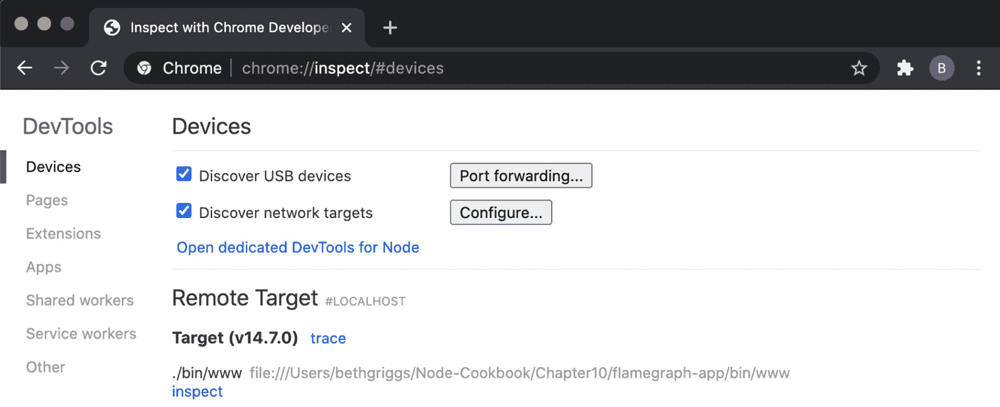

    图 10.14–Chrome 开发工具界面

3.  Click on the **inspect** hyperlink to open up Chrome DevTools, and then click on the **Profiler** tab and you should see the following interface:

    

    图 10.15–Chrome DevTools Profiler 界面

4.  点击**开始**开始评测。
5.  现在，我们需要在服务器上模拟一些负载。在新的终端窗口中，输入以下命令以使用`autocannon`工具向我们的服务器发送请求：

    ```js
    $ autocannon --connections 100 http://localhost:3000
    ```

6.  Once the `autocannon` load test has completed, return to Chrome DevTools and click **Stop** within the **Profiler** interface. Expect to see output similar to the following:

    

    图 10.16–Chrome DevTools Profiler 数据

    该表输出探查器获得的数据。该表按`Self Time`排序。`Self Time`是指在 CPU 上观察特定函数实例的时间量。

7.  在**Profiler**视图的右侧，链接了该函数的文件和行号。单击其中一个将打开包含所列函数的文件：

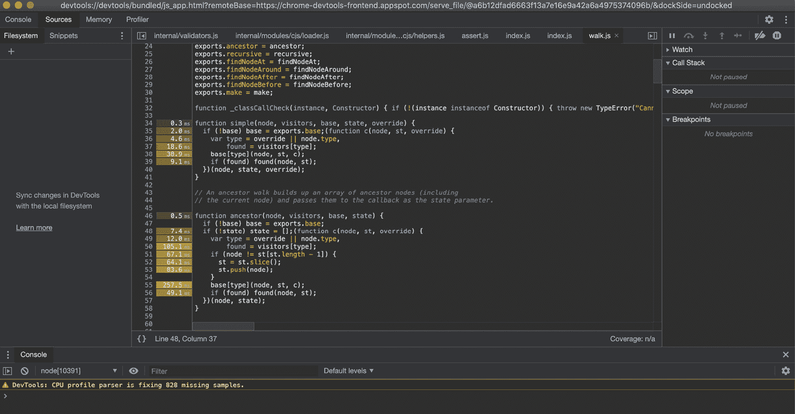

图 10.17–带计时的 Chrome DevTools 代码界面

在代码行的左侧，我们可以看到 ChromeDevTools 添加了 CPU 执行该行代码所花费的时间（以毫秒为单位）。这可以帮助我们确定程序中哪些行导致了瓶颈。

## 另见

*   [*第 6 章*](06.html#_idTextAnchor165)*探索 Node.js web 框架*中的*使用 Express.js*配方构建 web 应用
*   本章中的*基准测试 HTTP 请求*配方
*   本章中的*检测内存泄漏*方法
*   本章中的*优化同步功能*配方
*   本章中的*优化异步函数*配方
*   [*第 12 章*](12.html#_idTextAnchor379)、*调试 Node.js*中的*调试 Node.js 与 Chrome DevTools*配方

# 检测内存泄漏

内存泄漏会严重影响应用的性能，在某些情况下，甚至会导致应用崩溃。

V8 在其堆中存储对象和动态数据，其中堆是基于二叉树的数据结构，用于组织父节点和子节点之间的直接关系。**V8 垃圾收集器**（**GC**负责管理堆。V8 GC 回收任何不再使用的内存–释放内存以便可以重用。

当一个内存块从未被 GC 回收，因此空闲且效率低下时，就会发生内存泄漏。这将导致堆上剩余的未使用内存片段。当堆中累积了许多未使用的内存块时，应用的性能可能会受到影响。在最坏的情况下，未使用的内存可能占用所有可用的堆空间，从而导致应用崩溃。

在本教程中，我们将学习如何使用 ChromeDevTools 分析内存，使我们能够检测和修复内存泄漏。

## 准备好了吗

这个方法需要你安装 ChromeDevTools，它集成到谷歌 Chrome 浏览器中。访问[https://www.google.com/chrome/](https://www.google.com/chrome/) 要下载谷歌浏览器：

1.  我们将使用`autocannon`工具将加载定向到我们的应用。使用以下命令从`npm`注册表安装`autocannon`：

    ```js
    $ npm install --global autocannon 
    ```

2.  让我们也创建一个目录来工作：

    ```js
    $ mkdir profiling-memory
    $ cd profiling-memory
    $ npm init --yes
    ```

3.  创建一个名为`leaky-server.js`的文件。此 HTTP 服务器将故意包含内存泄漏：

    ```js
    $ touch leaky-server.js
    ```

4.  将以下内容添加到`leaky-server.js`：

    ```js
    const http = require("http");
    const server = http.createServer((req, res) => {
      server.on("connection", () => {
        console.log("connected");
      });
      res.end("Hello World!");
    });
    server.listen(3000, () => {
      console.log("Server listening on port 3000");
    });
    ```

现在，我们已经安装了必要的工具并创建了一个包含内存泄漏的示例应用，我们准备继续进行配方步骤。

## 怎么做…

在此配方中，我们将使用 Chrome DevTools 来识别内存泄漏：

1.  应用运行的时间越长，内存泄漏可能会越来越严重。有时，运行应用可能需要数周的时间才能导致应用崩溃。我们可以使用 Node.js 进程`--max-old-space-size`命令行标志来增加或减少最大 V8 旧内存大小（MB）。为了证明内存泄漏的存在，我们将其设置为一个非常小的值。使用以下命令启动`leaky-server.js`：

    ```js
    $ node --max-old-space-size=10 leaky-server.js 
    Server listening on port 3000
    ```

2.  在第二个终端窗口中，使用`autocannon`工具将加载定向到服务器：

    ```js
    $ autocannon http://localhost:3000
    ```

3.  Back in the Terminal window where you started the server, observe that the server crashed with `JavaScript heap out of memory`:

    

    图 10.18–JavaScript 堆内存不足错误

4.  现在，我们将开始使用 chromedevtools 来分析我们的应用。我们必须首先使用以下命令重新启动服务器：

    ```js
    $ node --inspect leaky-server.js
    ```

5.  在 Google Chrome 中导航至`chrome://inspect`，点击**检查**（在`leaky-server.js`下方）。这将打开 Chrome DevTools 界面。
6.  Ensure you're on the **Memory** tab and **Heap snapshot** is selected. Click **Take snapshot**:

    

    图 10.19–Chrome DevTools 内存界面

    您应该看到**快照 1**出现在界面左侧：

    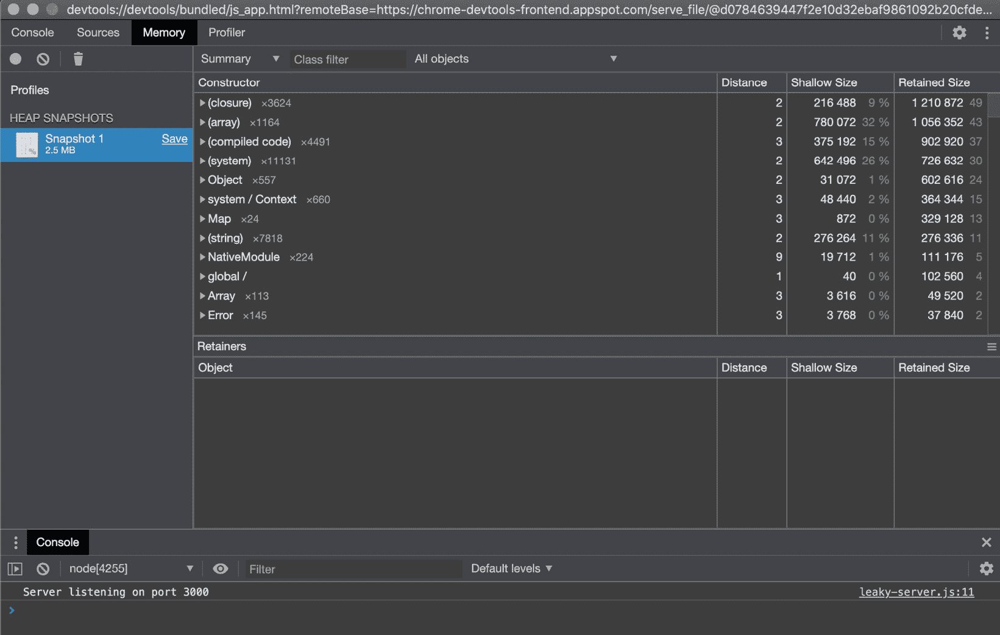

    图 10.20–Chrome DevTools 内存快照界面

7.  返回您的第二个终端窗口，重新运行`autocannon`基准：

    ```js
    $ autocannon http://localhost:3000
    ```

8.  Once the load test has completed, return to your Chrome DevTools window. Return to the **Profiles** interface of the **Memory** tab and take another snapshot:

    

    图 10.21–Chrome DevTools 内存快照界面

    注意**控制台**选项卡中的`MaxListenersExceededWarning`–这将在*中有更多的……*部分详细介绍。

9.  Now that we have two snapshots, we can use the Chrome DevTools to compare them. To do this, change the drop-down window from **Summary** to **Comparison**:

    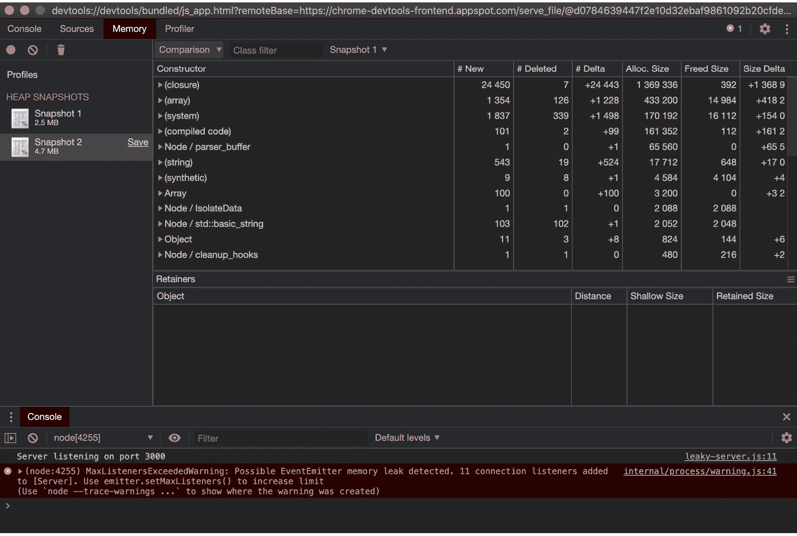

    图 10.22–Chrome DevTools 内存快照比较界面

10.  Observe that the constructors are now sorted by delta – the difference between two snapshots. Expand the `(array)` constructor and the `(object elements) [ ]` object within it, and you should see the following output:

    

    图 10.23–扩展的 Chrome DevTools 内存快照比较界面

11.  扩展视图表明存在大量的`connectionListener()`事件，源于`leaky-server.js`的*第 4*行。如果我们看一下这条线，我们可以看到它从`server.on("connection",...`块开始。这是我们的内存泄漏。我们正在为每个请求注册一个连接事件的侦听器，导致服务器最终内存不足。我们需要将此事件侦听器移到请求处理程序函数之外。创建一个名为`server.js`：

    ```js
    $ touch server.js
    ```

    的新文件
12.  将以下内容添加到`server.js`：

    ```js
    const http = require("http");
    const server = http.createServer((req, res) => {
      res.end("Hello World!");
    });
    server.on("connection", () => {
      console.log("connected");
    });
    server.listen(3000, () => {
      console.log("Server listening on port 3000");
    });
    ```

13.  重新运行相同的实验。使用`$ node --inspect server.js`启动服务器并拍摄快照。在第二个终端窗口中，使用`$ autocannon http://localhost:3000`直接加载到服务器并拍摄另一个快照。现在，当我们比较两者时，我们可以看到`(array)`构造器的`# Delta`值已经显著降低：


图 10.24–Chrome DevTools 内存快照比较界面

注意`MaxListenersExceededWarning`警告不再出现，表明我们已经修复了内存泄漏。

我们已经学习了如何获取应用的堆快照，使我们能够诊断应用中的内存泄漏。

## 它是如何工作的…

Google Chrome 和 Node.js 都使用 V8 JavaScript 引擎。通用的底层引擎意味着我们可以使用 ChromeDevTools 来调试和评测 Node.js 应用。要启用调试客户端，我们必须首先将`--inspect`命令行标志传递给`node`进程。传递此标志指示 V8 inspector 打开一个接受 WebSocket 连接的端口。WebSocket 连接允许客户端和 V8 inspector 进行交互。

V8 JavaScript 引擎保留了 JavaScript 代码中引用的所有对象和原语的堆。JavaScript 堆可以通过内部 V8 API（`v8_inspector`）公开。Chrome 开发工具使用这个内部 API 提供工具接口，包括我们在配方中使用的**内存分析器**接口。

我们使用 ChromeDevTools 的**内存**接口来获取服务器的初始堆快照。此快照被视为我们的基线。然后，我们使用`autocannon`工具在服务器上生成负载，以模拟超时使用情况。对于我们的服务器，默认的`autocannon`负载（10 个连接持续 10 秒）可以观察到内存泄漏。某些内存泄漏可能只有在相当大的负载下才能观察到；在这些情况下，我们需要在服务器上模拟更极端的负载，并且可能需要更长的时间。

自动加农炮

本章中的*基准测试 HTTP 请求*方法更详细地介绍了如何使用`autocannon`工具模拟更极端的服务器负载。

将负载定向到服务器后，我们拍摄了第二个堆快照。这显示了负载对堆大小的影响。我们的第二个快照比第一个快照大得多，这表明内存泄漏。堆快照**比较**视图可用于确定哪些构造函数具有最大的增量。

通过检查和扩展`(array)`构造函数，我们发现了一长串源自我们`leaky-server.js`文件*第 4 行*的`connectionListener()`事件。这使我们能够识别内存泄漏。注意，`(array)`构造函数是指 V8 使用的内部结构。对于 JavaScript 数组，构造函数将命名为`Array`。

一旦识别并修复了内存泄漏，谨慎的做法是重新运行测试并确认新的堆快照显示增量减少。由于负载的原因，快照仍可能大于初始基线快照。然而，它不应该像我们的`leaky-server.js`文件那样大。

## 还有更多…

配方中，负载时，`leaky-server.js`在碰撞前发出`MaxListenersExceededWarning`：

```js
$ node --max-old-space-size=10 leaky-server.js
Server listening on port 3000
(node:16402) MaxListenersExceededWarning: Possible EventEmitter memory leak detected. 11 connection listeners added to [Server]. Use emitter.setMaxListeners() to increase limit
```

默认情况下，Node.js 允许为单个事件最多注册 10 个侦听器。在`leaky-server.js`中，我们为每个请求注册一个新的侦听器。一旦我们的应用注册了第 11 个请求，它就会发出`MaxListenersExceededWarning`。这是内存泄漏的早期警告信号。可以更改侦听器的最大数量。要更改单个`EventEmitter`实例的阈值，我们可以使用`emitter.setMaxListeners()`方法。例如，要将服务器上的侦听器最大数量降低到`1`，我们可以将`leaky-server.js`更改为以下内容：

```js
const http = require("http");
const server = http.createServer((req, res) => {
  server.setMaxListeners(1);
  server.on("connection", () => {
    console.log("connected");
  });
  res.end("Hello World!");
});
server.listen(3000, () => {
  console.log("Server listening on port 3000");
});
```

然后，如果我们运行同一个实验，在只注册了两个事件侦听器之后，我们会看到以下错误：

```js
(node:16629) MaxListenersExceededWarning: Possible EventEmitter memory leak detected. 2 connection listeners added to [Server]. Use emitter.setMaxListeners() to increase limit
```

也可以使用`EventEmitter.defaultMaxListeners`属性更改所有`EventEmitter`实例的默认最大侦听器。这应该谨慎进行，因为它会影响所有`EventEmitter`实例。您可以使用以下设置`EventEmitter.defaultMaxListeners`值：

```js
require("events").EventEmitter.defaultMaxListeners = 15;
```

请注意，`emitter.setMaxListeners()`将始终优先于通过`EventEmitter.defaultMaxListeners`设置的全局默认值。在提高侦听器的最大阈值之前，值得考虑一下您是否无意中屏蔽了应用中的内存泄漏。

## 另见

*   本章中的*解释火焰图*配方
*   本章中的*优化同步功能*配方
*   本章中的*优化异步函数*配方
*   [*第 12 章*](12.html#_idTextAnchor379)、*调试 Node.js*中的*调试 Node.js 与 Chrome DevTools*配方

# 优化同步功能

本章前面的方法已经介绍了如何在我们的应用中检测热代码路径。一旦确定了热代码路径，我们就可以将优化工作集中在它上，以减少瓶颈。

优化任何热代码路径都很重要，因为任何需要较长时间处理的函数都会阻止 I/O 和其他函数的执行，从而影响应用的整体性能。

本食谱将介绍如何对同步函数进行微基准测试和优化。我们将使用 Benchmark.js（[https://github.com/bestiejs/benchmark.js](https://github.com/bestiejs/benchmark.js) 创建微基准。

## 准备好了吗

在实际应用中，我们会使用诸如火焰图或分析器之类的工具来识别应用中的慢功能。对于这个配方，我们将创建一个单一的慢速函数，我们可以学习如何微基准测试和优化：

1.  首先，为配方代码创建一个目录并初始化项目：

    ```js
    $ mkdir optimize-sync
    $ cd optimize-sync
    $ npm init --yes
    ```

2.  我们还需要安装 Benchmark.js:

    ```js
    $ npm install benchmark
    ```

现在我们已经初始化了目录，我们可以继续进行配方步骤。

## 怎么做…

让我们假设我们在代码库中发现了一个瓶颈，它恰好是一个名为`sumOfSquares()`的函数。我们的任务是使此功能更快：

1.  首先，让我们创建一个名为`slow.js`的文件，它将保存我们未优化的函数：

    ```js
    $ touch slow.js
    ```

2.  将以下内容添加到`slow.js`以创建缓慢的`sumOfSquares()`实现。它使用`Array.from()`方法生成一个整数数组。`map()`函数用于对数组中的每个数字求平方，`reduce()`函数用于对数组中的元素求和：

    ```js
    function sumOfSquares(maxNumber) {
      const array = Array.from(Array(maxNumber + 1).keys());
      return array
        .map((number) => {
          return number ** 2;
        })
        .reduce((accumulator, item) => {
          return accumulator + item;
        });
    }
    ```

3.  现在我们有了一个缓慢版本的函数，让我们把它变成一个模块，这样我们就可以更容易地对它进行基准测试。如果我们的函数是一个更大的脚本或应用的一部分，那么尝试将其提取到一个独立的模块中以使其能够独立地进行基准测试是值得的。在`slow.js`的底部添加以下行：

    ```js
    module.exports = sumOfSquares;
    ```

4.  现在，我们可以使用 benchmark.js 为我们的`sumOfSquares()`函数编写一个微基准。创建一个名为`benchmark.js`：

    ```js
    $ touch benchmark.js
    ```

    的文件
5.  Add the following code to `benchmark.js` to create a benchmark for our `sumOfSquares()` function:

    ```js
    const benchmark = require("benchmark");
    const slow = require("./slow");
    const suite = new benchmark.Suite();
    const maxNumber = 100; // number to pass through to sumOfSquares()
    suite.add("slow", function () {
      slow(maxNumber);
    });
    suite.on("complete", printResults);
    suite.run();
    function printResults() {
      this.forEach((benchmark) => {
        console.log(benchmark.toString());
      });
      console.log("Fastest implementation is", this.	filter("fastest")[0].name);
    }
    ```

    该文件包含 Benchmark.js 的配置，一个调用我们的`slow.js`模块的单一基准，以及一个输出基准运行信息的`printResults()`函数。

6.  现在，我们可以使用以下命令运行基准测试：

    ```js
    $ node benchmark.js
    slow x 231,893 ops/sec ±0.90% (90 runs sampled)
    Fastest implementation is slow
    ```

7.  让我们使用`0x`工具生成火焰图。火焰图可以帮助我们确定哪些代码行在 CPU 上花费的时间最多。使用以下命令生成带有`0x`的火焰图：

    ```js
    $ npx 0x benchmark.js
    ```

8.  Open the flame graph in your browser. In the following example, there is one pink frame, indicating a hot code path. Hover over the hotter frames to identify which line of the application they're referring to:

    

    图 10.25–显示 slow.js 第 9 行热帧的 0x flame 图

9.  在火焰图中，我们可以看到最热门的函数是`slow.js`的*第 9*行的匿名函数。如果我们看一下我们的代码，这表明我们使用了`Array.reduce()`。
10.  由于我们怀疑是`Array.reduce()`的使用减慢了我们的操作，我们应该尝试以过程形式重写函数（使用`for`循环），看看它是否提高了性能。创建一个名为`loop.js`：

    ```js
    $ touch loop.js
    ```

    的文件
11.  在`loop.js`中添加以下内容以创建`sumOfSquares()`功能的过程实现：

    ```js
    function sumOfSquares(maxNumber) {
        let i = 0;
        let sum = 0;
        for (i; i <= maxNumber; i++) {
            sum += i ** 2;
        }
        return sum;
    }
    module.exports = sumOfSquares;
    ```

12.  现在，我们为`loop.js`中`sumOfSquares()`函数的实现添加一个基准。首先，通过在`benchmark.js`中的`slow.js`导入下方添加以下行来导入`loop.js`模块：

    ```js
    const loop = require("./loop");
    ```

13.  然后，向套件中添加一个新的基准测试，在慢速运行下方：

    ```js
    suite.add("loop", function () {
        loop(maxNumber);
    });
    ```

14.  重新运行基准测试。这一次，它将运行我们的两个实现，并确定哪一个最快：

    ```js
    $ node benchmark.js
    slow x 247,958 ops/sec ±1.17% (90 runs sampled)
    loop x 7,337,014 ops/sec ±0.86% (94 runs sampled)
    Fastest implementation is loop
    ```

我们已经确认，`sumOfSquares()`函数的过程/循环实现比原始实现快得多。

## 它是如何工作的…

这个方法从缓慢实现一个`sumOfSquares()`函数开始，逐步优化一个同步函数调用的过程。

我们使用 benchmark.js 创建了一个微基准，以创建我们在`slow.js`中初始`sumOfSquares()`实现的基线度量。这种基线测量称为微观基准。微基准测试用于对应用的一个小方面进行基准测试。在我们的例子中，它是针对单个`sumOfSquares()`函数的。

一旦我们的微基准被创建，我们通过`0x`运行基准来生成火焰图。这个火焰图使我们能够识别哪些帧在 CPU 上花费的时间最多，这为我们提供了一个指示，表明我们的`sumOfSquares()`函数中的哪一行代码是瓶颈。

根据火焰图，我们确定使用`sumOfSquares()`的`map()`和`reduce()`功能会减慢操作速度。因此，我们创建了`sumOfSquares()`的第二个实现。第二个实现使用传统的过程代码（一个`for`循环）。一旦我们在`loop.js`中实现了该函数的第二个实现，我们就将其添加到基准测试中，以使我们能够比较这两个实现，看看哪一个更快。

根据每秒可处理的操作数，`loop.js`被发现明显快于最初的`slow.js`实现。编写一个微基准测试的好处是，您有证据并确认您的优化。

## 另见

*   本章中的*基准测试 HTTP 请求*配方
*   本章中的*解释火焰图*配方
*   本章中的*检测内存泄漏*方法
*   本章中的*优化异步函数*配方
*   本章中的*工作线程*配方

# 优化异步功能

Node.js 运行时是在考虑 I/O 的情况下构建的，因此它采用了异步编程模型。在本章前面的介绍中，我们探讨了如何诊断同步 JavaScript 函数中的性能问题。

但是，作为异步工作流的一部分，可能会出现性能瓶颈。在本教程中，我们将介绍分析和优化异步性能问题。

## 准备好了吗

在此配方中，我们将诊断与 MongoDB 数据库通信的 Express.js web 服务器中的瓶颈。有关 MongoDB 的更多信息，请参考[*第 7 章*](07.html#_idTextAnchor191)、*使用数据库*中的*连接并持久化 MongoDB*配方：

1.  要启动 MongoDB，我们将使用 Docker（正如我们在[*第 7 章*](07.html#_idTextAnchor191)、*处理数据库*中所做的那样）。确保 Docker 正在运行，在终端中输入以下命令以提供 MongoDB 数据库：

    ```js
    $ docker run --publish 27017:27017 --name node-mongo --detach mongo:4
    ```

2.  现在，我们需要创建一个工作目录。我们还将从`npm`：

    ```js
    $ mkdir optimize-async
    $ cd optimize-async
    $ npm init --yes
    $ npm install express mongodb
    ```

    安装`express`和`mongodb`模块
3.  为了模拟真实的应用，MongoDB 中需要提供一些数据。创建一个名为`values.js`：

    ```js
    $ touch values.js
    ```

    的文件
4.  将以下内容添加到`values.js`。这将创建一个加载脚本，将一系列的数字输入我们的 MongoDB 数据库：

    ```js
    const MongoClient = require("mongodb").MongoClient;
    const URL = "mongodb://localhost:27017/";
    let values = [];
    const numberOfValues = 1000;
    let count = 0;
    for (count; count < numberOfValues; count++) {
      values.push({ value: Math.round(Math.random() * 100000) });
    }
    MongoClient.connect(URL, { useUnifiedTopology: true }, (err, client) => {
      if (err) throw err;
      const db = client.db("data");
      db.collection("values").insertMany(values, (err) => {
        if (err) throw err;
        console.log(`Added ${numberOfValues} random 	values.`);
        client.close();
      });
    });
    ```

5.  运行`values.js`脚本填充配方数据库：

    ```js
    $ node values.js
    ```

6.  确保在全球范围内安装了`0x`和`autocannon`性能工具：

    ```js
    $ npm install --global 0x autocannon
    ```

现在我们已经初始化了目录，并且 MongoDB 数据库可以使用一些示例数据，让我们继续进行配方步骤。

## 怎么做…

在此配方中，我们将诊断与 MongoDB 数据库通信的 web 应用中的瓶颈。我们将构建一个示例应用，用于计算数据库中存储的所有值的平均值：

1.  创建一个名为`server.js`的文件。这将存储计算数据库中平均值的服务器：

    ```js
    $ touch server.js
    ```

2.  将以下代码添加到`server.js`：

    ```js
    const MongoClient = require("mongodb").MongoClient;
    const URL = "mongodb://localhost:27017/";
    const express = require("express");
    const app = express();
    MongoClient.connect(URL, { useUnifiedTopology: true }, (err, client) => {
      if (err) throw err;
      const db = client.db("data");
      const values = db.collection("values");
      app.get("/", (req, res) => {
        values.find({}).toArray(function sum(err, data) {
          if (err) {
            res.send(err);
            return;
          }
          // Calculate average
          const average =
            data.reduce((accumulator, value) => accumulator + 	value.value, 0) /
            data.length;
          res.send(`Average of all values is ${average}.`);
        });
      });
      app.listen(3000);
    });
    ```

3.  在终端中输入以下命令启动服务器：

    ```js
    $ node server.js
    ```

4.  在浏览器中导航到`http://localhost:3000`以检查服务器是否正在运行。在*入门*部分，我们希望看到一条打印我们保存到数据库的随机值平均值的消息。
5.  In a second Terminal, we'll use the `autocannon` benchmarking tool to simulate a load on the server:

    ```js
    $ autocannon --connections 500 http://localhost:3000
    ```

    负载测试完成后，预计会看到以下`autocannon`结果摘要：

    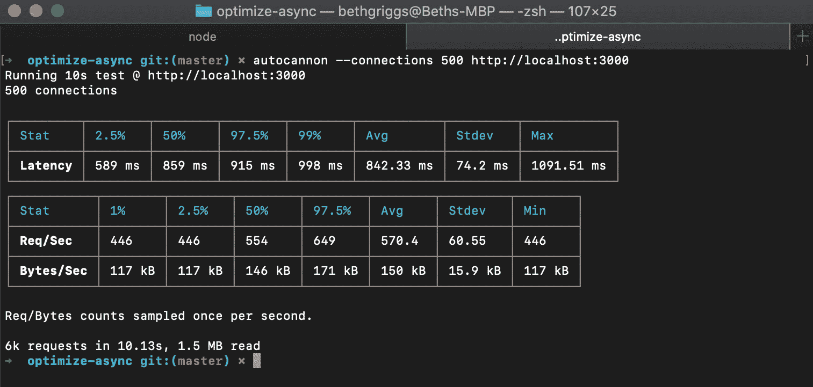

    图 10.26-server.js 的自动扫描结果摘要

    此负载测试显示平均每秒 570.4 个请求。

6.  现在，让我们看看在我们的应用中瓶颈在哪里。我们将使用`0x`工具生成火焰图。使用以下命令重新启动服务器：

    ```js
    $ 0x server.js
    ```

7.  让我们使用`autocannon`工具

    ```js
    $ autocannon --connections 500 http://localhost:3000
    ```

    再次模拟服务器上的负载
8.  Stop the server and open the generated flame graph in your browser. Expect a flame graph similar to the following:

    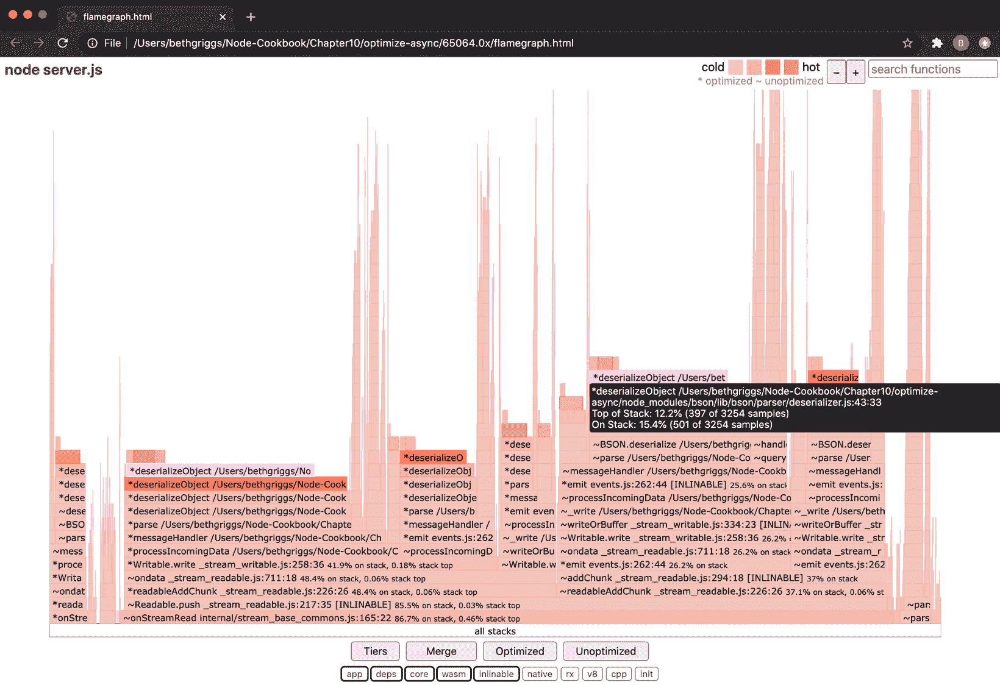

    图 10.27–显示反序列化对象（）热帧的 0x flame 图

9.  正如我们在本章的*解释火焰图*配方中所了解到的，较暗/较粉红的边框可能表示我们应用中的瓶颈。`deserializeObject()`功能似乎是最热门的，这意味着它在 CPU 上花费的时间最多。这是 MongoDB 应用中常见的瓶颈。`deserializeObject()`中的瓶颈与我们从 MongoDB 实例查询和接收的大量数据有关。
10.  让我们尝试通过预计算平均值并将其存储在数据库中来解决这个瓶颈。这将有助于减少我们从 MongoDB 请求的数据量，并消除计算平均值的需要。我们将创建一个名为`calculate-average.js`的脚本，用于计算平均值并将其存储在 MongoDB 中。创建`calculate-average.js`文件：

    ```js
    $ touch calculate-average.js
    ```

11.  将以下代码添加到`calculate-average.js`：

    ```js
    const MongoClient = require("mongodb").MongoClient;
    const URL = "mongodb://localhost:27017/";
    MongoClient.connect(URL, { useUnifiedTopology: true }, (err, client) => {
      if (err) throw err;
      const db = client.db("data");
      const values = db.collection("values");
      const averages = db.collection("averages");
      values.find({}).toArray((err, data) => {
        if (err) throw err;
        // Calculate average
        const average =
          data.reduce((accumulator, value) => accumulator + 	value.value, 0) /
          data.length;
        averages.find({}).toArray((err) => {
          if (err) throw err;
          averages.insertOne({ value: average }, (err) => {
            if (err) throw err;
            console.log("Stored average in database.");
            client.close();
          });
        });
      });
    });
    ```

12.  运行`calculate-averages.js`脚本计算平均值并存储在数据库中：

    ```js
    $ node calculate-average.js
    Stored average in database.
    ```

13.  现在，我们可以重写服务器以返回存储的平均值，而不是在每次请求时计算平均值。创建一个名为`server-no-processing.js`：

    ```js
    $ touch server-no-processing.js
    ```

    的新文件
14.  将以下添加到`server-no-processing.js`：

    ```js
    const MongoClient = require("mongodb").MongoClient;
    const URL = "mongodb://localhost:27017/";
    const express = require("express");
    const app = express();
    MongoClient.connect(URL, { useUnifiedTopology: true }, (err, client) => {
      if (err) throw err;
      const db = client.db("data");
      const average = db.collection("averages");
      app.get("/", (req, res) => {
        average.findOne({}, (err, data) => {
          if (err) throw err;
          res.send(`Average of all values is ${data.	value}.`);
        });
      });
      app.listen(3000);
    });
    ```

15.  Let's rerun the `autocannon` benchmark. Start the server with `$ node server-no-processing.js`, and then, in a second Terminal window, rerun the `autocannon` load test:

    ```js
    $ autocannon --connections 500 http://localhost:3000
    ```

    负载测试完成后，希望看到`autocannon`结果摘要：

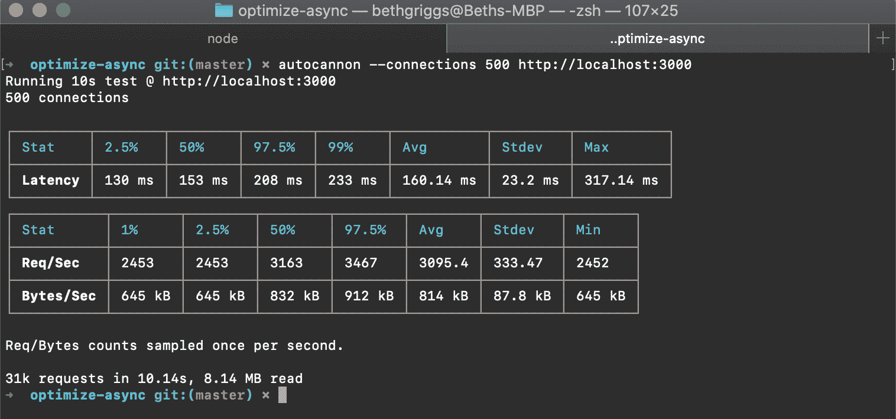

图 10.28-server-no-processing.js 的自动扫描结果摘要

我们可以看到，使用`server-no-processing.js`中预计算的平均值，每秒的请求数已从`server.js`中的 570.4 增加到 3095.4。

在本教程中，我们了解了从 MongoDB 获取和处理大量数据如何在应用中引入瓶颈。在这个配方中，我们通过预计算和存储平均值来解决瓶颈。

## 它是如何工作的…

此配方演示了与 MongoDB 数据库通信的应用中的瓶颈。

缓慢是由请求的大量数据和每次请求的平均值计算造成的。通过使用`0x`工具生成火焰图，可以诊断导致瓶颈的特定功能。

在本例中，通过预计算平均值并将其存储在数据库中，解决了瓶颈问题。这意味着不必查询数据库中的所有值并计算每个请求的平均值，只需直接查询并获得平均值即可。这表明性能显著提高。

值得修改数据模型以存储预计算的平均值，这样就不需要对每个请求进行计算。但是，在实际应用中，可能并不总是能够编辑数据模型以存储计算值。在构建一个新的应用时，值得考虑应该在数据模型中存储哪些数据，以最大限度地减少实时服务器上的计算。

## 另见

*   [*第 6 章*](06.html#_idTextAnchor165)*探索 Node.js web 框架*中的*使用 Express.js*配方构建 web 应用
*   [*第 7 章*](07.html#_idTextAnchor191)中的*连接并坚持 MongoDB*配方*使用数据库*
*   本章中的*基准测试 HTTP 请求*配方
*   本章中的*检测内存泄漏*方法
*   本章中的*优化同步功能*配方
*   本章中的*工作线程*配方

# 使用工作线程

JavaScript 是一种单线程编程语言，这意味着在一个进程中一次只执行一个任务。Node.js 在单个线程上运行，但 Node.js 事件循环支持非阻塞 I/O 调用。事件循环一次执行一个任务。因此，CPU 密集型任务会阻塞事件循环，从而影响应用的整体性能。

如果您希望在 Node.js 中执行 CPU 密集型任务，那么您应该考虑使用 Oracle T1 工作线程 Ty2 T2。工作线程在 Node.js 版本 12 及更高版本中声明为稳定，并通过 Node.js core`worker_threads`模块公开。worker threads API 允许使用线程并行执行 JavaScript，最适合处理 CPU 密集型 JavaScript 操作。

本食谱将介绍`worker_threads`并展示我们如何使用它来处理 CPU 密集型任务。

## 准备好了吗

首先，确保您使用的是 Node.js14（最好是最新的可用版本）。然后，创建一个名为`worker-app`的项目目录：

```js
$ mkdir worker-app
$ cd worker-app
$ npm init
```

现在我们已经创建了一个目录来使用，让我们继续讨论配方。

## 怎么做…

在此配方中，我们将学习如何利用工作线程来处理 CPU 密集型任务：

1.  我们将首先创建一个返回`Hello <name>!`字符串的简化工作程序。创建一个名为`hello-worker.js`：

    ```js
    $ touch hello-worker.js
    ```

    的文件
2.  在`hello-worker.js`中，我们需要导入必要的类和方法：

    ```js
    const {
      Worker,
      isMainThread,
      parentPort,
      workerData,
    } = require("worker_threads");
    ```

3.  现在，我们需要使用`worker_threads`模块中的`isMainThread()`方法创建一个`if`语句。`if`块中的任何内容都将在主线程上执行。`else`块中的代码将在 worker 中执行。在`hello-worker.js`中添加以下内容：

    ```js
    if (isMainThread) {
      // Main thread code
    } else {
      // Worker code
    }
    ```

4.  现在，让我们填充主线程代码。首先，创建一个新的 worker 并向`Worker`构造函数传递两个参数。第一个参数是工作者的主脚本或模块的文件名。在本例中，我们将使用`__filename`引用当前文件。第二个参数是一个`options`对象，它将指定一个`workerData`属性，该属性保存我们要传递给工作线程的名称。`workerData`属性用于与工作线程共享值。在`// Main thread code`注释下方添加以下行：

    ```js
      const worker = new Worker(__filename, {
        workerData: "Beth",
      });
    ```

5.  现在，期望工作线程将值传递回主线程。为了捕获这一点，我们可以创建一个工作消息事件侦听器。在工作者初始化下方添加以下行：

    ```js
      worker.on("message", (msg) => {
        console.log(msg);
      });
    ```

6.  现在，我们可以编写工作代码来构造问候语。使用`parentPort.postMessage()`方法将值返回到我们的主线程。在`// Worker code`注释下方添加以下代码：

    ```js
      const greeting = `Hello ${workerData}!`;
      parentPort.postMessage(greeting);
    ```

7.  现在，使用以下命令运行程序：

    ```js
    $ node hello-worker.js
    Hello Beth!
    ```

8.  现在，让我们尝试一些 CPU 密集型的方法，比较使用和不使用工作线程时的行为。首先，创建一个名为`fibonacci.js`的文件。这将包含一个斐波那契计算器程序，返回给定索引处的斐波那契数。创建`fibonacci.js`文件：

    ```js
    $ touch fibonacci.js
    ```

9.  将以下内容添加到`fibonacci.js`：

    ```js
    const n = 10;
    // Fibonacci calculator
    const fibonacci = (n) => {
      let a = 0, b = 1, next = 1, i = 2;
      for (i; i <= n; i++) {
        next = a + b;
        a = b;
        b = next;
      }
      console.log(`The Fibonacci number at position ${n} is 	${next}`);
    };
    fibonacci(n);
    console.log("...");
    ```

10.  Run the script with the following command:

    ```js
    $ node fibonacci.js 
    The Fibonacci number at position 10 is 55
    ...
    ```

    在这种情况下，`fibonacci()`功能会阻止`console.log("...");`的执行，直到`fibonacci()`功能完成。

11.  现在，让我们尝试使用工作线程编写它，看看如何避免阻塞。创建一个名为`fibonacci-worker.js`的文件并添加以下内容：

    ```js
    const {
      Worker,
      isMainThread,
      parentPort,
      workerData,
    } = require("worker_threads");
    const n = 10;
    // Fibonacci calculator
    const fibonacci = (n) => {
      let a = 0, b = 1, next = 1, i = 2;
      for (i; i <= n; i++) {
        next = a + b;
        a = b;
        b = next;
      }
      return next;
    };
    if (isMainThread) {
      // Main thread code
      const worker = new Worker(__filename, {
        workerData: n,
      });
      worker.on("message", (msg) => {
        console.log(`The Fibonacci number at position ${n} is 	${msg}`);
      });
      console.log("...");
    } else {
      // Worker code
      parentPort.postMessage(fibonacci(workerData));
    }
    ```

12.  Now, run this script with the following command:

    ```js
    $ node fibonacci-worker.js
    ...
    The Fibonacci number at position 10 is 55
    ```

    在`fibonacci()`函数返回结果之前，观察`console.log("...");`正在打印。`fibonacci()`函数已卸载到工作线程，这意味着主线程上的工作可以继续。

我们现在已经学习了如何使用 Node.js core`worker_threads`模块将任务卸载到工作线程。

## 它是如何工作的…

这个配方引入了工作线程。如配方中所示，工作线程应用于处理 CPU 密集型计算。将 CPU 密集型计算卸载到工作线程有助于避免阻塞 Node.js 事件循环。这意味着在处理 CPU 密集型任务时，应用可以继续处理其他工作，例如 I/O 操作。

工作线程通过 core Node.js`worker_threads`模块公开。为了在配方中使用工作线程，我们从`worker_threads`核心模块导入了以下四个资产：

*   `Worker`：工作线程类，表示独立的 JavaScript 线程。
*   `isMainThread`：如果代码未在工作线程中运行，则返回`true`的属性。
*   `parentPort`：这是一个允许工作线程与父线程通信的消息端口。
*   `workerData`：此属性克隆工作线程构造函数中传递的数据。这是主线程的初始数据如何传递给工作线程的。

在配方中，我们使用以下代码初始化了工作线程：

```js
  const worker = new Worker(__filename, {
    workerData: n,
  });
```

`Worker`构造函数需要一个强制性的第一个参数，即文件名。此文件名是工作线程的主脚本或模块的路径。

第二个参数是一个`options`对象，它可以接受许多不同的配置选项。在`fibonacci-worker.js`中，我们只提供了一个配置选项`workerData`，用于将`n`的值传递给工作线程。Node.js`worker_threads`API 文档中列出了可通过工作线程的`options`对象传递的完整选项列表(https://nodejs.org/api/worker_threads.html#worker_threads_new_worker_filename_options).

一旦工人被初始化，我们就可以在其上注册事件侦听器。在配方中，我们注册了一个消息事件侦听器函数，该函数在每次从工作者接收消息时执行。可以在 worker 上侦听以下事件：

*   `error`：工作线程抛出未捕获异常时发出
*   `exit`：工作线程停止执行代码后发出
*   `message`：工作线程使用`parentPort.postMessage()`发出消息时发出
*   `messagerror`：反序列化消息失败时发出
*   `online`：工作线程开始执行 JavaScript 代码时发出

我们使用`parentPort.postMessage()`将`fibonacci(n)`的值发送回父线程。在父线程中，我们注册一个消息事件侦听器来检测来自工作线程的传入消息。

这个配方介绍了工作线程，并展示了如何使用它们来处理 CPU 密集型任务。