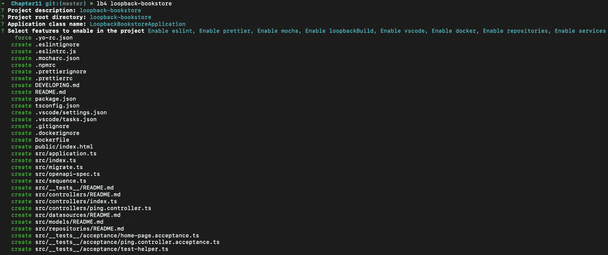
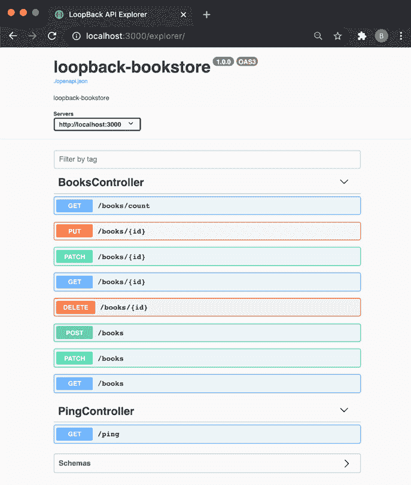
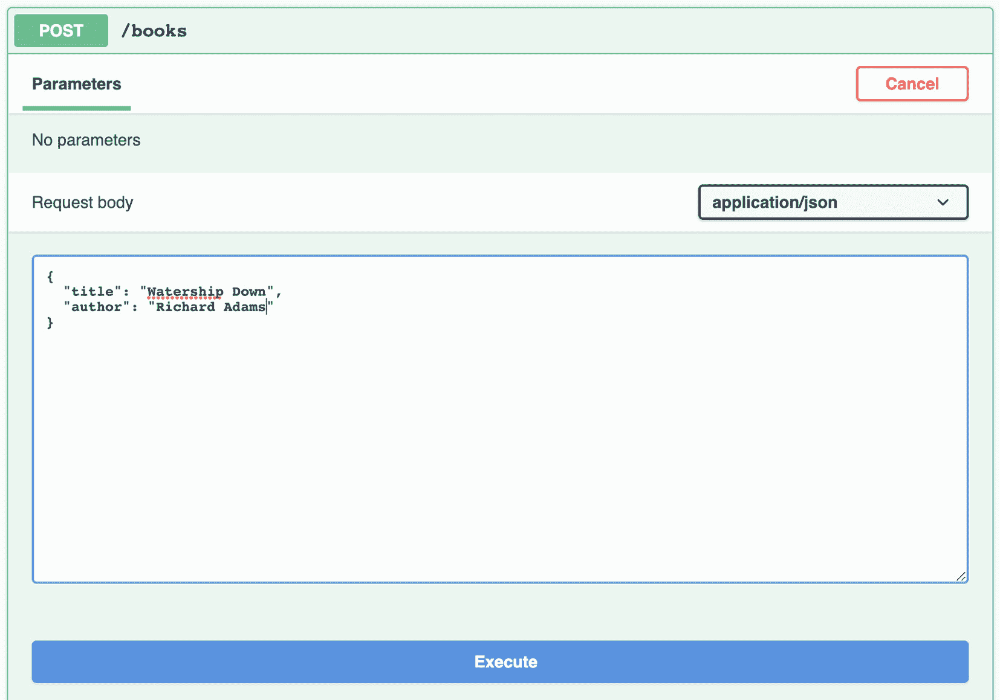
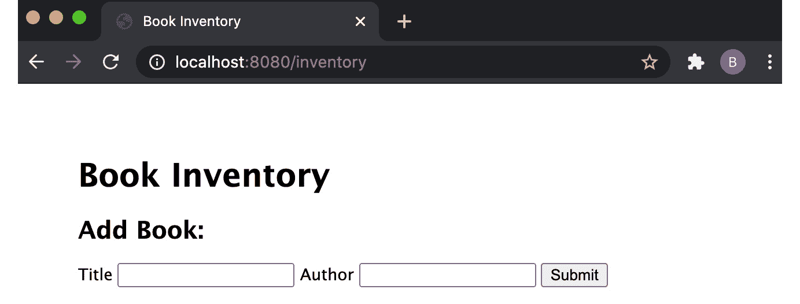
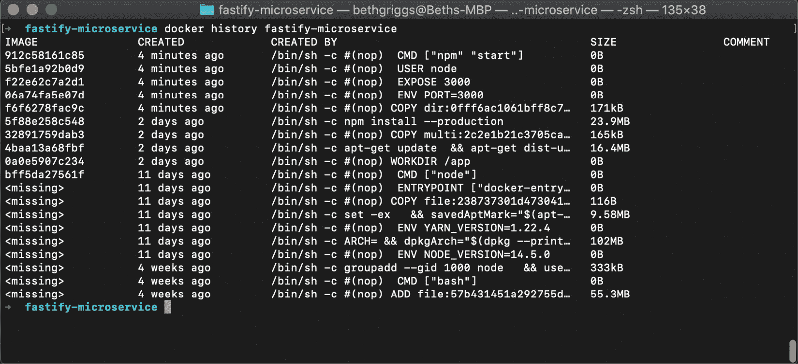
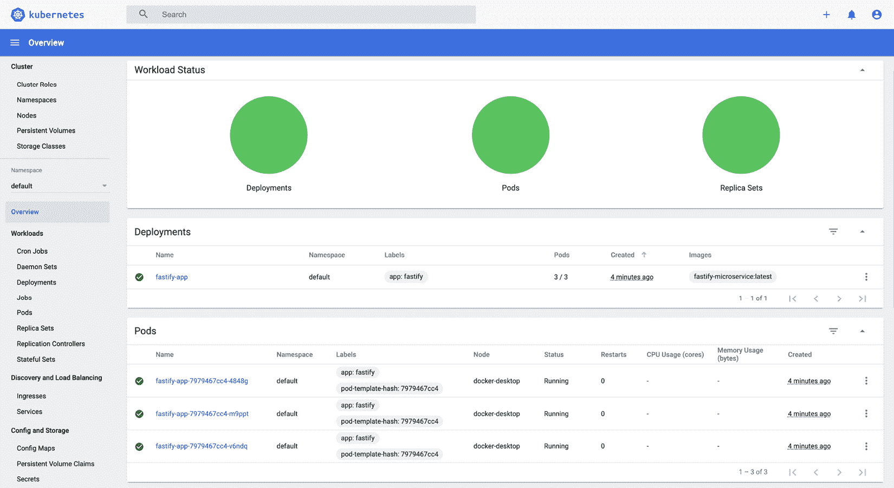

B13828_11_Final_ASB

# *第 11 章*：部署 Node.js 微服务

术语**微服务**用于描述基于微服务架构范例构建的应用程序。这种体系结构鼓励将较大的应用程序构建为一组较小的模块化应用程序，其中每个应用程序都关注一个关键问题。微服务架构与过去的单片架构形成了对比。**Monolith**是一个用于处理许多不同关注点的应用程序的术语。

采用微服务体系结构有许多好处。确保应用程序只服务于一个目的意味着可以对应用程序进行优化以最好地服务于该目的。微服务有助于将系统的各个部分解耦，如果出现问题，可以更容易地进行调试。采用微服务体系结构还使您能够独立地扩展系统的不同部分。

采用微服务架构不仅有技术上的好处。将微服务分离为单独的代码库可以使较小的团队对他们负责的微服务拥有自主权。许多基于微服务的系统是用各种框架和语言编写的。开发团队可以选择他们认为最适合其微服务的语言和框架。

Node.js 微服务通常公开**RESTful**API。**REST**代表**表征状态转移**。RESTful API 通过 HTTP 请求公开其 API，并适当使用 HTTP 谓词。例如，如果一个博客服务公开了一个 RESTful API，那么您希望它公开一个端点，您可以向该端点发送 HTTP GET 请求以检索博客文章。类似地，它可能会公开一个端点，您可以向该端点发送 HTTP POST 请求和数据，以发布新的博客。

微服务和容器技术齐头并进。云和容器技术的采用率在不断提高，Docker 和 Kubernetes 是部署基于微服务的应用程序的主要选择。

本章将介绍以下配方：

*   使用环回生成微服务
*   使用微服务
*   处理错误
*   构建 Docker 容器
*   发布 Docker 映像
*   部署到 Kubernetes

# 技术要求

您需要安装 Node.js，最好是最新版本的 Node.js 14。您还需要访问自己选择的编辑器和浏览器。

在完成本章之前，建议您对 HTTP 协议有一些了解。您可以参考[*第 4 章*](04.html#_idTextAnchor096)、*使用网络协议*。

本章的后三个配方要求您安装**Docker for Desktop**。建议从[安装桌面 Dockerhttps://docs.docker.com/engine/install/](https://docs.docker.com/engine/install/) 。

# 通过环回生成微服务

**环回**是一个可扩展的开源 Node.js 框架，专门构建用于创建 REST API 和微服务。LoopBack 的早期版本受到启发并直接基于 Express.js web 框架。最新版本 Loopback4 经历了一次重要的重构，并用 TypeScript 重写。这种重构允许维护人员扩展环回的特性，而不受以前版本中技术实现决策的限制。

在此配方中，我们将使用环回 4**命令行界面**（**CLI**）来生成 Node.js 微服务。

## 准备好了吗

为了准备配方，我们需要全局安装 LoopBack CLI。在终端中输入以下命令：

```js
$ npm install --global @loopback/cli
```

现在，我们已经在全球范围内安装了 LoopBack CLI，让我们继续讨论这个配方。

## 怎么做…

在这个配方中，我们将生成一个 RESTful API，它将构成 Node.js 微服务。我们将创建的 RESTful API 将模拟书店库存：

1.  环回 CLI 应在您的路径中作为`lb4`提供。要开始生成项目，我们调用 LoopBack CLI，提供项目名称。让我们把我们的项目命名为`loopback-bookstore`。在您的终端中输入以下命令：

    ```js
    $ lb4 loopback-bookstore
    ```

2.  输入该命令将启动一个交互式界面，LoopBack CLI 将在其中请求新项目的信息。对于项目描述、项目根目录和应用程序类名，只需点击*输入*即可接受默认名称。
3.  第四个 CLI 问题询问用户应该在项目中启用哪些功能。点击*进入*可启用所有功能。
4.  You should now see the LoopBack CLI scaffolding your application. Expect to see the following output in your Terminal window, detailing the files and directories that have been created:

    

    图 11.1–显示生成文件的环回 CLI 输出

5.  环回 CLI现在已经生成了我们的应用程序。它还自动安装了我们的`npm`依赖项。导航到应用程序目录并使用以下命令启动应用程序：

    ```js
    $ cd loopback-bookstore
    $ npm start
    ```

6.  If you navigate to [http://localhost:3000](http://localhost:3000) in your browser, you should expect to see the application running:

    

    图 11.2–为 LoopBack 书店应用程序生成的 LoopBack 主页

7.  返回到您的终端，按*Ctrl*+*C*停止应用程序。到目前为止，LoopBack CLI 刚刚生成了一个基本的项目结构。现在我们可以构建我们的书店 API 了。我们可以使用 LoopBack 的模型生成器来实现这一点。输入以下命令开始创建模型：

    ```js
    $ lb4 model
    ```

8.  LoopBack's model generator will open an interactive CLI where we can define the model and its properties. The model we want to create is a **Book Entity**. First, add the `id` property, which will be an integer. You'll also need to add `author` and `title` properties to the model, which should both be mandatory and of the string type. Enter these via the interactive session. The transcript of the session should look like the following:

    

    图 11.3–环回模型生成器的预期记录

9.  现在我们已经创建了模型，我们需要使用 LoopBack 的 datasourcecli 创建数据源。在终端窗口中输入以下命令：

    ```js
    $ lb4 datasource
    ```

10.  The interactive CLI will request information about the data source. We're going to use an in-memory data store. The values you should supply should be `Data source name: local`, and `In-memory db`. For the last two questions, hit *Enter* to accept the defaults. Expect the transcript of your session to match the following:

    

    图 11.4–环回数据源生成器的预期成绩单

11.  接下来，我们需要创建一个环回存储库。这是一个绑定数据源和模型的环回类。输入以下命令启动存储库生成器界面：

    ```js
    $ lb4 repository
    ```

12.  For the repository, we want to use `LocalDatasource` for the **Book** model with a base class of `DefaultCrudRepository`. The Terminal should match the following output:

    

    图 11.5–环回存储库生成器的预期成绩单

13.  现在，我们需要创建一个环回控制器。环回控制器处理 API 请求和响应。输入以下命令启动控制器生成器界面：

    ```js
    $ lb4 controller
    ```

14.  Our controller should be a **REST Controller with CRUD functions** named `Books`. For the remainder of the questions, you can accept the defaults by hitting *Enter*. The Terminal should look as follows:

    

    图 11.6–环回控制器生成器的预期成绩单

15.  Start the application with `$ npm start` and navigate to [http://localhost:3000/explorer/](http://localhost:3000/explorer/). This will open up the LoopBack API explorer, which we can use to test our API. Observe that the routes for various HTTP verbs have been generated for us automatically:

    

    图 11.7–环回书店应用程序的环回 API 资源管理器

16.  Navigate to the HTTP POST route in the explorer. Clicking the **Try it out** button will open an interface where you will be able to add a book to the inventory. Change the sample `title` and `author` values and then click **Execute**:

    

    图 11.8–环回 API 资源管理器请求界面

17.  导航到[http://localhost:3000/books](http://localhost:3000/books) 。此路由将返回存储的所有书籍的 JSON 数组。希望看到我们在上一步中添加的书籍：

    ```js
    [{"id":1,"title":"Watership Down","author":"Richard Adams"}]
    ```

我们已经生成了一个 RESTful API，它使用 LoopBack CLI 表示书店库存。

## 它是如何工作的…

该配方演示了如何为样本书店库存构建 RESTful API。

我们提供给发电机的第一个命令是`$ lb4 loopback-bookstore`。这个命令为我们的应用程序构建了一个环回项目结构。在配方中，我们启用了以下所有可选功能：

*   **ESLint**-一款流行的 linter，带有一些预定义的 linter 规则
*   **Prettier**-本书示例中使用的流行代码格式化程序
*   **摩卡**–Node.js 测试框架（参见[*第 8 章*](08.html#_idTextAnchor223)*测试 Node.js*中的*测试摩卡*配方）
*   **环回构建**–一组环回构建助手，通过`@loopback/build`模块公开
*   **VSCode**–VSCode 编辑器的配置文件
*   **Docker**–为应用程序生成`Dockerfile`和`.dockerignore`
*   **存储库**-启用方便的方法，可以自动绑定存储库类
*   **服务**-包括服务代理导入（参见[https://loopback.io/doc/en/lb4/apidocs.service-proxy.html](https://loopback.io/doc/en/lb4/apidocs.service-proxy.html) 了解更多信息）

一旦选择了可选功能，环回 CLI 将生成基本应用程序结构。此结构包括与所选可选功能相关的目录和文件。例如，生成`eslintrc.js`和`mocharc.js`文件来配置 ESLint 和 Mocha。

我们使用环回模型生成器创建需要存储的数据的表示。在我们的例子中，我们创建了一个名为`Book`的模型，其中包含我们希望为每本书存储的数据。环回生成器帮助我们添加这些属性，包括指定属性的类型以及它们是必需的还是可选的属性。在更大、更复杂的 API 中，通常有多个模型，其中一些模型可能引用其他模型，其方式与关系数据库的结构类似。

模型生成器在`src/models/book.model.ts`中创建了我们的`Book`模型。模型文件包含 TypeScript 类形式的书籍表示。

创建模型后，我们使用环回数据源生成器创建数据源。我们选择使用内存中的数据源，以避免提供数据库实例的需要。使用内存中的数据源意味着默认情况下，当我们停止 API 运行时，数据将丢失。环回处理数据源集成，消除了开发人员创建和设置数据存储连接的需要。在大多数情况下，这意味着开发人员不需要编写特定于数据存储的代码，从而更容易在数据存储之间进行更改。

使用环回 4，有必要为我们的**图书**模型创建一个**存储库**。存储库充当模型的接口，提供强类型的数据操作。

配方的最后一步是生成一个控制器来处理 API 请求和响应。我们指示生成器为`Book`模型创建一个具有 CRUD 函数的**REST 控制器。**CRUD**代表**创建**、**读取**、**更新**、**删除**这四个支持持久存储的基本功能。**

`Book`控制器在`src/controllers/books.controller.ts`创建，包含生成的函数，用于处理我们`Book`模型的每个 REST API操作。例如，以下代码是在控制器中生成的，用于处理`/books`路由上的 HTTP GET 请求。此路由返回数据存储中的所有书籍：

```js
@get('/books', {
    responses: {
      '200': {
        description: 'Array of Book model instances',
        content: {
          'application/json': {
            schema: {
              type: 'array',
              items: getModelSchemaRef(Book, {includeRelations: 	true}),
            },
          },
        },
      },
    },
  })
  async find(
    @param.filter(Book) filter?: Filter<Book>,
  ): Promise<Book[]> {
    return this.bookRepository.find(filter);
  }
```

创建的控制器、存储库和数据源都已加载，并在启动时绑定到应用程序。这由`@loopback/boot`模块处理。

在配方的最后一部分，我们使用了 API explorer（[http://localhost:3000/explorer/](http://localhost:3000/explorer/) 向我们的 API 发送请求。route explorer 展示了可用的路由，并为每个路由提供了示例请求，从而提供了一种直观的方法来测试 API。

LoopBack 还为我们在`src/openapi-spec.ts`中生成的 API 生成了一个 OpenAPI 规范文档，它为 RESTful API 定义了一个标准接口，形成了人类和机器可读的 API 路由定义。OpenAPI 规范可用于使用名为`openapi-to-graphql`的模块生成 GraphQL 端点，该模块将在本配方的*部分中介绍。*

这个配方展示了在不编写任何代码的情况下创建 RESTful Node.js API 是可能的。一旦生成了基础 API，就可以使用任何必要的业务逻辑扩展应用程序。环回抽象并处理与创建 API 相关的一些常见技术任务，例如实现 CRUD 操作。这使开发人员能够关注其微服务的业务逻辑，而不是底层和重复的技术实现。

## 还有更多…

GraphQL 是一种 API 查询语言，它使 API 的使用者能够定义他们希望从请求中接收的数据。使用 GraphQL，通过查询将请求发送到单个端点，端点将数据处理为请求的形式。

可以使用名为`openapi-to-graphql-cli`的模块接受 OpenAPI 规范，并基于 API 定义托管 GraphQL 端点。在配方中，LoopBack 为我们的书店库存微服务生成了一个 OpenAPI 规范。我们可以使用此规范生成 GraphQL 端点。

在`loopback-bookstore`目录中，首先，使用以下命令启动从上一个配方创建的应用程序：

```js
$ npm start
```

然后，在新的终端窗口中，输入以下命令：

```js
$ npx openapi-to-graphql-cli --port=3001 http://localhost:3000/openapi.json
```

此命令指示`openapi-to-graphql-cli`模块从环回应用程序读取 OpenAPI 规范。模块将在端口`3001`上创建并托管相应的 GraphQL 端点。在封面下，`openapi-to-graphql-cli`正在使用 Express.js 托管 GraphQL 端点。

命令的最后一行输出将通知您有一个 GraphQL 端点在[处运行 http://localhost:3001/graphql](http://localhost:3001/graphql) 。如果您在浏览器中导航到 URL，您将看到**GraphQL**浏览器视图：

然后，您可以将 GraphQL 查询输入资源管理器并执行它们。例如，输入以下 GraphQL 查询将返回数据存储中的所有书籍标题：

```js
query{
  books {
    title
  }
```

在需要在请求的数据中增加灵活性的情况下，建议使用 GraphQLAPI 而不是 RESTful API。

## 另见

*   [*第 6 章*](06.html#_idTextAnchor165)*探索 Node.js Web 框架*
*   本章中的*消费微服务*配方
*   本章中的*处理错误*配方

# 使用微服务

在此配方中，我们将创建一个 Express.js web 应用程序，该应用程序将使用上一配方中创建的`loopback-bookstore`微服务，*生成一个带环回*的微服务。这将演示如何在微服务模式的基础上实现现代 web 体系结构。

## 准备好了吗

这个配方我们将使用在*中创建的微服务，生成带有环回*配方的微服务。如果您尚未完成该配方，您可以从位于[的 Packt GitHub 存储库获取代码 https://github.com/PacktPublishing/Node.js-14-Cookbook `Chapter11/loopback-bookstore`目录中的](https://github.com/PacktPublishing/Node.js-14-Cookbook)。

我们还将创建一个前端 web 应用程序；我们将使用 Express.js 生成器为我们的 web 应用程序创建一个基础。有关 Express.js 生成器的更多信息，请参阅[*第 6 章*](06.html#_idTextAnchor165)、*探索 Node.js web 框架*中的*使用 Express.js*构建 web 应用程序。

在终端中输入以下命令，以使用 Express.js 生成器创建基本应用程序：

```js
$ npx express-generator --view=ejs ./bookstore-web-app
$ cd bookstore-web-app
$ npm install
```

我们将创建一个路由和 HTML 表单，将一本书添加到书店库存中。让我们提前为这些人创建文件：

```js
$ touch routes/inventory.js views/inventory.ejs
```

现在我们有了一个基本的 Express.js web 应用程序，我们准备继续进行配方步骤，在这里我们将扩展应用程序以与书店库存微服务交互。

## 怎么做…

我们将用 Express.js 构建一个 web 应用程序，它将使用我们的`loopback-bookstore`微服务。web 应用程序应使我们能够查看库存并向库存中添加书籍：

1.  我们将使用`node-fetch`模块与我们的书店微服务进行通信。安装`node-fetch`模块如下：

    ```js
    $ npm install node-fetch
    ```

2.  首先向应用程序添加两个路由。我们将添加的第一个路由是一个`/inventory`路由，它将接受 HTTP GET 请求。此路由将使用库存中的书籍列表和可用于将书籍添加到库存的 HTML 表单进行响应。第二条路由将在`/inventory/add`端点上接受 HTTP POST 请求。`/inventory/add`路线将与书店库存微服务交互，以保存新书。将以下内容添加到`routes/inventory.js`t以创建这两条路由：

    ```js
    const { Router } = require("express");
    const fetch = require("node-fetch");
    const router = Router();
    router.get("/", function (req, res) {
      fetch("http://localhost:3000/books")
        .then((res) => res.json())
        .then((json) =>
          res.render("inventory", {
            books: json,
          })
        );
    });
    router.post("/add", function (req, res) {
      console.log(req.body);
      fetch("http://localhost:3000/books", {
        method: "POST",
        body: JSON.stringify(req.body),
        headers: { "Content-Type": "application/json" },
      })
        .then(res.redirect("/inventory"))
        .catch((err) => {
          throw err;
        });
    });
    module.exports = router;
    ```

3.  现在，在`app.js`中，我们需要注册新的`inventory`路由器。将以下行添加到`app.js`以首先使用`var`导入路由器，以与生成的文件的其余部分保持一致。在其他路由器导入的下方添加以下内容：

    ```js
    var inventoryRouter = require('./routes/inventory');
    ```

4.  接下来，我们需要指示我们的 Express.js 应用程序使用`inventory`路由器。在`app.use('/users', usersRouter);`下方增加以下行：

    ```js
    app.use('/inventory', inventoryRouter);
    ```

5.  我们的库存路线引用了一个名为`inventory.ejs`的**嵌入式 JavaScript**（**EJS**模板文件。此模板文件将输出库存中存储的所有书籍的列表，并公开一个表单，我们可以使用该表单将书籍添加到库存中。将以下内容添加到我们在本配方的*入门*部分创建的`views/inventory.ejs`文件中：

    ```js
    <!DOCTYPE html>
    <html>
      <head>
        <title>Book Inventory</title>
        <link rel='stylesheet' href='/stylesheets/style.css' 	/>
      </head>
      <body>
        <h1>Book Inventory</h1>
        <ul>
            <% for(let book of books) { %>
                <li><%= book.title %> - <%= book.author %></	li>
            <% } %>
        </ul>
        <h2>Add Book:</h2>
        <form action="/inventory/add" method="POST">
            <label for="title">Title</label>
            <input type="text" name="title" />
            <label for="author">Author</label>
            <input type="text" name="author" />
            <button type="submit" value="Submit">Submit</button>
        </form>
      </body>
    </html>
    ```

6.  从上一个配方开始您的`loopback-bookstore`微服务。从`loopback-bookstore`目录中执行此操作：

    ```js
    $ npm start
    ```

7.  现在，在一个单独的终端窗口中，使用以下命令启动`bookstore-web-app`应用程序。我们还将向`npm start`命令传递一个`PORT`环境变量，以设置自定义端口。Express.js web 应用程序默认为端口`3000`，但我们的`loopback-bookstore`微服务已经在使用该端口，因此我们需要提供一个替代端口。从`bookstore-web-app`目录运行以下命令：

    ```js
    $ PORT=8080 npm start
    ```

8.  Navigate to [http://localhost:8080/inventory](http://localhost:8080/inventory) in your browser and expect to see the following output:

    

    图 11.9–显示空书店库存和添加新书的 HTML 表单的 HTML 页面

9.  现在我们可以尝试在库存中添加一本书。填充**标题**和**作者**输入字段，然后单击**提交**按钮。提交后，您应该会看到您提交的书籍添加到库存中：


图 11.10–显示已填充书店库存的网页

我们已经成功构建了一个前端 web 应用程序，可以与我们的`loopback-bookstore`微服务进行通信。

## 它是如何工作的…

在配方中，我们实现了一个由我们的`loopback-bookstore`微服务支持的前端 web 应用程序层。

当我们的`/inventory`网页加载时，Express.js web 前端在封面下从环回微服务查询数据。具体来说，我们的 Express.js 服务器向[发送 HTTP POST 请求 http://localhost:3000/books](http://localhost:3000/books) 终点。请求随 HTML 表单数据一起提供。

对环回微服务的请求完成后，Express.js web 应用程序将重定向到`/inventory`路由。这将刷新模板，然后模板将列出新添加的书籍。

该体系结构演示了如何通过构建后端 API 来模块化应用程序，在本例中，`loopback-microservice`独立于前端 web 应用程序。这使两个应用程序都可以独立扩展，并保持代码松散耦合。

对于较大的系统，通常会有许多微服务一起通信。

## 另见

*   [*第四章*](04.html#_idTextAnchor096)*中的*处理 HTTP POST 请求*配方，使用网络协议*
*   [*第 6 章*](06.html#_idTextAnchor165)*探索 Node.js Web 框架*
*   本章中的*使用环回*方法生成微服务
*   本章中的*处理错误*配方

# 处理错误

在微服务架构中，您将有许多应用程序一起通信以形成一个更大的系统。当您有一个由许多运动部件组成的系统时，适当地处理系统中的错误是很重要的。

在这个食谱中，我们将考虑如何处理 NoDE.js 应用程序中的错误。

## 准备好了吗

在这个配方中，我们将重用在上一个配方中创建的前端 web 应用程序，*使用一个微服务*。如果您尚未完成该配方，您可以从位于[的 Packt GitHub 存储库获取代码 https://github.com/PacktPublishing/Node.js-14-Cookbook `Chapter11/bookstore-web-app`目录中的](https://github.com/PacktPublishing/Node.js-14-Cookbook)。

首先将`bookstore-web-app`目录的内容复制到名为`bookstore-error-handling`的新目录中：

```js
$ cp -r bookstore-web-app bookstore-error-handling
$ cd bookstore-error-handling
```

现在，我们准备好继续讨论配方。

## 怎么做…

1.  在本教程中，我们将了解当后端微服务关闭时，Express.js 前端应用程序的行为。首先，在`bookstore-error-handling`目录下使用以下命令启动前端 web 应用程序：

    ```js
    $ PORT=8080 npm start
    ```

2.  现在，让我们尝试导航到[http://localhost:8080/inventory](http://localhost:8080/inventory) 我们浏览器中的路线。观察请求是如何挂起的。
3.  如果我们再次检查我们的终端，我们可以看到我们的 web 应用程序 exp经历了一次未经处理的拒绝：

    ```js
    \ (node:40932) UnhandledPromiseRejectionWarning: FetchError: request to http://localhost:3000/books failed, reason: connect ECONNREFUSED 127.0.0.1:3000
        at ClientRequest.<anonymous> (/Users/bethgriggs/Node-Cookbook/Chapter11/bookstore-error-handling/node_modules/node-fetch/lib/index.js:1455:11)
        at ClientRequest.emit (events.js:315:20)
        at Socket.socketErrorListener (_http_client.js:432:9)
        at Socket.emit (events.js:315:20)
        at emitErrorNT (internal/streams/destroy.js:84:8)
        at processTicksAndRejections (internal/process/task_queues.js:84:21)
    (Use `node --trace-warnings ...` to show where the warning was created)
    (node:40932) UnhandledPromiseRejectionWarning: Unhandled promise rejection. This error originated either by throwing inside of an async function without a catch block, or by rejecting a promise which was not handled with .catch(). To terminate the node process on unhandled promise rejection, use the CLI flag `--unhandled-rejections=strict` (see https://nodejs.org/api/cli.html#cli_unhandled_rejections_mode). (rejection id: 1)
    (node:40932) [DEP0018] DeprecationWarning: Unhandled promise rejections are deprecated. In the future, promise rejections that are not handled will terminate the Node.js process with a non-zero exit code.
    ```

4.  错误消息突出显示未处理的承诺拒绝被弃用的事实。错误意味着我们在应用程序代码的某个地方没有捕获到错误。在 Node.js 应用程序中，如果遇到未处理的拒绝警告，通常会添加事件处理程序以使进程崩溃。我们可以在`app.js`的底部添加以下内容，以使程序在遇到未经处理的拒绝时退出：

    ```js
    process.on("unhandledRejection", (reason, promise) => {
      console.log("Unhandled Rejection at:", promise, 	"reason:", reason);
      process.exit(1);
    });
    ```

5.  现在，当我们启动应用程序并导航到[时 http://localhost:8080/inventory](http://localhost:3000/inventory) 我们可以看到程序终止了。输出为我们提供了有关未处理拒绝的原因的更多信息：

    ```js
    $ PORT=8080 npm start
    > bookstore-web-app@0.0.0 start /Users/bgriggs/Node.js-14-Cookbook/Chapter11/bookstore-web-app
    > node ./bin/www
    Unhandled Rejection at: Promise {
      <rejected> FetchError: request to http://localhost:3000/books failed, reason: connect ECONNREFUSED 127.0.0.1:3000
          at ClientRequest.<anonymous> (/Users/bgriggs/Node.js-14-Cookbook/Chapter11/bookstore-web-app/node_modules/node-fetch/lib/index.js:1455:11)
          at ClientRequest.emit (events.js:315:20)
          at Socket.socketErrorListener (_http_client.js:469:9)
          at Socket.emit (events.js:315:20)
          at emitErrorNT (internal/streams/destroy.js:106:8)
          at emitErrorCloseNT (internal/streams/destroy.js:74:3)
          at processTicksAndRejections (internal/process/task_queues.js:80:21) {
        type: 'system',
        errno: 'ECONNREFUSED',
        code: 'ECONNREFUSED'
      }
    } reason: FetchError: request to http://localhost:3000/books failed, reason: connect ECONNREFUSED 127.0.0.1:3000
        at ClientRequest.<anonymous> (/Users/bgriggs/Node.js-14-Cookbook/Chapter11/bookstore-web-app/node_modules/node-fetch/lib/index.js:1455:11)
        at ClientRequest.emit (events.js:315:20)
        at Socket.socketErrorListener (_http_client.js:469:9)
        at Socket.emit (events.js:315:20)
        at emitErrorNT (internal/streams/destroy.js:106:8)
        at emitErrorCloseNT (internal/streams/destroy.js:74:3)
        at processTicksAndRejections (internal/process/task_queues.js:80:21) {
      type: 'system',
      errno: 'ECONNREFUSED',
      code: 'ECONNREFUSED'
    }
    ```

6.  现在我们有了关于错误的更多信息，我们可以转到程序的适当部分并添加错误处理。将`catch()`添加到`routes/inventory.js`

    ```js
    router.get("/", function (req, res) {
      fetch("http://localhost:3000/books")
        .then((res) => res.json())
        .then((json) =>
          res.render("inventory", {
            books: json,
          })
        )
        .catch((error) => {
          res.render("error", {
            error: error,
            message: error.message,
          });
        });
    });
    ```

    中的`get()`路由处理程序中
7.  现在，当我们用`$ PORT=8080 npm start`再次启动应用程序并导航到[时 http://localhost:8080/inventory](http://localhost:8080/inventory) ，网页将显示以下错误。注意应用程序在请求时既没有崩溃也没有挂起：


图 11.11–浏览器中返回的 ECONREFUNCED 错误

现在，我们已经了解了如何更好地捕获 Express.js 应用程序中的错误。

## 它是如何工作的…

我们的 frontend Express.js web 应用程序遇到未经处理的拒绝警告，因为从属微服务`loopback-microservice`未运行。这意味着我们对`loopback-microservice`的请求失败了。但是，我们没有捕获或处理该请求的错误，因此我们的程序挂起。

我们处理错误的第一种方法是为 Node.js 进程遇到未处理拒绝时退出的未处理拒绝事件注册侦听器函数。如果承诺被拒绝但未处理，则会发出未处理的拒绝错误。就我们而言，`fetch()`承诺失败了。这最初导致我们的程序挂起，因为没有拒绝处理程序。

通常的做法是在出现未处理的拒绝错误时退出 Node.js 进程。一旦遇到未经处理的拒绝，继续执行应用程序通常被认为是不安全的。在配方中，未经处理的拒绝导致我们的请求挂起。如果请求仍然下落不明，那么搁置请求可能会导致进一步的问题。

程序发出的警告表示未处理的承诺拒绝被弃用。该警告还表示，在 Node.js 的未来版本中，未处理的承诺拒绝将使用非零退出代码终止 Node.js 进程。

在 Node.js 的最新版本中，添加了`--unhandled-rejections`标志。可以使用此标志更改 Node.js 处理未处理拒绝的方式。可以将行为更改为以下模式：

*   `throw`–发出`unhandledRejection`事件。如果没有注册事件侦听器，则未处理的拒绝将提升为未捕获异常。
*   `strict`-将未处理的拒绝提升为未捕获的异常。
*   `warn`-始终在未经处理的拒绝时触发警告，但不打印拒绝警告。
*   `warn-with-error-code`-发出`unhandledRejection`事件。如果没有注册`unhandledRejection`事件侦听器，则会触发警告，并将进程退出代码设置为`1`。
*   `none`-关闭所有未处理的拒绝警告。

`--unhandled-rejections`标志被传递到 Node.js 进程。例如，可以使用以下命令使所有未处理的拒绝警告静音：

```js
$ node --unhandled-rejections=none app.js
```

重要提示

Node.js 15 对于未处理的拒绝默认为`throw`模式。

配方的后半部分包括处理我们被拒绝的承诺上的错误。我们通过在`router.get()`请求处理程序中的承诺中添加`catch()`处理程序来实现这一点。`catch()`方法处理承诺拒绝。我们的`catch()`方法捕获了错误，然后将错误传递给现有的`error.ejs`模板。结果是当我们导航到[时返回了错误 http://localhost:8080/inventory](http://localhost:8080/inventory) 。

值得记住的是，您是否希望向最终用户公开真正的错误。在某些情况下错误可能会揭示敏感的底层实现细节。在这种情况下，通常只返回一个通用的**HTTP 500–内部服务器错误**错误。这可以通过将`catch()`处理程序函数更改为以下内容来实现：

```js
    .catch((error) => {
      res.status(500).send("Internal Server Error");
    });
```

此配方中演示的错误处理的一般规则是，在出现未处理的拒绝警告时，应退出 Node.js 进程，并确保应用程序中的任何承诺都具有适当的错误处理。

## 还有更多…

当使用`async`/`await`语法而不是调用`catch()`函数时，通常将`await`调用包装在`try`/`catch`语句中。以下代码段演示了这一点：

```js
  try {
    let response = await fetch('/no-user-here');
    let books = await response.json();
  } catch(error) {
    res.status(500).send(error);
  }
```

有关使用`async`/`await`语法的更多信息，包括错误处理的更多信息，请参阅位于[的 MDN web 文档 https://developer.mozilla.org/en-US/docs/Learn/JavaScript/Asynchronous/Async_await](https://developer.mozilla.org/en-US/docs/Learn/JavaScript/Asynchronous/Async_await) 。

## 另见

*   [*第 4 章*](04.html#_idTextAnchor096)*使用网络协议*
*   [*第 6 章*](06.html#_idTextAnchor165)*探索 Node.js web 框架*中的*使用 Express.js*配方构建 web 应用程序
*   本章中的*使用环回*方法生成微服务
*   本章中的*消费微服务*配方

# 打造码头集装箱

一旦我们有了Node.js 微服务，我们需要打包，准备部署到云端。云技术和容器技术齐头并进，最流行的容器技术之一是 Docker。

Docker 是一种工具，旨在简化使用容器创建、部署和运行应用程序的过程。容器使您能够打包应用程序及其所有依赖项。容器通常被称为类似于虚拟机，关键区别在于 Docker 允许应用程序重用同一个 Linux 内核，而虚拟机将整个操作系统虚拟化。

将微服务容器化的关键好处在于它是封装的，这意味着容器包含微服务运行所需的一切。这有助于使应用程序在多台机器之间具有可移植性和一致性。

Docker 等容器技术被视为部署到现代云环境的事实上的工具，通常与 Kubernetes 等容器编排器相结合，我们将在本章的*部署到 Kubernetes*配方中介绍。

Docker 和 Kubernetes 是大型复杂技术。本章将重点演示如何利用 Docker 和 Kubernetes 部署 Node.js 微服务。对 Docker 和 Kubernetes 的深入概述超出了本书的范围。有关 Docker 和 Kubernetes 的更多详细信息请参考以下链接：

*   码头工人概述：[https://docs.docker.com/engine/understanding-docker/](https://docs.docker.com/engine/understanding-docker/)
*   库伯内特斯概览：[https://kubernetes.io/docs/tutorials/kubernetes-basics/](https://kubernetes.io/docs/tutorials/kubernetes-basics/)

在此配方中，我们将把一个示例 Node.js microservice 打包到 Docker 容器中。

## 准备好了吗

对于此配方，您需要安装 Docker。建议从[开始安装桌面 Dockerhttps://docs.docker.com/engine/install/](https://docs.docker.com/engine/install/) 。

确保 Docker 正在运行。您可以通过在终端窗口中输入以下命令来测试这一点：

```js
$ docker run hello-world 
```

此命令从 Docker Hub 中提取`hello-world`映像，并创建一个容器来运行它。Docker Hub 是 Docker 映像的中央存储库，几乎就像 Docker 映像的`npm`注册表。

`hello-world`图像是一个示例图像，您可以使用它来测试 Docker 是否已安装并正确运行。运行图像时，希望看到 Docker 的**你好！**随其他帮助文本一起返回。

我们还需要一个 API 或微服务来构建到 Docker 容器中。我们将使用 Fastify CLI 生成 API。有关 Fastify 的更多信息，请参考[*第 6 章*](06.html#_idTextAnchor165)*探索 Node.js web 框架*中的*使用 Fastify*配方构建 web 应用程序。

在终端窗口中输入以下命令，在名为`fastify-microservice`的新目录中生成示例 API：

```js
$ npx fastify-cli generate fastify-microservice
$ cd fastify-microservice
```

现在我们已经确认安装了 Docker，并且有了一个示例 microservice，我们可以继续进行配方步骤，在那里我们将构建一个容器。

## 怎么做…

在此配方中，我们将为我们的`fastify-microservice`构建一个容器：

1.  首先在`fastify-microservice`目录

    ```js
    $ touch Dockerfile .dockerignore
    ```

    中创建一个`Dockerfile`文件和一个`.dockerignore`文件
2.  `Dockerfile`是关于如何为我们的应用程序或微服务构建容器的指令集。打开`Dockerfile`并添加以下行：

    ```js
    FROM node:14
    WORKDIR "/app"
    RUN apt-get update \
     && apt-get dist-upgrade -y \
     && apt-get clean \
     && echo 'Finished installing dependencies'
    COPY package*.json ./
    RUN npm install --production
    COPY . /app
    ENV PORT 3000
    EXPOSE 3000
    USER node
    CMD ["npm", "start"]
    ```

3.  接下来，我们将创建`.dockerignore`文件。与`.gitignore`文件类似，`.dockerignore`文件用于将文件排除在容器中。在`.dockerignore`文件中添加以下内容：

    ```js
    .git
    .gitignore
    node_modules
    npm-debug.log
    ```

4.  我们现在已经准备好构建微服务。我们通过使用`docker build`命令和`fastify-microservice`作为图像的标记来实现这一点：

    ```js
    $ docker build --tag fastify-microservice .
    ```

5.  Expect to see the following output as Docker builds the image:

    

    图 11.12–fastify microservice 映像的 Docker 构建输出

6.  在终端窗口中输入以下命令，列出所有 Docker 图像。您应该希望看到列表中的`fastify-microservice`Docker 图像：

    ```js
    $ docker images
    ```

7.  现在我们可以将 Docker 映像作为 Docker 容器运行，传递`--publish`标志以指示 Docker 将容器内的端口`3000`映射到本地机器上的端口`3000`。输入以下命令：

    ```js
    $ docker run --publish 3000:3000 fastify-microservice
    > fastify-microservice@1.0.0 start /app
    > fastify start -l info app.js
    {"level":30,"time":1594555188739,"pid":19,"hostname":"f83abfa3276a","msg":"Server listening at http://0.0.0.0:3000"}
    ```

8.  您应该能够导航到[http://localhost:3000/example](http://localhost:3000/example) 并查看**这是一个**输出示例。
9.  在终端窗口中按“*Ctrl*”和“*C*”停止您的集装箱。

我们现在已经成功地构建了我们的第一个集装箱化微服务。

## 它是如何工作的…

容器使您能够将应用程序打包到隔离的环境中。`Dockerfile`用于定义环境。环境应该包括运行应用程序代码所需的库和依赖项。

让我们检查一下`Dockerfile`文件的内容：

*   `FROM node:14`-`e`指令用于初始化新的构建阶段。`Dockerfile`文件必须以指向有效 Docker 映像的`FROM`指令开头，该映像可以用作我们映像的基础。在本例中，图像基于 Docker official Node.js 图像。
*   `RUN apt-get update...`-此行指示 Docker 使用**高级包工具**（**APT**）更新容器的操作系统依赖项，这是 Debian 的默认包管理器。操作系统依赖项必须是最新的，以确保您的依赖项包含最新的可用修复程序和修补程序。
*   `COPY package*.json ./`-这会将`package.json`和`package-lock.json`文件（如果存在）复制到容器中。
*   `RUN npm install --production`–根据先前复制到容器中的`package*.json`文件，在容器内执行`npm install`命令。`npm install`必须在容器内运行，因为某些依赖项可能具有需要基于容器操作系统构建的本机组件。例如，如果您在 macOS 上进行本地开发，并且具有本机依赖项，那么您将无法将`node_modules`的内容复制到容器中，因为本机 macOS 依赖项在基于 Debian 的容器中不起作用。
*   `COPY . /app.`-将我们的申请代码复制到容器中。注意，`COPY`命令将忽略`.dockerignore`文件中列出的所有模式。此表示`COPY`命令不会将`node_modules`和其他信息复制到容器中。
*   `ENV PORT 3000`–将容器中的`PORT`环境变量设置为`3000`。
*   `EXPOSE 3000`-`EXPOSE`指令被用作一种文件形式，说明集装箱化应用程序拟发布的港口。它不发布端口。
*   `USER node`-指示 Docker 以`node`用户身份运行映像。`node`用户由 Docker official Node.js 镜像创建。省略时，映像将默认以 root 用户身份运行。您应该尽可能以非特权（非 root）用户的身份运行容器，以缓解安全问题。
*   `CMD ["npm", "start"]`–执行容器中的`npm start`命令，从而启动应用程序。

`Dockerfile`中命令的顺序很重要。对于`Dockerfile`文件中的每个命令，Docker 在图像中创建一个新层。Docker 只会重建已更改的层，因此，`Dockerfile`文件中命令的顺序可能会影响重建时间。正是出于这个原因，我们在运行`npm install`之后将应用程序代码复制到容器中，因为您更经常地要更改应用程序代码，而不是更改依赖项。

可以使用`docker history`命令查看图像的 Docker 层。对于示例，`$ docker history fastify-microservice`将输出我们的`fastify-microservice`图像的层：



图 11.13–fastify microservice 映像的 Docker 历史输出

`$ docker build --tag fastify-microservice .`命令根据当前目录中`Dockerfile`文件中的指令构建 Docker 映像。

要运行映像，我们调用`$ docker run --publish 3000:3000 fastify-microservice`。我们将要运行的映像的名称以及要公开的端口传递给这个命令。

## 还有更多…

创建 Docker 映像时，使其尽可能小很重要。生产映像只包含在生产环境中运行应用程序所需的依赖项和库，这被认为是良好的做法。为了打造更小的形象，我们可以利用Docker 的多级构建功能（[https://docs.docker.com/develop/develop-images/multistage-build/](https://docs.docker.com/develop/develop-images/multistage-build/) 。

Docker 多级构建允许我们在同一`Dockerfile`文件中定义多个 Docker 映像。对于 Node.js 应用程序，我们可以将*构建*和*运行*步骤拆分为单独的容器。结果是最终生产容器`run`将是一个更小、更轻的容器。

我们可以使用以下多级`Dockerfile`文件将我们的`fastify-microservice`集装箱化：

```js
FROM node:14

WORKDIR "/app"
RUN apt-get update \
 && apt-get dist-upgrade -y \
 && apt-get clean \
 && echo 'Finished installing dependencies'
COPY package*.json ./
RUN npm install --production
FROM node:14-slim

WORKDIR "/app"
RUN apt-get update \
 && apt-get dist-upgrade -y \
 && apt-get clean \
 && echo 'Finished installing dependencies'
COPY --from=0 /app/node_modules /app/node_modules
COPY . /app
ENV NODE_ENV production
ENV PORT 3000
USER node
EXPOSE 3000
CMD ["npm", "start"]
```

观察`Dockerfile`文件中有两条`FROM`指令，表示有两个构建阶段。

第一个构建阶段创建一个容器，用于处理依赖项的安装和任何构建任务。在我们的示例中，第一个容器执行`npm install`命令。`node_modules`可能包含本机加载项，这意味着第一个容器需要相关的编译器和依赖项。

第二个容器使用`nnode:14-slim`图像的基础。`node:14-slim`映像是正式 Node.js Docker 映像的变体，其中包含运行 Node.js 所需的最少库。这是一张更小更轻的图片。常规的`node`Docker 映像大小约为 1GB，而多级`slim`映像大小约为 200MB。在许多情况下，部署到云端时，您将按每 MB 计费。最小化图像大小可以节省成本。

重要提示

完成本章中的食谱后，应停止并移除 Docker 容器和图像。否则，容器和映像可能会滞留在系统上并消耗系统资源。使用`$ docker ps`列出您的容器。找到容器标识符并将其传递给`$ docker stop <containerID>`以停止容器。随后使用`$ docker rm -f <containerID>`移除容器。同样地，使用`$ docker image rm <image>`命令删除 Docker。您还可以（小心地）使用`$ docker system prune --all`命令删除系统上的所有图像和容器。

## 另见

*   [*第 6 章*](06.html#_idTextAnchor165)*探索 Node.js web 框架*中的*使用 Fastfy*配方构建 web 应用程序
*   本章*发布 Docker 镜像*配方
*   本章中的*部署到 Kubernetes*配方

# 发布 Docker 图像

Docker Hub提供图像的全球存储库。在本章和[*第 7 章*](07.html#_idTextAnchor191)*中，我们使用数据库*提取了存储在 Docker Hub 存储库中的 Docker图像。这包括 Docker official Node.js 图像，我们在本章的*构建 Docker 容器*配方中使用该图像作为图像的基础。

在此配方中，我们将向 Docker Hub 发布我们的`fastify-microservice`图像。

## 准备好了吗

此配方将使用上一配方中创建的图像*构建 Docker 容器*。

如果您尚未完成该配方，则代码可在 Packt GitHub 存储库（[中找到 https://github.com/PacktPublishing/Node.js-14-Cookbook `Chapter11/fastify-``microservice`目录中的](https://github.com/PacktPublishing/Node.js-14-Cookbook)。

## 怎么做…

在此配方中，我们将注册 Docker Hub 帐户并向 Docker Hub 发布我们的`fastify-microservice`图像：

1.  First, we need to create a Docker Hub account. Visit [https://hub.docker.com/](https://hub.docker.com/) to create an account. You will need to enter your details and click **Sign Up**:

    

    图 11.14–Docker Hub 注册网页

2.  一旦您创建了 Docker Hub 帐户，您需要验证您的 Docker 客户端。通过在终端中输入以下命令来执行此操作：

    ```js
    $ docker login
    ```

3.  一旦我们验证了 Docker 客户端，我们就需要重新标记映像，以便将其推送到 Docker Hub。使用以下命令标记图像，用 Docker Hub ID 替换`<namespace>`：

    ```js
    $ docker tag fastify-microservice <namespace>/fastify-microservice
    ```

4.  现在，我们需要使用`docker push`命令推送新标记的图像：

    ```js
    $ docker push <namespace>/fastify-microservice
    ```

5.  Docker will start to push our image to Docker Hub. Expect to see the following output while this happens:

    

    图 11.15–Docker 推送输出

6.  You can now navigate to `https://hub.docker.com/repository/docker/<namespace>/fastify-microservice` to verify that your image has been published to Docker Hub. Again, you'll need to substitute `<namespace>` with your Docker Hub ID. Expect to see output similar to the following:

    

    图 11.16–已发布 fastify microservice 图像的 Docker Hub 视图

7.  如果您点击**标签**，您应该会看到我们的 Docker图像有一个名为`latest`的标签。
8.  现在还可以使用以下命令拉取图像：

    ```js
    $ docker pull <namespace>/fastify-microservice
    ```

我们已将包含`fastify-microservice`图像的 Docker 图像推送到 Docker Hub。

## 它是如何工作的…

我们首先用`<namespace>/fastify-microservice`标签标记`fastify-microservice`图像。此标记格式指示 Docker 此图像与 Docker Hub 上的存储库相关联。我们已经适当地标记了图像，我们使用`docker push`命令将图像发布到 Docker Hub。

默认情况下，我们的Docker Hub 映像将可公开访问。生产微服务通常不会公开发布给 DockerHub，以避免暴露任何专有代码或机密。Docker Hub 确实提供私有映像功能，但用户仅限于 Docker Hub 免费帐户计划中的一个私有注册表。可以向 Docker Hub 注册付费帐户计划，Docker Hub 提供无限的私人存储库。

在部署用于生产级系统的映像时，通常会创建专用 Docker 注册表。Docker曝光注册表图像（[https://hub.docker.com/_/registry](https://hub.docker.com/_/registry) ），可用于提供私人注册。有关设置私人注册的更多信息，请参阅[https://docs.docker.com/registry/deploying/](https://docs.docker.com/registry/deploying/) 。

`<IP>:<PORT>/<IMAGE>`格式用于引用存储在私有注册表中的图像，其中 IP 是私有注册表的地址。许多领先的云提供商还提供商业容器注册解决方案，可用于避免管理容器注册的开销。

## 还有更多…

在这个配方中，我们没有为 Docker 图像指定版本标签。因此，Docker 默认为我们的图像创建`latest`版本标签。每次重建图像时，`latest`标记都会自动更新，无需明确指定版本标记。

通常认为，将 Docker Hub 映像的版本设置为与应用程序版本设置类似的版本是一种良好做法。Docker Hub images 版本控制提供了图像的历史记录，如果出现问题，可以回滚到早期的图像版本。

我们可以使用以下命令标记我们的`fastify-microservice`图像，将名称空间替换为您的 Docker Hub 用户名：

```js
$ docker tag fastify-microservice <namespace>/fastify-microservice:1.0.0
```

在前面的命令中指定了版本`1.0.0`，以匹配我们在`package.json`文件中声明的版本。这只是我们可以采取的许多版本控制方法之一，因为没有关于 Docker 映像版本控制的正式标准。其他选项包括增量版本控制方案，甚至使用应用程序代码的 Git commit SHA 作为版本标记。

我们使用以下命令将图像推送到 Docker Hub：

```js
$ docker push <namespace>/fastify-microservice:1.0.0
```

如果我们在 Docker Hub 中导航到`fastify-microservice`图像的**标签**面板，我们应该能够看到新推送的图像版本可用。

## 另见

*   [*第 6 章*](06.html#_idTextAnchor165)*探索 Node.js web 框架*中的*使用 Fastfy*配方构建 web 应用程序
*   本章中的*构建 Docker 容器*配方
*   本章中的*部署到 Kubernetes*配方

# 部署到库伯内特斯

Kubernetes 是一个开源容器编排和管理系统，最初由 Google 开发。今天，KubNeNes 项目由云计算的本地 Ty2 T2 计算基金会维护。https://www.cncf.io/ ）。

Kubernetes 是一个全面而复杂的工具，除其他功能外，它还提供以下功能：

*   服务发现和负载平衡
*   存储编排
*   自动展开和回滚
*   自动装箱，指定每个容器需要多少 CPU 和内存
*   自愈
*   机密和配置管理

Kubernetes 的一个过于简单的描述是，它是一个用于管理容器的工具。

本食谱将作为 Kubernetes 的介绍，演示如何将打包到 Docker 容器中的微服务部署到 Kubernetes。

## 准备好了吗

您应该安装 Node.js 14，并可以访问您选择的编辑器和浏览器。这个配方还依赖于我们在本章*构建 Docker 容器*配方中创建的`fastify-microservice`图像。如果您尚未完成该配方，则可以从 Packt GitHub 存储库（[中）下载代码 https://github.com/PacktPublishing/Node.js-14-Cookbook `Chapter11/fastify-microservice`目录中的](https://github.com/PacktPublishing/Node.js-14-Cookbook)。

对于这个配方，您还需要安装 Docker 和 Kubernetes。可以通过 Docker for Desktop 安装并启用 Kubernetes。建议从[安装桌面 Dockerhttps://docs.docker.com/engine/install/](https://docs.docker.com/engine/install/) 。

重要提示

此配方是基于使用**Docker for Desktop**编写的，它处理Kubernetes 的设置和`kubectl`CLI 的安装。但是，Docker for Desktop 仅在 macOS 和 Windows 操作系统上可用。在 Linux 上，另一种选择是使用**minikube**，这是一种工具，可在本地设备上的虚拟机中运行 Kubernetes 群集。与桌面 Docker 相比，Minikube 的设置更为复杂。首先，您需要手动安装`kubectl`CLI–[https://kubernetes.io/docs/tasks/tools/install-kubectl/](https://kubernetes.io/docs/tasks/tools/install-kubectl/) –然后按照 Minikube 的安装说明进行操作–[https://kubernetes.io/docs/tasks/tools/install-minikube](https://kubernetes.io/docs/tasks/tools/install-minikube) 。

要在 Docker for Desktop 中启用 Kubernetes，请执行以下步骤：

1.  点击菜单栏中的**Docker**图标。
2.  Navigate to the **Preferences/Settings** | **Kubernetes** tab (as shown in the following screenshot):

    

    图 11.17–桌面 Kubernetes 标签的 Docker

3.  勾选**启用 Kubernetes**复选框。
4.  点击**应用&重启**。

安装 Kubernetes 需要一段时间。安装过程将实例化在笔记本电脑上运行 Kubernetes 群集所需的所有映像。`kubectl`CLI 也将安装在`/usr/local/bin/kubectl`处。我们将使用`kubectl`CLI 与 Kubernetes 集群进行交互。

如果已经使用 Kubernetes，请确保已配置为使用`docker-desktop`上下文。为此，请执行以下步骤：

1.  点击菜单栏中的**Docker**图标。
2.  点击**Kubernetes**并选择`docker-desktop`上下文。
3.  打开一个新的终端窗口，通过输入以下命令验证 Docker 和`kubectl`CLI 是否存在。希望看到类似以下内容的输出：

    ```js
    $ docker --version
    Docker version 19.03.8, build afacb8b
    $ kubectl version
    Client Version: version.Info{Major:"1", Minor:"16+", GitVersion:"v1.16.6-beta.0", GitCommit:"e7f962ba86f4ce7033828210ca3556393c377bcc", GitTreeState:"clean", BuildDate:"2020-01-15T08:26:26Z", GoVersion:"go1.13.5", Compiler:"gc", Platform:"darwin/amd64"}
    Server Version: version.Info{Major:"1", Minor:"16+", GitVersion:"v1.16.6-beta.0", GitCommit:"e7f962ba86f4ce7033828210ca3556393c377bcc", GitTreeState:"clean", BuildDate:"2020-01-15T08:18:29Z", GoVersion:"go1.13.5", Compiler:"gc", Platform:"linux/amd64"}
    ```

4.  如果出现任何问题，请咨询桌面安装的官方 Docker 和位于[的*入门指南*https://docs.docker.com/desktop/#get-启动了](https://docs.docker.com/desktop/#get-started)。

现在我们已经安装并启动了 Docker 和 Kubernetes，我们可以继续我们的配方步骤了。

## 怎么做…

在这个配方中，我们将把我们的`fastify-microservice`映像部署到 Kubernetes。我们将使用`kubectl`CLI 与 Kubernetes 群集交互：

1.  首先，让我们测试一些`kubectl`命令。输入以下命令以列出我们集群上的 Kubernetes 节点和服务：

    ```js
    $ kubectl get nodes
    $ kubectl get services
    ```

2.  We're expecting the preceding commands to indicate that there's a single node and single service present in our Kubernetes cluster. Expect to see output similar to the following screenshot:

    

    图 11.18–列出集群中 Kubernetes 节点的 kubectl

3.  现在，我们可以继续部署我们的`fastify-microservice`映像。让我们首先确保我们已经建立起码头工人的形象。为此，请在`fastify-microservice`目录的中运行以下命令：

    ```js
    $ docker build --tag fastify-microservice .
    ```

4.  接下来，我们将创建部署文件。部署文件将是一组 YAML 文件，用于配置 Kubernetes。我们将创建一个名为`deployment`的新目录来保存部署文件：

    ```js
    $ mkdir deployment
    $ touch deployment/fastify-app.yml deployment/fastify-app-svc.yml
    ```

5.  我们将创建一个 Kubernetes 部署。我们可以使用 YAML 文件配置 Kubernetes 部署。要创建部署 YAML 文件，请将以下内容添加到`deployment/fastify-app.yml`：

    ```js
    apiVersion: apps/v1
    kind: Deployment
    metadata:
      name: fastify-app
      labels:
        app: fastify
    spec:
      replicas: 3
      selector:
        matchLabels:
          app: fastify
      template:
        metadata:
          labels:
            app: fastify
        spec:
          containers:
          - name: fastify-app
            image: fastify-microservice:latest
            imagePullPolicy: Never
            ports:
            - containerPort: 3000
    ```

6.  要创建 Kubernetes 部署，我们需要应用描述部署的 YAML 文件。我们可以通过要求 Kubernetes 集群列出其部署来确认已创建部署。通过输入以下两个命令执行此操作：

    ```js
    $ kubectl apply --filename deployment/fastify-app.yml 
    deployment.apps/fastify-app created
    $ kubectl get deployments
    NAME          READY   UP-TO-DATE   AVAILABLE   AGE
    fastify-app   3/3     3            3           7m19s
    ```

7.  在我们的 YAML 文件中，我们指示 Kubernetes 创建三个副本。这意味着将创建三个 Kubernetes 吊舱。我们可以通过以下命令列出 Kubernetes 集群中的所有 POD 来确认这些 POD 已经创建：

    ```js
    $ kubectl get pods
    NAME                           READY   STATUS    RESTARTS    AGE
    fastify-app-749687fd5f-2vxcb   1/1     Running   0          6s
    fastify-app-749687fd5f-94rlc   1/1     Running   0           6s
    fastify-app-749687fd5f-rvx6n   1/1     Running   0           6s
    ```

8.  现在，让我们继续讨论如何公开在播客中运行的`fastify-microservice`图像实例。我们通过创建 Kubernetes`Service`来实现这一点。将以下内容添加到`fastify-app-svc.yml`以创建 Kubernetes`Service`：

    ```js
    apiVersion: v1
    kind: Service
    metadata:
      name: fastify-app-svc
      labels:
        run: fastify
    spec:
      selector:
        app: fastify
      ports:
        - protocol: TCP
          port: 3000
          targetPort: 3000
      type: NodePort
    ```

9.  要创建上一步定义的 Kubernetes 服务，我们需要使用以下命令应用服务 YAML 文件。我们可以确认 Kubernetes 服务是通过提供`$ kubectl get service`命令创建的。在终端中输入以下内容：

    ```js
    $ kubectl apply --filename deployment/fastify-app-svc.yml 
    service/fastify-app-svc created
    $ kubectl get service                                    
    NAME              TYPE        CLUSTER-IP    EXTERNAL-IP   PORT(S)          AGE
    fastify-app-svc   NodePort    10.97.82.33   <none>        3000:31815/TCP   15m
    kubernetes        ClusterIP   10.96.0.1     <none>        443/TCP          65d
    ```

10.  现在我们已经创建了 Kubernetes 服务，我们应该能够在浏览器中访问该应用程序。您需要通过外部端口访问应用程序，这是上一步输出中详细说明的端口号。在前面的示例中，应用程序位于[https://localhost:31815/example](https://localhost:31815/example) ，但您需要替换端口，因为它是由 Kubernetes 随机分配的。外部端口将始终在`30000`到`32767`范围内。希望看到以下输出：


图 11.19–显示“这是一个示例”字符串的浏览器

重要提示

一旦您完成了这个配方，包括*还有更多的……*部分，您应该删除我们创建的 Kubernetes 资源，以避免系统上不必要的负载。要删除部署，请使用`$ kubectl delete deployment fastify-app`命令。类似地，要删除 Kubernetes 服务，请使用`$ kubectl delete service fastify-app-svc`命令。

我们现在已经将集装箱化的`fastify-microservice`图像推送到了我们当地的 Kubernetes 集群。

## 它是如何工作的…

在我们的桌面下，我们部署了【Kuet0】的配方。许多领先的云提供商都有商业 Kubernetes 产品，如果您不希望管理 Kubernetes 群集，可以使用这些产品。这些商业产品扩展了 Kubernetes 开源项目，这意味着 Kubernetes 的底层技术在云提供商之间保持一致。大多数提供商提供CLI 与 Kubernetes 产品互动；然而，这些 CLI 提供的 API 往往只是`kubectl`命令的包装器或快捷方式。

以下是主要云提供商提供的商业 Kubernetes 服务的选择：

*   亚马逊弹性 Kubernetes 服务：[https://aws.amazon.com/eks/](https://aws.amazon.com/eks/)
*   Azure Kubernetes 服务：[https://azure.microsoft.com/en-gb/services/kubernetes-service/](https://azure.microsoft.com/en-gb/services/kubernetes-service/)
*   谷歌 Kubernetes 引擎：[https://cloud.google.com/kubernetes-engine](https://cloud.google.com/kubernetes-engine)
*   IBM 云 Kubernetes 服务：[https://www.ibm.com/cloud/container-service/details](https://www.ibm.com/cloud/container-service/details)

该配方依赖于我们的`fastify-microservice`图像正在构建并可在本地机器上使用。

我们在`deployment/fastify-app.yml`文件中声明了 Kubernetes 部署。Kubernetes 部署是 Kubernetes 中的资源对象。Kubernetes 部署允许您定义应用程序的生命周期。生命周期定义包括以下内容：

*   要用于部署的映像。在配方中，部署 YAML 引用了我们在本章*构建 Docker 容器*配方中创建的本地`fastify-microservice`映像。请注意，我们可以提供一个外部映像，例如来自 Docker Hub 的映像，或者引用私有注册表中的映像。
*   应可用的副本或 POD 的数量。
*   应如何更新副本或 POD。

在`deployment/fastify-app.yml`中，我们声明应该有三个副本，因此 Kubernetes 创建了三个豆荚。我们设置了三个副本，这样如果一个吊舱崩溃，那么其他两个吊舱可以处理负载。所需的副本数量取决于给定应用程序的典型负载。拥有多个可用实例是提供 Kubernetes“高可用性”行为的一部分；在一个吊舱崩溃的情况下，有其他吊舱可以处理负载，这可以减少停机时间。如果我们用`$ docker delete pod <podname>`手动杀死一个吊舱，库伯内特斯将自动尝试重新启动并在其位置旋转一个新的吊舱。这演示了 Kubernetes 的“自动重启”行为。

为了访问我们的应用程序，我们需要定义一个 Kubernetes 服务。此服务用于公开在一组 POD 上运行的应用程序。在菜谱的例子中，我们创建了一个 Kubernetes 服务来公开`fastify-microservice`，它在三个豆荚中运行。Kubernetes 为一组 Kubernetes 吊舱创建一个 DNS 名称，从而实现它们之间的负载平衡。

此配方仅在部署简单 Node.js 微服务的上下文中涉及 Kubernetes。对库伯内特斯的全面介绍超出了本书的范围。有关 Kubernetes 的更多详细信息，请参阅以下指南：

*   库伯内特斯概览：[https://kubernetes.io/docs/tutorials/kubernetes-basics/](https://kubernetes.io/docs/tutorials/kubernetes-basics/)
*   Kubernetes 快速入门指南：[https://kubernetes.io/docs/getting-started-guides/minikube/](https://kubernetes.io/docs/getting-started-guides/minikube/)

## 还有更多…

让我们看看如何部署 KubNeNETWeb 用户界面来访问关于 Kubernetes 集群的信息。我们还将演示 Kubernetes 如何执行应用程序的分阶段更新，以最大限度地减少停机时间。

### Kubernetes web 用户界面

Kubernetes 提供了一个web UI，它提供了一个与 Kubernetes 集群和部署的应用程序交互的界面。默认情况下不安装 web UI，但我们可以通过以下步骤安装和访问它：

1.  首先，我们需要部署 web UI。Kubernetes 提供了一个推荐的配置文件来实现这一点：

    ```js
    $ kubectl apply --filename https://raw.githubusercontent.com/kubernetes/dashboard/v2.0.0/aio/deploy/recommended.yaml
    ```

2.  Kubernetes web UI 仪表板部署了**基于角色的访问控制**（**RBAC**）。要访问我们的 Kubernetes web UI，我们需要创建一个示例用户帐户，使我们能够生成一个可用于访问仪表板的令牌。我们需要创建两个 Kubernetes 资源，一个**服务帐户**和一个**集群角色绑定**。我们可以通过输入以下命令来完成此操作：

    ```js
    $ kubectl create serviceaccount webui-admin-sa
    serviceaccount/webui-admin-sa created
    $ kubectl create clusterrolebinding webui-admin-sa \
    --clusterrole=cluster-admin --serviceaccount=default:webui-admin-sa
    clusterrolebinding.rbac.authorization.k8s.io/webui-admin-sa created
    ```

3.  现在我们需要列出库伯内特的秘密。我们希望看到一个前缀为`webui-admin-sa-token`：

    ```js
    $ kubectl get secrets                               
    NAME                         TYPE                                  DATA   AGE
    default-token-2gm7l          kubernetes.io/service-account-token   3      66d
    webui-admin-sa-token-vppt6   kubernetes.io/service-account-token   3      75s
    ```

    的秘密
4.  要获取**令牌**，我们需要描述前缀为`webui-admin-sa-token`的秘密。请注意，将有一个唯一标识符附加到机密的末尾，您需要相应地更改：

    ```js
    $ kubectl describe secret webui-admin-sa-token-vppt6
    ```

5.  Expect to see the following output:

    

    图 11.20–列出 Kubernetes 秘密的 kubectl

6.  将令牌复制到剪贴板，并在终端中输入以下命令，以在本地设备和 Kubernetes 服务器之间创建代理服务器：

    ```js
    $ kubectl proxy
    ```

7.  Navigate to http://localhost:8001/api/v1/namespaces/kubernetes-dashboard/services/https:kubernetes-dashboard:/proxy/#/login and expect to see the following output:

    

    图 11.21–Kubernetes 仪表板登录网页

8.  Enter the token you copied and click **Sign in**. Once signed in, you should see the following dashboard, listing the Kubernetes deployments, pods, and replica sets in our Kubernetes cluster:

    

    图 11.22–Kubernetes 仪表板界面

9.  可以点击各种 Kubernetes 资源，列出特定资源的详细信息。
10.  要删除此部分中创建的资源，请输入以下命令：

    ```js
    $ kubectl delete serviceaccount webui-admin-sa
    $ kubectl delete clusterrolebinding webui-admin-sa  
    $ kubectl delete -f https://raw.githubusercontent.com/kubernetes/dashboard/master/aio/deploy/recommended.yaml
    ```

现在我们已经介绍了如何设置 Kubernetes 仪表板，以及如何使用它跟踪或修改集群中的资源。

### 滚动微服务更新

Kubernetes 致力于实现应用程序的高可用性，以最大限度地减少停机时间。部署微服务的更新版本时，Kubernetes 将执行滚动更新。滚动更新旨在通过使用新版本的微服务增量更新 individualpod 实例，实现零停机。

我们可以通过更新我们的微服务并指示 Kubernetes 部署微服务的更新版本来演示 Kubernetes 滚动更新：

1.  我们可以从对`fastify-microservice`做一个小改动开始。打开`routes/example/index.js`并将*第 5 行*返回的响应更改为以下内容：

    ```js
        return 'this is an updated example'
    ```

2.  现在我们需要为我们的微服务重建容器。我们将用版本`2.0.0`标记此图像。输入以下命令重建并标记图像：

    ```js
    $ docker build --tag fastify-microservice:2.0.0 .
    ```

3.  现在我们需要更新 Kubernetes 部署。打开`deployment/fastify-app.yml`并更改图像以引用我们的新图像标签：

    ```js
            image: fastify-microservice:2.0.0
    ```

4.  现在我们需要使用以下命令重新应用 Kubernetes 部署配置：

    ```js
    $ kubectl apply --filename deployment/fastify-app.yml
    deployment.apps/fastify-app configured
    ```

5.  输入以下内容以获取我们 Kubernetes 服务的`NodePort`。我们需要此端口从浏览器访问应用程序：

    ```js
    $ kubectl describe service fastify-app-svc | grep NodePort:
    NodePort:                 <unset>  31815/TCP
    ```

6.  导航到`http://localhost:<NodePort>/example`，其中`NodePort`是上一个命令输出的端口。

您的浏览器中应返回**这是一个更新的示例**字符串，表示已进行滚动更新。

## 另见

*   [*第 6 章*](06.html#_idTextAnchor165)*探索 Node.js web 框架*中的*使用 Fastfy*配方构建 web 应用程序
*   本章中的*构建 Docker 容器*配方
*   本章*发布 Docker 镜像*配方