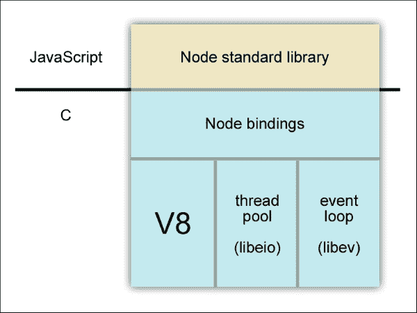
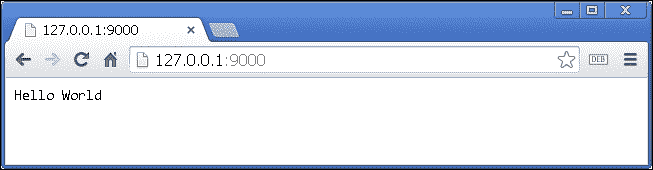
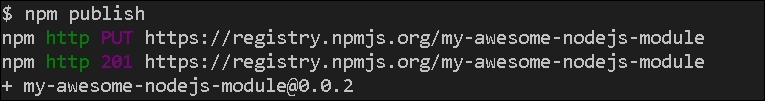
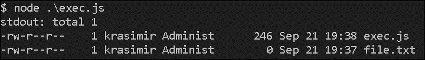

# 一、NodeJS 基础知识

Node.js 是当今最流行的 javascript 驱动技术之一。 它是由 Ryan Dahl 在 2009 年创建的，从那时起，该框架已经发展成为一个完善的生态系统。 它的包管理器充满了有用的模块，世界各地的开发人员已经开始在他们的生产环境中使用 Node.js。 在本章中，我们将学习以下内容:

*   node . js 构建块
*   环境的主要功能
*   Node.js 的包管理

# 了解 Node.js 架构

回到时代，Ryan 对开发网络应用程序很感兴趣。 他发现大多数高性能服务器都遵循类似的概念。 它们的架构类似于事件循环，它们使用非阻塞的输入/输出操作。 这些操作将允许其他处理活动在一个正在进行的任务完成之前继续进行。 如果我们想处理数千个同时发生的请求，这些特性非常重要。

大多数用 Java 或 C 编写的服务器都使用多线程。 它们在一个新线程中处理每个请求。 Ryan 决定尝试一些不同的东西——单线程架构。 换句话说，所有到达服务器的请求都由一个线程处理。 这听起来像是一个不可伸缩的解决方案，但 Node.js 绝对是可伸缩的。 我们只需要运行不同的 Node.js 进程，并使用负载均衡器在它们之间分配请求。

Ryan 需要一些基于事件循环且运行迅速的内容。 正如他在一次演讲中指出的那样，像谷歌、苹果和微软这样的大公司在开发高性能 JavaScript 引擎上投入了大量的时间。 它们的速度一年比一年快。 这里实现了事件循环架构。 近年来 JavaScript 变得非常流行。 社区和成千上万的开发者都准备好了贡献自己的力量，这让 Ryan 开始考虑使用 JavaScript。 以下是 Node.js 架构的示意图:



一般来说，Node.js 由三部分组成:

*   V8 是谷歌的 JavaScript 引擎，用于 Chrome 网络浏览器([https://developers.google.com/v8/](https://developers.google.com/v8/))
*   线程池是处理文件输入/输出操作的部分。 所有的阻塞系统调用都在这里执行([http://software.schmorp.de/pkg/libeio.html](http://software.schmorp.de/pkg/libeio.html))
*   事件循环库([http://software.schmorp.de/pkg/libev.html](http://software.schmorp.de/pkg/libev.html))

在这三个块的顶部上，我们有几个暴露低级接口的绑定。 Node.js 的其余部分是用 JavaScript 编写的。 我们在文档中看到的几乎所有内置模块 api 都是用 JavaScript 编写的。

# 安装 Node.js

一个快速而简单的安装 Node.js 的方法是访问[https://nodejs.org/download/](https://nodejs.org/download/)和下载适合您操作系统的安装程序。 对于 OS X 和 Windows 用户，安装程序提供了一个漂亮的，易于使用的界面。 对于使用 Linux 作为操作系统的开发人员，Node.js 在 APT 包管理器中有。 下面的命令将设置 Node.js 和**Node 包管理器**(**NPM**):

```js
sudo apt-get update
sudo apt-get install nodejs
sudo apt-get install npm

```

## 运行 Node.js 服务器

Node.js 是一个命令行工具。 安装后，`node`命令将在我们的终端上可用。 `node`命令接受几个参数，但最重要的参数是包含 JavaScript 的文件。 让我们创建一个名为`server.js`的文件，并将以下代码放入其中:

```js
var http = require('http');
http.createServer(function (req, res) {
   res.writeHead(200, {'Content-Type': 'text/plain'});
   res.end('Hello World\n');
}).listen(9000, '127.0.0.1');
console.log('Server running at http://127.0.0.1:9000/');
```

### 提示

**下载示例代码**

您可以从您的帐户[http://www.packtpub.com](http://www.packtpub.com)下载您所购买的所有 Packt Publishing 图书的示例代码文件。 如果您在其他地方购买这本书，您可以访问[http://www.packtpub.com/support](http://www.packtpub.com/support)并注册，将文件直接通过电子邮件发送给您。

如果你在控制台中运行`node ./server.js`，你会让 Node.js 服务器运行。 它在端口`9000`上的本地主机(`127.0.0.1`)侦听传入请求。 上述代码的第一行需要内置的`http`模块。 在 Node.js 中，我们有一个`require`全局函数，它提供了使用外部模块的机制。 稍后我们将看到如何定义我们自己的模块。 之后，脚本继续使用`http`模块中的`createServer`和`listen`方法。 在本例中，模块的 API 是这样设计的，我们可以像 jQuery 那样链接这两个方法。

第一个(`createServer`)接受一个函数，该函数也称为回调，每当有新的请求到达服务器时都会调用该函数。 第二种方法使服务器侦听。

我们将在浏览器中得到的结果如下:



# 定义和使用模块

JavaScript 作为一种语言并没有定义真正类的机制。 在中，JavaScript 中的一切都是对象。 我们通常从一个对象继承属性和函数到另一个对象。 值得庆幸的是，Node.js 采用了由**CommonJS**定义的概念——一个为 JavaScript 指定生态系统的项目。

我们将逻辑封装在模块中。 每个模块都在自己的文件中定义。 让我们通过一个简单的示例来说明一切是如何工作的。 假设我们有一个表示这本书的模块，我们将它保存在一个名为`book.js`的文件中:

```js
// book.js
exports.name = 'Node.js by example';
exports.read = function() {
   console.log('I am reading ' + exports.name);
}
```

我们定义了公共属性和公共功能。 现在，我们将使用`require`来访问它们:

```js
// script.js
var book = require('./book.js');
console.log('Name: ' + book.name);
book.read();
```

现在我们将创建另一个名为`script.js`的文件。 为了测试代码，我们将运行`node ./script.js`。 终端的结果是这样的:


除了`exports`，我们还有`module.exports`。 这两者是有区别的。 看看下面的伪代码。 它演示了 Node.js 如何构造我们的模块:

```js
var module = { exports: {} };
var exports = module.exports;
// our code
return module.exports;
```

因此，在末端，返回`module.exports`，这就是`require`产生的结果。 我们应该小心，因为如果在某些时候我们直接将一个值应用到`exports`或`module.exports`，我们可能不会收到我们需要的东西。 就像在下面的代码片段的末尾，我们将一个函数设置为一个值，并且该函数将对外公开:

```js
exports.name = 'Node.js by example';
exports.read = function() {
   console.log('Iam reading ' + exports.name);
}
module.exports = function() {  ... }
```

在本例中，我们没有访问`.name`和`.read`的权限。 如果尝试再次执行`node ./script.js`，将得到以下输出:


为了避免这样的问题，我们应该坚持两个选项中的一个——`exports`或`module.exports`——但要确保我们不能同时拥有两个选项。

我们还应该记住，在默认情况下，`require`会缓存返回的对象。 因此，如果我们需要两个不同的实例，我们应该导出一个函数。 下面是一个版本的`book`类，它提供 API 方法来评估书籍，但不能正常工作:

```js
// book.js
var ratePoints = 0;
exports.rate = function(points) {
   ratePoints = points;
}
exports.getPoints = function() {
   return ratePoints;
}
```

让我们创建两个实例，并用不同的`points`值对图书进行评级:

```js
// script.js
var bookA = require('./book.js');
var bookB = require('./book.js');
bookA.rate(10);
bookB.rate(20);
console.log(bookA.getPoints(), bookB.getPoints());
```

合乎逻辑的反应应该是`10 20`，但我们得到了`20 20`。 这就是为什么导出每次产生不同对象的函数是一种常见的做法:

```js
// book.js
module.exports = function() {
   var ratePoints = 0;
   return {
      rate: function(points) {
         ratePoints = points;
      },
      getPoints: function() {
         return ratePoints;
      }
   }
}
```

现在，我们还应该有`require('./book.js')()`，因为`require`返回的不再是一个对象，而是一个函数。

# 管理和分发软件包

一旦我们理解了`require`和`exports`的概念，我们就应该开始思考如何将我们的逻辑组织成积木。 在 Node.js 世界中，这些块被称为**模块**(或**包**)。 Node.js 流行背后的原因之一是它的包管理。

Node.js 通常有两个可执行文件:`node`和`npm`。 NPM 是一个命令行工具，用于下载和上传 Node.js 包。 官方网站[https://npmjs.org/](https://npmjs.org/)作为中央注册中心。 当我们通过`npm`命令创建一个包时，我们将它存储在那里，以便其他开发人员可以使用它。

## 创建模块

每个模块应该位于其自己的目录中，该目录还包含一个名为`package.json`的元数据文件。 在这个文件中，我们至少设置了两个属性——`name`和`version`:

```js
{
   "name": "my-awesome-nodejs-module",
   "version": "0.0.1"
}
```

我们可以将任何代码放在相同的目录中。 一旦我们将模块发布到 NPM 注册表，并且有人安装了它，他/她将获得相同的文件。 例如，让我们添加一个`index.js`文件，这样在包中就有两个文件:

```js
// index.js
console.log('Hello, this is my awesome Node.js module!');
```

我们的模块只做一件事——它向控制台显示一条简单的消息。 现在，要上传模块，我们需要导航到包含`package.json`文件的目录并执行`npm publish`。 这是我们应该看到的结果:


我们已经准备好了。 现在我们的小模块已经在 Node.js 包管理器的站点中列出，每个人都可以下载它。

## 使用模块

一般来说，有三种方法来使用已经创建的模块。 所有这三种方法都涉及包管理器:

*   We may install a specific module manually. Let's say that we have a folder called `project`. We open the folder and run the following:

    ```js
    npm install my-awesome-nodejs-module

    ```

    管理器自动下载模块的最新版本，并将其放入名为`node_modules`的文件夹中。 如果我们想要使用它，我们不需要引用确切的路径。 默认情况下，Node.js 在需要某些东西之前检查`node_modules`文件夹。 所以，只要`require('my-awesome-nodejs-module')`就足够了。

*   The installation of modules globally is a common practice, especially if we talk about command-line tools made with Node.js. It has become an easy-to-use technology to develop such tools. The little module that we created is not made as a command-line program, but we can still install it globally by running the following code:

    ```js
    npm install my-awesome-nodejs-module -g

    ```

    注意末尾的`-g`标志。 这就是我们如何告诉管理器，我们希望这个模块是一个全局模块。 当进程结束时，我们没有`node_modules`目录。 `my-awesome-nodejs-module`文件夹存储在系统的另一个位置。 为了能够使用它，我们必须向`package.json`添加另一个属性，但是我们将在下一节中详细讨论这个问题。

*   The resolving of dependencies is one of the key features of the package manager of Node.js. Every module can have as many dependencies as you want. These dependences are nothing but other Node.js modules that were uploaded to the registry. All we have to do is list the needed packages in the `package.json` file:

    ```js
    {
        "name": "another-module", 
        "version": "0.0.1", 
        "dependencies": {
            "my-awesome-nodejs-module": "0.0.1"   
        }
    }
    ```

    现在我们不需要显式地指定模块，只需执行`npm install`来安装依赖项。 管理器读取`package.json`文件并将模块再次保存到`node_modules`目录中。 使用这种技术很好，因为我们可能会添加几个依赖项并一次安装它们。 它还使我们的模块具有可转移性和自记录性。 没有必要向其他程序员解释模块是由什么组成的。

## 更新模块

让我们将模块转换为命令行工具。 一旦我们这样做，用户将在他们的终端中有一个`my-awesome-nodejs-module`命令可用。 在`package.json`文件中，我们需要做两处更改:

```js
{
   "name": "my-awesome-nodejs-module",
   "version": "0.0.2",
   "bin": "index.js"
}
```

添加了一个新的`bin`属性。 它指向应用程序的入口点。 我们有一个非常简单的例子，并且只有一个文件——`index.js`。

我们必须做的另一个更改是更新`version`属性。 在 Node.js 中，模块的版本扮演着重要的角色。 如果我们往回看，我们会看到在描述`package.json`文件中的依赖项时，我们指出了确切的版本。 这确保了在将来，我们将获得具有相同 api 的相同模块。 `version`属性中的每个数字都有某种意义。 包管理器使用**语义版本 2.0.0**([http://semver.org/](http://semver.org/))。 其格式为*MAJOR.MINOR.PATCH*。 所以，我们作为开发者应该增加以下内容:

*   如果我们做了不兼容的 API 更改，MAJOR 号
*   次要编号，如果我们以向后兼容的方式添加新功能/特性
*   补丁号，如果我们有 bug 修复

有时，我们可能会看到像`2.12.*`这样的版本。 这意味着开发人员对使用准确的 MAJOR 和 MINOR 版本感兴趣，但他/她同意将来可能会有 bug 修复。 还可以使用像`>=1.2.7`这样的值来匹配任何大小相等的版本，例如`1.2.7`、`1.2.8`或`2.5.3`。

我们更新了`package.json`文件。 下一步是将更改发送到注册中心。 这可以在保存 JSON 文件的目录中使用`npm publish`再次完成。 结果将是相似的。 我们将在屏幕上看到新的**0.0.2**版本号:



在此之后，我们可以运行`npm install my-awesome-nodejs-module -g`，新版本的模块将安装在我们的机器上。 不同之处在于，现在我们有了可用的`my-awesome-nodejs-module`命令，如果您运行它，它将显示写入`index.js`文件中的消息:


# 介绍内置模块

Node.js 被认为是一种可以用来编写后端应用程序的技术。 因此，我们需要执行各种任务。 幸运的是，我们有一堆有用的内置模块供我们使用。

## 使用 HTTP 模块创建服务器

我们已经使用了 HTTP 模块。 可能是 web 开发中最重要的一个，因为它启动了一个监听特定端口的服务器:

```js
var http = require('http');
http.createServer(function (req, res) {
   res.writeHead(200, {'Content-Type': 'text/plain'});
   res.end('Hello World\n');
}).listen(9000, '127.0.0.1');
console.log('Server running at http://127.0.0.1:9000/');
```

我们有一个返回新 web 服务器对象的`createServer`方法。 在大多数情况下，我们运行`listen`方法。 如果需要，有`close`，它阻止服务器接受新连接。 我们传递的回调函数总是接受`request`(`req`)和`response`(`res`)对象。 我们可以使用第一个参数来检索关于传入请求的信息，例如，`GET`或`POST`参数。

## 读取和写入文件

负责读写进程的模块称为`fs`(它来源于**文件系统**)。 这里的是一个简单的例子，说明了如何将数据写入文件:

```js
var fs = require('fs');
fs.writeFile('data.txt', 'Hello world!', function (err) {
   if(err) { throw err; }
   console.log('It is saved!');
});
```

大多数 API 函数都有同步版本。 以上脚本可以用`writeFileSync`写成，如下:

```js
fs.writeFileSync('data.txt', 'Hello world!');
```

然而，该模块中使用同步版本的函数会阻塞事件循环。 这意味着在操作文件系统时，我们的 JavaScript 代码会暂停。 因此，Node 的最佳实践是尽可能使用方法的异步版本。

读取文件的过程几乎是相同的。 我们应该以以下方式使用`readFile`方法:

```js
fs.readFile('data.txt', function(err, data) {
   if (err) throw err;
   console.log(data.toString());
});
```

## 与事件一起工作

观察者设计模式在 JavaScript 的中得到了广泛应用。 这是我们系统中的对象订阅其他对象中发生的更改的地方。 Node.js 有一个内置模块来管理事件。 这里有一个简单的例子:

```js
var events = require('events');
var eventEmitter = new events.EventEmitter();
var somethingHappen = function() {
   console.log('Something happen!');
}
eventEmitter
.on('something-happen', somethingHappen)
.emit('something-happen');
```

对象是我们订阅的对象。 我们在`on`方法的帮助下做到了这一点。 `emit`函数触发事件，并执行`somethingHappen`处理程序。

模块提供了必要的功能，但我们需要在自己的类中使用它。 让我们从前面的部分中获得这本书的想法，并使它与事件一起工作。 一旦有人对书进行评分，我们将以以下方式发送事件:

```js
// book.js
var util = require("util");
var events = require("events");
var Class = function() { };
util.inherits(Class, events.EventEmitter);
Class.prototype.ratePoints = 0;
Class.prototype.rate = function(points) {
   ratePoints = points;
   this.emit('rated');
};
Class.prototype.getPoints = function() {
   return ratePoints;
}
module.exports = Class;
```

我们想要继承`EventEmitter`对象的行为。 在 Node.js 中实现这一点最简单的方法是使用实用程序模块(`util`)及其`inherits`方法。 定义的类可以像这样使用:

```js
var BookClass = require('./book.js');
var book = new BookClass();
book.on('rated', function() {
   console.log('Rated with ' + book.getPoints());
});
book.rate(10);
```

我们再次使用`on`方法订阅`rated`事件。 一旦我们设置了点，`book`类将显示该消息。 然后终端显示**额定 10**文本。

## 管理子进程

有一些事情我们不能用 Node.js 做。 我们需要使用外部程序来实现同样的目的。 好消息是，我们可以从 Node.js 脚本中执行 shell 命令。 例如，假设我们想列出当前目录中的文件。 文件系统 api 确实为此提供了方法，但如果我们能得到`ls`命令的输出就更好了:

```js
// exec.js
var exec = require('child_process').exec;
exec('ls -l', function(error, stdout, stderr) {
    console.log('stdout: ' + stdout);
    console.log('stderr: ' + stderr);
    if (error !== null) {
        console.log('exec error: ' + error);
    }
});
```

我们使用的模块称为`child_process`。 它的`exec`方法接受所需的命令作为字符串和回调。 其中`stdout`项为命令的输出信息。 如果要处理错误(如果有)，可以使用`error`对象或`stderr`缓冲区数据。 上述代码生成如下截图:



除了`exec`方法外，还有`spawn`方法。 这有点不同，真的很有趣。 假设我们有一个命令，它不仅执行它的工作，而且还输出结果。 例如，`git push`可能需要几秒钟的时间，并且它可能会持续地向控制台发送消息。 在这种情况下，`spawn`是一个很好的变体，因为我们可以访问流:

```js
var spawn = require('child_process').spawn;
var command = spawn('git', ['push', 'origin', 'master']);
command.stdout.on('data', function (data) {
   console.log('stdout: ' + data);
});
command.stderr.on('data', function (data) {
   console.log('stderr: ' + data);
});
command.on('close', function (code) {
   console.log('child process exited with code ' + code);
});
```

这里，`stdout`和`stderr`是流。 它们将分发事件，如果我们订阅这些事件，我们将得到命令产生时的准确输出。 在前面的示例中，我们运行`git push origin master`并将完整的命令响应发送到控制台。

# 小结

Node.js 现在被许多公司使用。 这证明它已经足够成熟，可以在生产环境中工作。 在本章中，我们看到了这种技术的基本原理。 我们讨论了一些常用的情况。 在下一章中，我们将从示例应用程序的基本架构开始。 这不是一个微不足道的问题。 我们要建立自己的社交网络。