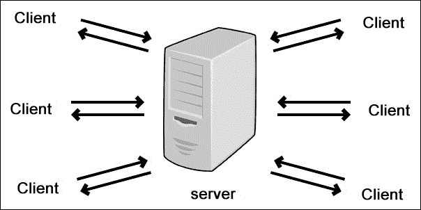
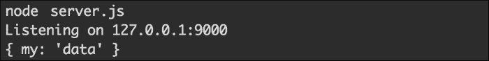
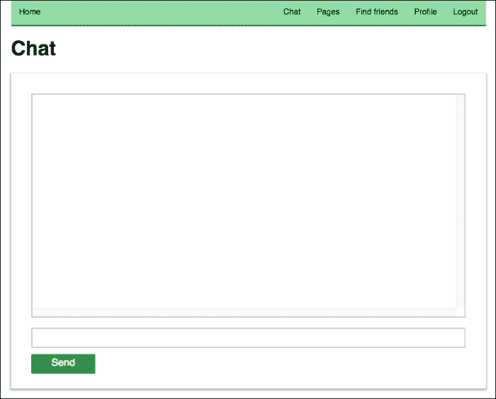
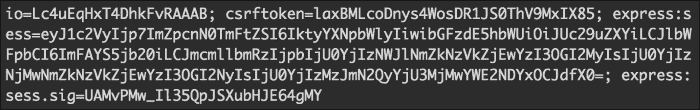

# 十、添加实时聊天

在前两章中，我们通过添加新功能来创建页面和分享帖子来扩展我们的社交网络。 在本章中，我们将讨论系统中用户之间的实时通信。 我们将要使用的技术叫做 WebSockets。 本书这一部分的计划如下:

*   了解 WebSockets
*   将套接字。 IO 到项目
*   准备聊天区界面
*   在客户端和服务器之间交换消息
*   只发送消息给用户的朋友
*   自定义聊天的输出

# 了解 WebSockets

WebSockets 是一种技术，它在服务器和浏览器之间打开一个双向(双向)交互通道。 通过使用这种通信类型，我们能够在不需要初始请求的情况下交换消息。 双方只是互相发送事件。 WebSockets 的其他好处是更低的带宽需求和延迟。

有几种方法可以将数据从服务器传输到客户机，反之亦然。 让我们检查一下最流行的，看看为什么WebSockets 被认为是实时 web 应用的最佳选择:

*   **经典 HTTP 通信**:客户端向服务器请求资源。 服务器计算出响应应该是什么并发送它。 在实时应用程序的上下文中，这是不太实际的，因为我们必须手动请求更多的数据。
*   **Ajax 轮询**:它与经典的 HTTP 请求相似，不同之处在于，我们的代码会以半秒的间隔不断地向服务器发送请求。 这不是一个好主意，因为我们的服务器将收到大量的请求。
*   **Ajax 长轮询**:我们再次有一个执行 HTTP 请求的客户端，但这一次，服务器延迟结果并没有立即响应。 它等待直到有新的可用信息，然后回答请求。
*   **HTML5 server -sent Events (EventSource)**:在这种类型的通信中，我们有一个从服务器到客户端的通道，服务器自动向浏览器发送数据。 这种技术主要用于需要单向数据流的情况。
*   **WebSockets**:正如之前提到的，如果我们使用 WebSockets，我们就有一个双向的数据流。 双方，客户端和服务器，可以发送消息而不询问另一方。

服务器发送事件在某些情况下可能会起作用，但对于实时聊天，我们肯定需要 WebSockets，因为我们希望用户能够互相发送消息。 我们将执行的解决方案如下截图所示:



每个用户将连接到服务器并开始发送消息。 我们的后端将负责将消息分发给其他用户。

使用原始的 WebSockets API 可能不是那么容易。 在下一节中，我们将介绍一个非常有用的 Node.js 模块来处理 WebSockets。

# 带来插座。 IO 到项目

套接字。 IO([http://socket.io/](http://socket.io/))是建立在 WebSockets 技术之上的实时引擎。 它是一个使 web 开发变得简单和直接的层。 就像现在的一样，WebSockets也有它自己的问题。 并不是每个浏览器都支持这项技术。 我们可能在协议和丢失事件(如心跳、超时或断开支持)方面存在问题。 值得庆幸的是,插座。 IO 修复了这些问题。 它甚至为不支持 WebSockets 的浏览器提供了退路，并使用了长轮询等技术。

在后端进行更改之前，我们需要安装模块。 引擎的分布方式与其他 Node.js 模块相同; 它可以通过包管理器获得。 我们需要添加 Socket。 将`package.json`文件以如下方式写入:

```js
{
  "name": "nodejs-by-example",
  "version": "0.0.2",
  "description": "Node.js by example",
  "scripts": {
    "start": "node server.js"
  },
  "dependencies": {
    "socket.io": "1.3.3"
    ...
    ...
  }
}
```

在此更改之后，我们将运行`npm install`并填充`node_modules/socket.io`文件夹。 安装好模块后，我们就可以开始更新我们的社交网络了。 让我们添加一个`Chat.js`文件到后端目录，包含以下代码:

```js
module.exports = function(app) {
  var io = require('socket.io')(app);
  io.on('connection', function (socket) {
    socket.emit('news', { hello: 'world' });
    socket.on('my other event', function (data) {
      console.log(data);
    });
  });
}
```

新模块导出一个接受 HTTP 服务器的函数。 在`server.js`中，我们可以使用`http.createServer`初始化它，如下所示:

```js
var app = http.createServer(checkSession).listen(port, '127.0.0.1');
console.log("Listening on 127.0.0.1:" + port);

var Chat = require('./backend/Chat');
Chat(app);
```

套接字。 IO 完全建立在事件触发和监听的概念上。 变量 T0 表示我们的通信中心。 每当一个新用户连接到我们的服务器时，我们就会得到一个连接事件，而被调用的处理程序将接收一个`socket`对象，我们将使用该对象来处理来自浏览器和发送给浏览器的消息。

在前面的示例中，我们发送(`emit`)一个名称为`news`的事件，其中包含一些简单的数据。 在这之后，我们开始监听来自客户端的其他事件。

现在，即使我们重新启动服务器，我们也不会接收到任何套接字连接。 这是因为我们没有更改前端代码。 为了制作 Socket。 在客户端的 IO 工作中，我们需要在页面中包含`/socket.io/socket.io.js`文件。 我们的应用程序的布局存储在`backend/tpl/page.html`中，修改后，它看起来像这样:

```js
<!doctype html>
<html lang="en">
<head>
  <meta charset="utf-8">
  <title>Node.js by example</title>
  <meta http-equiv="Content-Type" content="text/html;  charset=utf-8" />
  <meta name="description" content="Node.js by examples">
  <meta name="author" content="Packt">
  <link rel="stylesheet" href="/static/css/styles.css">
</head>
<body>
  <div class="container"></div>
  <script src="/socket.io/socket.io.js"></script>
  <script src="/static/js/ractive.js"></script>
  <script src="/static/js/app.js"></script>
</body>
</html>
```

`socket.io.js`文件在我们的代码库中不存在。 它是 Socket 的一部分。 IO 模块。 引擎自动注册一个到它的路由，并注意它为文件提供服务。

测试 WebSockets 实现的最后一步是连接到服务器。 为了简单起见，让我们在`frontend/js/app.js`文件中添加几行代码:

```js
window.onload = function() {

  ...

  var socket = io('http://localhost:9000');
  socket.on('news', function (data) {
    console.log(data);
    socket.emit('my other event', { my: 'data' });
  });

};
```

我们将将代码放入`onload`处理程序中，因为我们希望确保所有外部 JavaScript 文件都已完全加载。 然后，我们将初始化到`http://localhost:9000`的连接，该连接与 Node.js 服务器运行的主机和端口相同。 剩下的代码只做一件事—侦听`news`事件并使用其他事件消息进行响应。 如果我们运行服务器并在浏览器中加载`http://localhost:9000`，我们将在终端中得到如下结果:



我们将`{ my: 'data' }`作为输出，因为`backend/Chat.js`文件中有`console.log(data)`。

# 准备聊天区界面

因为实时聊天是我们社交网络的重要组成部分，我们将为它创建一个单独的页面。 正如我们在前几章所做的，我们将在主导航中开始一个新的链接，如下所示:

```js
<nav>
  <ul>
    <li><a on-click="goto:home">Home</a></li>
    {{#if !isLogged }}
      <li><a on-click="goto:register">Register</a></li>
      <li><a on-click="goto:login">Login</a></li>
    {{else}}
      <li class="right"><a on-click="goto:logout">Logout</a></li>
      <li class="right"><a  
        on-click="goto:profile">Profile</a></li>
      <li class="right"><a on-click="goto:find-friends">Find  friends</a></li>
      <li class="right"><a on-click="goto:pages">Pages</a></li>
      <li class="right"><a on-click="goto:chat">Chat</a></li>
    {{/if}}
  </ul>
</nav>
```

列表中最新的链接会将用户转发到`http://localhost:9000/chat`URL，在那里他/她将看到聊天界面。

让我们通过调整`frontend/js/app.js`文件来处理`/chat`路由。 让我们在我们的路由中添加另一个，如下所示:

```js
Router
...
...
.add('chat', function() {
  if(userModel.isLogged()) {
    var p = new Chat();
    showPage(p);
  } else {
    Router.navigate('login');
  }    
})
.add(function() {
  Router.navigate('home');
})
.listen()
.check();
```

在同一个文件中，我们将需要`frontend/js/controllers/Chat.js`模块。 它将在客户端包含聊天逻辑。 我们将从一个简单的组件开始——一个基本的 ractivejs 组件，它可以实现如下:

```js
// frontend/js/controllers/Chat.js
module.exports = Ractive.extend({
  template: require('../../tpl/chat'),
  components: {
    navigation: require('../views/Navigation'),
    appfooter: require('../views/Footer')
  },
  data: {
    output: ''
  },
  onrender: function() {

  }
});
```

和应用程序中的其他控制器一样，`Chat.js`有一个相关的模板，其中包含一个空的`<div>`元素，用来显示聊天消息，一个文本字段，和一个发送数据到服务器的按钮:

```js
// front/tpl/chat.html
<header>
  <navigation></navigation>
</header>
<div class="hero">
  <h1>Chat</h1>
</div>
<form>
  <div class="chat-output">{{output}}</div>
  <input type="text" value="{{text}}" />
  <a href="#" on-click="send" class="button">Send</a>
</form>
<appfooter />
```

值得一提的是，如果您想要更新`chat-output`元素的内容，则需要更改`output`变量的值。 该按钮还会发送一个`send`事件，我们将在下一节中进行讨论。 编译完素材后，如果你转到聊天的 URL，你会看到如下画面:



# 在客户端和服务器之间交换消息

我们已经准备好编写一些工作 Socket。 输入输出的代码。 到目前为止，我们放置的代码片段只能证明套接字连接是有效的。 例如，添加到`frontend/js/app.js`的代码应该移动到`frontend/js/controllers/Chat.js`，这是负责聊天页面的控制器。 因为它作为这个实时特性的基础，我们将从这里开始。 让我们在组件中添加两个局部变量，如下所示:

```js
data: {
  messages: ['Loading. Please wait.'],
  output: '',
  socketConnected: false
}
```

这些变量有默认值，它们在组件的模板中可用。 第一个，`messages`，将保存聊天中来自用户的所有消息，包括当前用户。 变量用于填充屏幕上的消息容器。 最后一个，`socketConnected`，控制文本字段和按钮的可见性。 如果设置为`false`，则控件将被隐藏。 在初始化与服务器的连接或由于某些原因断开连接之前，最好隐藏聊天输入文本字段，直到初始化与服务器的连接。 否则，我们可能会因为某些原因失去联系。 以下是更新后的模板外观:

```js
// frontend/tpl/chat.html
<header>
  <navigation></navigation>
</header>
<div class="hero">
  <h1>Chat</h1>
</div>
<form>
  <div class="chat-output"  data-component="output">{{{output}}}</div>
  {{#if socketConnected}}
    <input type="text" value="{{text}}" />
    <a href="#" on-click="send" class="button">Send</a>
  {{/if}}
</form>
<appfooter />
```

区别在于封装字段和按钮的`{{if}}`操作符。 在本章的最后，我们将给消息着色，并要求我们传递 HTML 标记。 我们将使用`{{{output}}}`而不是`{{output}}`，以便框架正确地显示它们(通过关闭自动转义)。

让我们回到前端控制器。 我们提到了放置在`app.js`中的代码移到了这里。 它是到套接字服务器的实际连接。 我们将以以下方式进行扩展:

```js
var self = this;
var socket = io('http://localhost:9000');
socket.on('connect', function() {
  self.push('messages', 'Connected!');
  self.set('socketConnected', true);
  self.find('input[type="text"]').focus();
});
socket.on('disconnect', function() {
  self.set('socketConnected', false);
  self.push('messages', 'Disconnected!');
});
socket.on('server-talking', function(data) {
  self.push('messages', data.text);
});
```

在接收到`connect`事件后，我们将把`Connected!`字符串添加到`messages`数组。 所以，在收到**加载后。 请稍等。 消息，用户将看到一个确认，通知他/她应用程序已成功建立套接字连接。 通过将`socketConnected`设置为`true`，我们将显示输入控件，并为用户提供发送聊天消息的选项。 这个处理程序的最后一件事是迫使浏览器将焦点放在输入字段上，这是保存用户鼠标单击的一个很好的小细节。**

`socket`对象可以调度另一个事件`disconnect`。 在这种情况下，我们可以采取两种操作—隐藏输入控件和通过在浏览器中显示`Disconnected!`字符串通知用户。

我们正在听的最后一个事件是`server-talking`。 这是我们自己的事件—后端代码将分发的消息。 开始时，`data`对象将只包含一个`text`属性，该属性将是聊天消息。 我们将简单地将它附加到`messages`数组的其余元素中。

我们前面讨论的行侦听来自后端的事件。 让我们写一些代码，从客户端发送信息到服务器:

```js
var send = function() {
  socket.emit('client-talking', { text: self.get('text')});
  self.set('text', '');
}
this.on('send', send);
```

当用户单击按钮时调用`send`函数。 我们使用相同的`socket`对象及其`emit`方法将文本传输到服务器。 我们还清除了输入字段的内容，以便用户可以开始编写新消息。 每次按按钮可能都很烦人。 以下代码在用户按*Enter*键时触发`send`功能:

```js
this.find('form').addEventListener('keypress', function(e) {
  if(e.keyCode === 13 && e.target.nodeName === 'INPUT') {
    e.preventDefault();
    send();
  }
});
```

方法返回一个有效的 DOM 元素。 我们将`keypress`侦听器附加到`form`元素，因为`input`变量并不总是可见的。 由于事件冒泡，我们能够捕捉上层元素中的事件。 值得一提的是，在一些浏览器中，需要使用不同的代码来侦听 DOM 事件。

我们必须注意的最后一件事是在屏幕上显示`messages`数组的内容。 如果您检查到目前为止所编写的代码，您将看到我们没有更新`output`变量。 这里有一个新的组件方法来处理这个问题:

```js
updateOutput: function() {
  this.set('output', this.get('messages').join('<br />'));
  var outputEl = this.find('[data-component="output"]');
  outputEl.scrollTop = outputEl.scrollHeight;
}
```

我们使用`join`方法来代替遍历数组中所有元素的方法。 它将数组的所有元素连接到一个由给定参数分隔的字符串中。 在我们的例子中，我们需要在每个消息之后添加一个新行。 一旦我们开始接收更多数据，我们将需要向下滚动`<div>`元素，以便用户能够看到最新的数据。 该函数的另外两行将容器的滚动条定位在底部。

当新消息到达时，应该调用`updateOutput`函数。 ractivejs 观察非常适合这样的情况:

```js
this.observe('messages', this.updateOutput);
```

将`messages`数组的更新连接到`updateOutput`方法只需要一行代码。 在此添加之后，消息数组中的每个`push`都将强制呈现`chat-output`元素。

组件代码如下:

```js
module.exports = Ractive.extend({
  template: require('../../tpl/chat'),
  components: {
    navigation: require('../views/Navigation'),
    appfooter: require('../views/Footer')
  },
  data: {
    messages: ['Loading. Please wait.'],
    output: '',
    socketConnected: false
  },
  onrender: function() {

    var self = this;
    var socket = io('http://localhost:9000');
    socket.on('connect', function() {
      self.push('messages', 'Connected!');
      self.set('socketConnected', true);
      self.find('input[type="text"]').focus();
    });
    socket.on('disconnect', function() {
      self.set('socketConnected', false);
      self.push('messages', 'Disconnected!');
    });
    socket.on('server-talking', function(data) {
      self.push('messages', data.text);
    });

    var send = function() {
      socket.emit('client-talking', { text: self.get('text')});
      self.set('text', '');
    }

    this.on('send', send);
    this.observe('messages', this.updateOutput);

    this.find('form').addEventListener('keypress', function(e) {
      if(e.keyCode === 13 && e.target.nodeName === 'INPUT') {
        e.preventDefault();
        send();
      }
    });

  },
  updateOutput: function() {
    this.set('output', this.get('messages').join('<br />'));
    var outputEl = this.find('[data-component="output"]');
    outputEl.scrollTop = outputEl.scrollHeight;
  }
});
```

前端准备通过套接字发送和接收消息。 然而，后端仍然包含我们开始时使用的初始示例代码。 `Chat`模块的一个小更新将使向用户发送消息成为可能:

```js
// backend/Code.js
module.exports = function(app) {
  var io = require('socket.io')(app);
  io.on('connection', function (socket) {
    socket.on('client-talking', function (data) {
      io.sockets.emit('server-talking', { text: data.text });
    });
  });
}
```

我们仍在收听`connection`事件。 我们在处理程序中接收到的`socket`对象表示与用户的连接。 在此之后，我们将开始侦听当用户在字段中键入内容或按下按钮或*Enter*键时由前端分派的`client-talking`事件。 一旦接收到数据，我们将其广播给系统中的所有用户。 变量向当前使用该服务器的所有客户端发送一条消息。

# 只发送消息给用户的朋友

后端中的最后一个更改将收到的聊天消息分发给我们的社交网络中的所有用户。 这当然是不实际的，因为我们可能会和不认识的人交换短信。 我们必须相应地修改代码，以便只向好友列表中的用户发送消息。

套接字。 默认情况下，我们不能像在后端 API 中那样访问`request`和`response`对象。 这将使问题的解决变得更加有趣，因为我们无法识别发送消息的用户。 值得庆幸的是,插座。 IO 允许我们访问活动会话。 它是一种原始格式。 因此，我们需要解析它并提取用户的配置文件数据。 为此，我们将使用`cookie`Node.js 模块。 让我们按照以下方式将其添加到`package.json`文件中:

```js
"dependencies": {
  "cookie": "0.1.2",
  "socket.io": "1.3.3",
  ...
  ...
}
```

有了另一个`npm install`在终端，我们就可以`require`模块。 在[第八章](08.html#aid-1JFUC1 "Chapter 8. Creating Pages and Events")、*创建页面和事件*中，我们重构了 API 并创建了包含实用函数的`backend/api/helpers.js`文件。 我们将只使用`session`对象添加另一个类似`getCurrentUser`的文件，如下所示:

```js
var getCurrentUserBySessionObj = function(callback, obj) {
  getDatabaseConnection(function(db) {
    var collection = db.collection('users');
    collection.find({ 
      email: obj.user.email
    }).toArray(function(err, result) {
      if(result.length === 0) {
        callback({ error: 'No user found.' });
      } else {
        callback(null, result[0]);
      }
    });
  });
};
```

如果我们比较这两种方法，就会发现有两种不同之处。 第一个区别是，我们不接收通常的请求和响应对象; 我们只接收一个 callback 和一个`session`对象。 第二个变化是，结果总是被发送到回调，即使它是一个错误。

配备了`getCurrentUserBySessionObj`功能，我们可以修改`backend/Chat.js`，使其只向当前用户的朋友发送消息。 让我们先初始化所需的助手。 我们将以下几行添加到文件的顶部:

```js
var helpers = require('./api/helpers');
var getCurrentUserBySessionObj =  helpers.getCurrentUserBySessionObj;
var cookie = require('cookie');
```

我们已经讨论了`cookie`模块。 在整个 Socket 中可用的会话数据。 IO 引擎可通过`socket.request.headers.cookie`到达。 如果我们在控制台中打印这个值，我们将得到如下截图:



前面的输出是一个 base64 编码的字符串，我们肯定不能直接使用它。 幸运的是，Node.js 有接口可以轻松解码这些值。 下面是一个简短的函数，它将提取所需的 JSON 对象:

```js
var decode = function(string) {
  var body = new Buffer(string, 'base64').toString('utf8');
  return JSON.parse(body);
};
```

我们传递了来自 cookie 的字符串，并接收了正常的`user`对象，我们将在`getCurrentUserBySessionObj`中使用该对象。

因此，我们有机制来找出当前用户是谁以及他/她的朋友是谁。 我们所要做的就是缓存可用的套接字连接和相关用户。 我们将引入一个新的全局变量`users`(针对模块)。 它将充当一个哈希映射，其中键将是用户的 ID，值将包含套接字和好友。 为了将消息广播给正确的用户，我们可以将其逻辑归纳为以下方法:

```js
var broadcastMessage = function(userId, message) {
  var user = users[userId];
  if(user && user.friends && user.friends.length > 0) {
    user.socket.emit('server-talking', { text: message });
    for(var i=0; i<user.friends.length; i++) {
      var friend = users[user.friends[i]];
      if(friend && friend.socket) {
        friend.socket.emit('server-talking', { text: message });
      }
    }
  }
};
```

这个代码提供了一个函数，接受用户的 ID 和文本信息。 我们将首先检查是否缓存了套接字引用。 如果是，那么我们会确保用户有朋友。 如果这也是有效的，那么我们将开始分发消息。 第一个`emit`项是给用户自己的，以便他/她接收自己的消息。 剩下的代码循环遍历好友，并将文本发送给所有好友。

当然，我们必须更新接受套接字连接的代码。 这里是同样的新版本:

```js
module.exports = function(app) {
  var io = require('socket.io')(app);
  io.on('connection', function (socket) {
    var sessionData = cookie.parse(socket.request.headers.cookie);
    sessionData = decode(sessionData['express:sess']);
    if(sessionData && sessionData.user) {
      getCurrentUserBySessionObj(function(err, user) {
        var userId = user._id.toString();
        users[userId] = {
          socket: socket,
          friends: user.friends
        };
        socket.on('client-talking', function (data) {
          broadcastMessage(userId, data.text);
        });
        socket.on('disconnect', function() {
          users[userId] = null;
        });
      }, sessionData);
    }

  });
}
```

现在我们将获取 cookie 值并确定当前用户。 对象和用户的好友被缓存。 然后，我们将继续侦听`client-talking`事件，但现在，我们将通过`broadcastMessage`函数发送消息。 一个小但非常重要的添加是在接近尾声; 我们监听`disconnect`事件并删除缓存的数据。 这是为了防止向断开连接的用户发送数据所必需的。

# 自定义聊天输出

我们可以向正确的人发送信息，这是很好的，但聊天仍然有点令人困惑，因为屏幕上显示的每条短信都是相同的颜色，我们不知道是谁发送的。 在本节中，我们将进行两项改进—将用户名附加到消息的前面并将文本着色。

让我们从颜色开始，在`backend/api/helpers.js`文件中添加一个新的辅助方法:

```js
var getRandomColor = function() {
  var letters = '0123456789ABCDEF'.split('');
  var color = '#';
  for(var i = 0; i < 6; i++ ) {
    color += letters[Math.floor(Math.random() * 16)];
  }
  return color;
}
```

下面的函数生成一个有效的 RGB 颜色，可以在 CSS 中使用。 为用户选择颜色的最佳时机是缓存`socket`对象时，如下所示:

```js
...
var getRandomColor = helpers.getRandomColor;

module.exports = function(app) {
  var io = require('socket.io')(app);
  io.on('connection', function (socket) {
    var sessionData = cookie.parse(socket.request.headers.cookie);
    sessionData = decode(sessionData['express:sess']);
    if(sessionData && sessionData.user) {
      getCurrentUserBySessionObj(function(err, user) {
        var userId = user._id.toString();
        users[userId] = {
          socket: socket,
          friends: user.friends,
          color: getRandomColor()
        };
        socket.on('client-talking', function (data) {
          broadcastMessage(user, data.text);
        });
        socket.on('disconnect', function() {
          users[userId] = null;
        });
      }, sessionData);
    }

  });
}
```

因此，在、`socket`对象和`friends`中，我们存储随机选取的颜色。 还有一个小更新。 我们不再将用户 ID 传递给`broadcastMessage`函数。 我们发送整个对象是因为我们需要获取用户的名和姓。

以下是更新后的`broadcastMessage`帮助器:

```js
var broadcastMessage = function(userProfile, message) {
  var user = users[userProfile._id.toString()];
  var userName = userProfile.firstName + ' ' +  userProfile.lastName;
  if(user && user.friends && user.friends.length > 0) {
    user.socket.emit('server-talking', {
      text: message,
      user: userName,
      color: user.color
    });
    for(var i=0; i<user.friends.length; i++) {
      var friend = users[user.friends[i]];
      if(friend && friend.socket) {
        friend.socket.emit('server-talking', { 
          text: message,
          user: userName,
          color: user.color
        });
      }
    }
  }
};
```

现在，进入客户机的`data`对象包含两个附加属性—当前用户的名称和他/她随机选择的颜色。

后端完成它的工作。 我们现在要做的就是调整前端控制器，让它使用名称和颜色，如下所示:

```js
// frontend/js/controllers/Chat.js
socket.on('server-talking', function(data) {
  var message = '<span style="color:' + data.color + '">';
  message += data.user + ': ' + data.text;
  message += '</span>';
  self.push('messages', message);
});
```

我们将消息包装在`<span>`标记中，而不是只发送文本。 它应用了文本颜色。 此外，消息以用户名开头。

我们工作的最终结果如下图所示:


# 小结

套接字。 IO 是用于开发实时应用程序的最流行的 Node.js 工具之一。 在本章中，我们成功地使用它来构建一个交互式聊天。 我们网络中的用户不仅能够发布 feed 中出现的内容，还能够与其他用户实时交换消息。 WebSockets 技术使这成为可能。

下一章将专注于测试。 我们将学习一些流行的模块，它们将帮助我们编写测试。