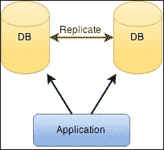
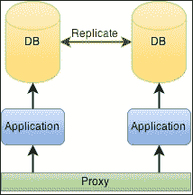

# 第五章。数据和缓存

数据是应用程序中最重要的资产之一。实际上，它应该是基础资产。你可以在任何地方运行你的应用程序，但是没有你的数据，这是毫无意义的。所谓数据，我指的是应用程序操作的、由最终用户生成的或不由最终用户生成的信息。如果您的应用程序没有数据库就无法工作，那么该数据库中有一条重要的数据必须保留。

应用数据非常重要。在 web 应用程序中，用户使用互联网访问它，并且他们的数据存储在服务器端，这种重要性增加了。随着用户群的增长和数据总量的增加，规划数据的存储方式和使用方式变得更加重要。

别忘了准备一个备用计划。您不会希望丢失数据并且没有办法回滚，即使回滚意味着回到一周前。您的用户可能会接受丢失一些数据(1 周)，但绝对不会接受丢失所有数据。

让我们通过看一些重要的主题来看看数据存储:

*   过多的输入/输出
*   数据库管理系统
*   缓存数据和异步缓存
*   聚类数据
*   访问数据

# 数据存储

存储数据的方式很多。这取决于你有什么类型的数据，它可以变得多大。如果您只需要存储一个简单的键/值对，您可以使用您选择格式的文件(例如，INI 或 JSON 文件)。如果这个键/值对增长到数千或数百万，你可能不想保持它。您需要考虑您的数据，并为其选择最佳存储，至少从您的角度来看是这样。

如果您有其他应用程序，您可以尝试为所有或部分这些应用程序选择相同的数据存储。这其实是一个不错的决定。选择第二好的工具，并尝试在几个应用程序中只使用一两个工具，这大大提高了您获得关于该子集的知识的机会，而不是在每个应用程序中使用最好的工具，最终得到许多工具，而对每个工具却知之甚少。

## 过度输入/输出

当使用定制解决方案时，我们需要仔细计划如何存储和访问我们的数据，尤其是何时以及多少次我们这样做。您的主机有一个磁盘吞吐量限制，您不想达到它。此外，您肯定不希望每次需要时都从磁盘读取数据。它可以在您的本地测试中工作，但是如果您的应用程序面向成千上万的用户，它将会崩溃，您可能会开始收到`EBUSY`或`EMFILE`错误。

策略之一是避免过多的输入/输出，只需在启动时读取它，在内存中操作它，并不时将数据刷新到磁盘。数据可以以多种格式存储， **JSON** 是目前最著名和最常用的。这样做的缺点是迫使应用程序实现一个通道来读写文件，否则迟早会得到损坏的数据。

使用数据库或其他数据模型服务器，而不是创建自定义数据存储。将数据存储留给专业人员，专注于您的应用程序。这样做的一些优点如下:

*   不需要维护数据存储
*   数据库服务器针对高性能场景进行了优化
*   数据库服务器通常支持多台机器保存数据，允许您的应用程序根据需要扩展大小

这完全取决于你选择的系统。开始之前最好慢慢来，挑一个好的。我会关注可伸缩性和一致性。速度是你无法衡量的，它因应用程序和用例而异。

# 数据库管理系统

如果你选择了一个**数据库管理系统** ( **DBMS** )，很重要的一点就是你要适应它。不要把你不舒服的服务器放在生产中，因为你肯定会后悔的。在生产中使用数据库管理系统时，您需要熟悉:

*   **管理**:非常重要的是你能够将你的应用场景复制到一个新的主机上，而不用想太多。您应该知道如何初始化存储和管理访问。寻找可视化界面(如桌面和网络)，避免仅通过控制台进行管理；你会在控制台中犯更多的错误，因为它对复杂的任务来说更难。可视化界面通常有自动化工具，可以帮助你避免语法错误。
*   **安全性**:注意默认权限，尤其是本地主机权限，因为它们通常被设置为许可，并对数据进行完全控制。你不想丢失数据，对吧？
*   **备份**:有一个预定的自动计划并且知道如何将回滚到备份是非常重要的。你应该在另一个主机上运行试验。您不会希望回滚后发现备份已损坏。安装一个 cron 作业(本地或远程)，不时地导出它，并试用它。我个人更喜欢一两个可用的备份，而不是 10 个不可用的备份。
*   **结构**:了解如何组织和关联您的数据，以实现更好的存储和更快的访问是强制性的。你肯定不想以后做改变。

您选择的数据结构与您的数据库管理系统和应用程序的性能直接相关。绘制数据草图，并查看数据实体之间的相互关系。数据库中有几个表是很常见的。毕竟，这是你首先使用数据库的原因之一。

您通常不会想到的是，您可能只有一个表，也许是一个历史表或类似的表，随着时间的推移，这些表将占您数据库空间使用的 90%以上。优化该表并决定是否有不需要的列，或者是否可以移动到另一个表，这一点非常重要。你以后可以感谢我！

即使优化了那个表，你也无法阻止它的增长。您真的需要有一个终生历史记录吗？或者您可以每月或每年将数据导出为另一种格式并从数据库中删除它吗？拥有一个可以增长甚至扩展到多台服务器的数据库是好事，但这并不是性能的同义词。

关于这件事，分析一下你最看重的是什么。是诚信吗？你需要额外的安全措施吗？您是否计划像 MongoDB 那样将数据库拆分到不同的服务器上？你更喜欢一台已经被证明稳定的成熟服务器，还是会选择新技术？就像我之前说的，尝试次佳选择。您可能会更频繁地使用它，并避免获得许多难以维护的不同技术。

你的数据现在应该已经整理好了。例如，如果您正在创建一个日历应用程序，您可能有用户、日历和事件等实体。创建基本结构后，您可能会意识到需要更多的结构来将日历与用户(可能是访问权限)和用户与事件(可能是参与者)联系起来。经过几次开发迭代，您可能会得到更多。

您的结构将增长，您的表将开始获得更多的列。您会意识到，在这种情况下，您的瓶颈表是保存事件的表。希望优化不会太晚，去掉一些很少使用的列，可以移到另一个表中。当没有空间可以减少时，你必须考虑其他选择。

## 缓存数据

当一条信息被请求得太频繁，并且它的值不会改变时，缓存就变得相关了，例如历史值。如果这些值需要一些数据库中的复杂性和操作，这是提高性能的好方法。即使它们不是历史值并且可以改变，有时缓存也没那么糟糕，至少在几分钟内。

在复杂的系统中，您可能会发现缓存是应用程序和数据库之间的第二层抽象。在这种情况下，会发生双向更新；也就是说，数据被提取到缓存中，当用户操作改变时，缓存数据被更新，然后数据库也被更新。这比清除缓存和强制向数据库发出新请求以获取我们已经知道的数据要快。您可能会在基本应用程序中发现这一点，例如，在会话数据中。

有些数据库可以执行这种缓存，但有些则不行，您不能依赖它们来执行。另外，在其他情况下，它们不能缓存，因为您需要操作数据。在某些情况下，您需要将缓存指向另一个应用程序或另一个键/值服务，您可以使用它们来保存值并使用一段时间。Redis 可以用作缓存服务。它支持一些不错的特性，比如复杂的结构、事务和生存时间键。

您的缓存逻辑应该类似于这样:


这种逻辑可以有多种用途。您可以在内存中使用缓存，为小型集合获得尽可能快的缓存。如果您知道缓存的数据可能超过可用内存，您可以使用文件。例如，如果您生成图像或文档缩略图，就会出现这种情况。您可以缓存它们，最好的存储位置可能是磁盘。

您可以使用处理数据存储的服务，并允许您专注于应用程序逻辑。一些最流行和最简单的服务是 memcached 和 Redis。它们各有利弊。在这两种情况下，他们都需要零设置才能开始使用它们。

## 异步缓存

编写 Node.js 应用程序迫使您异步思考。这意味着你将面临一些挑战，其中一些你可能还不知道。一个特别痛苦的挑战是异步缓存。不管你使用的是外部服务还是简单的内部功能；异步部分站在你这边，是给你带来不愉快的一方。

问题不会轻易出现；当负载变高时，您可能会发现有很多缓存函数命中。这并不容易描述，所以让我们看一个缓存的假例子，我们可能在每个应用程序的某个地方都这样做:

```js
var users = {};

function getUser(id, next) {
  if (users.hasOwnProperty(id)) {
    return next(null, users[id]);
  }

  userdb.findOne({ id: id }, function (err, user) {
    if (err) return next(err);

    users[id] = user;
    return next(null, user);
  });
}
```

这是非常不完整的，但你得到了这个想法。每次想要用户，就叫`getUser`。这个函数将从某个地方获取它(可能是从 ORM 获取的)`users.findOne`并返回它。然后，它会将其存储在哈希表中，如果您再次请求它，它会直接返回该用户。没有时间去生活或适当的错误处理，但这不会解决下一个问题。

我们假设获取用户非常快，对吗？想象一下这需要一些时间，也许几秒钟。接下来，假设这个函数经常被使用。例如，如果由于网络中的某个问题，获取用户需要 10 秒钟，而在这段时间内，您调用了这个函数 100 次，会发生什么？

没有缓存的值，这 100 个调用中的每一个都会尝试访问数据库，因为它们忽略了第一个调用实际上会缓存该值，其余 99 个调用都可以使用它。如果问题出在用户抓取上，它会累积调用，并把你的应用程序摔在地上。发生这种情况是因为获取用户不是即时的，因此对同一用户的以下调用应该排队，直到用户被获取。

它可能类似于下面的代码。同样，这是一个简化版本:

```js
var users = {};

function getUser(id, next) {
  if (users.hasOwnProperty(id)) {
    if (users[id].hasOwnProperty("data")) {
      // already have a value
      return next(null, users[id].data);
    }
    // not yet, queue the callback
    return users[id].queue.push(next);
  }

  // first time
  users[id] = {
    queue: [ next ]
  };

  userdb.findOne({ id: id }, function (err, user) {
    if (err) return next(err);

    users[id].data = user;

    users[id].queue.map(function (cb) {
      cb(null, user);
    });

    delete users[id].queue;
  });
}
```

慢慢来理解它。如你所见，这不是有陷阱的范例；就是这条路。通常，开发人员接受过培训，但没有为 Node.js(以及其他人)强加给你的异步平台做好准备。

多年来，获得一个名为**对象关系映射** ( **ORM** )的数据库抽象是一个很好的实践(现在仍然如此)。抽象创建了一个新的层，允许您改变数据库类型(或多或少)并保持您的应用程序工作。对于一个更加成熟的 T4 应用程序来说，这实际上并不那么简单，因为要想提高性能，避免服务器的某些特性是非常困难的。除了这个小优势，它还可以降低访问速度，从而使您的应用程序稍微慢一点。但是，它还有其他优势，尤其是在专业市场，因为您可以将业务模型和实体直接应用到代码中。

一般来说，对于历史数据或大数据集，表单并不是最好的选择。许多表单在每一个项目上都给你额外的权力，但这是有代价的(速度和内存)。对于大数据集，您会获得额外的能力(以及大的速度和内存成本)。你会发现不仅仅是层让你的应用程序变慢；这也是数据库的问题，它通常不适合表中的巨大数据集(巨大意味着千兆字节)。

您可以寻找其他服务，这些服务可以为您提供中级缓存，如果使用得当，还可以通过帮助您获取最常用的特定数据来提供性能感。像**【MQ】**和**Rabbtmq**(都是消息队列服务)这样的服务可能会让您感兴趣。它们可以充当您的数据存储服务器的代理，创造出您拥有一个大型统一存储服务器的想法。这些服务旨在提高性能，这是它们设计的用例之一。

添加服务以充当代理会为您的应用程序环境添加另一层。在小数据集的小场景中，它们可能会被过度使用。但是在更大的数据集上，即使在单个存储服务器上，它们也可以帮助在数据集增长时保持恒定的吞吐量。

## 聚类数据

将服务分散到不同的主机将是必要的。在某个地方，当您的应用程序数据集不断增长时，您会看到您的主机尖叫着要资源，而您的平均负载逐渐吞噬了您的每一个处理器。从那时起，您需要添加一个主机来保持速度稳定，并允许您的数据集增长更多一点。

从使用一台主机转移到使用两台主机可能会很复杂，迫使您主导数据库服务器或另一种类型的数据群集。许多数据库服务支持集群或某种复制。下图是服务器中复制的数据库示例，允许应用程序访问任何数据库实例



在多主机复制模式下，数据集通常存储(和复制)在两个或多个主机中，允许从这些主机中的任何一个更新数据。这将在所有主机上复制数据，称为 **成员**。由于没有分区，每个成员都负责处理客户端请求。

这些是一些优点:

*   没有单点故障。每个成员都是大师，所以每个人都可能失败。
*   主机可以在地理上分布，允许您的应用程序也分布在客户端附近。

一些缺点如下:

*   如果在异步模式下，通常不会保持一致，因为在您的数据复制到另一台主机之前，网络可能会让您失望
*   如果在某种同步模式下，它会引入延迟，因为您的服务器在数据复制之前不会回复您，并且您的网络可能会再次出现故障

没有灵丹妙药，对于一个真正高性能的应用程序，您肯定需要深入查看您的数据。您可能需要在不同类型的服务器之间分割它，利用它们的独特功能。如前所述，消息队列服务器可能是部分数据的最佳选择。

复制不允许您正确扩展。您的数据在每台服务器上都是完整的。对于巨大的数据集，这是对空间的浪费，因为除了一台服务器之外，所有服务器宕机的概率都非常小。你有备份，对吗？

### 类型

还有更好的选择，例如集群，在集群中，您的数据被分区，每个数据块被复制到至少两台主机上。通常由你来决定。这类似于磁盘上的 RAID5，但没有*写孔*现象([http://www.raid-recovery-guide.com/raid5-write-hole.aspx](http://www.raid-recovery-guide.com/raid5-write-hole.aspx))。

## 访问数据

您的应用程序需要为这些场景做好准备。上图显示了其中一种可能性。您的应用程序了解复制成员，并尝试随机或按照特定规则使用它们。由您的应用程序或数据库模块来识别故障并正确处理它们。下图描述了如何复制应用程序实例，并引入代理来对应用程序进行中间访问。



另一种可能的情况是将应用程序的一个实例绑定到每个复制主机，甚至可能是本地主机。这样，您的应用程序就可以在本地工作。然而，这带来了两个需要解决的问题:

*   通过反向代理，可以根据用户地理位置或应用程序实例负载为每个用户分配一个应用程序实例。
*   您的应用程序需要能够在这种情况下工作(无状态)，除非您的代理确保每个客户端总是访问同一个实例

如果您的应用程序只需要存储在数据库中的数据，这些是可能的场景。如果它依赖于一个文件系统，一些场景将不适合，除非您在主机之间有某种同步。我想到了忧郁。如果您不需要文件系统，并且对某种对象/blob 存储感到满意，Ceph 甚至 MongoDB 都是一个不错的选择。如果你想要一个高度可扩展的数据存储服务器，你可能只是开始看卡珊德拉，而忘记了替代方案。从头开始准备你的申请，你不会后悔的。

# 总结

数据是应用程序的关键部分，规划如何构建数据非常重要。更重要的是如何规划应用程序增长和数据升级。不要忘记缓存数据中最常用的部分，最重要的是，不要忘记备份。复制和集群不是一种备份。您需要一个正确的备份计划，以避免将来停机。别忘了重视你的数据。

在下一章中，我们将继续讨论关于应用程序性能的主题，看看测试是如何以及为什么重要，以及您应该如何进行基准测试并仔细阅读结果(半信半疑)。您的应用程序几乎已经为高性能做好准备。但是在你投入生产之前，一定要彻底测试一下。