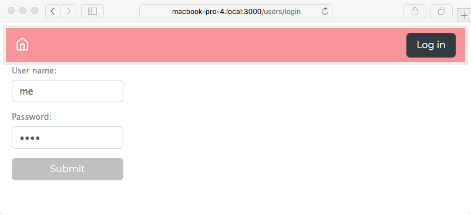
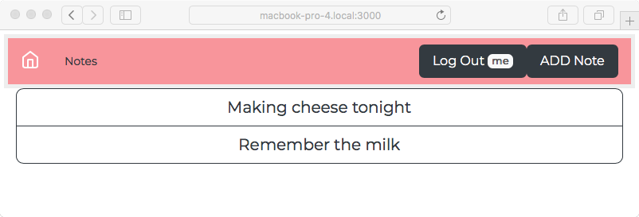
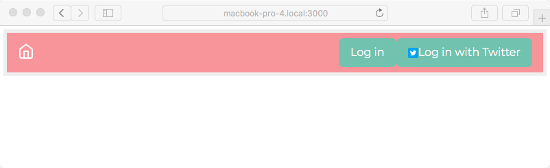
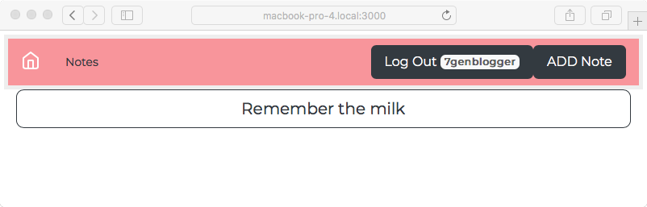

# 微服务方式下的多用户认证

既然我们的 Notes 应用程序可以将其数据保存在数据库中，那么我们就可以考虑下一个使其成为真正的应用程序的阶段，即验证我们的用户

登录一个网站使用它的服务是如此自然。我们每天都这样做，我们甚至信任银行和投资机构通过在网站上的登录程序来保护我们的财务信息。HTTP 是一种无状态协议，web 应用程序不能很好地区分一个 HTTP 请求和另一个 HTTP 请求。由于 HTTP 是无状态的，HTTP 请求在本机上不知道驱动 web 浏览器的用户是否登录、用户的身份，甚至不知道 HTTP 请求是否由人发起。

用户身份验证的典型方法是向浏览器发送一个 cookie，其中包含携带用户身份的令牌。cookie 需要包含标识浏览器以及该浏览器是否已登录的数据。然后，cookie 将随每个请求一起发送，让应用程序跟踪与浏览器关联的用户帐户。

使用 Express，最好的方法是使用`express-session`中间件。它将数据存储为 cookie，并在每个浏览器请求中查找该数据。它易于配置，但不是用户身份验证的完整解决方案。有几个附加模块处理用户身份验证，有些甚至支持针对第三方网站（如 Facebook 或 Twitter）对用户进行身份验证。

在用户身份验证–Passport（[中，一个软件包似乎领先于其他软件包 http://passportjs.org/](http://passportjs.org/) ）。它支持一长串需要认证的服务，使得开发一个允许用户从另一个网站（例如 Twitter）注册凭据的网站变得容易。另一个，明示认证（[https://www.npmjs.com/package/express-authentication](https://www.npmjs.com/package/express-authentication) ），自称是护照的固执己见的替代品。

我们将使用 Passport 对本地存储的用户凭据数据库进行用户身份验证，并使用 OAuth2 对 Twitter 帐户进行身份验证。我们还将借此机会探索使用 Node.js 实现基于 REST 的微服务

在本章中，我们将讨论此阶段的以下三个方面：

*   创建微服务以存储用户配置文件/身份验证数据。
*   使用本地存储的密码进行用户身份验证。
*   使用 OAuth2 支持通过第三方服务进行身份验证。具体来说，我们将使用 Twitter 作为第三方身份验证服务。

让我们开始吧！

首先要做的是复制上一章使用的代码。例如，如果您将该代码保存在`chap07/notes`中，请创建一个新目录`chap08/notes`。

# 创建用户信息微服务

我们可以通过简单地向现有的*Notes*应用程序添加一个用户模型和一些路由和视图来实现用户身份验证和帐户。虽然这是可以实现的，但这是我们在实际生产应用程序中要做的吗？

考虑用户身份信息的高价值，以及对强大和可靠的用户认证的超强需求。网站入侵经常发生，而且似乎最经常被盗的物品是用户身份

您能否设计和构建一个具有所需安全级别的用户身份验证系统？一个可能对各种入侵者都安全的系统？

与许多其他软件开发问题一样，最好使用预先存在的身份验证库，最好是具有长期跟踪记录的库，其中重要的错误已经修复。

另一个问题是促进安全性的体系结构选择。虫子会出现，有天赋的恶棍会闯入。隔离用户信息数据库是限制风险的一个好主意。

保留用户信息数据库使您能够对用户进行身份验证、显示用户配置文件、帮助用户相互连接等等。这些都是向网站用户提供的有用服务，但如何限制数据落入坏人手中的风险？

在本章中，我们将开发一个用户身份验证微服务。该计划最终将该服务隔离到一个保护良好的路障区域。这模仿了一些网站的架构选择，严格控制 API 甚至对用户信息数据库的物理访问，对未经批准的访问实施尽可能多的技术壁垒。

当然，微服务不是万灵药，这意味着我们不应该强迫每个应用程序都进入微服务盒。通过类比，微服务就像 Unix 哲学中的小工具一样，每个小工具都能很好地完成一件事，我们可以将它们混合/匹配/组合成更大的工具。另一个词是可组合性。虽然我们可以用这种理念构建许多有用的软件工具，但它是否适用于 Photoshop 或 LibreOffice 等应用程序？虽然用单一用途工具构建系统具有高度灵活性，但人们失去了通过紧密集成组件而获得的优势。

第一个问题是，是否使用面向 REST 服务的框架，在 bare Node.js 上编写 REST 应用程序，还是做什么？您可以在内置的`http`模块上实现 REST 服务。使用应用程序框架的优点是，框架作者已经加入了许多最佳实践、bug 修复和安全措施。例如，Express 被广泛使用，非常流行，并且可以轻松地用于 REST 服务。还有其他更适合开发 REST 服务的框架，我们将使用其中一个——Restify（[http://restify.com/](http://restify.com/) 。

用户身份验证服务器将需要两个模块：

*   使用 Restify 实现 REST 接口
*   使用 Sequelize 在 SQL 数据库中存储用户数据对象的数据模型

为了测试该服务，我们将编写两个简单的脚本来管理数据库中的用户信息。我们不会在*Notes*应用程序中实现管理用户界面，而是依赖脚本来管理用户。作为一个副作用，我们将有一个工具来对用户服务运行两个简单的测试。

此服务正常运行后，我们将开始修改 Notes 应用程序，以从服务访问用户信息，同时使用 Passport 处理身份验证。

第一步是创建一个新目录来保存用户信息微服务。这应该是 Notes 应用程序的同级目录。如果您创建了一个名为`chap08/notes`的目录来保存 Notes 应用程序，那么请创建一个名为`chap08/users`的目录来保存 microservice。

然后运行以下命令：

```js
$ cd users
$ npm init
.. answer questions 
.. name - user-auth-server
$ npm install debug@^2.6.x fs-extra@^5.x js-yaml@^3.10.x \
       restify@^6.3.x restify-clients@^1.5.x sequelize@^4.31.x \
       sqlite3@^3.1.x --save
```

这让我们准备好开始编码。我们将使用`debug`模块记录消息，`js-yaml`读取 Sequelize 配置文件，`restify`用于 REST 框架，`sequelize/mysql/sqlite3`用于数据库访问。

# 用户信息模型

我们将使用基于 Sequelize 的模型在 SQL 数据库中存储用户信息。当我们讨论这个问题时，思考一个问题：我们是否应该将数据库代码直接集成到 RESTAPI 实现中？这样做将把用户信息微服务简化为一个模块，数据库查询与 REST 处理程序混合在一起。通过将 REST 服务与数据存储模型分离，我们可以自由地采用 Sequelize/SQL 之外的其他数据存储系统。此外，可以想象数据存储模型可以以 REST 服务以外的方式使用。

在`users`中创建一个名为`users-sequelize.mjs`的新文件，包含以下内容：

```js
import Sequelize from "sequelize";
import jsyaml from 'js-yaml';
import fs from 'fs-extra';
import util from 'util';
import DBG from 'debug';
const log = DBG('users:model-users'); 
const error = DBG('users:error'); 

var SQUser;
var sequlz;

async function connectDB() {

    if (SQUser) return SQUser.sync();

    const yamltext = await fs.readFile(process.env.SEQUELIZE_CONNECT, 
    'utf8');
    const params = await jsyaml.safeLoad(yamltext, 'utf8');

    if (!sequlz) sequlz = new Sequelize(params.dbname, params.username,
                                        params.password, 
    params.params);

    // These fields largely come from the Passport / Portable Contacts 
    schema.
    // See http://www.passportjs.org/docs/profile
    //
    // The emails and photos fields are arrays in Portable Contacts. 
    // We'd need to set up additional tables for those.
    //
    // The Portable Contacts "id" field maps to the "username" field 
    here
    if (!SQUser) SQUser = sequlz.define('User', {
        username: { type: Sequelize.STRING, unique: true },
        password: Sequelize.STRING,
        provider: Sequelize.STRING,
        familyName: Sequelize.STRING,
        givenName: Sequelize.STRING,
        middleName: Sequelize.STRING,
        emails: Sequelize.STRING(2048),
        photos: Sequelize.STRING(2048)
    });
    return SQUser.sync();
}
```

与基于 Sequelize 的 Notes 模型一样，我们使用 YAML 文件来存储连接配置。我们使用的是同一个变量。

用户身份验证数据的最佳存储服务是什么？通过使用 Sequelize，我们可以选择 SQL 数据库。虽然 NoSQL 数据库风靡一时，但使用它来存储用户身份验证数据有什么好处吗？没有。SQL server 可以很好地完成这项工作，Sequelize 允许我们自由选择。

通过使用同一个数据库实例来存储注释和用户信息，并同时使用 Sequelize 来简化整个系统是很有诱惑力的。但是我们选择了为用户数据模拟一个安全的服务器。这要求数据位于单独的数据库实例中，最好位于单独的服务器上。高度安全的应用程序部署可能会将用户信息服务放在完全独立的服务器上，可能在物理上隔离的数据中心中，使用精心配置的防火墙，甚至可能在门口有武装警卫

此处显示的用户配置文件模式源自 Passport 提供的规范化配置文件；参见[http://www.passportjs.org/docs/profile](http://www.passportjs.org/docs/profile) 了解更多信息。Passport 将第三方服务提供的信息统一到单个对象定义中。为了简化代码，我们只需使用 Passport 定义的模式：

```js
export async function create(username, password, provider, familyName, givenName, middleName, emails, photos) {
    const SQUser = await connectDB();
    return SQUser.create({
        username, password, provider,
        familyName, givenName, middleName,
        emails: JSON.stringify(emails), photos: JSON.stringify(photos)
    });
}

export async function update(username, password, provider, familyName, givenName, middleName, emails, photos) {
    const user = await find(username);
    return user ? user.updateAttributes({
        password, provider,
        familyName, givenName, middleName,
        emails: JSON.stringify(emails),
        photos: JSON.stringify(photos)
    }) : undefined;
}
```

我们的`create`和`update`功能获取用户信息，并添加新记录或更新现有记录：

```js
export async function find(username) {
    const SQUser = await connectDB();
    const user = await SQUser.find({ where: { username: username } });
    const ret = user ? sanitizedUser(user) : undefined;
    return ret;
}
```

这允许我们查找用户信息记录，并返回该数据的净化版本。

Remember that Sequelize returns a `Promise` object. Because this is executed inside an `async` function, the `await` keyword will resolve the Promise, causing any error to be thrown or results to be provided as the return value. In turn, async functions return a `Promise` to the caller.

因为我们将用户数据与 Notes 应用程序的其余部分分离，所以我们希望返回一个经过清理的对象，而不是实际的`SQUser`对象。如果因为我们简单地将`SQUser`对象发送回调用者而导致一些信息泄漏，该怎么办？稍后显示的`sanitizedUser`函数创建了一个匿名对象，其中包含我们希望向其他模块公开的字段：

```js
export async function destroy(username) {
    const SQUser = await connectDB();
    const user = await SQUser.find({ where: { username: username } });
    if (!user) throw new Error('Did not find requested '+ username +' to delete');
    user.destroy();
}
```

这使我们能够支持删除用户信息。我们像对待 Notes Sequelize 模型一样，首先找到用户对象，然后调用其`destroy`方法：

```js
export async function userPasswordCheck(username, password) {
    const SQUser = await connectDB();
    const user = await SQUser.find({ where: { username: username } });
    if (!user) {
        return { check: false, username: username, message: "Could not 
        find user" };
    } else if (user.username === username && user.password === 
    password) {
        return { check: true, username: user.username };
    } else {
        return { check: false, username: username, message: "Incorrect 
        password" };
    }
}
```

这使我们能够支持检查用户密码。需要处理的三个条件如下：

*   是否没有这样的用户
*   密码是否匹配
*   他们是否不匹配

我们返回的对象允许调用方区分这些情况。`check`字段指示是否允许该用户登录。如果`check`为 false，则有理由拒绝他们的登录请求，`message`应该显示给用户：

```js
export async function findOrCreate(profile) {
    const user = await find(profile.id);
    if (user) return user;
    return await create(profile.id, profile.password, profile.provider,
                    profile.familyName, profile.givenName, profile.middleName,
                    profile.emails, profile.photos);
}
```

这在一个函数中结合了两个操作：首先，验证命名用户是否存在，如果不存在，则创建该用户。主要是在针对第三方服务进行身份验证时使用：

```js
export async function listUsers() {
    const SQUser = await connectDB();
    const userlist = await SQUser.findAll({});
    return userlist.map(user => sanitizedUser(user));
}
```

列出现有用户。第一步是使用`findAll`将用户列表作为`SQUser`对象数组提供给我们。然后，我们清理该列表，以便不公开任何我们不希望公开的数据：

```js
export function sanitizedUser(user) {
    var ret = {
        id: user.username, username: user.username,
        provider: user.provider,
        familyName: user.familyName, givenName: user.givenName,
        middleName: user.middleName,
        emails: JSON.parse(user.emails),
        photos: JSON.parse(user.photos)
    };
    try {
        ret.emails = JSON.parse(user.emails);
    } catch(e) { ret.emails = []; }
    try {
        ret.photos = JSON.parse(user.photos);
    } catch(e) { ret.photos = []; }
    return ret;
}
```

这是我们的实用函数，用于确保向调用者公开一组精心控制的信息。通过此服务，我们模拟了一个与其他应用程序隔离的安全用户信息服务。正如我们前面所说的，这个函数返回一个匿名的经过清理的对象，在这个对象中我们确切地知道对象中的内容。

解码我们放入数据库的 JSON 字符串非常重要。请记住，我们使用`JSON.stringify`将`emails`和`photos`数据存储在数据库中。我们使用`JSON.parse`对这些值进行解码，就像向速溶咖啡中加入热水产生可饮用饮料一样。

# 用于用户信息的 REST 服务器

我们正在努力将用户信息和身份验证集成到 Notes 应用程序中。下一步是将我们刚刚创建的用户数据模型包装到 REST 服务器中。之后，我们将创建两个脚本，以便添加一些用户，执行其他管理任务，并验证服务是否正常工作。最后，我们将通过登录和注销支持扩展 Notes 应用程序。

在`package.json`文件中，将`main`标记更改为以下代码行：

```js
 "main": "user-server.mjs", 
```

然后创建一个名为`user-server.mjs`的文件，包含以下代码：

```js
import restify from 'restify';
import util from 'util';

import DBG from 'debug';
const log = DBG('users:service'); 
const error = DBG('users:error'); 

import * as usersModel from './users-sequelize';

var server = restify.createServer({
    name: "User-Auth-Service",
    version: "0.0.1"
});

server.use(restify.plugins.authorizationParser());
server.use(check);
server.use(restify.plugins.queryParser());
server.use(restify.plugins.bodyParser({
    mapParams: true
}));
```

`createServer`方法可能需要一长串配置选项。这两种方法可能有助于识别信息。

与 Express 应用程序一样，`server.use`调用初始化 Express 将调用的中间件函数，而 Restify 将调用处理程序函数。这些是 API 为`function (req, res, next)`的回调函数。与 Express 一样，这些是请求和响应对象，`next`是一个函数，当被调用时，它将执行传递给下一个处理程序函数。

与 Express 不同，每个处理程序函数都必须调用`next`函数。为了通过处理程序告诉 Restify 停止处理，`next`函数必须被调用为`next(false)`。使用`error`对象调用`next`也会导致执行结束，并将错误发送回请求者。

这里列出的处理函数做两件事：授权请求和处理来自 URL 和`post`请求体的解析参数。`authorizationParser`函数查找 HTTP 基本身份验证标头。`check`函数将在后面显示，它模拟了 API 令牌控制访问的思想。

参见[http://restify.com/docs/plugins-api/](http://restify.com/docs/plugins-api/) 有关 Restify 中可用的内置处理程序的更多信息。

将此添加到`user-server.mjs`：

```js
// Create a user record
server.post('/create-user', async (req, res, next) => {
    try {
        var result = await usersModel.create(
                 req.params.username, req.params.password, 
        req.params.provider,
                 req.params.familyName, req.params.givenName, 
        req.params.middleName,
                 req.params.emails, req.params.photos);
        res.send(result);
        next(false);
    } catch(err) { res.send(500, err); next(false); }
});
```

至于 Express，`server.VERB`函数让我们定义特定 HTTP 操作的处理程序。此路由处理`/create-user`上的帖子，顾名思义，这将通过调用`usersModel.create`函数创建一个用户。

作为一个`POST`请求，参数到达请求体中，而不是作为 URL 参数。由于`bodyParams`处理程序上的`mapParams`标志，HTTP 正文中传递的参数被添加到`req.params`。

我们只需使用发送给我们的参数调用`usersModel.create`。完成后，`result`对象应该是`user`对象，我们使用`res.send`将其发送回请求者：

```js
// Update an existing user record
server.post('/update-user/:username', async (req, res, next) => {
    try {
        var result = await usersModel.update(
              req.params.username, req.params.password, 
        req.params.provider,
              req.params.familyName, req.params.givenName,  
        req.params.middleName,
              req.params.emails, req.params.photos);
        res.send(usersModel.sanitizedUser(result));
        next(false);
    } catch(err) { res.send(500, err); next(false); }
});
```

`/update-user`路线的处理方式与此类似。但是，我们已经在 URL 上添加了`username`参数。与 Express 一样，Restify 允许您在 URL 中放置命名参数，如下所示。此类命名参数也添加到`req.params`中。

我们只需使用发送给我们的参数调用`usersModel.update`。这也会返回一个对象，我们用`res.send`将其发送回调用者：

```js
// Find a user, if not found create one given profile information
server.post('/find-or-create', async (req, res, next) => {
    log('find-or-create '+ util.inspect(req.params));
    try {
        var result = await usersModel.findOrCreate({
            id: req.params.username, username: req.params.username,
            password: req.params.password, provider:  
            req.params.provider,
            familyName: req.params.familyName, givenName: 
            req.params.givenName,
            middleName: req.params.middleName,
            emails: req.params.emails, photos: req.params.photos
        });
        res.send(result);
        next(false);
    } catch(err) { res.send(500, err); next(false); }
});
```

这处理了我们的`findOrCreate`操作。我们只是将其委托给模型代码，就像前面所做的那样。

顾名思义，我们将查看命名用户是否已经存在，如果已经存在，只需返回该用户，否则将创建该用户：

```js
// Find the user data (does not return password)
server.get('/find/:username', async (req, res, next) => {
    try {
        var user = await usersModel.find(req.params.username);
        if (!user) {
            res.send(404, new Error("Did not find "+ 
            req.params.username));
        } else {
            res.send(user);
        }
        next(false);
    } catch(err) { res.send(500, err); next(false); }
});
```

这里，我们支持为提供的`username`查找用户对象。

如果找不到用户，则返回 404 状态代码，因为它指示不存在的资源。否则，我们将发送检索到的对象：

```js
// Delete/destroy a user record
server.del('/destroy/:username', async (req, res, next) => {
    try {
        await usersModel.destroy(req.params.username);
        res.send({}); 
        next(false); 
    } catch(err) { res.send(500, err); next(false); }
});
```

这就是我们从 Notes 应用程序中删除用户的方式。`DEL`HTTP 动词用于删除服务器上的内容，使其成为此功能的自然选择：

```js
// Check password
server.post('/passwordCheck', async (req, res, next) => {
    try {
        await usersModel.userPasswordCheck(
                        req.params.username, req.params.password);
        res.send(check);
        next(false); 
    } catch(err) { res.send(500, err); next(false); }
});
```

这是将密码单独保存在此服务器中的另一个方面。密码检查由该服务器执行，而不是在 Notes 应用程序中执行。我们只需调用前面显示的`usersModel.userPasswordCheck`函数，并将其返回的对象发回：

```js
// List users
server.get('/list', async (req, res, next) => {
    try {
        var userlist = await usersModel.listUsers();
        if (!userlist) userlist = [];
        res.send(userlist);
        next(false);
    } catch(err) { res.send(500, err); next(false); }
});
```

然后，最后，如果需要，我们将 Notes 应用程序用户列表发送回请求者。如果没有可用的用户列表，我们至少会发送一个空数组：

```js
server.listen(process.env.PORT, "localhost", function() { 
  log(server.name +' listening at '+ server.url); 
}); 

// Mimic API Key authentication. 

var apiKeys = [ { 
    user: 'them', 
    key: 'D4ED43C0-8BD6-4FE2-B358-7C0E230D11EF' 
} ]; 

function check(req, res, next) { 
    if (req.authorization) { 
        var found = false; 
        for (let auth of apiKeys) { 
            if (auth.key  === req.authorization.basic.password 
             && auth.user === req.authorization.basic.username) { 
                found = true; 
                break; 
            } 
        } 
        if (found) next(); 
        else { 
            res.send(401, new Error("Not authenticated")); 
            next(false); 
        } 
    } else { 
        res.send(500, new Error('No Authorization Key'));
        next(false); 
    } 
} 
```

与 Notes 应用程序一样，我们监听在`PORT`环境变量中命名的端口。通过仅显式侦听`localhost`，我们将限制可以访问用户身份验证服务器的系统的范围。在实际部署中，我们可能会将此服务器置于防火墙后面，并有一个允许访问的主机系统的严格列表。

最后一个函数`check`为 REST API 本身实现身份验证。这是我们前面添加的处理函数。

它要求调用方使用基本身份验证头提供 HTTP 请求的凭据。`authorizationParser`处理程序会查找这个，并在`req.authorization.basic`对象上将其提供给我们。`check`函数只是验证命名用户和密码组合是否存在于本地数组中。

这是为了模拟将 API 密钥分配给应用程序。有几种方法可以做到这一点；这只是其中之一。

这种方法不仅限于使用 HTTP 基本身份验证进行身份验证。restifyapi 允许我们查看 HTTP 请求中的任何头，这意味着我们可以实现我们喜欢的任何类型的安全机制。`check`函数可以使用正确的代码实现其他一些安全方法。

因为我们使用初始的`server.use`处理程序集添加了`check`，所以每次请求都会调用它。因此，对此服务器的每个请求都必须提供此检查所需的 HTTP 基本身份验证凭据。

如果您想要控制对 API 中每个函数的访问，那么这个策略是很好的。对于用户身份验证服务，这可能是一个好主意。世界上的某些 REST 服务具有某些向世界开放的 API 函数，而其他 REST 服务则受 API 令牌保护。要实现这一点，不应在`server.use`处理程序之间配置`check`函数。相反，应将其添加到相应的路由处理程序中，如下所示：

```js
server.get('/request/url', authHandler, (req, res, next) => { 
  .. 
});
```

这样的`authHandler`编码方式与我们的`check`函数类似。通过发送错误代码并使用`next(false)`结束路由功能链来指示身份验证失败。

现在我们有了用户身份验证服务器的完整代码。它定义了几个请求 URL，对于每个 URL，调用用户模型中相应的函数。

现在我们需要一个 YAML 文件来保存数据库凭据，因此创建包含以下代码的`sequelize-sqlite.yaml`：

```js
dbname: users 
username: 
password: 
params: 
    dialect: sqlite 
    storage: users-sequelize.sqlite3 
```

由于这是 Sequelize，只需提供不同的配置文件，就可以轻松切换到其他数据库引擎。请记住，此配置文件的文件名必须出现在`SEQUELIZE_CONNECT`环境变量中。

最后，`package.json`应如下所示：

```js
{
  "name": "user-auth-server",
  "version": "0.0.1",
  "description": "",
  "main": "user-server.js",
  "scripts": {
    "start": "DEBUG=users:* PORT=3333 SEQUELIZE_CONNECT=sequelize-sqlite.yaml node --experimental-modules user-server"
  },
  "author": "",
  "license": "ISC",
  "engines": {
    "node": ">=8.9"
  },
  "dependencies": {
    "debug": "^2.6.9",
    "fs-extra": "^5.x",
    "js-yaml": "^3.10.x",
    "mysql": "^2.15.x",
    "restify": "^6.3.x",
    "restify-clients": "^1.5.x",
    "sqlite3": "^3.1.x",
    "sequelize": "^4.31.x"
  }
}
```

我们使用刚才提供的数据库凭据和服务器代码的调试输出，将此服务器配置为侦听端口`3333`。

现在可以启动用户身份验证服务器：

```js
$ npm start

> user-auth-server@0.0.1 start /Users/david/chap08/users
> DEBUG=users:* PORT=3333 SEQUELIZE_CONNECT=sequelize-mysql.yaml node user-server

  users:server User-Auth-Service listening at http://127.0.0.1:3333 +0ms 
```

但是我们还没有任何方法与这个服务器交互。

# 用于测试和管理用户身份验证服务器的脚本

为了确保用户身份验证服务器能够工作，让我们编写几个脚本来练习 API。因为我们不会花时间将管理后端写入 Notes 应用程序，所以这些脚本将允许我们添加和删除允许访问 Notes 的用户。这些脚本将位于用户身份验证服务器包目录中

Restify 包支持对 REST 服务器进行编码。对于 REST 客户机，我们使用的是一个配套库`restify-clients`，它是从 Restify 中分离出来的

创建一个名为`users-add.js`的文件，包含以下代码：

```js
'use strict';

const util = require('util');
const restify = require('restify-clients');

var client = restify.createJsonClient({
  url: 'http://localhost:'+process.env.PORT,
  version: '*'
});

client.basicAuth('them', 'D4ED43C0-8BD6-4FE2-B358-7C0E230D11EF');

client.post('/create-user', {
    username: "me", password: "w0rd", provider: "local",
    familyName: "Einarrsdottir", givenName: "Ashildr", middleName: "",
    emails: [], photos: []
},
(err, req, res, obj) => {
    if (err) console.error(err.stack);
    else console.log('Created '+ util.inspect(obj));
});
```

这是 Restify 客户端的基本结构。我们创建`Client`对象–我们可以在`JsonClient`（此处使用）和`HttpClient`之间进行选择。HTTP`basicAuth`凭证很容易设置，如下所示。

然后我们发出请求，在本例中是一个关于`/create-user`的`POST`请求。因为它是一个`POST`请求，所以我们在这里指定的对象通过 Restify 格式化为`HTTP POST`主体参数。正如我们前面看到的，服务器配置了`bodyParser`处理函数，该函数将这些主体参数转换为`req.param`对象。

在 Restify 客户端，对于 Restify 服务器，我们通过调用`client.METHOD`使用各种 HTTP 方法。因为它是一个`POST`请求，所以我们使用`client.post`。当请求完成时，将调用回调函数。

在运行这些脚本之前，请使用以下命令在一个窗口中启动身份验证服务器：

```js
$ npm start
```

现在使用以下命令运行测试脚本：

```js
$ PORT=3333 node users-add.js 
Created { id: 1, username: 'me', password: 'w0rd', provider: 'local',
  familyName: 'Einarrsdottir', givenName: 'Ashildr',
  middleName: '',
  emails: '[]', photos: '[]',
  updatedAt: '2016-02-24T02:34:41.661Z',
  createdAt: '2016-02-24T02:34:41.661Z' }  
```

我们可以使用以下命令检查我们的手工作品：

```js
$ sqlite3 users-sequelize.sqlite3 
SQLite version 3.10.2 2016-01-20 15:27:19
Enter ".help" for usage hints.
sqlite> .schema users
CREATE TABLE `Users` (`id` INTEGER PRIMARY KEY AUTOINCREMENT, `username` VARCHAR(255) UNIQUE, `password` VARCHAR(255), `provider` VARCHAR(255), `familyName` VARCHAR(255), `givenName` VARCHAR(255), `middleName` VARCHAR(255), `emails` VARCHAR(2048), `photos` VARCHAR(2048), `createdAt` DATETIME NOT NULL, `updatedAt` DATETIME NOT NULL, UNIQUE (`username`));
sqlite> select * from users;
2|me|w0rd|local|Einarrsdottir|Ashildr||[]|[]|2018-01-21 05:34:56.629 +00:00|2018-01-21 05:34:56.629 +00:00
sqlite> ^D  
```

现在，让我们编写一个脚本`users-find.js`，用于查找给定用户：

```js
'use strict';

const util = require('util');
const restify = require('restify-clients');

var client = restify.createJsonClient({
  url: 'http://localhost:'+process.env.PORT,
  version: '*'
});

client.basicAuth('them', 'D4ED43C0-8BD6-4FE2-B358-7C0E230D11EF');

client.get('/find/'+ process.argv[2], 
(err, req, res, obj) => {
    if (err) console.error(err.stack);
    else console.log('Found '+ util.inspect(obj));
});
```

这只是调用`/find`URL，指定用户作为命令行参数提供的`username`。请注意，`get`操作不会获取充满参数的对象。相反，任何参数都将添加到 URL 中。

它的运行方式如下：

```js
$ PORT=3333 node users-find.js me
Found { username: 'me', provider: 'local',
  familyName: 'Einarrsdottir', givenName: 'Ashildr',
  middleName: '',
  emails: '[]', photos: '[]' }  
```

类似地，我们可以针对其他 REST 函数编写脚本。但我们需要继续实现将其集成到 Notes 应用程序中的真正目标。

# Notes 应用程序的登录支持

现在我们已经证明了用户身份验证服务是有效的，我们可以设置 Notes 应用程序来支持用户登录。我们将使用 Passport 来支持登录/注销，并使用身份验证服务器来存储所需的数据。

在可用的软件包中，Passport 以其简单性和灵活性而脱颖而出。它直接与 Express 中间件链集成，Passport 社区开发了数百个所谓的策略模块，用于处理针对一长串第三方服务的身份验证。参见[http://www.passportjs.org/](http://www.passportjs.org/) 用于获取信息和文件。

# 访问用户身份验证 RESTAPI

第一步是为 Notes 应用程序创建用户数据模型。它将使用 REST 查询我们刚刚创建的服务器，而不是从数据文件或数据库中检索数据。我们本可以创建直接访问数据库的用户模型代码，但出于前面讨论过的原因，我们决定将用户身份验证分离到单独的服务中。

现在让我们转到 Notes 应用程序，您可能已将其存储为`chap08/notes`。我们将修改应用程序，首先访问用户身份验证 RESTAPI，然后使用 Passport 进行授权和身份验证。

对于我们之前创建的测试/管理脚本，我们使用了`restify-clients`模块。该软件包是`restify`库的配套软件，其中`restify`支持 REST 协议的服务器端，`restify-clients`支持客户端。他们的名字可能泄露了目的。

无论`restify-clients`库有多好，它都不支持面向承诺的 API，这是很好地使用`async`函数所必需的。另一个库，`superagent`确实支持面向承诺的 API，在`async`函数中发挥了很好的作用，并且该包还有一个配套软件 Supertest，它在单元测试中很有用。当我们谈论单元测试时，我们将在[第 11 章](11.html)、*单元测试和功能测试*中使用 Supertest。有关文件，请参见[https://www.npmjs.com/package/superagent](https://www.npmjs.com/package/superagent) ：

```js
 $ npm install superagent@^3.8.x
```

创建一个新文件`models/users-superagent.mjs`，包含以下代码：

```js
import request from 'superagent';
import util from 'util';
import url from 'url'; 
const URL = url.URL;
import DBG from 'debug';
const debug = DBG('notes:users-superagent'); 
const error = DBG('notes:error-superagent'); 

function reqURL(path) {
    const requrl = new URL(process.env.USER_SERVICE_URL);
    requrl.pathname = path;
    return requrl.toString();
}
```

`reqURL`函数取代了我们在早期模块中编写的`connectXYZZY`函数。使用`superagent`时，我们不会让服务的连接保持打开状态，而是在每次请求时打开一个新连接。制定 URL 的常见做法是制定 URL。用户需要在`USER_SERVICE_URL`环境变量中提供一个基本 URL，如`http://localhost:3333/`。此函数使用 Node.js 中新的 WHATWG URL 支持修改该 URL，以使用给定的 URL 路径：

```js
export async function create(username, password, 
            provider, familyName, givenName, middleName, 
            emails, photos) {
    var res = await request
        .post(reqURL('/create-user'))
        .send({ 
            username, password, provider, 
            familyName, givenName, middleName, emails, photos 
        })
        .set('Content-Type', 'application/json')
        .set('Acccept', 'application/json')
        .auth('them', 'D4ED43C0-8BD6-4FE2-B358-7C0E230D11EF');
    return res.body;
}

export async function update(username, password, 
            provider, familyName, givenName, middleName, 
            emails, photos) { 
    var res = await request
        .post(reqURL(`/update-user/${username}`))
        .send({ 
            username, password, provider, 
            familyName, givenName, middleName, emails, photos 
        })
        .set('Content-Type', 'application/json')
        .set('Acccept', 'application/json')
        .auth('them', 'D4ED43C0-8BD6-4FE2-B358-7C0E230D11EF');
    return res.body;
}
```

这些是我们的`create`和`update`函数。在每种情况下，他们获取提供的数据，构造一个匿名对象，然后`POST`将其发送到服务器。

`superagent`库使用 API 样式，其中一个将方法调用链接在一起以构造请求。方法调用链可以以`.then`或`.end`子句结束，这两个子句中的任何一个都使用回调函数。但把这两者都撇开，它会回报你一个承诺。

在整个库中，我们将使用`.auth`子句来设置所需的身份验证密钥

These anonymous objects are a little different than usual. We're using a new ES-2015 feature here that we haven't discussed so far. Rather than specifying the object fields using the `fieldName: fieldValue` notation, ES-2015 gives us the option to shorten this when the variable name used for `fieldValue` matches the desired `fieldName`. In other words, we can just list the variable names, and the field name will automatically match the variable name.

在本例中，我们特意为参数选择了变量名，以便将对象的字段名与服务器使用的参数名相匹配。通过这样做，我们可以对匿名对象使用这种缩短的符号，并且通过从头到尾使用一致的变量名，我们的代码更加简洁：

```js
export async function find(username) {
    var res = await request
        .get(reqURL(`/find/${username}`))
        .set('Content-Type', 'application/json')
        .set('Acccept', 'application/json')
        .auth('them', 'D4ED43C0-8BD6-4FE2-B358-7C0E230D11EF');
    return res.body;
}
```

我们的`find`操作允许我们查找用户信息：

```js
export async function userPasswordCheck(username, password) { 
    var res = await request
        .post(reqURL(`/passwordCheck`))
        .send({ username, password })
        .set('Content-Type', 'application/json')
        .set('Acccept', 'application/json')
        .auth('them', 'D4ED43C0-8BD6-4FE2-B358-7C0E230D11EF');
    return res.body;
} 
```

我们正在向服务器发送检查密码的请求

关于此方法的一点值得注意。它可以采用 URL 中的参数，而不是此处所做的请求主体。但由于请求 URL 通常会记录到文件中，因此在 URL 中输入用户名和密码参数意味着用户身份信息将记录到文件和部分活动报告中。这显然是一个非常糟糕的选择。将这些参数放在请求正文中不仅可以避免这种糟糕的结果，而且如果使用了到服务的 HTTPS 连接，事务将被加密：

```js
export async function findOrCreate(profile) {  
    var res = await request
        .post(reqURL('/find-or-create'))
        .send({ 
            username: profile.id, password: profile.password, 
            provider: profile.provider, 
            familyName: profile.familyName, 
            givenName: profile.givenName, 
            middleName: profile.middleName, 
            emails: profile.emails, photos: profile.photos 
        })
        .set('Content-Type', 'application/json')
        .set('Acccept', 'application/json')
        .auth('them', 'D4ED43C0-8BD6-4FE2-B358-7C0E230D11EF');
    return res.body;
}
```

`findOrCreate`函数要么在数据库中发现用户，要么创建新用户。`profile`对象将来自 Passport，但请注意我们对`profile.id`的处理。Passport 文档说它将在`profile.id`字段中提供用户名。但我们希望将其存储为`username`，而不是：

```js
export async function listUsers() { 
    var res = await request
        .get(reqURL('/list'))
        .set('Content-Type', 'application/json')
        .set('Acccept', 'application/json')
        .auth('them', 'D4ED43C0-8BD6-4FE2-B358-7C0E230D11EF'); 
    return res.body;
}
```

最后，我们可以检索用户列表。

# 登录和注销路由功能

到目前为止，我们构建的是一个用户数据模型，RESTAPI 包装该模型以创建我们的身份验证信息服务。然后，在 Notes 应用程序中，我们有一个模块从该服务器请求用户数据。到目前为止，Notes 应用程序中还没有人知道这个用户模型存在。下一步是为登录/注销 URL 创建路由模块，并将其余注释更改为使用用户数据。

路由模块是我们使用`passport`处理用户身份验证的地方。第一项任务是安装所需的模块：

```js
$ npm install passport@^0.4.x passport-local@1.x --save
```

`passport`模块给出了认证算法。为了支持不同的身份验证机制，passport 作者开发了几种策略实现。身份验证机制或策略对应于支持身份验证的各种第三方服务，例如使用 OAuth2 对 Facebook、Twitter 或 GitHub 等服务进行身份验证。

`LocalStrategy`仅使用存储在应用程序本地的数据进行身份验证，例如，我们的用户身份验证信息服务。

我们先创建路由模块`routes/users.mjs`：

```js
import path from 'path';
import util from 'util';
import express from 'express'; 
import passport from 'passport'; 
import passportLocal from 'passport-local';
const LocalStrategy = passportLocal.Strategy; 
import * as usersModel from '../models/users-superagent';
import { sessionCookieName } from '../app';

export const router = express.Router();

import DBG from 'debug';
const debug = DBG('notes:router-users'); 
const error = DBG('notes:error-users'); 
```

这带来了`/users`路由所需的模块。这包括两个`passport`模块和基于 REST 的用户认证模型

在`app.mjs`中，我们将添加*会话*支持，以便我们的用户可以登录和注销。这依赖于在浏览器中存储 cookie，cookie 名称位于从`app.mjs`导出的此变量中。我们马上就要用那块饼干了：

```js
export function initPassport(app) { 
  app.use(passport.initialize()); 
  app.use(passport.session()); 
}

export function ensureAuthenticated(req, res, next) { 
  try {
    // req.user is set by Passport in the deserialize function 
    if (req.user) next(); 
    else res.redirect('/users/login'); 
  } catch (e) { next(e); }
}
```

将从`app.mjs`调用`initPassport`函数，并将`Passport`中间件安装到 Express 配置中。我们将在稍后讨论`app.mjs`更改时讨论这一点的含义，但`Passport`使用会话来检测此 HTTP 请求是否经过身份验证。它查看进入应用程序的每个请求，查找有关此浏览器是否已登录的线索，并将数据作为`req.user`附加到请求对象。

`ensureAuthenticated`功能将由其他路由模块使用，并插入任何需要经过身份验证的登录用户的路由定义中。例如，编辑或删除便笺需要用户登录，`routes/notes.mjs`中对应的路由必须使用`ensureAuthenticated`。如果用户未登录，此功能会将其重定向到`/users/login`，以便他们可以这样做：

```js
outer.get('/login', function(req, res, next) { 
  try {
    res.render('login', { title: "Login to Notes", user: req.user, }); 
  } catch (e) { next(e); }
}); 

router.post('/login', 
  passport.authenticate('local', { 
    successRedirect: '/', // SUCCESS: Go to home page 
    failureRedirect: 'login', // FAIL: Go to /user/login 
  }) 
);

```

由于此路由安装在`/users`上，因此所有这些路由都将预先设置`/user`。`/users/login`路由只是显示一个请求用户名和密码的表单。提交此表时，我们在第二条路线申报表中着陆，在`/users/login`上有一个`POST`。如果`passport`认为这是使用`LocalStrategy`成功登录的尝试，则浏览器将重定向到主页。否则会重定向到`/users/login`页面：

```js
router.get('/logout', function(req, res, next) { 
  try {
    req.session.destroy();
    req.logout(); 
    res.clearCookie(sessionCookieName);
 res.redirect('/'); 
 } catch (e) { next(e); }
});
```

当用户请求注销 Notes 时，发送至`/users/logout`。为此，我们将在标题模板中添加一个按钮。`req.logout`功能指示 Passport 删除其登录凭据，然后将其重定向到主页。

此功能与 Passport 文档中的功能不同。在那里，我们被告知只需拨打`req.logout`。但仅调用该函数有时会导致用户未注销。必须销毁会话对象并清除 cookie，以确保用户已注销。cookie 名称在`app.mjs`中定义，我们为此函数导入了`sessionCookieName`：

```js
passport.use(new LocalStrategy( 
  async (username, password, done) => { 
    try {
      var check = await usersModel.userPasswordCheck(username, 
      password);
      if (check.check) { 
        done(null, { id: check.username, username: check.username }); 
      } else { 
        done(null, false, check.message); 
      } 
    } catch (e) { done(e); }
  } 
)); 
```

这里是我们定义`LocalStrategy`实现的地方。在回调函数中，我们调用`usersModel.userPasswordCheck`，它对用户身份验证服务进行 REST 调用。请记住，这将执行密码检查，然后返回一个对象，指示他们是否登录。

当`check.check`为`true`时，表示登录成功。对于这种情况，我们告诉 Passport 在会话对象中使用一个包含`username`的对象。否则，我们有两种方法告诉 Passport 登录尝试失败。在一个例子中，我们使用`done(null, false)`表示登录时出错，并传递给我们的错误消息。在另一种情况下，我们将捕获一个异常，并传递该异常。

您会注意到 Passport 使用回调风格的 API。Passport 提供了一个`done`函数，当我们知道什么是什么时，我们将调用该函数。当我们使用一个`async`函数对后端服务进行干净的异步调用时，Passport 不知道如何实现将返回的承诺。因此，我们必须在函数体周围抛出一个`try/catch`来捕获任何抛出的异常：

```js
passport.serializeUser(function(user, done) { 
  try {
    done(null, user.username); 
  } catch (e) { done(e); }
}); 

passport.deserializeUser(async (username, done) => { 
  try {
    var user = await usersModel.find(username);
    done(null, user);
  } catch(e) { done(e); }
}); 
```

前面的函数负责对会话的身份验证数据进行编码和解码。我们需要附加到会话的所有内容是`username`，就像我们在`serializeUser`中所做的一样。`deserializeUser`对象在处理传入的 HTTP 请求时被调用，并且是我们查找用户配置文件数据的地方。Passport 将此附加到请求对象。

# 对 app.js 的登录/注销更改

我们在`app.mjs`中需要做一些更改，其中一些我们已经提到了。我们确实仔细地将 Passport 模块依赖项隔离到了`routes/users.mjs`。`app.mjs`中需要的更改支持`routes/users.mjs`中的代码。

现在是取消注释的时候了，我们在[第 5 章](05.html)*您的第一个 Express 应用程序中告诉您要注释掉一行。*路由模块的导入现在如下所示：

```js
import { router as index } from './routes/index';
import { router as users, initPassport } from './routes/users';
import { router as notes } from './routes/notes'; 
```

用户路由支持`/login`和`/logout`URL，并使用`Passport`进行身份验证。我们需要调用`initPassport`进行一点初始化：

```js
import session from 'express-session';
import sessionFileStore from 'session-file-store';
const FileStore = sessionFileStore(session); 
export const sessionCookieName = 'notescookie.sid';
```

因为`Passport`使用会话，我们需要在 Express 中启用会话支持，而这些模块就是这样做的。`session-file-store`模块将会话数据保存到磁盘，这样我们就可以在不丢失会话的情况下终止并重新启动应用程序。还可以使用适当的模块将会话保存到数据库中。只有当所有 Notes 实例都在同一台服务器计算机上运行时，文件系统会话存储才适用。对于分布式部署情况，您需要使用在网络范围服务（如数据库）上运行的会话存储。

我们在这里定义了`sessionCookieName`，因此它可以在多个地方使用。默认情况下，`express-session`使用名为`connect.sid`的 cookie 存储会话数据。作为安全性的一个小度量，当存在已发布的默认值时，使用不同的非默认值非常有用。无论何时使用默认值，攻击者都可能根据该默认值知道安全漏洞

使用以下命令安装模块：

```js
$ npm install express-session@1.15.x session-file-store@1.2.x --save
```

Express Session support（包括所有各种会话存储实现）记录在其 GitHub 项目页面的[中 https://github.com/expressjs/session](https://github.com/expressjs/session)

在`app.mjs`中添加此项：

```js
app.use(session({ 
  store: new FileStore({ path: "sessions" }), 
  secret: 'keyboard mouse',
  resave: true,
  saveUninitialized: true,
  name: sessionCookieName
})); 
initPassport(app);
```

这里我们初始化会话支持。名为`secret`的字段用于对会话 ID cookie 进行签名。会话 cookie 是一个编码字符串，部分使用此密码进行加密。在 Express Session 文档中，他们建议使用字符串`keyboard cat`来表示秘密。但是，从理论上讲，如果 Express 存在漏洞，知道这个秘密会更容易破坏站点上的会话逻辑，该怎么办？因此，我们为这个秘密选择了一个不同的字符串，只是为了稍微不同，也许更安全一点。

类似地，`express-session`使用的默认 cookie 名称是`connect.sid`。在这里，我们将 cookie 名称更改为非默认名称。

`FileStore`将其会话数据记录存储在名为`sessions`的目录中。此目录将根据需要自动创建：

```js
app.use('/', index); 
app.use('/users', users); 
app.use('/notes', notes); 
```

前面是 Notes 应用程序中使用的三个路由

# routes/index.mjs 中的登录/注销更改

此路由模块处理主页。它不要求用户登录，但如果用户登录，我们希望稍微更改显示：

```js
router.get('/', async (req, res, next) => {
  try {
    let keylist = await notes.keylist();
    let keyPromises = keylist.map(key => { return notes.read(key) });
    let notelist = await Promise.all(keyPromises);
    res.render('index', { 
      title: 'Notes', notelist: notelist,
      user: req.user ? req.user : undefined
    });
  } catch (e) { next(e); }
});
```

请记住，我们确保`req.user`具有用户配置文件数据，这是我们在`deserializeUser`中所做的。我们只需检查这一点，并确保在呈现视图模板时添加该数据。

我们将对大多数其他路线定义进行类似的更改。之后，我们将检查对视图模板的更改，其中我们使用`req.user`在每个页面上显示正确的按钮。

# routes/notes.mjs 中需要进行登录/注销更改

此处所需的更改更为重要，但仍然很简单：

```js
import { ensureAuthenticated } from './users'; 
```

我们需要使用`ensureAuthenticated`功能来保护某些路由不被未登录的用户使用。请注意 ES6 模块如何让我们只导入所需的功能。由于该功能位于用户路由模块中，我们需要从那里导入它：

```js
router.get('/add', ensureAuthenticated, (req, res, next) => {
    try {
        res.render('noteedit', {
            title: "Add a Note",
            docreate: true, notekey: "",
            user: req.user, note: undefined
        });
    } catch (e) { next(e); }
});
```

我们添加的第一件事是在路由定义中调用`usersRouter.ensureAuthenticated`。如果用户未登录，他们将通过该功能重定向到`/users/login`。

因为我们已经确保用户已经过身份验证，所以我们知道`req.user`已经有了他们的个人资料信息。然后我们可以简单地将其传递给视图模板。

对于其他路线，我们需要进行类似的更改：

```js
router.post('/save', ensureAuthenticated, (req, res, next) => { 
  .. 
}); 
```

`/save`路由只需此更改即可呼叫`ensureAuthenticated`以确保用户已登录：

```js
router.get('/view', (req, res, next) => {
    try {
        var note = await notes.read(req.query.key);
        res.render('noteview', {
            title: note ? note.title : "",
            notekey: req.query.key,
            user: req.user ? req.user : undefined, 
            note: note
        });
    } catch (e) { next(e); }
}); 
```

对于此路由，我们不要求用户登录。我们确实需要将用户的配置文件信息（如果有）发送到视图模板：

```js
router.get('/edit', ensureAuthenticated, (req, res, next) => { 
    try {
        var note = await notes.read(req.query.key);
        res.render('noteedit', {
            title: note ? ("Edit " + note.title) : "Add a Note",
            docreate: false,
            notekey: req.query.key,
            user: req.user ? req.user : undefined, 
            note: note
        });
    } catch (e) { next(e); }
}); 
router.get('/destroy', ensureAuthenticated, (req, res, next) => { 
    try {
        var note = await notes.read(req.query.key);
        res.render('notedestroy', {
            title: note ? `Delete ${note.title}` : "",
            notekey: req.query.key,
            user: req.user ? req.user : undefined, 
            note: note
        });
    } catch (e) { next(e); }
}); 
router.post('/destroy/confirm', ensureAuthenticated, (req, res, next) => { 
  .. 
}); 
```

对于这些路由，我们要求用户登录。在大多数情况下，我们需要将`req.user`值发送到视图模板。

# 查看支持登录/注销的模板更改

到目前为止，我们已经创建了一个后端用户身份验证服务，一个 REST 模块来访问该服务，一个路由模块来处理与登录和退出网站相关的路由，以及`app.mjs`中使用这些模块的更改。我们几乎准备好了，但是我们在模板中有许多未完成的更改。我们将`req.user`对象传递给每个模板，因为每个模板都必须更改，以适应用户是否登录。

在`partials/header.hbs`中，添加以下内容：

```js
...
    {{#if user}}
        <div class="collapse navbar-collapse"   
         id="navbarSupportedContent">
            <span class="navbar-text text-dark col">{{ title }}</span>
            <a class="btn btn-dark col-auto" href="/users/logout">
            Log Out <span class="badge badge-light">{{ user.username }}
         </span></a>
            <a class="nav-item nav-link btn btn-dark col-auto" 
         href='/notes/add'>
                                    ADD Note</a>
        </div>
    {{else}}
        <div class="collapse navbar-collapse" id="navbarLogIn">
            <a class="btn btn-primary" href="/users/login">Log in</a>
        </div>
    {{/if}}
...
```

我们在这里所做的是根据用户是否登录来控制在屏幕顶部显示哪些按钮。先前的更改确保如果用户注销，`user`变量将为`undefined`，否则它将具有用户配置文件对象。因此，检查此处所示的`user`变量就足以呈现不同的用户界面元素。

注销的用户不会获得“添加注释”按钮，而是获得“登录”按钮。否则，用户将获得一个添加注释按钮和一个注销按钮。登录按钮将用户带到`/users/login`，注销按钮将用户带到`/users/logout`。这两个都在`routes/users.js`中处理，并执行预期功能。

“注销”按钮有一个引导徽章组件，显示用户名。这会添加一个小的视觉斑点，我们将在其中放置已登录的用户名。稍后我们将看到，它将作为用户身份的视觉提示。

我们需要创建`views/login.hbs`：

```js
<div class="container-fluid">
  <div class="row">
    <div class="col-12 btn-group-vertical" role="group">

        <form method='POST' action='/users/login'> 
        <div class="form-group"> 
        <label for="username">User name:</label> 
        <input class="form-control" type='text' id='username' 
               name='username' value='' placeholder='User Name'/> 
        </div> 
        <div class="form-group"> 
        <label for="password">Password:</label> 
        <input class="form-control" type='password' id='password' 
               name='password' value='' placeholder='Password'/> 
        </div> 
        <button type="submit" class="btn btn-default">Submit</button> 
        </form> 

    </div>
  </div>
</div>
```

这是一个简单的表单，它用 Bootstrap 命令来请求用户名和密码。提交时，它会创建一个对`/users/login`的`POST`请求，该请求调用所需的处理程序来验证登录请求。该 URL 的处理程序将启动 Passport 进程，以确定用户是否经过身份验证。

在`views/notedestroy.hbs`中，如果用户未登录，我们希望显示一条消息。通常情况下，会显示导致删除注释的表单，但如果用户未登录，我们希望解释这种情况：

```js
<form method='POST' action='/notes/destroy/confirm'>
<div class="container-fluid">
    {{#if user}}
    <input type='hidden' name='notekey' value='{{#if note}}{{notekey}}{{/if}}'>
    <p class="form-text">Delete {{note.title}}?</p>

    <div class="btn-group">
        <button type="submit" value='DELETE' 
                class="btn btn-outline-dark">DELETE</button>
        <a class="btn btn-outline-dark" 
            href="/notes/view?key={{#if note}}{{notekey}}{{/if}}" 
            role="button">Cancel</a>
    </div>
    {{else}}
    {{> not-logged-in }}
    {{/if}}
</div>
</form>
```

这很简单；如果用户已登录，则显示表单，否则在`partials/not-logged-in.hbs`中显示消息。我们根据`user`变量确定我们的方法。

我们可以在`partials/not-logged-in.hbs`中添加类似的内容：

```js
<div class="jumbotron"> 
 <h1>Not Logged In</h1> 
 <p>You are required to be logged in for this action, but you are not. 
 You should not see this message. It's a bug if this message appears.   
 </p> 
 <p><a class="btn btn-primary" href="/users/login">Log in</a></p> 
</div>
```

在`views/noteedit.hbs`中，我们需要一个类似的更改：

```js
.. 
<div class="row"><div class="col-xs-12"> 
{{#if user}}
.. 
{{else}}
{{> not-logged-in }}
{{/if}}
</div></div> 
.. 
```

也就是说，在底部我们添加了一个段，对于未登录的用户，该段会拉入`not-logged-in`部分。

**引导程序 jumbotron**组件制作了一个漂亮、大的文本显示，非常突出，会吸引观众的注意力。但是，用户不应该看到这一点，因为只有在我们预先验证用户已登录时，才会使用这些模板。

类似这样的消息对于检查代码中的错误非常有用。假设我们犯了错误，未能正确地确保这些表单仅显示给登录用户。假设我们有其他错误，没有检查表单提交以确保它只由登录用户请求。以这种方式修复模板是防止向不允许使用该功能的用户显示表单的另一层措施。

# 使用用户身份验证运行 Notes 应用程序

现在，我们已经准备好运行 Notes 应用程序并尝试登录和注销。

我们需要将`package.json`的脚本部分更改如下：

```js
"scripts": {
    "start": "DEBUG=notes:* SEQUELIZE_CONNECT=models/sequelize-sqlite.yaml NOTES_MODEL=sequelize USER_SERVICE_URL=http://localhost:3333 node --experimental-modules ./bin/www.mjs",
    "dl-minty": "mkdir -p minty && npm run dl-minty-css && npm run dl-
    minty-min-css",
    "dl-minty-css": "wget https://bootswatch.com/4/minty/bootstrap.css 
    -O minty/bootstrap.css",
    "dl-minty-min-css": "wget https://bootswatch.com/4/minty/bootstrap.min.css -O minty/bootstrap.min.css"
},
```

在前面的章节中，我们构建了许多模型和数据库的组合，用于运行 Notes 应用程序。这就给我们留下了一个，配置为对 Notes 使用 Sequelize 模型，使用 SQLite3 数据库，并使用我们前面编写的新用户身份验证服务。我们可以通过删除那些其他配置来简化`scripts`部分。通过适当设置环境变量，所有其他 Notes 数据模型仍然可用。

`USER_SERVICE_URL`需要匹配我们为该服务指定的端口号。

在一个窗口中，按如下方式启动用户身份验证服务：

```js
$ cd users
$ npm start

> user-auth-server@0.0.1 start /Users/david/chap08/users
> DEBUG=users:* PORT=3333 SEQUELIZE_CONNECT=sequelize-sqlite.yaml node user-server

  users:server User-Auth-Service listening at http://127.0.0.1:3333 
 +0ms
```

然后，在另一个窗口中，启动 Notes 应用程序：

```js
$ cd notes
$ DEBUG=notes:* npm start

> notes@0.0.0 start /Users/david/chap08/notes
> SEQUELIZE_CONNECT=models/sequelize-sqlite.yaml NOTES_MODEL=models/notes-sequelize USERS_MODEL=models/users-rest USER_SERVICE_URL=http://localhost:3333 node ./bin/www

  notes:server Listening on port 3000 +0ms
```

您将收到以下信息：


请注意新按钮、登录和缺少添加注释按钮。我们没有登录，因此`partials/header.hbs`被操纵为仅显示登录按钮。

单击登录按钮，您将看到登录屏幕：



这是我们从`views/login.hbs`开始的登录表。您现在可以登录，创建一个或三个便笺，您可能会在主页上看到以下内容：



现在，您既有“注销”按钮，也有“添加注释”按钮。

您会注意到“注销”按钮显示了用户名（me）。经过深思熟虑，这似乎是显示用户是否登录以及哪个用户登录的最简洁的方式。这可能会让用户体验团队发疯，在与用户进行测试之前，您不知道这个用户界面设计是否有效，但目前它已经足够好了。

# Notes 应用程序的 Twitter 登录支持

如果你想让你的应用程序大获成功，允许用户使用第三方凭证注册是个好主意。互联网上的所有网站都允许您使用 Facebook、Twitter 或其他服务的帐户登录。这样做可以消除潜在用户注册您的服务的障碍。Passport 使这项工作非常容易。

支持 Twitter 需要安装**TwitterStrategy**，在 Twitter 上注册一个新的应用程序，并在`routes/user.mjs`中添加几个路由，在`partials/header.hbs`中做一个小改动。集成其他第三方服务需要类似的步骤。

# 在 Twitter 上注册应用程序

与其他任何第三方服务一样，Twitter 使用 OAuth 处理身份验证，并需要身份验证密钥来使用其 API 编写软件。这是他们的服务，所以你当然要遵守他们的规则。

要在 Twitter 上注册新应用程序，请转到[https://apps.twitter.com/](https://apps.twitter.com/) ，然后点击*新建应用*按钮。由于我们没有将 Notes 应用程序部署到常规服务器，更重要的是，该应用程序没有有效的域名，因此我们必须为 Twitter 提供在本地笔记本电脑上进行测试所需的配置。

提供 OAuth2 身份验证的每个服务都有一个用于注册新应用程序的管理后端。通常的目的是向服务描述应用程序，以便服务在使用身份验证令牌发出请求时能够正确识别应用程序。通常情况下，应用程序部署到常规服务器上，并通过`MyNotes.info`之类的域名进行访问。到目前为止，我们还没有这样做。

在撰写本文时，Twitter 注册流程要求提供四条信息：

*   **名称**：这是应用程序名称，可以是您喜欢的任何名称。如果 Twitter 的工作人员决定进行一些验证，那么在名称中使用 test 将是一种很好的形式。
*   **描述**：描述性短语，同样，它可以是你喜欢的任何东西。同样，此时将其描述为一个测试应用程序是一种很好的形式。
*   **网站**：这将是您想要的域名。在这里，帮助文本很有帮助地建议*如果您还没有 URL，只需在此处放置一个占位符，但请记住稍后更改它*。
*   **回调 URL**：认证成功后返回的 URL。因为我们没有提供公共 URL，所以在这里我们指定了一个指向您的笔记本电脑的值。已经发现`http://localhost:3000`工作正常。macOS 用户还有另一个选择，因为`.local`域名会自动分配给他们的笔记本电脑。一直以来，我们都可以使用类似的 URL 访问位于`http://MacBook-Pro-2.local:3000/`的 Notes 应用程序

通过使用不同的服务尝试此过程，发现 Facebook（和其他）服务对笔记本电脑上的测试应用程序并不宽容。至少 Twitter 热衷于开发人员在笔记本电脑上配置测试应用程序。Passport 的其他基于 OAuth 的策略与 Twitter 的工作原理类似，因此我们获得的知识将转移到其他身份验证策略。

最后要注意的是身份验证密钥极其敏感。将它们签入源代码存储库或将它们放在任何人都可以访问密钥的地方是不好的。我们将在[第 12 章](12.html)、*安全*中解决这个问题。

Twitter 确实会不时更改注册页面，但其外观应如下所示：


# 实施 twitter 策略

与许多 web 应用程序一样，我们决定允许用户使用 Twitter 凭据登录。OAuth2 协议广泛用于此目的，是使用另一个网站维护的凭据在一个网站上进行身份验证的基础。

您刚才在`apps.twitter.com`执行的应用程序注册过程为您生成了一对 API 密钥、一个使用者密钥和一个使用者机密。这些密钥是 OAuth 协议的一部分，将由您注册的任何 OAuth 服务提供，并且应极其小心地对待这些密钥。将它们视为您的服务用于访问基于 OAuth 的服务的用户名和密码（Twitter 等）。看到这些钥匙的人越多，歹徒越有可能看到这些钥匙，然后制造麻烦。任何拥有这些秘密的人都可以像你一样编写和访问服务 API。

Passport 生态系统中提供了数十个针对各种第三方服务的策略包。让我们安装使用`TwitterStrategy`所需的软件包：

```js
$ npm install passport-twitter@1.x --save
```

在`routes/users.mjs`中，让我们开始做一些更改：

```js
import passportTwitter from 'passport-twitter';
const TwitterStrategy = passportTwitter.Strategy; 
```

要引入我们刚刚安装的软件包，请添加以下内容：

```js
const twittercallback = process.env.TWITTER_CALLBACK_HOST
    ? process.env.TWITTER_CALLBACK_HOST
    : "http://localhost:3000";

passport.use(new TwitterStrategy({ 
  consumerKey: process.env.TWITTER_CONSUMER_KEY, 
  consumerSecret: process.env.TWITTER_CONSUMER_SECRET, 
  callbackURL: `${twittercallback}/users/auth/twitter/callback` 
}, 
async function(token, tokenSecret, profile, done) { 
  try {
    done(null, await usersModel.findOrCreate({ 
      id: profile.username, username: profile.username, password: "", 
      provider: profile.provider, familyName: profile.displayName, 
      givenName: "", middleName: "", 
      photos: profile.photos, emails: profile.emails 
    }));
  } catch(err) { done(err); }
})); 
```

这将向`passport`注册`TwitterStrategy`，在用户向 Notes 应用程序注册时安排调用用户身份验证服务。当用户成功使用 Twitter 进行身份验证时，调用此`callback`函数。

我们专门定义了`usersModel.findOrCreate`函数来处理来自第三方服务（如 Twitter）的用户注册。它的任务是查找 profile 对象中描述的用户，如果该用户不存在，则在 Notes 中自动创建该用户帐户。

The `consumerKey` and `consumerSecret` values are supplied by Twitter, after you've registered your application. These secrets are used in the OAuth protocol as proof of identity to Twitter.

`TwitterStrategy`配置中的`callbackURL`设置是 Twitter 基于 OAuth1 的 API 实现的保留。在 OAuth1 中，回调 URL 作为 OAuth 请求的一部分传递。由于`TwitterStrategy`使用 Twitter 的 OAuth1 服务，我们必须在这里提供 URL。稍后我们将看到该 URL 在 Notes 中的实现。

`callbackURL`、`consumerKey`和`consumerSecret`都是使用环境变量注入的。出于方便的考虑，将这些键放在源代码中是很有诱惑力的。但是，您的源代码分布有多广？在 Slack API 文档（[中）https://api.slack.com/docs/oauth-safety](https://api.slack.com/docs/oauth-safety) ），我们被警告*不要在电子邮件、分布式本机应用程序、客户端 JavaScript 或公共代码存储库*中分发客户端机密。

在[第 10 章](10.html)*部署 Node.js 应用程序*中，我们将把这些密钥放入 Dockerfile 中。这并不完全安全，因为 Dockerfile 还将提交到某个源存储库中。

调试时发现`TwitterStrategy`提供的 profile 对象与`passport`网站上的文档不匹配。因此，我们将`passport`实际提供的对象映射为 Notes 可以使用的对象：

```js
router.get('/auth/twitter', passport.authenticate('twitter')); 
```

要启动用户登录 Twitter，我们将把他们发送到此 URL。请记住，此 URL 实际上是`/users/auth/twitter`，在模板中，我们必须使用该 URL。调用时，passport 中间件使用`TwitterStrategy`启动用户身份验证和注册过程。

一旦用户的浏览器访问这个 URL，OAuth 舞蹈就开始了。之所以称之为舞蹈，是因为 OAuth 协议涉及在多个网站之间精心设计的重定向。Passport 将浏览器发送到 Twitter 上的正确 URL，Twitter 询问用户是否同意使用 Twitter 进行身份验证，然后 Twitter 将用户重定向回您的回调 URL。在这一过程中，特定的代币在网站之间以精心设计的舞蹈来回传递。

OAuth 舞蹈结束后，浏览器将登陆此处：

```js
router.get('/auth/twitter/callback', 
  passport.authenticate('twitter', { successRedirect: '/', 
                       failureRedirect: '/users/login' })); 
```

此路由处理回调 URL，它对应于前面配置的`callbackURL`设置。根据是否表示注册成功，passport 会将浏览器重定向到主页或返回到`/users/login`页面

因为`router`挂载在`/user`上，所以这个 URL 实际上是`/user/auth/twitter/callback`。因此，用于配置`TwitterStrategy`并提供给 Twitter 的完整 URL 为`http://localhost:3000/user/auth/twitter/callback`

在处理回调 URL 的过程中，Passport 将调用前面显示的回调函数。因为我们的回调使用了`usersModel.findOrCreate`函数，所以如果需要，用户会自动注册。

我们几乎准备好了，但是我们需要在 Notes 的其他地方做一些小的更改。

在`partials/header.hbs`中，对代码进行以下更改：

```js
...
{{else}}
<div class="collapse navbar-collapse" id="navbarLogIn">
    <span class="navbar-text text-dark col"></span>
    <a class="nav-item nav-link btn btn-dark col-auto" href="/users/login">
                                Log in</a>
    <a class="nav-item nav-link btn btn-dark col-auto" href="/users/auth/twitter">
    
         Log in with Twitter</a> 
</div>
{{/if}}
```

这增加了一个新按钮，当点击时，它会将用户带到`/users/auth/twitter`，当然，这会启动 Twitter 认证过程

使用的图像来自于官方 Twitter 品牌资产页面[https://about.twitter.com/company/brand-assets](https://about.twitter.com/company/brand-assets) 。Twitter 建议使用这些品牌资产，以便在使用 Twitter 的所有服务中保持一致的外观。下载整套，然后选择一个你喜欢的。对于此处显示的 URL，将所选图像放在名为`public/img/vendor/twitter`的目录中。请注意，我们强制将大小设置为足够小以容纳导航栏。

通过这些更改，我们可以尝试使用 Twitter 登录。

按前面的操作启动 Notes 应用程序服务器：

```js
$ npm start

> notes@0.0.0 start /Users/David/chap08/notes
> DEBUG=notes:* SEQUELIZE_CONNECT=models/sequelize-sqlite.yaml NOTES_MODEL=sequelize USER_SERVICE_URL=http://localhost:3333 node --experimental-modules ./bin/www.mjs

(node:42095) ExperimentalWarning: The ESM module loader is experimental.
 notes:server-debug Listening on port 3000 +0ms
```

然后使用浏览器访问`http://localhost:3000`：



注意新按钮。由于使用了官方的 Twitter 品牌形象，它看起来是对的。这个按钮有点大，所以你可能想咨询一下设计师。显然，如果要支持几十种身份验证服务，就需要不同的设计。

点击此按钮将浏览器转到`/users/auth/twitter`，这将启动 Passport，运行认证所需的 OAuth2 协议事务。然后，一旦您使用 Twitter 登录，您将看到如下屏幕截图：



我们现在已登录，注意我们的 Notes 用户名与 Twitter 用户名相同。您可以浏览应用程序并创建、编辑或删除注释。事实上，你可以对任何你喜欢的音符这样做，即使是别人创造的音符。这是因为我们没有创建任何类型的访问控制或权限系统，因此每个用户都可以完全访问每个便笺。这是积压工作的一个特点。

通过使用多个浏览器或计算机，您可以作为不同的用户同时登录，每个浏览器一个用户。

通过执行前面的操作，您可以运行 Notes 应用程序的多个实例：

```js
  "scripts": { 
    "start": "SEQUELIZE_CONNECT=models/sequelize-sqlite.yaml NOTES_MODEL=models/notes-sequelize USERS_MODEL=models/users-rest USER_SERVICE_URL=http://localhost:3333 node ./bin/www", 
    "start-server1": "SEQUELIZE_CONNECT=models/sequelize-sqlite.yaml NOTES_MODEL=models/notes-sequelize USERS_MODEL=models/users-rest USER_SERVICE_URL=http://localhost:3333 PORT=3000 node ./bin/www", 
    "start-server2": "SEQUELIZE_CONNECT=models/sequelize-sqlite.yaml NOTES_MODEL=models/notes-sequelize USERS_MODEL=models/users-rest USER_SERVICE_URL=http://localhost:3333 PORT=3002 node ./bin/www", 
    "dl-minty": "mkdir -p minty && npm run dl-minty-css && npm run dl-minty-min-css",
    "dl-minty-css": "wget https://bootswatch.com/4/minty/bootstrap.css -O minty/bootstrap.css",
    "dl-minty-min-css": "wget https://bootswatch.com/4/minty/bootstrap.min.css -O minty/bootstrap.min.css"
  },
```

然后，在一个命令窗口中，运行以下命令：

```js
$ npm run start-server1

> notes@0.0.0 start-server1 /Users/David/chap08/notes
> DEBUG=notes:* SEQUELIZE_CONNECT=models/sequelize-sqlite.yaml NOTES_MODEL=sequelize USER_SERVICE_URL=http://localhost:3333 PORT=3000 node --experimental-modules ./bin/www.mjs

(node:43591) ExperimentalWarning: The ESM module loader is experimental.
 notes:server-debug Listening on port 3000 +0ms
```

在另一个命令窗口中，运行以下命令：

```js
$ npm run start-server2

> notes@0.0.0 start-server2 /Users/David/chap08/notes
> DEBUG=notes:* SEQUELIZE_CONNECT=models/sequelize-sqlite.yaml NOTES_MODEL=sequelize USER_SERVICE_URL=http://localhost:3333 PORT=3002 node --experimental-modules ./bin/www.mjs

(node:43755) ExperimentalWarning: The ESM module loader is experimental.
 notes:server-debug Listening on port 3002 +0ms
```

如前所述，这将启动 Notes 服务器的两个实例，每个实例在`PORT`环境变量中具有不同的值。在这种情况下，每个实例将使用相同的用户身份验证服务。如图所示，您可以访问位于`http://localhost:3000`和`http://localhost:3002`的两个实例。而且，与前面一样，您可以根据需要启动和停止服务器，在每个服务器中看到相同的注释，并在重新启动服务器后看到这些注释被保留。

另一个尝试是摆弄**会话存储**。我们的会话数据存储在`sessions`目录中。这些只是文件系统中的文件，我们可以看一下：

```js
$ ls -l sessions/
total 32
-rw-r--r-- 1 david wheel 139 Jan 25 19:28 -QOS7eX8ZBAfmK9CCV8Xj8v-3DVEtaLK.json
-rw-r--r-- 1 david wheel 139 Jan 25 21:30 T7VT4xt3_e9BiU49OMC6RjbJi6xB7VqG.json
-rw-r--r-- 1 david wheel 223 Jan 25 19:27 ermh-7ijiqY7XXMnA6zPzJvsvsWUghWm.json
-rw-r--r-- 1 david wheel 139 Jan 25 21:23 uKzkXKuJ8uMN_ROEfaRSmvPU7NmBc3md.json
$ cat sessions/T7VT4xt3_e9BiU49OMC6RjbJi6xB7VqG.json 
{"cookie":{"originalMaxAge":null,"expires":null,"httpOnly":true,"path":"/"},"__lastAccess":1516944652270,"passport":{"user":"7genblogger"}}
```

这是在使用 Twitter 帐户登录之后；您可以看到 Twitter 帐户名存储在会话数据中。

如果要清除会话，该怎么办？它只是文件系统中的一个文件。删除会话文件将擦除会话，用户的浏览器将被强制注销。

如果用户让浏览器闲置足够长的时间，会话将超时。`session-file-store`选项之一`ttl`控制超时时间，默认为 3600 秒（一小时）。如果会话超时，应用程序将恢复为注销状态。

# 安全地保守秘密和密码

我们已经多次警告安全处理用户标识信息的重要性。安全处理这些数据的意图是一回事，但重要的是要贯彻到底并切实做到这一点。目前为止，我们使用了一些良好的实践，但 Notes 应用程序无法经受任何类型的安全审计：

*   用户密码以明文形式保存在数据库中
*   Twitter*等*的身份验证令牌以明文形式存在于源代码中
*   身份验证服务 API 密钥不是加密安全的任何东西，它只是一个明文 UUID

如果你不认识“明文”这个词，它的意思就是“未加密”。任何人都可以读取用户密码或身份验证令牌的文本。最好将两者都加密以避免信息泄漏。

记住这个问题，因为我们将在[第 12 章](12.html)、*安全*中重新讨论这些和其他安全问题。

# Notes 应用程序堆栈

您是否注意到前面我们说的运行 Notes 应用程序堆栈？是时候向营销团队解释这个短语的含义了。他们可能需要在营销手册上放一个架构图之类的东西。对于像我们这样的开发人员来说，后退一步，画出我们已经创建或正在计划创建的内容也是很有用的

以下是工程师可能绘制的图表，用于向营销团队展示系统设计。当然，营销团队将雇佣一名图形艺术家来清理：


标有 Notes 应用程序的框是由模板和路由模块实现的面向公众的代码。按照目前的配置，它可以从我们的笔记本电脑的端口 3000 上看到。它可以使用多种数据存储服务中的一种。通过端口 3333（当前配置）与后端**用户认证服务**通信。

在[第 10 章](10.html)*部署 Node.js 应用程序*中，我们将在学习如何在真正的服务器上部署时对这幅图进行一些扩展。

# 总结

在本章中，您已经介绍了很多内容，不仅介绍了 Express 应用程序中的用户身份验证，还介绍了微服务开发。

具体来说，您在 Express 中介绍了会话管理，使用 Passport 进行用户身份验证，包括 Twitter/OAuth，使用路由中间件限制访问，使用 Restify 创建 REST 服务，以及何时创建微服务。

在下一章中，我们将把*Notes*应用程序提升到应用程序用户之间半实时通信的新水平。为此，我们将编写一些浏览器端 JavaScript，并探索`Socket.io`包如何让我们在用户之间发送消息。