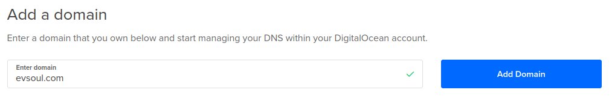
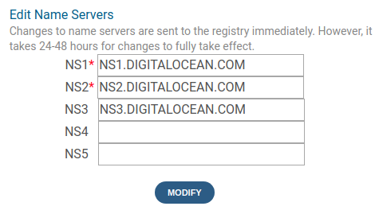

# 安全

我们即将结束学习 Node.js 的旅程。但还有一个重要的话题需要讨论：安全

世界各地的网络安全官员一直在呼吁加强互联网的安全。在某些情况下，由于安全实施薄弱，大量僵尸网络已经建立起来，这些僵尸网络被武器化，用于敲打网站或进行其他破坏。在其他情况下，从安全入侵中猖獗的身份盗窃对我们所有人都构成了经济威胁。几乎每天，新闻都会披露更多的网络安全问题。

2016 年，US-CERT 发布了多个关于**物联网**（**物联网**设备漏洞的警告，如安全摄像头或 Wi-Fi 路由器。通过利用设备中的漏洞，攻击者能够将攻击软件注入这些设备。其结果是数十万物联网设备组成了一个从属僵尸网络，这些设备被部署用于向特定网站发送大规模分布式拒绝服务（DDOS）攻击。

大大小小的公司都遭遇了安全漏洞。攻击者通常会利用用户身份信息逃跑，这就是为什么在[第 10 章](10.html)*部署 Node.js 应用程序*中，我们小心地将用户数据库分割成一个独立的容器。在关键系统周围设置的安全层越多，攻击者进入的可能性就越小。

总的来说，互联网已经从 20 世纪 80 年代计算机研究人员的实验场所转变为全球社会的中心。各种批评活动都在互联网上进行。

例如，电力公司和电网运营商正在研究电网控制从私有网络向互联网的过渡。一个影响因素是基于物联网的分布式能源设备的增加，如智能恒温器、智能照明、太阳能阵列和储能设备。该行业正在重新审视用于控制这些系统的通信协议，并转向互联网技术。这包括使用 HTTPS 和 NSA 级加密的 IEEE 2030.5 标准，该标准由专门构造的数字证书（识别设备和服务）以及基于 REST 的通信协议保护

由于互联网在我们的生活中扮演着至关重要的角色，所以所有软件开发人员都必须解决其产品中的安全问题

安全性不应该是事后诸葛亮，就像测试不应该是事后诸葛亮一样。这两者都是非常重要的，即使只是为了防止你的公司因为错误的原因而进入新闻。

尽管 Notes 应用程序是一个简单的玩具应用程序，但我们一直在使用它来探索生产部署问题。现在让我们转向使用 Notes 来探索良好安全实践的实现。我们将讨论以下主题：

*   在 Express 应用程序中实现 HTTPS/SSL
*   使用 Let's Encrypt 自动更新 SSL 证书
*   使用头盔库为内容安全策略、DNS 预取控制、帧选项、严格的传输安全性和减轻 XSS 攻击实施标头
*   防止针对表单的跨站点请求伪造攻击
*   SQL 注入攻击
*   部署前扫描具有已知漏洞的包

如果您还没有这样做，请复制[第 11 章](11.html)、*单元测试和功能测试*源代码树，您可能已经调用了`chap11`，以创建一个[第 12 章](12.html)、*安全*源代码树，您可以调用`chap12`

Express 在[有一个优秀的安全资源页面 https://expressjs.com/en/advanced/best-practice-security.html](https://expressjs.com/en/advanced/best-practice-security.html) 。

# 使用 Let's Encrypt 的 HTTPS/TLS/SSL

使用 HTTPS 保护您的网站变得越来越重要。例如，浏览器制造商已开始对仅限 HTTP 的网站发出警告，搜索引擎正在降低此类网站的搜索排名。隐私问题要求对通过互联网发送的所有流量进行加密。网络钓鱼攻击诱使受害者访问充满恶意软件的假网站，这意味着我们有一种机制来可靠地识别网站所有权。

HTTPS 只是通过 TLS/SSL 运行的 HTTP，这是一种用于加密连接的 internet 协议。加密密钥存储在可信公钥基础设施（PKI）中，并带有用于验证网站的加密证书。使用正确颁发的证书，HTTPS 验证域，这样我们的用户就可以在一定程度上保证他们访问了有效的网站，并且他们的数据传输被加密以防止（偶然）窃听。浏览器位置栏上的绿色按钮是为了让我们的访客放心，他们是安全的。

多年来，获取所需的 SSL 证书是一个手动过程，需要向证书颁发机构公司支付大量费用。**证书颁发机构****CA**是 HTTPS 协议使用的 SSL 证书背后的整个**公钥基础设施****PKI**的一部分。Internet PKI 使用 CA 的层次结构，更高级别的 CA 认证最终用户 CA。无论每个网站都希望使用 HTTPS 进行保护，手动过程和获取 SSL 证书的成本都意味着不鼓励人们部署 HTTPS 网站。因此，互联网的安全性大大低于它本来可以做到的

随着 Let's Encrypt（一个提供免费 SSL 证书的非盈利组织）的出现，情况发生了变化。最重要的是，该过程完全自动化，易于设置和使用。现在没有理由不提供现成的 HTTPS 支持

我们要做的是在 Notes 应用程序的 Docker 基础设施中使用 Let's Encrypt 工具实现 HTTPS。这需要几个步骤，其中没有一个是困难的：

*   将 Notes 部署到云服务器，就像我们在[第 10 章](10.html)*部署 Node.js 应用程序*中所做的那样，增加了将真实域名与部署关联的功能
*   添加一个包含`certbot`的新容器，该容器是 Let's Encrypt 的命令行工具，用于管理 SSL 证书的注册和续订
*   将 Docker 基础设施配置为将目录从`certbot`容器交叉装载到`notes`容器，以便 Notes 具有 SSL 证书
*   在 Notes 中实现 HTTP 服务器对象

让我们开始吧。

# 将域名与基于 Docker 的云主机关联

让我们首先将 Notes 应用程序部署到云主机上，就像我们在[第 10 章](10.html)中所做的那样，*部署 Node.js 应用程序，*中所做的那样，但有一些改动

其中一个变化是这次使用真实的域名。这需要到`pairdomains.com`等域名注册机构注册域名。一些网络托管提供商也提供域名注册，但是如果您的域名与托管提供商分开注册，通常会更好。继续注册一个域。例如，`fooblebartz.com`似乎是可用的。

下一步是将域名与我们可以部署 Docker 容器的虚拟服务器相关联。同样，我们将使用 DigitalOcean 作为托管应用程序的示例服务，并展示如何配置域名。

关联域名的确切方法因主机提供商而异。通常，托管提供商会要求您为域分配 NS 记录，以列出托管提供商操作的 DNS 服务器。此类主机提供商将为您提供 NS 服务器主机名列表。将 NS 记录分配给托管提供商后，您可以使用托管提供商的仪表板配置域。

在 DigitalOcean 仪表板中，单击网络，然后单击域。在该面板中，您可以输入已注册的域名：



单击 AddDomain 按钮，仪表板会将您切换到一个新屏幕，指示您使用三条 NS 记录配置域名。然后，您必须将这些 NS 记录复制到域注册器网站，在那里您可以这样输入它们：



现在，我们必须在 DigitalOcean（或您选择的云主机提供商）上创建 Docker 主机，如下所示：

```js
$ docker-machine create --driver digitalocean \
 --digitalocean-size 2gb \
 --digitalocean-access-token DIGITAL-OCEAN-API-TOKEN \
 notes-https
...
$ eval $(docker-machine env notes-https)
```

这为我们提供了一个虚拟服务器，我们可以在 DigitalOcean 仪表板中对其进行检查。如果随后导航到“网络/域”面板，则域可以与服务器关联：


很快，您的域名将与服务器正确关联：

```js
$ ping evsoul.com
PING evsoul.com (159.65.179.28) 56(84) bytes of data.
64 bytes from 159.65.179.28 (159.65.179.28): icmp_seq=1 ttl=49 time=83.0 ms
64 bytes from 159.65.179.28 (159.65.179.28): icmp_seq=2 ttl=49 time=85.1 ms
^C
--- evsoul.com ping statistics ---
2 packets transmitted, 2 received, 0% packet loss, time 3001ms
rtt min/avg/max/mdev = 83.050/83.655/85.184/0.930 ms

$ dig -t any evsoul.com
; <<>> DiG 9.10.3-P4-Ubuntu <<>> -t any evsoul.com
...
;; ANSWER SECTION:
evsoul.com. 1800 IN SOA ns1.digitalocean.com. hostmaster.evsoul.com. 1519092120 10800 3600 604800 1800
evsoul.com. 3502 IN A 159.65.179.28
evsoul.com. 1800 IN NS ns1.digitalocean.com.
evsoul.com. 1800 IN NS ns2.digitalocean.com.
evsoul.com. 1800 IN NS ns3.digitalocean.com.
...
```

但是，由于服务器上的任何内容都不会响应任何 HTTP 端口，因此 web 浏览器无法访问该端口。由于笔记本电脑上的命令 shell 仍然与虚拟服务器关联，让我们将便笺部署到服务器上，以便有访问者：

```js
$ docker-compose build
...
$ docker-compose up --force-recreate -d
```

完成后，您可以通过域名访问 Notes 应用程序

要启用 Notes 服务的登录，需要做三件事。一种是在`userauth`容器中运行`users-add`脚本，因为您已经做了很多次了。另一个是在`notes/Dockerfile`中进行此更改：

```js
ENV TWITTER_CALLBACK_HOST=http://evsoul.com
```

在此处替换您选择的域名。此更改允许使用 Twitter 登录 Notes 应用程序。

最后一个变化在`compose/docker-compose.yml`中：

```js
notes:
  build: ../notes
  container_name: notes
  depends_on:
    - db-notes
  networks:
    - frontnet
  ports:
    - "80:3000"
  restart: always
  environment:
    - NODE_ENV="production" 
```

换句话说，是时候让 Notes 像任何 HTTP 服务一样位于端口`80`上了。

此时，您将能够使用`http://DOMAIN`查看 Notes 应用程序，并使用本地用户名或 Twitter 登录。除了添加域名，这正是我们在[第 10 章](10.html)*部署 Node.js 应用程序*中所做的。

下一步是：

*   使用 Let's Encrypt 设置 SSL 证书
*   修改注释以使用这些证书
*   将 HTTP 通信重定向到 Notes HTTPS 端口
*   确保我们可以根据需要部署到 HTTP 或 HTTPS，因为开发人员的笔记本电脑上不需要 HTTP

# 一个 Docker 容器来管理让我们加密 SSL 证书

您可以使用 ACME 客户端从 Let's Encrypt 获取 SSL 证书。ACME 是与 Let's Encrypt 服务同时发明的一种协议，用于从提供者获取 SSL 证书。ACME 的主要客户端是 Certbot，这是一个命令行工具，可帮助您使用 Let's Encrypt 注册域，并自动更新 Let's Encrypt SSL 证书。有关 Certbot 文档，请参见[https://certbot.eff.org/.](https://certbot.eff.org/)

我们将要实现的容器的设置使我们可以轻松地使用 Let’s Encrypt 注册域，然后自动更新证书。它是一个非常简单的容器，由一个`cron`守护进程、一个`crontab`条目和`certbot`工具组成。当`cron`作业运行以尝试证书续订时，唯一的 CPU 消耗大约每天发生一次

创建一个目录`certbot`，并在该目录中创建一个`Dockerfile`：

```js
FROM debian:jessie

# Install cron, certbot, bash, plus any other dependencies
RUN apt-get update && apt-get install -y cron bash wget
RUN mkdir -p /webroots/evsoul.com/.well-known && mkdir -p /scripts

WORKDIR /scripts
RUN wget https://dl.eff.org/certbot-auto
RUN chmod a+x ./certbot-auto
# Run certbot-auto so that it installs itself
RUN /scripts/certbot-auto -n certificates

# /webroots/DOMAIN.TLD/.well-known/... files go here
VOLUME /webroots
VOLUME /etc/letsencrypt

# This installs a Crontab entry which 
# runs "certbot renew" on the 2nd and 7th day of each week at 03:22 AM
#
# cron(8) says the Debian cron daemon reads the files in /etc/cron.d, 
# merging into the data from /etc/crontab, to use as the system-wide cron jobs
#
# RUN echo "22 03 * * 2,7 root /scripts/certbot-auto renew" >/etc/cron.d/certbot

CMD [ "cron", "-f" ]
```

这设置了两个目录结构，`/webroots`和`/etc/letsencrypt`，它们使用`VOLUME`命令从容器中公开。这些目录包含`certbot`在使用 Let's Encrypt 服务注册或续订 SSL 证书过程中使用的管理文件。

`Dockerfile`还安装了`certbot-auto`，实际上是`certbot`，但名称不同。需要运行`certbot-auto -n certificates`，以便`certbot-auto`可以在容器中安装其依赖项。`certificates`命令列出了本地机器上存在的证书，但没有，而是执行该命令以获得安装这些依赖项的副作用。

此 Dockerfile 的另一个功能是自动更新 SSL 证书。`certbot-auto renew`命令检查存储在此计算机上的所有证书，以确定是否有任何证书需要更新。如果有人这样做，将自动使用 Let's Encrypt 发出更新证书的请求。

按照配置，此续订尝试将在一周的第 2 天和第 7 天的凌晨 3:22 运行。

我们必须处理的最后一项任务是注册 SSL 证书。在`certbot`目录中创建一个 shell 脚本`register`，或者 Windows 称之为`register.ps1`，包含：

```js
#!/bin/sh
/scripts/certbot-auto certonly --webroot -w /webroots/$1 -d $1
```

这就是我们如何向 Let's Encrypt 注册域的方法。该脚本接受一个参数，即要注册的域名。

`--webroot`选项表示我们要使用`webroot`认证算法。这意味着 Let's Encrypt 通过请求域上的特定 URL 来验证您是否拥有该域。有关文件，请参见[https://certbot.eff.org/docs/using.html#webroot](https://certbot.eff.org/docs/using.html#webroot) 。

Let’s Encrypt 服务的一个示例验证请求可能是[http://example.com/.well-known/acme-challenge/HGr8U1IeTW4kY_Z6UIyaakzOkyQgPr_7ArlLgtZE8SX](http://example.com/.well-known/acme-challenge/HGr8U1IeTW4kY_Z6UIyaakzOkyQgPr_7ArlLgtZE8SX) 。

在`certbot`容器中，我们已经说过这个`.well-known`目录将存在于`/webroots/DOMAIN-NAME/.well-known`目录中。`-w`选项的目的是让`certbot-auto`知道这个目录位置，`-d`选项告诉它要注册的域名。

当我们运行`certbot-auto certonly`命令时，让我们加密并发回一个质询文件，该文件安装在`-w`参数中指定的目录树中。这意味着，当 Let's Encrypt 检索前面显示的 URL 时，它将获取质询文件，从而验证您是否确实控制给定的域名。

目前，该目录对于满足验证请求的任何东西都是不可见的。

为使其按预期工作，`/webroots/DOMAIN-NAME/.well-known`目录必须对 Notes 应用程序可见，这样 Notes 才能满足我们加密的 URL 请求。让我们看看如何做到这一点。

# 跨容器将 Let's Encrypt 目录装载到 notes 容器

`certbot`容器的用途是管理让我们加密 SSL 证书。Notes 应用程序将使用这些证书来配置 HTTPS 服务器。要求证书和质询文件在`notes`容器中可见。

我们可以将`certbot-auto`集成到`notes`容器中，而不是创建单独的容器。但这会阻止`notes`容器数量的扩大。我们不能让每个`notes`实例运行`certbot-auto`脚本来生成证书。相反，证书管理过程必须集中化。因此，我们开发了`certbot`容器。

所需的是使`certbot`容器中的`/webroots/DOMAIN-NAME/.well-known`目录在`notes`容器中的某处可见。

要设置此项，我们需要在`compose/docker-compose.yml`中进行两项更改。首先，我们为`certbot`容器添加这一节：

```js
certbot:
    build: ../certbot
    container_name: certbot
    networks:
      - frontnet
    restart: always
    volumes:
      - certbot-webroot-evsoul:/webroots/evsoul.com/.well-known
      - certbot-letsencrypt:/etc/letsencrypt
```

这将根据上一节中描述的 Dockerfile 构建容器映像。就目前而言，除了`volumes`部分中的条目外，这是非常简单的。这些条目将此处显示的目录与我们需要在`docker-compose.yml`中其他地方定义的命名卷相关联。

我们正在做的是将相同的两个卷附加到`certbot`和`notes`容器上。在本例中，我们将这些卷装载到`certbot`中的特定目录。

这两个命名卷的声明如下：

```js
volumes: 
  ...
  certbot-webroot-evsoul:
  certbot-letsencrypt:
```

然后我们必须对`notes`容器进行类似的更改：

```js
notes:
    build: ../notes
    container_name: notes
    depends_on:
      - db-notes
    networks:
      - frontnet
    ports:
      - "80:3000"
 - "443:3443"
    restart: always
    volumes:
 - certbot-webroot-evsoul:/notesapp/public/.well-known
 - certbot-letsencrypt:/etc/letsencrypt
```

我们做了两个更改，第一个是为 HTTPS 端口（端口`443`）添加 TCP 端口导出。第二个是将两个命名卷装载到`notes`容器中的适当位置。这些卷与前面声明的命名卷相同。我们只是将卷安装在对`notes`容器有意义的地方。

SSL 证书可以存在于`notes`容器中的任何位置，但`/etc/letsencrypt`与其他位置一样好。需要的是 Notes 代码能够读取证书。

将`.well-known`目录放在`/notesapp/public`下意味着 Notes 将自动向发出请求的任何服务提供该目录中的任何文件。这是因为`app.mjs`中已经配置了`static`中间件。

这将设置一对目录，它们在两个容器中可见。任一容器都可以在任一目录中写入文件，该文件将自动显示在另一个容器中。

当我们在`certbot`容器中运行`register`脚本时，它会将 Let's Encrypt 提供的质询文件写入`/webroots/evsoul.com/.well-known`目录树。该目录在`notes`容器中与`/notesapp/public/.well-known`可见，因此 Notes 将自动为质询文件提供服务，就像它为该目录树中的 CSS、JavaScript 和图像文件提供服务一样。

过程如下所示：

```js
$ docker exec -it certbot bash
root@05b095690414:/scripts# sh ./register evsoul.com
Saving debug log to /var/log/letsencrypt/letsencrypt.log
Plugins selected: Authenticator webroot, Installer None
Enter email address (used for urgent renewal and security notices) (Enter 'c' to
cancel):  ENTER YOUR EMAIL ADDRESS HERE

---------------------------------------------------------------
Please read the Terms of Service at
https://letsencrypt.org/documents/LE-SA-v1.2-November-15-2017.pdf. You must
agree in order to register with the ACME server at
https://acme-v01.api.letsencrypt.org/directory
---------------------------------------------------------------
(A)gree/(C)ancel: a
---------------------------------------------------------------
Would you be willing to share your email address with the Electronic Frontier
Foundation, a founding partner of the Let's Encrypt project and the non-profit
organization that develops Certbot? We'd like to send you email about EFF and
our work to encrypt the web, protect its users and defend digital rights.
--------------------------------------------------------------
(Y)es/(N)o: n
Obtaining a new certificate
Performing the following challenges:
http-01 challenge for evsoul.com
Using the webroot path /webroots/evsoul.com for all unmatched domains.
Waiting for verification...
Cleaning up challenges

IMPORTANT NOTES:
 - Congratulations! Your certificate and chain have been saved at:
 /etc/letsencrypt/live/evsoul.com/fullchain.pem
 Your key file has been saved at:
 /etc/letsencrypt/live/evsoul.com/privkey.pem
 Your cert will expire on 2018-05-22\. To obtain a new or tweaked
 version of this certificate in the future, simply run certbot-auto
 again. To non-interactively renew *all* of your certificates, run
 "certbot-auto renew"
 - Your account credentials have been saved in your Certbot
 configuration directory at /etc/letsencrypt. You should make a
 secure backup of this folder now. This configuration directory will
 also contain certificates and private keys obtained by Certbot so
 making regular backups of this folder is ideal.
 - If you like Certbot, please consider supporting our work by:

 Donating to ISRG / Let's Encrypt: https://letsencrypt.org/donate
 Donating to EFF: https://eff.org/donate-le

root@05b095690414:/scripts# 
```

运行该命令后，最好检查`/etc/letsencrypt`目录结构，看看有什么。必须小心处理这些目录的内容，因为它包含用于验证域的私钥。私钥加密系统的全部要点是私钥受到严格控制，而公钥则提供给任何人。

以`.pem`扩展名结尾的文件是 PEM 编码的证书。**隐私增强邮件**（**PEM**），这是为互联网开发安全加密电子邮件系统的早期尝试。虽然该项目失败了，但 PEM 容器格式仍然存在，并广泛用于 SSL 证书。

# 向 Notes 添加 HTTPS 支持

现在，我们已经有了一个向 Let's Encrypt 注册并更新我们收到的 SSL 证书的过程，让我们看看如何向 Notes 应用程序添加 HTTPS 支持。这项任务相当简单，因为 Node.js 平台在我们一直使用的 HTTP 服务器对象旁边提供了一个 HTTPS 服务器。

我们将要求对`notes/app.mjs`进行以下更改：

```js
import http from 'http';
import https from 'https';
...
const USEHTTPS = process.env.NOTES_USE_HTTPS
 && (typeof process.env.NOTES_USE_HTTPS === 'string')
 && (process.env.NOTES_USE_HTTPS === 'true');
const CERTSDIR = process.env.NOTES_CERTS_DIR;
const options = USEHTTPS ? {
 key: fs.readFileSync(`${CERTSDIR}/privkey1.pem`),
 cert: fs.readFileSync(`${CERTSDIR}/fullchain1.pem`),
 ca: fs.readFileSync(`${CERTSDIR}/chain1.pem`)
} : {};

const server = http.createServer(app);
const serverSSL = USEHTTPS ? https.createServer(options, app) : undefined;

import socketio from 'socket.io';
const io = socketio(USEHTTPS ? serverSSL : server, options); 
...
var port = normalizePort(process.env.PORT || '3000');
app.set('port', port);
...
server.listen(port);
server.on('error', onError);
server.on('listening', onListening); if (USEHTTPS) {
  serverSSL.listen(3443);
  serverSSL.on('error', onError);
  serverSSL.on('listening', onListening);
}
```

换句话说，我们已经将`https`模块与`http`模块一起导入，然后读入初始化 HTTPS 支持所需的 SSL 证书，然后使用这些证书创建 HTTPS 服务器对象，最后将其配置为在端口`3443`上侦听。HTTPS 支持取决于`NOTES_USE_HTTPS`环境变量的值。如果该变量存在且等于`true`，则将`USEHTTPS`变量设置为`true`，并打开 HTTPS 支持。

这导致我们再次修改`compose/docker-compose.yml`以匹配：

```js
notes:
    build: ../notes
    container_name: notes
    depends_on:
      - db-notes
    networks:
      - frontnet
    ports:
      - "80:3000"
 - "443:3443"
    restart: always
    environment:
      - NOTES_USE_HTTPS=true
 - NOTES_CERTS_DIR=/etc/letsencrypt/archive/evsoul.com
    volumes:
      - certbot-webroot-evsoul:/notesapp/public/.well-known
      - certbot-letsencrypt:/etc/letsencrypt
```

HTTP 和 HTTPS 端口都是从容器中公开的，我们有一些用于配置设置的环境变量。

`TWITTER_CALLBACK_URL`环境变量需要更新为`https://DOMAIN`。该站点现在托管在 HTTPS 上，因此 Twitter 应该将我们的用户重定向到 HTTPS 站点。

完成所有这些设置后，您现在应该能够以`http://DOMAIN`或`https://DOMAIN`的身份访问 Notes 应用程序。如果你告诉你的客户只需使用你网站的 HTTPS 版本，这是否意味着你已经完成了？

不会。搜索引擎通常会对承载重复内容的网站进行降级，同时拥有 HTTP 和 HTTPS 版本的网站就是重复内容。此外，浏览器制造商正在迅速向浏览器用户发出警告，HTTP 网站不安全，而 HTTPS 网站是安全的。换句话说，将任何 HTTP 连接重定向到网站的 HTTPS 版本是非常重要的。

一种方法是使用快递的`express-force-ssl`包（`https://www.npmjs.com/package/express-force-ssl`。顾名思义，它与 Express 应用程序（如 Notes）集成，并强制浏览器重定向到网站的 HTTPS 版本

但是，我们还有其他安全问题要做。使用 HTTPS 只能解决部分安全问题。在下一节中，我们将介绍 Helmet，它是一个用于 Express 应用程序的工具，用于在 HTTP 头中设置许多安全选项。头盔包括一个工具，要求浏览器使用网站的 HTTPS 版本，同时我们还将展示如何使用`express-force-ssl`。

在开始之前，请访问 Qualys SSL 实验室的 SSL 实现测试页面。此服务将检查您的网站，特别是 SSL 证书，并给您评分。使用本节中的步骤将为您打分。要查看您的分数，请参见[https://www.ssllabs.com/ssltest/](https://www.ssllabs.com/ssltest/) 。

# 戴上头盔，以确保全面安全

头盔（[https://www.npmjs.com/package/helmet](https://www.npmjs.com/package/helmet) ）不是安全的银弹（头盔的作者认为我们是在保护自己不受吸血鬼的伤害吗？）。相反，它是一个用于设置各种安全头和采取其他保护措施的工具包。

在`notes`目录中，按如下方式安装软件包：

```js
$ npm install helmet --save
```

然后将其添加到`notes/app.mjs`：

```js
import helmet from 'helmet';
...
const app = express();
export default app;

app.use(helmet());
```

对于大多数应用程序来说，这已经足够了。使用开箱即用头盔提供了一组合理的默认安全选项。我们现在就可以完成这一部分，但仔细检查头盔的功能和选项是有用的。

头盔实际上是一个由 12 个模块组成的集群，用于应用多种安全技术。每种技术都可以单独启用或禁用，许多技术都有配置设置。

# 使用头盔设置内容安全策略标头

**内容安全策略**（**CSP**头可以帮助防止注入恶意 JavaScript 和其他文件类型。

如果我们不指出 Notes 应用程序等服务的一个突出问题，那将是失职的。我们的用户可以输入他们喜欢的任何代码，而行为不正常的应用程序只会显示这些代码。这些应用程序可能是 JavaScript 注入攻击的载体。

要尝试此操作，请编辑注释并输入以下内容：

```js
<script src="http://example.com/malicious.js"></script>
```

单击 Save 按钮，您将看到此代码显示为文本。一个危险的 Notes 版本会在 Notes 视图页面中插入`<script>`标记，这样恶意 JavaScript 就会被加载，并给我们的访问者带来问题。相反，`<script>`标记被编码为安全的 HTML，因此它只是在屏幕上显示为文本。我们没有为这种行为做任何特别的事情，车把是为我们做的。

事实上，如果我们看一下车把文档[，会更有趣一点 http://handlebarsjs.com/expressions.html](http://handlebarsjs.com/expressions.html) ，我们了解到这种区别：

```js
{{encodedAsHtml}}

{{{notEncodedAsHtml}}}
```

在把手中，使用两个大括号（`{{encoded}}`）的模板中出现的值使用 HTML 编码进行编码。在前面的示例中，尖括号被编码为`&lt;`等用于显示，将 JavaScript 代码呈现为中性文本，而不是 HTML 元素。如果改为使用三个大括号（`{{{notEncoded}}}`），则该值不会被编码，而是按原样显示。恶意 JavaScript 将在访问者的浏览器中执行，从而给用户带来问题。

在 Notes 中，如果我们希望用户输入 HTML 并将其显示为 HTML，则`views/noteview.hbs`需要以下代码：

```js
{{#if note}}<div id="notebody">{{{ note.body }}}</div>{{/if}}
```

大多数（或所有）模板引擎都包含此模式以显示值。模板开发人员可以选择使用 HTML 代码对任何给定值进行编码还是按原样显示。

回到头盔对头部的支持，严格控制浏览器可以下载文件的位置非常有用。我们的用户输入恶意 JavaScript 代码只是一个风险。假设一个恶意参与者闯入并修改模板以包含恶意 JavaScript 代码？

通过标题，我们可以告诉浏览器 JavaScript 只能来自我们自己的服务器和 Google 的 CDN，其他所有内容都将被拒绝。从`piratesden.net`加载的恶意 JavaScript 无法运行。我们甚至可以让用户轻松地输入 HTML，因为任何从第三方网站引用的恶意 JavaScript 都不会运行

要查看此头盔模块的文档，请参阅[https://helmetjs.github.io/docs/csp/](https://helmetjs.github.io/docs/csp/) 。

有一长串的选择。例如，您可以让浏览器向服务器报告任何违规行为，在这种情况下，您需要为`/report-violation`实现路由处理程序。此代码段足以用于注释：

```js
app.use(helmet.contentSecurityPolicy({
  directives: {
    defaultSrc: ["'self'"],
    scriptSrc: ["'self'", "'unsafe-inline'" ],
    styleSrc: ["'self'", 'fonts.googleapis.com' ],
    fontSrc: ["'self'", 'fonts.gstatic.com' ],
    connectSrc: [ "'self'", 'wss://evsoul.com' ]
  }
}));
```

不管是好是坏，Notes 应用程序实现了一种安全最佳实践—所有 CSS 和 JavaScript 文件都是从与应用程序相同的服务器加载的。因此，在大多数情况下，我们可以使用`'self'`策略。有几个例外：

*   `scriptSrc`：定义允许加载 JavaScript 的位置。我们在`noteview.hbs`和`index.hbs`中使用内联 JavaScript，这是必须允许的。
*   `styleSrc`、`fontSrc`：我们正在从本地服务器和谷歌字体加载 CSS 文件。
*   `connectSrc`：此处声明 Socket.IO 使用的 WebSockets 通道。

# 使用头盔设置 X-DNS-Prefetch-Control 标头

DNS 预取是一些浏览器实现的一种精确方法，其中浏览器将对给定页面所引用的域进行 DNS 请求。如果一个页面有到其他网站的链接，它将为这些域发出 DNS 请求，以便预先填充本地 DNS 缓存。这对用户来说很好，因为它提高了浏览器的性能，但同时也是一种隐私入侵，并且会使访问过的网站看起来像他们没有访问过的网站。有关文件，请参见[https://helmetjs.github.io/docs/dns-prefetch-control](https://helmetjs.github.io/docs/dns-prefetch-control) 。

设置为：

```js
app.use(helmet.dnsPrefetchControl({ allow: false }));  // or true
```

# 使用头盔设置 X-Frame-Options 标题

**点击劫持**是一种巧妙的技术，用于隐藏一个不可见的包含恶意代码的`<iframe>`，但放置在一个看起来很吸引点击的东西的顶部。然后，用户将被诱使点击恶意按钮。头盔的`frameguard`模块将设置一个标题，指示浏览器如何处理`<iframe>`。有关文件，请参见[https://helmetjs.github.io/docs/frameguard/](https://helmetjs.github.io/docs/frameguard/) 。

```js
app.use(helmet.frameguard({ action: 'deny' }));
```

此设置拒绝所有此类`<iframe>`内容。

# 使用头盔卸下 X-Powered-By 收割台

`X-Powered-By`头可以向恶意参与者提供有关正在使用的软件堆栈的线索，告知他们可能成功的攻击算法。由头盔子模块供电的隐藏只会删除该标题。

Express 可以自行禁用此功能：

```js
app.disable('x-powered-by')
```

或者您可以使用头盔来执行此操作：

```js
app.use(helmet.hidePoweredBy())
```

# 通过严格的传输安全性改进 HTTPS

在实现了 HTTPS 支持之后，我们还没有完全完成。正如我们前面所说，我们的用户有必要使用 HTTPS 版本的 Notes，但目前他们仍然可以使用 HTTP 版本。Strict Transport Security 标头通知浏览器应使用站点的 HTTPS 版本。因为这只是一个通知，所以还需要实现从 HTTP 到 HTTPS 版本 Notes 的重定向。

我们将严格的运输安全设置为：

```js
const sixtyDaysInSeconds = 5184000
app.use(helmet.hsts({
  maxAge: sixtyDaysInSeconds
})); 
```

这会告诉浏览器在接下来的 60 天内坚持使用 HTTPS 版本的网站，并且永远不要访问 HTTP 版本。

而且，只要我们在这个问题上，让我们继续使用`express-force-ssl`来实现重定向。在`package.json`中向该包添加依赖项后，在`app.mjs`中添加该依赖项：

```js
import forceSSL from 'express-force-ssl';
...
app.use(forceSSL);
app.use(bodyParser.json());
```

# 使用头盔缓解 XSS 攻击

XSS 攻击试图将 JavaScript 代码注入网站输出。通过将恶意代码注入另一个网站，攻击者可以访问无法检索的信息。X-XSS-Protection 标头可防止某些 XSS 攻击，但不是所有攻击。

```js
app.use(helmet.xssFilter());
```

# 解决跨站点请求伪造（CSRF）攻击

CSRF 攻击与 XSS 攻击类似，都发生在多个站点上。在 CSRF 攻击中，恶意软件在另一个站点上伪造虚假请求。为了防止此类攻击，将为每个页面视图生成 CSRF 令牌，并将其作为隐藏值包含在 HTML 表单中，然后在提交表单时进行检查。令牌不匹配导致请求被拒绝。

`csurf`包装设计用于 Express[https://www.npmjs.com/package/csurf](https://www.npmjs.com/package/csurf) 在`notes`目录中，运行以下命令：

```js
$ npm install csurf --save
```

然后按如下方式安装中间件：

```js
import csrf from 'csurf';
...
app.use(cookieParser());
app.use(csrf({ cookie: true }));
```

`csurf`中间件必须安装在`cookieParser`中间件之后。

接下来，对于每个包含表单的页面，我们必须生成并发送一个令牌。这需要两件事，在`res.render`调用中，我们生成令牌，然后在视图模板中，我们将令牌作为隐藏输入包含在页面中的任何表单上。我们将在这里讨论几个文件，所以让我们开始吧。

在`routes/notes.mjs,`中，为`/add`、`/edit`、`/view`和`/destroy`路线的`res.render`调用添加以下参数：

```js
csrfToken: req.csrfToken()
```

同样，对`routes/users.mjs`中的`/login`路线也要这样做。这会将生成的 CSRF 令牌添加到发送到模板的参数中。

然后在`views/noteedit.hbs`和`views/notedestroy.hbs,`中添加以下内容：

```js
{{#if user}}
    <input type="hidden" name="_csrf" value="{{csrfToken}}">
    ...
{{/if}}
```

在`views/login.hbs`中，进行相同的添加，但没有`{{#if user}}`指令。

在`views/noteview.hbs`中，有一个提交评论的表单。进行以下更改：

```js
<form id="submit-comment" class="well" data-async data-target="#rating-modal" 
      action="/notes/make-comment" method="POST"> 
    <input type="hidden" name="_csrf" value="{{csrfToken}}">
    ...
</form>
```

此`<input>`标记将 CSRF 令牌呈现到表单中。提交表单时，`csurf`中间件检查表单的正确性，并拒绝任何不匹配的表单。

# 拒绝 SQL 注入攻击

SQL 注入是另一大类安全漏洞攻击，攻击者将 SQL 命令放入输入数据中。参见[https://www.xkcd.com/327/ 以](https://www.xkcd.com/327/)为例。

`sql-injection`包扫描 SQL 代码的查询字符串、请求主体参数和路由参数

安装时使用：

```js
$ npm install sql-injection --save
```

然后将其安装在`app.mjs`中：

```js
import sqlinjection from 'sql-injection';
...
app.use(sqlinjection);
```

# 关于操作员注入攻击的 Sequelize 弃用警告

您可能已经看到 Notes 打印的此弃用警告：

```js
sequelize deprecated String based operators are now deprecated. Please use Symbol based operators for better security, read more at http://docs.sequelizejs.com/manual/tutorial/querying.html#operators
```

Notes 中没有使用基于字符串的运算符，因此这似乎是一条虚假的错误消息。实际上，这是一个真正的问题，可能类似于 SQL 注入攻击。

此问题队列条目深入讨论了安全问题：[https://github.com/sequelize/sequelize/issues/8417](https://github.com/sequelize/sequelize/issues/8417) 详见[文档 http://docs.sequelizejs.com/manual/tutorial/querying.html#operators-保安](http://docs.sequelizejs.com/manual/tutorial/querying.html#operators-security)。

即，这样的查询：

```js
db.Token.findOne({
      where: { token: req.query.token }
});
```

易受破坏查询的注入式攻击的影响。我们在`notes/models/notes-sequelize.mjs`中确实有这样的代码，因此应该解决这个问题。

幸运的是，解决方案只是为操作符禁用**字符串别名**。在我们定义的`Sequelize`配置文件中，我们禁用别名，如下所示：

```js
dbname: users
username:
password:
params:
    dialect: sqlite
    storage: users-sequelize.sqlite3
    operatorAliases: false
```

此更改应在每个`Sequelize`配置文件中进行。

# 扫描已知漏洞

`nsp`套餐（[https://www.npmjs.com/package/nsp](https://www.npmjs.com/package/nsp) 扫描`package.json`或`npm-shrinkwrap.json`以查找已知漏洞。该软件包背后的公司保存了一份此类软件包的列表，由`nsp`软件包查询

从 npm 版本 6 开始，nsp 包功能已作为`npm audit`命令折叠到 npm 本身。它是一个命令行工具，您可以这样运行：

```js
$ npm install nsp
$ ./node_modules/.bin/nsp check 
(+) 3 vulnerabilities found
┌────────────┬────────────────────────────────────────────────────────────────────┐
│            │ Regular Expression Denial of Service                               │
├────────────┼────────────────────────────────────────────────────────────────────┤
│       Name │ mime                                                               │
├────────────┼────────────────────────────────────────────────────────────────────┤
│       CVSS │ 7.5 (High)                                                         │
├────────────┼────────────────────────────────────────────────────────────────────┤
│  Installed │ 1.3.4                                                              │
├────────────┼────────────────────────────────────────────────────────────────────┤
│ Vulnerable │ < 1.4.1 || > 2.0.0 < 2.0.3                                         │
├────────────┼────────────────────────────────────────────────────────────────────┤
│    Patched │ >= 1.4.1 < 2.0.0 || >= 2.0.3                                       │
├────────────┼────────────────────────────────────────────────────────────────────┤
│       Path │ notes@0.0.0 > express@4.15.5 > send@0.15.6 > mime@1.3.4            │
├────────────┼────────────────────────────────────────────────────────────────────┤
│  More Info │ https://nodesecurity.io/advisories/535                             │
└────────────┴────────────────────────────────────────────────────────────────────┘
... more output
```

此报告称当前安装的`mime`软件包易受攻击。`Vulnerable`行表示哪些版本存在已知问题，`Patched`行表示哪些版本是安全的。`More Info`线路告诉您在哪里可以获得更多信息。

根据 npm 团队的说法，npm 版本 6 将包含此功能作为一种内置功能。请参见[https://blog.npmjs.org/post/173260195980/announcing-npm6](https://blog.npmjs.org/post/173260195980/announcing-npm6)

如果与本例一样，您不确定软件包的使用位置，请尝试以下操作：

```js
$ npm ls mime
notes@0.0.0 /Users/david/chap12/notes
├─┬ express@4.15.5
│ └─┬ send@0.15.6
│   └── mime@1.3.4 
└─┬ superagent@3.8.2
 └── mime@1.6.0 
```

使用的`mime`模块有两个版本，其中一个版本的版本号与前面显示的版本号一致。这是一个很好的信息，但是您如何使用它呢？理论上，您应该简单地更改依赖项以使用包的安全版本。

在这种情况下，我们有一个问题，我们的`package.json`没有导致安装`mime`包。取而代之的是`send`包裹，而该包裹又是由快递公司要求的，由快递公司负责。我们要依靠软件包维护人员来更新它们的依赖关系。

幸运的是，现在有一个更新版本的 Express，它确实更新了对`send`包的依赖关系，进而更新了对`mime`包的依赖关系：

```js
$ npm ls mime
notes@0.0.0 /Users/david/chap12/notes
├─┬ express@4.16.2
│ └─┬ send@0.16.1
│   └── mime@1.4.1 
└─┬ superagent@3.8.2
 └── mime@1.6.0 
```

只需更新依赖项就可以解决问题。但是我们现在有一个管理任务，根据 12 因素应用程序模型，我们必须使其自动化。

实现自动化的一种方法是首先将`nsp`添加到`package.json`依赖项中，将其安装在 Notes 中。`nsp`软件包说它最好在全球范围内安装，但这是一个隐含的依赖关系。十二因素应用模型建议最好有明确的依赖关系，因此最好在`package.json`中列出`nsp`。安装`nsp`后，将此步骤添加到 Dockerfile：

```js
WORKDIR /notesapp
RUN npm install --unsafe-perm
RUN ./node_modules/.bin/nsp check
```

现在，构建 Docker 容器将得到以下结果：

```js
Step 21/25 : RUN ./node_modules/.bin/nsp check
 ---> Running in 9dedf22ec1f9
(+) 2 vulnerabilities found
...
ERROR: Service 'notes' failed to build: The command '/bin/sh -c ./node_modules/.bin/nsp check' returned a non-zero code: 1
```

换句话说，我们有一个简单的机制，不使用依赖项具有已知漏洞的服务。

# 使用良好的 cookie 实践

一些营养学家说，吃太多甜食，如饼干，对你的健康有害。然而，Web Cookie 被广泛用于许多目的，包括记录浏览器是否登录

在 Notes 应用程序中，我们已经使用了一些良好的实践：

*   我们使用的 Express 会话 cookie 名称与文档中显示的默认名称不同
*   Express session cookie secret 不是文档中显示的默认值

综上所述，攻击者无法利用因使用默认值而产生的任何已知漏洞进行攻击。所有类型的软件产品都显示默认密码或其他默认值。这些默认值可能是安全漏洞，因此最好不要使用默认值。例如，默认的 Raspberry Pi 登录/密码为*Pi*和*Raspberry*。虽然这很可爱，但任何带有默认登录/密码的基于 Raspbian 的物联网设备都很容易受到影响。

但是，我们还可以做更多的工作，使我们正在使用的单一 cookie，即 Express 会话 cookie 更加安全。

该软件包有几个可用选项，请参见[https://www.npmjs.com/package/express-session](https://www.npmjs.com/package/express-session) ：

```js
app.use(session({
  store: sessionStore, 
  secret: sessionSecret,
  resave: true, 
  saveUninitialized: true,
  name: sessionCookieName,
  secure: true,
 maxAge: 2 * 60 * 60 * 1000 // 2 hours
})); 
```

这些是看起来有用的附加属性。`secure`属性要求 cookies 只能通过 HTTPS 连接发送。这确保 cookie 数据通过 HTTPS 加密进行加密。`maxAge`属性设置 Cookie 有效的时间量，以毫秒表示

# 总结

在本章中，我们讨论了一个非常重要的主题，应用程序安全。多亏了 Node.js 和 Express 社区的辛勤工作，我们只需在这里和那里添加一些代码来配置安全模块，就可以加强安全性。如果系统使用的软件包存在已知漏洞，我们甚至已经研究出如何防止系统被构建。

启用 HTTPS 意味着我们的用户有更好的安全保证。SSL 证书是一种真实性度量，可防止中间人安全攻击，并且数据经过加密以在 internet 上传输。通过一点工作，我们能够建立一个系统，从 Let's Encrypt 服务获取并不断更新免费 SSL 证书。

`helmet`包提供了一套工具来设置安全标题，指导 web 浏览器如何处理我们的内容。这些设置可以防止或减轻整个类别的安全漏洞。通过`csurf`包，我们能够防止跨站点请求伪造攻击。

这几个步骤是保护 Notes 应用程序的良好开端。但是，不要停留在这些措施上，因为存在一系列永无止境的安全漏洞。

雅虎的所有员工都接受过安全实践方面的培训，雅虎的内部网络围绕着至关重要的用户数据库提供了定义良好的路由和其他保护，而雅虎的工程人员则被任命为“偏执狂”，他们的任务是不断检查系统是否存在潜在的安全漏洞。尽管如此，雅虎仍然遭受了互联网历史上最大规模的用户身份数据泄露。教训是，我们任何人都不能忽视我们部署的应用程序的安全性。

在这本书的过程中，我们取得了长足的进步。总的来说，本课程将研究开发和部署 Node.js web 应用程序所需的主要生命周期步骤

我们首先学习 Node.js 的基础知识，以及如何使用该平台开发简单的服务。在本书中，我们了解了如何在 Node.js 应用程序中使用高级 JavaScript 功能，如异步函数和 ES6 模块。为了存储数据，我们学习了如何使用多个数据库引擎，以及一种使引擎之间切换更容易的方法。

Mobile first 开发在当今环境中非常重要，为了实现这一目标，我们学习了如何使用 Bootstrap 框架。

人们期望在各种各样的网站上进行实时通信，因为先进的 JavaScript 功能意味着我们现在可以在 web 应用程序中提供更多的交互式服务。为了实现这个目标，我们学习了如何使用 Socket.IO 实时通信框架。

将应用程序服务部署到云主机被广泛使用，这既可以简化系统设置，也可以扩展服务以满足我们用户群的需求。为了实现这个目标，我们学会了使用 Docker。我们不仅将 Docker 用于生产部署，还用于部署测试基础设施，在其中我们可以运行单元测试和功能测试。我们还学习了如何通过开发自定义 Docker 容器来实现 HTTPS 支持，该容器包含注册和续订 SSL 证书的 Let's Encrypt 工具。