B16353_05_ePub_AM <link href="css/style-JRserifv3.css" rel="stylesheet" type="text/css">

# *第五章*:本地实现 Node-RED

在本章中，我们将使用 Node-RED 的独立版本。 Node-RED 由开发环境、执行环境和应用程序本身组成。 您可以通过使用在本地环境中运行的独立版本来理解这种机制。

具体来说，启动 Node-RED 独立版本的最常见原因是在物联网边缘设备上使用它。 物联网边缘设备具有通常应用于“物联网”的“物”部分的传感器。 在本章中，我们将查看边缘设备内的传感数据并创建一个样本流。

让我们从以下四个主题开始:

*   在本地机器上运行 Node-RED
*   使用 Node-RED 的独立版本
*   在边缘设备上使用物联网
*   制作样品流

在本章结束时，您将学习如何构建一个流程来处理物联网设备上的传感器数据。

# 技术要求

要读完本章，你需要具备以下条件:

*   Node-RED (v1.1.0 或以上):[https://nodered.org/](https://nodered.org/)
*   树莓派:[https://www.raspberrypi.org/](https://www.raspberrypi.org/)

本章使用的代码可在**Chapter05**文件夹[https://github.com/PacktPublishing/-Practical-Node-RED-Programming](https://github.com/PacktPublishing/-Practical-Node-RED-Programming)中找到。

# 在本地机器上运行 Node-RED

我们现在可以创建物联网边缘设备上的传感数据流，在这个场景中，本地机器使用树莓派。 原因将在*使用 Node-RED*的独立版本一节中描述，但总的来说，本教程针对的是物联网边缘设备。

我已经解释了如何开始 Node-RED 覆盆子π,所以你现在应该知道如何运行它,但是如果你需要复习,请参考*安装 Node-RED 覆盆子π*中[*第二章*](02.html#_idTextAnchor034),*设置开发环境。*

 *现在，按照以下步骤在树莓派上启动 Node-RED:

1.  Let's start by executing Node-RED from the Raspberry Pi menu:

    

    图 5.1 -在树莓派菜单中运行 Node-RED

2.  You can check the status of Node-RED on your terminal. If **Started flows** is shown, Node-RED is ready to use:

    

    图 5.2 -树莓派的终端

3.  您可以使用**localhost:1880**URL访问 Node-RED 流编辑器:

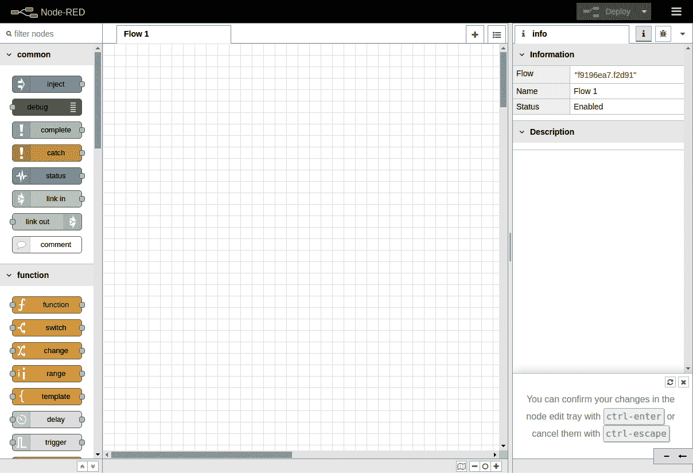

图 5.3 - Node-RED 流编辑器

在使用流编辑器之前，让我们学习一些概念。

# 使用 Node-RED 的独立版本

现在我们将了解 Node-RED 的独立版本是什么，以及它与其他版本的区别。 我们通常使用 Node-RED 流编辑器作为独立编辑器; 然而，我们也可以在任何具有 Docker、Kubernetes 或 cloud Foundry 等容器技术的云上使用 Node-RED 流编辑器。 我们将用相对常见的用例显式演示独立版本的使用，以了解如何使用它。

让我们考虑使用 Node-RED 的情况。

Node-RED 是一个用 Node.js 创建应用的工具。 它也是执行环境。 如果你能用 Node.js 写一个应用程序，那就没问题。

那么，为什么要使用 Node-RED 构建应用程序呢?

一种解决方法是对每个数据处理单元进行黑箱操作。 这使得每个流程的角色非常清晰，易于构建和维护。

另一个答案是避免人为错误。 由于每个流程都被模块化为一个节点，所以在使用该流程时，您只需要理解输入/输出规范。 这意味着您可以避免人为错误，如编码错误和缺少测试规范。 这个可以是无代码/低代码以及 Node-RED 的优势。

接下来，想象一个使用具有刚才描述的特征的 Node-RED 的具体情况。

考虑控制数据并将其连接到下一个流程的业务逻辑。 这是物联网解决方案中常见的情况。

物联网解决方案的标准架构是由边缘设备和云平台构建的。 它将边缘设备采集到的传感器数据发送到云中，然后在云中对数据进行可视化、分析和持久化等处理。

在这一章中，我想集中在边缘设备部分。

边缘设备在将采集到的传感器数据发送到云之前，通常会在一定程度上进行准备。 这样做的原因是，如果您发送所有获得的数据，就会有网络过载的风险。

因此，独立的 Node-RED 演习使用了树莓派，这是一个著名的消费者物联网基础设施。

在本章中，我们将使用**Grove Base HAT**用于树莓派和 Grove Base 模块。 这是物联网边缘设备平台的标准之一，所以我们需要在树莓派上安装 Grove Base 驱动程序。

重要提示

本章给出了一个使用 Grove Base HAT 的例子，它相对便宜，可以购买(链接在下一节中提到)，但是任何可以连接到树莓派的传感器设备都可以处理 Node-RED 上的数据。

当使用 Grove Base HAT 传感器设备以外的模块时，请使用相应的节点并阅读本章。 (如果没有相应的节点，则需要实现。)

你可以检查 node - red 库是否存在与每个设备相对应的节点:

[https://flows.nodered.org/](https://flows.nodered.org/)

让我们准备在树莓派上使用Grove Base HAT，步骤如下:

1.  Let's start by executing the following command on our Raspberry Pi:

    **$ curl - sl https://github.com/Seeed-Studio/grove.py/raw/master/install.sh | sudo bash -s -**

2.  If everything goes well, you will see the following notice:

    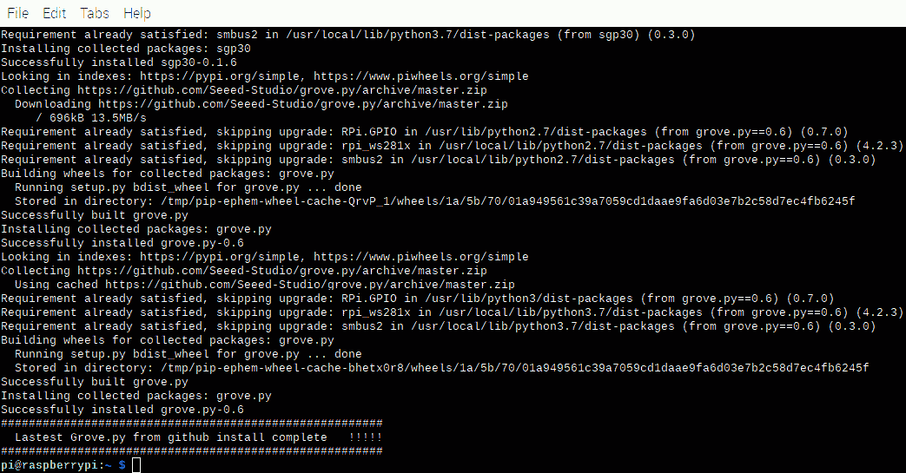

    图 5.4 -成功安装 grove.py

3.  The next step is to enable ARM I2C. We can do this by executing the following command:

    **$ sudo raspi-config**

4.  After executing the command, you will see the following configuration window. Please select **Interfacing Options**:

    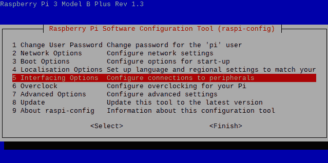

    图 5.5 -软件配置工具

5.  Select **I2C**:

    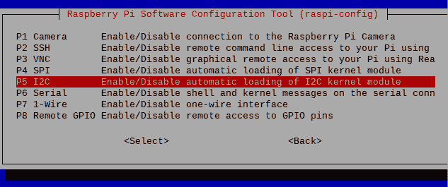

    图 5.6 -启用 I2C

6.  一旦您选择它，一个**您希望 ARM I2C 接口被启用吗? 消息将显示在同一个窗口中。 请选择**Yes**接受。**

现在您已经成功地启用了 I2C。 重新启动树莓派并重新启动 Node-RED 流编辑器。 这样，您的树莓派就可以使用 I2C 接口了，下一步，我们需要通过 I2C 接口连接传感器设备和树莓派。

# 在边缘设备上使用物联网

现在让我们以为例，研究物联网中的边缘设备。

物联网最近已被多个行业采用，例如，天气预报和农业领域; 然而，基本的组成是相同的。 边缘设备获取的各种数据被发送到服务器端平台，如云，数据在服务器端处理和可视化，资源丰富。 有多种可视化方法，但在最简单的情况下，将必要的数据值作为标准输出输出到日志。

在本章中，我想考虑物联网用例中的边缘设备部分。 这是关于处理使用传感器模块获取的传感器数据，然后将其发送到服务器端进行格式化和缩小范围。

有哪些不同种类的传感器?

以下传感器通常用于物联网的实验水平:

*   温度
*   湿度
*   陀螺仪(加速度、角速度)
*   光
*   声音
*   压敏
*   磁

在这里，我们将考虑使用光传感器和温度/湿度传感器将获取的值输出到日志的用例。

为了获取传感器数据，你需要一个设备。 在这个 sample flow (application)中，我们使用了 Raspberry Pi，但是它没有传感功能，因为它只是一个基础。 使用老式的电路板，你必须焊接传感器设备/模块，但树莓派的便利之处在于，有许多传感器模块套件，可以通过一次触摸连接。

如前所述，我们将使用 Seeed 提供的 Grove 系列，该系列包含树莓派的传感器模块和连接板:[https://wiki.seeedstudio.com/Grove_Base_Hat_for_Raspberry_Pi/](https://wiki.seeedstudio.com/Grove_Base_Hat_for_Raspberry_Pi/)

让我们为树莓派模块准备 Grove Base HAT。

重要提示

如果你没有树莓派的 Grove Base HAT，但想运行本教程，请通过官方网站([https://www.seeedstudio.com/Grove-Base-Hat-for-Raspberry-Pi.html](https://www.seeedstudio.com/Grove-Base-Hat-for-Raspberry-Pi.html))购买。

这是树莓派的 Grove Base HAT 的样子:

图 5.7 -树莓派的 Grove Base HAT

我们需要将Grove Base HAT 和传感器模块连接到树莓派上。 要做到这一点，请遵循以下步骤:

1.  Place the Grove Base HAT on your Raspberry Pi and screw it in:

    

    图 5.8 -在树莓派上设置 Base HAT

    这是什么 Grove - Light Sensor v1.2 - LS06-S 光电晶体管看起来像:

    

    图 5.9 - Grove - Light Sensor v1.2

    您可以从[https://www.seeedstudio.com/Grove-Light-Sensor-v1-2-LS06-S-phototransistor.html](https://www.seeedstudio.com/Grove-Light-Sensor-v1-2-LS06-S-phototransistor.html)中获得。

2.  Connect the Grove light sensor to the analog port of your Base HAT:

    

    图 5.10 -连接光传感器到 Base HAT

    重要提示

    请小心! 这个供应商，**Seeed，**有一个类似的模块用于温度/湿度传感器**SHT35**，但是 Grove Base HAT 节点不支持它。 你需要使用**SHT31**。

    这是 Grove - Temperature&湿度传感器(SHT31)的样子:

    

    图 5.11 - Grove -温湿度传感器(SHT31)

    您可以从[https://www.seeedstudio.com/Grove-Temperature-Humidity-Sensor-SHT31.html](https://www.seeedstudio.com/Grove-Temperature-Humidity-Sensor-SHT31.html)获取。

3.  将Grove 温湿度传感器连接到 Base HAT 的 I2C 端口:

图 5.12 -连接温度/湿度传感器到你的 Base HAT

就是这样。 现在你的设备已经设置好了，我们准备好进行下一步了! 在这一部分中，我们学习了物联网边缘设备的流行的、简单的用例，接下来，我们将为这些用例制作一个流程。

# 制作样品流

在本节中，我们将在 Node-RED 流编辑器中创建这两个传感器数据输出流。

您将使用准备好的传感器模块来收集数据并创建一个示例流，以便在 Node-RED 上可视化数据。 通过使用两个不同的传感器模块，我们可以学习 Node-RED 中数据处理的基础知识。

## 用例 1 -光传感器

第一个是轻传感器。 让我们创建一个流(应用程序)来检测光，并将定点观测到的值输出到日志中:

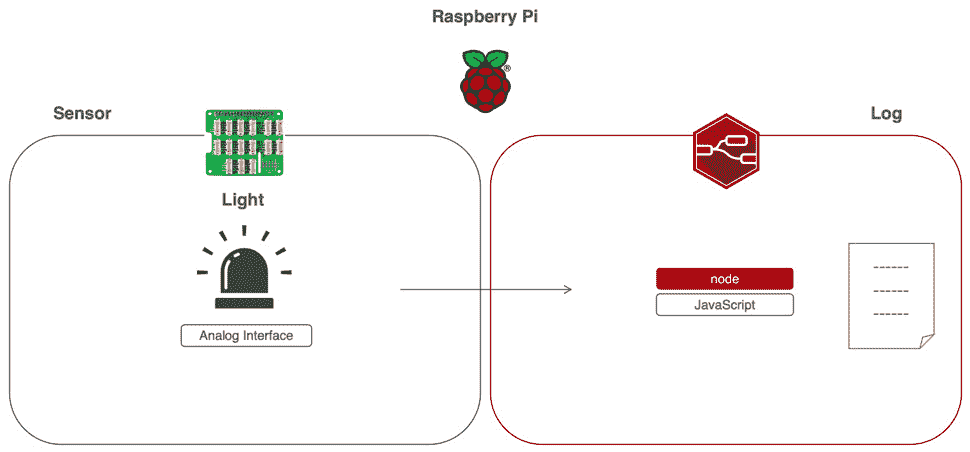

图 5.13 -用例 1 -获取光传感器数据

将光传感器模块连接到树莓 Pi 上，使用树莓Pi 上的 Node-RED 流编辑器将得到的数据作为标准输出输出。

## 用例 2 -温湿度传感器

第二个是温湿度传感器。 让我们创建一个应用程序(流)来检测温度和湿度，并将定点观测检测到的值输出到日志中:

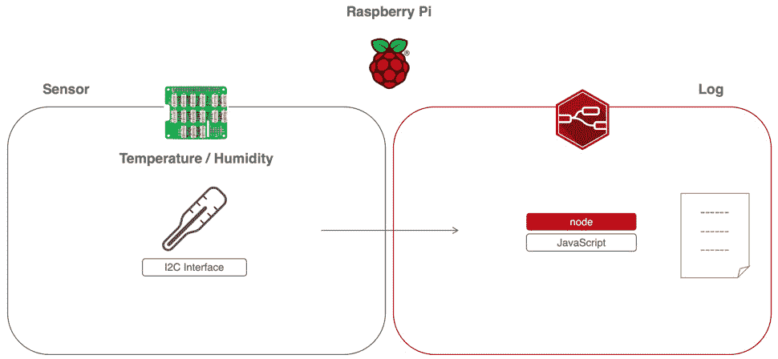

图 5.14 -用例 2 -获取温度/湿度数据

将温湿度传感器模块连接到树莓 Pi 上，使用树莓 Pi 上的 Node-RED 流量编辑器将获取的数据作为标准输出。

如果您想要在您的设备上对这两个用例进行现场测试，您需要连接一个可以用来获取传感器数据的传感器。

您可能需要在创建流之前做好准备。

这一次，我们将使用 Grove Base HAT，它很容易与树莓派一起使用，因为这个设置是在上一步中完成的，我们准备访问树莓派的数据。 然而，我们还没有准备 Node-RED。 如果将 Node-RED 作为默认值，则很难访问此数据。 一种方法是使用 Function 节点并从头开始编写脚本，这非常困难，但并非不可能。

为了处理 node - red 上树莓派识别的传感数据，需要一个专用于 Grove Base HAT 的“节点”。

好消息是，您可以立即开始使用该节点。 这是因为 Seigo Tanaka, node - red 用户组日本董事会成员([https://nodered.jp/](https://nodered.jp/)，node - red 贡献者，已经为 Grove Base HAT 创建并发布了一个节点。 这是树莓派的Grove Base HAT 的节点:

node-red-contrib-grove-base-hat

你可以在这里阅读更多信息:[https://www.npmjs.com/package/node-red-contrib-grove-base-hat](https://www.npmjs.com/package/node-red-contrib-grove-base-hat)。

如果你需要复习一下关于如何安装节点的节点上图书馆出版,请阅读*从图书馆得到几个节点*在[*第四章*](04.html#_idTextAnchor051),*学习的主要节点。*

 *我建议您回到这里的原因是，下一步是将 Grove Base HAT 的节点从库安装到环境中。

让我们在 node - red 流编辑器中启用这个 Grove Base HAT 节点:

1.  Click the menu at the top right and select **Manage palette** to open the settings panel:

    

    图 5.15 -选择 Manage 调色板

2.  When the settings panel is opened, type the name of the node you want to use in the search window. We want to use **node-red-contrib-grove-base-hat**, so please type the following:

    林基地

3.  After that, you can see the **node-red-contrib-grove-base-hat** node in the search window. Click the **Install** button:

    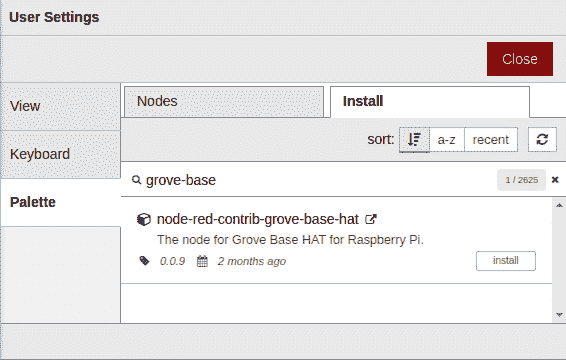

    图 5.16 -安装 node-red-contrib-grove-base-hat 节点

4.  在单击**Install**按钮后，您将看到一条消息，要求您阅读文档以找到有关此节点的更多信息。 如果有必要，请阅读文档，然后单击消息框上的**安装**按钮:

图 5.17 -读取节点文档的消息窗口

现在，您可以为 Grove Base HAT 使用节点了。 检查流编辑器中的面板。 在调色板的底部，你可以看到 Grove Base HAT 节点已经被添加:

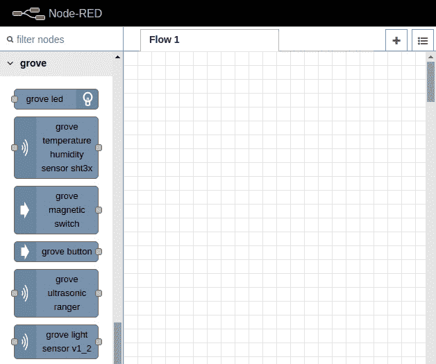

图 5.18 -仪表板上的 Grove Base HAT 节点

有许多传感模块可以连接到 Grove Base HAT。 这一次，只使用光和温度/湿度传感器，但通过观察节点的类型可以看到其他东西。

这里创建的两个用例所遵循的过程也可以应用于使用其他传感器。 如果您有兴趣，请尝试其他传感器。 在下一节中，我们将为用例 1 创建一个流。

## 为用例 1 -光传感器制作流程

在用例 1 中，Node-RED可以将光传感器获得的照度作为 JSON 数据处理。 这些数据可以作为 JSON 数据处理，然后发送到服务器端，并且可以在边缘设备上轻松执行各种处理。

从光传感器获取的值由 Node-RED 接收，输出为调试日志(标准输出)。 我们可以使用以下步骤设置它:

1.  Select the **grove light sensor v1_2** node from the palette on the left side of the flow editor and drag and drop it into the workspace to place it:

    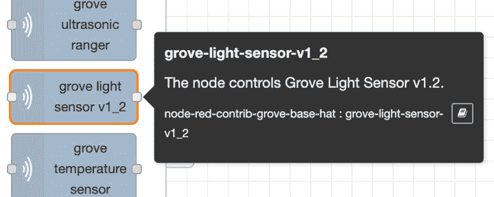

    图 5.19 -格罗夫光传感器 v1_2

    该节点允许传感器设备的值(通过 Grove Base HAT 在树莓派上连续获取)作为 JSON 格式消息对象在 node - red 上处理。

2.  After placing the **grove-light-sensor-v1_2** node, place the **inject** node and **debug** nodes and wire them so that the **grove-light-sensor-v1_2** node you placed is sandwiched between them:

    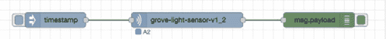

    图 5.20 -放置节点并连接光传感器

3.  接下来，检查**凹槽-光传感器-v1_2**节点的设置。 双击节点打开设置面板。
4.  There is a selection item called **Port** in the settings panel. **A0** is selected by default.

    此**Port**设置指定 Grove Base HAT 上的哪个连接器从所连接的模块获取数据。

5.  Earlier, we connected the Grove light sensor to the Grove Base HAT. If the connection is made according to the procedure in this tutorial, it should be connected to port A2, so select **A2** as the node setting value. If you are connecting to another port, select the port you are connecting to:

    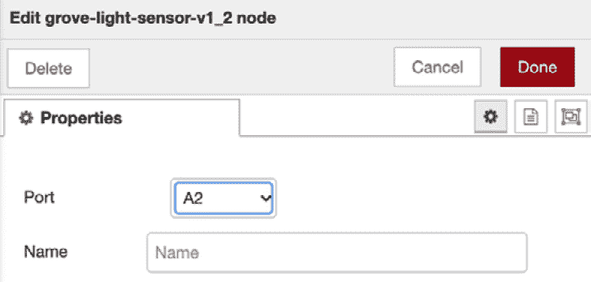

    图 5.21 -如果将传感器连接到 Base HAT 的 A2，则选择 A2 作为端口

6.  After checking and setting **Port** on the settings panel, click the **Done** button in the upper-right corner to close the settings panel.

    就是这样! 不要忘记单击**部署**按钮。

您应该记住如何从注入节点执行流，因为您已经在前一章中了解了这一点。 单击注入节点上的开关运行流程。 当开关被点击的时间数据被输出为一个日志，所以请尝试点击它几次。

重要提示

不要忘记显示调试窗口，以显示获取数据的值将输出到调试窗口。 即使激活了调试输出，Node-RED 也不会自动显示调试窗口。

**调试**窗口的结果输出如下所示:

图 5.22 -光传感器流量结果

您可以看到结果被输出到**调试**窗口。

恭喜你! 这样，我们就成功地创建了一个基本的流程(应用程序)，它处理我们的第一个光传感器的值与 Node-RED。

您也可以在这里下载此流定义文件:[https://github.com/PacktPublishing/-Practical-Node-RED-Programming/blob/master/Chapter05/light-sensor-flows.json](https://github.com/PacktPublishing/-Practical-Node-RED-Programming/blob/master/Chapter05/light-sensor-flows.json)。

## 为用例 2 -温湿度传感器制作流量

在用例 2 中，可以使用 Node-RED处理从温湿度传感器获取的温度和湿度的 JSON 数据。 这些数据可以作为 JSON 数据处理，之后可以发送到服务器端，并且可以在边缘设备上轻松地执行各种处理。

由温湿度传感器获取的值由 Node-RED 接收，输出为调试日志(标准输出):

1.  Select the **grove temperature humidity sensor sht3x** node from the palette on the left side of the flow editor and drag and drop it into the workspace to place it:

    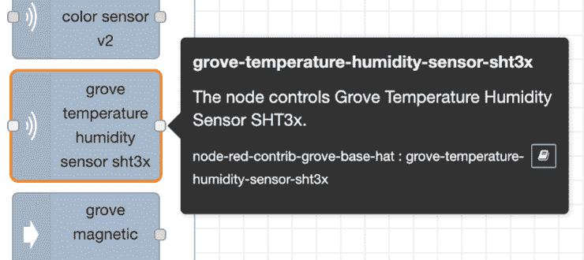

    图 5.23 -树丛温度湿度传感器 sht3x

    该节点允许通过 Grove Base HAT 在树莓派上持续获取的传感器设备的值作为 JSON 格式消息对象在 node - red 上处理。

2.  After placing the **grove-temperature-humidity-sensor-sht3x** node, place the **inject** and **debug** nodes, respectively, and wire them so that the **grove-temperature-humidity-sensor-sht3x** node you placed is sandwiched between them:

    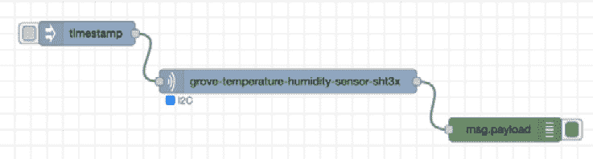

    图 5.24—温湿度传感器节点布放及接线

3.  Next, check the settings of the **grove-temperature-humidity-sensor-sht3x** node and double-click the node to open the settings panel.

    实际上，该节点没有需要设置的值(严格地说，可以设置名称，但是否设置该设置并不影响操作):

    

    图 5.25 -已设置为 I2C 端口

    在设置面板上可以看到端口被指定为**I2C**(不可更改)。 如果您已按照本文档的操作步骤将格罗夫温湿度传感器连接到格罗夫 Base HAT 上，则应将模块正确连接到**I2C**接口上。 如果连接的端口不是 I2C，请重新连接。

4.  After checking **Port** on the settings panel, click the **Done** button in the upper-right corner to close the settings panel.

    就是这样! 不要忘记单击**部署**按钮。

5.  Click the switch on the inject node to run the flow. The data for the timing when the switch is clicked is outputted as a log, so please try clicking it a couple of times.

    重要提示

    如前一节所述，不要忘记显示调试窗口，以显示获取的数据的值将是调试窗口的输出。 即使激活了调试输出，Node-RED 也不会自动显示调试窗口。

**调试**窗口的结果输出如下所示:

图 5.26—温湿度传感器流量检测结果

您可以看到结果被输出到**调试**窗口。

恭喜你! 这样，我们就成功地创建了一个基本流程(应用程序)，它处理第二个样本的值，即温度/湿度传感器，使用 Node-RED。

您也可以在这里下载此流定义文件:[https://github.com/PacktPublishing/-Practical-Node-RED-Programming/blob/master/Chapter05/light-sensor-flows.json](https://github.com/PacktPublishing/-Practical-Node-RED-Programming/blob/master/Chapter05/light-sensor-flows.json)。

做得好! 现在您已经学习了如何处理 Node-RED 上的亮度传感器和温湿度传感器 JSON 格式的数据。

# 小结

在本章中，您学习了如何通过将 Node-RED 与实际物联网用例进行比较来创建示例流(应用程序)。 我们体验了使用传感器模块和树莓派与 Node-RED 交换数据，所以我们有了物联网的感觉。

这里创建的流程步骤将帮助您在未来使用边缘设备中的其他传感器模块创建不同的流程。

在下一章中，我们将像这次一样使用物联网用例，但我们将在云端(服务器端)创建一个实际示例流(应用程序)。**