# 七、从 Node-RED 调用 Web API

在本章中，让我们从 Node-RED 中调用一个 web API。 基本上，在 Node-RED 中，处理按照创建的流执行，但连接处理的是 JSON 数据。 从这个意义上说，它与 web api 非常兼容。

让我们从以下四个主题开始:

*   了解 RESTful API
*   了解节点的输入/输出参数
*   如何在一个节点上调用 web API
*   如何使用 IBM Watson API

到本章结束时，你将掌握如何从 Node-RED 中调用任何类型的 web API。

# 技术要求

要读完本章，你需要具备以下条件:

*   Node-RED (v1.1.0 或以上版本)

本章使用的代码可在**第 07 章**文件夹[https://github.com/PacktPublishing/-Practical-Node-RED-Programming](https://github.com/PacktPublishing/-Practical-Node-RED-Programming)中找到。

# 了解 RESTful API

阅读这本书的许多人可能已经熟悉了 web api。 然而，让我们回顾一下 RESTful API，以便使用 Node-RED 调用 web API。

**REST**代表**具象状态转移**。 RESTful API 基本上是指基于“REST 原则”实现的 web 系统的 HTTP 调用接口。 因此，从广义上讲，可以放心地说 REST API 和 RESTful API 是一回事。 那么，究竟什么是 RESTful API 呢? 在本节中，我们将学习 RESTful API 的概述和原则，以及使用 RESTful API 的优点和缺点。

REST 是由 Roy Fielding 提出的，他是 HTTP 协议的创建者之一，大约在 2000 年左右，它是一组(或思维方式)设计原则，适用于在构建分布式应用时链接多个软件。 此外，RESTful API 是根据以下四个 REST 原则设计的 API:

*   **可寻址性**:具有属性，能够通过 URI 直接指向资源。 所有信息都应该用唯一的 URI 表示，这样您就可以一目了然地看到 API 版本、是否获取数据、是否更新等等。
*   **无状态**:所有 HTTP 请求必须完全分离。 不应该执行会话等状态管理。
*   **连接性**:这是指在一段信息中包含“到其他信息的链接”的能力。 通过包含一个链接，你可以“连接到其他信息”。
*   **统一接口**:所有信息获取、创建、更新、删除等操作均采用 HTTP 方式。 在本例中，HTTP 方法是获取(“GET”)、创建(“POST”)、更新(“PUT”)和删除(“DELETE”)。

这就是四个原则。 从这四个原则中可以看出，REST 的一个主要特性是它更有效地利用了 HTTP 技术，并且与 web 技术有很高的相关性。 因此，它目前被用于开发各种 web 服务和 web 应用。

随着最近智能手机的广泛使用，商业系统不仅可以在个人电脑上使用，还可以在移动设备上使用，这一点变得越来越明显。 此外，用户不会选择一个系统，而是选择一个可以与多个系统和各种 web 服务链接的系统。 作为解决这些问题不可或缺的工具，RESTful api 正受到广泛关注。

如下图所示，web API 可以在任何地方通过互联网调用:

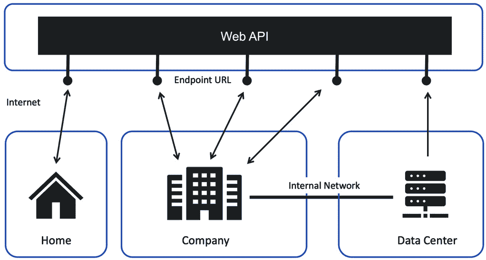

图 7.1 - RESTful API 图

现在，让我们回想一下什么是 Node-RED。 它的工作流工具风格就像一个独立的工具，但 Node-RED 当然也是一个 web 应用。 换句话说，它是一个能够很好地使用本文描述的 RESTful API 的应用。

接下来，让我们再次讨论 Node-RED 节点具有哪些类型的参数。

# 了解节点的输入输出参数

Node-RED 所拥有的许多节点中，适合调用 web api (REST api)的节点并不多。 调用 web API 时使用的一个典型节点是**http 请求**节点。

要在 node - red 上调用外部 API，只需将 API 的端点 URL 设置为**http 请求**节点的 URL 属性。

例如，当调用 API 时需要在端点 URL 中设置一个参数时，可以设置之前连接的节点的输出值。 这个方法很简单。 您可以在参数的值设置部分设置**{{payload}}**变量，而不是字符串字面量。

在**{{payload}}**中，输入从前一个处理节点继承的字符串。

举个例子(注意这个 URL 不存在):**http://api-test.packt.com/foo?username={{payload}}&format=json**:

图 7.2 -使用{{payload}}作为参数设置 API 端点 URL

**http 请求**节点的进程不能单独由**http 请求**节点执行。 在**http 请求**节点之前，有必要连接触发进程，例如**inject**节点。 此时，如果您想传递一个参数给 API 调用，即**http 请求**节点，请在**msg 中设置它。 有效载荷**。

如果您想调用的 API 在 http 请求**节点**,JSON 数据被包含在请求将由创造满意作为请求参数的预处理节点,将它存储在**味精。 有效负载**，并将其连接到**http 请求**节点。****

 ****通过使用这样的**http 请求**节点，可以轻松实现 API 协作。 API 调用对于链接 Node-RED 上的多个服务非常重要。 例如，node - red 的**函数**节点基本上是由 JavaScript 处理的，但通过将使用其他开发语言(如 Java)开发的程序转换为 API，就可以通过从 node - red 调用来使用它。

# 如何调用节点上的 web API

到目前为止，我们已经了解了什么是 RESTful API，以及哪个节点适合 API 调用。

在本部分中，让我们创建一个实际从 Node-RED 调用 API 的流，并学习如何调用 API 以及如何处理来自 API 的结果值。

首先要考虑一些事情，比如要调用哪个 API。 幸运的是，互联网上发布了各种 api。

这一次，我想使用 OpenWeatherMap API。 例如，在 OpenWeatherMap 中，为数据采集准备了以下 api:

*   当前的气象数据
*   4 天每小时预测
*   16 天每日预报
*   30 天气候预报
*   天气预警
*   和更多的……

更多信息请访问 OpenWeatherMap 官方网站:[https://openweathermap.org/](https://openweathermap.org/)。

好的，让我们准备使用 OpenWeatherMap API。

## 创建帐号

要使用 OpenWeatherMap API，我们需要创建一个帐户。 请访问以下网址:[https://openweathermap.org/](https://openweathermap.org/)。

如果您已经有一个帐户，请登录不采取以下步骤。

首次使用的用户，请点击**登录**按钮，然后点击**创建账户**链接。 很容易注册。 注册后，只要遵循 OpenWeatherMap 的指导并确认发送给您的邮件即可。 这是什么创建一个帐户页面看起来像:

图 7.3 -创建 OpenWeatherMap 帐户

接下来，让我们创建一个 API 密钥。

## 创建 API 密钥

当你登录到 OpenWeatherMap，你可以看到**API 按键**选项卡，所以请点击它。 你已经有了一个默认的 API 密钥，但是请为本教程创建一个特定的 API 密钥。 输入任意字符串并单击**Generate**按钮。

请注意，本书中显示的 API 键是由我创建的一个示例，不能使用。 确保在你的帐户中创建一个新的 API 密钥:

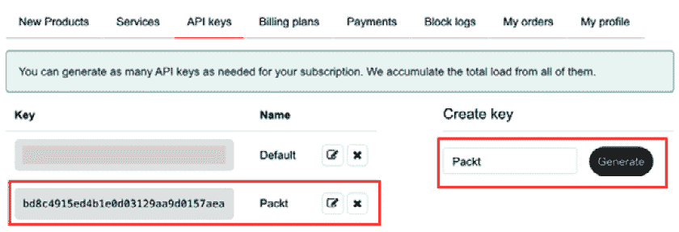

图 7.4 -生成 API 密钥

重要提示

在创建 API 密钥之后，密钥将在 10 分钟到几个小时内不会被激活。 如果当您访问下一节中描述的 API 端点 URL 时返回一个 web 响应错误，例如 401，那么指定的 API 键可能还没有被激活，因此请等待并重试。

## 检查 API 端点 URL

要检查你的 API 端点 URL，遵循以下步骤:

1.  点击菜单栏上的**API**按钮。 你可以在那里看到一些 api。
2.  In this tutorial, we will use **Current Weather Data**, so please click the **API doc** button under **Current Weather Data**:

    

    图 7.5 -打开当前天气数据的 API 文档

3.  This API has some types of parameters such as **By city**, **By city ID**, **By zip code**, and so on. Please select **By city name** with the parameter city name and API key.

    **API doc**、**城市名称**、**州代码**、**国家代码**均来源于 ISO 3166。 **API 调用**区域下的 url 是使用此 API 的端点 url。 请将此网址复制到剪贴板:

图 7.6 -带有参数的 API 端点 URL

接下来，让我们看看是否可以运行这个 API。

## 检查 API 是否可以运行

让我们尝试使用这个 API。 您只需要打开浏览器，粘贴 URL，并将城市名称和 API 密钥替换为您的。 你可以选择任何城市名称，但是 API 键是你在前面部分创建的特定的一个:

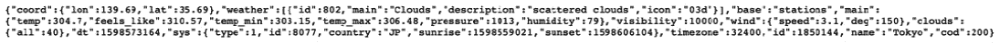

图 7.7 -调用 API 并获得结果

我现在已经确认这个 API 工作正常。 现在让我们从 Node-RED 调用这个 API 并使用它。

## 创建调用 API 的流

现在，让我们创建一个调用 Node-RED 上 OpenWeatherMap API 的流。 在您的环境中启动 Node-RED。 您可以在 IBM 云上使用独立 Node-RED 或 Node-RED:

图 7.8 -使用 API 的流程

为此，流程非常简单，易于制作。 请按照以下步骤进行流程:

1.  在调色板上放置一个**注入**节点和两个**调试**节点。 这些节点可以作为默认节点使用。 这里不需要更改设置。
2.  Place the **http request** node on the palette, then open the settings panel of the **http request** node and set the API endpoint URL with your parameters (city name and API key) in the **URL** textbox of the settings panel, as shown in the following figure:

    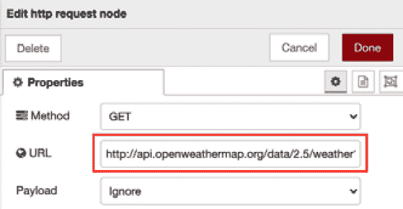

    图 7.9 -使用参数设置 API 端点 URL

3.  Place a **json** node on the palette. This node can be used with the defaults. No changes in the settings are required here. But, just in case, let's make sure that the **Action** property of the **json** node is set to **Convert between JSON String & Object**. This is an option that will convert the JSON data passed as the input parameter into a JavaScript object:

    

    图 7.10 -检查 Action 属性

4.  Wire all nodes as shown in the following figure:

    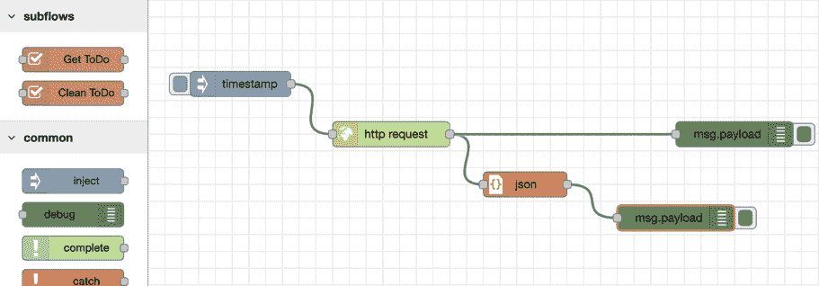

    图 7.11 -连接所有节点

    请连接时间戳节点和 http 请求节点。 **http 请求**节点输出连接到**json**节点和**调试**节点。 最后，请将**json**节点输出连接到另一个**调试**节点。

5.  完成所有节点的设置和接线后，需要部署并单击**inject**节点的开关。 您现在可以在右侧面板的 debug 窗口中看到数据:

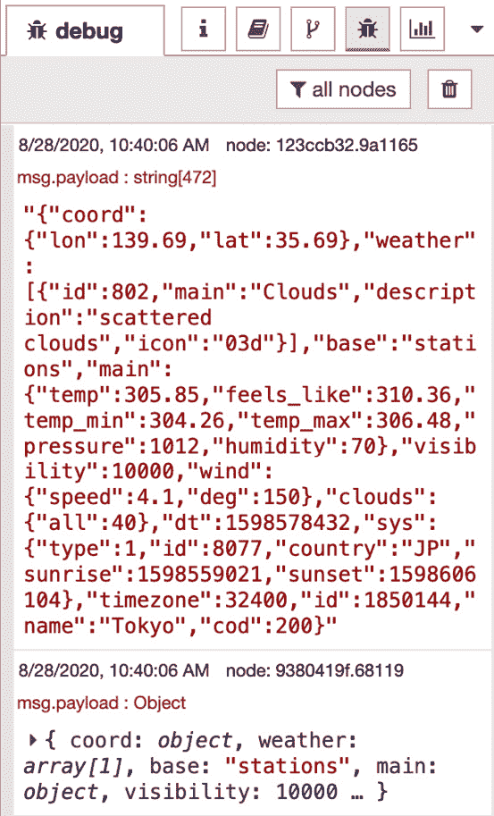

图 7.12 -调试窗口上的结果数据(JSON

你也可以在同一个**调试**窗口中看到 JSON 对象的结果数据，如下截图所示:

图 7.13 -调试窗口上的结果数据(对象

恭喜你! 通过调用 OpenWeatherMapAPI，您已经成功地创建了一个示例流。 如果您没有完全成功地创建此流，您也可以在这里下载此流定义文件:[https://github.com/PacktPublishing/-Practical-Node-RED-Programming/blob/master/Chapter07/open-weather-flows.json](https://github.com/PacktPublishing/-Practical-Node-RED-Programming/blob/master/Chapter07/open-weather-flows.json)。

在下一节中，我们将了解在 IBM Cloud 上使用 IBM Watson API 和 Node-RED 的便利性。

# 如何使用 IBM Watson API

在前面的部分中，您了解了如何调用 API 并处理来自 API 的结果值。

在本节中，我们也将创建一个实际从 Node-RED 调用 API 的流，但是我们将学习如何调用 IBM 提供的 Watson API。 我们还将创建一个实际从 Node-RED 调用 API 的流，但是我们将学习如何调用 IBM 提供的 Watson API。

为什么华生? 沃森是 IBM 提供的人工智能服务和 api 品牌。

所有沃森 api 都可以从 IBM Cloud 使用。 因此，通过在 IBM Cloud 上运行 Node-RED，您可以有效地使用 Watson 的服务。 这有一些优点，比如当从 Node-RED 调用 Watson API 时，可以省略身份验证的实现。

沃森可以从 IBM Cloud 以外的环境调用，因此它可以直接从树莓派调用，也可以从 AWS 和 Azure 等云平台或本地环境中使用。 请看下图，显示了沃森 API 的样子:

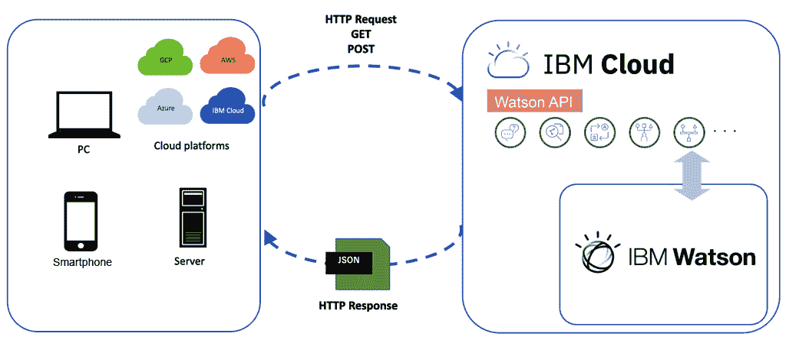

图 7.14 -沃森 API 图

更多信息请参见 IBM Watson 官方网站:[https://www.ibm.com/watson](https://www.ibm.com/watson)。

好的，让我们看看在 IBM Cloud 上 Node-RED 上使用 Watson API 有多容易。

## 登录 IBM Cloud

如果您遵循了第一章中的步骤，那么您应该已经有了一个 IBM Cloud 帐户。 只需登录 IBM Cloud([https://cloud.ibm.com](https://cloud.ibm.com))。

如果您没有 IBM Cloud 帐户，请从下面的 URL 创建一个帐户并登录到 IBM Cloud。 参见[*第六章*](06.html#_idTextAnchor073)，*在云中实现 Node-RED*，详细说明:[http://ibm.biz/packt-nodered](http://ibm.biz/packt-nodered)。

## 在 IBM 云上启动 Node-RED

在前面的小节中，我们使用 IBM Cloud 上的独立 Node-RED 或 Node-RED 创建了一个示例流。 当然，您可以使用 Node-RED 的独立版本来调用 Watson API，但是这样会失去一些好处。 因此，我们将在本部分中使用 IBM Cloud 上的 Node-RED。

和前面的步骤一样,如果你没有使用 Node-RED IBM Cloud,请回到[*第六章*](06.html#_idTextAnchor073),*在云中实现 Node-RED*,并运行通过激活 Node-RED 在 IBM 云在继续下一步之前。

## 创建沃森 API

接下来，在 IBM 云上创建 Watson 的服务。 严格地说，这意味着创建一个实例作为服务，这样您就可以调用 IBM Cloud 上提供的 Watson API 服务作为您自己的 API。

Watson 有几个 api，比如声音识别、图像识别、自然语言分析、情感分析等等。 这一次，我想使用情感分析 API。

按照以下步骤创建沃森音调分析仪 API 服务:

1.  Search for Watson from the catalog. On the dashboard, please click the **Catalog** menu item and search for **tone analyzer**, and then select the **Tone Analyzer** panel:

    

    图 7.15 -搜索 Watson 服务

2.  Please refer to the following list and *Figure 7.16* to fill in each property:

    a.**地区**:**达拉斯**(您可以选择任何地区，但推荐达拉斯)

    b.**定价方案**:**Lite**(免费定价)

    c.**服务名称**:**默认**(您可以将其修改为您想要使用的任何名称)

    d.**资源组**:**默认**(Lite 帐号不能选择其他选项)

    e.**标签**:无

3.  After entering/selecting all the properties, click the **Create** button:

    

    图 7.16 -创建音调分析器服务

4.  You can see the status as **Active** on the **Tone Analyzer** instance dashboard when it is created and activated. Please check the API key and URL. API keys and URLs are used when the API is called from any application. However, these are not used in this tutorial because Node-RED on IBM Cloud can call the Watson API without authentication coding.

    您可以在这个屏幕上的**管理**菜单中查看 API 键和 URL:

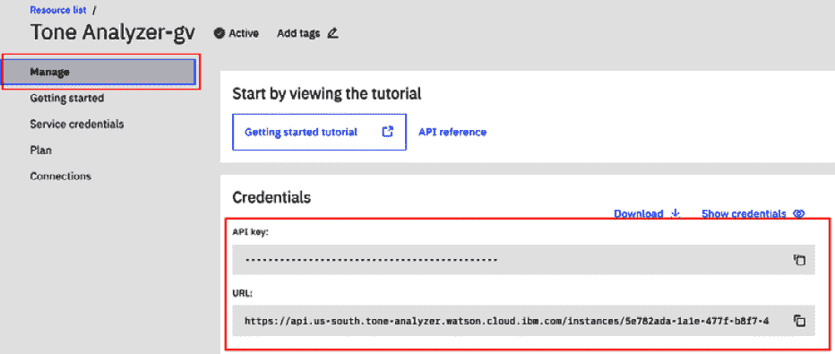

图 7.17 -检查您的凭证

在下一节中，我们将连接 Node-RED 和 Tone Analyzer 服务。

## 连接 Node-RED 和音调分析器服务

正如你已经知道的，Node-RED 可以调用 Watson API 而无需编码进行身份验证。 在使用 Node-RED 和 Watson API 之前，我们需要连接 Node-RED 和 Watson API 实例。 在最后一步中，我们创建了**Tone Analyzer**API 实例，所以让我们将这两个实例连接起来，如下所示:

1.  单击左上角的**IBM Cloud**标志按钮，移动到主仪表板。
2.  点击**资源摘要**面板上的**查看全部**按钮。
3.  Click the Node-RED instance (application) name in the **Cloud Foundry apps** area:

    

    图 7.18 -选择您创建的 Node-RED 服务

4.  Click the **Connections** menu and then the **Create connection** button:

    

    图 7.19 -为 Node-RED 和 Watson 创建连接

5.  Check the **Tone Analyzer** service and click the **Next** button:

    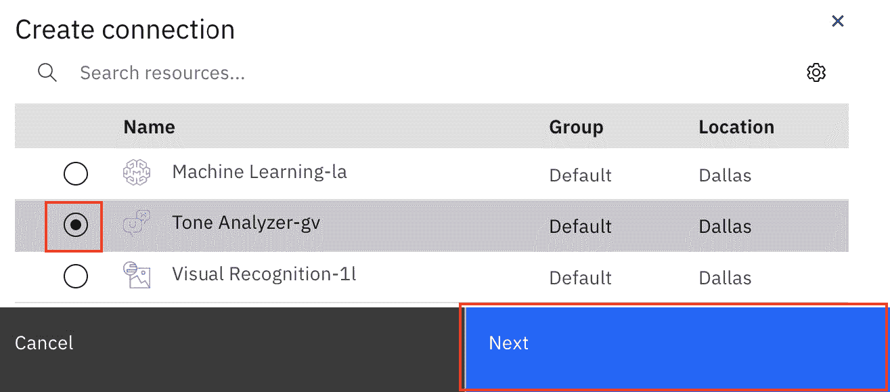

    图 7.20 -单击 Next 按钮选择连接的服务

6.  No modification is needed for the access role and service ID. Click the **Connect** button:

    

    图 7.21 -单击 Connect 按钮以完成连接

7.  We need to restage Node-RED to activate the connection. Click the **Restage** button:

    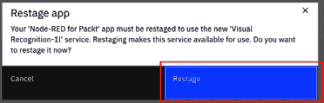

    图 7.22 -单击 Restage 按钮开始重新启动 Node-RED 服务

8.  请等待，直到重新启动 Node-RED 实例完成。 一旦完成，您将获得一个带有**Running**状态的成功连接。 然后，请通过**Visit App URL**链接打开 Node-RED 流编辑器:

图 7.23 -检查 Node-RED 服务的 Node.js 运行时状态

您已经成功地准备了 Node-RED 和 Watson API 流。 接下来，让我们通过调用 Tone Analyzer API 来创建流。

## 通过调用音调分析器 API 创建流

现在，让我们创建一个流，它调用 Node-RED 上的 Watson ToneAnalyzer API。 您已经在 IBM Cloud 上启动了 Node-RED。 可以使用 IBM Cloud 上的独立 Node-RED 或 Node-RED。

要继续本教程，您需要安装以下两个节点:

*   **node-red-node- Twitter**:获取 tweet 并向 Twitter 发送 tweet 的节点:

图 7.24 -安装 node-red-node-twitter

*   **node-red-node-sentiment**:这是一个在传递的**msg 中添加情绪对象的节点。 有效载荷**。 当将参数传递给沃森音调分析仪 API 时使用:

图 7.25 -安装 node-red-node-sentiment

在面板中搜索这些节点，并将它们安装到 Node-RED 流编辑器中。 然后，制作如下图所示的流程:

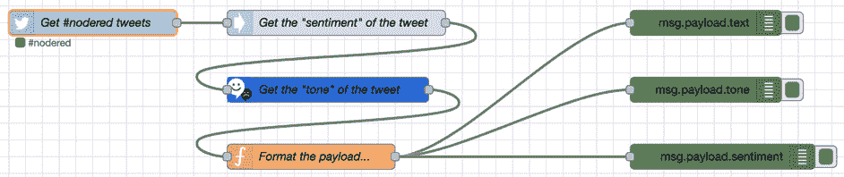

图 7.26 -使用音调分析器 API 的流程

在这个流中，函数节点处理从 Twitter 获得的结果值中包含的文本、音调和情绪，以便将它们作为单独的调试输出。 这是为了让结果更容易看到。

这个流比您在上一步中创建的流稍微复杂一些。 请按照以下步骤进行流程:

1.  创建一个 Twitter ID (Twitter 帐户)，并在您的 Twitter Developer 帐户上创建一个应用来验证通过您的 Twitter 帐户访问 tweet。
2.  Access **Overview** under **Projects & Apps** on Twitter Developer, and then click the **Create an app** button:

    

    图 7.27 -在 Twitter Developer 上创建应用

3.  Set the **App name** with any strings, and click the **Complete** button.

    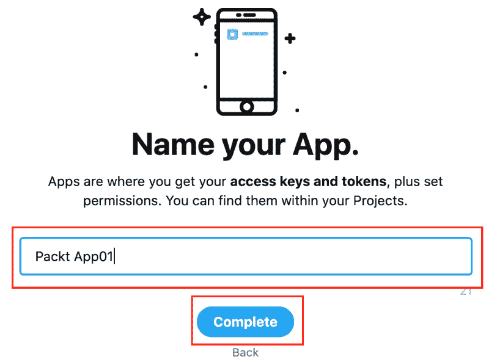

    图 7.28 -设置应用的名称

4.  After that, please check the **Access token & access token secret** area.

    你会看到标记。 请注意并保存您的访问令牌和访问令牌秘密。 这些也将用于节点的**twitter 设置:**

    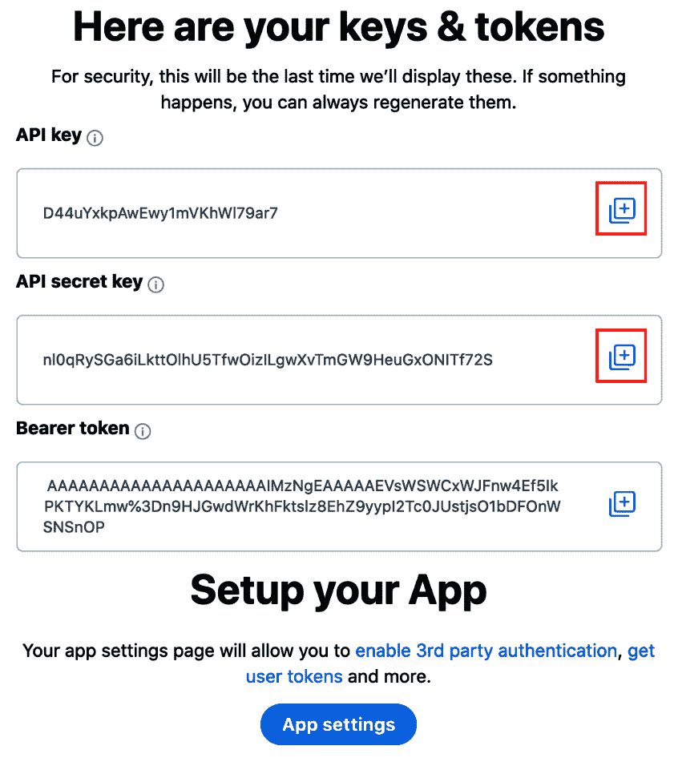

    图 7.29 -注意你的令牌和令牌秘密

5.  Place the **twitter in** node on your workspace, and double-click it to open the settings window:

    

    图 7.30 -将 twitter 放置在节点中

6.  Click the edit (pencil icon) button on the settings window to edit your Twitter information:

    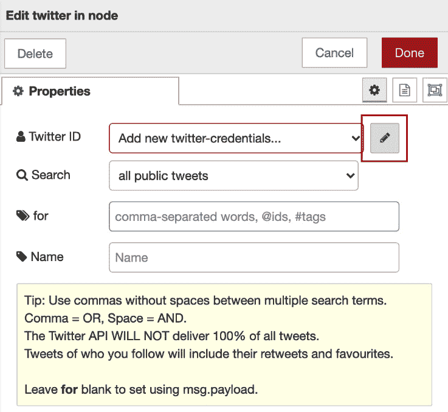

    图 7.31 -编辑 Twitter 属性

7.  Set your Twitter ID, API key, and token.

    **API key 的值**,**API 密匙秘密**,**访问令牌**,和**访问令牌的秘密应该来自你的文本编辑器【显示】步骤 8。**

8.  After setting these settings, please click the **Add** button to return to the main settings window of the **twitter in** node:

    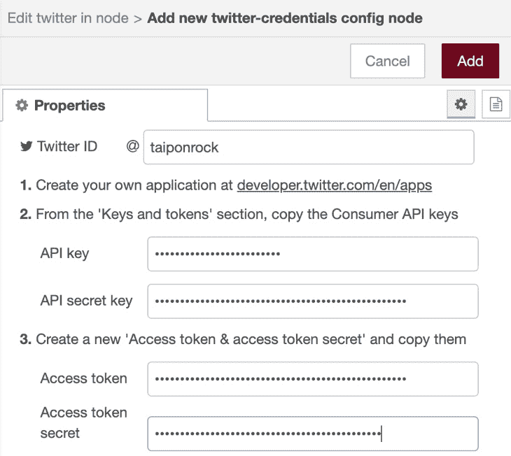

    图 7.32 -配置您的 Twitter 信息

9.  **搜索**，选择**所有的公众推文**，并将到**#nodered**作为标签。 可以为**name**设置任意名称。
10.  Finally, click the **Done** button to finish adding these settings and close the window:

    

    图 7.33 -完成节点中 twitter 的设置

11.  Place the **sentiment** node on your workspace. It will be wired after the **twitter in** node.

    对于该节点，不需要设置或更改任何属性:

    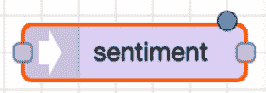

    图 7.34 -放置情感节点

12.  Place the **tone analyzer v3** node after the **sentiment** node sequentially on your workspace:

    

    图 7.35 -放置音调分析器 v3 节点

13.  Open the settings panel of the **tone analyzer v3** node and set the **Method** and **URL** properties as follows:

    a.**名称**:您希望名称的任意字符串

    b.**方法**:**一般音**

    c.**version_date**:**Multiple Tones**

    d.**声调**:**全部**

    :**True**

    f.**内容类型**:**文本**:

    

    图 7.36 -配置音调分析器 v3 节点属性

14.  Place the **function** node after the **tone analyzer v3** node sequentially on your workspace:

    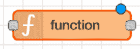

    图 7.37 -放置功能节点

15.  Open the settings panel of the **function** node and code JavaScript with the following source code:

    msg.payload = {

    “文本”:msg.payload,

    “语气”:msg.response,

    “人气”:msg.sentiment

    }；

    返回味精;

    **功能**节点的编码请参考以下截图:

    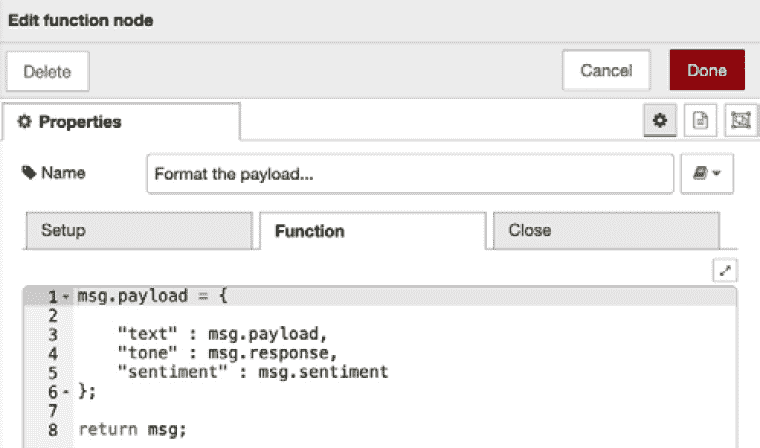

    图 7.38 -函数节点的 JavaScript 源代码

    您可以在这里获得代码:[https://github.com/PacktPublishing/-Practical-Node-RED-Programming/blob/master/Chapter07/format-payload.js](https://github.com/PacktPublishing/-Practical-Node-RED-Programming/blob/master/Chapter07/format-payload.js)。

16.  最后，在这个**功能**节点之后并行放置三个**调试**节点。 每个**调试**节点的设置如下:
    *   **msg.payload.text**:用于**debug**标签
    *   **msg.payload.tone**:用于**debug**标签
    *   **msg.payload.sentiment**: For the **debug** tab

        接线说明见*图 7.26*。 我们已经完成了流节点的配置。

## 测试流量

该流程现在已完成。 当您点击**deploy**按钮，节点的**twitter 使用您的账户连接到 twitter 时，该节点将自动检索符合您要求的 tweet 并进行后续流程处理。**

这是自动完成的，所以您不需要采取任何特殊操作。

在这里，它被设置为获取所有带有**#点**作为标签的 tweet。 如果您没有得到很多推文，这意味着没有创建包含指定标签的推文，所以请更改节点的**推文中设置的标签，然后重试。**

该流程的所有处理结果将显示在**debug**选项卡中。

**msg.payload.text**从获取的 tweet 中提取 tweet 正文并显示:

图 7.39 -获取 tweet 主体的结果

提取并显示获得的微博中检测到的情绪，为**msg.payload.tone**:

图 7.40 -推文语调分析结果

通过**msg.payload.sentiment**来判断获得的 tweets 中情绪是正面还是负面:

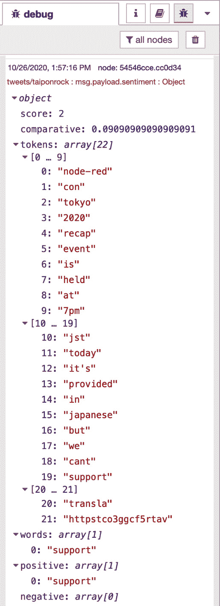

图 7.41 -推文情绪结果

恭喜你! 您已经通过调用 Watson API 成功地创建了一个示例流。 如果您没有完全成功地创建此流，您也可以在这里下载此流定义文件:[https://github.com/PacktPublishing/-Practical-Node-RED-Programming/blob/master/Chapter07/get-sentiment-twitter-flows.json](https://github.com/PacktPublishing/-Practical-Node-RED-Programming/blob/master/Chapter07/get-sentiment-twitter-flows.json)。

# 小结

在本章中，我们学习了如何创建一个调用两种类型 web api 的示例流(应用)。 我们逐渐习惯于创建复杂的流程。 调用 web api 的用例经常在 Node-RED 中找到。 我们在这里学到的流创建方法将帮助我们在将来创建更复杂的流。

在下一章中，让我们了解一个项目特性，它可以与诸如 GitHub 之类的存储库集成，这是 Node-RED 1.0 版本中添加的一个功能。****