# 八、在 Git 中使用项目特性

你将在本章学到的是一个非常有用的**项目**特性。 Node-RED 的项目特性是一种版本管理工具，在 Node-RED 流编辑器上使用 Git。 这实际上在默认情况下是禁用的。 启用此功能可以让您以一种新的方式管理流程。 我相信很多开发人员都熟悉 Git 服务，比如 GitHub 和 GitLab。 Node-RED 的项目特性使用 Git 和 GitHub 进行版本控制，所以我认为它很容易理解。

以下是我们将在本章中讨论的主题:

*   启用项目特性
*   使用 Git 存储库
*   连接远程存储库

在本章结束时，您将能够理解如何使用项目特性，如何将自己的 Git 存储库连接到 Node-RED 流编辑器，以及如何使用版本控制工具 Git 将流作为项目来管理。

在本章结束时，您将掌握如何使用项目特性并使用它制作应用。 你可以在任何托管的 Git 服务中使用它，比如 GitHub 或 GitLab。

# 技术要求

要在本章取得进展，你需要具备以下条件:

*   GitHub 账号，可以通过官方网站[https://github.com/](https://github.com/)创建。
*   一个 Git 客户端工具，需要通过官方网站:[https://git-scm.com/downloads](https://git-scm.com/downloads)进行安装。

# 启用项目特性

例如，如果您希望管理自己的流，同时与他人共享流，或者希望更新由他人创建的流，那么当团队仅使用 Node-RED 流编辑器时，就很难进行开发。

Node-RED 的项目函数是用于管理与每个流程相关的文件的方法/函数。 它涵盖了创建具有 Node-RED 可共享的应用所需的所有文件。

这是由 Git 存储库支持的。 也就是说，所有文件都是有版本的。 这允许开发人员与其他用户合作。

在 Node-RED 版本 1 上。 在配置文件**settings.js**中，项目特性在默认情况下被禁用，因此必须在**配置文件**中启用。

重要提示

在 Node-RED 的本地环境中创建项目时，到目前为止创建的流可能会被一个空白页覆盖。 您可以通过互联网下载本文档中创建的所有流的流配置 JSON 文件，但如果您自己创建的流在本地环境的 Node-RED 中存在，建议导出该流配置文件。

我们在本书中创建的所有流定义和 JSON 文件都可以在这里下载:[https://github.com/PacktPublishing/-Practical-Node-RED-Programming](https://github.com/PacktPublishing/-Practical-Node-RED-Programming)。

现在让我们试试项目功能。 我们将在 macOS 或 Windows 等本地环境中使用独立版本的 Node-RED。 为了使用项目特性，我们首先需要启用它。 让我们按照以下步骤启用它:

1.  It is necessary to rewrite the **settings.js** file to enable/disable the project function. Look for this file first. The **settings.js** file can be found in the Node-RED user directory where all of the user configurations are stored.

    默认情况下，在 Mac 上，该文件在以下路径下可用:

    **/Users/<User Name>/.node-red/settings.js**.js

    默认情况下，在 Windows 上，该文件在以下路径下可用:

    \ T0】c:\用户名<用户名>\ node-red\settings.js

2.  Edit the **settings.js** file. It is OK to open **settings.js** with any text editors. I have used **vi** here. Open **settings.js** with the following command:

    **$ vi /Users/<User Name>/.node-red/settings.js**

    重要提示

    请将该命令替换为特定于您的环境的命令。

3.  Edit your **settings.js** file and set the **projects.enabled** element to **true** in the **editorTheme** block within the **module.exports** block in order for the project feature to be enabled:

    module.exports = {

    uiPort: process env .港| | 1880 年,

    …

    **编辑主题:{**

    **项目:{**

    **enabled: true**

    【t】}【t】

    **}，**

    …

    ｝

4.  保存并关闭**settings.js**文件。
5.  Restart Node-RED to enable the settings we modified by running the following command:

    **$ node-red**

    我们现在已经成功地启用了 Node-RED 的项目特性。

要使用此特性，您需要访问 Git 和 ssh-keygen 命令行工具。 Node-RED 在启动时检查它们，并在任何工具丢失时通知您。

如果设置完成后没有任何问题，并且重新启动 Node-RED，那么项目特性将可用。 接下来，让我们设置要使用的 Git 存储库。

# 使用 Git 库

我们在前一节中启用了项目特性。 重新打开流编辑器，将提示您使用当时创建的流的内容创建您的第一个项目。 这将是欢迎界面:

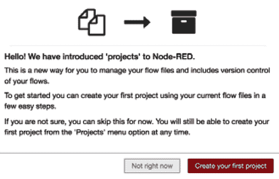

图 8.1 -欢迎屏幕

我们需要设置一个版本控制客户端，比如 Git。 如前所述，Node-RED 的项目函数使用 Git 作为版本控制工具。 与常规 Git 一样，您可以逐个项目地管理文件更改，并根据需要与远程存储库进行同步。

Git 会跟踪是谁进行了更改。 它与您的用户名和电子邮件地址。 用户名不一定是你的真实姓名; 你可以用任何你喜欢的名字。

如果您的本地设备已经配置了 Git 客户端，Node-RED 将查找这些设置。

首先，在本地环境中执行版本控制。 它利用了安装在本地环境中的 Git 客户机的特性。 如果没有安装 Git，请提前安装。

现在，按照下面的步骤在 Node-RED 流编辑器上创建一个项目:

1.  首先，让我们创建一个项目。 这很简单。 在项目创建窗口中输入项目名称和描述。
2.  Name the flow file. By default, it is already named **flow.json**.

    换句话说，Node-RED 自动将流编辑器上当前配置的流迁移到新项目中。 保留默认名称是可以的。 当然，如果您愿意，您可以选择在这里重命名它。

    如果您在公共站点(如 GitHub)上发布您的项目，那么加密您的凭证文件是一个好主意。

    如果选择加密，则必须创建一个用于加密的密钥。 此密钥不包含在项目中，因此如果您与他人共享项目，则需要向克隆项目的用户单独提供凭证文件解密密钥。

3.  After adding the required information, click the **Create Project** button:

    

    图 8.2 -项目界面

    恭喜你! 您已经创建了第一个项目。

4.  Next, check the project history. We can use the version control feature on our Node-RED flow editor. You can access the project history panel by clicking the **project history** button in the top-right corner:

    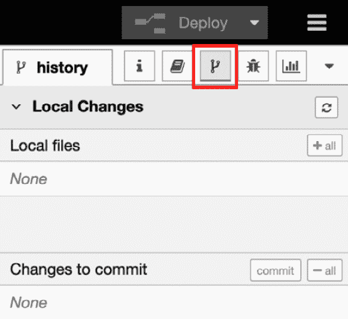

    图 8.3 -项目历史面板

5.  You can see no changed items on this panel. To check whether the change history feature is enabled, make a flow on this workspace.

    如果您是 Git 或 GitHub 的常规用户，您应该能够通过查看这个面板的结构来理解每个条目的含义和作用。 如果项目下的文件结构或内容发生了变化，目标文件将显示在**Local Changes**区域中。 当您将变更移动到提交阶段(即添加变更时)时，目标文件的显示将移动到**Changes to commit**区域。 如果您输入一个提交消息并完成提交，版本将增加 1。

    这与 Git 客户机所做的完全相同。

6.  Create a flow and keep it simple. You can make any flow of your choice, for example, here I have used an **inject** node and a **debug** node. Place these two nodes, wire them, and then click the **Deploy** button:

    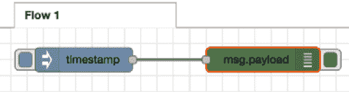

    图 8.4 -检查项目历史特征的示例流程

    在此流的部署之后，您可以看到**流。 **Local Changes**区域中的**json 文件。 这意味着在流编辑器中添加(部署)了一个由**注入**节点和**调试**节点组成的流，以及**流。 json**文件，这是整个流程的配置文件，已经更新。 因此，**流。 已经被识别为 Git 管理中需要修改的文件:**

    

    图 8.5 - Node-RED 识别该流。 Json 已经被更改

7.  现在，让我们遵循 Git 礼仪并继续这个过程。 首先，将更改后的文件放在提交阶段。 这是 git 的**git add**命令。
8.  Click the **Stage all changes** button at the top right of the **Local Changes** area:

    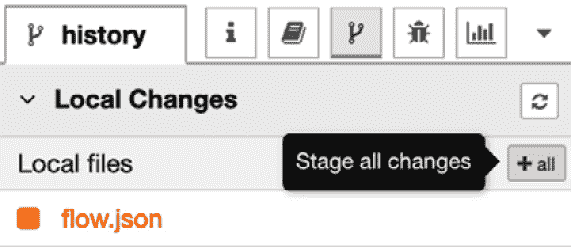

    图 8.6 -点击 Stage all changes 按钮来添加文件

    你可以看到，**流动。 json**文件已从**Local Changes**区域移动到**commit**区域。

9.  Next, let's commit the changes in **flow.json**. Click the **commit** button at the top right of the **Changes to commit** area. This is exactly the equivalent of Git's **git commit** command:

    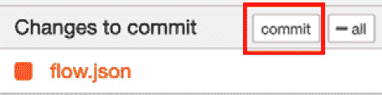

    图 8.7 -单击提交按钮提交文件

10.  After clicking the **commit** button, the commit comment window will be opened. Please enter a commit comment here and then click the **Commit** button:

    

    图 8.8 -单击 Commit 按钮完成提交过程

11.  现在提交完成。 最后，让我们检查一下**Commit History**区域。 您可以看到创建了一个新版本作为更改历史:

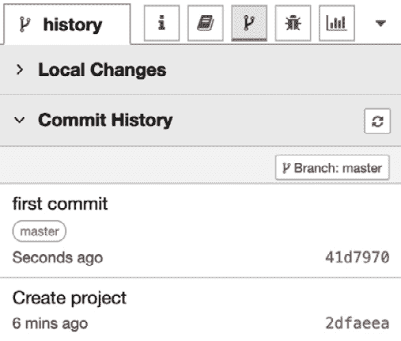

图 8.9 -添加了新的历史记录

正如您所了解的，在创建项目之后，可以像往常一样使用 Node-RED 编辑器。

现在，让我们为 Node-RED 流编辑器添加一个用于项目功能的新用户界面。

## 进入项目设置

您正在处理的项目将出现在右边窗格的顶部。 在项目名称旁边有和**显示项目设置**按钮:

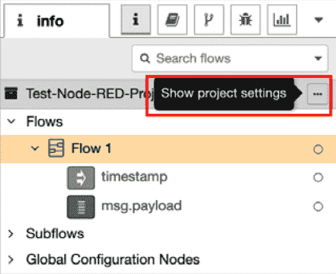

图 8.10 -信息面板上的项目信息

您也可以从主菜单下的**项目|项目设置**选项中进入**项目设置**界面:

图 8.11 -如何通过主菜单访问项目设置

当**项目设置**面板显示时，你会看到每个设置有三个选项卡:

*   **Project**:编辑**README。 md**文件的这个项目
*   **依赖项**:管理项目的节点列表
*   **设置**:管理项目设置和远程存储库:

图 8.12 -项目设置面板

如果你想检查和修改 Git 设置，你可以通过主菜单进入设置面板:

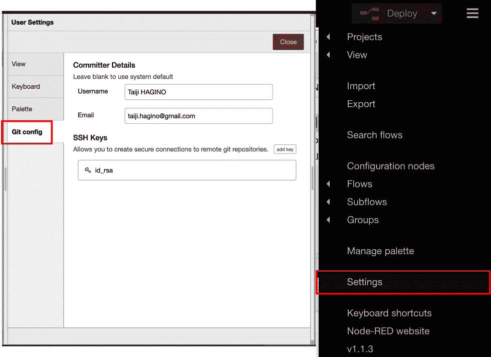

图 8.13 - User Settings 面板上的 Git 配置

现在您知道了如何在本地环境中进行版本控制。 下一步需要理解如何连接远程存储库，比如 GitHub 服务。

# 连接远程存储库

现在，让我们学习如何将 Node-RED 连接到一个远程存储库，比如 GitHub。 在这里，我们将使用 GitHub 服务作为远程存储库。 这就像通过 Node-RED 连接本地 Git 和远程 GitHub。 这没什么特别的。 对于经常使用 Git/GitHub 的人来说，这是很熟悉的，但它与 GitHub 作为客户端工具使用的情况非常相似。 使用 Node-RED 管理这个版本非常容易。

在 GitHub 上创建 Node-RED 项目的远程存储库，使用以下步骤:

1.  First, go to your GitHub account and create a repository.

    使用与本地存储库相似的项目名称是个好主意。 我们不会在这里详细介绍如何使用 GitHub，但由于它是一个可以直观使用的服务，我相信任何人都可以使用它，没有任何问题:

    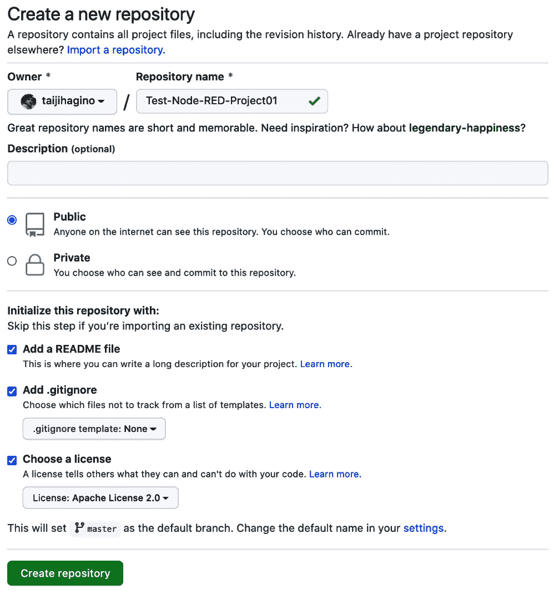

    图 8.14 -在 GitHub 上创建存储库

2.  Configure the project settings of your Node-RED. To do this, return to the Node-RED flow editor and then go to **Project Settings** to connect the local and remote repositories. When the **Project Settings** panel is opened, click the **add remote** button to configure the remote repository information:

    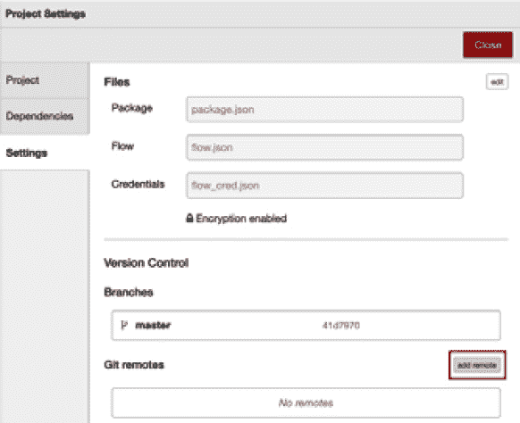

    图 8.15 -单击 Project Settings 面板上的 add remote 按钮

3.  Please enter the repository URL you created on GitHub and then click the **Add remote** button:

    

    图 8.16 -设置 GitHub 存储库的 URL

4.  点击设置面板右上方的**关闭**按钮，完成此配置。
5.  Next, merge the repositories.

    GitHub 上的远程存储库现在链接到本地环境中的 Git 存储库。 但是他们还没有同步。 你所要做的就是把遥控器拉到本地并合并。 要做到这一点,选择**历史**小组信息菜单,然后单击**管理远程分支**按钮提交历史**面板连接到远程存储库:**

    ****

    **图 8.17 -设置 GitHub 存储库的 URL**

***   Select your remote branch. Usually, the **origin/master** branch is selected:

    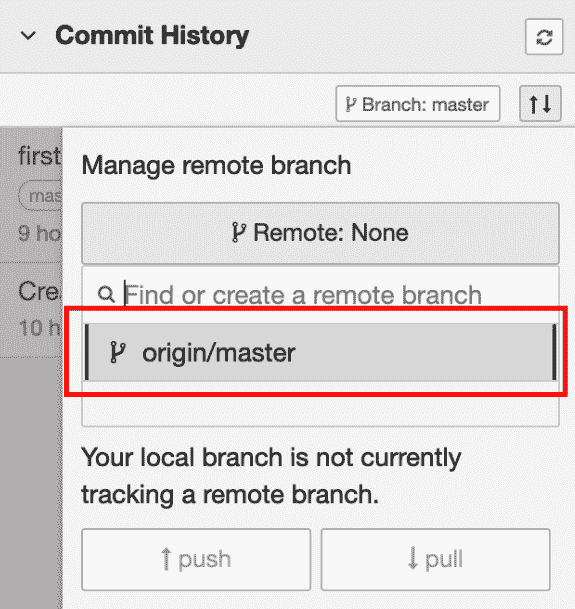

    图 8.18 -选择远程分支

    这里，远程和本地是有区别的，因为我们已经在本地创建了流，并使用本地 Git 对其进行版本控制。 在这种情况下，您需要在本地提取远程内容，然后才能将本地内容推到远程。

    *   Click the **pull** button:

    

    图 8.19 -从远程存储库提取提交

    在途中将显示一条指示冲突的消息，但按原样进行合并。 在合并期间，将询问您是要应用远程更改还是本地更改。 在这种情况下，在本地应用更改以完成合并。

    执行该操作后，您将在**Commit History**面板上看到您的本地分支已经与远程分支合并:

    

    图 8.20 -合并远程和本地存储库

    *   After this, select the **Manage remote branch** button (the up and down arrows):

    

    图 8.21 -单击 Manage remote branch 按钮

    *   选择你想要推送的分支，然后点击**推送**按钮将这些更改发送(推送)到远程存储库:**

 **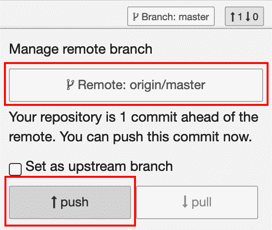

图 8.22 -将更改发送到远程存储库

恭喜你! 现在您已经了解了如何使用 Node-RED 上的项目特性，还可以从本地 Node-RED 存储库连接远程存储库。

# 小结

在本章中，您学习了如何启用 Node-RED 的项目特性，以及如何使用 Git 将本地版本控制与 GitHub 上创建的远程存储库集成在一起。 当您将来使用 Node-RED 开发团队时，这将非常有用。

在下一章中，我们将使用这个项目特性在本地克隆待办应用的存储库。 通过同时学习本章和下一章，您应该对项目特性有更深入的了解。**