# 十一、通过在 IBM 云中创建服务器端应用来可视化数据

在本章中，我们将使用 Node-RED 创建一个服务器应用来可视化已经从物联网边缘设备发送的数据。 对于服务器端应用，我想在这里使用 IBM Cloud。 通过本章中的教程，您将掌握如何在服务器应用上可视化传感器数据。

让我们从以下几个话题开始:

*   准备一个公共 MQTT 代理服务
*   在边缘设备上从 Node-RED 发布数据
*   在云端 Node-RED 上订阅和可视化数据

本章结束时，您将掌握如何在云平台上可视化传感器数据。

# 技术要求

要在本章取得进展，你需要具备以下条件:

*   IBM 云帐户:[https://cloud.ibm.com/](https://cloud.ibm.com/)
*   一个 clouddmqtt 账户:[https://cloudmqtt.com/](https://cloudmqtt.com/)
*   本章使用的代码可在**第十一章**文件夹[https://github.com/PacktPublishing/-Practical-Node-RED-Programming](https://github.com/PacktPublishing/-Practical-Node-RED-Programming)中找到。

# 准备公共 MQTT 代理服务

回想上一章，[*第 10 章*](10.html#_idTextAnchor121)，*处理树莓派*上的传感器数据。 我们将与边缘设备(树莓派)相连的温湿度传感器的数据发送到云端，并确认云侧可以观测到数据。

在前一章中，我们检查了如何使用名为**mosquito 的服务操作 MQTT 代理到**。 这是为了将数据从边缘设备发送到 MQTT 代理。

然而，这是一个机制，所有事情都在树莓派上本地完成。 本质上，在尝试实现物联网机制时，MQTT 代理应该位于公共位置，并且可以通过 internet 从任何地方访问。

您可以在公共云中托管自己的**mosquito to**MQTT 代理，但这会在设置和维护它方面增加一些额外的复杂性。 有许多可用的公共 MQTT 服务可以使启动变得更容易。

在本章中，我们将为 MQTT 代理使用一个名为**clouddmqtt**的服务，但是您可以用您喜欢的服务替换 MQTT 代理部分。 您还可以在 IaaS 上发布自己的 MQTT 代理，例如**mosquito 到**，而不是使用 SaaS:

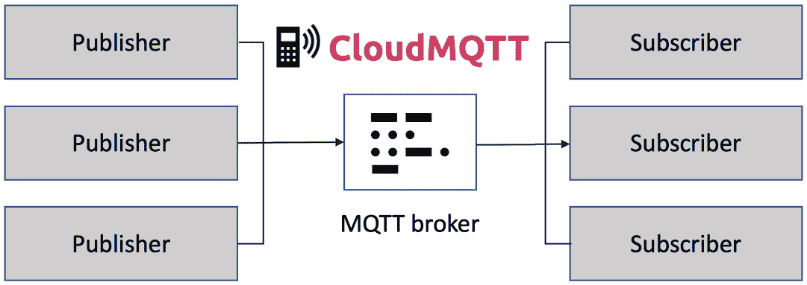

图 11.1 - clouddmqtt 概述

重要提示

MQTT 代理是一个服务器，它接收来自发布者的消息并将其发送给订阅者。

在 PubSub 中传递消息的服务器称为 MQTT 代理。

PubSub 是*Publisher*和*Subscriber*的合成词:

a)出版商是传递信息的人。

b)订阅者是订阅消息的人。

您可以将其看作是接收来自客户机的消息并将其分发给客户机的服务器。

MQTT 与普通套接字通信的不同之处在于它是在一对多的基础上进行通信的。 换句话说，它具有一种将一个客户机的消息分发给许多人的机制。 这个系统使我们能够同时实时地向许多人传递信息。

现在我们将学习如何准备**clouddmqtt**。 如前所述，**CloudMQTT**是作为 SaaS 发布的 MQTT 代理。 如果不使用**clouddmqtt**，而希望使用另一个 SaaS MQTT 代理或在 IaaS 上发布 MQTT 代理，则可以跳过此步骤。 但是，使用 MQTT 代理的基本配置信息保持不变，因此我相信这一步将帮助您配置任何 MQTT 代理。

执行以下步骤在**CloudMQTT**上创建 MQTT 代理服务:

1.  Log in to **CloudMQTT** at [https://cloudmqtt.com/](https://cloudmqtt.com/).

    访问网站时，点击窗口右上方的**登录**按钮:

    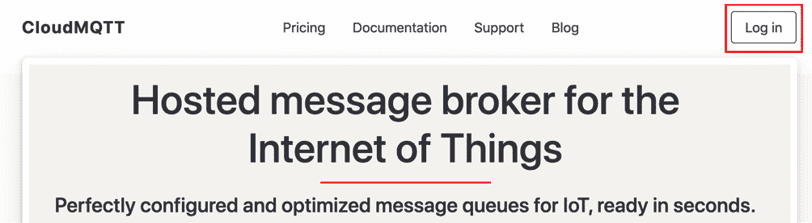

    图 11.2 - CloudMQTT 网站

    如果您已经有了您的 clouddmqtt 帐户，通过输入您的电子邮件地址和密码登录您的帐户:

    

    图 11.3 -登录 clouddmqtt

    如果您还没有账号，请通过窗口底部的**注册**按钮创建一个新账号:

    

    图 11.4 -创建您的帐户

2.  Create an instance.

    登录后，点击窗口右上方的**创建新实例**按钮:

    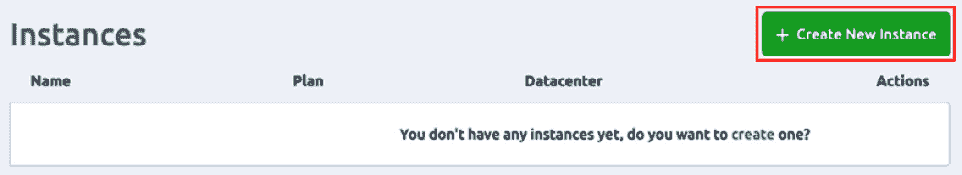

    图 11.5 -创建一个新实例

3.  Select a name and payment plan.

    此名称用于您的 MQTT 代理服务。 你想给它取什么名字都行。 我使用了**packmqtt Broker**。

    不幸的是，免费的**Cute Cat**计划已经取消了。 所以，我们将选择最便宜的方案**Humble Hedgehog**，在这里。 这项计划的费用是每月 5 美元。

    使用付费服务由您决定。 如果希望避免计费，则需要寻找一个免费的 MQTT 代理服务。

    选择名称和支付计划后，点击**选择区域**按钮:

    

    图 11.6 -选择名称和支付计划

4.  Select a region and data center.

    该服务运行在**AWS**上。 因此，您可以选择数据中心所在的区域。 您可以选择任何地区。 这里我们使用的是**US-East-1**。

5.  After making the selection, click the **Review** button:

    

    图 11.7 -选择区域和数据中心

6.  Next, finalize creation of the MQTT broker instance.

    请核对付款计划、服务名称、服务提供商、数据中心区域。 然后，点击**创建实例**按钮，完成该实例的创建:

图 11.8 -完成 MQTT 代理实例创建

# 在边缘设备上从 Node-RED 发布数据

在本节中，我们将配置树莓派。 首先，启动树莓派并打开 Node-RED 流编辑器。 这个 Node-RED 流编辑器应该还有一个发送传感器数据流实现[*第十章*](10.html#_idTextAnchor121),*处理传感器数据的覆盆子π*,到服务器。 如果您已经删除了该流程，或者您还没有创建该流程，请参考[*Chapter 10*](10.html#_idTextAnchor121)，*处理树莓派上的传感器数据*重新执行该流程。 双击组成流的**mqtt out**节点，打开设置窗口。 上次我们使用**mosquito to**，这次我们将连接**CloudMQTT**。

执行以下步骤配置树莓派上的 Node-RED 连接到 clouddmqtt:

1.  Access the flow you created in [*Chapter 10*](10.html#_idTextAnchor121), *Handling Sensor Data on the Raspberry Pi*.

    在本章中，我们只使用带有**mqtt out**节点的流，因为这个场景仅用于向树莓派发送数据:

    

    图 11.9 -访问我们在前一章中创建的流

2.  Edit the **mqtt out** node.

    现在我们需要编辑连接配置。 双击**mqtt out**节点打开设置窗口:

    

    图 11.10 -打开 mqtt out 节点的设置窗口

    设置连接到 clouddmqtt 的配置。

    设置**Topic**、**Qos**、**保持**值如下:

    *   **Topic**:**pack**
    *   **Qos**:**1**
    *   **Retain**:**true**
3.  Click the **Edit** button (pencil mark) to the right of **Server** to open the credential properties:

    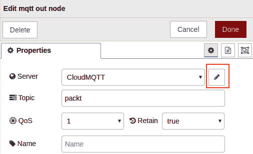

    图 11.11 -单击 Edit 按钮打开属性设置

4.  在服务器设置面板上，选择**Connection**选项卡，按如下方式填写每个属性:
    *   **Server**:**driver.cloudmqtt.com**
    *   **Port**: **18913**

        不应该更改**Connection**选项卡中的其他属性，必须保持其默认值。

        **Connection**选项卡设置参考如下截图:

图 11.12 - MQTT 代理服务器设置

1.  接下来，选择**Security**选项卡到编辑配置以连接 MQTT 代理，并按如下方式填写每个属性:
    *   **用户名**:您从 CloudMQTT 获得的用户。
    *   **Password**: The password that you got from CloudMQTT.

        **Security**选项卡设置参考如下截图:

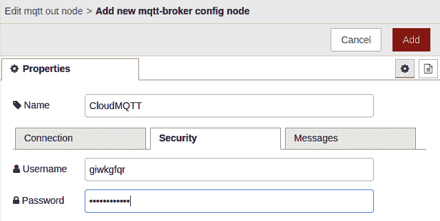

图 11.13 - MQTT 代理用户和密码设置

您可以在 clouddmqtt 管理菜单中检查这些属性。 这个菜单可以通过 clouddmqtt 仪表板的 Instances 列表来访问:[https://customer.cloudmqtt.com/instance](https://customer.cloudmqtt.com/instance)

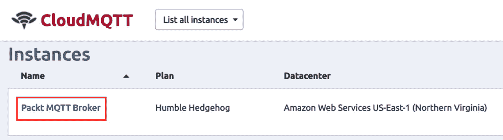

图 11.14 - clouddmqtt 实例列表

这就完成了树莓派一侧的设置。 接下来，让我们设置 Node-RED 流编辑器，以便在云端使用 Node-RED 获取(订阅)数据。

# 在云端 Node-RED 上订阅和可视化数据

在本节中，我们将看到如何在云端使用 Node-RED 可视化接收的数据。 这使用仪表板节点之一,正如我们在第六章[*【4】【5】,*在云中实现 Node-RED*,但这一次,我们将选择计的 UI 让它看起来好一点。*](06.html#_idTextAnchor073)

这次使用的云端 Node-RED 运行在 IBM Cloud (PaaS)上，但是之前创建服务作为 MQTT 代理的 CloudMQTT 是一种不同于 IBM Cloud 的云服务。

在本章中，我们将了解存在 MQTT 代理，以便可以从不同的地方访问它，发布者(数据发布者)和订阅者(数据接收者)都可以使用它，而不需要知道它在哪里。

## IBM 云上准备 Node-RED

现在，让我们通过执行以下步骤创建一个连接到 CloudMQTT 的 Node-RED 流。 这里，我们将在 IBM 云上使用 Node-RED。 请注意，它是不是树莓派上的 Node-RED:

1.  打开 Node-RED 流编辑器，登录到 IBM Cloud，并调用已经从仪表板创建的 Node-RED 服务。
2.  Either click on **View all** or **Cloud Foundry services** on the **Resource summary** tile on the dashboard. Clicking on either option will take you to a list of resources on the IBM Cloud you created:

    

    图 11.15 -打开资源列表

    如果您还没有在 IBM 云上创建 Node-RED 服务，请参考[*第 6 章*](06.html#_idTextAnchor073)，*在云中实现 Node-RED 服务*，在继续之前创建一个。

3.  Under the **Cloud Foundry apps** displayed on the **Resource list** screen, click on the Node-RED service you created to open the Node-RED flow editor:

    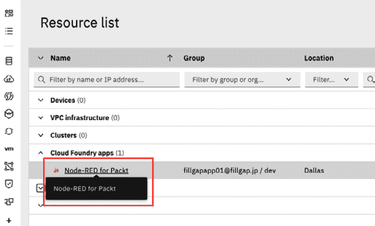

    图 11.16 -选择您创建的 Node-RED 服务

4.  Then, click **Visit App URL** to access the Node-RED flow editor:

    

    图 11.17 -单击 Visit App URL

5.  When the top screen of the Node-RED flow editor is displayed, click the **Go to your Node-RED flow editor** button to open the Node-RED flow editor:

    

    图 11.18 -单击 Go to your Node-RED 流编辑器按钮

6.  Make a flow to visualize the data.

    当您访问 IBM Cloud 上的 Node-RED 流编辑器时，创建如下所示的流。 将**mqtt 放入**节点，**json**节点，两个**改变**节点，以及**gauge**节点在每个**改变**节点之后。 如果您想获取此流的调试日志，请在任意节点后添加**调试**节点。 在本例中，两个**调试**节点放置在节点的**mqtt 之后，第一个**更改**节点。**

    您已经有了**仪表板**节点，包括**仪表板**节点。 如果你没有,请回到*做一个流程用例 2 -可视化数据*在[【T7 教程】第六章【显示】](06.html#_idTextAnchor073),*在云中实现 Node-RED*,【病人】仪表板的节点:

    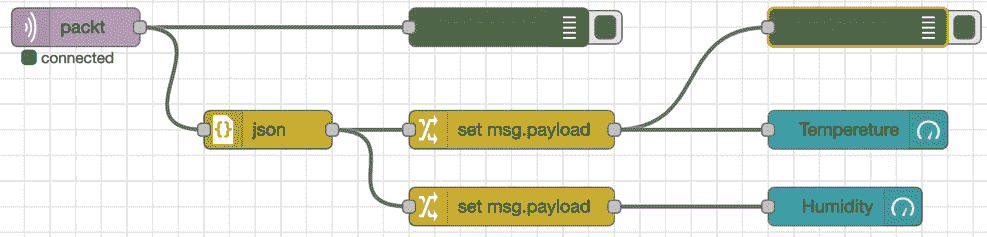

    图 11.19 -形成流

7.  编辑节点中的**mqtt。 双击**节点中的**mqtt，打开设置窗口。 设置**Topic**，**Qos**，和**Output**，其中为以下值:**
    *   **Topic**:**pack**
    *   **Qos**:**1**
    *   **Output**:**auto-detect**(string or buffer)
8.  Click the **Edit** button (pencil icon) to the right of **Server** to open the credential properties:

    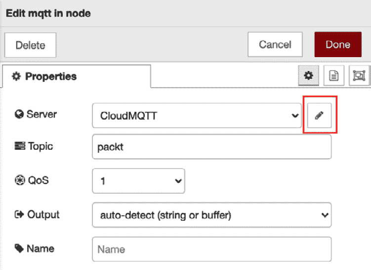

    图 11.20 -单击 Edit 按钮打开属性设置

9.  在服务器设置面板上，选择**Connection**选项卡，并使用以下值填充每个属性:
    *   **Server**:**driver.cloudmqtt.com**
    *   **Port**: **18913**

        **Connection**选项卡的其他属性不是，应该是，必须保持默认值。

        **Connection**选项卡设置参考如下截图:

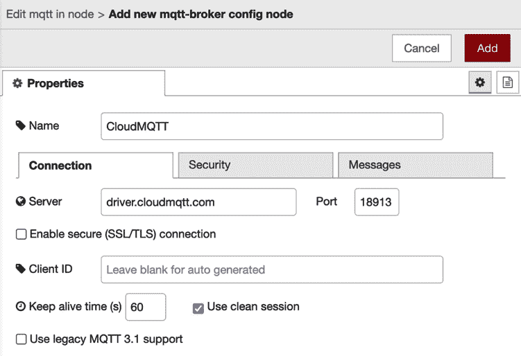

图 11.21 - MQTT 代理服务器设置

1.  接下来，选择**Security**选项卡来编辑连接 MQTT 服务器的配置，并使用以下值填充每个属性:
    *   **用户名**:您从 CloudMQTT 获得的用户。
    *   **Password**: The password that you got from CloudMQTT.

        **Security**选项卡设置参考如下截图:

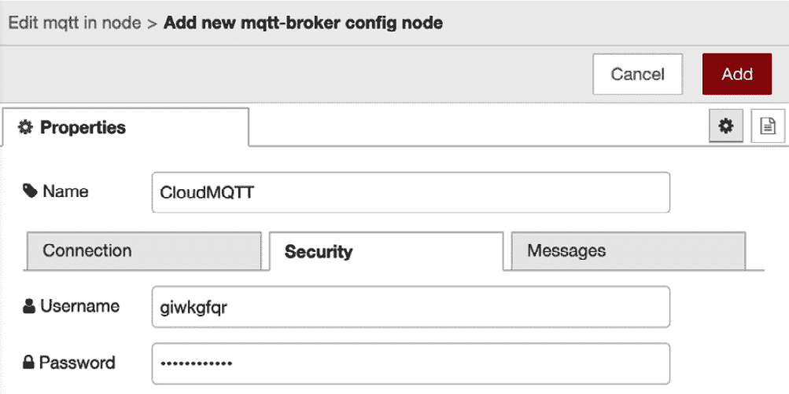

图 11.22 - MQTT 代理用户和密码设置

您可能已经注意到，这些属性与您为Raspberry Pi node - red 上的**mqtt 输出**节点设置的值相同。 如有必要，请参考 clouddmqtt 仪表板。

1.  Now, edit the json node. Double-click on the **json** node to open the settings window. Select **Convert between JSON String & Object** on **Action**, and set **msg.payload** on **Property**:

    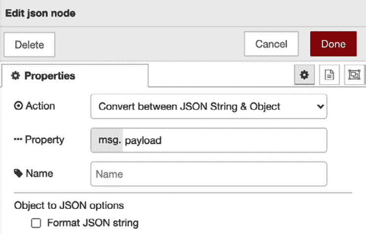

    图 11.23 -设置 json 节点属性

2.  Edit the settings of the **change** node. Double-click on the first **change** node to open the **Settings** window and then set **msg.payload.temperature** in the box entitled **to** under the **Rules** area. Then, click the **Done** button to close the settings window:

    

    图 11.24 -设置第一个更改节点的属性

3.  Also, edit the settings of the second **change** node. Double-click on the second **change** node to open the **Settings** window. Set **msg.payload.humidity** in the box entitled **to** in the **Rules** area and then click the **Done** button to close the settings window:

    

    图 11.25 -设置第二个变更节点的属性

4.  Edit the settings of the first **gauge** node. Double-click on the first **gauge** node to open the **Settings** window and then click the **Edit** button (pencil icon) to the right of **Group** to open the properties:

    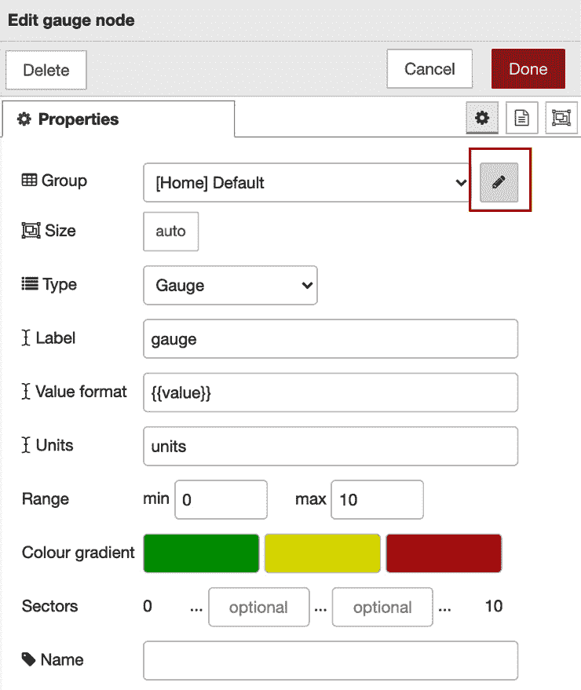

    图 11.26 -单击 Edit 按钮打开 Properties 设置

5.  在仪表板的组设置面板中，用以下值填充每个属性:
    *   **Name**: **Raspberry Pi Sensor data**

        *在这里提供任何名字都可以。 这个名称将显示在我们将要创建的图表网页上。

        其他属性不应该更改，必须保持其默认值。 您可以参考以下截图:

图 11.27 -设置组名

1.  回到**规格**节点设置的主面板，用以下值填充每个属性:
    *   **型**:**量规**
    *   **标签**:**温度**
    *   :**°C**(如果您喜欢使用华氏度，请使用°F)
    *   **Range**: -**15 ~ 50** (if you prefer to use Fahrenheit, please adjust the range accordingly)

        其他属性不应该从其默认值更改。 可参考如下截图进行设置:

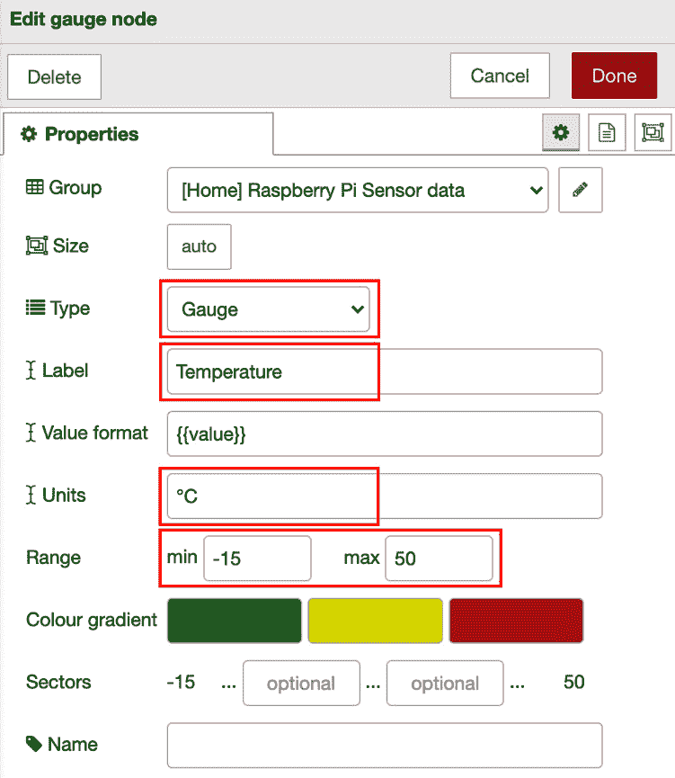

图 11.28 -设置度量节点属性

1.  编辑第二个**gauge**节点的设置。 双击第二个**压力表**节点，打开**设置**窗口，然后选择在上一步中创建的组名称。 用以下值填充每个属性:
    *   **型**:**量规**
    *   **标签**:**湿度**
    *   :**%**
    *   **Range**: **0 ~ 100**

        其他属性不应该从其默认值更改。 可参考如下截图进行设置:

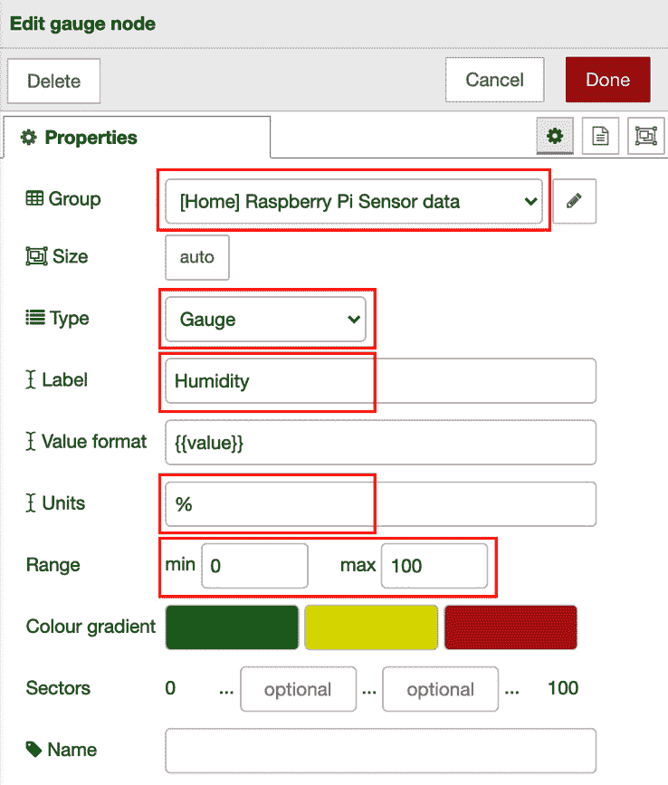

图 11.29 -设置规范节点属性

请确保在 Node-RED 上部署流。

这就完成了 IBM Cloud 上的Node-RED 配置。 这意味着该流已经使用主题**包**订阅了 clouddmqtt 服务(等待数据)。 接下来，是发布和订阅数据的时候了。

## IBM 云中数据的可视化

在设备的边缘，在树莓派上，我们准备将传感器数据与主题**包**一起发布到 clouddmqtt。 在云计算方面，流已经包含了 clouddmqtt 服务的**包**主题。

对于树莓派，执行以下步骤来发布您的数据:

1.  Publish the data from your Raspberry Pi.

    在树莓派上访问 Node-RED 流编辑器。 点击**inject**节点的按钮，运行此流，发布树林温湿度传感器数据:

    

    图 11.30 -运行发布数据的流

2.  Check receipt of the data on the IBM Cloud.

    您将能够通过 CloudMQTT 接收(订阅)数据。 您可以在 IBM Cloud 上 Node-RED 流编辑器的**debug**选项卡上检查:

    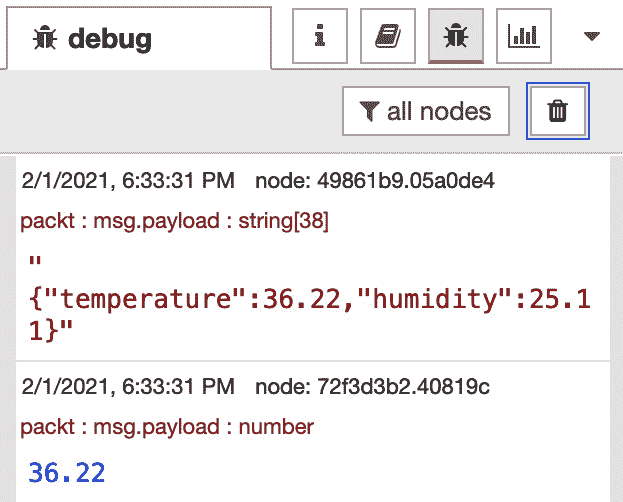

    图 11.31 -检查数据的订阅

3.  通过 IBM Cloud 上 Node-RED 流编辑器上的**图表**选项卡打开图表网页，然后单击**打开**按钮(对角箭头图标)打开:

图 11.32 -打开图表网页

你会看到网页测量图表显示的数据:

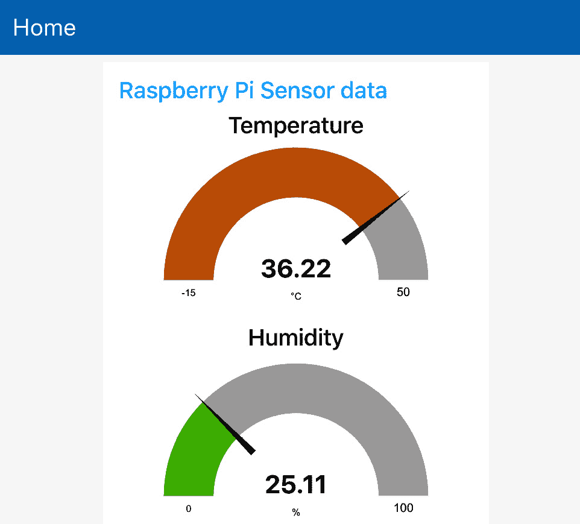

图 11.33 -显示图表网页

恭喜你! 现在您知道了如何观察服务器上树莓派发送的数据，并将其可视化为一个图表。

如果您希望流配置文件在您的 Node-RED 上创建流，您可以在这里获取:[https://github.com/PacktPublishing/-Practical-Node-RED-Programming/blob/master/Chapter11/getting-sensordata-with-iotplatform.json](https://github.com/PacktPublishing/-Practical-Node-RED-Programming/blob/master/Chapter11/getting-sensordata-with-iotplatform.json)。

# 小结

在本章中，我们体验了如何接收从边缘设备发送的传感器数据并在服务器端可视化它。

在本章中，我们在 IBM Cloud 上使用了 CloudMQTT 和 Node-RED。 Node-RED 可以运行在任何云平台和本地，您可以尝试在任何环境中创建这种应用。 这就是为什么记住这个模式肯定会对您未来开发其他云物联网平台有帮助。

在下一章中，我们将看看使用 Node-RED 创建聊天机器人应用的实际操作场景。 这将向您介绍一种使用 Node-RED 的新方法。