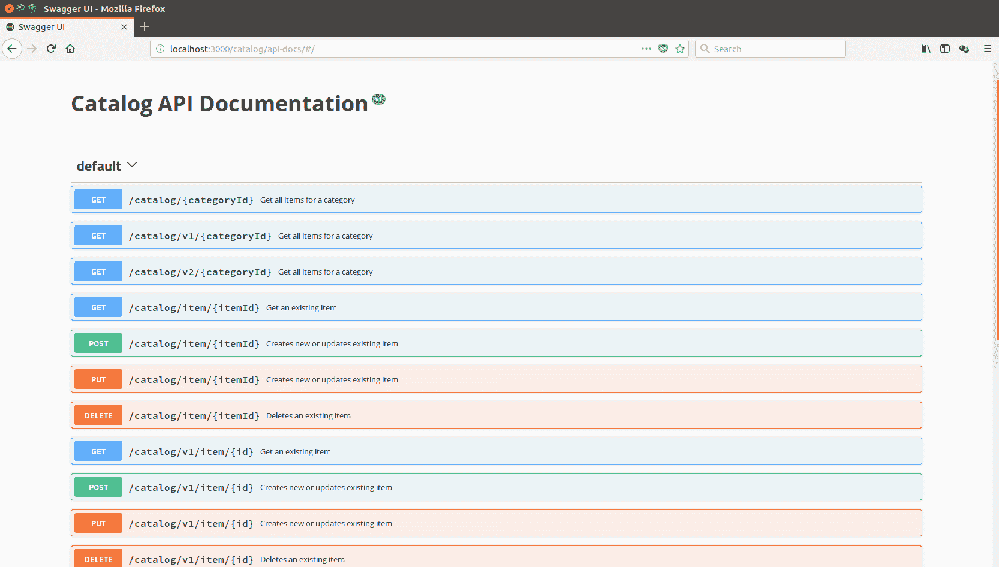

# 一、REST——你所不知道的

在过去几年中，我们已经开始想当然地认为内容、移动设备服务或云计算的数据源都是由现代技术驱动的，比如 RESTfulWeb 服务。每个人都在谈论他们的无状态模型如何允许应用轻松扩展，以及它如何强调数据供应和数据消耗之间的明确分离。如今，架构师已经开始引入微服务的概念，目的是通过将其核心组件拆分为独立的小部分来降低系统的复杂性，这些小部分只需完成一项任务。因此，企业级软件即将成为此类微服务的组合。这使其易于维护，并允许在需要引入新零件时进行更好的生命周期管理。毫不奇怪，大多数微服务都是由 RESTful 框架提供服务的。这一事实可能会给人留下这样的印象：REST 是在过去十年的某个时候发明的，但这远非事实。事实上，从上个世纪的最后十年起，其余的就已经存在了！

这一章将带领您了解 Apple T0 代表性状态转移（TytT2REST），并将解释如何与 HTTP 协议休眠。您将了解将任何 HTTP 应用转换为支持 RESTful 服务的应用时必须考虑的五个关键原则。您还将看到描述 RESTful 和基于经典**简单对象访问协议**（**SOAP**的 web 服务之间的区别。最后，您将学习如何利用现有的基础设施为您带来好处。

在本章中，我们将介绍以下主题：

*   REST基础
*   REST 使用 HTTP
*   与传统的基于 SOAP 的服务相比，RESTful 服务在描述、发现和文档方面有本质的区别
*   利用现有基础设施

# REST基础

这实际上发生在 1999 年，当时向**互联网工程特别工作组（IETF；**[提交了征求意见的请求 http://www.ietf.org/](http://www.ietf.org/) ）通过 RFC 2616:*超文本传输协议 HTTP/1.1*。其作者之一 RoyFielding 后来定义了一套围绕 HTTP 和 URI 标准构建的原则。这就产生了我们今天所知道的REST。

These definitions were given in [https://www.ics.uci.edu/~fielding/pubs/dissertation/fielding_dissertation.pdf ](https://www.ics.uci.edu/~fielding/pubs/dissertation/fielding_dissertation.pdf)in the fifth chapter, *Representational State Transfer (REST)*, of Fielding's dissertation called *Architectural Styles and the Design of Network-Based Software Architectures*. The dissertation is still available at [http://www.ics.uci.edu/~fielding/pubs/dissertation/rest_arch_style.htm](http://www.ics.uci.edu/~fielding/pubs/dissertation/rest_arch_style.htm).

让我们看看 HTTP 和 URI 标准的关键原则，坚持这些原则将使您的 HTTP 应用成为支持 RESTful 服务的应用：

1.  一切都是资源
2.  每个资源由一个**唯一标识符**（**URI**标识）
3.  资源通过标准 HTTP 方法进行操作
4.  资源可以有多个表示形式
5.  以无状态方式与资源通信

# 原则 1——一切都是资源

为了理解这一原理，我们必须设想用特定的格式来表示数据，而不是用包含大量字节的物理文件。互联网上可用的每一条数据都有一种描述它的格式，称为内容类型；例如，JPEG 图像、MPEG 视频、HTML、XML、文本文档和二进制数据都是具有以下内容类型的资源：图像/JPEG、视频/MPEG、文本/HTML、文本/XML 和应用/octet 流。

# 原则 2–每个资源都可以通过唯一标识符进行识别

由于互联网包含如此多不同的资源，它们都应该通过 URI 访问，并且应该被唯一地标识。此外，uri 可以是人类可读的格式，尽管其消费者更可能是软件程序而不是普通人。

人类可读的 URI 使数据保持自描述性，并便于进一步开发。这有助于将程序中出现逻辑错误的风险降至最低。

下面是这些 URI 的几个示例，它们表示目录应用中的不同资源：

*   [http://www.mycatalog.com/categories/watches](http://www.mycatalog.com/categories/watches)
*   [http://www.mycatalog.com/categories/watches?collection=2018](http://www.mycatalog.com/categories/watches?collection=2018)
*   [http://www.mycatalog.com/categories/watches/model-xyz/image](http://www.mycatalog.com/categories/watches/model-xyz/image)
*   [http://www.mycatalog.com/categories/watches/model-xyz/video](http://www.mycatalog.com/categories/watches/model-xyz/video)
*   [http://www.mycatalog.com/archives/2017/categories/watches.zip](http://www.mycatalog.com/archives/2017/categories/watches.zip)

这些人类可读的 URI 以直接的方式公开不同类型的资源。在前面的示例 URI 中，很明显数据是目录中的项，这些项被分类为表。第一个链接显示类别中的所有项目。第二部分仅显示 2018 系列的一部分。接下来是指向项目图像的链接，然后是指向示例视频的链接。最后一个链接指向一个资源，该资源包含 ZIP 存档中上一个集合中的项目。每个 URI 提供的媒体类型很容易识别，假设一个项目的数据格式是 JSON 或 XML，因此我们可以很容易地将自述 URL 的媒体类型映射到以下内容之一：

*   描述项目的 JSON 或 XML 文档
*   图像
*   视频
*   二进制归档文件

# 原则 3–通过标准 HTTP 方法操作资源

本机 HTTP 协议（RFC 2616）定义了八个动作，也称为 HTTP 动词：

*   `GET`
*   `POST`
*   `PUT`
*   `DELETE`
*   `HEAD`
*   `OPTIONS`

*   `TRACE`
*   `CONNECT`

前四种方法在资源环境中感觉很自然，尤其是在定义数据操作的操作时。让我们与相关的 SQL 数据库进行比较，其中数据操作的母语是**CRUD**（缩写为**创建、读取、更新和删除**），分别来自不同类型的 SQL 语句`INSERT`、`SELECT`、`UPDATE`和`DELETE`。同样，如果您正确应用 REST 原则，则应使用 HTTP 谓词，如下所示：

| **HTTP 动词** | **动作** | **HTTP 响应状态码** |
| `GET` | 检索现有资源。 | `200 OK`如果资源存在，`404 Not Found`如果资源不存在，`500 Internal Server Error`对于其他错误。 |
| `PUT` | 更新资源。如果资源不存在，服务器可以决定使用提供的标识符创建资源，或者返回相应的状态代码。 | `200 OK`如果更新成功，`201 Created`如果创建了新资源，`404 Not found`如果要更新的资源不存在，`500 Internal Server Error`对于其他意外错误。 |
| `POST` | 使用服务器端生成的标识符创建资源，或使用客户端提供的现有标识符更新资源。如果此谓词仅用于创建而不用于更新，请返回相应的状态代码。 | `201 CREATED`如果创建了新资源，`200 OK`如果资源更新成功，`409 Conflict`如果资源已经存在且不允许更新，`404 Not Found`如果要更新的资源不存在，`500 Internal Server Error`对于其他错误。 |
| `DELETE` | 删除资源。 | `200 OK`或`204 No Content`如果资源删除成功，`404 Not Found`如果要删除的资源不存在，其他错误为`500 Internal Server Error`。 |

请注意，根据应用的策略，`POST`或`PUT`HTTP 谓词可以创建资源。但是，如果必须使用客户端提供的标识符在特定 URI 下创建资源，则`PUT`是适当的操作：

```js
PUT /categories/watches/model-abc HTTP/1.1
Content-Type: text/xml
Host: www.mycatalog.com

<?xml version="1.0" encoding="utf-8"?>
<Item category="watch">
    <Brand>...</Brand>
    </Price></Price>
</Item>

HTTP/1.1 201 Created 
Content-Type: text/xml 
Location: http://www.mycatalog.com/categories/watches/model-abc

```

但是，在应用中，您可能希望让后端 RESTful 服务决定在何处公开新创建的资源，从而在适当但仍然未知或不存在的位置下创建它。

例如，在我们的示例中，我们可能希望服务器定义新创建项的标识符。在这种情况下，只需对 URL 使用`POST`动词，而不提供标识符参数。然后，由服务本身为新资源提供一个新的唯一有效标识符，并通过响应的`Location`头公开该 URL：

```js
POST /categories/watches HTTP/1.1
Content-Type: text/xml
Host: www.mycatalog.com

<?xml version="1.0" encoding="utf-8"?>
<Item category="watch">
    <Brand>...</Brand>
    </Price></Price>
</Item>

HTTP/1.1 201 Created 
Content-Type: text/xml 
Location: http://www.mycatalog.com/categories/watches/model-abc
```

# 原则 4–资源可以有多个表示

资源的一个关键特性是，它可以用与存储它的格式不同的格式表示。因此，可以在不同的表示中请求或创建它。只要支持指定的格式，支持 REST 的端点就应该使用它。在前面的示例中，我们发布了一个监视项的 XML 表示，但是如果服务器支持 JSON 格式，那么下面的请求也将是有效的：

```js
POST /categories/watches HTTP/1.1
Content-Type: application/json
Host: www.mycatalog.com

{
  "watch": {
    "id": ""watch-abc"",
    "brand": "...",
    "price": {
      "-currency": "EUR",
      "#text": "100"
    }
  }
}
HTTP/1.1 201 Created
Content-Type: application/json
Location: http://mycatalog.com/categories/watches/watch-abc   
```

# 原则 5–以无状态方式与资源通信

通过 HTTP 请求进行的资源操纵操作应始终被视为原子操作。资源的所有修改都应该在 HTTP 请求中以隔离的方式执行。在请求执行之后，资源处于最终状态；这意味着不支持部分资源更新。您应该始终发送资源的完整状态。

回到我们的目录示例，更新给定项目的价格字段意味着使用包含整个数据（包括更新的价格字段）的完整文档（JSON 或 XML）发出 PUT 请求。只发布更新后的价格不是无状态的，因为这意味着应用知道资源有一个价格字段，也就是说，它知道它的状态。

RESTful 应用的另一个无状态要求是，一旦服务部署到生产环境中，传入的请求很可能由负载平衡器提供服务，从而确保可伸缩性和高可用性。一旦通过负载平衡器公开，将应用状态保留在服务器端的想法就会受到损害。这并不意味着不允许保留应用的状态。这只是意味着你应该保持安静。例如，将状态的一部分保留在 URI 中，或者使用 HTTP 头提供其他与状态相关的数据

RESTful API 的无状态性将调用方与服务器端的更改隔离开来。因此，调用方不希望在连续请求中与同一服务器通信。这允许在服务器基础结构中轻松应用更改，例如添加或删除节点。

Remember that it is your responsibility to keep your RESTful APIs stateless, as the consumers of the APIs would expect them to be.

既然您知道 REST 已经有 18 年的历史了，那么一个明智的问题是，“为什么它最近才变得如此流行？”好吧，我们开发人员通常拒绝简单、直接的方法，并且在大多数情况下，更愿意花更多的时间将已经复杂的解决方案转变为更加复杂和复杂的解决方案。

以经典的 soapweb 服务为例。他们的各种 WS-*规范非常多，有时定义非常松散，为了使不同供应商的不同解决方案具有互操作性，引入了单独的规范 WS-Basic 概要文件。它定义了额外的互操作性规则，以确保基于 SOAP 的 web 服务中的所有 WS-*规范能够协同工作。

当谈到通过 HTTP 使用经典 web 服务传输二进制数据时，事情变得更加复杂，因为基于 SOAP 的 web 服务提供了不同的二进制数据传输方式。每种方式都在其他规范集合中定义，例如带有**附件引用**（**SwaRef**）的**SOAP 和**消息传输****优化机制（MTOM）。**所有这些复杂性主要是因为 web 服务最初的想法是远程执行业务逻辑，而不是传输大量数据。**

现实世界向我们表明，当涉及到数据传输时，事情不应该那么复杂。这就是 REST 通过引入资源的概念和操作资源的标准方法而融入全局的地方。

# 其余的目标

现在，我们已经介绍了主要的 REST 原则，现在是时候深入探讨遵循这些原则可以实现的目标了：

*   表示与资源的分离
*   可见度
*   可靠性
*   可伸缩性
*   表演

# 表示与资源的分离

一个资源只是一组信息，根据原则 4 的定义，它可以有多个表示形式；然而，它的状态是原子的。由调用方在 HTTP 请求中使用`Accept`头指定所需的媒体类型，然后由服务器应用相应地处理表示，返回资源的适当内容类型以及相关 HTTP 状态代码：

*   `HTTP 200 OK`在成功的情况下
*   `HTTP 400 Bad Request`如果给出了不支持的格式或任何其他无效的请求信息
*   `HTTP 406 Not Acceptable`如果请求不支持的媒体类型

*   `HTTP 500 Internal Server Error`请求处理过程中发生意外情况时

让我们假设，在服务器端，我们有以 XML 格式存储的项目资源。我们可以有一个 API，允许消费者以各种格式请求项目资源，如`application/xml`、`application/json`、`application/zip`、`application/octet-stream`等。

加载请求的资源，将其转换为请求的类型（例如，JSON 或 XML），并使用 ZIP 压缩它或直接将其刷新到 HTTP 响应输出，这将取决于 API 本身。

调用者将使用`Accept`HTTP 头指定他们期望的响应的媒体类型。因此，如果我们希望以 XML 格式请求上一节中插入的项目数据，则应执行以下请求：

```js
GET /category/watches/watch-abc HTTP/1.1 
Host: my-computer-hostname 
Accept: text/xml 

HTTP/1.1 200 OK 
Content-Type: text/xml 
<?xml version="1.0" encoding="utf-8"?>
<Item category="watch">
    <Brand>...</Brand>
    </Price></Price>
</Item>
```

要请求 JSON 格式的相同项，`Accept`头需要设置为`application/json`：

```js
GET /categoery/watches/watch-abc HTTP/1.1 
Host: my-computer-hostname 
Accept: application/json 

HTTP/1.1 200 OK 
Content-Type: application/json 
{
  "watch": {
    "id": ""watch-abc"",
    "brand": "...",
    "price": {
      "-currency": "EUR",
      "#text": "100"
    }
  }
}
```

# 可见度

REST 被设计为可视且简单。服务的可见性意味着它的每一个方面都应该是自描述性的，并且根据原则 3、4 和 5 遵循自然的 HTTP 语言。

外部环境中的可见性意味着监视应用只对 REST 服务和调用方之间的 HTTP 通信感兴趣。由于请求和响应是无状态的和原子的，因此不需要更多的东西来引导应用的行为，也不需要了解是否出现了任何问题。

Remember that caching reduces the visibility of your RESTful applications and in general should be avoided, unless needed for serving resources subject to large amounts of callers. In such cases, caching may be an option, after carefully evaluating the possible consequences of serving obsolete data.

# 可靠性

在讨论可靠性之前，我们需要定义哪些 HTTP 方法是安全的，哪些在 REST 上下文中是幂等的。那么，让我们首先定义什么是安全方法和幂等方法：

*   HTTP 方法被认为是安全的，只要它在被请求时不会修改资源的状态或对资源的状态造成任何副作用
*   如果 HTTP 方法的响应保持不变，则认为它是幂等的，无论请求的次数如何，如果相同地重复，则 am 幂等请求始终返回相同的请求。

下表列出了哪些 HTTP 方法是安全的，哪些是幂等的：

| **HTTP 方式** | **安全** | **幂等元** |
| `GET` | 对 | 对 |
| `POST` | 不 | 不 |
| `PUT` | 不 | 对 |
| `DELETE` | 不 | 对 |

消费者应考虑操作的安全性和幂等性特征，以便可靠地服务。

# 可扩展性和性能

到目前为止，我们强调了 RESTful web 应用具有无状态行为的重要性。**万维网**（**WWW**）是一个巨大的宇宙，包含了大量的数据和大量的用户，他们渴望获得这些数据。WWW 的发展带来了应用应该随着负载的增加而轻松扩展的要求。扩展具有状态的应用是很难实现的，特别是当预期的操作停机时间为零或接近零时。

这就是为什么保持无状态对于任何需要扩展的应用都是至关重要的。在最佳情况下，扩展应用需要为负载平衡器放置另一块硬件，或者在云环境中引入另一个实例。不同的节点不需要彼此同步，因为它们根本不应该关心状态。可伸缩性就是在可接受的时间内为所有客户提供服务。其主要思想是保持应用运行，并防止大量传入请求导致的**拒绝服务**（**拒绝服务**。

不应将可伸缩性与应用的性能混淆。性能是通过处理单个请求所需的时间来衡量的，而不是应用可以处理的请求总数。Node.js 的异步非阻塞体系结构和事件驱动设计使其成为实现可扩展且性能良好的应用的合理选择。

# 与 WADL 合作

如果您熟悉 SOAP web 服务，您可能听说过**web 服务定义语言**（**WSDL**。它是服务接口的 XML 描述，并定义用于调用的端点 URL。soapweb 服务必须由这样的 WSDL 定义来描述。

与 soapweb 服务类似，RESTful 服务也可以使用一种称为 WADL 的描述语言。**WADL**代表**Web 应用定义语言**。与 soapweb 服务的 WSDL 不同，RESTful 服务的 WADL 描述是可选的，也就是说，使用该服务与其描述无关。

以下是 WADL 文件的一个示例部分，描述了我们目录服务的`GET`操作：

```js
<?xml version="1.0" encoding="UTF-8"?>
<application  xmlns:service="http://localhost:8080/catalog/" xmlns:xsd="http://www.w3.org/2001/XMLSchema">
  <grammer>
    <include href="items.xsd" />
    <include href="error.xsd" />
  </grammer>
  <resources base="http://localhost:8080/catalog/categories">
    <resource path="{category}">
      <method name="GET">
        <request>
          <param name="category" type="xsd:string" style="template" />
        </request>
        <response status="200">
          <representation mediaType="application/xml" element="service:item" />
          <representation mediaType="application/json" />
        </response>
        <response status="404">
          <representation mediaType="application/xml" element="service:item" />
        </response>
      </method>
    </resource>
  </resources>
</application>
```

WADL 文件的这个摘录展示了如何描述应用、公开资源。简而言之，每个资源都必须是应用的一部分。资源提供了一个具有`base`属性的 HTTP 方法，并在一个方法中描述了它支持的每个 HTTP 方法。此外，可在资源和应用中使用可选的`doc`元素，以提供有关服务及其操作的附加文档。

尽管 WADL 是可选的，但它大大减少了发现 RESTful 服务的工作量。

# 用 Swagger 记录 restfulapi

web 上公开的公共 API 应该有很好的文档记录，否则开发人员很难在应用中使用它们。虽然 WADL 定义可能被认为是文档的来源，但它们解决了一个不同的问题，即服务的发现。它们为机器而不是人类的服务提供元数据。招摇过市项目（[https://swagger.io/](https://swagger.io/) 解决了对 RESTful API 整洁文档的需求。它定义了一种几乎人人可读的 JSON 格式的 API 元描述。以下是一个样本`swagger.json`文件，部分描述了目录服务：

```js
{
  "swagger": "2.0",
  "info": {
    "title": "Catalog API Documentation",
    "version": "v1"
  },
  "paths": {
    "/categories/{id}" : {
      "get": {
        "operationId": "getCategoryV1",
        "summary": "Get a specific category ",
        "produces": [
          "application/json"
        ],
        "responses": {
          "200": {
            "description": "200 OK",
            "examples": 
              {"application/json": {                
                "id": 1,
                "name": "Watches",
                "itemsCount": 550
                }                
              } 
          },
          "404": {"description" : "404 Not Found"},
          "500": {"description": "500 Internal Server Error"}
        }
      }
    }
  },
  "consumes": ["application/json"]
}
```

`swagger.json`文件非常简单：它定义了 API 的名称和版本，并给出了它公开的每个操作的简要描述，以及一个示例负载。但它真正的好处来自另一个名为`swagger-ui`（[的子项目 https://swagger.io/swagger-ui/](https://swagger.io/swagger-ui/) ），它实际上将`swagger.json`中的数据很好地呈现在一个交互式网页中，该网页不仅提供文档，还允许与服务交互：



我们将了解并利用`swagger-ui`Node.js 模块来提供我们将在本书后面部分开发的 API，以及最新的文档。

# 利用现有的基础设施

开发和分发 RESTful 应用最好的部分是，所需的基础架构已经存在，可以为您提供。由于 RESTful 应用大量使用现有的 web 空间，因此在开发时只需遵循 REST 原则。此外，任何平台都有大量可用的库，我指的是任何平台。这简化了 RESTful 应用的开发，因此您只需要选择首选平台并开始开发。

# 总结

在本章中，您学习了 REST 的基础，研究了将 Web 应用转换为 REST 启用的应用的五个关键原则。我们简要比较了 RESTful 服务和经典的 SOAP web 服务，最后看了 RESTful 服务是如何记录的，以及我们如何简化我们开发的服务的发现。

现在，您已经了解了基本知识，我们准备深入研究 Node.js 实现 RESTful 服务的方式。在下一章中，您将了解 Node.js 的要点以及构建真正成熟的 web 服务所需使用和理解的相关工具。