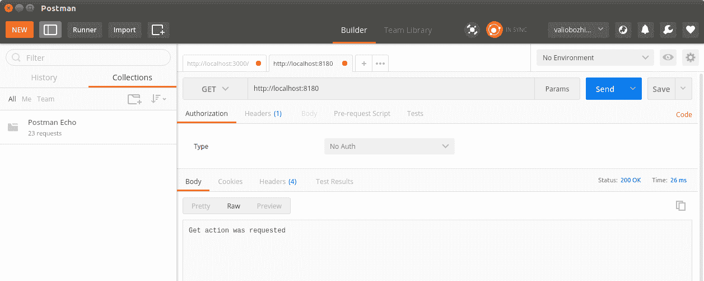

# 二、Node.js 入门

在本章中，您将获得第一次真正的 Node.js 体验。我们将从安装 Node.js 开始，并在本书中使用一些模块。然后，我们将建立一个开发环境。在本书中，将使用 Atom IDE。是的，GitHub 的在线编辑器终于登陆桌面环境，可以在您喜欢的平台上使用！

接下来，我们将创建一个工作区并开始开发我们的第一个 Node.js 应用。它将是一个处理传入 HTTP 请求的简单服务器应用。我们将更进一步，演示如何模块化和单元测试我们的 JavaScript 代码。最后，我们将在 Heroku 云应用平台上部署我们的第一个应用。

总而言之，在本章中，我们将介绍以下主题：

*   安装 Node.js
*   安装 Express framework 和其他模块
*   建立发展环境
*   处理 HTTP 请求
*   模块化代码
*   测试 Node.js
*   部署应用

# 安装 Node.js

让我们从 Node.js 安装开始我们的 Node.js 之旅。Windows 和 macOS 的安装程序都可以在[上找到 https://nodejs.org/en/download/](https://nodejs.org/en/download/) 。在撰写本文时，Node.js 10 刚刚作为当前版本发布，并将于 2018 年 8 月成为下一个长期支持版本。Linux 用户可以从可用的 Linux 二进制文件构建 Node.js，也可以使用他们的包管理器，因为 Node.js 可用于不同 Linux 发行版的大多数流行包存储库。例如，Ubuntu 和其他基于 Debian 的发行版应该首先指向最新的 Node.js 10 包，然后通过 shell 中的`apt-get`命令进行安装：

```js
curl -sL https://deb.nodesource.com/setup_10.x | sudo -E bash -
sudo apt-get install nodejs
```

如果您决定使用适用于 macOS 或 Windows 的安装程序，向导将引导您完成一个相当典型的安装过程，您必须接受 Node.js 许可协议，然后提供安装路径。

通过软件包管理器执行安装的 Linux 用户需要单独安装**节点软件包管理器（npm）**；我们将在下一节中这样做。

成功安装后，应在`PATH`环境变量上设置节点

安装程序将为您预先选择 Node.js 运行时、npm、在线文档资源的快捷方式，以及将 Node.js 和 npm 添加到您的操作系统`PATH`环境变量的选项。

要验证安装是否成功，请从 shell 执行以下操作：

```js
node --version 
```

At the time of writing, the latest Node.js version is 10.0.0 so, as expected, this version number will be the output of the version check. Node.js 10 will be the next Long Term Supported version, so it will stay actual for the next few years

# Npm

Node.js 通过提供**npm**简化了对第三方开源开发模块的支持。作为开发人员，它允许您轻松地安装、管理甚至提供自己的模块包。npm 包存储库位于[http://www.npmjs.org/](http://www.npmjs.org/) 并可通过其命令行界面访问。

如果您没有使用安装程序，则需要单独安装`npm`。例如，Ubuntu 用户可以按如下方式使用其软件包安装程序：

```js
apt-get npm install
```

如果您升级了 Node.js 安装，并且之前安装了 npm 5.6，则会要求您将其升级到版本 6。为此，只需执行以下操作：

```js
sudo npm i -g npm
```

安装 npm 后，通过编辑`~/.profile`文件将路径导出到 npm，将其永久设置在用户配置文件的`PATH`环境变量中非常有用，如下所示：

```js
export PATH=$PATH:/path/to/npm
```

成功安装 npm 后，使用 npm 的`ls`选项显示当前安装的 Node.js 模块：

```js
bojinov@developer-machine:~$ npm ls
/home/bojinov
├─┬ accepts@1.3.3
│ ├─┬ mime-types@2.1.13
│ │ └── mime-db@1.25.0
│ └── negotiator@0.6.1
├── array-flatten@1.1.1
├─┬ cache-control@1.0.3
│ ├─┬ cache-header@1.0.3
│ │ ├── lodash.isnumber@2.4.1 deduped
│ │ ├── lodash.isstring@2.4.1
│ │ └── regular@0.1.6 deduped
│ ├─┬ fast-url-parser@1.1.3
│ │ └── punycode@1.4.1
│ ├─┬ glob-slasher@1.0.1
│ │ ├── glob-slash@1.0.0
│ │ ├─┬ lodash.isobject@2.4.1
│ │ │ └── lodash._objecttypes@2.4.1
│ │ └─┬ toxic@1.0.0
│ │ └── lodash@2.4.2
│ ├─┬ globject@1.0.1
│ │ └── minimatch@2.0.10 extraneous
│ ├── lodash.isnumber@2.4.1
│ ├── on-headers@1.0.1
│ └── regular@0.1.6
├── content-disposition@0.5.1
├── content-type@1.0.2
├── cookie@0.3.1
├── cookie-signature@1.0.6
```

# 安装 Express framework 和其他模块

现在我们已经安装了`npm`，让我们利用它并安装一些我们将在本书中大量使用的模块。其中最重要的是 Express 框架（[http://www.expressjs.com/](http://www.expressjs.com/) 。它是 Node.js 的灵活 web 应用框架，为开发单页或多页 web 应用提供了健壮的 RESTful API。以下命令将从 npm 存储库下载 Express 模块，并使其可用于本地 Node.js 安装：

```js
npm install -g express 
```

成功安装后，您将在`npm ls`的结果中找到`express`模块。在本章后面，我们将学习如何为 Node.js 模块编写单元测试。为此，我们需要`nodeunit`模块：

```js
npm install nodeunit -g 
```

`-g`选项将全局安装`nodeunit`。这意味着模块将存储在文件系统的中心位置；通常为`/usr/lib/node_modules`**或**`/usr/lib/node`**，但可以配置为 Node.js 的全局配置。全局安装的模块可用于所有正在运行的节点应用。**

 **本地安装的模块将存储在项目当前工作目录的`node_modules`子目录中，并且仅对单个项目可用。

现在，回到`nodeunit`模块，它提供了创建基本单元测试的基本断言测试函数以及执行这些测试的工具。

在开始使用 Node.js 进行开发之前，我们还有一件事要研究：Node.js 应用的包描述符文件。

所有 Node.js 应用或模块都包含一个`package.json`描述符文件。它提供了有关模块、其作者及其使用的依赖项的元信息。让我们看一下前面安装的μT2 进制模块的 Tyl T1 文件。

```js
{
  "_from": "express",
  "_id": "express@4.16.1",
  "_inBundle": false,
  "_integrity": "sha512-STB7LZ4N0L+81FJHGla2oboUHTk4PaN1RsOkoRh9OSeEKylvF5hwKYVX1xCLFaCT7MD0BNG/gX2WFMLqY6EMBw==",
  "_location": "/express",
  "_phantomChildren": {},
  "_requested": {
    "type": "tag", "registry": true, "raw": "express", "name": "express",
    "escapedName": "express","rawSpec": "", "saveSpec": null, "fetchSpec": "latest"
  },
  "_requiredBy": [
    "#USER"
  ],
  "_resolved": "https://registry.npmjs.org/express/-/express-4.16.1.tgz",
  "_shasum": "6b33b560183c9b253b7b62144df33a4654ac9ed0",
  "_spec": "express",
  "_where": "/home/valio/Downloads",
  "author": {
    "name": "TJ Holowaychuk",
    "email": "tj@vision-media.ca"
  },
  "bugs": {
    "url": "https://github.com/expressjs/express/issues"
  },
  "bundleDependencies": false,
  "contributors": [
    {
      "name": "Aaron Heckmann",
      "email": "aaron.heckmann+github@gmail.com"
    },
   ...,
    {
      "name": "Young Jae Sim",
      "email": "hanul@hanul.me"
    }
  ],
  "dependencies": {
    "accepts": "~1.3.4",
    "array-flatten": "1.1.1",
    "body-parser": "1.18.2",
    ...,
    "type-is": "~1.6.15",
    "utils-merge": "1.0.1",
    "vary": "~1.1.2"
  },
  "deprecated": false,
  "description": "Fast, unopinionated, minimalist web framework",
  "devDependencies": {
    "after": "0.8.2",
    "connect-redis": "~2.4.1",
    ...,
    "should": "13.1.0",
    "supertest": "1.2.0",
    "vhost": "~3.0.2"
  },
  "engines": {
    "node": ">= 0.10.0"
  },
  "files": ["LICENSE", "History.md", "Readme.md", "index.js","lib/"],
  "homepage": "http://expressjs.com/",
  "keywords": [
    "express", "framework", "sinatra", "web", "rest", "restful", "router", "app", "api"
  ],
  "license": "MIT",
  "name": "express",
  "repository": {
    "type": "git",
    "url": "git+https://github.com/expressjs/express.git"
  },
  "scripts": {
    "lint": "eslint .",
    "test": "mocha --require test/support/env --reporter spec --bail --check-leaks test/ test/acceptance/"
  },
  "version": "4.16.1"
}
```

包的名称和版本是每个模块的必需属性。所有其他元信息（如贡献者列表、存储库类型和位置、许可证信息等）都是可选的。最有趣的属性之一，值得一提的是`dependencies`属性。它告诉 npm 您的包所依赖的模块。让我们深入地看看这是如何指定的。每个依赖项都有一个名称和一个版本。

这告诉 npm 包依赖于版本为 1.3.4 的`accepts`模块和版本为 1.8.2 的`body-parse`模块。因此，当 npm 安装模块时，它将隐式下载并安装依赖项的最新次要版本，以防它们不可用。

依赖项的版本以以下格式指定：`major.minor.patch-version`。如果您希望 npm 完全使用指定的版本，可以指定 npm，或者您可以让 npm 始终下载最新的可用次要版本，方法是以`~`开始版本；参考`accepts`依赖项

For more information on versioning, visit the website of the semantic versioning specification at [http://www.semver.org/](http://www.semver.org/).
Depending on automatically managed version may result in backward incompatibility, make sure you test your application each time you switch a version.

# 建立发展环境

JavaScript 开发人员很少习惯于在 IDE 中开发他们的项目；他们中的大多数人使用文本编辑器，并且倾向于对任何与他们观点相矛盾的东西抱有偏见。GitHub 最终通过发布用于桌面环境的 AtomIDE，使大多数人平静下来。这可能无法解决关于哪种环境最好的所有争论，但至少会带来一些平静，让人们专注于他们的代码，而不是工具，这最终是个人偏好的问题。本书中的示例是在 Atom IDE 中开发的，但是可以随意使用任何可以创建文件的软件，包括命令行编辑器（如 vi 或 vim），如果这会让你感觉自己像一个 JS 超级英雄，尽管要记住超级英雄是 20 世纪的事！

您可以从[下载 Atom IDEhttps://ide.atom.io/](https://ide.atom.io/) 。

现在是时候启动我们的第一个 Node.js 应用了，它是一个简单的 web 服务器，用`Hello from Node.js`响应。从您的项目中选择一个目录，例如`hello-node`，然后从中打开一个外壳终端并执行`npm init`：

```js
npm init

package name: (hello-node) 
version: (1.0.0) 
description: Simple hello world http handler
entry point: (index.js) app.js
test command: test
git repository: 
keywords: 
author: Valentin Bojinov
license: (ISC) 
About to write to /home/valio/nodejs8/hello-node/package.json:

{
 "name": "hello-node",
 "version": "1.0.0",
 "description": "Simple hello world http handler",
 "main": "app.js",
 "scripts": {
 "test": "test"
 },
 "author": "Valentin Bojinov",
 "license": "ISC"
}

Is this ok? (yes) yes

```

命令行交互向导将询问您的项目名称、版本以及一些其他元数据，如 Git repository、您的名称等，并最终预览要生成的`package.json`文件；完成后，您的第一个 Node.js 项目就可以开始了。

现在是花点时间研究本书中使用的代码约定的适当时机；当需要定义短回调函数时，将使用 ES6 内联匿名函数，而当需要重用性和可测试性时，将使用常规 javascript 函数。

启动 Atom IDE，选择文件|添加项目文件夹…，然后导入在其中定义项目的目录。最后，导入成功后，您将在项目中看到生成的`package.json`文件。右键点击目录，选择新建文件，创建一个名为`hello-node.js`的文件：

```js
var http = require('http');

http.createServer((request, response) => {
  response.writeHead(200, {
    'Content-Type' : 'text/plain'
  });
  response.end('Hello from Node.JS');
  console.log('Hello handler requested');
}).listen(8180, '127.0.0.1', () => {
  console.log('Started Node.js http server at http://127.0.0.1:8180');
});
```

`hello-node.js`文件使用 Node.js HTTP 模块开始侦听端口`8180`上的传入请求。它将以静态`Hello from Node.JS`回复每个请求，并在控制台中记录 hello 日志条目。在启动应用之前，我们必须安装为其创建 HTTP 服务器的`http`模块。让我们将其与`--save`选项一起全局安装，这将在项目的`package.json`文件中为其添加一个依赖项。然后我们可以启动应用：

```js
npm install -g http --save
node hello-node.js  
```

从浏览器中打开`http://localhost:8180/`将导致向服务器应用发送请求，服务器应用将在控制台中创建日志条目，并在浏览器中输出`Hello from Node.JS`：


# 处理 HTTP 请求

目前，无论处理何种 HTTP 请求，我们的服务器应用都将以相同的方式运行。让我们对其进行扩展，使其行为更像 HTTP 服务器，并通过为每种类型的请求实现处理函数，开始根据传入请求的类型区分它们。

让我们创建一个新的`hello-node-http-server.js`，如下所示：

```js
var http = require('http');
var port = 8180;

function handleGetRequest(response) {
  response.writeHead(200, {'Content-Type' : 'text/plain'});
  response.end('Get action was requested');
}

function handlePostRequest(response) {
  response.writeHead(200, {'Content-Type' : 'text/plain'});
  response.end('Post action was requested');
}

function handlePutRequest(response) {
  response.writeHead(200, {'Content-Type' : 'text/plain'});
  response.end('Put action was requested');
}

function handleDeleteRequest(response) {
  response.writeHead(200, {'Content-Type' : 'text/plain'});
  response.end('Delete action was requested');
}

function handleBadRequest(response) {
  console.log('Unsupported http mehtod');
  response.writeHead(400, {'Content-Type' : 'text/plain'  });
  response.end('Bad request');
}

function handleRequest(request, response) {
  switch (request.method) {
    case 'GET':
      handleGetRequest(response);
      break;
    case 'POST':
      handlePostRequest(response);
      break;
    case 'PUT':
      handlePutRequest(response);
      break;
    case 'DELETE':
      handleDeleteRequest(response);
      break;
    default:
      handleBadRequest(response);
      break;
  }
  console.log('Request processing completed');
}

http.createServer(handleRequest).listen(8180, '127.0.0.1', () => {
  console.log('Started Node.js http server at http://127.0.0.1:8180');
});
```

当我们运行这个应用时，我们的 HTTP 服务器将识别`GET`、`POST`、`PUT`和`DELETE`HTTP 方法，并将在不同的功能中处理它们。对于所有其他 HTTP 请求，它将优雅地响应`HTTP 400 BAD REQUEST`状态代码。为了与 HTTP 应用交互，我们将使用 Postman，可从[下载 https://www.getpostman.com/](https://www.getpostman.com/) 。它是一个轻量级应用，用于向端点发送 HTTP 请求、指定 HTTP 头并提供有效负载。尝试并执行我们之前实现的每个处理程序函数的测试请求：



# 模块化代码

到目前为止，我们开发的是一个简单的 HTTP 服务器应用，它侦听和处理已知的请求类型；但是，它的结构不是很好，因为处理请求的函数是不可重用的。Node.js 支持包含代码隔离和可重用性的模块。

A user**-**defined module is a logical unit consisting of one or more related functions. The module can export one or more functions to other components while keeping other functions visible only to itself.

我们将对 HTTP 服务器应用进行返工，使整个请求处理功能包装在一个模块中。模块将只导出一个通用处理函数，该函数将以请求对象为参数，并根据其请求类型，将处理委托给模块外部不可见的内部函数。

让我们首先在项目中创建一个新的模块目录。我们将通过将以下函数提取到新创建目录中的新`http-module.js`文件来重构以前的源文件：

```js
function handleGetRequest(response) {
  response.writeHead(200, {'Content-Type' : 'text/plain'});
  response.end('Get action was requested');
}

function handlePostRequest(response) {
  response.writeHead(200, {'Content-Type' : 'text/plain'});
  response.end('Post action was requested');
}

function handlePutRequest(response) {
  response.writeHead(200, {'Content-Type' : 'text/plain'});
  response.end('Put action was requested');
}

function handleDeleteRequest(response) {
  response.writeHead(200, {'Content-Type' : 'text/plain'});
  response.end('Delete action was requested');
}

function handleBadRequest(response) {
  console.log('Unsupported http mehtod');
  response.writeHead(400, {'Content-Type' : 'text/plain'  });
  response.end('Bad request');
}

exports.handleRequest = function(request, response) {
  switch (request.method) {
    case 'GET':
      handleGetRequest(response);
      break;
    case 'POST':
      handlePostRequest(response);
      break;
    case 'PUT':
      handlePutRequest(response);
      break;
    case 'DELETE':
      handleDeleteRequest(response);
      break;
    default:
      handleBadRequest(response);
      break;
  }
  console.log('Request processing completed');
}
```

该文件创建了一个用户定义的模块，用于导出`handleRequest`函数，使其可用于其他组件。所有其他功能只能在模块内访问。尽管示例仅导出一个函数，但模块可以导出尽可能多的函数。

让我们使用第一个项目的`main`目录中`main.js`文件中的新`http-module`。我们需要使用 Node.js 内置的`http`模块创建`http`服务器，其`createServer`将其`handleRequest`函数作为参数传递。它将用作服务器在每次请求时调用的回调函数：

```js
var http = require('http');
var port = 8180;

var httpModule = require('./modules/http-module');

http.createServer(httpModule.handleRequest).listen(8180, '127.0.0.1', () => {
  console.log('Started Node.js http server at http://127.0.0.1:8180');
});
```

我们将服务器套接字的创建与处理绑定到它的传入请求的业务逻辑分离开来。`require`指令用于导入我们的模块。它使用到它的相对路径。通过使用 Postman 工具执行另一个测试请求，也可以尝试此版本。

Luckily, we will not be creating our own HTTP handlers when implementing our RESTful-enabled applications. The Express framework will do this for us. The examples in this chapter are meant to provide a clear example of the Node.js possibilities when it comes to handling HTTP requests and how user modules are implemented. We will take a detailed look at the Express framework in [Chapter 3](3.html), *Building a Typical Web API*.

# 测试 Node.js

现在，我们将通过为 HTTP 模块提供单元测试来扩展我们的项目，但是在深入研究之前，让我们看看 Node.js 通常是如何支持单元测试的。在本章的开头，我们安装了 Nodeunit 模块。我们该开始玩了。

首先，让我们创建另一个简单的 Node.js 模块，用于实现第一个单元测试。然后我们将转到更高级的主题，例如模拟 JavaScript 对象并使用它们为 HTTP 模块创建单元测试。

我选择开发一个简单的数学模块，导出用于整数加减的函数，因为它足够简单，并且每个操作的结果都是严格定义的。

让我们从模块开始，在我们的`module`目录中创建以下`math.js`文件：

```js
exports.add = function (x, y) { 
  return x + y; 
}; 
exports.subtract = function (x, y) { 
  return x - y; 
}; 
```

下一步是在我们项目的`test`子目录中创建一个`test-math.js`文件：

```js
var math = require('../modules/math');
exports.addTest = function (test) {
  test.equal(math.add(1, 1), 2);
  test.done();
};
exports.subtractTest = function (test) {
  test.equals(math.subtract(4,2), 2);
  test.done();
};
```

最后，使用`nodeunit test/test-math.js`从外壳终端运行测试模块。输出将显示所有测试方法的结果，指定它们是否成功通过：

```js
nodeunit test/test-math.js    
    test-math.js
    test-math.js
 addTest
 subtractTest

OK: 2 assertions (5ms)
```

让我们修改`addTest`以使其被破坏，并查看 Nodeunit 模块如何报告测试失败：

```js
exports.test_add = function (test) { 
    test.equal(math.add(1, 1), 3); 
    test.done(); 
}; 
```

这次执行测试会导致一些 assert failure 消息失败，最后会出现一个聚合，表示有多少已执行测试失败：

```js
nodeunit test-math.js
test-math.js
 addTest
at Object.equal (/usr/lib/node_modules/nodeunit/lib/types.js:83:39)
at Object.exports.addTest (../hello-node/test/test-math.js:
(..)

AssertionError: 2 == 3
 subtractTest
FAILURES: 1/2 assertions failed (12ms)
```

我们刚刚创建了 Nodeunit 的第一个单元测试。然而，它以一种相当孤立的方式测试数学函数。我想您可能想知道如何使用 Nodeunit 测试具有复杂参数的函数，例如绑定到上下文的 HTTP 请求和响应。这可以使用所谓的**模拟对象**实现。它们是基于复杂上下文的参数或函数状态的预定义版本，位于我们希望在单元测试中使用的对象中，以便测试模块的行为以了解对象的确切状态。

要使用模拟对象，我们需要安装一个支持对象模拟的模块。有各种类型的测试工具和模块可用。然而，它们中的大多数都是为了测试 JavaScript 客户端功能而设计的。有一些模块，如 JsMockito，著名的 Mockito Java 框架的 JavaScript 分支，以及 node inspector，一个提供 JavaScript 调试器的模块，该调试器在 Google Chrome 浏览器中隐式启动。

Chrome 浏览器的本机支持是合乎逻辑的，因为 Node.js 构建在 Google V8 JavaScript 引擎之上。在我们开发服务器端应用时，这些不是最方便的工具，因为 JsMockito 不能作为 Node.js 模块插入，在浏览器中使用调试器调试支持的应用对我来说似乎并不合适。无论如何，如果您打算深入研究 Node.js，那么一定要尝试一下。

For testing server-side JavaScript modules, we will use the Sinon.JS module. Like all the other modules, it is available in the npm repository, so execute the following command to install it:

```js
npm install -g sinon
```

JS 是一个非常灵活的 JavaScript 测试库，提供模拟、存根和监视 JavaScript 对象的功能。可在[获取 http://sinonjs.org](http://sinonjs.org) 可以与任何 JavaScript 测试框架一起使用。让我们看看测试 HTTP 模块需要什么。它导出一个方法`handleRequest`，该方法将 HTTP 请求和响应对象作为参数。根据请求的方法，模块调用其内部函数来处理不同的请求。每个请求处理程序向响应写入不同的输出。

要在诸如 Nodeunit 之类的隔离环境中测试此功能，我们需要模拟对象，然后将其作为参数传递。为了确保模块按预期运行，我们需要访问存储在这些对象中的数据。

# 使用模拟对象

以下是使用模拟对象时需要执行的步骤：

1.  以`sinon`为参数调用`require`函数，并从中导出`test`函数：

```js
var sinon = require('sinon'); 
exports.testAPI(test){...} 
```

2.  定义要模拟的方法的 API 描述，如下所示：

```js
var api = {'methodX' : function () {},  
  'methodY' : function() {},  
  'methodZ' : function() {}}; 
```

3.  在导出的函数中使用`sinon`，以便根据`api`描述创建模拟对象：

```js
var mock = sinon.mock(api);
```

4.  设置模拟对象的期望值。通过描述模拟方法的行为方式、应该接受的参数以及应该返回的值，对模拟对象设置期望值。当调用模拟方法的状态与描述的不同时，在稍后验证时，预期将失败：

```js
mock.expects('methodX').once().withArgs('xyz') 
.returns('abc'); 
api.methodX('xyz') 
```

5.  前面的示例期望使用`xyz`参数调用`methodX`一次，并强制方法返回`abc`。Sinon.JS 模块为我们实现了这一点。

The method of the description object is called and not that of the mocked object. The mocked object is used to set the expectations for the mocked method, and later to check whether those expectations have been fulfilled.

6.  在测试环境中使用模拟对象，然后调用其`verify()`方法。此方法将检查正在测试的代码是否与 mock 正确交互，即该方法已被调用多少次，以及是否已使用预期参数调用该方法。如果没有满足任何期望，那么将抛出一个错误，导致测试失败。
7.  我们测试模块导出的`test`函数有一个参数。该参数提供了可用于检查测试条件的断言方法。在我们的示例中，我们模仿该方法在使用`'xyz'`参数调用时始终返回`abc`。因此，为了完成测试，可以执行以下断言，最后需要验证模拟对象：

```js
mock.expects('methodX').once().withArgs('xyz') 
.returns('abc');           
test.equals(api.methodX('xyz'), 'abc'); 
mock.verify(); 
```

8.  尝试修改传递给`methodX`的参数，使其与预期不匹配，您将看到这破坏了测试。

9.  让我们将这些步骤付诸实践，并在`test`目录中创建以下`test-http-module.js`文件：

```js
var sinon = require('sinon');
exports.handleGetRequestTest =  (test) => {
  var response = {'writeHead' : () => {}, 'end': () => {}};
  var responseMock = sinon.mock(response);
    responseMock.expects('end').once().withArgs('Get action was requested');
    responseMock.expects('writeHead').once().withArgs(200, {
      'Content-Type' : 'text/plain'});

  var request = {};
  var requestMock = sinon.mock(request);
  requestMock.method = 'GET';

  var http_module = require('../modules/http-module');
  http_module.handleRequest(requestMock, response);
  responseMock.verify();
  test.done();
};
```

10.  使用 Nodeunit 的`test-http-module.js`启动测试，以验证其是否成功通过。您的下一步将是扩展测试，以便它涵盖 HTTP 模块中所有 HTTP 方法的处理：

```js
nodeunit test/test-http-module.js 

test-http-module.js
Request processing completed
 handleGetRequestTest

OK: 0 assertions (32ms)
```

# 部署应用

Node.js 有一个事件驱动的、非阻塞的 I/O 模型，这使得它非常适合在分布式环境（如公共或私有云平台）中扩展良好的实时应用。每个云平台都提供了允许无缝部署、分发和扩展其托管应用的工具。在本节中，我们将介绍两个公开的 Node.js 应用云提供商 Nodejitsu 和 microsoftazure。

但首先，让我们花一些时间讨论集群支持，因为它是理解 Node.js 为何如此适合云环境的基础。Node.js 的核心内置了集群支持。在应用中使用集群模块可以让他们启动尽可能多的工作人员来处理他们将面临的负载。通常，建议将工作线程数与环境中的线程数或逻辑核数相匹配。

The heart of your application is the master process. It is responsible for keeping a registry of active workers and the load of the application, and how to create it. It also creates more workers when needed and reduces them when the load decreases.

云平台还应确保在部署新版本的应用时没有停机时间。在这种情况下，需要通知主进程应该分发新版本。它应该为新工作人员的新应用版本分叉，并通知当前使用旧版本运行的工作人员关闭其侦听器；因此，它停止接受连接，并在连接完成后优雅地退出。因此，所有新的传入请求都将由新启动的 worker 处理，在过时的 worker 终止后，所有正在运行的 worker 将运行最新版本。

# 野田佳久

让我们仔细研究一下一些节点.js*OrthT0.平台作为服务 OutT1（SurtT2aPaaS Tyt3）提供的服务。我们将看到的第一个 PaaS 是 Nodejitsu，可在[上找到 https://www.nodejitsu.com](https://www.nodejitsu.com) 。

这允许在云上无缝部署 Node.js 应用，并具有许多用于开发、管理、部署和监视 Node.js 应用的有用功能。要与 jitsu 交互，您需要安装其命令行界面，该界面作为 Node.js 模块提供：

```js
npm install -g jitsu 
```

安装柔术并以`jitsu`开始后，您将受到热烈欢迎，友好的控制台屏幕将向您介绍基本的柔术命令，如下所示：


为了与柔术互动，你需要报名参加。柔术提供不同的定价方案，以及免费试用服务。

你可以从他们的网站上或者通过`jitsu signup`命令来完成。然后，您可以开始使用命令行界面提供的工具。

# 微软 Azure

Microsoft 的云平台即服务 Azure 还提供 Node.js 应用的托管。他们选择了一种稍有不同的方法，他们没有提供命令行界面来与他们的存储库交互，而是利用了 Git 集成；也就是说，与 Azure 交互就像与任何其他 Git 存储库交互一样。如果您不熟悉 Git，我强烈建议您进一步了解这个分布式源代码版本控制系统。

If you've chosen Azure as your platform, you will find the following link very useful: [http://azure.microsoft.com/en-us/develop/nodejs/](http://azure.microsoft.com/en-us/develop/nodejs/).

# 赫罗库

Heroku 是一款公共云产品，允许您管理、部署和扩展 Node.js 应用。为 Heroku 环境准备节点应用不需要花费太多的精力，只要您安装其命令行界面（可在[上使用）https://devcenter.heroku.com/articles/heroku-cli](https://devcenter.heroku.com/articles/heroku-cli) 或通过您的软件包经理提供以下信息：

```js
npm install -g heroku-cli
```

您所要做的就是在`package.json`文件中提供一个`'start script'`元素，使用`git push master heroku`将其推送到相关的源 Git 存储库，然后使用`heroku login`和`heroku create`命令登录并创建您的应用。

# 自测题

为了对你新学到的知识有更多的信心，请阅读下一组陈述，并说明它们是否正确：

1.  节点模块可以将多个功能导出到外部组件
2.  节点模块是可扩展的
3.  模块总是需要显式地声明它们对其他模块的依赖关系
4.  在测试环境中使用模拟时，会对模拟对象调用模拟方法
5.  调试 Node.js 代码不像其他非 JavaScript 代码那样简单

# 总结

在本章中，您获得了第一次 Node.js 体验，从一个简单的`Hello world`应用开始，然后转到一个更复杂的类似 HTTP 服务器的示例应用，该应用处理传入的 HTTP 请求。为了对 Node.js 更加自信，您重构了应用以使用用户模块，然后使用模拟框架为模块创建了单元测试，以消除对测试环境中复杂对象的依赖。

现在您已经了解了如何处理和测试传入的 HTTP 请求，在下一章中，我们的下一步将是定义典型的 web API 的外观以及如何测试它。**