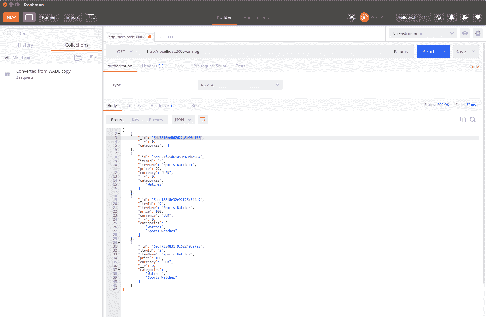
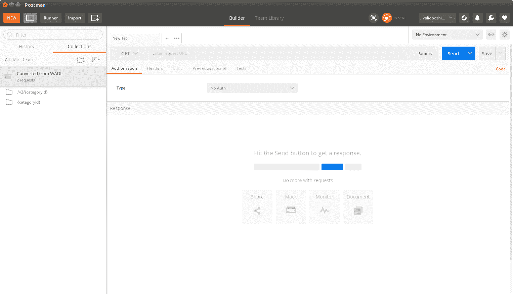

# Restful API 设计指南

在前一章中，我们实现了一个 catalog 模块，该模块公开了 catalog 应用程序中项目的数据操作函数。这些函数利用`express.js`**请求**对象解析体内传入的数据，然后执行相应的数据库操作。如果需要，每个函数用相关的状态代码和响应体有效载荷填充**响应**对象。最后，我们将每个函数绑定到一个路由，接受 HTTP 请求。

现在，是时候仔细查看路由的 URL 和每个操作返回的 HTTP 状态码了。

在本章中，我们将介绍以下主题：

*   端点 URL 和 HTTP 状态代码最佳实践
*   扩展性和版本控制
*   链接数据

# 端点 URL 和 HTTP 状态代码最佳实践

每个 RESTful API 操作都是针对 URL 的 HTTP 请求和适当的 HTTP 方法的组合。

执行时，每个操作将返回一个状态代码，指示调用是否成功。成功调用由 HTTP 2XX 状态代码表示，而未正确执行的操作则用错误的状态代码表示，如果错误在客户端，则为 4XX；如果服务器无法处理有效请求，则为 5xx。

拥有一个明确的 API 对其采用至关重要。此类规范不仅应完全列举每个操作的状态代码，还应指定预期的数据格式，即其支持的媒体类型。

下表定义了 Express.js 路由将如何公开 API 操作，并应作为其参考规范：

| 方法 | URI | 媒体类型 | 描述 | 状态码 |
| 收到 | /目录 | 应用程序/json | 返回目录中的所有项。 | 200 行500 内部服务器错误 |
| 收到 | /目录/{categoryId} | 应用程序/json | 返回所选类别的所有项目。
如果类别不存在，则返回 404。 | 200 好,，404 找不到500 内部服务器错误 |
| 收到 | /item/{itemId} | 应用程序/json | 返回所选 itemId 的单个项。
如果没有该项，则返回 404。 | 200 好,，404 找不到500 内部服务器错误 |
| 邮递 | /项目/ | 应用程序/json | 创建一个新项目；如果存在具有相同标识符的项，则将对其进行更新。创建项目时，返回一个**位置**头。它提供可以访问新创建的项目的 URL。 | 201 创建200 行500 内部服务器错误 |
| 放 | /item/{itemId} | 应用程序/json | 更新现有项目；如果具有所提供标识符的项不存在，它将创建该项。创建项目时，返回一个**位置**头。它提供可以访问新创建的项目的 URL。 | 201 创建200 行500 内部服务器错误 |
| 删去 | /item/{itemId} | 应用程序/json | 删除现有项目；如果具有所提供标识符的项不存在，则返回 404。 | 200 好,，404 找不到500 内部服务器错误 |

目录应用程序处理两种类型的实体：项和类别。每个项目实体都包含其所属类别的集合。如您所见，类别在我们的应用程序中只是一个逻辑实体；只要至少有一个项目引用它，它就会存在；如果没有任何项目引用它，它就会停止存在。这就是为什么应用程序仅为类型项的资源公开用于公开数据操作函数的路由，而对类别的操作或多或少是只读的。更仔细地查看暴露项的数据操作操作的 URL，我们可以看到一个清晰的模式，将 URL 与 REST 基本原则对齐—资源由单个 URL 暴露，并且它支持由请求的 HTTP 方法确定的资源操作操作。总之，这里列出了定义良好的 API 应该遵循的公认规则。它们在语义上与每个资源操纵操作相关：

*   创建**新**资源时，服务使用**201 创建的**状态码，后跟一个位置头，指定可以访问新创建资源的 URL。
*   可以实现创建资源的操作，以优雅地拒绝创建已使用唯一标识符的资源；在这种情况下，该操作应指示具有适当状态代码**409 冲突**的非成功调用，或更一般的**400 错误请求**。但是，一般状态代码之后应始终对出现的问题进行有意义的解释。在我们的实现中，我们选择了一种不同的方法，即从创建操作中更新资源（如果存在），并通过返回**200 OK**状态代码而不是**201 Created**来通知调用方资源已更新。
*   **更新**操作类似于创建操作；但是，它总是期望一个资源标识符作为参数，如果存在具有该标识符的资源，它将使用 HTTP PUT 请求主体中提供的新状态进行更新。**200 OK**状态代码表示调用成功。实现可以决定拒绝处理具有**404 Not Found**状态代码的不存在资源，或者使用传递的标识符创建新资源。在这种情况下，它将返回**201 创建的**状态代码，后跟一个位置头，该位置头指定可以访问新创建的资源的 URL。我们的 API 使用了第二个选项。
*   虽然成功的**删除**可以用**204 无内容**状态和进一步的有效负载来表示，但大多数用户代理都希望在**2xx**HTTP 状态之后有一个主体。因此，为了与大多数代理保持兼容，我们的 API 将使用**200 OK**状态代码指示成功删除，后跟 JSON 负载：`{'Status': 'Successfully deleted'}`。状态代码**404 未找到**将指示具有所提供标识符的资源不存在。
*   一般来说，**5XX**不应表示应用程序状态错误，而应表示更严重的错误，如应用程序服务器或数据库故障。
*   最佳实践是，`update`和`create`操作应作为有效负载返回到资源的整个状态。例如，如果资源是使用最少的属性集创建的，则所有未指定的属性都将获得默认值；响应主体应包含对象的完整状态。同样适用于更新；即使更新操作部分更新了资源重述，响应也应返回完整状态。如果用户代理需要检查新状态，这可能会为其保存额外的 GET 请求。

现在我们已经定义了一些关于操作行为的一般性建议，是时候在新版本的 API 中实现它们了。

# 扩展性和版本控制

我们已经在[第 3 章](5.html)*中定义了一些基本的版本控制规则，构建了一个典型的 Web API*。让我们将它们应用于我们在上一章中实现的 MongoDB 数据库感知模块。我们的出发点是使 API 的当前使用者能够在不同的 URL 上继续使用相同的版本。这将使它们在采用并成功测试新版本之前保持向后兼容。

保持 RESTAPI 稳定并不是仅仅将一个端点从一个 URI 移动到另一个 URI 的问题。执行重定向之后再使用行为不同的 API 是没有意义的。因此，我们需要确保移动端点的行为保持不变。为了确保我们不会更改以前实现的行为，让我们通过将文件重命名为`catalogV1.js`将当前行为从`catalog.js`模块移动到新模块。然后，将其复制到`catalogV2.js`模块，在那里我们将介绍所有新功能；但在此之前，我们必须将版本 1 从`/, /{categoryId}, /{itemId}`改为`/v1, /v1/{categoryId}, /v1/{itemId}`：

```js
const express = require('express');
const router = express.Router();

const catalogV1 = require('../modules/catalogV1');
const model = require('../model/item.js');

router.get('/v1/', function(request, response, next) {
  catalogV1.findAllItems(response);
});

router.get('/v1/item/:itemId', function(request, response, next) {
  console.log(request.url + ' : querying for ' + request.params.itemId);
  catalogV1.findItemById(request.params.itemId, response);
});

router.get('/v1/:categoryId', function(request, response, next) {
  console.log(request.url + ' : querying for ' + request.params.categoryId);
  catalogV1.findItemsByCategory(request.params.categoryId, response);
});

router.post('/v1/', function(request, response, next) {
  catalogV1.saveItem(request, response);
});

router.put('/v1/', function(request, response, next) {
  catalogV1.saveItem(request, response);
});

router.delete('/v1/item/:itemId', function(request, response, next) {
  catalogV1.remove(request, response);
});

router.get('/', function(request, response) {
  console.log('Redirecting to v1');
  response.writeHead(301, {'Location' : '/catalog/v1/'});
  response.end('Version 1 is moved to /catalog/v1/: ');
});

module.exports = router;
```

由于我们的 API 版本 2 尚未实现，对`/`执行`GET`请求将导致接收到`301 Moved Permanently`HTTP 状态，然后该状态将重定向到`/v1/`。这将通知我们的消费者 API 正在发展，他们很快需要决定是通过显式请求其新 URI 继续使用版本 1，还是准备采用版本 2。

去试试吧！启动修改后的节点应用程序，从 Postman 向`http://localhost:3000/catalog`发出 GET 请求：



您将看到您的请求被重定向到位于`http://localhost:3000/catalog/v1`的新路由位置。

现在我们已经完成了目录的第 1 版，是时候考虑在第 2 版中添加更多的扩展了。目前，catalog 服务支持列出一个类别中的所有项目，并通过其 ID 获取项目。现在应该充分利用 MongoDB 这一面向文档的数据库，实现一个功能，使我们的 API 消费者能够根据项目的任何属性查询项目。例如，列出具有与查询参数（如价格或颜色）匹配的属性的特定类别的所有项目，或按项目名称进行搜索。RESTful 服务通常公开面向文档的数据。但是，它们的使用不仅限于文档。在下一章中，我们将扩展目录，使其还存储二进制数据，即可以链接到每个项目的图像。为此，我们将在[第 6 章](6.html)中的*处理任意数据*部分中使用名为**二进制 JSON**（**BSON**的 MongoDB 二进制格式，*实现完整的 RESTful 服务*。

回到搜索扩展，我们已经使用了`Mongoose.js`模型的`find()`和`findOne()`函数。到目前为止，我们使用它们来提供要在 JavaScript 代码中静态搜索的文档属性的名称。然而，`find()`的这个过滤参数只是一个 JSON 对象，其中键是文档属性，值是查询中要使用的属性值。这是我们将添加到版本 2 中的第一个新函数。它通过任意属性及其值查询 MongoDB：

```js
exports.findItemsByAttribute = function (key, value, response) {
      var filter = {};
      filter[key] = value;
      CatalogItem.find(filter, function(error, result) {
          if (error) {
              console.error(error);
              response.writeHead(500, contentTypePlainText);
              response.end('Internal server error');
              return;
          } else {
              if (!result) {
                  if (response != null) {
                     response.writeHead(200, contentTypeJson);
                     response.end({});
                  }
                  return;
              }
              if (response != null){
                  response.setHeader('Content-Type', 'application/json');
                  response.send(result);
              }
          }
      });
    }
```

此函数使用提供的属性和值作为参数调用模型上的 find。我们将此函数绑定到路由的`/v2/item/`GET 处理程序。

最后，我们的目标是让`/v2/item/?currency=USD`只返回以美元货币销售的商品的记录，如传递的 GET 参数的值所示。这样，如果我们使用其他属性（如颜色和大小）修改模型，我们可以查询具有相同颜色的所有项目或项目可以具有的任何其他属性。

当查询字符串中没有提供参数时，我们将保留返回所有可用项列表的旧行为，但我们也将解析第一个提供的`GET`参数的查询字符串，并将其用作`findItemsByAttribute()`函数中的过滤器：

```js
router.get('/v2/items', function(request, response) {
    var getParams = url.parse(request.url, true).query;
    if (Object.keys(getParams).length == 0) {
      catalogV2.findAllItems(response);
    } else {
      var key = Object.keys(getParams)[0];
      var value = getParams[key];
      catalogV2.findItemsByAttribute(key, value, response);
    }
});
```

这个函数中最有趣的部分可能是 URL 解析。如您所见，我们一直使用相同的旧策略来检查是否提供了任何`GET`参数。我们解析 URL 以获取查询字符串，然后使用内置的`Object.keys`函数检查解析后的键/值列表是否包含元素。如果有，我们取第一个元素并提取其值。键和值都传递给`findByAttribute`函数。

You may want to improve Version 2 further by providing search support by multiple arguments that are provided by more than one `GET` parameters. I will leave that to you as an exercise.

# 发现和探索 RESTful 服务

发现 RESTful 服务的主题有着漫长而复杂的历史。HTTP 规范规定资源应该是自描述性的，并且应该由 URI 唯一标识。依赖资源应该由依赖项使用它们自己的唯一 URI 进行链接。发现 RESTful 服务意味着按照它提供的链接从一个服务导航到另一个服务。

2009 年，发明了一种称为**Web 应用程序发现语言**（**WADL**的规范。它旨在记录从 web 应用程序公开的每个 URI，以及它支持的 HTTP 方法和它期望的参数。还描述了 URI 的响应媒体类型。这对于文档编制非常有用，就 RESTful 服务提供而言，WADL 文件可以为我们提供所有这些。

不幸的是，目前没有 Node.js 模块可以为给定的快速路线自动生成 WADL 文件。我们必须手动创建一个 WADL 文件，以演示其他客户端如何使用它进行发现。

下面的列表显示了一个示例 WADL 文件，该文件描述了`/catalog, /catalog/v2/{categoryId}`中可用的资源：

```js
<?xml version="1.0" encoding="UTF-8"?>
<application  xmlns:service="http://localhost:8080/catalog/" xmlns:xsd="http://www.w3.org/2001/XMLSchema">
   <grammer>
      <include href="items.xsd" />
      <include href="error.xsd" />
   </grammer>
   <resources base="http://localhost:8080/catalog/">
      <resource path="{categoryId}">
         <method name="GET">
            <request>
               <param name="category" type="xsd:string" style="template" />
            </request>
            <response status="200">
               <representation mediaType="application/xml" element="service:item" />
               <representation mediaType="application/json" />
            </response>
            <response status="404">
               <representation mediaType="text/plain" element="service:item" />
            </response>
         </method>
      </resource>
      <resource path="/v2/{categoryId}">
         <method name="GET">
            <request>
               <param name="category" type="xsd:string" style="template" />
            </request>
            <response status="200">
               <representation mediaType="application/xml" element="service:item" />
               <representation mediaType="application/json" />
            </response>
            <response status="404">
               <representation mediaType="text/plain" element="service:item" />
            </response>
         </method>
      </resource>
   </resources>
</application>
```

如您所见，WADL 格式非常简单。它基本上描述了每个资源的 URI，提供了有关它使用的媒体类型的信息以及该 URI 上预期的状态代码。许多第三方 RESTful 客户机理解 WADL 语言，可以从给定的 WADL 文件生成请求消息。

让我们在 Postman 中导入 WADL 文件。单击导入按钮并选择 WADL 文件：



Import a WADL in Postman to get a stub of the service. This is a screenshot for Postman. The individual settings are not important here. The purpose of the image is just to show how the window looks.

如您所见，导入 WADL 文件的结果是我们有了一个项目，可以随时测试 REST 服务的各个方面。WADL 文件中定义的所有路由现在都可以作为右菜单上的单独请求实体方便地使用。这还不是全部；除了 WADL 标准外，目前大量采用了 swagger 文档格式，并已成为描述 RESTful 服务的非正式标准，因此我们还可以使用它来简化服务的采用和发现。在下一章中，我们将把这些描述文件绑定到我们的服务。这是生产准备阶段的一个重要步骤。

# 链接数据

每个目录应用程序都支持绑定到此项的一个或一组图像。为此，在下一章中，我们将看到如何在 MongoDB 中使用二进制对象。然而，现在是决定如何在语义上将二进制数据链接到项目文档的时候了。扩展模型模式，使其包含文档中二进制数据的二进制 base64 表示，这绝不是一个好主意，因为将字面上编码的数据和二进制数据混合在一种格式中从来都不是一个好主意。它增加了应用程序的复杂性，并且容易出错：

```js
{
  "_id": "5a4c004b0eed73835833cc9a",
  "itemId": "1",
  "itemName": "Sports Watch",
  "price": 100,
  "currency": "EUR",
  "categories": [
    "Watches",
    "Sports Watches"
  ],
  "image":" 
iVBORw0KGgoAAAANSUhEUgAAAJEAAACRCAMAAAD0BqoRAAAAGXRFWHRTb2Z0d2FyZQBBZG9iZSBJbWFnZVJlYWR5ccllPAAAAyJpVFh0WE1MOmNvbS5hZG9iZS54bXAAAAAAADw/eHBhY2tldCBiZWdpbj0i77u/IiBpZD0iVzVNME1wQ2VoaUh6cmVTek5UY3prYzlkIj8+IDx4OnhtcG1ldGEgeG1sbnM6eD0iYWRvYmU6bnM6bWV0YS8iIHg6eG1wdGs9IkFkb2JlIFhNUCBDb3JlIDUuMC1jMDYwIDYxLjEzNDc3NywgMjAxMC8wMi8xMi0xNzozMjowMCAgICAgICAgIj4gPHJkZjpSREYgeG1sbnM6cmRmPSJodHRwOi8vd3d3LnczLm9yZy8xOTk5LzAyLzIyLXJkZi1zeW50YXgtbnMjIj4gPHJkZjpEZXNuzjcmlwdGlvbiByZGY6YWJvdXQ9IiIgeG1sbnM6eG1wPSJodHRwOi8vbnMuYWRvYmUuY29tL3hhcC8xLjAvIiB4bWxuczp4bXBNTT0iaHR0cDovL25zLmFkb2JlLmNvbS94YXAvMS4wL21tLyIgeG1sbnM6c3RSZWY9Imh0dHA6Ly9ucy5hZG9iZS5jb20veGFwLzEuMC9zVHlwZS9SZXNvdXJjZVJlZiMiIHhtcDpDcmVhdG9yVG9vbD0iQWRvYmUgUGhvdG9zaG9wIENTNSBNYWNpbnRvc2giIHhtcE1NOkluc3RhbmNlSUQ9InhtcC5paWQ6MjMwNjQ1NDdFNjJCMTFERkI5QzU4OTFCMjJCQzEzM0EiIHhtcE1NOkRvY3VtZW50SUQ9InhtcC5kaWQ6MjMwNjQ1NDhFNjJCMTFERkI5QzU4OTFCMjJCQzEzM0EiPiA8eG1wTU06RGVyaXZlZEZyb20gc3RSZWY6aW5zdGFuY2VJRD0ieG1wLmlpZDoyMzA2NDU0NUU2MkIxMURGQjlDNTg5MUIyMkJDMTMzQSIgc3RSZWY6ZG9jdW1lbnRJRD0ieG1wLmRpZDoyMzA2NDU0NkU2MkIxMURGQjlDNTg5MUIyMkJDMTMzQSIvPiA8L3JkZjpEZXNjcmlwdGlvbj4gPC9yZGY6UkRGPiA8L3g6eG1wbWV0YT4gPD94cGFja2V0IGVuZD0iciI/Px5Xq1XXhWFY1+v151/b3ij5tI/GPEVP0e8U/SPAABPLjHnaJ6XvAAAAAElFTkSuQmCC 
"} 
```

想象一下，如果一个未过滤的查询中的几百个条目都有一个图像二进制表示作为 JSON 属性的值，那么它的结果会变得多么大。为了避免这种情况，我们将在逻辑上链接到资源 URL-`/catalog/v2/item/{itemId}/image`的 URL 处返回每个项目的图像。

这样，如果有一个图像分配给一个项目，它将被送达一个已知的位置。然而，这种方法不会在语义上将二进制项链接到其相应的资源，因为当在`/catalog/v2/item/{itemId}`处访问该项时，不会指示其是否分配了图像。为了解决这个问题，让我们使用一个自定义 HTTP 头来响应项路由：

```js
GET http://localhost:3000/catalog/v2/item/1 HTTP/1.1 
Host: localhost:3000 
Connection: Keep-Alive 
User-Agent: Apache-HttpClient/4.1.1 (java 1.5) 

HTTP/1.1 200 OK 
X-Powered-By: Express 
Content-Type: application/json; charset=utf-8 
Content-Length: 152 
Image-Url: http://localhost:3000/catalog/v2/item/1/image
ETag: W/"98-2nJj2mZdLV2YDME3WYCyEwIXfuA" 
Date: Thu, 01 Feb 2018 13:50:43 GMT 
Connection: keep-alive 

{
  "_id": "5a4c004b0eed73835833cc9a",
  "itemId": "1",
  "itemName": "Sports Watch",
  "price": 100,
  "currency": "EUR",
  "__v": 0,
  "categories": [
    "Watches",
    "Sports Watches"
  ]
}
```

当出现在响应中时，`Image-Url`头表示该项有一个附加的资源绑定到它，头值提供该项可用的地址。使用这种方法，我们在语义上将二进制资源链接到文档。

在下一章中，我们将实现处理绑定到目录中的项的任意项的操作的路由。

# 总结

在本章中，我们详细讨论了如何通过 RESTful API 公开资源；我们密切关注 URL 最佳实践，并研究了 HTTP 状态码的适当使用，这些状态码指示我们操作的每个状态。

我们讨论了版本控制和可扩展性的主题，其中我们使用`301 Moved Permanently`状态代码自动将 API 调用重定向到不同的 URL。

最后，我们找到了如何在语义上将资源项链接到任意二进制表示的数据。