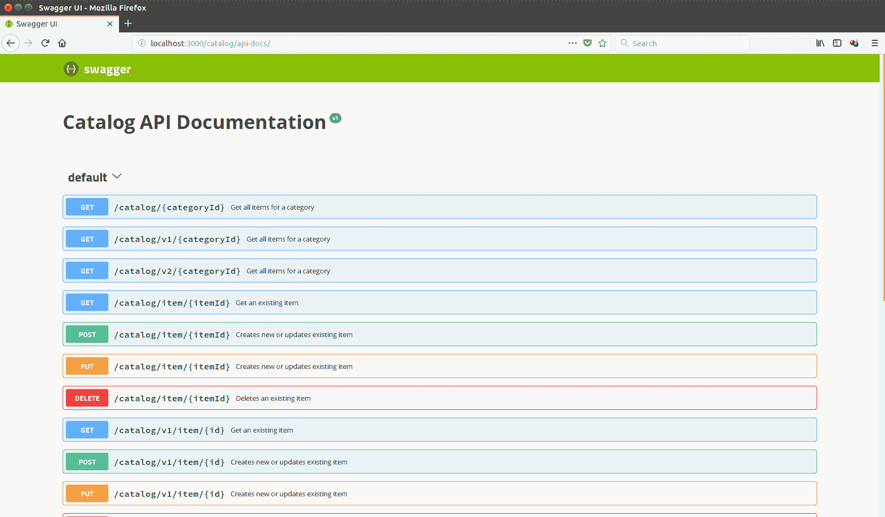
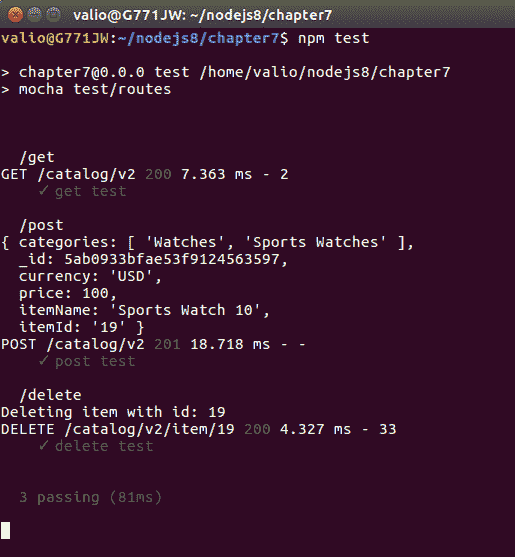

# 为生产准备 RESTful API

在前一章中，我们实现了一个完整的目录 RESTful API；但是，完全功能化的 API 和生产就绪的 API 之间存在差异。在本章中，我们将介绍如何对 API 进行完整的记录和测试。在投入生产之前，这些关键需求必须由任何软件完成。

综上所述，本章将涵盖以下主题：

*   记录 RESTful API
*   用 Mocha 测试 restfulapi
*   微服务革命

# 记录 RESTful API

到目前为止，我们部分介绍了 RESTfulWebServicesAPI 是如何由 wadl 描述的，以及如何由 swagger 规范记录的。现在是时候充分利用它们并在我们的目录应用程序中的 express.js routes 中公开它们的自描述性元数据了。这样一来，消费者和最终用户都将为元数据提供单独的 URL，以方便他们采用该服务。让我们从 wadl 定义开始。以下是 wadl 对操作的完整描述：

```js
  <resources base="http://localhost:8080/catalog/"> 
        <resource path="/catalog/item/{itemId}">
            <method name="GET">
                <request>
                    <param name="category" type="xsd:string" style="template"/>
                </request>
                <response status="200">
                    <representation mediaType="application/json" />
                </response>
                <response status="404">
                    <representation mediaType="text/plain" />
                </response>
                <response status="500">
                    <representation mediaType="text/plain" />
                </response>
            </method>
            <method name="PUT">
                <request>
                    <param name="itemId" type="xsd:string" style="template"/>
                </request>
                <response status="200">
                    <representation mediaType="application/json" />
                </response>
                <response status="201">
                    <representation mediaType="application/json" />
                </response>
                <response status="404">
                    <representation mediaType="text/plain" />
                </response>
                <response status="500">
                    <representation mediaType="text/plain" />
                </response>
            </method>
            <method name="POST">
                <request>
                    <param name="itemId" type="xsd:string" 
                     style="template"/>
                </request>
                <response status="200">
                    <representation mediaType="application/json" />
                </response>
                <response status="201">
                    <representation mediaType="application/json" />
                </response>
                <response status="404">
                    <representation mediaType="text/plain" />
                </response>
                <response status="500">
                    <representation mediaType="text/plain" />
                </response>
            </method>
            <method name="DELETE">
                <request>
                    <param name="itemId" type="xsd:string" 
                     style="template"/>
                </request>
                <response status="200">
                    <representation mediaType="application/json" />
                </response>
                <response status="404">
                    <representation mediaType="text/plain" />
                </response>
                <response status="500">
                    <representation mediaType="text/plain" />
                </response>
            </method>
        </resource>
      </resources>
```

每条路线都详细描述了其公开的所有操作；这样，它们将被符合`wadl`规范的客户机索引和发现。描述完所有操作后，只需将`wadl`文件存储在`express.js`项目的`static`目录中，并从应用程序`app.use('/catalog/static', express.static('static'));`中公开它即可

在本地启动应用程序后，您的`wadl`文件将可以在`http://localhost:3000/catalog/static/catalog.wadl`为客户提供服务。

让我们尝试一下，并将其导入邮递员：


Importing wadl file into Postman. This is a screenshot for Postman. The individual settings are not important here. The purpose of the image is just to show how the window looks.

静态地提供`wadl`文件将有助于您的应用程序被搜索引擎索引；这进一步提高了 API 的采用率。

然而，缓慢但肯定的是，`wadl`正在失去对`swagger`的控制。JavaScript 支持 REST 的应用程序的发展导致了发现 REST 服务的非 XML 标准的需求。这就是`swagger`成为事实上的标准的原因，不仅用于记录 RESTful 服务，而且还用于广泛采用的发现格式。虽然支持 XML 的平台仍然依赖于`wadl`，但 JavaScript 和其他非 XML 本机平台严重依赖`swagger`规范，不仅用于描述，还用于发现和使用，而且其采用进展迅速。因此，您应该考虑在 API T5 中描述您的 API，以确保在任何平台上易于采用。以下是如何用`swagger`方言完整描述操作：

```js
{
    "swagger": "2.0",
    "info": {
      "title": "Catalog API Documentation",
      "version": "v1"
    },
    "paths": {"/catalog/item/{itemId}": {
        "get": {
          "operationId": "getItemV2",
          "summary": "Get an existing item",
          "produces": ["application/json"],
          "responses": {
            "200": {
              "description": "200 OK",
              "examples": {
                "application/json": {
                    "_id": "5a4c004b0eed73835833cc9a",
                    "itemId": "1",
                    "itemName": "Sports Watch",
                    "price": 100,
                    "currency": "EUR",
                    "__v": 0,
                    "categories": [ "Watches", "Sports Watches"]
                  }
              }
            },
            "404": {"description": "404 Not Found"},
            "500": {"description": "500 Internal Server Error"}
          }
        },
        "post": {
          "404": {"description": "404 Not Found"},
          "500": {"description": "500 Internal Server Error"},
          "operationId": "postItemV2",
          "summary": "Creates new or updates existing item",
          "produces": ["application/json"],
          "responses": {
            "200": {
              "itemId": 19,
              "itemName": "Sports Watch 19",
              "price": 100,
              "currency": "USD",
              "__v": 0,
              "categories": [
                "Watches",
                "Sports Watches"
              ]
            },
            "201": {
              "itemId": 19,
              "itemName": "Sports Watch 19",
              "price": 100,
              "currency": "USD",
              "__v": 0,
              "categories": [ "Watches", "Sports Watches"]
            },
            "500": "text/html"
          }
        },
        "put": {
          "404": {"description": "404 Not Found"},
          "500": {"description": "500 Internal Server Error"},
          "operationId": "putItemV2",
          "summary": "Creates new or updates existing item",
          "produces": ["application/json"],
          "responses": {
            "200": {
              "itemId": 19,
              "itemName": "Sports Watch 19",
              "price": 100,
              "currency": "USD",
              "__v": 0,
              "categories": [ "Watches","Sports Watches"]
            },
            "201": {
              "itemId": 19,
              "itemName": "Sports Watch 19",
              "price": 100,
              "currency": "USD",
              "__v": 0,
              "categories": ["Watches", "Sports Watches"]
            },
            "500": "text/html"
          }
        },
        "delete": {
          "404": {"description": "404 Not Found"},
          "500": {"description": "500 Internal Server Error"},
          "operationId": "deleteItemV2",
          "summary": "Deletes an existing item",
          "produces": ["application/json"],
          "responses": {"200": {"deleted": true },
            "500": "text/html"}
        }
      }
   }
  consumes": ["application/json"]
  }
 }
```

最后，在`swagger.json`文件中描述了所有 API 的操作之后，它应该静态公开，类似于`wadl`文件。由于应用程序已经有了静态目录的路由，只需将`swagger.json`文件放在那里，它就可以为消费者服务并促进发现。`Swagger`主要是一个文档工具，但主要针对开发者；因此，它需要一个使文档易于阅读和理解的前端。有一个`npm`模块——`swagger-ui`，它为我们包装了默认的招摇过市前端。我们将在应用程序中采用它，因此让我们使用包管理器来安装它-`npm install swagger-ui`。一旦安装，只需一个模块实例和一个静态`swagger.json`文件实例，并在单独的路径中使用它们：

```js
const swaggerUi = require('swagger-ui-express');
const swaggerDocument = require('./static/swagger.json');

app.use('/catalog/api-docs', swaggerUi.serve, swaggerUi.setup(swaggerDocument));
```

启动应用程序并在浏览器中请求`http://localhost:3000/catalog/api-docs/`：



如您所见，swagger ui 模块为您提供了标准的 swagger 前端。

Keep in mind that, as a developer, keeping your API documentation in a shape and up to date is your responsibility.

# 用 Mocha 测试 restfulapi

您是否注意到使用`express-generator`创建的`app.js`express 应用程序实际上是一个导出 express 实例的`node.js`模块？如果你有，你一定会问自己为什么需要这样做。好的，将 express 实例导出为模块可以使其进行单元测试。我们已经在[第 4 章](4.html)中使用了`mocha`框架，*使用了 NoSQL 数据库，*在那里我们为`CatalogItem`模块开发了一个单元测试。我们将再次使用`mocha`并围绕 API 公开的每个操作包装一个单元测试。要对 express 应用程序进行单元测试，我们需要执行以下操作：

1.  需要一个带有路由的`express.js`应用程序实例，利用其作为模块导出
2.  在单元测试环境中启动`express.js`实例
3.  通过测试库调用其操作，并对结果进行断言
4.  最后，执行`npm test`命令触发单元测试

在继续和实现 mocha 测试之前，我们需要一个库，用于从单元测试发送 HTTP 请求；我们将使用`chai`模块。它提供了发送 HTTP 请求的方便功能，还绑定了`should.js`断言库来验证预期结果。要安装`chai`，只需执行`npm install chai`及其`npm install chai-http`HTTP 插件，我们就可以开始单元测试了！

与任何其他摩卡测试一样，我们必须执行给定步骤：

1.  描述每个测试用例
2.  准备测试夹具；这次，我们将使用`chai-http`调用 rest 操作
3.  对返回的结果进行断言

包含创建、访问和删除资源操作的基本单元测试如下所示：

```js
var expressApp = require('../../app');
var chai = require('chai');
var chaiHttp = require('chai-http');
var mongoose = require('mongoose');
var should = chai.should();

mongoose.createConnection('mongodb://localhost/catalog-test');

chai.use(chaiHttp);

describe('/get', function() {
  it('get test', function(done) {
    chai.request(expressApp)
      .get('/catalog/v2')
      .end(function(error, response) {
        should.equal(200  , response.status);
        done();
      });
    });
  });

describe('/post', function() {
     it('post test', function(done) {
       var item ={
          "itemId":19,
          "itemName": "Sports Watch 10",
          "price": 100,
          "currency": "USD",
          "__v": 0,
          "categories": [
              "Watches",
              "Sports Watches"
          ]
      };
     chai.request(expressApp)
           .post('/catalog/v2')
           .send(item )
           .end(function(err, response){
               should.equal(201, response.status)
             done();
           });
     });
   });

   describe('/delete', function() {
        it('delete test', function(done) {
          var item ={
             "itemId":19,
             "itemName": "Sports Watch 10",
             "price": 100,
             "currency": "USD",
             "__v"cd .: 0,
             "categories": [
                 "Watches",
                 "Sports Watches"
             ]
         };
        chai.request(expressApp)
              .delete('/catalog/v2/item/19')
              .send(item )
              .end(function(err, response){
                  should.equal(200, response.status)
                done();
              });
        });
      });
```

将此文件存储在项目的测试目录中；该目录默认定义为`package.json`中的测试目录，因此要运行单元测试，只需执行`npm test`：



祝贺现在，单元测试已经覆盖了您的 API，请注意，测试并没有模仿任何东西！他们正在运行 express 应用程序；完全相同的方式，应用程序将在生产时运行，确保稳定性和向后兼容性！目前，单元测试仅针对状态代码进行断言。花点时间研究它，并进一步扩展它们，以反对响应体。这将是一个很好的练习。

# 微服务革命

不久前，RESTfulAPI 开始疯狂，几乎所有人都认为 RESTfulAPI 是正确的选择，是吗？有了`Linux`容器，切换到 REST 方法只是成功的一半。目前，每个人都从集装箱中受益。它们提供了更好、更快、更便宜的开发和运营模式，但微服务只是 RESTful 服务的又一个热门术语吗？嗯，不，一点也不；REST 服务只是微服务的基础。

微服务是小型的、独立的过程，它公开了一个简单的接口，允许与它们通信并构建复杂的应用程序，而不依赖于库人工制品。这些服务类似于小型构建块，高度解耦，专注于完成一项小型任务，促进了系统构建的模块化方法。

REST 强调资源及其自然处理，而微服务体系结构则强调简单性、故障安全性和隔离性。RESTful API 在每个操作中没有单独的状态；要么整个 API 可用，要么完全关闭。微服务试图解决这个问题，提供在单独的容器或容器子集上承载每个操作的方法，确保最大的容错性和灵活性。

微服务只需提供一个简单的操作，仅此而已。这使开发人员能够按照他们想要的方式对它们进行分组和使用。在处理微服务时，策略处理、治理、安全性和监视通常超出范围，主要是因为它们需要某种上下文。一般来说，将上下文绑定到服务会增加其依赖性并降低其可重用性；这就是为什么微服务将上下文留给 API 管理网关的原因，API 管理网关允许您创建微服务的组合，然后将策略绑定到它并监视网关上的每个活动。这种分布开发模型使程序员能够快速增长微服务集合，而不必考虑治理和安全等复杂主题。

微服务世界是一个游戏规则改变者，受益于 Linux 容器。目前，所有类似于 AWS 和 Azure 的基于云的产品都提供微服务托管。

# 总结

在本章中，我们稍微避开了`Express.js`相关主题。相反，我们专注于如何通过提供最新的 API 文档以及 API 本身来实现代码库的产品化。我们让我们的应用程序投资于预防措施，通过实现更复杂的单元测试来确保向后兼容性，这些单元测试的目标实际上接近于实际实现。最后，我们决定展望未来，这一切都与微服务有关。确保你把这个热门话题放在你的技能清单上；它将不可避免地在不久的将来演变，你对它了解得越多越好！