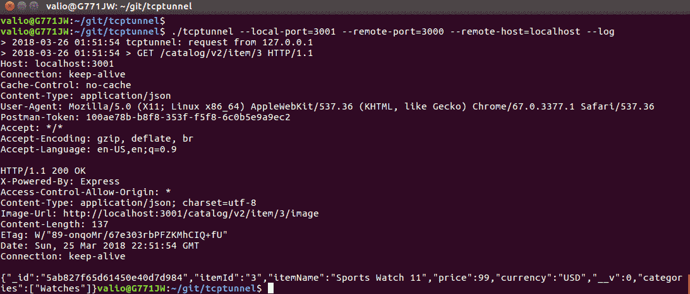

# 使用 RESTful API

为了演示与 API 使用相关的一些更高级的主题，我们将实现一个非常简单的 web 客户端。它将帮助我们涵盖这些主题，并且可以作为目录消费者的参考实现。对于这个前端客户端，我们将使用著名的 JavaScript 库 jQuery。利用它将有助于我们涵盖以下内容：

*   使用 jQuery 使用 RESTful 服务
*   内容交付网络
*   故障排除和识别导线上的问题
*   跨源资源共享策略
*   不同 HTTP 状态代码的客户端处理

# 使用 jQuery 使用 RESTful 服务

JQuery 是一个快速、轻巧、功能强大的 JavaScript 库；它通过在加载 DOM 3 后提供对 HTML 元素的直接访问，消除了与 DOM 相关的复杂性。要在 HTML 文档中使用 jQuery，必须导入它：

`<script type="text/javascript" src="https://code.jquery.com/jquery-3.3.1.min.js "></script>`

假设在 HTML 文档中的某个地方，有一个定义为`<input type="button" id="btnDelete" value="Delete"/>`的按钮。

要使用 JQuery 将函数分配给此按钮的单击事件，意味着我们需要执行以下操作：

1.  在 HTML 文档中导入 jquery 库
2.  确保 HTML 文档的 DOM 文档已完全加载
3.  使用 ID 属性定义的标识符访问按钮
4.  提供一个处理函数作为`click`事件的参数：

```js
$(document).ready(function() {
    $('#btn').click(function () {
       alert('Clicked');
    });
});
```

`$('#identifier')`表达式提供对 DOM three 中元素的直接访问，`$`表示引用了一个对象，括号内的值 prefix by`#`指定了它的标识符。只有在加载整个文档之后，jQuery 才能访问元素；这就是为什么应该在`${document).ready()`块范围内访问元素。

类似地，您可以使用标识符`txt`访问文本输入的值：

```js
  $(document).ready(function() {
    var textValue = $('#txt').val();
    });
  });
```

`$(document)`*对象在 jQuery 中预定义，表示 HTML 页面的整个 DOM 文档。以类似的方式，jQuery 为支持 AJAX 的通信预定义了一个函数，即，向 HTTP 端点发送 HTTP 请求。此函数以**异步 JavaScript+XML-**AJAX 命名，这是一个事实上的标准，它使 JavaScript 应用程序能够与支持 HTTP 的后端进行通信。如今，**JSON**被广泛使用；然而，AJAX 的命名转换仍然被用作异步通信的术语，不管数据格式如何；这就是为什么 jQuery 中的预定义函数被称为`$.ajax(options, handlers)`。*

 *使用`$.ajax`函数发送 http 请求，通过提供请求的端点 URL、http 方法及其内容类型来调用；结果将在回调函数中返回。以下示例显示如何从我们的目录中请求标识符为 3 的项目：

```js
  $.ajax({
      contentType: 'application/json',
      url: 'http://localhost:3000/catalog/v2/item/3',
      type: 'GET',
      success: function (item, status, xhr) {
          if (status === 'success') {
              //the item is successfully retrieved load & display its details here
          }
      }
      ,error: function (xhr, options, error) {
        //Item was not retrieved due to an error handle it here
      }
    });
  });
```

将数据发布到端点非常类似：

```js
  $.ajax({
    url: "http://localhost:3000/catalog/v2/",
    type: "POST",
    dataType: "json",
    data: JSON.stringify(newItem),
     success: function (item, status, xhr) {
       if (status === 'success') {
         //item was created successfully
       }
     },
     error: function(xhr, options, error) {
       //Error occurred while creating the iteam
     }
   });

```

只需使用适当的选项`type`设置为 POST，`dateType`设置为 JSON 即可。这些将指定 POST 请求以 JSON 格式发送到端点。对象的有效负载作为一个值提供给`data`属性。

调用`delete`方法非常类似：

```js
      $.ajax({
        contentType: 'application/json',
        url: 'http://localhost:3000/catalog/v2/item/3',
        type: 'DELETE',
        success: function (item, status, xhr) {
            if (status === 'success') {
              //handle successful deletion
            }
        }        
        ,error: function (xhr, options, error) {
            //handle errors on delete
        }
      });
```

在本书的范围内，对 jQuery 如何工作的基本理解是很好的。现在，让我们把所有这些粘在一起，创建两个 HTML 页面；这样，我们将处理目录中项目的创建、显示和删除，从显示项目并允许其删除的页面开始。此页面使用`GET`请求从目录中加载一个项目，然后以类似表格的方式在 HTML 页面中显示该项目的属性：

```js
<html>
<head><title>Item</title></head>
<body>
    <script type="text/javascript" src="https://code.jquery.com/jquery-3.3.1.min.js "></script>
  <script>
  $(document).ready(function() {
    $('#btnDelete').click(function () {
      $.ajax({
        contentType: 'application/json',
        url: 'http://localhost:3000/catalog/v2/item/3',
        type: 'DELETE',
        success: function (item, status, xhr) {
            if (status === 'success') {
              $('#item').text('Deleted');
              $('#price').text('Deleted');
              $('#categories').text('Deleted');
            }
        }
        ,error: function (xhr, options, error) {
          alert('Unable to delete item');
        }
      });
    });
    $.ajax({
      contentType: 'application/json',
      url: 'http://localhost:3000/catalog/v2/item/3',
      type: 'GET',
      success: function (item, status, xhr) {
          if (status === 'success') {
            $('#item').text(item.itemName);
            $('#price').text(item.price + ' ' + item.currency);
            $('#categories').text(item.categories);
          }
      }
      ,error: function (xhr, options, error) {
        alert('Unable to load details');
      }
    });
  });
  </script>
  <div>
    <div style="position: relative">
      <div style="float:left; width: 80px;">Item: </div>
      <div><span id="item"/>k</div>
    </div>
    <div style="position: relative">
      <div style="float:left; width: 80px;">Price: </div>
      <div><span id="price"/>jjj</div>
    </div>
    <div style="position: relative">
      <div style="float:left; width: 80px;">Categories: </div>
      <div><span id="categories"/>jjj</div>
    </div>
    <div><input type="button" id="btnDelete" value="Delete"/></div>
  </div>
</body>
</html>
```

处理创建的页面非常相似。但是，它为项的字段提供文本输入而不是范围标签，在该字段中，视图页面将显示加载项属性的数据。JQuery 为输入控件提供了一个简化的访问模型，而不是简单地按如下方式访问输入元素：

```js
<html>
<head><title>Item</title></head>
<body>
  <script type="text/javascript" src="https://code.jquery.com/jquery-3.3.1.min.js "></script>
  <script>
  $(document).ready(function() {
    $('#btnCreate').click(function(){
      var txtItemName = $('#txtItem').val();
      var txtItemPrice = $('#txtItemPrice').val();
      var txtItemCurrency = $('#txtItemCurrency').val();
      var newItem = {
        itemId: 4,
        itemName: txtItemName,
        price: txtItemPrice,
        currency: txtItemCurrency,
        categories: [
          "Watches"
        ]
      };
      $.ajax({
        url: "http://localhost:3000/catalog/v2/",
        type: "POST",
        dataType: "json",
        data: JSON.stringify(newItem),
        success: function (item, status, xhr) {
              alert(status);
            }
      });
    })
  });
  </script>
  <div>
    <div style="position: relative">
      <div style="float:left; width: 80px;">Id: </div>
      <div><input type="text" id="id"/></div>

      <div style="float:left; width: 80px;">Item: </div>
      <div><input type="text" id="txtItem"/></div>
    </div>
    <div style="position: relative">
      <div style="float:left; width: 80px;">Price: </div>
      <div><input type="text" id="price"/></div>
    </div>
    <div style="position: relative">
      <div style="float:left; width: 80px;">Categories: </div>
      <div><input type="text" id="categories"/></div>
    </div>
    <div><input type="button" id="btnCreate" value="Create"/></div>
  </div>
</body>
</html>
```

让我们尝试一下，通过在您选择的浏览器中直接从文件系统打开静态页面，加载视图页面中的现有项。看起来好像我们有什么问题，因为什么都没有显示出来。使用浏览器的开发人员套件启用客户端调试也不会提供更多信息：


声明内容部分被阻止；但是，不太清楚这是由于后端相关的错误，还是客户端出了问题。在下一节中，我们将了解如何解决此类问题。

# 故障排除和识别导线上的问题

有时客户端和服务器之间的交互失败，这种失败的原因通常需要分析；否则，它们的根本原因就不得而知。我们发现我们的客户端应用程序没有加载，因此没有显示现有项的数据。让我们通过在客户机和服务器之间建立一个`http`隧道来尝试调查其根本原因。这将是一种基于 MiM（中间人）的调查，因为我们将听一个端口，并将传入的请求重定向到另一个端口，以查看服务器是否返回正确的响应，或者它的管道在中间的某个地方被破坏。有各种各样的 TCP 隧道可用；我一直在使用一个简单的开源软件，它可以在 GitHub 的[上找到 https://github.com/vakuum/tcptunnel](https://github.com/vakuum/tcptunnel) 。它的作者还维护着一个单独的网站，在那里你可以下载最常见的操作系统的预编译二进制文件；可在[处购买 http://www.vakuumverpackt.de/tcptunnel/](http://www.vakuumverpackt.de/tcptunnel/) 。

构建或下载隧道副本后，按如下方式启动：

`./tcptunnel --local-port=3001 --remote-port=3000 --remote-host=localhost --log`

这将启动监听端口 3001 的应用程序，并将每个传入请求转发到位置端口 3000；`--log`选项指定所有通过隧道的数据流都应记录在控制台中。最后，将 HTML 页面修改为使用端口 3001 而不是 3000，让我们看看在为 id 为 3 的项目触发新的 GET 请求后，隧道将向我们显示什么，这次是在端口`3001: http://localhost:3001/catalog/v2/item/3`：


令人惊讶的是，隧道显示服务器正常响应`200 OK`和相关负载。因此，问题似乎不在服务器端。

好吧，因为错误显然不在服务器端，所以让我们试着更深入地研究客户端发生了什么。现在，所有流行的浏览器都有所谓的 web 开发工具。它们提供对`http`日志、动态呈现的代码、HTML 文档的 DOM 三等的访问。让我们用 Mozillas Firefox 调用 RESTful GET 操作，看看它的 web 控制台会记录关于我们请求的内容。打开 Mozilla Firefox 菜单，选择`Web Developer`，然后选择`Browser Console`：


啊哈！好像我们找到了：`Cross-Origin Request Blocked: The Same Origin Policy disallows reading the remove resource at...`。
此错误正在阻止客户端级别的服务器端响应。在下一节中，我们将看到这实际上意味着什么。

# 跨来源资源共享

跨站点 HTTP 请求是指从不同于最初请求资源的域加载资源的请求。在我们的例子中，我们从文件系统启动客户机，它从网络地址请求资源。这被认为是一个潜在的**跨站点脚本**请求，根据[中的**W3C 建议**http://w3.org/cors/TR/cors](http://w3.org/cors/TR/cors) ，应小心处理。这意味着，如果请求外部资源，则应在标头中明确指定从其来源请求外部资源的域，只要一般不允许加载外部资源。此机制可防止跨端脚本（XSS）攻击，它基于 HTTP 头。

以下 HTTP 请求头指定如何在客户端处理外部资源：

*   `Origin`定义请求的来源
*   `Access-Control-Request-Method`定义用于请求资源的 HTTP 方法
*   `Access-Control-Request-Header`定义任何允许与外部资源请求结合使用的头

在服务器端，以下标头指示响应是否符合启用 CORS 的客户端请求的条件：

*   `Access-Control-Allow-Origin`：此标头（如果存在）通过重复指定允许请求者的主机，或者通过返回通配符指定允许所有远程源：'*'
*   `Access-Control-Allow-Methods`：此标头指定服务器允许从 cross side 的域中使用的 HTTP 方法
*   `Access-Control-Allow-Headers`：此标头指定服务器允许从 cross side 的域中发送的 HTTP 标头

根据凭证和请求的最大期限，还有一些`Access-Control-*`头可用于进一步细化传入 XSS 请求的粒度，但基本上，最重要的是允许的来源、允许的方法和允许的头。

服务器端有处理`CORS`配置的节点模块；它由`npm install -g cors`安装，并通过中间件模块在我们的应用程序中轻松启用。只需将其传递给应用程序，即可在所有公开的路由中使用它：

```js
app.use(cors());
```

启用`cors`中间件后，使用隧道查看服务器现在可以通过将“Access Control Allow Origin”头设置为“*”，优雅地处理来自不同来源的请求：



# 内容交付网络

当我们将 jQuery 库导入到我们的客户机应用程序中时，我们直接从其供应商处引用其优化的源代码`<script type="text/javascript" src="https://code.jquery.com/jquery-3.3.1.min.js "/>`。

现在，想象一下，由于某种原因，这个网站暂时或永久关闭；这将使我们的应用程序无法使用，因为导入无法工作。

在这些情况下，内容交付网络起到了帮助作用。它们充当库或其他静态媒体内容的存储库，确保所需资源在不停机的情况下可用，即使供应商出现问题。最流行的 JavaScript CDN 之一是[https://cdnjs.com/](https://cdnjs.com/) ；它提供了最常见的 JS 库。我们将切换我们的客户从该 CDN 而不是从其供应商的网站`<script type="text/javascript" src="https://code.jquery.com/jquery-3.3.1.min.js "/>`引用 jquery 库。

虽然直接下载 JS 库并将它们放在 node.JS 项目的静态目录中几乎没有任何错误，但这可能会导致库依赖项中直接出现本地更改和修复。这很容易导致不兼容的更改，并会阻止应用程序在将来轻松切换到较新的版本。只要您的依赖项是开源的，您就应该努力通过提供修复或报告 bug 来改进它们，而不是在您自己的本地分支中进行修复。尽管如此，如果您不幸遇到了一个可以轻松修复的 bug，您可以使用 fork 库更快地解决问题。然而，总是考虑将修复的贡献回馈给社区。接受后，切换回正式版本；否则，您将发现自己在下一次遇到另一个问题时陷入困境，如果从分叉版本报告，社区将更难跟踪它。这就是开源的美妙之处，这就是为什么您应该总是考虑使用 JavaScript API 的内容传递网络。它们将在应用程序生命周期的任何时候为您提供所需的稳定性和支持。

# 在客户端处理 HTTP 状态代码

我们花了相当长的时间讨论 RESTful 服务应该如何优雅地表示每个状态，包括错误的状态。定义良好的 API 应该要求其使用者优雅地处理其所有错误，并根据需要提供每个状态的尽可能多的信息，而不仅仅是声明“发生了错误”。这就是为什么它应该查找返回的状态代码，并清楚地区分由错误的负载、错误的媒体类型或与身份验证相关的错误（如`401 Unauthorized`）引起的客户端请求，如`400 Bad Request`或`415 Unsupported media types`。

错误响应的状态代码在 jQuery 回调函数的`error`回调中可用，应用于向请求返回详细信息：

```js
 $.ajax({
        url: "http://localhost:3000/catalog/v2/",
        type: "POST",
        dataType: "json",
        data: JSON.stringify(newItem),
        success: function (item, status, jqXHR) {
            alert(status);
        },
        error: function(jqXHR, statusText, error) {
            switch(jqXHR.status) {
               case 400: alert('Bad request'); break;
               case 401: alert('Unauthroizaed'); break;
               case 404: alert('Not found'); break;
               //handle any other client errors below
               case 500: alert('Internal server error); break;
               //handle any other server errors below
            }
        }
      });
```

不成功的请求由错误回调函数处理。它提供了`jqXHR`-`XmlHttpRequest`JavaScript*-*对象作为第一个参数。它携带所有与请求/响应相关的信息，例如状态代码和头。使用它来确定请求的服务器返回了什么，以便应用程序可以更精确地处理不同的错误。

# 总结

在本章中，我们使用 jQuery 库实现了一个简单的基于 web 的客户端。我们利用这个客户端来演示跨源资源共享策略是如何工作的，我们使用中间人来解决线路上的问题。最后，我们看了如何在客户端处理错误。本章使我们离旅程的终点又近了一步，因为我们获得了服务的第一位消费者。在下一章中，我们将引导您完成将服务引入生产环境并选择其安全模型之前的最后一步。*