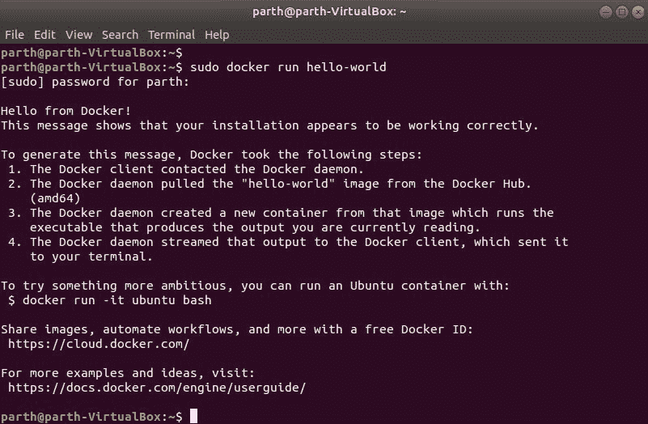
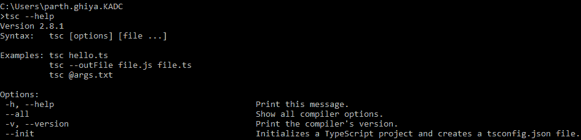
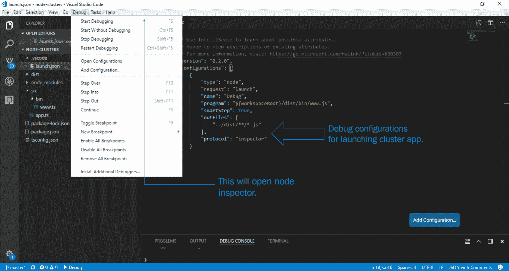
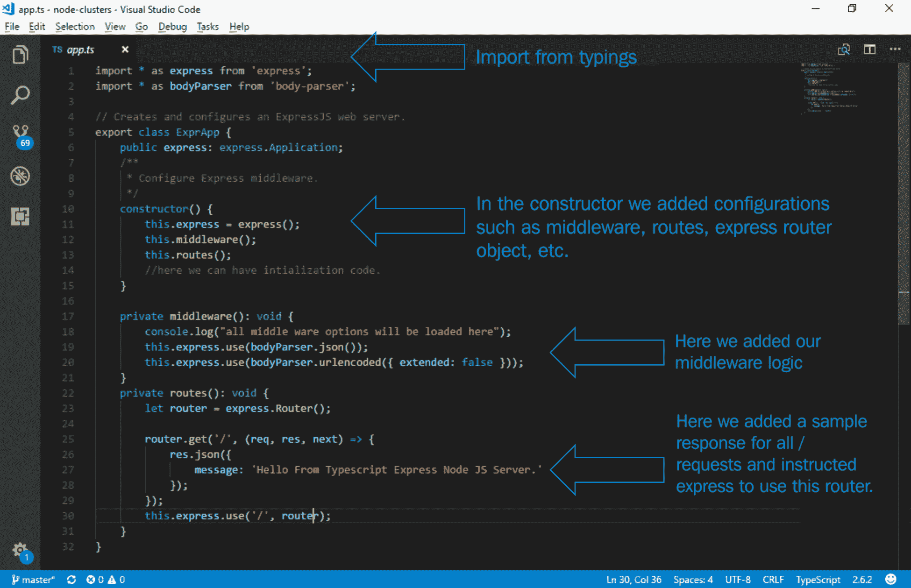
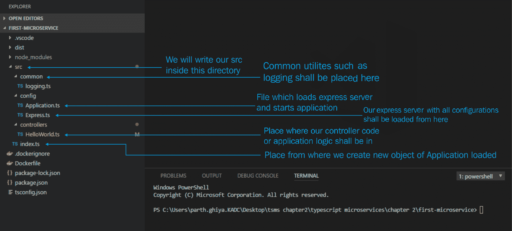
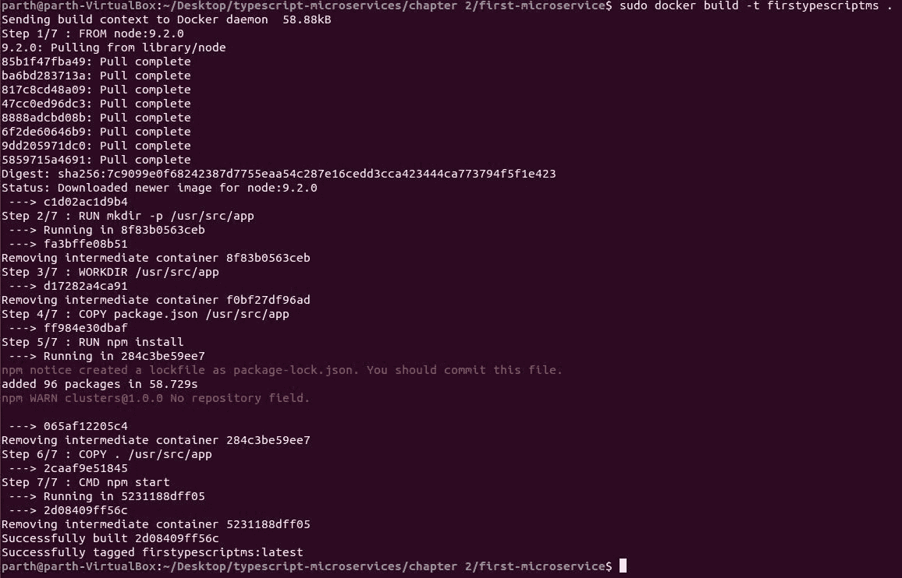

Gearing up for the Journey <link rel="stylesheet" href="css/style.css" type="text/css"> 

# 为旅程做准备

在学习了关于微服务的理论之后，我们现在将开始实践。 本章将为接下来的旅程奠定基础，并将重温本书中必不可少的 Node.js 和 TypeScript 概念。 它会告诉你这两种语言的趋势和使用率。 我们将完成所有必需的安装，并准备我们的开发环境。 我们将通过实现惯常的`Hello World`微服务来测试开发环境。 在本章中，我们将重点讨论以下主题:

*   **Setting the primary development environment**:我们将在具备所有必备条件的情况下建立 primary environment。 我们将了解微服务发展所需的所有方面。
*   :在这一节中，我们将浏览一些主要的 TypeScript 主题，我们将在整本书中使用。 我们将证明在 Node.js 中使用 TypeScript 作为语言是正确的，并了解如何用 TypeScript 和 Node.js 编写应用程序。

*   **对 Node.js 的入门**:在这一节中，我们将讨论一些高级的 Node.js 主题，例如 Node.js 中的集群，最近引入的 async/await，以及其他。 我们将了解事件循环，并简要了解 Node 流和 Node.js 的最新趋势。

*   :我们将编写一个使用我们的开发环境的`Hello World`微服务。

# 设置主环境

在本节中，我们将为我们的旅程设置所需的环境。 你已经在全局中安装了 Node.js 和 TypeScript。 在撰写本文时，Node.js 的可用版本为**9.2.0**，TypeScript 的可用版本为**2.6.2**。

# Visual Studio Code (VS Code)

**VS Code**是目前 TypeScript 最好的编辑器之一。 默认情况下，VS Code TypeScript 会显示错误代码的警告，这有助于我们编写更好的代码。 intr、调试、构建问题、错误等等都是由 VS Code 提供的。 它支持 JSDoc、源映射、为生成的文件设置不同的外文件、隐藏派生的 JavaScript 文件，等等。 它支持自动导入，直接生成方法骨架，就像 Java 开发人员使用 Eclipse 一样。 它还提供了版本控制系统的选项。 因此，它将是我们作为 IDE 的主要选择。 您可以从[https://code.visualstudio.com/download](https://code.visualstudio.com/download)下载。

在 Windows 上安装它是最简单的事情，因为它是一个`.exe`文件，您所要做的就是选择一个路径并遵循步骤。 在 Unix/Ubuntu 机器上安装它需要下载`deb`文件，然后执行以下命令行:

```js
sudo dpkg -i <file>.deb
sudo apt-get install -f # Install dependencies
```

一旦 VS Code 可用，打开扩展并下载[https://marketplace.visualstudio.com/items?itemName=pmneo.tsimporter](https://marketplace.visualstudio.com/items?itemName=pmneo.tsimporter)和[https://marketplace.visualstudio.com/items?itemName=steoates.autoimport](https://marketplace.visualstudio.com/items?itemName=steoates.autoimport)。 我们将利用这些扩展的优点，这将有助于简化代码管理、预构建骨架等。

# PM2

它是 Node.js 的高级处理器管理器。 Node.js 是单线程的，需要一些附加的工具来管理服务器，比如重启服务器、内存管理、多进程管理等等。 它有一个内置的负载平衡器，允许您保持应用程序永远运行。 它没有停机时间和其他系统管理选项，这些都减轻了使用寿命。 它还作为一个模块公开，因此我们可以在 Node.js 应用程序的任何阶段运行时触发各种选项。 要安装 PM2，打开一个终端并执行以下命令:

```js
npm install pm2 -g
```

更多详细的选项和 api 可以在[http://pm2.keymetrics.io/docs/usage/pm2-api/](http://pm2.keymetrics.io/docs/usage/pm2-api/)找到。

# NGINX

NGINX 是最流行的 web 服务器之一。 它可以用作负载均衡器、HTTP 缓存、反向代理和缓冲器。 它能够以非常低的占用率(大约每 10,000 个未激活的[https://en.wikipedia.org/wiki/HTTP_persistent_connection](https://en.wikipedia.org/wiki/HTTP_persistent_connection)为 2.5 MB)处理 10,000 多个同时连接。 它是专门为克服 Apache 而设计的。 它每秒处理的请求大约是 Apache 的四倍。 NGINX 可以以多种方式使用，例如:

*   部署独立的
*   作为 Apache 的前端代理，充当网络卸载设备
*   作为一个减震器，提供服务器从突然高峰的流量或缓慢的互联网连接

它非常适合微服务应用程序，因为容器化的微服务应用程序需要一个能够隐藏和处理其背后运行的应用程序的复杂和不断变化的特性的前端。 它执行一些主要任务，比如将 HTTP 请求转发给不同的应用程序、缓冲器保护、路由、合并日志记录、Gzip 压缩、零停机时间、缓存、可伸缩性和容错。 因此，它是我们理想的应用程序交付平台。 让我们开始 NGINX 101。

根据您的操作系统，从这个站点下载最新版本[http://nginx.org/en/download.html](http://nginx.org/en/download.html)。 在撰写本文时，主线版本为**1.13.7**。

一旦提取出来，你可以简单地启动 NGINX 如下:

```js
start nginx
```

要检查 NGINX 是否启动，你可以在 Windows 中点击以下命令:

```js
tasklist /fi "imagename eq nginx.exe"
```

在 Linux 环境下，可以使用以下命令行:

```js
ps waux | grep nginx
```

下面是其他有用的 NGINX 命令:

| `nginx -s stop` | 快速关闭 |
| `nginx -s quit` | 优雅的关闭 |
| `nginx -s reload` | 改变配置，用新的配置启动新的工作进程，并优雅地关闭旧的工作进程 |
| `nginx -s reopen` | 重启日志文件 |

# 码头工人

Docker**Docker**是一个用于开发、发布和运行应用程序的开源平台，其主要优点是将应用程序从基础设施中分离出来，这样您就可以轻松快速地适应重大更改。 Docker 推广了集装箱的理念。 容器**是任何已配置映像的可运行实例。 容器与其他容器和主机完全隔离。 这与我们的微服务理念非常相似。 当我们谈到部署部分时，我们将更详细地了解 Docker。 让我们在系统上安装 Docker。**

Docker for Windows 需要 Windows 10 Pro 版和 Hyper-V。 因此，作为一个普遍可用的替代方案，我们将选择 Linux。 Windows 用户可以下载 Oracle VM VirtualBox，下载任何 Linux 镜像，然后按照相同的过程进行。 遵循下面给出的步骤:[https://docs.docker.com/engine/installation/linux/docker-ce/ubuntu/](https://docs.docker.com/engine/installation/linux/docker-ce/ubuntu/)。

要检查安装，请按以下命令:

```js
sudo docker run hello-world
```

你应该看到如下输出:



Docker installation

# 底漆,打印稿

**TypeScript**源于 JavaScript 开发中的缺陷，随着 JavaScript 在大型应用程序中的使用的出现。 TypeScript 引入了一个 JavaScript 编译器，它预置了语法语言扩展、基于类的编程以及将扩展转换为常规 JavaScript 的方法。 由于在 JavaScript 中引入了类型安全，TypeScript 变得非常流行，而 JavaScript 恰好是有史以来最灵活的语言之一。 这使得 JavaScript 成为一种更加面向对象和编译安全的语言。 TypeScript 更像是 ES 标准的一个超集，它让开发人员能够编写更清晰、易于重构和可升级的代码。 在本节中，我们将讨论 TypeScript 的各种主要主题，它们对我们未来的旅程至关重要。 TypeScript 是带有类型注释的 JavaScript。 TypeScript 有一个编译器和类型检查器，如果类型不匹配，它会抛出一个错误，并将 TypeScript 代码转换为 JavaScript 代码。 我们将简要地看一下以下主题，这将从本质上帮助我们在 TypeScript 中编写 Node.js:

*   理解`tsconfig.json`
*   理解类型
*   调试 Node.js 中的 TypeScript

# 理解 tsconfig.json

添加一个`tsconfig.json`文件意味着有一个属于 TypeScript 项目的目录，并且需要一个配置文件来将 TypeScript 编译成 JavaScript。 你可以使用`tsc`命令将 TypeScript 编译成 JavaScript。 调用它时，编译器将搜索在`tsconfig.json`中加载的配置。 您可以为完整项目(从当前目录到父目录)指定编译，也可以为特定项目指定`tsc`。 您可以使用以下命令找到所有可能的选项:

```js
tsc --help 
```

让我们看看这个命令做了什么:



The tsc help command At the time of writing, the version of TypeScript is **2.6.2** and all context would be made from the same version. If you do not have the updated version, run the following commands:
`npm uninstall typescript -g`
`npm install typescript@latest -g`

现在让我们来看看示例`tsconfig.json`文件和所有可用的选项:

```js
{ 
   "compilerOptions":{ 
      "target":"es6",
      "moduleResolution":"node",
      "module":"commonjs",
      "declaration":false,
      "noLib":false,
      "emitDecoratorMetadata":true,
      "experimentalDecorators":true,
      "sourceMap":true,
      "pretty":true,
      "allowUnreachableCode":true,
      "allowUnusedLabels":true,
      "noImplicitAny":true,
      "noImplicitReturns":false,
      "noImplicitUseStrict":false,
      "outDir":"dist/",
      "baseUrl":"src/",
      "listFiles":false,
      "noEmitHelpers":true
   },
   "include":[ 
      "src/**/*"
   ],
   "exclude":[ 
      "node_modules"
   ],
   "compileOnSave":false
}
```

现在让我们分析这个文件并了解最常用的选项。

# compilerOptions

这里提到了编译项目所需的所有设置。 所有编译器选项的详细列表，以及默认值，可以在以下站点找到:[https://www.typescriptlang.org/docs/handbook/compiler-options.html](https://www.typescriptlang.org/docs/handbook/compiler-options.html)。 如果我们不指定这个选项，那么将使用默认值。 在这个文件中，我们指导 TypeScript 如何处理各种各样的事情，比如各种装饰器，支持 JSX 文件，以及编译纯 JavaScript 文件。 下面是一些最常用的选项，我们可以通过前面的示例代码来理解:

| `noImplicitAny` | 这告诉`tsc`编译器，如果发现变量声明包含接受任何类型的声明，但缺少任何类型的显式类型定义，就会发出警告。 |
| `experimentalDecorators` | 这个选项允许在 TypeScript 项目中使用装饰器。 ES 还没有引入装饰器，所以它们在默认情况下是禁用的。 装饰器是任何可以附加到类声明、方法、访问器、属性或参数的声明。 使用装饰器简化了编程。 |
| `emitDecoratorMetaData` | TypeScript 支持为任何带有装饰器的声明发出特定类型的元数据。 要启用该选项，必须在`tsconfig.json`中将其设置为 true。 |
| `watch` | 这个选项更像`livereload`; 只要任何源文件发生了更改，就会重新触发编译过程，以再次生成编译后的文件。 |
| `reflect-metadata` | 它将类型信息保存在对象的元数据中。 |
| `module` | 它是输出模块类型。 Node.js 使用 CommonJS，这就是为什么模块中有 CommonJS。 |
| `target` | 我们的目标输出预设; Node.js 使用 ES6，所以我们使用 ES6。 |
| `moduleResolution` | 这个选项将告诉 TypeScript 使用哪种解析策略。 Node.js 的用户需要一个模块策略，所以 TypeScript 会使用这个行为来解析这些依赖。 |
| `sourceMap` | 这告诉 TypeScript 生成 sourcemaps，它可以像调试 JavaScript 一样方便地用于调试 TypeScript。 |
| `outDir` | 已编译文件应保存的位置。 |
| `baseUrl`和`paths` | 指示 TypeScript 在哪里可以找到类型文件。 我们基本上告诉 TypeScript，对于在`.ts`文件中找到的每一个(`*`)，它都需要查找文件位置`<base_url> + src/types/*`。 |

# 包括和排除

在这里，我们定义项目上下文。 它基本上采用需要包含在编译路径中的全局模式数组。 您可以包含或排除一个全局模式数组，该数组用于向转译过程添加或删除文件。 注意，这不是最终值; 有些属性文件采用文件名数组，它们覆盖包含和排除。

# 扩展

如果我们想扩展任何基本配置，那么我们使用这个选项并指定它必须扩展的文件路径。 您可以在[http://json.schemastore.org/tsconfig](http://json.schemastore.org/tsconfig)中找到`tsconfig.json`的完整模式。

# 理解类型

如果我们想要高效且全局地使用 TypeScript, TypeScript 也需要跨其他 JavaScript 库。 TypeScript 使用`.d.ts`文件来提供非 ES6 或 TypeScript 编写的 JavaScript 库类型。 一旦定义了`.d.ts`文件，就很容易看到返回类型并提供简单的类型检查。 TypeScript 社区非常活跃，它为大多数文件提供了类型:[https://github.com/DefinitelyTyped/DefinitelyTyped/tree/master/types](https://github.com/DefinitelyTyped/DefinitelyTyped/tree/master/types)。

重新访问我们的`tsconfig.json`文件，我们已经指定了选项`noImplicitAny: true`，并且我们需要为我们使用的任何库强制创建`*.d.ts`文件。 如果我们将该选项设置为 false，`tsc`将不会给出任何错误，但这根本不是推荐的做法。 我们使用的每个库都有一个`index.d.ts`文件是标准实践之一。 我们将讨论各种主题，比如如何安装类型、如果类型不可用会怎样、如何生成类型以及类型的一般过程是什么。

# 从 DefinitelyTyped 安装类型

来自任何库的类型都是一个`dev`依赖项，你所要做的就是从`npm`安装它。 下面的命令安装 express 类型:

```js
npm install --save-dev @types/express
```

这个命令将 express 类型下载到`@types`文件夹中，TypeScript 会在`@types`文件夹中查找该类型的映射。 因为我们只在开发期间需要它，所以我们添加了`--save-dev`选项。

# 编写自己的类型

很多时候，为了有效地使用 TypeScript，我们可能需要编写自己的`.d.ts`文件。 我们将看看如何生成自己的类型，并指导 TypeScript 从哪里查找类型。 我们将使用这个自动化工具，学习如何手动编写我们自己的`.d.ts`文件，然后告诉 TypeScript 在哪里找到自定义类型的位置。

# 使用 dts-gen 工具

这是微软提供的一个开源实用程序。 我们将使用它为任何项目生成类型。 以管理员身份弹出终端或使用`sudo su -`，输入以下命令:

```js
npm install -g dts-gen
```

For all global modules, we will use the command prompt as Admin for Windows, and for Linux/Mac we will use the root user or `sudo su -`.

我们将使用一个全局可用的模块并生成它的类型。 安装`lusca`并使用以下命令生成其类型:

```js
dts-gen -m lusca
```

您应该看到像`Wrote 83 Lines to lusca.d.ts`这样的输出，当您检查时，您可以看到那里的所有方法声明，就像一个接口一样。

# 写你自己的*.d。 ts 文件

当您编写自己的`*.d.ts`文件时，风险非常高。 让我们为任何模块创建自己的`*.d.ts`文件。 假设我们想为`my-custom-library`编写一个模块:

1.  创建一个名为`my-custom-library.d.ts`的空白文件，并在其中写入以下内容:

```js
declare module my-library
```

这将使编译器沉默，并且不会抛出任何错误。

2.  接下来，您需要定义那里的所有方法以及每个方法的预期返回类型。 您可以在这里找到几个模板:[http://www.typescriptlang.org/docs/handbook/declaration-files/templates.html](http://www.typescriptlang.org/docs/handbook/declaration-files/templates.html)。 在这里，我们需要定义可用的方法以及它们返回的内容。 例如，看看下面的代码片段:

```js
declare function myFunction1(a: string): string; 
declare function myFunction2(a: number): number;
```

# 调试

下一个重要的问题是如何在 TypeScript 中调试返回的 Node.js 应用程序。 调试 JavaScript 很容易，而且 TypeScript 有一个叫做**sourcemaps**的特性。 当在 TypeScript 中启用 sourcemaps 时，它允许我们在 TypeScript 代码中删除断点，当命中等效的 JavaScript 行时，断点将被暂停。 sourcemaps 的唯一目的是将生成的源映射到生成它的原始源。 我们将在 VS Code 编辑器中简要地看到调试 Node.js 和 TypeScript 应用程序。

首先，我们需要启用 sourcemaps。 首先，我们需要确保 TypeScript 启用了 sourcemap 生成。 转到您的`tsconfig.json`文件，并写入以下内容:

```js
"compilerOptions":{
    "sourceMap": true  
}
```

现在，当您编译项目时，在您生成的每个 JavaScript 文件旁边，您将看到一个`.js.map`文件。

接下来是配置 VS Code 进行调试。 创建一个文件夹`.vscode`，并添加一个名为`launch.json`的文件。 这与使用`node-inspector`非常相似。 我们将调试`node-clusters`项目，您可以在源代码中找到它。 在 VS Code 中打开那个项目; 如果没有`dist`文件夹，则通过在主层执行`tsc`命令生成一个分发版，这将创建`dist`文件夹。

接下来，创建一个名为`.vscode`的文件夹，并在其中创建一个具有以下配置的`launch.json`文件:



VS Code debugging

单击“开始调试”时，将出现以下屏幕。 看屏幕，里面有详细的调试要点说明:


VS debugger

# 首先是 Node.js

Node.js 经过多年的发展，现在已经成为任何想要拥抱微服务的人的首选技术。 Node.js 的创建是为了解决大量的 I/O 缩放问题，当应用到我们的微服务设计中，将会产生天成的匹配。 Node.js 的包管理器比 Maven、RubyGems 和 NuGet 拥有更多的模块，这些模块可以直接使用，节省大量工作时间。 异步特性、事件驱动 I/O 和非阻塞模式等特性使其成为创建高端、高效、实时应用程序的最佳解决方案之一。 当应用于微服务时，它将能够在低响应时间和低基础设施的情况下处理极端数量的负载。 让我们来看看 Node.js 和微服务的一个成功案例。

**PayPal**看到 Node.js 的趋势，决定在他们的账户概述页面中使用 Node.js。 他们对以下结果感到困惑:

*   Node.js 应用程序开发的速度是 Java 开发的两倍，而且使用的人员更少
*   该代码减少了 33%的**行代码**(**LOC**)和 40%的文件
*   与 5 个核心 Java 应用程序设置相比，单个核心 Node.js 应用程序每秒处理的请求量是前者的两倍

Netflix、GoDaddy、沃尔玛和许多其他公司都有类似的故事。

让我们看看一些主要和有用的概念，这些概念对于 Node.js 开发至关重要，我们将在整个过程中使用它们。 我们将看到各种主题，如事件循环、如何实现集群、异步基础等等。

# 事件循环

由于 Node.js 的单线程设计，它被认为是最复杂的架构之一。 完全由事件驱动，理解事件循环是掌握 Node.js 的关键。 Node.js 被设计为一个基于事件的平台，这意味着 Node.js 中发生的任何事情都只是对事件的反应。 在 Node.js 中完成的任何操作都要通过一系列回调。 完整的逻辑从开发人员那里抽象出来，由一个名为`libuv`的库处理。 在本节中，我们将全面了解事件循环，包括它的工作原理、常见的误解、它的各个阶段等等。 以下是一些关于事件循环的常见误区，并对其实际工作进行了简要介绍:

*   :有两个线程需要维护，一个是运行用户相关代码或用户相关操作的父线程，另一个是运行事件循环代码的线程。 每当一个操作被执行时，父线程就把工作传递给子线程，一旦子线程操作完成，它就会 ping 主线程来执行回调:
*   **事实**:Node.js 是单线程的，所有内容都运行在单个线程中。 事件循环维护回调的执行。
*   **误区 2 -线程池处理异步事件**:所有的异步操作，比如回调数据库返回的数据，读取文件流数据，以及 WebSockets 流，都从由`libuv`维护的线程池中卸载:
*   **事实**:`libuv`库确实创建了一个带有四个线程的线程池来传递异步工作，但是今天的操作系统已经提供了这样的接口。 因此，作为一条黄金法则，`libuv`将使用那些异步接口，而不是线程池。 线程池将仅用作最后一种选择。
*   **神话# 3-Event 循环,像一个 CPU,维护一个栈或队列的操作**:异步的事件循环经过维护队列任务维护通过*先进先出规则,并执行定义的回调函数中维护一个队列:*
**   **事实**:虽然`libuv`中包含队列类结构，但回调不会通过堆栈进行处理。 事件循环更像是一个阶段执行器，以循环的方式处理任务。*

 *# 理解事件循环

现在我们已经排除了 Node.js 中关于事件循环的基本误解，让我们详细地看看事件循环的工作原理，以及事件循环阶段执行周期中的所有阶段。 Node.js 在以下几个阶段处理环境中发生的一切:

*   **计时器**:这是执行所有`setTimeout()`和`setInterval()`回调的阶段。 这个阶段将提前运行，因为它必须在调用函数中指定的时间间隔内执行。 当计时器被调度时，只要计时器处于活动状态，Node.js 事件循环就会继续运行。
*   **I/O 回调**:除定时器、关闭连接事件、`setImmediate()`外，大多数常见的回调都在这里执行。 I/O 请求可以是阻塞的，也可以是非阻塞的。 它执行更多的事情，比如连接错误、连接数据库失败等等。
*   **Poll**:该阶段在阈值经过时执行计时器脚本。 它处理在轮询队列中维护的事件。 如果轮询队列不是空的，事件循环将同步遍历整个队列，直到队列清空或达到系统硬峰值大小。 如果轮询队列为空，事件循环将继续进行下一个阶段——检查并执行这些计时器。 如果没有计时器，轮询队列是空闲的; 它等待下一个回调并立即执行它。
*   **Check**:当轮询阶段处于空闲状态时，执行检查阶段。 使用`setImmediate()`排队的脚本现在将被执行。 `setImmediate()`是一个特殊的计时器，它使用`libuv`API，并将回调安排在轮询阶段之后执行。 它的设计方式是在轮询阶段之后执行。
*   **关闭回调**:当任何处理,插座,或连接突然关闭,关闭事件是在此阶段,发出如`socket.destroy()`、`close()`连接,也就是说,所有(`close`)事件回调处理。 从技术上讲，这不是事件循环的一部分，但另外两个主要阶段是`nextTickQueue`和其他微任务队列。 当前操作完成后的`nextTickQueue`处理，无论事件循环的阶段如何。 它在被调用的同一阶段立即被触发，并且独立于所有阶段。 `nextTick`函数可以包含任何任务，调用方式如下:

```js
process.nextTick(() => {
  console.log('next Tick')
})
```

下一个重要部分是微观和宏观任务。 `NextTickQueue`优先级高于微观任务和宏观任务。 任何在`nextTickQueue`中的任务都将首先执行。 微任务包括诸如解析承诺回调之类的函数。 微任务的一些例子可以是`promise.resolve`、`Object.resolve`。 这里需要注意的一点是，本地承诺只出现在微任务下。 如果我们使用诸如`q`或`bluebird`之类的库，我们将看到它们首先得到解决。

# Node.js 集群和多线程

任何 Node.js 实例都运行在单个线程中。 如果发生任何错误，线程中断，服务器停止，您需要重新启动服务器。 为了充分利用系统中所有可用的内核，Node.js 提供了一个选项来启动 Node.js 进程集群，以便负载均匀分布。 有许多可用的工具可以做同样的事情。 我们将看一个基本的例子，然后学习自动化工具，如**PM2**。 让我们开始:

1.  第一步是创建一个快速服务器。 我们需要`express`，`debug`，`body-parser`，和`cookie-parser`。 打开一个终端，点击以下命令:

```js
npm install body-parser cookie-parser debug express typescript --save
```

2.  接下来，我们下载这些模块的类型:

```js
npm install @types/debug @types/node @types/body-parser @types/express
```

3.  然后，我们创建我们的`app.ts`和`www.ts`文件。 构建您的`app.ts`文件如下:



Express the TypeScript way

4.  对于`www.ts`，我们将使用`cluster`模块并创建可用的 worker 作为多个核心。 我们的逻辑可以划分如下:

```js
import * as cluster from "cluster";
import { cpus } from "os";
if (cluster.isMaster) {
  /* create multiple workers here cpus().length will give me number of   cores available
  */
  cluster.on("online", (worker) => { /*logic when worker becomes online*/ });
  cluster.on("exit", (worker) => { /*logic when worker becomes online*/ });
} else {
  //our app intialization logic 
}
```

5.  现在，当我们编译源代码并运行`www.js`时，我们将看到多个工作人员在线。

Complete files can be found at `node-clusters/src/bin/www.ts`. Go and run the application. You should see multiple workers online now.

另一种方法是使用*PM2*([https://www.npmjs.com/package/pm2](https://www.npmjs.com/package/pm2))。 PM2 对于`livereload`、零停机重新加载和集群中的启动模式有各种选项。 PM2 中可用的一些命令示例如下:

| `pm2 start www.js -i 4` | 以集群模式启动应用程序的四个实例。 它将对每个节点的请求进行负载平衡。 |
| `pm2 reload www.js` | 重新加载带有更改的`www.js`不需要停机时间。 |
| `pm2 scale www.js 10` | 将集群应用扩展到 10 个进程。 |

# Async/await

由于 JavaScript 本质上是异步的，因此一旦流程完成，维护任务的执行就变得非常困难。 曾经以回调开始的东西很快就变成了承诺、异步模块、生成器和 yield 以及异步和等待。 让我们从 async/await 101 开始:

*   Async/await 是编写异步代码的一种现代方法
*   它建立在承诺的基础上，不能与普通回调或 Node 承诺一起使用
*   Async/await 是非阻塞代码，即使它看起来是同步的，这是它的主要功能
*   基于`node-fibers`，它是轻量级的，并且由于嵌入了类型化，所以对 TypeScript 很友好

现在让我们看看 async/await 的实际实现。 曾经的巨大回调地狱和`.then()`的嵌套链可以简单地简化为以下内容:

```js
let asyncReq1=await axios.get('https://jsonplaceholder.typicode.com/posts/1');
console.log(asyncReq1.data);
let asyncReq2=await axios.get('https://jsonplaceholder.typicode.com/posts/1');
console.log(asyncReq2.data);
```

现在我们将研究两种常见的异步/等待设计模式。

# 重试失败的请求

通常，我们在系统中添加安全返回或重试请求，以确保如果服务返回错误，我们可以在服务关闭一段时间后重试该服务。 在这个示例中，我们有效地使用了 async/await 模式作为指数重试参数，即在 1、2、4、8 和 16 秒后重试。 一个工作的例子可以在源代码的`retry_failed_req.ts`中找到:

```js
wait(timeout: number){
  return new Promise((resolve) => {
    setTimeout(() => {
      resolve()
    }, timeout)
  })
 } 
async requestWithRetry(url: string){
  const MAX_RETRIES = 10;
  for (let i = 0; i <= MAX_RETRIES; i++) {
    try { return await axios.get(url); }
    catch (err) {
      const timeout = Math.pow(2, i);
      console.log('Waiting', timeout, 'ms');
      await this.wait(timeout);
      console.log('Retrying', err.message, i);
    }
  }
}
```

您将看到如下输出:


Retrying request exponentially

# 并行多个请求

执行多个并行请求对于 async/await 来说是小菜一碟。 在这里，我们可以一次执行多个异步任务，并在不同的地方使用它们的值。 完整的源代码可以在`src`的`multiple_parallel.ts`中找到:

```js
async function executeParallelAsyncTasks() {
  const [valueA, valueB, valueC] = await
    Promise.all([
            await axios.get('https://jsonplaceholder.typicode.com/posts/1')
            await axios.get('https://jsonplaceholder.typicode.com/posts/2'),
            await axios.get('https://jsonplaceholder.typicode.com/posts/3')])
            console.log("first response is ", valueA.data);
            console.log(" second response is ", valueB.data);
            console.log("third response is ", valueC.data);
      }
```

# 流

简单地说，**流**是 Node.js 中连续流数据的抽象接口。 流可以是随着时间推移从源到达目的地并运行的数据序列。 源可以是任何内容—包含 5000 万条记录的数据库、4.5 GB 大小的文件、一些 HTTP 调用，等等。 流不能一次全部可用; 它们不适合存储在内存中，它们只是一次出现一些块。 流不仅用于处理大文件或大量数据，而且还通过管道和链接为我们提供了一个很好的可组合性选择。 流是进行响应式编程的一种方式，我们将在下一章中更详细地讨论它。 Node.js 中有四种可用流:

*   **可读流**:只能读取数据的流; 也就是说，这里的数据只能被消费。 可读流的例子包括客户端的 HTTP 响应、`zlib`流和`fs`读流。 此流中的任何阶段的数据都将处于流动状态或暂停状态。 在任何可读流上，可以附加各种事件，如数据、错误、结束和可读。
*   **可写流**:可写流。 例如:`fs.createWriteStream()`。
*   **双工流**:可读可写流。 例如，`net.socket`或 TCP 套接字。
*   **转换流**:转换流基本上是一个双工流，可以在数据被写入或读取时用来转换数据。 例如，`zlib.createGzip`就是使用 gzip 压缩大量数据的流之一。

现在，让我们通过一个示例来了解流的工作方式。 我们将创建一个自定义的`Transform`流并扩展`Transform`类，从而一次性看到读、写和转换操作。 这里，转换流的输出将从其输入计算:

*   **问题**:我们有用户信息，我们想隐藏敏感部分，如电子邮件地址、电话号码等。
*   解决方案:我们将创建一个转换流。 转换流将读取数据并通过删除敏感信息进行转换。 那么，让我们开始编码。 用`npm init`创建一个空项目，添加一个文件夹`src`和前面部分的`tsconfig.json`文件。 现在，我们将从`DefinitelyTyped`添加 Node.js 类型。 打开一个终端，输入以下内容:

```js
npm install @types/node --only=dev
```

现在，我们将编写自定义过滤器转换流。 创建一个`filter_stream.ts`文件，并在其中写入转换逻辑:

```js
import { Transform } from "stream";
export class FilterTransform extends Transform {
  private filterProps: Array<String>;
  constructor(filterprops: Array<String>, options?: any) {
    if (!options) options = {};
    options.objectMode = true;
    super(options);
    this.filterProps = filterprops;
  }
  _transform(chunk: any, encoding?: string, callback?: Function) {
    let filteredKeys = Object.keys(chunk).filter((key) => {
      return this.filterProps.indexOf(key) == -1;
    });
    let filteredObj = filteredKeys.reduce((accum: any, key: any) => {
    accum[key] = chunk[key];
      return accum;
    }, {})
    this.push(filteredObj);
    callback();
  }
  _flush(cb: Function) {
    console.log("this method is called at the end of all transformations");
  }
}
```

我们刚刚做了什么?

*   我们创建了一个自定义转换并将其导出，这样它就可以在其他文件的任何地方使用。
*   如果选项没有被传递，那么它们在构造函数中不是强制性的; 我们创建默认选项。
*   默认情况下，流期望缓冲区/字符串值。 我们必须在流中设置一个`objectMode`标志，这样它才能接受任何 JavaScript 对象，我们在构造函数中就是这样做的。
*   我们重写了转换方法以满足我们的需要。 在转换方法中，我们删除了那些在筛选选项中传递的键，并创建了一个筛选对象。

接下来，我们将创建一个过滤器流对象，以测试我们的结果。 创建一个名为`stream_test.ts`并行于`filter_stream.ts`的文件，并添加以下内容:

```js
import { FilterTransform } from "./filter_stream";
//we create object of our custom transformation & pass phone and email as sensitive properties
let filter = new FilterTransform(['phone', 'email']);
//create a readable stream that reads the transformed objects.
filter.on('readable', function () { console.log("Transformation:-", filter.read()); });
//create a writable stream that writes data to get it transformed
filter.write({ name: 'Parth', phone: 'xxxxx-xxxxx', email: 'ghiya.parth@gmail.com', id: 1 });
filter.write({ name: 'Dhruvil', phone: 'xxxxx-xxxxx', email: 'dhruvil.thaker@gmail.com', id: 2 });
filter.write({ name: 'Dhaval', phone: 'xxxxx-xxxxx', email: 'dhaval.marthak@gmail.com', id: 3 });
filter.write({ name: 'Shruti', phone: 'xxxxx-xxxxx', email: 'shruti.patel@gmail.com', id: 4 });
filter.end();
```

打开你的`package.json`文件，将`"start":"tsc && node .\\dist\\stream_test.js"`添加到你的`scripts`标签中。 现在，当您运行`npm start`时，您将能够看到转换后的输出。

Note that if you are on Linux/macOS, replace `\\` with `//`.

# 编写您的第一个 Hello World 微服务

让我们从编写第一个微服务开始。 基于前面的主题，我们将使用最佳实践和广泛使用的`node_modules`构建我们的第一个微服务。 我们将使用:

| **CORS[https://www.npmjs.com/package/cors](https://www.npmjs.com/package/cors)** | 添加 CORS 头文件，以便跨应用程序访问它。 |
| **路由控制器**([https://www.npmjs.com/package/routing-controllers](https://www.npmjs.com/package/routing-controllers)) | 这个模块提供了漂亮的装饰器，帮助我们轻松地编写 API 和路由。 |
| (T2】https://www.npmjs.com/package/winston) | 完美的日志模块与许多先进的功能。 |

因此，打开一个 Terminal 并使用默认的`package.json`创建一个 Node 项目。 遵循这些步骤。 完整的源代码可在`first-microservice`**文件夹中提取的源代码:**

 **1.  首先，我们将下载前面的依赖项和基本的 express 依赖项。 输入以下命令行:

```js
npm install body-parser config cookie-parser cors debug express reflect-metadata rimraf routing-controllers typescript winston --save
```

2.  下载所需模块的类型如下:

```js
npm install @types/cors @types/config @types/debug @types/node @types/body-parser @types/express @types/winston --only=dev
```

3.  现在，我们将创建我们的应用程序结构，如下面的截图所示:



Folder structure

4.  因此，让我们创建 express 文件并使用`routing_controllers`模块配置它。 创建一个 express config 类，并指示它使用目录控制器作为查找路由的源:

```js
export class ExpressConfig {
  app: express.Express;
  constructor() {
    this.app = express();
    this.app.use(cors());
    this.app.use(bodyParser.json());
    this.app.use(bodyParser.urlencoded({ extended: false }));
    this.setUpControllers();
  }
  setUpControllers() {
    const controllersPath = path.resolve('dist', 'controllers');
    /*useExpressServer has lots of options, can be viewed at node_modules\routing-controllers\RoutingControllersOptions.d.ts*/
    useExpressServer(this.app, {
      controllers: [controllersPath + "/*.js"]
    }
    );
  }
}
```

5.  现在，让我们在`application.ts`里面编写我们的应用程序启动逻辑:

```js
export class Application {
  server: any; express: ExpressConfig;
  constructor() {
  this.express = new ExpressConfig();
    const port = 3000; this.server =
      this.express.app.listen(port, () => {
        logger.info(`Server Started! Express: http://localhost:${port}`);
      });
  }
}
```

6.  下一步是编写我们的控制器并返回 JSON:

```js
@Controller('/hello-world')
export class HelloWorld {
  constructor() { }
  @Get('/')
  async get(): Promise<any> {
    return { "msg": "This is first Typescript Microservice" }
  }
}
```

7.  下一步是在`index.ts`中创建`Application`文件的新对象:

```js
'use strict';
/* reflect-metadata shim is required, requirement of routing-controllers module.*/
import 'reflect-metadata';
import { Application } from './config/Application';
export default new Application();
```

8.  你们都做完了; 编译你的 TypeScript 并启动一个`index.ts`的编译版本。 当你点击`localhost:3000/hello-world`，你会看到 JSON 输出-`{"msg":"This is first Typescript Microservice"}`。
9.  为了在启动服务器时添加所有任务的自动化，我们在`package.json`中定义脚本。 第一个脚本总是在编译前清理:

```js
"clean":"node ./node_modules/rimraf/bin.js dist",
```

下一个脚本是使用`node`模块中可用的`typescript`版本构建 TypeScript:

```js
"build":"node ./node_modules/typescript/bin/tsc"
```

最后一个命令基本上指示它通过执行`index.js`来清理、构建和启动服务器:

```js
"start": "npm run clean && npm run build && node ./dist/index.js".
```

10.  下一步是创建一个 Docker 构建。 创建一个`Docker`文件，然后编写 Docker 图像脚本:

```js
#LATEST NODE Version -which node version u will use.
FROM node:9.2.0
# Create app directory
RUN mkdir -p /usr/src/app
WORKDIR /usr/src/app
#install depedencies
COPY package.json /usr/src/app
RUN npm install
#bundle app src
COPY . /usr/src/app
CMD [ "npm" , "start" ]
```

11.  我们将在以后的章节中更详细地学习 Docker。 现在，继续并输入以下命令:

```js
sudo docker build -t firstypescriptms .
```

Don't forget the dot at the end of the command while building the image. A dot indicates that we are using Dockerfile in the local directory.

您的 Docker 映像将被构建。 您将看到如下输出:



Docker create image

12.  您可以使用`sudo docker images`命令来检查映像，稍后您可以在任何地方使用该映像。 要运行映像，只需使用以下命令行:

```js
sudo docker run -p 8080:3000 -d firstypescriptms:latest
```

13.  然后，您可以点击`localhost:8080/hello-world`检查输出。

While we just exposed the REST API, for the outer world it's just another service on port `8080`; the inner implementation is abstracted from the consumer. This is one of the major differences between REST API and microservices. Anything within the container can change at any time.

# 总结

在本章中，我们对 Node.js 和 TypeScript 的一些最基本的概念进行了初步的介绍，这些概念对于创建适合企业需求的可伸缩应用至关重要。 我们建立了主环境，学习了 Docker、PM2 和 NGINX。 最后，我们用 TypeScript 的方式在 Node.js 中创建了传统的`Hello World`微服务。

在下一章中，我们将学习响应式编程的基本原理，响应式编程的优点，以及如何在 Node.js 中进行响应式编程。 我们将在响应式编程中看到各种操作符，它们缩短并简化了我们的日常开发。 我们将看到传统的基于 soa 的编排和响应式流程的组合，并通过各种情况来了解哪一种方法适合哪一种。***