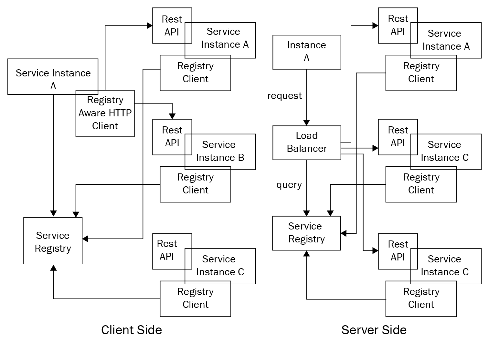
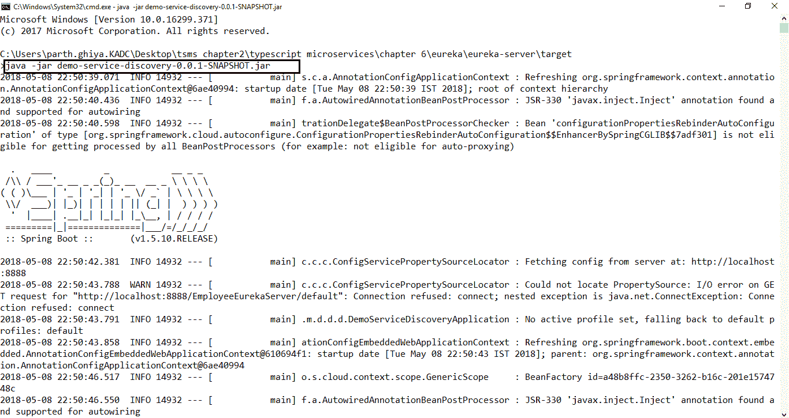
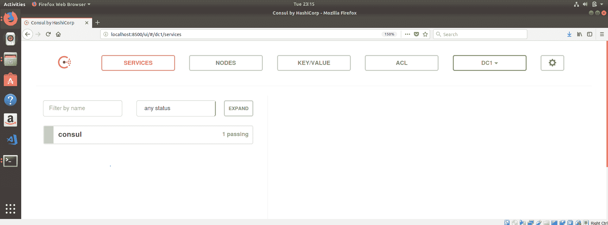

Service Registry and Discovery <link rel="stylesheet" href="css/style.css" type="text/css"> 

# 服务注册和发现

在通过网关处理了分布式系统中的核心问题之后，我们现在将在本章中讨论服务注册和发现。 我们拥有的服务越多，仅使用预定义的端口处理它们就变得越复杂。 在前一章中，我们看到网关与服务注册中心交互，服务注册中心在数据库中维护服务位置。 根据数据库中包含的信息将客户机请求分派到服务。 在本章中，我们将看到如何填充服务注册表，以及服务、客户端和网关以何种方式与之交互。

本章将从理解服务发现、如何动态维护服务注册表、在注册表中注册服务的不同方法以及每种方法的优缺点开始。 我们将了解维护服务注册中心的端到端流程，以及如何基于注册中心发现服务。 我们将看到设计服务注册中心的可用选项，熟悉每个步骤，然后使用可用的最佳实践设计动态服务注册中心。 在本章中，我们将探讨以下主题:

*   服务注册中心简介
*   服务注册和发现的内容、原因和方式
*   服务发现的模式
*   服务注册中心模式
*   服务注册表和发现选项
*   如何选择服务注册中心和发现

# 服务注册中心简介

在本节中，我们将看到服务发现的必要性和服务注册中心的必要性，并尝试理解服务注册中心和发现之间的区别。 我们已经有了一些购物车微服务设置，但核心依赖于一个静态的网络位置。 我们的代码从配置文件中读取一个值，当服务位置发生任何变化时，我们将在配置中更新它。 在实际世界中，由于服务实例是动态分配的位置，因此很难维护这一点。 此外，服务实例会根据自动伸缩、故障处理和更新过程的需要动态更改，这些过程是从微服务世界中的消费者客户端中抽象出来的。 因此，客户端需要使用更强大的服务发现机制。

服务发现可以定义为:

A complete end to end process of registering services in a central place (API Gateway or database) and reaching out to targeted service of consuming via looking up in the service registry.

在微服务领域中，不同的微服务通常作为服务(**PaaS**)环境分布在一个**平台中。 基础设施通常是不可变的，因为我们通常有容器或不可变的 VM 映像。 服务通常可以根据流量和预先固定的指标向上或向下扩展。 由于一切都是动态的，因此在服务准备好使用和部署之前，可能无法知道服务的确切地址。 这种动态特性是微服务领域中需要处理的最重要的方面之一。 一个合乎逻辑且显而易见的解决方案是将这些端点持久化在某个地方，而这本身就是服务注册中心的基础。 在这种方法中,每个 microservice 注册中心代理([的组件,我们看到第五章](05.html),*理解 API 网关*),它提供了所有细节,microservice,如端点地址、合同细节,通信协议,等等。 使用服务通常会查询代理以查找服务在该点的可用位置，然后根据检索到的位置调用它。 一些常见的选项是 Zookeeper、Consul、Netflix Eureka 和 Kubernetes，我们很快会更详细地了解它们。**

# 服务注册和发现的内容、原因和方式

在简要介绍了服务注册表之后，我们将在本节中了解服务注册表和发现的内容、原因和方式。 通过了解服务发现的需求，我们将了解该流程中涉及的流程和组件。

# 服务注册和发现的原因

无论我们采用何种容器技术，在生产环境中，我们总是会有三个、四个主机，每个主机中都有若干个容器。 一般来说，我们在所有可用主机上分布服务的方式完全是动态的，并且依赖于业务功能，并且可以在任何时间点更改，因为主机只是服务器，它们不会永远存在。 这就是服务发现和注册表发挥作用的地方。 我们需要一个外部系统来解决普通 web 服务器的局限性，时刻监视所有的服务，并维护 IP 和端口的组合，以便客户机可以无缝地路由到这些服务提供者。

为了理解服务注册中心和发现的需要，我们将使用一个经典示例。 假设有 10 个产品目录微服务实例在任意数量的节点上运行。 为了有一个弹性系统,有人需要跟踪那些 10 节点因为每当有需要消费产品目录服务,至少有一个适当的 IP 地址或主机名应该是可用的,否则使用者必须查询中央地方可以找到产品目录的位置服务。 这种方法非常类似于 DNS，不同之处在于它只是用于内部服务之间的服务通信。 大多数基于微服务的架构都是动态移动的。 服务根据开发、折旧和流量进行上下伸缩。 每当服务端点发生更改时，注册中心都需要知道这些更改。 服务注册中心就是这样:维护关于如何到达每个服务的所有信息。

市场上有很多可用的工具来解决这个问题，作为架构师，我们需要根据我们的需要决定正确的工具。 我们需要考虑一些因素，比如可以完成多少自动化以及我们对工具有多少控制。 从 Consul 这样的低级工具，到 Kubernetes 或 Docker 群这样的高级工具，它们处理高级需求，如负载平衡容器和容器调度功能。

# 服务如何注册和发现?

目前，服务注册和发现的基本方法有三种:

*   第一种基本和初步的方法是使用现有的 DNS 基础设施。 一个部署良好的 DNS 应该是高可用性和分布式的。 这种方法的例子包括`httpd`、`confd`、`systemd`等。 在这种方法中，使用标准 DNS 库作为注册商客户端。 每个微服务条目在 DNS 区域文件中接收一个条目，并执行 DNS 查找以连接或定位微服务。 另一种方法是使用代理，比如 NGINX，它定期轮询 DNS 来发现服务。 这种方法的优点包括语言无关性:它适用于任何具有最小或零更改的语言。 然而，它有几个缺陷，比如 DNS 不提供实时视图、管理服务注册和注销的新区域文件，以及为弹性维护该组件的高可用性。
*   第二种方法更动态，更适合使用一致的键值数据存储(如 Hashicorp 的 Consul、Apache Zookeeper、etcd 等)的微服务。 这些工具是高度分布式的系统。 通过键值存储和 sidecar 模式，它解决了我们在使用 DNS 时遇到的所有问题。 这种方法对任何编写代码的开发人员都是完全透明的。 开发人员可以用任何编程语言编写代码，而不必考虑微服务如何与其他服务交互。 它有几个限制，例如 sidecar 仅限于主机的服务发现，而不是更细粒度的路由。 它还通过为每个微服务引入额外的跳转来增加额外的延迟。
*   服务发现的最后一种方法是采用现成的框架，如 Netflix Eureka，专门为服务发现设计和优化。 该模型直接向终端开发人员公开功能。

无论我们选择哪种工具，每个微服务都需要一个中央客户机来进行服务发现通信，其主要功能是允许服务注册和解析。 当服务启动时，服务发现使用注册过程向其他服务发出其可用性信号。 一旦可用，其他服务使用服务解析在网络上定位服务。 涉及的两个过程如下。

# 服务注册

在启动和关闭时，服务注册自身，或者通过第三方注册，服务注册客户端还发送持续的心跳，以便客户端知道服务是活动的。 heartbeat 是一个定期发送到其他服务的消息，表示服务正在运行并处于活动状态。 它们应该异步发送或实现为基于事件的，以避免性能问题。 其他方法包括不断轮询服务。 服务注册阶段还负责设置服务的契约，即服务名称、协议、版本等。

# 服务解决方案

这是返回微服务网络地址的过程。 理想的服务发现客户机具有几个关键特性，如缓存、故障转移和负载平衡。 为了避免缓存服务时的网络延迟，地址是关键的。 缓存层订阅来自服务发现的更新，以确保它始终是最新的。 典型的微服务实现层部署在各个位置，以实现高可用性; 服务解析客户端必须知道如何根据负载可用性和其他因素返回服务实例的地址。

# 服务注册和发现的内容

在本节中，我们将讨论服务注册和发现。 我们将看到服务注册中心涉及到的所有方面，并查看与维护服务注册中心有关的所有可能选项。

# 维护服务注册中心

在本节中，我们将看到使用者如何最终找到服务提供者。 我们将看到所有可用的方法，并看看每个选项的利弊:

*   **通过套接字进行更新**:常规轮询很快就会成为一个问题，因为消费者最不关心在发现服务上注册自己，而且对发现服务来说，维护消费者列表也变得很痛苦。 更好的解决方案是让客户机打开与发现服务的套接字连接，并不断获得所有服务更改的最新列表。

*   :这更多的是一个服务器端实现，在发现服务中存在路由逻辑，使得客户端不需要维护任何列表。 它们只是向发现服务发出出站请求，发现服务将请求转发给适当的服务提供者并将结果返回给提供者。

# 及时的健康检查

**有两种方法可以对发现进行及时的健康状况检查。 一种方法规定服务应该向集中式发现服务发送消息，而另一种方法则让发现服务向服务提供者发送请求:**

 ***   **服务轮询注册服务:**在这种方式中，服务提供者以预定义的定期间隔主动向注册服务发现服务发送消息。 发现服务跟踪所有最后一次接收请求的时间，如果没有设定某个时间阈值，则认为服务提供者已死。

*   **注册轮询服务:**这是中心发现服务向服务提供者发送请求的方法。 然而，这种方法的一个缺点是集中式发现服务可能会因为执行如此多的出站请求而筋疲力尽。 此外，如果服务提供者消失，注册商就必须进行大量失败的健康状况查找，这将造成网络浪费。

# 服务发现的模式

从客户机的角度看，发现是服务注册中心的对等物。 每当客户机想要访问服务时，它必须找到关于服务的详细信息、服务所在的位置以及其他契约信息。 这通常使用两种方法来完成，客户端发现和服务器端发现。 业务发现可以简单概括为:

*   微服务或消费者事先不知道其他服务的物理位置。 他们不知道某个服务何时停止，或者该服务的另一个节点何时启动。
*   服务广播他们的存在和消失。
*   服务能够基于其他广播元数据向其他服务实例传递。
*   检测实例失败，阻止对该失败节点的任何请求，并使其无效。
*   服务发现不是单点故障。

在本节中，我们将研究服务发现的模式，并了解每种模式的优缺点。

# 客户端发现模式

在使用客户端模式时，客户端或网关的职责是确定可用服务实例的网络位置，并在它们之间对请求进行负载平衡。 客户端查询服务注册中心(它只是一组可用的服务实例)，存储其响应，然后根据响应中的位置地址路由请求。 客户端使用一些著名的负载平衡算法来选择一个服务实例，并向该实例发出请求。 服务实例的物理网络位置在服务启动时向注册中心注册，在服务停止时注销。 服务实例注册使用心跳机制或轮询或通过套接字进行实时更新。

**优点:**

*   除了服务注册中心外，该模式是相当静态的，因此更容易维护
*   由于客户机知道服务实例，因此客户机可以做出智能的、特定于应用程序的、依赖于情况的负载平衡决策，例如不断使用散列

**疼痛区:**

*   客户端与服务注册中心紧密耦合
*   需要在服务客户机使用的每种编程语言和框架中实现客户端服务发现

一个著名的客户端注册流程工具是 Netflix Eureka。 它提供了一个 REST API 来管理服务实例注册和查询可用实例。 在[https://github.com/Netflix/eureka/wiki/Eureka-REST-operations](https://github.com/Netflix/eureka/wiki/Eureka-REST-operations)可以找到 api 和可用选项的完整列表，其中包含所有可用的操作。

# 服务器端发现模式

解决这个问题的方法是为注册中心提供一个单独的组件，这就是服务器端发现模式。 在这种方法中，客户端通过负载平衡器向服务发出请求。 负载平衡器然后查询服务注册中心，并将每个请求路由到一个可用的服务实例，以向使用者提供服务响应。 这种方法的一个经典示例是内置的 AWS 负载平衡器。 Amazon**Elastic Load Balancer**(**ELB**)通常用于处理来自互联网的巨大外部流量，并在输入流量之间进行负载平衡，但 ELB 的使用远远超出了这个范围。 ELB 还可以用于对虚拟机进行内部流量负载均衡。 当客户端通过其 DNS 向 ELB 发出请求时，ELB 会在一组注册的 EC2 实例或容器之间进行负载平衡。

维护服务器端发现的方法之一是在每个主机上使用代理。 该代理扮演服务器端发现负载平衡器的角色。 代理透明地将请求转发到该服务器上任何地方运行的可用服务实例。 Kubernetes 采用了类似的方法。 一些可用的工具是 NGINX 和 Consul 模板。 这些工具配置反向代理和重新加载 NGINX 或 HAProxy 服务器。

服务器端发现模式的优点:

*   在服务器端进行客户端发现的代码更简单，因为我们不需要为每个服务编写发现代码，而且它完全从客户端抽象出来
*   负载平衡等功能是通过这种方法实现的

服务器端发现模式的缺点:

*   路由是另一个需要在服务器上维护的组件。 如果环境是集群的，那么需要在任何地方复制它。
*   除非路由是 TCP 路由，否则路由应该支持 HTTP、RPC 等协议。
*   与客户端发现相比，它需要更多的网络跳数。

让我们看看这张图中的两种方法:



Client-side vs server-side service discovery

# 服务注册中心模式

在分布式系统中发现服务的关键方面之一是服务注册中心。 服务注册中心只是一个拥有服务实例的所有网络位置的数据库。 由于它包含关键信息，它必须是高可用的，并在一个有效的系统上保持最新。 基于系统客户端(在本例中为 API Gateway)，我们甚至可以缓存从服务注册中心获得的网络位置。 但是，它必须每天更新，否则客户机将无法发现服务实例并对每个服务进行通信。 为了保持高可用性，服务注册中心由集群组成，其中使用复制协议来保持一致性。 服务注册中心保存微服务实例的元数据，其中包括实际位置、主机端口、通信协议等。 微服务的启动和关闭过程被持续监控。 在本节中，我们将研究服务注册表和常见的服务注册选项。 我们将研究每种方法的优缺点。

为了拥有一个容错系统，所有服务实例都必须从中央注册中心注册和注销。 有多种方法来处理这个注册和注销过程。 一种选择是服务注册中心提供端点，而服务实例注册本身，即自我注册。 另一种选择是使用其他一些系统组件来管理服务实例的注册。 让我们深入研究这两种模式以详细理解它们。

# Self-registration 模式

在使用自注册过程时，服务实例本身负责在服务注册中心内注册和注销。 此外，服务实例必须不断发送 heartbeat 请求，以便让注册中心知道服务的状态。 如果注册中心没有接收到心跳，注册中心可以假设服务不再存在，并可以注销或停止侦听该服务。 自注册模式强制微服务自己与服务注册中心通信。 无论服务何时启动或关闭，它都必须与注册中心通信以告知其状态。 微服务只处理单一的关注点，因此在任何地方引入另一个关注点可能会带来额外的负担，而且可能看起来是一种反模式; 然而,它有一个额外的优势,服务维护其自身的状态模型,了解当前状态,也就是说,**,**,**关闭**,不依赖于任何其他第三方服务。****

 ****一个著名的自注册过程的例子是 Netflix OSS Eureka 客户端。 Eureka 客户端处理客户端注册和注销的所有方面。 我们将在后面的小节中看到 Eureka 的详细实现。

自注册模式的缺点:

*   服务耦合到服务注册中心。 它必须不断地与服务器通信，以告诉服务器服务的状态。
*   服务注册中心逻辑不是集中的，必须在生态系统中的每一种语言中实现。

# 第三方注册模式

在使用第三方注册流程和服务实例时，微服务坚持单一责任原则，不再负责向服务注册中心注册自己。 相反，我们在系统中引入了一个新组件*服务注册商*，它负责维护服务注册中心。 为了维护注册表，服务注册商通过轮询环境或订阅启动和关闭事件来跟踪实例。 每当它注意到一个新可用的服务时，它就向注册中心注册该实例。 同样，如果它未能收到运行状况检查，则从注册中心注销该服务。 与自我注册模式不同，微服务代码要简单得多，因为它不负责注册自己，但它也有缺点。 如果没有仔细选择注册商，它将成为另一个必须安装、配置、维护和高可用性的组件，因为它是系统的一个关键组件。 第三方注册通常是业界的首选，因为它自动管理注册表。 注册中心所需的其他数据可以以策略或合同的形式提供，这些数据可以在数据库中更新。 Apache Zookeeper 或 Netflix Eureka 等工具与其他工具结合使用，得到了广泛的应用。

第三方注册具有多种优势。 假设服务宕机，第三方注册商可以采取适当的操作，比如提供安全的回退、触发自我修复机制等等。 如果服务上的流量很大，注册流程可以通过请求该微服务的新实例化来自动添加新的端点。 对服务执行的这些运行状况检查可以帮助自动注销注册，以防止故障级联到整个系统。 一个著名的例子是注册器，我们将在本章后面看到。

一些著名的第三方注册模式例子包括:

*   **Netflix Prana:**Netflix 外包的 OSS Prana 专门用于非 jvm 语言。 它是 sidecar 模式的一个实现，它与服务实例并排运行，并通过 HTTP 公开它们。 Prana 通过 HTTP 向 Netflix Eureka 注册和注销服务实例。

*   **内置组件，如 ELB:**大多数部署环境都有内置组件。 通过伸缩自动创建的 EC2 实例会自动注册到 ELB。 类似地，Kubernetes 服务也会自动注册，并且可以用于发现(我们将在第 10 章、*加固应用*的伸缩部分更详细地了解这一点)。

第三方注册模式的优势如下:

*   代码不那么复杂，因为每个服务都不需要编写自己的注册和注销代码
*   中央注册中心还包含执行健康检查的代码，这并不需要在所有地方复制

第三方注册模式的缺点如下:

*   除非它是由服务发现工具提供的，否则它是另一个需要维护并保持高可用性的组件

# 服务注册表和发现选项

在本节中，我们将研究市场上一些用于服务发现和注册的常用选项。 可选方案范围从为架构师提供高度控制的低级解决方案(CoreOS 的 etcd 和 HashiCorp 的 Consul)到提供集装箱调度解决方案的高端解决方案(谷歌的 Kubernetes, Docker swarm 等)。 在本节中，我们将了解各种选项，并研究每种选项的优缺点。

# 尤里卡

Eureka 是 Netflix 外包的一个服务注册和发现框架，主要用于定位服务，以实现任何中间层服务器的负载平衡和故障转移。 在本节中，我们将介绍使用 Eureka 的服务发现和注册表。

整个 Eureka 架构由两个组件组成:Eureka 服务器和客户端。 Eureka 服务器是一个独立的服务器应用程序，它负责:

*   管理服务实例的注册表
*   提供注册任何服务、注销任何微服务和查询实例的方法，作为服务发现的一部分
*   将实例注册传播到其他 Eureka 服务器和客户机提供了一种类似于心跳的机制来持续监视服务

Eureka 客户是生态系统的一部分，并负有以下责任:

*   在启动、关闭等进程上向 Eureka 服务器注册和取消注册绑定的微服务
*   通过不断发送心跳来保持与 Eureka 服务器的连接
*   检索其他服务实例信息，缓存它，并每天更新它

在尤利卡，我们将经常使用以下术语:

| **Eureka 服务器** | 它是发现服务器。 它通过注册和注销任何服务，以及用于发现任何服务的 api，为所有服务的当前状态建立了一个注册中心。 |
| **尤利卡服务** | 在 Eureka 服务注册表中发现的任何东西，以及为他人注册并打算被发现的任何东西。 每个服务都有一个逻辑标识符，可以引用该应用程序的实例 ID，它被称为 VIP 或服务 ID。 |
| **Eureka 实例** | 注册到 Eureka 服务器以便被其他服务发现的任何应用程序。 |
| **Eureka 患者** | 可以注册和发现任何微服务的任何微服务应用程序。 |

在本节中，我们将设置 Eureka 服务器，在 Eureka 服务器上注册一个示例微服务，并在我们的其他微服务中找到该微服务的位置。 让我们开始吧。

# 建立尤利卡服务器

Eureka 服务器是 Netflix OSS 产品和服务发现模式实现，其中每个微服务都被注册，客户端在服务器上查找以获得依赖的微服务。 Eureka 服务器运行在 JVM 平台上，因此我们将直接使用一个可用的模板。

To run a Eureka server, you will need Java 8 and Maven set up.

让我们来看看设置 Eureka 服务器的步骤:

1.  转到本章提取的源代码中的`eureka`文件夹。 您将发现一个用于 Eureka 服务器的现成 Java 项目`euraka-server`。
2.  在根目录下，打开终端，运行如下命令:

```js
mvn clean install
```

3.  您应该看到安装了依赖项，最后，您将收到一条消息，确认构建成功，并生成了`target`文件夹。
4.  打开`target`文件夹，在其中您可以看到 Eureka 服务器`.jar`文件(`demo-service-discovery-0.0.1-SNAPSHOT.jar`)。
5.  打开一个终端并点击以下命令。 你应该看到你的服务器启动:

```js
java -jar demo-service-discovery-0.0.1-SNAPSHOT.jar
```

命令输出信息如下图所示:



Starting up Spring Eureka server

6.  点击`http://localhost:9091/`，你应该能够看到 Eureka 服务器启动。 你应该看到这样的东西:


Spring Eureka server

现在我们已经启动了 Eureka 服务器，我们将向它注册我们的服务。 在向 Eureka 服务器注册后，我们将能够看到我们的服务在实例当前已注册的 Eureka 下。

# 在尤利卡服务器上注册

现在我们的 Eureka 服务器已经启动并准备好接受微服务的注册，我们将注册一个演示微服务并在 Eureka 仪表板上看到它。 您可以使用附加到源文件(`first-microservice-register`)的源代码。 让我们开始:

1.  从[第二章](02.html)、*开始我们的第一个微服务代码。 我们将在项目中使用`eureka-js-client`([https://www.npmjs.com/package/eureka-js-client](https://www.npmjs.com/package/eureka-js-client))模块，它是 Netflix OSS Eureka 的一个 JavaScript 实现。*

2.  打开终端，安装`eureka-js-client`:

```js
npm i eureka-js-client --save
```

3.  接下来，我们将安装在 TypeScript 项目中使用的`eureka-js-client`类型。 在撰写本文时，`DefinitelyTyped`存储库中可用的类型不是最新的。 因此，我们现在将编写自定义类型。
4.  创建一个文件夹`custom_types`，并在其中添加`eureka-js-client.d.ts`。 从附件的源代码或从我的要点[https://gist.github.com/insanityrules/7461385aa561db5835c5c35279eb12bf](https://gist.github.com/insanityrules/7461385aa561db5835c5c35279eb12bf)复制内容
5.  接下来，我们将在 Eureka 注册我们的 Express app。 打开`Application.ts`，在里面写以下代码:

```js
let client = new Eureka(
  {
    instance: {
      app: 'hello-world-chapter-6',
      hostName: 'localhost',
      ipAddr: '127.0.0.1',
      statusPageUrl: `http://localhost:${port}`,
      healthCheckUrl: `http://localhost:${port}/health`,
      port: {
        '$': port,
        '@enabled': true
      },
      vipAddress: 'myvip',
      dataCenterInfo: {
        '@class': 'com.netflix.appinfo.InstanceInfo$DefaultDataCenterInfo',
        'name': 'MyOwn',
      },
    }, eureka: {
      host: 'localhost',
      port: 9091,
      servicePath: '/eureka/apps/'
    }
  })
```

我们刚刚做了什么? 为了更好地理解，我们来看看以下几点:

6.  接下来，我们将从客户端开始; 只需添加以下内容:

```js
client.start()
```

7.  我们的登记簿都准备好了; 我们现在可以通过`npm start`开始我们的服务。 现在，导航到`localhost:9091`检查服务器实例:


Service registered in Eureka server

8.  我们的服务将不断获取服务注册表，并发送心跳通知该服务正在运行。 让我们停止和注销服务时，我们的微服务被杀。 只需将以下代码添加到`Application.ts`:

```js
process.on('SIGINT', function() {client.stop(); });
```

现在我们的服务已经与 Eureka 同步，在下一节中，我们将看到如何发现服务。

# 发现与 Eureka 服务器

在本节中，我们将在另一个微服务中发现我们的注册服务。 我们将在不知道服务地址或硬编码位置的情况下从该服务获得响应。 从[第二章](02.html)、*整装上马*中复制`first-microservice`的结构。 因为我们到处都需要 Eureka 客户，所以我们将创建`EurekaService.ts`。 您可以在项目的`eureka/eureka-service-discovery/src`文件夹中找到完整的源代码。

让我们看看如何发现我们的注册服务:

1.  创建一个名为`EurekaService.ts`的文件，并创建用于初始化客户端的静态方法:

```js
static getClient(): Eureka{
  if (!this._client) {
    this._client = new Eureka({
      instance: {}, //set instance specific parameters,
      Eureka: {} //set Eureka parameters
    })
  }
```

2.  在`Application.ts`中，启动您的客户端并添加如下停止进程:

```js
EurekaService.getClient().start();
…
process.on('SIGINT', () => {
  /*stop client*/
 EurekaService.getClient().stop();
  this.server.close()
 });
```

3.  在我们的`HelloWorld.ts`中，我们将从`first-microservice-register`调用服务并获取它的响应。 我们不会硬编码位置。 在`HelloWorld.ts`中添加以下 LOCs:

```js
let instances: any =
  EurekaService.getClient().getInstancesByAppId("HELLO-WORLD-CHAPTER-6");
let instance = null;
let msg = "404 Not Available";
if (instances != null && instances.length > 0) {
  instance = instances[0];
  let protocol = instances[0].securePort["@enabled"] == "true" ? "https" : "http";
  let url = protocol + "://" + instance.ipAddr + ":" + 
                       instances[0].port.$ + "/";
  const { res, payload } = await Wreck.get(url);
  msg = payload.toString();
} 
```

如您所见，我们从服务注册表中选择了协议、端口和 IP 地址。

4.  运行您的应用程序，您将能够看到来自`first-microservice-register`的响应。

# 尤利卡的要点

在 Eureka 服务注册和发现的练习之后，让我们来看看 Eureka 的一些要点:

*   Eureka 由一个服务器组件和一个客户端组件组成。 服务器组件是所有微服务通信的组件。 它们通过不断发送心跳来记录它们的可用性。 消费服务还使用服务器组件来发现服务。
*   当一个微服务使用我们的 Eureka 服务启动时，它会到达 Eureka 服务器，并通过合同细节广播它的存在。 注册后，服务端点每 30 秒发送一次心跳请求以更新其租期。 如果一个服务端点失败了一定次数，它就会被从服务注册表中删除。
*   您可以通过设置以下选项中的任何一个来启用调试日志:
    *   `NODE_DEBUG=request`
    *   【t】【t】
*   客户端不断地在每个预定义的点获取注册表并缓存它。 因此，当它想要发现另一个服务时，额外的网络跳被阻止。
*   Eureka 客户端提供了可用服务的列表，并提供了通过主机名或实例名提供它们的选项。
*   尤利卡服务器是区域感知的。 在同一个区域中注册服务时可以提供区域信息。 为了进一步介绍负载均衡器，我们可以使用与 Netflix Ribbon 等效的弹性客户机([https://www.npmjs.com/package/resilient](https://www.npmjs.com/package/resilient))。
*   它具有健康检查、状态页、注册、注销、最大重试次数等选项。
*   Eureka 是一个典型的服务器端客户机注册和自注册选项。

# 领事

服务注册和发现的另一个选项是 HashiCorp Consul([https://www.consul.io/](https://www.consul.io/))。 Consul 是分布式键值存储和其他服务发现和注册功能的开源实现。 它既可以作为主机运行，也可以作为代理运行。 主控器协调整个网络并维护注册表。 领事代理人充当船长的代理人，将所有的请求转发给船长。 在本节中，我们将了解使用 Consul 的服务发现和注册。

在本练习中，我们将使用 Consul 进行服务注册和发现。 我们将研究使用 Consul 进行自我注册/注销的方法。 让我们开始; 在这个练习中，我们将使用 Linux 操作系统。

# 设置 Consul 服务器

让我们来看看设置 Consul sever 的步骤:

1.  设置 Consul 服务器非常简单。 只需从[https://www.consul.io/downloads.html](https://www.consul.io/downloads.html)下载可执行文件，并将其解压到您选择的位置。 解压缩后，点击以下命令，使其可用于二进制执行:

```js
cp consul /usr/local/bin/
```

2.  打开终端，输入`consul -v`，测试 Consul 安装; 您应该能够看到版本 1.0.7。
3.  现在，我们将打开 Consul UI 终端。 Consul 默认带有一个 UI 仪表板; 要使用 UI 仪表板启动 Consul 终端，请按以下命令:

```js
consul agent -server -bootstrap-expect=1 -data-dir=consul-data -ui -bind=<Your_IPV4_Address>
```

4.  `localhost:8500`; 你应该能看到这样的东西:


Consul server

我们已经成功启动了 Consul 服务器; 接下来我们将在 Consul 中注册一些服务。

# 与领事服务人员交谈

与 Eureka 一样，Consul 也公开了一些可用于与 Consul 服务器交互的 REST 端点。 在本节中，我们将看到如何:

*   注册一个服务实例
*   发送心跳并做健康检查
*   注销服务实例
*   订阅更新

# 注册服务实例

让我们先从[第 2 章](02.html)、*《gearup for the Journey》中的首款微服务的克隆开始。 你可以在`chapter-6/consul/consul-producer`文件夹中找到完整的源代码:*

1.  打开终端，点击以下命令:

```js
npm install consul  @types/consul --save
```

2.  现在在`Application.ts`中，我们将初始化我们的 Consul 客户端。 写这段代码:

```js
import * as Consul from 'consul';
import { ConsulOptions } from 'consul';
…
let consulOptions: ConsulOptions =
  { host: '127.0.0.1', port: '8500', secure: false, promisify: false }
….
let details =
  {
    name: 'typescript-microservices-consul-producer',
    address: HOST,
    check: { ttl: '10s', deregister_critical_service_after: '1m' },
    port: appPort, id: CONSUL_ID
  };
let consul = new Consul(consulOptions);
```

3.  接下来，我们将向领事注册我们的服务:

```js
consul.agent.service.register(
  details, err => {
    if (err) {
      throw new Error(err.toString());
    }
    console.log('registered with Consul');
  }
```

4.  运行该程序，您应该能够看到成功的日志。 您将能够看到类似如下的输出:



Service registry with Consul and Consul dashboard

# 发送心跳，做健康检查

现在，我们将添加一个调度器，该调度器不断发送心跳，以告诉 Consul 服务器它处于活动状态。 在与前面练习相同的代码中，只需添加以下代码行:

```js
  setInterval(() => {
   consul.agent.check.pass({id:`service:${CONSUL_ID}`}, 
   (err:any) => {
        if (err) throw new Error(err); 
        console.log('Send out heartbeat to consul');
        });
   }, 5 * 1000);
```

我们做了什么?

*   每 5 秒，我们将心跳发送给 Consul，以确保我们生成的`CONSUL_ID`服务处于活动状态。
*   定期发送心跳以确保 Consul 知道我们的服务处于活动状态，并且不会断开我们的服务。 前面，我们将设置中的 TTL 值保持为 10 秒，这意味着如果 Consul 服务器在 10 秒后没有接收到心跳，它将假定服务已停止。
*   较高的 TTL 值意味着 Consul 将很晚才知道应用程序何时已死或无法为请求提供服务。 另一方面，一个短的 TTL 值意味着我们通过网络发送了太多的数据，这会淹没 Consul，因此应该仔细选择这个值。
*   您总是需要传递一个惟一的 ID，因此在本练习中，我们生成 UUID 并使用它混合主机和端口。
*   运行状况检查 API 可通过 HTTP 使用。 我们要做的就是按下面的键

```js
GET /agent/check/pass/service:<service_id>
```

# 注销申请

在本节中，我们将在服务器终止或有人终止服务器时注销应用程序。 这确保 Consul 不必等到 TTL 期间才实际知道服务关闭。 只需在`Application.ts`中添加以下代码行:

```js
   process.on('SIGINT', () => {
  console.log('Process Terminating. De-Registering...');
  let details = { id: CONSUL_ID };
  consul.agent.service.deregister(details,
    (err) => {
      console.log('de-registered.', err);
      process.exit();
    });
```

现在，当您优雅地终止应用程序时检查 Consul 服务器时，您将看不到我们的 Consul 生产者已注册。

# 订阅更新

与 Eureka 一样，我们将不断获取 Consul 注册表，因此无论何时需要与另一个注册表通信，我们都不需要再次调用注册表，因为注册表已经在我们这端缓存了。 Consul 通过提供一个名为`watch`的特性来解决这个问题。 对服务的响应将有一个索引号，它可以用于未来的请求进行比较。 它们不过是一个光标，用来跟踪我们所结束的地方。 让我们在应用程序中添加监视程序:

1.  通过添加以下代码创建一个新的监视程序。 这里，我们在 Consul 中创建了一个名为`data`的服务监视器:

```js
let watcher = consul.watch({
  method: consul.health.service,
  options: {
    service: 'data',
    passing: true
  }
});
```

2.  接下来，我们将在监视器上添加一个更改事件，因此每当它接收到新的更新时，我们就缓存服务数据的注册表。 创建一个数组并持久化它在监视时接收到的条目:

```js
let known_data_instances: string[];
..
watcher.on('change', (data, res) => {
  console.log('received discovery update:', data.length);
  known_data_instances = [];
  data.forEach((entry: any) => {
    known_data_instances.push(`http://${entry.Service.Address}:
    ${entry.Service.Port}/`);
  });
  console.log(known_data_instances);
});
```

3.  添加一个错误处理程序:

```js
watcher.on('error', err => {
  console.error('watch error', err);
});
```

4.  就是这样。 现在，使用`npm start`运行该程序，并使用名称`data`注册另一个服务(步骤与注册新服务相同)。 然后，您应该能够看到如下输出:

```js
received discovery update: 1
 [ 'http://parth-VirtualBox:8081/' ]
```

就是这样。 我们只是做了服务注册，并与 Eureka 服务器交互。 当数据服务停止时，这个值也将被动态更新。 现在我们有了动态地址和端口，我们可以随时使用它来发现服务的位置。

# 领事要点

在完成领事的练习后，现在让我们总结一下领事的要点:

1.  Consul 通过八卦协议(告诉所有活着并与他人保持联系的人)来形成动态集群。
2.  它有一个内置的键-值存储，不仅存储数据，还用于注册监视，可以用于许多任务，例如通知其他人数据更改、运行不同的健康检查，以及一些根据用例定制的命令。
3.  服务发现是嵌入式的，所以我们不需要任何第三方工具。 它具有运行状况检查、监视等内置特性。

它对多个数据中心提供开箱即用的支持，而且八卦协议也可以跨所有数据中心工作。 它还可以用于发现关于其他已部署的服务和它们所驻留的节点的信息。 它具有内置的健康检查、ttl 和自定义命令支持，我们可以在其中添加自己的中间件功能。

# Registrator

虽然 Consul 似乎是服务发现和注册的一个很好的选择，但它有一个相当大的缺点，即每个服务都需要维护它们的启动和关闭代码，这似乎是到处都有相当多的重复代码。 我们需要一个基于监听 Consul 服务器的启动和关闭事件来自动注册服务的工具。 注册商只是一个合适的工具。 它是 Docker 的一个服务注册表桥接器，可以根据需要插入适配器。 注册器自动注册和注销服务时，他们来在线或去死。 它具有服务注册中心的可插入选项，这意味着它可以用于各种其他服务注册中心客户端，如 Consul、etcd 等。

让我们开始使用注册器。 在本练习中，我们将使用 Consul 的服务注册表，将其插入到 registry，然后启动一个服务，并让 registry 在 Consul 服务器中自动注册它:

1.  首先，使用以下命令启动 Consul 服务器:

```js
consul agent -server -bootstrap-expect=1 -data-dir=consul-data -ui -bind=<Your_IPV4_Address>
```

2.  现在，我们将提取 Registrator 的 Docker 映像并指定将其插入到 Consul 注册中心，以便当 Registrator 找到任何服务时，它们将自动添加到 Consul 服务器。 打开终端，点击以下命令:

```js
sudo docker run -d 
 --name=registrator
 --net=host 
 --volume=/var/run/docker.sock:/tmp/docker.sock 
 gliderlabs/registrator:latest 
 consul://localhost:8500
```

我们以分离模式运行容器并给它命名。 我们在主机网络模式下运行，以确保注册器具有实际主机的主机名和 IP 地址。 最后一行是我们的注册表 URI。 注册器需要在每个主机上运行; 在我们的练习中，我们使用单一的宿主。 要启动注册器，我们需要提供的基本配置是如何连接到注册中心，在本例中是 Consul。

3.  为了确保注册器已经成功启动，点击以下命令，你应该能够看到日志流和消息`Listening for Docker events ...`:

```js
sudo  docker logs registrator
```

4.  现在，我们将使用 Docker 启动任何服务，我们的服务将自动注册到 Consul。 打开终端，从[第 2 章](https://cdp.packtpub.com/typescript_microservices/wp-admin/post.php?post=121&action=edit#post_48)，*开始我们的服务，在 Docker 中使用以下方法:*

```js
sudo docker run -p 8080:3000 -d firsttypescriptms:latest
```

或者你可以启动任何服务，比如`redis`，只需简单地输入以下内容:

```js
sudo docker run -d -P --name=redis redis 
```

5.  打开 Consul 用户界面，您将能够看到我们的服务在那里注册。

在这里，我们使用注册者和领事有效地实现了自动发现。 它的工作原理是自动发现。

# 注册者的关键点

让我们来讨论注册者的关键点:

1.  注册器作为一个自动发现代理，它监听 Docker 的启动和关闭事件。
2.  注册者有以下内建选项从他们的 GitHub`Readme`文件:

```js
Usage of /bin/registrator:
   /bin/registrator [options] <registry URI>
   -cleanup=false: Remove dangling services
   -deregister="always": Deregister exited services "always" or "on- 
    success"
   -internal=false: Use internal ports instead of published ones
   -ip="": IP for ports mapped to the host
   -resync=0: Frequency with which services are resynchronized
   -retry-attempts=0: Max retry attempts to establish a connection  
    with the backend. Use -1 for infinite retries
   -retry-interval=2000: Interval (in millisecond) between retry-
    attempts.
   -tags="": Append tags for all registered services
   -ttl=0: TTL for services (default is no expiry)
   -ttl-refresh=0: Frequency with which service TTLs are refreshed
```

3.  将 Registrator 与 Consul 一起使用为我们的服务发现和注册提供了一个非常可行的解决方案，而无需到处复制代码。

这些是目前广泛使用的一些解决方案。 除此之外，还有其他的解决方案，如 ELB、Kubernetes 等。

在本节中，我们了解了使用 Eureka、Consul 和 Registrator 的服务注册和发现，并了解了基于服务发现和注册模式的其他一些选项。 在下一节中，我们将了解如何选择正确的服务注册中心和发现解决方案。

# 如何选择服务注册中心和发现

前面，我们看到了基于服务注册中心和发现模式的各种服务注册中心和发现选项。 所以，接下来出现的问题很明显，应该采用哪种解决方案? 这个问题很宽泛，它实际上取决于需求。 您的需求很可能与大多数其他公司不同，所以与其采用最常见的解决方案，不如评估您的需求，并基于此设计您自己的策略。 为制定策略，应适当评估以下问题:

*   系统将只使用一种语言编码还是有一个多语言环境? 用不同的语言编写相同的代码是相当麻烦的。 在这种情况下，注册者是相当有用的。
*   是否涉及遗留系统? 这两个系统都要运行一段时间吗? 在这种情况下，自注册解决方案可能非常有用。
*   服务发现过程有多简单? 会有通道吗? 两者之间有负载均衡器吗?
*   服务发现是否需要 API ? 个体微服务是否需要与其他微服务进行通信? 在这种情况下，HTTP 或基于 dns 的解决方案非常有用。
*   服务发现解决方案是否嵌入到每个微服务中，或者是否需要集中嵌入逻辑?
*   我们是否需要单独的应用配置，或者我们是否可以将这些存储在诸如 Redis 或 MongoDB 这样的键值存储中?
*   什么是部署策略? 是否需要部署策略，例如蓝绿色策略? 根据适当的服务发现，应该选择解决方案。

Blue-green is a deployment strategy where the downtime is reduced by running two identical production environments named blue and green.

*   系统将如何运行? 会有多个数据中心吗? 如果是这样的话，那么尤利卡是最合适的。
*   你如何保持你的致谢? 如何维护访问控制列表? 如果是这样，那么 Consul 有内置的解决方案。
*   有多少支持? 它是开源的吗?它有广泛的支持吗? 问题太多了吗?
*   如何决定自动扩展解决方案?

根据这些问题，并对它们进行适当的评估后，我们可以决定适当的解决方案。 在仔细评估这些之后，我们可以选择任何解决方案。 这里列出了在选择解决方案时需要注意的一些要点。

在选择 Consul 或 Eureka 时要注意这些点。

# 如果你选择领事

领事有很多好处，选择领事时需要注意以下几点:

*   客户端需要编写自己的负载平衡、超时和重试逻辑。 为了避免编写完整的逻辑，我们可以在[https://www.npmjs.com/package/resilient](https://www.npmjs.com/package/resilient)中使用下面的`node`模块。
*   客户端需要分别实现获取逻辑、缓存和领事故障处理，除非我们使用了 Registrator。 这些需要针对生态系统中的每种语言分别编写。
*   不能为服务器设置优先级; 需要编写自定义逻辑。

# 如果你选择尤利卡

虽然 Eureka 有很多额外的优点，但在选择 Eureka 时需要注意以下几点:

*   客户端必须添加自己的负载平衡、超时和重试逻辑，因此我们需要将其与 Netflix Ribbon 等外部工具集成。
*   文档非常糟糕。 如果您有一个非 jvm 环境，您将不能使用 Eureka。 Eureka 服务器需要运行在 JVM 平台上。 对于非 jvm 客户机，文档非常模糊。
*   Web UI 是极其枯燥无味的。

在本节中，我们了解了选择 Eureka 或 Consul 时的主要要点。 我们总结了主要要点，以实际帮助我们决定服务注册中心和发现解决方案。

# 总结

在本章中，我们学习了服务注册和发现。 我们讨论了服务发现的时间、内容和原因，并理解了服务注册中心和发现模式。 我们看到了每种模式的优缺点以及每种模式的可用选项。 然后，我们使用 Eureka、Consul 和服务注册器实现服务发现和注册。 最后，我们了解了如何选择服务发现和注册中心解决方案，以及在选择 Eureka 或 Consul 时的关键要点。

在下一章中，我们将看到服务状态以及微服务如何相互通信。 我们将学习更多的设计模式，如基于事件的通信和发布者-订阅者模式，了解运行中的服务总线，共享数据库依赖关系，等等。 我们将通过一些实例来了解有状态和无状态服务。******