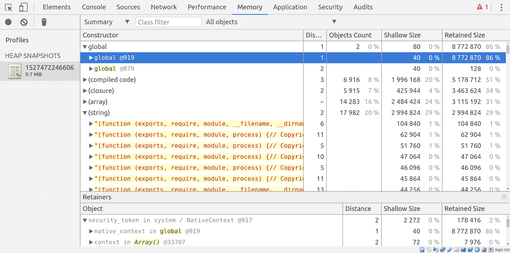
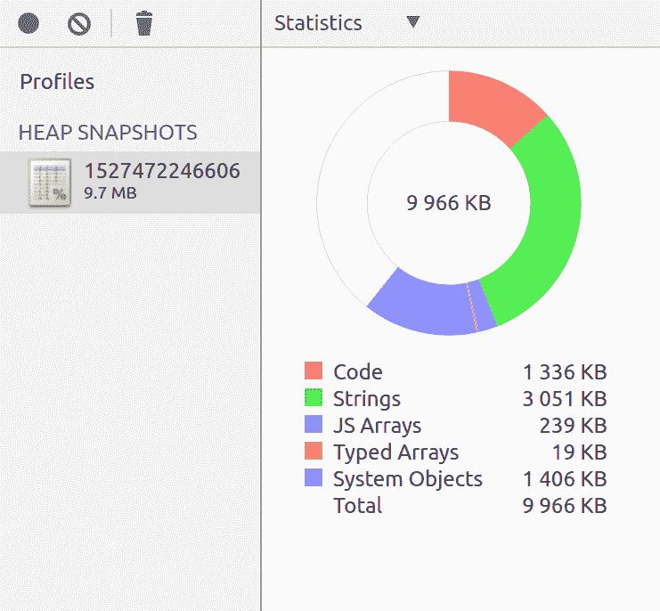
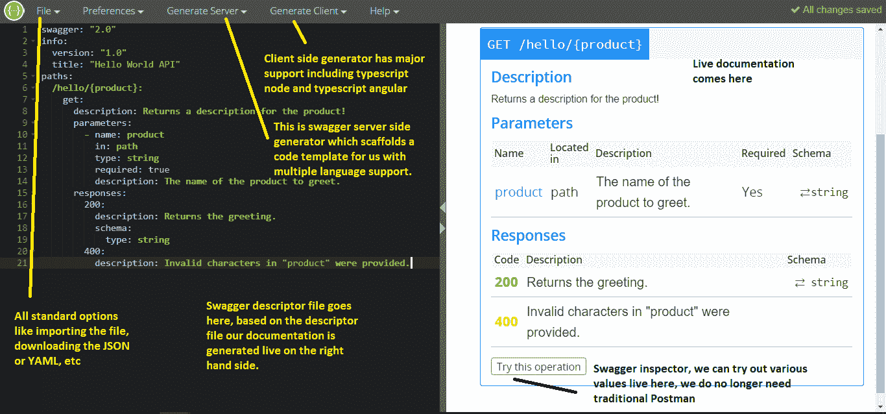

# 八、测试、调试和文档编写

到目前为止，我们已经编写了一些微服务的实现(T0】第四章，*开始你的微服务旅程*); 建立单点接触，API 网关([第五章](05.html)，*了解 API 网关*); 添加了注册表，每个服务可以记录其状态([第 6 章](06.html)，*服务注册和发现*); 建立微服务之间的协作([第七章](07.html)，*服务状态和服务间通信*); 并编写了一些实现。 从开发人员的角度来看，这些实现似乎很好，但是现在没有测试就不能接受任何东西。 这是行为驱动开发和测试驱动开发的时代。 随着我们编写越来越多的微服务，开发没有自动化测试用例和文档的系统变得难以管理和痛苦。 【t16.1】

本章将从理解测试金字塔开始，深入描述微服务中涉及的所有不同类型的测试。 我们将了解测试框架和基本的单元测试术语。 然后，我们将学习调试微服务的艺术，然后，最后，学习如何使用 Swagger 来记录我们的微服务。

本章涵盖以下主题:

*   编写好的自动化测试用例
*   理解测试金字塔并将其应用于微服务
*   从外部测试微服务
*   调试微服务的艺术
*   使用 Swagger 等工具记录微服务

# 测试

测试是任何软件开发的一个基本方面。 无论开发团队有多优秀，总有改进的空间，或者在他们的培训中遗漏了一些东西。 测试通常是一项耗时的活动，根本得不到所需的关注。 这导致了行为驱动开发的流行，在这种开发中，开发人员编写单元测试用例，然后编写代码，然后运行覆盖报告来了解测试用例的状态。

# 什么和如何测试

由于微服务是完全分布式的，人们脑海中浮现的主要问题是测试什么以及如何测试。 首先，让我们快速了解一下定义微服务并需要测试的主要特征:

*   **Independent deployment**: Whenever any
    *   小的或安全的更改已经部署到微服务中，该微服务已经准备好部署到生产环境中。 但是我们怎么知道改变是否安全呢? 这就是自动化测试用例和代码覆盖进入画面的地方。 有几个活动，如代码审查、代码分析和向后兼容性设计，可以发挥作用，但测试是在适应变化方面提供充分信心的活动。
    *   **可随意替换**:一组好的测试总是有助于理解新的实现是否等同于旧的实现。 任何新的实现都应该与具有正常工作流的等效实现进行测试。
    *   **小团队的所有权**:微服务很小，专注于单个团队，以满足单一的业务需求。 我们可以编写涵盖微服务所有方面的测试。

    测试过程必须是快速和可重复的，并且应该是自动化的。 接下来的问题是如何进行测试以及在测试时应该关注什么。 通常，所有测试都分为以下四个部分:

    *   **了解用户**:测试的主要模式是发现用户需要什么，他们有什么问题。
    *   **功能检查**:这种测试模式的目标是确保功能是正确的，并与规范相匹配。 它涉及诸如用户测试、自动化测试等活动。
    *   **防止不希望的更改**:此测试的目标是防止系统中不希望的更改。 每当部署一个新的变更时，就会运行几个自动化测试，生成一个代码覆盖率报告，并且可以决定一个代码覆盖率级别。
    *   **对运行时行为的保护**:这个测试的目标是检查系统有哪些操作问题。 在这里，我们通过进行压力测试、负载测试和监控来保护系统。

在下一节中，我们将讨论微服务中的测试金字塔。

# 测试金字塔——测试什么?

测试金字塔是一种工具，用于指导我们编写什么类型的测试以及在什么级别上编写测试。 在金字塔顶端的测试表明需要较少的测试，而在金字塔底部需要更多的测试。 它说明了我们应该追求的目标，如下图所示:


Testing pyramid

测试金字塔由四个层次组成，如下所述:

*   **系统测试(顶级)**:这些测试跨越整个分布式微服务系统，通常通过 GUI 实现。
*   **服务测试(中层):这些测试检查系统业务能力的完整执行。 它们检查某个特定的业务需求是否得到了满足。 他们并不关心在后台需要多少服务来满足需求。**
*   **契约测试(低级)**:这些测试在外部服务的边界上执行，以验证是否满足消费服务所期望的契约。
*   **单元测试(底层)**:这些测试在微服务中执行非常小的一块功能。 几个较低级的单元测试组合起来形成一个微服务。 单元测试只涉及微服务内部的一个小方面，或者我们可以说它们在宏观层面上操作。 例如，我们的产品目录服务有很多服务。 为它编写单元测试将涉及传递产品 ID 并确保获得正确的产品。

我们将在下面几节中更详细地研究所有这些级别。

# 系统测试

位于金字塔顶端的是系统测试或 E2E 测试。 他们有一个非常广泛的范围，或者我们可以说他们有一个 5 万英尺的范围，他们试图在很少的测试中涵盖很多东西。 它们不会下降到宏观水平。 当系统测试失败时，很难确定问题在哪里，因为它的范围很大。 测试覆盖整个分布式系统，因此问题可能出现在任何地方，在任何组件中。

购物车微服务中的一个系统测试示例是完整的结帐过程。 它使用添加到购物车系统的 web UI，在这里我们添加许多商品，生成发票，应用折扣代码，并使用测试信用卡支付。 如果测试通过，我们可以断言可以应用折扣代码并可以接收付款。 如果断言失败，则可能是任何原因导致了失败，例如项目的错误价格、可能添加了额外的费用，或者可能是支付服务失败。 为了解决这个问题，我们需要测试所有的微服务来找到确切的罪魁祸首。

覆盖了大量服务和更广泛的领域，系统测试通常会变得缓慢和不精确(因为我们不能确定正在失败的确切服务)。 发出真实的服务请求而不是模拟系统，将内容写入真实的数据存储，甚至对真实的事件 feed 进行轮询以监控系统。

想到的一个重要问题是关于需要运行的系统测试的数量。 系统测试，当成功时，给了很大的信心，但他们也缓慢和不精确; 我们只能为最重要的用例编写系统级测试。 这可以让我们覆盖系统中所有重要业务能力的成功路径。 对于完整的端到端加密测试，我们可以执行以下操作之一:

*   使用 JSON 请求测试我们的 API
*   使用 Selenium 测试 UI，它模拟对 DOM 的单击
*   使用行为驱动开发，其中用例被映射到应用中的操作中，然后在我们构建的应用中执行

我的建议是只编写面向重要业务能力系统测试的业务，因为这将练习大部分已完全部署的系统，并涉及到利用生态系统中的所有组件，如负载平衡器、API Gateway 等。

# 服务测试

这些测试位于测试金字塔的中层，它们专注于与单个微服务进行整体和独立的交互。 这个微服务与外部世界的协作被模拟 JSON 所取代。 服务级别测试测试场景，而不是发出单个请求。 他们将一系列的请求组合在一起形成一个完整的画面。 这些是真实的 HTTP 请求和响应，而不是模拟响应。

例如，一个积分程序的服务水平测试可以做以下工作:

1.  发送命令来触发积分类别中的用户(此处的命令遵循[第 1 章](01.html)，*揭穿微服务*中的 CQRS 模式)。 CQRS 遵循同步通信模式，因此，它的测试代码是相同的)。 我们发送一个命令来触发另一个服务来满足我们的服务测试条件。
2.  根据用户每月的消费决定最好的忠诚度。 这可以是硬编码的，因为它是不同的微服务。
3.  记录发送给用户的报价，并返回一个响应来检查服务的功能。

当所有这些方面都通过后，我们可以断言积分程序微服务工作成功，如果任何一个功能失败，我们可以确定问题出在积分程序微服务。

服务级测试比系统级测试更精确，因为它们只覆盖单个微服务。 如果这样的测试失败，我们可以肯定地断言问题在于微服务，假设 API Gateway 没有 bug，并且它提供了与模拟中编写的完全相同的响应。 另一方面，服务级别测试仍然很慢，因为它们需要与通过 HTTP 测试的微服务和真实的数据库进行交互。

我的建议是，应该针对最重要的可行失败场景编写这些测试，记住，编写服务级别测试是昂贵的，因为它们使用微服务中的所有端点，并涉及基于事件的订阅。

# 合同的测试

在分布式系统中，微服务之间有很多协作。 协作需要作为从一个微服务到另一个微服务的请求来实现。 端点中的任何更改都可能中断调用该特定端点的所有微服务。 这时就需要进行契约测试了。

当任何微服务进行通信时，向另一个微服务发出请求的一方都会对另一个微服务的行为有所期待。 协作是这样进行的:调用的微服务期望被调用的微服务实现某个固定的契约。 契约测试是用来检查被调用的微服务是否按照调用微服务的期望实现了契约的测试。

尽管契约测试是调用方微服务的代码基础的一部分，但它们也测试其他微服务中的内容。 当它们针对完整的系统运行时，将它们针对 QA 或登台环境运行并配置为在每个部署上自动运行契约测试是有益的。 当一个契约失败时，它意味着我们需要更新我们的测试加倍或者改变我们的代码来接受契约所做的新改变。 这些测试应该基于外部服务中的更改数量运行。 契约测试中的任何失败都不会像正常测试失败那样破坏构建。 这表明消费者需要跟上变化的步伐。 我们需要更新测试和代码，使一切同步。 它将引发一场对话，生产者服务将如何改变影响其他人。

我的结论是，契约测试与服务测试非常相似，但不同之处在于契约测试专注于满足与服务通信的先决条件。 契约测试不会建立模拟协作者，而是实际向被测试的微服务发出真实的 HTTP 请求。 因此，如果可能的话，它们应该针对每个微服务编写。

# 单元测试

这些是测试金字塔底部的测试。 这些测试也处理单个微服务，但与服务测试不同的是，它们不关注整个微服务，也不通过 HTTP 工作。 单元测试直接或通过内存调用与被测试的微服务的部件/单元交互。 单元测试中的测试看起来就像在发出真正的 HTTP 请求，只不过是在处理模拟和使用断言。 通常有两种类型的单元测试:一种涉及数据库调用，另一种涉及直接使用内存调用。 如果一个测试的范围是一个非常小的功能块，并且如果测试代码和微服务中的生产代码在同一个进程中运行，那么它可以被称为单元测试。

单元测试的范围非常窄，这使得它们在识别问题时非常精确。 这有助于有效地处理失败和错误。 有时候，通过直接实例化对象，然后测试它们，您可以有一个更小范围的微服务。

对于我们的信用程序，我们需要几个单元测试来测试端点和业务功能。 我们需要使用有效和无效数据测试用户设置。 我们需要测试来读取现有和非现有用户，以检查我们的忠诚度和每月的福利。

我的建议是，我们应该确定最窄的单元测试可以有多窄。 从测试应该覆盖的内容开始，然后逐渐添加更细的细节。 通常，我们可以使用两种类型的单元测试:经典(基于状态的行为测试)和模拟(由模拟实际行为支持的交互测试)。

在下图中，我们可以看到应用于微服务的各种测试:


Types of testing

现在我们已经了解了微服务级别所需的所有类型的测试，现在是时候看看我们的微服务测试框架了。 在下一节中，我们将研究不同类型测试的实际实现，并实现微服务的代码覆盖级别。 让我们开始吧。

# 实际测试

现在是时候着手研究微服务测试框架了。 在本节中，我们将了解测试的基础知识，然后继续编写一些单元测试、契约测试和服务级别测试。 编写测试有很大的优点。 我们被迫把代码分解成子功能，并根据单一责任的原则编写代码。 具有良好测试的全面测试覆盖率使我们理解应用是如何工作的。 在本节中，我们将使用一些著名的工具集:Mocha、Chai、Sinon 和 Ava。 Ava 将是我们的测试运行器，Chai 将是我们的断言库，Sinon 将是我们的 mocking 库。

# 我们的库和测试工具类型

测试工具可以被划分为不同的功能。 为了充分利用它们，我们总是将它们结合起来使用。 让我们看看基于其功能的最佳工具:

*   提供一个测试基地:摩卡，茉莉，笑话，黄瓜
*   给出断言函数:Chai, Jasmine, Jest, Unexpected
*   生成，显示和观察测试结果:Mocha, Jasmine, Jest, Karma
*   生成和比较组件和数据结构的快照:Jest, Ava
*   提供嘲弄，间谍，和 stub: Sinon, Jasmine，酶，笑话，测试双
*   生成代码覆盖率报告:Istanbul, Jest, Blanket
*   端到端测试:Casper, Nightwatch

在这一节中，我们将快速浏览 Ava、Chai、Mocha 和 Sinon，并了解它们为我们提供了什么。

Even though Mocha is a standard library, I have selected Ava because it is very fast compared to Mocha and it runs each test as a separate Node.js process, thereby saving CPU usage and memory.

# 这瓶

这是继 TDD/BDD 之后的一个基本断言库，可以与任何其他库一起使用，以获得高质量的测试。 断言我

如果有任何语句必须被执行，则抛出错误并停止测试。 这是一个非常强大的工具，用于编写易于理解的测试用例。

它提供了以下三个接口，使测试用例更具可读性和强大性:

*   `should`
*   `expect`
*   `assert`

除了这三种界面，我们还可以使用各种自然语言词汇。 完整的列表可以在[http://www.chaijs.com/api/bdd/](http://www.chaijs.com/api/bdd/)找到。

You must be wondering what the difference is between `should` and `expect`. Well, it is a natural question. Although `should` and `expect` do the same thing, the fundamental difference is that the `assert` and `expect` interfaces do not modify `Object.prototype`, while `should` does.

# 摩卡

Mocha 是最著名和最广泛使用的库之一，它遵循行为驱动的开发测试。 这里，测试描述了任何服务的用例，并使用来自另一个库的断言来验证执行代码的结果。 摩卡是一个测试运行器。 它被用于 t

o 通过`describe`及其操作人员组织和运行测试。 Mocha 提供了各种功能，例如:

*   `beforeEach()`:它在运行测试的测试文件中描述的每个规范之前被调用一次
*   `afterEach()`:在测试文件中描述的每个规范之后调用一次
*   `before ()`:在任何测试之前运行代码
*   `after()`:在所有测试运行之后运行代码

# Ava

艾娃和摩卡一样，是一个测试者。 Ava 利用了 Node.js 的并行和异步特性，并通过一个单独的进程并行处理测试文件。 根据统计，在`pageres`(一个捕捉屏幕截图的插件)中从 Mocha 切换到 Ava，测试时间从 31 秒降低到 11 秒([https://github.com/avajs/ava/blob/master/readme.md](https://github.com/avajs/ava/blob/master/readme.md))。 它有各种选项，比如快速失败、实时监控(当文件更改时，测试将以监控模式重新运行)、存储快照，等等。

Ava 是为未来而设计的，完全是用 ES6 编写的。 测试在此并发运行，可以选择与测试进行同步或异步。 默认情况下，测试被认为是同步的，除非它们返回一个承诺或一个可观察对象。 他们大量使用异步函数:

```js
import test from 'ava';
const fn = async () => Promise.resolve('typescript-microservices');
test(
  async (t) => {
    t.is(await fn(), 'typescript-microservices');
  });
```

它有广泛的选择，如:

*   报告(显示测试覆盖率的漂亮报告)
*   快速失败(在第一个失败的测试用例之后停止)
*   跳过测试
*   未来的测试

# 不然

通常，微服务需要调用其他微服务，但我们不想调用实际的微服务; 我们只想关注该方法是否被调用

与否。 为此，我们有了 Sinon，一个框架，它给了我们模拟和间谍的选择，通过提供模拟反应或创建间谍服务来实现我们的目的。 它提供了以下内容:

*   **存根**:存根是一个预先记录并有特定响应的虚拟对象。
*   **Spy**:Spy 是一种介于真实对象和模拟对象之间的混合体。 有些方法会受到间谍对象的影响。
*   **Mock**:Mock 是替代实际对象的虚拟对象。

# 伊斯坦布尔

这是一个覆盖跟踪语句、分支和功能覆盖的代码覆盖工具。 模块加载器在不需要配置的情况下动态地与仪器代码挂钩。 它提供多种报告格式，如 HTML、LCOV 等。 它也可以在命令行上使用。 它可以作为 Node.js 的服务器端代码覆盖工具，通过嵌入它作为自定义中间件。

# 使用 Pact.js 进行契约测试

每个微服务都有自己独立的实现; 假设我们的类别服务(产品目录服务)。 它有一个端点，用于获取类别列表、获取与这些类别关联的产品列表、添加任何新类别，等等。 现在我们的购物车微服务(消费者)利用这个服务，但是在任何时候，微服务(提供者)的类别都可能改变。

在任何时间点:

*   提供者可以将端点`/categories/list`更改为`/categories`
*   提供者可能会更改有效负载中的一些内容
*   提供者可能会添加新的强制参数，或者引入新的身份验证机制
*   提供者可能会删除使用者需要的端点

这些情况中的任何一个都可能导致潜在的灾难! 单元测试不会处理这些类型的测试，传统的方法是使用集成测试。 但是，我们可以看到集成测试的潜在缺点，例如以下几点:

*   集成测试很慢。 它们需要建立集成环境，在这种环境中，实现了提供者和使用者的依赖关系。
*   它们很脆弱，可能会因为其他原因而失败，比如基础设施。 失败的集成测试并不一定意味着代码有问题。 由于集成测试的范围很大，找到实际问题变得非常痛苦。

因此，我们需要进行合同测试。

# 什么是消费者驱动的契约测试?

契约测试意味着我们根据一组期望(我们定义为契约)来检查我们的 API，这些期望是要被实现的。 这意味着我们要检查，在接收到任何 API 请求调用时，API 服务器是否会返回我们在文档中指定的数据。 我们经常错过关于 API 客户需求的准确信息。 为了克服这个问题，使用者可以将他们的期望集定义为模拟，并在单元测试中使用它，从而创建他们希望我们完成的契约。 我们收集这些模拟，并检查当以设置模拟的相同方式调用它们时，提供程序是否返回相同或类似的数据，从而测试服务边界。 这种完整的方法称为消费者驱动的契约测试。

消费者驱动契约的思想只是将消费者和提供者之间的任何或所有交互形式化。 消费者创建一个契约，它仅仅是消费者和提供者之间关于他们之间将发生的交互量的一种协议，或者只是说明消费者期望从提供者那里得到什么。 一旦提供者同意该契约，使用者和提供者都可以获取该契约的副本，并使用测试来验证在系统的任何一端都没有发生违反契约的情况。 这些类型的测试的主要优点是它们可以独立地在本地运行，而且它们非常快，运行起来没有任何麻烦。 类似地，如果一个提供者有几个使用者，我们将需要验证几个契约:每个使用者一个契约。 这将帮助我们确保对提供者的更改不会破坏任何消费者服务。

Pact 是著名的开放源码框架之一，它支持消费者驱动的契约测试。 针对不同的平台，如 Ruby、JVM 和 NET，有不同的 Pact 实现。 我们将使用 JavaScript 版本的 Pact JS。 让我们开始吧。 让我们从 Pact 开始吧。

# 介绍 Pact.js

我们将使用 NPM 中可用的`pact`模块([https://www.npmjs.com/package/pact](https://www.npmjs.com/package/pact))。 整个过程是这样的，我们将 n

需要同时在使用者和提供者级别上进行操作。

我们将把实现分为两部分。 我们将设立一个提供商和一个客户端，以测试服务是否相互通信:

*   **在消费者方面**

1.  我们将创建一个模拟 web 服务器，它将充当服务提供者，而不是进行实际调用。 js 提供了这个开箱即用的功能。
2.  对于我们想要检查的任何请求，我们将定义模拟服务需要返回的预期响应，以检查是否有任何突然的更改。 在 Pact 语言中，我们称之为交互; 也就是说，对于给定的请求，使用者希望提供者返回什么?
3.  接下来，我们将创建单元测试，在单元测试中，我们将针对模拟提供程序运行服务客户机，以检查客户机是否返回这些预期值。
4.  最后，我们将创建一个包含作为契约的消费者期望的`pact`文件。

*   **提供商侧**:

1.  提供者端从使用者那里获得契约文件。
2.  它需要验证它没有违反预期的使用者交互。 `Pact.js`将读取`pact`文件，执行每次交互的请求，并确认服务是否返回消费者所期望的有效负载。
3.  通过检查提供者没有违反其消费者的任何契约，我们可以确保对提供者代码的最新更改不会破坏任何消费者代码。
4.  这样，我们可以避免集成测试，同时仍然对我们的系统有信心。

理解了这个过程之后，现在让我们实现它。 我们将遵循前面关于消费者和提供者的步骤，一次一个。 完整的示例可以在`chapter-8/pact-typescript`中找到。 我们的示例项目是类别微服务，我们将玩它。 让我们开始吧:

1.  我们首先创建一个提供者。 我们将创建一个返回一些动物的服务和一个特定的动物服务，该服务在传递一个 ID 时给我一个动物。
2.  通过从`packt-typescript/src/provider`中添加`provider.ts`、`providerService.ts`、`repository.ts`和`pact-typescript/data`中添加`data.json`来遵循来自提供者的代码。
3.  添加以下依赖项:

```js
npm install @pact-foundation/pact --save
```

4.  现在我们将创建一个消费者。 使用者使用来自提供者的文件。 我们将创建一个 Pact 服务器:

```js
const provider = new Pact({
  consumer: "ProfileService",
  provider: "AnimalService",
  port: 8989,
  log: path.resolve(process.cwd(), "logs", "pact.log"),
  dir: path.resolve(process.cwd(), "pacts"),
  logLevel: "INFO",
  spec: 2
});
```

5.  接下来我们定义我们的期望，我们会说:

```js
const EXPECTED_BODY = [{..//JSON response here ...//…..}]
```

6.  接下来，我们编写常规测试，但在添加测试之前，我们在 Pact 中添加以下交互:

```js
describe('and there is a valid listing', () => {
     before((done) => {
       // (2) Start the mock server
       provider.setup()
         // (3) add interactions to the Mock Server, 
                as many as required
         .then(() => {
           return provider.addInteraction({//define interactions here })
                          .then(() => done())
```

7.  接下来，我们编写通常的测试:

```js
// write your test(s)
     it('should give a list for all animals', () => {
  // validate the interactions you've registered 
     and expected occurrance
           // this will throw an error if it fails telling you 
              what went wrong
});
```

8.  关闭模拟服务器:

```js
after(() => {provider.finalize()})
```

9.  现在我们已经完成了提供者方面的工作，我们需要验证提供者。 启动`provider`服务，并在其测试文件中添加以下代码:

```js
const { Verifier } = require('pact');
let opts = { //pact verifier options};
new Verifier().verifyProvider(opts)
              .then(function () {
                 // verification complete.
});
```

# 奖金(集装箱合约经纪人)

在动态环境中，我们需要跨应用共享 pact，而不是在单个应用中工作。 为此，我们将利用 Pact 代理的功能。 您可以从[https://hub.docker.com/r/dius/pact-broker/](https://hub.docker.com/r/dius/pact-broker/)下载。 您可以使用`docker pull dius/pact-broker`通过 Docker 下载。 一旦启动，您就可以使用`curl -v http://localhost/9292 #`访问代理，您也可以在浏览器中访问它! 您可以使用数据库配置它，并运行一个合并的`docker-compose.yml`文件。 在[https://github.com/DiUS/pact_broker-docker/blob/master/docker-compose.yml](https://github.com/DiUS/pact_broker-docker/blob/master/docker-compose.yml)可以找到配置了 Postgres 的 pact-broker 的演示配置。 通过执行`docker-compose up`命令进行配置后，可以在端口 80 或端口 443 上访问`pact`代理，具体取决于是否启用 SSL。

# 重新访问测试关键点

在我们进入下一章节之前，让我们回顾一下关于测试的要点:

*   测试金字塔表示每一种测试所需的测试数量。 位于金字塔顶端的测试数量应该少于位于金字塔下方的测试数量。
*   由于它们的范围更广，系统级测试注定是缓慢和不精确的。
*   系统级测试应该只用于为重要的业务功能提供一些测试覆盖率。
*   服务级测试比系统级测试更快、更精确，因为它们必须处理较小的范围。
*   应该遵循为成功和重要失败场景编写服务级别测试的实践。
*   契约测试很重要，因为它们验证一个微服务对另一个微服务的 API 和行为所做的假设。
*   单元测试意味着快速，并且应该通过只包含单个单元或使用单个责任的原则来保持快速。
*   要获得更大的测试覆盖率，总是先编写服务测试，然后在编写服务测试变得难以管理时再编写单元测试。
*   我们用 Sinon、Ava、Chai 和 Istanbul 来测试我们的微服务。
*   要编写服务级别测试:
    *   编写被测试微服务的模拟端点
    *   编写与微服务交互的场景
    *   对来自微服务的响应和它向协作者发出的请求进行断言
*   通过使用 Pact，您可以编写契约级别的测试，从而避免集成测试。
*   契约测试非常有用，因为它们确保微服务遵守其前缀的契约，并且服务中的任何突然变化不会破坏任何业务功能。

*   **高级:**有时您可能需要在实时环境中尝试代码片段，要么再现问题，要么在现实环境中尝试代码。 网真([http://telepresence.io/](http://telepresence.io/))是一个允许你在 Kubernetes 中切换运行代码的工具。
*   **Advanced:**Ambassador([https://www.getambassador.io/](https://www.getambassador.io/))是一个 API 网关，允许微服务轻松注册其公共端点。 它有多种选项，比如关于流量的统计信息、监控信息等等。
*   **Advanced:**Hoverfly([https://hoverfly.io/](https://hoverfly.io/))是一种实现微服务虚拟化的方式。 我们可以通过它来模拟 api 中的延迟和故障。

在完成测试过程之后，现在是使用调试动态解决问题的时候了。 我们将学习调试和分析微服务。

# 调试

调试是任何系统开发中最重要的方面之一。 调试，或解决问题的艺术，在软件开发中是至关重要的，因为它帮助我们识别问题，分析系统，并确定导致系统瘫痪的罪魁祸首。 调试有一些经典的定义:

"Debugging is like solving a murder mystery in which you are the murderer. If debugging is the process of removing bugs, then software development is the process of putting these bugs in it" – Edsgar Dijkstra.

调试 TypeScript 微服务非常类似于调试任何 web 应用。 为了获得开源的免费替代品，我们将选择节点检查器，因为它也提供了非常有用的分析工具。

We already saw debugging through VS Code in [Chapter 2](02.html), *Gearing up for the Journey*.

在下一节中，我们将学习如何使用节点检查器来分析和调试我们的应用。 我们将了解远程调试的各个方面，以及如何在服务之间构建代理来调试微服务。 让我们开始吧。

# 在两者之间构建一个代理来调试我们的微服务

微服务是基于业务功能分布的。 对于终端用户来说，它们可能看起来是一个单一的功能，比如:购买产品，但在后台，涉及到许多微服务，比如支付服务、购物车服务、运输服务、库存服务等等。 现在，所有这些服务不应该驻留在单个服务器中。 它们根据设计和基础设施进行传播和分发。 如果两个服务器相互协作，如果这些服务没有被监控，那么在任何级别上都可能出现不良行为。 这是微服务中非常常见的问题，我们将使用`http-proxy`和隧道技术来解决这个问题。 我们将创建一个非常简单的示例，它将记录任何请求的原始头信息。 这些信息可以给我们提供有价值的信息，让我们了解网络中到底发生了什么。 这个概念与我们在 API 网关中使用的非常相似。 通常，API 网关是所有请求的代理; 它查询服务注册表来动态获取微服务的位置。 这个代理层，我们的网关，有很多优点，我们在[第 5 章](05.html)，*理解 API 网关*中看到了。 我们将使用节点模块`http-proxy`([https://www.npmjs.com/package/http-proxy](https://www.npmjs.com/package/http-proxy))并在那里记录请求头。 初始化一个 Node.js 项目，添加`src`、`dist`和`tsconfig.json`文件夹，并添加`http-proxy`模块及其类型。 然后，在 index 中输入以下代码。 创建代理服务器。 完整的代码可以在提取的源代码`Chapter 8/ts-http-proxy`中找到:

```js
export class ProxyServer {
  private proxy: any;
  constructor() {
    this.registerProxyServer();
    this.proxy = httpProxy.createProxyServer({});
    //we are passing zero server options, but we can pass lots of options such as buffer, target, agent, forward, ssl, etc. 
  }
  registerProxyServer(): void {
    http.createServer((req: IncomingMessage, res: ServerResponse) => {
      console.log("===req.rawHeaders====", req.rawHeaders);
      this.proxy.web(req, res, {
        target: 'http://127.0.0.1:3000/
            hello-world'})
        }).listen(4000)
    }}
  //after initializing make an object of this class
  new ProxyServer();
```

接下来，当您点击`localhost:4000`时，它将打印所有原始头，您可以检入源代码并查看服务的响应。

在下一节中，我们将看看 Chrome 调试扩展和分析工具。

# 分析过程

在分析服务的性能时，分析是一个关键的过程。 Node.js 的本地工具可以配置任何运行的 V8 进程。 这些只是快照和有效的总结，包括 V8 在编译时如何处理过程的统计数据，以及在 V8 引擎上优化热代码时所做的操作和决策。

We can have a v8 log generated in any process simply by passing the `--prof` flag. `prof` stands for a profile. An example is `node --prof index.js`. That won't be much of a readable format. To create a more readable format, run the `node --prof-process <v8.logfilename>.log >` command's profile.

在本节中，我们将看看如何使用配置文件日志分析，获取堆快照，并利用 Chrome 的 CPU 分析微服务。 让我们开始吧。 您可以使用`node --prof <file_name>.js`处理任何文件的日志。

# 倾销堆

堆是一个巨大的内存分配。 当我们讨论我们的例子时，它是分配给 V8 进程的内存(回想一下 Node.js 是如何工作的——事件循环和内存分配)。 通过检查内存使用情况，您可以跟踪诸如内存泄漏之类的事情，或者只是检查服务的哪个部分消耗最多，然后根据哪个部分相应地调整代码。 我们有一个非常好的`npm`模块([https://github.com/bnoordhuis/node-heapdump](https://github.com/bnoordhuis/node-heapdump))，它有一个 dump，可以用于以后的检查。 通过以下步骤，让我们熟悉读取转储过程以及何时进行转储:

1.  我们安装堆转储并创建一个准备使用的转储。 打开任何项目，并安装`heapdump`模块:

```js
npm install heapdump --save and npm install @types/heapdump --save-dev
```

2.  接下来，在希望创建快照的任何进程中复制以下代码行。 我把它们保存在`Application.ts`中，只是作为一个例子。 您可以遵循`chapter8/heapdump_demo`中的代码:

```js
import * as heapdump from 'heapdump';
import * as path from 'path';
heapdump.writeSnapshot(path.join(__dirname, `${Date.now()}.heapsnapshot`),
  (err, filename) => {
    if (err) {
      console.log("failed to create heap snapshot");
    } else {
      console.log("dump written to", filename);
    }
  }
);
```

3.  现在，当您运行程序时，您可以在我们运行前面几行代码的目录中找到快照。 您将发现类似 dump 的输出写到`/home/parth/chapter 8/heapdump_demo/../<timestamp>.heapsnapshot`。

4.  我们必须有像`<current_date_in_millis>.heapsnapshot`这样的东西。 它将是一个不可读的格式，但这是我们将利用 Chrome 的 DevTools。 打开 Chrome 的 DevTools，去内存|选择配置类型|加载选项。 打开快照文件，你会看到如下截图:



4.  点击统计，你会看到:



你可以通过以下链接获取关于分析的深入知识:

*   [https://developers.google.com/web/tools/chrome-devtools/memory-problems/memory-101](https://developers.google.com/web/tools/chrome-devtools/memory-problems/memory-101)[h](https://addyosmani.com/blog/taming-the-unicorn-easing-javascript-memory-profiling-in-devtools/)
*   [tps://addyosmani.com/blog/taming-the-unicorn-easing-javascript-memory-profiling-in-devtools/](https://addyosmani.com/blog/taming-the-unicorn-easing-javascript-memory-profiling-in-devtools/) 

我们可以在发生错误时定期进行转储，这对于在微服务中查找问题非常有帮助。 接下来，我们将了解如何进行 CPU 分析。

# CPU 性能分析

Chrome 开发工具有一些非常好的选项，不仅限于调试。 我们还可以利用内存分配、CPU 分析等等。 让我们深入挖掘 CPU 配置。 为了理解这个工具，我们将运行一个消耗大量 CPU 的程序:

1.  创建任何 express 应用，并创建一个随机路由，基本上迭代 100 次，并在内存中分配一个缓冲区 10<sup>8</sup>。 您可以遵循`chapter 8/cpu-profiling-demo`中的代码:

```js
private $alloc(){
  Buffer.alloc(1e8, 'Z');
}

router.get('/check-mem',
  (req, res, next) => {
    let check = 100;
    while (check--) {
      this.$alloc()
    }
    res.status(200).send('I am Done');
  }
)
```

2.  下一步是在 Chrome DevTools 中运行 Node.js 进程。 为此，只需在`node --inspect ./dist/bin/www.js`中添加`--inspect`标志。

The Chrome debugging protocol is included in the Node.js core module and we do not need to include it in every project.

3.  打开`chrome://inspect`，我们将能够看到其下面的过程。 单击 inspect，我们就可以像调试标准 web 应用一样调试 Node.js 应用了。
4.  点击 Profiler，我们将在这里调试 CPU 行为。 点击开始，打开任何选项卡，然后点击`localhost:3000/check-mem`。 回到我们的账单上。 点击停止，当你能够看到我完成了。 你应该能够看到像这样的图分析和分析细节:


Profiling

5.  现在，将鼠标悬停在单行上，你会看到一个像这样的详细视图:


Profiling detail

# 现场调试/远程调试

倒数第二个也是最重要的特性是实时调试问题。 随着 Node.js 中检查器协议的引入，这变得很容易，因为我们所要做的就是创建一个运行进程的`--inspect`版本。 这将打印调试打开的进程的 URL，类似于这样:

```js
Debugger listening on ws://127.0.0.1:9229/1309f374-d358-4d41-9878-8448b721ac5c
```

您可以安装 Chrome 扩展 node . js V8——督察经理(NiM),从 https://chrome.google.com/webstore/detail/nim-node-inspector-manage/gnhhdgbaldcilmgcpfddgdbkhjohddkj 对于调试远程应用或者你甚至可以生成一个进程进行调试并指定一个端口:

```js
node inspect --port=xxxx <file>.js
```

您可以在这里找到其他选项:[https://nodejs.org/en/docs/guides/debugging-getting-started/#command-line-options](https://nodejs.org/en/docs/guides/debugging-getting-started/#command-line-options)。 当使用`--inspect`交换机启动任何进程时，Node.js 通过套接字监听它，用于由主机和端口唯一标识的诊断命令。 每个进程被分配一个唯一的 UUID 用于跟踪。 Node-Inspector 还提供了一个 HTTP 端点来服务调试器的元数据，包括它的 WebSocket URL, UUID，和 Chrome DevTools URL。 我们可以通过点击`<host:port>/json/list`得到这个信息。

调试是伟大的，但我们应该确保它不会带来副作用。 调试意味着打开一个端口，这将涉及到安全问题。 以下几点应特别注意:

*   公开调试端口并不安全
*   在内部运行的本地应用可以完全访问应用检查器
*   应该保持同源策略

这就结束了我们的调试和分析会话。 在下一节中，在讨论文档之前，我们将回顾一些关键点。

# 调试要点

在本节中，我们看到了分析中涉及的调试和核心方面。 我们学习了如何诊断泄漏或观察堆转储内存以分析服务请求。 我们看到了代理通常是如何帮助的，即使它增加了网络跳数:

*   为了避免重载，我们有一个模块提供了代码`503`中间件。 实现细节见[https://github.com/davidmarkclements/overload-protection](https://github.com/davidmarkclements/overload-protection)。
*   Chrome Inspector 是调试 Node.js 微服务的一个非常有用的工具，因为它不仅提供了一个调试接口，而且还提供了堆快照和 CPU 分析。
*   VS Code 也是一个非常友好的工具。
*   Node.js 包含了 node-inspector 并将其包含在核心模块中，因此使得远程调试非常容易。

现在我们已经了解了调试的基本方面，接下来让我们进入使开发人员的工作变得简单的最后一部分。 是的，您猜对了:适当的文档，这不仅为技术团队节省了时间，也为非技术人员节省了时间。

# 记录

**documentation**是后端和前端之间的契约，负责双方之间的依赖管理。 如果 API 发生变化，文档需要快速适应它。 开发过程中最容易出现的失败之一就是缺乏对他人工作的可见性或意识。 通常，传统的方法是编写服务规范文档或使用一些维护不同事物的静态服务注册中心。 无论我们如何努力，文档总是会过时。

# 需要的文档

开发文档和对系统的组织理解提高了开发人员的技能和速度，同时处理微服务采用所带来的两个最常见的挑战——技术和组织变化。 全面、更新的文件的重要性不可低估。 每当我们问别人做新事情时遇到的问题，答案都是一样的。 我们都面临着同样的问题:我们不知道它是如何工作的，它是一个新的黑盒，所给出的文档毫无价值。
依赖关系或内部工具的糟糕文档使开发人员的生活变得一团糟，并降低了他们的能力和服务的生产准备。 这浪费了无数的时间，因为剩下的唯一办法就是重新设计系统，直到我们得到解决方案。 爱迪生确实说过，*我找到了 2000 种不制造灯泡的方法，*但我更愿意花时间在这 2000 种方法上，以获得更多。 糟糕的服务文档还会损害为其服务的开发人员的生产力。

生产准备文档的目标是制作和组织一个关于服务的集中知识库。 共享此信息有两个方面:服务的基本部分以及服务在何处实现了哪一部分功能。 解决这两个问题需要标准化文档方法来共享对微服务的理解。 我们可以总结以下文档要点:

*   任何服务都应该有全面和详细的文档(应该包括服务是什么以及它对什么有贡献)
*   文档应定期更新(所有新方法和维护版本)
*   它应该被所有人理解，而不仅仅是技术团队
*   每隔一段固定的时间对其架构进行审查和审计

在使用微服务时，当我们将每个业务功能划分为不同的服务时，痛苦会成倍增加。 我们需要一种更通用的方法来记录微服务。 Swagger 目前是文档方面的先驱。

与 Swagger，你将得到以下:

*   不再有不一致的 API 描述。 这些将更新完整的合同细节和参数信息。
*   您不需要编写更多的文档; 它将自动生成。
*   当然，也不会再有关于糟糕文档的争论了。

本节将探索如何使用 Swagger，理解其核心工具、优点和工作实现。 让我们开始吧。

# 101 年昂首阔步

Swagger 是微服务(实际上是任何 RESTful API)的强大代表。 成千上万的开发人员支持几乎每种编程语言和环境中的 Swagger。 在支持 swagger 的环境中，我们可以获得交互式文档、客户机 SDK 生成、可发现性和测试。

Swagger 是开放 API 倡议(Open API Initiative，一个标准化如何描述 REST API 的委员会)的成员。 它提供了一组工具来描述和记录 RESTful API。 Swagger 最初是一个 API 文档工具，现在也可以通过**Swagger Codegen**([https://github.com/wcandillon/swagger-js-codegen](https://github.com/wcandillon/swagger-js-codegen))生成样板代码。 Swagger 拥有一个庞大的工具生态系统，但我们主要将使用以下工具集。 我们将了解如何将 Swagger 与现有的应用集成，或者编写特定于 Swagger 标准的 API，通过这些 API，我们的文档将自动生成。 从下图可以了解整个过程:


Swagger_workflow

现在让我们来看看过程中涉及到的整体工具，以彻底理解过程中涉及到的所有方面。

# Swagger 编辑器和描述器

Swagger Descriptor 借鉴了设计驱动开发。 在这里，我们通过在 YML/YAML 文件或 JSON 文件中描述端点的行为来设计端点的行为。 (当然，作为一名开发人员，我懒得写这个文件，我希望它是自动生成的，我们将在后面的章节中讨论。) 这是最重要的部分，因为它是关于服务的上下文信息。

查看`Chapter 8/hello_world_swagger.yaml`以了解描述符文件。

# Swagger 和 Descriptor 的关键点

*   您的 URL 路由、参数和描述定义在`.yaml`文件中。
*   无论参数是否必需，您都可以使用必需的 true 来传递，这将在测试时验证该参数
*   它还可以返回响应码及其描述
*   Swagger 读取这个`.yaml`文件来生成它的 Swagger UI，并使用 Swagger 检查器测试服务

# 的编辑器

Swagger Editor 是一个在线工具，帮助 y

ou 可以根据 Swagger API 规范实时预览文档，在浏览器中编辑 Swagger API 规范。 通过这种方式，我们可以看到在动态地应用最近的更改后文档将是什么样子。 该编辑器有一个干净的界面，易于使用，具有许多功能来设计和记录各种微服务。 可以在[https://editor2.swagger.io/#! /](https://editor2.swagger.io/#!/)。 通过编写或导入一个`swagger.yaml`文件，我们可以实时查看 Swagger UI。

让我们的手与 Swagger 编辑器和 Swagger 描述符:

1.  打开[https://editor2.swagger.io](https://editor2.swagger.io)并输入前面的描述符(`hello_world_swagger.yaml`)。
2.  您将能够在右侧看到实时文档:



Swagger Editor

3.  尝试在描述符文件中插入更多代码，并查看交互式文档。 另外，尝试运行尝试这个操作。 它将给出 HTTP 请求的描述以及所有的报头和响应。

# 大摇大摆的 Codegen

Swagger Codegen 是一个脚手架引擎，它为我们提供了从 Swagger 定义生成交互式文档、API 客户端和服务器存根的选项。 我们在 Swagger 编辑器中看到的前面的选项(生成服务器和客户端)类似于 Swagger Codegen 的实现。 它支持很多语言。

客户端搭建工具，包括对 TypeScript Angular、TypeScript Node、JavaScript、Python、HTML、Java 和 c#等语言的支持。 服务器端搭建工具支持 Haskell、Node.js、Go 语言和 Spring 等语言。

**Swagger CodeGen**([https://swagger.io/swagger-codegen/](https://swagger.io/swagger-codegen/))通过遵循 openapi 定义的规范，帮助我们更快地构建 api 并提高质量。 它生成服务器存根和客户端 sdk，所以我们可以专注于 API 实现和业务逻辑，而不是代码创建和采用标准:

*   Swagger CodeGen 的优点 ***   它生成服务器代码、客户机代码和文档
    *   它允许更快地更改 API
    *   生成的代码是开源的** 
***   Swagger CodeGen 的缺点
    *   由于添加了额外的工具和库，以及管理这些工具和库的复杂性增加了项目的复杂性
    *   它会生成大量用户可能无法消化的代码**

 **您可以检查`Chapter 8/typescript-node-client/api.ts`以查看基于初始 Swagger 描述符定义自动生成的代码。

# Swagger UI

Swagger UI 允许我们可视化 RESTful API。 可视化是根据 Swagger 规范自动生成的。 Swagger UI 接受一个 Swagger 描述符文件，并在 UI 中使用 Swagger 检查器创建文档。 Swagger UI 就是我们在右边的屏幕截图中看到的。 此外，还可以基于特权授予访问权限。 Swagger UI 是 HTML、JavaScript 和 css 资产的集合，这些资产可以通过与 Swagger 兼容的 API 动态生成漂亮的文档。 我们将为我们的产品目录微服务生成文档，并在其中使用 Swagger UI 组件。

# 时髦的检查员

这是一种基于 OpenAPI 规范生成文档的轻松方法。 检查了 SWAGGER 检查器的工作情况后，就可以创建文档并与外界共享。 通过从历史中选择先前测试过的端点，然后发出 CREATE API DEFINITION 命令，我们可以轻松地自动生成文档。 它很像网络上的邮差。 您可以下载 Swagger inspector 作为一个 Chrome 扩展。 它有这些选项:


Swagger inspector

现在我们已经熟悉了 Swagger，让我们看看如何在我们的微服务中使用 Swagger 来为我们生成漂亮的文档。 下一节将讨论集成 swagger 的可能方法。

# 利用斯威格的可能策略

Swagger 主要用于记录服务和测试服务。 实现 Swagger 有两种基本方法。 它们如下:

*   **自上而下或设计优先的方法:**在这里，Swagger Editor 用于创建 Swagger 定义，然后 Swagger code -gen 用于为客户端和服务器生成代码。 在编写任何代码之前，Swagger 将用于设计 API 和源代码。
*   **自底向上的方法:**在这里，对于任何现有的 api，都使用 Swagger 来生成文档。

我们将研究这两种方法以及可用的最佳实践。

# 自顶向下或设计优先的方法

通常，通过添加几行代码来生成有效的 Swagger 文件和文档似乎是个好主意。 我们已经写了所有的代码，然后我们记得:*哦，我的天哪，我将如何向其他人解释这个? 我是否需要为每个 API 编写文档?* 在这种情况下，简单地通过添加注释来动态地生成文档似乎就像梦想成真一样。 TSOA([https://www.npmjs.com/package/tsoa](https://www.npmjs.com/package/tsoa))就是基于这一原理而设计的。 基于 TSOA README 文件，它从一个写好的控制器和模型生成一个有效的 Swagger 规范，包括以下内容。 这本质上是一种自下而上的方法，我们已经有了一个现有的 REST API，我们利用 Swagger 来记录现有的 API。

TSOA 从控制器和模型生成一个有效的 Swagger`spec`文件，包括:

*   到各个 REST url 的路径(例如:`Get users :- server_host/users/get_users`)
*   基于 TypeScript 接口的定义(这些是模型文件或属性描述符)
*   参数类型; 也就是说，模型属性根据 TypeScript 语法被标记为必需的或可选的(例如，在 Swagger 规范中`productDescription?: string`被标记为可选的)
*   jsDoc 对对象描述的支持(大多数其他元数据可以从 TypeScript 类型推断出来)

就像路由控制器一样，路由是为我们选择的任何中间件生成的。 选项包括 Express, Hapi 和 Koa。 与路由控制器类似，TSOA 有一个内置的类验证器。 TSOA 尽可能地减少样板代码，并提供大量注释。 您可以查看`npm`中的文档，以详细了解各种可用选项。 我们将主要关注`@Route`注释，它将为我们生成 Swagger doc。 在本例中，我们将使用 TSOA 并生成文档。

Please see extracted source for top-down approach, the example is pretty straight forward strictly adhering to the documentation.

# 自底向上的方法

哇! 在经历了自上而下的方法之后，这似乎是一个完美的计划。 但是，当我们已经开发了项目，现在想要生成文档时，情况又会如何呢? 我们陷入了一个困境。 我们该怎么办? 幸运的是，我们有了解。 我们将利用`swagger-ui-express`([https://www.npmjs.com/package/swagger-ui-express](https://www.npmjs.com/package/swagger-ui-express))来生成文档。 它每周的下载量超过 4.5 万次。 它是一个社区驱动的包，支持为您的快速应用提供中间件，该中间件基于 Swagger 文档文件为 Swagger UI 提供服务。 我们需要添加一个路由，它将宿主 Swagger UI。 文档很好，我们需要的一切都在那里。 让我们开始吧。 您可以在`Chapter 8/bottom-up-swagger`文件夹中查看源代码。

1.  作为依赖项从`npm`安装模块:

```js
npm install swagger-ui-express --save
```

2.  接下来，我们需要添加一个路由，它将托管 Swagger UI。 我们需要生成 Swagger 定义，并在每个部署中更新它。
3.  我们有两个选项来生成 Swagger 文档。 要么在每个路由处理程序中添加注释，要么使用 Swagger 检查器测试所有 REST api，将它们合并，然后生成一个定义文件。
4.  无论我们采用什么方法，我们的目标都是一样的:生成`swagger.json`文件。 使用第一种方法，我们将使用`swagger-jsdoc`([https://www.npmjs.com/package/swagger-jsdoc](https://www.npmjs.com/package/swagger-jsdoc))。 下载模块作为依赖项:

```js
npm install swagger-jsdoc --save
```

5.  让我们开始配置。 首先，我们需要在 Express 启动时初始化 Swagger JS Doc。 创建一个类`SwaggerSpec`，并在其中添加以下代码:

```js
export class SwaggerSpec {
  private static swaggerJSON: any;
  constructor() { }
  static setUpSwaggerJSDoc() {
    let swaggerDefinition = {
      info: {
        title: 'Bottom up approach Product Catalog',
        version: '1.0.0',
        description: 'Demonstrating TypeScript microservice bottom up approach'
      },
      host: 'localhost:8081',
      basePath: '/'
    };
    let options = {
      swaggerDefinition: swaggerDefinition,
      apis: ['./../service-layer/controllers/*.js']
    }
    this.swaggerJSON = swaggerJSDoc(options);
  }

  static getSwaggerJSON() {
    return this.swaggerJSON;
  }
}
```

这里，我们初始化了 JSDoc，并将`swagger.json`存储在私有静态变量`swaggerJSON:any`中，以便在需要提供 JSON 时使用它。 我们保持`JSDoc`对象内部的正常配置。

6.  接下来，在快速启动时，我们需要初始化`setUpSwaggerJSDoc`方法，以便在服务器启动时填充 JSON。
7.  创建一个新的`Controller`，将`swagger.json`作为 HTTP 端点。

```js
@JsonController('/swagger')
export class SwaggerController {
  constructor() { }
  @Get('/swagger.json')
  async swaggerDoc( @Req() req, @Res() res) {
    return SwaggerSpec.getSwaggerJSON();
  }
}
```

8.  点击`http://localhost:8081/swagger/swagger.json`查看初始 Swagger JSON。
9.  现在，我们需要向每个路由添加 jsdoc 风格的注释，以生成 Swagger 规范，并在 YAML 中向路由处理程序添加注释。 像这样添加适当的注释将填充我们的`swagger.json`:

```js
/**
* @swagger
* definitions:
* Product:
* properties:
* name:
* type:string
* /products/products-listing:
* get:
* tags:
* - Products
* description: Gets all the products
* produces:
* - application/json
* responses:
* 200:
* description: An array of products
* schema:
* $ref: '#/definitions/Product'
*/
getProductsList() {
 //
}
```

10.  另一种选择是使用 Swagger 检查器生成文档。 现在我们已经完成了 Swagger 生成，接下来需要生成 Swagger UI。 添加这些在`Express.ts`这:

```js
app.use('/api-docs', swaggerUi.serve, swaggerUi.setup(swaggerDocument));
app.use('/api/v1', router);
```

Swagger 是一个伟大的文档工具，它满足了我们的所有目的。 无论我们是从一开始使用它还是在开发之后使用它，它都很适合满足我们的文档需求。 `./api/v1`文件将为您提供生成的 Swagger 文档。

# 从 Swagger 定义生成项目

直到现在，我们都是从源代码生成 swagger 定义的。 反过来也成立。 我们可以通过 Swagger 定义和语言类型轻松地生成一个项目(我们在[第 7 章](07.html)、*服务状态和服务间通信*中看到了类似的内容。 听起来耳熟吗? 这是正确的。 rPC 和代码生成)。 让我们下载 swagger-code-generate 并创建我们的项目:

1.  在提取的 src`chapter 8/swagger-code-gen`中查看更新的`hello_world_swagger.yml`。 它还增加了一个 API 的路由/端点来更新产品信息。
2.  下一步是从[https://github.com/swagger-api/swagger-codegen](https://github.com/swagger-api/swagger-codegen)下载 Swagger -code-gen，这样我们甚至可以在自动化配置或根据需要使用它，而不是每次都去在线 Swagger 编辑器。 您还可以在本书摘录的源代码中找到 swagger-code-gen。

3.  因为它是一个运行在 JVM 上的项目，所以我们构建项目以便运行它。 点击命令`mvn package`来构建 JAR。
4.  接下来，我们将生成源代码:

```js
java -jar modules/swagger-codegen-cli/target/swagger-codegen-cli.jar generate -i  ..\hello_world_swagger.yaml -l typescript-node -o ../typescript-nodejs
```

5.  您可以在`chapter-8/swagger-code-gen`内部探索`typescript-nodejs`以理解生成的结构，并对其进行操作。 类似地，您可以使用任何其他语言。 更多的文档可以在这里找到[https://github.com/swagger-api/swagger-codegen/blob/master/README.md](https://github.com/swagger-api/swagger-codegen/blob/master/README.md)。

Swagger 是一个很好的按需生成文档的工具。 生成的文档甚至对产品经理或合作伙伴来说都是可理解的，易读且易于调整。 它不仅使我们的生活变得简单，而且使 API 更易于使用和管理，因为它遵循 OpenAPI 规范。 Swagger 被 Netflix、Yelp、Twitter 和 GitHub 等领先公司广泛使用。 在本节中，我们看到了它的各种用途、循环和各种方法。

# 总结

在本章中，我们讨论了测试、调试和文档编制。 我们讨论了测试的一些基本方面。 我们研究了测试金字塔以及如何进行单元测试、集成测试和 E2E 测试。 我们使用 Pact 研究了契约测试。 然后，我们了解了调试和分析过程，这对解决关键问题非常有帮助。 我们了解了在发生关键故障时如何执行调试。 最后，我们介绍了文档工具 Swagger，它有助于保持中心文档，我们还研究了将 Swagger 引入我们的微服务的策略。

在下一章中，我们将讨论部署。 我们将看到如何部署我们的微服务，了解 Docker，并学习 Docker 的基础知识。 然后我们将看到一些监控工具和日志记录选项。 我们将为日志集成 ELK 栈。**