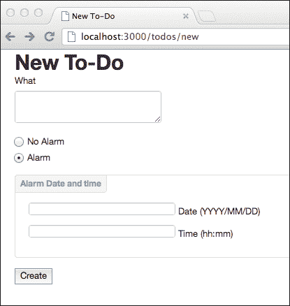
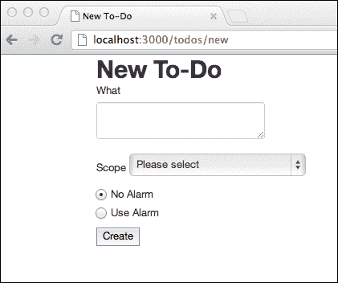

# 第六章。测试交互

到目前为止，我们已经测试了表单上文本字段的填充，但是还有其他更复杂的输入字段可以指示僵尸浏览器进行填充。

例如，您可能想要选择一个单选按钮元素，或者从下拉列表框中选择一个项目，或者您可能想要从日期输入字段中选择一个特定的日期。

当与表单域和其他元素交互时，您的应用程序可能会操纵文档，例如显示或隐藏一些元素。到本章结束时，您将知道如何使用僵尸. js 来验证使用 JavaScript 操作文档的效果。

本章涵盖的主题有:

*   如何触发其他表单对象中的更改
*   如何测试 DOM 操作

# 按下单选按钮

为了测试单选按钮的使用，我们需要在应用程序的表单中添加一些。我们将在待办事项创建表单中引入一个单选按钮，以指示是否应该安排警报。根据选定的值，将出现一个字段，允许我们设置待办事项的提醒日期和时间。

1.  首先，我们需要将`templates/todos/new.html`中的待办事项创建模板更改为:

    ```js
    <h1>New To-Do</h1>
    <form id="new-todo-form" action="/todos" method="POST">

      <p>
        <label for="what">What</label>
        <textarea name="what" id="what" required></textarea>
      </p>

      <p>

        <label class="radio" for="alarm-false">
          <input type="radio" name="alarm" value="false" id="alarm-false" checked="checked" /> No Alarm
        </label>

        <label class="radio" for="alarm-true">
          <input type="radio" name="alarm" value="true" id="alarm-true" /> Use Alarm
        </label>

      </p>

      <div id="alarm-date-time" style="display:none">
        <label class="date" for="alarm-date">
          <input type="text" name="alarm-date" id="alarm-date" /> Date (YYYY/MM/DD)
        </label>
        <label class="time" for="alarm-time">
          <input type="text" name="alarm-time" id="alarm-time" /> Time (hh:mm)
        </label>
      </div>

      <input type="submit" value="Create" />
    </form>
    ```

2.  This will present users with a couple of new radio buttons in the to-do item creation form:

    

3.  现在我们也需要介绍一些款式。在`public/css/todo.css` :

    ```js
    #alarm-date-time {
      position: relative;
      margin: 15px 0;
      padding: 39px 19px 14px;
      border: 1px solid #DDD;
      -webkit-border-radius: 4px;
      -moz-border-radius: 4px;
      border-radius: 4px;
      width: auto;
    }

    #alarm-date-time::after {
      content: "Alarm Date and time";
      position: absolute;
      top: -1px;
      left: -1px;
      padding: 3px 7px;
      font-size: 12px;
      font-weight: bold;
      background-color: whiteSmoke;
      border: 1px solid #DDD;
      color: #9DA0A4;
      -webkit-border-radius: 4px 0 4px 0;
      -moz-border-radius: 4px 0 4px 0;
      border-radius: 4px 0 4px 0;
    }
    ```

    下创建自定义样式表
4.  我们需要在`templates/layout.html` :

    ```js
    <html>
      <head>
        <meta http-equiv="Content-Type" content="text/html; charset=utf-8" />
        <title id="title"></title>
        <link href="/css/bootstrap.min.css" rel="stylesheet" >
     <link href="/css/todo.css" rel="stylesheet" >
      </head>
      <body>

        <section role="main" class="container">

          <div id="messages"></div>

          <div id="main-body"></div>

        </section>

        <script src="/js/jquery.min.js"></script> 
        <script src="/js/jquery-ui-1.8.23.custom.min.js"></script> 
        <script src="/js/bootstrap.min.js"></script>
        <script src="/js/todos.js"></script>
      </body>
    </html>
    ```

    中引用我们布局文件中之前的 CSS 文件
5.  Next we need to make the date and time form fields appear when the user selects the **Alarm** radio button. For that we need to introduce an event listener in the `public/js/todos.js` file:

    ```js
    $(function() {
      $('#todo-list').sortable({
        update: function() {
          var order = [];
          $('.todo').each(function(idx, row) {
            order.push($(row).find('.pos').text());
          });

          $.post('/todos/sort', {order: order.join(',')}, function() {
            $('.todo').each(function(idx, row) {
              $(row).find('.pos').text(idx + 1);
            });
          });

        }
      });

     function hideOrShowDateTime() {
     var ringAlarm = $('input[name=alarm]:checked',
     '#new-todo-form').val() === 'true';

     if (ringAlarm) {
     $('#alarm-date-time').slideDown();
     } else {
     $('#alarm-date-time').slideUp();
     }
     }

     $('#new-todo-form input[name=alarm]').change(hideOrShowDateTime);
     hideOrShowDateTime();

    });
    ```

    这个新事件监听器将监听单选按钮的变化，然后相应地隐藏或显示报警日期和时间字段，当`Alarm`设置打开时，会出现以下屏幕:

    

6.  我们还需要更改表单帖子的路由监听器，以适应这些新字段:

    ```js
    this.post('/', [loggedIn, function() {

      var req  = this.req,
          res  = this.res,
          todo = this.req.body
      ;

      if (! todo.what) {
        res.writeHead(200, {'Content-Type': 'text/html'});
        return res.end(layout(templates['new'], 'New To-Do',
          {error: 'Please fill in the To-Do description'}));
      }

     todo.alarm = todo.alarm === 'true';
     todo.alarm_date = Date.parse(todo['alarm-date'] + ' ' + todo['alarm-time']);
     delete todo['alarm-date'];
     delete todo['alarm-time'];

      todo.created_at = Date.now();

      insert(req.session.user.email, todo, function(err) {

        if (err) {
          res.writeHead(500);
          return res.end(err.stack);
        }

        res.writeHead(303, {Location: '/todos'});
        res.end();
      });

    }]);
    ```

这段新的代码处理表单字段中提交的报警日期和报警时间，并将它们解析为时间戳。包含在`todo`变量中的待办事项然后被转换成如下所示的文档:

```js
{ what: 'Deliver books to library',
  alarm: true,
  alarm_date: 1351608900000,
  created_at: 1350915191244 }
```

# 测试用户交互

为了测试这些新表单字段及其组合行为，我们将使用`test/todos.js`中的测试文件，并扩大`Todo creation form`的范围:

1.  First we test that these radio buttons do exist and that the alarms are turned off by default:

    ```js
    it('should not present the alarm date form fields when no alarm is selected',
      login(function(browser, done) {
         browser.visit('http://localhost:3000/todos/new', function(err) {
           if (err) throw err;

           browser.choose('No Alarm', function(err) {
             if (err) throw err;

             assert.equal(browser.query('#alarm-date-time').style.display, 'none');
             done();
           });
         });
      })
    );
    ```

    这里我们验证我们实际上有两个单选按钮用于`alarm`字段，一个有`false`另一个有`true`字符串值。然后我们还要验证第一个是否被选中。

2.  We also need to verify that the animation of the new date and time form fields works; the `div` element that wraps the alarm date and time input fields should be hidden when the user chooses not to use the alarm. When the user selects the `Use alarm` radio button, the `div` element should then be made visible:

    ```js
    it('should present the alarm date form fields when alarm', 
      login(function(browser, done) {
        browser.visit('http://localhost:3000/todos/new', function(err) {
          if (err) throw err;

          var container = browser.query('#alarm-date-time');

          browser.choose('No Alarm', function(err) {
            if (err) throw err;

            assert.equal(container.style.display, 'none');

            browser.choose('Use Alarm', function(err) {
              if (err) throw err;

              assert.equal(container.style.display, '');

              browser.choose('No Alarm', function(err) {
                if (err) throw err;

                assert.equal(container.style.display, 'none');

                done();
              });
            });
          });
        });
      })
    );
    ```

    在这里，我们将打开和关闭使用警报设置，并验证容器的样式`div`是否相应改变。在僵尸中，所有的用户交互功能(如`browser.choose()`、`browser.fill()`等)都允许你传入一个回调函数作为最后一个参数。一旦浏览器事件循环空闲，就会调用这个函数，这意味着你的函数只会在任何动画之后被调用。这非常有用，因为您的测试代码不必显式地等待动画完成。一旦你的回调函数被调用，你可以确信 DOM 是被操纵的。

    ### 注

    使用这种技术，您还可以测试任何用户交互。通过提供一个回调函数，当所有操作完成时，僵尸会调用该函数，您可以测试这些操作对文档的影响。

    在我们的例子中，我们测试了我们成功地改变了一个`div`元素的样式属性，但是你也可以使用这个技术测试其他的交互。例如，正如我们将在下一章中看到的，我们可以测试内容是否根据一些用户操作而改变。

# 选择数值

如果表单中有选择框，也可以指示僵尸为你选择一个列表项。让我们更改待办事项创建表单，以包括一个额外的选择框，该框描述了项目的范围，无论该项目与工作、家庭有关，还是属于个人任务。

首先，我们需要在`templates/todos/new.html`的待办事项创建表单中，在`What`文本区域字段之后引入这个附加字段:

```js
  <label for="scope">
    Scope
    <select name="scope" id="scope">
      <option value="" selected="selected">Please select</option>
      <option value="work">Work</option>
      <option value="personal">Personal</option>
      <option value="family">Family</option>
    </select>
  </label>
```

这将呈现包含附加**范围**标签和选择框的以下表格:



现在我们需要进行测试，验证该表单包含`select`元素和`option`项。为此，让我们在`Todo creation form`描述范围内继续扩展`test/todos.js`中的文件:

```js
it('should present the scope select box',
  login(function(browser, done) {
    browser.visit('http://localhost:3000/todos/new', function(err) {
      if (err) throw err;

      var select = browser.queryAll('form select[name=scope]');
      assert.equal(select.length, 1);

      var options = browser.queryAll('form select[name=scope] option');
      assert.equal(options.length, 4);

      options = options.map(function(option) {
        return [option.value, option.textContent];
      });

      var expectedOptions = [
        [null, 'Please select'],
        ['work', 'Work'],
        ['personal', 'Personal'],
        ['family', 'Family']
      ];

      assert.deepEqual(options, expectedOptions);

      done();

    });
  })
);
```

这里我们测试`select`元素存在，它有四个`option`项，项，每个项都有期望值和文本。

现在，我们需要更改待办事项列表来显示这个新的范围字段。为此，我们需要在`templates/todos/index.html`文件中介绍:

```js
<h1>Your To-Dos</h1>

<a class="btn" href="/todos/new">New To-Do</a>

<table class="table">
  <thead>
    <tr>
      <th>#</th>
      <th>What</th>
 <th>Scope</th>
      <th></th>
    </tr>
  </thead>
  <tbody id="todo-list">
    <tr class="todo">
      <td class="pos"></td>
      <td class="what"></td>
 <td class="scope"></td>
      <td class="remove">
        <form action="/todos/delete" method="POST">
          <input type="hidden" name="pos" value="" />
          <input type="submit" name="Delete" value="Delete" />
        </form>
      </td>
    </tr>
  </tbody>
</table>
```

当在`routes/todos.js`文件中呈现待办事项列表时，我们还需要在`GET /`路由监听器中填充值:

```js
this.get('/', [loggedIn, function() {

  var res = this.res;

  db.get(this.req.session.user.email, function(err, todos) {

    if (err && err.status_code !== 404) {
      res.writeHead(500);
      return res.end(err.stack);
    }

    if (! todos) todos = {todos: []};
    todos = todos.todos;

    todos.forEach(function(todo, idx) {
      if (todo) todo.pos = idx + 1;
    });

    var map = Plates.Map();
    map.className('todo').to('todo');
    map.className('pos').to('pos');
    map.className('what').to('what');
 map.className('scope').to('scope');
    map.where('name').is('pos').use('pos').as('value');

    var main = Plates.bind(templates.index, {todo: todos}, map);
    res.writeHead(200, {'Content-Type': 'text/html'});
    res.end(layout(main, 'To-Dos'));

  });
```

这将生成一个待办事项列表，如下图所示，其中显示了每个待办事项的`scope`属性:


现在我们需要测试待办事项创建成功捕获范围值。为此，我们将稍微更改名为`should allow to create a todo`的测试:

```js
it('should allow to create a todo', login(function(browser, done) {
  browser.visit('http://localhost:3000/todos/new', function(err) {
    if (err) throw err;

    browser
      .fill('What', 'Laundry')
 .select('scope', 'Personal')
      .pressButton('Create', function(err) {
        if (err) throw err;

        assert.equal(browser.location.pathname, '/todos',
          'should be redirected to /todos after creation');

        var list = browser.queryAll('#todo-list tr.todo');
        assert.equal(list.length, 1, 'To-do list length should be 1');
        var todo = list[0];
        assert.equal(browser.text('td.pos', todo), 1);
        assert.equal(browser.text('td.what', todo), 'Laundry');
 assert.equal(browser.text('td.scope', todo), 'personal');

        done();

      });
  });
}));
```

# 总结

僵尸允许您操纵任何形式的对象，包括文本字段，文本区域，选择框，复选框和单选按钮。

僵尸不仅允许测试服务器响应，还允许模拟用户交互。如果您的应用程序在用户事件被触发时(如选择一个选项或单击一个元素)使用僵尸和浏览器查询动态地更改文档，您可以验证行为是否符合预期。

即使当用户触发的动画出现时(如淡入)，僵尸也不会调用回调，直到这些动画完成。

在下一章中，我们将分析如何使用僵尸. js 来测试执行 AJAX 调用的用户交互。