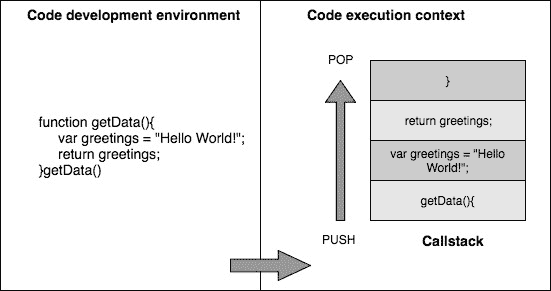
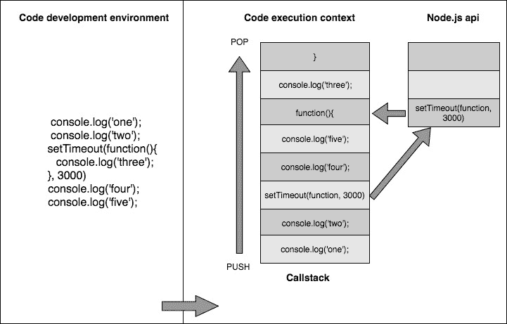

Welcome to JavaScript in the Full Stack <link href="css/style.css" rel="stylesheet" type="text/css">  

# 欢迎来到 JavaScript 的完整堆栈

曾经被认为只是一种为网页添加增强和小部件的语言，现在已经发展成自己成熟的生态系统。 根据 2017 年的调查([https://insights.stackoverflow.com/survey/2017](https://insights.stackoverflow.com/survey/2017))，在堆栈溢出的使用方面，它是最流行的语言，大约有 100 万个问题标记在上面。 有大量的框架和环境可以让 JavaScript 几乎在任何地方运行。 我相信阿特伍德定律最能说明这一点:

"Any application that can be written in JavaScript will eventually be written in JavaScript!"

虽然这句话可以追溯到 2007 年，但在今天却再正确不过了。 你不仅可以使用 JavaScript 来开发一个完整的单页应用程序，如 Gmail，而且你还将看到我们如何使用它来实现以下项目在书中接下来的章节:

*   使用 Node.js 和 Express.js 完全支持后端
*   使用强大的面向文档的数据库(如 MongoDB)持久化数据
*   使用 Handlebars.js 编写动态 HTML 页面
*   使用 Heroku 和**Amazon Web services**(**AWS**)等服务将整个项目部署到云上。

随着 Node.js 的引入，JavaScript 正式进入了一个以前根本不可能的方向。 现在，您可以在服务器上使用 JavaScript，还可以使用它来开发全面的企业级应用程序。 当您将此功能与 MongoDB 及其 json 驱动的数据相结合时，您可以在应用程序的每一层使用 JavaScript。

让我们快速浏览一些 Node.js 和 MongoDB 的基本概念，这将帮助你跟随本书的其余章节。

# 简单介绍 Node.js

引入 Node.js 时，人们最容易混淆的最重要的事情之一是理解它到底是什么。 它是一种完全不同的语言吗?它只是在它之上的一个框架吗?还是它是别的什么东西? Node.js 绝对不是一门新的语言，它也不仅仅是 JavaScript 上的一个框架。 它可以被看作是构建在谷歌 V8 引擎之上的 JavaScript 运行时环境。 因此，它为我们提供了一个环境，我们可以在任何可以安装 Node.js 的平台上编写 JavaScript 代码。 在任何地方!

现在，说说它的历史吧! 早在 2009 年，Ryan Dahl 就在 JSConf 上做过一次演讲，永远改变了 JavaScript。 在他的演讲中，他向 JavaScript 社区介绍了 Node.js。 在大约 45 分钟的演讲后，他结束了演讲，在此过程中，观众起立鼓掌。 他在图片分享网站 Flickr 上看到一个简单的文件上传进度条后，受到启发而写了 Node.js。 意识到整个过程都是错误的，他决定必须有一个更好的解决方案。

现在让我们来看看 Node.js 的特性，这使它与其他服务器端编程语言不同。

# V8 引擎带来的优势

V8 引擎由谷歌开发，并在 2008 年开源。 众所周知，JavaScript 是一种解释型语言，它的效率不如编译型语言，因为在执行代码的同时，每一行代码都会被逐一解释。 V8 引擎带来了一个高效的模型，在这个模型中，JavaScript 代码首先被解释，然后编译成机器级别的代码。

新的 V8 5.9 提供了一个稳定的版本，引入了**TurboFan**编译器，提供了性能和大规模优化的好处。 它还启动**Ignition**解释器，对于所有大小设备，如服务器或物联网设备等，都是非常高效的。 由于如此低的内存占用，它提供了快速的应用程序启动。 我们可以通过以下链接来学习基准:[https://goo.gl/B15xB2](https://goo.gl/B15xB2)

有了两个强大的更新，v8 团队还在开发 Orinoco，这是一个基于并行和并发压缩机制的垃圾收集器。

如此高的性能和有希望的结果是节点 8(LTS)的发射日期从 2018 年 5 月推迟到 2018 年 10 月的原因。 目前我们正在使用非 lts 版本的节点 8。 为使用节点 v4.x 的用户提供干净的替换。 X 及以上版本，没有损坏的库。 版本 8 也有各种内置的特性，如缓冲区改进和内置承诺方法等。 我们可以通过以下链接进行研究:[https://goo.gl/kMySCS](https://goo.gl/kMySCS)

# node . js 是单线程!

随着网络的出现，传统的 JavaScript 的目的是在浏览器中添加简单的功能和最小的运行时间。 因此，JavaScript 被保留为单线程脚本语言。 现在，为了对单线程模型有一个简单的了解，让我们考虑下面的图表:



单线程模型在执行上下文中创建单个 Callstack。 在前面的代码中，当调用函数`getData()`时，函数被按顺序推入堆栈中执行。

在 Node.js 的上下文中，JavaScript 是基础脚本语言，因此，Node.js 是单线程的。 您可能会问，单线程模型如何提供帮助? 典型的 PHP, ASP。 NET、Ruby 或基于 java 的服务器遵循一种模型，在这种模型中，每个客户机请求都会导致一个新线程甚至一个进程的实例化。

当涉及到 Node.js 时，请求运行在共享资源的同一个线程上。 一个经常被问到的问题是，使用这种模型有什么好处? 要理解这一点，我们应该理解 Node.js 试图解决的问题。 它尝试在单个线程上进行异步处理，为那些需要处理大量 web 流量的应用程序提供更高的性能和可伸缩性。 想象一下处理数百万并发请求的 web 应用程序; 如果服务器创建一个新线程来处理每个传入的请求，它将消耗大量的资源，我们最终将试图添加越来越多的服务器来增加应用程序的可伸缩性。

单线程、异步处理模型在前面的上下文中有其优势，您可以用更少的服务器端资源处理更多的并发请求。 然而，这种方法也有缺点; Node(默认情况下)不会利用它所运行的服务器上可用的 CPU 核数，而不使用像`pm2`这样的额外模块。

The point that Node.js is single-threaded doesn't mean that it doesn't use threads internally. It is just that the developer and the execution context that the code has exposure to have no control over the threading model internally used by Node.js.
If you are new to the concept of threads and process, I would suggest you go through some preliminary articles about these topics. There are plenty of YouTube videos on the same topic as well.
The following reference could be used as a starting point:
[http://www.cs.ucsb.edu/~rich/class/cs170/notes/IntroThreads/](http://www.cs.ucsb.edu/~rich/class/cs170/notes/IntroThreads/)

# 非阻塞异步执行

Node.js 最强大的特性之一是它既是事件驱动的，又是异步的。 那么，异步模型如何工作呢? 假设您有一段代码，在某个*n<sup>th</sup>*行上进行了一个耗时的操作。 在执行此代码时，*n<sup>th</sup>*行之后的行发生了什么变化? 在正常的同步编程模型中，*n<sup>th</sup>*行之后的行必须等待，直到该行上的操作完成。 异步模型以不同的方式处理这种情况。

让我们通过下面的代码和图表来可视化这个场景:



在前面的例子中，`setTimeout()`方法由 JavaScript (Node.js) API 提供。 因此，该方法被认为是同步的，并在不同的执行上下文中执行。 根据`setTimeout()`的功能，它在指定的持续时间之后执行回调函数，在我们的例子中是三秒之后。

而且，当前的执行不会阻止进程完成。 当 Node.js API 确定事件已经完成时，它将在那一刻执行你的回调函数。

在典型的同步编程语言中，执行上述代码将产生以下输出:


If you are still interested in learning more about asynchronous models and the callback concept in JavaScript, **Mozilla Developer Network** (**MDN**) has many articles that explain these concepts in detail.

# npm -节点包管理器

使用 Node.js 编写应用程序是非常愉快的，当您意识到您可以使用大量的信息和工具时! 使用 Node.js 内置的包管理器 npm，你可以找到成千上万的模块，这些模块可以在你的应用程序中安装和使用，只需要几个按键! Node.js 成功的最大原因之一是 npm，它是最好的包管理器之一，学习曲线非常短。 如果这是您接触到的第一个包管理器，您应该认为自己很幸运!

在一个正常的月里，npm 处理了超过 10 亿次的下载，它目前有大约 15 万个软件包可供你下载。 可通过[www.npmjs.com](https://www.npmjs.com/)查看可用模块库。 下载和安装应用程序中的任何模块都很简单，只需执行以下命令:

```js
npm install package 
```

你写过想与全世界分享的模块吗? 您可以使用 npm 打包它，并将其上传到公共注册中心[www.npmjs.org](https://www.npmjs.com/)，就像这样简单! 如果你不确定你安装的模块是如何工作的，源代码就在你项目的`node_modules/`文件夹中，等待你去探索!

Package versions of modules in npm follow semantic versioning, such as `major.minor.patch` order.

# 共享和重用 JavaScript

当你开发 web 应用程序时,你将永远为 UI 做验证,无论是在服务器端和客户端,在客户端验证需要更好的 UI 体验和服务器端验证需要更好的安全的应用程序。考虑两种不同的语言在行动: 您将在服务器端和客户端实现相同的逻辑。 使用 Node.js，您可以考虑在服务器和客户机之间共享公共函数，在很大程度上减少代码复制。

您是否曾经优化过从模板引擎(如下划线)加载的**单页应用程序**(**SPA**)的客户端组件的加载时间? 你最终会想到一种方法，我们可以在服务器和客户端同时共享模板的呈现; 有些人称之为混合模板。

Node.js 比其他服务器端技术更好地解决了客户端模板复制的上下文，这是因为我们可以在服务器端和客户端使用相同的 JS 模板框架和模板。

如果您不太在意这一点，那么它解决的问题不仅仅是在服务器和客户机上重用验证或模板的问题。 想想正在建造的水疗中心; 您还需要在客户端 MV*框架中实现服务器端模型的子集。 现在，考虑一下在客户机和服务器上共享的模板、模型和控制器子集。 我们正在解决一个更高的代码冗余的场景。

# 不仅仅是为了构建 web 服务器!

Node.js 不仅仅是在服务器端编写 JavaScript。 是的，我们先前讨论过这一点。 Node.js 为 JavaScript 代码在任何可以安装它的地方工作设置了环境。 它是一个强大的解决方案，可以创建命令行工具，以及功能齐全的本地运行的应用程序，与 web 或浏览器无关。 Grunt.js 是一个很好的 node 命令行工具的例子，许多 web 开发人员每天都使用它来自动化诸如构建过程、编译 CoffeeScript、启动 Node.js 服务器、运行测试等任务。

除了命令行工具之外，Node.js 也随着 Node.js bot 运动在硬件人群中越来越受欢迎。 `Johnny-Five`和`Cylon.js`是两个流行的 Node.js 库，它们提供了一个用于机器人技术的框架。 只要在 YouTube 上搜索 Node.js 机器人，你就会看到很多例子。 此外，您可能会使用在 Node.js 上开发的文本编辑器。 GitHub 上非常流行的开源编辑器 Atom 就是一个例子。

# 使用 Socket.io 的实时 web 应用程序

Node.js 起源背后的一个重要原因是支持实时 web 应用程序。 Node.js 有两个非常流行的用于实时 web 应用的框架:`Socket.io`和`Sock.JS`。 这些框架使构建即时的、基于协作的应用程序变得非常简单，比如谷歌 Drive 和 Mozilla 的 together.js。 在现代浏览器中引入 WebSockets 之前，这是通过长轮询来实现的，对于实时体验来说，这不是一个很好的解决方案。 虽然 WebSockets 是一项仅在现代浏览器中支持的特性，但`Socket.io`作为一个框架，它也为传统浏览器提供了无缝的回退实现。

If you need to understand more on the use of WebSockets in applications, here's a good resource on MDN that you can explore:
[https://developer.mozilla.org/en-US/docs/Web/API/WebSockets_API/Writing_WebSocket_client_applications](https://developer.mozilla.org/en-US/docs/Web/API/WebSockets_API/Writing_WebSocket_client_applications).

# 网络和文件 IO

除了 Node.js 强大的非阻塞异步特性外，它还通过其核心模块提供了健壮的网络和文件系统工具。 通过 Node.js 的网络模块，您可以创建服务器和客户端应用程序，它们接受网络连接并通过流和管道进行通信。 Node 中包含一个名为**fs**或文件系统的模块，该模块完全负责对文件的各种读写操作。 它还利用了 node 的流特性来执行这些操作。

# 微服务

按功能单元划分应用程序称为**微服务**。 每个微服务都成为独立的部署单元。 Node.js 基于常见的 JS 模块模式，该模式提供了应用程序结构上的模块化。 这种模式用于创建微服务。 随着功能的增加，微服务的数量也在增加。 为了管理这些服务，Node.js 生态系统提供了强大的库，比如`pm2`。 因此，它使应用程序中的元素能够分别更新和伸缩。

# 物联网

随着**物联网**(**物联网**)的出现，Node.JS 生态系统为传感器、信标、可穿戴设备等各种设备提供了惊人的库支持。 Node.js 被认为是通过其强大的流和非阻塞 I/O 主干来管理这些设备发出的请求的理想技术。 流行的物联网板版本，如 Arduino、Raspberry Pi 等，有超过 300 个 Node.js 包。 开发人员在构建数据密集型的实时应用程序时，通常会发现 Node.js 是最合适的选择。

# 一个简单的服务器与 Node.js

为了看一个例子来说明 Node.js 是如何轻量级的，让我们看一些启动 HTTP 服务器并向浏览器发送 Hello World 的示例代码:

```js
var http = require('http');
http.createServer(function(req, res) {
    res.writeHead(200, { 'Content-Type': 'text/plain' });
    res.end('Hello World\n');
}).listen(8080, 'localhost');
console.log('Server running at http://localhost:8080'); 
```

只需几行基本代码就可以编写一个完整的 Node.js 应用程序。 用一个简单的 Node.js`app.js`命令运行它，将启动一个在 8080 端口上监听的 HTTP 服务器。 将任何浏览器指向`http://localhost:8080`，您将在屏幕上看到简单的输出 Hello World ! 虽然这个示例应用程序实际上没有做任何有用的事情，但它应该让你瞥见在使用 Node.js 编写 web 应用程序时所拥有的强大功能。 如果你还没有设置初始的 Node.js 开发环境，我们将在下一章讨论它。

# 何时使用 Node.js

你可能听说过美国心理学家亚伯拉罕·马斯洛的这句谚语:

"If all you have is a hammer, everything looks like a nail!"

在这种情况下，这很有意义。 Node.js 不是一种依赖于你想要解决的所有应用问题的技术，如果不明智地选择，使用它的决定将会适得其反。 Node.js 非常适合那些需要处理大量并发连接的应用程序。 此外，应该注意的是，它最适合每个传入请求需要很少 CPU 周期的应用程序。 这意味着，如果你打算在请求时执行计算密集型任务，它最终会阻塞事件循环，从而影响 web 服务器并发处理的其他请求。 Node.js 非常适合实时 web 应用，比如聊天室、协作工具、在线游戏等等。 所以，在决定是否使用 Node.js 时，我们应该认真分析应用的上下文，弄清楚 Node.js 是否真的适合应用的上下文。

It is quite hard to debate over the use cases of Node.js in a detailed manner. However, the following Stack Overflow thread does this effectively, and I strongly recommend you to go through the answers on this post if you are more interested in the use cases of Node.js: [http://stackoverflow.com/questions/5062614/how-to-decide-when-to-use-node-js.](http://stackoverflow.com/questions/5062614/how-to-decide-when-to-use-node-js)

我们已经简要地了解了 Node.js 的概念和特性，现在让我们看看 NoSQL 和 MongoDB。

# NoSQL 运动

让我们从探究这个问题的答案开始:NoSQL 数据库究竟是什么? NoSQL 是背离传统**关系数据库管理系统**(**RDBMS**)概念的数据库技术的通用术语。 这些数据库解决方案偏离 RDBMS 数据库标准的常见原因是为了实现和设置比传统 RDBMS 解决方案更好的可用性和分区功能标准。

为了向你介绍这个概念，我们应该看看布鲁尔定理，它也被称为 CAP 定理:

*"It is impossible for a distributed computer system to simultaneously provide all three of the following guarantees: Consistency, Availability, and Partition Tolerance."*

传统的 RDBMS 解决方案在一致性方面做得很好，但是在提供更好的可用性(数据读取)和分区功能方面做了一些让步。 大多数 NoSQL 解决方案都朝着这个方向发展，以实现更好的数据可用性和分区。

由于这是任何数据库技术的通用术语，这些技术偏离了诸如 MySQL、PostgreSQL 等 RDBMS 解决方案所遵循的概念，所以 NoSQL 数据库有不同的子集。 NoSQL 最流行的子集是文档存储、键值存储和基于图的数据库解决方案。 MongoDB 是我们将要尝试的，它属于文档存储类别。 除了 MongoDB，市场上还有更多的 NoSQL 解决方案，比如 Cassandra、Redis、Neo4j、HBase 等等。

# MongoDB 简介

正如我们在前一段中讨论的，MongoDB 属于 NoSQL 数据库的文档存储类别。 MongoDB 正由 10gen 积极开发，该公司已更名为 MongoDB 公司。 MongoDB 是开源的，它的源代码可以在各种平台上使用，比如 GitHub。

我们将看看 MongoDB 的以下各种特性:

*   受欢迎的数据库
*   非模式化设计
*   各种性能方面

# 受欢迎的数据库

MongoDB 流行的最重要的原因之一是它是一个 json 友好的数据库。 这意味着文档以 JavaScript 对象的形式从 MongoDB 中存储和检索。 在内部，该 JSON 数据在持久化到系统时被转换为 BSON 格式。 因此，这提供了极大的灵活性，我们可以从客户机到服务器，最终到数据库使用相同的数据格式。

MongoDB 集合(表)中的一个典型文档(记录)可能看起来像以下代码:

```js
$ mongo 
> db.contacts.find({email: 'jason@kroltech.com'}).pretty() 
{ 
   "email" : "jason@kroltech.com", 
   "phone" : "123-456-7890", 
   "gravatar" : "751e957d48e31841ff15d8fa0f1b0acf", 
   "_id" : ObjectId("52fad824392f58ac2452c992"), 
   "name" : { 
      "first" : "Jason", 
      "last" : "Krol" 
   }, 
   "__v" : 0 
} 
```

在检查前面的输出之后，我们可以看到一个名为`_id`的键。 它是一个 MongoDB ID，必须被编码为二进制 JSON`objectID`(BSON)。 如果编码失败，MongoDB 将无法检索或更新对象。

# 非模式化设计

MongoDB 的另一个重要特性是它的无模式特性。 对于关系数据库，您需要提前定义存储的数据的确切结构，这称为模式。 这意味着您必须为表中的每个字段定义准确的列数、长度和数据类型，并且每个字段必须始终匹配精确的标准集。 Mongo 提供了一种灵活的特性，您存储到数据库中的文档不需要遵循任何模式，除非开发人员在应用程序级别强制执行它。 这使得 MongoDB 非常适合基于敏捷的开发，因为您可以动态地对应用程序模式进行修改。

# 各种性能方面

除了 javascript 友好的特性，MongoDB 和 Node.js 之间的另一个相似之处是，MongoDB 也设计了高并发应用程序，并考虑了大量的读操作。

MongoDB 还引入了*分片*的概念，这使得数据库可以横向扩展，也可以纵向扩展。 如果应用程序所有者需要增加数据库功能，他们可以向堆栈中添加更多的机器。 与投资于单个机器的 RAM 相比，这是一个更便宜的选择，而 RDBMS 解决方案就是这种情况。

索引*的过程*为一个选定的字段创建了一个名为 index 的值列表。 这些索引用于查询更大的数据块。 使用索引可以加快数据检索速度和性能。 MongoDB 客户端提供了各种方法，比如`ensureIndex`来创建一个不存在的索引。

此外，MongoDB 有各种命令来允许数据的*聚合*，比如组、计数和返回不同的值。

我们所讨论的所有优点都会对一致性产生一些影响，因为 MongoDB 并不像 ACID 事务那样严格遵守 RDBMS 标准。 此外，如果您最终创建的数据模型可能需要太多的 JOIN 操作，那么 MongoDB 将不会很适合，因为它没有设计出太多的聚合，即使通过 MongoDB 聚合框架可以实现聚合。 MongoDB 可能是也可能不是您的应用程序的正确解决方案。 在决定哪一种技术适合您之前，您应该真正权衡每种技术的利弊。

# Node.js 和 MongoDB

Node.js 和 MongoDB 在开发社区中都非常流行和活跃。 对于企业来说也是如此。 《财富》500 强中一些最大的公司已经完全使用 Node.js 来支持他们的 web 应用程序。
这在很大程度上是由于 Node.js 的异步特性，这使得它成为电子商务网站和移动应用等高流量、高 I/O 应用的一个很好的选择。

下面是一些使用 Node.js 的大公司:

*   贝宝
*   LinkedIn
*   易趣
*   沃尔玛
*   雅虎
*   微软
*   道琼斯
*   超级
*   纽约时报

随着越来越多的公司采用领先的 NoSQL 数据库服务器，MongoDB 在企业部门的使用同样令人印象深刻和广泛。 这里只是一些与 MongoDB 合作的大公司的小名单:

*   思科
*   Craigslist 公司。
*   《福布斯》
*   四方
*   直觉
*   迈克菲
*   MTV
*   大都会人寿
*   Shutterfly
*   在甲

# 这本书有什么值得期待的

这本书的其余部分将是一个向导，引导您通过创建一个完整的数据驱动的网站。 我们创建的网站将包含一个典型的大型网站开发项目的几乎每一个方面。 该应用程序将使用一个流行的 Node.js 框架开发，称为 Express，它将使用 MongoDB 持久化数据。 在前几章中，我们将介绍服务器核心启动和服务内容的基础工作。 这包括配置您的环境，以便使用 Node.js 和 MongoDB，并对这两种技术的核心概念进行基本介绍。 然后，我们将编写一个由 ExpressJS 支持的 web 服务器，它将处理为网站提供所有必要的文件。 从那里，我们将与 Handlebars 模板引擎工作，以服务静态和动态 HTML 网页。 深入研究，我们将通过添加一个数据层使应用程序持久，其中网站的记录将通过 MongoDB 服务器保存和检索。

我们将介绍如何编写 RESTful API，以便其他人可以与您的应用程序进行交互。 最后，我们将详细介绍如何为所有代码编写和执行测试。 下一节给出摘要。

最后，我们将简短地绕道考察一些流行的、合并的前端技术，这些技术在编写 spa 时变得越来越流行。 这些技术包括 Backbone.js、Angular 和 Ember.js。

最后，我们将详细介绍如何使用流行的云托管服务(如 Heroku 和 Amazon Web services)将您的新网站部署到互联网上。

# 总结

在本章中，我们回顾了本书其余部分的内容。 我们讨论了 JavaScript 的惊人现状，以及如何使用它来支持整个 web 应用程序堆栈。 首先，您并不需要任何说服，但我希望您已经兴奋起来，并准备开始使用 Node.js 和 MongoDB 编写 web 应用程序!

接下来，我们将设置你的开发环境，让你使用 Node.js、MongoDB 和 npm 运行，以及编写和启动一个使用 MongoDB 的快速 Node.js 应用程序!