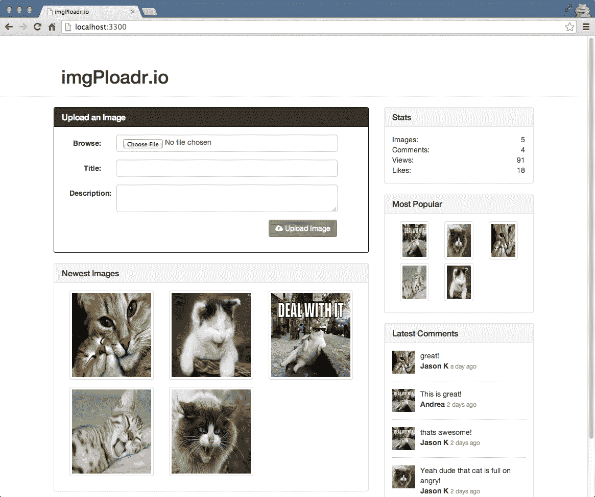

Introducing Express <link href="css/style.css" rel="stylesheet" type="text/css">  

# 介绍表达

当我们需要构建一个完整的 web 应用程序时，从头编写整个应用程序并不是最好的方法。 我们可以使用维护良好、编写良好的 web 应用程序框架来构建我们的应用程序，以减少开发工作并提高可维护性。

在本章中，我们将涵盖以下主题:

*   探索 Express.js web 应用框架
*   探索 Express.js 的各种元素
*   使用 Express 开发必要的代码来引导一个 web 应用程序

# Web 应用程序框架

简单地说，web 框架使开发 web 应用程序变得更加容易。 考虑一下将常用功能分解为可重用模块的方面。 这正是框架所做的。 它们提供了许多可重用的模块，并强制执行代码的标准结构，以便世界各地的开发人员更容易浏览和理解应用程序。

除了这些优点之外，web 框架主要是由世界各地的许多开发人员维护的。 因此，开发人员集成更新的 bug 修复和底层语言的特性的努力被最小化，我们只需要升级应用程序正在使用的框架版本。 因此，使用 web 框架来构建 web 应用程序给 web 应用程序的开发和维护阶段带来了很多好处。

在本书中，我们将使用的 Express.js 框架是一个基于**模型-视图-控制器**(**MVC**)的 web 应用框架。 MVC 只是一种架构设计模式:

*   模型:模型用于表示 web 应用程序的数据或实体。
    它们与存储应用程序数据(通常是数据库或 web 服务)的实例更紧密地对齐。
*   视图:视图负责将应用程序呈现给最终用户。 因此，视图可以被认为是应用程序的表示层。
*   控制器:现在，您可能想知道控制器在 web 应用程序中的作用。 控制器的作用是把模型和各自的视图粘在一起，处理用户对应用程序中特定网页的请求。

如果你是第一次听到这个概念，你可能很难理解。 但在读完本章后，当我们向您展示各种例子时，您将习惯于这些概念。

# Express.js 是什么?

正如在其主页上完美描述的那样，Express 是一个最小且灵活的 Node.js
web 应用框架，为构建单个、多页面和混合 web 应用提供了一组健壮的特性。 换句话说，它提供了所有的工具和基本的构建模块，你需要通过编写很少的代码来建立和运行一个网络服务器。 它将精力集中在编写应用程序上，而不必担心使基本内容在您手中工作的具体细节。

Express 框架是最流行的基于节点的 web 框架之一，也是`npm`中最流行的包之一。 它是基于 Sinatra web 框架构建的，该框架在 Ruby 世界中非常流行。 有很多跨语言的框架从 Sinatra 的简单性中获得灵感，例如 PHP 的 Laravel 框架。 所以，Express 是 Node.js 世界中基于 sinatra 的 web 框架。

如果你看一段示例代码，Express 最基本的实现之一，你可以看到让一个 web 服务器启动和运行是多么容易，例如:

```js
const express = require('express'); 
const app = express(); 
app.get('/', (req, res)=>{ 
   res.send('Hello World'); 
}); 
app.listen(3300); 
```

Express 的美妙之处在于，它使构建和维护网站的服务器代码变得简单。

# 构建一个完整的 web 应用程序

从本章开始，我们将构建一个完整的 web 应用程序。
我们要构建的网络应用将是一个流行的社交图片分享网站[imgur.com](http://imgur.com)的克隆版。 我们将我们的网站命名为`imgPloadr.io`。

# 设计 web 应用程序

场地要求如下:

*   该主页将允许访客上传图片和浏览已上传的图片，这些图片将按最新和最老进行排序。
*   每个上传的图像将通过其自己的页面显示其标题，描述，和一个大的图像显示。 访客将能够喜欢这张图片并发表评论。
*   一个一致的共享侧边栏将在两个页面上可见，并将展示一些关于网站的一般统计数据，最受欢迎的图片，和最近的评论。

该网站将使用 Bootstrap，以便它有一个良好的专业设计，并在任何设备上的响应。

以下截图来自完成网站的主页:



下面的截图是来自该网站的图片详情页面:


# 组织文件

在开始编写任何代码之前，我们要确保正确地设置了一个项目文件夹，并使用合适的文件夹结构来存放将要创建的所有不同文件。 首先为您的项目创建一个新文件夹，并将其命名为您喜欢的任何名称。 然后，在该文件夹内，创建其他文件夹以匹配以下结构:

```js
/(project root) 
---/helpers 
---/controllers 
---/public 
------/css 
------/img 
------/js 
------/upload 
---/server 
---/Views 
------/layouts 
------/partials 
```

每个文件夹将包含重要的模块，我们将在本章的剩余部分和本书中编写这些模块。

If you use an Express-based generator through Yeoman, you will get the necessary folder structure and the dependencies imported with the boilerplate code. However, as our intention is to understand this framework, we will skip this. Visit [http://yeoman.io/](http://yeoman.io/) for more information on the features of `Yeoman`.

你需要为这个项目创建一个`package.json`文件，最简单的方法是在项目文件夹的根目录下执行以下命令:

```js
$ npm init  
```

根据提示回答每个问题，或者简单地重复按*输入*以接受默认值。 现在，让我们通过`npm`安装 Express 及其必要的依赖项:

```js
$ npm install express morgan body-parser cookie-parser method-
override errorhandler express-handlebars --save  
```

这将在`node_modules`文件夹中安装 Express 框架，并将 Express 添加到依赖项部分的`package.json`文件中。 请注意，在撰写本书时，Express.js 是 4.x。 x 版本。 在这里，如您所见，Express 是一个完全解耦的框架，它本身没有很多打包的模块。 相反，您可以找出应用程序的依赖关系，并随时插入或退出应用程序。 如果您从一开始就一直关注 Express 开发，那么您一定已经注意到这些更改是作为 Express 4.x 的一部分引入的。 x 版本。 在此版本之前，Express 通常附带许多内置模块。 这里，与 Express 一起安装的模块是我们开始构建完整的 web 应用程序时应用程序所具有的各种依赖项。 我们将在本章后面的章节中讨论每个模块的用法。

# 创建应用程序的入口点

在安装 Express 和必要的依赖项之后，开发应用程序的下一步将是创建一个文件，该文件将作为该应用程序的默认入口点。 我们将执行这个文件来启动我们的 web 应用程序，它将包含必要的代码来要求依赖模块并启动应用程序来监听开发服务器上的指定端口。

现在，我们将把入口点文件命名为`server.js`，并将保持它的精简，这样它的内容就非常不言自明了。 将在该文件中执行的任何主要逻辑实际上都将被推迟到托管在其他文件中的外部模块。

在我们可以在`server.js`中做任何事情之前，我们需要几个将要使用的模块，特别是 Express:

```js
const express = require('express'); 
// config = require('./server/configure'); 
let app = express(); 
```

在前面的代码中，我们将`express`模块赋值给`express`变量。 `config`模块实际上是我们自己的模块，我们将很快编写它，但现在，由于它不存在，我们将把这一行注释掉。 最后，我们将声明一个名为`app`的变量，它实际上是 Express 框架在执行时返回的变量。 这个`app`对象为我们的整个`app`应用程序提供动力，这就是它如此巧妙地命名的原因。

Throughout this chapter and the remainder of the book, I may include commented out code in the samples (code that starts with `//`). This is so that following along will be easier when we use the commented lines as reference points, or when we enable those features by simply uncommenting the code.

接下来，我们将使用`app.set()`函数通过`app`对象设置一些简单的设置。 这些设置实际上只是我们定义一些应用级常量的一种方式，我们可以在剩下的代码中使用这些常量作为方便的快捷方式:

```js
app.set('port', process.env.PORT || 3300); 
app.set('Views', `${__dirname}/Views`); 
// app = config(app); 
```

代码解释如下:

*   前面代码的前两行使用 Node 中的内置常量。 常量`process.env.PORT`是在实际机器上为服务器的默认端口值设置的环境设置。 如果机器上没有设置端口值，我们将硬编码一个默认值`3300`来代替它。
*   之后，我们将视图(HTML 模板)的位置设置为
    `${__dirname}'/Views`，或者使用另一个 Node 常量，即当前工作目录中的`/Views`
    文件夹。
*   第三行代码引用了`config`模块，我们还没有写这个模块，所以这行代码被注释掉了。
*   最后，我们将使用`app`对象创建一个 HTTP 服务器，并告诉它监听连接:

```js
app.get('/', (req, res) => {
  res.send('Hello World');
});
app.listen(app.get('port'), () => {
  console.log(`Server up: http://localhost:${app.get('port')}`);
});
```

这里，我们在应用程序中设置了一条路由，以使用`Hello World`消息进行响应。 如果任何用户请求我们的应用程序的根目录，它将响应一个`Hello World`消息。 代码的最后一部分是调用`listen()`功能在我们的应用程序,告诉它的端口听,并通过一个简单的匿名回调函数,将执行一次服务器启动并通过执行一个简单的`console.log()`消息听。 就是这样! 同样，确保将此文件以`server.js`的名称保存在项目的根目录中。 现在可以运行服务器并查看它是否工作了。

# 启动应用程序

让我们来看看你的服务器到目前为止做得如何:

```js
$ node server.js
Server up: http://localhost:3300  
```

完美! 此时，您的服务器实际上并没有做什么了不起的事情。 尝试将浏览器指向`http://localhost:3300`。 你会收到一条非常基本的信息:`Hello World`! 如果您请求端口上的任何其他路由，例如`http://localhost:3300/`，它将响应一个 cannot get response。 这是因为您没有在服务器中配置任何路由或任何实际逻辑来说明如何处理某些请求，而只配置了一个到缺省路由`/`的`GET`请求。

在设置路由之前，我们应该理解 Express 中中间件的概念，这对于理解作为应用程序自定义依赖项的模块如何与常规应用程序流集成至关重要。

在运行服务器之前，您可以通过执行以下命令来设置任意数量的环境变量:

```js
$   PORT=5500 node server.js
Server   up: http://localhost:5500   
```

You can also set environment variables in your environment settings permanently. This can be done typically by editing your `.profile` file or equivalent.

# 中间件)

Express 最强大的特性之一是中间件的概念。 中间件背后的想法是，它就像一个过滤器的堆栈，每个请求到服务器都要经过它。 每个请求都要经过每个过滤器，每个过滤器可以在请求传递到下一个过滤器之前对请求执行特定的任务。

为了更好地理解它，下面是一个关于中间件的图解视图:


通常，这些过滤器用于诸如 cookie 解析、表单字段处理、会话处理、身份验证、错误处理和日志记录等任务。 这样的例子不胜枚举。 您可以使用数百个第三方模块，也可以简单地编写自己的自定义中间件。

# 创建自定义中间件

毫无疑问，在现有的由*Connect*或任何其他第三方提供的中间件之外，您还需要编写自己的自定义中间件。 在你在 Node 中编写自己的自定义中间件之前，先养成搜索[https://www.npmjs.org/](https://www.npmjs.org/)的习惯，因为很有可能其他人已经完成了这项工作。

编写您自己的自定义中间件非常简单。 在使用 Express 框架时，它记录了各种类型的中间件，我们将它们简单地分为两种类型，即基于应用程序的中间件和基于路由的中间件。

下面是一个基于应用程序的中间件的超级基本示例:

```js
app.use((err, req, res, next)=> { 
    // do whatever you want here, alter req, alter res, throw err etc. 
    return next(); 
});
```

`app.use`函数允许我们注册为中间件。 在其基本级别上，它是一个在接收到`http.createServer`方法中的请求时调用的函数。 此外，我们需要编写一个接受四个参数的函数:`err`、`req`、`res`和`next`。

*   第一个参数是一个错误对象，如果在你的中间件运行之前有任何堆栈错误，这个错误将被传递到你的中间件，这样你就可以相应地处理它。 这是一个可选参数; 因此，如果特定功能的实现不需要错误处理，我们可以跳过它。
*   您已经熟悉了`req`和`res`参数，并编写了您的路由。
*   第四个参数实际上是对回调的引用。 下一个参数是中间件堆栈如何表现得像一个堆栈——每个堆栈执行并确保通过`next`返回和调用管道中的下一个中间件。

`app.use`方法也接受第一个参数作为路由或端点。 这就形成了前面提到的第二种中间件**，即基于路由的中间件**。 语法如下:

```js
app.use('/get_data', (err, req, res, next)=>{ 
    console.log('Hello world!')     
    return next(); 
}, (err, req, res, next)=>{ 
    console.log('Hello world Again!')     
    return next();
});
```

因此，这描述的是，我们不是将中间件应用于所有传入请求，而是将它特定于路由并调用路由匹配。

在编写您自己的自定义中间件时，惟一需要记住的重要事情是您拥有正确的参数并返回`next()`。 其余的完全取决于你!

# 中间件)的顺序

调用中间件的顺序非常重要。 同样，使用过滤器的概念作为通过每个过滤器的请求，您希望确保它们以正确的顺序执行它们的职责。 一个很好的例子是在会话处理程序之前实现 cookie 解析器，因为会话通常依赖于 cookie 来维护请求之间的用户状态。

中间件顺序的重要性的另一个很好的例子是错误处理。 如果您的任何中间件遇到错误，它们将简单地将该错误传递给堆栈中的下一个中间件。 如果最后一个中间件(不管它是什么)没有恰当地处理这个错误，那么它基本上会以堆栈跟踪的形式出现在应用程序中(这很糟糕)。 将错误处理程序配置为最后的中间件之一就像在说“*如果其他所有东西都失败了，并且在前一个中间件的任何点上发生了故障，那么就优雅地处理它*”。

我们在这个应用程序中安装并使用的各种依赖项将作为中间件集成到我们的代码中。 我们将通过`config`模块来完成集成各种中间件的任务，因为它将帮助我们使`server.js`文件更精简，并为代码库增加更多的可读性。

# 配置模块

因为，我们保持了我们的`server.js`文件非常精简，所以在配置我们的服务器时仍然需要相当多的逻辑。 为此，我们将遵循我们将创建的名为`configure`的自定义模块。 首先，在`server`文件夹中创建一个`configure.js`文件。 在开始安装 Express 时，我们已经安装了自定义依赖项。

现在模块已经安装好，可以使用了，让我们开始编写`configure.js`文件。 首先，像我们的任何模块一样，我们将声明我们的依赖项:

```js
const path = require('path'), 
    routes = require('./routes'), 
    exphbs = require('express-handlebars'),), 
    express = require('express'), 
    bodyParser = require('body-parser'), 
    cookieParser = require('cookie-parser'), 
    morgan = require('morgan'), 
    methodOverride = require('method-override'), 
    errorHandler = require('errorhandler'); 

module.exports = (app)=>{ 
   app.use(morgan('dev')); 
   app.use(bodyParser.urlencoded({'extended':true})); 
   app.use(bodyparser.json()); 
   app.use(methodOverride()); 
   app.use(cookieParser('some-secret-value-here')); 
   routes(app);//moving the routes to routes folder. 

   app.use('/public/', express.static(path.join(__dirname, 
            '../public'))); 

if ('development' === app.get('env')) { 
   app.use(errorHandler()); 
} 
    return app; 
}; 
```

在前面的代码中，我们为将在自定义的`configure`模块中使用的每个模块声明了`const`。 然后，我们定义了将由该代码文件导出的实际模块，更具体地说，是一个接受`app`对象作为参数的函数，并返回相同的对象(在对其进行一些配置修改后)。

You should see that we require Connect, which is actually installed by default with Express.js as one of its core dependencies. Connect is a popular third-party middleware framework that we will learn more about later in this chapter.

让我们来看看前面代码中用到的 Connect 中间件:

*   `morgan`:负责日志记录的模块。 这对于调试 Node 服务器非常有帮助。
*   `bodyParser`:这有助于从浏览器通过 HTML 表单提交的任何表单字段的打包。 通过`POST`请求提交的表单字段将通过`req.body`属性提供。
*   `methodOverride`:对于那些不支持 REST HTTP 谓词的旧浏览器，比如`UPDATE`和`PUT`，`methodOverride`中间件允许使用一个特殊的隐藏输入字段来伪造。
*   `cookieParser`:允许发送和接收 cookie。
*   `errorHandler`:处理整个中间件过程中发生的任何错误。 通常，您可以编写自己的自定义`errorHandler`，它可以呈现默认的 404 HTML 页面，将错误记录到数据存储中，等等。
*   `handlebars`:这是我们将与视图一起使用的模板引擎。 我们将在接下来的章节中详细解释如何集成它。

`routes(app)`行是 Express 的一个特殊组件，它表示您实际上正在与服务器一起使用路由器，并且您可以响应`GET`、`POST`、`PUT`和`UPDATE`等请求。 由于您将 Express 路由器用作最后的中间件之一，所以我们还将在下一节中定义实际路由。

最后，中间件用于从预定义的静态资源目录向浏览器呈现静态内容文件。 这一点非常重要，以便服务器能够提供静态文件，如`.js`、`.css`、`images`和`regular.html`，以及您可能需要提供的任何其他文件。 静态中间件将提供来自公共目录的任何静态文件，像下面的代码:

```js
http://localhost:3300/public/js/somescript.js
http://localhost:3300/publimg/main_logo.jpg
```

重要的是，静态中间件是在`app.router()`之后定义的，这样静态资产就不会不经意地优先于您可能已经定义的匹配路由。

# 激活配置模块

现在您的`configure.js`文件已经完成，可以从主`server.js`文件调用它了。 如果您还记得的话，我们包含了在`configure`模块中注释掉的两行代码。 现在应该取消这两行注释，这样当您运行服务器时，您的`configure`模块将完成它的部分。 这两行现在应该像这样:

```js
config = require('./server/configure'), 
app = config(app); 
```

通过执行`server.js`节点重新启动服务器，一切都应该能够顺利运行。 现在，除了前面添加的`Hello World`路由之外，还可以将更多的路由添加到我们的应用程序中。

# 路由器和控制器

到目前为止，您已经有了`server.js`文件和`configure`模块，用于连接应用程序所需的所有中间件。 下一步是实现适当的路由器和必要的控制器。

路由器将是应用程序的每个可用 URL 路径的映射。服务器上的每个路由将对应于控制器中的一个函数。 下面是我们正在编写的特定应用程序的路由表:

```js
GET  /(index) - home.index (render the homepage of the site) 
GET  /images/image_id - image.index (render the page for a specific 
                                     image)
POST /images - image.create (when a user submits and uploads a new 
                              image)
POST /images/image_id/like - image.like (when a user clicks the Like 
                                          button)
POST /images/image_id/comment - image.comment (when a user posts a 
                                                comment)
```

您可以看到，我们正在处理两个不同的`GET`请求和三个不同的`POST`请求。 另外，我们有两个主控制器:`home`和`image`。 控制器实际上只是定义了不同函数的模块，它们与相应的路由相匹配。 正如前面指出的，它们在 MVC 设计模式中被称为控制器。 通常，每个路由都对应于一个控制器。 这个控制器很可能会渲染一个视图，而那个视图很可能有自己的模型(视图中显示的任何数据)。

让我们将我们的路由器作为它自己的模块来匹配表。 首先，在`server`文件夹中创建一个`routes.js`文件。 `routes`文件将会非常简单，它需要的唯一依赖就是我们定义的控制器:

```js
const express = require('express'), 
    router = express.Router(), 
    home = require('../controllers/home'), 
    image = require('../controllers/image'); 
module.exports = (app)=>{ 
    router.get('/', home.index); 
    router.get('/images/:image_id', image.index); 
    router.post('/images', image.create); 
    router.post('/images/:image_id/like', image.like); 
    router.post('/images/:image_id/comment', image.comment); 
    app.use(router); 
}; 
```

马上，我们声明了一个`router`变量，并要求`controllers`文件夹分配每个应用程序路由(我们还没有创建这些文件，但这将在接下来进行)。 这里，我们将每个路由分配给它在控制器中的对应函数。 然后，导出一个模块，当它被自己调用时，它将把所有这些路由附加到`app`实例。

路由的第一个参数是路由本身的字符串值，它可以包含变量值作为子路径。 您可以看到第二个`router.get`，我们分配了一个路由值`/images/:image_id`，它基本上等同于浏览器地址栏中的`/img/ANYVALUE`。 在编写`image.index`控制器时，您将看到如何检索`:image_id`的值并在`controller`函数本身中使用它。

路由的第二个参数是一个回调函数。 你完全可以忽略使用控制器的想法，只把回调定义为内联匿名函数; 然而，随着路由的增长，这个文件将变得越来越大，代码将开始变得混乱。 把你的代码分解成尽可能多的小的、可管理的模块总是一个好的做法，以保持你的理智!

前两个`router.get`路由是典型的路由，当访问者将他们的浏览器指向`yourdomain.com/routepath`时将被调用——浏览器在默认情况下向服务器发送`GET`请求。 另外三个`router.post`路由定义为在浏览器向服务器发送请求时处理，通常通过 HTML 表单提交完成。

定义了所有的路由后，现在让我们创建匹配的控制器。 在`controllers`文件夹中，创建`home.js`和`image.js`文件。 `home.js`文件是非常基本的:

```js
module.exports = { 
    index(req, res){ 
        res.send('The home:index controller'); 
    } 
}; 
```

通过这个模块，我们实际上导出了一个对象，该对象只有一个名为`index`的函数。 `index`的`function`签名是每个使用 Express 的路由都需要的签名。 第一个参数是请求对象，第二个参数是响应对象。 浏览器发送给服务器的请求的每个细节都可以通过请求对象获得。

此外，请求对象将使用前面声明的所有中间件进行修改。 您将使用响应对象向客户端发送响应—响应可能是呈现的 HTML 页面、静态资产、JSON 数据、错误或您确定的任何内容。 现在，我们的控制器只是用一个简单的文本进行响应，这样你就可以看到它们都在工作。

让我们创建一个具有更多功能的图像控制器。 编辑`/controllers/image.js`文件并插入以下代码:

```js
module.exports = { 
    index(req, res) { 
        res.send(`The image:index controller ${req.params.image_id}`); 
    }, 
    create(req, res) { 
        res.send('The image:create POST controller'); 
    }, 
    like (req, res) { 
        res.send('The image:like POST controller'); 
    }, 
    comment(req, res) { 
        res.send('The image:comment POST controller'); 
    } 
}; 
```

这里，我们定义了`index`函数，就像我们在主控制器中所做的一样，只是我们还将显示`image_id`，它是在执行该控制器函数时在路由中设置的。 `params`属性是通过`urlencoded`特性添加到`request`对象的，它是主体解析器模块的一部分!

注意，控制器当前不需要任何依赖项(在文件的顶部没有定义`require`声明)。 当我们实际充实控制器功能并开始做一些事情时，例如将记录插入 MongoDB 数据库和使用其他第三方`npm`模块，这将会改变。

现在您的控制器已经创建并准备好使用，您只需要激活您的路由。 为此，我们将在`configure.js`文件中插入最后一行代码，就在`return app;`行之上:

```js
routes(app);  
```

不要忘记取消文件顶部的`routes = require('./routes')`行注释。 我们在这里所做的是使用我们定义并执行的`routes`模块`initialize`函数，该函数将通过`app`对象连接我们的路由。 我们需要注释掉刚刚移到`routes`的冗余代码，该代码仍然存在于`server.js.`中。

作为你到目前为止创建的每个文件的概述，这里列出了不间断的文件，以便你可以查看完整的代码:

首先，我们需要使用`server.js`启动

```js
const express = require('express'); 
const config = require('./server/configure'); 
let app = express(); 
app.set('port', process.env.PORT || 3300); 
app.set('Views', `${ __dirname }/Views`); 
app = config(app); 

//commenting out following snippet that is not required 
// app.get('/', function(req, res){ 
//    res.send('Hello World'); 
// }); 

const server = app.listen(app.get('port'), ()=>{ 
    console.log(`Server up: http://localhost:${ app.get('port')}`); 
}); 
```

接下来，我们将使用`server/configure.js`配置服务器:

```js
const path = require('path'), 
    routes = require('./routes'), 
    exphbs = require('express-handlebars'), 
    express = require('express'), 
    bodyParser = require('body-parser'), 
    cookieParser = require('cookie-parser'), 
    morgan = require('morgan'), 
    methodOverride = require('method-override'), 
    errorHandler = require('errorhandler'); 

module.exports = (app)=>{ 
  app.use(morgan('dev'));
  app.use(bodyParser.json());
  app.use(bodyParser.urlencoded({
  extended: true
}));
  app.use(methodOverride()); 
  app.use(cookieParser('some-secret-value-here')); 
  routes(app); 
  app.use('/public/', express.static(path.join(__dirname,  
          '../public'))); 

  if ('development' === app.get('env')) { 
    app.use(errorHandler()); 
  } 
  return app; 
}; 
```

然后，我们在`server/routes.js`中定义了我们的路线:

```js
const express = require('express'), 
    router = express.Router(), 
    home = require('../controllers/home'), 
    image = require('../controllers/image'); 
module.exports = (app)=>{ 
    router.get('/', home.index); 
    router.get('/images/:image_id', image.index); 
    router.post('/images', image.create); 
    router.post('/images/:image_id/like', image.like); 
    router.post('/images/:image_id/comment', image.comment); 
    app.use(router); 
}; 
```

最后，我们将用`controllers/home.js`定义控制器:

```js
module.exports = { 
    index(req, res) { 
        res.send('The home:index controller'); 
    } 
}; 
```

此外，我们还将使用`controllers/image.js`定义控制器:

```js
module.exports = { 
    index(req, res) { 
        res.send(`The image:index controller ${req.params.image_id}`); 
    }, 
    create(req, res) { 
        res.send('The image:create POST controller'); 
    }, 
    like (req, res) { 
        res.send('The image:like POST controller'); 
    }, 
    comment(req, res) { 
        res.send('The image:comment POST controller'); 
    } 
}; 
```

让我们最后一次启动服务器，检查它是否正常工作。

执行`server.js`节点，此时将浏览器指向`http://localhost:3300`。 现在，您应该在浏览器中看到一些响应。 转到`http://localhost:3300/images/testing123`。 你应该在屏幕上看到以下信息:

```js
 The image:index controller testing123 
```

# 车把作为视图引擎

默认情况下，Express 可以并且愿意呈现静态 HTML 文档并将它们返回给客户机。 但是，除非您正在构建一个纯静态的、内容驱动的站点(这一点值得怀疑)，否则您很可能希望动态地呈现 HTML。 也就是说，您希望在页面被请求时动态地生成 HTML 的一部分，可能使用循环、条件语句、数据驱动内容等等。 为了呈现动态 HTML 页面，您需要使用呈现引擎。

这就是车把的作用。 呈现引擎的名称来源于它用于显示数据的语法，即双花括号`{{`和`}}`。 使用 Handlebars，可以在运行时根据传递给它的数据确定 HTML 页面的部分。 考虑以下例子:

```js
<div> 
    <p>Hello there {{ name }}!  Todays date is {{ timestamp }}</p> 
</div> 
```

在访问者的浏览器中，实际的 HTML 会是:

```js
<div> 
    <p>Hello there Jason!  Todays date is Sun Apr 13</p> 
</div> 
```

在我们的`configure`模块中，我们要做的第一件事是将 Handlebars 注册为默认的视图呈现引擎。 在`configure.js`文件中，在`return(app);`行之上，你应该插入以下代码:

```js
app.engine('handlebars', exphbs.create({ 
    defaultLayout: 'main', 
    layoutsDir: `${app.get('Views')}/layouts`, 
    partialsDir: [`${app.get('Views') }/partials`] 
}).engine); 
app.set('View engine', 'handlebars'); 
```

首先，使用传递给`configure`函数的 Express`app`对象，通过调用`app`的引擎函数来定义我们选择的渲染引擎。 `engine`函数的第一个参数是渲染引擎应该查找的文件扩展名，即`handlebars`。

第二个参数通过调用`express-hbs`模块的`create`函数来构建引擎。 这个`create`函数接受一个`options`对象作为参数，这个`options`对象为我们的服务器定义了许多常量。 最重要的是，我们将定义哪个布局是我们的默认布局，以及我们的布局将存储在哪里。 如果您还记得，在`server.js`中，我们使用`app.set`来设置`app`的`Views`属性，该属性指向当前的工作目录`+/Views`。 当我们为渲染引擎配置选项时也会使用这个设置。 您会注意到，`partialsDir`属性为`layoutsDir`使用了一个数组(包含单个项)和一个字符串值。 这两种方法是可以互换的，我只是想证明你可以有多个部分目录，它可以是一个字符串值数组。

有了这个集合，我们的服务器现在就知道，当我们试图呈现一个文件扩展名为`handlebars`的 HTML 页面时，它将使用 Handlebars 引擎来执行呈现。 这意味着我们需要确保在动态 HTML 页面中使用特定于 handlebar 的语法。

我们将在下一章学习更多关于车把和如何编写动态 HTML 页面的知识。

Using `.handlebars` as a file extension was purely a personal choice. Some people prefer `.hbs`, and if you want, you can use anything you like. Just make sure that the first parameter in the `app.engine()` function and the second parameter in the `app.set('View engine')` function are identical.
To learn more about the many template engines available with Express.js, check out this link [https://github.com/expressjs/express/wiki#template-engines](https://github.com/expressjs/express/wiki#template-engines).

# 总结

在本章中，我们学习了 Node 的 Express web 框架，并使用 Express 编写了一个基本的 web 服务器，它将作为图像上传网站的基础，我们将在本书的其余部分中构建这个网站。

你编写的 web 服务器处理特定路由的请求，使用控制器处理这些路由的逻辑，并支持典型 web 服务器应该具备的所有标准要求。

在下一章中，我们将讨论如何使用 Handlebars 模板引擎来编写网站所需的每个动态 HTML 页面。 此外，我们将更新图像和主控制器，以包含适当呈现这些 HTML 页面所需的逻辑。