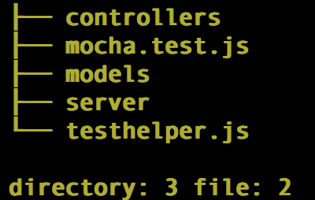
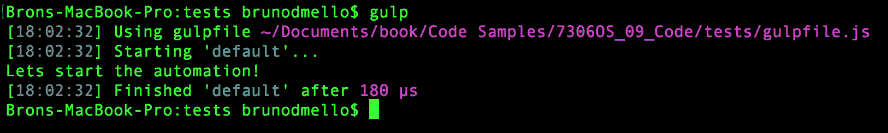

# 九、测试你的代码

到目前为止，在编写代码时，我们基本上都是靠自己的直觉。 在真正的浏览器中测试之前，我们根本无法知道代码是否有效。

在本章中，我们将涵盖以下主题:

*   使用 Mocha 测试框架运行测试
*   使用 Chai.js 断言库编写测试
*   西农和代理人的间谍和存根
*   编写第一个测试
*   测试您的应用

测试可以很好地确保代码正常运行，但它也可以防止由于您对一些毫无防备的代码做了一点小小的更改而突然出现新的、意想不到的错误。

# 贸易工具

让我们先来看看我们将用于运行和编写测试的各种工具和库。 在真正开始编写真正的测试之前，我们需要了解三个主要概念。

第一个是测试运行器，或者我们用来运行测试套件的框架。

大多数框架遵循**测试驱动开发**(**TDD**)，它们的过程依赖于以下步骤:

1.  它定义了一个单元测试。
2.  它实现了单元。
3.  它执行测试并验证测试是否通过。

第二个概念是断言库本身——我们用来编写测试的语言。 在预期行为的指导下，使用断言语言以增量方式设计和构建功能块的一个特殊版本是**行为驱动开发**(**BDD**)。

对于 TDD 和 BDD，我们都可以使用 Mocha 测试框架; 但是，我们将使用称为`Chai.js`的特殊断言库编写断言。

最后，我们将看看间谍和存根的思想，它们是代码的某些部分的虚假代表，当我们需要跟踪函数调用以确保预期的行为时，会依赖它们。

# 使用 Mocha 框架运行测试

在为应用编写测试时，通常以特定于模块的批处理方式编写它们。 这些批被称为套件或规格。 每个套件通常包含一批以几乎反映应用本身的方式组织的测试。 对于 Node，其思想没有什么不同，我们编写的每个测试套件都是特定于单个模块的。 您将要求要测试的模块，并为模块功能的每个部分编写一组测试。

由于您将有许多不同的测试文件测试应用的每个组件，因此您需要一种快速执行所有测试的方法。 这就是测试运行器的作用。 我们决定使用的测试运行程序名为 Mocha。 你可以全局安装 Mocha，就像其他的`npm`包一样，如下所示:

```js
    $ npm install -g mocha
```

在 Linux 或 OS X 上安装时，您可能需要安全特权，只需在`npm`之前使用`sudo`即可。

安装之后，Mocha 命令行工具就可以使用了。 简单地从命令行执行`mocha`将使用一些默认选项执行测试运行。

测试运行程序将查找一个名为`test`的文件夹和其中的任何`.js`文件。 在本例中，我们实际上还没有设置任何测试，因此单独执行`mocha`不会完成任何任务; 相反，它会抛出以下错误:

```js
 cannot resolve path
```

当 Mocha 测试运行器找到`.js`文件时，它会像执行其他 Node 文件一样执行这些文件，只是它会在文件中查找一些特定的关键字。

下面是一些典型测试块的示例代码:

```js
const expect = require('chai').expect; 
describe('The code', ()=>{ 
    beforeEach(()=>{ 
        // optional preparation for each test 
    }); 
    afterEach(()=>{ 
        // optional cleanup after each test 
    }); 

    it('should test something', ()=>{ 
        const something = 1; 
        // here we "expect" some condition to declare our test 
        // in this case, we expect the variable to exist 
        // more on the assertion syntax a little later 
        expect(something).to.exist; 
    }); 
    it('should test something_else', ()=>{ 
        const something_else = false; 
        // now we test a different variable against its value 
        // and expect that value to equal false 
        expect(something_else).to.equal(false); 
    }); 
}); 
```

Mocha 扫描文件的第一件事是`describe`块。 一个`describe`块是在一行中定义一组特定测试用例的方法。 在一个`test`文件中可以有许多`describe`块，每个`describe`块可以有许多特定的测试。 此外，`describe`块可以嵌套到您喜欢的深度，以便更好地组织您的测试。

一旦找到了`describe`块，就会在其中执行一些其他项目。 检查一个`beforeEach`和`afterEach`块，以查看在每个测试执行之前是否有需要执行的预测试工作。 同样，在测试之间需要进行的任何清理都可以在`afterEach`块中处理。

这两个块都是可选的，因此不是必需的。 关于何时需要使用`beforeEach`块的一个很好的例子是，如果您需要实例化将要测试的对象——您将希望在每次测试之前创建一个新的实例。 这样，无论测试可能将什么更改推入对象，都将被重置，并且不会无意中影响任何其他测试。 同样地，在测试期间对任何其他相关对象所做的任何更改都可以在`afterEach`块期间进行重置。

在`describe`块中，定义单个测试是用`it`语句完成的。 在每个`it`声明,它通常被认为是良好的实践包括一个`expect`坚持实际测试(尽管你可以包括尽可能多的`expect`函数调用,它仍然只考虑一个简单的测试,因为单`it`)。

我们在编写套件时使用 BDD 风格的语法，这使得我们的测试读起来像用户故事。 使用前面的测试片段，您可以将测试读取为`The code should test something`和`The code should test something_else`。 事实上，如果我们运行之前的测试，我们将看到以下输出:

```js
      The code
         should test something
         should test something_else

      2 passing (5ms)
```

# 使用 Chai.js 断言测试

正如您在前面的单元测试示例中看到的，我们使用特殊的块来用 Mocha 定义测试组，但在定义实际的单个测试时，我们使用了一种单独的语言。 这些测试称为**断言**，我们选择使用`Chai.js`库。 这纯粹是个人偏好，因为存在许多不同的断言库。 每个库做的基本上是相同的事情，只是在实际编写测试的语法和风格上略有不同。 由于`Chai.js`是特定于项目的，并且基于个人偏好，我们将把它作为项目依赖项安装(而不是全局安装)。 另外，由于运行应用实际上并不需要我们的测试，所以我们将在`package.json`文件的`devDependencies`列表下包含`Chai.js`。

在开发人员的机器上执行`npm install`将生成所有正常依赖项下的包，以及`devDependencies`从`package.json`生成的`devDependencies`。 当环境变为生产环境时，我们将需要执行`npm install --prod`来指定环境。

这将帮助`npm`在依赖项下安装包，而不是`package.json`中的`devDependencies`。 为了将`Chai.js`作为`devDependency`包含在我们的项目中，我们将在执行`npm`安装时使用`--save-dev`标志而不是`--save`:

```js
    $ npm install --save-dev chai
```

# 从 Chai 开始

Chai 本身有几种不同的 API 风格，可以在编写测试时使用。 BDD API(我们将在编写的测试中使用)使用了`expect`和`should`。 还有断言 API，它更像 TDD 风格。 在`expect`/`should`中使用 BDD 样式的好处是，您可以链接断言方法以提高测试的可读性。

You can learn more about BDD and TDD by accessing the following Wikipedia page:
[http://en.wikipedia.org/wiki/Behavior-driven_development](http://en.wikipedia.org/wiki/Behavior-driven_development)

使用带有`Chai.js`的 BDD 断言 API 提供了许多可供使用的方法，如`to`、`be`、`is`等。 它们没有测试功能，但是它们提高了断言的可读性。 所有的 getter 列于[http://chaijs.com/api/bdd/](http://chaijs.com/api/bdd/)。

所有这些 getter 都将遵循`expect()`语句，并可以与`not`结合使用，以防止我们想要否定断言。

前面的 getter 与`chai`断言方法(如`ok`、`equal`、`within`等)相结合，以确定测试的结果。 所有这些方法都列在[http://chaijs.com/api/assert/](http://chaijs.com/api/assert/)。

让我们开始构造简单的断言。 `chai`提供了三种不同的断言风格:`expect`、`should`和`assert`。 考虑以下简单的例子:

```js
const chai = require('chai'); 
const expect = chai.expect; 
const should = chai.should(); 
const assert = chai.assert; 
const animals = { pets: [ 'dog', 'cat', 'mouse' ] }; 
const foo = 'bar'; 

expect(foo).to.be.a('string').and.equal('bar'); 
expect(animals).to.have.property('pets').with.length(4); 
animals.should.have.property('pets').with.length(4); 
assert.equal(foo, 'bar', 'Foo equal bar'); 
```

如你所见，`expect`/`should`函数是基于自我描述语言链的。 两者的声明方式不同——`expect`函数提供了链的起点，而`should`接口扩展了`Object.prototype`。

`assert`接口提供了简单但功能强大的 TDD 风格断言。 除了前面产生深层相等断言的示例之外，还可以使用异常测试和实例。 更深入的学习，请参考 Chai 文档[http://chaijs.com/api](http://chaijs.com/api)。

# 间谍和存根与 Sinon.js

如果没有一种简单的方法来`spy`处理函数并知道它们何时被调用，那么测试代码将会非常困难。 此外，当您的一个函数被调用时，最好知道传递给它的参数和返回的参数。 在测试中，`spy`是一个特殊的占位符函数，当您想要特别检查`it`是否/何时被调用时，它将替换现有函数。 当一个函数被调用时，间谍会跟踪它的一些属性，他们还可以传递原始函数的预期功能。 `Sinon.js`库同时提供`spy`和`stub`功能，范围非常广泛。 为了获得这个强大框架中可用的不同选项的完整列表，我强烈建议您花些时间阅读[http://sinonjs.org/docs](http://sinonjs.org/docs)中的文档。

由于我们将在测试中使用`Sinon.js`，我们应该将其安装为另一个`devDependency`，就像我们使用`Chai.js`一样。 此外，我们还应该安装`sinon-chai`helper，它提供额外的`chai`断言动词，专门用于 Sinon:

```js
    $ npm install --save-dev sinon sinon-chai
```

包含`sinon-chai`允许我们编写特殊的断言，例如`to.be.calledWith`，否则单独使用`chai`就无法工作。

假设你有一个函数，它简单地将两个数字相加并返回总和:

```js
let sum = (a, b) => {
    return a + b;
}
let doWork = () => {
    console.log("asdasd")
    const x = 1,
        y = 2;
    console.log(sum(x, y));
} 
```

在为`doWork`函数编写测试时，我们希望断言`sum`函数已经被调用。 我们不需要关心函数的作用或者它是否有效; 我们只是想确保——因为`doWork`依赖于`sum`——它实际上调用了`function()`函数。 在这个场景中，我们可以确定的唯一方法是，是否有方法监视`sum`函数，并知道是否调用了它。 使用`spy`，我们可以做到:

```js
const chai = require('chai');
const expect = chai.expect; 
const sinon = require("sinon"); 
const sinonChai = require("sinon-chai"); 
chai.use(sinonChai); 

describe('doWork', ()=>{ 
    let sum; 

    it('should call sum', ()=>{ 
        sum = sinon.spy(); 
        doWork(); 
        expect(sum).to.be.calledWith(1,2); 
    }); 
}); 
```

在上述场景中，将`sum`功能替换为`spy`功能。 所以它的实际功能将不复存在。 如果我们想确保`sum`函数不仅被监视，而且仍然按我们期望的方式运行，我们需要在`sinon.spy()`之后加上`.andCallThrough()`:

```js
describe('doWork', ()=>{ 
    let sum; 
    console.log = sinon.spy(); 

    it('should call sum', ()=>{ 
        sum = sinon.spy().andCallThrough(); 
        doWork(); 
        expect(sum).to.be.calledWith(1,2); 
        expect(console.log).to.be.calledWith(3); 
    }); 
}); 
```

注意,通过包括`andCallThrough``sum`间谍,不仅我们可以监视它,断言,它被称为,还监视`console.log`函数和断言,它被称为`sum`返回正确的值。

`spy`通常只是一个函数的监视者，并且只报告函数是否被调用，`stub`允许您在测试执行期间动态地为函数提供自定义功能。 测试存根被认为是预先编程的行为函数，用于测试应用中作为模块依赖项所需的包装样板代码。

把`stub`想象成一个超级间谍，它报告与`spy`相同的事情，但也执行你想要的任何特定任务。 使用相同的例子，让我们存根`sum`函数，以始终返回相同的值:

```js
it('should console.log sum response', ()=>{ 
    // replace the existing sum function with a new stub, 
    // a generic function that does exactly what we specify 
    // in this case always just return the number 2 
    sum = sinon.stub(()=>{ 
        return 2; 
    });

    // lets replace the standard console.log function 
    // with a spy 
    console.log = sinon.spy(); 
    // call our doWork function (which itself uses console.log) 
    doWork(); 
    // and if doWork executed the way its supposed to, console.log 
    // should have been called and the parameter 2 passed to it 
    expect(console.log).to.be.calledWith(2); 
}); 
```

当函数执行的工作可能会产生意想不到的结果，并且您只是想为了测试的目的强制响应时，对函数进行存根处理是很好的。 当您在进行 TDD 并对尚未编写的函数进行测试时，存根也很方便。

# 使用 Proxyquire 对Node模块进行存根

当针对同一个模块中的代码编写测试时，间谍和存根非常有用，但是当您需要监视或存根另一个 Node 模块中需要的模块时，事情就变得有点棘手了。 幸运的是，有一个叫做**Proxyquire**的工具，它允许你存根代码中需要的模块。

检查以下代码示例:

```js
// google.js 
const request = require('request'),
  sinon = require("sinon"),
  log = sinon.spy();

module.exports =()=>{ 
    request('http://www.google.com', (err, res, body)=>{ 
        log(body); 
    }); 
} 
```

您可以看到，我们需要`request`模块。 `request`模块接受两个参数，其中一个是`callback`函数。 这就是事情开始变得棘手的地方。 在这种情况下，我们将如何实现间谍和/或存根? 此外，如何防止测试显式地进行网络调用以获取`google.com`? 当我们运行测试时，如果`google.com`down (ha!)怎么办?

为了能够监视`request`模块，我们需要一种方法来拦截实际的`require`，并将我们自己的`request`存根版本连接起来。 `request`模块实际上是您想要存根的模块的一个很好的例子，因为`request`用于进行网络调用，而这正是您想要确保您的测试永远不会真正进行的事情。 您不希望您的测试依赖于外部资源，如网络连接或依赖于从实时请求返回的数据。

使用 Proxyquire，我们实际上可以设置测试，使它们拦截`require`模块，并用我们自己的存根替换执行的内容。 下面是一个针对我们之前创建的模块编写的测试文件:

```js
//google.spy.js
const sinon = require("sinon"),
proxyquire = require('proxyquire'),
log = sinon.spy(), 
requestStub = sinon.stub().callsArgWith(1, null, null, 'google.com'), 
google = proxyquire('./google', { 'request': requestStub }); 

describe('google module', ()=>{ 
    beforeEach(()=>{ 
        google(); 
    }); 
    it('should request google.com', ()=>{ 
        expect(reqstub).to.be.called(); 
    }); 
    it('should log google body', ()=>{ 
        expect(callback).to.be.calledWith(null, null, 'google.com'); 
    }); 
}); 
```

测试套件要做的第一件事是设置一个`spy`和一个通用的`stub`函数，该函数将用作`request`模块。 然后，我们包含我们的`google`模块，但是我们使用`proxyquire`而不是典型的`require`模块。 使用`proxyquire`，我们将路径传递给模块的方式与使用`require`相同，只是第二个参数是该模块中需要的模块和`stub`函数。

在每次测试之前，我们将执行原始的`google`模块，并针对我们的`stub`断言它实际上被调用了。 此外，我们断言，无论从`request`模块返回什么数据，都可以调用`log`间谍。 因为我们在控制模块,我们可以测试,毫不夸张地说,当一个请求返回的字符串`google.com`是被迫`http://google.com`(我们知道事实并非如此——不仅如此,但是我们知道网络电话从未送到`www.google.com`,)。

我们使用了`stub`的特殊功能，它允许我们对存根函数执行特定的参数，假设它是`callback`函数。 在这里，我们使用`callsArgWith`并包含参数`index`(从零开始)作为第一个参数; 在本例中，传递给请求的两个参数之一，第一个(索引 0)是 URL 本身，第二个(索引 1)是`callback`函数。 使用`callsArgWith`，我们可以执行`callback`函数并具体提供其参数，在本例中为`null`、`null`和一个字符串。 和`Sinon.js`、`Chai.js`一样，`proxyquire`也需要包括在我们的项目中，因为`devDependency`:

```js
    $ npm install --save-dev proxyquire
```

# 编写并运行您的第一个测试

到目前为止，我们看到的所有测试代码都只是演示和示例，实际上我们并没有运行任何测试。 让我们设置应用的基本结构，以便开始编写真正的测试。

首先要做的是设置文件夹结构，以容纳我们所有的测试。 考虑以下步骤:

1.  在应用项目文件夹的根目录中，创建一个名为`tests`的文件夹。
2.  在`tests`文件夹中，为`controllers`、`models`和`server`再创建三个文件夹:

```js
/(existing app root) 
tests/ 
----/controllers/ 
----/models/ 
----/server/ 
```

# 编写测试助手

在我们开始为我们的应用编写测试之前，我们需要为我们的测试准备少量的开销。 为了处理这些开销，我们将编写一个包含`testhelper`的文件，并与通过 Mocha 执行的每个测试文件一起运行。

在`tests`文件夹中创建一个名为`testhelper.js`的文件，并插入以下代码块:

```js
const chai = require('chai'), 
    sinon = require('sinon'), 
    sinonChai = require('sinon-chai'); 

global.expect = chai.expect; 
global.sinon = sinon; 
chai.use(sinonChai); 
```

这是我们通常需要包含在每个测试文件顶部的代码; 然而，通过将它包含在单个文件中，我们可以指示 Mocha 自动为每个运行的测试文件要求这个文件。 文件本身只包含了`chai`和`sinon`模块，并定义了一些全局变量作为编写测试的快捷方式。 此外，它指示`chai`使用`sinonChai`模块，以便扩展语法，可以编写特定于 sinon 的 Chai 断言。 实际运行测试套件的命令如下:

```js
    $ mocha -r tests/testhelper.js -R spec tests/**/*.test.js
```

Remember that we installed Mocha globally earlier so that we can execute the `mocha` command from anywhere.

根据前面命令中测试的路径，假设该命令将从应用项目文件夹的根目录执行。 `-r`标志指示 Mocha 需要`testhelper.js`模块。 标志是定义测试报告输出样式的选项。 我们选择使用`spec`样式，它以嵌套的缩进样式列出我们的报告，每个`describe`和`it`语句，以及一个绿色的复选标记表示通过的测试。 最后，最后一个参数是`test`文件的路径; 在本例中，我们提供了通配符，以便运行所有测试。

Mocha has a few different reporting styles that you can choose from. These include dot (repeating dots for each test), list, progress (a percentage bar), JSON, and spec. One of the more interesting, albeit somewhat useless, is the `-R nyan` reporting style.

让我们编写一个快速的示例测试，以确保正确地设置了我们的项目。 在`tests`文件夹中，创建一个名为`mocha.test.js`的新文件，并包含以下代码:

```js
describe('Mocha', ()=>{
    'use strict';

    beforeEach(()=>{});

    describe('First Test', ()=>{
        it('should assert 1 equals 1', ()=>{
            expect(1).to.eql(1);
        });
    });
});

```

前面的测试非常简单，它断言`1`等于`1`。 保存该文件并再次运行`Mocha`test 命令，您应该会得到以下输出:

```js
    $ mocha -r tests/testhelper.js -R spec tests/mocha.test.js
    Mocha
      First Test
         should assert 1 equals 1

    1 passing (5ms)

```

您可能会发现，为`Mocha`记住并执行那个又长又复杂的命令会令人感到厌烦和沮丧。 幸运的是，有一个相当简单的解决方案。 在应用中编辑`package.json`文件，并添加以下部分:

```js
"scripts": { 
    "start": "node server.js", 
    "test": "mocha -r tests/testhelper.js -R spec 
      tests/**/*.test.js" 
  }, 
```

通过在`package.json`文件中进行此调整，您现在可以简单地从命令行作为快捷方式执行`npm test`。 这是`package.json`文件的标准约定，因此任何开发人员都知道如何简单地执行`npm test`:

```js
    $ npm test
    > chapter9@0.0.0 test /Users/jasonk/repos/nodebook/chapter9
    > mocha -r tests/testhelper.js -R spec tests/**/*.test.js

    Mocha
      First Test
         should assert 1 equals 1

    1 passing (5ms)

```

现在我们的项目已经设置为正确运行和执行测试，让我们开始为应用编写一些真正的测试。

# 测试应用

了解了所有这些背景信息之后，让我们将重点放在为所构建的应用编写一些实际的测试上。 在下面的部分中，我们将为应用中的路由、服务器、模型和控制器编写测试。

# 测试路线

让我们先来看看应用中最基本的文件之一`routes.js`。 这个文件只是定义了应用应该响应的路由数量。 这将是最容易编写测试的文件之一。

由于`routes.js`文件位于主应用中的`server`文件夹中，所以让我们将其对应的测试文件放在类似的位置。 在`tests/server`文件夹中，创建一个名为`routes.test.js`的文件。 由于`routes.test.js`文件将测试`routes.js`文件的功能，我们将需要它对`require`相同的模块进行测试。

在`test/server/routes.test.js`中包含以下代码:

```js
const home = require('../../controllers/home'), 
    image = require('../../controllers/image'), 
    routes = require('../../server/routes'); 
```

注意，路径是不同的，因为我们需要来自`test/server`文件夹的模块，但我们也需要特定于应用的模块。 另外，请注意，除了原始的`routes.js`文件需要的模块外，我们还需要`routes`模块本身。 如果不包含该模块，我们还能如何测试它的功能? 接下来，让我们设置测试套件的结构并创建一些间谍。 在`tests/server/routes.test.js`中包含这个新的代码块:

```js
describe('Routes',()=>{ 
    let app = { 
        get: sinon.spy(), 
        post: sinon.spy(), 
        delete: sinon.spy() 
    }; 
    beforeEach(()=>{ 
        routes.initialize(app); 
    }); 

    // to do: write tests... 
}); 
```

如果您还记得，`routes`模块的`initialize`函数接受单个参数`app`对象。 在我们的测试中，我们将`app`定义为一个简单的匿名对象，它有三个函数:`get`、`post`和`delete`; 每一个都是`spy`。 我们在每次测试运行之前都包含一个`beforeEach`块来执行`initialize`函数。

现在，让我们加入一些测试。 首先，我们将测试`GET`端点是否正确配置。 紧跟在`// to do: write tests...`注释之后，放置以下代码块:

```js
describe('GETs',()=>{ 
    it('should handle /', function(){ 
        expect(app.get).to.be.calledWith('/', home.index); 
    }); 
    it('should handle /images/:image_id', ()=>{ 
        expect(app.get).to.be.calledWith('/images/:image_id', 
         image.index); 
    }); 
}); 
```

然后，测试`POST`端点:

```js
describe('POSTs', ()=>{
    it('should handle /images', ()=>{
        expect(app.post).to.be.calledWith('/images', image.create);
    });
    it('should handle /images/:image_id/like', ()=>{
        expect(app.post).to.be.calledWith('/images/:image_id/like', image.like);
    });
    it('should handle /images/:image_id/comment', ()=>{
        expect(app.post).to.be.calledWith('/images/:image_id/comment', image.comment);
    });
}); 
```

最后，测试`DELETE`端点:

```js
describe('DELETEs', ()=>{
    it('should handle /images/:image_id', ()=>{
        expect(app.delete).to.be.calledWith('/images/:image_id', image.remove);
    });
}); 
```

这些测试都断言相同的事情，即`app`对象对应的`get`、`post`或`delete`函数在执行时为每条路由配置了正确的参数。 我们能够根据参数进行测试，因为我们使用的`app`对象是`spy`。

如果您运行`mocha`命令来执行测试套件，您应该看到以下输出:

```js
    $ npm test
    Routes
        GETs
           should handle /
           should handle /images/:image_id
        POSTs
           should handle /images
           should handle /images/:image_id/like
           should handle /images/:image_id/comment
        DELETEs
           should handle /images/:image_id

      6 passing (14ms)
```

# 测试服务器

测试`server.js`文件将与我们的任何其他文件略有不同。 该文件作为应用的根运行，因此它不会导出我们可以直接测试的模块或任何对象。 由于我们使用`server.js`启动服务器，所以我们需要从代码中模拟服务器的启动。 我们将创建一个名为`server`的函数，它将使用`proxyquire`和`stub`需要的每个模块来使用`server.js`文件。 执行`server()`函数与从命令行执行Node`server.js`完全相同。 文件中的所有代码都将通过该函数执行，然后我们可以测试从`proxyquire`中使用`stub`s 进行的每个调用。

在`tests/server/`文件夹中创建一个名为`server.test.js`的文件，并插入以下代码块:

```js
let proxyquire, expressStub, configStub, mongooseStub, app, 
    server = function() { 
        proxyquire('../../server', { 
            'express': expressStub, 
            './server/configure': configStub, 
            'mongoose': mongooseStub 
        }); 
    }; 

describe('Server',()=>{ 
    beforeEach(()=>{
        proxyquire = require('proxyquire'),
        app = {
            set: sinon.spy(),
            get: sinon.stub().returns(3300),
            listen: sinon.spy()
        },
        expressStub = sinon.stub().returns(app),
        configStub = sinon.stub().returns(app),
        mongooseStub = {
            connect: sinon.spy(),
            connection: {
                on: sinon.spy()
            }
        };

        delete process.env.PORT;
    }); 

    // to do: write tests... 
}); 
```

在为我们的服务器运行每个测试之前，我们重置服务器的所有主要组件的存根。 这些存根包括`app`对象、`express`、`config`和`mongoose`。 我们对每个模块进行存根，因为我们想对它们进行`spy`处理(我们使用`stub`是因为其中一些模块需要返回我们将在文件中处理的对象)。 现在我们所有的间谍都就位了，我们的`app`对象支架也建立起来了，我们可以开始测试代码的主要功能了。

我们将需要检查以下条件是否通过:

创建一个应用

*   设置 views 目录
*   端口被设置，可以被配置和/或设置为默认
*   应用本身是配置好的(用它调用`config`)
*   Mongoose 连接到一个数据库 URI 字符串
*   应用本身启动

用下面的代码块替换前面代码中的`// to do: write tests...`注释:

```js
describe('Bootstrapping', ()=>{
    it('should create the app', ()=>{
        server();
        expect(expressStub).to.be.called;
    });
    it('should set the views', ()=>{
        server();
        expect(app.set.secondCall.args[0]).to.equal('views');
    });
    it('should configure the app', ()=>{
        server();
        expect(configStub).to.be.calledWith(app);
    });
    it('should connect with mongoose', ()=>{
        server();
        expect(mongooseStub.connect).to.be.calledWith(sinon.match.string);
    });
    it('should launch the app', ()=>{
        server();
        expect(app.get).to.be.calledWith('port');
        expect(app.listen).to.be.calledWith(3300, sinon.match.func);
    });
}); 
```

在前一组测试中，我们测试了服务器的引导，这是最初在`server.js`中运行的所有功能。 测试的名称是非常不言自明的。 我们检查了`app`对象的各种方法，确保调用了它们和/或传入了正确的参数。 对于测试，我们希望测试调用了特定类型的参数，而不是参数值的字面意思; 我们使用了 Sinon 的 match 元素，这使得我们的测试更加通用。 我们不想硬编码 MongoDB URI 字符串在我们的测试中,因为这只是另一个地方我们必须保持——尽管你很可能这样做如果你希望您的测试严格的(也就是说,断言的 URI 字符串通过毫不夸张地说)。

在第二组测试中，我们希望确保设置了端口，它的默认值为`3300`，并且它可以通过使用Node环境变量来更改:

```js
describe('Port', ()=>{
    it('should be set', ()=>{
        server();
        expect(app.set.firstCall.args[0]).to.equal('port');
    });
    it('should default to 3300', ()=>{
        server();
        expect(app.set.firstCall.args[1]).to.equal(3300);
    });
    it('should be configurable', ()=>{
        process.env.PORT = '5500';
        server();
        expect(app.set.firstCall.args[1]).to.equal('5500');
    });
}); 
```

这些测试就绪后，再次运行`npm test`命令，您应该会得到以下输出:

```js
    $ npm test 
    Server
        Bootstrapping
           should create the app (364ms)
           should set the views
           should configure the app
           should connect with mongoose
           should launch the app
        Port
           should be set
           should default to 3300
           should be configurable

```

# 测试模型

在测试我们的模型时，我们希望包含`model`模块本身，然后针对它编写测试。 这里最简单的解决方案是，我们创建一个测试`model`对象，然后断言模型拥有我们期望的所有字段，以及我们可能创建的任何虚拟字段。

创建`tests/models/image.test.js`文件并插入以下代码:

```js
let ImageModel = require('../../models/image'); 

describe('Image Model',()=>{ 
    var image; 

    it('should have a mongoose schema',()=>{ 
        expect(ImageModel.schema).to.be.defined; 
    }); 

    beforeEach(()=>{ 
        image = new ImageModel({ 
            title: 'Test', 
            description: 'Testing', 
            filename: 'testfile.jpg' 
        }); 
    }); 

    // to do: write tests... 
}); 
```

首先，我们使用`require`包含`ImageModel`(注意`require`语句的路径)。 我们运行的第一个测试是确保`ImageModel`具有 mongoose 模式属性。 在这个测试之后，我们定义了`beforeEach`块，其余的测试将依赖该块。 在每次测试之前，我们都想实例化一个可以测试的新`ImageModel`对象。 我们可以在`beforeEach`块中这样做，这样我们就可以确定我们在每个测试中处理的是一个新的对象，并且它没有被之前运行的任何测试污染。 还需要注意的是，第一个测试和`beforeEach`块的顺序实际上并不重要，因为`beforeEach`块将在它的父`describe`函数的每个测试之前运行，而不管它定义的顺序。

包含以下替换占位符`// to do: write tests...`注释的测试套件:

```js
describe('Schema', ()=>{
    it('should have a title string', ()=>{
        expect(image.title).to.be.defined;
    });
    it('should have a description string', ()=>{
        expect(image.description).to.be.defined;
    });
    it('should have a filename string', ()=>{
        expect(image.filename).to.be.defined;
    });
    it('should have a views number default to 0', ()=>{
        expect(image.views).to.be.defined;
        expect(image.views).to.equal(0);
    });
    it('should have a likes number default to 0', ()=>{
        expect(image.likes).to.be.defined;
        expect(image.likes).to.equal(0);
    });
    it('should have a timestamp date', ()=>{
        expect(image.timestamp).to.be.defined;
    });
}); 
```

这里，我们将检查以确保定义了我们期望`ImageModel`实例具有的每个属性。 对于设置了默认值的属性，我们还检查以确保也设置了默认值。

接下来，我们将测试我们期望`ImageModel`拥有的`virtuals`，并验证它们是否按预期的方式运行:

```js
describe('Virtuals', ()=>{
    describe('uniqueId', ()=>{
        it('should be defined', ()=>{
            expect(image.uniqueId).to.be.defined;
        });
        it('should get filename without extension', ()=>{
            expect(image.uniqueId).to.equal('testfile');
        });
    });
}); 
```

当测试`uniqueId`虚拟时，它应该返回`image`模型的文件名而不带扩展名。 由于`beforeEach`用`testfile.jpg`定义了我们的`image`模型，我们可以通过测试断言返回的`uniqueId`等于`testfile`(没有扩展名的文件名)。

为我们的模型运行测试应该会提供以下结果:

```js
    $ npm test
    Image Model
         should have a mongoose schema
        Schema
           should have a title string
           should have a description string
           should have a filename string
           should have a views number default to 0
           should have a likes number default to 0
           should have a timestamp date
        Virtuals
          uniqueId
             should be defined
             should get filename without extension

```

# 测试控制器

最后，让我们看看`image`控制器，并专门测试主要的`index`函数。 由于`index`函数执行大量工作并执行许多不同的任务，因此测试文件将大量使用存根和间谍。 在进行任何测试之前，我们需要做的第一件事是为我们的测试声明许多全局变量，并设置所有用于`proxyquire`的`stub`、间谍和占位符对象。 然后，我们使用`proxyquire`要求实际的图像控制器。 创建一个名为`tests/controllers/image.test.js`的文件，并插入以下代码:

```js
let proxyquire = require('proxyquire'), 
    callback = sinon.spy(), 
    sidebarStub = sinon.stub(), 
    fsStub = {}, 
    pathStub = {}, 
    md5Stub = {}, 
    ModelsStub = { 
        Image: { 
            findOne: sinon.spy() 
        }, 
        Comment: { 
            find: sinon.spy() 
        } 
    }, 
    image = proxyquire('../../controllers/image', { 
        '../helpers/sidebar': sidebarStub, 
        '../models': ModelsStub, 
        'fs': fsStub, 
        'path': pathStub, 
        'md5': md5Stub 
    }), 
    res = {}, 
    req = {}, 
    testImage = {}; 
```

通过这些代码，我们定义了许多全局变量，比如间谍、存根或空的占位符 JavaScript 对象。 一旦我们的`stub`s 准备好，我们将调用`proxyquire`以包含`image`控制器(确保`image`控制器中所需的模块实际上被我们的各种`stub`s 和间谍所替代)。 现在我们所有的全球人员，`stub`和间谍都准备好了，让我们加入一些测试。

在前面的代码块之后包含以下代码:

```js
describe('Image Controller', function(){ 
    beforeEach(()=>{ 
        res = { 
            render: sinon.spy(), 
            json: sinon.spy(), 
            redirect: sinon.spy() 
        }; 
        req.params = { 
            image_id: 'testing' 
        }; 
        testImage = { 
            _id: 1, 
            title: 'Test Image', 
            views: 0, 
            likes: 0, 
            save: sinon.spy() 
        }; 
    }); 
    // to do: write tests... 
}); 
```

同样，我们将使用`beforeEach`块为我们的测试构建一些设置。 这个设置监视`res`对象的每个函数，包括渲染、JSON 和重定向(每个函数都在`image`控制器中使用)。 我们通过使用`image_id`属性设置`req.params`对象来模拟查询字符串参数。 最后，我们将创建一个测试`image`对象，它将被我们的假猫鼬`image`模型存根用来模拟从 MongoDB 返回的数据库对象:

```js
describe('Index',()=>{ 
        it('should be defined', ()=>{
            expect(image.index).to.be.defined;
        });
        it('should call Models.Image.findOne', ()=>{
            ModelsStub.Image.findOne = sinon.spy();
            image.index(req, res);
            expect(ModelsStub.Image.findOne).to.be.called;
        });
        it('should find Image by parameter id', ()=>{
            ModelsStub.Image.findOne = sinon.spy();
            image.index(req, res);
            expect(ModelsStub.Image.findOne).to.be.calledWith(
                { filename: { $regex: 'testing' } },
                 sinon.match.func
            );
        }); 
    // to do: write more tests... 
}); 
```

我们运行的第一个测试是确保`index`函数实际存在。 在`index`功能中，发生的第一个动作是通过`Models.Image.findOne`功能找到`image`模型。 为了测试该函数，我们需要首先将其设置为`spy`。 我们在这里而不是在`beforeEach`中这样做的原因是，我们可能希望`findOne`方法在每个测试中的行为略有不同，因此我们不希望设置一个严格的规则用于所有测试。

为了模拟发送给服务器的`GET`调用以及图像`index`控制器函数，我们只需手动触发该函数。 我们使用`image.index(req, res)`完成此操作，并传入假的请求和响应对象(前面定义为全局对象，并在`beforeEach`函数中插入存根)。

由于`ModelsStub.Image.findOne`是一个间谍，我们可以测试它是否被调用，然后分别测试它是否被使用我们期望的参数具体地调用。 在`findOne`的情况下，第二个参数是一个回调函数，我们不关心或想要测试包含的非常特定的函数，而只是确保包含了一个实际的函数。 为此，我们可以使用 Sinon 的匹配器 API，并指定第二个参数包含一个 func 或 function。

最后一组`tests`测试在找到图像并从`findOne`函数返回图像时执行的代码:

```js
describe('with found image model', ()=>{
    beforeEach(function(){
        ModelsStub.Image.findOne =
            sinon.stub().callsArgWith(1,null,testImage);
    });
    it('should incremement views by 1 and save', ()=>{
        image.index(req, res);
        expect(testImage.views).to.equal(1);
        expect(testImage.save).to.be.called;
    });
    it('should find related comments', ()=>{
        image.index(req, res);
        expect(ModelsStub.Comment.find).to.be.calledWith(
            {image_id: 1},
            {},
            { sort: { 'timestamp': 1 }},
            sinon.match.func
        );
    });
    it('should execute sidebar', ()=>{
        ModelsStub.Comment.find =
            sinon.stub().callsArgWith(3, null, [1,2,3]);
        image.index(req, res);
        expect(sidebarStub).to.be.calledWith(
            {image: testImage, comments: [1,2,3]}, sinon.match.func);
    });
    it('should render image template with image and comments', ()=>{
        ModelsStub.Comment.find = sinon.stub().callsArgWith(3, null, [1,2,3]);
        sidebarStub.callsArgWith(1, {image: testImage, comments: [1,2,3]});
        image.index(req, res);
        expect(res.render).to.be.calledWith('image', {image: testImage, comments: [1,2,3]});
    });
}); 
```

首先要注意的是，`findOne`在这些测试中不再是一个间谍，而是一个存根，它将手动触发作为其第二个参数提供的回调函数。 被触发的回调函数将包括我们的测试`image`模型。 通过这个存根，我们模拟数据库调用实际上是通过`findOne`进行的，并且返回了一个有效的`image`模型。 然后，我们可以测试在主回调中执行的其余代码。 我们对`Comment.find`调用执行类似的设置。

当`sidebarStub`被执行时，我们使用`callsArgWith`Sinon 函数，它触发最初作为参数包含的回调函数。 在该回调函数中，我们将假的`viewModel`作为参数。

一旦`sidebarStub`完成了它的工作，我们期望`res.render`已经被调用，并且我们指定了期望它被调用的确切参数。

运行`image`控制器的测试应该会产生以下输出:

```js
    $ npm test
    Image Controller
        Index
           should be defined
           should call Models.Image.findOne
           should find Image by parameter id
          with found image model
             should incremement views by 1 and save
             should find related comments
             should execute sidebar
             should render image template with image and comments

```

# 监视并销毁一切!

当有疑问时，在编写测试时，最安全的做法是监视所有内容并存根其他内容。 总有一些时候你想让函数自然地执行; 在这种情况下，不要管它。 最终，您永远不希望您的测试依赖于任何其他系统，包括数据库服务器、其他网络服务器、其他 api 等等。 您只想测试您自己的代码是否工作，仅此而已。 如果期望您的代码调用 API，那么监视实际的调用并断言您的代码试图调用该调用。 同样地，通过存根伪造来自服务器的响应，并确保您的代码正确地处理响应。

检查代码中依赖关系的最简单方法是停止运行任何其他服务(本地Node应用等)，甚至可能禁用网络连接。 如果您的测试超时或在某个地方意外失败，很可能是因为您在测试过程中漏掉了需要监视或存根的函数。

在编写测试时，不要陷入兔子洞。 人们很容易忘乎所以，并开始测试可以安全地假定可以工作的功能。 这方面的一个例子是编写测试以确保第三方模块正确执行。 如果它不是您编写的模块，就不要测试它。 不要担心编写测试来证明模块做了它应该做的事情。

为了在编写 JavaScript 时了解更多关于 TDD 的知识，我强烈建议您阅读 Christian Johansen 的《测试驱动的 JavaScript 开发》一书*。 这本书非常庞大，讲述了与 TDD 相关的海量信息。 在某些圈子里，TDD 确实是一种生活方式，它将定义您编写代码时使用的风格。*

# 自动化的一切

没有 Gulp，测试自动化从来都不容易。 Gulp 是一个开源 JavaScript 库，它提供了高效的构建创建过程，并用作任务运行器。 我们将使用 Gulp 通过终端中的单个命令来自动化我们的单元测试。

让我们开始使用以下命令安装所有必需的包:

```js
npm install gulp-cli -g
npm install gulp --save-dev
touch test/gulpfile.js
gulp --help
```

注意，您可能需要根访问权限来安装`gulp-cli`的全局包。 在这种情况下使用`sudo`，例如`sudo npm install gulp-cli -g`。 我们使用`--save-dev`在本地安装 Gulp，并将其作为开发依赖项保存在`package.json`中。

此外，我们在`test`目录中创建了一个 Gulp 文件。 现在，到我们的应用的目录`test`，并确保我们有以下文件结构:



一旦我们安装了所需的包并创建了 Gulp 文件，让我们开始编写一些代码，如下所示:

```js
var gulp = require('gulp');
gulp.task('default', function() {
console.log("Lets start the automation!")
});
```

返回终端，运行 Gulp，你会收到如下输出:



Gulp is faster and simpler; why?: Gulp uses node.js streams to pass a data chunk through a series of the piped plugin. This accelerates the in-memory process operations and performs the write operation at the end of the task, once and for all.

让我们准备好扩展学习 Gulp 的范围，并自动化我们在前面小节中介绍的单元测试。 我们将从安装其他必需的 npm 包开始。 注意，我们需要将它们安装在我们的`project`文件夹中，而不是`test`文件夹中。 因此，让我们使用`cd..`返回一步，并确保您处于项目的根级别，并运行以下命令:

```js
npm install gulp-mocha --save-dev
```

`gulp-mocha`是一个运行`mocha`测试文件的插件。 现在，让我们修改 Gulp 文件并添加一些 es6 香料，如下所示:

```js
const gulp = require('gulp');
const gulpMocha = require('gulp-mocha')
gulp.task('test-helper',()=>gulp.src('./testhelper.js'))
gulp.task('test-server', ['test-helper'],()=>{
return gulp.src('./server/server.test.js')
.pipe(gulpMocha())
});
```

现在，运行`gulp test-server`以获得以下输出:


让我们讨论前面的代码是如何工作的。 首先，我们创建了`test-helper`任务，该任务读取内存中的`testhelper.js`文件，除了存储测试`server.test.js`所需的全局变量外，其他什么都不做。

我们使用 mocha 作为框架来编写测试用例。 `gulpMocha`插件通过读取`server.test.js`文件在内存中运行测试用例，并在终端中传输输出。 要详细了解`gulp-mocha`，请点击[https://github.com/sindresorhus/gulp-mocha](https://github.com/sindresorhus/gulp-mocha)链接。

如果需要，请注意如何编写依赖项的语法结构。 让我们通过再写一个任务来明确添加一个依赖项，如下所示:

```js
gulp.task('test-routes', ['test-helper', 'test-server'],()=>{
return gulp.src('./server/routes.test.js')
.pipe(gulpMocha())
});
```

这次我们将运行`gulp test-routes`。

现在，一个关于管理这么多任务的问题可能会出现。 Gulp 还提供了一种一次性自动化所有任务的解决方案。 让我们将以下代码片段添加到我们的文件中:

```js
gulp.task('build', ['test-helper', 'test-server','test-routes'])
```

运行上述命令; Gulp`build`和单元测试的自动化现在都已经完成。 进一步，我们可以添加所有的控制器和各自的模型，从而实现基于项目的测试用例自动化。

# 总结

这绝对是一个关于测试的速成课程，但是基础已经奠定，我希望您对可以用来编写自己测试的工具链有一个坚实的理解。 相信这个强大的工具套件，您将在任何时候编写防弹代码!

编写测试的最终目标是拥有 100%的完整代码覆盖率，并且为您编写的每一行代码都存在单元测试。 从这里开始，真正的测试是切换到 TDD，它规定在任何代码存在之前编写测试。 显然，针对不存在的代码的测试将会失败，因此您将需要编写最少的代码以使其通过，并重复!

在下一章中，我们将看看一些基于云的托管选项，以使您的应用启动并在线运行。